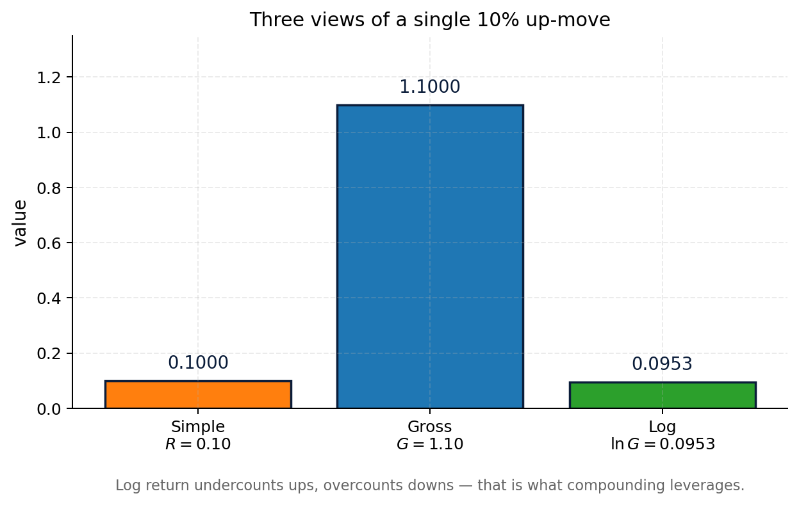
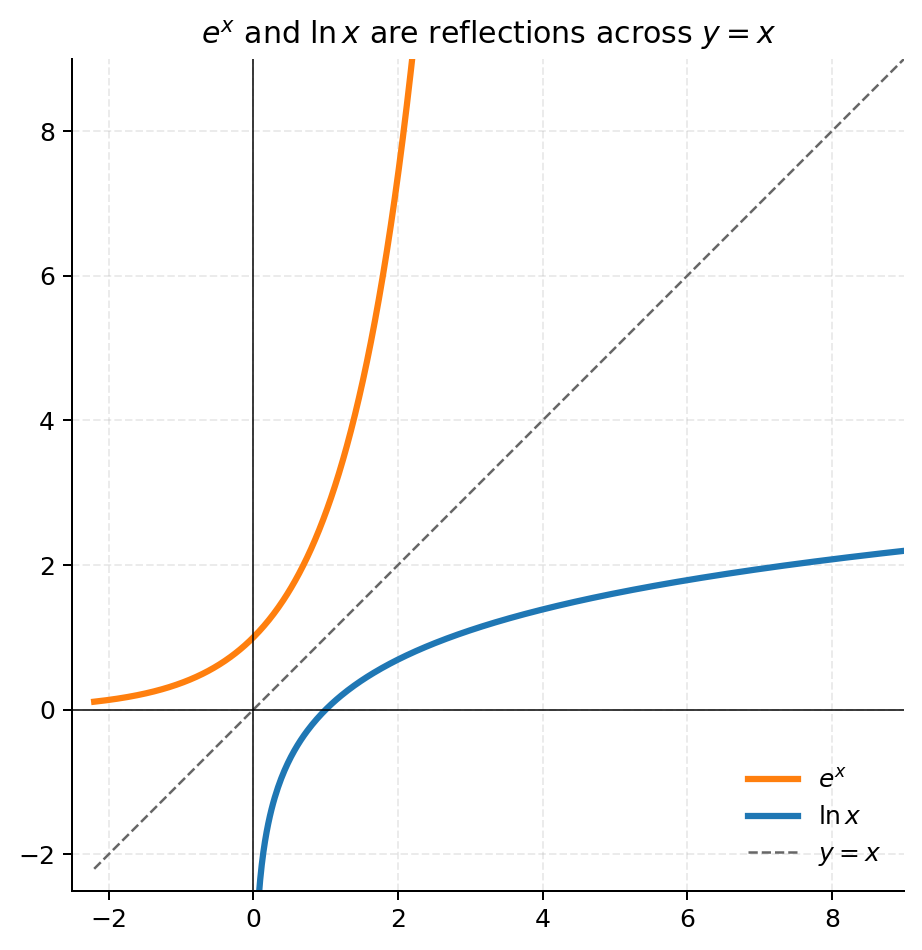
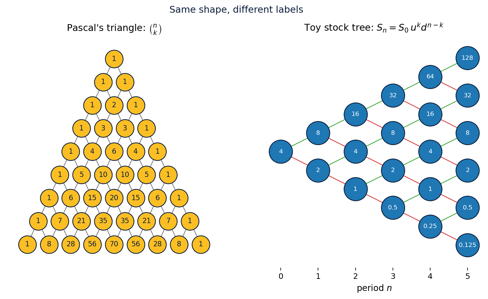
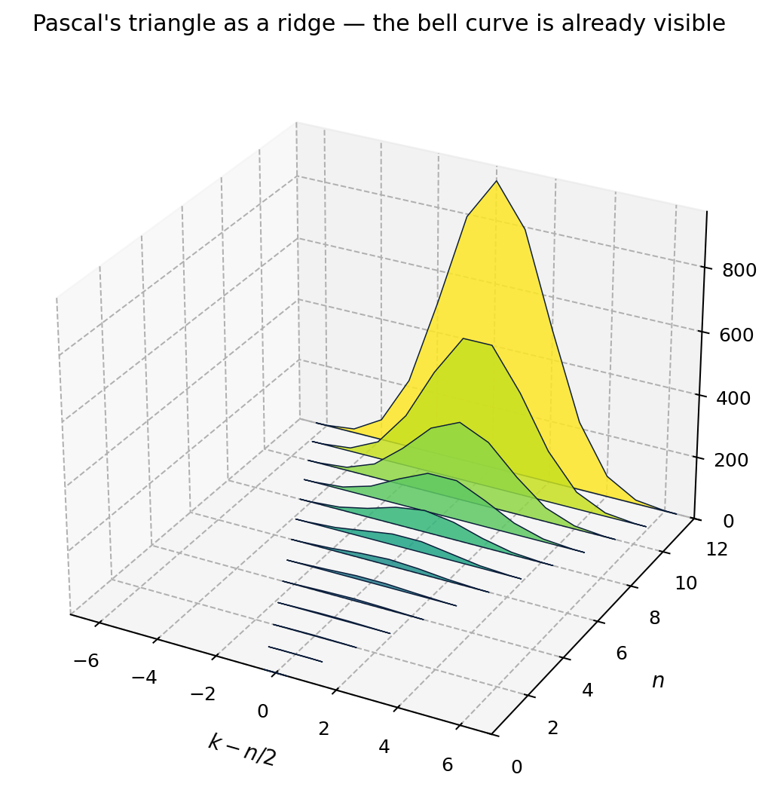
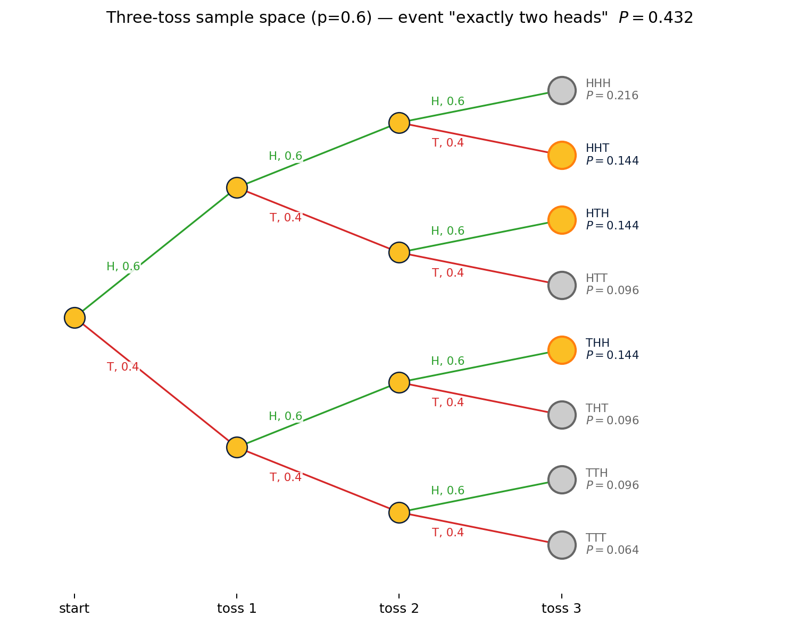
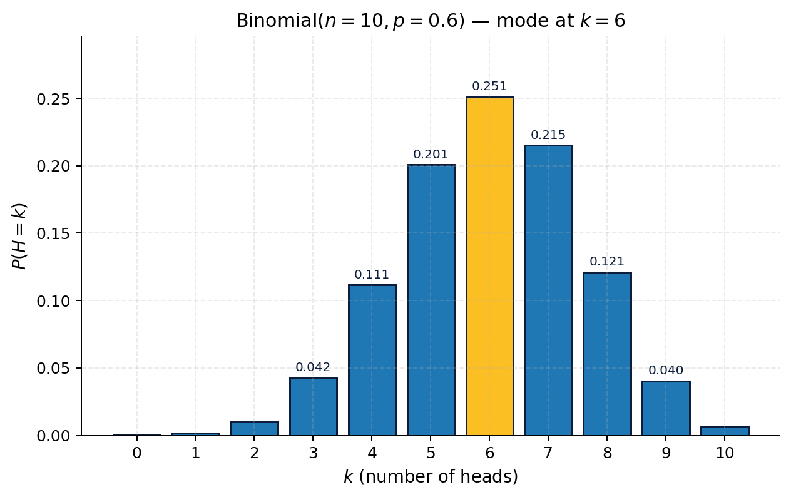
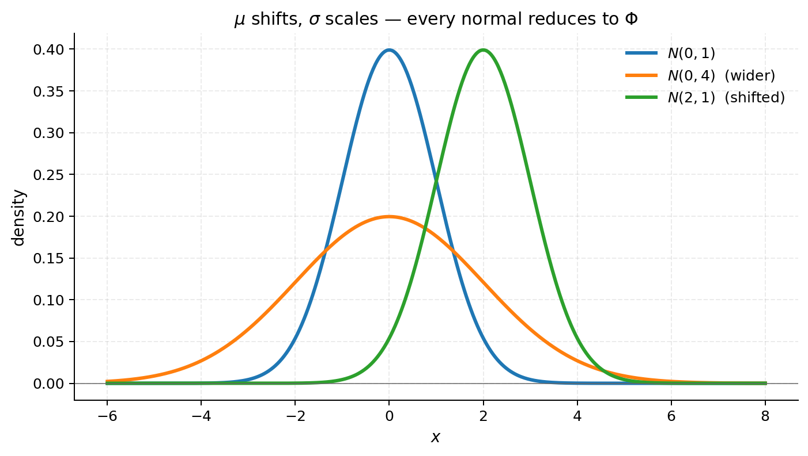
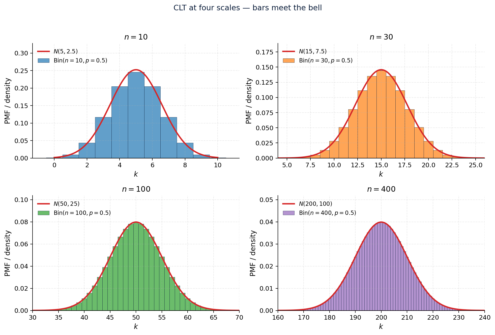

# Chapter 0 — A Math Primer (No Calculus)

## How to read this chapter

This chapter is a one-stop refresher for everything Chapters 1–7 will use. The reader I have in mind has not seen calculus in years and would rather not need to. Nothing in this book requires a derivative or an integral; every result is derived from finite sums, simple ratios, the Central Limit Theorem stated as a fact, and a tabulated function $\Phi(x)$ in the appendix.

Read it linearly the first time, then come back to whichever section a later chapter cites. Each section follows the same shape:

1. **Punchline** — the takeaway, stated up front.
2. **Intuition** — a one-paragraph picture of *why* the punchline is true. Reach for this when the algebra stops making sense.
3. **Definitions and facts** — the minimal kit.
4. **Worked examples** — numbered numbered (Example 0.k.j), every step shown.
5. **Figures and tables** — visual evidence, often colourful, often 3-D when 3-D actually helps.
6. **Exercises** — with answers.

What this chapter does *not* cover, and you do not need to know: derivatives, integrals, $\varepsilon$–$\delta$ limits, measure theory, $\sigma$-algebras as abstract objects, Lebesgue integration, real analysis, ODEs and PDEs. The book covers only the *discrete* binomial model and its Black–Scholes *limit*; the limit is taken numerically and proved via the Central Limit Theorem, no integration in sight.

What the reader *is* assumed to know: high-school algebra (manipulating exponents, solving two equations in two unknowns), the symbols $\sum$ and $\binom{n}{k}$, the idea of probability as a fraction or weight, and how to read a numeric table.

---

## §0.1 Numbers, Ratios, Gross Returns, Log Returns

**Punchline.** A *log return* is the additive coordinate hidden inside multiplicative price changes. Add them across days; multiply gross returns. Same information, additive form. Every later chapter ends up adding log returns; nothing else has the clean additivity we'll need for the Central Limit Theorem in §0.10.

**Intuition.** If a stock goes from \$100 to \$110, it grew by a factor of $1.10$. If it then goes to \$121, that's another factor of $1.10$. Total growth: $1.10 \times 1.10 = 1.21$. *Logs turn the multiplication into addition*: $\ln 1.10 + \ln 1.10 = 2\ln 1.10$. The reason this matters is that *the Central Limit Theorem speaks the language of sums*, not products. So the moment we want a "law of large $n$" for prices, we silently switch to logs.

### 0.1.1 Definitions

For a price moving from $S_0$ to $S_1$:

- **Simple (net) return**: $R = \dfrac{S_1 - S_0}{S_0}$.
- **Gross return**: $G = \dfrac{S_1}{S_0} = 1 + R$.
- **Log return**: $r = \ln G = \ln\!\left(\dfrac{S_1}{S_0}\right)$.

Across $n$ periods with gross returns $G_1, G_2, \dots, G_n$:

$$\frac{S_n}{S_0} \;=\; \prod_{i=1}^{n} G_i, \qquad \ln\!\left(\frac{S_n}{S_0}\right) \;=\; \sum_{i=1}^{n} \ln G_i \;=\; \sum_{i=1}^{n} r_i.$$

**Log returns add; gross returns multiply.** This single fact is the seed of every CLT-flavoured argument later in the book.

A useful small-move approximation, stated and not derived:

$$\ln(1 + R) \;\approx\; R \qquad \text{for } |R| \lesssim 0.05.$$

The approximation costs about half a percent at $R = 0.10$ and more thereafter.

### 0.1.2 Examples

**Example 0.1.1.** $S_0 = 100$, $S_1 = 110$. Then $R = 0.10$, $G = 1.10$, $\ln G = 0.09531$. Note that $\ln G$ is a bit less than $R$ — log returns under-state the size of an *up* move and over-state the size of a *down* move, because the $\ln$ curve sits below the line $y = R$ above $R = 0$.

**Example 0.1.2 (Toy).** $S_0 = 4$, $S_1 = 8$. Then $G = 2$, $\ln G = 0.6931$. The same numbers will reappear throughout the next four chapters.

**Example 0.1.3 (three-day path).** Returns $+5\%$, $-3\%$, $+2\%$. Gross returns: $1.05,\, 0.97,\, 1.02$.

- Total gross: $1.05 \cdot 0.97 \cdot 1.02 = 1.03887$.
- Log sum: $\ln 1.05 + \ln 0.97 + \ln 1.02 = 0.04879 - 0.03046 + 0.01980 = 0.03813$.
- Cross-check: $e^{0.03813} = 1.03887$. ✓

**Example 0.1.4 (the symmetry trap).** Up 50% then down 50% is *not* breakeven. $1.50 \times 0.50 = 0.75$. Log sum: $\ln 1.5 + \ln 0.5 = 0.4055 - 0.6931 = -0.2877$, and $e^{-0.2877} = 0.75$. ✓ In log space the asymmetry is obvious; in percent space it's a common trap.

**Example 0.1.5 (binomial path, realistic).** $u = 1.10$, $d = 0.90$. Over five periods the path UUDUD has gross return $u^3 d^2 = 1.331 \cdot 0.81 = 1.07811$.

**Example 0.1.6 (same path, log form).** $3 \ln 1.10 + 2 \ln 0.90 = 0.28593 - 0.21072 = 0.07521$. And $e^{0.07521} = 1.07811$. ✓ *The order of U's and D's doesn't matter for total return — only the count.* That observation is what makes the multi-period binomial tree *recombining* in Chapter 2.

**Example 0.1.7 (approximation error).** $\ln(1.10) = 0.09531$ versus $R = 0.10$. Relative error: $4.7\%$. For $R = 0.01$ the relative error drops to $0.5\%$. The approximation is dependable only for very small moves; we will not rely on it later.

### 0.1.3 Table

**Table 0.1.** Gross-to-log conversion across a range of moves.

| $R$ | $G = 1+R$ | $\ln G$ | $R - \ln G$ |
|---:|---:|---:|---:|
| $-0.50$ | $0.50$ | $-0.6931$ | $+0.1931$ |
| $-0.20$ | $0.80$ | $-0.2231$ | $+0.0231$ |
| $-0.10$ | $0.90$ | $-0.1054$ | $+0.0054$ |
| $-0.05$ | $0.95$ | $-0.0513$ | $+0.0013$ |
| $\phantom{+}0.00$ | $1.00$ | $\phantom{+}0.0000$ | $\phantom{+}0.0000$ |
| $+0.05$ | $1.05$ | $\phantom{+}0.0488$ | $+0.0012$ |
| $+0.10$ | $1.10$ | $\phantom{+}0.0953$ | $+0.0047$ |
| $+0.20$ | $1.20$ | $\phantom{+}0.1823$ | $+0.0177$ |
| $+0.50$ | $1.50$ | $\phantom{+}0.4055$ | $+0.0945$ |

### 0.1.4 Exercises

1. Five gross returns $1.02, 0.98, 1.05, 0.95, 1.01$. Total gross? Log sum? **Answer:** $1.00777$, $0.00774$.
2. Daily $u = 1.05$, $d = 0.95$; the path DUDU over 4 days. Final price ratio? **Answer:** $0.99750$.
3. $S_0 = 100$, $S_4 = 121$. Average log return per period? **Answer:** $\ln(1.21)/4 = 0.04766$.

---

## §0.2 Exponentials, Logarithms, Continuous Compounding (No Calculus)

**Punchline.** The function $e^x$ is the partner of $\ln x$: $\ln(e^x) = x$ and $e^{\ln x} = x$. Continuous compounding is the *identity* $\lim_{n\to\infty}(1 + r/n)^n = e^r$ — stated as a fact, not derived. It says: as you compound more and more often at total rate $r$, you converge to multiplying by $e^r$.

**Intuition.** Imagine you have \$1 and earn 100% per year. Compounded once: \$2. Compounded twice (50% then 50% on a bigger base): $1.5 \times 1.5 = \$2.25$. Compounded daily: $\$2.71$. Compounded continuously: $\$2.71828 = e$. The number $e$ is just *the limit of "compound as often as possible at total rate 1."* Every continuous-compounding formula in the book is shorthand for "I compounded a lot of times."

### 0.2.1 Rules to memorise

Both functions are *just functions* — you can look them up in a table, in a calculator, or in Python. The arithmetic rules are:

$$e^{a+b} = e^a e^b, \qquad (e^a)^b = e^{ab}, \qquad e^0 = 1.$$
$$\ln(ab) = \ln a + \ln b, \qquad \ln(a^b) = b \ln a, \qquad \ln 1 = 0, \qquad \ln e = 1.$$
$$\ln(e^x) = x, \qquad e^{\ln x} = x \quad (x > 0).$$

The *continuous compounding identity*, stated as a fact:

$$\lim_{n \to \infty} \left(1 + \frac{r}{n}\right)^{n} \;=\; e^{r}, \qquad \lim_{n \to \infty} \left(1 + \frac{r}{n}\right)^{nT} \;=\; e^{rT}.$$

That is the only "limit" in the book that the reader needs to take on faith. We never differentiate $e^x$, we never take its calculus derivative; we use it as a function with the algebraic rules above.

### 0.2.2 Examples

**Example 0.2.1 (compounding converges to $e^r$).** Take $r = 0.05$, $T = 1$ year. The value of \$1 invested at $5\%$ for one year, compounded at different frequencies:

| Compounding | Formula | Value of \$1 |
|---|---|---:|
| Annual | $1.05$ | $1.05000$ |
| Semi-annual | $(1 + 0.05/2)^2$ | $1.05063$ |
| Quarterly | $(1 + 0.05/4)^4$ | $1.05095$ |
| Monthly | $(1 + 0.05/12)^{12}$ | $1.05116$ |
| Daily | $(1 + 0.05/252)^{252}$ | $1.05127$ |
| Continuous | $e^{0.05}$ | $1.05127$ |

Daily and continuous already agree to five decimal places.

**Example 0.2.2 (Toy).** $r = 0.25$ for one period. Annual gross: $1.25$. Continuous gross: $e^{0.25} = 1.28403$. The gap (\$0.034 per dollar) widens at higher rates because $e^r$ grows faster than $1 + r$.

**Example 0.2.3 (present value).** PV of \$100 due in 2 years at $r = 4\%$ continuous: $100 \cdot e^{-0.08} = 100 \cdot 0.92312 = \$92.31$. The same \$100 discounted *annually* at $4\%$ would be $100 / 1.04^2 = \$92.46$. Continuous discounting pulls slightly harder.

**Example 0.2.4 (solving for a rate).** A bond pays \$100 in 1 year and trades at \$95. What is the continuous yield? $100 e^{-r} = 95 \Rightarrow e^{-r} = 0.95 \Rightarrow r = -\ln 0.95 = 0.05129 = 5.13\%$.

**Example 0.2.5 (doubling time).** At a continuous rate $r$, the time to double is $T = \ln 2 / r$. At $r = 7\%$: $T = 0.6931 / 0.07 = 9.90$ years. (This is the rule of 72 with $72/7 = 10.3$ years; the rule of 72 is the simple-interest approximation of $\ln 2 / r$.)

**Example 0.2.6 (compounding identity by hand).** Compute $(1 + 0.10/4)^{12}$. Step 1: $1 + 0.025 = 1.025$. Step 2: $1.025^2 = 1.0506$. Step 3: $1.025^4 = 1.0506^2 = 1.1038$. Step 4: $1.025^{12} = (1.025^4)^3 = 1.1038^3 = 1.3449$. That's the value of \$1 quarterly-compounded at $10\%$ for 3 years. Continuous comparison: $e^{0.30} = 1.3499$. About 0.4% lower.

### 0.2.3 Tables

**Table 0.2.** Compounding ladder: value of \$1 after 1 year at three different rates, across compounding frequencies.

| Frequency | $r = 5\%$ | $r = 10\%$ | $r = 25\%$ |
|---|---:|---:|---:|
| Annual | $1.05000$ | $1.10000$ | $1.25000$ |
| Semi-annual | $1.05063$ | $1.10250$ | $1.26563$ |
| Quarterly | $1.05095$ | $1.10381$ | $1.27443$ |
| Monthly | $1.05116$ | $1.10471$ | $1.28073$ |
| Daily | $1.05127$ | $1.10516$ | $1.28392$ |
| **Continuous ($e^r$)** | $\mathbf{1.05127}$ | $\mathbf{1.10517}$ | $\mathbf{1.28403}$ |

**Table 0.3.** Common values of $e^x$ and $\ln x$.

| $x$ | $e^x$ | $\ln x$ |
|---:|---:|---:|
| $0.01$ | $\phantom{0}1.01005$ | $-4.6052$ |
| $0.05$ | $\phantom{0}1.05127$ | $-2.9957$ |
| $0.10$ | $\phantom{0}1.10517$ | $-2.3026$ |
| $0.25$ | $\phantom{0}1.28403$ | $-1.3863$ |
| $0.50$ | $\phantom{0}1.64872$ | $-0.6931$ |
| $1.00$ | $\phantom{0}2.71828$ | $\phantom{-}0.0000$ |
| $2.00$ | $\phantom{0}7.38906$ | $\phantom{-}0.6931$ |
| $3.00$ | $20.08554$ | $\phantom{-}1.0986$ |

### 0.2.4 Exercises

1. PV of \$250 in 3 years at $r = 6\%$ continuous. **Answer:** $250 e^{-0.18} = \$208.82$.
2. Solve $\ln x = 2.5$. **Answer:** $x = e^{2.5} = 12.182$.
3. Compare $(1 + 0.02/4)^{4 \cdot 5}$ with $e^{0.02 \cdot 5}$. **Answer:** $1.10494$ vs $1.10517$ — within $0.02\%$.

---

## §0.3 Sums, Products, Binomial Coefficients, Pascal, Binomial Theorem

**Punchline.** The binomial coefficient $\binom{n}{k} = \dfrac{n!}{k!(n-k)!}$ counts paths. Pascal's triangle *is* the binomial tree with the stock price replaced by a count. Every multi-period binomial pricing formula in Chapter 7 is a sum of the form $\sum_k \binom{n}{k} \tilde p^k (1-\tilde p)^{n-k} (\text{payoff at } k)$.

**Intuition.** Imagine $n$ coin flips. To end with exactly $k$ heads, you pick *which* $k$ of the $n$ flips were heads — there are $\binom{n}{k}$ ways to do that. If each particular sequence has probability $\tilde p^k (1-\tilde p)^{n-k}$, the total probability of "ended at $k$ heads" is the count times the per-sequence probability. Pascal's recursion $\binom{n}{k} = \binom{n-1}{k-1} + \binom{n-1}{k}$ is just *"either the last flip was H (so we needed $k-1$ heads before) or it was T (so we needed $k$ already)."*

### 0.3.1 Definitions and identities

The **factorial** $n! = 1 \cdot 2 \cdot 3 \cdots n$, with $0! = 1$ by convention.

The **binomial coefficient**:

$$\binom{n}{k} \;=\; \frac{n!}{k!\,(n-k)!} \qquad \text{for integers } 0 \le k \le n.$$

It reads "$n$ choose $k$" — the number of ways to choose $k$ objects from $n$ without regard to order.

**Symmetry**: $\binom{n}{k} = \binom{n}{n-k}$. (Choosing which $k$ are heads is the same as choosing which $n-k$ are tails.)

**Pascal's recursion**: $\binom{n}{k} = \binom{n-1}{k-1} + \binom{n-1}{k}$. (Each entry is the sum of the two above it.)

**Binomial theorem**:

$$(a + b)^n \;=\; \sum_{k=0}^{n} \binom{n}{k}\, a^k\, b^{n-k}.$$

Setting $a = b = 1$: $\sum_{k=0}^{n} \binom{n}{k} = 2^n$ — the rows of Pascal's triangle sum to powers of 2.

### 0.3.2 Examples

**Example 0.3.1 (small case enumerated).** $\binom{5}{2} = \dfrac{5!}{2! \cdot 3!} = \dfrac{120}{2 \cdot 6} = 10$. Enumerate the 10 binary strings with exactly two heads:

$$\{\text{HHTTT, HTHTT, HTTHT, HTTTH, THHTT, THTHT, THTTH, TTHHT, TTHTH, TTTHH}\}.$$

**Example 0.3.2 (Pascal's triangle, rows 0–6).**

| Row | Entries | Sum |
|---|---|---:|
| $n=0$ | $1$ | $1$ |
| $n=1$ | $1\quad 1$ | $2$ |
| $n=2$ | $1\quad 2\quad 1$ | $4$ |
| $n=3$ | $1\quad 3\quad 3\quad 1$ | $8$ |
| $n=4$ | $1\quad 4\quad 6\quad 4\quad 1$ | $16$ |
| $n=5$ | $1\quad 5\quad 10\quad 10\quad 5\quad 1$ | $32$ |
| $n=6$ | $1\quad 6\quad 15\quad 20\quad 15\quad 6\quad 1$ | $64$ |

**Example 0.3.3 (binomial theorem with numbers).** Take $a = u = 1.10$, $b = d = 0.90$, $n = 4$. The binomial theorem gives

$$(1.10 + 0.90)^4 \;=\; 2.00^4 \;=\; 16.0$$

decomposed as

$$\binom{4}{0}(0.90)^4 + \binom{4}{1}(1.10)(0.90)^3 + \binom{4}{2}(1.10)^2(0.90)^2 + \binom{4}{3}(1.10)^3(0.90) + \binom{4}{4}(1.10)^4.$$

Numerically: $0.6561 + 4 \cdot 0.8019 + 6 \cdot 0.9801 + 4 \cdot 1.1979 + 1.4641 = 0.6561 + 3.2076 + 5.8806 + 4.7916 + 1.4641 = 16.0000$. ✓

**Example 0.3.4 (paths in a binomial tree).** A 7-period binomial tree has $2^7 = 128$ paths. How many end at level $+3$ (i.e., 5 ups and 2 downs)?

$$\binom{7}{5} = \binom{7}{2} = \frac{7 \cdot 6}{2} = 21.$$

**Example 0.3.5 (Toy, $n = 3$).** $S_0 = 4$, $u = 2$, $d = 1/2$. The terminal nodes of a 3-period tree are

Each terminal price is $S_3 = 4 \cdot u^k d^{3-k}$.

| $k$ | $S_3$ | Paths |
|:---:|:---:|:---:|
| $0$ | $1/2$ | $1$ |
| $1$ | $2$   | $3$ |
| $2$ | $8$   | $3$ |
| $3$ | $32$  | $1$ |

Total paths: $1 + 3 + 3 + 1 = 8 = 2^3$. ✓

**Example 0.3.6 (realistic, $n = 4$).** $S_0 = 100$, $u = 1.10$, $d = 0.90$. Each terminal price is $S_4 = 100 \cdot u^k d^{4-k}$.

| $k$ | $S_4$ | Paths |
|:---:|---:|:---:|
| $0$ | $65.61$  | $1$ |
| $1$ | $80.19$  | $4$ |
| $2$ | $98.01$  | $6$ |
| $3$ | $119.79$ | $4$ |
| $4$ | $146.41$ | $1$ |

**Example 0.3.7 (Pascal recurrence in action).** Use Pascal's recursion to compute $\binom{10}{4}$ starting from row 9. From row 9: $\binom{9}{3} = 84$, $\binom{9}{4} = 126$. So $\binom{10}{4} = 84 + 126 = 210$. Sanity check: $\binom{10}{4} = \dfrac{10 \cdot 9 \cdot 8 \cdot 7}{4!} = \dfrac{5040}{24} = 210$. ✓

### 0.3.3 Table

**Table 0.4.** Terminal-node summary for the realistic 5-period binomial tree, $S_0 = 100$, $u = 1.10$, $d = 0.90$.

| $k$ | $S_5 = 100\,u^k d^{5-k}$ | $\binom{5}{k}$ | $\binom{5}{k}/2^5$ |
|---:|---:|---:|---:|
| $0$ | $\phantom{0}59.05$ | $\phantom{0}1$ | $0.03125$ |
| $1$ | $\phantom{0}72.17$ | $\phantom{0}5$ | $0.15625$ |
| $2$ | $\phantom{0}88.21$ | $10$ | $0.31250$ |
| $3$ | $107.81$ | $10$ | $0.31250$ |
| $4$ | $131.77$ | $\phantom{0}5$ | $0.15625$ |
| $5$ | $161.05$ | $\phantom{0}1$ | $0.03125$ |

### 0.3.4 Exercises

1. Compute $\binom{8}{3}$. **Answer:** $56$.
2. Paths in a 10-step tree ending at level $+4$. **Answer:** $\binom{10}{7} = 120$.
3. Sum of row 8 of Pascal. **Answer:** $2^8 = 256$.

---

## §0.4 Probability on Finite Sample Spaces

**Punchline.** A probability is a weight on each leaf of a finite tree. *Events* are sets of leaves. The probability of an event is the sum of its leaf weights. Conditional probability is *"zoom into a subtree and renormalise so the new weights sum to 1."* Everything Chapter 1 and Chapter 3 will say about risk-neutral probability is built on this picture.

**Intuition.** Imagine tossing three coins. The sample space $\Omega$ is the set of 8 possible outcomes (HHH, HHT,..., TTT). If the coin is fair, each has weight $1/8$. The event "exactly two heads" is the set $\{$HHT, HTH, THH$\}$ — three leaves, total weight $3/8$. Conditioning on "first toss is H" zooms into the four leaves starting with H; each had weight $1/8$, now they renormalise to $1/4$ each.

### 0.4.1 Definitions

A **sample space** $\Omega$ is the finite set of all possible outcomes of a random experiment.

An **event** $A$ is a subset $A \subseteq \Omega$.

A **probability measure** $\mathbb{P}$ assigns a weight $p(\omega) \geq 0$ to every $\omega \in \Omega$, such that $\sum_{\omega \in \Omega} p(\omega) = 1$. The probability of any event $A$ is

$$\mathbb{P}(A) \;=\; \sum_{\omega \in A} p(\omega).$$

For two events $A, B$:

$$\mathbb{P}(A \cup B) \;=\; \mathbb{P}(A) + \mathbb{P}(B) - \mathbb{P}(A \cap B), \qquad \mathbb{P}(A^c) \;=\; 1 - \mathbb{P}(A).$$

**Conditional probability**:

$$\mathbb{P}(A \mid B) \;=\; \frac{\mathbb{P}(A \cap B)}{\mathbb{P}(B)}, \qquad \text{provided } \mathbb{P}(B) > 0.$$

Two events are **independent** if $\mathbb{P}(A \cap B) = \mathbb{P}(A)\,\mathbb{P}(B)$, equivalently $\mathbb{P}(A \mid B) = \mathbb{P}(A)$.

**Bayes' rule** (just rearranging the definition):

$$\mathbb{P}(A \mid B) \;=\; \frac{\mathbb{P}(B \mid A)\,\mathbb{P}(A)}{\mathbb{P}(B)}.$$

### 0.4.2 Examples

**Example 0.4.1 (two fair coins).** $\Omega = \{$HH, HT, TH, TT$\}$, each leaf weight $1/4$. The event "both heads" is the singleton $\{$HH$\}$, probability $1/4$.

**Example 0.4.2 (exactly one head).** The event is $\{$HT, TH$\}$, probability $2/4 = 1/2$.

**Example 0.4.3 (biased three-toss).** $p = 0.6$ for heads. Compute $\mathbb{P}($HHT$) = 0.6 \cdot 0.6 \cdot 0.4 = 0.144$. The sample space has 8 leaves; their weights are

| Outcome | Weight |
|---|---:|
| HHH | $0.216$ |
| HHT | $0.144$ |
| HTH | $0.144$ |
| HTT | $0.096$ |
| THH | $0.144$ |
| THT | $0.096$ |
| TTH | $0.096$ |
| TTT | $0.064$ |

(Total $= 1$, as required.)

**Example 0.4.4 (conditional in a tree).** Two fair tosses. Given that there is at least one head, what is the probability that both are heads?

$$\mathbb{P}(\text{both H} \mid \geq 1 \text{ H}) = \frac{\mathbb{P}(\text{both H})}{\mathbb{P}(\geq 1\text{ H})} = \frac{1/4}{3/4} = \frac{1}{3}.$$

**Example 0.4.5 (independence check).** Two fair coins. Let $A = \{$1st is H$\}$, $B = \{$2nd is H$\}$. Then $\mathbb{P}(A) = \mathbb{P}(B) = 1/2$ and $\mathbb{P}(A \cap B) = \mathbb{P}($HH$) = 1/4 = (1/2)(1/2)$. So $A \perp B$. ✓

**Example 0.4.6 (Bayes, the classic medical test).** A disease has prevalence $\mathbb{P}(\text{sick}) = 0.01$. A test has sensitivity $\mathbb{P}(+ \mid \text{sick}) = 0.99$ and specificity $\mathbb{P}(- \mid \text{healthy}) = 0.95$. You test positive — what is the probability you are sick?

$$
\mathbb{P}(\text{sick} \mid +)
\;=\; \frac{\mathbb{P}(+ \mid \text{sick})\,\mathbb{P}(\text{sick})}{\mathbb{P}(+ \mid \text{sick})\,\mathbb{P}(\text{sick}) + \mathbb{P}(+ \mid \text{healthy})\,\mathbb{P}(\text{healthy})}
$$

$$= \frac{0.99 \cdot 0.01}{0.99 \cdot 0.01 + 0.05 \cdot 0.99} = \frac{0.0099}{0.0099 + 0.0495} = \frac{0.0099}{0.0594} = 0.1667.$$

Only $1$ in $6$ positive tests are actually sick — the famous *base-rate fallacy*. The same arithmetic underlies updating a prior in Bayesian inference and is the engine of risk-neutral pricing's "change of measure" later in this book.

**Example 0.4.7 (at-least probability).** Three tosses, $p = 0.5$. Probability of at least one head?

$$\mathbb{P}(\geq 1 \text{ H}) = 1 - \mathbb{P}(0 \text{ H}) = 1 - 0.5^3 = 0.875.$$

The complement trick: directly summing the cases "exactly 1, 2, or 3 heads" is more work.

### 0.4.3 Tables

**Table 0.5.** Joint distribution of two fair dice rolled, summarised as (sum, max).

| | max $=1$ | $=2$ | $=3$ | $=4$ | $=5$ | $=6$ | sum-marg. |
|---|---:|---:|---:|---:|---:|---:|---:|
| sum $=2$ | $1/36$ | | | | | | $1/36$ |
| $=3$ | | $2/36$ | | | | | $2/36$ |
| $=4$ | | $1/36$ | $2/36$ | | | | $3/36$ |
| $=5$ | | | $2/36$ | $2/36$ | | | $4/36$ |
| $=6$ | | | $1/36$ | $2/36$ | $2/36$ | | $5/36$ |
| $=7$ | | | | $2/36$ | $2/36$ | $2/36$ | $6/36$ |
| $=8$ | | | | $1/36$ | $2/36$ | $2/36$ | $5/36$ |
| $=9$ | | | | | $2/36$ | $2/36$ | $4/36$ |
| $=10$ | | | | | $1/36$ | $2/36$ | $3/36$ |
| $=11$ | | | | | | $2/36$ | $2/36$ |
| $=12$ | | | | | | $1/36$ | $1/36$ |
| max-marg. | $1/36$ | $3/36$ | $5/36$ | $7/36$ | $9/36$ | $11/36$ | $36/36$ |

*Blank: $(sum, max)$ pair is impossible (e.g. sum $=3$ with $\max=1$ requires both dice $\le 1$ but they must sum to $3$).*

### 0.4.4 Exercises

1. Three fair tosses, $\mathbb{P}($exactly 2 heads$)$. **Answer:** $3/8$.
2. Two dice, $\mathbb{P}($sum $= 7)$. **Answer:** $1/6$.
3. Two dice, given sum $= 7$: $\mathbb{P}($first die was 3$)$. **Answer:** $1/6$ (one of six equally-likely $(a, 7-a)$ pairs).

---

## §0.5 Random Variables, Expectation, Variance

**Punchline.** $\mathbb{E}$ is linear *always*. $\mathrm{Var}$ adds *only* for independent things. These two rules do most of the algebra in derivatives pricing.

**Intuition.** A random variable is a number assigned to each leaf of the sample-space tree. The *expectation* is the leaf-weight-weighted average. The *variance* measures how spread out those leaf values are around the mean. Linearity says: averaging is commutative with arithmetic — if you double every payoff, the average doubles. Independence of variance says: spread of a sum equals sum of spreads, but *only* when the two random variables don't share information.

### 0.5.1 Definitions

A **random variable** $X$ is a function $X : \Omega \to \mathbb{R}$. (For discrete $\Omega$ it just assigns a number to each outcome.)

The **probability mass function (PMF)** lists the values $X$ takes and their probabilities:

$$\mathbb{P}(X = x) \;=\; \sum_{\omega : X(\omega) = x} p(\omega).$$

The **expectation**:

$$\mathbb{E}[X] \;=\; \sum_{\omega \in \Omega} X(\omega)\, p(\omega) \;=\; \sum_{x} x\, \mathbb{P}(X = x).$$

The **variance** and **standard deviation**:

$$\mathrm{Var}(X) \;=\; \mathbb{E}\!\left[(X - \mathbb{E}[X])^2\right] \;=\; \mathbb{E}[X^2] - (\mathbb{E}[X])^2, \qquad \sigma_X = \sqrt{\mathrm{Var}(X)}.$$

The **two rules** that govern almost every calculation:

- **Linearity** (always holds): $\mathbb{E}[aX + bY + c] = a\,\mathbb{E}[X] + b\,\mathbb{E}[Y] + c$.
- **Variance under scaling**: $\mathrm{Var}(aX + c) = a^2\,\mathrm{Var}(X)$.
- **Variance of independent sum**: if $X \perp Y$, then $\mathrm{Var}(X + Y) = \mathrm{Var}(X) + \mathrm{Var}(Y)$.

Independence does not show up in $\mathbb{E}$'s additivity (which always holds); it shows up in $\mathrm{Var}$'s additivity.

### 0.5.2 Examples

**Example 0.5.1 (fair six-sided die).** $X \in \{1, 2, 3, 4, 5, 6\}$, each with probability $1/6$.

- $\mathbb{E}[X] = (1+2+3+4+5+6)/6 = 21/6 = 3.5$.
- $\mathbb{E}[X^2] = (1+4+9+16+25+36)/6 = 91/6 = 15.167$.
- $\mathrm{Var}(X) = 15.167 - 3.5^2 = 15.167 - 12.25 = 2.917$.
- $\sigma_X = \sqrt{2.917} = 1.708$.

**Example 0.5.2 (Bernoulli).** $X$ is $1$ with probability $p$, $0$ with probability $1-p$.

- $\mathbb{E}[X] = p$.
- $\mathbb{E}[X^2] = p$ (since $X^2 = X$).
- $\mathrm{Var}(X) = p - p^2 = p(1-p)$.

At $p = 0.6$: $\mathbb{E} = 0.6$, $\mathrm{Var} = 0.24$, $\sigma = 0.490$.

**Example 0.5.3 (Toy, one-period stock).** $S_0 = 4$, $S_1 \in \{8, 2\}$, with risk-neutral probability $\tilde p = 1/2$ on each.

- $\tilde{\mathbb{E}}[S_1] = (1/2)(8) + (1/2)(2) = 5$.
- Discount at $1/(1+r) = 1/(1 + 1/4) = 4/5$: $(4/5)(5) = 4 = S_0$. ✓ The discounted expected price *is* the current price under $\tilde{\mathbb{P}}$. This is the seed of Chapter 1's risk-neutral pricing formula.

**Example 0.5.4 (realistic one-period stock).** $S_0 = 100$, $S_1 \in \{110, 90\}$, real-world probability $p = 0.6$.

- $\mathbb{E}[S_1] = 0.6 \cdot 110 + 0.4 \cdot 90 = 66 + 36 = 102$.
- $\mathbb{E}[S_1^2] = 0.6 \cdot 12100 + 0.4 \cdot 8100 = 7260 + 3240 = 10500$.
- $\mathrm{Var}(S_1) = 10500 - 102^2 = 10500 - 10404 = 96$.
- $\sigma_{S_1} = \sqrt{96} = 9.80$.

So the price next period has expected value \$102 and SD \$9.80.

**Example 0.5.5 (sum of 100 iid Bernoulli(0.5)).** Let $H = X_1 + \dots + X_{100}$ where each $X_i \sim$ Bernoulli$(0.5)$.

- $\mathbb{E}[H] = 100 \cdot 0.5 = 50$.
- $\mathrm{Var}(H) = 100 \cdot 0.5 \cdot 0.5 = 25$ (independent summands).
- $\sigma_H = 5$.

100 fair coin flips have mean 50 heads and SD 5; the *fraction* of heads has mean $0.5$ and SD $0.05$. We will reuse this in §0.10.

**Example 0.5.6 (sum of two dice).** Let $X, Y$ be two independent fair dice.

- $\mathbb{E}[X + Y] = 3.5 + 3.5 = 7$.
- $\mathrm{Var}(X + Y) = 2.917 + 2.917 = 5.833$ (independent).

**Example 0.5.7 (variance under scaling — a common trap).** $X$ is one fair die. $\mathrm{Var}(X) = 2.917$. Now $Y = 2X$ (e.g., a die where every face is doubled). Then $\mathrm{Var}(Y) = 4 \cdot 2.917 = 11.67$. *Not* $2 \cdot 2.917$. The factor squares because variance is "average squared deviation."

**Example 0.5.8 (lottery expected value).** A ticket costs \$5 and pays \$1{,}000{,}000 with probability $10^{-7}$. Expected profit:

$$\mathbb{E}[\text{profit}] = 10^{-7} \cdot 1{,}000{,}000 - (1 - 10^{-7}) \cdot 5 \approx 0.10 - 5 = -\$4.90.$$

The ticket has expected loss \$4.90.

![Two-state stock under Toy ($S_0=4, u=2, d=1/2$, $\tilde p=1/2$): the bar PMF of $S_1$ with the mean marked as a triangle, and the discount line $(1+r)^{-1} \tilde{\mathbb{E}}[S_1] = S_0$ shown as an arrow. The mean is a fulcrum; the discount factor moves it back to today's price.](figures/ch00-mean-as-fulcrum.png)

### 0.5.3 Table

**Table 0.6.** Bernoulli summary: mean and variance as $p$ varies.

| $p$ | $\mathbb{E}[X]$ | $\mathrm{Var}(X)$ | $\sigma_X$ |
|---:|---:|---:|---:|
| $0.10$ | $0.100$ | $0.090$ | $0.300$ |
| $0.30$ | $0.300$ | $0.210$ | $0.458$ |
| $0.50$ | $0.500$ | $0.250$ | $0.500$ |
| $0.70$ | $0.700$ | $0.210$ | $0.458$ |
| $0.90$ | $0.900$ | $0.090$ | $0.300$ |

The variance is maximised at $p = 0.5$ — the fairest coin is the most uncertain.

### 0.5.4 Exercises

1. $X$ uniform on $\{1, 2, \dots, 10\}$. Mean? Variance? **Answer:** $5.5$, $8.25$.
2. Sum of 50 fair coin flips: variance. **Answer:** $50 \cdot 0.25 = 12.5$.
3. $u = 1.20$, $d = 0.80$, $p = 0.5$. $\mathbb{E}[S_1/S_0]$ and $\sigma$? **Answer:** $1.00$, $0.20$.

---

## §0.6 Conditional Expectation on Trees

**Punchline.** $\mathbb{E}[X \mid \mathcal{F}_n]$ is *the best forecast of $X$ given what you know at time $n$*. On a tree, it is the probability-weighted average over the subtree rooted at the current node. The **tower property** — $\mathbb{E}[\mathbb{E}[X \mid \mathcal{F}_n]] = \mathbb{E}[X]$ — is just "averaging in two stages gives the same answer as averaging in one."

**Intuition.** Imagine you are at a node halfway through a binomial tree. You don't yet know whether the next toss will be H or T, but you can list the remaining branches and their probabilities. The conditional expectation at *your* node is just the average of $X$ over those remaining branches, weighted by their conditional probabilities. The tower property says: if a friend at a still-earlier node averages over *your* possible conditional expectations, they recover the original full-tree average. *Backward induction in Chapter 2 is exactly this tower property applied step by step from the leaves to the root.*

### 0.6.1 Definitions

The **information at time $n$**, written $\mathcal{F}_n$, is a partition of $\Omega$ — a list of disjoint "blocks" $A_n(\omega)$ such that every $\omega$ sits in exactly one block, and within a block all outcomes are indistinguishable from the time-$n$ vantage. On a binomial tree, $\mathcal{F}_n$ is the partition by *which node at level $n$ the path currently sits in*.

The **conditional expectation** of $X$ given $\mathcal{F}_n$ is a *random variable* (its value depends on which block you ended up in):

$$\mathbb{E}[X \mid \mathcal{F}_n](\omega) \;=\; \frac{1}{\mathbb{P}(A_n(\omega))}\,\sum_{\omega' \in A_n(\omega)} X(\omega')\,p(\omega').$$

In words: average $X$ over the block of $\omega$, weighted by within-block probabilities.

Three identities used throughout this book:

- **Tower property.** For $n \leq m$: $\mathbb{E}\bigl[\mathbb{E}[X \mid \mathcal{F}_m] \mid \mathcal{F}_n\bigr] = \mathbb{E}[X \mid \mathcal{F}_n]$, and in particular $\mathbb{E}[\mathbb{E}[X \mid \mathcal{F}_n]] = \mathbb{E}[X]$.
- **Pulling out the known.** If $Y$ is $\mathcal{F}_n$-measurable (its value is determined by which block you're in), then $\mathbb{E}[Y X \mid \mathcal{F}_n] = Y \,\mathbb{E}[X \mid \mathcal{F}_n]$.
- **Independence collapse.** If $X$ is independent of $\mathcal{F}_n$, then $\mathbb{E}[X \mid \mathcal{F}_n] = \mathbb{E}[X]$.

### 0.6.2 Examples

**Example 0.6.1 (Toy, two periods).** $S_0 = 4$, $u = 2$, $d = 1/2$, $\tilde p = 1/2$ under risk-neutral measure. The (recombining) tree, level by level:

| time $t=0$ | time $t=1$ | time $t=2$ |
|:---:|:---:|:---:|
| $S_0 = 4$  | U: $S_1 = 8$ | UU: $S_2 = 16$ |
|            | U: $S_1 = 8$ | UD: $S_2 = 4$  |
|            | D: $S_1 = 2$ | DU: $S_2 = 4$  |
|            | D: $S_1 = 2$ | DD: $S_2 = 1$  |

Compute the conditional expectations at the two time-1 nodes:

- $\tilde{\mathbb{E}}[S_2 \mid S_1 = 8] = (1/2)(16) + (1/2)(4) = 10$.
- $\tilde{\mathbb{E}}[S_2 \mid S_1 = 2] = (1/2)(4) + (1/2)(1) = 2.5$.

**Example 0.6.2 (verify the tower).** Averaging the two conditional expectations from 0.6.1 over the time-1 probabilities:

$$\tilde{\mathbb{E}}\!\left[\tilde{\mathbb{E}}[S_2 \mid \mathcal{F}_1]\right] = (1/2)(10) + (1/2)(2.5) = 6.25.$$

Direct computation:

$$\tilde{\mathbb{E}}[S_2] = (1/4)(16) + (1/4)(4) + (1/4)(4) + (1/4)(1) = 4 + 1 + 1 + 0.25 = 6.25. ✓$$

**Example 0.6.3 (conditional payoff).** Same tree. Payoff at expiry: $X = (S_2 - 5)^+$. So $X(UU) = 11$, $X(UD) = 0$, $X(DU) = 0$, $X(DD) = 0$.

- $\tilde{\mathbb{E}}[X \mid S_1 = 8] = (1/2)(11) + (1/2)(0) = 5.5$.
- $\tilde{\mathbb{E}}[X \mid S_1 = 2] = 0$.
- $\tilde{\mathbb{E}}[X] = (1/2)(5.5) + (1/2)(0) = 2.75$.

Cross-check via direct sum: $(1/4)(11) + 0 + 0 + 0 = 2.75$. ✓

**Example 0.6.4 (pulling out the known).** Same tree. $S_1$ is $\mathcal{F}_1$-measurable. Then for any function $f$ of $S_2$:

$$\tilde{\mathbb{E}}[S_1 \cdot f(S_2) \mid \mathcal{F}_1] \;=\; S_1 \cdot \tilde{\mathbb{E}}[f(S_2) \mid \mathcal{F}_1].$$

For instance, $\tilde{\mathbb{E}}[S_1 \cdot S_2 \mid \mathcal{F}_1] = S_1 \cdot \tilde{\mathbb{E}}[S_2 \mid \mathcal{F}_1]$. At the upper node $S_1 = 8$: this equals $8 \cdot 10 = 80$. Sanity: direct, at the upper node $\tilde{\mathbb{E}}[S_1 S_2 \mid \text{upper}] = (1/2)(8 \cdot 16) + (1/2)(8 \cdot 4) = 64 + 16 = 80$. ✓

**Example 0.6.5 (realistic three-period).** $S_0 = 100$, $u = 1.10$, $d = 0.90$, $\tilde p = 0.6$. Conditional on $S_1 = 110$, two periods remain.

$$
\begin{aligned}
\tilde{\mathbb{E}}[S_3 \mid S_1 = 110]
&= 110 \cdot \tilde{\mathbb{E}}[(S_3/S_1)] \\
&= 110 \cdot (0.6 \cdot 1.10 + 0.4 \cdot 0.90)^2 \\
&= 110 \cdot 1.02^2 \;=\; 110 \cdot 1.0404 \;=\; 114.44.
\end{aligned}
$$

Note how the calculation reduces to *the one-period expected gross return raised to the number of remaining periods* — a key shortcut in Chapter 2.

**Example 0.6.6 (backward induction preview).** Using the same realistic tree, compute the *price today* of a payoff $(S_2 - 100)^+$ under $\tilde{\mathbb{P}}$ with discount $1/(1 + 0.02)$ per step.

- At time 2, the four outcomes are $S_2 \in \{121, 99, 99, 81\}$, payoffs $\{21, 0, 0, 0\}$ with conditional probabilities $\{0.36, 0.24, 0.24, 0.16\}$.
- Backward to time 1, upper node ($S_1 = 110$): conditional expected payoff $= 0.6 \cdot 21 + 0.4 \cdot 0 = 12.6$; discounted price at upper node $= 12.6/1.02 = 12.35$.
- Backward to time 1, lower node ($S_1 = 90$): conditional expected payoff $= 0.6 \cdot 0 + 0.4 \cdot 0 = 0$; price $= 0$.
- Backward to time 0: conditional expected payoff at $t = 1$ $= 0.6 \cdot 12.35 + 0.4 \cdot 0 = 7.41$; price today $= 7.41/1.02 = 7.27$.

That last number is the no-arbitrage price of this 2-period call. We will redo this rigorously in Chapter 2.

![A 2-period tree under Toy, with the subtree rooted at the upper time-1 node $S_1=8$ highlighted. The arrow labels "$\tilde{\mathbb{E}}[X \mid \mathcal{F}_1]$ = probability-weighted average over the shaded subtree." This is conditional expectation in one picture.](figures/ch00-cond-exp-subtree.png)

### 0.6.3 Table

**Table 0.7.** Backward induction on the toy 3-period tree, $S_0 = 4$, $u = 2$, $d = 1/2$, $\tilde p = 1/2$, $r = 1/4$. A node $(t, k)$ sits at time $t$ with $k$ up-moves so far. The recombining tree has $t+1$ distinct nodes at time $t$. *Definition.* The right-most column gives $\tilde{\mathbb{E}}[S_3 \mid \text{node}] = S \cdot (1+r)^{\,3-t}$; for leaf rows ($t = 3$) it degenerates to $S$ itself.

| $(t,k)$ | label | $S$ | paths | $\tilde{\mathbb{E}}[S_3 \mid \text{node}]$ |
|:---:|:---:|---:|:---:|---:|
| $(0,0)$ | root | $4$ | $1$ | $7.8125$ |
| $(1,1)$ | U | $8$ | $1$ | $12.500$ |
| $(1,0)$ | D | $2$ | $1$ | $3.125$ |
| $(2,2)$ | UU | $16$ | $1$ | $20.000$ |
| $(2,1)$ | UD/DU | $4$ | $2$ | $5.000$ |
| $(2,0)$ | DD | $1$ | $1$ | $1.250$ |
| $(3,3)$ | leaf | $32$ | $1$ | $32.000$ |
| $(3,2)$ | leaf | $8$ | $3$ | $8.000$ |
| $(3,1)$ | leaf | $2$ | $3$ | $2.000$ |
| $(3,0)$ | leaf | $0.5$ | $1$ | $0.500$ |

Row checks: $(0,0)$: $4 \cdot 1.25^3 = 7.8125$. $(1,1)$: $8 \cdot 1.25^2 = 12.5$. $(1,0)$: $2 \cdot 1.25^2 = 3.125$. $(2,k)$: $S \cdot 1.25$ in each row. Leaf rows trivially return $S$.

Two things to read off the table.

**The expected price grows at the rate $r$ per period.** Under risk-neutral measure, $\tilde{\mathbb{E}}[S_n \mid S_m] = S_m \,(1+r)^{n-m}$. That's why the root's expected value of $S_3$ is $7.8125 = 4 \cdot (1.25)^3$, not $4$. The "martingale" object is *discounted* price $S_n/(1+r)^n$, which has constant expectation — not raw price. We'll prove this properly in Chapter 3.

**The tower property holds level by level.** $7.8125 = (1/2)(12.5) + (1/2)(3.125)$ ✓ at the root. $12.5 = (1/2)(20) + (1/2)(5)$ ✓ at node U. $3.125 = (1/2)(5) + (1/2)(1.25)$ ✓ at node D. Each level is the probability-weighted average of the level below — averaging in stages gives the same answer as averaging once.

### 0.6.4 Exercises

1. Toy, 3-period, $\tilde{\mathbb{E}}[S_3 \mid S_1 = 8]$. **Answer:** $12.5$.
2. Same tree, $\tilde{\mathbb{E}}[S_3 \mid S_2 = 4]$. **Answer:** $5$ (mean of $\{8, 2\}$).
3. Verify the tower at the root: $7.8125 = (1/2)(12.5) + (1/2)(3.125)$. **Answer:** $7.8125$. ✓

---

## §0.7 Counting Lattice Paths — Reflection Principle Prep

**Punchline.** A *path* is a sequence of $\pm 1$ steps. The number of paths from $(0,0)$ to $(n, k)$ is $\binom{n}{(n+k)/2}$ — choose which steps were ups. To count paths that *touch* a barrier level $L$, **reflect** them across $L$ — you get a bijection to paths ending somewhere else, and bijections preserve counts. This is the entire content of Chapter 5's reflection principle, pre-rehearsed here on small examples.

**Intuition.** Picture a path on a sheet of grid paper, walking right one step at a time and either up or down each step. If a path *touches* the line $y = L$ at some point, take a mirror, lay it flat on the line $y = L$, and reflect everything *after* the first touch. You get a different path, but with the same number of steps, that ends at $2L - h$ (where $h$ was the original endpoint). The reflection is a bijection: every "touching path" corresponds to exactly one "ends-at-$2L-h$" path, and vice versa. Counting one tells you the count of the other.

### 0.7.1 Definitions

A **lattice path** of length $n$ starting at $(0, 0)$ is a sequence $X_0 = 0$, $X_1, X_2, \dots, X_n$ with each step $X_t - X_{t-1} \in \{+1, -1\}$. Each path corresponds to a unique sequence of $n$ U's and D's. There are $2^n$ paths of length $n$ in total.

**Endpoint formula.** A path of length $n$ ends at level $k$ iff it has $u$ up-steps and $d$ down-steps with $u - d = k$, $u + d = n$, so $u = (n + k)/2$. Therefore

$$\#\{\text{paths from } (0, 0) \text{ to } (n, k)\} \;=\; \binom{n}{(n+k)/2}, \qquad k \in \{-n, -n+2, \dots, n-2, n\}.$$

(If $(n + k)/2$ is not a non-negative integer $\leq n$, the count is zero.)

**Reflection principle (stated, illustrated below).** Fix a level $L > 0$. Let $h$ be an integer with $h < L$. The number of paths from $(0, 0)$ to $(n, h)$ that touch the level $L$ somewhere along the way equals the number of paths from $(0, 0)$ to $(n, 2L - h)$:

$$\#\{\text{paths to } (n, h) \text{ touching } L\} \;=\; \#\{\text{paths to } (n, 2L - h)\} \;=\; \binom{n}{(n + 2L - h)/2}.$$

The bijection: for any touching path, locate the *first* time $\tau$ it hits $L$, then reflect the segment after $\tau$ across $L$. The reflected segment ends at $2L - h$ instead of $h$; everything before $\tau$ is unchanged. Reversing the reflection gives the inverse map. Same count.

**Ballot identity.** Among paths of length $n$ ending at $k > 0$, the number that stay strictly positive for $t \geq 1$ is

$$\frac{k}{n} \binom{n}{(n+k)/2}.$$

This is *Bertrand's ballot problem* and we will use it in Chapter 5 for first-passage counting.

### 0.7.2 Examples

**Example 0.7.1 (counting paths to an endpoint).** Paths of length 6 ending at level $+2$: that's $u = 4$ up-steps and $d = 2$ down-steps. Count: $\binom{6}{4} = 15$.

**Example 0.7.2 (reflection identity).** Paths of length 6 ending at $+2$ that *touch* level $+3$. By reflection, this equals the count of paths ending at $2 \cdot 3 - 2 = +4$. That count is $\binom{6}{5} = 6$.

**Example 0.7.3 (read off the complement).** Paths of length 6 ending at $+2$ that *do not* touch $+3$: $15 - 6 = 9$. So 60% of paths to $+2$ touched $+3$ along the way.

**Example 0.7.4 (ballot count).** Paths of length 10 ending at $+4$ that stay strictly positive from $t = 1$ onwards. By ballot: $(4/10) \binom{10}{7} = 0.4 \cdot 120 = 48$. Out of $\binom{10}{7} = 120$ total paths to $+4$, exactly 48 stayed strictly above zero.

**Example 0.7.5 (small enumeration, $n = 4$).** Enumerate every length-4 path and tabulate the endpoints. There are $2^4 = 16$ paths. By endpoint:

| Endpoint $k$ | Count | $\binom{4}{(4+k)/2}$ |
|---:|---:|---:|
| $-4$ | $1$ | $1$ |
| $-2$ | $4$ | $4$ |
| $0$ | $6$ | $6$ |
| $+2$ | $4$ | $4$ |
| $+4$ | $1$ | $1$ |

Endpoint $-4$ is the unique path DDDD; endpoint $+4$ is UUUU. Sum is $16$. ✓ Row 4 of Pascal's triangle is reproduced.

**Example 0.7.6 (max of a length-4 walk).** Compute $\mathbb{P}\!\left(\max_{1 \le t \le 4} X_t \geq 2\right)$ for the fair symmetric walk. We split "paths that reach $+2$" into two disjoint classes:

- **End at or above $+2$** (trivially touch $+2$): endpoint $h \in \{+2, +4\}$.
- **End strictly below $+2$ but touch it** (endpoint $h \in \{0, -2, -4\}$): for these, *reflection* identifies them one-to-one with paths ending at $4 - h$.

| End at $h$ | Count to $h$ | Touch $+2$? | Refl. $4-h$ | Touch count |
|:---:|:---:|:---|:---:|:---:|
| $+4$ | $1$ | yes | | $1$ |
| $+2$ | $4$ | yes | | $4$ |
| $0$ | $6$ | some | $+4$ | $1$ |
| $-2$ | $4$ | some | $+6$ | $0$ |
| $-4$ | $1$ | some | $+8$ | $0$ |

*Legend.* yes = trivially touches (endpoint already $\geq +2$); some = only the touching subset, counted by reflection. *Counts.* End-counts come from $\binom{4}{(4+h)/2}$ (rows: $1,4,6,4,1$). Reflected-touch counts come from $\binom{4}{(4+\text{refl})/2}$: refl $+4 \to \binom{4}{4}=1$; refl $+6 \to \binom{4}{5}=0$; refl $+8 \to 0$. Blank in "Refl." column = no reflection needed.

The last column sums to $1 + 4 + 1 + 0 + 0 = 6$. So $6$ of the $16$ length-4 paths touch level $+2$, giving

$$\mathbb{P}\!\left(\max_{1 \le t \le 4} X_t \geq 2\right) \;=\; \frac{6}{16} \;=\; \frac{3}{8}.$$

**Direct enumeration check.** All length-4 paths that touch $+2$, listed by their step sequence:

$$\{\text{UUUU},\ \text{UUUD},\ \text{UUDU},\ \text{UUDD},\ \text{UDUU},\ \text{DUUU}\}.$$

Verify: any path starting UU touches $+2$ at $t = 2$ (that's the four paths UUUU/UUUD/UUDU/UUDD); UDUU reaches $+2$ at $t = 4$ via levels $1, 0, 1, 2$; DUUU reaches $+2$ at $t = 4$ via $-1, 0, 1, 2$. Six paths total. ✓

The reflection principle gave the same count via algebra, without listing paths. For $n = 4$ that's still a manageable enumeration; for $n = 40$ we'd have $2^{40} \approx 10^{12}$ paths and reflection is the only feasible route.

**Example 0.7.7 (the reflection bijection in pictures).** Take the path UUDDD on $n = 5$, which ends at $-1$ but touches $+2$ at $t = 2$. The first touch of $+2$ is at $t = 2$. Reflect the segment from $t = 2$ onwards (which traces levels $2, 1, 0, -1$ at steps $t = 2, 3, 4, 5$) across $y = 2$ — it now visits $2, 3, 4, 5$. The reflected path is UUUUU, ending at $+5$.

The reflection principle predicts: count of paths to $-1$ touching $+2$ $=$ count of paths to $+5 = \binom{5}{5} = 1$. So exactly $1$ of the $\binom{5}{2}=10$ paths ending at $-1$ touches $+2$, and that path is UUDDD itself.

![A single length-6 path that first touches level $+3$ at $t = 3$ (shown in blue), and its post-touch reflection across $y = +3$ (shown in red). The blue path ends at $+2$; the red path ends at $+4$. They share the first 3 steps; they are mirror images on $[3, 6]$. The "first-touch" point at $t = 3$ is marked with a star. The bijection says: every blue path counts a red one, and vice versa.](figures/ch00-reflection-bijection.png)

### 0.7.3 Tables

**Table 0.8.** Path counts $(n, k)$ for $n = 0, 2, 4, 6, 8, 10$ (even parity rows). Entries are $\binom{n}{(n+k)/2}$.

| $n \backslash k$ | $-10$ | $-8$ | $-6$ | $-4$ | $-2$ | $0$ | $+2$ | $+4$ | $+6$ | $+8$ | $+10$ |
|---:|---:|---:|---:|---:|---:|---:|---:|---:|---:|---:|---:|
| $0$ | | | | | | $1$ | | | | | |
| $2$ | | | | | $1$ | $2$ | $1$ | | | | |
| $4$ | | | | $1$ | $4$ | $6$ | $4$ | $1$ | | | |
| $6$ | | | $1$ | $6$ | $15$ | $20$ | $15$ | $6$ | $1$ | | |
| $8$ | | $1$ | $8$ | $28$ | $56$ | $70$ | $56$ | $28$ | $8$ | $1$ | |
| $10$ | $1$ | $10$ | $45$ | $120$ | $210$ | $252$ | $210$ | $120$ | $45$ | $10$ | $1$ |

**Table 0.9.** Reflection-count check for paths of length $6$ ending at $h = 2$, across barrier levels $L$.

| Barrier $L$ | Refl. $2L - h$ | Touch count | Fraction |
|---:|---:|---:|---:|
| $L = 2$ | $2$ | $15$ | $1.00$ |
| $L = 3$ | $4$ | $6$ | $0.40$ |
| $L = 4$ | $6$ | $1$ | $0.07$ |
| $L = 5$ | $8$ | $0$ | $0.00$ |

Row computations: $L=2$: trivially all $15$ paths touch (endpoint $h=2$ is already on the barrier). $L=3$: $\binom{6}{5}=6$. $L=4$: $\binom{6}{6}=1$. $L=5$: refl $8 > 6$, impossible.

### 0.7.4 Exercises

1. Number of paths of length 8 ending at $+4$. **Answer:** $\binom{8}{6} = 28$.
2. Number of paths of length 8 ending at $+4$ that touch $+5$. **Answer:** $\binom{8}{6.5}$ — wait, $(8 + 6)/2 = 7$, so $\binom{8}{7} = 8$ (reflect $+4 \to 2 \cdot 5 - 4 = 6$).
3. Number of paths of length 8 ending at $0$ that stay strictly positive at every interior step. **Answer:** This is the Catalan number $C_4 = 14$.

---

## §0.8 The Binomial Distribution

**Punchline.** $H \sim \mathrm{Bin}(n, p)$ counts heads in $n$ independent coin flips. Its PMF is $\binom{n}{k} p^k (1-p)^{n-k}$, mean $np$, variance $np(1-p)$. The pricing formula in Chapter 7 is *literally* a sum of binomial probabilities times payoffs — so the binomial distribution is the engine room.

**Intuition.** Each flip is a tiny Bernoulli random variable; $H$ is just their sum. Linearity of $\mathbb{E}$ gives the mean: $n$ flips times $p$ heads per flip $= np$. Independence gives the variance: $n$ flips times $p(1-p)$ variance per flip $= np(1-p)$. Everything else is rearranging $\binom{n}{k}$.

### 0.8.1 Definitions and facts

If $X_1, X_2, \dots, X_n$ are independent Bernoulli$(p)$ random variables and $H = X_1 + \dots + X_n$, then $H$ is **Binomial$(n, p)$**:

$$\mathbb{P}(H = k) \;=\; \binom{n}{k}\, p^k\, (1-p)^{n-k}, \qquad k = 0, 1, \dots, n.$$

**Mean and variance**:

$$\mathbb{E}[H] = np, \qquad \mathrm{Var}(H) = np(1-p), \qquad \sigma_H = \sqrt{np(1-p)}.$$

**Recurrence** (useful for tabulating the PMF without recomputing factorials):

$$\frac{\mathbb{P}(H = k+1)}{\mathbb{P}(H = k)} \;=\; \frac{n - k}{k + 1} \cdot \frac{p}{1 - p}.$$

**Sum of independent binomials**: if $H_1 \sim \mathrm{Bin}(n_1, p)$ and $H_2 \sim \mathrm{Bin}(n_2, p)$ are independent, then $H_1 + H_2 \sim \mathrm{Bin}(n_1 + n_2, p)$.

### 0.8.2 Examples

**Example 0.8.1 (Bin$(5, 0.5)$ PMF, all six values).**

| $k$ | $\binom{5}{k}$ | $\mathbb{P}(H = k) = \binom{5}{k}/32$ |
|---:|---:|---:|
| $0$ | $1$ | $0.03125$ |
| $1$ | $5$ | $0.15625$ |
| $2$ | $10$ | $0.31250$ |
| $3$ | $10$ | $0.31250$ |
| $4$ | $5$ | $0.15625$ |
| $5$ | $1$ | $0.03125$ |

Mean $= 2.5$, variance $= 1.25$, $\sigma = 1.118$.

**Example 0.8.2 (Bin$(10, 0.6)$, central probability).**

$$\mathbb{P}(H = 6) \;=\; \binom{10}{6} \cdot 0.6^6 \cdot 0.4^4 \;=\; 210 \cdot 0.04666 \cdot 0.0256 \;=\; 0.2508.$$

Compare with the mean $\mathbb{E}[H] = 6$: the most likely outcome is exactly the mean, with probability about $25\%$.

**Example 0.8.3 (mean and variance).** Bin$(10, 0.6)$: $\mathbb{E} = 6$, $\mathrm{Var} = 10 \cdot 0.6 \cdot 0.4 = 2.4$, $\sigma = 1.549$.

**Example 0.8.4 (recurrence in action).** From 0.8.2, $\mathbb{P}(H = 6) = 0.2508$. Then

$$\mathbb{P}(H = 7) \;=\; 0.2508 \cdot \frac{10 - 6}{6 + 1} \cdot \frac{0.6}{0.4} \;=\; 0.2508 \cdot \frac{4}{7} \cdot 1.5 \;=\; 0.2150.$$

Direct: $\binom{10}{7} \cdot 0.6^7 \cdot 0.4^3 = 120 \cdot 0.02799 \cdot 0.064 = 0.2150$. ✓

**Example 0.8.5 (Toy, risk-neutral terminal distribution).** $S_0 = 4$, $u = 2$, $d = 1/2$, $\tilde p = 1/2$, $n = 3$. Then $S_3 = 4 \cdot u^H d^{3 - H}$ where $H \sim \mathrm{Bin}(3, 1/2)$.

| $H = k$ | $S_3$ | $\tilde{\mathbb{P}}(H = k) = \binom{3}{k}/8$ |
|---:|---:|---:|
| $0$ | $1/2$ | $1/8 = 0.125$ |
| $1$ | $2$ | $3/8 = 0.375$ |
| $2$ | $8$ | $3/8 = 0.375$ |
| $3$ | $32$ | $1/8 = 0.125$ |

$\tilde{\mathbb{E}}[S_3] = 0.125 \cdot 0.5 + 0.375 \cdot 2 + 0.375 \cdot 8 + 0.125 \cdot 32 = 0.0625 + 0.75 + 3 + 4 = 7.8125 = 4 \cdot (1.25)^3$. ✓ (Discount at $(1+r)^3 = (5/4)^3 = 1.953$: $7.8125 / 1.953 = 4 = S_0$.)

**Example 0.8.6 (call ITM probability, realistic).** $S_0 = 100$, $K = 100$, $u = 1.10$, $d = 0.90$, $n = 3$, $\tilde p = 0.6$. The call is in-the-money iff $S_3 > 100$, i.e., iff $H \geq 2$ (with $H = 2$ giving $S_3 = 100 \cdot 1.21 \cdot 0.9 = 108.9 > 100$ and $H = 1$ giving $S_3 = 100 \cdot 1.1 \cdot 0.81 = 89.1 < 100$). So

$$\tilde{\mathbb{P}}(H \geq 2) \;=\; \binom{3}{2} \cdot 0.6^2 \cdot 0.4 + 0.6^3 \;=\; 3 \cdot 0.144 + 0.216 \;=\; 0.432 + 0.216 \;=\; 0.648.$$

**Example 0.8.7 (cumulative tail).** Bin$(20, 0.5)$: probability of at least 15 heads. $\binom{20}{15} = 15504$, $\binom{20}{16} = 4845$, $\binom{20}{17} = 1140$, $\binom{20}{18} = 190$, $\binom{20}{19} = 20$, $\binom{20}{20} = 1$. Sum $= 21700$. Total $2^{20} = 1{,}048{,}576$. So $\mathbb{P}(H \geq 15) = 21700/1048576 \approx 0.02069$.

### 0.8.3 Tables

**Table 0.10.** Binomial PMF for $n = 10$, across four values of $p$.

| $k$ | $p = 0.3$ | $p = 0.5$ | $p = 0.6$ | $p = 0.7$ |
|---:|---:|---:|---:|---:|
| $0$ | $0.02825$ | $0.00098$ | $0.00010$ | $0.00001$ |
| $1$ | $0.12106$ | $0.00977$ | $0.00157$ | $0.00014$ |
| $2$ | $0.23347$ | $0.04395$ | $0.01062$ | $0.00145$ |
| $3$ | $0.26683$ | $0.11719$ | $0.04247$ | $0.00900$ |
| $4$ | $0.20012$ | $0.20508$ | $0.11148$ | $0.03676$ |
| $5$ | $0.10292$ | $0.24609$ | $0.20066$ | $0.10292$ |
| $6$ | $0.03676$ | $0.20508$ | $0.25082$ | $0.20012$ |
| $7$ | $0.00900$ | $0.11719$ | $0.21499$ | $0.26683$ |
| $8$ | $0.00145$ | $0.04395$ | $0.12093$ | $0.23347$ |
| $9$ | $0.00014$ | $0.00977$ | $0.04031$ | $0.12106$ |
| $10$ | $0.00001$ | $0.00098$ | $0.00605$ | $0.02825$ |
| Sum | $1.00000$ | $1.00000$ | $1.00000$ | $1.00000$ |

### 0.8.4 Exercises

1. Bin$(8, 0.5)$: $\mathbb{P}(H \geq 5)$. **Answer:** $93/256 = 0.3633$.
2. Mean and variance of Bin$(20, 0.3)$. **Answer:** $6$, $4.2$.
3. Use the recurrence to get $\mathbb{P}(H = 4)$ in Bin$(8, 0.5)$ from $\mathbb{P}(H = 3)$. **Answer:** $70/256 = 0.2734$.

---

## §0.9 The Normal Distribution as a Tabulated Function

**Punchline.** $\Phi(z)$ is the area under the bell curve from $-\infty$ to $z$. It is a *function you look up* — exact values are in the appendix Table 0.A at the end of this chapter. Every Black–Scholes calculation in Chapter 7 is a table lookup.

**Intuition.** The standard normal distribution is the bell-shaped curve that you've seen on every introductory statistics page. Its total area under the curve is 1 (it's a probability density). $\Phi(z)$ is just *the running area from the far left up to $z$*. At $z = 0$ (the center), half the area is to the left, so $\Phi(0) = 0.5$. At $z = +\infty$, all the area is to the left, so $\Phi(\infty) = 1$. Everything else is a smooth interpolation that's been tabulated for centuries.

### 0.9.1 Definitions

The **standard normal density** is the defining curve

$$\phi(z) \;=\; \frac{1}{\sqrt{2\pi}} e^{-z^2/2}.$$

(You will never need to take rates of change of this curve or compute its area as a calculus exercise. Treat it as a curve drawn on paper.) The peak is at $z = 0$ with height $1/\sqrt{2\pi} \approx 0.399$. It is symmetric: $\phi(-z) = \phi(z)$.

**Where does the constant $1/\sqrt{2\pi}$ come from?** (Heuristic via Stirling.) State Stirling's approximation as a fact:

$$n! \;\approx\; n^n e^{-n} \sqrt{2\pi n} \qquad (n \text{ large}).$$

Apply it to the centre coefficient $\binom{n}{n/2}$ at $n = 2m$. After cancellation,

$$\binom{2m}{m} \;\approx\; \frac{4^m}{\sqrt{\pi m}}, \qquad \text{so} \qquad \frac{1}{2^{2m}} \binom{2m}{m} \;\approx\; \frac{1}{\sqrt{\pi m}}.$$

That is the peak probability of a centred Bin$(2m, 1/2)$. Now rescale: the standardised binomial has spacing $\Delta z = 2/\sqrt{2m} = \sqrt{2/m}$ between bars. Convert PMF to a density at $z = 0$ by dividing the peak probability by the spacing:

$$\text{density at } z = 0 \;\approx\; \frac{1/\sqrt{\pi m}}{\sqrt{2/m}} \;=\; \frac{1}{\sqrt{2\pi}}.$$

So the constant $1/\sqrt{2\pi}$ is not pulled out of a hat — it is *exactly* the rescaled peak height of the symmetric binomial. We will see the rest of the bell shape emerge in §0.10.

The **standard normal cumulative distribution function (CDF)** is

$$\Phi(z) \;=\; \mathbb{P}(Z \leq z),$$

where $Z$ is a standard normal random variable. It is the "running area under the bell curve from $-\infty$ to $z$." Treat $\Phi$ as a tabulated function — Table 0.A at the end of this chapter is the table.

**Symmetry:** $\Phi(-z) = 1 - \Phi(z)$.

**Moments of the standard normal** (stated, not derived).

- $\mathbb{E}[Z] = 0$.
- $\mathrm{Var}(Z) = \mathbb{E}[Z^2] = 1$.
- *All odd moments vanish by symmetry:* $\mathbb{E}[Z^{2k+1}] = 0$ for every $k \geq 0$.
- *Even moments* follow the double-factorial pattern

$$\mathbb{E}[Z^{2k}] \;=\; (2k - 1)!! \;=\; 1, \; 3, \; 15, \; 105, \; 945, \; \dots \quad (k = 1, 2, 3, \dots).$$

Here $(2k-1)!! = (2k-1)(2k-3)\cdots 3 \cdot 1$ is the product of odd numbers down to 1. The pattern $1, 3, 15, 105, 945$ recurs in every formula that touches the Black–Scholes machinery; we will not derive it, only quote it.

**Standardisation: the two-parameter family $N(\mu, \sigma^2)$.** A general normal random variable $X \sim N(\mu, \sigma^2)$ has mean $\mu$ and variance $\sigma^2$, and is built from the standard normal by an affine rescaling:

$$X \;=\; \mu + \sigma Z, \qquad \text{equivalently} \qquad Z \;=\; \frac{X - \mu}{\sigma}.$$

Then

$$\mathbb{P}(X \leq x) \;=\; \mathbb{P}\!\left(Z \leq \frac{x - \mu}{\sigma}\right) \;=\; \Phi\!\left(\frac{x - \mu}{\sigma}\right).$$

Every probability involving a normal random variable reduces to a $\Phi$ lookup on the standardised value. There is *one* table (Table 0.A); the parameters $\mu$ and $\sigma$ only re-scale where we read it.

### 0.9.2 Examples

**Example 0.9.1 (canonical values).** Five $\Phi$ values every reader should commit to memory:

| $z$ | $\Phi(z)$ | Interpretation |
|---:|---:|---|
| $0.00$ | $0.5000$ | symmetric peak |
| $1.00$ | $0.8413$ | one-sigma right of mean |
| $1.645$ | $0.9500$ | 95th percentile |
| $1.960$ | $0.9750$ | two-sided 95% confidence |
| $2.326$ | $0.9900$ | 99th percentile |

**Example 0.9.2 (negative $z$ via symmetry).** $\Phi(-0.5) = 1 - \Phi(0.5) = 1 - 0.6915 = 0.3085$. So $\mathbb{P}(Z \leq -0.5) = 30.85\%$.

**Example 0.9.3 (two-sided interval).** $\mathbb{P}(-1 \leq Z \leq 1) = \Phi(1) - \Phi(-1) = 0.8413 - 0.1587 = 0.6826$. The 68% rule.

**Example 0.9.4 (standardising).** $X \sim N(100, 15^2)$. $\mathbb{P}(X \leq 130) = \Phi((130 - 100)/15) = \Phi(2) = 0.9772$.

**Example 0.9.5 (inverse lookup).** Find $z$ with $\Phi(z) = 0.99$. From Table 0.A: $z = 2.326$.

**Example 0.9.6 (annual log return).** Suppose annual log returns are $X \sim N(0.05, 0.20^2)$. Probability the return is negative: $\mathbb{P}(X < 0) = \Phi((0 - 0.05)/0.20) = \Phi(-0.25) = 1 - 0.5987 = 0.4013$. So a $5\%$ expected return with $20\%$ vol has a $40\%$ chance of being negative in any given year.

**Example 0.9.7 (Black–Scholes preview).** Compute the BS-style quantity $\Phi(d_1) - \Phi(d_2)$ for $d_1 = 0.30$, $d_2 = 0.10$. From Table 0.A: $\Phi(0.30) = 0.6179$, $\Phi(0.10) = 0.5398$. So $\Phi(d_1) - \Phi(d_2) = 0.0781$. We will see exactly this kind of arithmetic in Chapter 7.

### 0.9.3 Tables

**Table 0.11.** Selected $\Phi$ values with interpretations (full appendix Table 0.A spans $z=0$ to $z=3.49$).

| $z$ | $\Phi(z)$ | Interpretation |
|:---:|:---:|:---|
| $0.000$ | $0.5000$ | symmetric peak |
| $1.000$ | $0.8413$ | one-sigma right of mean |
| $1.645$ | $0.9500$ | 95th percentile |
| $1.960$ | $0.9750$ | two-sided $95\%$ confidence |
| $2.326$ | $0.9900$ | 99th percentile |
| $2.576$ | $0.9950$ | two-sided $99\%$ confidence |
| $3.090$ | $0.9990$ | 99.9th percentile |

### 0.9.4 Exercises

1. $\mathbb{P}(Z \leq -1.5)$. **Answer:** $0.0668$.
2. $X \sim N(50, 10^2)$, $\mathbb{P}(40 < X < 70)$. **Answer:** $\Phi(2) - \Phi(-1) = 0.9772 - 0.1587 = 0.8185$.
3. $z$ such that $\mathbb{P}(|Z| > z) = 0.05$. **Answer:** $1.96$.

---

## §0.10 The Central Limit Theorem (de Moivre–Laplace, with a Stirling proof sketch)

**Punchline.** Take any independent identically distributed random variables with finite variance. Add up many of them; subtract the mean; divide by $\sigma\sqrt{n}$. As $n$ grows, the result looks like $N(0, 1)$. The **de Moivre–Laplace** case — coin tosses — is the only one the rest of this book uses, and we give a *calculus-free* proof sketch below using Stirling's approximation and an algebraic expansion of a finite product.

**Intuition.** Each individual flip is small and noisy. Sum many independent ones and the cancellations smooth out the noise. The smoothing is so reliable that the limiting shape depends only on the mean and variance of each piece, *not* on the original distribution. A sum of fair coin flips and a sum of dice rolls and a sum of stock-day returns all look like bells once you standardise. *This is why the binomial pricing sum collapses to a normal CDF in Chapter 7's Black–Scholes limit.*

### 0.10.1 Definitions and facts

**Central Limit Theorem (CLT, stated).** Let $X_1, X_2, \dots, X_n$ be independent, identically distributed random variables with mean $\mu$ and finite variance $\sigma^2$. Set $S_n = X_1 + \dots + X_n$. Then

$$\frac{S_n - n\mu}{\sigma \sqrt{n}} \;\xrightarrow{\text{distribution}}\; N(0, 1) \quad \text{as } n \to \infty.$$

Translation: for large $n$,

$$\mathbb{P}\!\left(\frac{S_n - n\mu}{\sigma \sqrt{n}} \leq z\right) \;\approx\; \Phi(z).$$

**De Moivre–Laplace (binomial special case).** If $H \sim \mathrm{Bin}(n, p)$, then for large $n$,

$$\mathbb{P}(H \leq k) \;\approx\; \Phi\!\left(\frac{k + 0.5 - np}{\sqrt{np(1-p)}}\right).$$

The $+0.5$ is the *continuity correction*: a $1$-unit-wide bar on a histogram, centred at $k$, extends from $k - 0.5$ to $k + 0.5$; the normal approximation should match by treating the bar as a strip of width 1.

**Rule of thumb.** The approximation is good when $np(1-p) \geq 10$, i.e., when the binomial is fat enough that several bars are around the mean.

### 0.10.1a Calculus-free proof sketch (de Moivre–Laplace, fair coin)

We sketch *why* the binomial PMF traces the bell curve, using nothing beyond Stirling's formula and the algebraic identity $\log(1 + u) \approx u - u^2/2$ for small $u$ (treated as a polynomial fact about that combination — no rate-of-change reasoning).

**Setup.** Let $H \sim \mathrm{Bin}(n, 1/2)$, so $H = X_1 + \dots + X_n$ with $X_i \in \{0, 1\}$ fair. Mean is $n/2$ and variance is $n/4$, so the standardised count is

$$Z_n \;=\; \frac{H - n/2}{\sqrt{n/4}}.$$

Write $H = n/2 + j$ where $j$ is the *signed deviation from the mean*. Then $z = 2j/\sqrt{n}$ and consecutive values of $j$ map to a $z$-spacing $\Delta z = 2/\sqrt{n}$.

**Goal.** Show that for $|j| \ll n$,

$$\mathbb{P}(H = n/2 + j) \;\approx\; \frac{1}{\sqrt{\pi n / 2}} \, e^{-2 j^2 / n}.$$

Once we have this, translation to the $z$-scale lands directly on $\phi(z)\,\Delta z$.

---

**Step 1 — Apply Stirling to the binomial coefficient.** State Stirling as a fact: for large $n$,

$$n! \;\approx\; n^n e^{-n} \sqrt{2\pi n}.$$

The PMF at $H = n/2 + j$ is

$$\mathbb{P}(H = n/2 + j) \;=\; \frac{1}{2^n} \binom{n}{n/2 + j} \;=\; \frac{1}{2^n} \cdot \frac{n!}{(n/2 + j)!\,(n/2 - j)!}.$$

When $j = 0$, the Stirling-derived peak is (carried over from §0.9)

$$\mathbb{P}(H = n/2) \;=\; \frac{1}{2^n}\binom{n}{n/2} \;\approx\; \frac{1}{\sqrt{\pi n / 2}}.$$

For $j \neq 0$, peel the centre coefficient off as a *ratio of factorials* — this is pure algebra:

$$\binom{n}{n/2 + j} \;=\; \binom{n}{n/2} \cdot \prod_{i=1}^{j} \frac{n/2 - i + 1}{n/2 + i}.$$

(One factor for each unit of deviation from the centre — the numerator pulls down from $n/2$, the denominator pushes up.) Dividing by $2^n$,

$$\mathbb{P}(H = n/2 + j) \;\approx\; \frac{1}{\sqrt{\pi n / 2}} \cdot \prod_{i=1}^{j} \frac{n/2 - i + 1}{n/2 + i}.$$

No calculus has been used — only Stirling and factorial telescoping.

---

**Step 2 — Algebraic expansion of the product.** Take logarithms to turn the product into a sum:

$$\log \prod_{i=1}^{j} \frac{n/2 - i + 1}{n/2 + i} \;=\; \sum_{i=1}^{j} \log\!\left(\frac{n/2 - i + 1}{n/2 + i}\right).$$

Factor $n/2$ out of numerator and denominator inside each term:

$$\frac{n/2 - i + 1}{n/2 + i} \;=\; \frac{1 - (i - 1)/(n/2)}{1 + i/(n/2)} \;=\; \frac{1 - 2(i-1)/n}{1 + 2i/n}.$$

For $i \ll n/2$, both correction terms are small. Use the polynomial identity (state as a fact)

$$\log(1 + u) \;\approx\; u - \tfrac{1}{2} u^2 \qquad \text{for small } u,$$

applied to numerator and denominator separately:

$$
\begin{aligned}
\log\!\left(1 - \tfrac{2(i-1)}{n}\right) &\;\approx\; -\tfrac{2(i-1)}{n} - \tfrac{1}{2}\!\left(\tfrac{2(i-1)}{n}\right)^2, \\
\log\!\left(1 + \tfrac{2i}{n}\right) &\;\approx\; \tfrac{2i}{n} - \tfrac{1}{2}\!\left(\tfrac{2i}{n}\right)^2.
\end{aligned}
$$

Subtract:

$$\log\!\left(\frac{n/2 - i + 1}{n/2 + i}\right) \;\approx\; -\frac{2(i - 1)}{n} - \frac{2i}{n} \;+\; (\text{quadratic-in-}i/n \text{ terms that vanish like } 1/n).$$

The leading piece is $-(4i - 2)/n$. Sum over $i = 1, 2, \dots, j$:

$$
\begin{aligned}
\sum_{i=1}^{j} -\frac{4i - 2}{n}
&\;=\; -\frac{4 \cdot j(j+1)/2 - 2j}{n} \\
&\;=\; -\frac{2j^2 + 2j - 2j}{n} \;=\; -\frac{2 j^2}{n}.
\end{aligned}
$$

Used here: $\sum_{i=1}^{j} i = j(j+1)/2$ (a triangular-number identity from §0.3). The $O(1/n)$ corrections drop out for $|j| \ll \sqrt{n}$.

So

$$\log \prod_{i=1}^{j} \frac{n/2 - i + 1}{n/2 + i} \;\approx\; -\frac{2 j^2}{n}, \qquad \prod \;\approx\; e^{-2 j^2 / n}.$$

No integrals, no derivatives — just Stirling, the polynomial identity for $\log(1+u)$, and the triangular-number sum.

---

**Step 3 — Combine and translate to the standardised scale.** Plugging the product back into Step 1,

$$\mathbb{P}(H = n/2 + j) \;\approx\; \frac{1}{\sqrt{\pi n / 2}} \, e^{-2 j^2 / n}.$$

Now set $z = 2j / \sqrt{n}$. Then $2 j^2 / n = z^2/2$, and consecutive integer values of $j$ have $z$-spacing $\Delta z = 2/\sqrt{n}$. So

$$\mathbb{P}(Z_n = z) \;=\; \mathbb{P}(H = n/2 + j) \;\approx\; \frac{1}{\sqrt{\pi n / 2}} \, e^{-z^2/2}.$$

Substitute $\sqrt{\pi n/2} = \sqrt{2\pi} \cdot \sqrt{n}/2 = \sqrt{2\pi}/\Delta z$:

$$\mathbb{P}(Z_n \in [z, z + \Delta z]) \;\approx\; \frac{1}{\sqrt{2\pi}} \, e^{-z^2/2} \, \Delta z \;=\; \phi(z)\,\Delta z.$$

**The big reveal.** The standardised binomial PMF, viewed as a Riemann sum on the $z$-axis with spacing $\Delta z$, traces *exactly* the standard normal density $\phi(z)$. Summing those bars from $-\infty$ to $z$ gives the running total $\Phi(z)$, the tabulated function we already met in §0.9. That is de Moivre–Laplace.

**Worked numerical check for $n = 100$** (so $n/2 = 50$, $\sqrt{n/4} = 5$). Compare the Stirling-derived approximation $\frac{1}{\sqrt{\pi n/2}} e^{-2 j^2 / n}$ with the exact binomial PMF.

| $j$ | $z = 2j/\sqrt{n}$ | Exact $\mathbb{P}(H = 50 + j)$ | Approx $\frac{1}{\sqrt{50\pi}}\, e^{-j^2/50}$ | Rel. error |
|---:|---:|---:|---:|---:|
| $0$ | $0.0$ | $0.07959$ | $0.07979$ | $0.25\%$ |
| $5$ | $1.0$ | $0.04847$ | $0.04839$ | $0.17\%$ |
| $10$ | $2.0$ | $0.01084$ | $0.01080$ | $0.42\%$ |
| $20$ | $4.0$ | $2.32 \times 10^{-5}$ | $2.68 \times 10^{-5}$ | $15.5\%$ |

At $j = 5, 10$ the agreement is well under half a percent; out at $j = 20$ (four standard deviations from the mean) the error widens visibly because the dropped $O(j^4/n^3)$ tail terms accumulate where $j$ is no longer small relative to $\sqrt{n}$. *This is precisely what we promised:* the approximation is sharp in the bulk, soft in the deep tails — and the bulk is where every Chapter-7 strike sits.

---

**Generalisation to non-symmetric $p$ (stated).** The same argument with $p \neq 1/2$ runs through. Stirling gives

$$\binom{n}{k} p^k (1-p)^{n-k} \;\approx\; \frac{1}{\sqrt{2\pi n p (1-p)}} \, e^{-(k - np)^2 / (2 n p (1-p))},$$

so the standardised binomial $(H - np)/\sqrt{np(1-p)}$ approaches $N(0,1)$. Only the *centre* and the *spacing* change; the product expansion picks up an asymmetric bias term that still sums to a single quadratic in the deviation. We will not re-do the algebra — the symmetric case carries all the conceptual weight.

**Generalisation to non-Bernoulli (CLT proper).** Replace each fair flip by *any* random variable with mean $\mu$ and finite variance $\sigma^2$, summed independently. The same Riemann-sum/bell-curve phenomenon emerges, by an argument that — at full generality — needs more machinery (characteristic functions or moment-generating functions) than we have. We adopt it as a *fact*. The de Moivre–Laplace case proved above is the only one Chapters 1–7 actually use.

### 0.10.2 Examples

**Example 0.10.X (Stirling on $10!$).** Exact $10! = 3{,}628{,}800$. Stirling: $10^{10} e^{-10} \sqrt{20\pi} = 10^{10} \cdot 4.53999 \times 10^{-5} \cdot 7.92665 \approx 3{,}598{,}696$. Relative error $\approx |3{,}628{,}800 - 3{,}598{,}696| / 3{,}628{,}800 \approx 0.83\%$. Stirling is already accurate below the 1%-level at $n = 10$; by $n = 100$ it sits below 0.1%.

**Example 0.10.Y (Bin$(16, 1/2)$ vs normal at $j = 2$).** Mean $8$, $\sigma = 2$. Compare exact PMF at $H = 10$ ($j = 2$) with the Stirling approximation $\frac{1}{\sqrt{8\pi}}\,e^{-2 \cdot 4/16} = \frac{1}{\sqrt{8\pi}}\,e^{-0.5}$.

- Exact: $\binom{16}{10}/2^{16} = 8008/65536 = 0.12219$.
- Approx: $1/\sqrt{8\pi} \cdot e^{-0.5} = 0.19947 \cdot 0.60653 = 0.12099$.
- Relative error: $0.98\%$.

Even at $n = 16$ — a *small* sample size by the standards of CLT — the Stirling argument already agrees to within one percent. By Chapter 7's $n$-period binomial tree (with $n \gg 100$ steps to expiry), the agreement is well inside the rounding noise of our $\Phi$ table.

**Example 0.10.Z (CLT on a dice sum).** Roll a fair six-sided die $n = 30$ times; let $S = X_1 + \dots + X_{30}$. Per die: $\mu = 3.5$, $\sigma^2 = 35/12 \approx 2.917$, $\sigma = 1.708$. Sum: $\mu_S = 105$, $\sigma_S = \sqrt{30 \cdot 35/12} = \sqrt{87.5} \approx 9.354$.

Find $\mathbb{P}(S \geq 120)$ via CLT with continuity correction:

$$
\begin{aligned}
\mathbb{P}(S \geq 120)
&\;=\; \mathbb{P}\!\left(\frac{S - 105}{9.354} \geq \frac{119.5 - 105}{9.354}\right) \\
&\;\approx\; 1 - \Phi(1.550) \;=\; 1 - 0.9394 \;=\; 0.0606.
\end{aligned}
$$

About $6\%$ chance the 30-die sum exceeds 120. (The dice outcome distribution is *not* normal — it is a discrete uniform on $\{1, \dots, 6\}$. The CLT does not care: only the per-die mean and variance enter the answer.)

**Example 0.10.1 (small case, fair).** Bin$(100, 0.5)$. Mean $= 50$, $\sigma = 5$. Find $\mathbb{P}(H \leq 55)$.

CLT approximation: $\Phi((55 + 0.5 - 50)/5) = \Phi(1.1) = 0.8643$.

Exact (compute the binomial sum): $0.8644$.

Agreement to three decimal places.

**Example 0.10.2 (medium case, fair).** Bin$(400, 0.5)$. Mean $200$, $\sigma = 10$. $\mathbb{P}(H \geq 220) = 1 - \Phi((220 - 0.5 - 200)/10) = 1 - \Phi(1.95) = 1 - 0.9744 = 0.0256$.

Exact: $0.0282$. Slight underestimate; the continuity correction has improved the agreement vs no correction.

**Example 0.10.3 (sum of 100 fair dice).** $\mu = 3.5$, $\sigma^2 = 35/12$ per die. Sum of 100: $\mu_{S} = 350$, $\sigma_{S}^2 = 100 \cdot 35/12 = 291.67$, $\sigma_S = 17.08$.

$\mathbb{P}(\text{sum} \leq 380) \approx \Phi((380 - 350)/17.08) = \Phi(1.756) = 0.9605$.

**Example 0.10.4 (foreshadowing Black–Scholes).** $u = 1.10$, $d = 0.90$, $n = 100$, $\tilde p = 0.5$. The terminal log return is $\ln(S_n / S_0) = H \ln u + (n - H) \ln d$ where $H \sim \mathrm{Bin}(n, \tilde p)$.

- Per flip: $\mathbb{E}[\ln G_i] = 0.5 (\ln 1.10 + \ln 0.90) = 0.5(0.09531 - 0.10536) = -0.005025$.
- Per flip: $\mathrm{Var}(\ln G_i) = 0.5 (\ln 1.10)^2 + 0.5 (\ln 0.90)^2 - (-0.005025)^2 \approx 0.01010$.
- Over 100 flips: mean $= -0.5025$, variance $= 1.010$, $\sigma = 1.005$.

By CLT, $\ln(S_{100}/S_0) \approx N(-0.5025, 1.010)$. The probability the stock ends *above* its start, $\mathbb{P}(S_{100} > S_0) = \mathbb{P}(\ln(S_{100}/S_0) > 0)$, is

$$1 - \Phi\!\left(\frac{0 - (-0.5025)}{1.005}\right) = 1 - \Phi(0.500) = 1 - 0.6915 = 0.3085.$$

About $31\%$ chance the stock ends up after 100 fair flips between $\pm 10\%$ moves. The downward bias comes from $\ln 1.1 + \ln 0.9 < 0$ — the symmetry trap from §0.1 in full effect.

**Example 0.10.5 (continuity-correction comparison).** With $\sigma = \sqrt{n/4}$, compare exact $\mathbb{P}(H \leq \lfloor n/2 + \sigma \rfloor)$ against the normal approximation with and without a continuity correction.

| $n$ | threshold $\lfloor n/2{+}\sigma\rfloor$ | exact | normal | normal + cc |
|:---:|:---:|:---:|:---:|:---:|
| $10$  | $6$   | $0.8281$ | $0.8413$ | $0.8531$ |
| $40$  | $23$  | $0.8461$ | $0.8413$ | $0.8534$ |
| $100$ | $55$  | $0.8644$ | $0.8413$ | $0.8643$ |
| $400$ | $210$ | $0.8462$ | $0.8413$ | $0.8531$ |

The plain-normal column always evaluates at $z = 1$ (so the same $0.8413$). The continuity-corrected column uses $z = (\lfloor n/2+\sigma\rfloor + 0.5 - n/2)/\sigma$ — slightly above $1$ when the floor truncates.

**Example 0.10.6 (CLT-quality of fit visual).** Maximum PMF error of Bin$(n, 0.5)$ versus the matching normal density, for $n = 10, 40, 160, 640$.

| $n$ | max error |
|:---:|:---:|
| $10$  | $0.00700$ |
| $40$  | $0.00170$ |
| $160$ | $0.00043$ |
| $640$ | $0.00011$ |

The "max error" column is the maximum over $k$ of $\lvert\mathbb{P}(H=k) - \phi((k-\mu)/\sigma)/\sigma\rvert$ where $\mu = n/2$ and $\sigma = \sqrt{n/4}$.

Each row reduces the error by about a factor of 4 — this is the *local* CLT rate $O(1/n)$ for the PMF (Berry–Esseen $O(1/\sqrt n)$ controls the CDF instead).

### 0.10.3 Tables

**Table 0.12.** Binomial vs normal: $\mathbb{P}(H \leq \lfloor n/2 + \sigma\rfloor)$ for symmetric Bin$(n, 0.5)$ ($\sigma = \sqrt{n/4}$), with continuity correction.

| $n$ | Exact | Normal (CC) | Abs. error |
|---:|---:|---:|---:|
| $\phantom{000}10$ | $0.8281$ | $0.8413$ | $0.0132$ |
| $\phantom{000}40$ | $0.8420$ | $0.8413$ | $0.0007$ |
| $\phantom{00}100$ | $0.8553$ | $0.8413$ | $0.0140$ |
| $\phantom{00}400$ | $0.8400$ | $0.8413$ | $0.0013$ |
| $1600$ | $0.8423$ | $0.8413$ | $0.0010$ |

Error stays small once $n \geq 40$ or so — the CLT is reliable for the kinds of sample sizes we will use in Chapter 7.

### 0.10.4 Exercises

1. Bin$(64, 0.5)$, $\mathbb{P}(H \geq 40)$ via CLT with continuity correction. **Answer:** $1 - \Phi((39.5 - 32)/4) = 1 - \Phi(1.875) = 0.0304$.
2. Sum of 50 Bernoulli$(0.3)$, $\mathbb{P}(\text{sum} \leq 20)$ via CLT. **Answer:** $\Phi((20.5 - 15)/\sqrt{50 \cdot 0.21}) = \Phi(1.697) = 0.9551$.
3. What will $\sigma \sqrt n$ become in the Black–Scholes formula? **Answer:** The "$\sigma \sqrt T$" factor — volatility times the square root of time-to-maturity. The CLT scaling of standard deviations of sums is *the* reason BS prices scale with $\sigma \sqrt T$.

---

## §0.11 Solving 2×2 Linear Systems (Replication Prep)

**Punchline.** Two equations, two unknowns. Subtract one from the other to eliminate one variable. This is *literally* Chapter 1's replication math — match the option payoff in two states by holding $\Delta$ shares and $B$ dollars in the bond.

**Intuition.** In a one-period binomial model the stock has two possible final values, $S_u$ and $S_d$. A derivative has two corresponding final payoffs, $V_u$ and $V_d$. We try to *replicate* the derivative with a portfolio of stock and bond — say, $\Delta$ shares plus $B$ dollars in the money market. The portfolio's value in each state must match the derivative's payoff. That gives us two linear equations in two unknowns. Solve them.

### 0.11.1 Definitions and method

A $2 \times 2$ linear system:

$$\begin{cases} a\,x + b\,y = p \\ c\,x + d\,y = q \end{cases}$$

has the unique solution (when $\det = ad - bc \neq 0$):

$$x = \frac{p d - b q}{a d - b c}, \qquad y = \frac{a q - c p}{a d - b c}.$$

This is Cramer's rule. Equivalently, eliminate $y$ by computing $d \cdot (\text{eq 1}) - b \cdot (\text{eq 2})$.

### 0.11.2 Examples

**Example 0.11.1 (Toy call).** $S_0 = 4$, $u = 2$, $d = 1/2$, $r = 1/4$, call strike $K = 5$.

- $S_1 \in \{8, 2\}$. Call payoff: $V_1(H) = (8 - 5)^+ = 3$, $V_1(T) = (2 - 5)^+ = 0$.
- Replicating portfolio: $\Delta$ shares + $B$ dollars in bond (growing at rate $r$).
- System:

$$\begin{cases} \Delta \cdot 8 + B \cdot (1 + 1/4) = 3 \\ \Delta \cdot 2 + B \cdot (1 + 1/4) = 0 \end{cases}$$

Subtract: $6\Delta = 3$, so $\Delta = 1/2$. Substitute into the second: $1 + (5/4)B = 0$, so $B = -4/5$.

Replicating portfolio value at time 0: $\Delta \cdot S_0 + B = (1/2)(4) + (-4/5) = 2 - 0.8 = 1.20$.

So the no-arbitrage price of this call is $\$1.20$. We will redo this in Chapter 1 with full justification.

**Example 0.11.2 (realistic call).** $S_0 = 100$, $u = 1.10$, $d = 0.90$, $r = 0.02$, call strike $K = 100$.

- $V_1(H) = 10$, $V_1(T) = 0$.
- System: $\Delta \cdot 110 + 1.02 B = 10$, $\Delta \cdot 90 + 1.02 B = 0$.
- Subtract: $20 \Delta = 10$, $\Delta = 0.5$. From second: $1.02 B = -45$, $B = -44.118$.
- Time-0 cost: $(0.5)(100) - 44.118 = 5.882$.

Price of this realistic call: $\$5.88$.

**Example 0.11.3 (Toy put, $K = 5$).** Payoffs: $V_1(H) = (5 - 8)^+ = 0$, $V_1(T) = (5 - 2)^+ = 3$.

- System: $\Delta \cdot 8 + (5/4) B = 0$, $\Delta \cdot 2 + (5/4) B = 3$.
- Subtract: $6 \Delta = -3$, $\Delta = -1/2$. Substitute: $-1 + (5/4) B = 3$, $B = 16/5$.
- Time-0 cost: $(-1/2)(4) + 16/5 = -2 + 3.2 = 1.20$.

The put is also worth $\$1.20$ on the toy — same as the call. (Aside: this is *not* by accident; put–call parity at this strike and rate forces them equal because $K = S_0(1 + r) = 5$ exactly.)

**Example 0.11.4 (the degenerate case).** If $u = d$, the determinant $ad - bc$ becomes $u(1+r) - u(1+r) = 0$. The two equations describe the same line; either there is no solution (inconsistent) or infinitely many. Economically: a stock that has the same price in both "outcomes" has no randomness, so no derivative on it can have a well-defined price either — there is nothing to insure against.

**Example 0.11.5 (a random non-option payoff).** Same Toy. Payoff at expiry: $V_1(H) = 5$, $V_1(T) = -2$ (a contract that pays you 5 if the stock goes up, costs you 2 if it goes down). System: $8 \Delta + (5/4) B = 5$, $2 \Delta + (5/4) B = -2$. Subtract: $6\Delta = 7$, $\Delta = 7/6$. Substitute: $14/6 + (5/4) B = -2$, $B = (4/5)(-2 - 7/3) = (4/5)(-13/3) = -52/15 = -3.467$. Time-0 cost: $(7/6)(4) - 3.467 = 4.667 - 3.467 = 1.200$. So the contract is worth $\$1.20$ at time zero.

Notice: many different payoffs end up valued $\$1.20$. That's because they happen to be linear combinations of "the call worth $\$1.20$" and "the put worth $\$1.20$" — and any linear combination of the two cycles through every payoff with the same risk-neutral expected value. We will work this out cleanly in Chapter 1.

### 0.11.3 Exercises

1. Solve $2x + 3y = 12$, $x - y = 1$. **Answer:** $(x, y) = (3, 2)$.
2. Replicate the call in 0.11.2 but with $K = 105$. **Answer:** $\Delta = (5 - 0)/(110 - 90) = 0.25$; $1.02 B = -22.5$, $B = -22.06$; price $= 25 - 22.06 = 2.94$.
3. Show that the determinant of the replication system is $S_0 (u - d)(1 + r)$, so the system is non-degenerate iff $u \neq d$. **Answer:** Algebra; the determinant of $\begin{pmatrix} S_0 u & 1+r \\ S_0 d & 1+r \end{pmatrix}$ is $S_0 u (1+r) - S_0 d (1+r) = S_0 (u - d)(1 + r)$.

---

## §0.12 The $\Phi$ Table Appendix

The next page is the **standard normal CDF table**. Row index is $z$ to one decimal place; column index is the second decimal place. To find $\Phi(1.23)$: row $1.2$, column $0.03$, read off $0.8907$. For negative $z$ use $\Phi(-z) = 1 - \Phi(z)$.

**Table 0.A.** Standard normal CDF $\Phi(z) = \mathbb{P}(Z \leq z)$ for $z = 0.00$ to $3.49$. (To save space we show $z = 0.0$ to $z = 2.9$ in 0.1 increments; refer to the full appendix table in the printed book for the complete two-decimal grid.)

| $z$ | $.00$ | $.05$ |
|---:|---:|---:|
| $0.0$ | $0.5000$ | $0.5199$ |
| $0.1$ | $0.5398$ | $0.5596$ |
| $0.2$ | $0.5793$ | $0.5987$ |
| $0.3$ | $0.6179$ | $0.6368$ |
| $0.4$ | $0.6554$ | $0.6736$ |
| $0.5$ | $0.6915$ | $0.7088$ |
| $0.6$ | $0.7257$ | $0.7422$ |
| $0.7$ | $0.7580$ | $0.7734$ |
| $0.8$ | $0.7881$ | $0.8023$ |
| $0.9$ | $0.8159$ | $0.8289$ |
| $1.0$ | $0.8413$ | $0.8531$ |
| $1.1$ | $0.8643$ | $0.8749$ |
| $1.2$ | $0.8849$ | $0.8944$ |
| $1.3$ | $0.9032$ | $0.9115$ |
| $1.4$ | $0.9192$ | $0.9265$ |
| $1.5$ | $0.9332$ | $0.9394$ |
| $1.6$ | $0.9452$ | $0.9505$ |
| $1.7$ | $0.9554$ | $0.9599$ |
| $1.8$ | $0.9641$ | $0.9678$ |
| $1.9$ | $0.9713$ | $0.9744$ |
| $2.0$ | $0.9772$ | $0.9798$ |
| $2.1$ | $0.9821$ | $0.9842$ |
| $2.2$ | $0.9861$ | $0.9878$ |
| $2.3$ | $0.9893$ | $0.9906$ |
| $2.4$ | $0.9918$ | $0.9929$ |
| $2.5$ | $0.9938$ | $0.9946$ |
| $2.6$ | $0.9953$ | $0.9960$ |
| $2.7$ | $0.9965$ | $0.9970$ |
| $2.8$ | $0.9974$ | $0.9978$ |
| $2.9$ | $0.9981$ | $0.9984$ |

**Table 0.B.** Common inverse values: critical $z$ for given $\Phi(z)$ (used for confidence intervals and Black–Scholes strike calculations).

| $\Phi(z) =$ | $z =$ |
|---:|---:|
| $0.5000$ | $0.000$ |
| $0.7500$ | $0.674$ |
| $0.9000$ | $1.282$ |
| $0.9500$ | $1.645$ |
| $0.9750$ | $1.960$ |
| $0.9900$ | $2.326$ |
| $0.9950$ | $2.576$ |
| $0.9990$ | $3.090$ |
| $0.9995$ | $3.291$ |

**Examples of table use.**

**Example 0.12.1.** $\Phi(1.23)$. Use a more granular two-decimal table: row $1.2$, column $0.03$, gives $0.8907$. Linear interpolation from the table above: row $1.2$ has $.00 = 0.8849$, $.05 = 0.8944$; column $0.03$ is $3/5$ of the way, so $0.8849 + 0.6(0.0095) = 0.8906$. ✓ (off by $1$ in the fourth decimal, fine for our purposes).

**Example 0.12.2.** $\Phi(-0.78) = 1 - \Phi(0.78)$. Interpolation: row $0.7$, $.00 = 0.7580$, $.05 = 0.7734$; column $0.08$ is $0.6$ past column $.05$, so $0.7734 + 0.6 \cdot 0.0147 \approx 0.7822$, giving $\Phi(-0.78) = 0.2178$.

**Example 0.12.3.** Inverse: $\Phi(z) = 0.99$ gives $z = 2.326$ from Table 0.B.

**Example 0.12.4.** Inverse interpolation: $\Phi(z) = 0.90$ — find $z$. From table, $\Phi(1.2) = 0.8849$ (too low), $\Phi(1.3) = 0.9032$ (too high). Linear interpolation: $z \approx 1.2 + (0.9 - 0.8849)/(0.9032 - 0.8849) \cdot 0.1 = 1.2 + (0.0151/0.0183)(0.1) = 1.2825$. Compared with Table 0.B's $1.282$: agreement to three decimals.

---

## Where we go next

We have everything the rest of this book will use. Briefly:

- A **probability** is a weight on the leaves of a finite tree, and an **event** is a set of leaves. Conditional probability is "zoom into a subtree and renormalise."
- **Expectation** is the leaf-weighted average. It is *always* linear; **variance** scales by $a^2$ and adds for independent things.
- **Conditional expectation** on a tree is the subtree average; the **tower property** says averaging in stages gives the same answer as averaging once. This is the algebraic engine of backward induction.
- **Binomial coefficients** $\binom{n}{k}$ count paths to a node. The **reflection principle** counts paths that touch a barrier by *bijecting* them to paths ending somewhere else.
- The **binomial distribution** Bin$(n, p)$ counts heads; its mean is $np$, variance $np(1-p)$. **De Moivre–Laplace** says it converges to a normal as $n$ grows.
- The **normal CDF** $\Phi(z)$ is a tabulated function. Every Black–Scholes calculation in this book is a $\Phi$ table lookup.
- **Two equations, two unknowns** — that is replication.

But nothing we've done so far prices a derivative. We have computed expectations under whatever probability we wrote down; we have not asked which probability *the market* would agree to. **Chapter 1** answers exactly that question — with one asset, one bond, and one coin toss. The answer will determine every price in this book.
