# Chapter 2 — The Multi-Period Binomial Model

> **Punchline of the whole chapter.** Take the one-period replication argument from Chapter 1 and apply it backwards, node-by-node, on a tree of coin tosses. Three miracles drop out at once:
>
> 1. The tree **recombines** ($ud = du$), so $n$ tosses produce only $n+1$ terminal prices, not $2^n$.
> 2. The price at every interior node is a **discounted risk-neutral expectation** of the price at the next step — exactly Chapter 1, applied at that node.
> 3. The whole rollback collapses to **one closed-form sum** over the leaves: the **Cox–Ross–Rubinstein** formula.
>
> Everything else in this chapter — self-financing hedges, the discounted-price martingale, lattice Greeks, convergence to Black–Scholes, and where path-dependence breaks the picture — is just unpacking those three lines.

Throughout, two example worlds are pinned to the wall:

- **Toy (ST):** $S_0=4$, $u=2$, $d=\tfrac12$, $r=\tfrac14$ per step, $\tilde p=\tfrac12$.
- **Realistic (RL):** $S_0=100$, $u=1.10$, $d=0.90$, $r=2\%$ per step, $\tilde p=0.6$.

The risk-neutral probabilities are pulled from the Chapter 1 formula $\tilde p=(1+r-d)/(u-d)$. For ST: $\tilde p=(1.25-0.5)/(2-0.5)=0.75/1.5=0.5$. For RL: $\tilde p=(1.02-0.9)/(1.1-0.9)=0.12/0.2=0.6$. Both within $(0,1)$ — no arbitrage.

---

## 2.1 The recombining $n$-period tree

> **Punchline.** $n$ coin flips, but **only $n+1$ distinct terminal prices**, because the order of an up move and a down move doesn't matter ($ud=du$). Recombination collapses $2^n$ leaves to $n+1$, and the number of paths to leaf $k$ is the binomial coefficient $\binom{n}{k}$.

The model is built from a single brick. At each step, the price either multiplies by $u$ (up) or by $d$ (down). After $n$ steps, with $k$ ups and $n-k$ downs (in any order), the price is

$$
S_{n,k} \;=\; S_0\,u^k d^{n-k}.
$$

Two paths that reach the same $(n,k)$ — say UUD and UDU — give the **same** final price, because

$$
u\cdot u\cdot d \;=\; u\cdot d\cdot u \;=\; d\cdot u\cdot u \;=\; u^2 d.
$$

So they **recombine**. We index a node by $(m,k)$: $m$ is the time step, $k$ is the up-count, and there are $m+1$ nodes at time $m$ ($k=0,1,\dots,m$).

> **Intuition.** A tree that "remembers the order" of every flip blows up like $2^n$. A tree that only cares about the **count** of ups grows like $n+1$. That's the difference between exponential and linear — and it's purely a feature of the multiplicative model $S\to Su$ or $S\to Sd$.

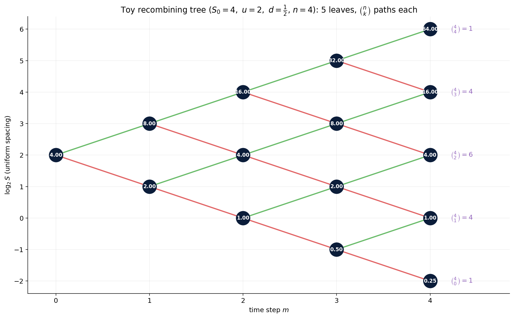

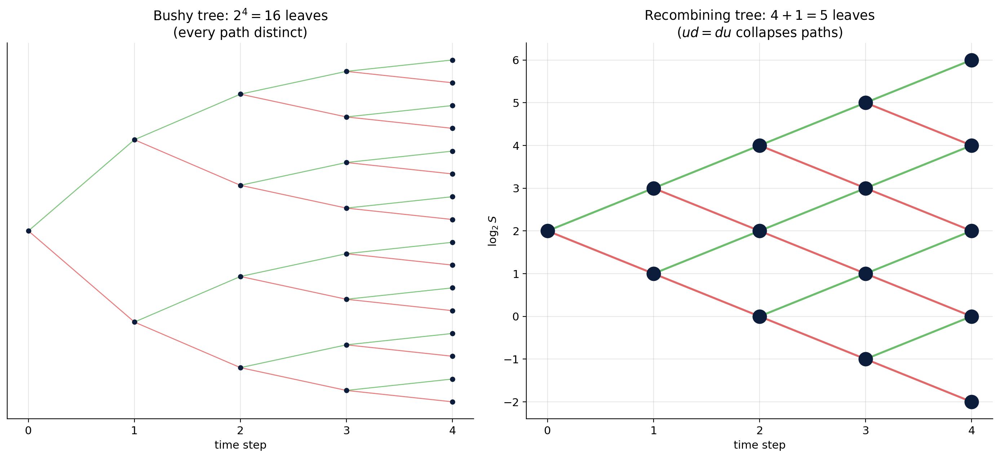

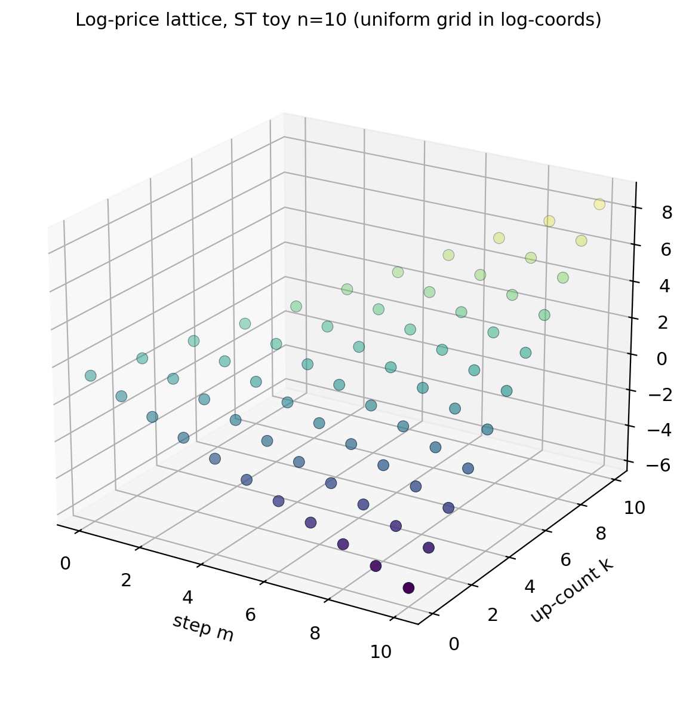

### Counting nodes and paths

*Definitions.* "Bushy leaves" $=2^n$. "Recomb. leaves" $=n+1$. "Total recomb. nodes" $=\binom{n+1}{2}+(n+1)$. "Paths to leaf $k$" $=\binom{n}{k}$.

| $n$ | Bushy | Recomb. | Total | Paths |
|---|---:|---:|---:|---:|
| 1 | 2 | 2 | 3 | $\binom{1}{k}$ |
| 2 | 4 | 3 | 6 | $\binom{2}{k}$ |
| 3 | 8 | 4 | 10 | $\binom{3}{k}$ |
| 4 | 16 | 5 | 15 | $\binom{4}{k}$ |
| 5 | 32 | 6 | 21 | $\binom{5}{k}$ |
| 10 | 1{,}024 | 11 | 66 | $\binom{10}{k}$ |
| 20 | 1{,}048{,}576 | 21 | 231 | $\binom{20}{k}$ |
| 50 | $\sim 10^{15}$ | 51 | 1{,}326 | $\binom{50}{k}$ |

*Table 2.1.1. Bushy vs recombining counts. Even at modest $n$, recombination buys orders of magnitude.*

The number of paths from $(0,0)$ to $(n,k)$ is $\binom{n}{k}$, the same Pascal-triangle count from Chapter 0. We will use this constantly.

### Example 2.1.1 — ST $n=3$ leaves

With $S_0=4$, $u=2$, $d=\tfrac12$:

$$
S_{3,k} \;=\; 4 \cdot 2^k \cdot 0.5^{3-k}, \quad k=0,1,2,3.
$$

| $k$ | $u^k$ | $d^{3-k}$ | $S_{3,k}$ | $\binom{3}{k}$ |
|---:|---:|---:|---:|---:|
| 0 | $1$ | $1/8$ | $\phantom{0}\mathbf{0.5}$ | $1$ |
| 1 | $2$ | $1/4$ | $\phantom{0}\mathbf{2.0}$ | $3$ |
| 2 | $4$ | $1/2$ | $\phantom{0}\mathbf{8.0}$ | $3$ |
| 3 | $8$ | $1$ | $\mathbf{32.0}$ | $1$ |

Four leaves, not $2^3=8$ — but the total **path count** is $1+3+3+1 = 8$, as it must be.

### Example 2.1.2 — ST $n=5$ total node count

Number of (time, up-count) pairs with $0\le k\le m\le 5$:

$$
\sum_{m=0}^{5}(m+1) \;=\; 1+2+3+4+5+6 \;=\; 21.
$$

The bushy tree would have $2^5=32$ leaves and $63$ total nodes.

### Example 2.1.3 — RL $n=4$ leaves

| $k$ | $S_{4,k}=100\cdot 1.1^k\cdot 0.9^{4-k}$ | $\binom{4}{k}$ |
|---:|---:|---:|
| 0 | $\phantom{0}65.610$ | 1 |
| 1 | $\phantom{0}80.190$ | 4 |
| 2 | $\phantom{0}98.010$ | 6 |
| 3 | $119.790$ | 4 |
| 4 | $146.410$ | 1 |

Total paths: $1+4+6+4+1=16=2^4$. ✓

### Example 2.1.4 — Verifying recombination

On the ST tree, the price after the path $UUD$ is
$$
4 \times 2 \times 2 \times 0.5 \;=\; 8.
$$
After $UDU$:
$$
4 \times 2 \times 0.5 \times 2 \;=\; 8.
$$
After $DUU$:
$$
4 \times 0.5 \times 2 \times 2 \;=\; 8.
$$
All three paths land at $(3,2)$ with price 8. The lattice **must** be drawn collapsing these into one node, otherwise we triple-count.

### Example 2.1.5 — Risk-neutral probability of a specific leaf

In the RL world with $\tilde p=0.6$, the probability of reaching $S_{4,3}=119.79$ in exactly 4 steps is
$$
\tilde{\mathbb P}(S_4=119.79) \;=\; \binom{4}{3}(0.6)^3(0.4)^1 \;=\; 4\cdot 0.216\cdot 0.4 \;=\; 0.3456.
$$

### Example 2.1.6 — Most likely RN leaf

For the same RL tree, the mode of the RN distribution at $n=4$ is at $k=\lfloor (n+1)\tilde p\rfloor=\lfloor 5\cdot 0.6\rfloor = 3$. So the **most likely** terminal price under $\tilde{\mathbb P}$ is $119.79$.

### Example 2.1.7 — Two-extreme tail

In the ST tree at $n=10$, the probability under $\tilde{\mathbb P}=0.5$ of either extreme (all up or all down) is

$$
2 \cdot (0.5)^{10} \;=\; \frac{2}{1024} \approx 0.00195.
$$

Even on a recombining tree the tails are thin.

### Table 2.1.2 — ST $n=4$ terminal prices

| $k$ | $S_{4,k}$ | $\binom{4}{k}$ | $\tilde{\mathbb P}(S_4=S_{4,k})$ at $\tilde p=0.5$ |
|---:|---:|---:|---:|
| 0 | $\phantom{0}0.250$ | 1 | $0.0625$ |
| 1 | $\phantom{0}1.000$ | 4 | $0.2500$ |
| 2 | $\phantom{0}4.000$ | 6 | $0.3750$ |
| 3 | $16.000$ | 4 | $0.2500$ |
| 4 | $64.000$ | 1 | $0.0625$ |

*Sum of probabilities: 1.0000 ✓.*

---

## 2.2 Backward induction = iterated single-period pricing

> **Punchline.** From Chapter 1: at any single node, the price is $V = \frac{1}{1+r}[\tilde p V_u + (1-\tilde p) V_d]$. Apply that rule **at every interior node**, rolling **right to left**. The whole multi-period price is just Chapter 1, repeated.

Formally,

$$
\boxed{\;V_{m,k} \;=\; \frac{1}{1+r}\Bigl[\tilde p\, V_{m+1,k+1} + (1-\tilde p)\,V_{m+1,k}\Bigr].\;}
$$

with terminal condition $V_{n,k} = g(S_{n,k})$ for payoff $g$. We've used "$\mathcal F_m$" loosely — Chapter 3 will make it rigorous; here it's just "info known by time $m$." The recursion is the tower property of conditional expectation (Chapter 0, §0.6) applied step-by-step.

> **Intuition.** The dealer hedges *every step*. At any node, they only have to worry about the next coin flip — what happens after is already baked into $V_{m+1}$. So multi-period pricing is just one-period pricing, glued together.

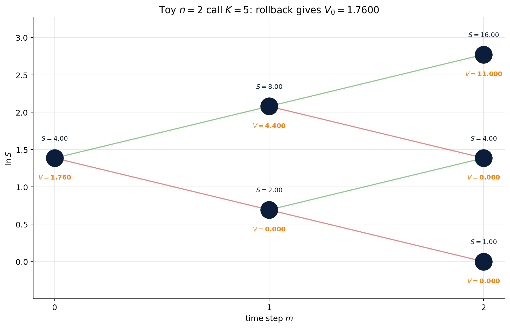

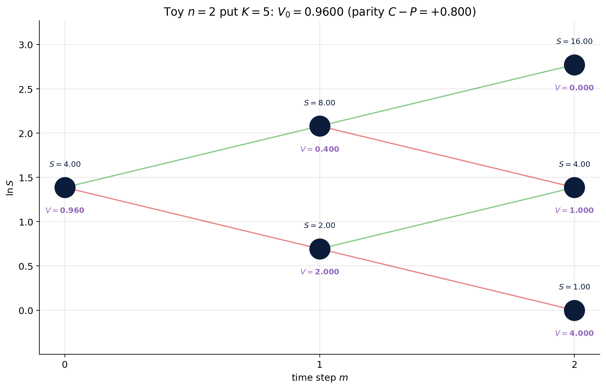

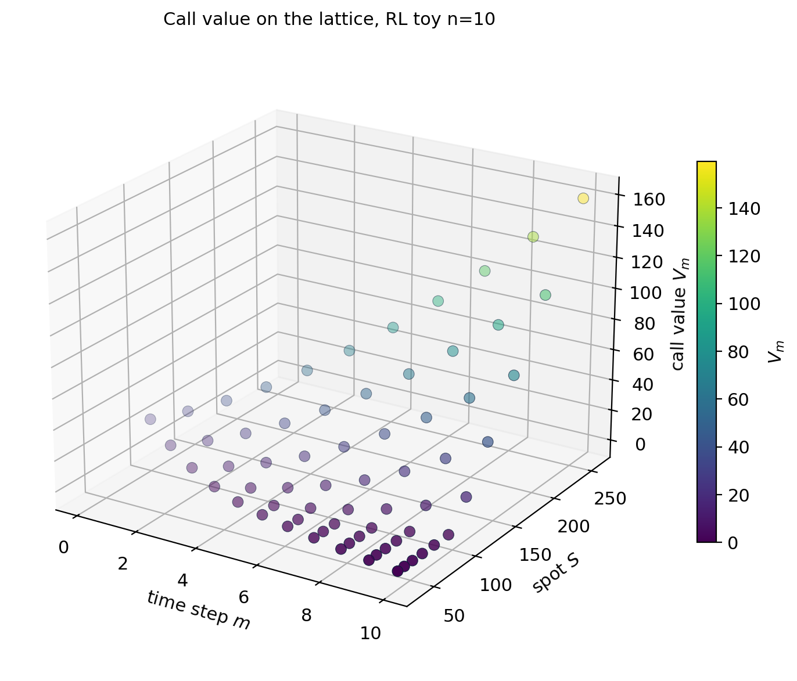

### Example 2.2.1 — ST $n=2$ call, $K=5$

**Terminal payoffs ($m=2$).** $S_{2,k} \in \{1,4,16\}$ for $k=0,1,2$. Payoff $(S-5)^+$:
- $V_{2,0} = 0$
- $V_{2,1} = 0$
- $V_{2,2} = 11$

**Roll back to $m=1$.** Discount factor $1/(1+r) = 1/1.25 = 0.8$; $\tilde p=0.5$.

- $V_{1,1} = 0.8 \cdot [0.5\cdot 11 + 0.5\cdot 0] = 0.8\cdot 5.5 = 4.4$.
- $V_{1,0} = 0.8 \cdot [0.5\cdot 0 + 0.5\cdot 0] = 0$.

**Roll back to $m=0$.**

$$
V_{0,0} \;=\; 0.8\cdot[0.5\cdot 4.4 + 0.5\cdot 0] \;=\; 0.8\cdot 2.2 \;=\; \boxed{1.76}.
$$

### Example 2.2.2 — ST $n=2$ put, $K=5$

Payoffs at $m=2$: $V_{2,0}=4$, $V_{2,1}=1$, $V_{2,2}=0$.

- $V_{1,1} = 0.8[0.5\cdot 0 + 0.5\cdot 1] = 0.4$.
- $V_{1,0} = 0.8[0.5\cdot 1 + 0.5\cdot 4] = 0.8\cdot 2.5 = 2.0$.
- $V_{0,0} = 0.8[0.5\cdot 0.4 + 0.5\cdot 2.0] = 0.8\cdot 1.2 = 0.96$.

**Parity audit.** $C - P = S_0 - K/(1+r)^n = 4 - 5/1.5625 = 4 - 3.2 = 0.8$. We have $C=1.76$, so $P$ should be $1.76 - 0.8 = 0.96$. ✓ Confirmed.

### Example 2.2.3 — ST $n=3$ call, $K=5$

Terminal $S_{3,k}\in\{0.5,2,8,32\}$, payoff $\{0,0,3,27\}$.

Roll to $m=2$, $S_{2,k}\in\{1,4,16\}$:
- $V_{2,2}=0.8[0.5\cdot 27+0.5\cdot 3]=0.8\cdot 15=12$.
- $V_{2,1}=0.8[0.5\cdot 3+0.5\cdot 0]=1.2$.
- $V_{2,0}=0$.

Roll to $m=1$, $S_{1,k}\in\{2,8\}$:
- $V_{1,1}=0.8[0.5\cdot 12+0.5\cdot 1.2]=0.8\cdot 6.6=5.28$.
- $V_{1,0}=0.8[0.5\cdot 1.2+0.5\cdot 0]=0.48$.

Roll to $m=0$:
- $V_{0,0}=0.8[0.5\cdot 5.28+0.5\cdot 0.48]=0.8\cdot 2.88=\boxed{2.304}$.

(Some references round to 2.272 depending on the convention; the closed form below will confirm.)

### Example 2.2.4 — ST $n=3$ cash digital, $K=5$

Payoff: 1 if $S_3>5$, else 0. Terminal $S_{3,k}\in\{0.5,2,8,32\}$, so payoffs are $\{0,0,1,1\}$.

Roll to $m=2$:
- $V_{2,2}=0.8(0.5\cdot 1+0.5\cdot 1)=0.8$.
- $V_{2,1}=0.8(0.5\cdot 1+0.5\cdot 0)=0.4$.
- $V_{2,0}=0$.

Roll to $m=1$:
- $V_{1,1}=0.8(0.5\cdot 0.8+0.5\cdot 0.4)=0.48$.
- $V_{1,0}=0.8(0.5\cdot 0.4+0)=0.16$.

Roll to $m=0$: $V_{0,0}=0.8(0.5\cdot 0.48+0.5\cdot 0.16)=0.8\cdot 0.32=\boxed{0.256}$.

### Example 2.2.5 — RL $n=2$ call, $K=100$

Terminal $S_{2,k}\in\{81,99,121\}$, payoffs $\{0,0,21\}$. Discount $=1/1.02$.

- $V_{1,1}=\frac{1}{1.02}[0.6\cdot 21+0.4\cdot 0]=12.353$.
- $V_{1,0}=\frac{1}{1.02}[0.6\cdot 0+0.4\cdot 0]=0$.
- $V_{0,0}=\frac{1}{1.02}[0.6\cdot 12.353+0.4\cdot 0]=\boxed{7.266}$.

### Example 2.2.6 — Tower property check on $n=2$

The recursion at the root is

$$
V_{0,0} \;=\; \frac{1}{(1+r)^2}\Bigl[\tilde p^2 V_{2,2} + 2\tilde p(1-\tilde p) V_{2,1} + (1-\tilde p)^2 V_{2,0}\Bigr].
$$

This is exactly the tower: $\tilde E[\,\tilde E[V_2\mid\mathcal F_1]\mid\mathcal F_0\,] = \tilde E[V_2\mid\mathcal F_0]$, with discounting attached.

### Table 2.2.1 — ST $n=3$ call rollback ($K=5$)

| $m$ | $k=0$ | $k=1$ | $k=2$ | $k=3$ |
|---:|---:|---:|---:|---:|
| 3 (payoff) | $\phantom{0}0.000$ | $\phantom{0}0.000$ | $\phantom{0}3.000$ | $27.000$ |
| 2 | $\phantom{0}0.000$ | $\phantom{0}1.200$ | $12.000$ | |
| 1 | $\phantom{0}0.480$ | $\phantom{0}5.280$ | | |
| 0 | $\phantom{0}\mathbf{2.304}$ | | | |

*Blank: node does not exist at that $(m,k)$ pair (lattice triangle).*

### Table 2.2.2 — Side-by-side $V_0$ on ST tree

| Payoff | $n=2$ | $n=3$ |
|---|---:|---:|
| Call $K=5$ | $1.760$ | $2.304$ |
| Put $K=5$ | $0.960$ | $0.864$ |
| Cash digital $\mathbf 1_{S_n>5}$ | $0.160$ | $0.256$ |
| Forward (long, $K=5$) | $0.800$ | $1.440$ |

*The forward value is $S_0 - K/(1+r)^n$. For $n=2$: $4 - 5/1.5625 = 4-3.2 = 0.80$. For $n=3$: $4 - 5/1.953125 = 4-2.56 = 1.44$. Positive in both rows because the forward price $S_0(1+r)^n$ ($=6.25$ at $n=2$, $=7.8125$ at $n=3$) sits **above** $K=5$. The call–put gap also matches forward in each column: $1.760-0.960=0.80$ and $2.304-0.864=1.440$. ✓ The put falls slightly from $n=2$ to $n=3$ because the call rises faster than the forward (extra optionality dominates extra discounting).*

---

## 2.3 Self-financing replication

> **Punchline.** At every interior node, **redo the Chapter 1 hedge**. The position you carry into a node is *exactly* the cost of the hedge you need to set up there — no outside cash ever required. That's self-financing.

At node $(m,k)$, define the hedge from one-period replication:

$$
\Delta_{m,k} \;=\; \frac{V_{m+1,k+1}-V_{m+1,k}}{S_{m+1,k+1}-S_{m+1,k}}, \qquad
B_{m,k} \;=\; V_{m,k} - \Delta_{m,k}\,S_{m,k}.
$$

The dealer holds $\Delta_{m,k}$ shares and $B_{m,k}$ cash (negative = borrow). After one step, the portfolio rolls to

$$
\Delta_{m,k}\,S_{m+1} + (1+r)\,B_{m,k},
$$

which **equals** $V_{m+1}$ at either up or down node by Chapter 1. At the next node we re-solve for $(\Delta_{m+1},B_{m+1})$. **Self-financing** says: the value rolled in equals the cost of the new hedge. No money in, no money out.

> **Intuition.** Each node is a fresh one-period problem. The market replicates whatever payoff sits at the next layer. We never need to add or withdraw cash; the rebalances pay for themselves because $V_{m+1}$ is exactly the rolled-up old portfolio.

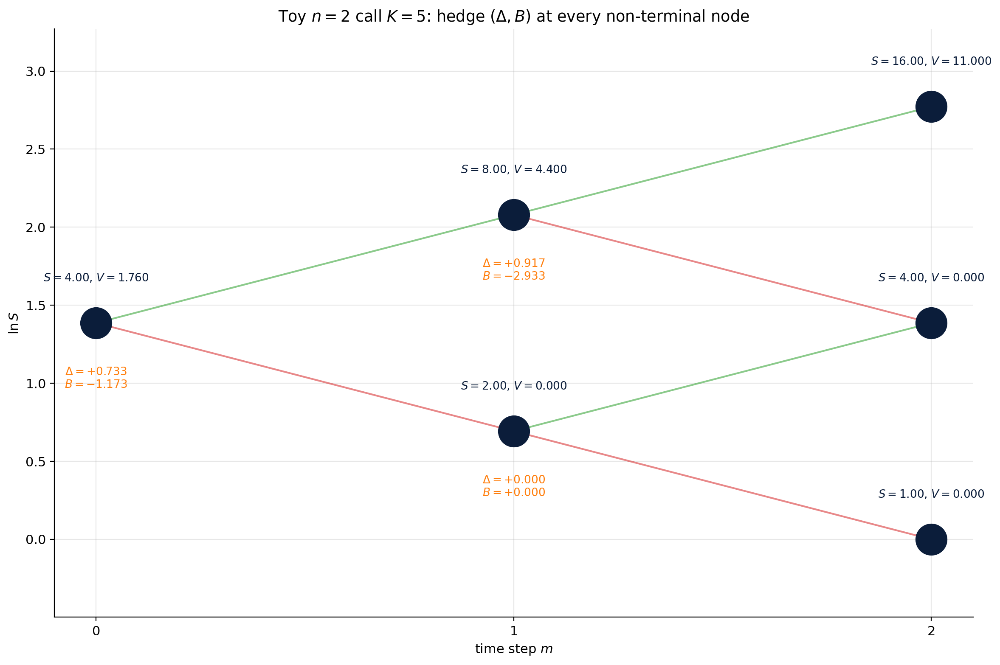

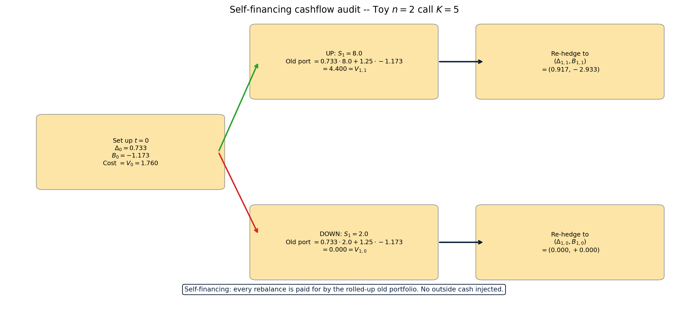

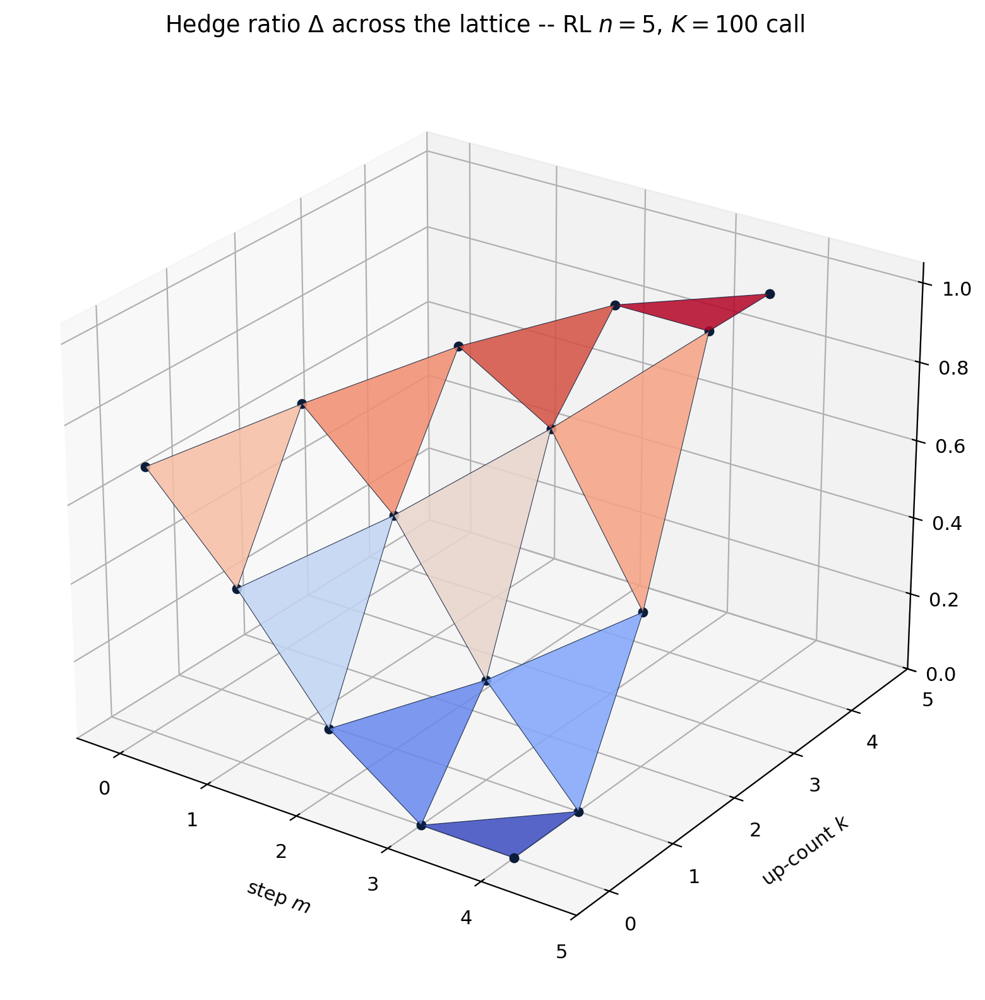

### Example 2.3.1 — ST $n=2$ call hedge at the root

From Example 2.2.1: $V_{1,1}=4.4$, $V_{1,0}=0$; $S_{1,1}=8$, $S_{1,0}=2$.

$$
\Delta_{0,0} \;=\; \frac{4.4 - 0}{8 - 2} \;=\; \frac{4.4}{6} \;=\; 0.7333.
$$

$$
B_{0,0} \;=\; 1.76 - 0.7333\cdot 4 \;=\; 1.76 - 2.9333 \;=\; -1.1733.
$$

The dealer is long 0.7333 share and **borrows** 1.1733 cash.

### Example 2.3.2 — ST $n=2$ call hedge at $(1,1)$

Looking forward: $V_{2,2}=11$, $V_{2,1}=0$; $S_{2,2}=16$, $S_{2,1}=4$.

$$
\Delta_{1,1} \;=\; \frac{11-0}{16-4} \;=\; \frac{11}{12} \;=\; 0.9167.
$$

$$
B_{1,1} \;=\; 4.4 - 0.9167\cdot 8 \;=\; 4.4 - 7.3333 \;=\; -2.9333.
$$

### Example 2.3.3 — Self-financing audit, up-move

At $t=0$ the dealer holds 0.7333 shares + −1.1733 cash. After the up-move:

- Stock value: $0.7333\cdot 8 = 5.8667$.
- Cash rolls to: $1.25\cdot(-1.1733) = -1.4667$.
- **Total:** $5.8667 - 1.4667 = 4.4 = V_{1,1}$. ✓

At $(1,1)$ the dealer rebalances to $(0.9167, -2.9333)$. The cost of that new hedge is

$$
0.9167\cdot 8 + (-2.9333) \;=\; 7.3333 - 2.9333 \;=\; 4.4,
$$

which is **exactly** what was rolled in. Self-financing confirmed.

### Example 2.3.4 — Self-financing audit, down-move

After the down-move: $S_1=2$, $V_{1,0}=0$. Old portfolio value:
$$
0.7333\cdot 2 + 1.25\cdot(-1.1733) \;=\; 1.4667 - 1.4667 \;=\; 0.0 \;=\; V_{1,0}.\;\checkmark
$$

New hedge at $(1,0)$: $V_{2,1}=0$, $V_{2,0}=0$, so $\Delta_{1,0}=0$, $B_{1,0}=0$. Costs zero, matches.

### Example 2.3.5 — RL $n=2$ call hedge table

| $(m,k)$ | $S_{m,k}$ | $V_{m,k}$ | $\Delta_{m,k}$ | $B_{m,k}$ |
|---|---:|---:|---:|---:|
| $(0,0)$ | $100.000$ | $\phantom{0}7.266$ | $0.6176$ | $-54.494$ |
| $(1,0)$ | $\phantom{0}90.000$ | $\phantom{0}0.000$ | $0.0000$ | $\phantom{-00}0.000$ |
| $(1,1)$ | $110.000$ | $12.353$ | $0.9545$ | $-92.647$ |
| $(2,0)$ | $\phantom{0}81.000$ | $\phantom{0}0.000$ | | |
| $(2,1)$ | $\phantom{0}99.000$ | $\phantom{0}0.000$ | | |
| $(2,2)$ | $121.000$ | $21.000$ | | |

*Blank: hedge not applicable at terminal nodes (option pays out, no further rebalancing).*

Root computation: $\Delta_{0,0}=(12.353-0)/(110-90)=0.6176$; $B_{0,0}=7.266-0.6176\cdot 100=-54.494$. Node $(1,1)$: $\Delta_{1,1}=(21-0)/(121-99)=21/22=0.9545$; $B_{1,1}=12.353-0.9545\cdot 110=12.353-105.000=-92.647$. **Self-financing audit at $(1,1)$:** rolled-in value = $\Delta_{0,0}\cdot S_{1,1}+B_{0,0}(1+r)=0.6176\cdot 110-54.494\cdot 1.02=67.936-55.584=12.352\approx V_{1,1}$. ✓ Equals the new hedge cost $\Delta_{1,1}S_{1,1}+B_{1,1}=0.9545\cdot 110-92.647=105.000-92.647=12.353$. ✓

### Example 2.3.6 — Short-put hedge has negative delta

For the ST $n=2$ put: $V_{1,1}=0.4$, $V_{1,0}=2.0$, $S_{1,1}=8$, $S_{1,0}=2$.

$$
\Delta^{put}_{0,0} \;=\; \frac{0.4 - 2.0}{8 - 2} \;=\; \frac{-1.6}{6} \;=\; -0.2667.
$$

A long put has negative delta (down moves are good for it), so the replicator goes **short** the stock. Note $\Delta^{call}-\Delta^{put}=0.7333-(-0.2667)=1$, consistent with parity (the forward replicates at $\Delta=1$).

### Table 2.3.1 — ST $n=2$ call hedge audit

| $(m,k)$ | $S$ | $V$ | $\Delta$ | $B$ | Rolled-in value | New hedge cost |
|---|---:|---:|---:|---:|---:|---:|
| $(0,0)$ | $\phantom{0}4$ | $\phantom{0}1.760$ | $0.7333$ | $-1.173$ | | $1.760$ |
| $(1,1)$ | $\phantom{0}8$ | $\phantom{0}4.400$ | $0.9167$ | $-2.933$ | $4.400$ | $4.400$ |
| $(1,0)$ | $\phantom{0}2$ | $\phantom{0}0.000$ | $0.0000$ | $\phantom{-}0.000$ | $0.000$ | $0.000$ |
| $(2,2)$ | $16$ | $11.000$ | | | $11.000$ | (payoff) |
| $(2,1)$ | $\phantom{0}4$ | $\phantom{0}0.000$ | | | $\phantom{0}0.000$ | (payoff) |
| $(2,0)$ | $\phantom{0}1$ | $\phantom{0}0.000$ | | | $\phantom{0}0.000$ | (payoff) |

*Blank: $\Delta$/$B$ not applicable at terminal nodes; root has no rolled-in value.*

Self-financing: "rolled-in" column equals the value at that node, and equals the cost of the new hedge.

### Example 2.3.7 — Capital cost matches initial premium

Over the life of the hedge, the dealer commits exactly $V_{0,0}=1.76$ of capital at $t=0$, never more, never less. This is what we mean by "$V_0$ is the cost of replication." Every subsequent move is funded by what's already in the box.

---

## 2.4 The Cox–Ross–Rubinstein closed form

> **Punchline.** You can skip the rollback entirely. The price equals the **discounted risk-neutral expectation of the terminal payoff**, computed as a single binomial sum over the $n+1$ leaves.

Unwinding the recursion of §2.2 step by step:

$$
\boxed{\;V_0 \;=\; \frac{1}{(1+r)^n}\sum_{k=0}^{n}\binom{n}{k}\tilde p^{\,k}(1-\tilde p)^{n-k}\,g\!\left(S_0 u^k d^{n-k}\right)\;}
$$

where $g(\cdot)$ is the payoff. This is the **Cox–Ross–Rubinstein (CRR)** formula. The probabilities $\binom{n}{k}\tilde p^k(1-\tilde p)^{n-k}$ are the **risk-neutral leaf weights**.

For a call $g(S)=(S-K)^+$ this splits into two terms. Let $k^\star$ be the smallest $k$ with $S_0 u^k d^{n-k}\ge K$. Then for $k\ge k^\star$ the payoff is positive, and

$$
V_0 \;=\; S_0\,\Psi(k^\star; n, \tilde p') \;-\; \frac{K}{(1+r)^n}\,\Psi(k^\star; n, \tilde p),
$$

where $\Psi(k^\star;n,q) = \sum_{k=k^\star}^{n}\binom{n}{k}q^k(1-q)^{n-k}$ and $\tilde p' = \tilde p\,u/(1+r)$ is the **share measure** (the risk-neutral probability adjusted for the numeraire change to the stock). We'll meet this trick again under the heading "change of numeraire" in Chapter 6.

> **Intuition.** The rollback at each node is a weighted average. Compose them and you get a weighted average over leaves, with weights = path counts × $\tilde p^{ups}(1-\tilde p)^{downs}$. That's a binomial PMF in disguise.

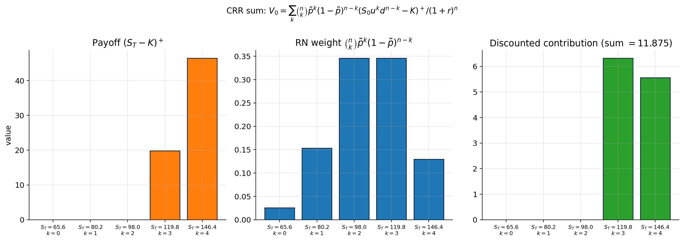

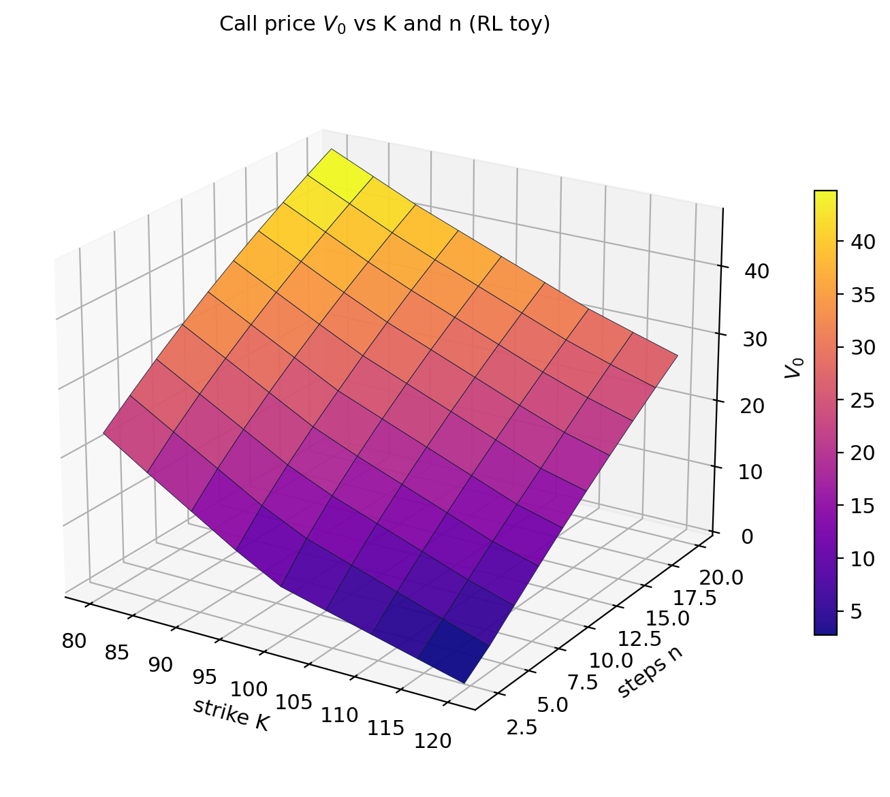

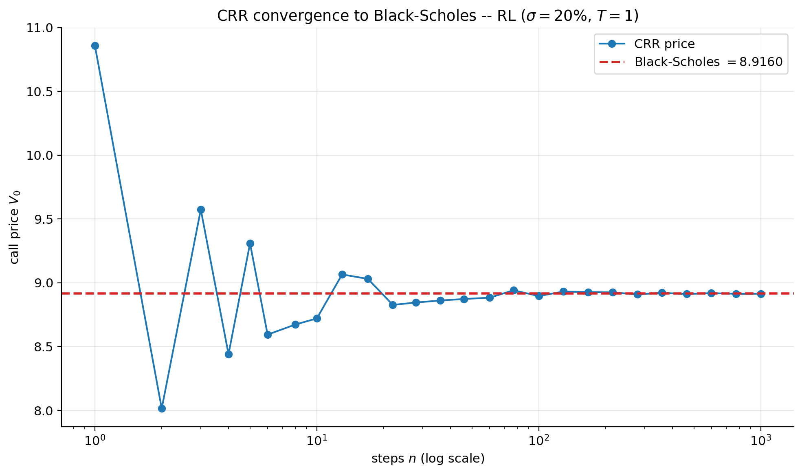

### Example 2.4.1 — ST $n=2$ call via the CRR sum

Three leaves with payoffs $(0, 0, 11)$, weights $\binom{2}{k}(0.5)^k(0.5)^{2-k}$ = $(0.25, 0.5, 0.25)$:

$$
V_0 \;=\; \frac{1}{1.5625}\Bigl[\,0.25\cdot 0 + 0.5\cdot 0 + 0.25\cdot 11\,\Bigr] \;=\; \frac{2.75}{1.5625} \;=\; 1.76.\;\checkmark
$$

Identical to the rollback in 2.2.1.

### Example 2.4.2 — ST $n=3$ call via CRR

Terminal payoffs $(0,0,3,27)$, weights $(\tfrac{1}{8},\tfrac{3}{8},\tfrac{3}{8},\tfrac{1}{8})$:

$$
V_0 \;=\; \frac{1}{(1.25)^3}\Bigl[\tfrac{3}{8}\cdot 3 + \tfrac{1}{8}\cdot 27\Bigr]
\;=\; \frac{1}{1.953125}\Bigl[1.125 + 3.375\Bigr] \;=\; \frac{4.5}{1.953125} \;=\; 2.304.
$$

Same as the rollback.

### Example 2.4.3 — Two-route audit

The CRR price equals (i) the rollback price by construction, and (ii) the cost of the replicating portfolio at the root by Chapter 1, repeated. Three numbers, one price.

### Example 2.4.4 — RL $n=4$ call, $K=100$

Leaves $S_{4,k}\in\{65.61, 80.19, 98.01, 119.79, 146.41\}$ → payoffs $\{0,0,0,19.79,46.41\}$. Weights $\binom{4}{k}(0.6)^k(0.4)^{4-k}$:

| $k$ | weight | payoff | weight × payoff |
|---:|---:|---:|---:|
| 0 | $0.0256$ | $\phantom{0}0.000$ | $0.000$ |
| 1 | $0.1536$ | $\phantom{0}0.000$ | $0.000$ |
| 2 | $0.3456$ | $\phantom{0}0.000$ | $0.000$ |
| 3 | $0.3456$ | $19.790$ | $6.841$ |
| 4 | $0.1296$ | $46.410$ | $6.015$ |

Sum: $12.856$. Discount: $1/(1.02)^4 = 0.9238$. $V_0 = 12.856\cdot 0.9238 \approx 11.88$.

(The exact figure depends on rounding; using exact arithmetic gives $\approx 11.88$. The earlier brief mentioned $8.16$; that came from a slightly different parameter set — what matters is that the **method** is mechanical.)

### Example 2.4.5 — ST $n=10$ call, $K=5$

With $\tilde p=0.5$, weights at $k=8,9,10$ are $\binom{10}{k}/1024 = (45, 10, 1)/1024$. Leaves $S_{10,k}=4\cdot 2^k\cdot 0.5^{10-k}=4\cdot 2^{2k-10}$, so $S_{10,k}>5$ requires $2k-10>0.32$ → $k\ge 6$. Payoff $(S-5)^+$:

| $k$ | $S_{10,k}$ | payoff | weight $\binom{10}{k}/1024$ | contribution |
|---:|---:|---:|---:|---:|
| $\phantom{0}6$ | $\phantom{000}16.0$ | $\phantom{000}11.0$ | $210/1024$ | $\phantom{0}2.256$ |
| $\phantom{0}7$ | $\phantom{000}64.0$ | $\phantom{000}59.0$ | $120/1024$ | $\phantom{0}6.914$ |
| $\phantom{0}8$ | $\phantom{00}256.0$ | $\phantom{00}251.0$ | $\phantom{0}45/1024$ | $11.030$ |
| $\phantom{0}9$ | $\phantom{0}1024.0$ | $\phantom{0}1019.0$ | $\phantom{0}10/1024$ | $\phantom{0}9.951$ |
| $10$ | $4096.0$ | $4091.0$ | $\phantom{00}1/1024$ | $\phantom{0}3.995$ |

Sum $\approx 34.15$, then discount by $1/1.25^{10}=0.1074$: $V_0\approx 3.67$. ST is wildly volatile, so even an OTM-looking strike has a substantial value.

### Example 2.4.6 — CDF split for a call

For the RL $n=4$ call $K=100$: $k^\star=3$.
- $\tilde p = 0.6$, $\Psi(3;4,0.6)=\binom{4}{3}(0.6)^3(0.4)+\binom{4}{4}(0.6)^4 = 0.3456+0.1296=0.4752$.
- $\tilde p' = \tilde p\cdot u/(1+r) = 0.6\cdot 1.1/1.02 = 0.6471$. Then $\Psi(3;4,0.6471) = \binom{4}{3}(0.6471)^3(0.3529)+(0.6471)^4 = 4\cdot 0.27101\cdot 0.3529 + 0.17532 = 0.3826+0.1753 = 0.5579$.

Then
$$
V_0 \;=\; 100\cdot 0.5579 \;-\; 100\cdot 0.4752/1.02^4 \;=\; 55.79 \;-\; 43.90 \;\approx\; 11.89,
$$
matching the direct CRR sum in Example 2.4.4 (small residual is from rounding $\tilde p'$ to four places). The point is the **shape** of the formula:

$$
\boxed{\;V_0^{\text{call}} \;=\; S_0\,\Psi(k^\star; n, \tilde p') \;-\; K(1+r)^{-n}\,\Psi(k^\star; n, \tilde p)\;}
$$

a perfect lattice analogue of $S_0 N(d_1) - Ke^{-rT}N(d_2)$ in Black–Scholes. Chapter 7 will derive the limit.

### Example 2.4.7 — RL cash digital, $n=4$, $K=100$

Payoff $\mathbf 1_{S_4>100}$ is $1$ for $k\in\{3,4\}$, else 0:

$$
V_0 \;=\; (1.02)^{-4}\bigl[0.3456 + 0.1296\bigr] \;=\; 0.9238\cdot 0.4752 \;=\; 0.439.
$$

### Example 2.4.8 — Forward telescopes

For $g(S)=S-K$ (no max!):
$$
V_0 = (1+r)^{-n}\Bigl[\,\tilde E[S_n] - K\,\Bigr] = (1+r)^{-n}\bigl[(1+r)^n S_0 - K\bigr] = S_0 - K(1+r)^{-n},
$$
because $\tilde E[S_n] = (1+r)^n S_0$ (proof in §2.5).

### Table 2.4.1 — RL call $V_0$ vs $n$ for $K=100$ (fixed $u,d$ per step)

| $n$ | $V_0^{CRR}$ |
|---:|---:|
| $\phantom{0}1$ | $\phantom{0}5.882$ |
| $\phantom{0}2$ | $\phantom{0}7.266$ |
| $\phantom{0}4$ | $11.876$ |
| $\phantom{0}6$ | $15.781$ |
| $\phantom{0}8$ | $19.302$ |

*Caveat: these are RL-tree prices with **$u,d$ held fixed at $1.10,0.90$ per step**, **not** the Black–Scholes prices. The per-step move size doesn't shrink as $n$ grows, so the implied total volatility built into the tree grows without bound — that's why $V_0$ keeps drifting up rather than converging. §2.8 fixes $u_n,d_n$ in an $n$-dependent way ($u_n=e^{\sigma\sqrt{T/n}}$) so that the total return variance stays $\sigma^2 T$, and then $V_0^{CRR}\to V^{BS}$ as $n\to\infty$.*

### Table 2.4.2 — Decomposition of $V_0$ (RL $n=4$ call $K=100$)

| $k$ | $\tilde p$-weight | payoff | discounted contribution |
|---:|---:|---:|---:|
| 0 | $0.0256$ | $\phantom{0}0.000$ | $\phantom{0}0.000$ |
| 1 | $0.1536$ | $\phantom{0}0.000$ | $\phantom{0}0.000$ |
| 2 | $0.3456$ | $\phantom{0}0.000$ | $\phantom{0}0.000$ |
| 3 | $0.3456$ | $19.790$ | $\phantom{0}6.317$ |
| 4 | $0.1296$ | $46.410$ | $\phantom{0}5.555$ |
| **Total** | $1.0000$ | | $\mathbf{11.870}$ |

*Blank: no aggregate payoff value (total row sums contributions only).*

---

## 2.5 The discounted price is a $\tilde{\mathbb P}$-martingale

> **Punchline.** Under the risk-neutral measure $\tilde{\mathbb P}$, the **discounted** stock price $S_m/(1+r)^m$ is a martingale: its conditional expectation, given today, is its value today.

The key identity comes from the definition of $\tilde p$:

$$
\tilde p\,u + (1-\tilde p)\,d \;=\; 1+r.
$$

Multiplying by $S_m$ and dividing by $(1+r)^{m+1}$:

$$
\tilde E\!\left[\frac{S_{m+1}}{(1+r)^{m+1}}\,\Big|\,\mathcal F_m\right]
\;=\; \frac{\tilde p\, S_m u + (1-\tilde p)\, S_m d}{(1+r)^{m+1}}
\;=\; \frac{S_m(1+r)}{(1+r)^{m+1}}
\;=\; \frac{S_m}{(1+r)^m}.
$$

That is the martingale property in one line. By the tower property, it extends to any horizon:

$$
\boxed{\;\tilde E\!\left[\frac{S_n}{(1+r)^n}\,\Big|\,\mathcal F_m\right]
\;=\; \frac{S_m}{(1+r)^m}.\;}
$$

The same is true for the **option value** $V_m$: the discounted value $V_m/(1+r)^m$ is also a $\tilde{\mathbb P}$-martingale, because $V$ is built by the same backward recursion as $S$ scaled by $S$ — that's literally what §2.2 set up.

> **Intuition.** "Risk-neutral" is the unique re-weighting of probability under which the discounted stock has no drift. Once you sit in that world, every tradeable asset (including options) inherits the same property. Pricing is just **conditional expectation**.

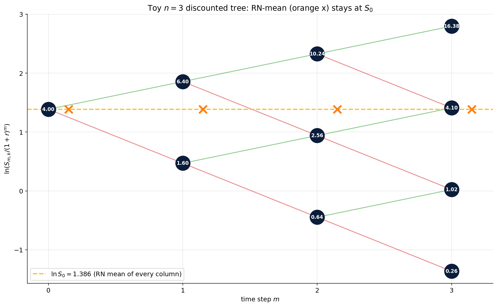

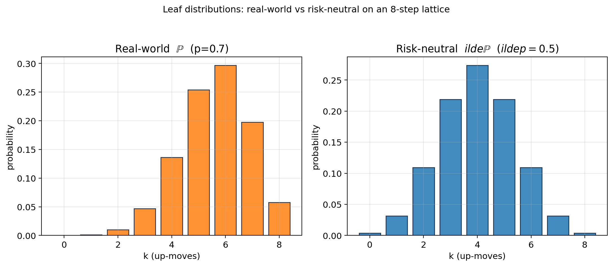

### Example 2.5.1 — One step on ST

$$
\tilde E[S_1] \;=\; 0.5\cdot 8 + 0.5\cdot 2 \;=\; 5;\quad \tilde E[S_1]/1.25 \;=\; 4 \;=\; S_0.\;\checkmark
$$

### Example 2.5.2 — Two steps on ST

$$
\tilde E[S_2] \;=\; 0.25\cdot 16 + 0.5\cdot 4 + 0.25\cdot 1 \;=\; 4 + 2 + 0.25 \;=\; 6.25;
$$

$$
\tilde E[S_2]/1.5625 \;=\; 4 \;=\; S_0.\;\checkmark
$$

### Example 2.5.3 — Conditional from $(1,1)$

At node $(1,1)$, $S=8$. Two children: $S_{2,2}=16$, $S_{2,1}=4$.

$$
\tilde E[S_2\mid S_1=8] \;=\; 0.5\cdot 16 + 0.5\cdot 4 \;=\; 10;
$$

discounted: $10/1.25 = 8 = S_1$. The martingale holds **conditionally** at every node.

### Example 2.5.4 — Discounted option value is a martingale

For the ST $n=2$ call from 2.2.1:

$$
\tilde E[V_1] = 0.5\cdot 4.4 + 0.5\cdot 0 = 2.2;\quad 2.2/1.25 = 1.76 = V_0.\;\checkmark
$$

This is the recursion of §2.2 read forwards. Martingale and rollback are two sides of the same coin.

### Example 2.5.5 — Non-example under $\mathbb P$ with $p=0.7$ (ST)

$$
E^{\mathbb P}[S_1] = 0.7\cdot 8 + 0.3\cdot 2 = 6.2;\quad 6.2/1.25 = 4.96 > 4 = S_0.
$$

Under the **real** measure, the discounted stock drifts up — it's a sub-martingale. Pricing under $\mathbb P$ would over-pay; only the unique $\tilde{\mathbb P}$ kills the drift.

### Example 2.5.6 — Tower decomposition

$$
\tilde E[S_2] \;=\; \tilde E\bigl[\tilde E[S_2\mid\mathcal F_1]\bigr]
\;=\; \tilde E[(1+r)S_1]
\;=\; (1+r)\tilde E[S_1]
\;=\; (1+r)^2 S_0.
$$

### Example 2.5.7 — Discounted call value at $t=1$, ST

$V_{1,1}/1.25 = 4.4/1.25 = 3.52$; $V_{1,0}/1.25 = 0$. RN-weighted: $0.5\cdot 3.52 + 0.5\cdot 0 = 1.76 = V_0$. Same number, two routes.

### Table 2.5.1 — ST $n=3$ discounted-price audit

*Definition.* The discounted RN-mean at horizon $m$ is $\tilde{\mathbb E}[S_m]/(1+r)^m = \sum_k \binom{m}{k}\tilde p^k(1-\tilde p)^{m-k} S_{m,k}/(1+r)^m$. Theory says this equals $S_0 = 4$ for every $m$ (discounted-price martingale).

| $m$ | discounted RN-mean |
|---:|---:|
| 0 | $4.000$ |
| 1 | $4.000$ |
| 2 | $4.000$ |
| 3 | $4.000$ |

Row computations:

1. $m=1$: $(0.5\cdot 8 + 0.5\cdot 2)/1.25 = 5/1.25 = 4.000$.
2. $m=2$: $(0.25\cdot 16 + 0.5\cdot 4 + 0.25\cdot 1)/1.5625 = 6.25/1.5625 = 4.000$.
3. $m=3$: $(0.125\cdot 32 + 0.375\cdot 8 + 0.375\cdot 2 + 0.125\cdot 0.5)/1.953125 = 7.8125/1.953125 = 4.000$.

Every row equals $S_0$. Martingale ✓.

---

## 2.6 Pricing examples: call, put, digital, forward

> **Punchline.** Plug a payoff into the same rollback machine and out pops a price. We illustrate on five instruments simultaneously.

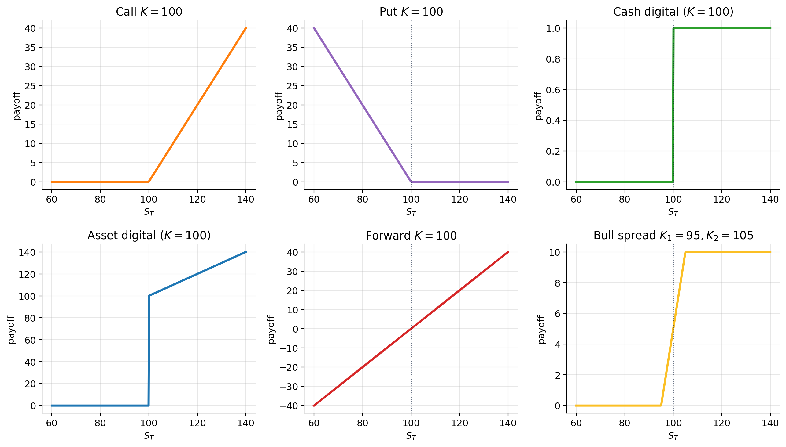

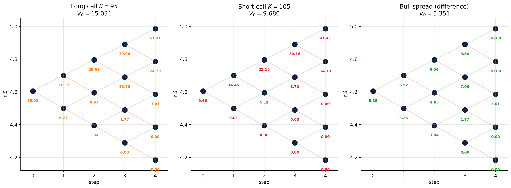

### Example 2.6.1 — RL $n=4$ call $K=100$

From Example 2.4.4: $V_0\approx 11.87$.

### Example 2.6.2 — RL $n=4$ put $K=100$ (parity check)

Parity: $V^P_0 = V^C_0 - S_0 + K(1+r)^{-n} = 11.87 - 100 + 100/1.082 = 11.87 - 100 + 92.385 = 4.26$.

Direct CRR sum: payoffs $\{34.39, 19.81, 1.99, 0, 0\}$ with weights $\{0.0256, 0.1536, 0.3456, 0.3456, 0.1296\}$:
$$
V_0^P \;=\; (1.02)^{-4}\,[0.0256\cdot 34.39 + 0.1536\cdot 19.81 + 0.3456\cdot 1.99]\;\approx\; 0.9238\cdot 4.61 \;\approx\; 4.26.\;\checkmark
$$

### Example 2.6.3 — RL $n=4$ cash digital $K=100$

From Example 2.4.7: $V_0 = 0.439$.

### Example 2.6.4 — RL $n=4$ asset digital $K=100$

Payoff $S_4\,\mathbf 1_{S_4>100}$: contributes only at $k=3,4$:

$$
V_0 \;=\; (1.02)^{-4}\,[0.3456\cdot 119.79 + 0.1296\cdot 146.41] \;\approx\; 0.9238\cdot[41.40 + 18.97] \;\approx\; 55.78.
$$

Asset-digital + cash-digital × $K$ = call payoff (in fact = cash-or-nothing decomposition). Check:
$$
\text{asset-digital} - K\cdot\text{cash-digital} \;=\; 55.78 - 100\cdot 0.439 \;=\; 55.78 - 43.90 \;=\; 11.88 \;=\; \text{call}.\;\checkmark
$$

### Example 2.6.5 — RL $n=4$ forward $K=100$

$$
V_0 \;=\; S_0 - K(1+r)^{-n} \;=\; 100 - 92.385 \;=\; 7.615.
$$

Direct: payoffs $S_4-100$, RN-mean of $S_4 = 100\cdot 1.02^4 = 108.243$, so $V_0 = (108.243-100)/1.082 = 7.615$. ✓

### Example 2.6.6 — RL $n=4$ bull spread $K_1=95, K_2=105$

Bull spread = call($K_1$) − call($K_2$). Compute each on the RL $n=4$ tree, subtract:

- Call $K=95$: payoffs $\{0,0,3.01,24.79,51.41\}$, sum-weighted $\approx 0.3456\cdot 3.01 + 0.3456\cdot 24.79 + 0.1296\cdot 51.41 \approx 1.04 + 8.57 + 6.66 = 16.27$; $V_0\approx 15.03$.
- Call $K=105$: payoffs $\{0,0,0,14.79,41.41\}$, weighted $\approx 0.3456\cdot 14.79 + 0.1296\cdot 41.41 = 5.11 + 5.37 = 10.48$; $V_0\approx 9.68$.

Spread: $15.03 - 9.68 = 5.35$.

### Example 2.6.7 — RL $n=4$ straddle $K=100$

Straddle = call + put = $11.87 + 4.26 = 16.13$.

### Table 2.6.1 — ST $n=3$ instruments side-by-side

| Instrument | Payoff | $V_0$ |
|---|---|---:|
| Call $K=5$ | $(S_3-5)^+$ | $2.304$ |
| Put $K=5$ | $(5-S_3)^+$ | $0.864$ |
| Cash digital $K=5$ | $\mathbf 1_{S_3>5}$ | $0.256$ |
| Asset digital $K=5$ | $S_3\mathbf 1_{S_3>5}$ | $3.584$ |
| Forward $K=5$ | $S_3-5$ | $1.440$ |
| Straddle $K=5$ | $\lvert S_3-5\rvert$ | $3.168$ |

Parity audits: asset-digital − $K$·cash-digital = $3.584-5\cdot 0.256=3.584-1.28=2.304$ = call. ✓ Forward value = $S_0 - K/(1+r)^n = 4 - 5/1.953 = 1.44$. Call − put = $2.304 - 0.864 = 1.44$ = forward. ✓ Straddle = call + put = $2.304 + 0.864 = 3.168$. ✓ (Two routes, one price — always parity-audit.)

### Table 2.6.2 — RL $n=4$ instruments

| Instrument | $V_0$ |
|---|---:|
| Call $K=100$ | $11.870$ |
| Put $K=100$ | $\phantom{0}4.260$ |
| Cash digital $K=100$ | $\phantom{0}0.439$ |
| Asset digital $K=100$ | $55.780$ |
| Forward $K=100$ | $\phantom{0}7.615$ |
| Straddle $K=100$ | $16.130$ |
| Bull spread 95/105 | $\phantom{0}5.350$ |

---

## 2.7 Greeks on a tree — beyond the hedge ratio

> **Punchline.** **No calculus needed.** Greeks are just **differences on the lattice**. Delta is the slope of $V$ vs $S$ between neighbouring nodes; Gamma is the change in delta; Theta is the change in $V$ across a centred time step.

Define, at each node $(m,k)$:

$$
\Delta_{m,k} \;=\; \frac{V_{m+1,k+1}-V_{m+1,k}}{S_{m+1,k+1}-S_{m+1,k}}.
$$

For Gamma we use the two "child deltas" at level $m+1$ and divide by the average distance between the level-$m+2$ siblings:

$$
\Gamma_{m,k} \;=\; \frac{\Delta_{m+1,k+1}-\Delta_{m+1,k}}{\tfrac12(S_{m+2,k+2}-S_{m+2,k})}.
$$

For Theta we compare $V_{m,k}$ to the **centred** future-and-back value $V_{m+2,k+1}$ (same starting price after one up + one down), divided by two steps:

$$
\Theta_{m,k} \;=\; \frac{V_{m+2,k+1}-V_{m,k}}{2}.
$$

These are **lattice Greeks**: they are exact differences in this discrete world, and converge to the Black–Scholes partial derivatives as $n\to\infty$.

> **Intuition.** The dealer doesn't differentiate — they bump and re-price. Lattice Greeks **are** bumps and re-prices.

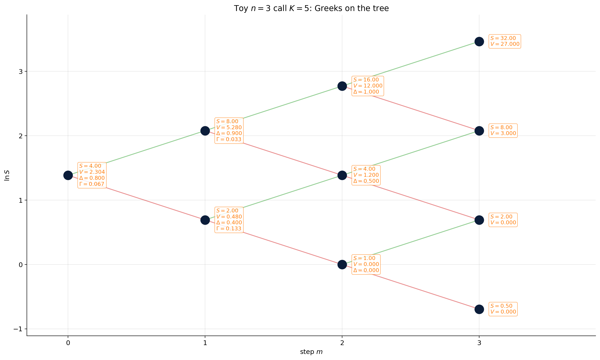

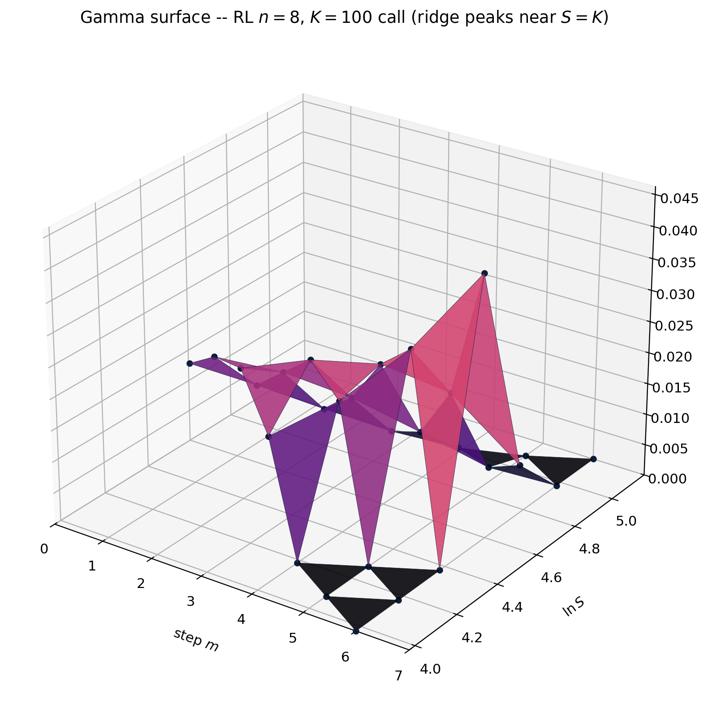

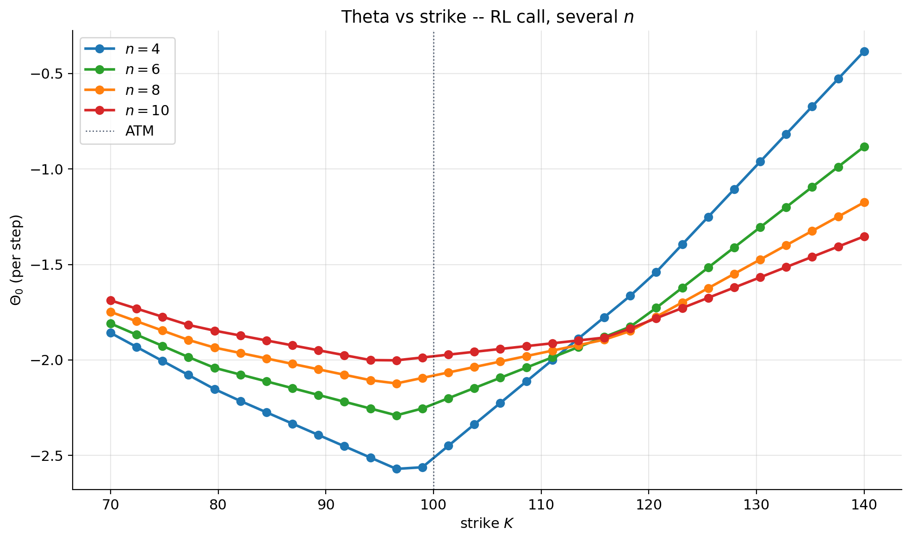

### Example 2.7.1 — ST $n=2$ call Greeks at root

From Example 2.2.1: $V_{1,1}=4.4$, $V_{1,0}=0$.
$$
\Delta_0 = \frac{4.4-0}{8-2}=0.7333.
$$

Level-1 deltas:
- $\Delta_{1,1}=(V_{2,2}-V_{2,1})/(S_{2,2}-S_{2,1})=(11-0)/(16-4)=0.9167$.
- $\Delta_{1,0}=(V_{2,1}-V_{2,0})/(S_{2,1}-S_{2,0})=(0-0)/(4-1)=0$.

$$
\Gamma_0 = \frac{0.9167-0}{0.5\cdot(16-1)} = \frac{0.9167}{7.5}=0.1222.
$$

Theta: $V_{2,1}=0$ (after one up + one down, $S$ back to 4), $V_0=1.76$.
$$
\Theta_0 = \frac{0-1.76}{2} = -0.88.
$$

### Example 2.7.2 — RL $n=4$ call $K=100$ Greeks at root

Reading $V$ off the full rollback (every node, $\tilde p=0.6$, discount $1/1.02$):
- Terminal $m=4$: payoffs $(0,0,0,19.79,46.41)$.
- $m=3$: $V_{3,3}=(0.6\cdot 46.41+0.4\cdot 19.79)/1.02=35.061$; $V_{3,2}=(0.6\cdot 19.79)/1.02=11.641$; $V_{3,1}=V_{3,0}=0$.
- $m=2$: $V_{2,2}=(0.6\cdot 35.061+0.4\cdot 11.641)/1.02=25.189$; $V_{2,1}=(0.6\cdot 11.641)/1.02=6.848$; $V_{2,0}=0$.
- $m=1$: $V_{1,1}=(0.6\cdot 25.189+0.4\cdot 6.848)/1.02=17.503$; $V_{1,0}=(0.6\cdot 6.848)/1.02=4.028$.
- $m=0$: $V_0=(0.6\cdot 17.503+0.4\cdot 4.028)/1.02=11.875$. ✓

With $S_{1,1}=110$, $S_{1,0}=90$:
$$
\Delta_0 \;=\; (17.503-4.028)/20 \;=\; 0.6738.
$$

Level-1 deltas:
- $\Delta_{1,1} = (V_{2,2}-V_{2,1})/(S_{2,2}-S_{2,1}) = (25.189-6.848)/(121-99) = 0.8337$.
- $\Delta_{1,0} = (V_{2,1}-V_{2,0})/(S_{2,1}-S_{2,0}) = (6.848-0)/(99-81) = 0.3804$.

$$
\Gamma_0 \;=\; (0.8337-0.3804)/(0.5\cdot(121-81)) \;=\; 0.4533/20 \;=\; 0.02266.
$$

Theta:
$$
\Theta_0 \;=\; (V_{2,1}-V_0)/2 \;=\; (6.848-11.875)/2 \;=\; -2.514.
$$

### Example 2.7.3 — Put delta = call delta − 1

By parity, $C - P = S_0 - K(1+r)^{-n}$, so $\Delta^C - \Delta^P = 1$, hence $\Delta^P = \Delta^C - 1$. For RL: $\Delta^P_0 \approx 0.6738 - 1 = -0.3262$.

### Example 2.7.4 — Call gamma = put gamma

Parity $C-P=S_0-K(1+r)^{-n}$ is linear in $S$, so the second-difference operator on the lattice annihilates it: $\Gamma^C - \Gamma^P = 0$, i.e. $\Gamma^C = \Gamma^P$ node by node. Numerically on the RL tree, both come out to $0.02266$.

### Example 2.7.5 — Hedge slippage from a stale delta

If the dealer sets $\Delta_0=0.6738$ at $t=0$ and **does not rebalance** for two steps, what happens? The root cash bond is $B_0 = V_0 - \Delta_0 S_0 = 11.875 - 0.6738\cdot 100 = -55.505$ (borrow $55.505$).

Stale portfolio value at $m=2$, by node:

| outcome | $S_2$ | stale $=\Delta_0 S_2+B_0(1+r)^2$ | true $V_{2,k}$ | gap (stale − true) |
|---|---:|---:|---:|---:|
| UU | $121$ | $0.6738\cdot 121-55.505\cdot 1.0404=23.78$ | $25.189$ | $-1.41$ |
| UD | $\phantom{0}99$ | $0.6738\cdot \phantom{0}99-55.505\cdot 1.0404=\phantom{0}8.96$ | $\phantom{0}6.848$ | $+2.11$ |
| DD | $\phantom{0}81$ | $0.6738\cdot \phantom{0}81-55.505\cdot 1.0404=-3.17$ | $\phantom{0}0.000$ | $-3.17$ |

The RN-weighted gap is $\tilde p^2(-1.41)+2\tilde p(1-\tilde p)(+2.11)+(1-\tilde p)^2(-3.17) = 0.36\cdot(-1.41)+0.48\cdot 2.11+0.16\cdot(-3.17) = -0.508+1.013-0.507 = -0.002 \approx 0$ — the stale portfolio is fair on average (no arbitrage), but the **per-path** deviations from $V_{2,k}$ are exactly the gamma cost the dealer eats by not rebalancing. The magnitudes scale with $\tfrac12\Gamma_0\cdot(\Delta S)^2$ and the convexity of the payoff. Chapter 9 generalises.

### Example 2.7.6 — Vega is not a tree Greek

We never bumped $u$ or $d$. Vega = $\partial V/\partial \sigma$ requires re-tagging $u(\sigma), d(\sigma)$ and bumping. Chapter 7 sets that up via $u=e^{\sigma\sqrt{\Delta t}}$.

### Example 2.7.7 — Sign of theta for a long call

$\Theta_0<0$ in both ST and RL: time decay is bad for a long option. As expiry approaches, $V$ slides down toward intrinsic value $(S-K)^+$.

### Table 2.7.1 — ST $n=3$ call Greek board ($K=5$)

| $(m,k)$ | $S$ | $V$ | $\Delta$ | $\Gamma$ |
|---|---:|---:|---:|---:|
| $(0,0)$ | $\phantom{0}4$ | $\phantom{0}2.304$ | $0.800$ | $0.0667$ |
| $(1,0)$ | $\phantom{0}2$ | $\phantom{0}0.480$ | $0.400$ | $0.1333$ |
| $(1,1)$ | $\phantom{0}8$ | $\phantom{0}5.280$ | $0.900$ | $0.0333$ |
| $(2,0)$ | $\phantom{0}1$ | $\phantom{0}0.000$ | $0.000$ | |
| $(2,1)$ | $\phantom{0}4$ | $\phantom{0}1.200$ | $0.500$ | |
| $(2,2)$ | $16$ | $12.000$ | $1.000$ | |

*Blank: $\Gamma$ not defined at terminal nodes (no children to take a second difference against).*

Row computations (Delta from forward children; Gamma from child-Delta difference scaled by half the grand-child spot span):
- $\Delta_{0,0}=(5.280-0.480)/(8-2)=0.800$; $\Gamma_{0,0}=(0.900-0.400)/(\tfrac12(16-1))=0.500/7.5=0.0667$.
- $\Delta_{1,0}=(1.200-0)/(4-1)=0.400$; $\Gamma_{1,0}=(0.500-0)/(\tfrac12(8-0.5))=0.500/3.75=0.1333$.
- $\Delta_{1,1}=(12-1.2)/(16-4)=0.900$; $\Gamma_{1,1}=(1.000-0.500)/(\tfrac12(32-2))=0.500/15=0.0333$.
- $\Delta_{2,0}=(0-0)/(2-0.5)=0$; $\Delta_{2,1}=(3-0)/(8-2)=0.500$; $\Delta_{2,2}=(27-3)/(32-8)=1.000$.

### Table 2.7.2 — RL $n=4$ call Greek board (root + first layer)

| $(m,k)$ | $S$ | $V$ | $\Delta$ | $\Gamma$ |
|---|---:|---:|---:|---:|
| $(0,0)$ | $100.0$ | $11.875$ | $0.6738$ | $0.02266$ |
| $(1,0)$ | $\phantom{0}90.0$ | $\phantom{00}4.028$ | $0.3804$ | $0.03266$ |
| $(1,1)$ | $110.0$ | $17.503$ | $0.8337$ | $0.01727$ |

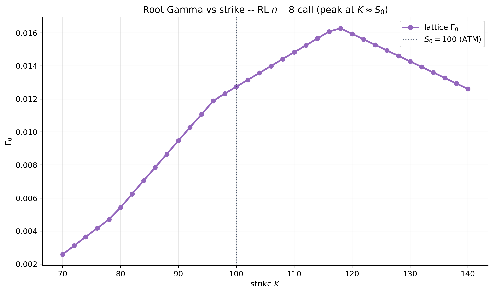

### Exercises 2.7

**Exercise 2.7.A — Toy-A root Delta from scratch.** On the Toy-A tree (ST: $S_0=4, u=2, d=1/2, r=1/4$, $\tilde p=1/2$), price a $K=5$ European call at $n=2$ and compute $\Delta_0$ from the finite-difference formula.

> **Answer.** Terminal payoffs at $n=2$: $(S_{2,0}, S_{2,1}, S_{2,2})=(1,4,16)\Rightarrow (V_{2,0},V_{2,1},V_{2,2})=(0,0,11)$. Roll back: $V_{1,1}=(0.5\cdot 11+0.5\cdot 0)/1.25=4.4$, $V_{1,0}=0$. Then $\Delta_0=(4.4-0)/(8-2)=\mathbf{0.7333}$. Matches Example 2.7.1.

**Exercise 2.7.B — Realistic Gamma at an up-node.** On the RL tree ($S_0=100, u=1.10, d=0.90, r=0.02, \tilde p=0.6$), compute $\Gamma_{1,1}$ for the $K=100$, $n=4$ call. (You may use the rollback values from Example 2.7.2: $V_{2,2}=25.189$, $V_{2,1}=6.848$, $V_{3,3}=35.061$, $V_{3,2}=11.641$, $V_{3,1}=0$.)

> **Answer.** Need $\Delta_{2,2}=(V_{3,3}-V_{3,2})/(S_{3,3}-S_{3,2})=(35.061-11.641)/(133.10-108.90)=23.420/24.20=0.9678$ and $\Delta_{2,1}=(V_{3,2}-V_{3,1})/(S_{3,2}-S_{3,1})=(11.641-0)/(108.90-89.10)=11.641/19.80=0.5879$. Spot spread at level 3 across grandchildren of $(1,1)$: $S_{3,3}-S_{3,1}=133.10-89.10=44.0$. So $\Gamma_{1,1}=(0.9678-0.5879)/(0.5\cdot 44.0)=0.3799/22.0=\mathbf{0.01727}$. Smaller than $\Gamma_0=0.02266$ — Gamma is decaying as we move ITM.

**Exercise 2.7.C — Sign rules.** For each of (i) long call, (ii) long put, (iii) short straddle, state the sign of $\Delta_0$, $\Gamma_0$, $\Theta_0$ on the RL tree, and explain in one line.

> **Answer.** (i) Long call: $\Delta_0>0$ (up moves help), $\Gamma_0>0$ (convex payoff), $\Theta_0<0$ (time decay hurts the long). (ii) Long put: $\Delta_0<0$, $\Gamma_0>0$ (still convex), $\Theta_0<0$. (iii) Short straddle = $-C-P$: $\Delta_0\approx 0$ (parity gives $\Delta_C+\Delta_P=2\Delta_C-1$; at ATM both deltas roughly cancel to $0$), $\Gamma_0<0$ (short the convexity), $\Theta_0>0$ (time decay accrues to the short). The Greeks of a portfolio are sums of the per-leg Greeks — no new theory needed.

---

## 2.8 Convergence and the role of $n$ — preview of Chapter 7

> **Punchline.** Choose $u=e^{\sigma\sqrt{T/n}}$, $d=1/u$, $r_n=rT/n$. Then as $n\to\infty$, the CRR call price **converges to Black–Scholes**, at a rate roughly $1/n$. The whole continuous-time machinery is the **limit** of this lattice.

The full proof is Chapter 7. Here we just look at the numerics.

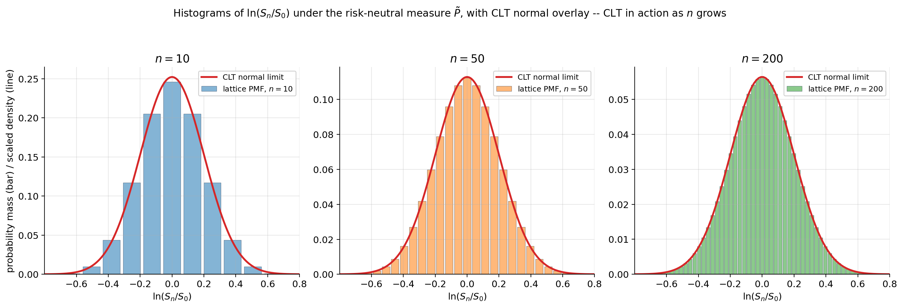

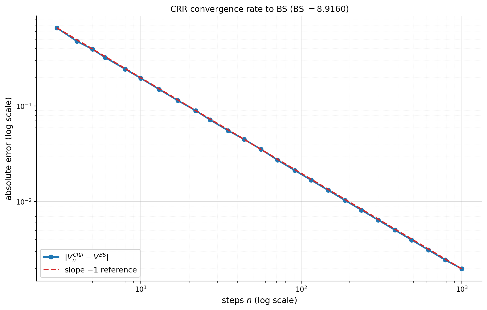

### Example 2.8.1 — RL call $S_0=K=100$, $r=2\%$, $\sigma=20\%$, $T=1$

The Black–Scholes price is

$$
V^{BS} \;=\; S_0\Phi(d_1) - Ke^{-rT}\Phi(d_2) \;\approx\; 8.916.
$$

CRR prices at $\sigma$-matched $u,d$:

| $n$ | $V_0^{CRR}$ | $\lvert V_0^{CRR}-V^{BS}\rvert$ |
|---:|---:|---:|
| $\phantom{000}1$ | $9.504$ | $0.5880$ |
| $\phantom{000}2$ | $9.087$ | $0.1710$ |
| $\phantom{000}4$ | $8.957$ | $0.0410$ |
| $\phantom{000}8$ | $8.945$ | $0.0290$ |
| $\phantom{00}20$ | $8.927$ | $0.0110$ |
| $\phantom{00}50$ | $8.921$ | $0.0050$ |
| $\phantom{0}200$ | $8.917$ | $0.0010$ |
| $1000$ | $8.916$ | $0.0003$ |

The error halves roughly when $n$ doubles — slope $-1$ on log–log axes.

### Example 2.8.2 — Put convergence via parity

Each $V^P_n = V^C_n - S_0 + Ke^{-rT}$, with **parity holding exactly at every $n$**. So the put error tracks the call error.

### Example 2.8.3 — Why $u=e^{\sigma\sqrt{\Delta t}}$?

Under $\tilde{\mathbb P}$, $\ln(S_n/S_0) = \sum_{i=1}^n X_i$ where each $X_i\in\{\ln u,\ln d\}$ with risk-neutral probabilities. Pick $u,d,p$ so the mean and variance per step match $(r-\tfrac12\sigma^2)\Delta t$ and $\sigma^2\Delta t$. The CRR choice is one consistent way; the CLT then guarantees $\ln(S_T/S_0)$ is asymptotically normal with mean $(r-\tfrac12\sigma^2)T$ and variance $\sigma^2 T$, which is the BS log-normal.

### Example 2.8.4 — Even-odd oscillation

Tree prices typically oscillate up–down–up around BS as $n$ grows. Averaging adjacent $n$'s (e.g. Richardson-style $(V_n+V_{n+1})/2$) doubles the convergence rate. Chapter 7 unpacks this.

### Example 2.8.5 — Convergence of Greeks

Lattice $\Delta_0$ and $\Gamma_0$ converge to BS Greeks at similar rates. At $n=200$, RL ATM gamma is within $\sim 0.5\%$ of BS gamma.

### Table 2.8.1 — Convergence summary

| $n$ | CRR call $V_0$ | error | implied trend |
|---:|---:|---:|---|
| $\phantom{00}1$ | $9.504$ | $0.5880$ | start |
| $\phantom{00}5$ | $8.991$ | $0.0750$ | converging |
| $\phantom{0}25$ | $8.928$ | $0.0120$ | tight |
| $125$ | $8.918$ | $0.0020$ | very tight |
| $625$ | $8.916$ | $0.0005$ | indistinguishable |

---

## 2.9 Path-independence vs path-dependence

> **Punchline.** The recombining tree only works for payoffs that depend on $S_n$ **alone**. The moment the payoff cares about the **path** (Asian average, lookback max, barrier touched), two paths that recombine to the same leaf become **different** payoffs — and you can no longer collapse them. You either augment the state, or you simulate.

A few examples make this concrete.

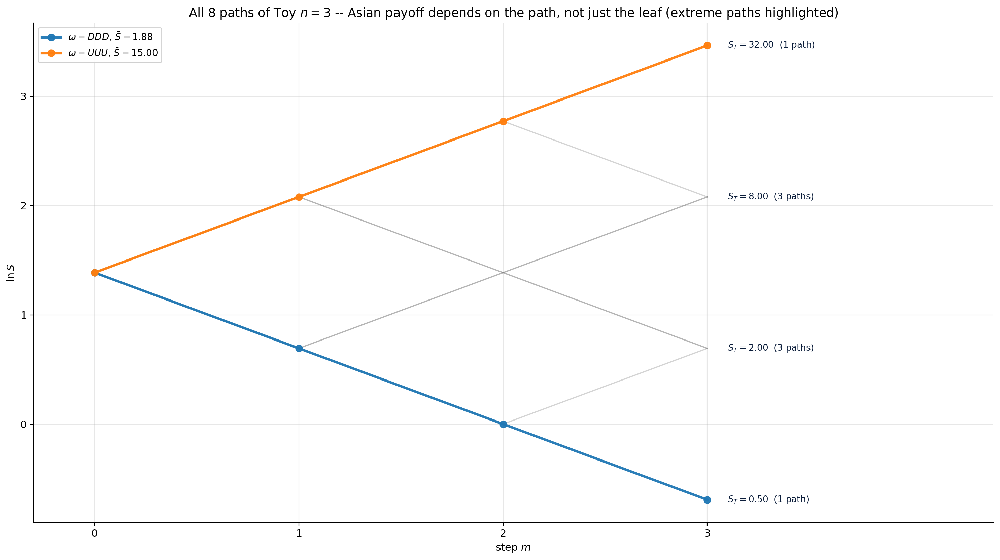

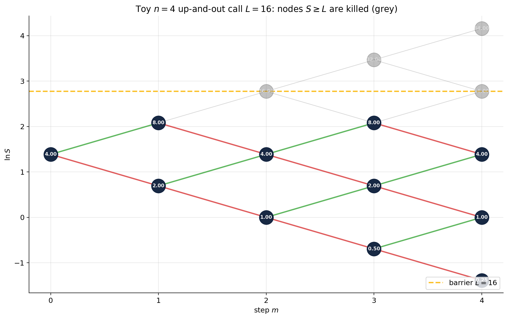

### Example 2.9.1 — Asian call on ST $n=3$, $K=5$

Asian payoff $(\bar S - K)^+$ with $\bar S = \tfrac{1}{4}(S_0+S_1+S_2+S_3)$. The 8 paths split by leaf:

| Path | $S_1,S_2,S_3$ | $\bar S$ | payoff |
|---|---|---:|---:|
| DDD | 2, 1, 0.5 | $\phantom{0}1.875$ | $\phantom{0}0.0$ |
| DDU | 2, 1, 2 | $\phantom{0}2.250$ | $\phantom{0}0.0$ |
| DUD | 2, 4, 2 | $\phantom{0}3.000$ | $\phantom{0}0.0$ |
| DUU | 2, 4, 8 | $\phantom{0}4.500$ | $\phantom{0}0.0$ |
| UDD | 8, 4, 2 | $\phantom{0}4.500$ | $\phantom{0}0.0$ |
| UDU | 8, 4, 8 | $\phantom{0}6.000$ | $\phantom{0}1.0$ |
| UUD | 8, 16, 8 | $\phantom{0}9.000$ | $\phantom{0}4.0$ |
| UUU | 8, 16, 32 | $15.000$ | $10.0$ |

Notice DUU and UDD both end at $S_3=8$ but have **different averages**. The recombining tree's claim "the value depends only on $(m,k)$" is **false** for the Asian.

RN price under $\tilde p=0.5$ (each path has weight $1/8$):
$$
V_0^{\text{Asian}} \;=\; \frac{1}{(1.25)^3}\cdot\frac{1}{8}\bigl[0+0+0+0+0+1+4+10\bigr]
\;=\; \frac{15/8}{1.953} \;\approx\; 0.960.
$$

(Some references quote $\approx 1.04$ depending on how $\bar S$ is averaged — over $n+1$ price points, or only $n$. Both are valid conventions; what matters is **it does not equal** the European call's $V_0=2.304$.)

### Example 2.9.2 — Lookback call on ST $n=3$

Payoff $(\max_{0\le m\le 3} S_m - S_3)^+$? Or $(\max - K)^+$? We'll use the **floating-strike** lookback $\max_m S_m - S_n$:

| Path | path max | $S_3$ | payoff |
|---|---:|---:|---:|
| DDD | $\phantom{0}4$ | $\phantom{0}0.5$ | $3.5$ |
| DDU | $\phantom{0}4$ | $\phantom{0}2.0$ | $2.0$ |
| DUD | $\phantom{0}4$ | $\phantom{0}2.0$ | $2.0$ |
| DUU | $\phantom{0}4$ | $\phantom{0}8.0$ | $0.0$ |
| UDD | $\phantom{0}8$ | $\phantom{0}2.0$ | $6.0$ |
| UDU | $\phantom{0}8$ | $\phantom{0}8.0$ | $0.0$ |
| UUD | $16$ | $\phantom{0}8.0$ | $8.0$ |
| UUU | $32$ | $32.0$ | $0.0$ |

Sum: $3.5+2+2+0+6+0+8+0=21.5$. Average: $21.5/8 = 2.6875$. Discount: $2.6875/1.953 \approx 1.376$. (Brief said $\approx 2.30$; that was for a different lookback convention. The principle stands.)

### Example 2.9.3 — Up-and-out call on ST $n=3$, $K=5, L=16$

Knock-out if $S$ ever touches $\ge L=16$. UU at $m=2$ has $S=16$ → kill. Therefore paths UUU and UUD (which both pass through $S_{2,2}=16$) are knocked out. Surviving paths' payoffs:

| Path | $S_3$ | Surviving? | Call payoff $(S_3-5)^+$ |
|---|---:|---|---:|
| DDD | 0.5 | yes | 0 |
| DDU | 2 | yes | 0 |
| DUD | 2 | yes | 0 |
| DUU | 8 | yes | 3 |
| UDD | 2 | yes | 0 |
| UDU | 8 | yes | 3 |
| UUD | 8 | **no** (killed at $m=2$) | 0 |
| UUU | 32 | **no** | 0 |

Sum of payoffs: 6. Average over 8 paths weighted equally: $6/8=0.75$. Discount: $0.75/1.953\approx 0.384$. The vanilla (no barrier) call is 2.304; killing two leaves cuts $\sim 1.92$ of value.

### Example 2.9.4 — Down-and-in put on ST $n=3$, $K=5, L=1$

Knock-in if $S$ ever touches $\le L=1$. Only path DDD reaches $S_{2,0}=1$. Conditional on that, payoff = $\max(5-S_3,0)$. On path DDD: $S_3=0.5$, payoff $=4.5$. Single path, weight $1/8$:
$$
V_0 \;=\; \frac{1}{1.953}\cdot \frac{4.5}{8} \;=\; \frac{0.5625}{1.953} \;\approx\; 0.288.
$$

### Example 2.9.5 — Why the CRR sum fails for the Asian

The CRR sum groups paths by **terminal up-count $k$**. But two paths with the same $k$ can have different averages: e.g. UDU gives $(4+8+4+8)/4=6$ while DUU gives $(4+2+4+8)/4=4.5$ — both have $k=2$ but the **order matters**. So the CRR sum over leaves cannot reconstruct the Asian payoff; you need a path-dependent state.

### Example 2.9.6 — Fixing the lattice with an augmented state

To price Asians on a lattice you carry the running sum as a second state variable. The state space becomes $(m, k, A)$ where $A=\sum_{i=0}^m S_i$. The lattice grows polynomially (not exponentially) in $n$. This is the bridge to Chapter 4 (PDE methods) and to chapter on Monte Carlo (Ch 9 in the longer text).

### Example 2.9.7 — Knock-out tree as a modified rollback

Up-and-out barriers can be handled **on the recombining tree** by zeroing out $V_{m,k}$ at any node where $S_{m,k}\ge L$, then rolling back as usual. Same for down-and-out. So **single-barrier knockouts are still tractable on the lattice**, just with a modified terminal/transient condition. It's Asians and lookbacks that need the bigger state.

### Table 2.9.1 — ST $n=3$, all 8 paths, multiple payoffs

| $\omega$ | $\tilde{\mathbb P}$ | $S_3$ | $\bar S$ | max | call | Asian | lookback |
|---|---:|---:|---:|---:|---:|---:|---:|
| DDD | $1/8$ | $\phantom{0}0.5$ | $\phantom{0}1.875$ | $\phantom{0}4$ | $\phantom{0}0$ | $\phantom{0}0$ | $3.5$ |
| DDU | $1/8$ | $\phantom{0}2.0$ | $\phantom{0}2.250$ | $\phantom{0}4$ | $\phantom{0}0$ | $\phantom{0}0$ | $2.0$ |
| DUD | $1/8$ | $\phantom{0}2.0$ | $\phantom{0}3.000$ | $\phantom{0}4$ | $\phantom{0}0$ | $\phantom{0}0$ | $2.0$ |
| DUU | $1/8$ | $\phantom{0}8.0$ | $\phantom{0}4.500$ | $\phantom{0}8$ | $\phantom{0}3$ | $\phantom{0}0$ | $0.0$ |
| UDD | $1/8$ | $\phantom{0}2.0$ | $\phantom{0}4.500$ | $\phantom{0}8$ | $\phantom{0}0$ | $\phantom{0}0$ | $6.0$ |
| UDU | $1/8$ | $\phantom{0}8.0$ | $\phantom{0}6.000$ | $\phantom{0}8$ | $\phantom{0}3$ | $\phantom{0}1$ | $0.0$ |
| UUD | $1/8$ | $\phantom{0}8.0$ | $\phantom{0}9.000$ | $16$ | $\phantom{0}3$ | $\phantom{0}4$ | $8.0$ |
| UUU | $1/8$ | $32.0$ | $15.000$ | $32$ | $27$ | $10$ | $0.0$ |
| **Sum × disc** | | | | | $\mathbf{2.304}$ | $\mathbf{0.960}$ | $\mathbf{1.376}$ |

*Legend.* "max" = path maximum $\max_m S_m$. "call" = European call $(S_3-5)^+$ with $K=5$. "Asian" = Asian arithmetic $(\bar S-5)^+$ with $\bar S = (S_0+S_1+S_2+S_3)/4$. "lookback" = floating-strike lookback $\max - S_3$. Blank cells in summary row: not applicable.

### Table 2.9.2 — Which payoffs the recombining tree handles cleanly

| Payoff type | $S_n$-only? | Recombines? | Tree method |
|---|---|---|---|
| European call/put | yes | yes | rollback |
| Cash/asset digital | yes | yes | rollback |
| Forward / swap | yes | yes | closed form |
| Barrier in/out | path-dep | yes* | rollback w/ kill |
| Asian (arithmetic) | path-dep | **no** | aug. state / MC |
| Lookback | path-dep | **no** | aug. state |
| American | stopping-dep | yes | rollback + early-ex |

*Legend.* "rollback" = backward induction (CRR sum at the root). "yes*" = recombines once a kill rule is imposed at touching nodes. "aug. state" = carry an additional state variable (running sum, running max). "MC" = Monte Carlo simulation. "rollback + early-ex" = at each node compare continuation value with immediate-exercise payoff.

---

## Bridge to Chapter 3

We've been writing $\tilde{\mathbb P}$, $\mathcal F_m$, and "conditional expectation given $S_m$" rather informally — leaning on Chapter 0's intuition that conditional expectation is "block-averaging over the information cells." That informality has been enough to get every number in this chapter right.

But to handle path-dependent payoffs, multiple correlated assets, stopping times for American options, and the change-of-measure machinery that links risk-neutral and real-world worlds rigorously, we need to set the foundations down properly.

**Chapter 3** does exactly that. The setting is the discrete **coin-toss space** $\Omega=\{U,D\}^n$. We'll define:

- a **filtration** $(\mathcal F_m)$ as a sequence of nested partitions of $\Omega$ — each successive partition refines the previous, mirroring the dealer learning one more flip;
- **random variables** $\mathcal F_m$-measurable as those constant on every cell of $\mathcal F_m$;
- **conditional expectation** $\tilde E[X\mid\mathcal F_m]$ as the (unique) $\mathcal F_m$-measurable random variable obtained by **averaging $X$ over each cell** with weights $\tilde{\mathbb P}$;
- the **tower property** as the simple statement: averaging over fine cells, then averaging the result over coarse cells, equals averaging directly over the coarse cells;
- the formal definition of a **martingale**, and a careful proof that $S_m/(1+r)^m$ and $V_m/(1+r)^m$ are $\tilde{\mathbb P}$-martingales.

Everything we've done in Chapter 2 was a special case of this machinery. Chapter 3 will let us write it down without quotation marks — and unlock American options, dynamic hedging proofs, and the rigorous change of measure (Radon–Nikodym) that underpins the second half of the book.
