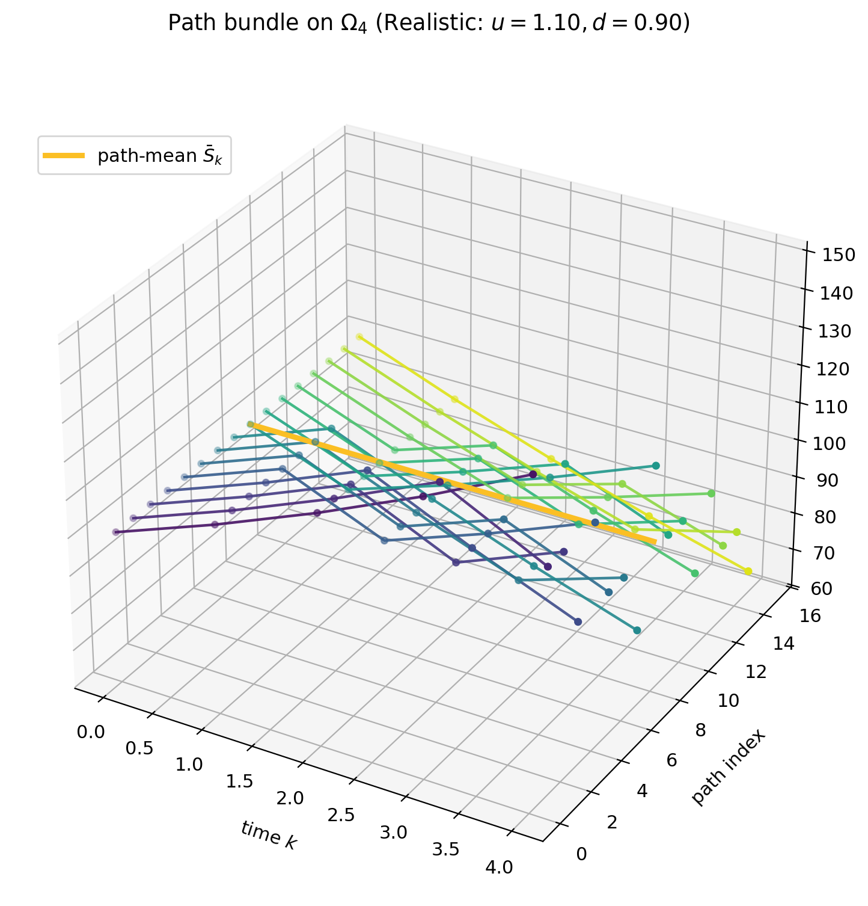
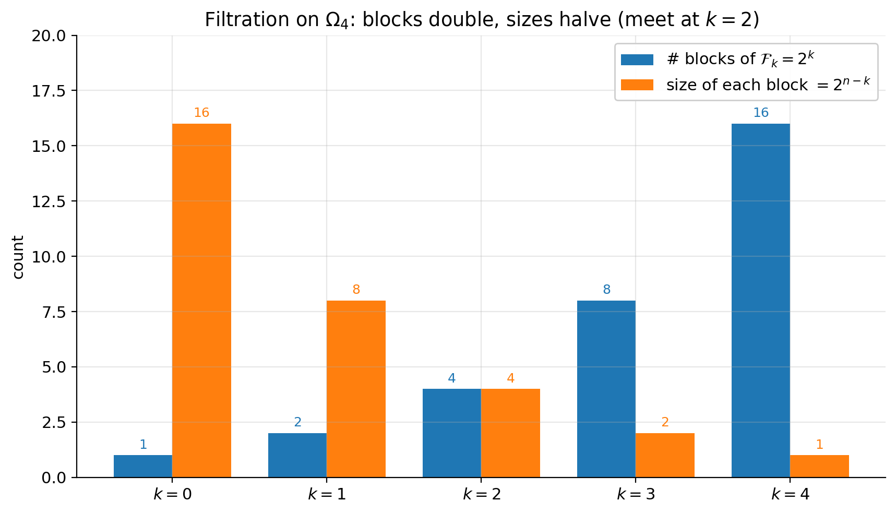
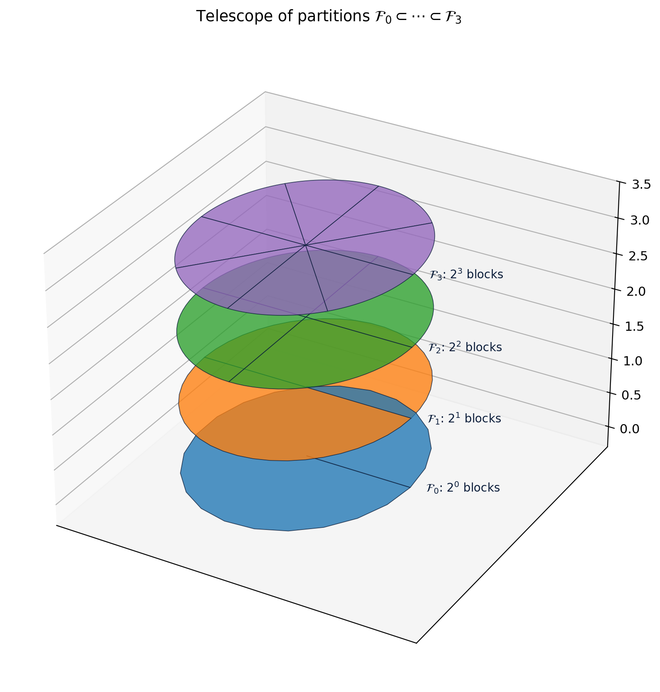
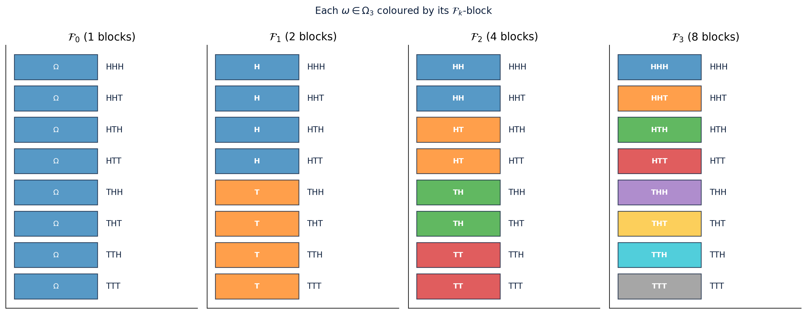
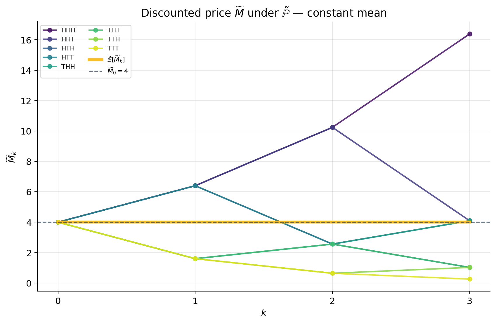
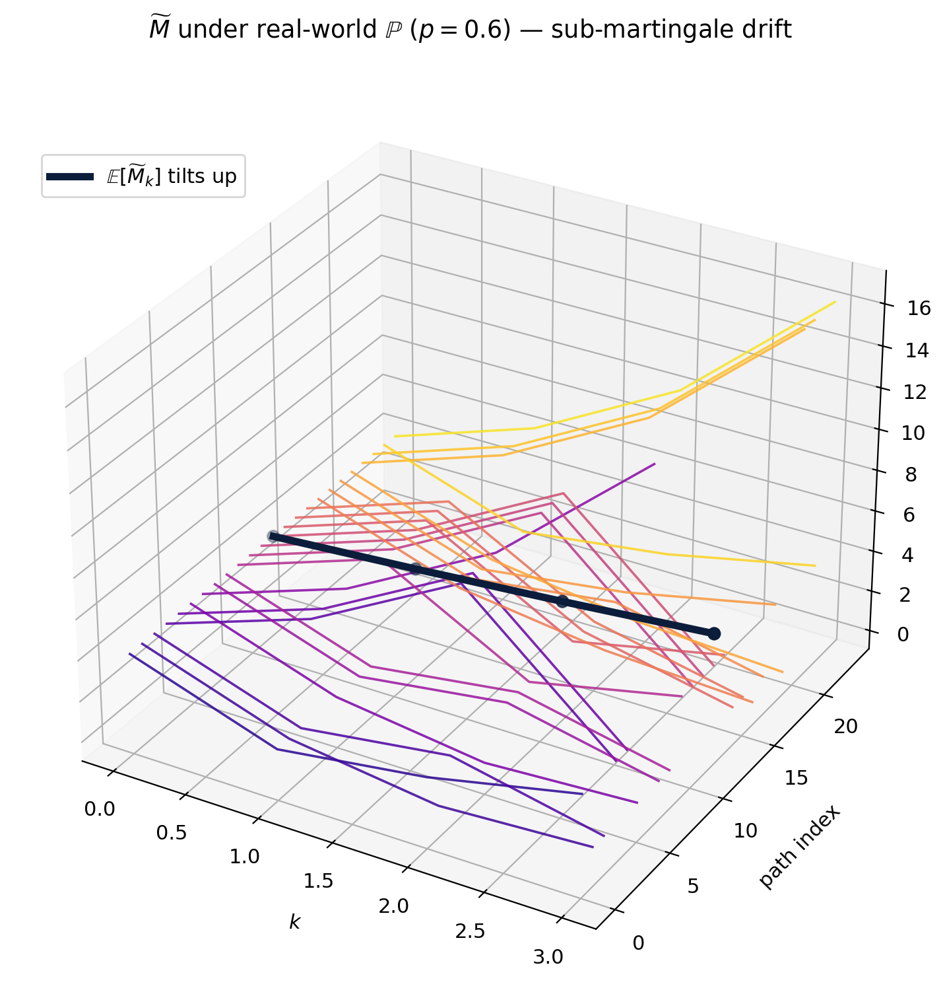
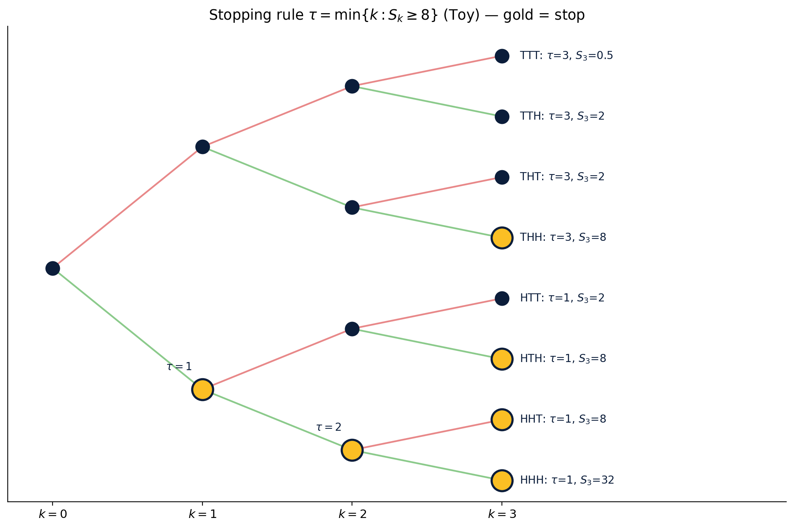
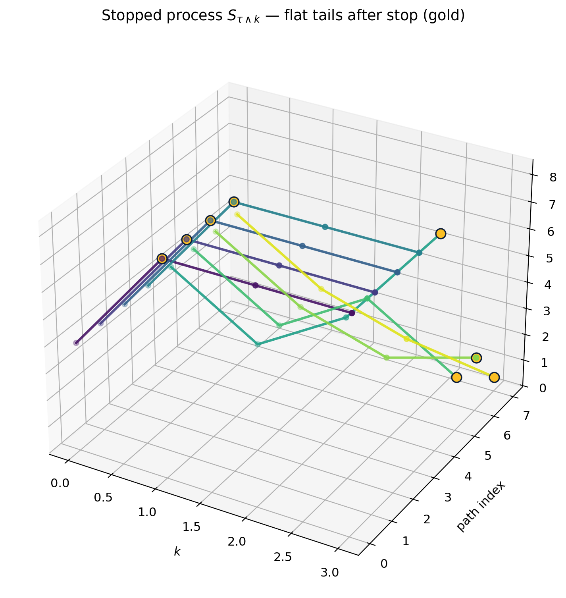

# Chapter 3 — Probability on Coin-Toss Space

## How to read this chapter

Chapters 1 and 2 built the binomial tree and showed how the *risk-neutral* probability $\tilde p$ falls out of replication. We computed prices but kept the probability language deliberately informal: nodes had "weights"; sums over the tree were obviously fair. That informality was a feature for the introduction. From here on, options will start depending on the *path*, not just the terminal price, and we will need to talk about *when* a random variable becomes known, *which* events we can measure at time $k$, and *how* expectations behave when we change perspective. So we need the toolkit of discrete-time probability — formally, but kept entirely on a finite set.

This chapter delivers that toolkit. Everything lives on $\Omega_n = \{H,T\}^n$, the set of $n$-letter coin-toss words. No continuous probability, no measure theory beyond unions and sums, no calculus. By the end of the chapter you will own:

- The **sample space** $\Omega_n$ and the meaning of an **event**.
- **Filtrations** as nested partitions — the rigorous version of "what you know by time $k$".
- **Measurability** and **adapted** processes — the no-peeking rule.
- **Conditional expectation** as a *block average*, with the **tower property** as a one-line consequence.
- **Martingales** in discrete time, with the central fact $\widetilde M_k = S_k/(1+r)^k$ is a $\tilde{\mathbb P}$-martingale.
- **Stopping times** and the **optional stopping theorem** — the launchpad for American options in Chapter 4.
- **Change of measure** and the **Radon-Nikodym derivative** as a per-path reweighting.

The shape of every section is the same numbered one we have been using: punchline up top, intuition, definitions, numbered worked examples, figures, tables. Two running examples appear constantly:

- **Toy**: $S_0=4$, $u=2$, $d=1/2$, $r=1/4$, so $\tilde p=1/2$. Numbers are exact.
- **Realistic**: $S_0=100$, $u=1.10$, $d=0.90$, $r=2\%$ per period, so $\tilde p=0.6$. Numbers are rounded to 4 d.p.

A note on notation. We use $\omega = \omega_1\omega_2\ldots\omega_n$ for an element of $\Omega_n$, with $\omega_i \in \{H,T\}$. $H_k(\omega)$ is the number of heads in the first $k$ tosses. The price process is

$$S_k(\omega) \;=\; S_0 \cdot u^{H_k(\omega)}\, d^{\,k - H_k(\omega)}.$$

Under the **real-world** measure we write $\mathbb P$ with parameter $p$. Under the **risk-neutral** measure we write $\tilde{\mathbb P}$ with parameter $\tilde p = \frac{(1+r) - d}{u - d}$. Both measures live on the same $\Omega_n$; only the leaf weights differ.

---

## §3.1 The coin-toss space $\Omega_n$

**Punchline.** Every path through the binomial tree is a single $H/T$ word. There are exactly $2^n$ words and that's our sample space. *Everything else in this chapter is computed by listing words and weighting them.*

**Intuition.** A two-period tree has four leaves. List them by what the coin did: $HH$, $HT$, $TH$, $TT$. Each leaf is one possible *outcome* of the experiment "flip the coin $n$ times". The price at any intermediate time is just a *function* of the leaf, evaluated at a particular position in the word. The mental model is: pick a word once and for all at the start of time; the prices $S_0, S_1, \ldots, S_n$ are then *deterministic* functions of that word.

This is a small philosophical shift from Chapter 2, where we drew the tree as a branching dynamic structure. In Chapter 3 the tree is a *function-space picture* of $\Omega_n$: a word is the underlying randomness; price, payoff, hedge are all functions of it. Once you have internalised that, conditional expectations, filtrations, and stopping times become elementary book-keeping on words.

### 3.1.1 Definitions

- **Sample space**: $\Omega_n = \{H,T\}^n$ — set of all length-$n$ words in two letters.
- **Cardinality**: $|\Omega_n| = 2^n$.
- **Outcome / sample point**: $\omega \in \Omega_n$, with components $\omega_1, \ldots, \omega_n$.
- **Head count**: $H_k(\omega) = \#\{i \le k : \omega_i = H\}$.
- **Price process**: $S_k(\omega) = S_0\, u^{H_k(\omega)}\, d^{\,k-H_k(\omega)}$.

Two facts to internalise:

1. $S_k(\omega)$ depends *only on the first $k$ letters* of $\omega$. The future letters do not affect $S_k$.
2. $S_k(\omega)$ depends on *how many* of those first $k$ letters are $H$, not on their order. This is the recombining property revisited.

### 3.1.2 Examples

**Example 3.1.1 (Toy, $n=2$).** $\Omega_2 = \{HH, HT, TH, TT\}$. Prices:

- $\omega = HH$: $S_2 = 4 \cdot 2 \cdot 2 = 16$.
- $\omega = HT$: $S_2 = 4 \cdot 2 \cdot 0.5 = 4$.
- $\omega = TH$: $S_2 = 4 \cdot 0.5 \cdot 2 = 4$.
- $\omega = TT$: $S_2 = 4 \cdot 0.5 \cdot 0.5 = 1$.

Note $HT$ and $TH$ give the same $S_2$ but they are *different* sample points. The tree recombines on $S$, not on $\omega$.

**Example 3.1.2 (Toy, $n=3$).** $\Omega_3 = \{HHH, HHT, HTH, HTT, THH, THT, TTH, TTT\}$. Eight words. Terminal prices:

| $\omega$ | $H_3$ | $S_3$ |
|---|---:|---:|
| $HHH$ | 3 | 32 |
| $HHT$ | 2 | 8 |
| $HTH$ | 2 | 8 |
| $HTT$ | 1 | 2 |
| $THH$ | 2 | 8 |
| $THT$ | 1 | 2 |
| $TTH$ | 1 | 2 |
| $TTT$ | 0 | 0.5 |

There are four distinct values $\{32, 8, 2, 0.5\}$ for eight words. The level set $\{S_3 = 8\}$ contains three words, matching $\binom{3}{1} = 3$ paths-to-one-down. More on this when we count paths in §3.2.

**Example 3.1.3 (Realistic, $n=3$).** Same listing but with $u=1.10$, $d=0.90$:

| $\omega$ | $H_3$ | $S_3$ |
|---|---:|---:|
| $HHH$ | 3 | $100 \cdot 1.1^3 = 133.10$ |
| $HHT$ | 2 | $100 \cdot 1.1^2 \cdot 0.9 = 108.90$ |
| $HTH$ | 2 | $108.90$ |
| $HTT$ | 1 | $89.10$ |
| $THH$ | 2 | $108.90$ |
| $THT$ | 1 | $89.10$ |
| $TTH$ | 1 | $89.10$ |
| $TTT$ | 0 | $72.90$ |

Four distinct $S_3$ values: $\{133.10, 108.90, 89.10, 72.90\}$, weights $1,3,3,1$ (Pascal).

**Example 3.1.4 (Count paths to $S_3 = 4$ on Toy).** $S_3 = 4 = 4 \cdot u^a d^{3-a}$ requires $2^a \cdot 2^{-(3-a)} = 2^{2a-3} = 1$, so $a = 3/2$ — not an integer. *No path reaches $S_3 = 4$* on Toy in 3 steps. (On $n=2$, exactly two paths give $S_2 = 4$: $HT$ and $TH$, corresponding to one up and one down move. On odd $n$, the geometric grid skips $S_0$ entirely.) Lesson: not every value sits in the support of $S_n$. The support is $\{S_0 u^j d^{n-j} : j = 0,1,\ldots,n\}$, a geometric grid.

**Example 3.1.5 (Two paths, one terminal price).** $HHT$ and $THH$ both give $S_3 = 8$ on Toy. They are distinct sample points; they will *not* in general agree on path-dependent payoffs such as a lookback, even though they agree on the terminal European payoff. This is the entire reason we need to carry $\omega$ around rather than just the head count.

**Example 3.1.6 (How many paths give $S_n = S_0 u^j d^{n-j}$?).** Exactly $\binom{n}{j}$, since the price is determined by the *count* of heads, not their order, and there are $\binom{n}{j}$ words with $j$ heads.

**Example 3.1.7 (Listing $\Omega_4$).** $|\Omega_4| = 16$. By head count, distribution is $1,4,6,4,1$ (Pascal row 4).

### 3.1.3 Table

**Table 3.1.** $\Omega_3$ listing under the toy. Each row is one sample point.

| $\omega$ | $\omega_1$ | $\omega_2$ | $\omega_3$ | $H_3$ | $S_1$ | $S_2$ | $S_3$ |
|---|:-:|:-:|:-:|---:|---:|---:|---:|
| $HHH$ | H | H | H | 3 | 8 | 16 | 32 |
| $HHT$ | H | H | T | 2 | 8 | 16 | 8 |
| $HTH$ | H | T | H | 2 | 8 | 4 | 8 |
| $HTT$ | H | T | T | 1 | 8 | 4 | 2 |
| $THH$ | T | H | H | 2 | 2 | 4 | 8 |
| $THT$ | T | H | T | 1 | 2 | 4 | 2 |
| $TTH$ | T | T | H | 1 | 2 | 1 | 2 |
| $TTT$ | T | T | T | 0 | 2 | 1 | 0.5 |

---

## §3.2 Events as subsets

**Punchline.** An *event* is a set of paths. Its probability is the sum of the leaf weights inside that set. Nothing more sophisticated than that.

**Intuition.** "The stock ends above 100" is a sentence in English. The mathematical version is "the subset $A \subset \Omega_n$ of those $\omega$ for which $S_n(\omega) > 100$". A probability measure $\mathbb P$ assigns weight $\mathbb P(\{\omega\})$ to each singleton; the event probability is

$$\mathbb P(A) \;=\; \sum_{\omega \in A} \mathbb P(\{\omega\}).$$

Two events $A,B$ relate by union, intersection, complement; their probabilities combine by the usual inclusion-exclusion. Because $\Omega_n$ is finite there is no measure-theoretic subtlety to worry about.

### 3.2.1 Definitions

- **Event**: any $A \subseteq \Omega_n$.
- **Probability measure** under $\mathbb P$ (real-world, parameter $p$): for $\omega$ with $H_n(\omega) = j$,
 $$\mathbb P(\{\omega\}) = p^{\,j}\,(1-p)^{\,n-j}.$$
- **Probability measure** under $\tilde{\mathbb P}$ (risk-neutral, parameter $\tilde p$): same formula with $\tilde p$.
- **Event probability**: $\mathbb P(A) = \sum_{\omega \in A} \mathbb P(\{\omega\})$.

Both $\mathbb P$ and $\tilde{\mathbb P}$ are well-defined probability measures: leaf weights are non-negative and sum to 1 by the binomial theorem.

### 3.2.2 Examples

**Example 3.2.1 ($\tilde{\mathbb P}(S_2 = 16)$ on Toy, $n=2$).** $\{S_2 = 16\} = \{HH\}$, single element. $\tilde{\mathbb P}(\{HH\}) = (1/2)^2 = 1/4$.

**Example 3.2.2 ($\tilde{\mathbb P}(S_2 = 4)$ on Toy, $n=2$).** $\{S_2 = 4\} = \{HT, TH\}$, two elements. $\tilde{\mathbb P} = 2 \cdot (1/2)^2 = 1/2$.

**Example 3.2.3 ($\tilde{\mathbb P}(S_2 = 1)$ on Toy, $n=2$).** $\{TT\}$, single element. $\tilde{\mathbb P} = 1/4$. The three event probabilities sum to 1 as required.

**Example 3.2.4 (Same event, two measures).** Under real-world $p = 0.6$:
$\mathbb P(S_2 = 16) = 0.36$, $\mathbb P(S_2 = 4) = 0.48$, $\mathbb P(S_2 = 1) = 0.16$. The distribution shifts up because heads are more likely. Same event, *different probability* — this is the whole point of §3.11.

**Example 3.2.5 (Realistic $\tilde{\mathbb P}(S_3 \ge 108)$).** $\tilde p = 0.6$, $n=3$. The event $\{S_3 \ge 108\} = \{\omega : H_3(\omega) \ge 2\}$ (since $S_3 = 100 \cdot 1.1^j \cdot 0.9^{3-j}$ exceeds 108 iff $j \ge 2$). Mass:

$$
\begin{aligned}
\tilde{\mathbb P}(H_3 \ge 2)
&= \binom{3}{2}\,\tilde p^2\,(1-\tilde p) + \binom{3}{3}\,\tilde p^3 \\
&= 3(0.36)(0.4) + 0.216 \;=\; 0.432 + 0.216 \;=\; 0.648.
\end{aligned}
$$

So $\tilde{\mathbb P}(S_3 \ge 108) = 0.648$.

**Example 3.2.6 (Union of disjoint events).** On $n=2$, $A = \{S_2 \ne 4\} = \{HH, TT\}$. $\tilde{\mathbb P}(A) = 1/4 + 1/4 = 1/2$. As a sanity check, $A^c = \{HT, TH\}$ has $\tilde{\mathbb P}(A^c) = 1/2$, and $\tilde{\mathbb P}(A) + \tilde{\mathbb P}(A^c) = 1$. ✓

**Example 3.2.7 (Inclusion-exclusion on $\Omega_3$).** Let $A = \{\omega_1 = H\}$ and $B = \{H_3 \ge 2\}$. Then $A \cap B = \{HHH, HHT, HTH, THH\} \cap \{H_3 \ge 2\}$ — actually $A \cap B = \{HHH, HHT, HTH\}$ (each starts with $H$ and has $\ge 2$ heads). Under $\tilde{\mathbb P}=0.5$:
$\tilde{\mathbb P}(A) = 1/2$, $\tilde{\mathbb P}(B) = 4/8 = 1/2$, $\tilde{\mathbb P}(A \cap B) = 3/8$, so
$\tilde{\mathbb P}(A \cup B) = 1/2 + 1/2 - 3/8 = 5/8$.

**Example 3.2.8 (Independence test, $\omega_1$ and $\omega_3$).** Under $\tilde{\mathbb P}$ on $\Omega_3$, the events $\{\omega_1 = H\}$ and $\{\omega_3 = H\}$ each have mass $1/2$, and their intersection has $\{HHH, HTH\}$, mass $1/4 = 1/2 \cdot 1/2$. Independent. ✓ (Recall: i.i.d. tosses is built into the model.)

### 3.2.3 Table

**Table 3.2.** A handful of events on $\Omega_3$ under the toy.

| Event $A$ | Members of $A$ | $\tilde{\mathbb P}(A)$ | $\mathbb P(A)$ |
|---|---|---:|---:|
| $\{S_3 = 32\}$ | $HHH$ | $1/8$ | $0.216$ |
| $\{S_3 = 8\}$ | $HHT, HTH, THH$ | $3/8$ | $0.432$ |
| $\{S_3 = 2\}$ | $HTT, THT, TTH$ | $3/8$ | $0.288$ |
| $\{S_3 = 0.5\}$ | $TTT$ | $1/8$ | $0.064$ |
| $\{\omega_1 = H\}$ | $A_H$ (4 paths) | $1/2$ | $0.6$ |
| $\{H_3 \ge 2\}$ | $HHH, HHT, HTH, THH$ | $1/2$ | $0.648$ |
| $\{S_1=2,\,S_3=2\}$ | $THT, TTH$ | $1/4$ | $0.192$ |

*Note.* $\mathbb P(A)$ uses real-world $p=0.6$. Row 7: among $T$-prefix paths ($S_1=2$), both $THT$ and $TTH$ end at $S_3=2$ (each has exactly one $H$ in $\omega_2\omega_3$, giving $S_3 = 2 \cdot u \cdot d = 2$); the path $THH$ has $S_1=2$ but $S_3=8$, and $TTT$ has $S_3=0.5$. Each of $THT, TTH$ has $\mathbb P$-mass $0.6 \cdot 0.4^2 = 0.096$, so the row sums to $0.192$. $A_H = \{HHH, HHT, HTH, HTT\}$.

---

## §3.3 Filtrations as nested partitions

**Punchline.** $\mathcal F_k$ is your eyesight at time $k$. You can tell apart any two sample points that disagree in the first $k$ flips, but you *cannot* tell apart those that agree in the first $k$ flips and only differ later. A filtration is the chronological refinement of this eyesight.

**Intuition.** At time $k=0$ you have observed nothing; the universe is one giant block, $\Omega_n$. After one flip, you can tell apart "started with $H$" from "started with $T$". After two flips, you can tell apart all four two-letter prefixes. After $n$ flips, you can tell apart every word. Each $\mathcal F_k$ is a *partition* of $\Omega_n$, and the partitions get finer as $k$ grows. That refinement is the filtration.

Two equivalent ways to describe $\mathcal F_k$:

- As a partition: blocks are equivalence classes of "agrees in the first $k$ letters". There are $2^k$ blocks, each of size $2^{n-k}$.
- As a $\sigma$-algebra (we won't need this language much): the events that are unions of $\mathcal F_k$-blocks.

We work entirely with the *partition* picture. It is concrete, finite, and intuitive.

### 3.3.1 Definitions

For $n$ fixed and $0 \le k \le n$, define an equivalence relation on $\Omega_n$:

$$\omega \sim_k \omega' \quad\Longleftrightarrow\quad \omega_i = \omega_i' \text{ for } i = 1, \ldots, k.$$

The **filtration** $\mathbb F = (\mathcal F_k)_{k=0}^n$ is the sequence of partitions induced by these equivalences. Equivalently, $\mathcal F_k$ is the set of events that are *unions of $\sim_k$ equivalence classes*.

- $\mathcal F_0 = \{\emptyset, \Omega_n\}$: one block of size $2^n$. You see nothing.
- $\mathcal F_k$: $2^k$ blocks each of size $2^{n-k}$. You see the first $k$ flips.
- $\mathcal F_n$: $2^n$ singletons. You see everything.

The *nesting* is the key:

$$\mathcal F_0 \subset \mathcal F_1 \subset \cdots \subset \mathcal F_n.$$

This containment is in the $\sigma$-algebra sense (every $\mathcal F_k$-event is also an $\mathcal F_{k+1}$-event) or in the partition sense (every $\mathcal F_k$-block is a union of $\mathcal F_{k+1}$-blocks, two of them in fact).

### 3.3.2 Examples

**Example 3.3.1 ($\mathcal F_0$ on $\Omega_3$).** One block: $\Omega_3$ itself. You haven't flipped yet.

**Example 3.3.2 ($\mathcal F_1$ on $\Omega_3$).** Two blocks:

- $A_H = \{HHH, HHT, HTH, HTT\}$ — words starting with $H$.
- $A_T = \{THH, THT, TTH, TTT\}$ — words starting with $T$.

**Example 3.3.3 ($\mathcal F_2$ on $\Omega_3$).** Four blocks, by two-letter prefix:

- $A_{HH} = \{HHH, HHT\}$
- $A_{HT} = \{HTH, HTT\}$
- $A_{TH} = \{THH, THT\}$
- $A_{TT} = \{TTH, TTT\}$

**Example 3.3.4 ($\mathcal F_3$ on $\Omega_3$).** Eight singletons: each word is its own block.

**Example 3.3.5 (Verify $\mathcal F_1 \subset \mathcal F_2$).** $A_H = A_{HH} \cup A_{HT}$ — yes, $\mathcal F_1$-block $A_H$ is a union of two $\mathcal F_2$-blocks. Similarly $A_T = A_{TH} \cup A_{TT}$. So every $\mathcal F_1$-event (which is a union of $\mathcal F_1$-blocks) is also a union of $\mathcal F_2$-blocks, hence an $\mathcal F_2$-event. ✓

**Example 3.3.6 (Which block contains $HTH$ in $\mathcal F_2$?).** Prefix $HT$, so $A_{HT} = \{HTH, HTT\}$.

**Example 3.3.7 (Counting blocks on $\Omega_4$).** $\mathcal F_0$: 1 block size 16. $\mathcal F_1$: 2 blocks of 8. $\mathcal F_2$: 4 blocks of 4. $\mathcal F_3$: 8 blocks of 2. $\mathcal F_4$: 16 singletons. Doubling and halving each step.

**Example 3.3.8 (Block of $\omega = HTHT$ in $\mathcal F_2$).** Prefix $HT$, block size $2^{4-2} = 4$: $\{HTHH, HTHT, HTTH, HTTT\}$.

**Example 3.3.9 (Is $\{S_2 = 4\}$ in $\mathcal F_2$ on Toy, $n=3$?).** Yes: $\{S_2 = 4\} = A_{HT} \cup A_{TH}$ on $\Omega_3$, a union of two $\mathcal F_2$-blocks. Generally any event "depending only on the first $k$ flips" lives in $\mathcal F_k$.

**Example 3.3.10 (Is $\{S_3 = 8\}$ in $\mathcal F_2$?).** No: this event = $\{HHT, HTH, THH\}$. None of $A_{HH}, A_{HT}, A_{TH}, A_{TT}$ is a subset of $\{S_3 = 8\}$, so the event is *not* a union of $\mathcal F_2$-blocks. Hence $\{S_3=8\} \notin \mathcal F_2$, which is intuitive: at time 2 you don't yet know $S_3$.

### 3.3.3 Table

**Table 3.3.** Filtration anatomy on $\Omega_n$.

| $k$ | # blocks of $\mathcal F_k$ | size of each block | example block ($n=3$) |
|---:|---:|---:|---|
| 0 | 1 | $2^n$ | $\Omega_n$ |
| 1 | 2 | $2^{n-1}$ | $A_H, A_T$ |
| 2 | 4 | $2^{n-2}$ | $A_{HH}, A_{HT}, A_{TH}, A_{TT}$ |
|... |... |... |... |
| $n$ | $2^n$ | $1$ | singletons |

---

## §3.4 Random variables and measurability

**Punchline.** A random variable $X$ is $\mathcal F_k$-measurable iff $X$ is *constant on every block of $\mathcal F_k$*. Equivalently: $X$ depends only on the first $k$ flips.

**Intuition.** If at time $k$ you only know the first $k$ flips, the only quantities you can compute are those that are determined by the first $k$ flips alone. A quantity that depends on the rest of $\omega$ — for instance, $S_{k+1}$ — varies *within* an $\mathcal F_k$-block (because different leaves in the block correspond to different futures). So $S_{k+1}$ is not yet known at time $k$, and it is not $\mathcal F_k$-measurable.

This is the rigorous restatement of "what you know at time $k$": you know $X$ at time $k$ iff $X$ is a function of the first $k$ flips, iff $X$ is constant on $\mathcal F_k$-blocks.

### 3.4.1 Definitions

A **random variable** on $\Omega_n$ is any function $X : \Omega_n \to \mathbb R$.

$X$ is **$\mathcal F_k$-measurable** if for every $\mathcal F_k$-block $B$, $X$ is constant on $B$. Equivalently, $\{X \le x\} \in \mathcal F_k$ for every $x \in \mathbb R$.

A useful re-statement: $X$ is $\mathcal F_k$-measurable iff there is a function $g : \{H,T\}^k \to \mathbb R$ such that $X(\omega) = g(\omega_1, \ldots, \omega_k)$.

### 3.4.2 Examples

**Example 3.4.1 ($S_2$ is $\mathcal F_2$-measurable, on $\Omega_3$).** $S_2(\omega) = S_0 u^{H_2} d^{2 - H_2}$ depends only on $\omega_1, \omega_2$. Constant on each $\mathcal F_2$-block. Pick block $A_{HT}$: $S_2 = 4 \cdot 2 \cdot 0.5 = 4$ for both elements. ✓

**Example 3.4.2 ($S_3$ is NOT $\mathcal F_2$-measurable).** On block $A_{HT} = \{HTH, HTT\}$: $S_3(HTH) = 8$, $S_3(HTT) = 2$. Not constant on the block, so not $\mathcal F_2$-measurable.

**Example 3.4.3 ($S_3$ IS $\mathcal F_3$-measurable).** Trivially: $\mathcal F_3$-blocks are singletons, so any function is constant on them.

**Example 3.4.4 ($M_3 = \max(S_0, S_1, S_2, S_3)$ — measurability).** $M_3$ depends on the whole path $\omega_1\omega_2\omega_3$, so it is $\mathcal F_3$-measurable. Is it $\mathcal F_2$-measurable? Check on block $A_{HT}$: $M_3(HTH) = \max(4, 8, 4, 8) = 8$ and $M_3(HTT) = \max(4, 8, 4, 2) = 8$. *Constant on this block.* But on block $A_{HH}$: $M_3(HHH) = 32$ and $M_3(HHT) = 16$. Not constant. So $M_3 \notin \mathcal F_2$ in general. On specifically, $M_3$ is $\mathcal F_3$-measurable but not $\mathcal F_2$.

**Example 3.4.5 (Constant $X \equiv c$).** Constant on the single $\mathcal F_0$-block $\Omega_n$. So a constant is $\mathcal F_0$-measurable. In particular $S_0$ is $\mathcal F_0$-measurable.

**Example 3.4.6 (Indicator $\mathbf 1_{\{\omega_1 = H\}}$).** Equals 1 on $A_H$, 0 on $A_T$. Constant on each $\mathcal F_1$-block. So it is $\mathcal F_1$-measurable. (And not $\mathcal F_0$-measurable: it takes two values.)

**Example 3.4.7 (Indicator $\mathbf 1_{\{S_3 = 8\}}$).** Equals 1 on $\{HHT, HTH, THH\}$, 0 elsewhere. Constant on singletons, hence $\mathcal F_3$-measurable. Not constant on $\mathcal F_2$-block $A_{HH}$ (where it equals 1 at $HHT$ and 0 at $HHH$). Not $\mathcal F_2$-measurable.

**Example 3.4.8 ($\Delta_k$, the replicating-portfolio holding, on $n=2$).** From Chapter 2, $\Delta_0 = \frac{V_1(H) - V_1(T)}{S_1(H) - S_1(T)}$ is a constant — $\mathcal F_0$-measurable. $\Delta_1$ depends on whether we are at the node $H$ or $T$ at time 1; it is constant on each $\mathcal F_1$-block, hence $\mathcal F_1$-measurable. *No peeking* enters here as a measurability requirement on the hedge.

**Example 3.4.9 (Look-ahead $Y_k = S_{k+1}$).** On $A_{HT}$: $Y_2(HTH) = 8$, $Y_2(HTT) = 2$. Not $\mathcal F_2$-measurable. The look-ahead is a peek into the future and the maths confirms it.

### 3.4.3 Table

**Table 3.4.** Path-wise values on $\Omega_3$. Compare each column's constancy against the filtration blocks.

| $\omega$ | $S_1$ | $S_2$ | $S_3$ | $M_3 = \max S_k$ |
|---|---:|---:|---:|---:|
| $HHH$ | 8 | 16 | 32 | 32 |
| $HHT$ | 8 | 16 | 8 | 16 |
| $HTH$ | 8 | 4 | 8 | 8 |
| $HTT$ | 8 | 4 | 2 | 8 |
| $THH$ | 2 | 4 | 8 | 8 |
| $THT$ | 2 | 4 | 2 | 4 |
| $TTH$ | 2 | 1 | 2 | 4 |
| $TTT$ | 2 | 1 | 0.5 | 4 |

$S_1$ is constant on $\mathcal F_1$-blocks (top four, bottom four). $S_2$ is constant on $\mathcal F_2$-blocks (pairs). $S_3$ and $M_3$ vary within $\mathcal F_2$-blocks — they aren't $\mathcal F_2$-measurable.

---

## §3.5 Adapted processes

**Punchline.** A stochastic process $X_0, X_1, \ldots, X_n$ is **adapted** to the filtration $\mathbb F$ if $X_k$ is $\mathcal F_k$-measurable for every $k$. In plain English: no peeking.

**Intuition.** A trading strategy or a portfolio holding makes decisions based on what you can see *now*, not what you will see later. If $\Delta_k$ is your hedge ratio at time $k$, the only information it can use is $\mathcal F_k$. Adapted = legal = causal. Non-adapted = clairvoyant.

### 3.5.1 Definitions

The process $(X_k)_{k=0}^n$ is **adapted** to $(\mathcal F_k)$ if $X_k$ is $\mathcal F_k$-measurable for every $0 \le k \le n$.

For a process built block-by-block on the tree, adapted has the satisfying visual meaning: at every time $k$, the value $X_k$ is the *same colour* across all leaves in a common $\mathcal F_k$-block. A non-adapted process leaks colour across block boundaries — you can see the future.

### 3.5.2 Examples

**Example 3.5.1 (Stock price $S$ is adapted).** $S_k$ depends on $\omega_1, \ldots, \omega_k$ alone, hence is $\mathcal F_k$-measurable. ✓

**Example 3.5.2 (Replicating wealth $X$ is adapted).** From Chapter 2, the wealth process satisfies $X_{k+1} = \Delta_k S_{k+1} + (1+r)(X_k - \Delta_k S_k)$, with $\Delta_k$ chosen $\mathcal F_k$-measurable. By induction $X_k$ is $\mathcal F_k$-measurable.

**Example 3.5.3 (Running max $M_k = \max(S_0, \ldots, S_k)$).** $M_k$ depends on $\omega_1, \ldots, \omega_k$. Adapted. ✓

**Example 3.5.4 (Look-ahead process $Y_k = S_{k+1}$).** $Y_k$ depends on $\omega_1, \ldots, \omega_{k+1}$. Not $\mathcal F_k$-measurable in general, hence not adapted. ✗

**Example 3.5.5 (Greek-on-tree $\Delta_k$).** Chapter 2 built $\Delta_k$ by node — that's $\mathcal F_k$-measurable by construction. Hedges are adapted; clairvoyant hedges would never be allowed in a real market.

**Example 3.5.6 (Discounted price $\widetilde S_k = S_k / (1+r)^k$).** Adapted, since $(1+r)^k$ is deterministic and $S_k$ is $\mathcal F_k$-measurable.

**Example 3.5.7 (Discounted wealth $\widetilde X_k$).** Adapted by the same argument.

**Example 3.5.8 (Option intrinsic value $(S_k - K)^+$).** Adapted, as a function of $S_k$.

**Example 3.5.9 (Time-to-expiry $n - k$).** Trivially adapted (in fact $\mathcal F_0$-measurable — it doesn't depend on $\omega$ at all).

### 3.5.3 Table

**Table 3.5.** $\Omega_3$: $S$ is adapted (each $\mathcal F_k$ column is block-constant); $S_{k+1}$ at time $k$ is not (the column varies within blocks).

| $\omega$ | $S_1$ | $S_2$ | $S_3$ | $Y_0 := S_1$ | $Y_1 := S_2$ | $Y_2 := S_3$ |
|---|---:|---:|---:|---:|---:|---:|
| $HHH$ | 8 | 16 | 32 | 8 | 16 | 32 |
| $HHT$ | 8 | 16 | 8 | 8 | 16 | 8 |
| $HTH$ | 8 | 4 | 8 | 8 | 4 | 8 |
| $HTT$ | 8 | 4 | 2 | 8 | 4 | 2 |
| $THH$ | 2 | 4 | 8 | 2 | 4 | 8 |
| $THT$ | 2 | 4 | 2 | 2 | 4 | 2 |
| $TTH$ | 2 | 1 | 2 | 2 | 1 | 2 |
| $TTT$ | 2 | 1 | 0.5 | 2 | 1 | 0.5 |

Column $Y_0$ is *not* $\mathcal F_0$-measurable (it depends on $\omega_1$): a process indexed by $k=0$ peeking at $S_1$.

---

## §3.6 Conditional expectation (formal)

**Punchline.** $\mathbb E[X \mid \mathcal F_k]$ is the function on $\Omega_n$ that, on each $\mathcal F_k$-block $B$, takes the value equal to the **block average** of $X$ — weighted by the leaf probabilities within $B$.

**Intuition.** "Expected value of $X$ given what I know at time $k$" is the average of $X$ over all sample points that are still consistent with my observations. Those sample points are the block of $\mathcal F_k$ containing the current $\omega$. The average uses the *conditional* probabilities within that block, which under our independence assumption are just the standard binomial weights over the remaining $n-k$ flips.

The result is a *function on $\Omega_n$* — not a single number. It is itself an $\mathcal F_k$-measurable random variable (constant on each block, by construction).

### 3.6.1 Formal definition

For $\omega \in \Omega_n$ let $B = B(\omega, k)$ denote the $\mathcal F_k$-block containing $\omega$. Define

$$\mathbb E[X \mid \mathcal F_k](\omega) \;=\; \frac{\sum_{\omega' \in B} X(\omega')\, \mathbb P(\{\omega'\})}{\mathbb P(B)}.$$

The denominator $\mathbb P(B) = \sum_{\omega' \in B}\mathbb P(\{\omega'\})$ is positive (every leaf has positive weight under $p, 1-p \in (0,1)$).

Two key properties (both immediate from the formula):

1. **$\mathcal F_k$-measurability**: the right-hand side is constant on $B$, hence the function is constant on every $\mathcal F_k$-block.
2. **Tower-style averaging consistency**: $\mathbb E[\mathbb E[X \mid \mathcal F_k]] = \mathbb E[X]$ (sum over all $\omega$ and the block factor telescopes).

Under independence of the flips, the conditional probability of an unobserved tail $\omega_{k+1}\ldots\omega_n$ given the observed prefix is just the product weight of the tail. In particular, *for an $\mathcal F_k$-measurable random variable* $Y$, $\mathbb E[Y \mid \mathcal F_k] = Y$ (block-average of a constant is the constant).

### 3.6.2 Examples

**Example 3.6.1 ($\tilde{\mathbb E}[S_3 \mid \mathcal F_2]$ on Toy, all 4 blocks).** Conditional on the prefix being known, $\omega_3$ is the only unknown, with $\tilde p = 1/2$ for $H$ and $1/2$ for $T$. Each leaf $S_3 = u\,S_2$ or $d\,S_2$ with $u=2, d=0.5$:

- Block $A_{HH}$ ($S_2 = 16$): leaves $HHH, HHT$ with $S_3 \in \{32, 8\}$. Average: $(32+8)/2 = 20$.
- Block $A_{HT}$ ($S_2 = 4$): leaves $HTH, HTT$ with $S_3 \in \{8, 2\}$. Average: $5$.
- Block $A_{TH}$ ($S_2 = 4$): leaves $THH, THT$ with $S_3 \in \{8, 2\}$. Average: $5$.
- Block $A_{TT}$ ($S_2 = 1$): leaves $TTH, TTT$ with $S_3 \in \{2, 0.5\}$. Average: $1.25$.

**Example 3.6.2 (Cross-check with $(1+r)\, S_2$).** Toy has $r=0.25$, so $(1+r)S_2 = 1.25 S_2$. Block by block: $1.25\cdot 16=20$, $1.25\cdot 4=5$, $1.25\cdot 4=5$, $1.25\cdot 1=1.25$ — match the four averages above exactly. So $\tilde{\mathbb E}[S_3 \mid \mathcal F_2] = (1+r)\, S_2$ everywhere, confirming the one-step risk-neutral law. *Equivalently, the discounted price $\widetilde S_k = S_k/(1+r)^k$ is a martingale under $\tilde{\mathbb P}$.*

**Example 3.6.3 (Real-world drift differs).** With $p = 0.6$: $\mathbb E[S_3 \mid \mathcal F_2] = (0.6\cdot 2 + 0.4 \cdot 0.5)\cdot S_2 = 1.4\cdot S_2$. On $A_{HH}$: $1.4 \cdot 16 = 22.4$. (Check: $0.6 \cdot 32 + 0.4 \cdot 8 = 19.2 + 3.2 = 22.4$. ✓) The factor $1.4 > 1+r = 1.25$ means real-world expected price grows faster than the risk-free rate — exactly the *equity risk premium*.

**Example 3.6.4 ($\tilde{\mathbb E}[S_2 \mid \mathcal F_1]$ on Toy).** Two blocks:

- $A_H$ ($S_1 = 8$): $\tilde{\mathbb E}[S_2 \mid A_H] = 0.5 \cdot 16 + 0.5 \cdot 4 = 10 = 1.25 \cdot 8$. ✓
- $A_T$ ($S_1 = 2$): $\tilde{\mathbb E}[S_2 \mid A_T] = 0.5 \cdot 4 + 0.5 \cdot 1 = 2.5 = 1.25 \cdot 2$. ✓

**Example 3.6.5 (Realistic, $\tilde{\mathbb E}[(S_3 - 95)^+ \mid S_2 = 121]$).** Realistic params: $u=1.10, d=0.90, r=0.02, \tilde p = 0.6$. If $S_2 = 121$ (path $HH$), then conditional on this block, $S_3 \in \{121 \cdot 1.10 = 133.10,\; 121 \cdot 0.90 = 108.90\}$ with $\tilde p, 1-\tilde p$. Payoff $(S_3 - 95)^+ \in \{38.10, 13.90\}$. Conditional expectation: $0.6 \cdot 38.10 + 0.4 \cdot 13.90 = 22.86 + 5.56 = 28.42$. So $\tilde{\mathbb E}[(S_3 - 95)^+ \mid S_2 = 121] = 28.42$.

**Example 3.6.6 ($\tilde{\mathbb E}[\mathbf 1_{\{S_3 = 8\}} \mid \mathcal F_2]$ on Toy).** Block by block:

- $A_{HH}$: $S_3 \in \{32, 8\}$. Indicator = $\{0,1\}$ with $\tilde p, 1-\tilde p$. Avg $= 1/2$.
- $A_{HT}$: $S_3 \in \{8, 2\}$. Indicator $= \{1, 0\}$. Avg $= 1/2$.
- $A_{TH}$: $S_3 \in \{8, 2\}$. Indicator $= \{1, 0\}$. Avg $= 1/2$.
- $A_{TT}$: $S_3 \in \{2, 0.5\}$. Indicator $= \{0, 0\}$. Avg $= 0$.

Conditional probability of hitting $S_3 = 8$ given $\mathcal F_2$ is $1/2$ on the first three blocks and $0$ on the fourth.

**Example 3.6.7 (Pull out what's known).** $S_2$ is $\mathcal F_2$-measurable. So
$\tilde{\mathbb E}[S_2 \cdot S_3 \mid \mathcal F_2] = S_2 \cdot \tilde{\mathbb E}[S_3 \mid \mathcal F_2] = S_2 \cdot 1.25 S_2 = 1.25 S_2^2$.
On $A_{HH}$: $1.25 \cdot 256 = 320$.

**Example 3.6.8 (Independence: $\omega_3$ given $\mathcal F_2$).** Since flips are independent, $\tilde{\mathbb E}[\mathbf 1_{\{\omega_3 = H\}} \mid \mathcal F_2] = \tilde p = 0.5$ on every block — a *constant function*, even though it could in principle vary block-to-block.

### 3.6.3 Table

**Table 3.6.** Conditional expectation worksheet for $\tilde{\mathbb E}[S_3 \mid \mathcal F_2]$ on Toy ($\tilde p = 0.5$).

| Block | leaves | $S_3$ values | block average | $1.25 \cdot S_2$ check |
|---|---|---|---:|---:|
| $A_{HH}$ | $HHH, HHT$ | $32, 8$ | $20$ | $1.25 \cdot 16 = 20$ ✓ |
| $A_{HT}$ | $HTH, HTT$ | $8, 2$ | $5$ | $1.25 \cdot 4 = 5$ ✓ |
| $A_{TH}$ | $THH, THT$ | $8, 2$ | $5$ | $1.25 \cdot 4 = 5$ ✓ |
| $A_{TT}$ | $TTH, TTT$ | $2, 0.5$ | $1.25$ | $1.25 \cdot 1 = 1.25$ ✓ |

---

## §3.7 Tower property revisited

**Punchline.** *Average then average = average once.* Formally: for $k \le m$,

$$\mathbb E[\,\mathbb E[X \mid \mathcal F_m]\,\mid \mathcal F_k\,] = \mathbb E[X \mid \mathcal F_k].$$

Also in the simplest form ($k = 0$): $\mathbb E[\mathbb E[X \mid \mathcal F_m]] = \mathbb E[X]$.

**Intuition.** A fine block-average then a coarse block-average is just the coarse block-average directly. The "tower" name comes from drawing nested partitions stacked vertically: averaging at the finer level then re-averaging at the coarser is the same as a single trip down the stack.

### 3.7.1 Three workhorse identities

(All under any measure; they only use the block-average structure.)

1. **Tower**: $\mathbb E[\mathbb E[X\mid\mathcal F_m]\mid\mathcal F_k] = \mathbb E[X\mid\mathcal F_k]$ for $k \le m$.
2. **Pull-out**: if $Y$ is $\mathcal F_k$-measurable, then $\mathbb E[YX \mid \mathcal F_k] = Y\,\mathbb E[X\mid\mathcal F_k]$.
3. **Independence collapse**: if $X$ is *independent* of $\mathcal F_k$, then $\mathbb E[X\mid\mathcal F_k] = \mathbb E[X]$ (a constant).

These three combined are nearly the whole calculation kit for the rest of the book.

### 3.7.2 Examples

**Example 3.7.1 (Numeric tower check on Toy, $X = S_3$).** From §3.6.2 Example 3.6.1, $\tilde{\mathbb E}[S_3 \mid \mathcal F_2]$ is the function on $\Omega_3$ taking values $\{20, 20, 5, 5, 5, 5, 1.25, 1.25\}$ on the eight leaves (each block of two has the common block average). Now compute the *next* average, to $\mathcal F_1$:

- $A_H$ contains the leaves of $A_{HH}, A_{HT}$. Their inner-conditional values are $\{20,20,5,5\}$. Average (with $\tilde p = 0.5$): each leaf weight $1/4$ within $A_H$, so $(20+20+5+5)/4 = 12.5$.
- $A_T$ contains the leaves of $A_{TH}, A_{TT}$. Inner-conditional values $\{5,5,1.25,1.25\}$. Average: $(5+5+1.25+1.25)/4 = 3.125$.

Compare to $\tilde{\mathbb E}[S_3 \mid \mathcal F_1]$ direct: $A_H$ has $S_3 \in \{32, 8, 8, 2\}$, avg $(32+8+8+2)/4 = 12.5$. ✓ $A_T$ has $S_3 \in \{8, 2, 2, 0.5\}$, avg $3.125$. ✓ Tower works.

**Example 3.7.2 (Pull-out, $\tilde{\mathbb E}[S_1 \cdot S_3 \mid \mathcal F_1]$).** $S_1$ is $\mathcal F_1$-measurable. Pull-out gives $\tilde{\mathbb E}[S_1 S_3 \mid \mathcal F_1] = S_1 \tilde{\mathbb E}[S_3 \mid \mathcal F_1]$. On $A_H$ that's $8 \cdot 12.5 = 100$.

**Example 3.7.3 (Independence collapse, $\omega_3 \perp \mathcal F_2$).** $\tilde{\mathbb E}[\mathbf 1_{\{\omega_3 = H\}} \mid \mathcal F_2] = \tilde p = 0.5$. The third toss is independent of the first two, so conditioning on $\mathcal F_2$ tells you nothing about $\omega_3$.

**Example 3.7.4 (Identity verified directly).** $\tilde{\mathbb E}[\mathbf 1_{\{\omega_3 = H\}}] = 0.5$ unconditionally. Tower says $\tilde{\mathbb E}[\tilde{\mathbb E}[\mathbf 1_{\{\omega_3=H\}} \mid \mathcal F_2]] = \tilde{\mathbb E}[0.5] = 0.5$. ✓

**Example 3.7.5 (Two-step risk-neutral expected gross return).** $\tilde{\mathbb E}[S_3 / S_1 \mid \mathcal F_1] = (1+r)^2$ since
$\tilde{\mathbb E}[S_3 / S_1 \mid \mathcal F_1] = \tilde{\mathbb E}[\,(\tilde{\mathbb E}[S_3 / S_2 \mid \mathcal F_2]) \cdot S_2 / S_1 \mid \mathcal F_1] = \tilde{\mathbb E}[(1+r)\,S_2 / S_1 \mid \mathcal F_1] = (1+r)^2$.
On Toy, $(1+r)^2 = 1.5625$. Cross-check on $A_H$: leaves $HHH, HHT, HTH, HTT$ have $S_3/S_1 = \{32/8, 8/8, 8/8, 2/8\} = \{4, 1, 1, 0.25\}$, avg $6.25/4 = 1.5625$. ✓

**Example 3.7.6 (Realistic).** Same identity, $\tilde p = 0.6$: $\tilde{\mathbb E}[S_3 / S_1 \mid \mathcal F_1] = 1.02^2 = 1.0404$.

**Example 3.7.7 (Multi-step pull-out).** For deterministic $a_k$: $\tilde{\mathbb E}[a_k S_k \mid \mathcal F_m] = a_k \tilde{\mathbb E}[S_k \mid \mathcal F_m]$. Useful when discounting.

**Example 3.7.8 (Tower for option price recursion).** Let $V_k = \tilde{\mathbb E}[V_n / (1+r)^{n-k} \mid \mathcal F_k]$ be the time-$k$ price of a European option with payoff $V_n$. Then $V_k = \tilde{\mathbb E}[V_{k+1} / (1+r) \mid \mathcal F_k]$ — this is the *tower property in disguise*. It is exactly the backward induction of Chapter 2.

### 3.7.3 Table

**Table 3.7.** The three identities, applied to $X = S_3$ with $\tilde p = 0.5$.

| Identity | Numeric result |
|---|---|
| Tower | $12.5$ on $A_H$, $3.125$ on $A_T$ |
| Pull-out | $8 \cdot 12.5 = 100$ on $A_H$ |
| Independence | $0.5$ on every block |

Identity statements (full form):

1. **Tower:** $\tilde{\mathbb E}[\tilde{\mathbb E}[S_3 \mid \mathcal F_2] \mid \mathcal F_1] = \tilde{\mathbb E}[S_3 \mid \mathcal F_1]$.
2. **Pull-out:** $\tilde{\mathbb E}[S_1 S_3 \mid \mathcal F_1] = S_1\, \tilde{\mathbb E}[S_3 \mid \mathcal F_1]$.
3. **Independence:** $\tilde{\mathbb E}[\mathbf 1_{\omega_3 = H} \mid \mathcal F_2] = \tilde p$.

---

## §3.8 Martingales in discrete time

**Punchline.** A *fair process*: $\mathbb E[M_{k+1} \mid \mathcal F_k] = M_k$. *Theorem*: under the risk-neutral measure $\tilde{\mathbb P}$, the discounted price $\widetilde M_k := S_k / (1+r)^k$ is a martingale.

**Intuition.** "Martingale" originally meant a fair gambling strategy — your expected wealth doesn't grow, doesn't shrink. In our setting, *the entire point* of $\tilde p$ in Chapter 1 was that it makes discounted price expected-flat. We are now confirming that property algebraically, on every block, at every $k$.

The risk-neutral measure is sometimes called the *martingale measure* for exactly this reason: it's the measure under which the discounted underlying is a martingale.

### 3.8.1 Definitions

An adapted process $(M_k)_{k=0}^n$ is a **martingale** with respect to $(\mathcal F_k)$ under measure $\mathbb P$ if

$$\mathbb E[M_{k+1} \mid \mathcal F_k] = M_k \quad\text{for every } 0 \le k \le n-1.$$

A **submartingale** has $\ge$ instead of $=$; a **supermartingale** has $\le$. The differences capture drift: submartingale drifts up on average, supermartingale drifts down.

### 3.8.2 The central theorem

**Theorem (discounted stock is risk-neutral martingale).** Under $\tilde{\mathbb P}$ with $\tilde p = \frac{(1+r) - d}{u - d}$,

$$\tilde{\mathbb E}\!\left[\,\frac{S_{k+1}}{(1+r)^{k+1}}\,\Big|\,\mathcal F_k\right] \;=\; \frac{S_k}{(1+r)^k}.$$

*Proof (one step).* Conditional on $\mathcal F_k$, $S_{k+1}$ is either $u S_k$ (prob $\tilde p$) or $d S_k$ (prob $1-\tilde p$). So
$$\tilde{\mathbb E}[S_{k+1} \mid \mathcal F_k] = (\tilde p\,u + (1-\tilde p)\,d)\, S_k = (1+r)\, S_k$$
by the definition of $\tilde p$. Divide both sides by $(1+r)^{k+1}$. ∎

### 3.8.3 Examples

**Example 3.8.1 (Verify on Toy, all $\mathcal F_2$-blocks).** Compute $\widetilde M_k = S_k / (1+r)^k$:

- $\widetilde M_0 = 4 / 1 = 4$.
- $\widetilde M_1(H) = 8 / 1.25 = 6.4$; $\widetilde M_1(T) = 2 / 1.25 = 1.6$.
- $\widetilde M_2(HH) = 16 / 1.5625 = 10.24$; $\widetilde M_2(HT) = \widetilde M_2(TH) = 4 / 1.5625 = 2.56$; $\widetilde M_2(TT) = 1 / 1.5625 = 0.64$.
- $\widetilde M_3(HHH) = 32 / 1.953125 = 16.384$, etc.

Check $\tilde{\mathbb E}[\widetilde M_3 \mid \mathcal F_2]$ on $A_{HH}$: $(0.5)(16.384) + (0.5)(\widetilde M_3(HHT))$. $\widetilde M_3(HHT) = 8/1.953125 = 4.096$. Avg $= (16.384 + 4.096)/2 = 10.24 = \widetilde M_2(HH)$. ✓

**Example 3.8.2 ($A_{HT}$).** $\widetilde M_3(HTH) = 8/1.953125 = 4.096$; $\widetilde M_3(HTT) = 2/1.953125 = 1.024$. Avg $= 2.56 = \widetilde M_2(HT)$. ✓

**Example 3.8.3 ($A_{TT}$).** $\widetilde M_3(TTH) = 1.024$; $\widetilde M_3(TTT) = 0.5/1.953125 = 0.256$. Avg $= 0.64 = \widetilde M_2(TT)$. ✓

**Example 3.8.4 (Realistic, $n=1$).** $\tilde p = 0.6$. $\tilde{\mathbb E}[\widetilde M_1] = 0.6 \cdot 110/1.02 + 0.4 \cdot 90/1.02 = (66 + 36)/1.02 = 102/1.02 = 100 = \widetilde M_0$. ✓

**Example 3.8.5 (Realistic, $n=2$).** From the block $\{S_1 = 110\}$: $\tilde{\mathbb E}[\widetilde M_2 \mid \mathcal F_1] = 0.6 \cdot 121/1.0404 + 0.4 \cdot 99/1.0404 = (72.6 + 39.6)/1.0404 = 112.2/1.0404 = 107.84$. And $\widetilde M_1(H) = 110/1.02 = 107.84$. ✓

**Example 3.8.6 (Sub-martingale under real-world).** With $p = 0.6$ (real-world) on Toy: $\mathbb E[S_{k+1}/(1+r)^{k+1} \mid \mathcal F_k] = (pu + (1-p)d)/(1+r) \cdot \widetilde M_k = (0.6 \cdot 2 + 0.4 \cdot 0.5)/1.25 \cdot \widetilde M_k = 1.4/1.25 \cdot \widetilde M_k = 1.12 \widetilde M_k > \widetilde M_k$. So $\widetilde M$ is a *strict sub-martingale* under $\mathbb P$ — risk premium showing up as positive drift.

**Example 3.8.7 ($S$ itself under $\tilde{\mathbb P}$).** Sub-martingale: $\tilde{\mathbb E}[S_{k+1} \mid \mathcal F_k] = (1+r) S_k > S_k$ (as long as $r > 0$). Discounted $S$ is the martingale, not $S$.

**Example 3.8.8 (Option price as martingale).** Let $V_k = \tilde{\mathbb E}[V_n/(1+r)^{n-k} \mid \mathcal F_k]$. Then $\widetilde V_k := V_k/(1+r)^k$ is a $\tilde{\mathbb P}$-martingale. Computation:
$$
\begin{aligned}
\tilde{\mathbb E}[\widetilde V_{k+1} \mid \mathcal F_k]
&= (1+r)^{-(k+1)}\, \tilde{\mathbb E}\!\left[\tilde{\mathbb E}[V_n/(1+r)^{n-(k+1)} \mid \mathcal F_{k+1}] \,\big|\, \mathcal F_k\right] \\
&= (1+r)^{-(k+1)}\, \tilde{\mathbb E}[V_n/(1+r)^{n-(k+1)} \mid \mathcal F_k] && \text{(tower)} \\
&= (1+r)^{-(k+1)} \cdot (1+r)\cdot \tilde{\mathbb E}[V_n/(1+r)^{n-k} \mid \mathcal F_k] \\
&= (1+r)^{-k} \cdot V_k \;=\; \widetilde V_k.
\end{aligned}
$$
Standard tower-property argument; *every European option price discounted is a $\tilde{\mathbb P}$-martingale*. This is what we'll lean on heavily for American options in Chapter 4.

**Example 3.8.9 (Counter — non-discounted option price).** $V_k$ itself is *not* a martingale (it grows at rate $\sim (1+r)$ if the option is in the money; intuitively, the option value compounds at the discount rate). The discounting is essential.

**Example 3.8.10 (Wealth process).** Replicating wealth $X_k$ satisfies $\tilde{\mathbb E}[X_{k+1}/(1+r)^{k+1} \mid \mathcal F_k] = X_k/(1+r)^k$ — also a martingale under $\tilde{\mathbb P}$. The hedge transports risk-neutral expectations through time.

### 3.8.4 Table

**Table 3.8.** Process / measure / martingale class for the toy.

| Process | Measure | Class | Drift factor |
|---|---|---|---:|
| $S_k$ | $\tilde{\mathbb P}$ | sub-mart. | $1+r$ |
| $S_k$ | $\mathbb P$, $p=0.6$ | sub-mart. | $1.4$ |
| $\widetilde M_k = S_k/(1+r)^k$ | $\tilde{\mathbb P}$ | **mart.** | $1$ |
| $\widetilde M_k$ | $\mathbb P$, $p=0.6$ | sub-mart. | $1.12$ |
| $V_k$ (European) | $\tilde{\mathbb P}$ | sub-mart. | $\approx 1+r$ |
| $\widetilde V_k$ (disc.) | $\tilde{\mathbb P}$ | **mart.** | $1$ |
| $X_k$ (wealth) | $\tilde{\mathbb P}$ | sub-mart. | $1+r$ |
| $\widetilde X_k$ (disc.) | $\tilde{\mathbb P}$ | **mart.** | $1$ |

*Legend.* "Drift factor" = the one-step ratio $\mathbb E[Y_{k+1}\mid\mathcal F_k]/Y_k$. *Numbers (Toy, $r=1/4$, $u=2, d=1/2$).* $S$ under $\tilde{\mathbb P}$: $(0.5\cdot 2 + 0.5\cdot 0.5) = 1.25 = 1+r$. $S$ under $\mathbb P$, $p=0.6$: $0.6\cdot 2 + 0.4\cdot 0.5 = 1.40$. $\widetilde M$ under $\mathbb P$: $1.4/1.25 = 1.12$.

---

## §3.9 Stopping times

**Punchline.** A *stopping time* is a "when to quit" rule that uses only past information. $\tau$ is a stopping time if for every $k$, the event $\{\tau \le k\}$ is in $\mathcal F_k$ — i.e. by time $k$ you can tell whether you've already stopped.

**Intuition.** "Sell the stock the first time it touches \$110." This rule is realisable — you can check the condition as time progresses. *Not realisable*: "sell the stock the last time it's below \$95 between now and expiry" — this requires knowledge of the future. The stopping-time condition is the formal way to forbid clairvoyant exit rules. American option exercise must be a stopping time.

### 3.9.1 Definitions

A function $\tau : \Omega_n \to \{0, 1, \ldots, n\} \cup \{\infty\}$ is a **stopping time** with respect to $(\mathcal F_k)$ if for every $k \in \{0, 1, \ldots, n\}$,

$$\{\tau \le k\} \in \mathcal F_k.$$

Equivalent statements:

- $\{\tau = k\} \in \mathcal F_k$ for every $k$.
- The indicator $\mathbf 1_{\{\tau = k\}}$ is $\mathcal F_k$-measurable.
- $\tau$ is itself an "adapted random variable" in a precise sense.

A stopping time is **bounded** if $\tau \le n$ almost surely (or $\tau \le N$ for some fixed $N$).

The **stopped process** $X_{\tau \wedge k}$ takes the value $X_\tau$ if $\tau \le k$, else $X_k$. Conceptually: keep evolving until $\tau$, then freeze.

### 3.9.2 Examples

**Example 3.9.1 ($\tau =$ first $k$ with $S_k \ge 8$, Toy, $n=3$).** Walk through all 8 paths:

- $HHH$: $S_1=8 \ge 8$. $\tau = 1$.
- $HHT$: $S_1=8 \ge 8$. $\tau = 1$.
- $HTH$: $S_1=8 \ge 8$. $\tau = 1$.
- $HTT$: $S_1=8 \ge 8$. $\tau = 1$.
- $THH$: $S_1=2, S_2=4, S_3=8$. $\tau = 3$.
- $THT$: $S_1=2, S_2=4, S_3=2$. Never hits 8 within $n=3$. By convention set $\tau = 3$ (we cap at horizon) or $\tau = \infty$ (we leave open).
- $TTH$: similar. $\tau = 3$ or $\infty$.
- $TTT$: $\tau = 3$ or $\infty$.

So all $H$-starting paths stop at $k=1$; $THH$ stops at $k=3$; the rest never hit. The minimum-of-horizon version $\tau \wedge n = \tau \wedge 3$ is **bounded** by 3.

**Example 3.9.2 (Verify $\{\tau \le 1\} \in \mathcal F_1$).** $\{\tau \le 1\} = \{HHH, HHT, HTH, HTT\} = A_H$. Yes, an $\mathcal F_1$-event. ✓

**Example 3.9.3 (Verify $\{\tau = 2\} \in \mathcal F_2$).** $\{\tau = 2\} = \emptyset$ in this example (every path either stops at 1 or runs to $\ge 3$). The empty set is in every $\mathcal F_k$. ✓

**Example 3.9.4 (Verify $\{\tau = 3\} \in \mathcal F_3$).** $\{\tau = 3\} = \{THH, THT, TTH, TTT\} = A_T$. This is even in $\mathcal F_1$, hence in $\mathcal F_3$. ✓

**Example 3.9.5 (Non-example: "last $k$ with $S_k = 4$").** This rule needs to know the *future* path to determine the *last* visit. On $HTH$ ($S = 4,8,4,8$) the "last visit to 4" is $k=2$, since $S_3 = 8 \ne 4$. On $HTT$ ($S = 4,8,4,2$) the last visit to 4 is also $k=2$, since $S_3 = 2 \ne 4$. But to *announce* "I'm stopping at $k = 2$" on these paths, you must already know $S_3 \ne 4$ — which lives in $\mathcal F_3$, not $\mathcal F_2$. Formally, the event $\{\tau = 2\}$ must lie in $\mathcal F_2$, but it doesn't: distinguishing $HTH$ (where $\tau = 2$ is correct) from a hypothetical continuation that returns to 4 later would require $\mathcal F_3$. Bottom line: "last visit" is *not* a stopping time — the indicator of having stopped depends on the future, which is forbidden.

**Example 3.9.6 (Realistic first-hit, $\tau =$ first $k$ with $S_k \ge 110$).** $S_0 = 100$. After one up-step, $S_1 = 110$. So all $H$-starting paths have $\tau = 1$. Down-step path has $S_1 = 90$; from there it can hit 110 if subsequent moves are $HH$ ($S_3 = 99 \cdot 1.21 =... $ — let me actually compute properly. $TH$: $S_2 = 90 \cdot 1.10 = 99$. $TT$: $S_2 = 81$. From $TH$, an up gives $108.9 < 110$; from $TT$, up gives $89.1$. So no $T$-starting path hits 110 within $n=3$. $\tau \wedge 3 = 1$ on $\{\omega_1=H\}$ and $\tau \wedge 3 = 3$ elsewhere.

**Example 3.9.7 ($\tau \wedge n$ is bounded).** For any stopping time $\tau$ and fixed horizon $n$, $\tau \wedge n$ takes values in $\{0,\ldots,n\}$. This is the form we'll use in OST. *Always bounded $\implies$ OST applies.*

**Example 3.9.8 (Composition of stopping times).** If $\sigma, \tau$ are stopping times, so are $\sigma \wedge \tau$, $\sigma \vee \tau$, $\sigma + \tau$ (capped at $n$). Stopping times form a lattice — useful for combining "exit rules".

**Example 3.9.9 (Constant times).** $\tau \equiv k$ is trivially a stopping time: $\{\tau \le j\}$ is $\emptyset$ for $j < k$ and $\Omega_n$ for $j \ge k$, both in every $\mathcal F_j$.

**Example 3.9.10 (Stopping time from a random variable).** If $Y$ is $\mathcal F_n$-measurable and you define $\tau = \mathbf 1_{\{Y = 1\}} \cdot 3 + \mathbf 1_{\{Y = 0\}} \cdot 1$, $\tau$ is *not generally* a stopping time. The decision to stop at 1 vs 3 depends on $Y$, which lives in $\mathcal F_n$ — you don't yet know it at time 1. So this is a "rule" but not a stopping rule.

### 3.9.3 Table

**Table 3.9.** Stopping rule $\tau = \min\{k : S_k \ge 8\} \wedge 3$ on $\Omega_3$.

| $\omega$ | $S_1$ | $S_2$ | $S_3$ | $\tau$ | $S_\tau$ |
|---|---:|---:|---:|---:|---:|
| $HHH$ | 8 | 16 | 32 | 1 | 8 |
| $HHT$ | 8 | 16 | 8 | 1 | 8 |
| $HTH$ | 8 | 4 | 8 | 1 | 8 |
| $HTT$ | 8 | 4 | 2 | 1 | 8 |
| $THH$ | 2 | 4 | 8 | 3 | 8 |
| $THT$ | 2 | 4 | 2 | 3 | 2 |
| $TTH$ | 2 | 1 | 2 | 3 | 2 |
| $TTT$ | 2 | 1 | 0.5 | 3 | 0.5 |

---

## §3.10 Optional stopping theorem (stated)

**Punchline.** You can't beat a martingale with a bounded stopping rule.

$$\mathbb E[M_\tau] = \mathbb E[M_0] \qquad \text{for any bounded stopping time } \tau.$$

**Intuition.** If $M$ is fair (expected change zero), then averaging over any *legal* exit rule still gives back $M_0$. Any clever stopping rule that "locks in gains" is illusory because the stopping rule cannot peek into the future. The boundedness is essential: with an unbounded stop you can "wait until you've doubled your money" and pretend the random walk is favourable.

### 3.10.1 Theorem statement (discrete time, finite horizon)

Let $(M_k)_{k=0}^n$ be a martingale and $\tau$ a stopping time with $\tau \le n$. Then $\mathbb E[M_\tau] = \mathbb E[M_0] = M_0$ (when $M_0$ is constant). More generally, for any stopping time $\tau \le n$ and any $k \le n$,

$$\mathbb E[M_\tau \mid \mathcal F_k] = M_{\tau \wedge k}.$$

The discrete-time, bounded-stopping version requires *no integrability conditions* beyond what we already have on a finite probability space; the result is essentially a re-summation.

### 3.10.2 Examples

**Example 3.10.1 (Toy, $\widetilde M_\tau$ check).** Stopping rule $\tau$ from §3.9 (first $k$ with $S_k \ge 8$, capped at $n=3$). Compute $\tilde{\mathbb E}[\widetilde M_\tau]$:

- On $\{HHH, HHT, HTH, HTT\}$, $\tau = 1$. $\widetilde M_1(H) = 8/1.25 = 6.4$.
- On $\{THH\}$, $\tau = 3$, $S_3 = 8$, $\widetilde M_3 = 8/(1.25)^3 = 8/1.953125 = 4.096$.
- On $\{THT, TTH\}$, $\tau = 3$, $S_3 = 2$, $\widetilde M_3 = 2/1.953125 = 1.024$.
- On $\{TTT\}$, $\tau = 3$, $S_3 = 0.5$, $\widetilde M_3 = 0.5/1.953125 = 0.256$.

$\tilde{\mathbb P}$-weights are uniform $1/8$ over $\Omega_3$. Total:

$$
\begin{aligned}
\tilde{\mathbb E}[\widetilde M_\tau]
&= \tfrac{1}{8}(6.4 \cdot 4 + 4.096 + 1.024 + 1.024 + 0.256) \\
&= \tfrac{1}{8}(25.6 + 6.4) \;=\; \tfrac{32}{8} \;=\; 4 \;=\; \widetilde M_0.
\end{aligned}
$$

✓ OST verified.

**Example 3.10.2 ($\tau \equiv 0$).** $\tilde{\mathbb E}[\widetilde M_0] = 4 = \widetilde M_0$. ✓

**Example 3.10.3 ($\tau \equiv 3$).** $\tilde{\mathbb E}[\widetilde M_3] = \tilde{\mathbb E}[S_3/(1.25)^3]$. We computed $\tilde{\mathbb E}[S_3] = (1.25)^3 \cdot 4 = 1.953125 \cdot 4 = 7.8125$. So $\tilde{\mathbb E}[\widetilde M_3] = 7.8125 / 1.953125 = 4$. ✓

**Example 3.10.4 (Different rule, same answer).** Rule "first $k$ with $S_k \le 2$": stops at $k=1$ on the four $T$-starting paths; stops at $k=2$ on $HTT$; stops at $k=3$ on the rest (or never). Compute $\widetilde M_\tau$ leaf-by-leaf and sum; the answer is again 4. *This is the OST in action.*

**Example 3.10.5 (Put-call parity from OST).** Define $P_k$ as the put price, $C_k$ as the call price. $\widetilde P_k$ and $\widetilde C_k$ are both $\tilde{\mathbb P}$-martingales. So $\widetilde C_k - \widetilde P_k$ is a $\tilde{\mathbb P}$-martingale. At expiry $k=n$: $C_n - P_n = S_n - K$. Discount: $\widetilde C_n - \widetilde P_n = \widetilde S_n - K/(1+r)^n$. OST applied to the martingale $\widetilde C - \widetilde P$ at $\tau = n$ gives:
$$C_0 - P_0 = \tilde{\mathbb E}[\widetilde C_n - \widetilde P_n] = S_0 - K/(1+r)^n.$$
That's put-call parity, no calculus.

**Example 3.10.6 (Gambler's ruin sketch).** Suppose $S$ is a simple symmetric random walk on $\mathbb Z$ starting at $S_0 = a$, with absorbing barriers at $0$ and $N$. $M_k = S_k$ is a martingale. Let $\tau = \min\{k : S_k \in \{0, N\}\}$; OST (with care — $\tau$ is unbounded but $S_{\tau \wedge k}$ is bounded between $0$ and $N$, so dominated convergence applies) gives $\mathbb E[S_\tau] = a$. But $S_\tau \in \{0, N\}$, so if $q := \mathbb P(S_\tau = N)$, then $qN = a$ ⇒ $q = a/N$. The classical formula.

**Example 3.10.7 (Counter-example with unbounded $\tau$).** Let $M_k$ be the simple symmetric random walk on $\mathbb Z$, $M_0 = 0$, $M_{k+1} - M_k \in \{+1, -1\}$ each with probability $1/2$. $M$ is a martingale. Define $\tau = \min\{k \ge 1 : M_k = 1\}$ — the first time the walk hits level $1$. Recurrence of the simple random walk gives $\tau < \infty$ a.s., so $M_\tau = 1$ almost surely and $\mathbb E[M_\tau] = 1 \ne 0 = M_0$. OST fails because $\tau$ is *unbounded* (no fixed cap) and the stopped process $M_{\tau \wedge k}$ is *not* uniformly integrable — it can wander arbitrarily far negative before the eventual hit. The lesson: OST *requires* boundedness of $\tau$, or a substitute integrability condition.

**Example 3.10.8 (Verification for the rule "stop at first $k$ where $\widetilde M_k > 6$" on Toy, $n=3$).** On $H$ paths, $\widetilde M_1 = 6.4 > 6$, stop. On $T$ paths, $\widetilde M_1 = 1.6$, continue. At $k=2$ on $T$: $\widetilde M_2$ values: $TH \to 2.56$, $TT \to 0.64$. Neither $> 6$. At $k=3$: $\widetilde M_3$ values: $THH = 4.096$, others smaller. Never crosses 6 on $T$ paths. So $\tau = 1$ on $H$ paths, $\tau = 3$ on $T$ paths (cap). $\tilde{\mathbb E}[\widetilde M_\tau] = 0.5 \cdot 6.4 + 0.5 \cdot \tilde{\mathbb E}[\widetilde M_3 \mid T] = 0.5 \cdot 6.4 + 0.5 \cdot 1.6 = 4 = \widetilde M_0$. ✓ (Conditional $\tilde{\mathbb E}[\widetilde M_3 \mid T] = \widetilde M_1(T) = 1.6$ by the martingale property.)

![Bar chart of $\tilde{\mathbb E}[\widetilde M_\tau]$ for five different bounded stopping rules on Toy. Every bar is at exactly 4 — the optional stopping theorem in one picture. The dashed line marks $\widetilde M_0 = 4$.](figures/ch03-ost-bars.png)

### 3.10.3 Table

**Table 3.10.** OST verification on $\Omega_3$ under $\tilde{\mathbb P}$.

| Rule | Description | $\tilde{\mathbb E}[\widetilde M_\tau]$ | Check |
|---|---|---:|---|
| $\tau \equiv 0$ | Don't stop | $4$ | ✓ |
| $\tau \equiv 3$ | Wait to expiry | $4$ | ✓ |
| First $k, S_k \ge 8$ | Take profit | $4$ | ✓ |
| First $k, S_k \le 2$ | Cut loss | $4$ | ✓ |
| First $k, \widetilde M_k > 6$ | Discounted threshold | $4$ | ✓ |

---

## §3.11 Change of measure: real-world vs risk-neutral

**Punchline.** $\mathbb P$ and $\tilde{\mathbb P}$ live on the **same paths**. They differ only in the **weights** assigned to those paths. Two measures that agree on which events have probability zero are called *equivalent*.

**Intuition.** Imagine the eight leaves of $\Omega_3$ as eight little buckets. Pour 100 ml of "real-world ink" into them with weights $\binom{3}{j} p^j (1-p)^{3-j}$, $p=0.6$. Pour 100 ml of "risk-neutral ink" with weights $\binom{3}{j} \tilde p^j (1-\tilde p)^{3-j}$, $\tilde p = 0.5$. Same buckets, two different distributions of ink. The *ratio* of ink levels in each bucket is the Radon-Nikodym density $Z(\omega) = \tilde{\mathbb P}(\{\omega\}) / \mathbb P(\{\omega\})$.

### 3.11.1 Definitions

Two probability measures $\mathbb P, \tilde{\mathbb P}$ on the finite space $\Omega_n$ are **equivalent**, denoted $\mathbb P \sim \tilde{\mathbb P}$, if they assign positive mass to exactly the same singletons:

$$\mathbb P(\{\omega\}) > 0 \iff \tilde{\mathbb P}(\{\omega\}) > 0 \quad \text{for all } \omega.$$

On $\Omega_n = \{H,T\}^n$ with $p, \tilde p \in (0,1)$ both strictly between 0 and 1, this is automatic.

The **Radon-Nikodym density** of $\tilde{\mathbb P}$ with respect to $\mathbb P$ is the random variable

$$Z(\omega) \;=\; \frac{\tilde{\mathbb P}(\{\omega\})}{\mathbb P(\{\omega\})} \;=\; \left(\frac{\tilde p}{p}\right)^{H_n(\omega)} \left(\frac{1-\tilde p}{1-p}\right)^{n - H_n(\omega)}.$$

The fundamental relation:

$$\tilde{\mathbb P}(A) \;=\; \mathbb E_{\mathbb P}[Z\cdot \mathbf 1_A] \quad\text{for every } A.$$

Equivalently, for any random variable $X$,

$$\tilde{\mathbb E}[X] \;=\; \mathbb E[Z \cdot X].$$

### 3.11.2 Examples

**Example 3.11.1 (Compute $Z$ on $\Omega_2$).** $n=2$, $p=0.6$, $\tilde p=0.5$.
- $HH$: $\mathbb P = 0.36$, $\tilde{\mathbb P} = 0.25$, $Z = 0.25/0.36 = 0.6944$.
- $HT$: $\mathbb P = 0.24$, $\tilde{\mathbb P} = 0.25$, $Z = 1.0417$.
- $TH$: $\mathbb P = 0.24$, $\tilde{\mathbb P} = 0.25$, $Z = 1.0417$.
- $TT$: $\mathbb P = 0.16$, $\tilde{\mathbb P} = 0.25$, $Z = 1.5625$.

**Example 3.11.2 (Verify $\mathbb E[Z] = 1$).** $\mathbb E[Z] = 0.36 \cdot 0.6944 + 0.24 \cdot 1.0417 + 0.24 \cdot 1.0417 + 0.16 \cdot 1.5625 = 0.25 + 0.25 + 0.25 + 0.25 = 1.00$. ✓ ($\mathbb E[Z] = 1$ always — direct from $\tilde{\mathbb P}(\Omega) = 1$.)

**Example 3.11.3 (Closed form for $Z$).** $Z(\omega) = (\tilde p/p)^{H_n} ((1-\tilde p)/(1-p))^{n-H_n}$. On Toy with $p=0.6$ and $\tilde p = 0.5$: $\tilde p/p = 5/6 \approx 0.8333$, $(1-\tilde p)/(1-p) = 0.5/0.4 = 1.25$. So $Z = (5/6)^{H_n} \cdot (5/4)^{n - H_n}$.

**Example 3.11.4 (Realistic, $n=2$).** $p=0.6$, $\tilde p = 0.6$ — they coincide if and only if $\tilde p = p$. Boring. Let's use $p = 0.55$. Then $\tilde p/p = 0.6/0.55 = 1.0909$, $(1-\tilde p)/(1-p) = 0.4/0.45 = 0.8889$. $Z(HH) = 1.0909^2 = 1.1900$, $Z(HT) = Z(TH) = 1.0909 \cdot 0.8889 = 0.9697$, $Z(TT) = 0.8889^2 = 0.7901$.

**Example 3.11.5 ($\tilde p$ on Toy $= 0.5$ regardless of $p$).** The risk-neutral $\tilde p$ depends *only* on $u, d, r$, not on the real-world $p$. That's the deep content of the Chapter 1 derivation. $\mathbb P$ varies with the real world; $\tilde{\mathbb P}$ is pinned by no-arbitrage. The RN density $Z$ measures the gap.

**Example 3.11.6 (Recover $\tilde{\mathbb E}[S_2]$ via $\mathbb E[Z\,S_2]$ on Toy, $n=2$).** $S_2$ values: $\{16, 4, 4, 1\}$ at $\{HH, HT, TH, TT\}$. $Z$ values from Example 3.11.1: $\{0.6944, 1.0417, 1.0417, 1.5625\}$. $\mathbb P$-weights: $\{0.36, 0.24, 0.24, 0.16\}$.

$\mathbb E[Z S_2] = 0.36(0.6944)(16) + 0.24(1.0417)(4) + 0.24(1.0417)(4) + 0.16(1.5625)(1) = 4.0 + 1.0 + 1.0 + 0.25 = 6.25$.

Cross-check: $\tilde{\mathbb E}[S_2] = (\tilde p u + (1-\tilde p) d)^2 \cdot S_0 = 1.25^2 \cdot 4 = 6.25$. ✓

**Example 3.11.7 (Recover $\tilde{\mathbb E}$ on Toy, $n=3$).** $\tilde{\mathbb E}[S_3] = (1.25)^3 \cdot 4 = 7.8125$. Same number via $\mathbb E[Z S_3]$ — the eight leaves contribute $\mathbb P(\omega) Z(\omega) S_3(\omega)$, summing to $7.8125$.

**Example 3.11.8 (Independence of paths preserved).** Under $\mathbb P$, the flips are independent. Under $\tilde{\mathbb P}$, they are still independent (the joint factorises with $\tilde p$ replacing $p$). $Z$ tilts the marginal but not the independence structure.

**Example 3.11.9 (Bayes-rule version).** For any event $A$: $\tilde{\mathbb P}(A) = \mathbb E_{\mathbb P}[Z\,\mathbf 1_A]$ — interpret $Z$ as a "Bayes factor" reweighting events from the real world to the risk-neutral world.

### 3.11.3 Table

**Table 3.11.** Radon-Nikodym density on $\Omega_2$, $p=0.6$, $\tilde p = 0.5$.

| $\omega$ | $\mathbb P(\{\omega\})$ | $\tilde{\mathbb P}(\{\omega\})$ | $Z(\omega)$ | $Z \cdot \mathbb P$ |
|---|---:|---:|---:|---:|
| $HH$ | $0.36$ | $0.25$ | $0.6944$ | $0.25$ |
| $HT$ | $0.24$ | $0.25$ | $1.0417$ | $0.25$ |
| $TH$ | $0.24$ | $0.25$ | $1.0417$ | $0.25$ |
| $TT$ | $0.16$ | $0.25$ | $1.5625$ | $0.25$ |
| Sum | $1.00$ | $1.00$ | (n/a) | $1.00$ |

Notice the last column: $Z(\omega) \mathbb P(\{\omega\}) = \tilde{\mathbb P}(\{\omega\})$. Multiplication by $Z$ converts $\mathbb P$-leaf weights into $\tilde{\mathbb P}$-leaf weights.

---

## §3.12 The Radon-Nikodym derivative as leaf-level reweighting

**Punchline.** $Z = d\tilde{\mathbb P}/d\mathbb P$ is a *per-path* multiplier. The conditional version $Z_k := \mathbb E[Z \mid \mathcal F_k]$ — called the **martingale density** — is itself a $\mathbb P$-martingale, and it lets us "translate" expectations one $\mathcal F_k$-block at a time.

**Intuition.** $Z$ is just a function $\Omega_n \to \mathbb R_+$ telling you how to reweight each leaf. As soon as you go to a $\mathcal F_k$-level (a partition coarser than singletons), the leaf-by-leaf $Z$ collapses into a *block-level* $Z_k$ that lets you translate inside each block. The collapse is by conditional expectation under $\mathbb P$.

### 3.12.1 Definitions and facts

**Radon-Nikodym density**: $Z(\omega) = \tilde{\mathbb P}(\{\omega\})/\mathbb P(\{\omega\})$ on a finite sample space.

**Martingale density** at time $k$: $Z_k(\omega) := \mathbb E[Z \mid \mathcal F_k](\omega)$, the $\mathbb P$-conditional expectation of $Z$ given $\mathcal F_k$.

**Key facts** (each provable in 2 lines on the finite space):

1. $Z_0 = \mathbb E[Z] = 1$, $Z_n = Z$.
2. $(Z_k)$ is a $\mathbb P$-martingale: $\mathbb E[Z_{k+1} \mid \mathcal F_k] = Z_k$.
3. For any $\mathcal F_n$-measurable $X$: $\tilde{\mathbb E}[X] = \mathbb E[Z\cdot X] = \mathbb E[Z_n\cdot X]$.
4. For $\mathcal F_k$-measurable $X$: $\tilde{\mathbb E}[X] = \mathbb E[Z_k \cdot X]$.
5. **Bayes rule for conditional expectation**: $\tilde{\mathbb E}[X \mid \mathcal F_k] = \mathbb E[Z X \mid \mathcal F_k] / Z_k$, valid when $Z_k > 0$ (always, in our finite setting with $p, \tilde p \in (0,1)$).

### 3.12.2 Examples

**Example 3.12.1 ($Z_1$ on Toy, $p=0.6, \tilde p = 0.5$, $n=2$).**

- $Z_1(H) = \mathbb E[Z \mid \mathcal F_1 = A_H]$: average $Z$ over the two leaves $\{HH, HT\}$ weighted by their conditional $\mathbb P$ masses. Conditional on $A_H$, $\omega_2 = H$ has prob $p=0.6$, $\omega_2 = T$ has prob $0.4$. So $Z_1(H) = 0.6 \cdot Z(HH) + 0.4 \cdot Z(HT) = 0.6 \cdot 0.6944 + 0.4 \cdot 1.0417 = 0.4167 + 0.4167 = 0.8333$. (Or via formula: $Z_1(H) = (\tilde p/p)^{H_1}\cdot ((1-\tilde p)/(1-p))^{1-H_1}\cdot \mathbb E[(\tilde p/p)^{H_2-H_1}((1-\tilde p)/(1-p))^{1-(H_2-H_1)}] = (\tilde p/p)\cdot 1 = 5/6 \approx 0.8333$.)
- $Z_1(T) = (1-\tilde p)/(1-p) = 0.5/0.4 = 1.25$.

**Example 3.12.2 ($Z_2$ on Toy, $n=2$).** $Z_2 = Z$ — at the terminal time the conditional density equals the actual density.

- $Z_2(HH) = 0.6944$, $Z_2(HT) = Z_2(TH) = 1.0417$, $Z_2(TT) = 1.5625$.

**Example 3.12.3 (Verify $Z_1$ is a $\mathbb P$-martingale).** $\mathbb E[Z_1] = p \cdot Z_1(H) + (1-p) \cdot Z_1(T) = 0.6 \cdot 0.8333 + 0.4 \cdot 1.25 = 0.5 + 0.5 = 1.0 = Z_0$. ✓
Block check: $\mathbb E[Z_2 \mid \mathcal F_1 = A_H] = 0.6 Z(HH) + 0.4 Z(HT) = 0.8333 = Z_1(H)$. ✓

**Example 3.12.4 ($\tilde{\mathbb E}[S_2]$ via $Z_2$).** $\tilde{\mathbb E}[S_2] = \mathbb E[Z_2 S_2] = 0.36 \cdot 0.6944 \cdot 16 + 0.24 \cdot 1.0417 \cdot 4 + 0.24 \cdot 1.0417 \cdot 4 + 0.16 \cdot 1.5625 \cdot 1 = 4 + 1 + 1 + 0.25 = 6.25$. ✓

**Example 3.12.5 ($\tilde{\mathbb E}[S_1]$ via $Z_1$).** $\tilde{\mathbb E}[S_1] = \mathbb E[Z_1 S_1] = 0.6 \cdot 0.8333 \cdot 8 + 0.4 \cdot 1.25 \cdot 2 = 4 + 1 = 5$. Cross-check: $\tilde{\mathbb E}[S_1] = (\tilde p u + (1-\tilde p) d) S_0 = 1.25 \cdot 4 = 5$. ✓

**Example 3.12.6 (Bayes-style price).** Price a one-step call with strike $K = 4$ under risk-neutral measure: payoff at $S_1$ is $(S_1 - 4)^+$. Under $\tilde{\mathbb P}$: $\tilde{\mathbb E}[(S_1-4)^+] = 0.5(8-4) + 0.5(0) = 2$. Discounted: $2/1.25 = 1.6$. Via $Z$: $\mathbb E[Z_1 (S_1-4)^+] = 0.6 \cdot 0.8333 \cdot 4 + 0.4 \cdot 1.25 \cdot 0 = 2.00$. Same.

**Example 3.12.7 (Realistic call repricing, $K = 100$, $n = 2$).** Direct risk-neutral pricing: $\tilde p = 0.6$, payoffs $(S_2 - 100)^+ \in \{21, 0, 0, 0\}$ at $\{HH, HT, TH, TT\}$ (since $S_2 \in \{121, 99, 99, 81\}$); expectation $0.6^2 \cdot 21 = 0.36 \cdot 21 = 7.56$; discounted price $7.56/(1.02)^2 = 7.56/1.0404 \approx 7.27$. Recompute via $Z$: pick real-world $p = 0.55$, so $Z(HH) = (0.6/0.55)^2 = 1.1900$ from Example 3.11.4. $\mathbb P$-weights: $\{0.3025, 0.2475, 0.2475, 0.2025\}$ for $\{HH, HT, TH, TT\}$. $\mathbb E[Z \cdot (S_2-100)^+] = 0.3025 \cdot 1.19 \cdot 21 + 0 + 0 + 0 = 7.56$. Discounted: $7.56/1.0404 \approx 7.27$. Same answer. ✓

**Example 3.12.8 (Per-path multiplicative structure).** $Z$ has multiplicative structure across flips: $Z(\omega) = \prod_{i=1}^n L_i(\omega)$ where
$L_i(\omega) = (\tilde p/p)$ if $\omega_i = H$, $L_i(\omega) = (1-\tilde p)/(1-p)$ if $\omega_i = T$.
Then $Z_k(\omega) = \prod_{i=1}^k L_i(\omega)$, since the future $L_{k+1},\ldots,L_n$ have $\mathbb P$-expectation $1$. This makes $Z_k$ a function of the first $k$ flips alone — $\mathcal F_k$-measurable, as required.

**Example 3.12.9 ($Z_k$ closed form).** From the multiplicative structure: $Z_k(\omega) = (\tilde p/p)^{H_k(\omega)} \cdot ((1-\tilde p)/(1-p))^{k - H_k(\omega)}$. This is the formula we plotted as a 3-D mesh.

**Example 3.12.10 (One-step martingale check).** $\mathbb E[Z_{k+1} \mid \mathcal F_k] = Z_k \cdot \mathbb E[L_{k+1}] = Z_k \cdot (p \cdot \tilde p/p + (1-p) \cdot (1-\tilde p)/(1-p)) = Z_k \cdot (\tilde p + 1 - \tilde p) = Z_k$. ✓ One line.

### 3.12.3 Table

**Table 3.12.** Martingale density at every node of the $\Omega_2$ tree ($p=0.6, \tilde p=0.5$).

| Node | $\mathbb P$-mass | $\tilde{\mathbb P}$-mass | $Z_k$ | $p$-avg check |
|---|---:|---:|---:|---:|
| Root, $k=0$ | $1.00$ | $1.00$ | $1.0000$ | $1.000$ ✓ |
| $H$, $k=1$ | $0.60$ | $0.50$ | $0.8333$ | $0.8333$ ✓ |
| $T$, $k=1$ | $0.40$ | $0.50$ | $1.2500$ | $1.250$ ✓ |
| $HH$, $k=2$ | $0.36$ | $0.25$ | $0.6944$ | leaf |
| $HT$, $k=2$ | $0.24$ | $0.25$ | $1.0417$ | leaf |
| $TH$, $k=2$ | $0.24$ | $0.25$ | $1.0417$ | leaf |
| $TT$, $k=2$ | $0.16$ | $0.25$ | $1.5625$ | leaf |

*Legend.* "$p$-avg check" = $p \cdot Z_{k+1}(\text{up child}) + (1-p)\cdot Z_{k+1}(\text{down child})$, which should equal $Z_k$ at the parent. *Row computations.* Root: $0.6(0.8333) + 0.4(1.25) = 1.000$. $H$, $k=1$: $0.6(0.6944) + 0.4(1.0417) = 0.8333$. $T$, $k=1$: $0.6(1.0417) + 0.4(1.5625) = 1.250$. Each row in the $Z_k$ column tracks the *backward expectation* — $Z_k$ equals the conditional $\mathbb P$-average of $Z_{k+1}$ over the two children, by direct computation.

---

## §3.13 Chapter summary

| Concept | What it is | Where it goes |
|---|---|---|
| $\Omega_n = \{H,T\}^n$ | length-$n$ coin words | sample space |
| $\mathbb P, \tilde{\mathbb P}$ | real-world, risk-neutral | pricing under $\tilde{\mathbb P}$ |
| Event $A \subseteq \Omega_n$ | subset of paths | payoff regions |
| Filtration $\mathcal F_k$ | nested partitions | info at time $k$ |
| $\mathcal F_k$-measurable $X$ | constant on $\mathcal F_k$-blocks | block-constancy |
| Adapted process | $X_k \in \mathcal F_k$ for all $k$ | no-peek hedges |
| $\mathbb E[X \mid \mathcal F_k]$ | block average | backward induction |
| Tower property | avg twice $=$ avg once | iterated cond. exp. |
| Martingale | $\mathbb E[M_{k+1} \mid \mathcal F_k] = M_k$ | $\widetilde S$ under $\tilde{\mathbb P}$ |
| Stopping time $\tau$ | legal exit rule | American exercise |
| OST | $\mathbb E[M_\tau] = M_0$ if bounded | parity, bounds |
| $\mathbb P \sim \tilde{\mathbb P}$ | equivalent measures | no-arb / replication |
| $Z = d\tilde{\mathbb P}/d\mathbb P$ | per-path reweighting | Bayes pricing |
| $Z_k = \mathbb E[Z \mid \mathcal F_k]$ | $\mathbb P$-martingale density | cond. change of meas. |

---

## §3.14 Bridge to Chapter 4 — American options and Snell envelopes

European options have a fixed exercise date $n$. Pricing them was a single conditional expectation: $V_0 = (1+r)^{-n}\tilde{\mathbb E}[V_n]$. *American options* let the holder exercise at any stopping time $\tau \le n$ of their choice. Pricing becomes a max over stopping times:

$$V_0^{\mathrm{Am}} \;=\; \max_{\tau \le n}\; \tilde{\mathbb E}\!\left[\frac{V_\tau}{(1+r)^\tau}\right].$$

Three of the tools we built in this chapter are exactly what we need to handle that max:

1. **§3.9 Stopping times** define which $\tau$ are admissible exit rules. Clairvoyance is forbidden; only $\mathcal F_k$-measurable exits count.
2. **§3.10 Optional stopping** tells us bounded stopping rules can't beat a martingale — so the max over $\tau$ for a *European* underlying martingale value is constant. The American option *over-pays* this constant because the payoff $V_k$ is not a martingale but a *sub-martingale* sometimes; we need to know exactly when to exercise to lock in the excess.
3. **§3.8 Martingales** give us the calculus of "fair vs sub-fair" processes: the American option price is the **smallest super-martingale dominating the payoff** — the *Snell envelope*.

In Chapter 4 we'll:

- Build the Snell envelope $U_k = \max\!\bigl(V_k,\, (1+r)^{-1}\tilde{\mathbb E}[U_{k+1} \mid \mathcal F_k]\bigr)$ by backward induction on the tree.
- Show $U_0 = V_0^{\mathrm{Am}}$ and identify the optimal stopping rule $\tau^* = \min\{k : U_k = V_k\}$ (exercise as soon as the envelope first equals the intrinsic value).
- Map out **early-exercise regions** on the binomial lattice, and find the **early-exercise boundary** as a function of $k$.
- Work through the canonical American put (early exercise *can* be optimal even when the asset pays no dividend) and the American call on a non-dividend stock (early exercise is *never* optimal — Merton's classic result).

We will use the toy and the Realistic example throughout, so the numbers from this chapter carry into the next. The conceptual move is small: a European price is one conditional expectation; an American price is the supremum over stopping times of that expectation. Every other piece of machinery — adapted processes, $\tilde{\mathbb P}$, the discounted-price martingale, optional stopping — is exactly what we have already built.

*Onwards.*
