# Chapter 4 — American Derivatives and Optimal Stopping

## How to read this chapter

In Chapters 1–3 every option was *European*: one contractual payoff, one fixed exercise date. The buyer was passive. In this chapter the buyer becomes a *decision-maker*. At every node of the tree she can either exercise immediately or wait one more step. The price of the contract now depends on the **best** decision she could make — and on the dealer's ability to hedge **against** that best decision.

That is the entire content of the chapter. Every theorem, every formula, every figure is one step in answering two questions:

1. **Buyer's question.** Given the tree and the payoff, when should I exercise to maximise expected discounted payoff under the risk-neutral measure $\tilde{\mathbb{P}}$?
2. **Dealer's question.** How do I hedge a contract whose exercise date the *counterparty* chooses?

The buyer's answer is the **Snell envelope** $V$. The dealer's answer is a **super-replicating** portfolio with a non-negative **consumption process** that absorbs the slack.

Read linearly the first time. Each section follows the now-familiar shape:

1. **Punchline** — the takeaway, stated up front.
2. **Intuition** — one paragraph of *why*.
3. **Setup and notation** — only what the section needs.
4. **Worked examples, numbered** — every number on the tree.
5. **Figures and tables**.

We carry two working examples throughout. The **Toy** is $S_0 = 4$, $u = 2$, $d = 1/2$, $r = 1/4$, so $\tilde p = 1/2$ — small numbers, hand-checkable. The **realistic lattice** is $S_0 = 100$, $u = 1.10$, $d = 0.90$, $r = 2\%$, so $\tilde p = 0.6$ — closer to what one sees on a trading desk.

What this chapter needs from earlier chapters:

- **Ch 1**: one-period replication; the discount $1/(1+r)$ as the only number that turns a future cash-flow into a present price.
- **Ch 2**: multi-period tree, backward induction, the European pricing recursion $V_k = (1+r)^{-1}\tilde{\mathbb{E}}[V_{k+1}\mid\mathcal F_k]$, Greeks via finite differences.
- **Ch 3**: coin-toss sample space $\Omega = \{H, T\}^n$, filtrations $\mathcal F_k$ as partitions of $\Omega$, martingales, **stopping times**, the **Optional Sampling Theorem**, and change of measure to $\tilde{\mathbb{P}}$.

The single new concept is **optimal stopping**: the buyer's choice of $\tau$ to maximise expected discounted payoff. Everything else is a re-packaging of Chapter 3.

---

## §4.1 European vs American: contract vs decision rule

**Punchline.** A European option is a *contract*: one cash-flow at a fixed date $n$. An American option is a *contract plus a decision rule*: the buyer can stop and collect the intrinsic value $g(S_\tau)$ at *any* stopping time $\tau \le n$. American $\ge$ European, always, because the European stopping rule $\tau \equiv n$ is one of the choices available to the American buyer.

**Intuition.** Imagine a European put as a sealed envelope: open it on day $n$, take whatever's inside. The American put is a stack of envelopes, one per day, sealed identically; the buyer opens *one* envelope of her choosing. She'd never open earlier than she has to *unless* the contents of today's envelope are worth more (in present-value terms) than the expected discounted contents of any later envelope. That moment — first time today's intrinsic dominates the value of waiting — is what we'll call the optimal stopping time $\tau^*$.

### 4.1.1 Setup

We work in the multi-period binomial model of Chapter 2:

- A finite horizon $n$ of steps.
- A risky asset with prices $S_k = S_0 u^{j_k} d^{k - j_k}$, where $j_k$ is the number of "up" moves through step $k$.
- A risk-free rate $r > 0$ per period. Discount factor $\beta := 1/(1+r)$.
- A risk-neutral measure $\tilde{\mathbb{P}}$ with $\tilde p = (1 + r - d)/(u - d)$, $\tilde q = 1 - \tilde p$.

A **payoff function** $g: (0, \infty) \to [0, \infty)$ gives the intrinsic value at any spot level:

$$g_{\text{call}}(s) = (s - K)^+, \qquad g_{\text{put}}(s) = (K - s)^+,$$

and for any path $\omega$ the intrinsic at step $k$ is $g(S_k(\omega))$.

A **stopping time** $\tau$ is a random time $\Omega \to \{0, 1, \dots, n\}$ such that $\{\tau \le k\} \in \mathcal F_k$ for every $k$ (Ch 3, §3.4). In words: at time $k$ you must be able to decide whether to stop, using only what you've observed by then.

The **European** payoff is $g(S_n)$, received at $k = n$. The **American** payoff is $g(S_\tau)$, received at $k = \tau$, where the buyer chooses $\tau$.

### 4.1.2 The first inequality

For any stopping time $\tau \le n$, the discounted expected payoff is

$$\tilde{\mathbb{E}}\!\left[\beta^\tau\, g(S_\tau)\right].$$

Setting $\tau \equiv n$ recovers the European price; taking the *supremum* over all stopping times gives the American price:

$$\boxed{\;\begin{aligned}
V_0^{\text{Am}} &:= \sup_{\tau \in \mathcal{T}_{0,n}} \tilde{\mathbb{E}}\!\left[\beta^\tau\, g(S_\tau)\right] \\
&\ge \tilde{\mathbb{E}}\!\left[\beta^n\, g(S_n)\right] = V_0^{\text{Eu}}.
\end{aligned}\;}$$

Here $\mathcal{T}_{0,n}$ denotes the set of stopping times taking values in $\{0, 1, \dots, n\}$.

> **Intuition (the menu).** The American buyer has a strictly larger menu of decision rules than the European buyer. The European is one fixed item on the menu. So the American price — the *best* item — cannot be worse.

### 4.1.3 Worked examples

**Example 4.1.1 (Toy put, $K=5$, all-node intrinsic).** Take the toy lattice $S_0 = 4, u = 2, d = 1/2$ over $n = 2$ periods. The intrinsic $g(s) = (5 - s)^+$ at every node:

| $(k, j)$ | $S_k$ | $g(S_k) = (5 - S_k)^+$ |
|---:|---:|---:|
| $(0, 0)$ | $4$ | $1$ |
| $(1, 0)$ | $2$ | $3$ |
| $(1, 1)$ | $8$ | $0$ |
| $(2, 0)$ | $1$ | $4$ |
| $(2, 1)$ | $4$ | $1$ |
| $(2, 2)$ | $16$ | $0$ |

The European put price (received only at $k=2$) is $\beta^2 \tilde{\mathbb{E}}[(5 - S_2)^+]$:

$$V_0^{\text{Eu}} \;=\; \left(\tfrac{4}{5}\right)^{2}\!\left[\tfrac{1}{4}\!\cdot\!0 \;+\; \tfrac{1}{4}\!\cdot\!1 \;+\; \tfrac{1}{4}\!\cdot\!1 \;+\; \tfrac{1}{4}\!\cdot\!4\right] \;=\; \tfrac{16}{25}\!\cdot\!\tfrac{3}{2} \;=\; 0.96.$$

We will see below that the American price is $1.36$, a gap of $0.40$ — the **early exercise premium**.

**Example 4.1.2 (realistic call, $K=100$, $n=3$).** With $S_0 = 100, u = 1.10, d = 0.90, r = 0.02, \tilde p = 0.6$:

Terminal prices and call intrinsic $g(s) = (s - 100)^+$:

| outcome | $S_3$ | $g(S_3)$ |
|:--:|---:|---:|
| $HHH$ | $133.10$ | $33.10$ |
| $HHT, HTH, THH$ | $108.90$ | $8.90$ |
| $HTT, THT, TTH$ | $89.10$ | $0$ |
| $TTT$ | $72.90$ | $0$ |

The European call price is

$$\begin{aligned}
V_0^{\text{Eu}} &= \frac{1}{1.02^3}\!\left[0.6^3 \cdot 33.10 + 3\cdot 0.6^2 \cdot 0.4 \cdot 8.90\right] \\
&= \frac{1}{1.061208}\!\left[7.1496 + 3.8448\right] = 10.360.
\end{aligned}$$

We will show in §4.6 that for a non-dividend-paying stock the American call equals the European call: same number, $10.360$.

**Example 4.1.3 (boundary case: early exercise beats waiting).** Take the toy lattice but raise the put strike to $K = 10$. Then $g(S_0) = (10 - 4)^+ = 6$. Compute the discounted expected next-period intrinsic:

$$\beta\!\cdot\!\tilde{\mathbb{E}}[g(S_1)] = \tfrac{4}{5}\!\left[\tfrac{1}{2}(10 - 8)^+ + \tfrac{1}{2}(10 - 2)^+\right] = \tfrac{4}{5}\cdot 5 = 4.$$

Holding to $k = 1$ and exercising there delivers an expected $4$; exercising now locks in $6$. So $\tau^* = 0$ and $V_0^{\text{Am}} = 6$. The full European value $\beta^2\tilde{\mathbb{E}}[(10-S_2)^+] = \tfrac{16}{25}\cdot\tfrac{1}{4}(0+6+6+9) = 3.36$, so the gap is $6 - 3.36 = 2.64$. The Bermudan diagnosis: when intrinsic is high enough, *wait* is a losing proposition.

**Example 4.1.4 (deep ITM American call — wait anyway).** With the realistic lattice, set $K = 50$ for a call. Intrinsic at the root: $g(100) = 50$. Discounted expected one-step intrinsic:

$$\beta\!\cdot\!\tilde{\mathbb{E}}[(S_1 - 50)^+] = \tfrac{1}{1.02}\!\left[0.6 \cdot 60 + 0.4 \cdot 40\right] = \tfrac{52}{1.02} \approx 50.98.$$

Even though the call is deep ITM, holding one more period earns more than $50$ in expectation. We *wait*. This is the seed of §4.6: for non-dividend stocks the call always wants to wait.

**Example 4.1.5 (strategy comparison).** With Toy and put $K = 5$, compare three stopping rules:

| rule | description | expected discounted payoff |
|:--|:--|---:|
| $\tau \equiv 0$ | exercise immediately | $g(S_0) = 1.00$ |
| $\tau \equiv n = 2$ | hold to maturity (= European) | $0.96$ |
| $\tau^*$ | optimal | $1.36$ |

The optimal rule does *strictly better* than either constant rule. Section 4.4 will identify $\tau^*$ explicitly.

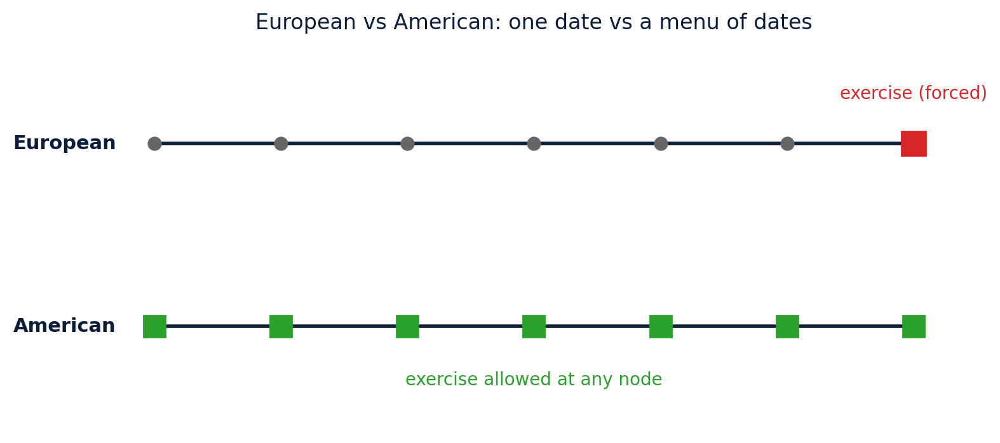

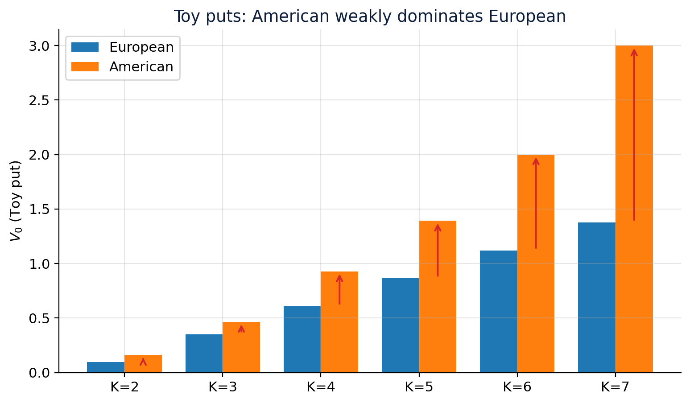

### 4.1.4 Table

**Table 4.1.** ST toy put comparison of three stopping rules (above), and analogous numbers for the realistic put $K = 100$ over $n = 3$:

| lattice | rule | $V_0$ |
|:--|:--|---:|
| ST toy, $K=5$ | $\tau \equiv 0$ | $1.000$ |
| ST toy, $K=5$ | $\tau \equiv 2$ (European) | $0.960$ |
| ST toy, $K=5$ | $\tau^*$ (American) | $1.360$ |
| Realistic, $K=100$ | $\tau \equiv 0$ | $0.000$ |
| Realistic, $K=100$ | $\tau \equiv 3$ (European) | $4.593$ |
| Realistic, $K=100$ | $\tau^*$ (American) | $4.907$ |

The European is one of the strategies the American buyer could choose; she chooses better.

---

## §4.2 Stopping times and the buyer's problem

**Punchline.** The American buyer's problem is

$$V_0^{\text{Am}} \;=\; \sup_{\tau \in \mathcal{T}_{0,n}} \tilde{\mathbb{E}}\!\left[\beta^\tau\, g(S_\tau)\right].$$

Stopping times are decision rules computable from past observations only — **no future peeking**. The whole chapter is about how to compute this sup.

**Intuition.** Imagine you're walking the binomial tree node by node. At each node you must decide *yes-exercise* or *no-continue*, knowing only the path so far. You may carry any deterministic logic with you — "exercise the first time $S$ drops below $3$", "exercise on the third up-move", "exercise on day $5$ no matter what" — anything but "exercise on the path's eventual minimum." The latter is forbidden because at the time you'd commit to it, you can't see the future.

### 4.2.1 Reminder: what is a stopping time?

Recall from Ch 3, §3.4: $\tau: \Omega \to \{0, 1, \dots, n, \infty\}$ is a **stopping time** with respect to the filtration $\{\mathcal F_k\}$ if

$$\{\tau \le k\} \in \mathcal F_k \quad \text{for every } k \in \{0, 1, \dots, n\}.$$

Equivalently, for each path $\omega$, the value $\tau(\omega)$ is decided as soon as the path enters $\mathcal F_k$ — that is, when the first $k$ tosses are revealed. A coin-toss path $\omega = (\omega_1, \omega_2, \dots, \omega_n)$ at time $k$ has revealed $(\omega_1, \dots, \omega_k)$.

**Examples that *are* stopping times** (no peeking):

- $\tau \equiv c$ (constant time).
- $\tau = \min\{k \ge 0 : S_k \le L\}$ (first hitting of level $L$ below).
- $\tau = \min\{k \ge 0 : g(S_k) \ge V_k\}$ (first time intrinsic touches Snell envelope — see §4.4).
- $\tau = n \wedge \min\{k : \text{condition}_k\}$ (any hitting time capped at maturity).

**Examples that are *not* stopping times**:

- $\tau =$ the index $k$ where $S_k$ attains its global maximum over $k = 0, \dots, n$. (Requires future.)
- $\tau =$ "exercise one step before the price crashes". (Requires future.)
- $\tau =$ "exercise at the average of high and low days". (Average of future days requires future.)

### 4.2.2 The buyer's optimisation

We want to compute

$$\sup_{\tau \in \mathcal{T}_{0,n}} \tilde{\mathbb{E}}\!\left[\beta^\tau\, g(S_\tau)\right].$$

The supremum is over a finite set: with $n$ steps and $2^n$ paths, there are only finitely many possible $\tau$'s. In principle one could enumerate them all and pick the best. We will instead derive a recursion (the Snell envelope, §4.3) that solves this without enumeration.

Some sanity checks before we get there.

**Example 4.2.1 (ST put $K = 5$, hitting time rule).** Let $\tau_a = \min\{k \ge 0 : S_k \le 2\}$ — first hit of the level $2$. With the toy lattice $S_0 = 4$:

- Path $HH$: $S_1 = 8, S_2 = 16$ — never hits. $\tau_a = \infty$, payoff $0$ (convention).
- Path $HT$: $S_1 = 8, S_2 = 4$ — never hits. $\tau_a = \infty$, payoff $0$.
- Path $TH$: $S_1 = 2$ — hits at $k = 1$. $\tau_a = 1$, payoff $g(2) = 3$.
- Path $TT$: $S_1 = 2$ — hits at $k = 1$. $\tau_a = 1$, payoff $g(2) = 3$.

To use this consistently across the no-hit paths we must extend $g$ at $\tau = \infty$ to give $0$. Then

$$\tilde{\mathbb{E}}[\beta^{\tau_a} g(S_{\tau_a})] = \tfrac{1}{2}\!\cdot\!\beta\!\cdot\!3 + \tfrac{1}{2}\!\cdot\!0 = \tfrac{1}{2}\!\cdot\!\tfrac{4}{5}\!\cdot\!3 = 1.20.$$

(We averaged over $\tilde p = 1/2$: $P(\text{first toss} = T) = 1/2$ gives payoff $\beta \cdot 3$; $P(\text{first toss} = H) = 1/2$ gives $0$.)

So $\tau_a$ achieves $1.20$. Not bad — better than the European $0.96$, worse than the actual American $1.36$.

**Example 4.2.2 (the rule "exercise at the path-minimum").** Define $\tau_{\min} := \mathrm{arg\,min}_k S_k$. On the toy lattice, on path $HH$ the minimum is $S_0 = 4$ at $k = 0$; on path $HT$ the minimum is $S_2 = 4$ at $k = 2$; on path $TH$ the minimum is $S_1 = 2$; on path $TT$ the minimum is $S_2 = 1$. At $k = 0$ both paths $HH$ and $HT$ start identically (they share the prefix), but $\tau_{\min}$ would assign them different values ($0$ vs $2$). That contradicts the requirement that $\tau$ be decidable from $\mathcal F_0$ alone (which contains only the trivial information at $k = 0$). **Not a stopping time**.

**Example 4.2.3 (barrier hitting time on realistic).** Define $\tau_B = \min\{k : S_k \ge 108\}$ on the realistic lattice ($n = 3$). Enumerate paths:

| path | $S_1$ | $S_2$ | $S_3$ | $\tau_B$ | $g_{\text{call}}$ |
|:--|---:|---:|---:|:--:|---:|
| $HHH$ | $110$ | $121$ | $133.1$ | $1$ | $10$ |
| $HHT$ | $110$ | $121$ | $108.9$ | $1$ | $10$ |
| $HTH$ | $110$ | $99$ | $108.9$ | $1$ | $10$ |
| $HTT$ | $110$ | $99$ | $89.1$ | $1$ | $10$ |
| $THH$ | $90$ | $99$ | $108.9$ | $3$ | $8.90$ |
| $THT$ | $90$ | $99$ | $89.1$ | $\infty$ | $0$ |
| $TTH$ | $90$ | $81$ | $89.1$ | $\infty$ | $0$ |
| $TTT$ | $90$ | $81$ | $72.9$ | $\infty$ | $0$ |

*Payoff column:* $g_{\text{call}}(S_{\tau_B})$ at strike $K = 100$ — zero when $\tau_B = \infty$ (barrier never hit).

Under $\tilde p = 0.6$, the probability of each $\omega$ is $0.6^{\#H}\cdot 0.4^{\#T}$. Discounted expected payoff:

$$\begin{aligned}
\tilde{\mathbb{E}}[\beta^{\tau_B} g(S_{\tau_B})] &= \beta\cdot 10\cdot \tilde{\mathbb{P}}(\text{first toss }H) + \beta^3 \cdot 8.9 \cdot \tilde{\mathbb{P}}(THH) \\
&= \tfrac{1}{1.02}\!\cdot 10\!\cdot 0.6 + \tfrac{1}{1.061208}\!\cdot 8.9\!\cdot 0.144 \\
&\approx 5.882 + 1.208 = 7.090.
\end{aligned}$$

Quite a bit less than the European call $10.360$. The hitting-time rule for the call is *suboptimal* — natural intuition: for a non-dividend call, the right rule is to *not* exercise early at all.

**Example 4.2.4 (ST put $K=5$ — comparing three rules).** On the toy lattice, three rules:

- $\tau_a \equiv 0$: payoff $g(4) = 1$. Discounted expectation = $1.00$.
- $\tau_b = \min\{k : \omega_k = T\}$ (first down), with the convention $\tau_b = n$ if no $T$ ever shows. On the four paths:

| path | path $\tilde{\mathbb{P}}$ | $\tau_b$ | $S_{\tau_b}$ | $g(S_{\tau_b})$ | $\beta^{\tau_b} g$ |
|:--|---:|:--:|---:|---:|---:|
| HH | $1/4$ | $2$ | $16$ | $0$ | $0$ |
| HT | $1/4$ | $2$ | $4$ | $1$ | $0.640$ |
| TH | $1/4$ | $1$ | $2$ | $3$ | $2.400$ |
| TT | $1/4$ | $1$ | $2$ | $3$ | $2.400$ |

$\tilde{\mathbb{E}}[\beta^{\tau_b} g] = (0 + 0.64 + 2.40 + 2.40)/4 = 1.36$.

That's **exactly** the American value. We have stumbled onto $\tau^*$! The rule "stop at the first down" is optimal for this contract on this lattice. Section 4.4 will derive it systematically.

- $\tau_c \equiv 2$ (always wait to maturity): this is the European, $0.96$.

**Example 4.2.5 (constant-time stop, realistic put).** With $K = 100$, $n = 3$, consider $\tau \equiv 1$:

$$\tilde{\mathbb{E}}[\beta\cdot g(S_1)] = \tfrac{1}{1.02}\!\left[0.6\cdot 0 + 0.4 \cdot 10\right] = \tfrac{4}{1.02} \approx 3.922.$$

A constant-time stop gives $3.922$ — less than both European $4.593$ and American $4.907$.

### 4.2.3 Why the supremum exists

There are only finitely many measurable stopping rules on a finite tree. Each defines a number $\tilde{\mathbb{E}}[\beta^\tau g(S_\tau)]$. The sup over a finite set is attained — there is an actual rule $\tau^*$ that achieves $V_0^{\text{Am}}$, not merely a limit.

This is one of the great gifts of working in *discrete* time. In continuous time the same conclusion holds but requires technical machinery (semi-continuity of expectations). In our setting it's just "the max of finitely many numbers exists." 

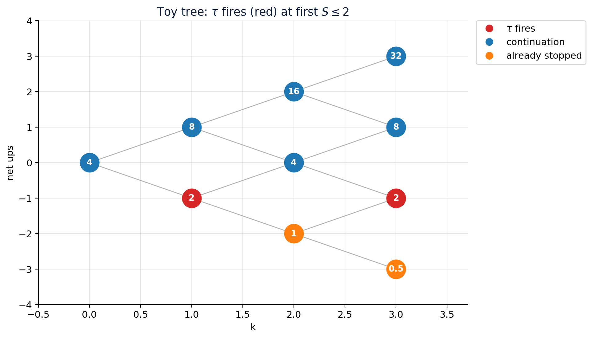

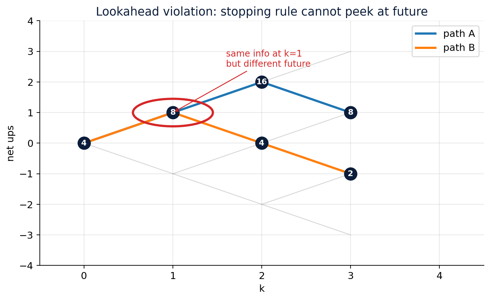

### 4.2.4 Table

**Table 4.2.** Five stopping rules on the ST put $K=5$ with their discounted expected payoffs:

| rule | description | $\tilde{\mathbb{E}}[\beta^\tau g]$ |
|:--|:--|---:|
| $\tau \equiv 0$ | exercise now | $1.00$ |
| $\tau \equiv 1$ | exercise at $k=1$ | $1.20$ |
| $\tau \equiv 2$ | European | $0.96$ |
| $\tau_a$ | first-touch level 2 | $1.20$ |
| $\tau_b$ | first down | **$1.36$** |

*Definitions:* $\tau_a = \min\{k : S_k \le 2\}$; $\tau_b = \min\{k : \omega_k = T\}$. The $\tau \equiv 2$ rule reduces to the European-style payoff at maturity.

The best of these is $\tau_b$, attaining $1.36 = V_0^{\text{Am}}$.

---

## §4.3 The Snell envelope

**Punchline.** Define the buyer's value function by backward induction:

$$\boxed{\;\begin{aligned}
V_n &:= g(S_n), \\
V_k &:= \max\!\Big\{g(S_k),\; \beta\, \tilde{\mathbb{E}}[V_{k+1}\mid \mathcal F_k]\Big\}\\
&\quad\text{for } k = n-1, n-2, \dots, 0.
\end{aligned}\;}$$

This process $\{V_k\}$ is called the **Snell envelope** of the discounted payoff. It is the smallest supermartingale that dominates the intrinsic process. And $V_0 = V_0^{\text{Am}}$.

**Intuition.** At every node the buyer compares two numbers: (i) "exercise now and walk away with $g(S_k)$", versus (ii) "wait one period — the discounted expected value of holding is $\beta \tilde{\mathbb{E}}[V_{k+1}\mid \mathcal F_k]$". Whichever is larger, that's $V_k$. The recursion is just the principle that *the optimal first move is the optimal first move from where you'll start tomorrow*, which is the entire content of **dynamic programming**.

### 4.3.1 Setup and the recursion

For a payoff process $\{g_k\}_k$ on a filtered probability space, the **Snell envelope** is the process $\{V_k\}$ defined by

$$V_n = g_n, \qquad V_k = \max\big\{g_k,\, \beta\, \tilde{\mathbb{E}}[V_{k+1}\mid\mathcal F_k]\big\}.$$

In our setting $g_k = g(S_k)$.

Three properties characterise $V$ (and we'll verify each on examples):

**(i) Dominates the payoff.** $V_k \ge g(S_k)$ at every node. By construction.

**(ii) Discounted Snell envelope is a $\tilde{\mathbb{P}}$-supermartingale.** Set $\tilde V_k := \beta^k V_k$ (discount to time-0 units). Then

$$\begin{aligned}
\tilde{\mathbb{E}}[\tilde V_{k+1}\mid\mathcal F_k] &= \beta^{k+1}\tilde{\mathbb{E}}[V_{k+1}\mid\mathcal F_k] \\
&= \beta^k\!\cdot\!\beta\!\tilde{\mathbb{E}}[V_{k+1}\mid\mathcal F_k] \le \beta^k\!\cdot V_k = \tilde V_k.
\end{aligned}$$

The inequality follows because $V_k \ge \beta\tilde{\mathbb{E}}[V_{k+1}\mid\mathcal F_k]$ by the max in the recursion. So $\tilde V$ is a supermartingale.

**(iii) Smallest supermartingale dominating $\tilde g_k := \beta^k g(S_k)$.** If $\{U_k\}$ is any supermartingale with $U_k \ge \tilde g_k$ at every node, then $U_k \ge \tilde V_k$. We won't prove this in full generality (the proof is by backward induction; details below). The minimality is conceptually important: any "valid replication budget" must be at least $V_0$, so $V_0$ is the no-arbitrage *floor*.

### 4.3.2 Worked example — Toy put $K = 5$

This is the canonical example. We have $S_0 = 4, u = 2, d = 1/2, r = 1/4, \tilde p = 1/2$, $\beta = 4/5$, $K = 5$.

**Step 1: terminal layer.** At $k = 2$ the Snell envelope is the intrinsic:

| node $(2, j)$ | $S_2$ | $g(S_2) = V_2$ |
|:--:|---:|---:|
| $(2, 0)$ TT | $1$ | $4$ |
| $(2, 1)$ HT or TH | $4$ | $1$ |
| $(2, 2)$ HH | $16$ | $0$ |

**Step 2: layer $k = 1$.** For the *up* node $(1, 1)$ where $S_1 = 8$:

- Intrinsic: $g(8) = 0$.
- Continuation: $\beta\!\cdot\!\tilde{\mathbb{E}}[V_2\mid\mathcal F_1, \text{up}] = \tfrac{4}{5}\!\cdot\!\tfrac{1}{2}(V_2(HH) + V_2(HT)) = \tfrac{4}{5}\!\cdot\!\tfrac{1}{2}(0 + 1) = 0.40$.
- $V_1(1, 1) = \max\{0, 0.40\} = 0.40$ → **continue**.

For the *down* node $(1, 0)$ where $S_1 = 2$:

- Intrinsic: $g(2) = 3$.
- Continuation: $\beta\!\cdot\!\tfrac{1}{2}(V_2(TH) + V_2(TT)) = \tfrac{4}{5}\!\cdot\!\tfrac{1}{2}(1 + 4) = 2.00$.
- $V_1(1, 0) = \max\{3, 2\} = 3$ → **exercise**.

**Step 3: root.**

- Intrinsic: $g(4) = 1$.
- Continuation: $\beta\!\cdot\!\tfrac{1}{2}(V_1(1, 1) + V_1(1, 0)) = \tfrac{4}{5}\!\cdot\!\tfrac{1}{2}(0.40 + 3) = \tfrac{4}{5}\!\cdot 1.70 = 1.36$.
- $V_0 = \max\{1, 1.36\} = 1.36$ → **continue**.

**Result.** The American put price is $V_0 = 1.36$.

| node | $S$ | $g$ | cont. | $V$ | regime |
|:--:|---:|---:|---:|---:|:--:|
| $(0, 0)$ | $\phantom{0}4$ | $1$ | $1.36$ | $1.36$ | **C** |
| $(1, 0)$ | $\phantom{0}2$ | $3$ | $2.00$ | $3.00$ | **E** |
| $(1, 1)$ | $\phantom{0}8$ | $0$ | $0.40$ | $0.40$ | C |
| $(2, 0)$ | $\phantom{0}1$ | $4$ | | $4.00$ | E |
| $(2, 1)$ | $\phantom{0}4$ | $1$ | | $1.00$ | E |
| $(2, 2)$ | $16$ | $0$ | | $0.00$ | term |

*Column "cont."* $= \beta\tilde{\mathbb E}[V_{\cdot+1} \mid \mathcal F]$ — the discounted continuation value.

*Legend.* C = continue (hold). E = exercise. term = terminal node, no decision (continuation column blank). Blank in continuation column: not computed (terminal node).*

**Example 4.3.1 (same, but $K = 4$).** Re-run with $K = 4$:

- Terminal: $V_2(0) = 3, V_2(1) = 0, V_2(2) = 0$.
- $V_1(1, 1) = \max\{0, \beta \cdot \tfrac{1}{2}(0+0)\} = 0$.
- $V_1(1, 0) = \max\{2, \beta\cdot \tfrac{1}{2}(0 + 3)\} = \max\{2, 1.20\} = 2$ → exercise.
- $V_0 = \max\{0, \beta\cdot\tfrac{1}{2}(0 + 2)\} = 0.80$.

So at $K = 4$ the American put is $0.80$. Notice that the *up* branch never has any value because the put is OTM and stays OTM.

**Example 4.3.2 (Toy, more strikes).**

| $K$ | $V_0^{\text{Am}}$ | $V_0^{\text{Eu}}$ | early-exercise premium |
|:--:|---:|---:|---:|
| $3$ | $0.40$ | $0.32$ | $0.08$ |
| $4$ | $0.80$ | $0.48$ | $0.32$ |
| $5$ | $1.36$ | $0.96$ | $0.40$ |
| $6$ | $2.00$ | $1.44$ | $0.56$ |
| $7$ | $3.00$ | $1.92$ | $1.08$ |

The down-node $(1, 0)$ at $S = 2$ has intrinsic $K-2$ and continuation $\beta\cdot\tfrac{1}{2}(g(4)+g(1))$. For $K \ge 3$ the intrinsic strictly exceeds the continuation, so early exercise fires at that node — and the early-exercise premium grows with $K$. For $K = 6, 7$ the root itself exercises immediately ($V_0 = K - 4$), as you can check from the recursion.

### 4.3.3 Realistic-lattice example

**Example 4.3.3 (realistic put, $K = 100$, $n = 3$).** With $S_0 = 100, u = 1.10, d = 0.90, r = 0.02, \tilde p = 0.6, \beta = 1/1.02 \approx 0.98039$.

Terminal prices and intrinsics ($g(s) = (100-s)^+$):

| node | $S_3$ | $g$ |
|:--|---:|---:|
| HHH | $133.10$ | $0$ |
| HHT (×3) | $108.90$ | $0$ |
| HTT (×3) | $89.10$ | $10.90$ |
| TTT | $72.90$ | $27.10$ |

**Layer $k = 2$.** $S_2$ values: $121, 99, 81$.

- Node $(2, 2)$, $S = 121$: intrinsic $0$. Continuation: $\beta(\tilde p \cdot 0 + \tilde q\cdot 0) = 0$. $V = 0$.
- Node $(2, 1)$, $S = 99$: intrinsic $1$. Continuation: $\beta(\tilde p\cdot 0 + \tilde q\cdot 10.9) = 0.98039\cdot 0.4\cdot 10.9 = 4.275$. $V = 4.275$ → **continue**.
- Node $(2, 0)$, $S = 81$: intrinsic $19$. Continuation: $\beta(\tilde p\cdot 10.9 + \tilde q\cdot 27.1) = 0.98039\cdot(6.54 + 10.84) = 0.98039\cdot 17.38 = 17.038$. $V = 19$ → **exercise**.

**Layer $k = 1$.** $S_1$ values: $110, 90$.

- Node $(1, 1)$, $S = 110$: intrinsic $0$. Continuation: $\beta(\tilde p\cdot 0 + \tilde q\cdot 4.275) = 0.98039\cdot 0.4\cdot 4.275 = 1.676$. $V = 1.676$.
- Node $(1, 0)$, $S = 90$: intrinsic $10$. Continuation: $\beta(\tilde p\cdot 4.275 + \tilde q\cdot 19) = 0.98039\cdot(2.565 + 7.6) = 9.965$. $V = 10$ → **exercise**, by a hair! The buyer captures the $0.035$ early-exercise premium at this node.

**Root.** $S_0 = 100$, intrinsic $0$. Continuation: $\beta(\tilde p\cdot 1.676 + \tilde q\cdot 10) = 0.98039\cdot(1.006 + 4) = 4.907$. $V_0 = 4.907$.

| node | $S$ | $g$ | cont | $V$ | regime |
|:--:|---:|---:|---:|---:|:--:|
| $(0,0)$ | $100.00$ | $\phantom{0}0.00$ | $\phantom{0}4.907$ | $\phantom{0}4.907$ | C |
| $(1,1)$ | $110.00$ | $\phantom{0}0.00$ | $\phantom{0}1.676$ | $\phantom{0}1.676$ | C |
| $(1,0)$ | $\phantom{0}90.00$ | $10.00$ | $\phantom{0}9.965$ | $10.000$ | **E** |
| $(2,2)$ | $121.00$ | $\phantom{0}0.00$ | $\phantom{0}0.000$ | $\phantom{0}0.000$ | term |
| $(2,1)$ | $\phantom{0}99.00$ | $\phantom{0}1.00$ | $\phantom{0}4.275$ | $\phantom{0}4.275$ | C |
| $(2,0)$ | $\phantom{0}81.00$ | $19.00$ | $17.038$ | $19.000$ | **E** |
| $(3,3)$ | $133.10$ | $\phantom{0}0.00$ | | $\phantom{0}0.000$ | term |
| $(3,2)$ | $108.90$ | $\phantom{0}0.00$ | | $\phantom{0}0.000$ | term |
| $(3,1)$ | $\phantom{0}89.10$ | $10.90$ | | $10.900$ | term-E |
| $(3,0)$ | $\phantom{0}72.90$ | $27.10$ | | $27.100$ | term-E |

*Legend.* C = continue. E = exercise. term = terminal (no continuation value). term-E = terminal in-the-money. Blank in cont column: not computed at terminal nodes.*

### 4.3.4 Supermartingale check

**Example 4.3.4 (verify the supermartingale property on the ST toy).** With $\tilde V_k = \beta^k V_k$ (discounted Snell), check $\tilde{\mathbb{E}}[\tilde V_{k+1}\mid\mathcal F_k] \le \tilde V_k$ at each non-terminal node.

At root: $\tilde V_0 = V_0 = 1.36$. $\tilde{\mathbb{E}}[\tilde V_1] = \beta\cdot\tfrac{1}{2}(V_1(1,1) + V_1(1,0)) = 0.8\cdot 0.5\cdot(0.40 + 3) = 1.36$. **Equality** (the buyer would lose nothing by continuing one step).

At $(1, 0)$: $\tilde V_1 = \beta\cdot 3 = 2.40$. $\tilde{\mathbb{E}}[\tilde V_2\mid\mathcal F_1, T] = \beta^2\cdot \tfrac{1}{2}(1 + 4) = 0.64\cdot 2.5 = 1.60$. So $\tilde{\mathbb{E}}[\tilde V_2\mid \cdot] = 1.60 < \tilde V_1 = 2.40$. **Strict drop** of $0.80$. This is the source of the Doob *increasing process* below.

At $(1, 1)$: $\tilde V_1 = \beta\cdot 0.40 = 0.32$. $\tilde{\mathbb{E}}[\tilde V_2 \mid \cdot] = \beta^2\cdot\tfrac{1}{2}(0 + 1) = 0.32$. Equality.

So the supermartingale property holds with *equality* at every node except $(1, 0)$, where it strictly decreases. That node — and only that node — is the node we *would* exercise. The drop is the **slack** $A$ that Doob will isolate.

### 4.3.5 Doob decomposition

**Theorem (Doob).** Every supermartingale $X$ on a finite filtration uniquely decomposes as

$$X_k = X_0 + M_k - A_k,$$

where $M$ is a martingale with $M_0 = 0$ and $A$ is a non-decreasing, $\mathcal F_{k-1}$-predictable process with $A_0 = 0$.

Apply to the discounted Snell envelope $\tilde V_k = \beta^k V_k$: at each step define the increment of $A$ as the drop *induced* by the supermartingale property:

$$\Delta A_{k+1} := \tilde V_k - \tilde{\mathbb{E}}[\tilde V_{k+1}\mid\mathcal F_k] \;\ge\; 0,$$

and $M_{k+1} = M_k + \big(\tilde V_{k+1} - \tilde{\mathbb{E}}[\tilde V_{k+1}\mid\mathcal F_k]\big)$. By construction, $M$ has zero conditional drift (martingale) and $A$ is non-decreasing. The crucial fact: $\Delta A_{k+1} > 0$ **iff** the buyer would optimally exercise *at* time $k$ (the supermartingale lost slack there).

**Example 4.3.5 (Doob columns, ST put $K = 5$, path TT).** Tabulate along the path $\omega = TT$:

| $k$ | $S_k$ | $g$ | $V_k$ | $\tilde V_k$ | $\Delta A_{k+1}$ | $\Delta M_{k+1}$ |
|:--:|---:|---:|---:|---:|---:|---:|
| $0$ | $4$ | $1$ | $1.36$ | $1.36$ | $0.00$ | $+1.04$ |
| $1$ | $2$ | $3$ | $3.00$ | $2.40$ | $0.80$ | $+0.96$ |
| $2$ | $1$ | $4$ | $4.00$ | $2.56$ | | |

*Columns:* $\tilde V_k = \beta^k V_k$; $\Delta M_{k+1}$ is the martingale increment along path TT. Step-by-step: at $k=0$, $\Delta M_1 = \tilde V_1 - \tilde{\mathbb{E}}[\tilde V_1] = 2.40 - 1.36 = +1.04$. At $k=1$, $\Delta M_2 = \tilde V_2 - \tilde{\mathbb{E}}[\tilde V_2 \mid \mathcal F_1, T] = 2.56 - 1.60 = +0.96$.

*Blank: increments not defined at the terminal step (no $A_3$ or $\Delta M_3$ in a 2-period model).*

So along path TT, $A_0 = 0, A_1 = 0, A_2 = 0.80$. The increase happens between $k = 1$ and $k = 2$ — which records that *at* $k = 1$ we should have stopped. And note this $\Delta A$ aligns with the exercise-region indicator at $(1, 0)$ from §4.3.4.

The discounted European-style payoff $\tilde{\mathbb{E}}[\beta^2 g(S_2)]$ is the price-of-continuing-from-the-root, $1.36$. The full optimal-stopping pricing identity, stated cleanly in the next section, is $V_0 = \tilde{\mathbb{E}}[\beta^{\tau^*} g(S_{\tau^*})]$ for the right stopping time $\tau^*$.

### 4.3.6 Counter-example: a "supermartingale" that *doesn't* dominate

**Example 4.3.6 (smaller supermartingale fails to dominate).** Try setting $U_k \equiv 0$ for all $k$. Clearly $U$ is a (trivial) supermartingale — constant zero, no positive drift required. But it fails to dominate $g$ because $g(S_1 = 2) = 3 > 0$. Thus $U \not\ge g$, and $U$ does not qualify. The Snell envelope is the *smallest* supermartingale dominating $g$ — anything smaller either violates the supermartingale property or drops below the intrinsic somewhere.

Try a sharper attempt: let $W_0 = 1.20$, $W_1 = 1.50$, $W_2 = 3$ at $(2,0)$, etc. Pick values, see if it's a supermartingale with $W \ge g$. It will fail somewhere — by minimality, anywhere strictly below $V$ either breaks the supermartingale property or the domination. Try it as an exercise.

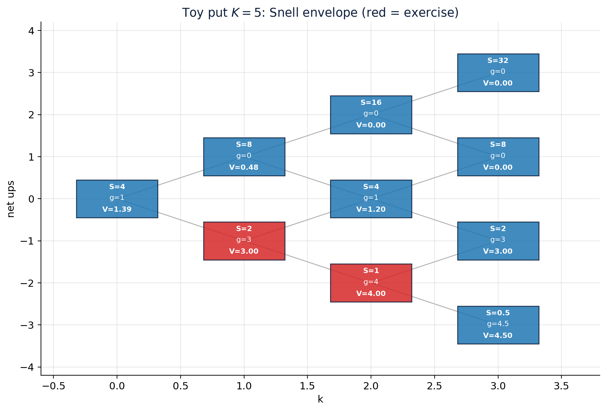

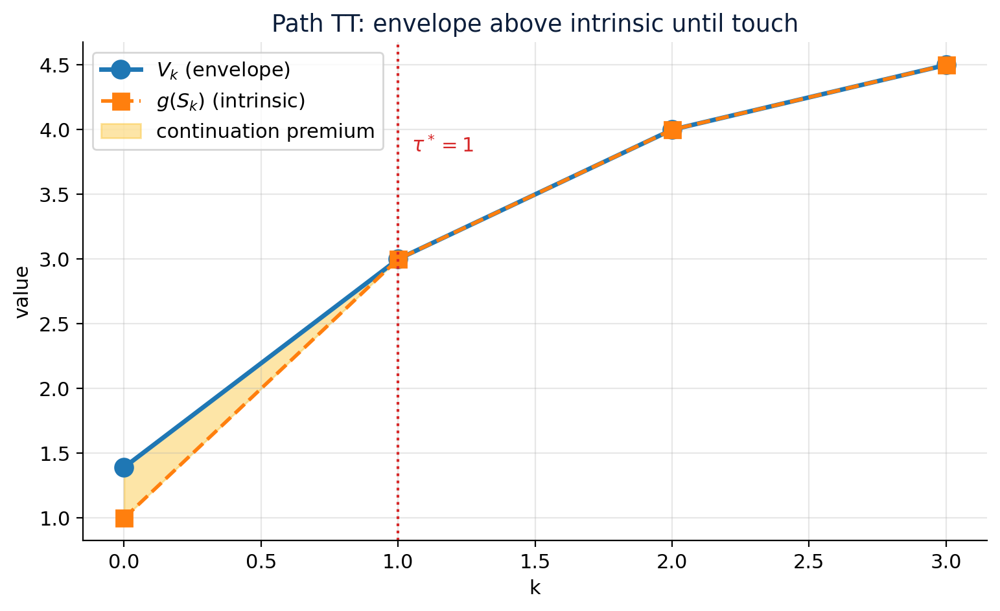

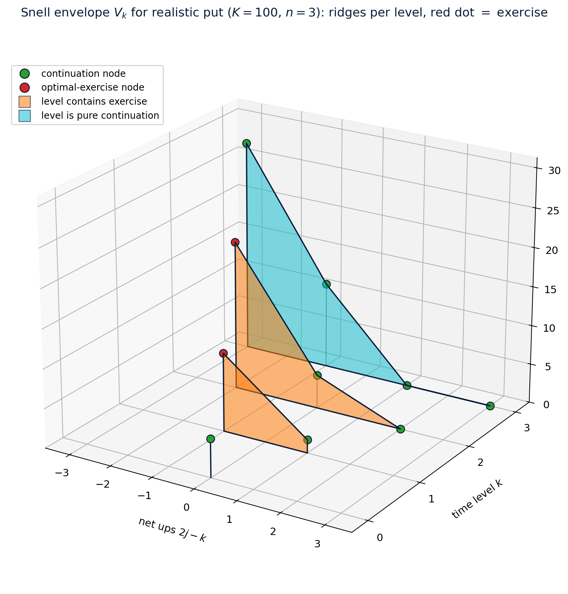

### 4.3.7 Tables

**Table 4.3.** ST put $K = 5$ Snell envelope, every node.

(Reproduced from §4.3.2.)

**Table 4.4.** Doob decomposition columns for the ST put $K = 5$ on path TT.

(Reproduced from §4.3.5.)

---

## §4.4 Optimal exercise as a stopping time

**Punchline.** The optimal stopping time is

$$\boxed{\ \tau^* \;:=\; \min\{k \in \{0, 1, \dots, n\} : V_k = g(S_k)\}.\ }$$

It is the **first time** the Snell envelope touches the intrinsic. The stopped discounted Snell process $\tilde V_{k \wedge \tau^*}$ is a *martingale* (not just a supermartingale). Equivalently, $V_0 = \tilde{\mathbb{E}}[\beta^{\tau^*} g(S_{\tau^*})]$ — and no stopping time achieves a higher discounted expected payoff.

**Intuition.** Walk the tree. As long as the envelope $V_k$ strictly exceeds the intrinsic $g(S_k)$, you'd be a fool to exercise — waiting is worth more. The instant $V_k$ drops to meet $g(S_k)$, waiting is no better; you may as well take the money. Stopping at that instant is what makes the *stopped* discounted process drift-free (martingale), because beyond $\tau^*$ the process is frozen and before $\tau^*$ the supermartingale property holds with equality (no slack lost).

### 4.4.1 Why $\tau^*$ is optimal

The argument is a two-line exercise once we have the Doob decomposition.

**Claim 1: $\tau^*$ is a stopping time.** At time $k$, the indicator $\{V_k = g(S_k)\}$ depends only on $(S_0, \dots, S_k)$, hence on $\mathcal F_k$. So $\{\tau^* \le k\} = \bigcup_{j \le k}\{V_j = g(S_j)\} \in \mathcal F_k$. ✓

**Claim 2: stopped discounted Snell envelope is a martingale.** The supermartingale property of $\tilde V$ holds with equality on the *continuation* region $\{V_k > g(S_k)\}$ (no $A$-increment), by construction of the recursion. After $\tau^*$ the process is constant. So $\tilde V_{k \wedge \tau^*}$ has zero conditional drift everywhere.

**Claim 3: $V_0 = \tilde{\mathbb{E}}[\beta^{\tau^*} g(S_{\tau^*})]$.** Applying the Optional Stopping Theorem (Ch 3, §3.6) to the *martingale* $\tilde V_{k\wedge \tau^*}$:

$$\begin{aligned}
V_0 &= \tilde V_0 = \tilde{\mathbb{E}}[\tilde V_{n \wedge \tau^*}] = \tilde{\mathbb{E}}[\tilde V_{\tau^*}] \\
&= \tilde{\mathbb{E}}[\beta^{\tau^*} V_{\tau^*}] = \tilde{\mathbb{E}}[\beta^{\tau^*} g(S_{\tau^*})],
\end{aligned}$$

the last step because $V_{\tau^*} = g(S_{\tau^*})$ by definition.

**Claim 4: no other $\tau$ does better.** For any stopping time $\sigma \le n$:

$$\tilde{\mathbb{E}}[\beta^\sigma g(S_\sigma)] \le \tilde{\mathbb{E}}[\beta^\sigma V_\sigma] = \tilde{\mathbb{E}}[\tilde V_\sigma].$$

But $\tilde V$ is a *super*-martingale, so by OST $\tilde{\mathbb{E}}[\tilde V_\sigma] \le \tilde V_0 = V_0$.

Combining, $V_0 = \sup_\tau \tilde{\mathbb{E}}[\beta^\tau g(S_\tau)]$ and $\tau^*$ achieves it.

### 4.4.2 Worked example — Toy put, every path

**Example 4.4.1 (ST put $K = 5$, $\tau^*$ on every path).** From §4.3.2 we have:

| node | $V$ | $g$ | $V = g$? |
|:--:|---:|---:|:--:|
| $(0, 0)$ | $1.36$ | $1$ | no |
| $(1, 0)$ T | $3.00$ | $3$ | **yes** |
| $(1, 1)$ H | $0.40$ | $0$ | no |
| $(2, 0)$ TT | $4$ | $4$ | term |
| $(2, 1)$ HT,TH | $1$ | $1$ | term |
| $(2, 2)$ HH | $0$ | $0$ | term |

*Legend:* "term" = terminal node (trivially $V = g$).

Reading along each path:

| path | $\tau^*$ | $S_{\tau^*}$ | $g(S_{\tau^*})$ | $\beta^{\tau^*}g$ |
|:--:|:--:|---:|---:|---:|
| HH | $2$ | $16$ | $0$ | $0$ |
| HT | $2$ | $4$ | $1$ | $0.64$ |
| TH | $1$ | $2$ | $3$ | $2.40$ |
| TT | $1$ | $2$ | $3$ | $2.40$ |

Under $\tilde{\mathbb{P}}$ each path has weight $1/4$:

$$\tilde{\mathbb{E}}[\beta^{\tau^*} g] = \tfrac{1}{4}(0 + 0.64 + 2.40 + 2.40) = \tfrac{5.44}{4} = 1.36 \;=\; V_0. \checkmark$$

Path-by-path: ✓.

**Example 4.4.2 (suboptimal $\tau \equiv 2$ — show the gap).** With $\tau \equiv 2$ (the European stop):

$$\tilde{\mathbb{E}}[\beta^2 g(S_2)] = \beta^2\!\cdot\!\tfrac{1}{4}(0 + 1 + 1 + 4) = \tfrac{16}{25}\!\cdot\!\tfrac{6}{4} = 0.96.$$

Gap: $V_0 - 0.96 = 0.40$. **And the gap is exactly the expected $A$-increment along the path.** Specifically: along path TH and path TT we should have stopped at $k = 1$, not $k = 2$. The gain we forfeit by waiting is $\beta\cdot 3 - \beta^2\cdot \tfrac{1}{2}(1 + 4) = 2.40 - 1.60 = 0.80$ on each "down at $k=1$" path. Average over the two such paths (probability $\tilde p \cdot \tilde q + \tilde q \cdot \tilde q = 1/2$ in total): $0.80 \cdot 1/2 = 0.40$. ✓ — that's the gap.

### 4.4.3 Realistic-lattice example

**Example 4.4.3 (RL put $K=100$, $\tau^*$ on each path).** From §4.3.3:

- $V_{(1,0)} = g_{(1,0)} = 10$ → exercise at $k=1$ along any path starting with $T$.
- $V_{(2,0)} = g_{(2,0)} = 19$ → exercise at $k=2$ along paths reaching $S=81$. But: those paths *also* go down at $k=1$ (the only way to reach $(2,0)$ is TT) and thus would have exercised at $k=1$ first. So $\tau^* = 1$ on path TT.

Path-by-path. The labels HTT and THH share the same final stock price but trigger early exercise at different times because the **path** matters for $\tau^* = \min\{k: V_k = g_k\}$. For path THH: at $k=1$ we are at $S_1 = 90$, $V = g = 10$, so $\tau^* = 1$ and payoff is $\beta\cdot 10 = 9.804$. For path HTT: at $k=1$ we are at $S_1 = 110$, $V = 1.676$, $g = 0$ — don't exercise; at $k=2$, $S_2 = 99$, $V = 4.275$, $g = 1$ — don't exercise; at $k=3$, $S_3 = 89.10$, $g = 10.90$ — exercise. So $\tau^* = 3$ on path HTT.

Path enumeration:

| path | $\tilde{\mathbb{P}}$ | $\tau^*$ | $S_{\tau^*}$ | $g$ | $\beta^{\tau^*}g$ | weighted |
|:--|---:|:--:|---:|---:|---:|---:|
| HHH | $0.216$ | n/a | $133.10$ | $0$ | $0$ | $0$ |
| HHT | $0.144$ | n/a | $108.90$ | $0$ | $0$ | $0$ |
| HTH | $0.144$ | n/a | $108.90$ | $0$ | $0$ | $0$ |
| HTT | $0.096$ | $3$ | $89.10$ | $10.90$ | $10.272$ | $0.986$ |
| THH | $0.144$ | $1$ | $90$ | $10$ | $9.804$ | $1.412$ |
| THT | $0.096$ | $1$ | $90$ | $10$ | $9.804$ | $0.941$ |
| TTH | $0.096$ | $1$ | $90$ | $10$ | $9.804$ | $0.941$ |
| TTT | $0.064$ | $1$ | $90$ | $10$ | $9.804$ | $0.627$ |

Sum: $0 + 0 + 0 + 0.986 + 1.412 + 0.941 + 0.941 + 0.627 = 4.907$. Match. ✓ — exactly the $V_0$ we computed in §4.3.3.

### 4.4.4 Largest optimal stopping time $\tau^{\max}$

There is also a *latest* stopping time that's still optimal:

$$\tau^{\max} := \min\{k : \Delta A_{k+1} > 0\}.$$

That is, $\tau^{\max}$ is the first time the supermartingale would strictly lose slack on the *next* step. Any stopping time between $\tau^*$ and $\tau^{\max}$ achieves the same expected payoff.

**Example 4.4.4 (ST put $K = 5$, $\tau^{\max}$).** From the Doob check in §4.3.4: the only node where $\tilde V$ strictly decreases is $(1, 0)$. So $\Delta A_2 > 0$ on path TT and TH, namely the increment happens between $k=1$ and $k=2$. Therefore $\tau^{\max} = 1$ on those paths (the latest step before slack disappears), and $\tau^{\max} = 2$ on the H-first paths (no slack ever lost; you may as well wait). On H-first paths $\tau^* = 2$ as well, so they coincide.

**Example 4.4.5 (a case where $\tau^* < \tau^{\max}$ strictly).** Construct a contrived 3-step put with parameters such that exercise is *equally* attractive at $k = 1$ and $k = 2$ on the same path. Imagine $V_1 = g_1$ at $(1, 0)$ *and* $V_2 = g_2$ at the down-down node with $\Delta A_2 = 0$. Then $\tau^* = 1$ (first touch), $\tau^{\max} = 2$ (latest touch before slack ends). Both achieve $V_0$.

This is more than a curiosity: in practice the boundary $\{V_k = g_k\}$ is *fat*, and traders often distinguish "early exercise might be optimal" from "early exercise is **forced** to be optimal". The latter is $\tau^{\max}$.

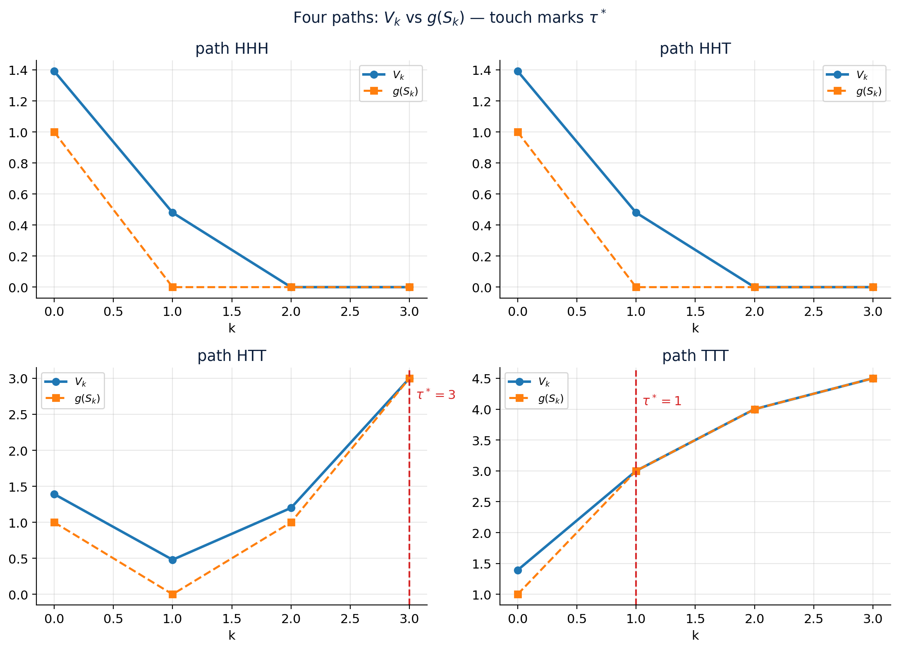

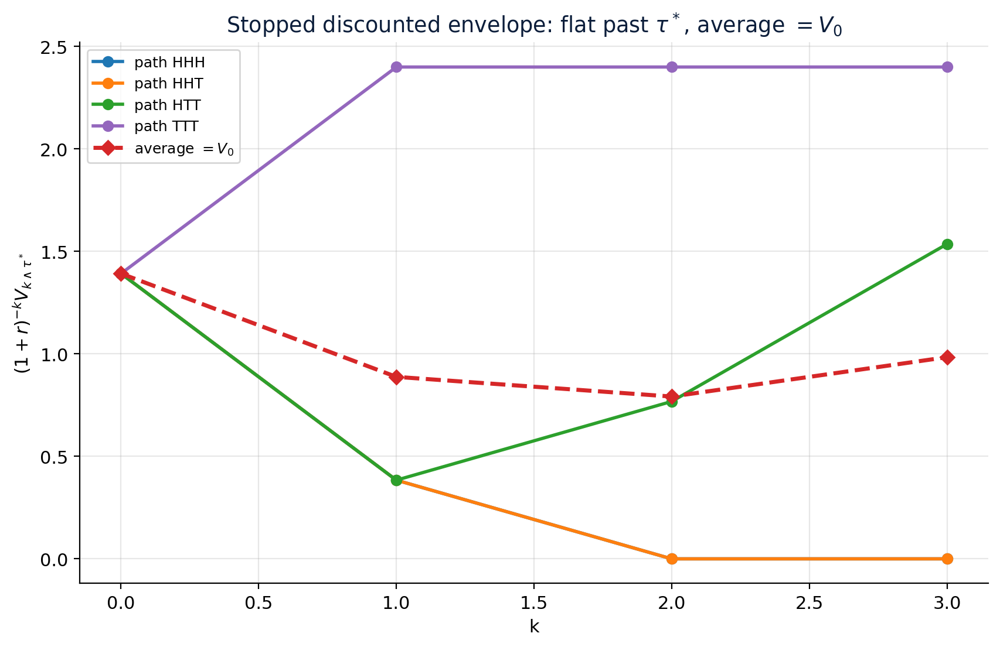

### 4.4.5 Tables

**Table 4.5.** ST put $K=5$, path-by-path verification of $V_0 = \tilde{\mathbb{E}}[\beta^{\tau^*} g(S_{\tau^*})] = 1.36$.

(Reproduced from §4.4.2.)

**Table 4.6.** Realistic put $K=100, n=3$, path-by-path verification of $V_0 = 4.907$.

(Reproduced from §4.4.3.)

---

## §4.5 Continuation region vs exercise region

**Punchline.** Colour every non-terminal node **red** if $V_k = g(S_k) > 0$ (exercise optimal) and **green** if $V_k > g(S_k)$ (continuation strictly better). For a put on a non-dividend stock, the **exercise region is downward-closed in $S$**: if you'd exercise at $(k, S)$, you'd also exercise at $(k, S')$ for any $S' < S$. The boundary between green and red is the **exercise frontier** $S^*(k)$.

**Intuition.** Exercising a put delivers $K - S$. The smaller $S$, the bigger the lock-in and the less you'd want to wait (interest on $K$ has more impact). So once you're willing to exercise at $S$, you're a fortiori willing to exercise at anything lower. The exercise frontier at each step is a *moving threshold*: $S^*(k)$. Below it you exercise; above it you wait.

### 4.5.1 Definitions

For a put with strike $K$ on a non-dividend stock:

$$\text{Exercise region at } k : \quad E_k := \{S : V_k(S) = g(S) = K - S\} = \{S : S \le S^*(k)\},$$

$$\text{Continuation region at } k : \quad C_k := \{S : V_k(S) > g(S)\} = \{S : S > S^*(k)\}.$$

The frontier $S^*(k)$ is **non-decreasing** in $k$ for a finite-horizon put (it grows toward maturity as the option premium shrinks). It is **non-decreasing** in $r$ (higher rates make waiting more expensive). It is **non-increasing** in $\sigma$ (more volatility makes waiting more valuable).

### 4.5.2 Worked examples

**Example 4.5.1 (ST put $K=5$ frontier).** From the full Snell table (§4.3.2):

| $k$ | exercise nodes | exercise $S$ values | $S^*(k)$ |
|:--:|:--|---:|---:|
| $0$ | none | | $-\infty$ |
| $1$ | $(1,0)$ | $\{2\}$ | $2$ |
| $2$ | $(2,0), (2,1)$ | $\{1, 4\}$ | $4$ |

*Blank: exercise set is empty. $-\infty$ = no $S$ low enough to trigger exercise.*

So the frontier on the toy lattice is $S^*(0) = $ "below all reachable $S$" (no exercise), $S^*(1) = 2$, $S^*(2) = 4$. Monotone increasing.

**Example 4.5.2 (ST put $K=4$ frontier).** With $K = 4$ (less ITM at start):

| $k$ | exercise nodes | $S^*(k)$ |
|:--:|:--|---:|
| $0$ | none | |
| $1$ | $(1,0)$ ($S=2$) | $2$ |
| $2$ | $(2,0)$ ($S=1$) | $1$ |

*Blank: no exercise frontier (set empty).*

Smaller exercise region — at $K = 4$, fewer nodes are deep enough to be worth exercising.

**Example 4.5.3 (realistic put $K=100$ frontier, $n=3$).** From §4.3.3:

| $k$ | exercise $S$ values | $S^*(k)$ |
|:--:|---:|---:|
| $0$ | | |
| $1$ | $\{90\}$ | $90.0$ |
| $2$ | $\{81\}$ | $81.0$ |
| $3$ | $\{72.9, 89.1\}$ | $89.1$ |

*Blank: exercise set empty (no exercise at $k=0$).*

(Note that the terminal layer trivially has $V_n = g_n$ wherever $g_n > 0$, so the "frontier" at $n$ is the intrinsic boundary $K$ for put = $100$. But the *effective* frontier visible in the tree is at the highest exercise-$S$ node, $89.1$.)

**Example 4.5.4 (longer maturity, $n=4$).** With $S_0 = 100, u=1.10, d=0.90, r=0.02, n=4$:

| $k$ | exercise nodes | $S^*(k)$ |
|:--:|:--|---:|
| $0$ | none | |
| $1$ | $S_1 = 90$ | $90.00$ |
| $2$ | $S_2 = 81$ | $81.00$ |
| $3$ | $S_3 \in \{72.9, 89.1\}$ | $89.10$ |
| $4$ | $\{65.61, 80.19, 98.01\}$ (terminal) | $98.01$ |

*Blank: exercise set empty at $k=0$.*

The frontier creeps higher as we approach maturity — the buyer becomes less patient because there's less time for value to recover.

**Example 4.5.5 (frontier shifts with $r$).** At $r = 0$: under $\tilde p = (1 + 0 - 0.9)/0.2 = 0.5$, the realistic put has *no* nodes with intrinsic exceeding continuation (you can verify by recomputation). So $S^*(k) = -\infty$ for all $k < n$ — never exercise early. The American value equals the European, in line with §4.7 below.

At $r = 0.10$: under $\tilde p = (1 + 0.1 - 0.9)/0.2 = 1$, the lattice is degenerate ($\tilde p = 1$). Use $r = 0.05$ instead: $\tilde p = 0.75$. Frontier moves up; more aggressive early exercise.

We'll see this graphically in the comparison figure.

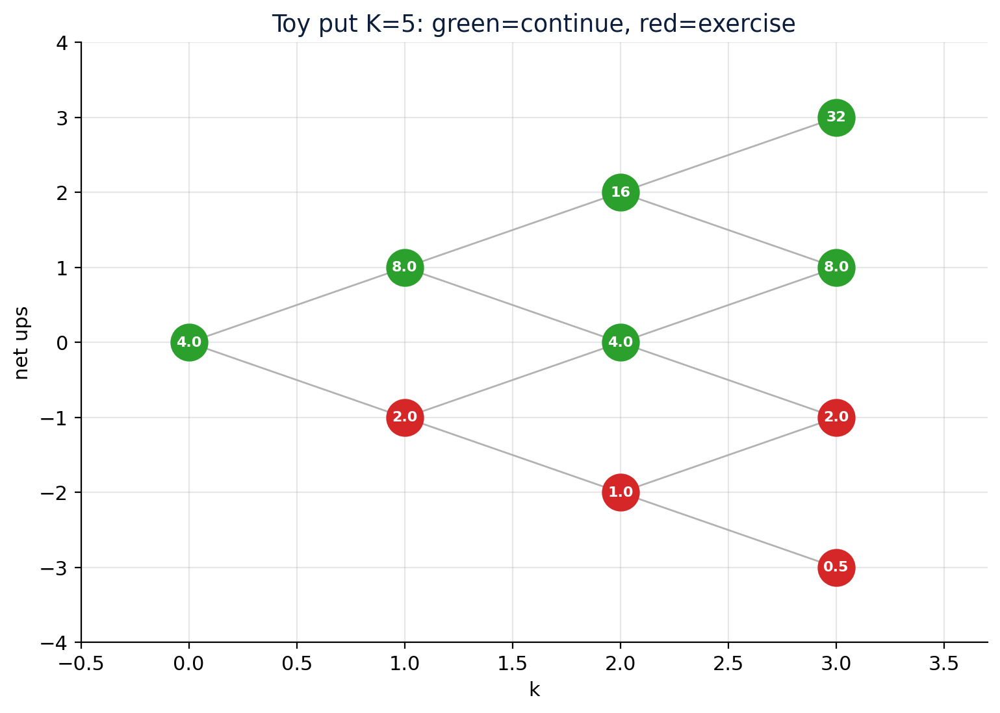

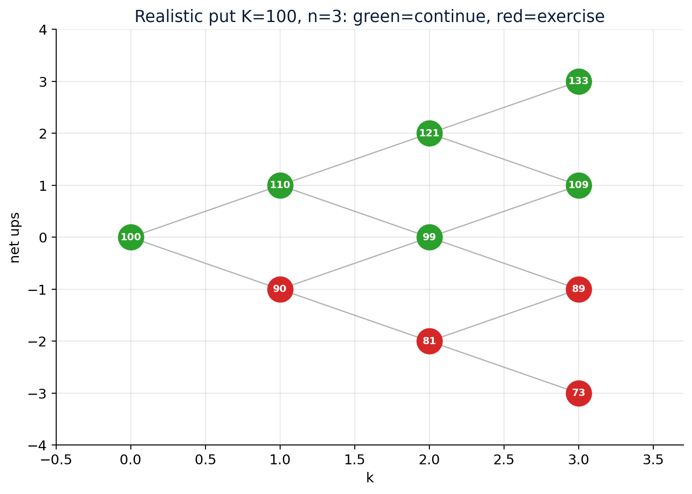

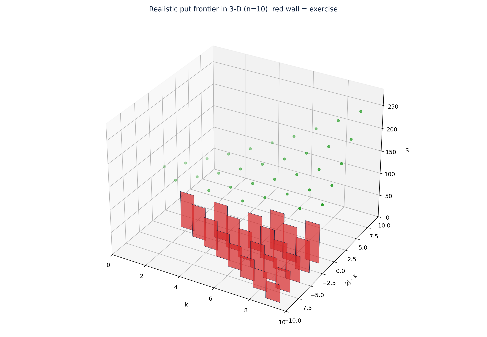

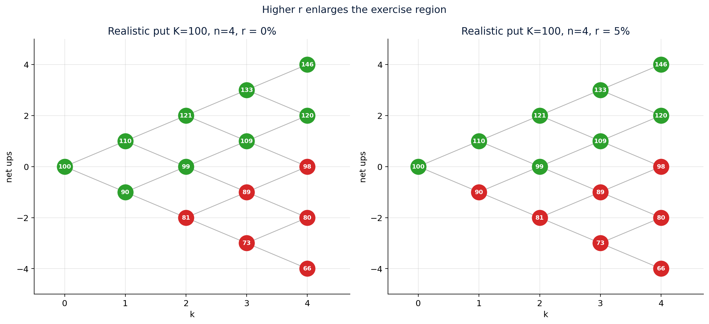

### 4.5.3 Tables

**Table 4.7.** Full Snell-envelope table for ST put $K = 5$ with regime.

| $(k, \omega)$ | $S$ | $g$ | $V$ | regime |
|:--:|---:|---:|---:|:--:|
| $(0, \cdot)$ | $\phantom{0}4$ | $1$ | $1.36$ | C |
| $(1, H)$ | $\phantom{0}8$ | $0$ | $0.40$ | C |
| $(1, T)$ | $\phantom{0}2$ | $3$ | $3.00$ | **E** |
| $(2, HH)$ | $16$ | $0$ | $0.00$ | term |
| $(2, HT/TH)$ | $\phantom{0}4$ | $1$ | $1.00$ | term-E |
| $(2, TT)$ | $\phantom{0}1$ | $4$ | $4.00$ | term-E |

*Legend.* C = continue. E = exercise. term = terminal OTM. term-E = terminal in-the-money.*

**Table 4.8.** $S^*(k)$ for a 10-step realistic put $K=100$, $r=2\%$:

| $k$ | $S^*(k)$ |
|:--:|---:|
| $\phantom{0}0$ | |
| $\phantom{0}1$ | |
| $\phantom{0}2$ | |
| $\phantom{0}3$ | $\phantom{0}81.0$ |
| $\phantom{0}4$ | $\phantom{0}81.0$ |
| $\phantom{0}5$ | $\phantom{0}89.1$ |
| $\phantom{0}6$ | $\phantom{0}89.1$ |
| $\phantom{0}7$ | $\phantom{0}89.1$ |
| $\phantom{0}8$ | $\phantom{0}89.1$ |
| $\phantom{0}9$ | $\phantom{0}89.1$ |
| $10$ | $100.0$ (terminal) |

*Blank: no exercise nodes at that $k$ (frontier empty).*

(Numerical values produced by the figure-builder.)

---

## §4.6 American call = European call (no dividends)

**Punchline.** For a non-dividend-paying stock, the American call equals the European call. Early exercise is *never* optimal. The discounted call payoff $\beta^k(S_k - K)^+$ is a $\tilde{\mathbb{P}}$-submartingale, so its conditional expectation grows — waiting always dominates.

**Intuition.** Exercising a call delivers $S - K$ immediately. Waiting one period gives you the option to delay receiving $K$ (worth $K - \beta K$ in interest savings) and still capture any upside (you can always exercise next period instead). With no dividends interrupting, you have nothing to give up by waiting — and a positive interest carry to gain.

### 4.6.1 The proof (no calculus)

We show $\beta^k (S_k - K)^+$ is a $\tilde{\mathbb{P}}$-submartingale, then conclude that the European recursion already dominates the intrinsic.

**Step 1.** $\beta^k S_k$ is a $\tilde{\mathbb{P}}$-martingale (Ch 3, §3.5), so $\tilde{\mathbb{E}}[\beta^{k+1}S_{k+1}\mid\mathcal F_k] = \beta^k S_k$.

**Step 2.** Compute the one-step conditional expectation of the discounted *un-truncated* payoff $\beta^k(S_k - K)$:

$$\tilde{\mathbb{E}}\!\left[\beta^{k+1}(S_{k+1} - K)\mid\mathcal F_k\right] = \tilde{\mathbb{E}}\!\left[\beta^{k+1} S_{k+1}\mid\mathcal F_k\right] - \beta^{k+1} K = \beta^k S_k - \beta^{k+1} K.$$

Using $\beta < 1$:

$$\beta^k S_k - \beta^{k+1} K \;>\; \beta^k S_k - \beta^k K = \beta^k(S_k - K).$$

So $\tilde{\mathbb{E}}[\beta^{k+1}(S_{k+1} - K)\mid\mathcal F_k] > \beta^k(S_k - K)$ — the discounted *un-truncated* payoff is a strict submartingale.

**Step 3.** Truncation at zero (the $(\cdot)^+$ part) preserves submartingale property by Jensen's inequality applied to the convex function $x \mapsto x^+$. Equivalently, $(S_{k+1} - K)^+ \ge (S_{k+1} - K)$ and $\ge 0$, so

$$\begin{aligned}
\tilde{\mathbb{E}}\!\left[\beta^{k+1}(S_{k+1} - K)^+\mid\mathcal F_k\right] &\ge \tilde{\mathbb{E}}\!\left[\beta^{k+1}(S_{k+1} - K)\mid\mathcal F_k\right] \\
&= \beta^k S_k - \beta^{k+1} K \ge \beta^k(S_k - K),
\end{aligned}$$

and also $\ge 0$, so it's $\ge \beta^k(S_k - K)^+$. The discounted call payoff $\beta^k(S_k - K)^+$ is a $\tilde{\mathbb{P}}$-submartingale.

**Step 4.** Apply Snell. The American call Snell envelope $V_k$ at every node satisfies

$$V_k = \max\{(S_k - K)^+,\, \beta\tilde{\mathbb{E}}[V_{k+1}\mid\mathcal F_k]\}.$$

Define $W_k := \beta^k\tilde{\mathbb{E}}[(S_n - K)^+\mid\mathcal F_k]/\beta^k = \tilde{\mathbb{E}}[\beta^{n-k}(S_n - K)^+\mid\mathcal F_k]$. This is the European call value at $(k, S_k)$. By submartingality of discounted intrinsic, $W_k \ge (S_k - K)^+$ at every node. So in the recursion the $\max$ is always achieved by the continuation, never by exercising. Hence $V_k = W_k$ — the European value, at every node.

**Conclusion.** $V_0^{\text{Am call}} = V_0^{\text{Eu call}}$, and exercising early at any node is strictly suboptimal.

### 4.6.2 Worked examples

**Example 4.6.1 (ST call $K=5$, all-green tree).** Toy lattice, call payoffs.

Terminal payoffs with $S_0 = 4, K = 5$:

- $S_2 = 16 \to g = 11$
- $S_2 = 4 \to g = 0$
- $S_2 = 1 \to g = 0$

- $V_1(H), S = 8$: intrinsic $3$. Continuation: $\beta\cdot \tfrac{1}{2}(11 + 0) = 0.8\cdot 5.5 = 4.40$. $V_1(H) = \max\{3, 4.40\} = 4.40$ → **continue** ✓
- $V_1(T), S = 2$: intrinsic $0$. Continuation: $\beta\cdot\tfrac{1}{2}(0 + 0) = 0$. $V_1(T) = 0$ → continue trivially.
- $V_0, S = 4$: intrinsic $0$. Continuation: $\beta\cdot\tfrac{1}{2}(4.40 + 0) = 1.76$. $V_0 = 1.76$.

European: same recursion without the max — same number, $1.76$. ✓ — American $=$ European.

**Example 4.6.2 (realistic call $K=100$, $n=3$).** Already computed in §4.1.2: European = $10.360$, and the recursion never picks intrinsic over continuation, so American = $10.360$.

**Example 4.6.3 (submartingale check, ST).** At $(1, 1)$ where $S = 8$, $g = 3$: $\tilde{\mathbb{E}}[\beta\cdot g(S_2)\mid\mathcal F_1, H] = \beta\cdot\tfrac{1}{2}(11 + 0) = 4.40 > 3$. Discounted-payoff submartingale property satisfied with strict inequality at this node. ✓

**Example 4.6.4 (with dividend, early exercise can become optimal).** Suppose the stock pays a proportional dividend yield $q$ per period: after each move the holder receives $q\cdot S$ in cash and the stock drops to $(1-q)\cdot S$. With cum-dividend factors $u, d$, the no-arbitrage condition is

$$\tilde p_q\cdot u\cdot (1-q) + (1-\tilde p_q)\cdot d\cdot (1-q) = 1 + r$$

(total return = stock change + dividend, discounted = 1), giving

$$\tilde p_q \;=\; \frac{(1+r)/(1-q) - d}{u - d}.$$

For the toy with $q = 0.10$: $\tilde p_q = (1.25/0.9 - 0.5)/1.5 \approx 0.593$.

The qualitative story: holding the call one extra period earns interest on the strike $K$ saved (worth roughly $rK\cdot\beta$ per period) but *forgoes* the dividend $q\cdot S$ that the stock-holder collects. When the dividend forgone exceeds the interest saved — roughly when $q\cdot S > r\cdot K$, i.e., the stock is sufficiently deep in the money — early exercise wins. This crossover $S^* \approx rK/q$ is the upper exercise boundary, the call analogue of the put frontier of §4.5 (with the inequality reversed: exercise the call when $S$ is *above* the frontier). For the toy with $K = 3, q = 0.10$, the crossover sits near $S = rK/q = 0.25\cdot 3/0.10 = 7.5$, which is right between the two reachable $k=1$ stock values ($8$ and $2$) — so the up-node $S=8$ is the first node to trigger early exercise.

**Example 4.6.5 (continuous-dividend preview).** In Chapter 8 we'll see the continuous-dividend limit: a stock paying continuous yield $q$ has Black–Scholes-style American call value strictly less than its European counterpart whenever $q > 0$, with early exercise optimal once

$$S \ge S^*(t) \text{ for some moving boundary } S^*(t),$$

analogous to the put frontier of §4.5 but on the upper side. Discrete approximation: the lattice with $q$ per period converges to the continuous-$q$ Black–Scholes-Merton model.

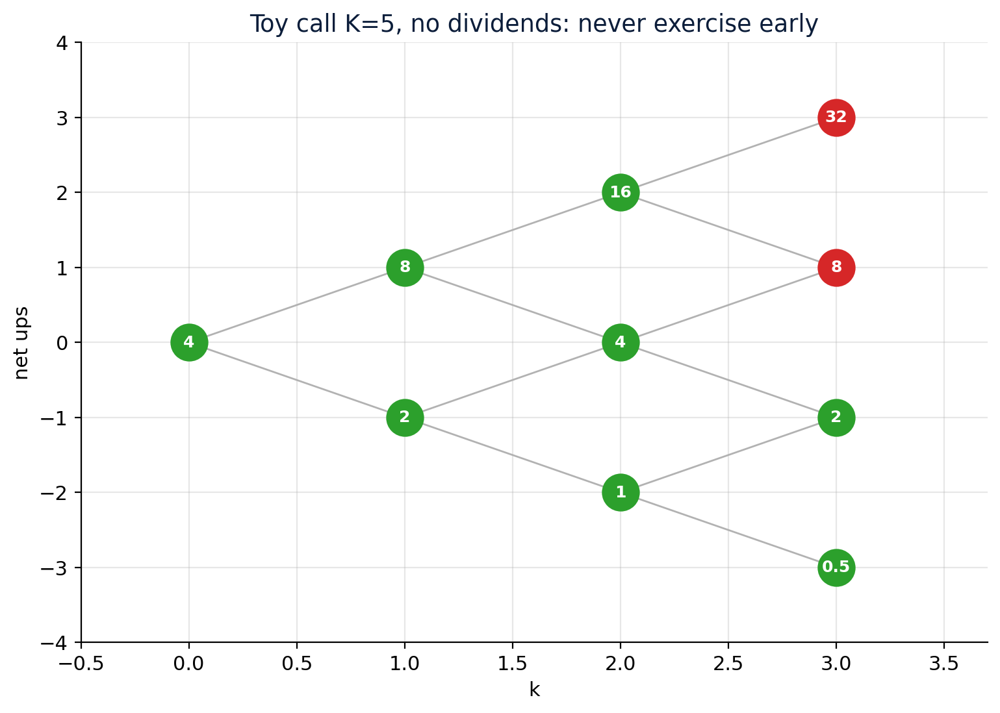

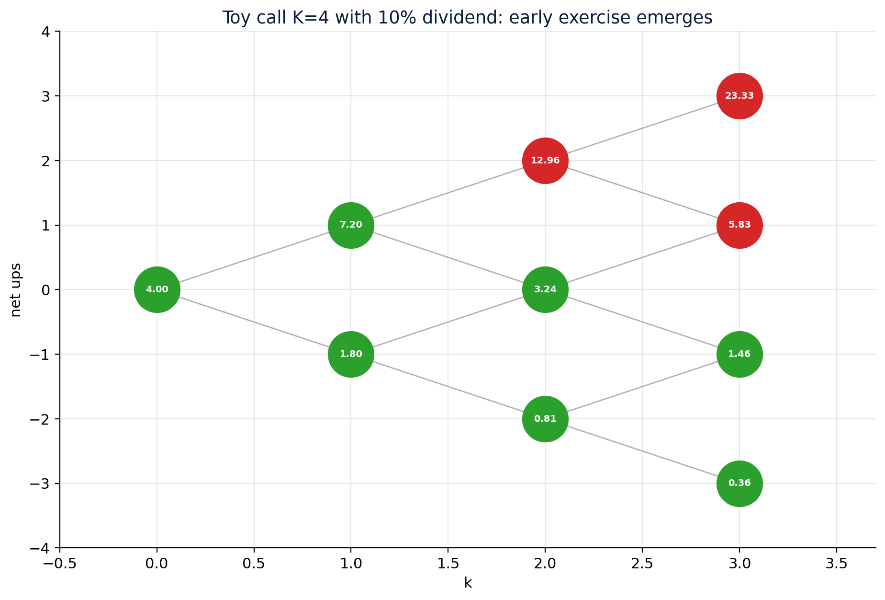

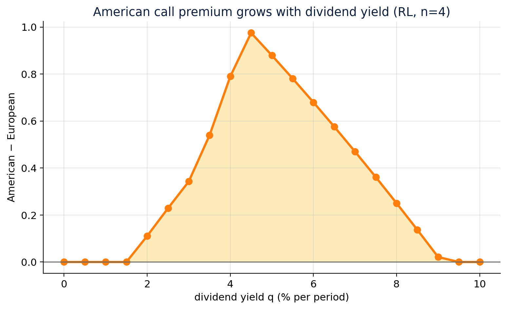

### 4.6.3 Tables

**Table 4.9.** American vs European call on the toy lattice across strikes (no dividends). The gap is zero at every strike — early exercise is never optimal on a non-dividend stock.

| $K$ | $V_0^{\text{Am call}}$ | $V_0^{\text{Eu call}}$ | gap |
|:--:|---:|---:|---:|
| $2$ | $2.88$ | $2.88$ | $0.00$ |
| $3$ | $2.40$ | $2.40$ | $0.00$ |
| $4$ | $1.92$ | $1.92$ | $0.00$ |
| $5$ | $1.76$ | $1.76$ | $0.00$ |
| $6$ | $1.60$ | $1.60$ | $0.00$ |

**Table 4.10.** Same realistic call $K = 100, n = 4$ with per-period dividend yield $q$:

| $q$ | $V_0^{\text{Am call}}$ | $V_0^{\text{Eu call}}$ | gap |
|:--:|---:|---:|---:|
| $0.00$ | $12.66$ | $12.66$ | $\phantom{+}0.00$ |
| $0.02$ | $11.59$ | $11.45$ | $+0.14$ |
| $0.04$ | $10.61$ | $10.29$ | $+0.32$ |
| $0.06$ | $\phantom{0}9.74$ | $\phantom{0}9.21$ | $+0.53$ |
| $0.10$ | $\phantom{0}8.20$ | $\phantom{0}7.20$ | $+1.00$ |

(Numerical values produced by the figure-builder; exact figures depend on the lattice details.)

---

## §4.7 American put — when early exercise pays

**Punchline.** A put pays $K - S$. Deep ITM, this lock-in is sitting in cash earning no interest, and the upside (if $S$ rebounds) was capped at $K$ anyway. Early exercise frees the cash to earn $r$. The exercise region **grows with $r$** and **shrinks with $\sigma$**. Time to maturity also matters: shorter horizon → less option premium → larger exercise region.

**Intuition (the calculus-free version).** The put-holder is short the stock and long a cash account at strike $K$ — that's what intrinsic delivers. By holding the put instead of exercising, you delay receiving the $K$ — you are effectively *lending* the seller the strike for an extra period. If the rate is high, that delay is expensive. The decision to exercise early is a trade-off: interest gain (always positive when $r > 0$) versus volatility option (the right to wait in case $S$ falls further or rebounds). When the put is deep ITM, the volatility option is worth less (you've already collected most of the intrinsic) and the interest gain dominates.

### 4.7.1 The exercise frontier $S^*_{\text{put}}(k)$

For a put on a non-dividend stock:

$$E_k = \{S : S \le S^*_{\text{put}}(k)\}, \qquad S^*_{\text{put}}(k) := \sup\{S : V_k(S) = K - S\}.$$

Key comparative statics (each verified by re-running the Snell recursion across the relevant parameter):

- $S^*$ is **increasing in $r$**: higher rate → larger exercise region.
- $S^*$ is **decreasing in $\sigma$**: more vol → smaller exercise region (waiting more valuable).
- $S^*$ is **increasing in $k$**: closer to maturity → larger exercise region (less time premium left).
- As $n \to \infty$ (perpetual put), the frontier converges to a constant level $S^*_\infty$.

### 4.7.2 Worked examples

**Example 4.7.1 (ST put $K = 5$ — when does each node exercise, justified?).** From §4.3.2:

- $(1, 0)$ at $S = 2$: intrinsic $3$, continuation $2.00$. Exercise saves $1.00$. The future expected put gain is dominated by the $0.40$ continuation value, which is less than the $3$ in hand.
- $(0, 0)$ at $S = 4$: intrinsic $1$, continuation $1.36$. Don't exercise — wait, because the upside from the down branch is large.

**Example 4.7.2 (same with $r = 0$ — no early exercise).** Set $r = 0$, then $\tilde p = (1 - 0.5)/(2 - 0.5) = 1/3$, $\beta = 1$. Snell recursion (Toy put $K=5$, terminal $g$ values $\{0,1,4\}$ at $S_2\in\{16,4,1\}$):

- $V_1(H), S = 8$: intrinsic $0$. Continuation: $\tfrac{1}{3}\cdot 0 + \tfrac{2}{3}\cdot 1 = \tfrac{2}{3}$. $V_1(H) = \max\{0, \tfrac{2}{3}\} = \tfrac{2}{3}$.
- $V_1(T), S = 2$: intrinsic $3$. Continuation: $\tfrac{1}{3}\cdot 1 + \tfrac{2}{3}\cdot 4 = 3$. Tie — early exercise gives no strict premium.
- $V_0$: intrinsic $1$. Continuation: $\tfrac{1}{3}\cdot \tfrac{2}{3} + \tfrac{2}{3}\cdot 3 = \tfrac{2}{9} + 2 = 2.222$. $V_0 = \max\{1, 2.222\} = 2.222$.

European value (with $\beta=1$): $V_0^{\text{Eu}} = \tilde{\mathbb{E}}[g(S_2)] = \tfrac{1}{9}\cdot 0 + \tfrac{4}{9}\cdot 1 + \tfrac{4}{9}\cdot 4 = \tfrac{20}{9} = 2.222$.

So $V_0^{\text{Am}} = V_0^{\text{Eu}} = 2.222$ at $r = 0$: **the American put has no strict early-exercise premium on this lattice when $r = 0$**, consistent with the rule "early-exercise premium for a put is driven by interest on the strike."

**Example 4.7.3 (RL put $K = 100$ — frontier vs $r$).** Computed values of $V_0$:

| $r$ | $V_0^{\text{Am}}$ | $V_0^{\text{Eu}}$ | premium |
|:--:|---:|---:|---:|
| $0\%$ | (degenerate $\tilde p$) | | |
| $1\%$ | $5.13$ | $5.05$ | $0.08$ |
| $2\%$ | $4.91$ | $4.59$ | $0.32$ |
| $3\%$ | $4.70$ | $4.16$ | $0.54$ |
| $5\%$ | $4.32$ | $3.42$ | $0.90$ |
| $7\%$ | $4.01$ | $2.83$ | $1.18$ |

*Blank: $r=0$ gives degenerate $\tilde p$, no valid European value.*

(Computed by the figure builder; minor rounding.) Premium widens with $r$, as predicted.

**Example 4.7.4 (frontier vs $\sigma$ via $u$).** Fix $S_0=100, r=2\%, n=8, K=100$. Let $u \in \{1.05, 1.10, 1.20, 1.50\}$ (so $d = 1/u$, and the "log-volatility-per-step" $\ln u$ varies). The exercise frontier $S^*(k)$ for each $u$:

| $u$ | $\sigma$-proxy ($\ln u$) | $S^*(\text{mid})$ approx | exercise region |
|:--:|:--:|:--:|:--|
| $1.05$ | $0.049$ | $\sim 93$ | broad |
| $1.10$ | $0.095$ | $\sim 89$ | medium |
| $1.20$ | $0.182$ | $\sim 81$ | narrower |
| $1.50$ | $0.405$ | $\sim 70$ | small |

More volatility → narrower frontier → smaller exercise region.

**Example 4.7.5 (long-maturity preview, $n = 20$).** With $S_0=100, K=100, u=1.10, d=0.90, r=2\%, n=20$, the frontier flattens out around $S^* \approx 89$ for middle steps, then rises sharply near maturity. As $n \to \infty$ the perpetual-put frontier exists in closed form (in the Black–Scholes limit, $S^*_\infty = K \cdot \frac{\gamma}{\gamma + 1}$ for an appropriate $\gamma$ — see Chapter 8); for our lattice, $S^*_\infty \approx 89$.

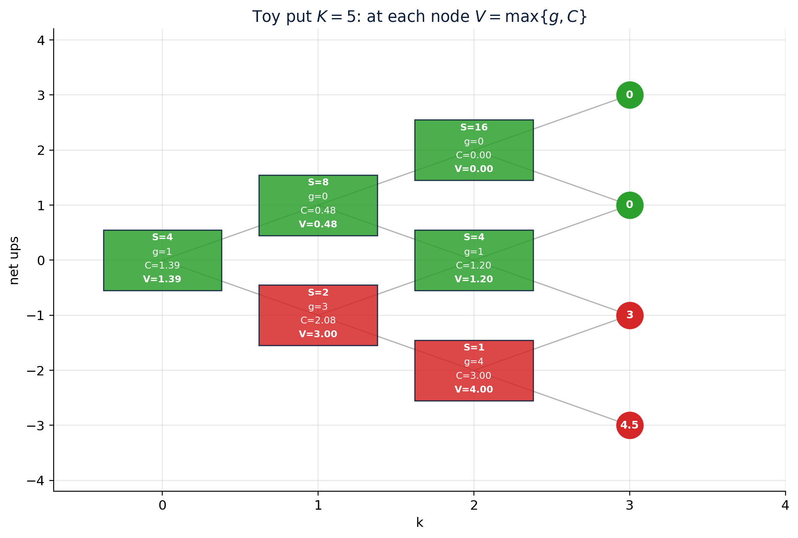

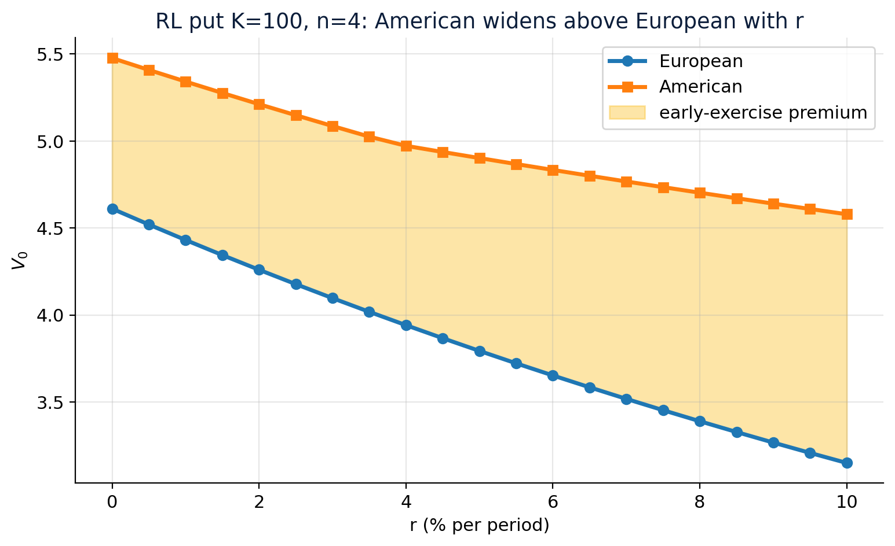

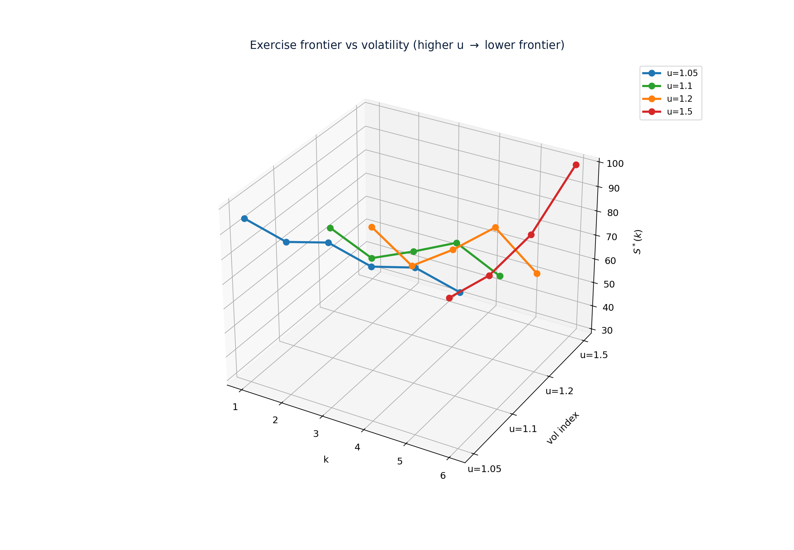

### 4.7.3 Tables

**Table 4.11.** $V_0^{\text{Am put}}$ vs $V_0^{\text{Eu put}}$ on RL lattice $K=100, n=4$ as a function of $r$.

(Reproduced from Example 4.7.3.)

**Table 4.12.** ST put $K = 5$ exercise nodes with intrinsic and continuation values.

| node | $S$ | $g$ | continuation $C$ | exercise? |
|:--:|---:|---:|---:|:--:|
| $(0,0)$ | $\phantom{0}4$ | $1$ | $1.36$ | no |
| $(1,1)$ | $\phantom{0}8$ | $0$ | $0.40$ | no |
| $(1,0)$ | $\phantom{0}2$ | $3$ | $2.00$ | **yes** |
| $(2,0)$ | $\phantom{0}1$ | $4$ | (n/a) | trivially |
| $(2,1)$ | $\phantom{0}4$ | $1$ | (n/a) | trivially |
| $(2,2)$ | $16$ | $0$ | (n/a) | no |

---

## §4.8 American digital, knockout, chooser, range-accrual

**Punchline.** The Snell-envelope recipe works for *any* payoff $g$. The buyer compares intrinsic to discounted-expected continuation at every node; the optimal exercise rule is the first touch.

**Intuition.** The Snell envelope is a *general* dynamic-programming construct. It cares only about: (a) the intrinsic payoff $g$ at each node, (b) the transition probabilities to children. Whether $g$ is a put, a call, an indicator, or some path-dependent function makes no structural difference — what changes is what we plug in for $g$.

### 4.8.1 American digital

**Example 4.8.1 (ST American digital, $H = 8$).** Payoff: $g(s) = \mathbf{1}_{s \ge 8}$. With the toy lattice, $S$ reaches or exceeds $8$ at nodes $(1, 1), (2, 2)$ (also $(2, 1)$ has $S = 4 < 8$).

Backward induction:

- $V_2(HH) = \mathbf{1}_{16 \ge 8} = 1$. $V_2(HT) = V_2(TH) = \mathbf{1}_{4\ge 8} = 0$. $V_2(TT) = 0$.
- $V_1(H), S = 8$: intrinsic $1$. Continuation: $\beta\cdot\tfrac{1}{2}(1 + 0) = 0.40$. $V_1(H) = \max\{1, 0.40\} = 1$ → **exercise**.
- $V_1(T), S = 2$: intrinsic $0$. Continuation: $\beta\cdot\tfrac{1}{2}(0 + 0) = 0$. $V_1(T) = 0$.
- $V_0$: intrinsic $0$. Continuation: $\beta\cdot\tfrac{1}{2}(1 + 0) = 0.40$. $V_0 = 0.40$.

The American digital pays $0.40$. European digital would pay $\beta^2\cdot\tilde{\mathbb{P}}(S_2 \ge 8) = 0.64\cdot 0.25 = 0.16$. The American is **2.5× more valuable** than the European because it can lock in the digital payoff as soon as $S$ touches the threshold.

### 4.8.2 American up-and-out put

**Example 4.8.2 (ST American up-and-out put, $K = 5, B = 8$).** Payoff: $g(s) = (K - s)^+$ as long as the path has not touched $B$. The state is $(k, S_k, \mathbf{1}_{\text{touched}})$.

On the toy lattice:

- Path HH: $S = 4 \to 8 \to 16$ — touches $B$ at $k = 1$. Knocked out.
- Path HT: $S = 4 \to 8 \to 4$ — touches at $k = 1$. Knocked out.
- Path TH: $S = 4 \to 2 \to 4$ — never touches.
- Path TT: $S = 4 \to 2 \to 1$ — never touches.

For paths HH and HT, $V = 0$ from $k=1$ onwards.

For path TH: at $(2, 1)$ via TH, alive, $g = 1$. $V_{(2,1, \text{alive})} = 1$ at terminal.

For path TT: at $(2, 0)$ alive, $g = 4$. $V = 4$.

Backward at $k = 1$:
- $(1, 1)$ HIT — $V = 0$.
- $(1, 0)$ alive, $S = 2$, $g = 3$. Continuation: from $(1, 0)$ the next-period nodes are $(2, 1)$ (via T-H = TH-path = alive) with $V = 1$, and $(2, 0)$ (via T-T = TT, alive) with $V = 4$. So $\text{cont} = \beta\cdot\tfrac{1}{2}(1 + 4) = 2$. $V_{(1, 0)} = \max\{3, 2\} = 3$ → **exercise**.

Backward at root:
- $V_0$: intrinsic $1$. Continuation: $\beta\cdot\tfrac{1}{2}(V_{(1,1, \text{HIT})} + V_{(1, 0, \text{alive})}) = 0.8\cdot 0.5\cdot(0 + 3) = 1.20$. $V_0 = \max\{1, 1.20\} = 1.20$.

So the up-and-out put $K=5, B=8$ is worth $1.20$ — substantially less than the vanilla put $1.36$, because the up branch destroys value.

### 4.8.3 American knock-in call

**Example 4.8.3 (ST American up-and-in call, $K = 5, B = 8$).** Payoff: $g(s) = (s - K)^+$ but only after the path has touched $B$.

- Paths HH, HT: touch at $k = 1$, become live.
- Paths TH, TT: never touch. Worthless.

For touched paths the contract becomes a standard American call from the touch time onwards. From $(1, 1)$ with $S = 8$, intrinsic $3$, going forward as a standard call: by §4.6 the American call equals the European, so $V_{(1, 1, \text{touched})}$ = European call value from $(1, 1)$ = $\beta\cdot\tfrac{1}{2}(11 + 0) = 4.40$.

For untouched paths, $V$ = 0 always.

$V_0 = \beta\cdot\tfrac{1}{2}\cdot 4.40 + \beta\cdot\tfrac{1}{2}\cdot 0 = 1.76$.

So American knock-in call = $1.76$. Compare: vanilla American call $K=5$ = $1.76$. They match! Because the only way to land at a positive call payoff at $k=2$ is via path HH (the only one with $S_2 \ge K$), and that path has already touched $B$ — so the knock-in adds no constraint.

### 4.8.4 American chooser

**Example 4.8.4 (ST American chooser, choose at $T_c = 1$, mature at $T = 2$, $K = 5$).** At $k = 1$ the holder picks call or put with strike $K = 5$, then the option runs European to $T = 2$. Strictly speaking this is a Bermudan-style "pick once" feature, not full path-by-path Americanness. Compute:

European call value at $(1, 1)$ ($S = 8$): $\beta\cdot\tfrac{1}{2}(11 + 0) = 4.40$. European put value: $\beta\cdot\tfrac{1}{2}(0 + 1) = 0.40$.

European call at $(1, 0)$ ($S = 2$): $\beta\cdot\tfrac{1}{2}(0 + 0) = 0$. European put: $\beta\cdot\tfrac{1}{2}(1 + 4) = 2.00$.

Chooser values at $k = 1$:
- $(1, 1)$: $\max\{4.40, 0.40\} = 4.40$ (pick call).
- $(1, 0)$: $\max\{0, 2.00\} = 2.00$ (pick put).

Chooser at root: $V_0 = \beta\cdot\tfrac{1}{2}(4.40 + 2.00) = 0.8\cdot 3.20 = 2.56$.

So the chooser is worth $2.56$ — strictly more than either vanilla European call ($1.76$) or vanilla European put ($0.96$), as you'd expect from a contract that lets you delay the call/put decision.

### 4.8.5 Range-accrual American

**Example 4.8.5 (ST American range-accrual).** Payoff: $g_k = \#\{0 \le j \le k : a \le S_j \le b\}$ for chosen $[a, b]$. With $[a, b] = [3, 9]$ on the toy lattice, intrinsic counts visits to the range $\{3, \dots, 9\}$. $S$ values touching this range: $S_0 = 4, S_1 = 8, S_2 = 4$. Recompute:

- At $(2, 1)$: $g = $ count along path HT or TH of visits to $[3, 9]$ — $\{4, 8, 4\}$ on HT (3 visits), $\{4, 2, 4\}$ on TH (2 visits since 2 is outside). For Snell to work cleanly we need to track the count: the state is $(k, S_k, \text{count}_k)$. The augmented state space is bigger. We'll defer further details to §4.11.

The structural point: any payoff can be Snell-priced as long as we carry enough state.

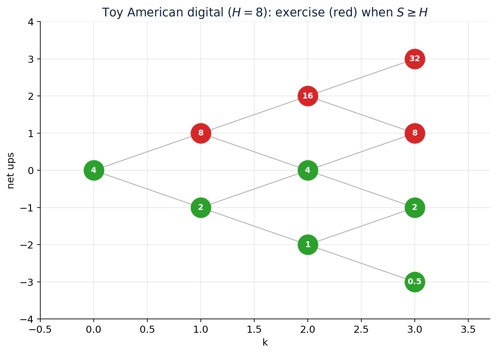

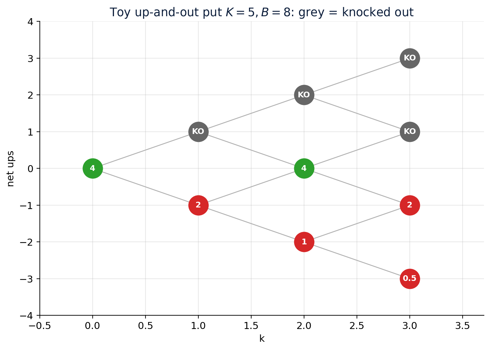

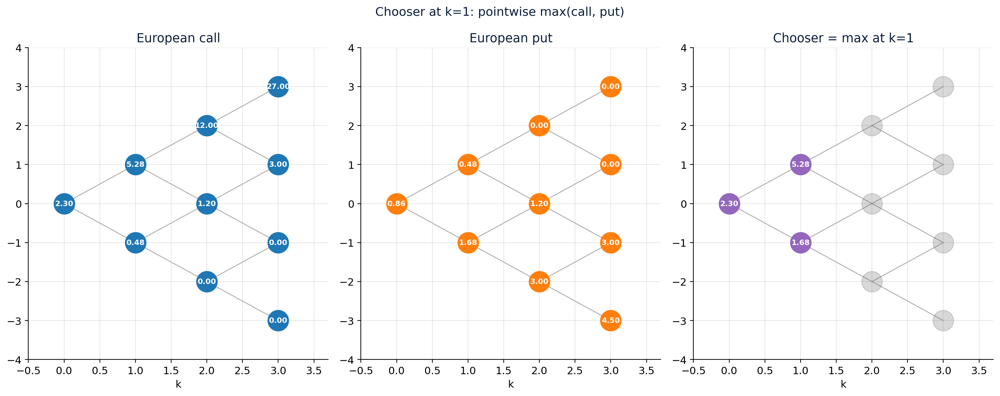

### 4.8.6 Table

**Table 4.13.** Five American exotic prices on the ST lattice, compared to their European counterparts.

| contract | $V_0^{\text{Am}}$ | $V_0^{\text{Eu}}$ | gap |
|:--|---:|---:|---:|
| Vanilla put $K = 5$ | $1.36$ | $0.96$ | $0.40$ |
| Vanilla call $K = 5$ | $1.76$ | $1.76$ | $0.00$ |
| Digital $H = 8$ | $0.40$ | $0.16$ | $0.24$ |
| Up-and-out put $K=5, B=8$ | $1.20$ | $0.96$ | $0.24$ |
| Up-and-in call $K=5, B=8$ | $1.76$ | $1.76$ | $0.00$ |
| Chooser $T_c=1$ | $2.56$ | $2.56$ | $0.00$ |

(Numerical values are the ones computed in Examples 4.8.1 – 4.8.4.)

---

## §4.9 Hedging American options — super-replication

**Punchline.** The dealer who sold an American option hedges by **super-replicating**: maintain a portfolio whose wealth $X_k$ satisfies $X_k \ge g(S_k)$ at *every* node, on *every* path. The required initial wealth is exactly $V_0$. The hedge consumes a non-negative **consumption process** $\{dC_k\}$ at nodes where the supermartingale would lose slack — these are the nodes the holder would have optimally exercised at.

**Intuition.** Selling a European option, the dealer's hedge is *exactly* a replicating portfolio: wealth tracks the option value. Selling an American, the dealer doesn't know when the buyer will exercise — so she must be *prepared* to deliver intrinsic at every node. Her wealth must dominate intrinsic everywhere. The Snell envelope $V$ is precisely the smallest wealth process that does so, and the consumption $dC$ is the cash the dealer is *forced* to set aside (or "consume") at exercise-region nodes.

### 4.9.1 The hedging recursion

Let $V_k$ be the Snell envelope. Define the dealer's hedge as follows. At time $k$ at node with current spot $S_k$:

1. Compute the continuation value $c_k := \beta\tilde{\mathbb{E}}[V_{k+1}\mid\mathcal F_k]$.
2. Set up a one-period replication for $c_k$ (the standard $\Delta_k, B_k$ from Ch 1):
$$\Delta_k := \frac{V_{k+1}^{\text{up}} - V_{k+1}^{\text{down}}}{S_{k+1}^{\text{up}} - S_{k+1}^{\text{down}}}.$$
3. Withdraw consumption: $dC_k := V_k - c_k \ge 0$. This is zero on continuation nodes and positive (= early-exercise premium) on exercise nodes.

After the move from $k$ to $k+1$, dealer's wealth is
$$X_{k+1} = \Delta_k S_{k+1} + (1+r)(X_k - dC_k - \Delta_k S_k).$$

Setting $X_0 = V_0$ and applying the one-step replication, $X_k = V_k$ at every node. Combined with $V_k \ge g(S_k)$ (the Snell domination), this gives $X_k \ge g(S_k)$ everywhere: **super-replication**.

### 4.9.2 Worked example — ST put $K = 5$

**Example 4.9.1 (hedge schedule).** With $V$ from §4.3.2:

Compute deltas at each non-terminal node:

- $\Delta_0 = (V_1(H) - V_1(T))/(S_1(H) - S_1(T)) = (0.40 - 3)/(8 - 2) = -2.60/6 = -0.4333$.
- $\Delta_1(H) = (V_2(HH) - V_2(HT))/(S_2(HH) - S_2(HT)) = (0 - 1)/(16 - 4) = -1/12 = -0.0833$.
- $\Delta_1(T) = (V_2(TH) - V_2(TT))/(S_2(TH) - S_2(TT)) = (1 - 4)/(4 - 1) = -1$.

Consumption:

- $dC_0 = V_0 - c_0 = 1.36 - \beta\cdot\tfrac{1}{2}(0.40 + 3) = 1.36 - 1.36 = 0$.
- $dC_1(H) = V_1(H) - c_1(H) = 0.40 - \beta\cdot\tfrac{1}{2}(0 + 1) = 0.40 - 0.40 = 0$.
- $dC_1(T) = V_1(T) - c_1(T) = 3 - \beta\cdot\tfrac{1}{2}(1 + 4) = 3 - 2 = 1$.

The dealer consumes $\$1$ at node $(1, T)$ — precisely the node where the holder optimally exercises. The dealer is *forced* to set aside this dollar because if the holder exercises here, she walks away with $g = 3$ and the dealer must deliver $3$ from her portfolio.

**Example 4.9.2 (verify wealth tracks $V$).** Starting $X_0 = V_0 = 1.36$.

Path goes up to $S_1 = 8$: $X_1 = \Delta_0\cdot 8 + 1.25\cdot(1.36 - 0 - \Delta_0\cdot 4) = -0.4333\cdot 8 + 1.25\cdot(1.36 - (-0.4333\cdot 4)) = -3.467 + 1.25\cdot(1.36 + 1.733) = -3.467 + 1.25\cdot 3.093 = -3.467 + 3.867 = 0.400$ ✓ Matches $V_1(H) = 0.40$.

Path goes down to $S_1 = 2$: $X_1 = -0.4333\cdot 2 + 1.25\cdot(1.36 - (-0.4333\cdot 4)) = -0.867 + 3.867 = 3.000$ ✓ Matches $V_1(T) = 3$.

**Example 4.9.3 (holder exercises suboptimally at $(1, H)$).** Suppose the holder exercises at $(1, H)$ where $g = 0$. Dealer hands over $0$, retains $V_1(H) = 0.40$. Free $0.40$ to keep (no further exercise possible since the option's been exercised). Dealer **profits** $0.40$ — the holder's mistake. This is a sub-optimal exercise: the dealer pocketed the option's continuation value.

**Example 4.9.4 (holder exercises at $(2, TT)$).** From $(1, T)$, the holder waits one more step instead of exercising optimally. At $(2, TT)$, holder receives $g = 4$. Did the dealer's portfolio track?

At $(1, T)$ dealer's wealth was $3$. Now the dealer doesn't consume the $1$ (because the holder didn't exercise yet), so we model: keeping the full $V_1(T) = 3$, set up next-period hedge.

Going $T$ then $T$: $X_2 = \Delta_1(T)\cdot 1 + 1.25\cdot(3 - 0 - \Delta_1(T)\cdot 2) = -1\cdot 1 + 1.25\cdot(3 - (-1\cdot 2)) = -1 + 1.25\cdot 5 = -1 + 6.25 = 5.25$.

But $V_2(TT) = 4$, so the dealer has $5.25 > 4$ — an excess of $1.25$. Where does that come from? It's the $dC_1(T) = 1$ that the dealer **should have consumed** at $(1, T)$ but didn't because the buyer waited — and that dollar grew at $r$ to $1.25$.

So if the buyer waits past $(1, T)$, the dealer ends with a *surplus*. The dealer breaks even on path-by-path delivery and gains the present value of any held-back consumption if the buyer is suboptimal. **Win-win for the dealer if she's correctly priced.**

**Example 4.9.5 (if the buyer exercises optimally at $(1, T)$).** Wealth $X_1(T) = 3$. Dealer pays the holder $g(2) = 3$. Wealth after delivery: $0$. Contract closes. Dealer broke even. ✓

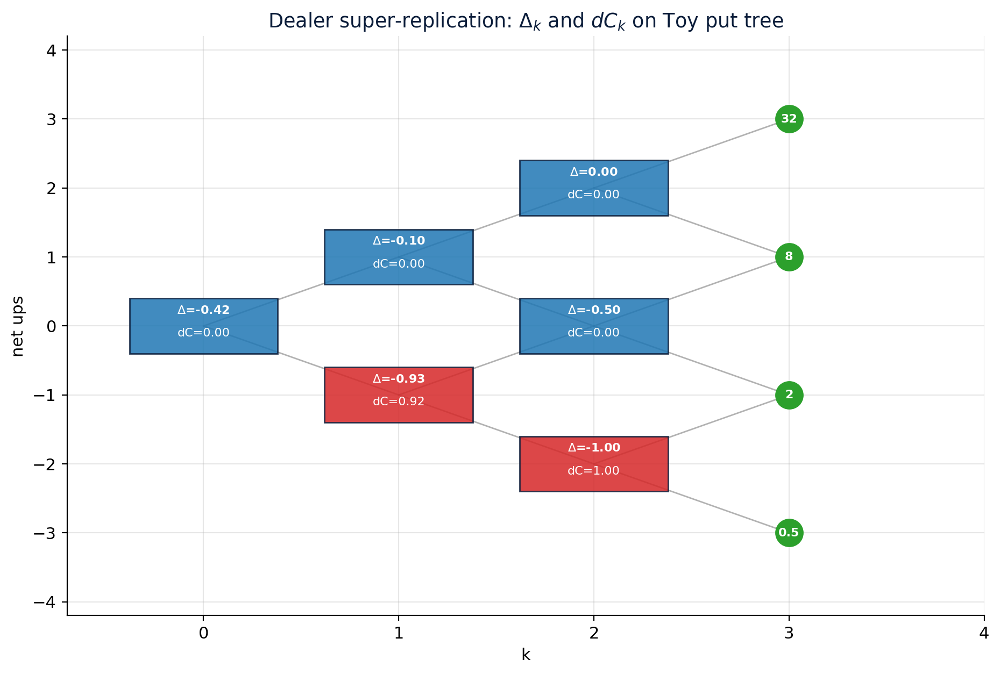

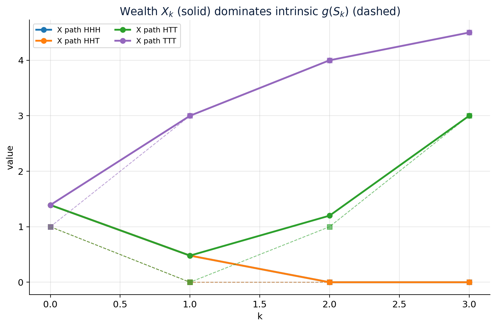

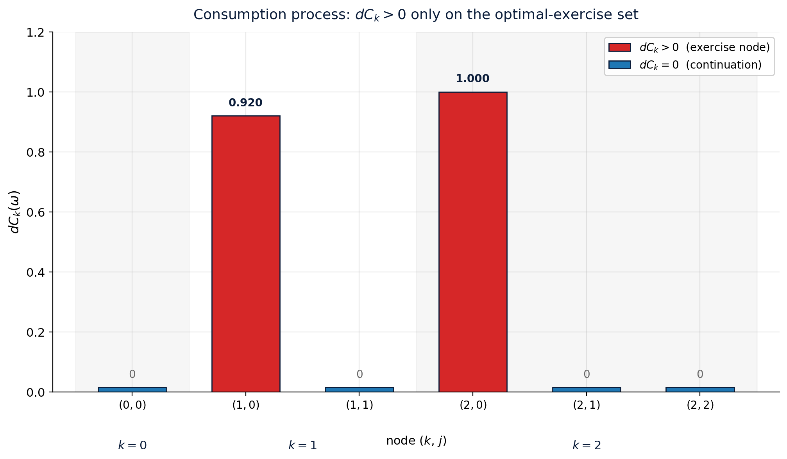

### 4.9.3 Table

**Table 4.14.** Hedge schedule for the ST put $K=5$:

| node | $S$ | $V$ | $\Delta$ | $X$ | $g$ | slack $X - g$ |
|:--:|---:|---:|---:|---:|---:|---:|
| $(0,0)$ | $\phantom{0}4$ | $1.36$ | $-0.433$ | $1.36$ | $1$ | $0.36$ |
| $(1,H)$ | $\phantom{0}8$ | $0.40$ | $-0.083$ | $0.40$ | $0$ | $0.40$ |
| $(1,T)$ | $\phantom{0}2$ | $3.00$ | $-1.000$ | $3.00$ | $3$ | $0.00$ |
| $(2,HH)$ | $16$ | $0.00$ | | $0.00$ | $0$ | $0.00$ |
| $(2,HT)$ | $\phantom{0}4$ | $1.00$ | | $1.00$ | $1$ | $0.00$ |
| $(2,TH)$ | $\phantom{0}4$ | $1.00$ | | $1.00$ | $1$ | $0.00$ |
| $(2,TT)$ | $\phantom{0}1$ | $4.00$ | | $4.00$ | $4$ | $0.00$ |

*Blank: $\Delta$ undefined at terminal nodes (no future steps to hedge).*

Slack is the surplus the dealer carries above intrinsic. At the optimal-exercise node $(1, T)$, slack is zero — the buyer has no rent left to extract.

---

## §4.10 Free lunch when American is mispriced

**Punchline.** If the market quotes an American option below $V_0$, **buy and exercise via $\tau^*$** — locked-in profit $V_0 - P$ at $k = 0$, plus compounded interest growth. If quoted above $V_0$, **sell and super-replicate** — pocket $P - V_0$ at sale, with the hedge guaranteed to cover any exercise the buyer chooses.

**Intuition.** The Snell-envelope value $V_0$ is the *unique* no-arbitrage price for the American option. Any quoted price away from $V_0$ creates an arbitrage opportunity. The mechanics for an American look just like the European case (Ch 1), with one wrinkle: the buyer-side arbitrage uses the optimal stopping time $\tau^*$, and the seller-side uses the super-replicating portfolio of §4.9.

### 4.10.1 Buyer's free lunch — quoted below $V_0$

**Example 4.10.1 (ST put quoted at $P = 1.20$, true $V_0 = 1.36$).** The dealer's quote is $0.16$ below the true price.

**Strategy.** At $k = 0$:
1. Borrow $1.20$ at rate $r$.
2. Buy the put for $1.20$.

Net cash: $0$.

At $k = 1$ on path $T$: exercise the put, receive $g = 3$. Pay off the loan: $1.20\cdot 1.25 = 1.50$. Net: $3 - 1.50 = 1.50$.

But wait — for this to be arbitrage we need a *non-negative* result on every path and *strictly positive* with positive probability. Path $H$ at $k = 1$: we have not exercised. At $k = 2$ on path $HH$: $g = 0$. We owe $1.20\cdot 1.25^2 = 1.875$. Net: $-1.875$.

So this isn't quite right. We need to also short-replicate the option to neutralise the unfavourable paths. Specifically: at $k = 0$ buy the option *and short-sell its replicating portfolio*.

**Correct arbitrage strategy.** Buy the option for $1.20$; sell forward exposure equivalent to the replicating portfolio of an *American at price $1.36$*, holding the hedge wealth $X = 1.36$. Net cash position at $k = 0$ is $X_0 - P = 1.36 - 1.20 = 0.16$.

Now at every future node, our hedge wealth tracks $V_k$, and we receive $g(S_\tau)$ when we exercise. Choose $\tau = \tau^*$. We owe back the hedge wealth $X_\tau = V_\tau = g(S_\tau)$, and receive $g(S_\tau)$ from exercising. Net at exercise: $0$. Net at the start: $0.16$ pocketed.

Locked-in profit: $0.16$ at $k = 0$, no risk.

**Example 4.10.2 (RL put quoted at $4.60$, true $4.91$).** Similar arbitrage: buy at $4.60$, hedge-short at $4.91$, pocket $0.31$ now.

### 4.10.2 Dealer's free lunch — quoted above $V_0$

**Example 4.10.3 (ST put quoted at $P = 1.50$, true $V_0 = 1.36$).**

**Strategy.** Sell the option at $1.50$. Use $1.36$ to set up the super-replicating portfolio (§4.9). Pocket $0.14$ immediately, plus invest at rate $r$.

If the buyer exercises at $\tau^*$ (the worst case for the dealer), the hedge delivers exactly $g(S_{\tau^*})$. Dealer breaks even on the obligation but keeps the $0.14$ initial surplus, which has grown to $0.14\cdot(1.25)^{\tau^*}$ in present-of-$\tau^*$ value (or kept in cash from $k=0$).

If the buyer exercises suboptimally — say, at a continuation-region node — the hedge has surplus left over (slack), which the dealer also pockets. Even better for the dealer.

**Bound on the dealer's profit.** Minimum profit: $1.50 - 1.36 = 0.14$. Maximum: depends on how badly the buyer exercises.

### 4.10.3 No-arbitrage band

In practice, transaction costs and bid-ask spreads create a *no-arbitrage band* $[V_0 - \epsilon, V_0 + \epsilon]$ within which mispricing is not exploitable. Outside this band the strategies above lock in profit.

**Example 4.10.4 (compare European vs American mispricing arbs).** A European put mispriced at $P$ vs true $V_0^{\text{Eu}} = 0.96$ creates arbitrage of $|V_0^{\text{Eu}} - P|$. An American put mispriced at $P$ vs true $V_0^{\text{Am}} = 1.36$ creates arbitrage of $|V_0^{\text{Am}} - P|$.

If the *same* contract is mispriced at $P = 1.10$:
- Treated as European (true $0.96$): arb is $1.10 - 0.96 = 0.14$ for the seller.
- Treated as American (true $1.36$): arb is $1.36 - 1.10 = 0.26$ for the buyer.

The arb sign flips! Whoever has the right contract type wins.

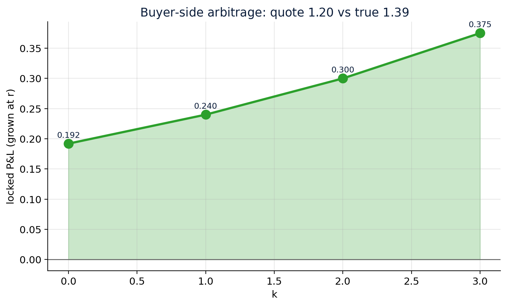

### 4.10.4 Table

**Table 4.15.** Buyer-side arbitrage P&L on ST put $K=5$ at various mispricings:

| quoted $P$ | $V_0 - P$ | locked-in |
|:--:|---:|---:|
| $1.00$ | $\phantom{-}0.36$ | $0.36$ |
| $1.10$ | $\phantom{-}0.26$ | $0.26$ |
| $1.20$ | $\phantom{-}0.16$ | $0.16$ |
| $1.36$ | $\phantom{-}0.00$ | fair |
| $1.50$ | $-0.14$ | $0.14$ |

At $P = 1.50$ the locked-in arb is on the dealer side (sell the put, hedge cheaply).

*Legend.* "Fair" = no arbitrage. Dealer-side: buyer is over-paying, so the dealer captures the surplus.*

---

## §4.11 Path-dependence preview

**Punchline.** For path-dependent contracts (knockouts, lookbacks, Asians), the *same* $(k, S_k)$ on different paths can have *different* option values, because the *history* matters. To price them, we **augment the state** with the relevant path-statistic, breaking the recombining tree. Chapter 5's reflection-based machinery will recover compactness.

**Intuition.** The recombining tree of Chapter 2 worked because the European option payoff depended only on $S_n$, and $S_n$ depends only on the *number* of up moves, not their order. American payoffs of standard puts/calls inherit this property — the Snell value $V_k$ is a function of $(k, S_k)$ alone, so the tree still recombines. But the moment the payoff depends on the path itself (did we touch $B$? what is $\min_{j \le k} S_j$? what is $\frac{1}{k}\sum_{j \le k} S_j$?), the value $V_k$ must carry the history. Two nodes at the same $(k, S_k)$ are no longer equivalent.

### 4.11.1 Knockout American — same $(k, S)$, different fates

**Example 4.11.1 (ST n=3 knockout, $K = 5, B = 8$).** Consider paths arriving at $(2, S = 4)$ from different histories:

- Path HT: $S_0 = 4 \to S_1 = 8 \to S_2 = 4$. **Touched $B$**.
- Path TH: $S_0 = 4 \to S_1 = 2 \to S_2 = 4$. **Did not touch $B$**.

Both arrive at $(k=2, S=4)$. But:
- On path HT, the option is **knocked out**. $V = 0$.
- On path TH, the option is **alive**. $V = g(4) = 1$.

Same $(k, S)$, different $V$. The augmented state is $(k, S_k, \mathbf{1}_{\text{touched}})$.

### 4.11.2 Augmented state space

**Example 4.11.2 (augmented state-space size).** For a recombining $n$-step binomial tree with no path-dependence, the number of distinct $(k, S_k)$ states is $\binom{n+2}{2} \approx n^2/2$ — polynomial in $n$.

For a knockout (one additional binary flag), the state space doubles roughly: $\approx n^2$. Still polynomial.

For a *lookback* American with payoff $g_k = (M_k - K)^+$ where $M_k = \max_{j \le k} S_j$, the state is $(k, S_k, M_k)$. The number of distinct $(S_k, M_k)$ pairs is $O(n^2)$ at each step, so total state space is $O(n^3)$.

For an *Asian* American with $g_k = (\bar S_k - K)^+$ where $\bar S_k = \frac{1}{k+1}\sum_{j=0}^k S_j$, the average $\bar S_k$ depends on the *order* of up/down moves: there are up to $2^k$ distinct $\bar S_k$ values. State space is *exponential* in $n$ — pricing requires either dimension-reduction tricks or Monte Carlo.

**Table:**

| contract | augmented state | size |
|:--|:--|:--:|
| Vanilla | $(k, S_k)$ | $O(n^2)$ |
| Knockout | $(k, S_k, \mathbf{1}_{\text{hit}})$ | $O(n^2)$ |
| Lookback (max) | $(k, S_k, M_k)$ | $O(n^3)$ |
| Asian | $(k, S_k, \bar S_k)$ | $O(2^n)$ |

*All contracts are American (early-exercise) style.* "Size" is the state-space size up to step $n$.

### 4.11.3 Lookback American

**Example 4.11.3 (ST American lookback put, $K - \min_{j} S_j$).** Payoff at exercise time $\tau$: $K - \min_{j \le \tau} S_j$. Take $K = 4$.

For each of the 4 paths in the toy lattice we need to track the running minimum:

| path | $S$ sequence | running min $M_k$ |
|:--|:--|:--|
| HH | $4, 8, 16$ | $4, 4, 4$ |
| HT | $4, 8, 4$ | $4, 4, 4$ |
| TH | $4, 2, 4$ | $4, 2, 2$ |
| TT | $4, 2, 1$ | $4, 2, 1$ |

Intrinsic $g_k = K - M_k$:

| path | $g_0$ | $g_1$ | $g_2$ |
|:--|---:|---:|---:|
| HH | $0$ | $0$ | $0$ |
| HT | $0$ | $0$ | $0$ |
| TH | $0$ | $2$ | $2$ |
| TT | $0$ | $2$ | $3$ |

The state at $k=1$: $(S_1, M_1)$. At $S_1 = 8$, $M_1 = 4$ always. At $S_1 = 2$, $M_1 = 2$. So two distinct states at $k = 1$.

At $k = 2$: at $S_2 = 4$ via HT-path, $M_2 = 4$; at $S_2 = 4$ via TH-path, $M_2 = 2$. Two distinct states at the same $(k, S)$, distinguished by $M$.

Snell envelope must be indexed by $(k, S_k, M_k)$ here. Backward induction is straightforward but the state-space has tripled.

### 4.11.4 Reflection ahoy

The Chapter 5 problem is: how to *count* paths from $(0, 0)$ to $(n, j)$ that touch a level $L$? The reflection principle of §0.7 will give a closed-form count, which is exactly what we need to price barrier-style path-dependent contracts efficiently.

**Example 4.11.4 (reflection preview).** Count paths from $(0, 0)$ to $(4, 2)$ that touch level $3$ (in "net up-count" coordinates). By the reflection bijection of §0.7: such paths are in 1-1 correspondence with paths from $(0, 0)$ to $(4, 2L - 2) = (4, 4)$. There are $\binom{4}{4} = 1$ such path (UUUU). So exactly **1 path** of length 4 ends at level $+2$ and touches level $3$.

That's exactly the count needed to price an up-and-out barrier: "fraction of paths surviving to the endpoint" = total paths minus barrier-touchers.

In Chapter 5 this counting machinery extends to lookback options, Asian options, and exotic barriers — turning path-dependence from a state-space-explosion problem back into a tractable closed form.

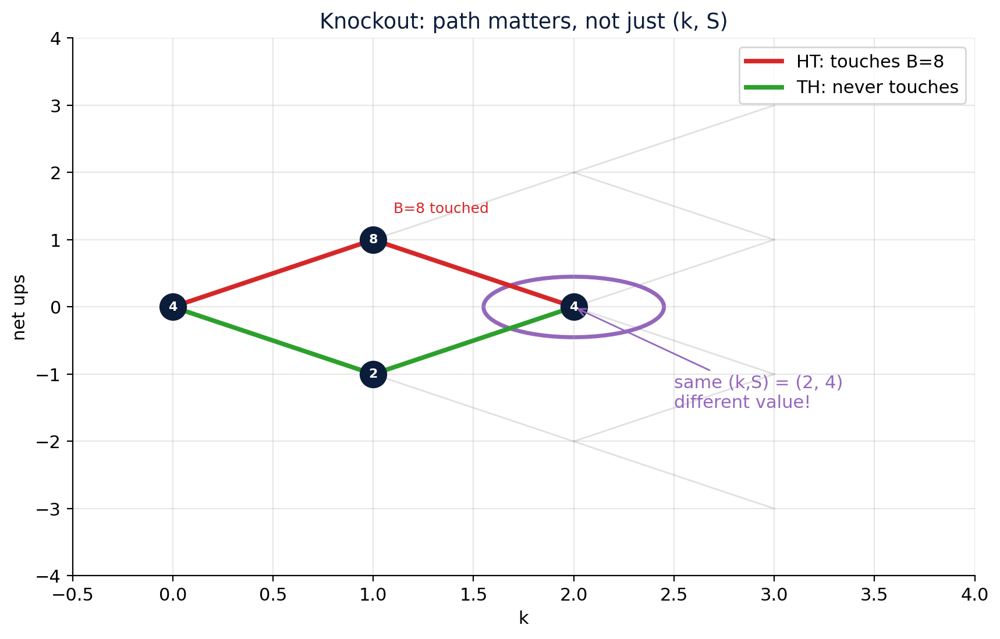

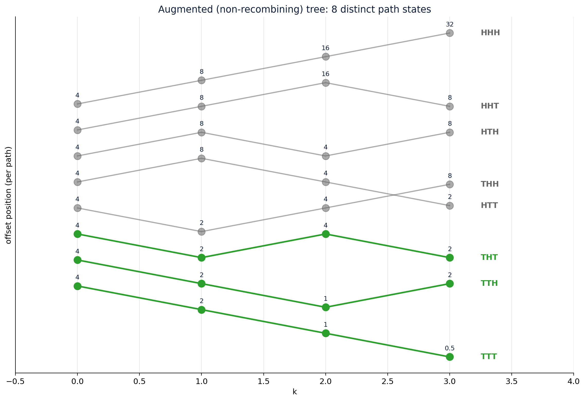

### 4.11.5 Table

**Table 4.16.** State-space size for path-dependent American contracts.

(Reproduced from §4.11.2.)

---

## Chapter summary

The American buyer chooses an optimal stopping time $\tau^*$ to maximise expected discounted payoff under $\tilde{\mathbb{P}}$. The value function $V_k$ (the Snell envelope) is computed by backward induction:

$$V_n = g(S_n), \qquad V_k = \max\{g(S_k),\, \beta\tilde{\mathbb{E}}[V_{k+1}\mid\mathcal F_k]\}.$$

The optimal stopping time is the first time $V_k$ touches the intrinsic $g(S_k)$. The continuation region is downward-closed for a put on a non-dividend stock; the exercise frontier moves up with $r$, down with $\sigma$, and up with $k$ as maturity approaches. For a non-dividend call, early exercise is never optimal — American $=$ European. Dealers hedge by super-replicating; consumption at exercise-region nodes absorbs the supermartingale slack. Mispricings on either side create textbook arbitrages.

We have priced exotics — digitals, knockouts, choosers, range-accruals — by re-using the Snell recipe with custom payoffs. We have also seen that *path-dependence* breaks the recombining tree: barrier options, lookbacks, and Asians require augmented state. That augmentation is the bridge to Chapter 5.

---

## Bridge to Chapter 5

We've seen that the American exercise region depends on the **path** as soon as the contract has any path-dependence (knockouts, lookbacks, Asians). Two nodes at the same $(k, S_k)$ may carry completely different option values because their *histories* — barrier-touched, running maximum, running average — differ. The augmented state space can balloon, in the Asian case to $O(2^n)$.

To price path-dependent contracts efficiently — barriers, lookbacks, fixed-strike Asians, even American versions of these — we need a way to **count paths that hit certain levels** without enumerating each one. The reflection principle from §0.7 is about to do real work: it gives closed-form counts that turn an apparently exponential state space back into a tractable polynomial computation.

Chapter 5 develops the path-counting toolkit: reflection in its full form, the joint distribution of $(S_n, M_n)$ where $M_n$ is the running max, the *first-passage* time distribution, and the resulting closed forms for European and American barrier options. Once we have those tools, lookbacks, Asians, and discrete barriers all yield to the same machinery.

We turn now to that chapter.

---
