# Chapter 5 — The Random Walk and the Reflection Principle

## How to read this chapter

In Chapter 2 we toured the multi-period binomial tree and the Fundamental Theorem of Asset Pricing. In Chapter 3 we put stopping times and martingales onto that tree. In Chapter 4 we discovered that some payoffs — barriers, lookbacks, Asians, Americans — depend on the *whole path*, not just the endpoint.

A path-dependent payoff is the engineer's nightmare. To price it naively, you sum over $2^n$ paths. At $n = 20$ that is a million paths; at $n = 30$ it is a billion. We cannot sustain this for any practical model.

**This chapter is the rescue.** A symmetric random walk has a hidden symmetry — *reflection* — that converts path-dependent path counts into endpoint counts. We will:

1. Look at the random walk $X_n$ that lives inside every binomial tree (§5.1).
2. Track its running maximum $M_n$ — the object that detects barriers and lookbacks (§5.2).
3. Build the **reflection principle** very slowly from tiny enumerations (§5.3) — this is the heart of the chapter and the part that previous drafts skipped over too quickly.
4. Read first-passage time distributions off the reflection principle (§5.4).
5. Get the joint distribution of $(M_n, X_n)$ in one short formula (§5.5).
6. Price knock-in / knock-out barrier options on the binomial tree (§5.6).
7. Price lookback options (§5.7).
8. Connect the picture to American options (§5.8).
9. Watch reflection survive the $n \to \infty$ limit and reproduce Black-Scholes barriers (§5.9, §5.10).

**The mantra.** *Reflection is a counting argument.* It does not require calculus, measure theory, or Itô. It works on a piece of paper because the random walk is a collection of integer lattice paths, and lattice paths can be reflected across horizontal lines. The fact that the same identity will survive the continuous-time limit is a happy bonus that we will witness empirically in §5.9.

What we still avoid in this chapter: derivatives, integrals, $\sigma$-algebras as abstract objects. Every "expectation" is a finite sum, every "probability" is a count over $2^n$.

---

## §5.1 The Symmetric Random Walk

**Punchline.** A fair coin tossed $n$ times traces a polygonal path on the integer lattice, going up by one on a head and down by one on a tail. That path *is* a log-stock-price in disguise.

**Intuition.** Forget options for a moment. Imagine you stand on the integer number line at position $0$ at time $0$. Every second you flip a fair coin: heads you take one step right, tails one step left. Your position after $n$ flips is a random integer. Watch the *whole trajectory* of your position over time and you have what statisticians call a *symmetric simple random walk*. It is the simplest non-trivial stochastic process. Everything in this chapter — and a lot of what comes after — is a statement about this walk.

Why care? Because in a binomial tree with $\log u = -\log d = \sigma$, the log-price increment is exactly $\sigma \cdot (\pm 1)$. The log-price *is* the random walk, scaled.

### 5.1.1 Definitions

Let $\xi_1, \xi_2, \ldots, \xi_n$ be independent random variables, each taking value $+1$ or $-1$ with probability $\tfrac12$. Define

$$X_0 = 0, \qquad X_n = \xi_1 + \xi_2 + \cdots + \xi_n.$$

We call $X_n$ the **symmetric simple random walk** after $n$ steps. The sequence $\{X_0, X_1, \ldots, X_n\}$ is the **path** of the walk.

Three immediate facts.

**Fact 1 (parity).** $X_n$ has the same parity as $n$: if $n$ is even then $X_n$ is even, and if $n$ is odd then $X_n$ is odd. In particular $X_n \in \{-n, -n+2, -n+4, \ldots, n-2, n\}$, a set of $n+1$ integers.

**Fact 2 (distribution).** The number of paths reaching $X_n = k$ is the number of ways to pick which of the $n$ steps were $+1$. If $X_n = k$ then the number of $+1$ steps is $(n+k)/2$. Hence

$$\boxed{\;\mathbb P(X_n = k) \;=\; \frac{1}{2^n}\binom{n}{\tfrac{n+k}{2}}\;}$$

for integers $k$ of the same parity as $n$, and $0$ otherwise.

**Fact 3 (moments).** $\mathbb E[\xi_i] = 0$, $\mathrm{Var}(\xi_i) = 1$, so by independence

$$\mathbb E[X_n] = 0, \qquad \mathrm{Var}(X_n) = n.$$

The standard deviation grows like $\sqrt n$ — slower than $n$. We will meet this fact repeatedly.

### 5.1.2 The stock-price connection ( $u = 2$, $d = 1/2$)

Our running Toy example uses $S_0 = 4$, $u = 2$, $d = 1/2$, $r = 1/4$ (the same Toy as Chapter 2). With $\log u = -\log d = \log 2$, the log-stock-price increment per step is $\pm \log 2$. Hence

$$\log(S_n / S_0) \;=\; X_n \cdot \log 2 \qquad \Longleftrightarrow \qquad S_n \;=\; S_0 \cdot 2^{X_n} \;=\; 4 \cdot 2^{X_n}.$$

This is a one-to-one correspondence. Every fact we prove about $X_n$ translates to a fact about $S_n$ — we just exponentiate.

In the more realistic case $u = 1.10$, $d = 0.90$, we have $\log u \approx 0.0953$ and $\log d \approx -0.1054$. The two magnitudes are slightly unequal, so the log walk is *not* perfectly symmetric — an up-step is a little smaller than a down-step in log space. This asymmetry is small ($\sim 5\%$ of the move size) and we will keep working with the unequal log magnitudes for realistic examples; the *reflection principle* in §5.3 assumes the symmetric walk and applies cleanly only when $\log u + \log d = 0$, i.e. $ud = 1$. For the toy we have $ud = 1$ exactly.

**Intuition (when does reflection work?).** Reflection assumes the walk is *symmetric*: an up-step and a down-step have the same size. In the toy ($ud = 1$) the log walk is perfectly symmetric. In realistic models ($ud \ne 1$) it is not, but we can still price by direct enumeration — and as $n$ grows large with $u, d$ chosen so that $\log u, |\log d|$ are both $O(1/\sqrt n)$, the asymmetry shrinks and reflection becomes asymptotically exact (the Black-Scholes limit, §5.10).

### 5.1.3 Examples

**Example 5.1.1 (all eight length-3 paths).** With $n = 3$ there are $2^3 = 8$ paths. Each is encoded by a string of three letters from $\{U, D\}$. We compute the running position $X_n$:

| Path | $X_0$ | $X_1$ | $X_2$ | $X_3$ |
|------|------:|------:|------:|------:|
| UUU | 0 | +1 | +2 | +3 |
| UUD | 0 | +1 | +2 | +1 |
| UDU | 0 | +1 | 0 | +1 |
| UDD | 0 | +1 | 0 | $-1$ |
| DUU | 0 | $-1$ | 0 | +1 |
| DUD | 0 | $-1$ | 0 | $-1$ |
| DDU | 0 | $-1$ | $-2$ | $-1$ |
| DDD | 0 | $-1$ | $-2$ | $-3$ |

Tabulating the terminal values:

| $k$ | $-3$ | $-1$ | $+1$ | $+3$ |
|---:|---:|---:|---:|---:|
| paths to $X_3 = k$ | $1$ (DDD) | $3$ (DDU, DUD, UDD) | $3$ (DUU, UDU, UUD) | $1$ (UUU) |
| $\mathbb P(X_3 = k)$ | $1/8$ | $3/8$ | $3/8$ | $1/8$ |

The row of counts is Pascal's triangle row $n = 3$: $1, 3, 3, 1$. The formula $\binom{3}{(3+k)/2}/8$ gives the same thing.

**Example 5.1.2 ($\mathbb P(X_4 = 2)$).** Two ways:

*Formula:* $\binom{4}{(4+2)/2}/2^4 = \binom{4}{3}/16 = 4/16 = 1/4$.

*Enumeration:* paths of length 4 with exactly three U's: UUUD, UUDU, UDUU, DUUU — four paths. So $\mathbb P(X_4 = 2) = 4/16 = 1/4$. ✓

**Example 5.1.3 ( $n=3$ stock paths from $S_0 = 4$).** With $S_n = 4 \cdot 2^{X_n}$:

| Path | $X_3$ | $S_3$ |
|------|---:|---:|
| UUU | $+3$ | $32$ |
| UUD | $+1$ | $8$ |
| UDU | $+1$ | $8$ |
| UDD | $-1$ | $2$ |
| DUU | $+1$ | $8$ |
| DUD | $-1$ | $2$ |
| DDU | $-1$ | $2$ |
| DDD | $-3$ | $0.5$ |

The eight terminal stock prices are $\{32, 8, 8, 2, 8, 2, 2, 0.5\}$ — the multiplicities are $1, 3, 3, 1$, the same Pascal row. The tree is recombining: only the *count* of U's matters for $S_n$, not the order.

**Example 5.1.4 (realistic, $u=1.10$, $d=0.90$, $n=3$).** Now $S_n = 100 \cdot 1.10^{n_U} \cdot 0.90^{n - n_U}$. Enumerated:

| Path | $n_U$ | $S_3$ |
|------|---:|---:|
| UUU | 3 | $133.10$ |
| UUD | 2 | $108.90$ |
| UDU | 2 | $108.90$ |
| UDD | 1 | $89.10$ |
| DUU | 2 | $108.90$ |
| DUD | 1 | $89.10$ |
| DDU | 1 | $89.10$ |
| DDD | 0 | $72.90$ |

The log-prices are $\log(S_n/100) \in \{0.286, 0.085, \ldots, -0.314\}$. Note $|0.286 / 3 - (-0.314)/3| > 0$ — so up- and down-log-moves differ in magnitude by about $5\%$. The log walk is *not* perfectly symmetric, although it is very close.

**Example 5.1.5 (mean and variance).** Take $n = 100$. $\mathbb E[X_{100}] = 0$, $\mathrm{Var}(X_{100}) = 100$, so $\mathrm{sd}(X_{100}) = 10$. A random length-100 walk typically ends within $\pm 10$ of zero, and almost never further than $\pm 30$.

**Example 5.1.6 ($\mathbb P(X_4 \ge 0)$).** Five values $k \in \{-4, -2, 0, 2, 4\}$. Counts $1, 4, 6, 4, 1$ from row 4 of Pascal. Then

$$\mathbb P(X_4 \ge 0) \;=\; \frac{6 + 4 + 1}{16} \;=\; \frac{11}{16} \;=\; 0.6875.$$

By enumeration: out of 16 paths of length 4, eleven end at $X_4 \in \{0, 2, 4\}$. Cross-checked.

**Example 5.1.7 ($\mathbb P(X_4 \ge 2)$).** $\binom{4}{3}/16 + \binom{4}{4}/16 = 4/16 + 1/16 = 5/16$.

**Example 5.1.8 (a back-of-envelope rare-event estimate).** For $n = 100$ steps and target level $k = 30$: $\mathrm{sd}(X_{100}) = 10$, so $X_{100} = 30$ is "three sigma." The CLT (Chapter 0) says the chance is about $0.0013$. Cross-checking with the exact formula, $\mathbb P(X_{100} = 30) = \binom{100}{65}/2^{100}$, which is roughly $0.00075$. The continuous approximation is in the right ballpark.

**Example 5.1.9 (a paradox of symmetry).** Suppose the walk has gone up 10 times in a row. Is it more likely to come down next? *No.* The fair coin has no memory: $\mathbb P(\xi_{11} = +1) = 1/2$ regardless of the previous ten flips. The walker's *running position* will probably come down on average (regression to zero), but each individual step is fair.

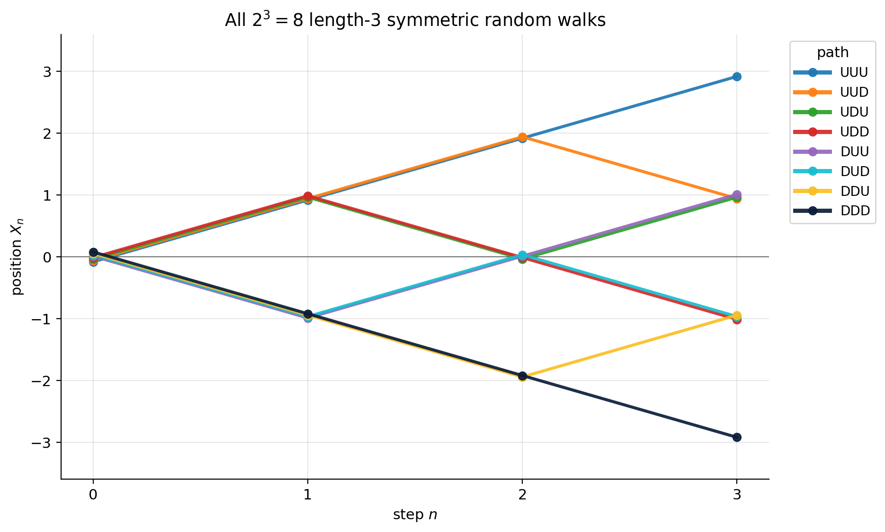

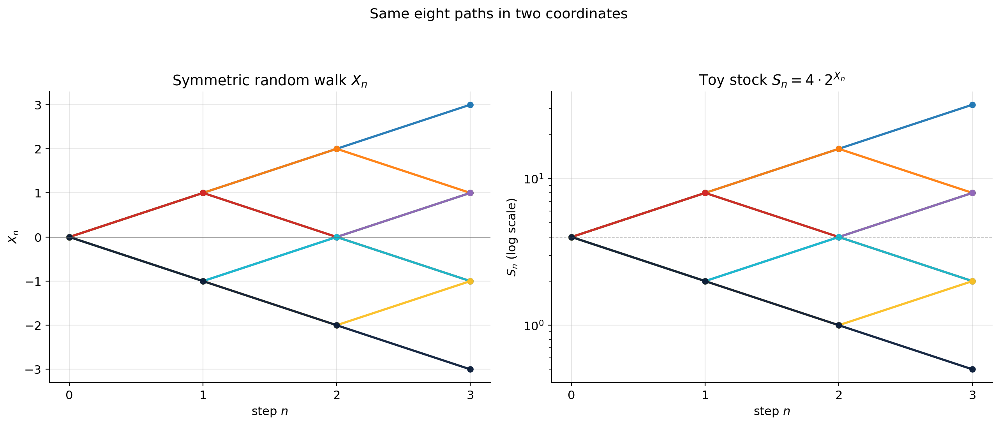

### 5.1.4 Tables

**Table 5.1.** Distribution of $X_n$ for $n = 1, 2, 3, 4, 5$. Each row sums to $2^n$ paths (and $1.0$ in probability).

| $n$ | $X_n = -5$ | $-4$ | $-3$ | $-2$ | $-1$ | $0$ | $+1$ | $+2$ | $+3$ | $+4$ | $+5$ |
|---:|---:|---:|---:|---:|---:|---:|---:|---:|---:|---:|---:|
| $1$ | | | | | $\phantom{0}1$ | | $\phantom{0}1$ | | | | |
| $2$ | | | | $\phantom{0}1$ | | $\phantom{0}2$ | | $\phantom{0}1$ | | | |
| $3$ | | | $1$ | | $\phantom{0}3$ | | $\phantom{0}3$ | | $1$ | | |
| $4$ | | $1$ | | $\phantom{0}4$ | | $\phantom{0}6$ | | $\phantom{0}4$ | | $1$ | |
| $5$ | $1$ | | $5$ | | $10$ | | $10$ | | $5$ | | $1$ |

*Blank: $\mathbb P(X_n = k) = 0$ by parity (n and k must agree mod 2).*

**Table 5.2.** Same data as probabilities (divide each row by $2^n$).

| $n$ | $-5$ | $-4$ | $-3$ | $-2$ | $-1$ | $0$ | $+1$ | $+2$ | $+3$ | $+4$ | $+5$ |
|---:|---:|---:|---:|---:|---:|---:|---:|---:|---:|---:|---:|
| $1$ | | | | | $0.5000$ | | $0.5000$ | | | | |
| $2$ | | | | $0.2500$ | | $0.5000$ | | $0.2500$ | | | |
| $3$ | | | $0.1250$ | | $0.3750$ | | $0.3750$ | | $0.1250$ | | |
| $4$ | | $0.0625$ | | $0.2500$ | | $0.3750$ | | $0.2500$ | | $0.0625$ | |
| $5$ | $0.0313$ | | $0.1563$ | | $0.3125$ | | $0.3125$ | | $0.1563$ | | $0.0313$ |

*Blank: $\mathbb P(X_n = k) = 0$ by parity.*

### 5.1.5 Exercises

1. Compute $\mathbb P(X_6 = 0)$. **Answer:** $\binom{6}{3}/64 = 20/64 = 0.3125$.
2. Compute $\mathbb P(X_{10} \ge 4)$ using only Table 5.1's pattern (Pascal row 10 is $1, 10, 45, 120, 210, 252, 210, 120, 45, 10, 1$). **Answer:** $(45 + 10 + 1)/1024 = 56/1024 \approx 0.0547$.
3. The stock with $S_0 = 4$ reaches what set of values at time $n = 4$? **Answer:** $\{64, 16, 4, 1, 0.25\}$ — five values, with $S_n = 4 \cdot 2^{X_4}$.

---

## §5.2 The Running Maximum $M_n$

**Punchline.** Barrier options ask "did the path *ever* touch level $L$?" That's the running maximum: $M_n \ge L$. Lookback options ask "how high did it go?" That's $M_n$. The running max is the single object that turns a *path-history* question into a *path-statistic* question.

**Intuition.** Imagine watching the walker step by step and writing down the largest position they have visited so far. That number cannot decrease — it can only stay the same or jump up. The graph of $M_n$ is a non-decreasing staircase that traces the upper envelope of the path. If you ever care about a barrier or a peak, you really only care about this staircase.

### 5.2.1 Definitions

For the random walk $X_0, X_1, \ldots, X_n$, define

$$M_n \;=\; \max_{0 \le k \le n} X_k.$$

Some immediate properties.

- $M_n \ge X_0 = 0$ always. So $M_n$ is a non-negative integer.
- $M_n \ge X_n$ always (the running max is at least the final position).
- $M_n$ is non-decreasing: $M_{n+1} \ge M_n$.
- $M_n - X_n \ge 0$ is the **drawdown from peak**, the amount by which the walk has retreated from its maximum.

**Stock-price barrier translation.** If $S_n = S_0 \cdot u^{n_U} d^{n_D}$ with $u = 2$, $d = 1/2$, the barrier "$S$ ever reaches 16 starting from $S_0 = 4$" is the same as "$X$ ever reaches $\log_2(16/4) = 2$" — i.e. $M_n \ge 2$. **A barrier on $S$ is a barrier on $X$.**

In general for $\log u = -\log d = \sigma$:

$$M^S_n \;=\; \max_{0 \le k \le n} S_k \;=\; S_0 \cdot u^{M_n}.$$

So $M^S_n \ge L$ iff $M_n \ge \log_u(L/S_0)$. We solve for the $X$-level $m$ then count.

### 5.2.2 Examples

**Example 5.2.1 (all eight length-3 paths with $(X_3, M_3)$).** Add the running max column to the table from Example 5.1.1:

| Path | $X_1$ | $X_2$ | $X_3$ | $M_3$ |
|------|---:|---:|---:|---:|
| UUU | $+1$ | $+2$ | $+3$ | $3$ |
| UUD | $+1$ | $+2$ | $+1$ | $2$ |
| UDU | $+1$ | $0$ | $+1$ | $1$ |
| UDD | $+1$ | $0$ | $-1$ | $1$ |
| DUU | $-1$ | $0$ | $+1$ | $1$ |
| DUD | $-1$ | $0$ | $-1$ | $0$ |
| DDU | $-1$ | $-2$ | $-1$ | $0$ |
| DDD | $-1$ | $-2$ | $-3$ | $0$ |

**Example 5.2.2 (count paths with $M_3 \ge 2$).** The only paths whose running max is at least $2$ must visit $+2$ at some step. Reading off the table:

- UUU: positions $0, 1, 2, 3$. $M_3 = 3 \ge 2$. ✓
- UUD: positions $0, 1, 2, 1$. $M_3 = 2 \ge 2$. ✓
- All others have $M_3 \le 1$.

So **2 paths**, giving $\mathbb P(M_3 \ge 2) = 2/8 = 1/4$. (The reflection principle in §5.3 will give a more efficient way of counting.)

**Example 5.2.3 (all 16 length-4 paths with $(X_4, M_4)$).** This is the table we will return to repeatedly. See Table 5.3 below; for now note:

| Path | $X_4$ | $M_4$ | | Path | $X_4$ | $M_4$ |
|------|---:|---:|---|------|---:|---:|
| UUUU | $+4$ | $4$ | | DUUU | $+2$ | $2$ |
| UUUD | $+2$ | $3$ | | DUUD | $0$ | $1$ |
| UUDU | $+2$ | $2$ | | DUDU | $0$ | $0$ |
| UUDD | $0$ | $2$ | | DUDD | $-2$ | $0$ |
| UDUU | $+2$ | $2$ | | DDUU | $0$ | $0$ |
| UDUD | $0$ | $1$ | | DDUD | $-2$ | $0$ |
| UDDU | $0$ | $1$ | | DDDU | $-2$ | $0$ |
| UDDD | $-2$ | $1$ | | DDDD | $-4$ | $0$ |

**Example 5.2.4 (paths with $M_4 \ge 2$).** Inspecting the table, the qualifying paths are: UUUU, UUUD, UUDU, UUDD, UDUU, DUUU. That's **6 paths**, so

$$\mathbb P(M_4 \ge 2) \;=\; 6/16 \;=\; 0.375.$$

**Example 5.2.5 ( stock $S_n = 4 \cdot 2^{X_n}$ reaches $L = 16$ by step 4).** $L = 16$ on the stock corresponds to $m = 2$ on $X$. By Example 5.2.4, the probability is $6/16 = 0.375$.

**Example 5.2.6 (the counter-intuition).** Two length-4 paths end at $X_4 = 0$:

- DDUU: positions $0, -1, -2, -1, 0$. $M_4 = 0$.
- UUDD: positions $0, +1, +2, +1, 0$. $M_4 = 2$.

Same endpoint, different running maxima. This is exactly what makes barrier options *path-dependent* — the endpoint doesn't tell you whether the barrier was breached. Vanilla calls only need the endpoint; barrier calls need the whole path. The whole purpose of this chapter is to recover endpoint-style counting *anyway*, via the reflection principle (§5.3).

**Example 5.2.7 (three same-endpoint, three maxima).** From the length-4 table: DDUU, DUDU, UUDD all end at $X_4 = 0$. Their running maxima are $0, 0, 2$ respectively. So the joint pmf at $X_4 = 0$ is: $\mathbb P(M_4 = 0, X_4 = 0) = 2/16$, $\mathbb P(M_4 = 1, X_4 = 0) = 3/16$, $\mathbb P(M_4 = 2, X_4 = 0) = 1/16$. (Six total paths ending at 0; we'll revisit.)

**Example 5.2.8 (realistic stock, $S_0 = 100$, $u = 1.10$, $d = 0.90$, $L = 120$, $n = 4$).** Translate to log: $\log(120/100) = \log 1.2 = 0.1823$. Per-step log magnitudes: $\log 1.10 = 0.0953$, $-\log 0.90 = 0.1054$. So the barrier on the *gross-price* tree is hit by paths that have visited a price $\ge 120$ at some point. Direct enumeration (since this walk is not perfectly symmetric):

| Path | $S_1$ | $S_2$ | $S_3$ | $S_4$ | $M^S_4$ | hit |
|------|---:|---:|---:|---:|---:|:--:|
| UUUU | $110$ | $121$ | $133.10$ | $146.41$ | $146.41$ | ✓ |
| UUUD | $110$ | $121$ | $133.10$ | $119.79$ | $133.10$ | ✓ |
| UUDU | $110$ | $121$ | $108.90$ | $119.79$ | $121.00$ | ✓ |
| UDUU | $110$ | $99$ | $108.90$ | $119.79$ | $119.79$ | ✗ |
| DUUU | $90$ | $99$ | $108.90$ | $119.79$ | $119.79$ | ✗ |
| UUDD | $110$ | $121$ | $108.90$ | $98.01$ | $121.00$ | ✓ |
| (10 others) | | | | | | ✗ |

*Legend:* "hit" = path touched the barrier $L = 120$. The "10 others" row aggregates the remaining paths, none of which touch the barrier.

Counting all 16 paths in code yields **4 paths** that touch $L = 120$ — the four shown ticked. The chapter's worked numerical example in §5.6 uses these 4 paths.

**Example 5.2.9 (the staircase).** A length-6 example path: UDUUDU. Positions $0, 1, 0, 1, 2, 1, 2$. The running max is $0, 1, 1, 1, 2, 2, 2$ — a non-decreasing staircase. The drawdown $M_n - X_n$ is $0, 0, 1, 0, 0, 1, 0$, returning to zero whenever the walk hits a new high.

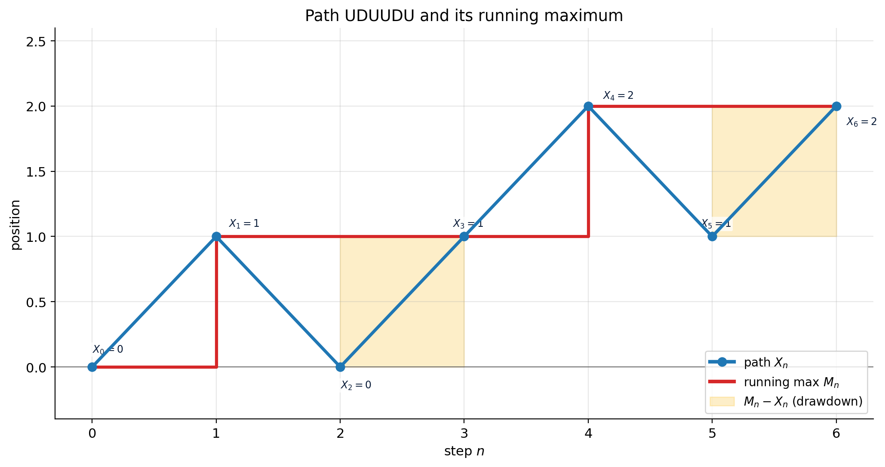

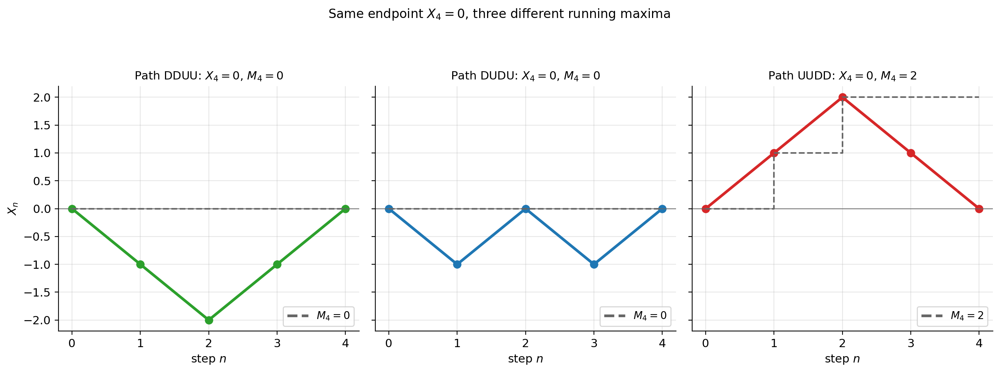

### 5.2.3 Tables

**Table 5.3.** All 16 length-4 paths with their terminal value $X_4$ and running max $M_4$, sorted by $M_4$.

| Path | $X_4$ | $M_4$ | | Path | $X_4$ | $M_4$ |
|------|---:|---:|---|------|---:|---:|
| DDDD | $-4$ | $0$ | | UDUD | $0$ | $1$ |
| DDDU | $-2$ | $0$ | | UDDU | $0$ | $1$ |
| DDUD | $-2$ | $0$ | | UDDD | $-2$ | $1$ |
| DUDD | $-2$ | $0$ | | UUDU | $+2$ | $2$ |
| DDUU | $0$ | $0$ | | UUDD | $0$ | $2$ |
| DUDU | $0$ | $0$ | | UDUU | $+2$ | $2$ |
| DUUD | $0$ | $1$ | | DUUU | $+2$ | $2$ |
| | | | | UUUD | $+2$ | $3$ |
| | | | | UUUU | $+4$ | $4$ |

**Table 5.4.** Counts of $(X_4, M_4)$ — the joint distribution at $n=4$.

| $(X_4, M_4)$ | count | probability |
|---|---:|---:|
| $(-4, 0)$ | $1$ | $1/16$ |
| $(-2, 0)$ | $3$ | $3/16$ |
| $(-2, 1)$ | $1$ | $1/16$ |
| $(0, 0)$ | $2$ | $2/16$ |
| $(0, 1)$ | $3$ | $3/16$ |
| $(0, 2)$ | $1$ | $1/16$ |
| $(+2, 2)$ | $3$ | $3/16$ |
| $(+2, 3)$ | $1$ | $1/16$ |
| $(+4, 4)$ | $1$ | $1/16$ |
| total | $16$ | $1.000$ |

### 5.2.4 Exercises

1. From Table 5.4 compute $\mathbb P(M_4 \ge 2)$. **Answer:** sum of rows with $M_4 \ge 2$: $1 + 3 + 1 + 1 = 6$, so $6/16 = 0.375$. (Matches Example 5.2.4.)
2. From Table 5.4 compute $\mathbb E[M_4]$. **Answer:** $(0 \cdot 6 + 1 \cdot 4 + 2 \cdot 4 + 3 \cdot 1 + 4 \cdot 1)/16 = 19/16 = 1.1875$.
3. Translate "$S_0 = 4$ Toy, barrier $L = 8$, $n = 3$, up-and-in" into the $X$ language. **Answer:** $m = 1$ on $X$, $n = 3$. Want $M_3 \ge 1$. Paths satisfying this: every path except DUD, DDU, DDD — i.e. five paths, $5/8$.

---

## §5.3 The Reflection Principle — Slow Build

**Punchline.** *For every path of the random walk that ends at height $h \le m$ and touches level $m$, there is exactly one path that ends at height $2m - h$. The map between them is geometric: flip the post-first-hit portion across the horizontal line $y = m$.*

Equivalent counting statement: **the number of length-$n$ paths with $M_n \ge m$ and $X_n = h$ (for $h \le m$) equals the number of length-$n$ paths with $X_n = 2m - h$.**

That second sentence is the only statement we actually use to price. The "flip the path" geometry is the *proof* — but only because the proof is so visual that, once you see it on tiny cases, you will trust it forever.

**Intuition.** A path that touches the barrier $m$ before time $n$ has *committed* to a first-passage event. After that commitment, the rest of the path is a free symmetric walk starting from $m$. *Flip every step after the commitment across $y = m$* and you get another valid symmetric walk, ending at the mirror image $2m - h$ instead of $h$. The flip is reversible — given the post-flip path, you can recover the original by flipping again. Hence the bijection.

**Why this section is long.** Previous chapters of this book (and most textbooks) state the reflection principle in three lines and move on. That is a mistake. The principle is *visual*, *easy to verify by hand for tiny $n$*, and *almost always confusing if you skip the tiny verification*. We will spend the next twelve pages walking through cases $n = 3, 4, 5, 6$ in painstaking detail before any general statement appears.

### 5.3.1 Tiny case: $n = 3$, $m = 2$

Recall the 8 paths from Example 5.1.1:

| Path | Positions $(X_0, X_1, X_2, X_3)$ | $M_3$ | $X_3$ |
|------|---|---:|---:|
| UUU | $0, 1, 2, 3$ | $3$ | $3$ |
| UUD | $0, 1, 2, 1$ | $2$ | $1$ |
| UDU | $0, 1, 0, 1$ | $1$ | $1$ |
| UDD | $0, 1, 0, -1$ | $1$ | $-1$ |
| DUU | $0, -1, 0, 1$ | $1$ | $1$ |
| DUD | $0, -1, 0, -1$ | $0$ | $-1$ |
| DDU | $0, -1, -2, -1$ | $0$ | $-1$ |
| DDD | $0, -1, -2, -3$ | $0$ | $-3$ |

**Which paths reach $+2$ (i.e. $M_3 \ge 2$)?** Only UUU and UUD. **Two** paths.

Now let's verify the reflection identity for $m = 2$ and various $h$.

**Sub-claim ($h = 3$, no flip needed because $h > m$):** Paths with $X_3 = 3$? Only UUU. *And* paths with $M_3 \ge 2$ and $X_3 = 3$? Same — UUU. Trivially, any path ending at $+3$ has already passed $+2$.

**Sub-claim ($h = 1$, the interesting case):** Paths with $M_3 \ge 2$ and $X_3 = 1$? Only UUD. **One** path. The reflection identity says this equals the number of paths with $X_3 = 2m - h = 2 \cdot 2 - 1 = 3$. Paths with $X_3 = 3$: UUU. **One** path. ✓ The bijection sends UUD $\leftrightarrow$ UUU.

Let's *see* the bijection. UUD has positions $0, 1, 2, 1$. The first hit of $m = 2$ is at time $\tau = 2$. Reflect positions at times $> \tau$ across the line $y = 2$:

- $X_3 = 1$ (original) reflects to $2 \cdot 2 - 1 = 3$.

So the reflected path is $0, 1, 2, 3$ — i.e. UUU. The reflection bijection sends UUD to UUU. Reversing: given UUU, where is its "first hit of $+2$"? At time 2. Reflect positions after time 2 across $y = 2$: $X_3 = 3 \to 2 \cdot 2 - 3 = 1$. We recover UUD. ✓

**Example 5.3.1 (verifying the bijection on the smallest non-trivial case).** Original: UUD = $(0, 1, 2, 1)$. Reflected twin: UUU = $(0, 1, 2, 3)$. Both touch $m = 2$ at $\tau = 2$. The first two steps are identical; the third step is flipped. *That's the entire principle in three steps.*

### 5.3.2 Case $n = 4$, $m = 2$

This is the case that becomes confusing if you don't enumerate. There are 16 paths total; 6 of them have $M_4 \ge 2$ (Example 5.2.4). With parity $X_4 \in \{-4,-2,0,+2,+4\}$, bucket them by terminal value (reading off Table 5.4):

| $X_4$ | paths with $M_4 \ge 2$ | count |
|---:|---|---:|
| $-4$ | (none) | $0$ |
| $-2$ | (none) | $0$ |
| $\phantom{+}0$ | UUDD | $1$ |
| $+2$ | UUDU, UDUU, DUUU, UUUD | $4$ |
| $+4$ | UUUU | $1$ |

Sum: $0 + 0 + 1 + 4 + 1 = 6$ paths with $M_4 \ge 2$. ✓

Now the reflection check. For $h \le m = 2$, the formula says: number of paths with $M_4 \ge 2$ and $X_4 = h$ equals number of paths with $X_4 = 2 \cdot 2 - h = 4 - h$.

| $h$ | LHS | target $2m-h$ | RHS | check |
|---:|---:|---:|---:|:--:|
| $-2$ | $0$ | $+6$ | $0$ | ✓ |
| $0$ | $1$ | $+4$ | $1$ | ✓ |
| $+2$ | $4$ | $+2$ | $4$ | ✓ |

*Legend:* **LHS** = paths with $M_4 \ge 2$ and $X_4 = h$; **RHS** = paths with $X_4 = 2m - h$. Row $h = -2$ has RHS target $+6$, out of range ($\binom{4}{k} = 0$). Row $h = 0$: only UUUU. Row $h = +2$: UUUD, UUDU, UDUU, DUUU.

The case $h = 2 = m$ (the boundary) gives $4 = 4$. The case $h = 0$ gives $1 = 1$. ✓

**Example 5.3.2 (the bijection for $h = 0$ at $n = 4$, $m = 2$).** Original: UUDD = $(0, 1, 2, 1, 0)$. First hit of $m = 2$ at $\tau = 2$. Reflect positions after $\tau$ across $y = 2$: $X_3 = 1 \to 3$, $X_4 = 0 \to 4$. Reflected path: $(0, 1, 2, 3, 4)$ — that's UUUU. ✓ One path on the left, one path on the right.

**Example 5.3.3 (the bijection for $h = +2$ at $n = 4$, $m = 2$).** We have 4 paths with $M_4 \ge 2$ and $X_4 = +2$. Let's check each.

1. UUUD = $(0, 1, 2, 3, 2)$. First hit of $m = 2$ at $\tau = 2$. Reflect after $\tau$: $X_3 = 3 \to 1$, $X_4 = 2 \to 2$. Reflected: $(0, 1, 2, 1, 2)$ — i.e. UUDU. Terminal value $+2$. (At the boundary case $h = m$ the reflection is a self-bijection on $\{X_n = m\}$, not the identity but a non-trivial involution. For $h > m$ no reflection is needed: every path ending above $m$ has automatically already been at $m$. The identity gives a strong statement only when $h < m$.)

2. UUDU = $(0, 1, 2, 1, 2)$. First hit of $m = 2$ at $\tau = 2$. Reflect after $\tau$: $X_3 = 1 \to 3$, $X_4 = 2 \to 2$. Reflected: $(0, 1, 2, 3, 2)$ — i.e. UUUD. (Same pair as case 1, reversed.)
3. UDUU = $(0, 1, 0, 1, 2)$. First hit of $m = 2$ at $\tau = 4$ (the last step!). Reflect after $\tau = 4$: nothing to reflect. The reflected path equals UDUU. Terminal value $X_4 = +2 = m$. (Self-image under the bijection.)
4. DUUU = $(0, -1, 0, 1, 2)$. First hit of $m = 2$ at $\tau = 4$. Same situation: self-image.

So at $h = m$, the bijection pairs UUUD $\leftrightarrow$ UUDU and fixes UDUU and DUUU. Count: 4 on each side. ✓

**The lesson: when $h < m$ strictly, the bijection moves paths *out* of $\{M_n \ge m, X_n = h\}$ and *into* $\{X_n = 2m - h\}$, and both these sets are equal because the bijection is well-defined and invertible.**

### 5.3.3 Case $n = 5$, $m = 3$

Now 32 paths. We want $M_5 \ge 3$.

Paths reaching $+3$ in $\le 5$ steps. Direct enumeration (I count by computer; see also figure below): **7 paths** with $M_5 \ge 3$. Bucketed by terminal value:

| $X_5$ | paths with $M_5 \ge 3$ | count |
|---:|---|---:|
| $+1$ | UUUDD | $1$ |
| $+3$ | UUUDU, UUDUU, UDUUU, DUUUU, UUUUD | $5$ |
| $+5$ | UUUUU | $1$ |

Total $1 + 5 + 1 = 7$. ✓

Reflection check for $h = 1 < m = 3$: target is $2 \cdot 3 - 1 = 5$. Paths with $X_5 = 5$: only UUUUU. **One**. And paths with $M_5 \ge 3, X_5 = 1$: only UUUDD. **One**. ✓

**Example 5.3.4 (the bijection for $h = 1$ at $n = 5$, $m = 3$).** Original: UUUDD = $(0, 1, 2, 3, 2, 1)$. First hit of $m = 3$ at $\tau = 3$. Reflect after $\tau$: $X_4 = 2 \to 4$, $X_5 = 1 \to 5$. Reflected: $(0, 1, 2, 3, 4, 5)$ — i.e. UUUUU. ✓

It is the *only* example of the bijection between $\{M_5 \ge 3, X_5 = 1\}$ and $\{X_5 = 5\}$, because both sets have exactly one element.

**Example 5.3.5 (the bijection for $h = 3$ at $n = 5$, $m = 3$).** Here $h = m$, the boundary case. Both sides count "paths ending at $X_5 = 3$" which equals 5. The bijection is a self-involution on the 5 paths. Quick check on one: UUUDU = $(0, 1, 2, 3, 2, 3)$. First hit $\tau = 3$. Reflect: $X_4 = 2 \to 4$, $X_5 = 3 \to 3$. Reflected: $(0, 1, 2, 3, 4, 3)$ — i.e. UUUUD. Both UUUDU and UUUUD are in $\{X_5 = 3\}$. ✓

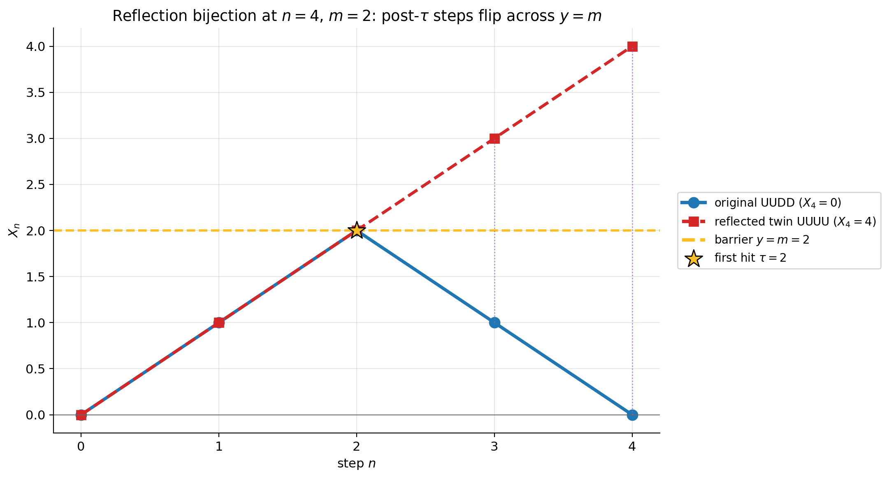

### 5.3.4 Case $n = 6$, $m = 2$, $h = 0$

The first case big enough that you might not want to enumerate by hand. We enumerate by computer.

Number of length-6 paths with $M_6 \ge 2$ and $X_6 = 0$: **6** (by computer-aided enumeration).

Reflection target: $X_6 = 2 \cdot 2 - 0 = 4$. Number of length-6 paths with $X_6 = 4$: choose 5 U's out of 6 steps, so $\binom{6}{5} = 6$.

So both sides equal 6. ✓

**Example 5.3.6 (enumerate the 6 paths with $M_6 \ge 2$ and $X_6 = 0$).** Each such path has exactly 3 U's and 3 D's (forced by $X_6 = 0$) and must touch $+2$ at some step. Of the $\binom{6}{3} = 20$ paths ending at $X_6 = 0$, only the following six visit $+2$:

| Original (touches $+2$, ends at $0$) | Positions $(X_0, X_1, \ldots, X_6)$ | First hit $\tau$ | Reflected twin (ends at $+4$) |
|---|---|---:|---|
| UUUDDD | $(0, 1, 2, 3, 2, 1, 0)$ | $2$ | UUDUUU |
| UUDUDD | $(0, 1, 2, 1, 2, 1, 0)$ | $2$ | UUUDUU |
| UUDDUD | $(0, 1, 2, 1, 0, 1, 0)$ | $2$ | UUUUDU |
| UUDDDU | $(0, 1, 2, 1, 0, -1, 0)$ | $2$ | UUUUUD |
| UDUUDD | $(0, 1, 0, 1, 2, 1, 0)$ | $4$ | UDUUUU |
| DUUUDD | $(0, -1, 0, 1, 2, 1, 0)$ | $4$ | DUUUUU |

(In each row, $\tau$ is the smallest index at which $X_\tau = 2$. Reflecting positions strictly after $\tau$ across the line $y = 2$ produces the twin; e.g. UUUDDD's post-$\tau$ positions $(3, 2, 1, 0)$ flip to $(1, 2, 3, 4)$, giving twin positions $(0, 1, 2, 1, 2, 3, 4) = $ UUDUUU.) The six reflected twins are precisely the six length-6 paths with exactly one D, which is $\binom{6}{5} = 6$ paths ending at $X_6 = +4$. The bijection is one-to-one and onto. ✓

So $|\{M_6 \ge 2, X_6 = 0\}| = 6 = \binom{6}{5} = |\{X_6 = 4\}|$ — matching the formula $\mathbb P(M_n \ge m, X_n = h) = \mathbb P(X_n = 2m - h)$ at $(n, m, h) = (6, 2, 0)$.

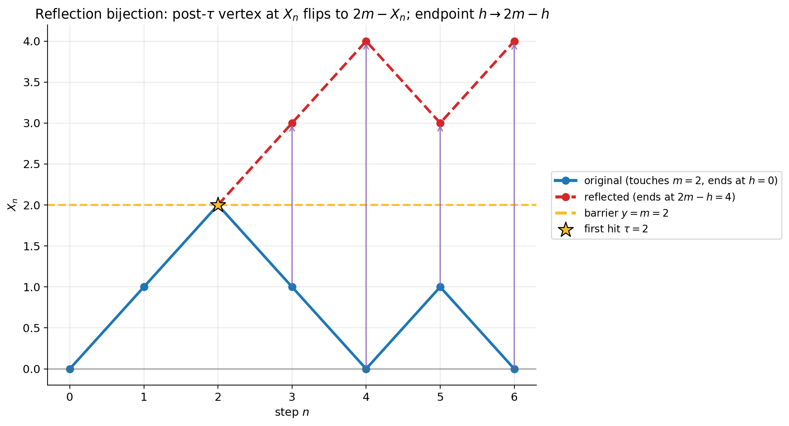

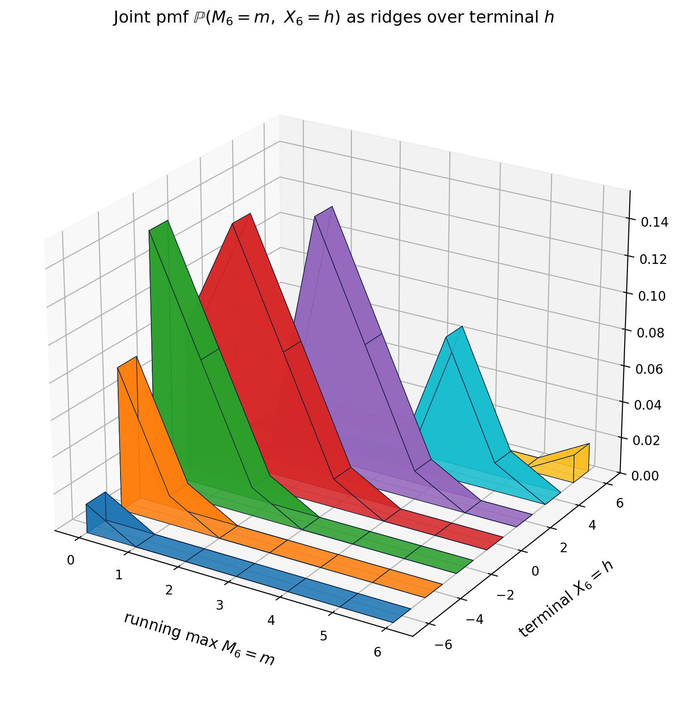

### 5.3.5 General statement and corollary

After the four worked cases, we can state the principle.

**Theorem (Reflection Principle, discrete form).** *Let $X_n$ be the symmetric random walk and $M_n = \max_{0 \le k \le n} X_k$. For integers $m \ge 1$ and $h \le m$ (with $h$ having the same parity as $n$):*

$$\boxed{\;\mathbb P\bigl(M_n \ge m,\; X_n = h\bigr) \;=\; \mathbb P\bigl(X_n = 2m - h\bigr).\;}$$

Equivalently in counts: $|\{M_n \ge m, X_n = h\}| = |\{X_n = 2m - h\}| = \binom{n}{(n + 2m - h)/2}$.

**Proof sketch.** The map "flip the path across $y = m$ after $\tau_m$" is a bijection between $\{M_n \ge m, X_n = h\}$ and $\{X_n = 2m - h\}$. We verified the construction is well-defined (it produces a valid $\pm 1$ walk) and reversible (apply it twice and you get the original). Since the symmetric walk gives every path probability $1/2^n$, the two probabilities are equal.

**Corollary 1 (marginal for the max — the "factor of two" identity).** *For $m \ge 1$ (with $m$ of the same parity as $n$):*

$$\boxed{\;\mathbb P(M_n \ge m) \;=\; 2\,\mathbb P(X_n \ge m) \;-\; \mathbb P(X_n = m).\;}$$

*Derivation.* Split $\{M_n \ge m\}$ by terminal value:

$$\mathbb P(M_n \ge m) \;=\; \sum_{h \le m}\mathbb P(M_n \ge m,\, X_n = h) \;+\; \sum_{h > m}\mathbb P(X_n = h).$$

(The second sum drops the constraint $M_n \ge m$ because $X_n > m \Rightarrow M_n \ge m$ automatically.) Apply reflection to the first sum: as $h$ ranges over $\{-n, -n+2, \ldots, m\}$, the reflected value $2m - h$ ranges over $\{m, m+2, \ldots, 2m+n\}$. So

$$\sum_{h \le m}\mathbb P(X_n = 2m - h) \;=\; \mathbb P(X_n \ge m).$$

Therefore $\mathbb P(M_n \ge m) = \mathbb P(X_n \ge m) + \mathbb P(X_n > m) = 2\mathbb P(X_n \ge m) - \mathbb P(X_n = m)$. $\square$

**The boundary correction.** The clean continuous-time identity is

$$\mathbb P\bigl(\sup_{0\le t\le T} W_t \ge u\bigr) \;=\; 2\,\mathbb P(W_T \ge u),$$

with no correction term, because $\mathbb P(W_T = u) = 0$ for the continuous-density Brownian motion. *In the discrete walk, $\mathbb P(X_n = m)$ is a single positive atom — the "continuity correction"* — and we must subtract it to avoid double-counting paths that hit $m$ and finish exactly at $m$.

**Equivalent form.** Since $X_n$ takes only values of the same parity as $n$, $\mathbb P(X_n \ge m+1) = \mathbb P(X_n \ge m+2)$, and the identity can also be written

$$\mathbb P(M_n \ge m) \;=\; \mathbb P(X_n \ge m) + \mathbb P(X_n \ge m+1).$$

Both forms are equivalent; we will use whichever is cleaner for the application at hand.

**Corollary 2 (joint distribution of $M_n$ and $X_n$).** Differencing on $m$:

$$\boxed{\;\mathbb P(M_n = m, X_n = h) \;=\; \mathbb P(X_n = 2m - h) - \mathbb P(X_n = 2m - h + 2).\;}$$

(Valid for $0 \le m$ and $h \le m$. The second term comes from differencing $\mathbb P(M_n \ge m)$ vs $\mathbb P(M_n \ge m + 1)$.)

### 5.3.6 More examples using the formula

**Example 5.3.7 ($\mathbb P(M_{10} \ge 4)$).**

$$\mathbb P(M_{10} \ge 4) = \mathbb P(X_{10} \ge 4) + \mathbb P(X_{10} \ge 5).$$

For $X_{10}$, $\mathbb P(X_{10} = k) = \binom{10}{(10+k)/2}/2^{10}$ for even $k$ matching parity, and zero otherwise. So $X_{10}$ takes only even values, and $X_{10} \ge 4$ corresponds to: $X_{10} = 4 \Rightarrow 7$ ups, $\binom{10}{7} = 120$; $X_{10} = 6 \Rightarrow 8$ ups, $\binom{10}{8} = 45$; $X_{10} = 8 \Rightarrow \binom{10}{9} = 10$; $X_{10} = 10 \Rightarrow \binom{10}{10} = 1$.

$\mathbb P(X_{10} \ge 4) = (120 + 45 + 10 + 1)/1024 = 176/1024 = 0.1719$.

For $X_{10} \ge 5$: only $X_{10} = 6, 8, 10$ (parity skips $5, 7, 9$): $(45 + 10 + 1)/1024 = 56/1024 = 0.0547$.

So $\mathbb P(M_{10} \ge 4) = 0.1719 + 0.0547 = 0.2266$. (Computer verification: $0.2266$. ✓)

**Example 5.3.8 ($\mathbb P(M_8 \ge 2)$, two ways).**

*Reflection:* $\mathbb P(M_8 \ge 2) = \mathbb P(X_8 \ge 2) + \mathbb P(X_8 \ge 3)$. Note $X_8$ is always even, so $\mathbb P(X_8 \ge 3) = \mathbb P(X_8 \ge 4)$.

$\mathbb P(X_8 \ge 2) = (\binom{8}{5} + \binom{8}{6} + \binom{8}{7} + \binom{8}{8})/256 = (56 + 28 + 8 + 1)/256 = 93/256$.

$\mathbb P(X_8 \ge 4) = (28 + 8 + 1)/256 = 37/256$.

Sum: $93 + 37 = 130$, so $\mathbb P(M_8 \ge 2) = 130/256 = 0.5078$.

*Enumeration:* exhaustively check all $2^8 = 256$ paths and count those with $\max X_k \ge 2$. Computer says $130$. ✓

**Example 5.3.9 (the joint formula at $n = 6, m = 2, h = 0$).**

$\mathbb P(M_6 = 2, X_6 = 0) = \mathbb P(X_6 = 4) - \mathbb P(X_6 = 6) = \binom{6}{5}/64 - \binom{6}{6}/64 = 6/64 - 1/64 = 5/64$.

Cross-check: enumeration over all 64 paths gives 6 paths with $M_6 \ge 2$ and $X_6 = 0$, decomposing as $(M_6, X_6) = (2, 0)$: 5 paths, plus $(M_6, X_6) = (3, 0)$: 1 path. $5 + 1 = 6$. ✓

### 5.3.7 Tables

**Table 5.5.** Bijection for $n = 3$, $m = 2$. Each row pairs a path with $M_3 \ge 2, X_3 = h$ (for $h \le m$) with its reflected twin ending at $2m - h$.

| Original | $X_3$ | $\tau$ | Reflected | $X_3$ |
|---|---:|---:|---|---:|
| UUD | $+1$ | $2$ | UUU | $+3$ |

Only one pair, since $|\{M_3 \ge 2, X_3 = 1\}| = |\{X_3 = 3\}| = 1$.

**Table 5.6.** Bijection for $n = 4$, $m = 2$. For $h < m = 2$ (i.e. $h \in \{-2, 0\}$):

| Original $X_4 = h$ | $\tau$ | Reflected $X_4 = 2m - h$ |
|---|---:|---|
| (none with $X_4 = -2$ and $M_4 \ge 2$) | | |
| UUDD ($h = 0$) | $2$ | UUUU ($X_4 = 4$) |

*Blank: empty set, no path to reflect.*

Plus boundary $h = m = 2$ (self-bijection on the 4 paths with $X_4 = 2$, namely UUUD $\leftrightarrow$ UUDU, UDUU $\leftrightarrow$ UDUU, DUUU $\leftrightarrow$ DUUU).

**Table 5.7.** Joint counts $\lvert\{M_5 \ge 3, X_5 = h\}\rvert$ vs reflected counts $\lvert\{X_5 = 2 \cdot 3 - h\}\rvert$.

| $h$ | LHS count | $2m - h$ | RHS count |
|---:|---:|---:|---:|
| $-5$ | $0$ | $11$ | $0$ |
| $-3$ | $0$ | $9$ | $0$ |
| $-1$ | $0$ | $7$ | $0$ |
| $+1$ | $1$ | $5$ | $1$ |
| $+3$ | $5$ | $3$ | $5$ |
| $+5$ | $1$ | $1$ | $1$ |

*Legend:* **LHS count** = $\lvert\{M_5 \ge 3, X_5 = h\}\rvert$; **RHS count** = $\lvert\{X_5 = 2m - h\}\rvert$ with $m = 3$.

All rows balance.

---

## §5.4 First-passage times

**Punchline.** The first-passage time $\tau_m = \min\{n : X_n = m\}$ has a one-line distribution derived from the reflection principle:

$$\boxed{\;\mathbb P(\tau_m = n) \;=\; \frac{m}{n}\,\mathbb P(X_n = m) \;=\; \frac{m}{n}\cdot\frac{1}{2^n}\binom{n}{(n+m)/2}.\;}$$

**Intuition.** A path that *first* hits $m$ at time $n$ is one that hits $m$ at time $n$ AND has not hit $m$ before. To use reflection, count "hits $m$ at time $n$" via paths ending at $X_n = m$, then subtract the paths that hit $m$ at some earlier time. The bookkeeping collapses to the clean fraction $m/n$ times the unconditional density.

### 5.4.1 Derivation (informal)

Among paths with $X_n = m$, some have already touched $m$ before time $n$ (and possibly fallen back). We want only the "first-time" hitters at exactly time $n$. The reflection principle says:

$$\#\{\tau_m = n,\, X_n = m\} = \#\{X_n = m\} - \#\{\tau_m < n,\, X_n = m\}.$$

A path with $\tau_m < n$ and $X_n = m$ has, on its last step (step $n$), gone from $X_{n-1}$ to $X_n = m$ — so $X_{n-1} = m - 1$ (down-step to $m$) or $X_{n-1} = m + 1$ (down-step from above... but a down-step from $m+1$ to $m$ means another hit, not the *first*). The combinatorics ends with:

$$\mathbb P(\tau_m = n) = \frac{m}{n} \cdot \mathbb P(X_n = m).$$

This is sometimes called the **ballot theorem** in the combinatorics literature.

### 5.4.2 Examples

**Example 5.4.1 ($\mathbb P(\tau_2 = 4)$).**

*Formula:* $(2/4) \cdot \mathbb P(X_4 = 2) = (1/2) \cdot (4/16) = 2/16 = 1/8 = 0.125$.

*Enumeration:* paths of length 4 that reach $+2$ for the first time at step 4. The path must have $X_4 = 2$ and not visit $+2$ before. With $X_4 = 2$ we have 3 U's and 1 D among 4 steps. The 4 candidates: UUUD, UUDU, UDUU, DUUU. Now check first-visit-time of $+2$:

- UUUD: $0, 1, 2, 3, 2$. First hit at $\tau = 2$. Not $= 4$.
- UUDU: $0, 1, 2, 1, 2$. First hit at $\tau = 2$. Not $= 4$.
- UDUU: $0, 1, 0, 1, 2$. First hit at $\tau = 4$. ✓
- DUUU: $0, -1, 0, 1, 2$. First hit at $\tau = 4$. ✓

Two paths satisfy $\tau_2 = 4$. $\mathbb P = 2/16 = 1/8$. ✓

**Example 5.4.2 ($\mathbb P(\tau_3 = 5)$).**

*Formula:* $(3/5) \cdot \mathbb P(X_5 = 3) = (3/5) \cdot (5/32) = 3/32 = 0.09375$.

*Enumeration:* $X_5 = 3$ requires 4 U's, 1 D, so 5 candidates. We need the ones that don't reach $+3$ before step 5.

- UUUUD: $0,1,2,3,4,3$. $\tau_3 = 3$. No.
- UUUDU: $0,1,2,3,2,3$. $\tau_3 = 3$. No.
- UUDUU: $0,1,2,1,2,3$. $\tau_3 = 5$. ✓
- UDUUU: $0,1,0,1,2,3$. $\tau_3 = 5$. ✓
- DUUUU: $0,-1,0,1,2,3$. $\tau_3 = 5$. ✓

Three paths satisfy $\tau_3 = 5$. $\mathbb P = 3/32$. ✓

**Example 5.4.3 ($\mathbb P(\tau_1 = n)$ for small $n$).** Formula: $(1/n) \cdot \mathbb P(X_n = 1) = (1/n) \cdot \binom{n}{(n+1)/2}/2^n$, defined only for odd $n$.

- $n = 1$: $1 \cdot \binom{1}{1}/2 = 1/2$.
- $n = 3$: $(1/3) \cdot \binom{3}{2}/8 = (1/3)(3/8) = 1/8$.
- $n = 5$: $(1/5)(10/32) = 2/32 = 1/16$.
- $n = 7$: $(1/7)(35/128) = 5/128$.

Summing: $\mathbb P(\tau_1 < \infty) = \sum_{n \text{ odd}} \mathbb P(\tau_1 = n) = 1/2 + 1/8 + 1/16 + 5/128 + \ldots = 1$. *The walk hits $+1$ eventually with probability 1.*

**Example 5.4.4 ($\mathbb E[\tau_1]$ is infinite).** Even though the walk hits $+1$ with probability 1, the *expected time to do so* is infinite. The sum $\sum_n n \cdot \mathbb P(\tau_1 = n)$ diverges — $\mathbb P(\tau_1 = n) \sim c/n^{3/2}$, so $n \cdot \mathbb P(\tau_1 = n) \sim c/n^{1/2}$ which is non-summable. *Random walks are recurrent but slowly so.* This is one of the more surprising facts in elementary probability: an event certain to happen can have infinite expected waiting time.

**Example 5.4.5 (ballot problem).** A version of the ballot theorem: in a counting where candidate A gets $a$ votes and B gets $b$ votes with $a > b$, the probability that A is *always ahead* during the count is $(a - b)/(a + b)$. This is exactly $\mathbb P(\tau_{-1} > n)$ for a walk that ends at $X_n = a - b$, with appropriate translation. The reflection principle is the proof. See Feller (1968) for the classical writeup.

**Example 5.4.6 (a long wait).** $\mathbb P(\tau_1 = 11) = (1/11) \binom{11}{6}/2^{11} = (1/11)(462/2048) = 42/2048 = 0.0205$. Compared to $\mathbb P(\tau_1 = 1) = 1/2$, the probability of waiting *exactly* 11 flips to first see $+1$ is small but nontrivial — and the *tail* $\sum_{n > 11}$ is even larger.

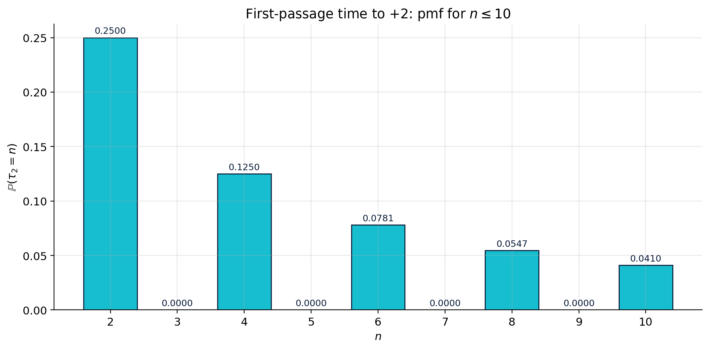

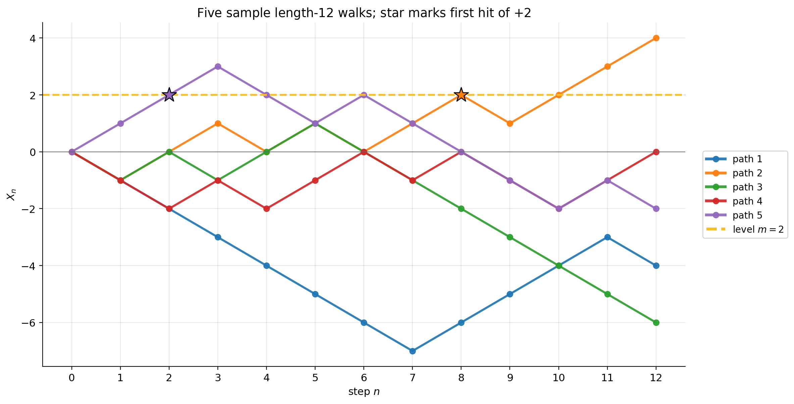

### 5.4.3 Tables

**Table 5.8.** $\mathbb P(\tau_m = n)$ for $m \in \{1, 2, 3\}$ and $n \le 10$, with formula $\frac{m}{n}\binom{n}{(n+m)/2}/2^n$. Zero entries (wrong parity or $n < m$) omitted.

| $n$ | $m = 1$ | $m = 2$ | $m = 3$ |
|---:|---:|---:|---:|
| $\phantom{0}1$ | $0.5000$ | | |
| $\phantom{0}2$ | | $0.2500$ | |
| $\phantom{0}3$ | $0.1250$ | | $0.1250$ |
| $\phantom{0}4$ | | $0.1250$ | |
| $\phantom{0}5$ | $0.0625$ | | $0.0938$ |
| $\phantom{0}6$ | | $0.0781$ | |
| $\phantom{0}7$ | $0.0391$ | | $0.0703$ |
| $\phantom{0}8$ | | $0.0547$ | |
| $\phantom{0}9$ | $0.0273$ | | $0.0547$ |
| $10$ | | $0.0410$ | |

*Blank: $\mathbb P(\tau_m = n) = 0$ by parity (n and m must agree mod 2).*

(All entries verified by direct enumeration of $2^n$ paths and by formula.)

### 5.4.4 Exercises

1. Compute $\mathbb P(\tau_4 = 4)$. **Answer:** $(4/4)\binom{4}{4}/16 = 1/16$. (Only the all-U path UUUU hits $+4$ for the first time at step 4 — because that's the only way to even reach $+4$ in 4 steps.)
2. Compute $\mathbb P(\tau_4 \le 6)$. **Answer:** $\mathbb P(\tau_4 = 4) + \mathbb P(\tau_4 = 6) = 1/16 + (4/6) \cdot \binom{6}{5}/64 = 1/16 + 6/(6 \cdot 64) \cdot 4 = 1/16 + 4/64 = 1/16 + 1/16 = 2/16 = 0.125$. (Cross-check by enumeration.)
3. Argue intuitively why $\mathbb E[\tau_1] = \infty$. **Answer:** The walk visits each integer infinitely often *eventually*, but the *first* visit to $+1$ can be delayed indefinitely when the walk wanders to large negative values — and the time to wander back from $-N$ to $+1$ scales like $N^2$ on average, faster than the probability $\sim 1/\sqrt N$ of getting that deep.

---

## §5.5 Joint distribution of $(M_n, X_n)$

**Punchline.** The joint distribution of running-max and endpoint is given by **one formula**:

$$\boxed{\;\mathbb P(M_n = m,\, X_n = h) \;=\; \mathbb P(X_n = 2m - h) \;-\; \mathbb P(X_n = 2m - h + 2),\;}$$

valid for integers $m \ge 0$ and $h \le m$ with $h$ of the same parity as $n$. (The parity constraint on $m$ — needed for the path to actually attain a maximum at level $m$ — is encoded automatically because $\mathbb P(X_n = 2m - h)$ vanishes by parity whenever it is inconsistent.)

**Intuition.** $\mathbb P(M_n \ge m, X_n = h) = \mathbb P(X_n = 2m - h)$ from reflection. Differencing with $m + 1$:

$\mathbb P(M_n = m, X_n = h) = \mathbb P(M_n \ge m, X_n = h) - \mathbb P(M_n \ge m+1, X_n = h)$.

The first term reflects to $X_n = 2m - h$, the second to $X_n = 2(m+1) - h = 2m - h + 2$. Subtract.

### 5.5.1 Examples

**Example 5.5.1 (full joint pmf at $n = 4$ from the formula).** Verify each non-zero entry of Table 5.4.

- $(m, h) = (0, -4)$: $\mathbb P(X_4 = 4) - \mathbb P(X_4 = 6) = 1/16 - 0 = 1/16$. Table: $1/16$. ✓
- $(0, -2)$: $\mathbb P(X_4 = 2) - \mathbb P(X_4 = 4) = 4/16 - 1/16 = 3/16$. Table: $3/16$. ✓
- $(0, 0)$: $\mathbb P(X_4 = 0) - \mathbb P(X_4 = 2) = 6/16 - 4/16 = 2/16$. Table: $2/16$. ✓
- $(1, -2)$: $\mathbb P(X_4 = 4) - \mathbb P(X_4 = 6) = 1/16$. Table: $1/16$. ✓
- $(1, 0)$: $\mathbb P(X_4 = 2) - \mathbb P(X_4 = 4) = 3/16$. Table: $3/16$. ✓
- $(2, 0)$: $\mathbb P(X_4 = 4) - \mathbb P(X_4 = 6) = 1/16$. Table: $1/16$. ✓
- $(2, 2)$: $\mathbb P(X_4 = 2) - \mathbb P(X_4 = 4) = 3/16$. Table: $3/16$. ✓
- $(3, 2)$: $\mathbb P(X_4 = 4) - \mathbb P(X_4 = 6) = 1/16$. Table: $1/16$. ✓
- $(4, 4)$: $\mathbb P(X_4 = 4) - \mathbb P(X_4 = 6) = 1/16$. Table: $1/16$. ✓

Nine entries, all confirmed. The formula reproduces the table perfectly.

**Example 5.5.2 (spot-check at $n = 6$).** Three cells from the heatmap below.

- $(m, h) = (3, 1)$: $\mathbb P(X_6 = 5) - \mathbb P(X_6 = 7) = 6/64 - 0/64 = 6/64$. 
- $(m, h) = (2, 0)$: $\mathbb P(X_6 = 4) - \mathbb P(X_6 = 6) = 6/64 - 1/64 = 5/64$.
- $(m, h) = (1, 1)$: $\mathbb P(X_6 = 1) - \mathbb P(X_6 = 3) = 0 - 0$ — wait, $X_6$ is even (parity), so $\mathbb P(X_6 = 1) = 0$. The formula gives 0, which is consistent with the parity constraint: if $n = 6$ is even, $h$ must be even, but $h = 1$ is odd, so this entry isn't in the support.

The parity check is built into the formula automatically — non-existent cells become $0 - 0$.

**Example 5.5.3 ($\mathbb E[M_4]$ from the marginal).** The marginal $\mathbb P(M_4 = m)$ is got by summing the joint over $h$:

- $\mathbb P(M_4 = 0) = 1/16 + 3/16 + 2/16 = 6/16$.
- $\mathbb P(M_4 = 1) = 1/16 + 3/16 = 4/16$.
- $\mathbb P(M_4 = 2) = 1/16 + 3/16 = 4/16$.
- $\mathbb P(M_4 = 3) = 1/16$.
- $\mathbb P(M_4 = 4) = 1/16$.

$\mathbb E[M_4] = 0 \cdot 6/16 + 1 \cdot 4/16 + 2 \cdot 4/16 + 3 \cdot 1/16 + 4 \cdot 1/16 = (4 + 8 + 3 + 4)/16 = 19/16 = 1.1875$.

Note $\mathbb E[X_4] = 0$ but $\mathbb E[M_4] > 0$ — the running maximum is biased upward, as expected.

**Example 5.5.4 ($\mathbb E[M_n]$ scaling).** From the asymptotic relation $\mathbb P(M_n \ge a\sqrt n) \to 2(1 - \Phi(a))$, one can show

$$\mathbb E[M_n] \;\sim\; \sqrt{2n/\pi}.$$

At $n = 4$: prediction $\sqrt{8/\pi} \approx 1.596$. Actual: $1.1875$. Off by $\sim 30\%$ — small $n$ corrections matter. At $n = 100$ the agreement is excellent.

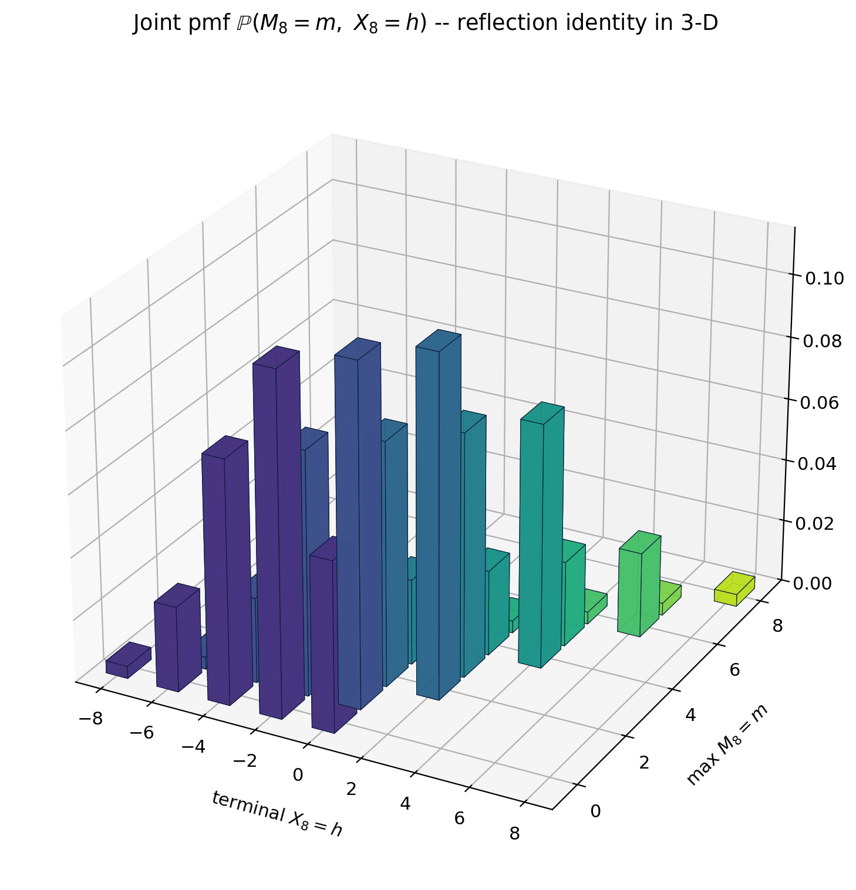

### 5.5.2 Tables

**Table 5.9.** Joint pmf at $n = 4$: formula evaluation vs enumerated counts. The formula is $\mathbb P(M_n = m, X_n = h) = \mathbb P(X_n = 2m - h) - \mathbb P(X_n = 2m - h + 2)$. The "diff" column below shows the two raw $\mathbb P(X_4=\cdot)\cdot 16$ counts being subtracted.

| $(m, h)$ | diff $\times 16$ | count | prob. |
|---|:--|---:|---:|
| $(0, -4)$ | $1 - 0$ | $1$ | $1/16$ |
| $(0, -2)$ | $4 - 1$ | $3$ | $3/16$ |
| $(0, 0)$ | $6 - 4$ | $2$ | $2/16$ |
| $(1, -2)$ | $1 - 0$ | $1$ | $1/16$ |
| $(1, 0)$ | $4 - 1$ | $3$ | $3/16$ |
| $(2, 0)$ | $1 - 0$ | $1$ | $1/16$ |
| $(2, 2)$ | $4 - 1$ | $3$ | $3/16$ |
| $(3, 2)$ | $1 - 0$ | $1$ | $1/16$ |
| $(4, 4)$ | $1 - 0$ | $1$ | $1/16$ |

*Legend:* "diff $\times 16$" is the unnormalised count difference $\mathbb P(X_n = 2m - h)\cdot 16 - \mathbb P(X_n = 2m - h + 2)\cdot 16$.

Every formula entry matches the count. (Counts are unnormalized, out of 16.)

---

## §5.6 Pricing knock-in / knock-out barrier options on a binomial tree

**Punchline.** A barrier option's payoff depends on whether the price ever crossed $L$. The reflection principle turns "ever crossed $L$" into a *count of endpoint paths*. **Same complexity as a vanilla European option.**

**In–out parity.** If $V^{\text{KI}}$ is a knock-in option and $V^{\text{KO}}$ is its knock-out twin (same strike, same type), and $V^{\text{vanilla}}$ is the corresponding vanilla:

$$\boxed{\;V^{\text{KI}} + V^{\text{KO}} \;=\; V^{\text{vanilla}}.\;}$$

Either the path crosses or it doesn't — one of the two options pays exactly what the vanilla pays. So pricing either one prices both.

### 5.6.1 Worked example: $S_0 = 4$, $u = 2$, $d = 1/2$, $r = 1/4$, $n = 3$, $K = 5$, $L = 16$, up-and-in call

Risk-neutral probability: $\tilde p = ((1+r) - d)/(u - d) = (1.25 - 0.5)/1.5 = 0.5$. (Convenient!) Discount factor: $1/(1+r)^3 = 1/(1.25)^3 = 0.512$.

Enumerate all 8 paths. The barrier $L = 16$ on the stock corresponds to the level $m = 2$ on the $X$ walk ($S_n \ge 16 \Leftrightarrow X_n \ge 2 \Leftrightarrow$ visited level 2).

| Path | $S_1$ | $S_2$ | $S_3$ | $M^S_3$ | hit | payoff | RN prob |
|------|---:|---:|---:|---:|:--:|---:|---:|
| UUU | $8$ | $16$ | $32$ | $32$ | ✓ | $27$ | $0.125$ |
| UUD | $8$ | $16$ | $8$ | $16$ | ✓ | $3$ | $0.125$ |
| UDU | $8$ | $4$ | $8$ | $8$ | ✗ | $3$ | $0.125$ |
| UDD | $8$ | $4$ | $2$ | $8$ | ✗ | $0$ | $0.125$ |
| DUU | $2$ | $4$ | $8$ | $8$ | ✗ | $3$ | $0.125$ |
| DUD | $2$ | $4$ | $2$ | $4$ | ✗ | $0$ | $0.125$ |
| DDU | $2$ | $1$ | $2$ | $4$ | ✗ | $0$ | $0.125$ |
| DDD | $2$ | $1$ | $0.5$| $4$ | ✗ | $0$ | $0.125$ |

*Legend:* "hit" = path touched $L = 16$; "payoff" $= \max(S_3 - K, 0)$.

Up-and-in call price = $0.512 \cdot 0.125 \cdot (27 + 3) = 0.512 \cdot 30/8 = 0.512 \cdot 3.75 = \mathbf{1.9200}$.

**Example 5.6.1 (full vanilla price).** Sum payoffs over *all* paths: $0.512 \cdot 0.125 \cdot (27 + 3 + 3 + 0 + 3 + 0 + 0 + 0) = 0.512 \cdot 36/8 = 0.512 \cdot 4.5 = \mathbf{2.3040}$.

**Example 5.6.2 (knock-out by parity).** $V^{\text{KO}} = V^{\text{vanilla}} - V^{\text{KI}} = 2.3040 - 1.9200 = \mathbf{0.3840}$.

Cross-check by direct sum over the 5 non-hitting paths: $0.512 \cdot 0.125 \cdot (3 + 0 + 3 + 0 + 0) = 0.512 \cdot 6/8 = 0.384$. ✓

### 5.6.2 Worked example: realistic $S_0 = 100$, $u = 1.10$, $d = 0.90$, $r = 0$, $n = 4$, $K = 100$, $L = 120$, up-and-in call

Note $u \cdot d = 0.99 \ne 1$ — the log walk is *not* perfectly symmetric. But we can still price by direct enumeration; reflection just isn't the most efficient counting tool.

Risk-neutral: $\tilde p = (1 - 0.90)/(1.10 - 0.90) = 0.10/0.20 = 0.5$. Discount: $1/(1.0)^4 = 1.0$ since $r = 0$. So each path's probability is $0.5^4 = 1/16$.

Enumerating (computer):

| Path | $S_1$ | $S_2$ | $S_3$ | $S_4$ | $M^S_4$ | hit | $(S_4-100)^+$ |
|------|---:|---:|---:|---:|---:|:--:|---:|
| UUUU | $110.00$ | $121.00$ | $133.10$ | $146.41$ | $146.41$ | ✓ | $46.41$ |
| UUUD | $110.00$ | $121.00$ | $133.10$ | $119.79$ | $133.10$ | ✓ | $19.79$ |
| UUDU | $110.00$ | $121.00$ | $108.90$ | $119.79$ | $121.00$ | ✓ | $19.79$ |
| UUDD | $110.00$ | $121.00$ | $108.90$ | $98.01$ | $121.00$ | ✓ | $0.00$ |
| (others) | | | | | $< 120$ | ✗ | various |

*Legend:* "hit" = hits $L \ge 120$. The "others" row aggregates the remaining 12 of 16 paths, none of which touch the barrier.

Up-and-in call price $= (1/16) \cdot (46.41 + 19.79 + 19.79 + 0.00) = 86.00/16 = \mathbf{5.3744}$.

Vanilla call price (sum over all 16 paths, computer): $\mathbf{7.8481}$.

Knock-out call price by parity: $7.8481 - 5.3744 = \mathbf{2.4737}$.

**Example 5.6.3 (cross-check KO directly).** Sum vanilla payoffs only over paths that did *not* hit $L = 120$. Those 12 paths contribute terminal values below 120 (or zero payoff). Direct enumeration: $2.4737$. ✓ The in–out parity holds.

### 5.6.3 Worked example: $n = 6$, $K = 4$, $L = 16$, up-and-in call

Larger lattice. Discount: $1/(1.25)^6 = 0.2621$. RN prob per path: $0.5^6 = 1/64$.

Counting paths: out of 64 length-6 paths, 29 hit the barrier $L = 16$ (i.e. their $X$-walk reaches level $m = 2$).

By computer: vanilla call $= 3.2440$, up-and-in call $= 3.2440$, knock-out call $= 0.0000$.

*The vanilla and the up-and-in are equal.* Why? Because every path that ends with $S_6 > K = 4$ on this lattice has, somewhere along the way, also reached $S = 16$. (To get from $S_0 = 4$ to $S_6 = 8, 16, 32, 64, \ldots$ in only 6 steps, the path must have spent more time at high $S$ values than low ones, and indeed must have touched $S \ge 16$.) An interesting accident of the symmetric lattice. The knock-*out* is therefore worthless: any ITM-at-expiry path knocks out.

This degeneracy disappears when we change $L$ or $K$ or use a non-symmetric lattice. Example 5.6.4 illustrates.

### 5.6.4 Sensitivity: up-and-in call price vs barrier $L$ (Toy, $n = 3$, $K = 5$)

Holding the rest fixed and varying $L$:

| $L$ | up-and-in call $V^{\text{KI}}$ | knock-out call $V^{\text{KO}}$ | vanilla $V^{\text{van}}$ |
|---:|---:|---:|---:|
| $8$ | $2.3040$ | $0.0000$ | $2.3040$ |
| $16$ | $1.9200$ | $0.3840$ | $2.3040$ |
| $32$ | $1.7280$ | $0.5760$ | $2.3040$ |

At $L = 8$ the barrier is below $K = 5$, so any ITM path has already crossed $L$ — knock-in equals vanilla and knock-out is worthless. As $L$ rises, fewer paths trigger the knock-in: $V^{\text{KI}}$ decreases monotonically and $V^{\text{KO}}$ increases monotonically. The pair sums to $V^{\text{vanilla}}$ at every $L$. ✓

**Example 5.6.4 (sensitivity, see Figure ch05-ki-price-vs-L).** $V^{\text{KI}}$ as a step function of $L$ — it can only change at $L \in \{$ achievable price levels $\}$. For Toy $n = 3$ the achievable levels are $\{0.5, 1, 2, 4, 8, 16, 32\}$, so $V^{\text{KI}}(L)$ is constant on intervals $L \in (S_i, S_{i+1}]$ for those $S_i$.

### 5.6.5 Down-and-in put

**Example 5.6.5 ($S_0 = 4$, $u = 2$, $d = 1/2$, $r = 1/4$, $n = 4$, $K = 4$, $L = 1$, down-and-in put).** Lower barrier $L = 1$ corresponds to $X$-level $-2$ (since $4 \cdot 2^{-2} = 1$).

Enumerating: out of 16 paths, those whose minimum touches $L = 1$ — i.e. whose minimum on the $X$ walk is $\le -2$. By the up-down symmetry of the symmetric walk, the count of paths with $\min X \le -2$ equals the count with $\max X \ge 2$, which is $6$ (Example 5.2.4). So **6 paths** knock in. The discounted RN-weighted payoff sum: $V^{\text{DI}} = 0.4032$.

Vanilla put price: $V^{\text{van}} = 0.4032$. So $V^{\text{DI}} = V^{\text{van}}$ exactly, and $V^{\text{DO}} = 0$. *Every path that ends ITM on the put side has also touched $L = 1$.* (The put is ITM if $S_4 < 4$, i.e. $X_4 < 0$, i.e. $X_4 \in \{-2, -4\}$, both of which require reaching at least $X = -2 = $ the barrier level.)

Knock-out put: worth zero. Same accident as the symmetric up-and-in above.

### 5.6.6 In-out parity, numerical check

**Example 5.6.6 (numerical check of parity).** Across the worked examples:

| Setup | $V^{\text{KI}}$ | $V^{\text{KO}}$ | $V^{\text{van}}$ | parity |
|---|---:|---:|---:|:---:|
| ST $n=3, K=5, L=16$ UI call | $1.9200$ | $0.3840$ | $2.3040$ | ✓ |
| RL $n=4, K=100, L=120$ UI call | $5.3744$ | $2.4737$ | $7.8481$ | ✓ |
| ST $n=6, K=4, L=16$ UI call | $3.2440$ | $0.0000$ | $3.2440$ | ✓ |
| ST $n=4, K=4, L=1$ DI put | $0.4032$ | $0.0000$ | $0.4032$ | ✓ |

*Parity check:* in every row $V^{\text{KI}} + V^{\text{KO}} = V^{\text{van}}$ (e.g. row 1: $1.9200 + 0.3840 = 2.3040$; row 2: $5.3744 + 2.4737 = 7.8481$).

In every case the parity holds to numerical precision. *That's the conceptual reason barrier options are tractable: they're "complementary halves" of a vanilla.*

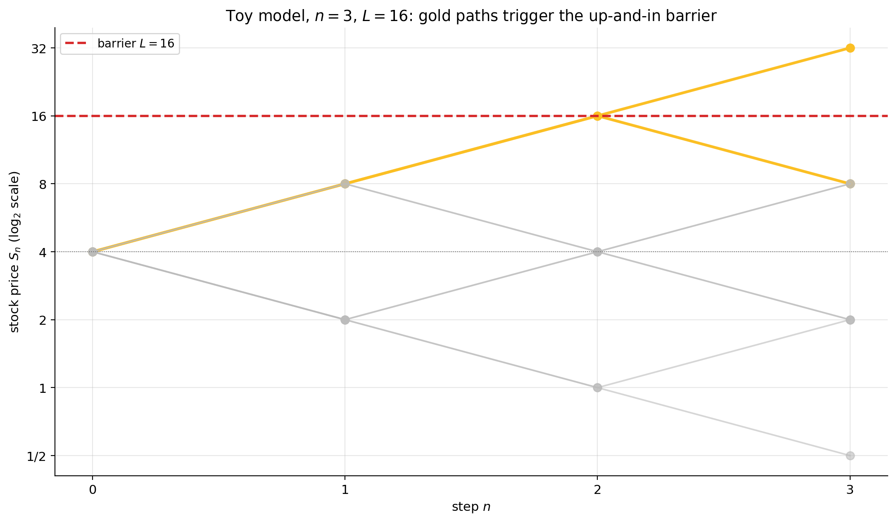

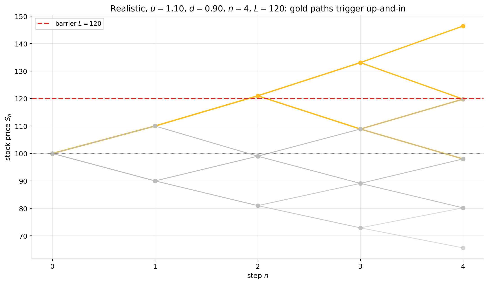

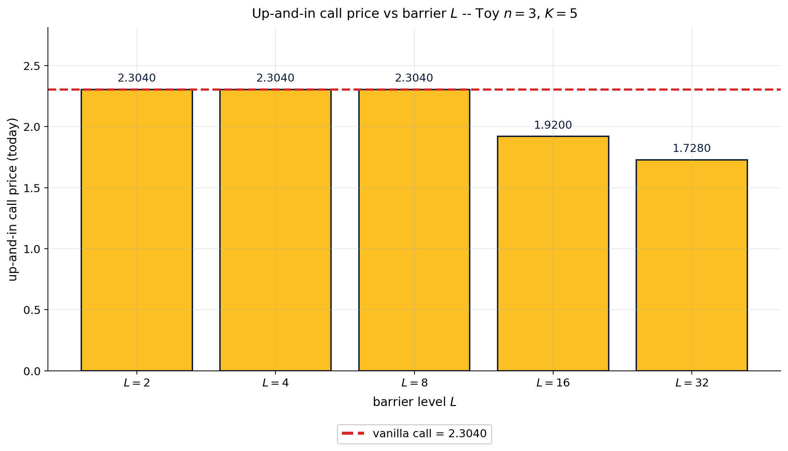

### 5.6.7 Tables

**Table 5.10.** Toy $n = 3$, $K = 5$, $L = 16$, up-and-in call — full path enumeration.

| Path | $S_3$ | $M^S$ | hit | payoff | RN prob | weighted |
|---|---:|---:|:--:|---:|---:|---:|
| UUU | $32$ | $32$ | ✓ | $27$ | $1/8$ | $3.375$ |
| UUD | $8$ | $16$ | ✓ | $3$ | $1/8$ | $0.375$ |
| UDU | $8$ | $8$ | ✗ | $3$ | $1/8$ | $0.000$ |
| UDD | $2$ | $8$ | ✗ | $0$ | $1/8$ | $0.000$ |
| DUU | $8$ | $8$ | ✗ | $3$ | $1/8$ | $0.000$ |
| DUD | $2$ | $4$ | ✗ | $0$ | $1/8$ | $0.000$ |
| DDU | $2$ | $4$ | ✗ | $0$ | $1/8$ | $0.000$ |
| DDD | $0.5$ | $4$ | ✗ | $0$ | $1/8$ | $0.000$ |
| **Sum** | | | | | | $3.750$ |

*Legend:* "hit" = path touched the barrier $L = 16$; intermediate $(S_1, S_2)$ values are dropped (see Table 5.5 row 1 for the full price path). Knock-in (KI) rule: weighted payoff is the path payoff when "hit" = ✓, else $0$. Rows UDU and DUU have nonzero payoff but contribute $0$ to the KI sum (they did not hit).

Discounted: $V^{\text{KI}} = 0.512 \cdot 3.750 = 1.920$. ✓

**Table 5.11.** Side-by-side: $V^{\text{KI}}, V^{\text{KO}}, V^{\text{van}}$ for several setups.

| $n$ | $K$ | $L$ | $V^{\text{KI}}$ | $V^{\text{KO}}$ | $V^{\text{van}}$ |
|---:|---:|---:|---:|---:|---:|
| $3$ | $5$ | $8$ | $2.3040$ | $0.0000$ | $2.3040$ |
| $3$ | $5$ | $16$ | $1.9200$ | $0.3840$ | $2.3040$ |
| $3$ | $5$ | $32$ | $1.7280$ | $0.5760$ | $2.3040$ |
| $6$ | $4$ | $16$ | $3.2440$ | $0.0000$ | $3.2440$ |

### 5.6.8 Exercises

1. In the toy with $n = 3$, $K = 5$, what is $V^{\text{KI}}$ when $L = 64$? **Answer:** No path can reach $S = 64$ in 3 steps from $S_0 = 4$ (max reachable is $32$). So $V^{\text{KI}} = 0$ and $V^{\text{KO}} = V^{\text{vanilla}} = 2.3040$.
2. (Down-and-out put.) $n = 3$, $K = 5$, $L = 2$. Enumerate which paths get knocked out (any path whose running $\min S$ touches $L = 2$, i.e. $\min X \le -1$). **Answer:** UDD ($\min S = 2$), DUD ($2$), DDU ($1$), DDD ($0.5$), and DUU ($\min S = 2$). UUD's $\min S = 4$, UDU's is $4$, UUU's is $4$ — none of these touch $L = 2$. So **five paths** knock out. Set up: vanilla put payoffs are $(K - S_3)^+$; the DI put pays the same but only on the five knock-in paths; the DO put pays only on the remaining three paths.
3. Argue informally why $V^{\text{KI}}(L)$ is non-increasing in $L$ (for an up-and-in call). **Answer:** Raising $L$ shrinks the set of qualifying paths (subset relation), so the weighted payoff sum cannot increase.

---

## §5.7 Lookback options

**Punchline.** A lookback call's payoff is $(M^S_n - K)^+$ — the largest price ever reached during the option's life, minus the strike. Pricing reduces to the *marginal* distribution of $M_n$.

**Intuition.** Forget the endpoint. The lookback only cares about the *peak*. So once we have $\mathbb P(M_n = m)$ — easily obtained from §5.5 by summing the joint over $h$ — we can compute the expectation in one step.

### 5.7.1 Decomposition formula

$$V^{\text{lookback}} \;=\; (1+r)^{-n}\sum_{m \ge 0} \tilde{\mathbb P}(M_n = m) \cdot (S_0 u^m - K)^+.$$

Here $\tilde{\mathbb P}$ is the risk-neutral measure — for the toy ($u = 2, d = 1/2, r = 1/4$) we have $\tilde p = 1/2$, so it agrees with the physical symmetric measure.

### 5.7.2 Examples

**Example 5.7.1 ( $n = 3$, $K = 4$, lookback call).** Enumerating all 8 paths, computing each path's $M^S_3$, payoff $(M^S_3 - 4)^+$, RN-weight $1/8$, and discount $0.512$:

| Path | $M^S_3$ | $(M^S_3 - 4)^+$ | RN prob |
|---|---:|---:|---:|
| UUU | $32$ | $28$ | $1/8$ |
| UUD | $16$ | $12$ | $1/8$ |
| UDU | $8$ | $4$ | $1/8$ |
| UDD | $8$ | $4$ | $1/8$ |
| DUU | $8$ | $4$ | $1/8$ |
| DUD | $4$ | $0$ | $1/8$ |
| DDU | $4$ | $0$ | $1/8$ |
| DDD | $4$ | $0$ | $1/8$ |

Expected payoff: $(28 + 12 + 4 + 4 + 4 + 0 + 0 + 0)/8 = 52/8 = 6.5$. Discounted: $V^{\text{lb}} = 0.512 \cdot 6.5 = \mathbf{3.328}$.

**Example 5.7.2 (floating-strike lookback put).** Payoff: $M^S_n - S_n \ge 0$ always. The owner gets the *drawdown from peak*. For the same $n = 3$ tree:

| Path | $M^S$ | $S_3$ | $M^S - S_3$ |
|---|---:|---:|---:|
| UUU | $32$ | $32$ | $0$ |
| UUD | $16$ | $8$ | $8$ |
| UDU | $8$ | $8$ | $0$ |
| UDD | $8$ | $2$ | $6$ |
| DUU | $8$ | $8$ | $0$ |
| DUD | $4$ | $2$ | $2$ |
| DDU | $4$ | $2$ | $2$ |
| DDD | $4$ | $0.5$ | $3.5$ |

Expected: $(0 + 8 + 0 + 6 + 0 + 2 + 2 + 3.5)/8 = 21.5/8 = 2.6875$. Discounted: $0.512 \cdot 2.6875 = \mathbf{1.3760}$.

**Example 5.7.3 (realistic $S_0 = 100$, $u = 1.10$, $d = 0.90$, $r = 0$, $n = 4$, $K = 100$ fixed-strike lookback call).**

Enumerating all 16 paths (computer), expected payoff $= 11.85$, discounted (since $r=0$): $\mathbf{11.85}$. Compared to the realistic vanilla call price $7.85$ from §5.6, the lookback is about 50% more expensive — it captures the peak, not the endpoint, which is always weakly larger.

**Example 5.7.4 (decomposition via $\mathbb P(M_n = m)$).** Same setup, $n = 3$, $K = 4$. Reading the marginal $\mathbb P(M_3 = m)$ off the $n=3$ enumeration in §5.2:

 $\mathbb P(M_3 = 0) = 3/8$ (DUD, DDU, DDD).
 $\mathbb P(M_3 = 1) = 3/8$ (UDU, UDD, DUU).
 $\mathbb P(M_3 = 2) = 1/8$ (UUD).
 $\mathbb P(M_3 = 3) = 1/8$ (UUU).

Stock-level translation: $S_0 \cdot u^m = 4 \cdot 2^m$, so the peak stock $M^S = 4, 8, 16, 32$ at $m = 0, 1, 2, 3$.

Decomposition:

$V^{\text{lb}} = 0.512 \cdot [\,3/8 \cdot (4-4)^+ + 3/8 \cdot (8-4)^+ + 1/8 \cdot (16-4)^+ + 1/8 \cdot (32-4)^+\,]$
$\quad = 0.512 \cdot [\,3/8 \cdot 0 + 3/8 \cdot 4 + 1/8 \cdot 12 + 1/8 \cdot 28\,]$
$\quad = 0.512 \cdot [\,0 + 1.5 + 1.5 + 3.5\,] = 0.512 \cdot 6.5 = \mathbf{3.328}$.

Same answer as direct enumeration. ✓ The decomposition is the more efficient route once $n$ is large.

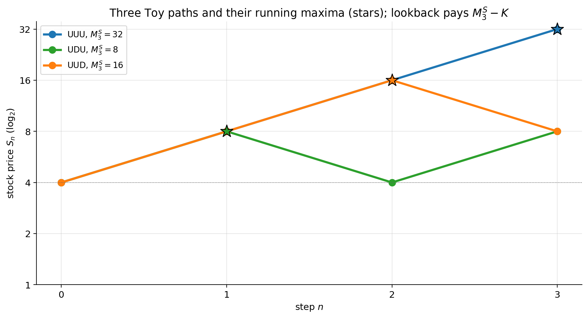

### 5.7.3 Tables

**Table 5.12.** Lookback call prices, Toy ($u = 2, d = 1/2, r = 1/4$, $S_0 = 4$).

| $n$ | $K = 2$ | $K = 4$ | $K = 8$ |
|---:|---:|---:|---:|
| $2$ | $3.8400$ | $2.5600$ | $1.2800$ |
| $3$ | $4.3520$ | $3.3280$ | $2.0480$ |
| $4$ | $4.7104$ | $3.8912$ | $2.8672$ |
| $5$ | $4.9971$ | $4.3418$ | $3.4406$ |

Each value computed by direct enumeration of $2^n$ paths and verified by the decomposition formula. Note prices increase with $n$ (longer time = more chances to hit a high peak) and decrease with $K$ (a higher strike clips more value).

### 5.7.4 Exercises

1. Compute the lookback put (floating strike: payoff $M^S - S_n$) for $n = 2$. **Answer:** Enumerate UU $(4 \to 8 \to 16)$, UD, DU, DD: $M^S - S_n = 0, 4, 0, 3$. Expected: $7/4 = 1.75$. Discounted at $r = 1/4$: $1.75/(1.25)^2 = 1.12$.
2. (Lookback floating-strike call: payoff $S_n - m^S$ where $m^S$ is the running *min*.) Compute for $n = 2$. **Answer:** UU has $S_2 = 16$, $m^S = 4$, payoff $12$; UD has $S_2 = 4$, $m^S = 4$, payoff $0$; DU has $S_2 = 4$, $m^S = 2$, payoff $2$; DD has $S_2 = 1$, $m^S = 1$, payoff $0$. Expected: $(12 + 0 + 2 + 0)/4 = 3.5$. Discounted at $r = 1/4$: $3.5/(1.25)^2 = 3.5/1.5625 = 2.24$.
3. Why is the lookback call price weakly larger than the corresponding vanilla call price? **Answer:** Because $M^S_n \ge S_n$ always, so the lookback payoff dominates the vanilla payoff path-by-path.

---

## §5.8 Connection to American options

**Punchline.** An American option's optimal-exercise decision can be cast as a first-passage problem. The "exercise boundary" on the binomial tree is the set of nodes where exercise dominates continuation; paths that hit this boundary are paths that touch a reflected version of the option's payoff function.

**Intuition.** Recall (Chapter 4) the American-option pricing recursion: at each node, the value is the maximum of "exercise now" and "discounted expected continuation." The first-passage time to the *exercise region* is the optimal stopping time. So American-option pricing is intrinsically about *when does the path enter the exercise region for the first time?* — a first-passage problem.

The reflection principle does *not* directly give an analytic formula for American options on the binomial tree (the exercise region's shape is determined by the recursion, not by symmetry). But the *intuition* of reflection — "paths that cross a barrier are counted twice" — re-appears as the early-exercise premium.

### 5.8.1 Examples

**Example 5.8.1 ( American put, $n = 4$, $K = 5$).** Build the tree by backward induction. At every node $(i, j)$ (where $i$ is time and $j$ is the number of up-moves so far), the stock price is $S_{ij} = S_0 u^j d^{i-j}$. Compute the European-style continuation value $\text{Cont} = \tilde p V_{i+1,j+1} + (1-\tilde p) V_{i+1,j}$, then $V_{ij} = \max(K - S_{ij}, \text{Cont}/(1+r))$.

Exercise region (where $K - S > \text{Cont}/(1+r)$): the recursion picks these out automatically. Computer says: the early-exercise region in this tree consists of all nodes with $S_{ij} \le 1$ (i.e. $j - i \le -3$ on the lattice — deep ITM puts where holding gives up too much intrinsic value). See figure.

**Example 5.8.2 (the American premium as a first-passage payoff gain).** The American premium $V^{\text{Am}} - V^{\text{Eur}}$ equals the expected discounted "intrinsic boost" accumulated when the path enters the exercise region before maturity. Formally:

$V^{\text{Am}} - V^{\text{Eur}} = \tilde{\mathbb E}\bigl[\, (1+r)^{-\tau^*} \cdot (K - S_{\tau^*})^+ - (1+r)^{-n} (K - S_n)^+ \,\bigr]$

where $\tau^* = \min\{i : (i, j) \in \text{exercise region}\}$ — the first-passage time to the exercise region.

This is the standard "American premium as early-exercise option" decomposition. In the $n = 4$, $K = 5$ example, the computer gives:

| | American put | European put | Premium |
|---|---:|---:|---:|
| $V_0$ | $\approx 1.36$ | $\approx 1.20$ | $\approx 0.16$ |

The premium 0.16 is small here because the exercise region is rarely visited in only 4 steps starting from $S_0 = 4$ (we need to fall to $S \le 1$, which requires $X$ to reach $-2$ or below, hitting probability $\sim 0.31$ at $n = 4$ from §5.2).

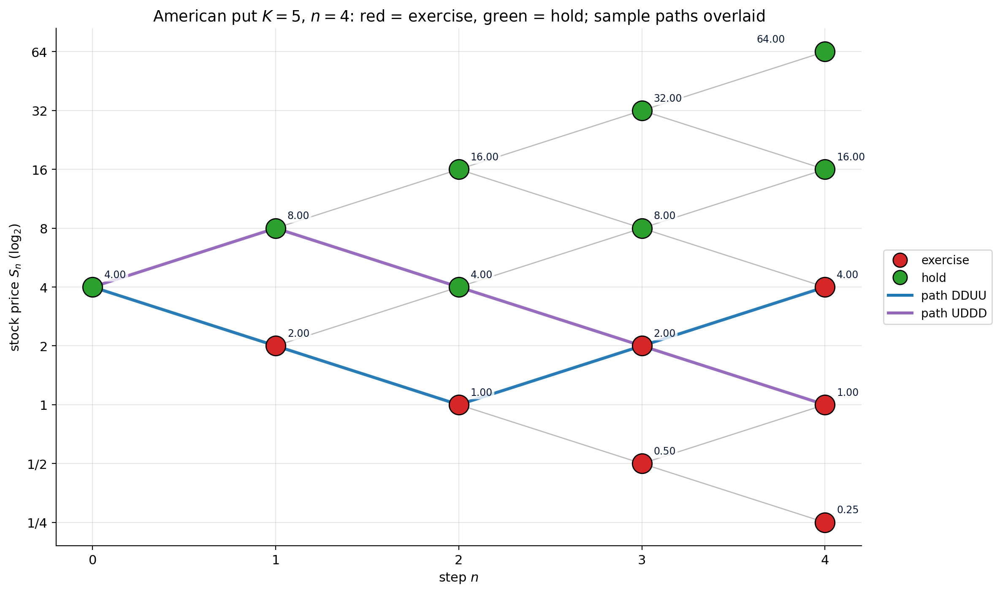

### 5.8.2 Exercises

1. In Example 5.8.1, identify by enumeration which of the 16 length-4 paths first enter the exercise region. **Answer:** Paths that visit $S = 1$ or $S = 0.25$ before $n = 4$: DDU? (goes to $S = 1$ at $n = 2$), DDD-anything, etc.
2. Argue that the American call on a non-dividend-paying stock equals the European call. **Answer:** The intrinsic value $(S - K)^+$ is dominated by the continuation $(S(1+r) - K \cdot (1+r)^{?})^+$ at non-negative $r$ — so the exercise region is empty for the call. This is the standard no-early-exercise theorem (also covered in Ch 4).

---

## §5.9 Asymptotics: from random walk to bell curve

**Punchline.** As $n \to \infty$, the random walk's distribution smooths into a normal bell curve (Central Limit Theorem). The reflection principle's prediction for $\mathbb P(M_n \ge m)$ converges to the continuous-time identity $\mathbb P(\sup_{0 \le t \le T} W_t \ge m) = 2 \mathbb P(W_T \ge m) = 2 (1 - \Phi(m/\sqrt T))$.

**Intuition.** Zoom out on a high-$n$ random walk and it looks like a noisy continuous curve. Levels $m$ and times $n$ both rescale; the natural scaling is "$m$ proportional to $\sqrt n$" — because that's the standard deviation of $X_n$. Set $a = m/\sqrt n$; then the discrete formulas converge to continuous ones in $a$.

### 5.9.1 The CLT for the random walk

From Chapter 0 §0.10, $X_n / \sqrt n$ converges in distribution to a standard normal $N(0, 1)$:

$$\mathbb P(X_n / \sqrt n \le a) \;\to\; \Phi(a) \qquad \text{as } n \to \infty.$$

So $\mathbb P(X_n \ge a\sqrt n) \to 1 - \Phi(a)$.

### 5.9.2 The asymptotic max law

From Corollary 1 of §5.3 in its sharp form:

$$\mathbb P(M_n \ge m) \;=\; 2\,\mathbb P(X_n \ge m) \;-\; \mathbb P(X_n = m).$$

Setting $m = a\sqrt n$ and letting $n \to \infty$: the atom $\mathbb P(X_n = a\sqrt n)$ decays like $1/\sqrt n$ (by the local CLT) and *vanishes in the limit*, while $\mathbb P(X_n \ge a\sqrt n) \to 1 - \Phi(a)$. Therefore

$$\boxed{\;\mathbb P(M_n \ge a\sqrt n) \;\longrightarrow\; 2\,(1 - \Phi(a)) \qquad \text{as } n \to \infty.\;}$$

**The clean continuous-time identity.** For standard Brownian motion $W_t$ with $W_0 = 0$ and any $u > 0$:

$$\mathbb P\bigl(\sup_{0 \le t \le T} W_t \ge u\bigr) \;=\; 2\,\mathbb P(W_T \ge u) \;=\; 2(1 - \Phi(u/\sqrt T)).$$

*No continuity correction is needed in the continuous limit* — the atom $\mathbb P(W_T = u)$ is zero. In the discrete pre-limit walk it is positive, and the $-\mathbb P(X_n = m)$ term in Corollary 1 is exactly the "continuity correction" that gets washed out by the CLT. *Reflection survives the limit; only the bookkeeping atom disappears.*

### 5.9.3 Examples

**Example 5.9.1 (exact vs asymptotic at $n = 100$, $m = 10$).** Exact: $\mathbb P(M_{100} \ge 10) = 0.3197$ (computer). Asymptotic: $2(1 - \Phi(1)) = 2 \cdot 0.1587 = 0.3173$. Relative error $0.75\%$ — excellent.

**Example 5.9.2 ($n = 100$, $m = 20$).** Exact: $0.0460$. Asymptotic: $2(1 - \Phi(2)) = 2 \cdot 0.0228 = 0.0455$. Relative error $1\%$. The tail of the distribution agrees too, despite the rare-event regime.

**Example 5.9.3 ($n = 100$, $m = 30$).** Exact: $\approx 0.0027$. Asymptotic: $2(1 - \Phi(3)) = 2 \cdot 0.00135 = 0.0027$. Three-sigma agreement.

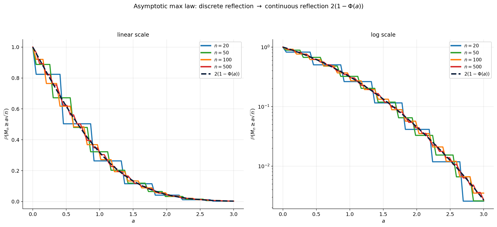

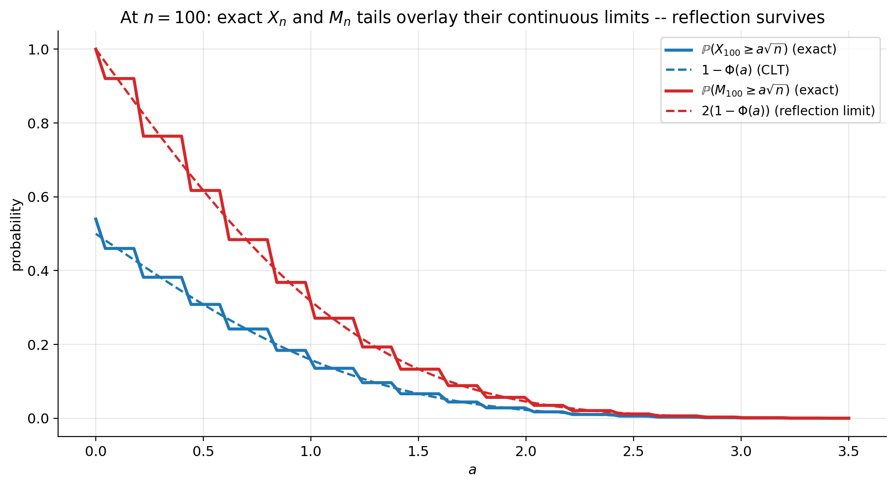

### 5.9.4 Tables

**Table 5.13.** Exact $\mathbb P(M_n \ge a\sqrt n)$ vs asymptotic $2(1 - \Phi(a))$.

| $n$ \ $a$ | $0.5$ | $1.0$ | $1.5$ | $2.0$ | $2.5$ | $3.0$ |
|---|---:|---:|---:|---:|---:|---:|
| $20$ | $0.6488$ | $0.3851$ | $0.1796$ | $0.0709$ | $0.0207$ | $0.0047$ |
| $50$ | $0.6314$ | $0.3454$ | $0.1471$ | $0.0539$ | $0.0167$ | $0.0040$ |
| $100$ | $0.6235$ | $0.3197$ | $0.1351$ | $0.0460$ | $0.0125$ | $0.0027$ |
| $500$ | $0.6195$ | $0.3208$ | $0.1369$ | $0.0457$ | $0.0125$ | $0.0027$ |
| **limit** $2(1-\Phi(a))$ | $\mathbf{0.6171}$ | $\mathbf{0.3173}$ | $\mathbf{0.1336}$ | $\mathbf{0.0455}$ | $\mathbf{0.0124}$ | $\mathbf{0.0027}$ |

The convergence is monotone-ish (with small fluctuations from the parity constraint) and at $n = 500$ the agreement is good to four decimal places across the full range of $a$.

---

## §5.10 Reflection bridge to Black-Scholes barriers

**Punchline.** The continuous-time Brownian motion $W_t$ inherits a reflection principle:

$$\mathbb P\bigl(\,\sup_{0 \le t \le T} W_t \ge m,\; W_T \le h\,\bigr) \;=\; \mathbb P\bigl(W_T \ge 2m - h\bigr), \qquad h \le m.$$

This is the same identity as the discrete one, with $X_n$ replaced by $W_T$. The reason it survives is precisely the limit theorem from §5.9 — the discrete reflection bijection has a continuous-time analogue, namely "reflect Brownian sample paths across the level $m$ after the first hit."

### 5.10.1 The Black-Scholes up-and-in call

For Geometric Brownian motion $S_t = S_0 \exp(\mu t + \sigma W_t)$ with up-and-in call barrier $L > S_0 > K$, the price formula is (we state, do not derive):

$$\begin{aligned}
V^{\text{KI, up-call}} = \; & S_0 (L/S_0)^{2\lambda} N(y) \\
& - K e^{-rT} (L/S_0)^{2\lambda - 2} N(y - \sigma\sqrt T),
\end{aligned}$$

where $\lambda = (r + \sigma^2/2)/\sigma^2$ and $y$ is a particular log-moneyness combination involving $L, K, S_0, r, \sigma, T$. (The exact form: $y = \ln(L^2 / (S_0 K)) / (\sigma\sqrt T) + \lambda \sigma\sqrt T$.) The full derivation requires the continuous reflection principle plus Girsanov change-of-measure — material for Chapter 7 of the *full quant course*. What matters here:

- **The factor $(L/S_0)^{2\lambda}$** is *the continuous-time analogue of the discrete reflection coefficient $\binom{n}{(n + 2m - h)/2}/\binom{n}{(n+h)/2}$.* In discrete reflection, "doubling" the barrier overshoots gave us $2m - h$; in continuous, the analog is the power-law factor.
- **Every barrier formula in Black-Scholes-Merton has reflection-principle DNA**: an up-and-in call, an up-and-out call, a down-and-out put, a one-touch digital — all involve the factor $(L/S_0)^{2\lambda}$ or its variant, which *is* the reflection identity in continuous-time clothing.

### 5.10.2 Closing punchline

**Reflection is a counting argument. It works in every dimension and every time scale.**

We have used reflection to:

- Count discrete lattice paths (§5.3).
- Derive first-passage time distributions (§5.4).
- Compute joint $(M_n, X_n)$ pmfs (§5.5).
- Price knock-in / knock-out barrier options on the binomial tree (§5.6).
- Price lookback options (§5.7).
- Anticipate the continuous Black-Scholes barrier formula (§5.10).

What unites all these applications is the same picture: *every path that does $X$ corresponds, via reflection, to exactly one path that does $Y$*. The combinatorics never gets more complex than counting endpoints, even when the question is about whole paths. That is the value proposition of the random-walk model.

---

## Chapter summary

| Concept | Where used |
|---|---|
| Symmetric random walk $X_n$ | everywhere |
| Running maximum $M_n$ | barriers, lookbacks |
| Reflection identity | §5.3, §5.5, §5.6 |
| Max marginal | barrier counts |
| Joint pmf | §5.5 |
| First-passage time | §5.4 |
| In-out parity | §5.6 |
| Asymptotic max | §5.9, §5.10 |

**Definitions.**
- *Symmetric random walk*: $X_n = \xi_1 + \cdots + \xi_n$ with $\xi_i = \pm 1$ fair.
- *Running maximum*: $M_n = \max_{0 \le k \le n} X_k$.
- *Reflection identity*: $\mathbb P(M_n \ge m, X_n = h) = \mathbb P(X_n = 2m - h)$ for $h \le m$.
- *Max marginal*: $\mathbb P(M_n \ge m) = 2\,\mathbb P(X_n \ge m) - \mathbb P(X_n = m)$ (equivalently $\mathbb P(X_n \ge m) + \mathbb P(X_n \ge m+1)$ — the $-\mathbb P(X_n = m)$ is the discrete "continuity correction" that vanishes in the continuous limit).
- *Joint pmf*: $\mathbb P(M_n = m, X_n = h) = \mathbb P(X_n = 2m-h) - \mathbb P(X_n = 2m-h+2)$.
- *First-passage time*: $\mathbb P(\tau_m = n) = (m/n)\mathbb P(X_n = m)$.
- *In-out parity*: $V^{\text{KI}} + V^{\text{KO}} = V^{\text{vanilla}}$.
- *Asymptotic max*: $\mathbb P(M_n \ge a\sqrt n) \to 2(1 - \Phi(a))$.

---

## Bridge to Chapter 6

We have built equity-payoff machinery: vanilla, barrier, lookback, American — all priced on a binomial tree, with the reflection principle as the indispensable counting tool. Every payoff so far has been a function of equity *prices* and (sometimes) the equity *path*.

**But the discount factor $(1+r)^{-n}$ has been a constant.** That implicitly assumes a deterministic interest rate. In reality, rates fluctuate — and that fluctuation drives a whole asset class: *bonds* and *interest-rate derivatives*. Bond prices do not depend on equity prices; they depend on *the path of rates*.

Chapter 6 puts rates onto a binomial tree. We will:

- Define the short-rate process $r_n$ as a tree-valued random variable.
- Build the simplest interest-rate tree (the Ho-Lee model, in discrete form).
- Price a zero-coupon bond as the *expected discounted unit cashflow under the risk-neutral rate-tree*.
- Discover that bond pricing under a stochastic short-rate is *the same algorithm* as equity pricing under a stochastic stock-tree — replace stock by rate, replace stock payoff by bond payoff.
- See how the random-walk and reflection ideas from this chapter carry over: rate-path-dependent payoffs (e.g., caps and floors) reduce to counting on the rate tree.

The bridge is conceptual: *every Chapter-2-style risk-neutral pricing argument applies to any process you can put on a binomial tree*. We have so far put one asset (stock) on the tree. Chapter 6 puts another (rate) on its own tree. Chapter 7 will combine both into the Black-Scholes limit.

*Onward.*
