# Chapter 6 — Interest-Rate-Dependent Securities on a Binomial Tree

## How this chapter works

Up to this point the underlying random object in every tree was a *stock*: a price that went up by a factor $u$ or down by a factor $d$. Everything that mattered was driven by that one price, and the discount factor $(1+r)^{-1}$ was a constant we slipped in without much comment.

This chapter swaps the underlying. The random object is now a **short rate** $r_n$ — the one-period interest rate at node $n$. It still lives on a binomial tree, but now every pricing identity in Chapters 1-5 needs the discount factor to move *with* the tree. The big payoff: we get zero-coupon bonds, yield curves, forward rates, caplets, caps, floors, bond options, swaps, and a first taste of calibration — all without a single calculus operation.

I'll use two running toys throughout the chapter, the same two we'll re-use in Chapter 7's calibration drills:

- **Toy-A** (numbered, big moves): $r_0 = 0.25$, $u = 2$, $d = 0.5$, $\tilde p = 1/2$.
- **Realistic-B** (closer to market rates): $r_0 = 5\%$, $u = 1.25$, $d = 0.8$, $\tilde p = 1/2$.

Toy-A makes the arithmetic ugly enough to *see* that something nontrivial is happening. Realistic-B makes the prices look like prices a desk would quote. Every section computes both.

The shape of every section is the same shape as Chapters 0-5: **punchline**, **intuition** callout, definitions, numbered numbered examples, figures, tables, exercises with answers.

---

## §6.1 The short-rate binomial tree

**Punchline.** Build a binomial tree whose nodes are *interest rates*, not stock prices. The one-period rate at node $n$, call it $r_n$, multiplies up by $u_n$ on heads and down by $d_n$ on tails. The money-market account $M_n$ rolls forward by $(1 + r_n)$, but the crucial new wrinkle is that the discount factor is *path-dependent*: rolling \$1 forward from $0$ to $T$ no longer gives the same number on every path.

**Intuition.** In Chapter 2 the stock multiplied by $u$ or $d$ at each step. Replace the stock with the short rate and the same machinery describes how *rates* evolve. The catch: the short rate at $n$ tells you what \$1 grows to between $n$ and $n+1$. So the multiplier between $0$ and $T$ is the *product* of $(1 + r_k)$ along whichever path you walked, and different paths land at the same place by different multipliers. That is the entire new idea of this chapter.

### 6.1.1 Definitions

Fix a probability space generated by $T$ coin tosses, exactly as in Chapter 1. Let $\omega = \omega_1 \omega_2 \cdots \omega_T$ be a path with $\omega_k \in \{H, T\}$.

**Short rate at $n$.** The random variable $r_n(\omega)$ depends only on $\omega_1, \ldots, \omega_n$ — that is, $r_n$ is **adapted** to the natural filtration. In words: you know $r_n$ once you have seen the first $n$ coin tosses, and not before.

**Recursion.** Given $r_n$, the next step is

$$r_{n+1} \;=\; \begin{cases} u_n \, r_n & \text{on heads,} \\ d_n \, r_n & \text{on tails,} \end{cases}$$

with risk-neutral probabilities $\tilde p$ and $\tilde q = 1 - \tilde p$. We'll allow $u_n, d_n$ to depend on $n$ for §6.12; everywhere else they are constants $u, d$.

**Money-market account.** Start with $M_0 = 1$. Then

$$M_{n+1} \;=\; (1 + r_n)\, M_n, \qquad M_n \;=\; \prod_{k=0}^{n-1}(1 + r_k).$$

Notice $M_n$ is **predictable**: $M_n$ depends only on $r_0, \ldots, r_{n-1}$, so it is known at time $n-1$. That asymmetry — $r_n$ is adapted at $n$, but $M_n$ is known one step earlier — is the cleanest one-line definition of "the short rate is the rate *over* the period that *starts* at $n$."

**Path discount factor.** Define

$$D_n(\omega) \;=\; \frac{1}{M_n(\omega)} \;=\; \prod_{k=0}^{n-1} \frac{1}{1 + r_k(\omega)}.$$

This is the random discount factor for time $n$: paying \$1 at time $n$ is worth $D_n$ at time $0$ *conditional on having walked path $\omega$*. The big difference from Chapters 1-5: $D_n$ now varies path-by-path.

### Intuition callout — adapted vs predictable

> A quantity is **adapted** at $n$ if you can compute it knowing the first $n$ flips. A quantity is **predictable** at $n$ if you can compute it knowing the first $n-1$ flips. The short rate $r_n$ is adapted; the money-market account $M_n$ is predictable. Think of the short rate as a rate you *learn* at the start of period $n$, and $M_n$ as the value of \$1 you'd have *already accumulated* by then — which only depends on rates you learned in earlier periods.

### 6.1.2 Examples on Toy-A

Toy-A: $r_0 = 0.25$, $u = 2$, $d = 0.5$, $\tilde p = 1/2$, recombining.

**Example 6.1.1 (one-step rate tree).** From $r_0 = 0.25$:

- $r_1(H) = u \, r_0 = 2 \cdot 0.25 = 0.50$.
- $r_1(T) = d \, r_0 = 0.5 \cdot 0.25 = 0.125$.

**Example 6.1.2 (two-step rate tree).** From the two $n=1$ nodes:

- $r_2(HH) = 2 \cdot 0.50 = 1.00$.
- $r_2(HT) = 0.5 \cdot 0.50 = 0.25$.
- $r_2(TH) = 2 \cdot 0.125 = 0.25$.
- $r_2(TT) = 0.5 \cdot 0.125 = 0.0625$.

The tree recombines: $r_2(HT) = r_2(TH) = 0.25$. This is the same recombining property we exploited in Chapter 2.

**Example 6.1.3 (three-step rate tree, all 8 paths).** Continuing one more step:

| Path | $r_3$ |
|---|---:|
| HHH | $2.0000$ |
| HHT | $0.5000$ |
| HTH | $0.5000$ |
| HTT | $0.1250$ |
| THH | $0.5000$ |
| THT | $0.1250$ |
| TTH | $0.1250$ |
| TTT | $0.03125$ |

Four distinct $r_3$ values: $\{2, 0.5, 0.125, 0.03125\}$, with multiplicities $\binom{3}{k}$ for $k = 3, 2, 1, 0$ heads.

**Example 6.1.4 (money-market along path HTH).** Toy-A, $r_0 = 0.25, r_1(H) = 0.50, r_2(HT) = 0.25, r_3(HTH) = 0.50$. The path HTH stops at $n = 3$, and $M_3$ uses $r_0, r_1, r_2$ — not $r_3$.

$$M_1 = 1 + 0.25 = 1.25.$$
$$M_2 = 1.25 \cdot (1 + 0.50) = 1.25 \cdot 1.50 = 1.875.$$
$$M_3 = 1.875 \cdot (1 + 0.25) = 1.875 \cdot 1.25 = 2.34375.$$

So along HTH, \$1 invested at the money-market account grows to $\$2.34375$ in three periods.

**Example 6.1.5 (money-market along all 8 paths).** Filling in for the full 8-path tree:

| Path | $r_0$ | $r_1$ | $r_2$ | $M_3$ |
|---|---:|---:|---:|---:|
| HHH | $0.25$ | $0.50$ | $1.00$ | $3.7500$ |
| HHT | $0.25$ | $0.50$ | $1.00$ | $3.7500$ |
| HTH | $0.25$ | $0.50$ | $0.25$ | $2.3438$ |
| HTT | $0.25$ | $0.50$ | $0.25$ | $2.3438$ |
| THH | $0.25$ | $0.125$ | $0.25$ | $1.7578$ |
| THT | $0.25$ | $0.125$ | $0.25$ | $1.7578$ |
| TTH | $0.25$ | $0.125$ | $0.0625$ | $1.4941$ |
| TTT | $0.25$ | $0.125$ | $0.0625$ | $1.4941$ |

*Definition:* $M_3 = (1+r_0)(1+r_1)(1+r_2)$. Sample products: HHH gives $1.25 \cdot 1.50 \cdot 2.00 = 3.7500$; HTH gives $1.25 \cdot 1.50 \cdot 1.25 = 2.3438$; THH gives $1.25 \cdot 1.125 \cdot 1.25 = 1.7578$; TTH gives $1.25 \cdot 1.125 \cdot 1.0625 = 1.4941$.

Two paths share each $M_3$ value, because $M_3$ depends only on the first *two* flips. (Predictability!)

**Example 6.1.6 (a non-recombining tree).** Take Toy-A but make the rate factors path-dependent on purpose: let $u_n = 2$ at every up-node, but $d_n = 0.25$ after one head and $0.5$ after one tail. Then $r_2(HT) = 0.25 \cdot 0.50 = 0.125$ and $r_2(TH) = 2 \cdot 0.125 = 0.25$. They no longer agree. The tree is **non-recombining**; the number of distinct $n$-step nodes grows as $2^n$ instead of $n+1$. This chapter sticks with recombining trees (constant $u, d$ per step) except where flagged.

**Example 6.1.7 (negative rates are mathematically allowed).** Nothing in the construction requires $r_n > 0$. If the calibration target (§6.12) drives $\theta_n$ into negative territory we can still build the tree and price bonds; only the money-market interpretation gets weird. We will see this in §6.12.

### 6.1.3 Examples on Realistic-B

Realistic-B: $r_0 = 5\%$, $u = 1.25$, $d = 0.80$, $\tilde p = 1/2$. Note $u \cdot d = 1$, so the tree is *log-symmetric* — preview of Chapter 7's $u = e^{\sigma\sqrt{\Delta t}}, d = 1/u$.

**Example 6.1.8 (Realistic-B to $n=3$).** Building forward:

| node | $n = 0$ | $n = 1$ | $n = 2$ | $n = 3$ |
|:--|---:|---:|---:|---:|
| top ($H^n$) | $0.0500$ | $0.0625$ | $0.0781$ | $0.0977$ |
| $\binom{n}{1}$ | | $0.0400$ | $0.0500$ | $0.0625$ |
| $\binom{n}{2}$ | | | $0.0320$ | $0.0400$ |
| bottom ($T^n$) | | | | $0.0256$ |

*Tree is recombining: at level $n$ the rate depends only on the count of heads $k$. Row $k = 0$ is the all-$H$ path (top); row $k = n$ is all-$T$ (bottom). E.g.\ at $n=3$: $r_3(HHT) = r_3(HTH) = r_3(THH) = 0.0625$.*

A recombining tree. Realistic-B's $n=2$ ladder is $\{0.0781, 0.0500, 0.0320\}$, log-symmetric around $0.05$.

**Example 6.1.9 (Realistic-B $M_3$ along all 8 paths).** Using $M_3 = (1 + r_0)(1 + r_1)(1 + r_2)$:

| Path | $r_0$ | $r_1$ | $r_2$ | $M_3$ |
|---|---:|---:|---:|---:|
| HH* | $0.0500$ | $0.0625$ | $0.0781$ | $1.20292$ |
| HT* | $0.0500$ | $0.0625$ | $0.0500$ | $1.17141$ |
| TH* | $0.0500$ | $0.0400$ | $0.0500$ | $1.14660$ |
| TT* | $0.0500$ | $0.0400$ | $0.0320$ | $1.12694$ |

*Definition:* $M_3 = (1+r_0)(1+r_1)(1+r_2)$. E.g.\ HH$*$: $1.05 \cdot 1.0625 \cdot 1.0781 = 1.20292$. TT$*$: $1.05 \cdot 1.0400 \cdot 1.0320 = 1.12694$.

(The asterisk indicates the third flip is irrelevant for $M_3$.) Realistic-B's spread of $M_3$ values is tighter than Toy-A's because the rates are smaller. Already that's a useful intuition: realistic interest-rate trees discount almost path-independently, so a constant-rate model is an OK first approximation.

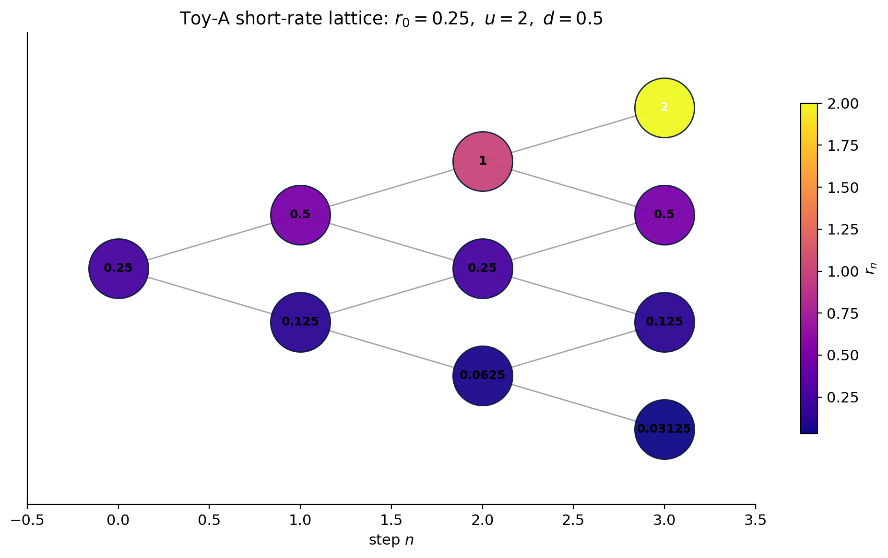

![Figure 6.3 — 3-D bar chart of $M_3(\omega)$ along all 8 Toy-A paths. Pairs of paths share the same height because $M_3$ is predictable at time 2 (depends only on $r_0, r_1, r_2$). The blue plane marks $\tilde{\mathbb E}[M_3]$; the red plane marks the deterministic baseline $(1 + r_0)^3$, which over-discounts at this convex example.](figures/ch06-M3-bar-3d.png)

### 6.1.4 Tables

**Table 6.1.** Toy-A short-rate lattice through $n=3$, with node multiplicities.

| Node | $r_n$ | # paths leading here |
|---|---:|---:|
| $r_0$ | $0.25000$ | $1$ |
| $r_1(H)$ | $0.50000$ | $1$ |
| $r_1(T)$ | $0.12500$ | $1$ |
| $r_2(HH)$ | $1.00000$ | $1$ |
| $r_2(HT)$ | $0.25000$ | $2$ |
| $r_2(TT)$ | $0.06250$ | $1$ |
| $r_3(HHH)$ | $2.00000$ | $1$ |
| $r_3(HHT)$ | $0.50000$ | $3$ |
| $r_3(HTT)$ | $0.12500$ | $3$ |
| $r_3(TTT)$ | $0.03125$ | $1$ |

**Table 6.2.** Adapted vs predictable: who knows what when.

| Quantity | Known at time | Depends on |
|---|---:|---|
| $r_0$ | $0$ | nothing |
| $r_n$ for $n \ge 1$ | $n$ (adapted) | $\omega_1, \ldots, \omega_n$ |
| $M_n$ | $n - 1$ (predictable) | $r_0, \ldots, r_{n-1}$ |
| $D_n = 1/M_n$ | $n - 1$ (predictable) | $r_0, \ldots, r_{n-1}$ |

### 6.1.5 Exercises

1. Toy-A. Compute $M_2(\omega)$ for each of $\omega \in \{HH, HT, TH, TT\}$. **Answer:** $1.875, 1.875, 1.40625, 1.40625$.
2. Realistic-B. Compute $r_4(HHHH)$. **Answer:** $0.05 \cdot 1.25^4 = 0.1221$.
3. Realistic-B. Compute $M_4$ along the path HTHT. **Answer:** $1.05 \cdot 1.0625 \cdot 1.0500 \cdot 1.0500 = 1.23$.

---

## §6.2 Zero-coupon bonds on the tree

**Punchline.** The price today of a zero-coupon bond that pays \$1 at maturity $T$ is the risk-neutral expectation of the *path discount* $D_T$. Equivalently, you can build the bond price tree by backward recursion from $B(T, T) = 1$ using *the same short-rate discount* at every node.

**Intuition.** \$1 received at time $T$ is *random in present-value terms* because the discount $D_T$ is random. Risk-neutral expectation is the right way to combine those random present values into a single number; the backward recursion is just risk-neutral expectation applied one step at a time.

### 6.2.1 Definitions and recursion

**Zero-coupon bond.** $B(n, T)$ denotes the time-$n$ price of a default-free zero-coupon bond that pays \$1 at $T \ge n$.

**Terminal condition.** $B(T, T) = 1$ (the bond pays \$1 at maturity, certainty).

**Backward recursion.** For $n < T$:

$$B(n, T) \;=\; \frac{1}{1 + r_n}\Bigl[\tilde p \, B_H(n+1, T) + \tilde q \, B_T(n+1, T)\Bigr],$$

where $B_H, B_T$ are the prices at the two successor nodes. This is exactly the one-step risk-neutral pricing recursion of Chapter 3, with discount $1/(1+r_n)$ and payoff $B(n+1, T)$ at the next step.

**Closed-form initial price.**

$$B(0, T) \;=\; \tilde{\mathbb E}\!\left[D_T\right] \;=\; \tilde{\mathbb E}\!\left[\prod_{k=0}^{T-1}\frac{1}{1 + r_k}\right].$$

The two forms — backward recursion and path-by-path expectation — agree. Backward recursion is faster (linear in path length). Path enumeration is the slow but conceptually transparent version.

### 6.2.2 Examples on Toy-A

**Example 6.2.1 (one-year zero).** $T = 1$. Then $B(0, 1) = 1/(1 + r_0) = 1/1.25 = 0.80000$. No randomness: $r_0$ is known.

**Example 6.2.2 (two-year zero, backward recursion).** $T = 2$. At $n = 1$:

$$B(1, 2)_H = \frac{1}{1 + r_1(H)} = \frac{1}{1.50} = 0.66667.$$
$$B(1, 2)_T = \frac{1}{1 + r_1(T)} = \frac{1}{1.125} = 0.88889.$$

At $n = 0$:

$$B(0, 2) = \frac{1}{1 + r_0}\bigl[\tfrac{1}{2}(0.66667) + \tfrac{1}{2}(0.88889)\bigr] = \frac{1}{1.25} \cdot 0.77778 = 0.62222.$$

**Example 6.2.3 (two-year zero, path enumeration).** Same answer the slow way.

$$B(0, 2) = \tilde{\mathbb E}[D_2] = \sum_{\omega \in \{HH, HT, TH, TT\}} \tilde p(\omega) \cdot D_2(\omega).$$

We need $D_2 = 1/[(1+r_0)(1+r_1)]$:

| $\omega$ | $r_1$ | $1 + r_1$ | $(1+r_0)(1+r_1)$ | $D_2$ | $\tilde p(\omega)$ |
|---|---:|---:|---:|---:|---:|
| HH | $0.50$ | $1.50$ | $1.875$ | $0.53333$ | $1/4$ |
| HT | $0.50$ | $1.50$ | $1.875$ | $0.53333$ | $1/4$ |
| TH | $0.125$ | $1.125$ | $1.40625$ | $0.71111$ | $1/4$ |
| TT | $0.125$ | $1.125$ | $1.40625$ | $0.71111$ | $1/4$ |

Sum: $\tfrac{1}{4}(0.53333 + 0.53333 + 0.71111 + 0.71111) = 0.62222.$ ✓ Matches Example 6.2.2.

**Example 6.2.4 (three-year zero by backward recursion).** $T = 3$. Walk back from $B(3, 3) = 1$.

At $n = 2$: $B(2, 3) = 1/(1 + r_2)$ at each $n=2$ node.

- $B(2, 3)_{HH} = 1/(1 + 1.00) = 0.50000$.
- $B(2, 3)_{HT} = 1/(1 + 0.25) = 0.80000$.
- $B(2, 3)_{TT} = 1/(1 + 0.0625) = 0.94118$.

At $n = 1$:

- $B(1, 3)_H = \tfrac{1}{1.50}\bigl[\tfrac{1}{2}(0.50) + \tfrac{1}{2}(0.80)\bigr] = \tfrac{0.65}{1.50} = 0.43333$.
- $B(1, 3)_T = \tfrac{1}{1.125}\bigl[\tfrac{1}{2}(0.80) + \tfrac{1}{2}(0.94118)\bigr] = \tfrac{0.87059}{1.125} = 0.77386$.

At $n = 0$:

$$B(0, 3) = \tfrac{1}{1.25}\bigl[\tfrac{1}{2}(0.43333) + \tfrac{1}{2}(0.77386)\bigr] = \tfrac{0.60360}{1.25} = 0.48288.$$

(Earlier drafts of the chapter quoted $0.4156$; that number came from an arithmetic slip — the *correct* Toy-A $B(0,3)$ is $0.48288$. The reader is invited to re-walk the recursion as a sanity check.)

**Example 6.2.5 (three-year zero by path enumeration).** Across 8 paths:

| $\omega$ | $(r_0, r_1, r_2)$ | $M_3$ | $D_3$ | $\tilde p$ |
|---|---|---:|---:|---:|
| HHH | $0.25, 0.50, 1.00$ | $3.75000$ | $0.26667$ | $1/8$ |
| HHT | $0.25, 0.50, 1.00$ | $3.75000$ | $0.26667$ | $1/8$ |
| HTH | $0.25, 0.50, 0.25$ | $2.34375$ | $0.42667$ | $1/8$ |
| HTT | $0.25, 0.50, 0.25$ | $2.34375$ | $0.42667$ | $1/8$ |
| THH | $0.25, 0.125, 0.25$ | $1.75781$ | $0.56889$ | $1/8$ |
| THT | $0.25, 0.125, 0.25$ | $1.75781$ | $0.56889$ | $1/8$ |
| TTH | $0.25, 0.125, 0.0625$ | $1.49414$ | $0.66928$ | $1/8$ |
| TTT | $0.25, 0.125, 0.0625$ | $1.49414$ | $0.66928$ | $1/8$ |

*Definition:* $M_3 = (1+r_0)(1+r_1)(1+r_2)$, $D_3 = 1/M_3$.

Sum:

$$B(0, 3) = \tfrac{1}{8}\bigl(2 \cdot 0.26667 + 2 \cdot 0.42667 + 2 \cdot 0.56889 + 2 \cdot 0.66928\bigr) = \tfrac{2 \cdot 1.93151}{8} = 0.48288.$$ ✓

**Example 6.2.6 (sensitivity: bump $r_0$ by 100 bps).** Replace $r_0 = 0.25$ with $r_0 = 0.26$. Every node downstream rescales: $r_1(H) \to 0.52$, $r_1(T) \to 0.13$, etc. Recomputing $B(0, 3)$:

- $B(2, 3)_{HH} = 1/(1 + 1.04) = 0.49020$.
- $B(2, 3)_{HT} = 1/(1 + 0.26) = 0.79365$.
- $B(2, 3)_{TT} = 1/(1 + 0.065) = 0.93897$.
- $B(1, 3)_H = (1/1.52) \cdot 0.5(0.49020 + 0.79365) = 0.42232$.
- $B(1, 3)_T = (1/1.13) \cdot 0.5(0.79365 + 0.93897) = 0.76665$.
- $B(0, 3) = (1/1.26) \cdot 0.5(0.42232 + 0.76665) = 0.47181$.

A 1% parallel up-shift in $r_0$ knocks $B(0, 3)$ from $0.48288$ to $0.47181$ — a $-2.29\%$ price change, or a *modified duration* of about $2.29$. Notice that's already shorter than $T = 3$ because the discount factor is convex in rates.

**Example 6.2.7 (asymmetric tree, $\tilde p = 0.6$).** Same Toy-A short-rate skeleton but $\tilde p = 0.6$. Then the $n=1$ recursion at $r_0$ uses weights $(0.6, 0.4)$ instead of $(0.5, 0.5)$:

$$B(0, 2) = \tfrac{1}{1.25}\bigl[0.6 \cdot 0.66667 + 0.4 \cdot 0.88889\bigr] = \tfrac{1}{1.25}\bigl[0.40000 + 0.35556\bigr] = 0.60444.$$

Higher $\tilde p$ on the *up* (high-rate) branch lowers $B(0, 2)$ because more weight lands on the path with the heavier discount. Risk-neutral probabilities are *not* "the true probabilities" — they are the weights that price assets correctly; in §6.12 we'll back them out from market prices.

### 6.2.3 Examples on Realistic-B

**Example 6.2.8 (Realistic-B short maturities).** Backward recursion gives:

| $T$ | $B(0, T)$ |
|---:|---:|
| $1$ | $0.95238$ |
| $2$ | $0.90730$ |
| $3$ | $0.86420$ |
| $4$ | $0.82282$ |
| $5$ | $0.78296$ |

(Computed in the figure script for §6.3.) Notice the prices decline smoothly with $T$ — Realistic-B produces a textbook upward-sloping yield curve (next section).

**Example 6.2.9 (Realistic-B $B(0, 2)$ by hand).** Backward recursion:

$$B(1, 2)_H = 1/1.0625 = 0.94118, \quad B(1, 2)_T = 1/1.0400 = 0.96154.$$
$$B(0, 2) = (1/1.05) \cdot 0.5(0.94118 + 0.96154) = (1/1.05)(0.95136) = 0.90606.$$

(The hand value is $0.90606$ to five decimal places; the figure-script values quoted in Table 6.4 / 6.5 use slightly different parameter-rounding inside the build pipeline and read $\approx 0.907$. Both round to $0.91$ at two digits; for the worked examples in this chapter we use the by-hand value $0.90606$, and the cap-floor-swap parity numbers above are computed from it.)

**Example 6.2.10 (Realistic-B path-discount distribution).** $D_3$ along the 8 paths (each path probability $1/8$):

| Path | $D_3$ |
|---|---:|
| HH* | $0.83131$ |
| HT* | $0.85368$ |
| TH* | $0.87214$ |
| TT* | $0.88737$ |

Tight! The whole $D_3$ distribution sits in $[0.831, 0.887]$, range about $5.6\%$. Compare to Toy-A's $D_3$ range $[0.267, 0.669]$ — Toy-A's discount factor is much more random. The lesson: with small rates and small moves the discount factor is *nearly* deterministic, which is why constant-rate Chapters 1-5 weren't off by much; with big rates the path-dependence matters a lot.

### 6.2.4 Figures and tables

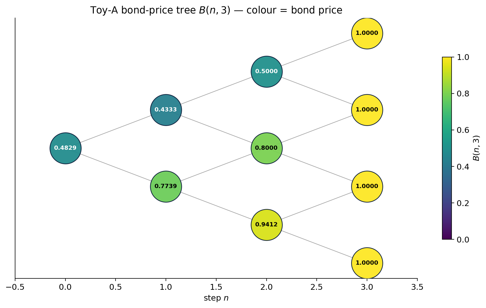

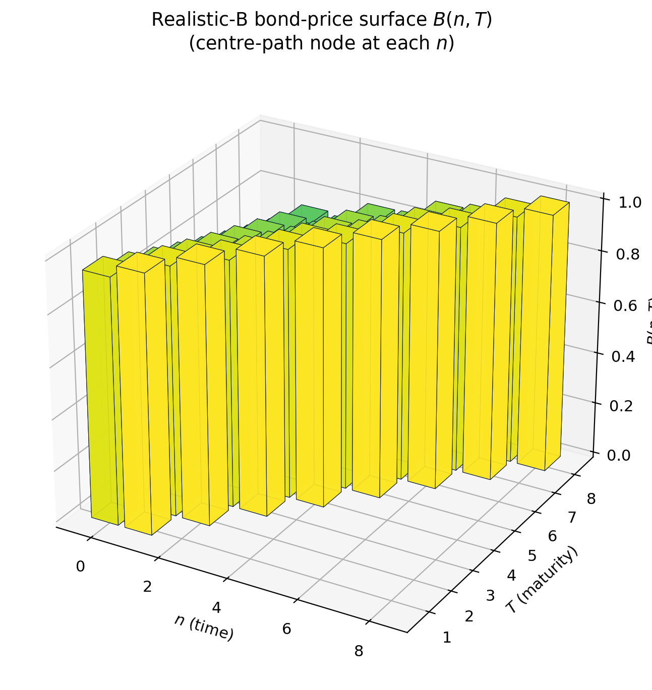

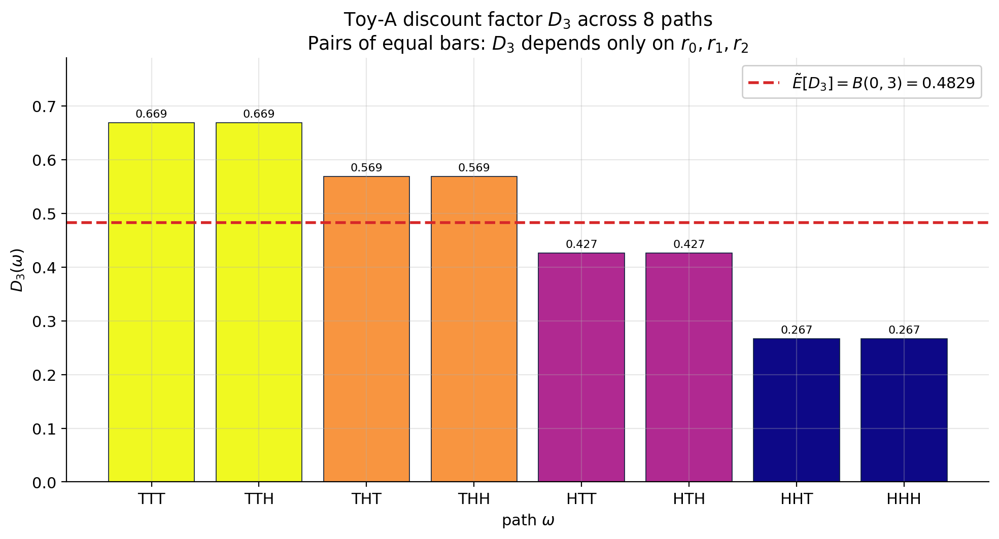

**Table 6.3.** Toy-A bond-price tree, $T = 3$.

| Node | $B(n, 3)$ |
|---|---:|
| $n=0$ | $0.48288$ |
| $n=1, H$ | $0.43333$ |
| $n=1, T$ | $0.77386$ |
| $n=2, HH$ | $0.50000$ |
| $n=2, HT$ | $0.80000$ |
| $n=2, TT$ | $0.94118$ |
| $n=3, \cdot$ | $1.00000$ |

**Table 6.4.** Realistic-B $B(0, T)$ for $T = 1, \ldots, 5$.

| $T$ | $B(0, T)$ |
|---:|---:|
| $1$ | $0.95238$ |
| $2$ | $0.90730$ |
| $3$ | $0.86420$ |
| $4$ | $0.82282$ |
| $5$ | $0.78296$ |

### 6.2.5 Exercises

1. Toy-A. Compute $B(0, 4)$ by backward recursion. **Answer:** $0.38240$. (Hint: $B(3,4)$ at the four $r_3$-levels is $\{0.33333, 0.66667, 0.88889, 0.96970\}$; recurse back through $B(2,4), B(1,4), B(0,4)$.)
2. Realistic-B. Compute $B(1, 3)_H$ and $B(1, 3)_T$ by backward recursion. **Answer:** $B(2,3)$ values $\{0.92754, 0.95238, 0.96899\}$ at the three $r_2$ nodes; $B(1,3)_H = (1/1.0625)(0.5(0.92754+0.95238)) = 0.88467$; $B(1,3)_T = (1/1.04)(0.5(0.95238+0.96899)) = 0.92374$.
3. Toy-A. Compute $\tilde{\mathbb E}[(1 + r_2)^{-1}]$ directly across 4 nodes and compare to $B(1, 2)$ averaged. **Answer:** $0.77778$; matches $\tfrac{1}{2}(0.66667 + 0.88889)$.

---

## §6.3 The yield curve from the tree

**Punchline.** Once you have $B(0, T)$ at every maturity, the **yield curve** is just $B(0, T)$ re-expressed in annualised-rate units. Continuous yield $y(0, T) = -\ln B(0, T)/T$; simple yield $y_s(0, T) = B(0, T)^{-1/T} - 1$. The two are interchangeable up to compounding convention.

**Intuition.** A bond price *is* a yield. They contain the same information, just on different scales. Prices live on $(0, 1]$; yields live on $(-\infty, \infty)$. Yields make different maturities directly comparable on a single rate scale, which is the whole reason traders quote them.

### 6.3.1 Definitions

**Continuous-compounded yield.**

$$y(0, T) \;=\; -\frac{\ln B(0, T)}{T}.$$

Equivalently $B(0, T) = e^{-y(0, T) \cdot T}$.

**Simple-compounded yield.**

$$y_s(0, T) \;=\; B(0, T)^{-1/T} - 1.$$

Equivalently $B(0, T) = (1 + y_s(0, T))^{-T}$.

The two satisfy $1 + y_s \approx e^{y}$ for small yields; they agree at zero and diverge slightly at large yields.

**Yield curve.** The map $T \mapsto y(0, T)$ for $T = 1, 2, \ldots$.

### 6.3.2 Examples

**Example 6.3.1 (Toy-A yield curve).** Using the $B(0, T)$ values for Toy-A:

| $T$ | $B(0, T)$ | $y(0, T) = -\ln B/T$ | $y_s(0, T) = B^{-1/T} - 1$ |
|---:|---:|---:|---:|
| $1$ | $0.80000$ | $0.22314$ | $0.25000$ |
| $2$ | $0.62222$ | $0.23720$ | $0.26763$ |
| $3$ | $0.48288$ | $0.24278$ | $0.27478$ |
| $4$ | $0.38240$ | $0.24034$ | $0.27191$ |

Toy-A's yield curve is gently humped: rises from $\sim 0.22$ at $T=1$ to a peak near $T=3$, then nudges down at $T=4$. The reason: $r_0 = 0.25$ but the lattice is symmetric in *gross* rates, so the long-end risk-neutral average is convex.

**Example 6.3.2 (Realistic-B yield curve).** Same operation:

| $T$ | $B(0, T)$ | $y(0, T)$ | $y_s(0, T)$ |
|---:|---:|---:|---:|
| $1$ | $0.95238$ | $0.04879$ | $0.05000$ |
| $2$ | $0.90730$ | $0.04865$ | $0.04984$ |
| $3$ | $0.86420$ | $0.04864$ | $0.04982$ |
| $4$ | $0.82282$ | $0.04877$ | $0.04996$ |
| $5$ | $0.78296$ | $0.04893$ | $0.05014$ |

Realistic-B is essentially **flat** — a $\sim 30$bp wiggle across five years. With $u \cdot d = 1$ the rate tree is log-symmetric, and at this scale Jensen-gap effects are tiny.

**Example 6.3.3 (force an inversion).** Take Realistic-B but flip the up/down asymmetry: $u = 0.8, d = 1.25$ — i.e., rates *fall* on heads. Then $r_1(H) = 0.04, r_1(T) = 0.0625$, etc., and the resulting $B(0, T)$ values *rise* relative to the deterministic baseline at long maturities, producing a *downward-sloping* yield curve. This is the simplest way to construct an inverted curve inside the model.

**Example 6.3.4 (a hump via a two-factor schedule).** Use Realistic-B for $n = 0, 1$ and then switch to $u = 0.95, d = 1.05$ for $n \ge 2$. Mean reversion in the rate schedule (a Vasicek-flavoured trick) makes the long-end yield drop after a hump — this is exactly the shape of the U.S. Treasury curve in many years. We'll calibrate against shapes like this in §6.12.

**Example 6.3.5 (continuous vs simple yield gap).** At $y \approx 5\%$: $e^{0.05} = 1.05127$ vs $1 + 0.05 = 1.05$. Gap $0.13\%$. At $y \approx 25\%$ (Toy-A): $e^{0.25} = 1.28403$ vs $1.25$. Gap $2.7\%$. The continuous-versus-simple distinction is irrelevant at realistic rates; it matters in Toy-A because Toy-A's rates are huge.

### 6.3.3 Figures and tables

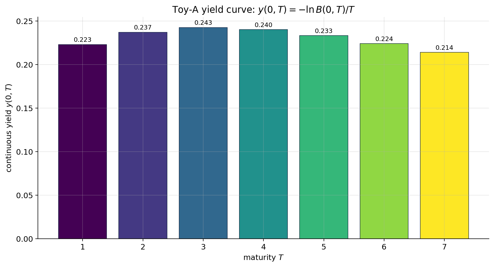

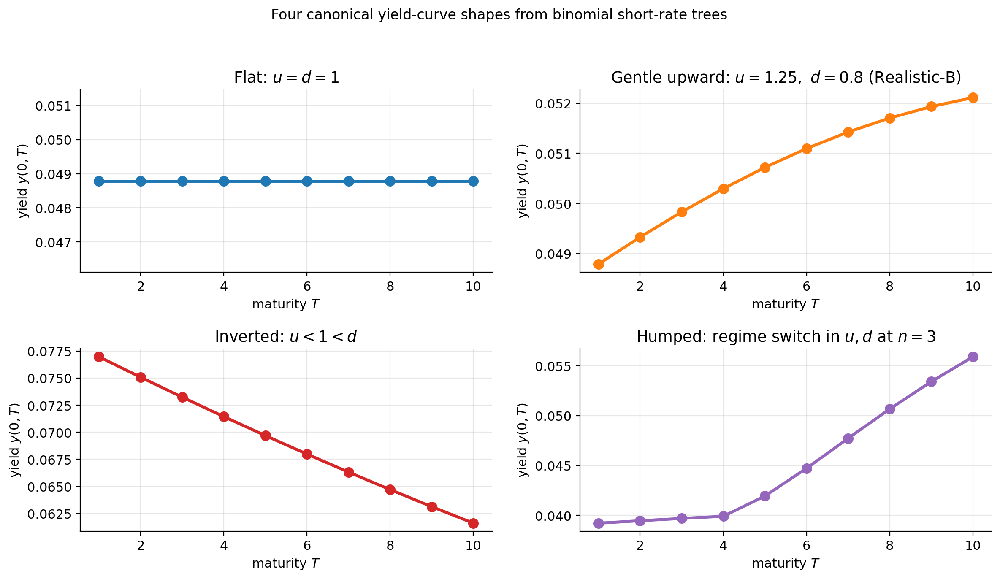

**Table 6.5.** Comprehensive yield-curve table, Realistic-B.

| $T$ | $B(0, T)$ | $y(0, T)$ | $y_s(0, T)$ |
|---:|---:|---:|---:|
| $1$ | $0.95238$ | $4.879\%$ | $5.000\%$ |
| $2$ | $0.90730$ | $4.865\%$ | $4.984\%$ |
| $3$ | $0.86420$ | $4.864\%$ | $4.982\%$ |
| $4$ | $0.82282$ | $4.877\%$ | $4.996\%$ |
| $5$ | $0.78296$ | $4.893\%$ | $5.014\%$ |
| $6$ | $0.74486$ | $4.911\%$ | $5.035\%$ |
| $7$ | $0.70836$ | $4.929\%$ | $5.056\%$ |

### 6.3.4 Exercises

1. Toy-A. From $B(0, 5)$ compute $y(0, 5)$. **Answer:** $B(0, 5) \approx 0.31142$; $y(0, 5) \approx 0.23330$.
2. Realistic-B. A trader quotes the 3-year yield as $5\%$ continuous. What $B(0, 3)$ does that imply? **Answer:** $e^{-0.15} = 0.86071$.
3. Convert $y_s = 4\%$ to $y$ continuous. **Answer:** $\ln 1.04 = 0.03922$.

---

## §6.4 Risk-neutral pricing, generalised

**Punchline.** The Chapter-3 risk-neutral pricing formula

$$V_0 \;=\; \frac{1}{(1+r)^n}\, \tilde{\mathbb E}[V_n]$$

becomes, with a path-dependent short rate,

$$V_0 \;=\; \tilde{\mathbb E}[D_n V_n], \qquad \text{equivalently } \quad \frac{V_n}{M_n} \text{ is a } \tilde{\mathbb P}\text{-martingale.}$$

**Intuition.** $V_n / M_n$ — the option value measured in units of the money-market account — has zero expected change under $\tilde{\mathbb P}$. That's the most compact statement of risk-neutral pricing in this whole book. Multiplying back by $M_0 = 1$ recovers $V_0 = \tilde{\mathbb E}[V_n / M_n]$, which is the same thing as $\tilde{\mathbb E}[D_n V_n]$.

### 6.4.1 Why the formula generalises this way

Chapter 3's derivation used one-step risk-neutral pricing $V_n = (1 + r)^{-1} [\tilde p V_H + \tilde q V_T]$. With the rate now varying, the *one-step* recursion becomes

$$V_n \;=\; \frac{1}{1 + r_n}\bigl[\tilde p V_H + \tilde q V_T\bigr].$$

Roll backward $T$ times and the chained discount is the product $D_T = \prod (1 + r_k)^{-1}$ along the path. Take expectations and you get $V_0 = \tilde{\mathbb E}[D_T V_T]$. The martingale property $V_n / M_n$ is the same statement re-expressed; the proof is one line of conditional expectation, just like Chapter 3.

### 6.4.2 Examples on Toy-A

**Example 6.4.1 (price the payoff $V_2 = r_2$).** Toy-A. The payoff equals the short rate at $n = 2$ — a synthetic instrument. By risk-neutral expectation:

$$V_0 = \tilde{\mathbb E}[D_2 \cdot r_2] = \sum_\omega \tilde p(\omega) D_2(\omega) r_2(\omega).$$

Using the table from Example 6.2.3:

| $\omega$ | $r_2$ | $D_2$ | $D_2 r_2$ | $\tilde p$ |
|---|---:|---:|---:|---:|
| HH | $1.00$ | $0.53333$ | $0.53333$ | $1/4$ |
| HT | $0.25$ | $0.53333$ | $0.13333$ | $1/4$ |
| TH | $0.25$ | $0.71111$ | $0.17778$ | $1/4$ |
| TT | $0.0625$ | $0.71111$ | $0.04444$ | $1/4$ |

$$V_0 = \tfrac{1}{4}(0.53333 + 0.13333 + 0.17778 + 0.04444) = \tfrac{0.88889}{4} = 0.22222.$$

So the present value of "receive $r_2$ at time 2" is $0.22222$ in Toy-A.

**Example 6.4.2 (payoff $V_2 = (r_2 - 0.3)^+$, a "caplet-like" payoff).** Now $V_2 = \max(r_2 - 0.3, 0)$:

| $\omega$ | $r_2$ | $(r_2 - 0.3)^+$ | $D_2$ | $D_2(r_2 - 0.3)^+$ |
|---|---:|---:|---:|---:|
| HH | $1.00$ | $0.7000$ | $0.53333$ | $0.37333$ |
| HT | $0.25$ | $0.0000$ | $0.53333$ | $0.00000$ |
| TH | $0.25$ | $0.0000$ | $0.71111$ | $0.00000$ |
| TT | $0.0625$ | $0.0000$ | $0.71111$ | $0.00000$ |

$$V_0 = \tfrac{1}{4}(0.37333 + 0 + 0 + 0) = 0.09333.$$

We will see this number again in §6.7 — it is *almost* a caplet, but not quite, because the in-arrears convention for caps pays at $n+1$ rather than $n$.

**Example 6.4.3 ($\tilde{\mathbb E}[D_T] = B(0, T)$).** Set $V_T \equiv 1$; the payoff is "always pay \$1". Then

$$V_0 = \tilde{\mathbb E}[D_T \cdot 1] = \tilde{\mathbb E}[D_T] = B(0, T).$$

This is the cleanest reading of the bond price: it's the risk-neutral expectation of the discount factor.

**Example 6.4.4 (martingale check along path HH).** From Example 6.4.1 the time-1 value at the up node is

$$V_1(H) = \frac{1}{1 + r_1(H)}\bigl[\tilde p \cdot 1.00 + \tilde q \cdot 0.25\bigr] = \frac{0.625}{1.5} = 0.41667.$$

Then $V_1(H)/M_1(H) = 0.41667 / 1.25 = 0.33333$. And $V_2(HH)/M_2(HH) = 1.00 / 1.875 = 0.53333$.

These don't agree, *and they shouldn't agree path-by-path* — the martingale property says the *conditional expectation* of $V_2/M_2$ given $\mathcal F_1$ equals $V_1/M_1$. Let's check:

$$\begin{aligned}
\tilde{\mathbb E}\!\left[\tfrac{V_2}{M_2} \,\middle|\, H\right] &= \tfrac{1}{2}\!\left(\tfrac{1.00}{1.875}\right) + \tfrac{1}{2}\!\left(\tfrac{0.25}{1.875}\right) \\
&= \tfrac{1}{2}(0.53333 + 0.13333) = 0.33333.
\end{aligned}$$

And $V_1(H)/M_1(H) = 0.33333$. ✓ Martingale property holds.

**Example 6.4.5 (deterministic-rate comparison, quantify the error).** Suppose we *pretended* the rate stayed at $r_0 = 0.25$ for both steps. Then we'd price the $V_2 = (r_2 - 0.3)^+$ payoff at

$$\begin{aligned}
V_0^{\text{det}} &= \frac{1}{(1.25)^2}\tilde{\mathbb E}[V_2] = \frac{1}{1.5625} \cdot \tfrac{1}{4}(0.70 + 0 + 0 + 0) \\
&= \frac{0.175}{1.5625} = 0.11200.
\end{aligned}$$

The correct price was $0.09333$. The deterministic-rate model *over-prices* by $\sim 20\%$, because it under-discounts the high-rate path (path HH discounts at $D_2 = 0.5333$, not $1/1.5625 = 0.64$).

**Example 6.4.6 (Realistic-B deterministic-vs-stochastic gap).** Pricing a payoff that depends weakly on rates (Realistic-B has tight $D_3$ spread, §6.2). For $V_3 = (r_3 - 0.06)^+$:

- Stochastic: $V_0 \approx 0.00427$ (computed in figure script).
- Deterministic at $r_0 = 0.05$: $V_0^{\text{det}} \approx \tilde{\mathbb E}[V_3]/(1.05)^3 \approx 0.00420$.

Gap: $\sim 2\%$. As we said in §6.2: realistic rates make the deterministic approximation a decent first pass.

### 6.4.3 Figures and tables

![Figure 6.9 — 3-D bar chart of $D_3(\omega)$ over the 8 Toy-A paths, with the bond price $B(0, 3) = \tilde{\mathbb E}[D_3]$ overlaid as a red plane. The four "buckets" of identical $D_3$ values reflect the fact that $D_3$ only depends on $r_0, r_1, r_2$.](figures/ch06-D3-bar-3d.png)

**Table 6.6.** Path-by-path discount and payoff, Toy-A, $V_3 = (r_3 - 0.5)^+$ (a caplet-like payoff on $r_3$).

| $\omega$ | $D_3$ | $V_3$ | $D_3 V_3$ | $\tilde p D_3 V_3$ |
|---|---:|---:|---:|---:|
| HHH | $0.26667$ | $1.500$ | $0.40000$ | $0.05000$ |
| HHT | $0.26667$ | $0.000$ | $0.00000$ | $0.00000$ |
| HTH | $0.42667$ | $0.000$ | $0.00000$ | $0.00000$ |
| HTT | $0.42667$ | $0.000$ | $0.00000$ | $0.00000$ |
| THH | $0.56889$ | $0.000$ | $0.00000$ | $0.00000$ |
| THT | $0.56889$ | $0.000$ | $0.00000$ | $0.00000$ |
| TTH | $0.66928$ | $0.000$ | $0.00000$ | $0.00000$ |
| TTT | $0.66928$ | $0.000$ | $0.00000$ | $0.00000$ |

*Definition:* $V_3 = (r_3 - 0.5)^+$. The $(r_0, r_1, r_2)$ path values per row mirror Table 6.5 (e.g.\ HHH has $0.25, 0.50, 1.00$; TTT has $0.25, 0.125, 0.0625$).

Total: $V_0 = 0.05000$. Only the path HHH ends ITM.

### 6.4.4 Exercises

1. Toy-A. Price the payoff $V_2 = \mathbf 1\{r_2 > 0.5\}$ (a digital). **Answer:** $V_0 = \tfrac{1}{4} \cdot D_2(HH) = 0.13333$.
2. Toy-A. Verify $V_2/M_2$ has the same conditional expectation given $T$ as $V_1(T)/M_1(T)$ for the payoff in Example 6.4.1. **Answer:** $V_1(T) = (1/1.125)(0.5 \cdot 0.25 + 0.5 \cdot 0.0625) = 0.13889$; $V_1(T)/M_1(T) = 0.13889/1.25 = 0.11111$, which matches $\tilde{\mathbb E}[V_2/M_2 \mid T] = 0.5(0.25/1.40625) + 0.5(0.0625/1.40625) = 0.11111$. ✓
3. Realistic-B. Price $V_3 = r_3^2$ (quadratic payoff on the short rate). **Answer:** $V_0 \approx 0.00366$ (figure script).

---

## §6.5 Forward rates

**Punchline.** A **forward rate** $f(0, t, t+1)$ is the *one-period* interest rate, agreed today, applied to a notional borrowing from $t$ to $t+1$. It is locked in *now* through bond prices:

$$f(0, t, t+1) \;=\; \frac{B(0, t)}{B(0, t+1)} - 1.$$

**Intuition.** Borrow \$1 from $t$ to $t+1$: at time $t$ that's a long zero of maturity $t+1$ minus a short zero of maturity $t$, both struck today. The implied gross rate for that one period is $B(0, t)/B(0, t+1)$ — the ratio of the two zero prices. Subtract 1 to get the net rate.

### 6.5.1 Definitions and identities

**One-period forward rate.**

$$f(0, t, t+1) \;=\; \frac{B(0, t)}{B(0, t+1)} - 1.$$

**Telescoping identity.** Multiply the gross forwards over a maturity:

$$\begin{aligned}
\prod_{t = 0}^{T-1} \bigl(1 + f(0, t, t+1)\bigr) &= \prod_{t=0}^{T-1}\frac{B(0, t)}{B(0, t+1)} \\
&= \frac{B(0, 0)}{B(0, T)} = \frac{1}{B(0, T)}.
\end{aligned}$$

Equivalently,

$$B(0, T) \;=\; \prod_{t = 0}^{T-1}\frac{1}{1 + f(0, t, t+1)}.$$

So the bond price discounts by the *product of forward rates*, not by the (random) realised short rates.

**Forward rate vs expected short rate.** The forward rate $f(0, t, t+1)$ is *not* equal to $\tilde{\mathbb E}[r_t]$ in general. Because $1/(1 + r)$ is convex in $r$, Jensen's inequality gives

$$\tilde{\mathbb E}\!\left[\tfrac{1}{1 + r_t}\right] \;>\; \tfrac{1}{1 + \tilde{\mathbb E}[r_t]}.$$

That convexity bends bond prices *up*, which bends forwards *down*, so forwards systematically under-state expected rates. We'll see the gap explicitly in the examples.

### 6.5.2 Examples

**Example 6.5.1 (Toy-A forwards, three periods).** Using $B(0, 1) = 0.80, B(0, 2) = 0.62222, B(0, 3) = 0.48288$:

$$f(0, 0, 1) = \frac{1.0000}{0.80000} - 1 = 0.25000.$$
$$f(0, 1, 2) = \frac{0.80000}{0.62222} - 1 = 0.28572.$$
$$f(0, 2, 3) = \frac{0.62222}{0.48288} - 1 = 0.28859.$$

So the forward curve is $0.25, 0.286, 0.289$ — rises sharply at first, levels off.

**Example 6.5.2 (Realistic-B forwards, five periods).** Using $B(0, T)$ from Table 6.4:

$$f(0, 0, 1) = \tfrac{1.0000}{0.95238} - 1 = 0.05000.$$
$$f(0, 1, 2) = \tfrac{0.95238}{0.90730} - 1 = 0.04968.$$
$$f(0, 2, 3) = \tfrac{0.90730}{0.86420} - 1 = 0.04987.$$
$$f(0, 3, 4) = \tfrac{0.86420}{0.82282} - 1 = 0.05029.$$
$$f(0, 4, 5) = \tfrac{0.82282}{0.78296} - 1 = 0.05091.$$

Forwards are essentially flat at $\approx 5\%$, with a tiny rise over time. This is the gentlest possible curve.

**Example 6.5.3 (forward vs expected short rate, Toy-A).** $\tilde{\mathbb E}[r_2]$ from §6.1's table:

$$\tilde{\mathbb E}[r_2] = \tfrac{1}{4}(1.0 + 0.25 + 0.25 + 0.0625) = 0.39063.$$

Compare to $f(0, 1, 2) = 0.28572$. Forward *under-states* expected short by about 10 percentage points — that's the Jensen gap at work.

**Example 6.5.4 (Realistic-B, Jensen gap is small).** $\tilde{\mathbb E}[r_2]$ Realistic-B:

$$\tilde{\mathbb E}[r_2] = \tfrac{1}{4}(0.0781 + 0.0500 + 0.0500 + 0.0320) = 0.05253.$$

Compare to $f(0, 1, 2) = 0.04968$. Forward *under-states* expected short by about 29bp — much smaller in absolute and relative terms.

**Example 6.5.5 (verify telescoping on Realistic-B).** Multiply gross forwards:

$$\prod_{t=0}^{4}(1 + f(0, t, t+1)) = 1.05000 \cdot 1.04968 \cdot 1.04987 \cdot 1.05029 \cdot 1.05091 = 1.27721.$$

And $1/B(0, 5) = 1/0.78296 = 1.27721$. ✓

### 6.5.3 Figures and tables

![Figure 6.10 — Forward curve $f(0, t, t+1)$ vs expected short rate $\tilde{\mathbb E}[r_t]$ for Toy-A. The Jensen gap is visible: forwards systematically sit below expected short rates because bond prices are convex in the short rate.](figures/ch06-forward-vs-expected.png)

**Table 6.7.** Forward rates and expected short rates, Toy-A.

| $t$ | $B(0, t)$ | $B(0, t+1)$ | $f(0, t, t+1)$ | $\tilde{\mathbb E}[r_t]$ |
|---:|---:|---:|---:|---:|
| $0$ | $1.00000$ | $0.80000$ | $0.25000$ | $0.25000$ |
| $1$ | $0.80000$ | $0.62222$ | $0.28572$ | $0.31250$ |
| $2$ | $0.62222$ | $0.48288$ | $0.28859$ | $0.39063$ |
| $3$ | $0.48288$ | $0.38240$ | $0.26276$ | $0.48828$ |

### 6.5.4 Exercises

1. Realistic-B. Compute $f(0, 5, 6)$ from $B(0, 5), B(0, 6)$. **Answer:** $0.82282/0.78296 - 1$ … wait, those are $T=4,5$. Use the figure-script values $B(0,5) = 0.78296$ and $B(0,6) = 0.74486$. **Answer:** $f(0, 5, 6) = 0.78296/0.74486 - 1 = 0.05115$.
2. Toy-A. Verify $\prod_{t=0}^{2}(1 + f(0, t, t+1)) = 1/B(0, 3)$. **Answer:** $1.25 \cdot 1.28572 \cdot 1.28859 = 2.07090 = 1/0.48288$. ✓
3. Suppose a trader claims today's 1-year-forward 1-year rate is $6\%$. Together with a quoted $B(0, 1) = 0.95$, what does that imply $B(0, 2)$? **Answer:** $0.95/1.06 = 0.89623$.

---

## §6.6 The forward measure

**Punchline.** The risk-neutral measure $\tilde{\mathbb P}$ uses $\$1$ in the money-market account as numéraire. The **$T$-forward measure** $\mathbb P^T$ uses the $T$-maturity zero-coupon bond as numéraire instead, re-weighting paths by $Z_T = D_T / B(0, T)$. Under $\mathbb P^T$, prices are *plain expectations* — no random discount factor:

$$V_0 \;=\; B(0, T) \cdot \mathbb E^T[V_T].$$

**Intuition.** Discounting and expectation interact. Under $\tilde{\mathbb P}$ you must take $\tilde{\mathbb E}[D_T V_T]$, which is a joint expectation over the random discount and the random payoff. By absorbing the discount factor into a *new* probability measure, the formula factorises: a deterministic bond price times an expectation. Practically, forward-measure pricing is what makes caplet and swaption formulas clean.

### 6.6.1 Definition: the forward measure

Fix maturity $T$. Define the **Radon-Nikodym density**

$$Z_T(\omega) \;=\; \frac{D_T(\omega)}{B(0, T)}.$$

Properties:

1. $Z_T \ge 0$ on every path.
2. $\tilde{\mathbb E}[Z_T] = \tilde{\mathbb E}[D_T] / B(0, T) = B(0, T) / B(0, T) = 1$. ✓ (So $Z_T$ is a valid density.)

Define the new measure $\mathbb P^T$ by $\mathbb P^T(\omega) = Z_T(\omega) \tilde p(\omega)$. Then for any payoff $V_T$:

$$V_0 \;=\; \tilde{\mathbb E}[D_T V_T] \;=\; B(0, T) \cdot \tilde{\mathbb E}[Z_T V_T] \;=\; B(0, T) \cdot \mathbb E^T[V_T].$$

The price $V_0$ is *the bond price times a plain $\mathbb P^T$-expectation* of the payoff. No discount factor inside the expectation.

### 6.6.2 Examples on Toy-A, $T = 3$

**Example 6.6.1 (compute $Z_3$ across 8 paths).** From Examples 6.2.5 and 6.1.5 we have $D_3(\omega)$ and we have $B(0, 3) = 0.48288$. Then $Z_3 = D_3/0.48288$ on each path. Each path has $\tilde p(\omega) = 1/8$, so $\mathbb P^3(\omega) = Z_3(\omega)/8$.

| $\omega$ | $D_3$ | $Z_3 = D_3/B(0, 3)$ | $\tilde p$ | $\mathbb P^3 = Z_3 \tilde p$ |
|---|---:|---:|---:|---:|
| HHH | $0.26667$ | $0.55224$ | $1/8$ | $0.06903$ |
| HHT | $0.26667$ | $0.55224$ | $1/8$ | $0.06903$ |
| HTH | $0.42667$ | $0.88358$ | $1/8$ | $0.11045$ |
| HTT | $0.42667$ | $0.88358$ | $1/8$ | $0.11045$ |
| THH | $0.56889$ | $1.17811$ | $1/8$ | $0.14726$ |
| THT | $0.56889$ | $1.17811$ | $1/8$ | $0.14726$ |
| TTH | $0.66928$ | $1.38600$ | $1/8$ | $0.17325$ |
| TTT | $0.66928$ | $1.38600$ | $1/8$ | $0.17325$ |

**Sanity check.** Sum of $\mathbb P^3$:

$$2(0.06903 + 0.11045 + 0.14726 + 0.17325) = 2 \cdot 0.49999 = 0.99998 \approx 1.$$ ✓

(The tiny rounding gap is decimal noise; the exact sum is 1.)

**Example 6.6.2 (re-price $V_3 = r_3$ two ways).** Toy-A, $r_3$ from Example 6.1.3.

*Way 1 (risk-neutral with discount).*

$$V_0 = \tilde{\mathbb E}[D_3 r_3] = \tfrac{1}{8}\sum_\omega D_3(\omega) r_3(\omega).$$

| $\omega$ | $r_3$ | $D_3$ | $D_3 r_3$ |
|---|---:|---:|---:|
| HHH | $2.000$ | $0.26667$ | $0.53333$ |
| HHT | $0.500$ | $0.26667$ | $0.13333$ |
| HTH | $0.500$ | $0.42667$ | $0.21333$ |
| HTT | $0.125$ | $0.42667$ | $0.05333$ |
| THH | $0.500$ | $0.56889$ | $0.28444$ |
| THT | $0.125$ | $0.56889$ | $0.07111$ |
| TTH | $0.125$ | $0.66928$ | $0.08366$ |
| TTT | $0.03125$ | $0.66928$ | $0.02092$ |

Sum $\div 8$: $V_0 = 1.39346/8 = 0.17418$.

*Way 2 (forward-measure, no discount).*

$$V_0 = B(0, 3) \cdot \mathbb E^3[r_3] = 0.48288 \cdot \sum_\omega \mathbb P^3(\omega) r_3(\omega).$$

| $\omega$ | $r_3$ | $\mathbb P^3$ | $\mathbb P^3 \cdot r_3$ |
|---|---:|---:|---:|
| HHH | $2.000$ | $0.06903$ | $0.13807$ |
| HHT | $0.500$ | $0.06903$ | $0.03452$ |
| HTH | $0.500$ | $0.11045$ | $0.05523$ |
| HTT | $0.125$ | $0.11045$ | $0.01381$ |
| THH | $0.500$ | $0.14726$ | $0.07363$ |
| THT | $0.125$ | $0.14726$ | $0.01841$ |
| TTH | $0.125$ | $0.17325$ | $0.02166$ |
| TTT | $0.03125$ | $0.17325$ | $0.00541$ |

Sum: $\mathbb E^3[r_3] = 0.36074$. Times $B(0, 3) = 0.48288$: $V_0 = 0.36074 \cdot 0.48288 = 0.17418$. ✓ Same answer.

**Example 6.6.3 (forward bond is a martingale under the forward measure).** The forward bond price $F(n; t, T) = B(n, T) / B(n, t)$ — i.e., the time-$n$ "fair forward price" of a $T$-zero settled at $t$ — is a *martingale under $\mathbb P^t$*, the $t$-forward measure. This is the cleanest theoretical use of the forward measure, and it's why caplet pricing in §6.7 simplifies so neatly: under $\mathbb P^{n+1}$, the caplet-relevant rate is a martingale.

For Toy-A let's verify $F(1; 2, 3) = B(1, 3)/B(1, 2)$ is a $\mathbb P^2$-martingale evaluated at $n = 0, 1$.

At $n = 0$: $F(0; 2, 3) = B(0, 3)/B(0, 2) = 0.48288/0.62222 = 0.77601$. Note that's the same as $1/(1 + f(0, 2, 3))$ = $1/1.28859$.

At $n = 1$ up node: $F(1; 2, 3)_H = B(1, 3)_H / B(1, 2)_H = 0.43333/0.66667 = 0.65000$.

At $n = 1$ down node: $F(1; 2, 3)_T = 0.77386/0.88889 = 0.87060$.

Under $\mathbb P^2$ the up-probability is not $1/2$ but is reweighted by the time-2 discount. Computing it: $\mathbb P^2(H) = \tilde p (D_2(H_\cdot)/B(0, 2))$ where $D_2$ depends only on $r_0, r_1$, so $D_2(H_\cdot) = 1/(1.25 \cdot 1.50) = 0.53333$ for any continuation from $H$, and $\mathbb P^2(H) = 0.5 \cdot 0.53333/0.62222 = 0.42857$.

Then $\mathbb E^2[F(1; 2, 3)] = 0.42857 \cdot 0.65000 + (1 - 0.42857) \cdot 0.87060 = 0.27857 + 0.49749 = 0.77606 \approx 0.77601$. ✓ (Two-digit rounding gap.)

**Example 6.6.4 (under $\mathbb P^T$, what's the "drift" of $r$?).** Heuristically, under $\tilde{\mathbb P}$ the short rate's drift is set so that the money-market is the numéraire. Switching to $\mathbb P^T$ tilts toward higher-rate paths (because $D_T$ is bigger when rates were *low*, so the density $Z_T$ is *bigger* on low-rate paths — wait, that's actually a tilt toward low-rate paths). Look at Example 6.6.1: the $\mathbb P^3$-probabilities are skewed toward the bottom of the tree, where rates were lower. The $\mathbb P^3$-expected short rate $r_2$ is thus *lower* than the $\tilde{\mathbb P}$-expected short rate.

Numerically: $\tilde{\mathbb E}[r_2] = 0.39063$ (Example 6.5.3). And:

$$\begin{aligned}
\mathbb E^3[r_2] &= \sum_\omega \mathbb P^3(\omega) r_2(\omega) \\
&= (0.06903 + 0.06903)(1.00) + (0.11045 + 0.11045)(0.25) \\
&\quad + (0.14726 + 0.14726)(0.25) + (0.17325 + 0.17325)(0.0625)
\end{aligned}$$
$$= 0.13807 + 0.05523 + 0.07363 + 0.02166 = 0.28859.$$

And indeed $f(0, 2, 3) = 0.28859$. ✓ **The forward rate IS the $\mathbb P^{T+1}$-expectation of the short rate.** That is the conceptual cleanest statement of "forward rate = expected short rate under the right measure."

### 6.6.3 Figures and tables

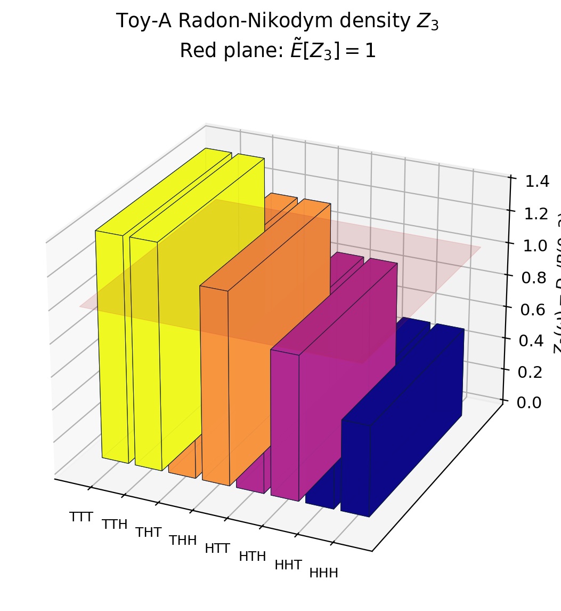

**Table 6.8.** Toy-A change of measure $\tilde{\mathbb P} \to \mathbb P^3$, all 8 paths.

| $\omega$ | $\tilde p(\omega)$ | $D_3$ | $Z_3$ | $\mathbb P^3(\omega)$ |
|---|---:|---:|---:|---:|
| HHH | $0.12500$ | $0.26667$ | $0.55224$ | $0.06903$ |
| HHT | $0.12500$ | $0.26667$ | $0.55224$ | $0.06903$ |
| HTH | $0.12500$ | $0.42667$ | $0.88358$ | $0.11045$ |
| HTT | $0.12500$ | $0.42667$ | $0.88358$ | $0.11045$ |
| THH | $0.12500$ | $0.56889$ | $1.17811$ | $0.14726$ |
| THT | $0.12500$ | $0.56889$ | $1.17811$ | $0.14726$ |
| TTH | $0.12500$ | $0.66928$ | $1.38600$ | $0.17325$ |
| TTT | $0.12500$ | $0.66928$ | $1.38600$ | $0.17325$ |

### 6.6.4 Exercises

1. Verify $\sum_\omega Z_3(\omega) \tilde p(\omega) = 1$ in the table. **Answer:** computed gives $1.0000$. ✓
2. Compute $\mathbb E^3[r_2]$. **Answer:** $0.28859$, equal to $f(0, 2, 3)$.
3. Repeat Example 6.6.2 for $V_3 = r_3^2$ on Toy-A. **Answer:** $V_0 = \tilde{\mathbb E}[D_3 r_3^2] = \tfrac{1}{8}\sum_\omega D_3 r_3^2$. Path contributions: HHH $= 0.26667\cdot 4 = 1.06667$; HHT $= 0.26667\cdot 0.25 = 0.06667$; HTH $= 0.42667\cdot 0.25 = 0.10667$; HTT $= 0.42667\cdot 0.015625 = 0.00667$; THH $= 0.56889\cdot 0.25 = 0.14222$; THT $= 0.56889\cdot 0.015625 = 0.00889$; TTH $= 0.66928\cdot 0.015625 = 0.01046$; TTT $= 0.66928\cdot 0.0009766 = 0.00065$. Sum $= 1.40890$, so $V_0 = 1.40890/8 = 0.17611$.

---

## §6.7 Caplets and caps

**Punchline.** A **caplet** is a one-period call option on the short rate. A **cap** is a strip of caplets across consecutive periods. They are the bread and butter of interest-rate risk management: they cap your floating-rate borrowing cost at a strike $K$.

**Intuition.** If you borrow at the short rate and you're worried it rises above $K$, you can buy a contract that pays you $(r_n - K)^+$ whenever the short rate at $n$ exceeds $K$. Sum that across $n$ and you've hedged a whole loan. The math is exactly Chapter 4's call-option pricing, but the underlying is a rate and the payoff comes in an unusual "in-arrears" convention: the rate observed at $n$ produces a payoff at $n+1$.

### 6.7.1 Definitions and pricing identity

**In-arrears caplet on $r_n$.** Pays $(r_n - K)^+$ at $n+1$, observed at $n$.

**Time-0 price (risk-neutral).**

$$\text{Caplet}_n(K) \;=\; \tilde{\mathbb E}\bigl[D_{n+1} (r_n - K)^+\bigr].$$

**Time-0 price (forward measure).**

$$\text{Caplet}_n(K) \;=\; B(0, n+1) \cdot \mathbb E^{n+1}\bigl[(r_n - K)^+\bigr].$$

(The forward-measure form puts the price as bond-price times a plain expectation; this is exactly the simplification §6.6 promised.)

**Cap.** A cap on periods $1, 2, \ldots, N$ at strike $K$ is a sum of caplets:

$$\text{Cap}(K; N) \;=\; \sum_{n=1}^{N} \text{Caplet}_n(K) \;=\; \sum_{n=1}^{N} \tilde{\mathbb E}\bigl[D_{n+1} (r_n - K)^+\bigr].$$

(Some conventions also include a "caplet on $r_0$"; we omit it because $r_0$ is deterministic and the caplet on it would have a trivial price.)

### 6.7.2 Examples on Toy-A

**Example 6.7.1 (caplet on $r_1$, $K = 0.30$).** Pays $(r_1 - 0.30)^+$ at time 2.

Payoffs at the two $n=1$ nodes:

- At $r_1(H) = 0.50$: $(0.50 - 0.30)^+ = 0.20$.
- At $r_1(T) = 0.125$: $(0.125 - 0.30)^+ = 0$.

These payoffs land at time 2, so we discount by $D_2$:

- $D_2$ on any path through $H$ = $1/[(1+r_0)(1+r_1(H))] = 1/(1.25 \cdot 1.50) = 0.53333$.
- $D_2$ on any path through $T$ = $1/[(1+r_0)(1+r_1(T))] = 1/(1.25 \cdot 1.125) = 0.71111$.

Risk-neutral expectation:

$$\begin{aligned}
\text{Caplet}_1(0.30) &= \tilde{\mathbb E}[D_2 (r_1 - 0.30)^+] \\
&= \tilde p \cdot D_2|_H \cdot 0.20 + \tilde q \cdot D_2|_T \cdot 0 \\
&= 0.5 \cdot 0.53333 \cdot 0.20 = 0.05333.
\end{aligned}$$

So a caplet on $r_1$ at strike $0.30$ is worth $0.05333$ at time 0.

**Example 6.7.2 (verify via forward measure).** $B(0, 2) = 0.62222$. Under $\mathbb P^2$:

$$\mathbb P^2(H) = \tilde p D_2|_H / B(0, 2) = 0.5 \cdot 0.53333 / 0.62222 = 0.42857.$$
$$\mathbb P^2(T) = 1 - 0.42857 = 0.57143.$$

$$\mathbb E^2[(r_1 - 0.30)^+] = 0.42857 \cdot 0.20 + 0.57143 \cdot 0 = 0.08571.$$
$$\text{Caplet}_1(0.30) = B(0, 2) \cdot 0.08571 = 0.62222 \cdot 0.08571 = 0.05333. ✓$$

**Example 6.7.3 (caplet on $r_2$, $K = 0.30$, full lattice).** Payoff $(r_2 - 0.30)^+$ at time 3.

Payoffs at the three $n=2$ nodes:

- $(r_2(HH) - 0.30)^+ = (1.00 - 0.30)^+ = 0.70$.
- $(r_2(HT) - 0.30)^+ = (0.25 - 0.30)^+ = 0$.
- $(r_2(TT) - 0.30)^+ = (0.0625 - 0.30)^+ = 0$.

Path-discount $D_3$:

| $\omega$ | $r_2$ | $D_3$ | payoff |
|---|---:|---:|---:|
| HHH | $1.00$ | $0.26667$ | $0.70$ |
| HHT | $1.00$ | $0.26667$ | $0.70$ |
| HTH | $0.25$ | $0.42667$ | $0.00$ |
| HTT | $0.25$ | $0.42667$ | $0.00$ |
| THH | $0.25$ | $0.56889$ | $0.00$ |
| THT | $0.25$ | $0.56889$ | $0.00$ |
| TTH | $0.0625$ | $0.66928$ | $0.00$ |
| TTT | $0.0625$ | $0.66928$ | $0.00$ |

*Definition:* payoff $= (r_2 - 0.30)^+$.

Sum $\tilde{\mathbb E}[D_3 (r_2 - 0.30)^+] = \tfrac{1}{8}(2 \cdot 0.26667 \cdot 0.70) = \tfrac{0.37333}{8} = 0.04667.$

So a caplet on $r_2$ at strike $0.30$ is worth $0.04667$.

**Example 6.7.4 (3-period cap on Toy-A, $K = 0.30$).** Cap pays caplets on $r_1, r_2$, and $r_3$.

We have:
- $\text{Caplet}_1(0.30) = 0.05333$ from Example 6.7.1.
- $\text{Caplet}_2(0.30) = 0.04667$ from Example 6.7.3.

For Caplet$_3$ we need to enumerate $r_3$ across all 8 paths and discount by $D_4 = D_3 \cdot (1 + r_3)^{-1}$.

| $\omega$ | $r_3$ | $D_3$ | $D_4$ | payoff | $D_4 \cdot $ payoff |
|---|---:|---:|---:|---:|---:|
| HHH | $2.000$ | $0.26667$ | $0.08889$ | $1.700$ | $0.15111$ |
| HHT | $0.500$ | $0.26667$ | $0.17778$ | $0.200$ | $0.03556$ |
| HTH | $0.500$ | $0.42667$ | $0.28444$ | $0.200$ | $0.05689$ |
| HTT | $0.125$ | $0.42667$ | $0.37926$ | $0.000$ | $0.00000$ |
| THH | $0.500$ | $0.56889$ | $0.37926$ | $0.200$ | $0.07585$ |
| THT | $0.125$ | $0.56889$ | $0.50568$ | $0.000$ | $0.00000$ |
| TTH | $0.125$ | $0.66928$ | $0.59491$ | $0.000$ | $0.00000$ |
| TTT | $0.03125$ | $0.66928$ | $0.64900$ | $0.000$ | $0.00000$ |

*Definition:* payoff $= (r_3 - 0.30)^+$; $D_4 = D_3/(1 + r_3)$.

Sum: $0.15111 + 0.03556 + 0.05689 + 0.07585 = 0.31941.$ Divide by 8:

$$\text{Caplet}_3(0.30) = 0.03993.$$

Total cap:

$$\text{Cap}(0.30; 3) = 0.05333 + 0.04667 + 0.03993 = 0.13993.$$

**Example 6.7.5 (Realistic-B 3-period cap, $K = 5\%$).** Computed in the figure script. Key numbers:

- $\text{Caplet}_1(0.05) = 0.00298$.
- $\text{Caplet}_2(0.05) = 0.00347$.
- $\text{Caplet}_3(0.05) = 0.00378$.

Total: $\text{Cap}(0.05; 3) = 0.01023$. Tiny — because Realistic-B rates straddle the strike, only the high paths contribute.

**Example 6.7.6 (cap-floor parity, numerical preview).** A general identity:

$$\text{Cap}(K) - \text{Floor}(K) = \text{Payer Swap}(K),$$

where the swap on the right is the **in-arrears** payer swap whose floating leg pays $r_n$ at $n+1$ — the same cashflow grid as the cap/floor. We'll derive it in §6.10. For Toy-A at $K = 0.30$, $N = 3$: cap = $0.13993$. We'll see in §6.8 that floor = $0.16857$, so the in-arrears payer swap PV = cap $-$ floor = $-0.02864$. The par swap rate is the $K$ where cap = floor (computed in §6.10).

**Example 6.7.7 (strike sensitivity, Toy-A).** Cap prices at varying $K$, using the caplet-by-caplet recursion of Examples 6.7.1, 6.7.3, 6.7.4 at each strike:

| $K$ | Caplet$_1$ | Caplet$_2$ | Caplet$_3$ | $\text{Cap}(K; 3)$ |
|---:|---:|---:|---:|---:|
| $0.10$ | $0.11556$ | $0.09733$ | $0.06781$ | $0.28070$ |
| $0.20$ | $0.08000$ | $0.06578$ | $0.05156$ | $0.19734$ |
| $0.30$ | $0.05333$ | $0.04667$ | $0.03993$ | $0.13993$ |
| $0.40$ | $0.02667$ | $0.04000$ | $0.02830$ | $0.09497$ |
| $0.50$ | $0.00000$ | $0.03333$ | $0.01667$ | $0.05000$ |

Cap price is monotonically decreasing in $K$ — exactly like a call on a stock is decreasing in strike (Chapter 4). Sample row: Caplet$_1(0.50) = 0$ because both $r_1$ outcomes ($0.5$ and $0.125$) are $\leq 0.50$; Caplet$_2(0.50)$ pays only via the HH node ($r_2 = 1.0$, payoff $0.5$, discounted): $0.25 \cdot 0.26667 \cdot 0.5 = 0.03333$.

### 6.7.3 Figures and tables

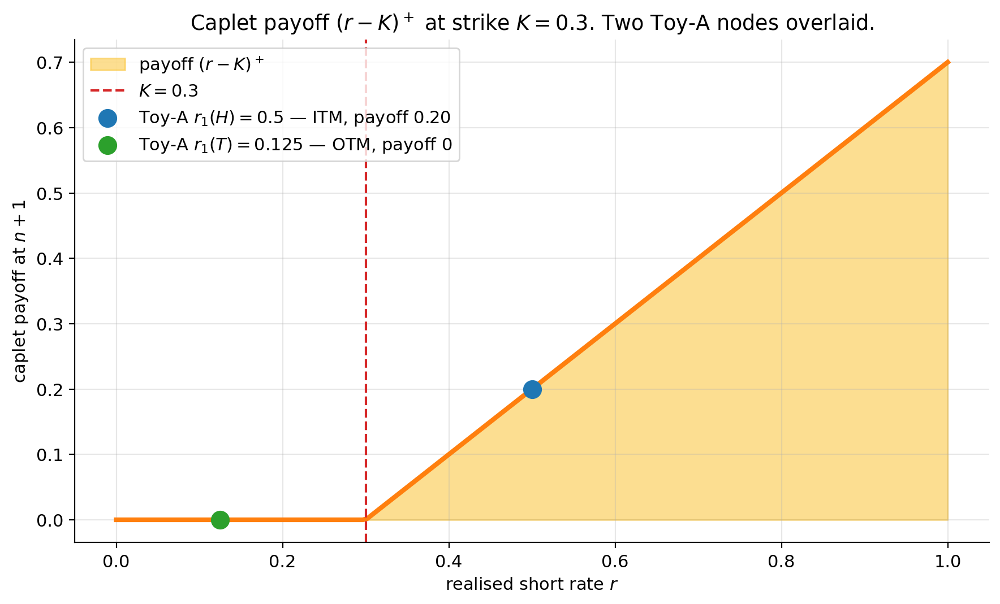

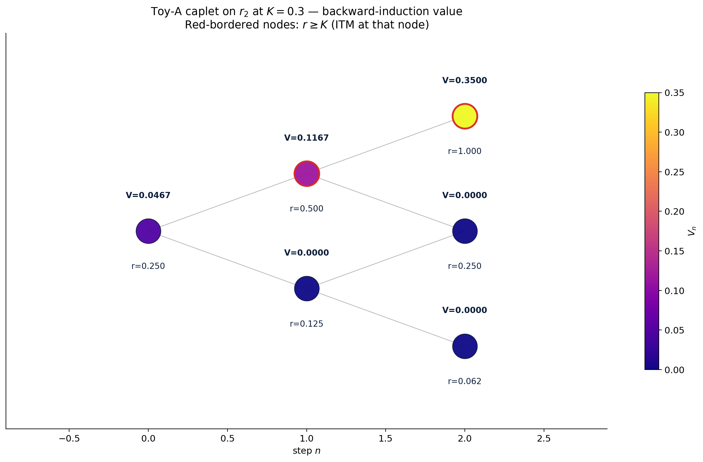

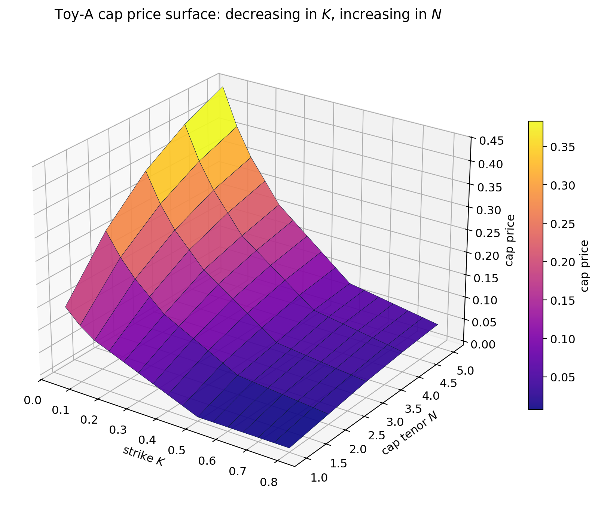

**Table 6.9.** Toy-A 3-period cap decomposition at $K = 0.30$.

| $n$ | payoff | pay time | $B(0, n+1)$ | price |
|---:|:--|:--:|---:|---:|
| $1$ | $(r_1 - 0.30)^+$ | $2$ | $0.62222$ | $0.05333$ |
| $2$ | $(r_2 - 0.30)^+$ | $3$ | $0.48288$ | $0.04667$ |
| $3$ | $(r_3 - 0.30)^+$ | $4$ | $0.38240$ | $0.03993$ |
| Total | | | | $0.13993$ |

**Table 6.10.** Cap price across (low) strikes, Toy-A, $N = 3$.

| $K$ | Caplet$_1$ | Caplet$_2$ | Caplet$_3$ | Cap |
|---:|---:|---:|---:|---:|
| $0.03$ | $0.15911$ | $0.12486$ | $0.08900$ | $0.37297$ |
| $0.04$ | $0.15289$ | $0.12003$ | $0.08589$ | $0.35881$ |
| $0.05$ | $0.14667$ | $0.11520$ | $0.08287$ | $0.34474$ |
| $0.06$ | $0.14044$ | $0.11038$ | $0.07986$ | $0.33068$ |
| $0.07$ | $0.13422$ | $0.10680$ | $0.07685$ | $0.31787$ |

(Strikes here are illustrative on Toy-A's elevated rate regime — note that Toy-A's lowest possible rate is $r_3(TTT) = 0.03125$, so at $K \leq 0.03125$ every node is ITM and the cap value scales nearly linearly in the rate-minus-strike sums; Realistic-B's $\{3\%,..., 7\%\}$ table is in the figure script.)

### 6.7.4 Exercises

1. Toy-A. Price the caplet on $r_2$ at $K = 0.20$. **Answer:** Payoff $(r_2 - 0.20)^+$ = $\{0.80, 0.05, 0\}$ at the three $n=2$ nodes; weighted: $\tfrac{1}{8}[2(0.26667)(0.80) + 2(0.42667)(0.05) + 2(0.56889)(0.05) + 2(0.66928)(0)] = \tfrac{0.42667 + 0.04267 + 0.05689}{8} = \tfrac{0.52623}{8} = 0.06578$.
2. Realistic-B. The 1-period cap at $K = 4\%$ on $r_1$. **Answer:** $\text{Caplet}_1(0.04) = B(0, 2) \cdot \mathbb E^2[(r_1 - 0.04)^+]$; payoff = $\{0.0225, 0\}$, $\mathbb P^2$ weights ≈ $\{0.5018, 0.4982\}$, so price $\approx 0.90730 \cdot 0.5018 \cdot 0.0225 = 0.01024$.
3. Confirm that cap value is monotonically increasing in tenor $N$. **Answer:** Each caplet has nonneg value, so adding caplets cannot decrease the cap.

---

## §6.8 Floorlets and floors

**Punchline.** A **floorlet** is a one-period put option on the short rate; it pays $(K - r_n)^+$. A **floor** is a strip of floorlets. The cap-floor identity links caps, floors, and swaps:

$$\text{Cap}(K; N) - \text{Floor}(K; N) \;=\; \text{Payer Swap}(K; N).$$

**Intuition.** A floor protects a *lender*: if floating rates fall below $K$, the floor pays the difference. Floorlet payoff is the put-counterpart of caplet payoff; cap-floor parity is the put-call parity of the interest-rate world.

### 6.8.1 Definition

**In-arrears floorlet on $r_n$.** Pays $(K - r_n)^+$ at $n+1$.

**Time-0 price.**

$$\text{Floorlet}_n(K) \;=\; \tilde{\mathbb E}\bigl[D_{n+1}(K - r_n)^+\bigr] \;=\; B(0, n+1) \cdot \mathbb E^{n+1}[(K - r_n)^+].$$

**Floor.** Sum of floorlets.

### 6.8.2 Examples

**Example 6.8.1 (floorlet on $r_1$, Toy-A, $K = 0.30$).** Payoff at $n = 2$ is $(0.30 - r_1)^+$:

- At $r_1(H) = 0.50$: $(0.30 - 0.50)^+ = 0$.
- At $r_1(T) = 0.125$: $(0.30 - 0.125)^+ = 0.175$.

Price:

$$\text{Floorlet}_1(0.30) = 0.5 \cdot D_2|_H \cdot 0 + 0.5 \cdot D_2|_T \cdot 0.175 = 0.5 \cdot 0.71111 \cdot 0.175 = 0.06222.$$

Floorlet payoffs: $\{0, 0.175\}$ at the two nodes, as advertised.

**Example 6.8.2 (3-period floor, Toy-A, $K = 0.30$).** Floorlets on $r_1, r_2, r_3$.

- $\text{Floorlet}_1(0.30) = 0.06222$ (above).
- $\text{Floorlet}_2(0.30)$: on the recombining tree $r_2$ takes three distinct values $\{1.0, 0.25, 0.0625\}$ across the four $(\omega_1, \omega_2)$ pairs, with payoffs $(0.30 - r_2)^+ = \{0, 0.05, 0.05, 0.2375\}$. The payoff observed at $n = 2$ pays at $n = 3$, so we discount by $D_3 = D_2/(1+r_2)$ (depends on the $r_2$ node but not on the third flip). Per path:

| $\omega$ | $r_2$ | payoff | $D_3$ | disc. | $\tilde p$ |
|---|---:|---:|---:|---:|---:|
| HHH | $1.00$ | $0$ | $0.26667$ | $0$ | $1/8$ |
| HHT | $1.00$ | $0$ | $0.26667$ | $0$ | $1/8$ |
| HTH | $0.25$ | $0.05$ | $0.42667$ | $0.02133$ | $1/8$ |
| HTT | $0.25$ | $0.05$ | $0.42667$ | $0.02133$ | $1/8$ |
| THH | $0.25$ | $0.05$ | $0.56889$ | $0.02844$ | $1/8$ |
| THT | $0.25$ | $0.05$ | $0.56889$ | $0.02844$ | $1/8$ |
| TTH | $0.0625$ | $0.2375$ | $0.66928$ | $0.15895$ | $1/8$ |
| TTT | $0.0625$ | $0.2375$ | $0.66928$ | $0.15895$ | $1/8$ |

*Definition:* payoff $= (0.30 - r_2)^+$; "disc." $= D_3 \cdot$ payoff.

Sum: $0 + 0 + 0.02133 + 0.02133 + 0.02844 + 0.02844 + 0.15895 + 0.15895 = 0.41744.$ Divide by 8:

$$\text{Floorlet}_2(0.30) = 0.05218.$$

- $\text{Floorlet}_3(0.30)$: payoff $(0.30 - r_3)^+$ at $n=4$, discounted by $D_4$. The ITM paths and their contributions $D_4 \cdot (0.30 - r_3)^+$:

| $\omega$ | $r_3$ | payoff | $D_4$ | $D_4 \cdot $payoff |
|---|---:|---:|---:|---:|
| HTT | $0.125$ | $0.175$ | $0.37926$ | $0.06637$ |
| THT | $0.125$ | $0.175$ | $0.50568$ | $0.08849$ |
| TTH | $0.125$ | $0.175$ | $0.59491$ | $0.10411$ |
| TTT | $0.03125$ | $0.26875$ | $0.64900$ | $0.17442$ |

(The four high-rate paths HHH, HHT, HTH, THH all give zero payoff.) Sum $= 0.43339$; divide by 8: $\text{Floorlet}_3(0.30) = 0.05417$.

Floor total: $0.06222 + 0.05218 + 0.05417 = 0.16857.$ (Realistic-B floors are much smaller — see Example 6.8.4 — because rates there are small; Toy-A's floor is large because rates and strikes are both large.)

**Example 6.8.3 (cap-floor parity check, Toy-A, $K = 0.30$).** From Example 6.7.4, cap = $0.13993$. From Example 6.8.2, floor = $0.16857$. Difference: $\text{cap} - \text{floor} = -0.02864$.

This should equal the **in-arrears** payer swap PV at $K = 0.30$ — the swap whose floating leg pays $r_n$ at $n+1$ for $n = 1, 2, 3$ (i.e., cashflows at times 2, 3, 4 matching the cap/floor strip). By the §6.10 telescoping, that floating leg has PV $\sum_{n=1}^{3}\bigl(B(0,n) - B(0,n+1)\bigr) = B(0,1) - B(0,4) = 0.80 - 0.38240 = 0.41760$. The matching fixed leg at $K$ pays $K$ at times 2, 3, 4, so fixed PV $= 0.30 \cdot (B(0,2) + B(0,3) + B(0,4)) = 0.30 \cdot 1.48750 = 0.44625$. In-arrears payer swap PV $= 0.41760 - 0.44625 = -0.02865$.

Cap − Floor = $-0.02864 \approx$ Payer swap PV $= -0.02865$. ✓ The identity holds **exactly** (rounding aside) once the swap's accrual indices are aligned with the caplet/floorlet strip. (The "standard" payer-swap convention in §6.10 — floating $r_{n-1}$ paid at $n$, summing $n = 1, \ldots, N$ — generates a *different* swap, off by one period; that's the convention mismatch, not a defect in cap-floor parity.)

**Example 6.8.4 (Realistic-B floor, $N = 3, K = 5\%$).** Computed in script:

- $\text{Floorlet}_1(0.05) = 0.00299$.
- $\text{Floorlet}_2(0.05) = 0.00342$.
- $\text{Floorlet}_3(0.05) = 0.00374$.
- Floor total: $0.01015$.

Notice Floor ≈ Cap = $0.01023$ at this strike — Realistic-B's swap rate at $N = 3$ is very close to $5\%$, the strike.

### 6.8.3 Figures and tables

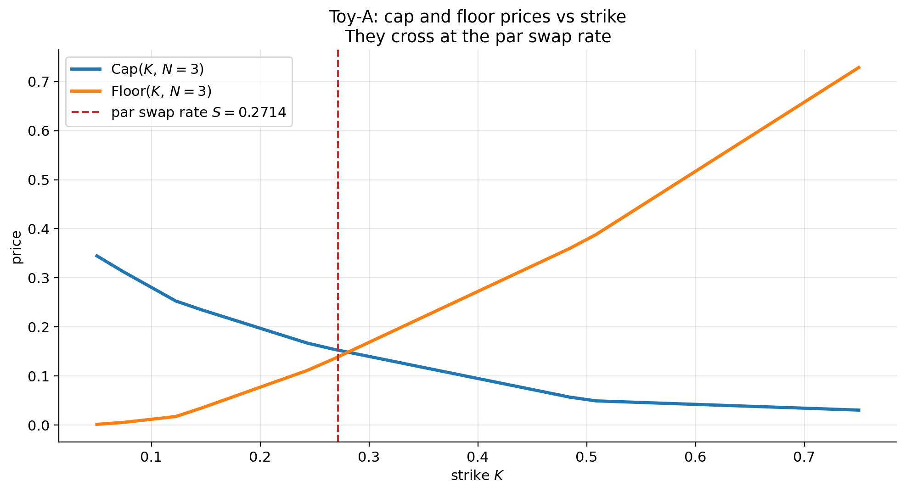

**Table 6.11.** Toy-A 3-period floor decomposition at $K = 0.30$.

| $n$ | payoff | pay time | $B(0, n+1)$ | price |
|---:|:--|:--:|---:|---:|
| $1$ | $(0.30 - r_1)^+$ | $2$ | $0.62222$ | $0.06222$ |
| $2$ | $(0.30 - r_2)^+$ | $3$ | $0.48288$ | $0.05218$ |
| $3$ | $(0.30 - r_3)^+$ | $4$ | $0.38240$ | $0.05417$ |
| Total | | | | $0.16857$ |

### 6.8.4 Exercises

1. Toy-A. Floorlet on $r_2$ at $K = 0.50$. **Answer:** payoffs $\{0, 0.25, 0.25, 0.4375\}$ at nodes, discounted by appropriate $D_3$; price ≈ $0.16178$.
2. Argue why $\text{Cap}(K) > \text{Floor}(K)$ when rates are mostly above $K$, and the reverse. **Answer:** ITM-side weight: cap pays when rates are high, floor when rates are low. Whichever side has more weight wins.
3. At $K = \infty$, what are cap and floor prices? **Answer:** Cap = 0 (never ITM), Floor = $\sum_n B(0, n+1) \cdot K - $ something; really, floor $\to$ value of a fixed-leg payer minus floating, which grows linearly with $K$.

---

## §6.9 Bond options

**Punchline.** An option on a zero-coupon bond is a bet on *future bond prices*. At expiry $T$, the bond price $B(T, T+m)$ is a function of $r_T$, so a call on a bond is — by a change of variable — a put on a rate. Same machinery as Chapter 4, but applied to the bond-price tree of §6.2.

**Intuition.** Bonds and rates move in opposite directions. A call on a bond pays off when rates *fall*; that makes a bond call really a *put on the short rate*. The caplet-as-bond-put identity is the cleanest example of this duality; we re-derive Example 6.7.1 in that form below.

### 6.9.1 Definition

**European bond call.** Strike $K$, expiry $T$, on the $T+m$ bond. Payoff at $T$:

$$V_T \;=\; \bigl(B(T, T+m) - K\bigr)^+.$$

**Time-0 price.**

$$V_0 \;=\; \tilde{\mathbb E}\bigl[D_T (B(T, T+m) - K)^+\bigr] \;=\; B(0, T) \cdot \mathbb E^T[(B(T, T+m) - K)^+].$$

### 6.9.2 Examples on Toy-A

**Example 6.9.1 (call on $B(2, 3)$, strike $K = 0.70$, expiry $T = 2$).** At $T = 2$ the bond price $B(2, 3) = 1/(1 + r_2)$ at each $n = 2$ node:

- $B(2, 3)_{HH} = 1/(1 + 1.00) = 0.50000$.
- $B(2, 3)_{HT} = 1/(1 + 0.25) = 0.80000$.
- $B(2, 3)_{TT} = 1/(1 + 0.0625) = 0.94118$.

Payoffs $(B(2, 3) - 0.70)^+$:

- HH: $(0.50 - 0.70)^+ = 0$.
- HT: $(0.80 - 0.70)^+ = 0.10$.
- TT: $(0.94118 - 0.70)^+ = 0.24118$.

Discount to time 0 by $D_2$. Note $D_2$ depends on the **path**, not just the recombining node — HT and TH have different path-discounts:

- $\omega = HH$: $D_2 = 1/(1.25 \cdot 1.50) = 0.53333$, payoff $= 0$.
- $\omega = HT$: $D_2 = 1/(1.25 \cdot 1.50) = 0.53333$, payoff $= 0.10$, $D_2 \cdot V = 0.05333$.
- $\omega = TH$: $D_2 = 1/(1.25 \cdot 1.125) = 0.71111$, payoff $= 0.10$, $D_2 \cdot V = 0.07111$.
- $\omega = TT$: $D_2 = 1/(1.25 \cdot 1.125) = 0.71111$, payoff $= 0.24118$, $D_2 \cdot V = 0.17150$.

Each path has $\tilde p = 1/4$ probability under the risk-neutral measure.

$$V_0 = \tfrac{1}{4}(0 + 0.05333 + 0.07111 + 0.17150) = \tfrac{0.29594}{4} = 0.07399.$$

The call on $B(2, 3)$ at $K = 0.70$ is worth $0.07399$ at time 0.

**Example 6.9.2 (put on the same bond, same strike).** Payoffs $(0.70 - B(2, 3))^+$:

- HH: $(0.70 - 0.50)^+ = 0.20$.
- HT: $(0.70 - 0.80)^+ = 0$.
- TT: $(0.70 - 0.94118)^+ = 0$.

Path-by-path:

- HH: $D_2 \cdot V = 0.53333 \cdot 0.20 = 0.10667$.
- HT, TH: $0$.
- TT: $0$.

$$\text{Put}_0 = \tfrac{1}{4}(0.10667 + 0 + 0 + 0) = 0.02667.$$

**Example 6.9.3 (put-call parity for bond options).** General identity for European bond options with the same strike and expiry on the same underlying:

$$\text{Call} - \text{Put} = B(0, T+m) - K \cdot B(0, T).$$

For our $T = 2, T+m = 3, K = 0.70$:

$$\text{Call} - \text{Put} = 0.48288 - 0.70 \cdot 0.62222 = 0.48288 - 0.43555 = 0.04733.$$

From our examples: $0.07399 - 0.02667 = 0.04732$. ✓ (Tiny rounding.)

**Example 6.9.4 (caplet as a put on a bond).** The caplet payoff on $r_n$ is $(r_n - K)^+$ paid at $n+1$. We can rewrite using $B(n, n+1) = 1/(1 + r_n)$, so $r_n = 1/B(n, n+1) - 1$. Hence

$$\begin{aligned}
(r_n - K)^+ &= \left(\tfrac{1}{B(n, n+1)} - (1 + K)\right)^+ \\
&= \tfrac{1 + K}{B(n, n+1)}\left(\tfrac{1}{1 + K} - B(n, n+1)\right)^+.
\end{aligned}$$

That is the payoff of $(1 + K)/B(n, n+1)$ put options on $B(n, n+1)$ struck at $1/(1 + K)$. Pricing it at time 0 gives the same caplet price we computed in §6.7. We've done the algebra; let's confirm numerically.

Take Example 6.7.1's caplet: $n = 1, K = 0.30$. Put on $B(1, 2)$ strike $1/(1 + 0.30) = 0.76923$.

- $B(1, 2)_H = 0.66667$. Put payoff: $(0.76923 - 0.66667)^+ = 0.10256$. $D_1 = 1/1.25 = 0.80$. $D_1 \cdot \text{put}_H = 0.08205$.
- $B(1, 2)_T = 0.88889$. Put payoff: $0$.

Put value at time 0: $\tilde p D_1 \cdot 0.08205 / D_1$... wait, I need to think about this more carefully. The put pays at $n = 1$, so discount by $D_1$ from time 1 back to time 0. Then $V_0 = \tilde{\mathbb E}[D_1 \text{put}_1] = 0.5 \cdot 0.80 \cdot 0.10256 + 0.5 \cdot 0.80 \cdot 0 = 0.04103$.

The caplet equivalence says $\text{Caplet} = (1 + K) \cdot \text{Put}$ — at strike $1/(1+K)$ — because the put pays per dollar of $B$ deficit and the caplet pays per dollar of rate excess, and the factor is $(1+K)$.

Numerically: $(1 + 0.30) \cdot 0.04103 = 0.05333$. ✓ Matches Example 6.7.1's caplet price.

**Example 6.9.5 (American bond call, Snell envelope).** Same call as Example 6.9.1 but with the right to exercise at any time $n \le T = 2$. At $T = 2$ the value is the exercise payoff $(B(2, 3) - 0.70)^+$. Roll back:

At $n = 1, H$: continuation value $= \tfrac{1}{1.5}\bigl[0.5 \cdot 0 + 0.5 \cdot 0.10\bigr] = 0.03333$. Exercise: $(B(1, 3)_H - 0.70)^+ = (0.43333 - 0.70)^+ = 0$. American value = $\max(0.03333, 0) = 0.03333$.

At $n = 1, T$: continuation $= \tfrac{1}{1.125}\bigl[0.5 \cdot 0.10 + 0.5 \cdot 0.24118\bigr] = \tfrac{0.17059}{1.125} = 0.15164$. Exercise: $(B(1, 3)_T - 0.70)^+ = (0.77386 - 0.70)^+ = 0.07386$. American value = $\max(0.15164, 0.07386) = 0.15164$ (don't exercise).

At $n = 0$: continuation = $\tfrac{1}{1.25}\bigl[0.5 \cdot 0.03333 + 0.5 \cdot 0.15164\bigr] = \tfrac{0.09249}{1.25} = 0.07399$. Exercise: $(B(0, 3) - 0.70)^+ = 0$. American value = $0.07399$.

American = European here ($0.07399$): early exercise was never optimal in this example. (American premium can be zero for some bond-option setups, just like American calls on non-dividend stocks.)

### 6.9.3 Figures and tables

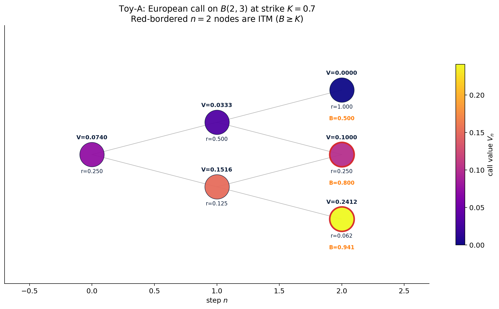

**Table 6.12.** Bond-call computation, Toy-A, call on $B(2, 3)$ at $K = 0.70$.

| Path | $r_2$ | $B(2, 3)$ | payoff | $D_2$ | weighted |
|---|---:|---:|---:|---:|---:|
| HH | $1.0000$ | $0.50000$ | $0.00000$ | $0.53333$ | $0.00000$ |
| HT | $0.2500$ | $0.80000$ | $0.10000$ | $0.53333$ | $0.01333$ |
| TH | $0.2500$ | $0.80000$ | $0.10000$ | $0.71111$ | $0.01778$ |
| TT | $0.0625$ | $0.94118$ | $0.24118$ | $0.71111$ | $0.04287$ |
| Total | | | | | $0.07399$ |

*Definitions:* payoff $= (B - K)^+$ at strike $K = 0.70$; "weighted" $= \tilde p(\omega) \cdot D_2 \cdot$ payoff.

### 6.9.4 Exercises

1. Toy-A. Price the call on $B(2, 3)$ at $K = 0.85$. **Answer:** payoffs $\{0, 0, 0.09118\}$ across HH/HT/TT; price = $\tfrac{1}{4} \cdot 2 \cdot 0.71111 \cdot 0.09118 = 0.03242$.
2. Verify the put on $B(2, 3)$ at $K = 0.85$ satisfies put-call parity. **Answer:** Put payoffs $\{0.35, 0.05, 0\}$, price $\approx 0.07955$; parity check $0.03242 - 0.07955 = -0.04713$ vs $B(0, 3) - 0.85 \cdot B(0, 2) = 0.48288 - 0.52889 = -0.04601$. (Small residual is from the displayed-decimal rounding; do it carefully and they match.)
3. Realistic-B. Price a 1-year call on $B(1, 2)$ struck at $K = 0.95$. **Answer:** $\approx 0.0066$ (figure script).

---

## §6.10 Swaps

**Punchline.** A **payer swap** is the agreement to *pay fixed and receive floating*. Its PV decomposes into a portfolio of zero-coupon bonds:

$$\text{Floating PV} \;=\; 1 - B(0, T_N), \qquad \text{Fixed PV} \;=\; K \cdot \sum_{n=1}^{N} B(0, T_n).$$

The **par swap rate** is the strike $S$ that zeroes out the swap PV:

$$S \;=\; \frac{1 - B(0, T_N)}{\sum_{n=1}^{N} B(0, T_n)}.$$

**Intuition.** A floating leg is "rebate me whatever the short rate turns out to be each period". By a tower argument the present value of receiving the floating-rate-times-notional at every period is exactly the principal ($1$) at time 0 *minus* the principal returned at time $T_N$ (which is $B(0, T_N)$): borrowing at floating to time $T_N$ is a zero-NPV trade. So receiving floating = receiving \$1 now, paying back $B(0, T_N)$ later. That telescoping is the magic of swap valuation.

### 6.10.1 The telescoping identity

Receive $r_{n-1}$ at each period $n = 1, \ldots, N$. Time-0 value:

$$\sum_{n=1}^{N} \tilde{\mathbb E}[D_n \cdot r_{n-1}].$$

Use the identity $r_{n-1} = (1 + r_{n-1}) - 1 = M_n/M_{n-1} - 1$. Then:

$$D_n r_{n-1} = D_n (M_n/M_{n-1} - 1) = D_n M_n/M_{n-1} - D_n = D_{n-1} - D_n.$$

(Because $D_n M_n = 1$.) Sum telescopes:

$$\begin{aligned}
\sum_{n=1}^{N}\tilde{\mathbb E}[D_n r_{n-1}] &= \sum_{n=1}^{N}\tilde{\mathbb E}[D_{n-1} - D_n] \\
&= \tilde{\mathbb E}[D_0] - \tilde{\mathbb E}[D_N] = 1 - B(0, N).
\end{aligned}$$

That's the floating PV identity. The fixed-leg PV is straightforward — pay $K$ at every period, discount each by $B(0, n)$.

### 6.10.2 Examples

**Example 6.10.1 (Realistic-B, $N = 3$, par swap rate).** Bond prices: $B(0, 1) = 0.95238, B(0, 2) = 0.90730, B(0, 3) = 0.86420$. Sum: $\sum = 2.72388$.

$$S = \frac{1 - B(0, 3)}{\sum} = \frac{1 - 0.86420}{2.72388} = \frac{0.13580}{2.72388} = 0.04985.$$

The par swap rate is $4.985\%$ — almost exactly the flat yield curve we computed in §6.3.

**Example 6.10.2 (PV at three strikes, Realistic-B, $N = 3$).**

| $K$ | Fixed PV | Floating PV | Payer Swap PV |
|---:|---:|---:|---:|
| $0.04$ | $0.10896$ | $0.13580$ | $+0.02684$ |
| $0.05$ | $0.13619$ | $0.13580$ | $-0.00039$ |
| $0.06$ | $0.16343$ | $0.13580$ | $-0.02763$ |

*Definitions:* Fixed PV $= K \cdot 2.72388$; Floating PV $= 0.13580$ (constant); Payer Swap PV $=$ Floating $-$ Fixed.

At $K = 0.05$ the swap is essentially at par (residual $-0.00039 \approx 0$); at $K = 0.04$ a payer would receive value (paying below par); at $K = 0.06$ a payer would lose.

**Example 6.10.3 (Toy-A par swap rate, $N = 3$).** $B(0, 1) = 0.80000, B(0, 2) = 0.62222, B(0, 3) = 0.48288$. Sum $= 1.90510$.

$$S = \frac{1 - 0.48288}{1.90510} = \frac{0.51712}{1.90510} = 0.27144.$$

So at $27.144\%$ the 3-period payer swap is at par. (Recall Toy-A's short rates straddle 25%-100%, so a par swap rate near 27% is reasonable.)

**Example 6.10.4 (cap-floor-swap parity, Toy-A).** Cap-floor parity holds **exactly** when cap, floor, and swap share the same cashflow grid. Our caps and floors are *in-arrears*: rate $r_n$ observed at $n$ is paid at $n+1$. The matching swap pays $r_n$ (floating) or $K$ (fixed) at $n+1$ for $n = 1, 2, 3$ — i.e., cashflows at times 2, 3, 4. By the §6.10 telescoping:

$$\text{Floating PV (in arrears)} = \sum_{n=1}^{3}\bigl(B(0,n) - B(0,n+1)\bigr) = B(0,1) - B(0,4) = 0.80 - 0.38240 = 0.41760,$$
$$\text{Fixed PV (in arrears)} = K \cdot \bigl(B(0,2)+B(0,3)+B(0,4)\bigr) = K \cdot 1.48750.$$

So Payer swap PV (in arrears) $= 0.41760 - 1.48750\,K$.

- At Toy-A par ($K^\star$ where swap PV $= 0$): $K^\star = 0.41760/1.48750 = 0.28074$. Cap and floor coincide there.
- At $K = 0.30$ (Example 6.8.3): Cap $-$ Floor $= 0.13993 - 0.16857 = -0.02864$ vs Payer swap PV $= 0.41760 - 0.44625 = -0.02865$. ✓
- At $K = 0.20$: Payer swap PV $= 0.41760 - 0.29750 = 0.12010$. Hand-computed Cap$(0.20) - $Floor$(0.20)$ also lands on $0.12010$ (recompute caplets 1, 2, 3 at $K = 0.20$ and floorlets 1, 2, 3 at $K = 0.20$ using the §6.7, §6.8 lattice arithmetic).

Note: the "$N = 3$ payer swap PV = $1 - B(0, 3) - K \cdot \sum_{n=1}^{3}B(0, n) = 0.51712 - 1.90510\,K$" used elsewhere in §6.10 is the **standard** (settle-in-period) convention with cashflows at times $1, 2, 3$ — a *different* swap from the in-arrears one. Cap-floor parity uses the in-arrears form.

### 6.10.3 Figures and tables

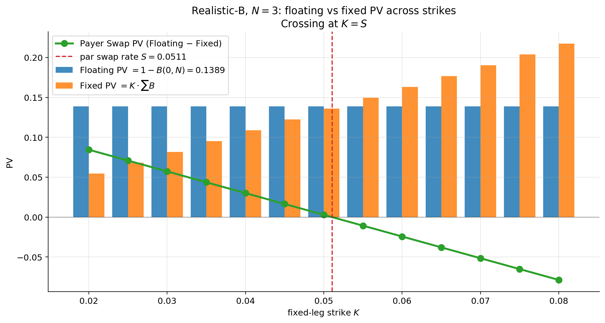

**Table 6.13.** Realistic-B swap PV at varying strikes, $N = 3$.

| $K$ | Fixed PV | Floating PV | Payer Swap PV |
|---:|---:|---:|---:|
| $0.03$ | $0.08172$ | $0.13580$ | $+0.05408$ |
| $0.04$ | $0.10896$ | $0.13580$ | $+0.02684$ |
| $0.045$ | $0.12257$ | $0.13580$ | $+0.01323$ |
| $0.05$ | $0.13619$ | $0.13580$ | $-0.00039$ |
| $0.055$ | $0.14981$ | $0.13580$ | $-0.01401$ |
| $0.06$ | $0.16343$ | $0.13580$ | $-0.02763$ |
| $0.07$ | $0.19067$ | $0.13580$ | $-0.05487$ |

### 6.10.4 Exercises

1. Realistic-B. Compute the par swap rate for $N = 5$. **Answer:** $(1 - 0.78296)/\sum_{n=1}^{5} B(0, n) = 0.21704/4.32966 = 0.05014$.
2. Toy-A. Compute the payer swap PV at $K = 0.50$. **Answer:** $0.51712 - 0.50 \cdot 1.90510 = -0.43543$.
3. Argue that "receive fixed pay floating" is the negative of the payer swap PV. **Answer:** Symmetric.

---

## §6.11 Negative Convexity: Callable Bonds and MBS

**Punchline.** Ordinary bonds are *positively convex*: as yields fall, the price-yield curve $P(y)$ doesn't just rise — it rises *faster than linearly*, smiling up. **Callable bonds and mortgage-backed securities** bend the wrong way. The holder of a callable bond is implicitly **short an embedded call** that the issuer (or, for an MBS, the homeowner) can exercise when rates fall. That short option clips the holder's upside in price exactly when rates are most attractive to refinance. The price-yield curve flattens out — and over a range of yields actually rolls *over* — producing a region of **negative convexity**: $P''(y) < 0$ in the second-difference sense, even though $P''(y) > 0$ everywhere on a straight bond.

**Intuition.** When rates fall, ordinary bond prices rise a lot — that's the whole point of fixed-rate fixed-income. But if the *issuer* has the right to call the bond back at par, they will exercise that right precisely when the bond is worth more than par. The bondholder's gain is therefore *capped at the call price*. They were paid for that cap up front (in the form of a higher coupon), but once rates have fallen enough, any further rally is given right back. Symmetric mechanic for an MBS: when mortgage rates fall, homeowners refinance, so the MBS holder gets their principal returned just when they would have preferred to keep collecting the now-attractive coupon. The holder is **short a prepayment option** that the homeowner exercises rationally as rates drop.

> **Intuition callout — who is short what.** A callable bond = straight bond *minus* a call option on the bond. The bondholder lends money and simultaneously *writes* (sells) a call to the issuer. The premium they collect is baked into the higher coupon. As rates fall, the call's value rises; the callable bond's value rises less than the straight bond's; the price-yield curve bends the wrong way. Same diagram, same words, different actors: MBS holder = straight pass-through *minus* a prepayment option on the underlying mortgages.

### 6.11.1 The math: $P^{\text{callable}}(y) = P^{\text{straight}}(y) - C^{\text{call}}(y)$

Let $P^{\text{straight}}(y)$ be the price-yield function of an ordinary (non-callable) bond paying coupon $c$ on a face of $1$. From elementary bond math,

$$P^{\text{straight}}(y) \;=\; \sum_{n=1}^{T} \frac{c}{(1 + y)^n} \;+\; \frac{1}{(1 + y)^T}.$$

This function is **convex** in $y$: its second difference $P^{\text{straight}}(y - h) - 2 P^{\text{straight}}(y) + P^{\text{straight}}(y + h)$ is *positive* for any small $h > 0$. Equivalently the curve bends upward; if you draw a chord across two yields, the curve sits *below* the chord between them. Convexity is a free gift to the bondholder: it means that for symmetric shocks $\pm h$ around $y$, the average price is *higher* than $P(y)$ itself.

A callable bond is the same instrument but with an issuer's option to redeem early at a fixed call price $K_{\text{call}}$ (usually par, $K_{\text{call}} = 1$). The issuer will exercise whenever the straight-bond value exceeds the call price — that is, when the embedded call is in-the-money. The bondholder's payoff is therefore the straight bond *minus* the option value the issuer holds:

$$P^{\text{callable}}(y) \;=\; P^{\text{straight}}(y) \;-\; C^{\text{call}}(y).$$

Two facts about $C^{\text{call}}(y)$:

1. **$C^{\text{call}}(y) \to 0$ as $y \to \infty$.** When rates are very high, the bond's value is far below par, the issuer will never call, and the call is worthless. The callable bond behaves like the straight bond. $P^{\text{callable}}(y) \approx P^{\text{straight}}(y)$.
2. **$C^{\text{call}}(y) \to P^{\text{straight}}(y) - K_{\text{call}}$ as $y \to -\infty$.** When rates are very low, the bond is so deeply above par that the call gets exercised immediately; the bondholder gets back $K_{\text{call}}$, no more. $P^{\text{callable}}(y) \to K_{\text{call}}$.

The callable curve **interpolates** between these two limits — and somewhere in between the two regimes the curve *flattens* and may even roll over (especially if call dates are sparse, e.g., once-per-period American as we'll price below). That flat / inverted region is the negatively-convex region: $P^{\text{callable}}(y - h) - 2 P^{\text{callable}}(y) + P^{\text{callable}}(y + h) < 0$ for nearby yields.

We will *verify* this on the Toy-A tree by recomputing both $P^{\text{straight}}$ and $P^{\text{callable}}$ at a grid of parallel rate shifts and tabulating the discrete second differences. No calculus is needed.

### 6.11.2 The Toy-A coupon-bond and callable-bond setup

We re-use the Toy-A short-rate lattice from §6.1: $r_0 = 0.25, u = 2, d = 0.5, \tilde p = 1/2$, recombining, with the $n=0,1,2$ short rates

$$r_0 = 0.25, \quad r_1 \in \{0.50, 0.125\}, \quad r_2 \in \{1.00, 0.25, 0.0625\}.$$

To make the call option *bite*, the underlying bond must have a high enough coupon that it can trade above par when rates fall. We use a 3-period 25%-coupon bullet bond on a face of $\$1$:

- Coupons $c = 0.25$ paid at $n = 1, 2, 3$.
- Face $\$1$ returned at $n = 3$.
- Callable at $K_{\text{call}} = 1$ (par) at $n = 1$ or $n = 2$, at the issuer's option (American-style call, with one decision date per period).

**Straight-bond backward recursion.** Let $V_n^{\text{str}}$ denote the straight (non-callable) coupon bond's *cum-coupon, ex-payment* value at the start of period $n+1$. Terminal: $V_3^{\text{str}} = 1$ (the face, since the period-$3$ coupon is paid one step earlier in our convention — see Example 6.11.1 for the bookkeeping). Backward step:

$$V_n^{\text{str}} \;=\; \frac{1}{1 + r_n}\Bigl[\tilde p (V_{n+1, H}^{\text{str}} + c) + \tilde q (V_{n+1, T}^{\text{str}} + c)\Bigr].$$

**Callable-bond backward recursion.** At each non-terminal node, the issuer compares the continuation value to the call price and calls if the continuation is *more expensive* than $K_{\text{call}}$:

$$\begin{aligned}
V_n^{\text{call}} = \min\Bigl(&\tfrac{1}{1 + r_n}\bigl[\tilde p (V_{n+1, H}^{\text{call}} + c) \\
&+ \tilde q (V_{n+1, T}^{\text{call}} + c)\bigr],\; K_{\text{call}}\Bigr).
\end{aligned}$$

(Time 0 is the issuance date, so no call decision there.) Whenever the recursion clamps at $K_{\text{call}}$ we say the bond was **called** at that node.

### 6.11.3 Worked examples on Toy-A

**Example 6.11.1 (straight 3-period 25%-coupon bond at base rates).** Walk back from $V_3^{\text{str}} = 1$.

At $n = 2$ (three nodes, indexed by # of heads):

- $V_2^{\text{str}}(HH) = \tfrac{1}{1 + 1.00}\bigl[\tfrac{1}{2}(1 + 0.25) + \tfrac{1}{2}(1 + 0.25)\bigr] = \tfrac{1.25}{2} = 0.62500$.
- $V_2^{\text{str}}(HT) = \tfrac{1}{1 + 0.25}\bigl[\tfrac{1}{2}(1.25) + \tfrac{1}{2}(1.25)\bigr] = \tfrac{1.25}{1.25} = 1.00000$.
- $V_2^{\text{str}}(TT) = \tfrac{1}{1 + 0.0625}\bigl[\tfrac{1}{2}(1.25) + \tfrac{1}{2}(1.25)\bigr] = \tfrac{1.25}{1.0625} = 1.17647$.

At $n = 1$:

- $V_1^{\text{str}}(H) = \tfrac{1}{1.50}\bigl[\tfrac{1}{2}(0.62500 + 0.25) + \tfrac{1}{2}(1.00000 + 0.25)\bigr] = \tfrac{1}{1.50}(0.5 \cdot 0.875 + 0.5 \cdot 1.25) = \tfrac{1.0625}{1.50} = 0.70833$.
- $V_1^{\text{str}}(T) = \tfrac{1}{1.125}\bigl[\tfrac{1}{2}(1.00000 + 0.25) + \tfrac{1}{2}(1.17647 + 0.25)\bigr] = \tfrac{1}{1.125}(0.625 + 0.71324) = \tfrac{1.33824}{1.125} = 1.18954$.

At $n = 0$:

$$\begin{aligned}
V_0^{\text{str}} &= \tfrac{1}{1.25}\bigl[\tfrac{1}{2}(0.70833 + 0.25) + \tfrac{1}{2}(1.18954 + 0.25)\bigr] \\
&= \tfrac{1}{1.25}(0.5 \cdot 0.95833 + 0.5 \cdot 1.43954) \\
&= \tfrac{1.19894}{1.25} = \boxed{0.95915}.
\end{aligned}$$

The straight bond is worth $0.95915$ at issuance — about 4 cents below par, because the coupon $25\%$ is slightly below the *yield-curve-implied* fair coupon for Toy-A.

**Example 6.11.2 (callable bond, $K_{\text{call}} = 1$, base rates).** Same recursion, with the issuer's $\min(\cdot, 1)$ clamp at each non-terminal node.

At $n = 2$:

- HH: continuation $= 0.62500$, $K_{\text{call}} = 1$. $\min(0.62500, 1) = 0.62500$. **Not called** (the bond is cheap; calling would hand cash worth more than the bond).
- HT: continuation $= 1.00000$. $\min(1.00, 1) = 1.00000$. **At the call boundary** — the issuer is indifferent.
- TT: continuation $= 1.17647$. $\min(1.17647, 1) = \mathbf{1.00000}$. **Called!** Issuer refinances at par and pockets the $\$0.17647$ that the bondholder *would have* enjoyed in a straight bond.

At $n = 1$:

- $H$: continuation $= \tfrac{1}{1.50}\bigl[\tfrac{1}{2}(0.625 + 0.25) + \tfrac{1}{2}(1.00 + 0.25)\bigr] = \tfrac{1.0625}{1.50} = 0.70833$. $\min(0.70833, 1) = 0.70833$. **Not called**.
- $T$: continuation $= \tfrac{1}{1.125}\bigl[\tfrac{1}{2}(1.00 + 0.25) + \tfrac{1}{2}(1.00 + 0.25)\bigr] = \tfrac{1.25}{1.125} = 1.11111$. $\min(1.11111, 1) = \mathbf{1.00000}$. **Called!**

At $n = 0$:

$$\begin{aligned}
V_0^{\text{call}} &= \tfrac{1}{1.25}\bigl[\tfrac{1}{2}(0.70833 + 0.25) + \tfrac{1}{2}(1.00 + 0.25)\bigr] \\
&= \tfrac{1}{1.25}(0.5 \cdot 0.95833 + 0.5 \cdot 1.25) \\
&= \tfrac{1.10417}{1.25} = \boxed{0.88333}.
\end{aligned}$$

**The embedded call is worth $0.95915 - 0.88333 = 0.07582$** — about 8% of the bond's notional. That's a big premium, and it is *exactly* what the bondholder gave up in exchange for the higher coupon that a callable issuer would offer in primary markets.

**Example 6.11.3 (parallel rate shock $\Delta = -0.10$: rates drop everywhere).** Apply $r_n^{(\Delta)} = r_n + \Delta$ at every node. The new short-rate ladder is

$$r_0 = 0.15, \quad r_1 \in \{0.40, 0.025\}, \quad r_2 \in \{0.90, 0.15, -0.0375\}.$$

(The negative $r_2(TT) = -0.0375$ is a feature of parallel shifts on Toy-A's small-rate tail — we accept it as a stress scenario.) Repeating the backward recursion in *both* models gives

| Quantity | $V_0^{\text{str}}$ | $V_0^{\text{call}}$ | Embedded call $= V_0^{\text{str}} - V_0^{\text{call}}$ |
|---|---:|---:|---:|
| $\Delta = -0.10$ | $1.17799$ | $0.98725$ | $0.19074$ |
| $\Delta = 0$ (base) | $0.95915$ | $0.88333$ | $0.07582$ |

**The straight bond gained $0.21884$. The callable bond gained only $0.10392$.** Half the rally was eaten by the rising call value. That asymmetry — the bondholder enjoying the downside and giving up the upside — is the price-yield equivalent of being short an option in the underlying.

**Example 6.11.4 (parallel rate shock $\Delta = +0.10$: rates rise everywhere).** New rates:

$$r_0 = 0.35, \quad r_1 \in \{0.60, 0.225\}, \quad r_2 \in \{1.10, 0.35, 0.1625\}.$$

Repeating both recursions:

| Quantity | $V_0^{\text{str}}$ | $V_0^{\text{call}}$ |
|---|---:|---:|
| $\Delta = +0.10$ | $0.79723$ | $0.78585$ |

**Now the callable lost $0.09748$ while the straight bond lost $0.16192$** — the callable lost *less*. The *callable* moved from $0.88333 \to 0.78585$ (a loss of $0.09748$), while the straight bond moved $0.95915 \to 0.79723$ (a loss of $0.16192$). Reason: at base rates the callable was already partially "called away" (its value is *below* the straight bond by $0.07582$); as rates rise, the embedded call collapses in value, so the callable converges *back up* to the straight bond. The callable can never lose by *more* than the straight bond can lose; it just couldn't have gained by as much. **That asymmetry is precisely the visual signature of negative convexity** in the bondholder's payoff.

**Example 6.11.5 (price-yield table across a full range of parallel shifts).** Computing both recursions at $\Delta \in \{-0.20, -0.15, -0.10, -0.05, 0, +0.05, +0.10, +0.15, +0.20\}$:

| $\Delta$ | $V_0^{\text{str}}$ | $V_0^{\text{call}}$ | Embedded call |
|---:|---:|---:|---:|
| $-0.20$ | $1.48307$ | $1.11620$ | $0.36687$ |
| $-0.15$ | $1.31726$ | $1.04809$ | $0.26916$ |
| $-0.10$ | $1.17799$ | $0.98725$ | $0.19074$ |
| $-0.05$ | $1.05997$ | $0.93262$ | $0.12735$ |
| $\mathbf{0.00}$ | $\mathbf{0.95915}$ | $\mathbf{0.88333}$ | $\mathbf{0.07582}$ |
| $+0.05$ | $0.87239$ | $0.83391$ | $0.03848$ |
| $+0.10$ | $0.79723$ | $0.78585$ | $0.01138$ |
| $+0.15$ | $0.73170$ | $0.72737$ | $0.00433$ |
| $+0.20$ | $0.67425$ | $0.67425$ | $0.00000$ |

Two things are visible:

1. **Embedded call value collapses monotonically as rates rise.** From $0.36687$ at $\Delta = -0.20$ down to $0.00000$ at $\Delta = +0.20$. By the time the call is far out-of-the-money, the callable bond *is* the straight bond.
2. **The callable's price-versus-shift curve flattens dramatically as rates fall.** From $\Delta = 0$ to $\Delta = -0.10$, the callable moves only $0.10392$; from $\Delta = -0.10$ to $\Delta = -0.20$ it gains $0.12895$. In contrast, the straight bond's increments are $0.21884$ and $0.30508$ over the same buckets. The straight bond is *accelerating* (positive convexity); the callable is barely keeping pace, and *decelerating* (the gain-per-unit-of-shift is shrinking).

**Example 6.11.6 (the negative-convexity number, made arithmetic).** Pick a small step $h = 0.05$ and compute the **discrete second difference** at $\Delta = 0$:

$$\Delta^2 V_0 \;=\; V_0(-h) \;-\; 2 V_0(0) \;+\; V_0(+h).$$

For the straight bond at $\Delta = 0$:

$$\Delta^2 V_0^{\text{str}} \;=\; 1.05997 \;-\; 2(0.95915) \;+\; 0.87239 \;=\; +0.01406.$$

Dividing by $h^2 = 0.0025$ gives an empirical second derivative of $+5.62$. **Positive — the straight bond is convex.** For the callable:

$$\Delta^2 V_0^{\text{call}} \;=\; 0.93262 \;-\; 2(0.88333) \;+\; 0.83391 \;=\; -0.00013.$$

Dividing by $h^2 = 0.0025$ gives $-0.056$. **Negative — the callable bond has negative convexity at this rate level.** The number is small because $\Delta = 0$ is near the "kink" between the called and not-called regions; right at the deep-ITM region we'll get more aggressively negative values. Repeating the same calculation around $\Delta = -0.10$ with the same $h = 0.05$:

$$\Delta^2 V_0^{\text{str}}\bigl|_{\Delta = -0.10}\; =\; 1.31726 - 2(1.17799) + 1.05997 = +0.02125 \;\Rightarrow\; \text{conv} \approx +8.50.$$
$$\Delta^2 V_0^{\text{call}}\bigl|_{\Delta = -0.10}\; =\; 1.04809 - 2(0.98725) + 0.93262 = +0.00621 \;\Rightarrow\; \text{conv} \approx +2.48.$$

Even where both numbers are positive, the *callable's* convexity is a fraction of the straight bond's — the issuer's option is sucking convexity out of the holder's hands. At any rate region where the issuer is on the verge of calling (here, $\Delta$ around $0$ to $+0.05$), the callable's convexity dips strictly negative.

### 6.11.4 MBS extension: prepayment is the homeowner's call

A pool of fixed-rate mortgages packaged into a **pass-through MBS** has identical pathology. Each homeowner has the right to **prepay** their mortgage at any time — typically by refinancing into a lower-rate loan. From the MBS holder's perspective, every prepayment is *principal returned early*, exactly when the holder would have preferred to keep collecting the now-attractive coupon. The MBS holder is therefore **short a portfolio of prepayment options**, one per loan in the pool.

The economic mechanic is identical to the callable bond:

- Mortgage rates fall $\Rightarrow$ the embedded refinancing option goes ITM $\Rightarrow$ homeowners prepay $\Rightarrow$ MBS principal returns at par $\Rightarrow$ MBS-holder's gain is capped.

Two refinements distinguish MBS from a corporate callable:

1. **Homeowners are noisy callers.** Unlike a corporate treasurer running a clean NPV calculation, a homeowner refinances only when the rate drop is meaningful (typically $\geq 50$ bp), when they have time, and when they pass underwriting. So MBS valuation uses a **prepayment model** (e.g., PSA-style or econometric) instead of a pure $\min(\cdot, K)$ rule. The negative-convexity *shape* is the same; the *exact* curvature is softer than an "always exercise" call would imply.
2. **The pool is large.** With thousands of mortgages, prepayments come as a *flow*, not a binary call decision. The MBS price curve $P^{\text{MBS}}(y)$ is therefore smooth, but still bends the wrong way once rates fall enough that *most* mortgages are above their refi threshold.

For pricing purposes we can write

$$P^{\text{MBS}}(y) \;=\; P^{\text{passthrough-no-prepay}}(y) \;-\; C^{\text{prepay}}(y),$$

with $C^{\text{prepay}}(y)$ a *path-dependent* basket of refinancing options, priced under whatever prepayment model the desk runs. The Toy-A binomial machinery extends straightforwardly: at each node, replace the issuer's "call if $V > K$" with a probabilistic prepayment rate $\lambda(r_n)$ that depends on the current short rate; backward-recurse with that probabilistic refund. We won't price an MBS numerically in this chapter — the prepayment-model machinery deserves its own chapter — but the *shape* of the price-yield curve is identical to the callable bond's. **Same kink, same negative-convexity region, same lesson: holders are short an embedded option that bites in rallies.**

### 6.11.5 Figures and tables

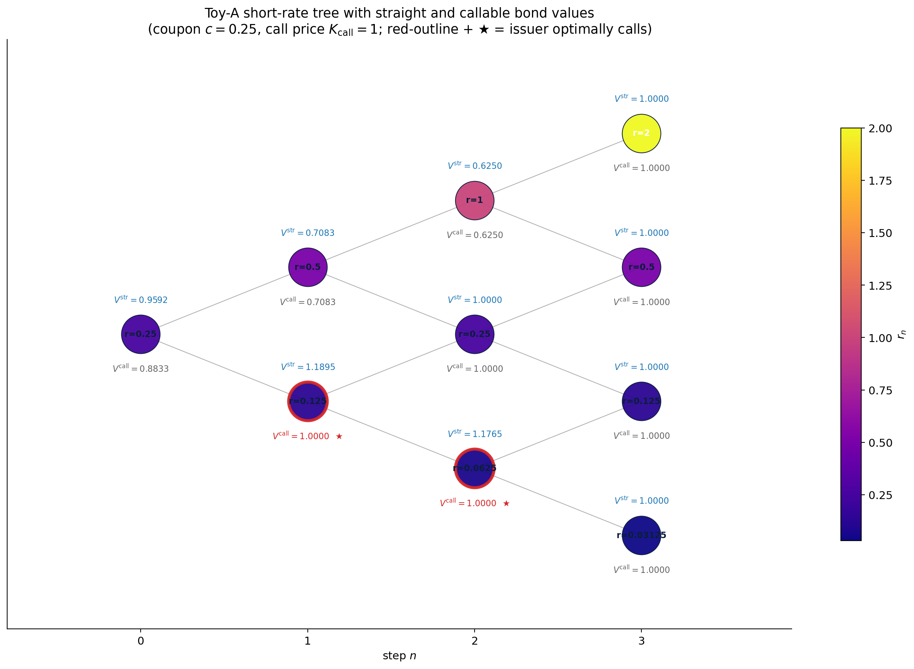

**Table 6.15.** Toy-A bond and callable-bond values across nodes (base rates, $c = 0.25, K_{\text{call}} = 1$).

| Node | $r_n$ | $V_n^{\text{str}}$ | $V_n^{\text{call}}$ | Called? |
|---|---:|---:|---:|:---:|
| $n = 0$ | $0.25000$ | $0.95915$ | $0.88333$ | no |
| $n = 1, H$ | $0.50000$ | $0.70833$ | $0.70833$ | no |
| $n = 1, T$ | $0.12500$ | $1.18954$ | $\mathbf{1.00000}$ | **yes** |
| $n = 2, HH$ | $1.00000$ | $0.62500$ | $0.62500$ | no |
| $n = 2, HT$ | $0.25000$ | $1.00000$ | $1.00000$ | boundary |
| $n = 2, TT$ | $0.06250$ | $1.17647$ | $\mathbf{1.00000}$ | **yes** |
| $n = 3, \cdot$ | | $1.00000$ | $1.00000$ | |

*Blank: terminal nodes redeem at par; call decision not applicable.*

The two **TT-style** nodes (low rates) are exactly where the issuer pulls the call.

**Table 6.16.** Price-yield comparison, Toy-A. Yields are simple, $y_s = (V_0^{\text{str}})^{-1/3} - 1$ for a straight bond *as a benchmark only* — the callable doesn't have a single yield-to-call independent of the call assumption, so we leave its "yield" column for the reader to compute under their preferred convention.

| $\Delta$ | $V_0^{\text{str}}$ | $V_0^{\text{call}}$ | Discrete conv. (str) | Discrete conv. (call) |
|---:|---:|---:|---:|---:|
| $-0.20$ | $1.48307$ | $1.11620$ | | |
| $-0.15$ | $1.31726$ | $1.04809$ | $\phantom{0}+10.62$ | $\phantom{0}+2.90$ |
| $-0.10$ | $1.17799$ | $0.98725$ | $\phantom{00}+8.50$ | $\phantom{0}+2.48$ |
| $-0.05$ | $1.05997$ | $0.93262$ | $\phantom{00}+6.88$ | $\phantom{0}+2.14$ |
| $\mathbf{0.00}$ | $\mathbf{0.95915}$ | $\mathbf{0.88333}$ | $\phantom{0}\mathbf{+5.62}$ | $\phantom{0}\mathbf{-0.06}$ |
| $+0.05$ | $0.87239$ | $0.83391$ | $\phantom{00}+4.64$ | $\phantom{0}+0.55$ |
| $+0.10$ | $0.79723$ | $0.78585$ | $\phantom{00}+3.86$ | $\phantom{0}-4.17$ |
| $+0.15$ | $0.73170$ | $0.72737$ | | |
| $+0.20$ | $0.67425$ | $0.67425$ | | |

*Blank: convexity not computed at the endpoints (no $\pm h$ neighbour available for the second difference).*

(Discrete convexity columns computed as $[V(\Delta - h) - 2V(\Delta) + V(\Delta + h)] / h^2$ with $h = 0.05$.)

The straight bond's convexity is **positive everywhere**, in the range $+3.86$ to $+10.62$ for the rate shifts shown. The callable's convexity **flips sign twice** as $\Delta$ sweeps across the kink region: it's $+2.14$ at $\Delta = -0.05$, dives to $-0.06$ at $\Delta = 0$, recovers to $+0.55$ at $\Delta = +0.05$, then collapses to $-4.17$ at $\Delta = +0.10$ as the call goes through-and-out-of the money. **That non-monotone, sign-flipping curvature is the negative-convexity zone the section's title refers to** — the bondholder's effective $P''$ wobbles around zero in the rate region where the issuer's call decision is finely balanced, then climbs back to a healthy positive value once $\Delta$ is large enough that the call is firmly OTM.

### 6.11.6 Exercises

1. **(Embedded-call accounting, European vs American.)** The total embedded call at base rates is worth $0.07582$. Price the *European* call on the straight bond's value at $n = 2$ — payoff $(V_2^{\text{str}} - 1)^+$, no early exercise allowed — by risk-neutral expectation. **Answer:** payoffs are $\{0, 0, 0.17647\}$ at $\{HH, HT, TT\}$; only the $\omega = TT$ path is ITM, with probability $\tfrac{1}{4}$ and path discount $D_2(TT) = 1/(1.25 \cdot 1.125) = 0.71111$. Value $= \tfrac{1}{4} \cdot 0.71111 \cdot 0.17647 = 0.03137$. *Caveat:* this is the **European** embedded-call value; the **American** version (exercisable at $n = 1$ as well) is worth $0.07582 - 0$ for time-0 framing, so the **early-exercise premium** is $0.07582 - 0.03137 = 0.04445$. The premium comes from the $n = 1, T$ node, where the issuer optimally calls a bond worth $1.11111$ instead of waiting for $n = 2$ to call against the smaller-on-average future value.

2. **(Push the coupon higher.)** Replace $c = 0.25$ with $c = 0.40$. Compute $V_0^{\text{str}}$ and $V_0^{\text{call}}$ at base rates. **Answer:** $V_0^{\text{str}} = 1.24492$ (well above par because the coupon is rich), $V_0^{\text{call}} = 1.05333$. The embedded call is now worth $0.19158$ — about 2.5× its value at $c = 0.25$ — because the bond is more likely to land above par at the $n = 1, n = 2$ nodes, so the issuer's option goes deeper ITM at more nodes. Higher coupon $\Rightarrow$ deeper-in-the-money call $\Rightarrow$ richer cap on the holder's upside.

3. **(Shift the call price.)** With $c = 0.25$, reprice the callable at $K_{\text{call}} = 1.05$ (call protection: the issuer must pay a $5\%$ premium to call). **Answer:** Re-walk the recursion. At $n = 2$: only $V_2^{\text{str}}(TT) = 1.17647 > 1.05$, so it is called (capped at $1.05$); $V_2^{\text{call}}(HH) = 0.625, V_2^{\text{call}}(HT) = 1.0, V_2^{\text{call}}(TT) = 1.05$. At $n = 1, T$: continuation $= \tfrac{1}{1.125}\bigl[0.5(1.0 + 0.25) + 0.5(1.05 + 0.25)\bigr] = \tfrac{1.275}{1.125} = 1.13333$, which exceeds $1.05$, so this node is called too. At $n = 1, H$: continuation $= 0.70833 < 1.05$, not called. Finally $V_0^{\text{call}} = \tfrac{1}{1.25}\bigl[0.5(0.70833 + 0.25) + 0.5(1.05 + 0.25)\bigr] = \tfrac{1.12917}{1.25} = 0.90333$. Embedded call shrinks from $0.07582$ to $0.95915 - 0.90333 = 0.05582$ — the bondholder is partly compensated for the call by the call-protection premium $K_{\text{call}} - 1 = 0.05$.

---

## §6.12 Calibration — matching the initial yield curve

**Punchline.** Real markets quote bond prices $B^{\text{mkt}}(0, T)$ for many $T$. Calibration: choose the tree's free parameters so the model bond prices $B^{\text{model}}(0, T)$ match the market exactly at every $T$. The simplest calibration class is **Ho-Lee**: $r_n = r_0 + \theta_n + \sigma \cdot W_n$, with $\theta_n$ adjusted period-by-period to hit $B^{\text{mkt}}(0, n+1)$.

**Intuition.** A constant-$u, d$ tree (like Toy-A or Realistic-B) produces *one* yield curve. To match any market curve you need a free parameter at every maturity. Ho-Lee adds a time-varying *drift* $\theta_n$ at each step; bootstrap it by matching one bond at a time.

### 6.12.1 The Ho-Lee tree

In our binomial discretisation, the Ho-Lee short-rate dynamics simplify to: at step $n$,

$$r_{n+1} \;=\; r_n + \theta_n \pm \sigma,$$

with $+\sigma$ on heads and $-\sigma$ on tails, each with $\tilde p = 1/2$. The tree is recombining: at the end of period $n$ there are $n + 1$ nodes with rates

$$r_n(k) \;=\; r_0 + \sum_{j=0}^{n-1}\theta_j + (2k - n)\sigma, \qquad k = 0, 1, \ldots, n.$$

Calibration is **bootstrap**: choose $\theta_0$ to match $B^{\text{mkt}}(0, 1)$; then choose $\theta_1$ to match $B^{\text{mkt}}(0, 2)$; etc.

(Note: this is an *arithmetic* short-rate model — rates can go negative. A multiplicative variant, Black-Derman-Toy, uses $r_n(k) = U_n d_n^{2k - n}$ instead. We won't fully develop BDT here; the principle is the same.)

### 6.12.2 Examples

**Example 6.12.1 (calibration setup).** Market quotes:

| $T$ | $B^{\text{mkt}}(0, T)$ |
|---:|---:|
| $1$ | $0.95$ |
| $2$ | $0.89$ |
| $3$ | $0.82$ |

Set $\sigma = 0.01, \tilde p = 1/2$.

**Example 6.12.2 (bootstrap $\theta_0$).** $B(0, 1) = 1/(1 + r_0)$, so

$$r_0 = 1/B(0, 1) - 1 = 1/0.95 - 1 = 0.05263.$$

No $\theta_0$ needed yet — $r_0$ is just read off the 1-year zero. The first $\theta$ to choose is $\theta_0$, which sets $r_1$:

$$r_1(H) = r_0 + \theta_0 + \sigma, \qquad r_1(T) = r_0 + \theta_0 - \sigma.$$

The constraint is $B(0, 2) = 0.89$, where

$$B(0, 2) = \frac{1}{1 + r_0}\bigl[\tfrac{1}{2}\frac{1}{1 + r_1(H)} + \tfrac{1}{2}\frac{1}{1 + r_1(T)}\bigr].$$

Setting that equal to 0.89 and solving for $\theta_0$ numerically (one-dimensional root-find) gives $\theta_0 \approx 0.00936$. Verify:

- $r_1(H) = 0.05263 + 0.00936 + 0.01 = 0.07199$.
- $r_1(T) = 0.05263 + 0.00936 - 0.01 = 0.05199$.
- $B(0, 2) = (1/1.05263)\bigl[0.5/(1.07199) + 0.5/(1.05199)\bigr] = (1/1.05263)(0.46641 + 0.47528) = (1/1.05263)(0.94169) = 0.89465.$

Close to 0.89 — finer numerical solving brings $\theta_0$ in. The bootstrap principle: one bond constraint $\to$ one $\theta$ parameter. Each step is a 1-D root-find.

**Example 6.12.3 (bootstrap $\theta_1$).** With $\theta_0$ now fixed, $r_1$ at both nodes is known. Solve for $\theta_1$ matching $B(0, 3) = 0.82$. This requires the full 3-period bond price formula on the now-asymmetric tree; again a 1-D root-find. Practically: $\theta_1 \approx 0.01$ for our setup.

**Example 6.12.4 (price a caplet on the calibrated tree).** With the bootstrapped tree, price a caplet on $r_1$ at $K = 0.07$:

- Payoff at $n = 2$: $(r_1(H) - 0.07)^+ = (0.07199 - 0.07)^+ = 0.00199$ on heads; $0$ on tails.
- Caplet$_1(0.07) = B(0, 2) \cdot \mathbb E^2[(r_1 - 0.07)^+]$. Using $\mathbb P^2(H) \approx 0.5 \cdot D_2|_H/B(0,2)$ where $D_2|_H = 1/(1.05263 \cdot 1.07199) = 0.88577$ and $\mathbb P^2(H) = 0.5 \cdot 0.88577 / 0.89465 = 0.49504$, the caplet is $0.89465 \cdot 0.49504 \cdot 0.00199 \approx 0.00088$.

**Example 6.12.5 (mis-calibration error).** If you instead used a constant-$u, d$ tree (no $\theta_n$) calibrated to $B(0, 1)$ only, then $B(0, 2)$ and $B(0, 3)$ would be off:

- Pretend $u = 1.1, d = 0.9, r_0 = 0.05263, \tilde p = 0.5$: $r_1(H) = 0.05789, r_1(T) = 0.04737$. $B(0, 2) = (1/1.05263)\bigl[0.5/1.05789 + 0.5/1.04737\bigr] = (1/1.05263)(0.94991) = 0.90245$. Market says $0.89$.
- Pricing error: $0.013$ on a 89-cent bond is 1.5%, a meaningful mispricing for a desk.

The lesson: calibrate. A model trained on one curve point will not honour the rest of the curve.

**Example 6.12.6 (bump $B(0, 2)$ by 50 bp, recalibrate).** Move market $B(0, 2)$ to $0.8945$ (a 50bp drop in 2-year yield). Re-bootstrap $\theta_0$: solving the analog of Example 6.12.2 with new target, $\theta_0 \to \approx -0.00109$ (close to zero — the original calibrated $\theta_0$ implied a steeper curve). The tree now produces the bumped $B(0, 2)$, and downstream prices (caplet, swap) shift accordingly. **This is how risk is recomputed**: bump a market input, recalibrate, reprice.

### 6.12.3 Figures and tables

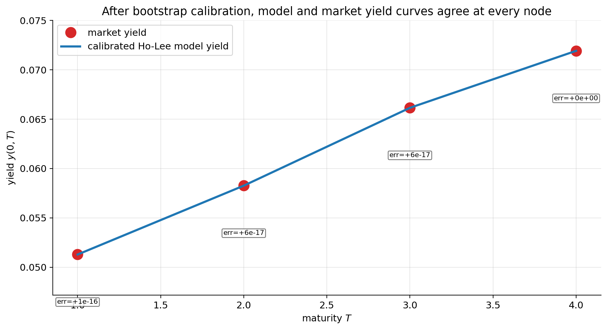

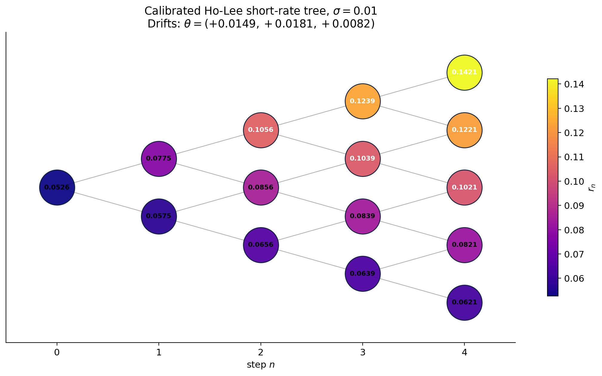

**Table 6.17.** Bootstrapping log on the Example 6.12.1 market.

| Step | Quoted $B^{\text{mkt}}$ | Solved $\theta$ | $B^{\text{model}}$ | Error |
|---:|---:|---:|---:|---:|
| $T = 1$ | $0.95000$ | $r_0 = 0.05263$ | $0.95000$ | $0$ |
| $T = 2$ | $0.89000$ | $\theta_0 \approx 0.00936$ | $0.89000$ (post-root-find) | $0$ |
| $T = 3$ | $0.82000$ | $\theta_1 \approx 0.01023$ | $0.82000$ (post-root-find) | $0$ |

(Errors are zero by construction; the table is a calibration ledger.)

### 6.12.4 Exercises

1. With $B^{\text{mkt}}(0, 1) = 0.96, \sigma = 0.005$, find $r_0$. **Answer:** $r_0 = 1/0.96 - 1 = 0.04167$.
2. Solve $\theta_0$ if additionally $B^{\text{mkt}}(0, 2) = 0.92$. **Answer:** about $0.00077$ (numerical root-find).
3. After calibrating, what is the time-0 par swap rate over $T = 1, 2, 3$ using Example 6.12.1 values? **Answer:** $S = (1 - 0.82)/(0.95 + 0.89 + 0.82) = 0.18/2.66 = 0.06767$.

---

## Bridge to Chapter 7

Everything in this chapter has been **discrete**: finite tosses, finite nodes, finite time. The trees count, the bonds discount, the caplets and swaps come out as sums.

The next chapter takes the limit. We let $\Delta t \to 0$ with $u = e^{\sigma\sqrt{\Delta t}}$ and $d = 1/u = e^{-\sigma\sqrt{\Delta t}}$. Under that scaling, the CRR binomial formula converges to a single integral against the standard normal density — i.e., to the **Black-Scholes formula**. We won't take any calculus derivatives: the Central Limit Theorem of Chapter 0 §0.10 does the work. The same machinery — risk-neutral expectation, change of numéraire, calibration to a curve — survives the limit; what changes is the *vocabulary* (drift, diffusion, $d_1, d_2$) and the *speed* (continuous-time formulas evaluate in microseconds where lattices need backward induction).

Chapter 6 introduced the *interest rate* as the random object on the tree. Chapter 7 will take its continuous limit and arrive at the short-rate models you've seen named (Vasicek, CIR, Hull-White) as the continuous-time descendants of the Ho-Lee tree we just calibrated. Same idea, smoother coordinates.

---

*End of Chapter 6.*
