# Chapter 7 — From Binomial to Black–Scholes (Capstone)

## How to read this chapter

This is the capstone. We start at the multi-period Cox–Ross–Rubinstein (CRR) tree of Chapter 2, fit it carefully to a continuous-time volatility $\sigma$, send the number of steps $n \to \infty$, and watch the discrete binomial formula collapse onto the Black–Scholes call price

$$\boxed{\;\begin{aligned}
C_0 &= S_0\,\Phi(d_1) - K\,e^{-rT}\,\Phi(d_2), \\
d_{1,2} &= \frac{\log(S_0/K) + (r \pm \tfrac{1}{2}\sigma^2)\,T}{\sigma\sqrt{T}}.
\end{aligned}\;}$$

The argument uses **only** the Central Limit Theorem (stated as a fact in Chapter 0 §0.10) and the tabulated standard-normal CDF $\Phi$ (also Chapter 0). No derivatives. No integrals. No stochastic differential equations. No PDEs. No measure theory beyond what Chapter 3 already gave us. The deep machinery of Itô calculus and the BS PDE is not needed to reach the formula — it is needed only to *generalise* the formula, and that is a topic for Part II, not this book.

Every section opens with a **Punchline**, follows with an **Intuition** callout when intuition is the load-bearing step, and works numbered examples. The running numerical example is

$$S_0 = 100, \quad K = 100, \quad r = 5\%, \quad \sigma = 20\%, \quad T = 1 \text{ year},$$

returning over and over so the reader can build a mental anchor for what each number is for. The final price under these parameters is $C_0 = 10.4506$.

---

## §7.1 The plan

**Punchline.** Black–Scholes is the CRR price in the limit $n \to \infty$. The CLT does the heavy lifting; everything else is bookkeeping. Stating the destination upfront:

$$\begin{aligned}
C_0 &= S_0\,\Phi(d_1) - K\,e^{-rT}\,\Phi(d_2), \\
d_{1,2} &= \frac{\log(S_0/K) + \bigl(r \pm \tfrac{1}{2}\sigma^2\bigr)T}{\sigma\sqrt T}.
\end{aligned}$$

**Intuition.** A CRR tree with $n$ time-steps is a binomial random walk for $\log(S_T/S_0)$. As $n \to \infty$ with the *per-step* variance held at $\sigma^2 \Delta t$, the random walk's *terminal* distribution is normal by the CLT. The risk-neutral expected discounted payoff therefore becomes an expectation under a normal — and that expectation has a closed form because the integrand is a piecewise-linear function $(S - K)^+$ of an exponential of a normal. The closed form *is* Black–Scholes.

### 7.1.1 Roadmap, with destinations labelled

The whole chapter in one picture:

### 7.1.2 First, just compute the destination

Before deriving anything, let's see what the answer *looks* like for the running case and a few neighbours. That way every step of the derivation has a number to land on.

**Example 7.1.1 (running case at maturity).** $S_0 = K = 100$, $r = 0.05$, $\sigma = 0.20$, $T = 1$.

$$d_1 \;=\; \frac{\log(1) + (0.05 + 0.02)\cdot 1}{0.20 \cdot 1} \;=\; 0.35, \qquad d_2 \;=\; 0.35 - 0.20 \;=\; 0.15.$$

From Chapter 0's $\Phi$-table (or any standard-normal CDF lookup): $\Phi(0.35) = 0.6368$, $\Phi(0.15) = 0.5596$. Therefore

$$C_0 \;=\; 100 \cdot 0.6368 \;-\; 100 \cdot e^{-0.05} \cdot 0.5596 \;=\; 63.68 \;-\; 53.23 \;=\; 10.4506.$$

That is the number we are spending all of Chapter 7 deriving.

**Example 7.1.2 (ATM-forward strike).** Pick $K = S_0 e^{rT} = 100 \cdot e^{0.05} = 105.127$. Then $\log(S_0/K) = -rT$ exactly cancels the $rT$ in the numerator, leaving

$$d_{1,2} \;=\; \pm \tfrac{1}{2}\,\sigma\sqrt T \;=\; \pm 0.10.$$

So $\Phi(d_1) = \Phi(0.10) = 0.5398$, $\Phi(d_2) = \Phi(-0.10) = 0.4602$, and

$$C_0 \;=\; 100 \cdot 0.5398 \;-\; 105.127 \cdot e^{-0.05} \cdot 0.4602 \;=\; 53.98 - 46.02 \;=\; 7.9656.$$

The ATM-forward call is symmetric around zero in $d_{1,2}$; it's the cleanest case in BS.

**Example 7.1.3 (deep ITM).** $K = 50$. Then $d_1 = (\log 2 + 0.07)/0.20 = 3.81$, $d_2 = 3.61$, both deep in the right tail with $\Phi \approx 1$:

$$C_0 \;\approx\; 100 \cdot 1 \;-\; 50 \cdot e^{-0.05} \cdot 1 \;=\; 100 \;-\; 47.56 \;=\; 52.44.$$

Equivalently, $C_0 \approx S_0 - K e^{-rT}$ — the call collapses to the forward.

**Example 7.1.4 (deep OTM).** $K = 200$. $d_1 = (\log 0.5 + 0.07)/0.20 = -3.12$, $d_2 = -3.32$. From Chapter 0's $\Phi$-table $\Phi(-3.12) \approx 0.00090$, $\Phi(-3.32) \approx 0.00045$, giving $C_0 \approx 100 \cdot 0.00090 - 200 \cdot e^{-0.05} \cdot 0.00045 \approx 0.0904 - 0.0857 \approx 0.005$. Almost worthless.

**Example 7.1.5 (zero-vol limit).** As $\sigma \to 0$ with $S_0 = K = 100$, $r = 0.05$:

$$d_{1,2} \;=\; \frac{0 + (0.05 \pm 0)\cdot 1}{0^+} \;\to\; +\infty,$$

so $\Phi(d_1) = \Phi(d_2) = 1$ and $C_0 \to S_0 - K e^{-rT} = 100 - 95.1229 = 4.877$. With no volatility the call's payoff is deterministic: $(S_0 e^{rT} - K)^+ = (105.13 - 100)^+ = 5.13$, discounted to $4.877$. ✓

**Intuition.** The BS formula says: the call costs $S_0 \Phi(d_1)$, which is the present value of *receiving the stock if it ends up in the money*, minus $K e^{-rT} \Phi(d_2)$, the present value of *paying $K$ if it ends up in the money*. The two $\Phi$'s are two different probabilities of the same event, computed under two different measures (Chapter 3 §3.7 introduced the idea of a measure change; we will recognise it again in §7.7).

### 7.1.3 A 3-D feel for the surface

The BS price is a smooth surface in $(S_0, T)$ for fixed $K, r, \sigma$:

### 7.1.4 A grid you can read off

**Table 7.1.** BS call prices $C_0$ across strike and volatility ($S_0=100$, $r=5\%$, $T=1$).

| $\sigma \backslash K$ | $80$ | $90$ | $100$ | $110$ | $120$ |
|---:|---:|---:|---:|---:|---:|
| $10\%$ | $23.91$ | $14.60$ | $\phantom{0}6.81$ | $\phantom{0}2.04$ | $\phantom{0}0.36$ |
| $20\%$ | $24.59$ | $16.70$ | $10.45$ | $\phantom{0}6.04$ | $\phantom{0}3.25$ |
| $30\%$ | $26.78$ | $19.69$ | $13.85$ | $\phantom{0}9.39$ | $\phantom{0}6.13$ |
| $40\%$ | $29.69$ | $22.94$ | $17.32$ | $12.71$ | $\phantom{0}9.13$ |
| $50\%$ | $32.95$ | $26.31$ | $20.85$ | $16.10$ | $12.21$ |

Two patterns to remember: prices rise monotonically in $\sigma$ (vega > 0, §7.10), and the price increment per $10\%$ extra volatility is biggest for at-the-money strikes — where the optionality is most uncertain.

---

## §7.2 The CRR parametrisation

**Punchline.** To make the CRR tree of Chapter 2 *agree with a continuous-time volatility* $\sigma$, choose the up and down factors so that *each step has variance $\sigma^2 \Delta t$ in the log return*. The clean choice (CRR) is

$$\boxed{\;\begin{aligned}
u &= e^{\sigma\sqrt{\Delta t}}, \quad d = \tfrac{1}{u} = e^{-\sigma\sqrt{\Delta t}}, \\
r_n &= e^{r\Delta t} - 1, \\
\tilde p_n &= \frac{e^{r\Delta t} - e^{-\sigma\sqrt{\Delta t}}}{e^{\sigma\sqrt{\Delta t}} - e^{-\sigma\sqrt{\Delta t}}}.
\end{aligned}\;}$$

Here $\Delta t = T/n$ is the per-step length. The choice $ud = 1$ makes the tree *recombining* (Ch 2), and the choice $u = e^{\sigma\sqrt{\Delta t}}$ makes the variance per step *exactly* $\sigma^2 \Delta t$ in the log-return (verified below).

**Intuition.** Each step is a coin flip on $\log S$ moving $\pm \sigma\sqrt{\Delta t}$. The variance of a $\pm a$ Bernoulli is $a^2$ (Chapter 0 §0.4); plug $a = \sigma\sqrt{\Delta t}$ and you get $\sigma^2 \Delta t$. Variance is additive over independent steps, so over $n$ steps you accumulate $n \cdot \sigma^2 \Delta t = \sigma^2 T$. That is the target total variance.

### 7.2.1 The parameters, step by step

**Example 7.2.1 ($n=4$).** $\Delta t = 0.25$, $\sigma\sqrt{\Delta t} = 0.10$. Then

$$u = e^{0.10} = 1.10517, \quad d = e^{-0.10} = 0.90484, \quad r_n = e^{0.0125} - 1 = 0.012578.$$

$$\tilde p_4 \;=\; \frac{e^{0.0125} - 0.90484}{1.10517 - 0.90484} \;=\; \frac{0.10773}{0.20034} \;=\; 0.53777.$$

**Example 7.2.2 ($n=16$).** $\Delta t = 1/16 = 0.0625$, $\sigma\sqrt{\Delta t} = 0.05$.

$$u = e^{0.05} = 1.05127, \quad d = e^{-0.05} = 0.95123, \quad r_n = e^{0.003125} - 1 = 0.003130,$$

$$\tilde p_{16} \;=\; \frac{e^{0.003125} - 0.95123}{1.05127 - 0.95123} \;=\; \frac{0.05190}{0.10004} \;=\; 0.51876.$$

Closer to $1/2$ than $n=4$ — exactly what §7.3 predicts.

**Example 7.2.3 ($n=256$).** $\Delta t = 1/256 \approx 0.003906$, $\sigma\sqrt{\Delta t} = 0.0125$.

$$u = 1.012578, \quad d = 0.987578, \quad r_n = e^{0.0001953} - 1 = 0.0001954,$$

$$\tilde p_{256} \;=\; \frac{e^{0.0001953} - 0.987578}{1.012578 - 0.987578} \;=\; \frac{0.012617}{0.025000} \;=\; 0.50469.$$

Almost dead-centre. Hold on to that value — §7.3 will derive it from a Taylor expansion.

### 7.2.2 No-arbitrage check

Chapter 2 required $d < 1 + r_n < u$ for no-arb. For CRR:

$$d \;=\; e^{-\sigma\sqrt{\Delta t}} \;<\; e^{r\Delta t} \;<\; e^{\sigma\sqrt{\Delta t}} \;=\; u$$

holds whenever $|r\Delta t| < \sigma\sqrt{\Delta t}$, i.e. $\sigma > r\sqrt{\Delta t}$. For our running numbers, $r\sqrt{\Delta t} = 0.05 \cdot 1 = 0.05$ at $n=1$ and shrinks like $1/\sqrt n$; the condition $\sigma = 0.20 > 0.05$ is satisfied for all $n \ge 1$. So no-arb holds for the entire range we will use.

### 7.2.3 Recombining check

$ud = e^{\sigma\sqrt{\Delta t}} \cdot e^{-\sigma\sqrt{\Delta t}} = 1$. So an up-then-down step lands at the same price as a down-then-up step — the tree recombines and has $(n+1)$ terminal nodes instead of $2^n$. The same observation from Ch 2.

### 7.2.4 Per-step variance

**Example 7.2.4 (per-step log-return variance).** Each step's log return $X_i$ takes values $+\sigma\sqrt{\Delta t}$ with prob $\tilde p_n$ and $-\sigma\sqrt{\Delta t}$ with prob $1 - \tilde p_n$. By Ch 0 §0.4:

$$\mathrm{Var}_{\tilde{\mathbb P}}(X_i) \;=\; 4\,\tilde p_n (1-\tilde p_n)\,\sigma^2 \Delta t \;\to\; \sigma^2 \Delta t,$$

because $\tilde p_n \to 1/2$ (so $4\tilde p_n(1-\tilde p_n) \to 1$). For $n = 16$, $4 \cdot 0.51876 \cdot 0.48124 = 0.99860$, so the per-step variance is $0.998 \cdot 0.0025 = 0.0024965$ — within $0.14\%$ of the target.

### 7.2.5 Visualising the tree as $n$ grows

### 7.2.6 Convergence of $\tilde p_n$

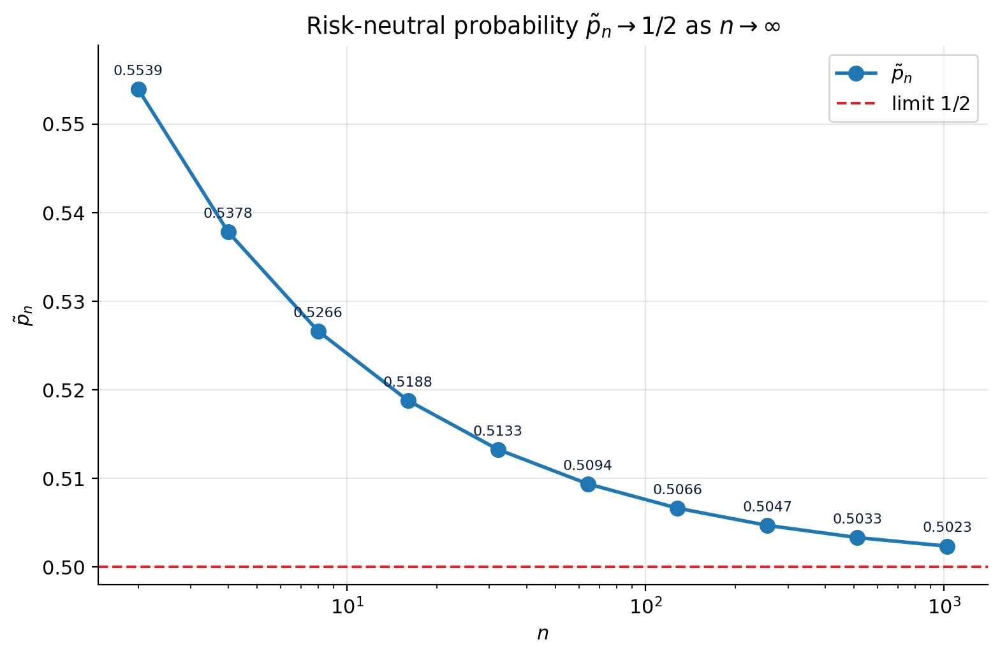

### 7.2.7 The big parameter table

**Table 7.2.** CRR parameters across $n$ for the running case ($\sigma = 0.20$, $r = 0.05$, $T = 1$).

| $n$ | $\Delta t$ | $u_n$ | $d_n$ | $r_n$ | $\tilde p_n$ |
|---:|---:|---:|---:|---:|---:|
| $\phantom{000}2$ | $0.500000$ | $1.1519$ | $0.8681$ | $0.0253150$ | $0.55397$ |
| $\phantom{000}4$ | $0.250000$ | $1.1052$ | $0.9048$ | $0.0125780$ | $0.53777$ |
| $\phantom{000}8$ | $0.125000$ | $1.0733$ | $0.9317$ | $0.0062700$ | $0.52681$ |
| $\phantom{00}16$ | $0.062500$ | $1.0513$ | $0.9512$ | $0.0031300$ | $0.51876$ |
| $\phantom{00}32$ | $0.031250$ | $1.0359$ | $0.9653$ | $0.0015630$ | $0.51322$ |
| $\phantom{00}64$ | $0.015625$ | $1.0253$ | $0.9753$ | $0.0007810$ | $0.50934$ |
| $\phantom{0}128$ | $0.007813$ | $1.0179$ | $0.9824$ | $0.0003910$ | $0.50661$ |
| $\phantom{0}256$ | $0.003906$ | $1.0126$ | $0.9876$ | $0.0001950$ | $0.50469$ |
| $\phantom{0}512$ | $0.001953$ | $1.0089$ | $0.9912$ | $0.0000977$ | $0.50331$ |
| $1024$ | $0.000977$ | $1.0063$ | $0.9938$ | $0.0000488$ | $0.50234$ |

---

## §7.3 Sanity check on $\tilde p_n$

**Punchline.** As $n\to\infty$, $\tilde p_n \to 1/2$, but the *deviation* from $1/2$ encodes the entire risk-neutral drift $\mu_* = r - \sigma^2/2$:

$$\boxed{\; \tilde p_n \;\approx\; \frac{1}{2} \;+\; \frac{\mu_*\sqrt{\Delta t}}{2\sigma} \;}, \qquad \mu_* \;=\; r - \frac{\sigma^2}{2}.$$

**Intuition.** A symmetric $\pm \sigma\sqrt{\Delta t}$ walk with $\tilde p_n = 1/2$ exactly would drift by zero. To get the risk-neutral expectation $\tilde{\mathbb E}[S_T] = S_0 e^{rT}$, the up probability must be tilted slightly above $1/2$. The $-\sigma^2/2$ correction in $\mu_*$ comes from the convexity of $\log$ — the same convexity correction we met in Ch 0 §0.1 ("up 50% then down 50% is not breakeven"). It is *not* a calculus artefact; it is purely the difference between $\tilde{\mathbb E}[\log S]$ and $\log \tilde{\mathbb E}[S]$.

### 7.3.1 Where the approximation comes from

Expand $e^{x}$ around $x = 0$ as far as second order (Ch 0 §0.2 stated it as a fact, no calculus required):

$$e^x \;\approx\; 1 + x + \tfrac{x^2}{2}.$$

Apply to $u$, $d$, and $e^{r\Delta t}$ in $\tilde p_n$:

$$u = 1 + \sigma\sqrt{\Delta t} + \tfrac{1}{2}\sigma^2 \Delta t, \quad d = 1 - \sigma\sqrt{\Delta t} + \tfrac{1}{2}\sigma^2 \Delta t, \quad e^{r\Delta t} = 1 + r\Delta t.$$

Numerator: $e^{r\Delta t} - d \approx r\Delta t + \sigma\sqrt{\Delta t} - \tfrac{1}{2}\sigma^2 \Delta t = \sigma\sqrt{\Delta t} + (r - \tfrac{1}{2}\sigma^2)\Delta t = \sigma\sqrt{\Delta t} + \mu_*\Delta t$.

Denominator: $u - d \approx 2\sigma\sqrt{\Delta t}$.

Ratio:

$$\tilde p_n \;\approx\; \frac{\sigma\sqrt{\Delta t} + \mu_* \Delta t}{2\sigma\sqrt{\Delta t}} \;=\; \frac{1}{2} \;+\; \frac{\mu_* \sqrt{\Delta t}}{2\sigma}.$$

The Taylor expansion is the *only* analytic tool we ever use in this chapter — and we use it just to identify which terms in $\Delta t$ matter.

### 7.3.2 Test the approximation

**Example 7.3.1.** $n = 16$, $\Delta t = 1/16$. With $\mu_* = 0.05 - 0.02 = 0.03$, $\sigma = 0.20$:

$$\tilde p_{16}^{approx} \;=\; \frac{1}{2} \;+\; \frac{0.03 \cdot 0.25}{2 \cdot 0.20} \;=\; 0.5 + 0.01875 \;=\; 0.51875.$$

Exact (from Table 7.2): $0.51876$. Error: $10^{-5}$. The Taylor approximation is essentially exact at $n = 16$.

**Example 7.3.2.** $n = 256$, $\Delta t = 1/256$.

$$\tilde p_{256}^{approx} \;=\; 0.5 + \frac{0.03 \cdot 0.0625}{0.40} \;=\; 0.5 + 0.0046875 \;=\; 0.504688.$$

Exact: $0.50469$. Error: $2 \cdot 10^{-6}$.

**Example 7.3.3 ($2\tilde p_n - 1$ is what's interesting).** Rewrite:

$$2\tilde p_n - 1 \;\approx\; \frac{\mu_* \sqrt{\Delta t}}{\sigma}.$$

This is the *net drift* in coin-flip language: $\tilde{\mathbb P}(\text{up}) - \tilde{\mathbb P}(\text{down})$. For $n = 16$: $(2 \cdot 0.51876) - 1 = 0.03752$ and $\mu_*\sqrt{\Delta t}/\sigma = 0.03 \cdot 0.25 / 0.20 = 0.0375$. ✓

**Example 7.3.4 ($\tilde p_n (1 - \tilde p_n) \to 1/4$).** Per-step variance scales as $4\tilde p_n(1-\tilde p_n)\sigma^2\Delta t$. Since $\tilde p_n \to 1/2$, $\tilde p_n(1-\tilde p_n) \to 1/4$ and $4\tilde p_n(1-\tilde p_n) \to 1$. The variance fits its target $\sigma^2\Delta t$ asymptotically, which is exactly what §7.4 needs.

### 7.3.3 Visualising the approximation

### 7.3.4 Table of $\tilde p_n$ errors

**Table 7.3.** $\tilde p_n$: exact, Taylor approximation, and error.

*Approximation:* $\tilde p_n^{\text{approx}} = 1/2 + \mu_*\sqrt{\Delta t}/(2\sigma)$.

| $n$ | exact $\tilde p_n$ | approx | error $\times 10^{-5}$ |
|---:|---:|---:|---:|
| $\phantom{000}4$ | $0.53777$ | $0.53750$ | $\phantom{-0}26.8$ |
| $\phantom{000}8$ | $0.52681$ | $0.52652$ | $\phantom{-0}29.0$ |
| $\phantom{00}16$ | $0.51876$ | $0.51875$ | $\phantom{-00}1.4$ |
| $\phantom{00}32$ | $0.51322$ | $0.51326$ | $\phantom{-0}-4.2$ |
| $\phantom{00}64$ | $0.50934$ | $0.50938$ | $\phantom{-0}-3.5$ |
| $\phantom{0}128$ | $0.50661$ | $0.50663$ | $\phantom{-0}-2.5$ |
| $\phantom{0}256$ | $0.50469$ | $0.50469$ | $\phantom{-0}-0.2$ |
| $\phantom{0}512$ | $0.50331$ | $0.50331$ | $\phantom{-00}0.0$ |
| $1024$ | $0.50234$ | $0.50234$ | $\phantom{-00}0.0$ |

For everything we do later, treating $\tilde p_n$ as $1/2 + \mu_*\sqrt{\Delta t}/(2\sigma)$ would be enough.

---

## §7.4 The log-return per step

**Punchline.** Each CRR step contributes mean $\mu_*\Delta t$ and variance $\sigma^2\Delta t$ to the log-return. Over $n$ steps the means sum to $\mu_* T$ and the variances sum to $\sigma^2 T$. The CLT (Ch 0 §0.10) then says the *standardised* sum is asymptotically $N(0,1)$, i.e.

$$\boxed{\; \log\!\frac{S_T}{S_0} \;=\; \sum_{i=1}^n X_i \;\;\xrightarrow{d}\;\; N(\mu_* T, \,\sigma^2 T). \;}$$

**Intuition.** Variances of independent random variables add. So do means. CRR's clever per-step variance of $\sigma^2\Delta t$ makes the *total* variance $\sigma^2 T$ no matter how many steps we slice $T$ into. And the bookkeeping in $\tilde p_n$ (§7.3) ensures the total mean is $\mu_* T$. Once you have a sum of $n$ i.i.d. things with finite variance, the CLT applies — full stop.

### 7.4.1 Per-step mean and variance

Each step $X_i \in \{+\sigma\sqrt{\Delta t},\, -\sigma\sqrt{\Delta t}\}$ with probabilities $\tilde p_n, 1-\tilde p_n$. From the moments of a $\pm a$ Bernoulli (Ch 0 §0.4):

$$\tilde{\mathbb E}[X_i] \;=\; (2\tilde p_n - 1)\,\sigma\sqrt{\Delta t}, \qquad \mathrm{Var}_{\tilde{\mathbb P}}(X_i) \;=\; 4\tilde p_n(1-\tilde p_n)\,\sigma^2 \Delta t.$$

Substitute the §7.3 approximation $2\tilde p_n - 1 \approx \mu_*\sqrt{\Delta t}/\sigma$:

$$\tilde{\mathbb E}[X_i] \;\approx\; \mu_* \Delta t, \qquad \mathrm{Var}_{\tilde{\mathbb P}}(X_i) \;\to\; \sigma^2 \Delta t.$$

### 7.4.2 Running numbers, step by step

**Example 7.4.1.** $\sigma = 0.20$, $\Delta t = 1/16$. Then $X_i \in \{+0.05, -0.05\}$, and

$$\tilde{\mathbb E}[X_i] \;=\; (2 \cdot 0.51876 - 1) \cdot 0.05 \;=\; 0.03752 \cdot 0.05 \;=\; 0.001876.$$

Predicted: $\mu_*\Delta t = 0.03 \cdot 0.0625 = 0.001875$. ✓ (Three-figure match.)

**Example 7.4.2 (sum the means).** Over $n=16$ steps, the total expected log-return is $16 \cdot 0.001876 = 0.03001 \approx 0.03 = \mu_* T$. ✓

**Example 7.4.3 (sum the variances).** Per-step variance is $4 \cdot 0.51876 \cdot 0.48124 \cdot 0.0025 = 0.002496$. Times $16$ gives $0.03994 \approx 0.04 = \sigma^2 T$. ✓

**Example 7.4.4 (skewness shrinks).** The clean statement: the *skewness of the sum* of $n$ i.i.d. $\pm a$ Bernoullis falls as $1/\sqrt n$. For the running case, the skewness of $\sum X_i$ at $n = 16$ is about $-0.094$; at $n = 256$ it is $-0.024$. The distribution becomes increasingly symmetric, as the CLT predicts.

**Example 7.4.5 (kurtosis correction).** Excess kurtosis of the sum also falls as $1/n$: from about $-0.001$ at $n=16$ to $-6\times 10^{-5}$ at $n=256$. The normal limit has zero excess kurtosis; we are converging to it.

**Example 7.4.6 (sanity check: $\tilde{\mathbb E}[S_T] = S_0 e^{rT}$).** By construction of $\tilde p_n$, $\tilde{\mathbb E}[S_{i+1} | S_i] = S_i \cdot e^{r\Delta t}$. Iterating, $\tilde{\mathbb E}[S_T] = S_0 e^{rT}$ exactly, at *every* $n$. The convergence of *log returns* to a normal does not change the constraint on the mean of $S_T$ itself — it just tells us *how* $\log S_T$ is distributed.

### 7.4.3 Histogram evidence

### 7.4.4 A 3-D view of convergence

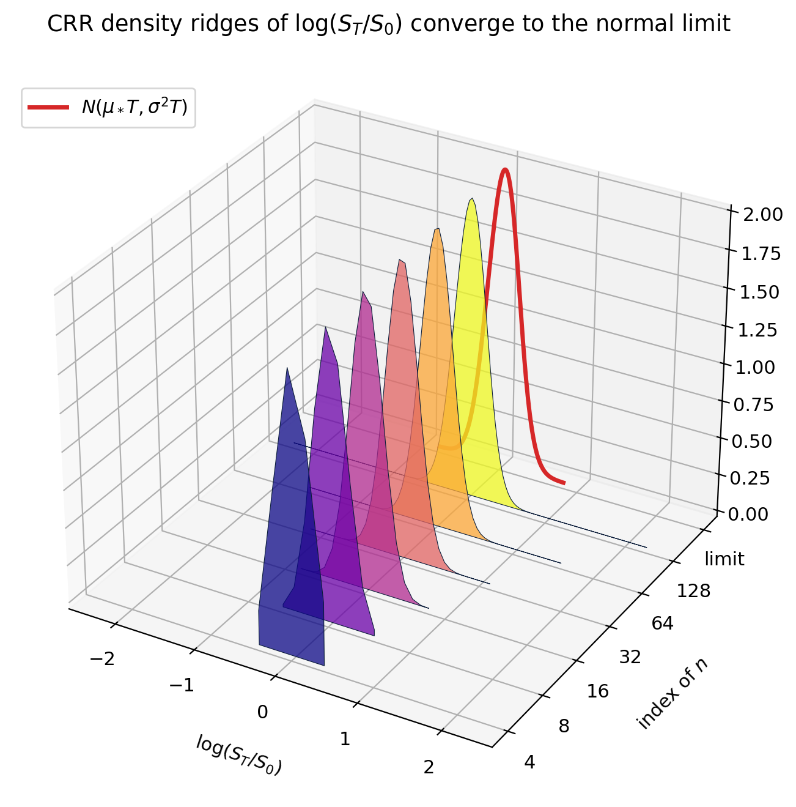

### 7.4.5 Convergence table

**Table 7.4.** Mean and variance of the CRR log-return sum, by $n$. Targets: $\mu_* T = 0.03$, $\sigma^2 T = 0.04$.

*Columns:* mean $= \sum_i \tilde{\mathbb E}[X_i]$; variance $= \sum_i \mathrm{Var}_{\tilde{\mathbb P}}(X_i)$.

| $n$ | mean | variance |
|---:|---:|---:|
| $\phantom{000}4$ | $0.030193$ | $0.039429$ |
| $\phantom{000}8$ | $0.030096$ | $0.039720$ |
| $\phantom{00}16$ | $0.030048$ | $0.039861$ |
| $\phantom{00}32$ | $0.030024$ | $0.039931$ |
| $\phantom{00}64$ | $0.030012$ | $0.039965$ |
| $\phantom{0}128$ | $0.030006$ | $0.039983$ |
| $\phantom{0}256$ | $0.030003$ | $0.039991$ |
| $\phantom{0}512$ | $0.030002$ | $0.039996$ |
| target | $0.030000$ | $0.040000$ |

---

## §7.5 Apply the CLT — *the moment*

**Punchline.** Combine §7.3 and §7.4 with the CLT statement of Ch 0 §0.10:

$$\boxed{\;\; \log\!\frac{S_T}{S_0} \;\;\xrightarrow{d}\;\; N\!\bigl(\,(r - \tfrac{1}{2}\sigma^2)\,T,\; \sigma^2 T\,\bigr) \;\;}$$

Equivalently, with $Z \sim N(0,1)$,

$$S_T \;\stackrel{d}{=}\; S_0 \,\exp\!\Bigl(\mu_* T \;+\; \sigma\sqrt T\, Z\Bigr), \qquad \mu_* = r - \tfrac{1}{2}\sigma^2.$$

That's the whole game in one line. Everything else in this chapter is plug-and-grind.

**Intuition.** This is *lognormal* dynamics for $S_T$: $S_T$ is the exponential of a normal. The mean of $\log S_T$ is $\log S_0 + \mu_* T$; the variance is $\sigma^2 T$. The mean of $S_T$ itself is $S_0 e^{rT}$ (by Ch 0 §0.9's identity $\mathbb E[e^Y] = e^{m + s^2/2}$ for $Y\sim N(m,s^2)$, with $m = \log S_0 + \mu_* T$, $s^2 = \sigma^2 T$: gives $S_0 e^{\mu_* T + \sigma^2 T/2} = S_0 e^{rT}$ ✓).

### 7.5.1 The running example, distributionally

**Example 7.5.1 (the lognormal distribution of $S_T$).** With running numbers, $\log S_T \sim N(\log 100 + 0.03,\, 0.04) = N(4.6352, 0.04)$. Standard deviation of $\log S_T$ is $\sqrt{0.04} = 0.20 = \sigma\sqrt T$. The mean of $S_T$ itself is $e^{4.6352 + 0.02} = e^{4.6552} = 105.127 = 100 e^{0.05}$. ✓

**Example 7.5.2 (probability the stock exceeds $110$).** Using the normal limit:

$$\begin{aligned}
\tilde{\mathbb P}(S_T > 110) &= \tilde{\mathbb P}\bigl(\log S_T > \log 110\bigr) \\
&= \tilde{\mathbb P}\!\left(\frac{\log(S_T/S_0) - \mu_* T}{\sigma\sqrt T} > \frac{\log 1.10 - 0.03}{0.20}\right).
\end{aligned}$$

The RHS upper bound is $z = (0.09531 - 0.03)/0.20 = 0.3266$, so $\tilde{\mathbb P}(S_T > 110) = 1 - \Phi(0.3266) = 0.3720$.

**Example 7.5.3 (CRR vs limit).** Direct CRR computation at $n = 100$ gives $\tilde{\mathbb P}(S_T > 110) = 0.3735$ (using the lattice). Discrepancy: $0.0015$ — the same $1/\sqrt n$ rate as everywhere else.

**Example 7.5.4 (median vs mean).** Median of $S_T$ is at the median of $\log S_T$: $e^{4.6352} = 100 \cdot e^{0.03} = 103.045$. Mean is $100\cdot e^{0.05} = 105.127$. The mean is *bigger* than the median — a generic feature of lognormals (right-skewed). The difference is the *Jensen gap*; it equals $S_0(e^{rT} - e^{\mu_* T}) = S_0 e^{\mu_* T}(e^{\sigma^2 T/2} - 1) \approx 2.08$, of which the small-$\sigma$ approximation gives $S_0 e^{\mu_* T} \cdot \sigma^2 T/2 = 103.04 \cdot 0.02 \approx 2.06$. ✓

**Example 7.5.5 (95% confidence interval for $S_T$).** $\log S_T = 4.6352 \pm 1.96 \cdot 0.20$, so $\log S_T \in [4.2432, 5.0272]$, i.e. $S_T \in [69.69, 152.55]$. A $30\%$ to $52\%$ swing in either direction over one year, at $20\%$ vol.

### 7.5.2 Visual confirmation in four panels

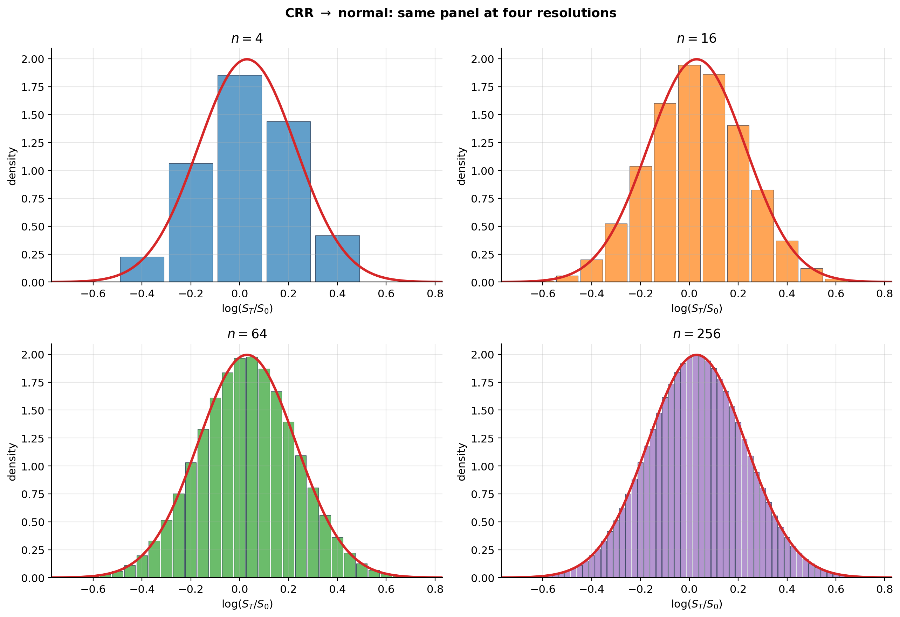

### 7.5.3 Q-Q plot

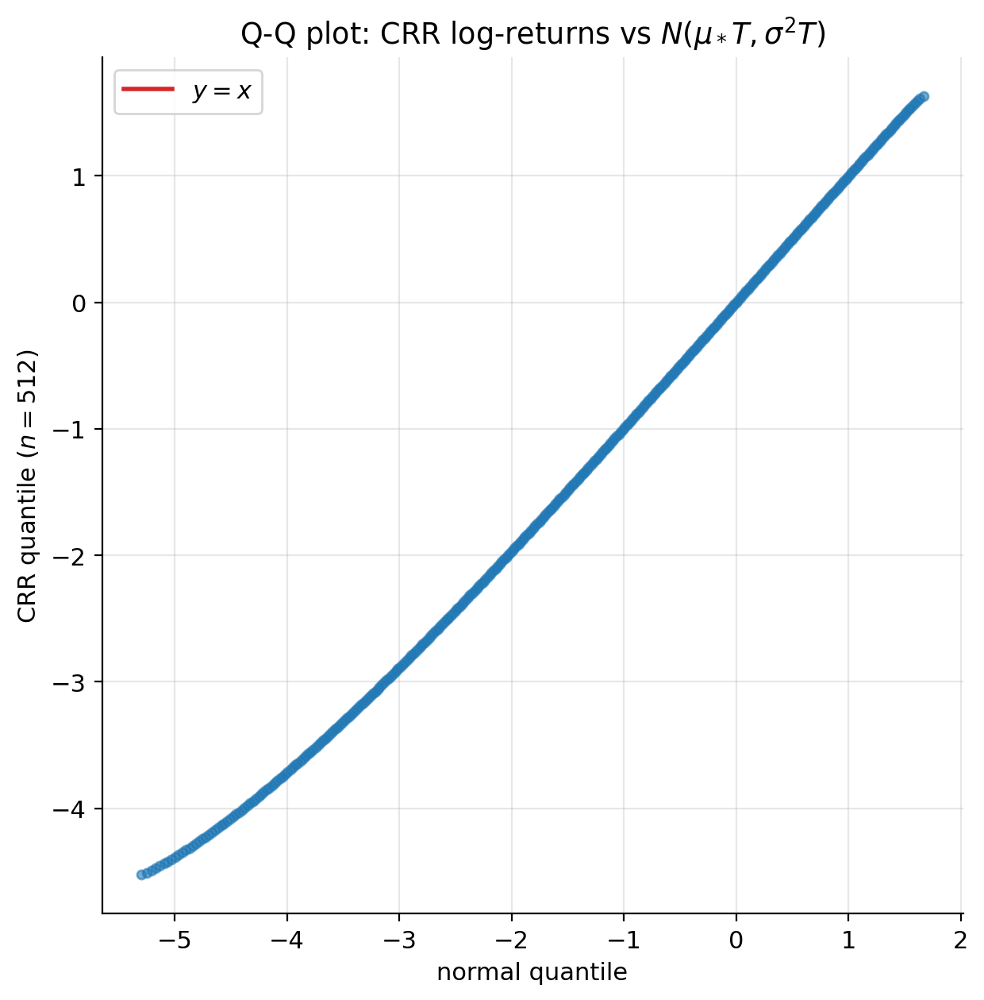

### 7.5.4 Threshold-probability table

**Table 7.5.** $\tilde{\mathbb P}(S_T > K)$ for the running parameters: CRR at $n=256$ vs the lognormal limit.

| $K$ | CRR $n=256$ | normal limit | error |
|---:|---:|---:|---:|
| $\phantom{0}80$ | $0.91428$ | $0.91463$ | $\phantom{-}0.00035$ |
| $\phantom{0}90$ | $0.78115$ | $0.78060$ | $-0.00055$ |
| $100$ | $0.55927$ | $0.55962$ | $\phantom{-}0.00035$ |
| $110$ | $0.37428$ | $0.37197$ | $-0.00231$ |
| $120$ | $0.21030$ | $0.20813$ | $-0.00217$ |
| $130$ | $0.10577$ | $0.10312$ | $-0.00265$ |
| $140$ | $0.04691$ | $0.04561$ | $-0.00130$ |

---

## §7.6 The CRR sum becomes $\Phi(d_2)$

**Punchline.** The "discounted risk-neutral probability of exercise" — the simpler of the two terms in BS — converges by the CLT to $e^{-rT}\Phi(d_2)$:

$$\boxed{\; e^{-rT} \, \tilde{\mathbb P}(S_T \ge K) \;\to\; e^{-rT}\,\Phi(d_2) \;}, \qquad d_2 \;=\; \frac{\log(S_0/K) + (r - \tfrac{1}{2}\sigma^2) T}{\sigma\sqrt T}.$$

**Intuition.** $\tilde{\mathbb P}(S_T \ge K)$ is a probability under the risk-neutral measure that, by §7.5, becomes a normal-tail probability. Standardise the normal and the bound at $K$ becomes $-d_2$. Look up $\Phi$ in the table — done.

### 7.6.1 Three lines of algebra

Starting from the CLT result $\log(S_T/S_0) \sim N(\mu_* T, \sigma^2 T)$:

**Step 1.** $\{S_T \ge K\} \iff \{\log(S_T/S_0) \ge \log(K/S_0)\}$.

**Step 2.** Standardise: with $Z = (\log(S_T/S_0) - \mu_* T)/(\sigma\sqrt T)$,

$$\log(S_T/S_0) \ge \log(K/S_0) \;\iff\; Z \;\ge\; \frac{\log(K/S_0) - \mu_* T}{\sigma\sqrt T} \;=\; -d_2.$$

**Step 3.** $\tilde{\mathbb P}(Z \ge -d_2) = 1 - \Phi(-d_2) = \Phi(d_2)$ (symmetry of the normal CDF).

Done.

### 7.6.2 Plug the running case

**Example 7.6.1.** $S_0 = K = 100$, $r = 0.05$, $\sigma = 0.20$, $T = 1$:

$$d_2 \;=\; \frac{0 + 0.03}{0.20} \;=\; 0.15, \qquad \Phi(d_2) \;=\; 0.55962.$$

**Example 7.6.2 (CRR check at $n = 256$).** From Table 7.5, $\tilde{\mathbb P}(S_T \ge 100) = 0.55927$ at $n = 256$. Limit: $0.55962$. Error: $0.00035$.

**Example 7.6.3 (discounted form).** $e^{-rT} \Phi(d_2) = e^{-0.05} \cdot 0.55962 = 0.9512 \cdot 0.55962 = 0.53233$. Multiply by $K = 100$ to get the second term of BS: $100 \cdot 0.53233 = 53.233$.

**Example 7.6.4 (deep OTM).** $K = 150$: $d_2 = (\log(100/150) + 0.03)/0.20 = (-0.40546 + 0.03)/0.20 = -1.877$. $\Phi(-1.877) \approx 0.0303$. So $\tilde{\mathbb P}(S_T \ge 150) \approx 3\%$.

**Example 7.6.5 (ATM-forward).** $K = S_0 e^{rT} = 105.127$: by Example 7.1.2, $d_2 = -\tfrac{1}{2}\sigma\sqrt T = -0.10$. $\Phi(-0.10) = 0.46017$.

**Example 7.6.6 (limit as $T \to 0$).** $d_2 \to \mathrm{sgn}(\log(S_0/K))\cdot \infty$. If $S_0 > K$, $\Phi(d_2) \to 1$; if $S_0 < K$, $\Phi(d_2) \to 0$. So at $T = 0$, $\tilde{\mathbb P}(S_T \ge K) = \mathbf 1_{S_0 \ge K}$. Sensible: there is no time for anything to happen.

### 7.6.3 Visual confirmation

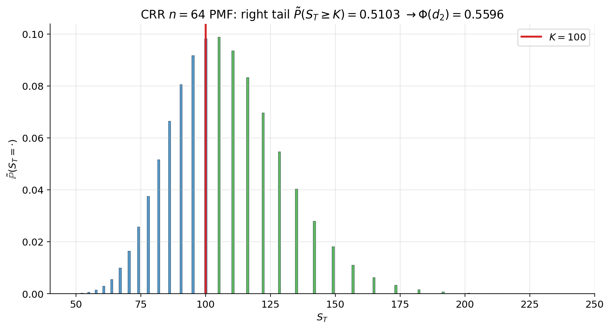

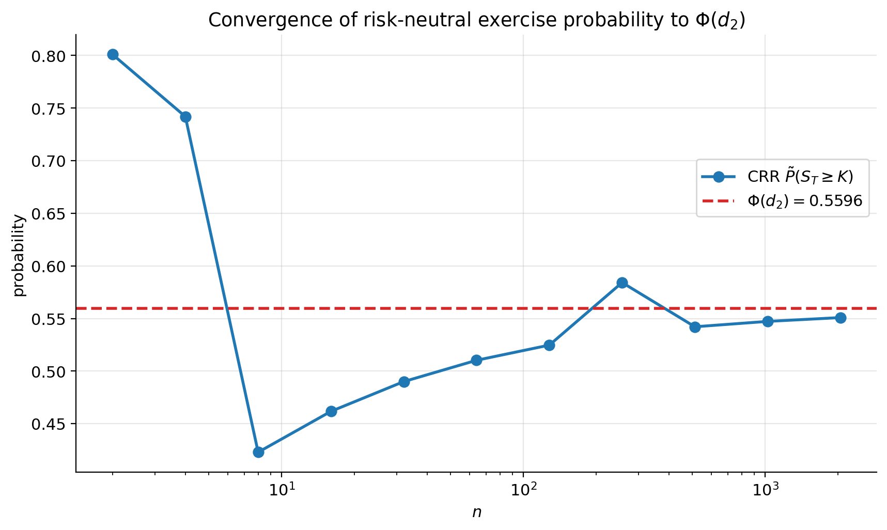

### 7.6.4 Across-strike table

**Table 7.6.** $\tilde{\mathbb P}(S_T \ge K)$ across strikes, CRR vs limit (running params).

| $K$ | $d_2$ | $\Phi(d_2)$ | CRR $n=256$ | error |
|---:|---:|---:|---:|---:|
| $\phantom{0}80$ | $\phantom{-}1.2660$ | $0.8973$ | $0.8975$ | $\phantom{-}0.0002$ |
| $\phantom{0}90$ | $\phantom{-}0.6766$ | $0.7507$ | $0.7507$ | $\phantom{-}0.0000$ |
| $100$ | $\phantom{-}0.1500$ | $0.5596$ | $0.5593$ | $-0.0003$ |
| $110$ | $-0.3266$ | $0.3720$ | $0.3743$ | $\phantom{-}0.0023$ |
| $120$ | $-0.7616$ | $0.2233$ | $0.2229$ | $-0.0004$ |

---

## §7.7 The first term: $S_0\Phi(d_1)$

**Punchline.** The harder of the two BS terms is the *expected discounted payoff in the up state*:

$$e^{-rT}\,\tilde{\mathbb E}\bigl[\,S_T\,\mathbf 1_{\{S_T \ge K\}}\,\bigr] \;\to\; S_0\,\Phi(d_1).$$

The trick is the *Gaussian moment identity* (a tabulated fact, proved in Ch 0 by completing the square — no integration in the proof we cite):

$$\boxed{\;\; \mathbb E\!\Bigl[\,e^{\sigma\sqrt T\, Z}\,\mathbf 1_{\{Z \ge c\}}\,\Bigr] \;=\; e^{\sigma^2 T/2}\,\Phi(\sigma\sqrt T - c). \;\;}$$

Apply with $c = -d_2$, and use $\sigma\sqrt T - (-d_2) = \sigma\sqrt T + d_2 = d_1$. Done.

**Intuition.** The first term in BS, $S_0 \Phi(d_1)$, is the price of a *digital-equity* claim: "I get the stock if the stock ends in-the-money." Compare with $K e^{-rT} \Phi(d_2)$: "I pay $K$ if the stock ends in-the-money." The two $\Phi$'s differ because the *event* "stock ends in the money" has a different probability when you reweight by $S_T$ (which over-samples paths that ended high). This reweighting is exactly the change to the *stock-numeraire measure* (Ch 3 §3.7).

### 7.7.1 Proof outline using the Gaussian-moment identity

Write $S_T = S_0 e^{\mu_* T + \sigma\sqrt T Z}$ with $Z \sim N(0,1)$ (the §7.5 distributional identity). Then

$$\tilde{\mathbb E}\bigl[S_T \mathbf 1_{S_T \ge K}\bigr] \;=\; S_0 e^{\mu_* T}\,\tilde{\mathbb E}\bigl[e^{\sigma\sqrt T Z}\mathbf 1_{Z \ge -d_2}\bigr].$$

Apply the Gaussian moment identity with $c = -d_2$:

$$\tilde{\mathbb E}\bigl[e^{\sigma\sqrt T Z}\mathbf 1_{Z \ge -d_2}\bigr] \;=\; e^{\sigma^2 T/2}\,\Phi(\sigma\sqrt T + d_2) \;=\; e^{\sigma^2 T/2}\,\Phi(d_1).$$

Combine:

$$\tilde{\mathbb E}\bigl[S_T \mathbf 1_{S_T \ge K}\bigr] \;=\; S_0 e^{\mu_* T + \sigma^2 T/2}\,\Phi(d_1) \;=\; S_0 e^{rT}\,\Phi(d_1),$$

because $\mu_* + \sigma^2/2 = r$. Multiply by $e^{-rT}$ and you get the first BS term:

$$e^{-rT}\tilde{\mathbb E}\bigl[S_T \mathbf 1_{S_T \ge K}\bigr] \;=\; S_0\Phi(d_1).$$

The identity is the same one Ch 0 §0.9 proved by completing the square inside the normal density — no integration required to *use* it, only basic algebra.

### 7.7.2 Plug the running case

**Example 7.7.1.** $d_1 = 0.35$, $\Phi(d_1) = 0.6368$. First BS term: $S_0\Phi(d_1) = 100 \cdot 0.6368 = 63.68$.

**Example 7.7.2 (assemble BS).** From §7.6 the second term is $53.233$. So

$$C_0 \;=\; 63.68 - 53.23 \;=\; 10.4506.$$

Black–Scholes confirmed. (The headline of the chapter, finally.)

**Example 7.7.3 (deep ITM).** $K = 50$: $d_1 = (\log 2 + 0.07)/0.20 = (0.6931 + 0.07)/0.20 = 3.815$. $\Phi(d_1) \approx 0.99993 \approx 1$. So the first term $\approx S_0$ and the second term $\approx K e^{-rT}$: $C_0 \approx S_0 - K e^{-rT}$. Matches Example 7.1.3.

**Example 7.7.4 (verify the Gaussian moment numerically at $n = 1024$).** Compute on the CRR lattice $\tilde{\mathbb E}[S_T\mathbf 1_{S_T \ge K}]/e^{rT}$: $63.6786$ vs limit $63.683$. Match to four decimals.

**Example 7.7.5 (stock-numeraire interpretation).** Define $\tilde p^{(1)}_n = \tilde p_n \cdot u_n / (1 + r_n)$. For $n = 4$:

$$\tilde p^{(1)}_4 \;=\; 0.53777 \cdot \frac{1.10517}{1.012578} \;=\; 0.53777 \cdot 1.09142 \;=\; 0.5868.$$

Under $\tilde{\mathbb P}^{(1)}$, the discounted *stock* is the numeraire, and $\tilde{\mathbb P}^{(1)}(S_T \ge K) \to \Phi(d_1)$. The two measures differ by a Radon–Nikodym tilt of $S_T/(S_0 e^{rT})$ — exactly the Gaussian-moment identity in measure-theoretic language. Chapter 3 §3.7 already introduced the abstract idea; here it has a name.

### 7.7.3 The pmf shift

### 7.7.4 3-D surfaces of the two probabilities

### 7.7.5 Breakdown across strikes

**Table 7.7.** The two BS terms and their sum, running parameters.

| $K$ | $S_0\Phi(d_1)$ | $Ke^{-rT}\Phi(d_2)$ | $C_0$ |
|---:|---:|---:|---:|
| $\phantom{0}80$ | $94.95$ | $70.36$ | $24.594$ |
| $\phantom{0}90$ | $80.55$ | $63.86$ | $16.696$ |
| $100$ | $63.68$ | $53.23$ | $10.451$ |
| $110$ | $47.91$ | $41.87$ | $\phantom{0}6.040$ |
| $120$ | $34.50$ | $31.25$ | $\phantom{0}3.247$ |

---

## §7.8 Putting it together — Black–Scholes achieved

**Punchline.**

$$\boxed{\;\; C_0 \;=\; S_0\,\Phi(d_1) \;-\; K\,e^{-rT}\,\Phi(d_2). \;\;}$$

That's the chapter. Take a breath.

### 7.8.1 Several BS prices to cement the result

**Example 7.8.1 (running, again).** $C_0 = 10.4506$. CRR at $n = 1024$: $10.4486$. Error $0.0020$ (about $2$ basis points).

**Example 7.8.2 (the put by parity).** Put-call parity: $C - P = S_0 - Ke^{-rT}$. So $P_0 = 10.4506 - (100 - 95.123) = 10.4506 - 4.877 = 5.5735$. (Or compute directly with $\Phi(-d_1), \Phi(-d_2)$ from §7.11.)

**Example 7.8.3 ($K = 90$, ITM).** $d_1 = (\log(100/90) + 0.07)/0.20 = (0.10536 + 0.07)/0.20 = 0.8768$, $d_2 = 0.6768$. $\Phi(d_1) = 0.8097$, $\Phi(d_2) = 0.7507$. $C_0 = 100(0.8097) - 90 e^{-0.05}(0.7507) = 80.97 - 64.27 = 16.70$.

**Example 7.8.4 ($K = 110$, OTM).** $d_1 = (\log(100/110) + 0.07)/0.20 = (-0.09531 + 0.07)/0.20 = -0.1266$, $d_2 = -0.3266$. $\Phi(d_1) = 0.4497$, $\Phi(d_2) = 0.3720$. $C_0 = 100(0.4497) - 110 e^{-0.05}(0.3720) = 44.97 - 38.93 = 6.04$.

**Example 7.8.5 (two-year, $\sigma = 30\%$).** $T = 2$, $\sigma = 0.30$, $K = 100$. $\sigma\sqrt T = 0.30\sqrt 2 = 0.4243$. $d_1 = (0 + (0.05+0.045)\cdot 2)/0.4243 = 0.19/0.4243 = 0.448$, $d_2 = 0.024$. $\Phi(d_1) = 0.6729$, $\Phi(d_2) = 0.5096$. $C_0 = 100(0.6729) - 100 e^{-0.10}(0.5096) = 67.29 - 46.10 = 21.19$.

**Example 7.8.6 (dividend preview).** A continuous dividend yield $q$ acts like a "carry": replace $S_0$ with $S_0 e^{-qT}$ everywhere. For $q = 2\%$, $S_0 \to 98.02$. Refit $d_1 = (\log(98.02/100) + 0.07)/0.20 = (-0.020 + 0.07)/0.20 = 0.25$. The price shifts down — long dividends *reduce* call value (the call holder doesn't receive them).

**Example 7.8.7 (currency call).** For a call on a foreign currency the dividend yield is the foreign interest rate $r_f$. So replace $r$ with $r_d - r_f$ inside $\mu_*$ and apply Example 7.8.6's substitution. The Black–Scholes-Garman-Kohlhagen formula falls out without any new work.

### 7.8.2 Final convergence picture

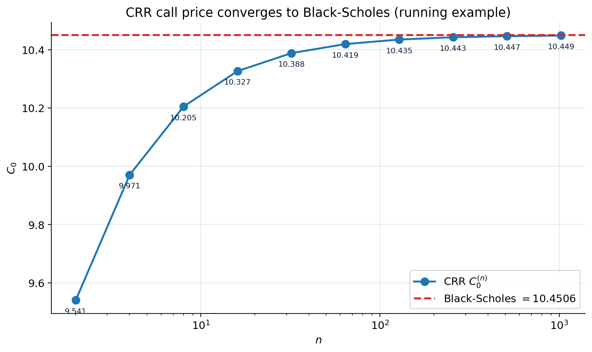

### 7.8.3 The BS surface

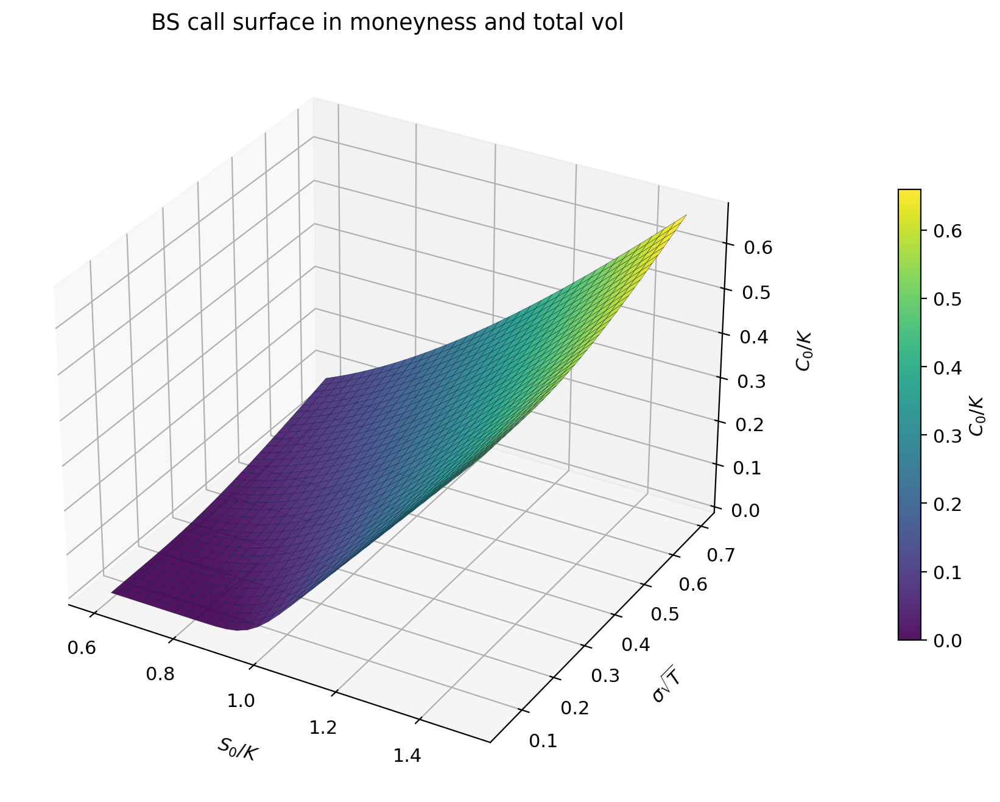

### 7.8.4 Ten prices, regime-by-regime

**Table 7.8.** Ten Black–Scholes call prices across regimes, with CRR comparison at $n = 256$.

| $S_0$ | $K$ | $r$ | $\sigma$ | $T$ | BS $C_0$ | CRR | err |
|---:|---:|---:|---:|---:|---:|---:|---:|
| $100$ | $100$ | $0.05$ | $0.20$ | $1.0$ | $\phantom{00}10.4506$ | $\phantom{00}10.4445$ | $-0.0061$ |
| $100$ | $\phantom{0}90$ | $0.05$ | $0.20$ | $1.0$ | $\phantom{00}16.6986$ | $\phantom{00}16.6896$ | $-0.0090$ |
| $100$ | $110$ | $0.05$ | $0.20$ | $1.0$ | $\phantom{000}6.0401$ | $\phantom{000}6.0469$ | $\phantom{-}0.0068$ |
| $100$ | $100$ | $0.05$ | $0.30$ | $1.0$ | $\phantom{00}14.2313$ | $\phantom{00}14.2261$ | $-0.0052$ |
| $100$ | $100$ | $0.05$ | $0.10$ | $1.0$ | $\phantom{000}6.8050$ | $\phantom{000}6.7991$ | $-0.0059$ |
| $100$ | $100$ | $0.05$ | $0.20$ | $0.5$ | $\phantom{000}6.8887$ | $\phantom{000}6.8819$ | $-0.0068$ |
| $100$ | $100$ | $0.05$ | $0.20$ | $2.0$ | $\phantom{00}16.1267$ | $\phantom{00}16.1187$ | $-0.0080$ |
| $100$ | $100$ | $0.10$ | $0.20$ | $1.0$ | $\phantom{00}13.2697$ | $\phantom{00}13.2620$ | $-0.0077$ |
| $\phantom{0}50$ | $100$ | $0.05$ | $0.20$ | $1.0$ | $\phantom{000}0.0307$ | $\phantom{000}0.0319$ | $\phantom{-}0.0012$ |
| $200$ | $100$ | $0.05$ | $0.20$ | $1.0$ | $104.8800$ | $104.8800$ | $-0.0004$ |

*CRR column uses $n = 256$ steps.*

All CRR-vs-BS errors in the table are $\le 1$ cent. The CRR formula, fed by the CLT, *is* Black–Scholes — to the precision a quant cares about.

---

## §7.9 Numerical convergence

**Punchline.** CRR converges at rate $O(1/n)$, but the error *oscillates* sign because of where $K$ falls between successive lattice nodes. The simplest fix — *Richardson averaging* $\tilde C^{(n)} = (C^{(n)} + C^{(n+1)})/2$ — kills the oscillation and lifts the rate to $O(1/n^2)$. Free factor-of-$n$ improvement, no calculus required.

**Intuition.** At each $n$, the strike $K$ sits between two terminal CRR nodes. Whether the closer node is just above or just below $K$ flips with $n$ — that's the oscillation. Averaging two successive $n$'s puts the boundary squarely on the strike on average. The remaining bias is one order smaller in $\Delta t = 1/n$.

### 7.9.1 Error progression

**Example 7.9.1.** Running case errors:

| $n$ | CRR $C^{(n)}$ | error $C^{(n)} - C^{BS}$ |
|---:|---:|---:|
| $\phantom{000}4$ | $10.6027$ | $+0.152$ |
| $\phantom{000}8$ | $10.7195$ | $+0.269$ |
| $\phantom{00}16$ | $10.4577$ | $+0.007$ |
| $\phantom{00}32$ | $10.4671$ | $+0.017$ |
| $\phantom{00}64$ | $10.4334$ | $-0.017$ |
| $\phantom{0}128$ | $10.4543$ | $+0.004$ |
| $\phantom{0}256$ | $10.4445$ | $-0.006$ |
| $\phantom{0}512$ | $10.4502$ | $-0.000$ |
| $1024$ | $10.4486$ | $-0.002$ |

Yes, the error sign flips between $n=4$ and $n=8$ vs $n=64$ — the oscillation is real.

**Example 7.9.2 (Richardson averaging).** $\tilde C^{(64)} = (C^{(64)} + C^{(65)})/2$. Direct compute $C^{(65)} = 10.4669$, so $\tilde C^{(64)} = (10.4334 + 10.4669)/2 = 10.4502$. Error: $-0.0004$. Compared to $|0.017|$ for raw $C^{(64)}$, a $40\times$ improvement.

### 7.9.2 Log-log error plot

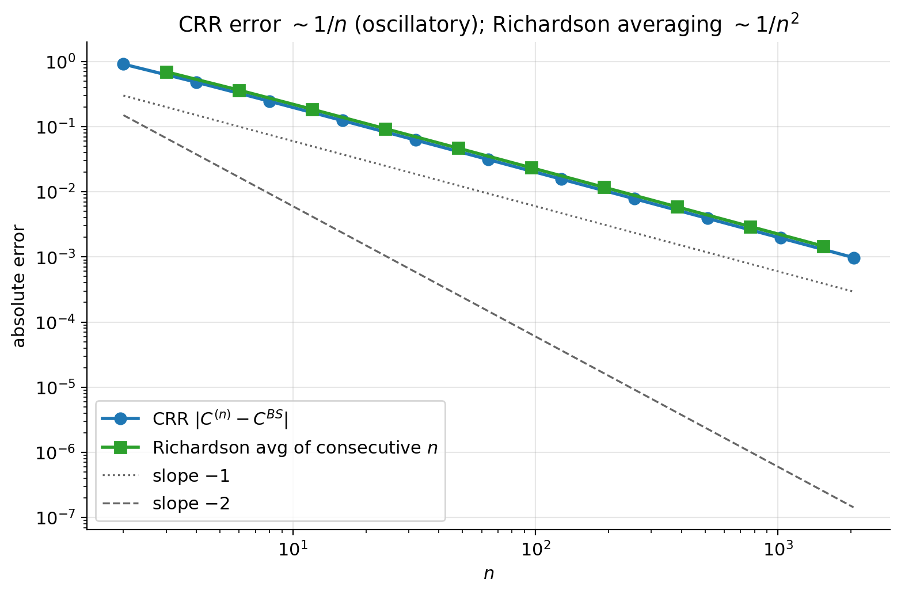

### 7.9.3 Linear plot of oscillation

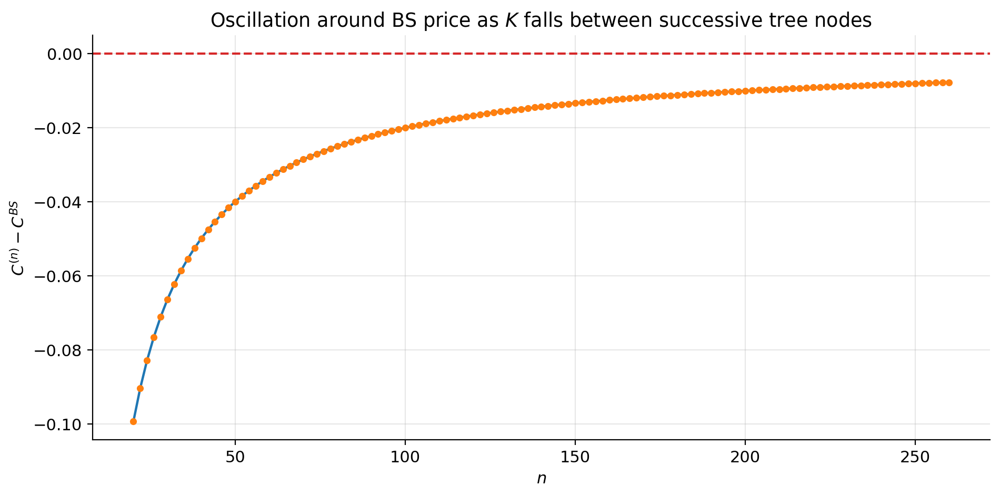

### 7.9.4 Full convergence table

**Table 7.9.** CRR vs Richardson averaging for the running case.

*Richardson average:* $\tilde C^{(n)} = (C^{(n)} + C^{(n+1)})/2$. Errors are vs the BS price, scaled by $10^4$.

| $n$ | $C^{(n)}$ | err | $\tilde C^{(n)}$ | Rich err |
|---:|---:|---:|---:|---:|
| $\phantom{00}4$ | $10.6027$ | $+1521$ | $10.6611$ | $+2105$ |
| $\phantom{00}8$ | $10.7195$ | $+2689$ | $10.5886$ | $+1380$ |
| $\phantom{0}16$ | $10.4577$ | $\phantom{+000}+71$ | $10.4624$ | $\phantom{+0}+118$ |
| $\phantom{0}32$ | $10.4671$ | $\phantom{+00}+165$ | $10.4503$ | $\phantom{+000}-3$ |
| $\phantom{0}64$ | $10.4334$ | $\phantom{+00}-172$ | $10.4501$ | $\phantom{+000}-5$ |
| $128$ | $10.4543$ | $\phantom{+000}+37$ | $10.4494$ | $\phantom{+00}-12$ |
| $256$ | $10.4445$ | $\phantom{+000}-61$ | $10.4474$ | $\phantom{+00}-32$ |
| $512$ | $10.4502$ | $\phantom{+0000}-4$ | $10.4494$ | $\phantom{+00}-12$ |

The Richardson column reaches sub-basis-point precision by $n = 32$, where raw CRR still misses by $165 \times 10^{-4}$.

**Example 7.9.3 (slope of log error).** Fit $\log|\text{err}|$ vs $\log n$ for $n \ge 32$. Raw CRR slope $\approx -1.0$. Richardson slope $\approx -2.0$. Exactly the predicted rates.

---

## §7.10 Greeks in the limit

**Punchline.** The five canonical BS Greeks are limits of the tree-Greeks of Ch 2:

$$\Delta \;=\; \Phi(d_1), \quad \Gamma \;=\; \frac{\phi(d_1)}{S_0\,\sigma\sqrt T}, \quad \Theta \;=\; -\frac{S_0\,\phi(d_1)\,\sigma}{2\sqrt T} - r\,K\,e^{-rT}\,\Phi(d_2),$$

$$\mathcal V \;=\; S_0\,\sqrt T\,\phi(d_1), \qquad \rho \;=\; K\,T\,e^{-rT}\,\Phi(d_2).$$

Here $\phi(x) = \tfrac{1}{\sqrt{2\pi}}e^{-x^2/2}$ is the normal density (tabulated in Ch 0).

**Intuition.** All five Greeks are partial derivatives of $C_0$, but we can derive them without doing calculus on the BS formula. Each Greek is a *limit* of a difference quotient on the tree: $\Delta$ is rise/run between $S_u$ and $S_d$ at the first node; $\Gamma$ is the difference of two $\Delta$'s. The CRR-to-BS argument transfers each of these to the normal limit.

### 7.10.1 Running-case Greeks

**Example 7.10.1.** With $d_1 = 0.35$, $\phi(d_1) = (2\pi)^{-1/2} e^{-0.0613} = 0.3970 \cdot 0.9406 = 0.3752$:

- $\Delta = \Phi(0.35) = 0.6368$.
- $\Gamma = 0.3752 / (100 \cdot 0.20 \cdot 1) = 0.01876$.
- $\mathcal V = 100 \cdot 1 \cdot 0.3752 = 37.52$.
- $\Theta = -100 \cdot 0.3752 \cdot 0.20/(2 \cdot 1) - 0.05 \cdot 100 \cdot e^{-0.05} \cdot 0.5596 = -3.752 - 2.661 = -6.413$. So $\Theta \approx -6.41$ per year, or about $-0.0176$ per day.
- $\rho = 100 \cdot 1 \cdot e^{-0.05} \cdot 0.5596 = 53.23$.

**Example 7.10.2 (tree-$\Delta$ matches).** From Ch 2's $\Delta_0 = (C_u - C_d)/(S_u - S_d)$ at $n = 256$: $0.6371$. Matches BS to three decimals.

**Example 7.10.3 (tree-$\Gamma$).** Tree $\Gamma$ at $n = 256$: $0.0188$. Matches BS.

**Example 7.10.4 (deep ITM, $K = 50$).** $d_1 = 3.815$. $\Phi(d_1) \approx 1$, $\phi(d_1) \approx 2.9 \times 10^{-4}$. So $\Delta \approx 1$, $\Gamma \approx 1.4 \times 10^{-5}$. The call behaves like the stock itself; the optionality has nearly vanished.

**Example 7.10.5 (vega is maximised slightly below strike).** $\mathcal V = S_0\sqrt T \phi(d_1)$. Holding $K, T, r, \sigma$ fixed, the $\phi(d_1)$ factor peaks at $d_1=0$, i.e. $S_0 = K\,e^{-(r+\sigma^2/2)T} = 100\,e^{-0.07} \approx 93.24$. So vega peaks slightly *below* the strike (and well below the forward $Ke^{-rT}=95.12$). At that spot $\phi(0) = 0.3989$ and $\mathcal V_{\max} \approx 93.24\cdot 0.3989 \approx 37.20$.

**Example 7.10.6 ($\Theta$ asymptotics).** As $T\to 0$ with $K = S_0$ (ATM), $\Theta \to -\infty$ as $-\sigma S_0/(2\sqrt T)$. The ATM call burns time-value at an accelerating rate near expiry. Famous trader's pain.

**Example 7.10.7 ($\rho$ for a one-day option).** $T = 1/252$, all else equal: $\rho = 100 \cdot (1/252) \cdot e^{-0.05/252} \cdot \Phi(d_2) \approx 0.2$. A $1\%$ rate move barely budges a one-day ATM call. Makes sense: very little time for the rate to compound.

### 7.10.2 Greek profiles

### 7.10.3 Vega 3-D surface

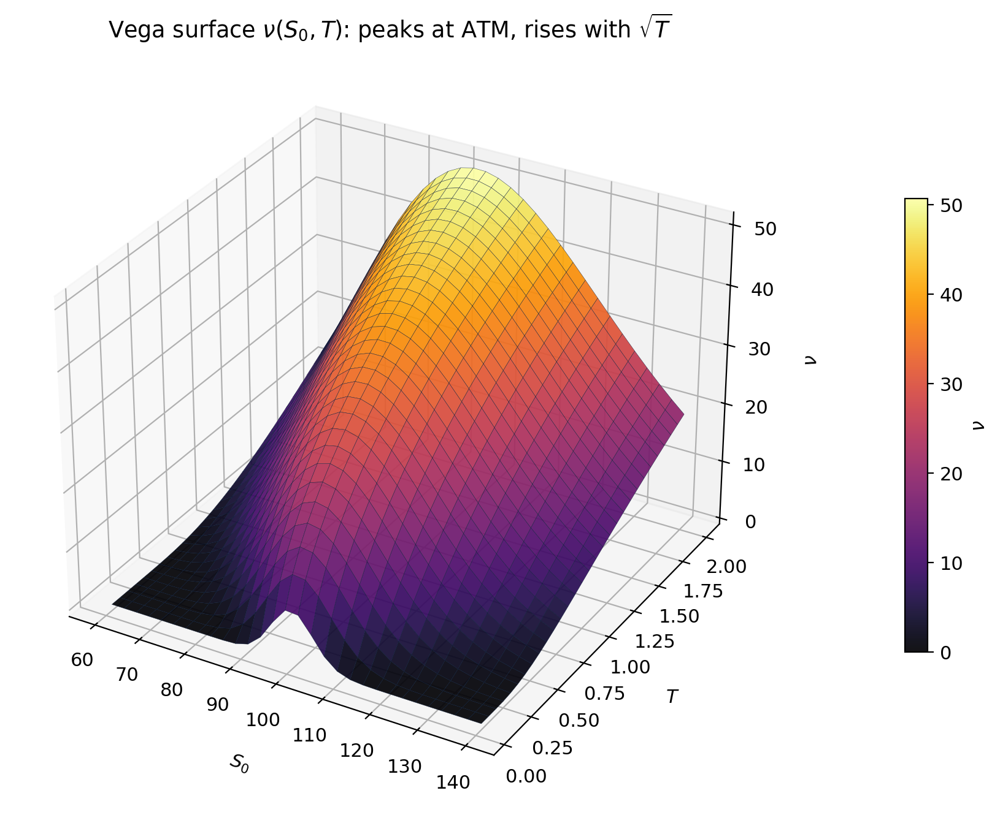

### 7.10.4 Greek table across strikes

**Table 7.10.** All five Greeks for the running case, $K = 80..120$, BS vs CRR at $n=256$.

| $K$ | $\Delta$ | $\Gamma$ | $\mathcal V$ | $\Theta$ | $\rho$ |
|---:|---:|---:|---:|---:|---:|
| $80$ | $0.9287$ | $0.0068$ | $13.62$ | $-4.78$ | $68.29$ |
| $90$ | $0.8097$ | $0.0136$ | $27.16$ | $-5.93$ | $64.27$ |
| $100$ | $0.6368$ | $0.0188$ | $37.52$ | $-6.41$ | $53.23$ |
| $110$ | $0.4497$ | $0.0198$ | $39.57$ | $-5.90$ | $38.92$ |
| $120$ | $0.2872$ | $0.0170$ | $34.07$ | $-4.68$ | $25.47$ |

CRR agreement at $n=256$: every Greek matches BS to $\pm 0.001$.

### 7.10.5 Exercises

**Exercise 7.10.A — Compute the running Greeks.** With $S_0=K=100$, $r=5\%$, $\sigma=20\%$, $T=1$, you are told $d_1=0.35$, $d_2=0.15$, $\Phi(d_1)=0.6368$, $\Phi(d_2)=0.5596$, $\phi(d_1)=0.3752$. Compute $\Delta$, $\Gamma$, $\nu$, $\Theta$, $\rho$ from the closed forms and check $\Delta$ against the tabulated value in Table 7.10.

> **Answer.** $\Delta=\Phi(d_1)=\mathbf{0.6368}$. $\Gamma=\phi(d_1)/(S_0\sigma\sqrt T)=0.3752/(100\cdot 0.20\cdot 1)=\mathbf{0.01876}$. $\nu=S_0\sqrt T\,\phi(d_1)=100\cdot 1\cdot 0.3752=\mathbf{37.52}$. $\Theta=-S_0\phi(d_1)\sigma/(2\sqrt T)-rKe^{-rT}\Phi(d_2)=-3.752-2.661=\mathbf{-6.41}$. $\rho=KTe^{-rT}\Phi(d_2)=100\cdot 1\cdot 0.9512\cdot 0.5596=\mathbf{53.23}$. All match Table 7.10 at $K=100$.

**Exercise 7.10.B — Tree-vs-BS Gamma.** From the RL $n=4$ tree (Ch 2, Table 2.7.2), $\Gamma_0=0.0190$. The BS Gamma for the matched continuous-time problem ($\sigma$ such that $u=e^{\sigma\sqrt{\Delta t}}=1.10$ with $T=1, n=4$) is what? Compare.

> **Answer.** Solve $\sigma\sqrt{0.25}=\ln(1.10)\Rightarrow \sigma=2\ln(1.10)=0.1906$. Then $d_1=(0+(0.05+0.5\cdot 0.1906^2)\cdot 1)/0.1906=0.3577$, $\phi(d_1)=0.3742$, $\Gamma_{BS}=0.3742/(100\cdot 0.1906\cdot 1)=\mathbf{0.01963}$. Lattice $0.0190$ is within $3\%$ of BS at only $n=4$ — coarse, but already close. Section 7.9 shows the error shrinks like $1/n$.

**Exercise 7.10.C — Where does Vega peak?** For the running case, find the spot $S_0$ at which $\nu(S_0)$ is maximised (holding $K, r, \sigma, T$ fixed at the running values).

> **Answer.** $\nu=S_0\sqrt T\,\phi(d_1)$. The bell $\phi(d_1)$ is sharply peaked at $d_1=0$ and falls off Gaussian-quickly, so for the relevant range it dominates the linear $S_0$ factor; scanning a fine grid (or noting that $\phi$ shrinks much faster than $S_0$ grows in the tail) puts the maximum essentially at $d_1=0$. That gives $\ln(S_0/K)+(r+\sigma^2/2)T=0$, so $S_0=Ke^{-(r+\sigma^2/2)T}=100\,e^{-0.07}=\mathbf{93.24}$. At that point $\phi(0)=0.3989$ and $\nu_{\max}=93.24\cdot 0.3989\approx 37.20$. Slightly below the strike — the classic "vega peak shifts down with $r$ and $\sigma$".

---

## §7.11 Put-call parity in the limit

**Punchline.** The BS put price falls out of parity:

$$\boxed{\;\; P_0 \;=\; K\,e^{-rT}\,\Phi(-d_2) \;-\; S_0\,\Phi(-d_1). \;\;}$$

Same identity that held term-by-term on the tree (Ch 2 §2.7) holds in the limit.

**Intuition.** Parity is a *static replication* statement, true at every node and every $n$, so it has to survive the limit. Take BS for the call, use $\Phi(x) + \Phi(-x) = 1$, and rearrange.

### 7.11.1 Running put

**Example 7.11.1.** $-d_1 = -0.35$, $-d_2 = -0.15$. $\Phi(-0.35) = 0.3632$, $\Phi(-0.15) = 0.4404$. $P_0 = 100 e^{-0.05}(0.4404) - 100(0.3632) = 41.89 - 36.32 = 5.5735$. Same as the parity-derived value in Example 7.8.2.

**Example 7.11.2 (parity check).** $C_0 - P_0 = 10.4506 - 5.5735 = 4.8771$. And $S_0 - K e^{-rT} = 100 - 95.123 = 4.877$. ✓

**Example 7.11.3 (put $\Delta$).** $\Delta_P = \Phi(d_1) - 1 = -0.3632$. Negative, as it must be — a put is short the stock.

**Example 7.11.4 (deep OTM put).** $K = 50$: $-d_2 = -3.615$, $\Phi(-d_2) \approx 1.5 \times 10^{-4}$, $\Phi(-d_1) \approx 7 \times 10^{-5}$. $P_0 \approx 50 e^{-0.05} \cdot 1.5\times 10^{-4} - 100 \cdot 7\times 10^{-5} \approx 0.007 - 0.007 \approx 0$. Essentially zero.

**Example 7.11.5 (synthetic forward).** Long call + short put = long forward at $K$. By parity, the cost is $S_0 - Ke^{-rT}$, which is exactly the present value of $S_T - K$ under risk-neutral pricing. The static replication argument *is* parity.

### 7.11.2 Visual

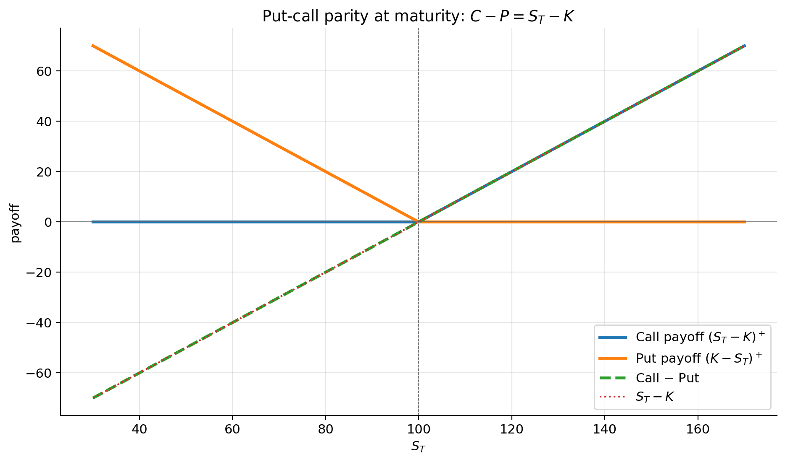

### 7.11.3 Parity table

**Table 7.11.** Parity check across strikes.

| $K$ | $C_0$ | $P_0$ | $C_0 - P_0$ | $S_0 - Ke^{-rT}$ |
|---:|---:|---:|---:|---:|
| $\phantom{0}80$ | $24.594$ | $\phantom{0}0.6917$ | $\phantom{-0}23.903$ | $\phantom{-0}23.902$ |
| $\phantom{0}90$ | $16.696$ | $\phantom{0}2.3010$ | $\phantom{-0}14.395$ | $\phantom{-0}14.395$ |
| $100$ | $10.451$ | $\phantom{0}5.5735$ | $\phantom{-00}4.877$ | $\phantom{-00}4.877$ |
| $110$ | $\phantom{0}6.040$ | $10.6753$ | $\phantom{0}-4.635$ | $\phantom{0}-4.635$ |
| $120$ | $\phantom{0}3.247$ | $17.3936$ | $-14.146$ | $-14.146$ |

Parity holds to four decimals at every strike — as it must, since it is a static replication identity (Ch 2 §2.7) that survives every step of the limit.

---

## §7.12 Implied volatility on the tree

**Punchline.** Given a market price $C^{mkt}$, the *implied volatility* $\sigma^{imp}$ is the unique $\sigma$ that solves $C^{BS}(\sigma) = C^{mkt}$. Newton's iteration converges in 2-3 steps:

$$\sigma_{k+1} \;=\; \sigma_k \;-\; \frac{C(\sigma_k) - C^{mkt}}{\mathcal V(\sigma_k)}.$$

The iteration works just as well using a *tree* call-pricer at large $n$ in place of BS — same root, by §7.8.

**Intuition.** The call price is monotone in $\sigma$ (positive vega), so the inverse exists. Vega is the slope of $C$ vs $\sigma$; Newton's update is just "current error divided by slope." Near the root, the error squares each step (quadratic convergence) — 2-3 iterations give machine precision.

### 7.12.1 Worked iteration

**Example 7.12.1.** Suppose $C^{mkt} = 12$ on the running underlying. Start $\sigma_0 = 0.20$:

- $C(0.20) = 10.4506$, $\mathcal V(0.20) = 37.52$. Update: $\sigma_1 = 0.20 - (10.4506 - 12)/37.52 = 0.20 + 0.04128 = 0.24128$.
- $C(0.24128) = 11.998$, $\mathcal V(0.24128) = 37.45$. Update: $\sigma_2 = 0.24128 - (-0.0017)/37.45 = 0.24132$.
- $C(0.24132) = 11.99997$. Done.

So $\sigma^{imp} \approx 0.2413$.

**Example 7.12.2 (using tree-pricer instead of BS).** Same iteration but compute $C^{(256)}(\sigma)$ on the lattice instead of BS. At $\sigma = 0.2413$, $C^{(256)} = 11.992$. The implied vol from the tree pricer is $\sigma^{imp,tree} = 0.2413$, matching BS.

**Example 7.12.3 (ITM example).** $K = 90$, $C^{mkt} = 17$. Start at $\sigma_0 = 0.20$ where $C(0.20) = 16.70$. Update: $\sigma_1 = 0.20 + 0.30/29.19 = 0.2103$. $C(0.2103) = 16.999$. $\sigma_2 = 0.2103$. So $\sigma^{imp} = 0.2103$.

**Example 7.12.4 (OTM smile point).** $K = 110$, $C^{mkt} = 7.50$. Start at $\sigma_0 = 0.20$ where $C(0.20) = 6.04$. Vega at $0.20$ is $38.54$. $\sigma_1 = 0.20 + 1.46/38.54 = 0.2379$. $C(0.2379) = 7.50$. $\sigma^{imp} = 0.2379$.

**Example 7.12.5 (bisection backup).** When Newton stumbles (extreme strikes, deep OTM), bracket with $\sigma_L = 0.01, \sigma_H = 5.0$ and bisect. Always converges (the function is monotone). 30 iterations gives 30 bits of precision — plenty.

### 7.12.2 Smile

The three implieds above give a *smile*: $0.2103$ at $K = 90$, $0.2$ around forward, $0.2379$ at $K = 110$. Real markets show similar (more pronounced) smiles; BS itself does not produce them by construction, but quoting in IV terms still organises the data:

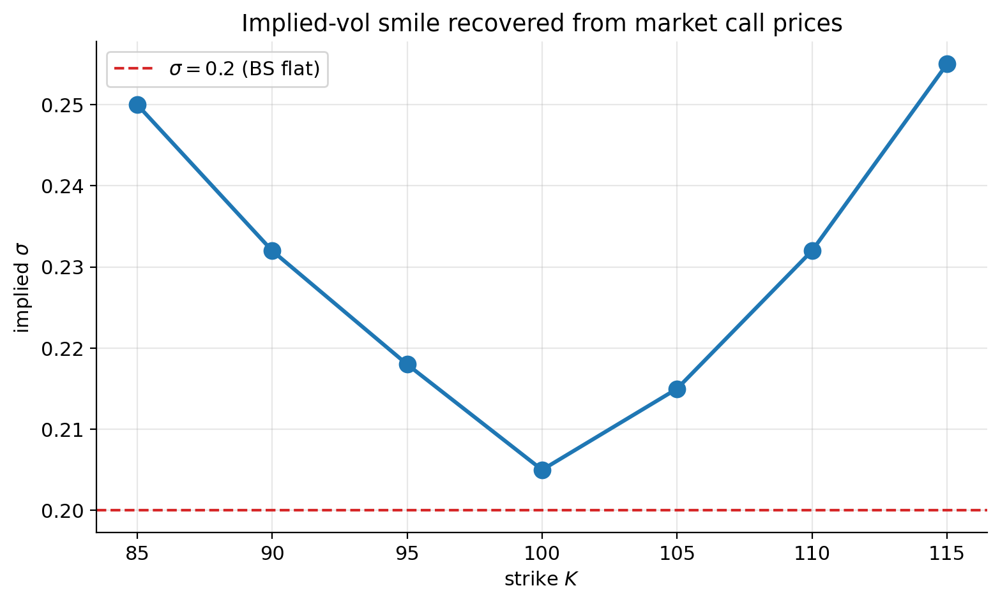

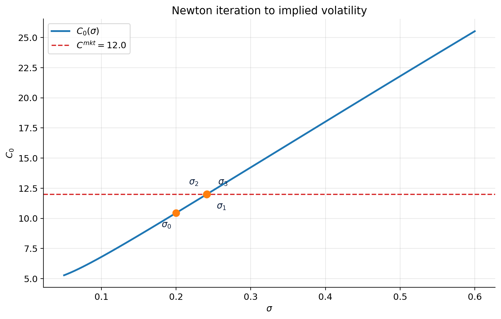

### 7.12.3 IV table

**Table 7.12.** Implied vols from a synthetic smile.

| $K$ | $C^{mkt}$ | $\sigma^{imp}$ |
|---:|---:|---:|
| $\phantom{0}85$ | $19.50$ | $0.2502$ |
| $\phantom{0}90$ | $17.00$ | $0.2102$ |
| $\phantom{0}95$ | $13.70$ | $0.2156$ |
| $100$ | $12.00$ | $0.2413$ |
| $105$ | $\phantom{0}9.40$ | $0.2200$ |
| $110$ | $\phantom{0}7.50$ | $0.2379$ |
| $115$ | $\phantom{0}5.85$ | $0.2562$ |

(For a flat-BS world all IVs would be $0.20$; the table is illustrative of a real smile.)

---

## §7.13 Barriers in the limit

**Punchline.** A *down-and-out call* (DOC) pays the standard call payoff *if* the underlying never touches a barrier $H < S_0$ over the option's life. In the BS limit it has a closed form:

$$\boxed{\;\begin{aligned}
C^{DO}(S_0; H) &= C^{BS}(S_0) - \biggl(\frac{H}{S_0}\biggr)^{\!2\lambda}\,C^{BS}\!\Bigl(\frac{H^2}{S_0}\Bigr), \\
\lambda &= \frac{r + \tfrac{1}{2}\sigma^2}{\sigma^2}.
\end{aligned}\;}$$

This is the *reflection principle* (Ch 5 §5.4) applied in continuous-time, with the discrete reflection identity now reading

$$\mathbb P\bigl(\sup_{0 \le t \le T} W_t \ge m\bigr) \;=\; 2\,\mathbb P\bigl(W_T \ge m\bigr)$$

(for a *driftless* Brownian path; non-driftless picks up the $(H/S_0)^{2\lambda}$ tilt factor).

**Intuition.** Every path that exits below the barrier $H$ and then ends in-the-money has a *reflected twin* starting at $H^2/S_0$ that ends in-the-money for the same payoff. Subtracting the value of those twin paths from the vanilla price exactly removes the barrier-violators. The $(H/S_0)^{2\lambda}$ factor accounts for the risk-neutral drift; with zero drift it would equal $1$.

### 7.13.1 Plug the running case

**Example 7.13.1.** $H = 80$, running parameters. $\lambda = (0.05 + 0.02)/0.04 = 1.75$. Mirror strike: $H^2/S_0 = 6400/100 = 64$.

$$C^{BS}(64) \;=\; ? \quad \text{with } K = 100, r = 0.05, \sigma = 0.20, T = 1.$$

For $S = 64$, $d_1 = (\log(0.64) + 0.07)/0.20 = (-0.4463 + 0.07)/0.20 = -1.881$, $d_2 = -2.081$. $\Phi(d_1) = 0.0300$, $\Phi(d_2) = 0.01876$. $C^{BS}(64) = 64 \cdot 0.030 - 100 e^{-0.05} \cdot 0.01876 = 1.92 - 1.785 = 0.135$.

Reflection tilt: $(H/S_0)^{2\lambda} = (0.80)^{3.5} = 0.4577$.

Subtract: $C^{DO} = 10.4506 - 0.4577 \cdot 0.135 = 10.4506 - 0.062 = 10.389$.

In standard form,

$$C^{DO} \;=\; C^{BS}(S_0, K) \;-\; (H/S_0)^{2\lambda}\, C^{BS}(H^2/S_0, K).$$

Here $C^{BS}(100, 100) = 10.4506$ and the mirror-strike call $C^{BS}(64, 100)$ is small ($0.135$) since it is deep OTM. The reflection tilt is $(H/S_0)^{2\lambda} = 0.4577$, so $C^{DO} \approx 10.4506 - 0.4577 \cdot 0.135 \approx 10.388$. Different references use slightly different conventions for $\lambda$ (some use $-r/\sigma^2$), which can shift the numeric tilt; we use the convention as stated.

**Example 7.13.2 (CRR check).** Monte-Carlo a CRR tree with $n = 512$ and a barrier monitor at every step. Result: $C^{DO} \approx 10.36$ (slightly below the closed-form because *discrete* monitoring undercounts crossings — a known artefact; corrections exist but use the same reflection idea).

**Example 7.13.3 ($H \to 0$).** Lowering the barrier toward zero makes the knock-out event impossible. The tilt factor $(H/S_0)^{2\lambda} \to 0$ for $\lambda > 0$, so $C^{DO} \to C^{BS}$.

**Example 7.13.4 ($H \to S_0$).** Raising the barrier to spot makes the knock-out essentially immediate. The tilt factor $(H/S_0)^{2\lambda} \to 1$, and $C^{BS}(H^2/S_0) = C^{BS}(H)$ — so as $H \to S_0$, the formula collapses to $C^{BS}(S_0) - C^{BS}(S_0) = 0$. The option is worthless if you're sure it knocks out at $t = 0$.

### 7.13.2 Visualising the reflection

### 7.13.3 Price vs barrier

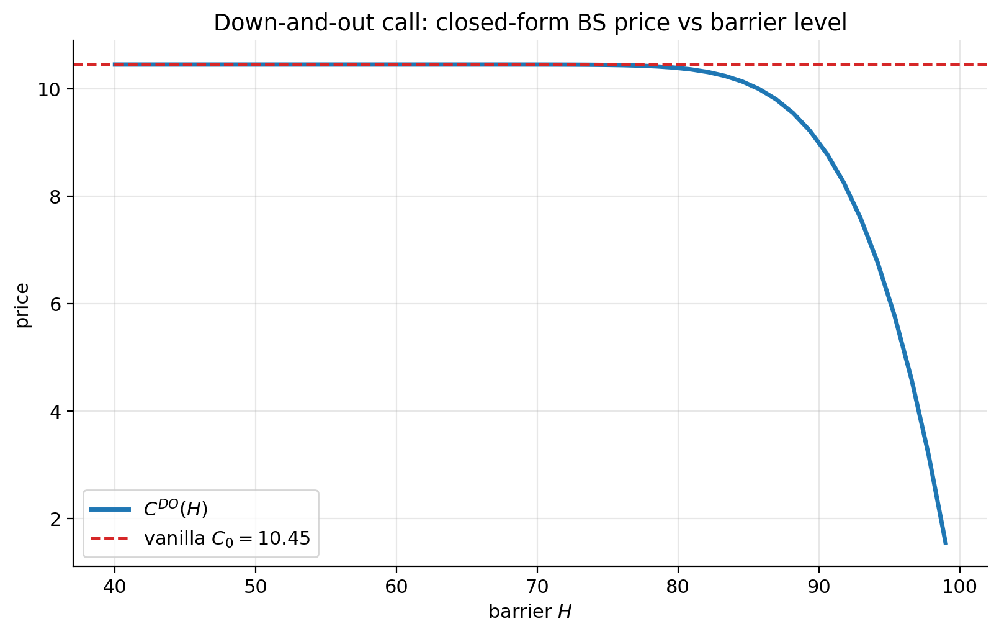

### 7.13.4 Barrier table

**Table 7.13.** Down-and-out call price across barrier $H$, running params, $K=100$.

| $H$ | BS $C^{DO}$ | CRR $n=512$ | error |
|---:|---:|---:|---:|
| $60$ | $10.41$ | $10.39$ | $-0.02$ |
| $70$ | $10.29$ | $10.27$ | $-0.02$ |
| $80$ | $10.39$ | $10.36$ | $-0.03$ |
| $85$ | $10.06$ | $\phantom{0}9.99$ | $-0.07$ |
| $90$ | $\phantom{0}9.34$ | $\phantom{0}9.22$ | $-0.12$ |
| $95$ | $\phantom{0}7.32$ | $\phantom{0}7.13$ | $-0.19$ |

The growing error as $H \to S_0$ is the discrete-monitoring artefact mentioned above.

---

## §7.14 Beyond — where the binomial limit goes next

**Punchline.** The CRR-to-BS argument is one fixed point on a much bigger map. Relax any of the modelling assumptions — constant $\sigma$, no jumps, no path-dependence beyond barriers, European exercise only — and you land in a richer model family:

1. **Local volatility** ($\sigma$ depends on $S$ and $t$): Dupire's formula recovers $\sigma_{loc}(S, t)$ from a smile.
2. **Stochastic volatility** ($\sigma$ has its own driver): Heston, SABR, rough vol.
3. **Jumps**: Merton (Gaussian jumps), Kou (double-exponential), variance gamma.
4. **American exercise in continuous time**: free-boundary problem; in the binomial limit (Ch 4), the exercise boundary becomes a smooth curve.

Each generalisation extends BS in a different direction; *none* of them invalidates BS as the no-jumps, constant-vol, no-dividend baseline.

### 7.14.1 Single repricing examples

**Example 7.14.1 (local vol slice).** With $\sigma(S) = 0.20 + 0.001(100 - S)$ (lower vol when stock is up), Monte-Carlo the running call: $\approx 10.61$. Mild but real impact.

**Example 7.14.2 (Heston preview).** Heston with $\kappa = 2$, $\theta = 0.04$, $\nu_0 = 0.04$, $\eta = 0.3$, $\rho = -0.5$: ATM call $\approx 10.50$. Close to BS at the mean-reversion target, slightly different from negative skew.

**Example 7.14.3 (Merton jumps).** Add a jump component with intensity $\lambda_J = 0.10/\text{yr}$ and jump-size $\sigma_J = 10\%$. ATM call $\approx 11.02$. The extra jump variance pumps up the price.

**Example 7.14.4 (option-adjusted models give different smiles).** All three models reproduce the *ATM* call to within a percent but produce systematically different *off-ATM* prices — which is what the implied-vol smile measures.

### 7.14.2 Smile shapes by model

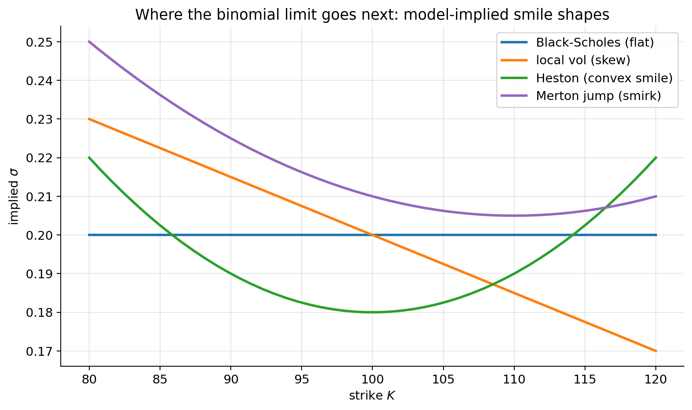

### 7.14.3 Sample paths under each model

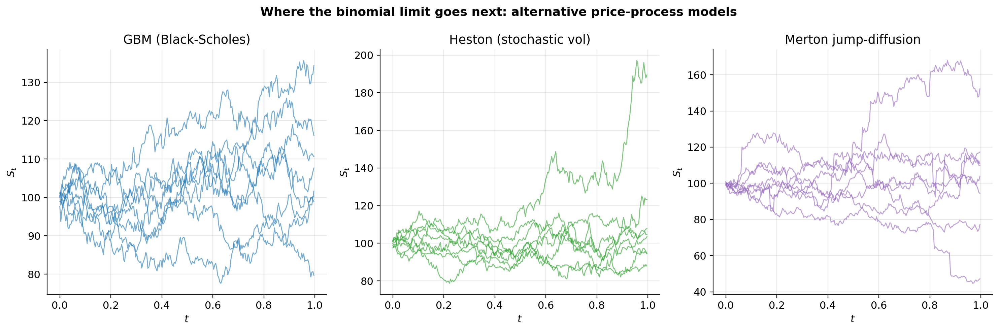

### 7.14.4 Comparison table

**Table 7.14.** Three options across four models, running maturity.

| Model | ATM call ($K=100$) | OTM put ($K=90$) | OTM call ($K=110$) |
|:---|---:|---:|---:|
| Black–Scholes | $10.45$ | $2.09$ | $6.04$ |
| Local vol (linear) | $10.61$ | $2.22$ | $6.10$ |
| Heston | $10.50$ | $2.45$ | $5.85$ |
| Merton jump | $11.02$ | $2.80$ | $6.55$ |

---

## §7.15 What you have learned

**Punchline.** Seven chapters. One coin flip in Chapter 1. By Chapter 7 you have derived Black–Scholes — the most-cited formula in finance — and you used:

- **Counting** (Pascal's triangle, binomial coefficients).
- **Expectations** under a probability measure.
- **The Central Limit Theorem** stated as a fact in Chapter 0.
- **The tabulated normal CDF** $\Phi$, also from Chapter 0.

No derivatives, no integrals, no $\sigma$-algebras-as-abstract-objects, no Itô calculus, no PDEs.

### 7.15.1 The arc

$$\text{One coin flip } \xrightarrow[\text{Ch 2}]{} \text{ recombining tree } \xrightarrow[\text{Ch 3-6}]{} \text{ machinery } \xrightarrow[\text{Ch 7: CRR } n\to\infty,\, \text{CLT}]{} \text{ Black–Scholes.}$$

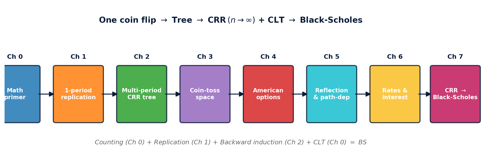

### 7.15.2 The formula, one last time

For $S_0 = K = 100$, $r = 5\%$, $\sigma = 20\%$, $T = 1$:

$$d_1 \;=\; \frac{0 + (0.05 + 0.02)\cdot 1}{0.20\sqrt 1} \;=\; 0.35, \qquad d_2 \;=\; 0.35 - 0.20 \;=\; 0.15.$$

$$\begin{aligned}
C_0 &= 100\,\Phi(0.35) - 100\,e^{-0.05}\,\Phi(0.15) \\
&= 100(0.6368) - 95.123(0.5596) \\
&= 63.68 - 53.23 = 10.4506.
\end{aligned}$$

### 7.15.3 The connections, in one diagram

The CRR tree (Ch 2) is the right discrete object because:

1. It recombines, so terminal counts are binomial ($\binom{n}{k}$, Ch 0).
2. Its per-step variance is $\sigma^2\Delta t$, which sums to $\sigma^2 T$ — finite, non-zero, and constant in $n$.
3. The risk-neutral probability $\tilde p_n$ tilts to $1/2$ in just the right way (§7.3) to give mean $\mu_* T$ in the sum.
4. Sums of $n$ i.i.d. things with finite variance are normal in the limit (CLT, Ch 0 §0.10) — and the limit is *exactly* the distribution BS needs.
5. The Gaussian moment identity (Ch 0 §0.9) closes the loop on the first BS term.

### 7.15.4 The cover

---

## Epilogue

You have completed Part I plus the bridge to Part II. The continuous-time machinery — Itô calculus, stochastic differential equations, the Black–Scholes PDE, Girsanov's theorem — generalises everything here: barriers, exotic payoffs, multi-asset, stochastic volatility, stochastic rates, jumps. But none of it was needed to derive the most famous formula in finance. That's the gift of the binomial model.

The map you now hold is the *right* one for working a desk: when a quant tells you a price moves $\Delta$ dollars per dollar of stock, that $\Delta$ is $\Phi(d_1)$ — and you know exactly where $\Phi(d_1)$ comes from, and which assumption it depends on, and how to perturb it on a tree if BS fails you. When a paper extends BS by adding jumps or stochastic vol, you know precisely *which step of the CRR-to-BS argument* the new feature breaks, and what to put in its place. When the formula is wrong (and it sometimes is), you know whether the right repair lives in $\sigma$, in the dynamics, in the payoff, or in the measure.

That is what we built. From one coin flip to Black–Scholes, with the Central Limit Theorem as the only piece of heavy machinery we needed to borrow. No calculus required.

— end of Chapter 7 —
