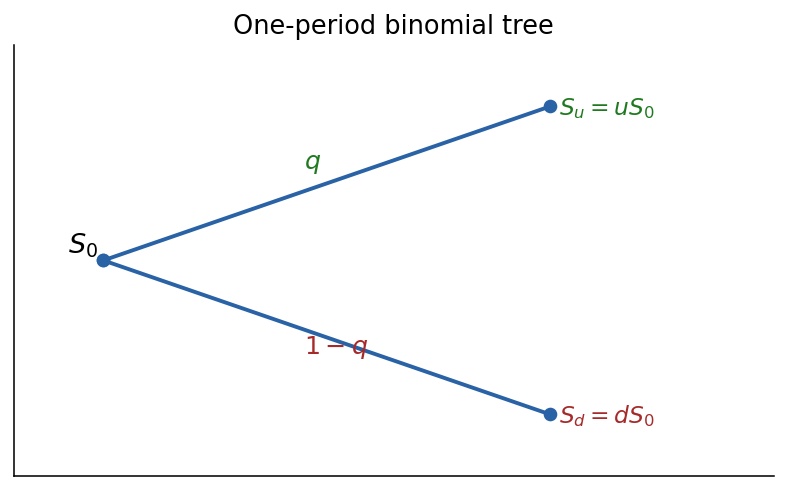
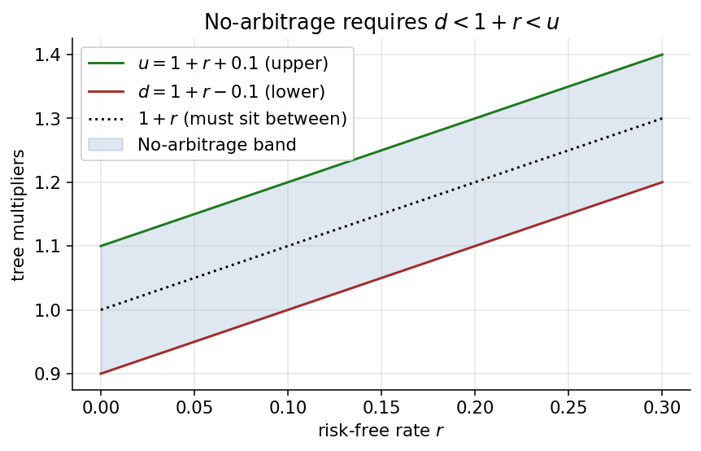
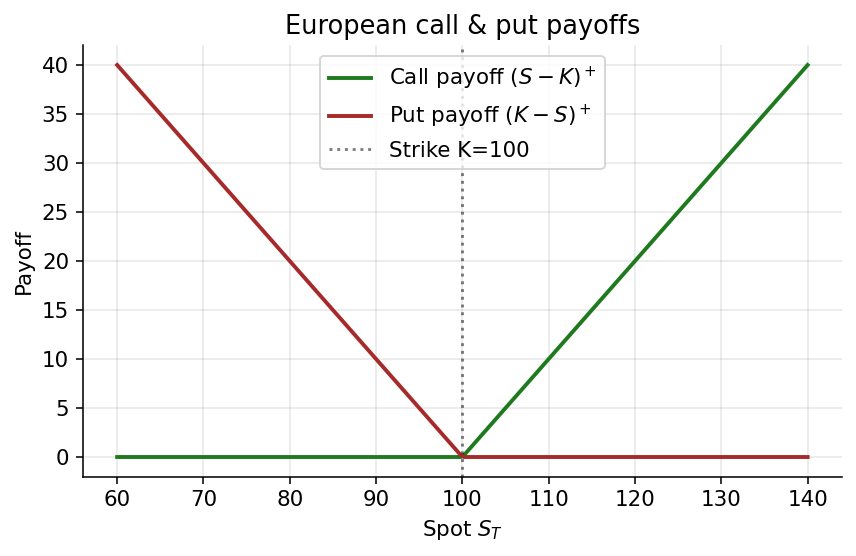

# Chapter 1 — One-Period Binomial: Utility + No-Arbitrage

This chapter merges two overlapping lectures on the one-period binomial model. The first thread runs through utility theory and indifference pricing — showing that naive expected-value pricing fails for risk-averse agents, and that the familiar risk-neutral pricing formula emerges as the vanishing-risk-aversion limit of indifference pricing. The second thread is the no-arbitrage / replication argument that makes no reference to preferences, and pushes through to multi-period trees, calibration to log-normal drift/variance, and the CLT limit that gives geometric Brownian motion. The two derivations are deliberately placed side by side: utility first (because it motivates why we want a "risk-neutral" measure at all), then no-arbitrage (because it delivers the same measure cleanly and extends to the rest of the book).

> Narrative spine. A derivatives price cannot be the discounted real-world expectation of its payoff; that would require a utility function, a risk premium, and disagreement across investors. The binomial model shows that a *different* probability measure — the one making the hedging portfolio break even on average — is the only pricing measure that rules out free lunches. Everything in continuous time (Black–Scholes, Heston, HJM, Margrabe) is a limiting case of what you see on the next few pages.

A word on the mindset this chapter demands. Derivatives pricing is a subject that rewards slow reading, because every term in every equation carries economic meaning that is easy to skip past and hard to recover later. We will revisit the same identity from three or four different angles — as a utility limit, as a no-arbitrage consequence, as a replication cost, and as a martingale property — not because the identity changes but because each viewpoint teaches a different lesson about *why* the identity holds. A reader who grasps all four viewpoints simultaneously has internalised the entire conceptual engine of modern derivatives pricing. Everything after this chapter is, in a precise sense, implementation detail.

It is also worth saying explicitly what we are *not* doing in this chapter. We are not using stochastic calculus, measure-theoretic probability, or Itô's lemma. All the heavy-lifting theorems will appear later. The binomial model is deliberately constructed to sidestep these tools while still delivering every conceptual ingredient of the continuous-time theory. If you have seen Black–Scholes derived via a PDE and found the argument opaque, reading the corresponding binomial derivation first tends to clarify enormously: the PDE version is the same argument, rewritten in the language of infinitesimals. The binomial version lets you inspect each step with arithmetic rather than analysis.

### Why start with a binomial tree at all

Before we plunge into formulas it is worth stating, in plain language, what this chapter is buying us. Real-world derivatives markets are full of continuous prices, continuous time, calendar curves, volatility surfaces, interest rate term structures, and traders who speak entirely in Greeks. It is tempting to leap directly to Black–Scholes, Heston, or a full affine-jump-diffusion model. We resist that temptation for three reasons.

First, a two-state, one-step model is the smallest non-trivial example where every conceptual ingredient of modern derivatives pricing already appears: a source of randomness, a bond, a risky asset, a contingent claim, a replicating portfolio, a risk-neutral measure, and a no-arbitrage bound. Reducing the machinery to this minimum lets us see the *skeleton* before the muscles are attached. In continuous-time treatments the skeleton is buried under the technicalities of stochastic integration, filtrations, and measurable sets; the binomial model strips all that away and lets us stare directly at the structural bones.

Second, the argument that price equals replication cost is *discrete* in spirit, even in continuous time. When we later prove Black–Scholes by stochastic calculus, the step "the payoff is replicable by a self-financing strategy, so its price equals the initial value of that strategy" is the exact same step we establish here. Get it right in one period and the multi-period and continuous-time extensions become bookkeeping, not conceptual leaps. This point cannot be overstated: the majority of confusion students feel when they first encounter Black–Scholes comes from missing this equivalence. Once you know that the PDE is just a continuous-time restatement of "price equals replication cost," the formula loses its mystery and becomes, at worst, a calculation.

Third, the binomial model is how almost everyone in the industry still thinks about exotic options, especially American-style and path-dependent structures. Production pricing engines still use binomial and trinomial lattices for Bermudan swaptions, callable bonds, and employee stock options. Understanding the one-period tree is not a pedagogical toy — it is the atom out of which those industrial tools are built. A quant who has internalised the one-period logic can walk into a trading desk and immediately understand why the lattice code is structured the way it is: the backward induction, the early-exercise comparison, the numeraire choice, the discounting at each node — all of these are direct consequences of the material covered in this single chapter.

There is a fourth reason that is harder to articulate but is worth naming. The binomial tree is *beautiful* in the mathematical sense: every assumption has a clear role, every formula has a geometric interpretation, and the transition from discrete to continuous is smooth and illuminating. Subjects that are beautiful tend to be the ones you come back to when you are confused about a harder problem. In the decades following your first encounter with the binomial tree, you will repeatedly find yourself sketching a two-node tree on a napkin to sanity-check a much more complicated calculation. The tree is therefore not just a pedagogical device but a tool you keep in your pocket for the rest of your career.

### How this chapter is organized

We proceed in four movements. The first movement (§1–§4) takes the naïve approach to pricing a single risky payoff: assume you have preferences, write down a utility function, and demand that the investor be indifferent between paying the price now and keeping their wealth certain. This produces the *indifference price*. We will see that it depends on an agent's risk aversion parameter, that it produces a bid–ask spread, and that it collapses to discounted expected value only in the limit of zero risk aversion. A market cannot run on this price — every agent has a different one. But studying it first gives us a crucial calibration: it tells us *what* the no-arbitrage price is solving, so that when we meet the no-arbitrage price in §5 we understand why it is the right answer.

The second movement (§5–§9) abandons preferences and replaces them with no-arbitrage. We introduce a second asset (a numeraire, typically a bond), define arbitrage precisely, and show that the mere absence of arbitrage implies the existence of a synthetic probability — the risk-neutral measure — under which relative prices have zero drift. Any contingent claim can then be priced by computing its expected payoff under this measure and discounting. This *replication* argument is the engine of all derivatives pricing. The surprise, which we will emphasise repeatedly, is that by demanding something weaker than full preference specification (only that free lunches are impossible), we obtain something stronger (a price that is unique and agent-independent).

The third movement (§10–§12) scales the tree up: we extend to many periods, calibrate the step size to match a log-normal drift and variance, and show that the terminal distribution converges to a Gaussian log-return — equivalently, that the asset becomes geometric Brownian motion in the continuous-time limit. This is how continuous models emerge as limits of discrete ones. The reader unfamiliar with the central limit theorem's role in finance will see it here in its most important application: carefully scaled sums of coin flips produce, in the limit, the log-normal distribution that underlies every standard option pricing model.

The fourth movement (§13–§14) closes the circle. We give a clean explicit proof that the existence of a risk-neutral measure implies no-arbitrage, and we close the calibration argument with a clean central-limit theorem argument using characteristic functions. By the end of the chapter you will have derived, from scratch and without invoking stochastic calculus, every ingredient needed to read an option chain: the meaning of the implied volatility that underlies every quote, the hedge ratios every trading desk uses, the martingale structure every risk system assumes, and the log-normal benchmark against which all real-world pricing anomalies are measured.

A final note on reading order. The four movements are logically sequential, but they are not equally difficult. Movements one and two are elementary in their mathematical demands but deep in their conceptual content — the hard work there is absorbing what the formulas *mean*. Movement three is more demanding algebraically (Taylor expansions, careful limits) but conceptually simpler: it is a bridge from the discrete to the continuous. Movement four is the most technical, using characteristic functions to nail down the limit rigorously. Readers short on time can read §1–§9 with great care and skim §10–§14, and will have absorbed ninety percent of the conceptual content of the chapter.

---

## 1. The One-Period Binomial Tree

Before writing anything down formally, let us set the scene. We want the simplest possible model in which time passes, prices can change, and a rational agent might want to take a position. "Simplest" here means: one decision point, one uncertain outcome, a minimum of moving parts. A *single* risky asset with *two* possible future values, observed over *one* period of time, is the minimum. We will refer to this setup as the one-period binomial tree, or sometimes just "the tree."

Consider a single risky asset $A$ observed at two dates $t = 0$ and $t = 1$. At $t=1$ the price takes one of two values, $A_u$ (up) or $A_d$ (down), with real-world up-probability

$$p \in (0,1). \tag{1.1}$$

*Why this matters.* The condition $p \in (0,1)$ — not $p \in [0,1]$ — means both states are genuinely possible under the real-world measure $\mathbb{P}$. If $p = 0$ or $p = 1$ the "tree" collapses to a deterministic path and arbitrage becomes trivial. Strict positivity of both branch probabilities is what makes the market risky, and what later forces the equivalent martingale measure $\mathbb{Q}$ to assign strictly positive probability to both branches as well.

It is important to dwell on what this condition *does not* say. It does not say that the two probabilities are equal. It does not say that the up-move and down-move are of equal magnitude. It does not say anything about how rational or irrational any agent's beliefs about $p$ might be. All it says is that, under whatever measure we decide to call $\mathbb{P}$, both futures are reachable. The usefulness of this minimal condition is that it already rules out deterministic models disguised as random ones. A "risky" asset with $p \in \{0, 1\}$ is just a bond in disguise, and attempting to price options on a bond leads nowhere. An option written on a deterministic process has a deterministic payoff, and "pricing" it reduces to discounting a known number — not a subject worth a chapter.

There is a deeper philosophical point buried here. Classical probability theory is comfortable with events of probability zero; measure theory is built around negligible sets. But for asset pricing we will insist on *equivalent* measures — measures that agree on which events are negligible. If $\mathbb{P}$ gives probability zero to the down-move, then no equivalent measure can give it positive probability. This would prevent the down payoff from contributing to any price under $\mathbb{Q}$, and the pricing theory would collapse. The condition $p \in (0,1)$ is our insurance policy against that collapse.

*An observation about subjectivity.* The probability $p$ is a modeller's choice. Two different traders, looking at the same asset, can have genuinely different $p$. One might be a permabull who estimates $p = 0.7$, another a permabear at $p = 0.3$. Remarkably, as we will see, the *fair price* of any derivative on $A$ does not depend on $p$ at all — only on the payoff values $A_u$ and $A_d$ and the structure of the market. This is the most counterintuitive and most useful feature of no-arbitrage pricing. It says that agreement on fundamentals (the tree structure) trumps disagreement about likelihoods (the probabilities). We will spend several sections motivating and exploiting this feature.

*A remark on the one-period horizon.* Saying the asset is "observed" only at $t = 0$ and $t = 1$ is a modelling choice. Nothing forbids the price from fluctuating wildly *between* those two dates — it is only at the two endpoints that we care about its value. This is adequate for a European-style claim, whose payoff depends only on the terminal price. Path-dependent claims, and American-style claims with early exercise rights, will require multi-period trees (§10) to capture the intermediate behaviour.

ASCII diagram of the $A$-tree:

```
                ● A_u   (prob. p)
               ╱
              ╱
     A_0 ●───┤
              ╲
               ╲
                ● A_d   (prob. 1-p)

  t = 0           t = 1
```



*One-period binomial tree.*

The (random) time-1 price can be written as a function of a Bernoulli indicator $x_1 \in \{1, 0\}$:

$$A_1 = A_u\, x_1 + A_d\,(1 - x_1), \qquad x_1 = \begin{cases} 1 & \text{w.p. } p \\ 0 & \text{w.p. } 1-p. \end{cases} \tag{1.2}$$

*Reading the indicator form.* Writing $A_1$ as a linear combination $A_u x_1 + A_d(1-x_1)$ makes $A_1$ a deterministic function of a single random coordinate $x_1$. That single coordinate generates the whole filtration $\mathcal{F}_1$, which means the market is one-dimensional in its uncertainty: one source of randomness, one degree of freedom to hedge it with. That is exactly the condition that later yields a *unique* risk-neutral measure (market completeness).

The notion of "one source of randomness, one hedging instrument" is one of the most important conceptual observations in this whole chapter. In continuous time it becomes the statement "one Brownian motion, one tradable risky asset" and reappears as the reason Black–Scholes delivers a unique price. When you enter markets with more sources of risk than hedging instruments — stochastic volatility, credit migration, interest-rate smiles — uniqueness fails and an ambient model choice must step in to select a particular $\mathbb{Q}$. But here, in the simplest setting, one coin and one risky asset are perfectly matched, and completeness falls out for free.

A good way to see why completeness hangs on dimension-matching: imagine replacing the Bernoulli $x_1$ with a three-valued random variable, so that $A_1 \in \{A_u, A_m, A_d\}$ at $t=1$. Now you have three unknown payoffs to match, but still only two asset positions $(\alpha, \beta)$ to move around. The system is under-determined; generically you cannot replicate a claim with arbitrary payoffs on three states. Multiple risk-neutral measures exist, pricing is no longer unique, and you have just written down the simplest incomplete market. Completeness is therefore a *counting argument* at its core, and the binomial tree is set up precisely so the count works out.

*Remark on the algebraic form.* The expression $A_u x_1 + A_d(1 - x_1)$ is a convex combination of the two possible values whenever $x_1 \in [0, 1]$, but here $x_1$ only takes the extreme values $0$ or $1$. This means $A_1$ is always equal to one endpoint or the other — never anything in between. A continuous-time model, by contrast, smooths $A_1$ across the interval through the diffusion process. Both models converge to the same large-scale behaviour (§14), but they have very different microscopic structure. The binomial model discretises the randomness into a single coin flip; the Brownian model spreads it across infinitely many infinitesimal flips. The former is easier to understand; the latter is easier to compute with.

*A small observation for later.* If we write $A_1 - A_d = (A_u - A_d) x_1$, the random part of $A_1$ is a scalar multiple of $x_1$. The scalar $A_u - A_d$ is the *payoff range* of the asset, and it will appear in the denominator of nearly every hedging formula in this chapter. Whenever you see a hedge ratio in the form "something over $(A_u - A_d)$", you are seeing a discrete derivative: "how much does the target move per unit of underlying move." This is the finite-difference cousin of the continuous-time delta, and it is the reason the binomial tree is an intuitive stepping-stone to the Greeks of Black–Scholes.

The instructor annotates an intuition formula on the tree (in purple):

$$A_0 \;=\; \frac{p\,A_u + (1-p)\,A_d}{1 + r}, \qquad A_0 \in (A_d, A_u), \tag{1.3}$$

i.e. the naïve "discounted expectation under $\mathbb{P}$" guess for what $A_0$ should be. Here $r$ is the one-period risk-free rate and $1/(1+r)$ discounts back to today. We will see that (1.3) is *not* how prices are actually determined — $\mathbb{P}$ does not price; only a risk-neutral measure $\mathbb{Q}$ does. A real-world expected discount works only if investors are risk-neutral. Any risk-averse investor would pay *less* than (1.3) for a volatile asset, and any risk-seeking one would pay more.

*Why the formula is "seductive but wrong".* Equation (1.3) has every cosmetic feature one expects of a pricing rule: it is linear in the payoffs, it discounts the future by the risk-free rate, it collapses to trivial in the deterministic limit, and it looks like a textbook expectation. Yet it cannot be a pricing rule, because applying it consistently would imply that every investor — regardless of their risk tolerance, wealth, or horizon — agrees on exactly the same price. Empirically they do not. Even absent differences in preferences, equation (1.3) is silent on how the asset's own required return is determined. If $A$ is equity and the expected return is $10\%$ with $r = 3\%$, then (1.3) *under-prices* $A$ relative to where it trades, because $\mathbb{E}[A_1]/(1+r)$ implicitly assumes $A$ earns the risk-free rate. It does not — it earns the risk-free rate plus a premium. That premium's size is what distinguishes the physical measure from the risk-neutral measure.

*Limiting-case sanity.* Set $A_u = A_d = A^\star$. Then (1.3) returns $A_0 = A^\star / (1+r)$ regardless of $p$. In other words, a deterministic payoff must be the discounted bond price — the one case in which naïve expected-discounted-value is correct. What (1.3) cannot do is tell you how to interpolate between the deterministic case and the genuinely risky case; the correct interpolation requires a second asset and the concept of replication.

*Another illuminating limit.* Let $p \to 1$ with $A_u$ and $A_d$ held fixed. Equation (1.3) would give $A_0 \to A_u/(1+r)$, implying that an asset that is *almost surely* going to end up at $A_u$ trades at its discounted value — the forward price. Similarly $p \to 0$ gives $A_0 \to A_d/(1+r)$. Both of these limiting prices are sensible (they match the deterministic limit from earlier), but observe that the formula *interpolates linearly* between them as $p$ varies. Linearity in $p$ is exactly what makes the formula suspicious: the amount an agent is willing to pay for a risky payoff is emphatically *not* linear in the probability of a good outcome, once risk aversion enters. We need a tool that breaks this spurious linearity, and that tool is utility theory (§2) — or, equivalently, the no-arbitrage argument (§5).

*Who this formula is for.* There is a specific agent for whom (1.3) is exactly right: the risk-neutral agent, for whom expected payoff is all that matters. Such an agent exists only in textbooks (and in toy models), but the fiction is enormously useful. It is, as we will see, the agent whose preferences match the "synthetic" probability measure $\mathbb{Q}$ that no-arbitrage pricing extracts from prices. The real-world probability $\mathbb{P}$ and the real-world agent are messy and disagree with each other; the risk-neutral agent under $\mathbb{Q}$ is clean and unique. Pricing theory is in large part the art of substituting the latter for the former.

### 1.1 Two numerical examples — why expected value is not enough

Two symmetric lotteries with identical $\mathbb{P}$-expectation but very different "felt" risk:

Example 1 (symmetric small bet):

$$p = \tfrac{1}{2}, \qquad A_u = 100, \qquad A_d = -100. \tag{1.4}$$

Example 2 (symmetric huge bet):

$$p = \tfrac{1}{2}, \qquad A_u = 10^{6}, \qquad A_d = -10^{6}. \tag{1.5}$$

Both lotteries have identical expected payoff (zero, ignoring $r$ for the illustration), yet almost no one would price them the same — the second is existentially ruinous. This motivates utility theory: *expected value is not a satisfactory pricing rule for a risk-averse agent.*

Take a moment to sit with the absurdity of treating these two gambles as equivalent. Example 1 is a quiet evening's entertainment at a casino — the kind of bet someone with a reasonable salary would think nothing of. Example 2 is a bet that, if lost, wipes out most or all of an individual's lifetime wealth; if won, it lifts them into an entirely different social and economic stratum. Yet *both* have zero expected payoff under $p = 1/2$. If you accepted (1.3) as a pricing rule, both gambles would trade at zero. Nobody behaves that way. The reason is that *consequences scale nonlinearly with wealth*: the marginal utility of a dollar lost when you are already near zero is vastly larger than the marginal utility of a dollar gained when you are already very rich.

This is the empirical content that utility theory will capture. Whether you are pricing an equity, an index option, or an exotic credit derivative, the price you quote depends not just on the distribution of payoffs but on the *curvature* of your utility function over wealth. The miracle of no-arbitrage pricing, which we reach in §5 and beyond, is that this curvature *cancels out* as soon as the payoff can be replicated by trading — because replication forces the price to depend only on hedging cost, not on feelings about wealth. Derivatives pricing is therefore a partial escape from the mess of preferences, valid precisely to the extent that hedging is possible.

*A thought experiment to sharpen the intuition.* Imagine that you are offered Example 2 and told: "to decide whether to accept, you have thirty seconds and no access to information about whether you would survive the downside." Most people's stomachs would refuse the gamble outright, regardless of its zero-expected-value property. Now imagine the same gamble offered ten thousand times in sequence, independently, with the constraint that after each draw the agent keeps their current cash. Now the law of large numbers applies, cancelling out on average, and the gambles aggregate to something close to zero at almost no risk. *The same lottery has dramatically different pricing consequences depending on whether it is one-shot or repeated*, and this is not captured by its expected value alone.

*Why this matters for derivatives pricing.* An option on a stock is typically a *one-shot* gamble for the holder (if they are an end-user, not a market maker hedging a book). This is why real-world option prices reflect risk aversion, even after all the theory in this chapter says they should be preference-free. The "real price" deviates from the model price in ways that encode market-level risk aversion; quantifying that deviation is the subject of the *risk premium* literature, and it is why the implied volatility surface is higher than the realised volatility in most markets. Market makers, who hold the mirror image of the end-user's book, tend to hedge away much of their exposure — bringing their *effective* preference closer to risk-neutral. The theoretical risk-neutral price is the market-maker's fair value; the deviation is the spread the end-user pays for offloading risk.

---

## 2. Utility Functions and the Monotonicity Axiom

Having convinced ourselves that expected value alone cannot price gambles, we need a way to formalize how an agent evaluates random wealth. The natural mathematical object is a *utility function*: a scalar map that takes a level of wealth and returns a number expressing how much the agent "likes" that wealth. Preferences between random outcomes are then encoded through expected utility. The axioms below are the minimal conditions that make this machinery coherent.

Let $X_1, X_2$ be two random outcomes. The fundamental preference axiom is:

$$X_1 \leq X_2 \quad \Rightarrow \quad \mathbb{E}[\,u(X_1)\,] \;\leq\; \mathbb{E}[\,u(X_2)\,], \tag{2.1}$$

where $u(\cdot)$ is the utility function.

*Unpacking the axiom.* Equation (2.1) is almost tautological: if one random outcome pointwise dominates another, then no rational agent should prefer the dominated one. The subtlety is the word "pointwise" — $X_1 \leq X_2$ means that in *every* state of the world, the realized value of $X_1$ is at most the realized value of $X_2$. This is strong. It does *not* say that the mean or median or any other summary statistic of $X_1$ is less than that of $X_2$; it says state-by-state dominance. For any such pair, the axiom demands that expected utility respect the dominance. If it did not, we could construct an argument for preferring strictly less money in every state — a transparently absurd preference.

This axiom, sometimes called *first-order stochastic dominance preservation*, is extremely weak and yet does most of the work in utility theory. Any $u$ that violates it is wrong on economic grounds, regardless of mathematical elegance. Any $u$ that satisfies it is a candidate utility function, subject to a few additional shape constraints discussed next.

*A subtle point about what the axiom does not do.* Monotonicity at the outcome level (more money in every state is better) does not immediately translate into monotonicity at the distribution level (a stochastically dominating lottery is better). The latter requires the agent to compute expected utility correctly; it does not emerge from mere coherence. For example, if an agent uses a non-expected-utility framework with cumulative prospect weighting, they can violate stochastic dominance in certain carefully constructed situations. Within the expected-utility framework, however, (2.1) does translate smoothly: if $X_1 \leq X_2$ almost surely, then $\mathbb{E}[u(X_1)] \leq \mathbb{E}[u(X_2)]$ follows from monotonicity of $u$ combined with monotonicity of expectation. The elegance is that one very mild shape constraint on $u$ delivers consistent behaviour across *all* payoff distributions.

*Why the axiom is a starting point, not an ending point.* Monotonicity rules out absurd preferences but does not pin down a utility function. Infinitely many functions $u$ satisfy it — indeed any strictly increasing function does. The additional structure we need for a useful theory is specified next: concavity, to capture risk aversion; a particular functional form (exponential, power, log), to make the algebra tractable. Each layer narrows the class of admissible utilities while preserving the monotonicity baseline.

### 2.1 Properties of $u$

With the axiom in hand, we now specialize to utility functions that capture the empirical content of risk aversion. Two shape constraints turn out to be both natural and sufficient for most modeling:

$$u(x): \mathbb{R} \longmapsto \mathbb{R}, \qquad u \text{ increasing, } u \text{ concave.} \tag{2.2}$$

- *Increasing* $\Leftrightarrow$ more wealth preferred to less.
- *Concave* $\Leftrightarrow$ diminishing marginal utility $\Leftrightarrow$ risk aversion.

*The two conditions, decoded.* Monotonicity (increasing) is the weakest possible rationality condition: we would never model a rational agent as preferring poverty to wealth, all else equal. It is really the calculus version of the axiom (2.1) applied to deterministic outcomes. Concavity is more subtle and does more work. It says that each additional dollar of wealth is worth less to the agent than the previous one. Equivalently, by Jensen's inequality, concavity implies $\mathbb{E}[u(X)] \leq u(\mathbb{E}[X])$: the utility of the expectation exceeds the expected utility. The certain version of the random wealth is always weakly preferred to the random version. That, precisely, is risk aversion.

*Why diminishing marginal utility is equivalent to risk aversion.* If the agent is willing to accept a small premium to avoid a fair bet, then they must value each additional dollar slightly less than the previous one; otherwise a perfectly fair coin toss would be a free utility win. Running this argument the other direction: if marginal utility is strictly decreasing, then small coin tosses around the current wealth level always have negative expected utility, so the agent will pay to avoid them. The two statements — "risk averse" and "concave utility" — are economically equivalent.

*A remark on unboundedness.* Most of the classical utility functions — logarithmic, power, exponential — are unbounded on at least one side of their domain. This has real consequences: unbounded utilities allow for pathological constructions like the St. Petersburg paradox, in which a gamble with finite price has infinite expected utility. Practitioners usually avoid these pathologies by restricting the support of wealth to a reasonable interval, or by using utilities bounded above. For our purposes the binomial model keeps wealth bounded and the pathologies never surface.

*Curvature measures and risk-aversion coefficients.* Once you have a concave $u$, the natural question is "how concave?" The standard curvature measures are the *absolute* risk aversion $A(x) = -u''(x)/u'(x)$ and the *relative* risk aversion $R(x) = -x u''(x)/u'(x)$. Absolute risk aversion governs how the agent reacts to *dollar* gambles (a coin toss for $\pm \$100$); relative risk aversion governs how they react to *percentage* gambles (a coin toss for $\pm 10\%$ of wealth). Empirical evidence suggests that relative risk aversion is roughly constant across wealth levels for typical agents (values of $R$ between 1 and 10 are commonly reported), while absolute risk aversion decreases with wealth (richer people take bigger dollar bets). The exponential utility of (2.3) has constant *absolute* risk aversion, which is the opposite of what wealthy people exhibit, but it is used because it makes the math clean. Power utility $u(x) = x^{1-\rho}/(1-\rho)$ has constant *relative* risk aversion $\rho$, more empirically realistic, but the indifference price depends on wealth and has no closed form. This modelling tradeoff — realism versus tractability — is pervasive.

*Concavity, geometrically.* Draw the graph of $u$ and pick any two points $(x_1, u(x_1))$ and $(x_2, u(x_2))$ on it. Concavity says the chord connecting these points lies *below* the curve, whereas a convex function's chord lies above. The height of the curve above the chord at a point is exactly the quantity Jensen's inequality measures: the "utility benefit of certainty." If the chord is nearly touching the curve (nearly linear $u$), the benefit is small — the agent is nearly risk-neutral. If the chord is far below the curve (very curved $u$), the benefit is large — the agent is very risk-averse. This geometric picture is the cleanest way to internalise what concavity is doing in (2.2).

Diagram (concave, increasing $u$) with two deterministic wealth levels $x_1 < x_2$ evaluated on the curve:

```
  u(x)
    │
    │                         ●─────────  u(x_2)
    │                    .·''
    │                .·''
    │             .·'
    │          .·'
    │        .'  ●──────────  u(x_1)
    │      .'    │
    │    .'      │
    │  .'        │
    │.'          │
    └────────────┴────────────┴──────────────→ x
                x_1          x_2

Concave u: gains diminish with wealth (u'' < 0).
The chord from (x_1, u(x_1)) to (x_2, u(x_2)) lies below the curve;
Jensen's inequality measures that gap.
```

### 2.2 Canonical exponential utility

Among all concave increasing utilities, one family is so analytically convenient that it dominates theoretical treatments of indifference pricing: the (negative) exponential utility. The running example used throughout the

$$u(x) \;=\; -e^{-\gamma x}, \qquad \gamma > 0. \tag{2.3}$$

Here $\gamma$ is the (constant absolute) risk-aversion coefficient. Larger $\gamma \Rightarrow$ more risk averse.

*Why exponential utility?* It is the unique utility (up to affine transformations) with *constant absolute risk aversion*: $-u''(x)/u'(x) = \gamma$ independent of $x$. Equivalently, the agent's behaviour over small bets does not change as wealth changes. This is not quite realistic — real agents typically exhibit *decreasing* absolute risk aversion, becoming less timid as they get richer — but it has a crucial analytical virtue: for normal (or, here, binomial) wealth increments, expected exponential utility factorizes into a mean-plus-variance formula that makes explicit pricing tractable. Almost every indifference-pricing result in mathematical finance that admits a closed form uses exponential utility for this reason.

*Reading the sign.* The leading minus sign in $-e^{-\gamma x}$ is not a convention-choice, it is forced. Without it, $u$ would be decreasing in $x$ (higher wealth → smaller value of $e^{-\gamma x}$ → smaller utility), violating monotonicity. The negative sign flips monotonicity back, and the exponential form guarantees strict concavity: $u''(x) = -\gamma^2 e^{-\gamma x} < 0$.

*Limiting cases.* As $\gamma \to 0$, the utility becomes (after rescaling) approximately linear — the risk-neutral limit in which the agent only cares about expected wealth. As $\gamma \to \infty$, the agent becomes infinitely risk averse, willing to pay arbitrarily much to eliminate even tiny uncertainty. These two limits will reappear in §4 as the endpoints of the bid–ask spread induced by indifference pricing.

*A practical use.* The exponential utility also admits a clean decomposition of the indifference price into a drift term and a variance penalty, which is the binomial-tree analogue of the mean-variance frontier. Once you internalize the exponential-utility formula, the leap from static gambling to dynamic portfolio optimization becomes natural: you are always trading off expected growth against variance exposure, weighted by $\gamma$.

*The numerical meaning of $\gamma$.* What does it mean, concretely, to have $\gamma = 0.001$ vs. $\gamma = 0.1$? A useful rule of thumb: the agent is approximately indifferent between a sure loss of $\gamma \sigma^2/2$ and a mean-zero gamble with variance $\sigma^2$. So at $\gamma = 0.001$, a coin toss with standard deviation $\$1000$ is roughly equivalent to a sure loss of $\$500$. At $\gamma = 0.1$, the same coin toss is equivalent to a sure loss of $\$50{,}000$ — the agent would pay dearly to avoid it. These numbers are useful for building intuition: one can dial in a plausible $\gamma$ for a given agent by asking what certain-loss-equivalent they would assign to a typical uncertain outcome.

*Calibrating $\gamma$ to real humans.* Empirical studies of risk-aversion typically estimate $\gamma$ implicitly via lottery choices, financial decisions, or insurance premia. For an agent with total wealth on the order of hundreds of thousands of dollars, estimates of the absolute risk aversion $\gamma$ typically fall in the range $10^{-4}$ to $10^{-6}$ per dollar. Lower than this, and the agent is essentially indifferent to small gambles; higher than this, and they refuse even tiny bets. The small numerical magnitude is why exponential-utility results often look uninformative for typical wealth levels: the gamble has to be enormous to produce a visible effect on the indifference price. This is partly why we discuss exponential utility mostly for pedagogical reasons, and rely on no-arbitrage pricing in practice.

*Why we bother with utility at all.* Given that the next few sections will largely render utility obsolete by replacing it with no-arbitrage arguments, a fair question is: why spend any time on utility? The answer is threefold. First, for non-replicable claims (insurance, private equity, illiquid positions), no-arbitrage pricing does not apply, and utility-based indifference pricing is the correct tool. Second, utility provides the *motivation* for choosing $\mathbb{Q}$ over $\mathbb{P}$ — it shows that $\mathbb{P}$ pricing cannot be universal, creating the appetite for something better. Third, the utility perspective reveals that the risk-neutral measure is the $\gamma \to 0$ limit of a much richer family of prices; this connection is essential for understanding risk premia in real markets.

---

## 3. Indifference Pricing (Buy Price and Sell Price)

The utility axioms give a *preference*-based price that does not rely on any other traded asset. We will recover the no-arbitrage price from this in §4.

*Why start with indifference pricing?* The approach answers a question that no-arbitrage pricing cannot: "what is the most a risk-averse agent should pay for this gamble, absent any hedging opportunity?" It is the correct tool for illiquid or non-replicable claims (insurance contracts, private equity stakes, employee stock options). Even when replication *is* possible, studying indifference pricing first makes vivid *why* the no-arbitrage price happens to be independent of preferences — it is the miracle enabled by trading. Without the comparison, risk-neutral pricing looks like a trick; with the comparison, it looks like a consequence.

Setup. Agent currently holds deterministic wealth $X_1 = x$ (no play, no pay). Alternative: pay the price $A_0$ now and receive the random payoff $A_1$ at $t=1$, so wealth becomes $X_2 = x - A_0 + A_1$. We verbalise these as:

- $X_1 \sim$ no play
- $X_2 \sim$ play but pay

$$X_1 = x, \qquad X_2 = x - A_0 + A_1. \tag{3.1}$$

*The setup is fully general.* We are not assuming anything about how $A_1$ is generated, nor that the market contains a bond or any other asset. The agent is being asked a fundamentally binary question: do you prefer the status quo of $x$ certain, or the lottery of $x - A_0 + A_1$? The indifference price $A_0$ is the cash amount that makes them exactly undecided. This is the *reservation price* in the micro-economic sense: above it the agent will not buy, below it they will.

*Comment on the single-agent assumption.* Nothing in (3.1) says anything about what the rest of the market is doing. Two agents with different $\gamma$ will produce different $A_0$, and a third agent with a different utility family (say logarithmic) will produce yet another. This is why indifference pricing by itself cannot generate a market price — it only generates a personal reservation price. The market price, if one is to exist at all, must reconcile these different reservation prices. In illiquid markets that reconciliation happens through bargaining; in liquid markets it happens through replication, and the personal price becomes irrelevant.

*A remark on the timing of cash flows.* In (3.1) the agent pays $A_0$ at $t=0$ and receives $A_1$ at $t=1$. If we were being fully general we would discount $A_1$ by some interest rate $r$. For the indifference-pricing derivation we suppress $r$ to keep the algebra clean — either set $r=0$ or imagine that $A_0$ is already expressed in $t=1$ dollars. The concept is unchanged; only the arithmetic changes. When we introduce the bond in §5 the time-value-of-money will be handled explicitly.

*What "random wealth" means here.* The variable $X_2$ is a random variable taking one of two values: $x - A_0 + A_u$ in the up-state (with probability $p$) and $x - A_0 + A_d$ in the down-state (with probability $1-p$). The agent's preference over $X_2$ is defined by the expected utility $\mathbb{E}[u(X_2)]$, which is a weighted average of the utilities at these two specific wealth levels. Wealth, in the utility sense, is *final* wealth — what you have after all transactions are complete. The agent cares about how much money they end up with, not how they got there.

### 3.1 Expected utilities on each side

Having framed the agent's choice, we now compute the expected utilities on both sides of the indifference.

(i) No play:

$$\mathbb{E}[\,u(X_1)\,] \;=\; -e^{-\gamma x}. \tag{3.2}$$

Note: $-e^{-\gamma x}$ is a constant (non-random) since $X_1$ is deterministic.

*Why this is trivial.* When wealth is non-random, expectation does nothing: $\mathbb{E}[u(x)] = u(x)$. The equation is merely restating this. The value of (3.2) is that it gives us a benchmark level of utility — the level the alternative must meet for the agent to accept.

(ii) Play but pay:

$$\mathbb{E}[\,u(X_2)\,] \;=\; \mathbb{E}\bigl[\,-e^{-\gamma(x - A_0 + A_1)}\,\bigr] \;=\; -\,e^{-\gamma(x - A_0)}\,\mathbb{E}\bigl[\,e^{-\gamma A_1}\,\bigr]. \tag{3.3}$$

The factor $e^{-\gamma(x-A_0)}$ factors out because it is deterministic.

*What the factorization reveals.* The expected utility splits into a purely deterministic part, $e^{-\gamma(x-A_0)}$, which is the utility level of having paid $A_0$ out of deterministic wealth $x$, and a stochastic part, $\mathbb{E}[e^{-\gamma A_1}]$, which is the *moment generating function* (MGF) of $-A_1$ evaluated at $\gamma$. The whole reason exponential utility is analytically tractable is that this MGF is a single scalar summary of the payoff distribution, which means the indifference equation reduces to a one-variable problem. No integrals to invert, no fixed points to chase — just logarithms.

*The MGF as a "risk summary".* For any bounded random variable $Y$, the MGF $M_Y(\theta) = \mathbb{E}[e^{\theta Y}]$ encodes every moment of $Y$ and in particular captures both its mean and its variance. Small-$\theta$ expansions give $M_Y(\theta) \approx 1 + \theta \mathbb{E}[Y] + \tfrac{1}{2}\theta^2 \mathbb{E}[Y^2] + \cdots$. This is exactly what §4 exploits: the small-$\gamma$ expansion of the indifference price is a Taylor expansion of the MGF, producing a clean mean-plus-variance-correction form.

### 3.2 The indifference equation

Define the indifference price $A_0$ such that

$$\mathbb{E}[\,u(X_1)\,] \;=\; \mathbb{E}[\,u(X_2)\,]. \tag{3.4}$$

*What "indifference" really means.* Economically, equation (3.4) states that the agent is exactly on the fence: if you nudged the price up by one penny, they would refuse to buy; if you nudged it down by one penny, they would accept. Mathematically, it is the defining equation of the *certainty equivalent* of the gamble $x - A_0 + A_1$, shifted and rearranged to read off a cash price. This is how indifference pricing always operates: solve for the cash amount that makes the utility of the gamble equal to the utility of cash.

Substituting (3.2) and (3.3):

$$-e^{-\gamma x} \;=\; -e^{-\gamma(x - A_0)}\,\mathbb{E}\bigl[\,e^{-\gamma A_1}\,\bigr].$$

Cancelling the $-e^{-\gamma x}$ factor gives $1 = e^{\gamma A_0}\,\mathbb{E}[e^{-\gamma A_1}]$, hence

$$\boxed{\; A_0^{\text{buy}} \;=\; -\,\frac{1}{\gamma}\,\ln \mathbb{E}\bigl[\,e^{-\gamma A_1}\,\bigr] \;} \tag{3.5}$$

with the domain constraint

$$A_0^{\text{buy}} \in (A_d, A_u). \tag{3.6}$$

*Reading (3.5) term by term.* The right-hand side is $-\ln \mathbb{E}[e^{-\gamma A_1}]/\gamma$, the so-called *entropic risk measure* of the payoff $-A_1$. It is a smooth, convex, increasing-in-$\gamma$ object that collapses to $\mathbb{E}[A_1]$ at $\gamma = 0$ and approaches the worst-case payoff $A_d$ as $\gamma \to \infty$. The $-\gamma A_1$ inside the logarithm reflects that the buyer's risk is *losing* on $A_1$; the MGF of the negated payoff is the appropriate penalty functional.

*The domain constraint (3.6) deserves attention.* Why must the indifference price lie strictly between $A_d$ and $A_u$? Because any price at or above $A_u$ would guarantee a loss in every state, while any price at or below $A_d$ would guarantee a gain in every state. In the first case the agent strictly prefers no play, contradicting indifference. In the second case the agent strictly prefers to play, again contradicting indifference. The indifference price is therefore sandwiched strictly between the worst and best outcomes, which is a mini no-arbitrage condition built into the preference-based formula.

*Why the initial wealth $x$ cancels.* One of the remarkable properties of exponential utility is that the indifference price is *independent* of the agent's current wealth $x$. Look at the algebra: the $e^{-\gamma x}$ factor appeared on both sides of (3.4) and cancelled cleanly. This is the constant-absolute-risk-aversion property in action. For other utilities (logarithmic, power) this cancellation fails, and the indifference price depends on wealth. That wealth-independence is what makes exponential utility the workhorse of indifference pricing theory.

*The entropic risk measure in disguise.* The right-hand side of (3.5) can be read as "the entropic risk measure of $-A_1$ with parameter $\gamma$." Risk measures are a more modern reformulation of indifference pricing: rather than asking "what price makes the agent indifferent?", they ask "what capital must the agent hold to render the position acceptable?" For exponential utility these questions have the same answer, which is why the formula shows up in both literatures. Entropic risk measures have the advantage of being *convex* (sum of two positions has risk at most the sum of individual risks — diversification benefits), which many other risk measures lack. This technical property makes them useful in regulatory capital modelling.

*Limits of the buy price formula.* Before we differentiate it in §4, let us check what (3.5) does at the edges. If $A_1 = A_u$ with certainty, then $\mathbb{E}[e^{-\gamma A_1}] = e^{-\gamma A_u}$ and the log gives $A_0^{\text{buy}} = A_u$. Trivially correct: a risk-free payoff of $A_u$ is worth exactly $A_u$ to any agent. Conversely, if the payoff is extremely risky and catastrophic (say, $A_d \to -\infty$), then $\mathbb{E}[e^{-\gamma A_1}]$ blows up and $A_0^{\text{buy}} \to -\infty$: the agent would need to be paid an arbitrarily large amount to take the gamble. Both limits are economically sensible.

*A micro-example of (3.5) plugged in.* Take $A_u = 10$, $A_d = 0$, $p = 1/2$, $\gamma = 0.1$. Then $\mathbb{E}[e^{-\gamma A_1}] = \tfrac{1}{2}(e^{-1} + 1) = \tfrac{1}{2}(0.368 + 1) = 0.684$. The buy price is $A_0^{\text{buy}} = -\tfrac{1}{0.1}\ln(0.684) = 10 \cdot 0.380 \approx 3.80$. The physical expected payoff is $5$. The buyer is willing to pay $3.80$ — a $24\%$ discount to $\mathbb{E}[A_1]$ — to compensate for the risk. Increasing $\gamma$ to $1$ changes the calculation: $\mathbb{E}[e^{-\gamma A_1}] = \tfrac{1}{2}(e^{-10} + 1) \approx 0.5$, so $A_0^{\text{buy}} = -\ln(0.5) \approx 0.693$. A tenfold increase in risk aversion dropped the price from $3.80$ to $0.69$. This is the steep sensitivity of exponential utility to $\gamma$: it captures, roughly, the fact that at high risk aversion, the agent treats any exposure to the down-state as nearly catastrophic.

### 3.3 Sell price (symmetric derivation)

From the counter-party perspective (sell rather than buy, so the sign on $A_1$ flips in the wealth update),

$$\boxed{\; A_0^{\text{sell}} \;=\; \frac{1}{\gamma}\,\ln \mathbb{E}\bigl[\,e^{\gamma A_1}\,\bigr] \;} \tag{3.7}$$

*The asymmetry between buy and sell.* Formulas (3.5) and (3.7) look symmetric — swap the sign of $A_1$ inside the exponent and negate the leading coefficient — but they are not equal. Consider an agent approached by two different counterparties: one offering to sell them $A_1$, one offering to buy it from them. The buy price (3.5) is the *most* they would pay; the sell price (3.7) is the *least* they would accept. These two numbers differ because the agent is risk averse: to accept the gamble as a buyer they demand a discount relative to expected value, and to part with the gamble as a seller they demand a premium. The gap between $A_0^{\text{buy}}$ and $A_0^{\text{sell}}$ is the *bid–ask spread induced by risk aversion*, sometimes called the "indifference spread."

*A numerical illustration.* Take the binomial $A_u = 2$, $A_d = 0$, $p = 1/2$, $\gamma = 1$. Then $\mathbb{E}[e^{-\gamma A_1}] = \tfrac{1}{2}(e^{-2} + 1) = \tfrac{1}{2}(0.135 + 1) \approx 0.568$, so $A_0^{\text{buy}} = -\ln(0.568) \approx 0.566$. Similarly $\mathbb{E}[e^{\gamma A_1}] = \tfrac{1}{2}(e^2 + 1) = \tfrac{1}{2}(7.389 + 1) \approx 4.194$, giving $A_0^{\text{sell}} = \ln(4.194) \approx 1.434$. The mid-point is $\mathbb{E}[A_1] = 1$ — exactly as expected — but the bid–ask runs from roughly $0.57$ to $1.43$. A single agent, facing the same gamble, quotes a spread nearly as wide as the range of outcomes. This is the cost of risk aversion.

*Why no rational agent quotes a two-sided market without a spread.* Take any agent with any concave utility. The concavity directly implies that their buy price is strictly below their sell price — they are better off *not trading* than trading at a single "fair" price that ignores their risk aversion. An agent forced to quote a single number for both buy and sell would lose expected utility on every trade. This is a deep economic observation: the existence of bid–ask spreads in real markets is not a friction or an inefficiency but a *necessary consequence* of market makers being risk averse. You could try to eliminate the spread by making the market maker risk neutral, but no institution is genuinely risk neutral, so the spread survives.

*The role of market makers.* In practice, a market maker does not use (3.5)–(3.7) directly because their $\gamma$ is low and, crucially, they plan to *hedge* the position after taking it on. Hedging reduces their effective exposure, which lowers the risk-aversion penalty and narrows the spread they quote. In the limit of perfect hedging — replication of the kind we study in §8 — the market maker can quote a zero spread around the no-arbitrage price. In practice, hedging is imperfect (transaction costs, discrete rebalancing, model risk), so the spread is positive but small. The tight bid–ask spreads we see in liquid markets are a direct consequence of market makers' ability to hedge well.

*A puzzle to chew on.* If every agent has their own $\gamma$ and hence their own indifference spread, how does the market ever clear? The answer is: the market clears at a price where some agent's buy price meets another agent's sell price. The *transaction price* is somewhere in the intersection of different agents' intervals, and it is pinned down by whoever has the narrowest spread (typically the market maker) plus some competitive tension. This is why the no-arbitrage price (§5) is such a useful benchmark: it is the unique price that is *consistent with everyone's* indifference intervals simultaneously, under the additional assumption that the payoff can be replicated.

---

## 4. Small-$\gamma$ Expansion: Recovering Expected Value

We now show that indifference pricing collapses to $\mathbb{P}$-expected value in the risk-neutral (no-risk-aversion) limit, and that a bid–ask spread opens up purely from risk aversion.

*The question this section answers.* We have two competing candidate pricing rules: the naïve discounted expectation of (1.3), and the indifference price of (3.5). Is there any limit in which they agree? The answer is yes — the limit $\gamma \to 0$, where the agent becomes risk-neutral. Demonstrating this agreement does two things. First, it shows that (1.3) is not wrong per se, but is a *special case* (the risk-neutral limit) of a more general pricing theory. Second, it foreshadows how, via no-arbitrage, we will later recover the *same* formula without ever introducing a utility function — a kind of logical shortcut that sidesteps the preference apparatus altogether.

Taylor-expand $e^{-\gamma A_1}$ around $\gamma = 0$:

$$e^{-\gamma A_1} \;\sim\; 1 - \gamma A_1 + o(\gamma). \tag{4.1}$$

*The mechanics of the expansion.* We are expanding the exponential in its power series and keeping only the first-order term in $\gamma$. The $o(\gamma)$ term hides $\tfrac{1}{2}\gamma^2 A_1^2$ and higher; at this order they don't matter. The approximation is good for small $\gamma$ and for bounded $A_1$.

Take expectations:

$$\mathbb{E}\bigl[e^{-\gamma A_1}\bigr] \;\sim\; 1 - \gamma\,\mathbb{E}[A_1] + o(\gamma). \tag{4.2}$$

*Linearity of expectation.* The step from (4.1) to (4.2) is just $\mathbb{E}[aX + b] = a\mathbb{E}[X] + b$. The randomness has been reduced to a single scalar summary, $\mathbb{E}[A_1]$, because we only kept the first-order term. At higher orders, variances and skewness would appear.

Apply $\ln(1+z) \sim z + o(z)$:

$$\ln\bigl(\mathbb{E}[e^{-\gamma A_1}]\bigr) \;\sim\; -\gamma\,\mathbb{E}[A_1] + o(\gamma). \tag{4.3}$$

*(Auxiliary identity used: $\ln(1+z) \sim z + o(z)$.)*

*The inverse trick.* We want to solve for $A_0$, which requires inverting the MGF via a logarithm. The small-$z$ expansion of $\ln(1+z)$ is the cleanest way to do this in a Taylor sense: near the base case $\mathbb{E}[e^{-\gamma A_1}] \approx 1$, the logarithm is linear in its deviation from 1. This is a generic trick that reappears throughout finance whenever you need to invert small perturbations of multiplicative quantities.

Therefore

$$A_0^{\text{buy}} \;\sim\; \mathbb{E}[A_1] + \gamma\,(\;\cdots\;) \tag{4.4}$$

(the $(\;\cdots\;)$ being a variance-like correction at next order), and in the limit $\gamma \downarrow 0$:

$$A_0^{\text{buy}} \;\xrightarrow[\gamma \downarrow 0]{}\; \mathbb{E}[A_1], \qquad A_0^{\text{sell}} \;\xrightarrow[\gamma \downarrow 0]{}\; \mathbb{E}[A_1]. \tag{4.5}$$

Risk-neutral pricing is the vanishing-risk-aversion limit of indifference pricing.

*The variance correction, informally.* Pushing the expansion one more order yields $A_0^{\text{buy}} \approx \mathbb{E}[A_1] - \tfrac{1}{2}\gamma\,\mathrm{Var}[A_1] + \cdots$, the celebrated mean-variance approximation of the certainty equivalent. The sign is intuitive: the buyer demands a discount proportional to the variance of the payoff, scaled by their risk aversion. For the seller, the sign flips: $A_0^{\text{sell}} \approx \mathbb{E}[A_1] + \tfrac{1}{2}\gamma\,\mathrm{Var}[A_1]$. The bid–ask spread, to first non-trivial order in $\gamma$, is $\gamma \cdot \mathrm{Var}[A_1]$ — proportional to risk aversion times the variance of the payoff. Double the risk aversion, double the spread; double the variance, double the spread.

*Why this matters pedagogically.* The mean-variance correction is the bridge between utility theory and Markowitz portfolio optimization, between behavioural finance and pricing theory. Even though we will not use mean-variance explicitly in the rest of this chapter (because no-arbitrage delivers a cleaner result), the appearance of $\mathrm{Var}[A_1]$ at second order is a hint that volatility is the dominant risk measure in finance for exactly the reason that utility curves are nearly quadratic near the current wealth level.

*An observation about convergence rates.* The convergence $A_0^{\text{buy}} \to \mathbb{E}[A_1]$ as $\gamma \to 0$ is *linear* in $\gamma$ at leading order (the correction term is $O(\gamma \cdot \mathrm{Var}[A_1])$). This means that even for modest values of $\gamma$, the indifference price is close to the expected value if the variance is small, but deviates sharply when the variance is large. Applied to real financial markets: for highly diversified portfolios with low residual variance, the risk-neutral price and the indifference price of individual agents are close. For concentrated, high-variance bets, the prices diverge significantly. This is why idiosyncratic risk matters: holding a single stock subject to substantial variance is qualitatively different from holding an index, and the price at which an agent accepts the single stock reflects their risk aversion far more than the price of the index does.

*Higher-order terms.* If you push the Taylor expansion beyond second order, you pick up skewness and kurtosis corrections. For a generic bounded $A_1$, the cumulant expansion of the MGF gives $\ln \mathbb{E}[e^{-\gamma A_1}] = -\gamma \mathbb{E}[A_1] + \tfrac{1}{2}\gamma^2 \mathrm{Var}[A_1] - \tfrac{1}{6}\gamma^3 \kappa_3 + \cdots$ where $\kappa_3$ is the third cumulant (essentially skewness times $\sigma^3$). So the indifference price becomes $A_0^{\text{buy}} = \mathbb{E}[A_1] - \tfrac{1}{2}\gamma \mathrm{Var}[A_1] + \tfrac{1}{6}\gamma^2 \kappa_3 - \cdots$. Negative skew (a heavy left tail) makes the buyer even more conservative: they discount the mean not only by variance but also by a skewness penalty. This is the formal content of the preference for positively skewed payoffs that empirical finance consistently documents. Higher-order tail risks propagate into prices through these higher cumulants.

### 4.1 Buy/sell price as functions of $\gamma$

```
  price
    │
  A_u ─ ─ ─ ─ ─ ─ ─ ─ ─ ─ ─ ─ ─ ─ ─ ─ ─ ─ ─ ─ ─ ─
    │  ●‾‾‾─────._____
    │                 ‾‾─────._____            ← A_0^{sell}(γ)
    │                              ‾‾──────────
    │
 E[A_1]─●─ ─ ─ ─ ─ ─ ─ ─ ─ ─ ─ ─ ─ ─ ─ ─ ─ ─ ─ ─    (risk-neutral level)
    │                              __──────────
    │                 __─────‾‾‾‾‾‾            ← A_0^{buy}(γ)
    │  ●___──────‾‾‾‾‾
  A_d ─ ─ ─ ─ ─ ─ ─ ─ ─ ─ ─ ─ ─ ─ ─ ─ ─ ─ ─ ─ ─ ─
    └──────────────────────────────────────────→ γ
    0

  γ = 0:    both curves meet at E[A_1].
  γ → ∞:    buy → A_d  (worst-case),  sell → A_u  (best-case).
  Bid–ask spread A_0^{sell} − A_0^{buy} widens monotonically in γ.
```

- At $\gamma = 0$: both curves meet at $\mathbb{E}[A_1]$.
- As $\gamma \uparrow \infty$: $A_0^{\text{buy}} \to A_d$ (buyer only pays worst-case); $A_0^{\text{sell}} \to A_u$ (seller demands best-case).
- $A_0^{\text{buy}} \leq \mathbb{E}[A_1] \leq A_0^{\text{sell}}$ always — a bid–ask spread induced purely by risk aversion.

*Reading the picture.* The graph gives a complete visual summary of how risk aversion morphs a price. On the $\gamma = 0$ axis, both curves pass through the physical expectation $\mathbb{E}[A_1]$: a risk-neutral agent is indifferent to risk and prices at the mean. As $\gamma$ grows, the buy and sell curves splay outwards, with the buy price asymptoting to $A_d$ (the agent will pay at most the guaranteed worst-case value of the payoff) and the sell price asymptoting to $A_u$ (the agent demands at least the best-case value to part with it). The gap between the curves is the bid–ask, and it fills almost the entire range of outcomes for very risk-averse agents.

*Why infinite risk aversion produces worst- and best-case pricing.* When $\gamma$ is enormous, the agent treats any non-negligible chance of losing as catastrophic. They will therefore only buy if they are guaranteed not to lose — which requires paying no more than $A_d$. Similarly they will only sell if they are guaranteed not to miss out — which requires charging no less than $A_u$. This is *worst-case* or *super-replication* pricing, and it will reappear in the literature as the *upper and lower hedging prices* for incomplete markets.

*The monotonicity of the spread in $\gamma$.* A basic sanity check: the bid–ask spread $A_0^{\text{sell}} - A_0^{\text{buy}}$ should increase with $\gamma$ — more risk-averse agents quote wider spreads. A direct calculation using (3.5) and (3.7) confirms this: the MGF-based expressions are each monotone in $\gamma$ (in the appropriate direction), and their difference is therefore monotone too. This matches our intuition about how a nervous market maker widens spreads during a crisis: effectively, their $\gamma$ has spiked, so their two-sided quote gets pushed apart.

*A geometric picture.* The buy curve and sell curve can be drawn as the lower and upper envelopes of a family of chords on the graph of $-e^{-\gamma x}$. The buy price is where the chord connecting $(A_u, -e^{-\gamma A_u})$ and $(A_d, -e^{-\gamma A_d})$, weighted by $(p, 1-p)$, crosses the utility curve on the way up. The sell price is the symmetric construction from the seller's viewpoint. The splay of the curves as $\gamma$ grows is a visual encoding of the curve's increasing concavity.

*When indifference pricing is the right tool.* There are many situations where no-arbitrage pricing is simply not available, and the indifference framework we have just built is the appropriate one. Examples: (1) employee stock options (the employee cannot trade them, so they cannot replicate them away); (2) insurance contracts (the insured's individual exposure is not replicable in general); (3) real options on development projects (no liquid market for the underlying); (4) private equity investments (no mark-to-market, no hedge available). In each case, the agent's risk preferences are genuinely relevant to the price, and the indifference formulas (3.5)–(3.7) give the right answer. The rest of this chapter, however, will focus on situations where hedging *is* available, because that is where the no-arbitrage shortcut becomes transformative.

Bridge to the next section. Indifference pricing produced a *single* preference-dependent price per agent. In a market with many agents, only prices that no single agent can exploit for a free lunch survive. That no-arbitrage requirement turns out to pin down pricing uniquely, *without any reference to $\gamma$ or $u$* — and the formula it delivers is precisely the $\gamma \downarrow 0$ limit above, but with the physical measure $\mathbb{P}$ replaced by a synthetic measure $\mathbb{Q}$. We derive this next.

The transition to §5 is not just a technical move — it is a philosophical one. Up to now, pricing has been a *personal* calculation: each agent's $\gamma$ produces their own price. Starting with §5, pricing will become a *market* calculation: a single number that no agent can exploit, derived from the tree structure alone. The shift from personal to impersonal pricing is what makes derivatives markets possible as institutions. A market cannot function on a thousand different prices for the same claim; it needs a single transaction price, and no-arbitrage provides exactly that.

---

## 5. Two-Asset Model and Arbitrage

The pivot we are about to make is the most important conceptual step in the chapter. We drop preferences entirely, introduce a second asset, and argue purely from the absence of arbitrage. The result is a pricing theory that applies to *any* rational agent, not just to some particular utility function. The surprise — and the deep theorem of mathematical finance — is that this preference-free approach *still* produces a formula that looks like an expected value with respect to a carefully chosen probability measure. The measure is synthetic; nobody believes in it; yet it prices every replicable claim correctly.

Two assets observed at $t=0$ and $t=1$. Asset $A$ is risky; asset $B$ is a numeraire (e.g. a bond / bank account). $A$ starts at $A_0$ and moves to $A_u$ or $A_d$; $B$ starts at $B_0$ and moves to $B_u$ or $B_d$, both driven by the *same* Bernoulli coin.

In the bond case $B_u = B_d = B_0(1+r)$; in the more general setting $B$ has its own leaves:

```
       ● A_u                ● B_u
      ╱                    ╱
 A_0 ●          B_0 ●─────┤
      ╲                    ╲
       ● A_d                ● B_d

      risky A             numeraire B
   (driven by same Bernoulli coin x_1)
```

*Why the "same coin" is critical.* We are not saying that $A$ and $B$ are deterministically related — we are saying that the *state of the world* at $t = 1$ is specified by a single coin flip, and both $A$ and $B$ are measurable functions of that coin. If each asset had its own independent coin, we would have four possible $t = 1$ states and only two hedging instruments — an incomplete market, where not every claim can be replicated. The "same coin" assumption is the discrete-time avatar of "one Brownian motion" in continuous time, and it is what forces the market to be complete.

*Practical interpretation.* In practice, a bond $B$ is nearly deterministic over short horizons, which is why the bond case $B_u = B_d$ is the default working assumption in introductory treatments. But keeping $B_u \neq B_d$ in the setup is useful: it lets us pass seamlessly to foreign exchange pricing, where "the numeraire" is a risky foreign bond, or to stochastic-interest-rate models, where even the domestic bank account has state-contingent value.

*A note on the word "numeraire".* The term comes from French and means "accounting unit" — the good in which other goods are priced. In everyday language, the dollar is a numeraire for the U.S. economy; everything is priced in dollars. In mathematical finance, the numeraire is any strictly positive asset that we choose to denominate other prices in. Changing numeraires changes the *units* in which prices are quoted but does not change the underlying economic content. Different numeraire choices lead to different risk-neutral measures (the "bond measure," the "stock measure," the "forward measure," etc.), but each measure prices the same set of claims consistently. This freedom to change numeraires is one of the most flexible tools in derivatives pricing and will be exploited heavily in later chapters.

*A remark on the bond's determinism.* When we say "the bond is nearly deterministic," we mean that over short horizons its payoff is known up to credit risk. An overnight Treasury bill, for example, is about as close to a deterministic $t = 1$ payoff as the financial world offers. The approximation becomes worse for longer-maturity or lower-quality bonds, where interest-rate risk and default risk introduce genuine randomness. For the purposes of this chapter, we take the bond as deterministic in the bond case and leave the general numeraire case for readers who want the broader picture.

### 5.1 Portfolio value

The point of introducing a second asset is to create *combinations*. A long-short portfolio of $A$ and $B$ can, in principle, produce any linear combination of payoffs in the up- and down-states — and that is exactly what we will exploit when pricing a third asset in §7 and §8. For now we just write down the portfolio value.

Introduce a portfolio $(\alpha,\beta)$ holding $\alpha$ units of $A$ and $\beta$ units of $B$:

$$V_0 \;=\; \alpha A_0 + \beta B_0, \tag{5.1}$$

$$V_1 \;=\; \alpha A_1 + \beta B_1. \tag{5.2}$$

*Self-financing is automatic here.* Between $t=0$ and $t=1$ there is no rebalancing event, so the portfolio inherits whatever the two assets do. In the multi-period extension of §10 we'll need to impose self-financing explicitly; for now it is baked into the two-date clock.

*Short positions are allowed.* The weights $\alpha$ and $\beta$ are real numbers, not just non-negative ones. A negative $\alpha$ means the agent has *sold short* one or more units of $A$ — borrowed the asset, sold it in the market, and is on the hook to return it at $t = 1$ (along with any intervening dividends, which we suppress in this chapter). A negative $\beta$ means the agent has *borrowed* at the bond rate. These negative positions are essential for arbitrage construction and for replicating payoffs that lie outside the positive cone of the two assets.

*A quick sanity check.* If $A$ and $B$ are both positive and the portfolio has only positive weights, then $V_t \geq 0$ in all states — but this is too weak a position to be interesting, because no bounded positive linear combination can match a general $t = 1$ payoff. Interesting portfolios almost always mix signs.

*A word about transaction costs and frictions.* In reality, short selling is not free — there are borrow fees, margin requirements, and risk of recall. Trading is not free either — there are bid–ask spreads, exchange fees, and price impact. The no-arbitrage model we are building ignores all of these, which is sometimes justified by the claim that "large arbitrageurs face much smaller frictions than retail traders." There is truth to this, but in dislocated markets even large arbitrageurs may be unable to trade at their theoretical prices. The frictionless model is therefore a benchmark, not a description. The deviations between benchmark prices and observed prices tell us something about market frictions; the benchmark prices themselves come from the frictionless model.

*The dimension of the portfolio space.* A portfolio is specified by two real numbers $(\alpha, \beta)$, so the portfolio space is $\mathbb{R}^2$. At $t = 1$ the payoff is a vector $(V_1^u, V_1^d)$ in $\mathbb{R}^2$. The map $(\alpha, \beta) \mapsto (V_1^u, V_1^d)$ is linear, and its matrix has rows $(A_u, B_u)$ and $(A_d, B_d)$. If this matrix is invertible — i.e. if $A_u B_d \neq A_d B_u$ — then every $t = 1$ payoff is reachable by some portfolio, which is exactly the completeness property. We will revisit this linear-algebra reading in §8 when we solve for the replicating portfolio explicitly.

### 5.2 Definition of arbitrage

The central concept of this section is the formal definition of arbitrage — a strategy that creates money from nothing. The definition below is the standard one; every pricing theorem in the book hangs on it.

An arbitrage strategy (portfolio) $(\alpha,\beta)$ is one such that

$$\text{(i)} \quad V_0 = 0, \tag{5.3}$$

$$\text{(ii)} \quad \exists\, t \text{ s.t. } \quad \text{(a)} \;\; \mathbb{P}(V_t \geq 0) = 1 \quad\text{(never lose)}, \tag{5.4}$$

$$\hspace{3.5cm} \text{(b)} \;\; \mathbb{P}(V_t > 0) > 0 \quad\text{(sometimes win)}. \tag{5.5}$$

*In plain English.* (i) You enter the trade with zero capital. (ii a) You never lose money in any scenario. (ii b) In at least one scenario you make strictly positive money. The combination is "free lunch": strictly better than owning cash, with zero downside. If such a portfolio existed, rational investors would scale it unboundedly; the whole of mathematical finance is the study of prices at which such strategies *cannot* exist.

*The three clauses are logically distinct.* Clause (i) is the "self-financing at zero cost" condition — the arbitrageur has no skin in the game. Clause (ii a) is a *no-downside* condition: in no state of the world does the portfolio produce a loss. Clause (ii b) is the *strict-upside-sometimes* condition: the portfolio is not identically zero. Omit any one of these and the definition becomes trivial or vacuous. Requiring all three simultaneously is what makes arbitrage rare: it is the intersection of three stringent constraints on the portfolio weights.

*A stronger alternative.* Some treatments require $\mathbb{P}(V_t > 0) = 1$ — a strict gain in every state. This is sometimes called a *strong arbitrage*. It is a more restrictive condition, and a model might be strong-arbitrage-free while still admitting the weaker form (5.5). The weaker definition is standard and is the one that produces the martingale characterization we are after. Both in theory and in practice, the weaker notion is what matters for pricing.

*Why arbitrages, if they exist, are exploited to infinity.* If the portfolio produces a guaranteed non-negative payoff for zero up-front cost, and a strictly positive payoff in some state, then doubling the position size doubles the payoff without doubling the cost (the cost is zero either way). Scaling upward is free, so any rational agent would scale without bound. Real markets have such scaling frictions — balance-sheet constraints, funding costs, collateral — but in the frictionless limit of the model, unbounded scaling is the natural response to an arbitrage. The only self-consistent market is one that precludes arbitrage.

*A philosophical remark.* The definition of arbitrage is a *negative* definition — it specifies what we do *not* want a market to have. Much of mathematical finance can be read as: "assume markets do not admit arbitrage; what consequences follow?" The answer, as the next few sections show, is a surprisingly rich set of constraints on prices, hedging ratios, and the existence of a synthetic pricing measure. The conclusion is that arbitrage is a structural assumption with far-reaching consequences, not just a technical hygiene condition. This style of argument — assume a minimal property, derive maximal consequences — is characteristic of mathematical finance.

*The weak vs strong arbitrage distinction, revisited.* We noted above that (5.3)–(5.5) defines a *weak* arbitrage: non-negative terminal value with positive probability of strict gain. The alternative strong definition — strictly positive terminal value in every state — is economically more stringent but leads to a strictly weaker theory. The First Fundamental Theorem (stated in §8.4 and §10.2) uses the weak definition, which is why the theorem delivers an *equivalent* martingale measure rather than just an absolutely continuous one. The distinction matters for advanced readers; for our purposes, we work with the weak definition throughout.

### 5.3 Sign-sanity toy trees

The definition is abstract; making it concrete with small examples helps. Three toy trees illustrate exactly when (and why) the definition fires.

- Tree (a): $0 \to \{1, 0\}$ — is an arbitrage (cost 0 today, outcome $\geq 0$ always, positive with probability $> 0$).
- Tree (b): $0 \to \{1, -1\}$ — not an arbitrage (outcome can be negative).
- Tree (c): $0 \to \{1, 1\}$ — is an arbitrage (pays 1 for sure at cost 0).

*Parsing the three trees.* Tree (a) is the canonical arbitrage: zero now, non-negative future, positive in some state. Tree (b) fails clause (ii a): the down-state pays $-1$, a loss. Tree (c) is actually a stronger arbitrage than (a): it pays $+1$ in both states, a risk-free profit. Intuition check: (c) violates the absence-of-free-lunches by generating money unconditionally, so any market that admits (c) is absurd. Tree (a) is more subtle — the arbitrageur might win, might break even, but never loses. Still absurd, because the expected win is strictly positive for zero cost.

And is the ratio $A_0/B_0$ inside $(A_d/B_d, A_u/B_u)$?):

| Tree label | $A_0$ | $A_d$ | $A_u$ | Check $A_d/B_d < A_0/B_0 < A_u/B_u$? (with $B\equiv 1$) | Verdict |
|:---:|:---:|:---:|:---:|:---:|:---:|
| $(-)$ | $10$ | $5$ | $20$ | $5 < 10 < 20$ | No arb |
| $(+)$ | $2$ | $4$ | $15$ | $4 \not< 2$ | Arb |
| $(14\ldots)$ | $\approx 14$ | $0$ | $0$ | violates | Arb |

Specific solve for tree $(-)$: $q = (A_0 - A_d)/(A_u - A_d) = (10 - 5)/(20 - 5) = 5/15 = 1/3$; cross-check $20/4 = 5$.

*Teaching point.* If you can draw a horizontal line at $A_0/B_0$ and it passes *between* the two leaves of the relative-price tree, the model is viable; if the line lies outside that interval, one leaf strictly dominates it and a free lunch appears.

*An intuition pump for the second tree.* In tree $(+)$, the current price $A_0 = 2$ is below the down-leaf $A_d = 4$. That means every scenario at $t = 1$ has $A_1 \geq 4 > 2$. Buying one share at $t = 0$ costs 2 and pays at least 4 at $t = 1$ — a guaranteed doubling (at least). Financed by shorting two units of the bond, the portfolio has cost zero today and strictly positive value tomorrow. Classic arbitrage.

### 5.4 Scaled-tree arbitrage illustration

Consider a bond tree $1 \to \{1+r, 1+r\}$ vs. a second asset tree $1 \to \{1, 1\}$. With $\alpha$ in the second asset and $-\alpha$ in the bond, the zero-cost portfolio pays $\{(1-r)\alpha,\; -\alpha r\}$. Arbitrage would require

$$\begin{pmatrix} 1-r > 0 \\ -r < 0 \end{pmatrix} \quad \text{or} \quad \begin{pmatrix} 1-r < 0 \\ -r > 0 \end{pmatrix}, \tag{5.6}$$

which simplify to the impossible sign-combinations

$$\boxed{\; r > 0 \text{ and } r < 1 \;} \quad \Vert \quad \boxed{\; r < 0 \text{ and } r > 1 \;} \tag{5.7}$$

*(i.e. a genuine arbitrage would require an internally-inconsistent sign-combination — confirming no such arb exists under reasonable $r$).* ⚠ transcription uncertain — these sign conditions are the instructor's running computation; the practical upshot is simply the standard ordering in (5.8) below.

*What the exercise actually shows.* The second asset is a *non-growing* claim — it pays one dollar at $t = 1$ regardless of state — while the bond grows to $1 + r$. If $r > 0$, the non-growing asset is dominated by the bond in every state, and we can arbitrage by shorting the asset and buying the bond. The sign analysis is a mechanical way to see this: the only arbitrage-free regime is when the asset's guaranteed return matches the bond's, which in this degenerate case means $r = 0$. More realistically, non-bond assets differ by scenario, and the absence-of-arbitrage condition becomes a non-trivial bound on the asset's possible trajectories.

### 5.5 The standard ordering

Highlighted in yellow:

$$A_0 \in (A_d, A_u), \qquad A_u > A_d, \qquad B_0 > 0. \tag{5.8}$$

*Why this orientation is WLOG.* If $A_u < A_d$ we relabel "up" and "down" — nothing in the model hangs on which leaf is which. The positivity assumption on $B$ is what lets us form ratios $A/B$ without dividing by zero.

*A subtlety: strict vs. weak inequalities.* The condition $A_0 \in (A_d, A_u)$ — open interval, strict inequalities — is stronger than $A_0 \in [A_d, A_u]$. The strict version rules out *exact* equality at either endpoint, which would correspond to a degenerate tree where one of the two states has zero effective probability. Keeping strict inequalities throughout is the discrete analogue of requiring the volatility in Black–Scholes to be strictly positive: without it the model collapses, and every claim becomes trivially replicable by the bond alone.

*Connection to the no-arbitrage theorem.* We will see in §6 that $A_d < A_0(1+r) < A_u$ is precisely the no-arbitrage condition in the bond case. It is striking that this condition is already implicit in the *ordering* assumption (5.8) combined with reasonable growth on the bond — the model setup is half-way to ruling out arbitrage, with the pricing identity (6.5) completing the argument.

---

## 6. No-Arbitrage Bound on $A_0$

With the two-asset setup and the definition of arbitrage in place, we now derive the first nontrivial theorem: in the absence of arbitrage, the current price of $A$ is constrained to lie strictly between its discounted up and down values. This is the *no-arbitrage bound*. It is a necessary condition — violating it produces a trading strategy that is provably an arbitrage — but it will turn out to also be sufficient for the existence of a risk-neutral measure, linking the preference-free price to the martingale picture.

We now derive the same identity from two sides: first in absolute prices with a bond , then in $B$-relative prices in full generality .

### 6.1 Absolute-price derivation (bond case)

The bond case is the conceptually simplest and historically the original. We impose $V_0 = 0$, compute the terminal payoffs, and ask when their signs must be compatible with non-arbitrage. The result is a two-sided inequality on $A_0$.

With the bond convention $B_u = B_d = B_0(1+r)$, impose $V_0 = 0$:

$$\beta \;=\; -\,\alpha\,\frac{A_0}{B_0}. \tag{6.1}$$

*What (6.1) is doing.* Starting from $V_0 = \alpha A_0 + \beta B_0 = 0$ and solving for $\beta$ shows that a zero-cost portfolio in $(A, B)$ is always "buy $\alpha$ units of $A$, fund by shorting $\alpha A_0 / B_0$ units of $B$." This is exactly how one would describe the trade to a trader: "for every share of $A$ I buy, I borrow cash worth $A_0$." The key observation is that once $\alpha$ is chosen, $\beta$ is determined by the zero-cost constraint. The arbitrage question reduces to a one-dimensional question in $\alpha$.

Substitute into the terminal values:

$$\text{up: } \;\; \alpha A_u + \beta B_0(1+r) \;=\; \bigl(A_u - (1+r)A_0\bigr)\alpha, \tag{6.2}$$

$$\text{down: } \;\; \alpha A_d + \beta B_0(1+r) \;=\; \bigl(A_d - (1+r)A_0\bigr)\alpha. \tag{6.3}$$

*Reading the two brackets.* The bracketed expressions $A_u - (1+r)A_0$ and $A_d - (1+r)A_0$ are the payoffs *per unit of $\alpha$*, i.e. per unit of long exposure to $A$ combined with the appropriate short bond hedge. If both brackets are strictly positive, setting $\alpha > 0$ produces strictly positive terminal wealth in both states — an arbitrage. If both are strictly negative, setting $\alpha < 0$ does the same. To rule out arbitrage, the two brackets must have *opposite signs*.

To avoid arbitrage, the two bracketed coefficients cannot both be $\geq 0$ (nor both $\leq 0$) — choosing $\alpha$ of the right sign would produce a free lunch. Concretely the only viable case is

$$A_u - (1+r)A_0 > 0 \quad\text{and}\quad A_d - (1+r)A_0 < 0. \tag{6.4}$$

*Why only this ordering is possible.* Since $A_u > A_d$ by (5.8), the bracket involving $A_u$ is always at least as large as the bracket involving $A_d$. If the two brackets have opposite signs, the larger (up) bracket must be positive and the smaller (down) must be negative. The reverse ordering (up negative, down positive) is forbidden by the monotonicity of the brackets. Hence (6.4) is the unique viable sign configuration.

These combine to

$$\boxed{\; A_d \;<\; A_0(1+r) \;<\; A_u \;} \qquad \text{(no-arb)}. \tag{6.5}$$

I.e. the forward price $A_0(1+r)$ must lie strictly between the two future spot values:

```
    ───────●───────────●───────────●───────→  future value
           A_d      A_0(1+r)       A_u

  No-arbitrage forces the forward A_0(1+r) to lie strictly inside [A_d, A_u].
```



*No-arbitrage requires* $d < 1+r < u$.

*Economic reading of (6.5).* The quantity $A_0(1+r)$ is the *forward price* of $A$: the value of $A_0$ rolled forward at the bond rate. The no-arbitrage condition says this forward price must be inside the interval of possible future spots. If the forward were at or above $A_u$, then cash invested in the bond would dominate the risky asset in every state; arbitrage by long-bond, short-$A$. If the forward were at or below $A_d$, then $A$ would dominate cash in every state; arbitrage by long-$A$, short-bond. The "sandwich" condition is the only way to have neither dominance.

*Limiting cases.* If $A_u = A_d$, the inequality collapses to a single point and $A$ is deterministic: the forward price must equal that single future value, pinning $A_0 = A_u/(1+r) = A_d/(1+r)$. If $r = 0$, the bound simplifies to $A_d < A_0 < A_u$: the current spot must lie between the two future spots. If $r$ becomes very large, the bound $A_0 < A_u/(1+r) \to 0$ forces the current spot toward zero — the risk-free alternative crowds out the risky one.

*A useful rearrangement.* Writing (6.5) as $d \equiv A_d/A_0 < 1 + r < A_u/A_0 \equiv u$, we get the familiar "$d < 1 + r < u$" form that every introductory text quotes. The letters $u$ and $d$ are *gross returns*: $u = A_u/A_0$, $d = A_d/A_0$. No-arbitrage requires the bond's gross return $1 + r$ to lie strictly between the risky asset's gross returns in the two states.

*An equivalent framing via dominance.* The condition $d < 1 + r$ says "the down-state return on $A$ is strictly less than the bond's return." If this failed, even the worst outcome for $A$ would beat the bond, and $A$ would dominate the bond. Conversely, $1 + r < u$ says "the up-state return on $A$ is strictly greater than the bond's return." If this failed, even the best outcome for $A$ would be no better than the bond, and the bond would dominate $A$. The no-arbitrage condition is precisely the non-dominance condition: neither asset dominates the other in every state. This is the simplest possible statement of what it means for two assets to *genuinely* differ in their risk profile.

*A geometric picture of (6.5).* Imagine a horizontal line labelled with the possible $t=1$ prices from left to right. Plot the three numbers $A_d$, $A_0(1+r)$, $A_u$ on the line. The no-arbitrage condition is the assertion that $A_0(1+r)$ sits strictly between $A_d$ and $A_u$ — the forward lies inside the interval of future possibilities. If it lies outside, there is a free lunch. The picture makes clear why no-arbitrage is so often the default assumption: it is geometrically obvious that the forward *should* be inside the interval of future outcomes. Any other configuration produces an arbitrage that would quickly be exploited away.

*The no-arbitrage bound as a consistency condition.* Another way to read (6.5) is as a statement of internal consistency among the parameters $(A_0, A_u, A_d, r)$. If you try to specify a model with $A_0(1+r) > A_u$, the model is inconsistent — it contradicts its own no-arbitrage assumption. Model-builders in practice respect this by ensuring that their calibrated up and down factors bracket the forward. The CRR calibration in §11 does this automatically by setting $u = e^{\sigma\sqrt{\Delta t}}$ and $d = e^{-\sigma\sqrt{\Delta t}}$, which for reasonable $\sigma$ safely bracket any reasonable $r$.

### 6.2 Relative-price derivation (general numeraire)

Having done the bond case, we now generalize. The key observation is that the bond's role is purely as a *clock* — a way to compare cash at $t = 0$ with cash at $t = 1$. Any strictly positive asset can play this role. Replacing the bond with an arbitrary numeraire $B$ with its own leaves $B_u, B_d$ yields a more general but structurally identical derivation.

Impose $V_0 = \alpha A_0 + \beta B_0 = 0$, so $\beta = -\alpha A_0/B_0$, and substitute into each leaf of $V_1$:

$$\alpha A_u + \beta B_u \;=\; \alpha\!\left(A_u - \frac{A_0}{B_0}\,B_u\right), \tag{6.6}$$

$$\alpha A_d + \beta B_d \;=\; \alpha\!\left(A_d - \frac{A_0}{B_0}\,B_d\right). \tag{6.7}$$

*The pattern.* Each bracket has the same structure: the actual future payoff of $A$ in that state, minus what the initial price of $A$ would grow to if invested at the numeraire's rate of return in that state. If the first term exceeds the second, holding $A$ beats holding $B$ in that state; if less, $B$ wins. Arbitrage is ruled out precisely when neither asset dominates the other in both states simultaneously.

For no arbitrage, the two bracketed factors must have opposite signs:

$$\left.\begin{array}{l} A_u - \dfrac{A_0}{B_0}\, B_u \;>\; 0 \\[4pt] A_d - \dfrac{A_0}{B_0}\, B_d \;<\; 0 \end{array}\right\} \quad\text{all other cases lead to arb.} \tag{6.8}$$

Equivalently, dividing through by $B_u, B_d > 0$:

$$\boxed{\;\frac{A_d}{B_d} \;<\; \frac{A_0}{B_0} \;<\; \frac{A_u}{B_u}\;} \qquad \text{(no-arbitrage condition)}. \tag{6.9}$$

*Why the relative price must sit strictly between the two future relative prices.* If $A_0/B_0 < A_d/B_d$ then $A$ is "cheaper than its worst future relative value" — borrow $B$, buy $A$, and you make money in both states. Conversely $A_0/B_0 > A_u/B_u$ means $A$ is "more expensive than its best future relative value" — short $A$, buy $B$. The only consistent prices are those strictly inside the interval.

Note that in the bond case $B_u/B_d = 1+r$ and (6.9) reduces to (6.5).

*Why the numeraire-free formulation is more powerful.* The bond is a convenient numeraire because its value is nearly deterministic, but there are many situations where a different choice is more natural. When pricing a currency option, the foreign bond is the natural numeraire for payoffs in foreign currency. When pricing a swaption, the annuity is the natural numeraire for payoffs tied to a swap rate. When pricing a spread option (§ Margrabe, later chapters), one of the two underlying assets is itself the numeraire. In every case, the condition (6.9) takes the same form — a sandwich condition on the current relative price — and the pricing measure that emerges adapts accordingly.

### 6.3 Restatement as existence of a risk-neutral weight $q$

The sandwich condition (6.9) is useful but still expressed as an inequality. The next step is to convert it into an *equality* — a statement about the existence of a specific probability weight that makes the pricing relation hold exactly. This is the pivot from bounds to formulas.

The inequality (6.9) is equivalent to: $\exists\, q \in (0,1)$ such that

$$\boxed{\;\frac{A_0}{B_0} \;=\; q\,\frac{A_u}{B_u} \;+\; (1-q)\,\frac{A_d}{B_d}\;} \;\;\Longleftrightarrow\;\; \text{no arbitrage.} \tag{6.10}$$

*The pivot idea.* Equation (6.10) says the *relative* price $A_0/B_0$ is a convex combination of the two future relative prices. A number lies strictly between two endpoints iff it is a convex combination of them with weights in $(0,1)$ — this is literally the definition. The weight $q$ is the probability that makes the numeraire-relative price of $A$ a $\mathbb{Q}$-martingale; it is *not* the physical probability $p$ in general.

*Reading the weight $q$.* Rearranging (6.10), $q = (A_0/B_0 - A_d/B_d)/(A_u/B_u - A_d/B_d)$. This is the *relative position* of the current relative price within the interval defined by the two future relative prices. If $A_0/B_0$ is at the midpoint of the interval, $q = 1/2$; if it is closer to the up-leaf, $q$ is closer to 1; if closer to the down-leaf, $q$ is closer to 0. Crucially, this weight depends only on the three relative prices $A_d/B_d$, $A_0/B_0$, $A_u/B_u$ — not on the physical probabilities, not on anyone's utility, not on expected returns. It is a pure geometric fact about where the current price sits between its two possible futures.

*Comparison with physical probabilities.* Under the physical measure $\mathbb{P}$, the up-probability $p$ is whatever it is — some empirical belief about the future, based on data, models, or guesses. The risk-neutral weight $q$ typically differs from $p$, sometimes dramatically. For a risky asset with positive expected excess return, $q < p$: the risk-neutral measure *tilts weight toward the down-state* to compensate for the physical premium on the up-state. We will see this tilt explicitly in the calibrated tree of §11, where the Girsanov shift $\mu - r$ produces exactly this reweighting.

Equivalently,

$$\tilde A_0 \;=\; \mathbb{E}^{\mathbb{Q}}\!\left[\, \tilde A_1 \,\right], \qquad\text{where}\qquad \tilde A_t \;=\; \frac{A_t}{B_t} \quad\text{(relative price)}, \tag{6.11}$$

under $\mathbb{Q}$ assigning up-probability $q$.

*Why relative prices are what's priced.* Absolute prices $A_t$ are quoted in dollars, but a dollar at $t=1$ is not a dollar at $t=0$ — you need a clock asset to compare them. Dividing by $B_t$ cancels the clock and makes $\tilde A$ a pure risk quantity whose drift can (and must, under $\mathbb{Q}$) be zero.

*Martingale terminology, decoded.* A *martingale* under $\mathbb{Q}$ is a process whose conditional expectation at any future time, given current information, equals the current value. For the relative price $\tilde A$ to satisfy $\tilde A_0 = \mathbb{E}^{\mathbb{Q}}[\tilde A_1]$ is exactly to say that $\tilde A$ is a $\mathbb{Q}$-martingale. This is the most important property in mathematical finance: it says that, once you choose $B$ as the unit of measurement, the relative price of every other asset has zero average drift under $\mathbb{Q}$. Prices don't grow or shrink on average, once denominated in units of $B$; all the growth in absolute terms is attributed to the numeraire's own growth.

*An analogy.* Think of the bond $B$ as a clock that moves at rate $r$ per period, and think of the risky asset $A$ as a pedestrian walking through a park. The *absolute* price $A_t$ is the pedestrian's position on the map, which includes whatever movement the clock has accumulated. The *relative* price $A_t/B_t$ subtracts out the clock's motion, leaving only the pedestrian's position relative to a moving reference frame. Under $\mathbb{Q}$, the pedestrian's motion in this reference frame has zero expected drift — they wander, but do not systematically move in any direction. This is the martingale property: zero expected drift in the reference frame of the numeraire.

*Why the same $q$ prices everything.* Notice that the derivation of $q$ in (6.10) used only the prices of $A$ and $B$, not of any derivative. Once $q$ is pinned down from $(A, B)$, it is a fixed number that will be used to price every other claim in the market (as we will see in §7). This is the power of no-arbitrage: it derives a single pricing weight from the underlying assets, and that same weight prices all derivatives written on them. A market with one risky asset and one bond, therefore, has only *one* risk-neutral weight — and hence exactly one arbitrage-free price for every contingent claim. This is market completeness in its purest form.

Bridge. The utility argument of §3 produced a price $A_0^{\text{buy}}$ that depended on $\gamma$ and $\mathbb{P}$. The no-arbitrage argument just delivered a price dependent *only* on the tree and $r$ — and the identity (6.10) is exactly the $\gamma \downarrow 0$ limit (4.5) with $\mathbb{P}$ replaced by $\mathbb{Q}$. The same identity follows from no-arbitrage alone, so the pricing measure is *not* an agent's belief — it is a market property.

This is worth pausing over. The utility-based derivation told us: "for a given agent, as $\gamma \to 0$, the indifference price collapses to $\mathbb{E}^{\mathbb{P}}[A_1]/(1+r)$." The no-arbitrage derivation tells us: "for *any* agent, the market-clearing price is $\mathbb{E}^{\mathbb{Q}}[A_1]/(1+r)$." These two statements are structurally identical — same functional form, same discounting — but the second one uses a different probability measure. The implication is that $\mathbb{Q}$ behaves *as if* it were the belief of a universal risk-neutral agent. This fictional agent is the unifying voice that coordinates all the heterogeneous real agents in the market, by providing a single price they can all transact at.

---

## 7. A Third Asset: Replication and Arbitrage-Free Pricing

The power of the two-asset no-arbitrage theorem becomes clear only when we introduce a third asset. So far (6.10) tells us a consistency condition among $A$, $B$, and the weight $q$. But what if we add a claim $C$ — an option, a forward, any derivative — whose payoff $(C_u, C_d)$ is specified in advance? Is $C$ free to have any price? Or does the existing tree force its price uniquely?

The answer, which is the core of arbitrage-free derivatives pricing, is: yes, the price of $C$ is uniquely determined by the tree. If $C$ trades at any other price, an arbitrage exists. We demonstrate this in two ways — via consistency of the risk-neutral weight (this section) and via explicit replication (next section).

Now introduce a derivative / contingent claim $C$ alongside $A$ and $B$, with its own up/down leaves $C_u, C_d$:

```
       ● A_u            ● B_u            ● C_u
      ╱                ╱                ╱
 A_0 ●           B_0 ●           C_0 ●
      ╲                ╲                ╲
       ● A_d            ● B_d            ● C_d

     underlying       numeraire       contingent claim
```

Each of $A$ and $C$, when priced in units of $B$, must be a martingale under *some* $q \in (0,1)$ (by (6.11) applied individually):

$$\tilde A_0^B \;=\; \mathbb{E}^{\mathbb{Q}}\!\left[\,\tilde A_1^B\,\right] \;\;\longrightarrow\;\; q^{BA} \in (0,1), \tag{7.1}$$

$$\tilde C_0^B \;=\; \mathbb{E}^{\mathbb{Q}}\!\left[\,\tilde C_1^B\,\right] \;\;\longrightarrow\;\; q^{BC} \in (0,1). \tag{7.2}$$

*The two-$q$ puzzle.* If $q^{BA} \neq q^{BC}$ then the market cannot admit a single equivalent martingale measure — which is exactly the first-fundamental-theorem signal that arbitrage must exist.

*Interpreting the superscripts.* The notation $q^{BA}$ means "the risk-neutral weight extracted from asset $A$ relative to numeraire $B$." Similarly $q^{BC}$ is extracted from $C$ relative to $B$. If the market is arbitrage-free, these two weights must coincide — there can only be one $\mathbb{Q}$ per numeraire. A mismatch $q^{BA} \neq q^{BC}$ is therefore a *diagnostic* of arbitrage: it tells you that the trio $(A, B, C)$ is mispriced relative to some absolute standard, and you can construct a profitable trade.

Consistency question. With $q^{BA}$ extracted from $(A,B)$, the fair $C_0$ must satisfy

$$\frac{C_0}{B_0} \;\stackrel{?}{=}\; \frac{C_u}{B_u}\,q^{BA} \;+\; \frac{C_d}{B_d}\,(1 - q^{BA}). \tag{7.3}$$

If the right-hand side differs from $C_0/B_0$, $C$ is mispriced and an arbitrage is available. The *fair* $C_0$ is forced by the $q^{BA}$ already pinned down from $(A,B)$.

*Why $(A, B)$ get to set the rules.* In a market with $(A, B)$ and $(C)$, the pair $(A, B)$ provides the hedging instruments — two assets that span the two-state world. The claim $C$ is the new comer, whose fair price must be consistent with what $(A, B)$ allow to be synthesised. This is the asymmetric relationship between *underlying* and *derivative*: the derivative depends on the underlying, not vice versa, and the fair price of the derivative is uniquely determined by the no-arbitrage structure of the underlying.

### 7.1 Numerical example — mispriced third asset

Three trees:

```
       ● 20              ● 1              ● 120
      ╱                 ╱                ╱
  10 ●              1 ●             110 ●
      ╲                 ╲                ╲
       ● 5               ● 1              ● 100

        (A)              (B)         (C, short position)
```

Step 1 — $q^{BA}$ from $(A,B)$ via (6.10):

$$10 \;=\; 20\, q^{BA} + 5\,(1 - q^{BA}) \;\;\Rightarrow\;\; q^{BA} = \tfrac{1}{3}. \tag{7.4}$$

*Sanity check.* $20 \cdot \tfrac{1}{3} + 5 \cdot \tfrac{2}{3} = 10$. The risk-neutral measure puts one-third weight on the up-state — considerably *less* than the symmetric $q = 1/2$, because $A_0 = 10$ is closer to the down-leaf $5$ than to the up-leaf $20$.

*A geometric reading.* The current price of $A$ is at position $(10 - 5)/(20 - 5) = 1/3$ of the way from down-leaf to up-leaf. That is exactly $q$. The risk-neutral weight is nothing more than the normalized distance from the down-leaf. Draw a number line from 5 to 20 with 10 marked on it, and eyeball where it sits — you will land on $1/3$ immediately.

Step 2 — extract $q^{BC}$ from $(C,B)$:

$$110 \;=\; 120\, q^{BC} + 100\,(1 - q^{BC}) \;\;\Rightarrow\;\; q^{BC} = \tfrac{10}{20} = \tfrac{1}{2}. \tag{7.5}$$

*Diagnosis.* The weight extracted from $C$ alone is $1/2$, implying $C$'s current price sits exactly midway between its two future values. That disagrees with $q^{BA} = 1/3$. Two weights, two different answers — guaranteed arbitrage.

Step 3 — forcing the same $q = 1/3$ onto $C$:

$$\widehat C_0 \;=\; 120 \cdot \tfrac{1}{3} \;+\; 100 \cdot \tfrac{2}{3} \;=\; 40 + 66\tfrac{2}{3} \;\approx\; 106.67 \;<\; 110. \tag{7.6}$$

So the quoted $C_0 = 110$ is too expensive relative to what $(A,B)$ enforces — the inconsistency $q^{BA} = 1/3 \neq 1/2 = q^{BC}$ is an arbitrage signature.

*Economic translation.* $C$ behaves like a near-bond (tiny $\pm 10$ moves around $110$) that the market has priced too richly. An arbitrageur shorts $C$ at $110$, buys the synthetic replicant out of $(A,B)$ for $\widehat C_0 \approx 106.67$, and pockets the $\$3.33$ difference at $t=0$ while matching every leaf payoff at $t=1$.

Step 4 — explicit replication. Seek $(\alpha,\beta)$ in $(A,B)$ matching $C$'s payoff with $V_0 = C_0 = 110$:

$$V_0 \;=\; 10\alpha + \beta - 110 \;=\; 0 \;\;\Rightarrow\;\; \beta = 110 - 10\alpha. \tag{7.7}$$

Match each leaf (with $C$ sold short, hence the $-C_i$ term):

$$\text{up:}\quad 20\alpha + \beta - 120 \;=\; 10\alpha - 10, \tag{7.8}$$

$$\text{down:}\quad 5\alpha + \beta - 100 \;=\; -5\alpha + 10 \;=\; 0. \tag{7.9}$$

The down-leaf equation gives $\alpha = 2$; then $\beta = 110 - 20 = 90$; and the up-leaf equation yields $V_1^{\text{up}} = 10$. Zero cost at $t=0$, zero payoff in the down-state, $+10$ in the up-state — a textbook arbitrage.

*Lessons from the worked example.* Three things stand out. First, mispricing anywhere in the market is detectable by extracting risk-neutral weights separately from each asset and comparing. Second, the arbitrage is *constructive*: we explicitly built the portfolio that realizes it, without any "existence proof" handwaving. Third, the profit is riskless at $t = 1$ in the sense that one leaf yields zero and the other yields strictly positive — satisfying the formal definition (5.3)–(5.5).

*An operational takeaway for traders.* The $q$-consistency test is essentially what a real-world arbitrageur does when scanning for mispricings: compute the implied risk-neutral probability from each instrument and flag any disagreement. In practice this is done across dozens of related instruments (calls, puts, futures, digitals) at many strikes and maturities. The resulting "implied surface" of $q$-like probabilities is dense with information and, in liquid markets, remarkably internally consistent. Any significant inconsistency typically represents either a genuine arbitrage opportunity or (more often) a market friction that prevents the trade from being executed cleanly.

*The deeper meaning of "mispricing".* When we say $C$ is "mispriced" at $110$, we mean: given the prices of $A$ and $B$ and the assumption of no arbitrage, $C$ must trade at $106.67$. Any other price is logically inconsistent with the existence of a trade in $A$, $B$, and $C$ at the stated prices without free lunches. The word "mispriced" therefore has a precise technical meaning: it is not a statement about the "right" price in some cosmic sense, but about internal consistency among quoted prices. A market with internally consistent prices is arbitrage-free; one with inconsistent prices is not.

---

## 8. Replication — The General Recipe

The previous section showed that mispricing is detectable and exploitable. Here we do the reverse: given a claim whose price has not yet been set, we derive the formula for it. The recipe is called *replication*, and it is the fundamental algorithm of derivatives pricing. Given the two-asset market $(A, B)$ and a target claim $C$, we solve for the portfolio $(\alpha, \beta)$ that reproduces $C$'s payoff state-by-state. The fair price of $C$ is then the current value of that portfolio.

Given a claim $C$ with leaves $C_u, C_d$, solve for $(\alpha,\beta)$ such that the portfolio $\alpha A + \beta B$ replicates $C$ state-by-state:

$$C_u \;=\; \alpha A_u + \beta B_u, \tag{8.1}$$

$$C_d \;=\; \alpha A_d + \beta B_d. \tag{8.2}$$

Then by no-arbitrage

$$C_0 \;=\; \alpha A_0 + \beta B_0, \tag{8.3}$$

otherwise an arbitrage would exist.

*The logic of (8.3), spelled out.* We have built a portfolio that pays exactly $C$'s payoff in every state. By the definition of arbitrage (5.3)–(5.5), two portfolios that pay identically at $t = 1$ must have identical value at $t = 0$; otherwise buy the cheaper one and short the expensive one for guaranteed riskless profit. The portfolio $(\alpha, \beta)$ in $(A, B)$ therefore *forces* the price of $C$ to equal $\alpha A_0 + \beta B_0$. This is replication pricing. No expectations, no probabilities, no preferences — just the algebra of payoff matching and the impossibility of free lunches.

*Why two equations in two unknowns has a unique solution.* The $2\times 2$ system (8.1)–(8.2) has determinant $A_u B_d - A_d B_u$, non-zero precisely when $A_u/B_u \neq A_d/B_d$. That inequality is what makes the market *complete* — one risky asset per source of risk.

*Completeness in a sentence.* A market is *complete* if every conceivable payoff at $t = 1$ can be replicated by a portfolio of tradable assets at $t = 0$. In our two-state setup, the space of payoffs is two-dimensional (one degree of freedom per state), and we have two assets $(A, B)$ with linearly independent payoff vectors. Linear algebra guarantees a unique $(\alpha, \beta)$ for every $(C_u, C_d)$. Lose that linear independence — say, if $A$ and $B$ always move together — and the market becomes incomplete: most payoffs are not replicable, and the pricing theory fragments into super-replication and sub-replication bounds.

### 8.1 Closed-form replicating weights

Multiply (8.1) by $B_d$, (8.2) by $B_u$, subtract:

$$\alpha\,(A_u B_d - A_d B_u) \;=\; C_u B_d - C_d B_u. \tag{8.4}$$

Hence

$$\boxed{\; \alpha \;=\; \frac{C_u B_d - C_d B_u}{A_u B_d - A_d B_u} \;} \tag{8.5}$$

$$\boxed{\; \beta \;=\; \frac{C_u A_d - C_d A_u}{B_u A_d - B_d A_u} \;} \tag{8.6}$$

*What (8.5) is actually computing.* The number $\alpha$ is the *delta* of $C$ with respect to $A$ — the number of units of $A$ that must be held to hedge $C$. In the bond case where $B_u = B_d = B_0(1+r)$, the formula simplifies to $\alpha = (C_u - C_d)/(A_u - A_d)$, the familiar "rise over run" delta. This is the Greek you will meet over and over in derivatives pricing: delta is the state-by-state slope of the claim's payoff with respect to the underlying's payoff, and it governs how many units of the underlying you must hold to replicate the claim.

*The sign of $\alpha$.* For a call option with $C_u > C_d$ and $A_u > A_d$, the delta is positive: long the underlying. For a put option with $C_u < C_d$, the delta is negative: short the underlying. For a straddle (long call + long put), the deltas partially cancel, and the position is roughly delta-neutral at the strike. These qualitative relationships are all encoded in (8.5), once you grasp it as a linear algebra construct.

*The role of $\beta$.* The bond position $\beta$ balances the books. Once you have committed to holding $\alpha$ units of $A$, you need some amount of bond (positive or negative) to make the payoffs match exactly. In the bond case, $\beta = (C_u - \alpha A_u)/B_u = (C_d - \alpha A_d)/B_d$, which is just the residual needed to make the numbers work in each state. A long $\beta$ means funding the $A$ position partly with cash on hand; a short $\beta$ means borrowing against the $A$ position.

*A thought experiment on dimensional analysis.* If $A$ is measured in dollars per share and $B$ is measured in dollars per bond, then $\alpha$ has units of "shares" and $\beta$ has units of "bonds." The portfolio value $\alpha A_0 + \beta B_0$ has units of dollars, as it should. The formula for $\alpha$ has units of (dollars $\cdot$ dollars)/(dollars $\cdot$ dollars) — dimensionless, which is exactly what "shares" should be when the underlying is quoted per-share. Dimensional consistency is a quick sanity check for any derived formula, and (8.5) passes it.

*Delta is a ratio, not a number.* A subtle point: "delta" in the Black–Scholes world is often written as a dimensionless number like $0.62$, but it is really a ratio of two payoff quantities. The numerator is the change in the option's value; the denominator is the change in the underlying's value. Both have units of dollars, so the ratio is dimensionless — but its meaning is "how many units of the underlying per unit of option." When you hedge $1{,}000$ options with delta $0.62$, you hold $620$ units of the underlying. This is the most important operational use of $\alpha$: it tells the trader how many shares to buy per option sold.

### 8.2 Pricing identity and explicit $q$

Substituting the replicating weights back into the cost of the portfolio gives an extremely clean pricing identity — the *risk-neutral pricing formula* for $C$. This is the single most important equation in the chapter.

Substituting back into (8.3) yields

$$\boxed{\;\frac{C_0}{B_0} \;=\; q\,\frac{C_u}{B_u} \;+\; (1-q)\,\frac{C_d}{B_d}\;} \tag{8.7}$$

where

$$q \;=\; \dfrac{\dfrac{A_0}{B_0} - \dfrac{A_d}{B_d}}{\dfrac{A_u}{B_u} - \dfrac{A_d}{B_d}}. \tag{8.8}$$

*The explicit risk-neutral weight, decoded.* Formula (8.8) is a *lever ratio*: the distance from the down-leaf to the current relative price, normalised by the spread between the two leaves. If $A_0/B_0$ is closer to $A_u/B_u$, then $q$ is near 1 (up-state gets heavy weight). The weight has nothing to do with physical probabilities or utility — only price geometry.

*Why equation (8.7) is so remarkable.* It says that *any* claim $C$ in our two-state model can be priced by computing its expected payoff under the single weight $q$ extracted from the underlying $(A, B)$, and then discounting. The same $q$ prices every derivative: calls, puts, digital options, variance swaps, cubes, anything. The market does not need a new model for each new product — once $(A, B)$ are priced, the entire derivatives universe is determined. This is the miracle of completeness and no-arbitrage combined.

*Contrast with naïve discounted expectation.* Under the physical measure, a call's expected payoff depends on the real-world probability $p$, which in turn depends on beliefs, models, or market sentiment. Under the risk-neutral measure, it depends only on $q$, which is extracted directly from the prices $A_0, A_u, A_d, B_0, B_u, B_d$ — all of which are *observable* (or specified). So two traders can disagree entirely about $p$ yet agree exactly on $C_0$, provided they agree on the observable prices. Risk-neutral pricing depersonalizes and de-psychologizes pricing.

*A deeper remark on the cancellation of $p$.* The physical probability $p$ appears nowhere in (8.7)–(8.8). It has literally no role in derivatives pricing once we assume no arbitrage. This is one of the most counterintuitive facts in all of quantitative finance: a derivative's price does not depend on whether the underlying is expected to go up or down. At first encounter this seems wrong — surely a call on a stock should be worth more if the stock is "expected" to rise? But remember, the call's payoff is replicable by a hedging portfolio that has the same payoff regardless of direction. The fair price is the cost of that portfolio. If the stock is expected to rise, the market maker *already owns the replicating portfolio* after selling the call; they are indifferent to which state occurs. The expected direction contributes nothing to their position's value.

*The economics behind the cancellation.* In a sense, the physical drift $\mu$ is "already priced in" to $A_0$. A stock expected to rise trades at a higher $A_0$ than an identical stock expected to fall; the cost of replication reflects this via $A_0$'s appearance in the formula. To double-count $\mu$ by also adjusting the option price would be an error. This is the difference between $\mu$ and a separate "drift" parameter: $\mu$ is already encoded in the current price, and the formula extracts everything about the future distribution it needs from the tree structure and the no-arbitrage constraint.

Moreover the same $q$ satisfies

$$\frac{A_0}{B_0} \;=\; q\,\frac{A_u}{B_u} \;+\; (1-q)\,\frac{A_d}{B_d}, \tag{8.9}$$

confirming self-consistency.

### 8.3 Bond case: the classical formula

In the bond case $B_u = B_d = B_0(1+r)$, formulas (8.7)–(8.8) reduce to

$$C_0 \;=\; \frac{1}{1+r}\bigl(q\,C_u + (1-q)\,C_d\bigr), \qquad q \;=\; \frac{A_0(1+r) - A_d}{A_u - A_d}. \tag{8.10}$$

The condition $q \in (0,1)$ is precisely the no-arb bound $A_d < A_0(1+r) < A_u$ from (6.5).

*The canonical one-period binomial pricing formula.* Equation (8.10) is what most textbooks write down as "the" binomial option pricing formula. It says: discount at the risk-free rate the $q$-weighted average of the up and down payoffs. The weight $q$ is the relative position of the *forward price* within the up–down leaf interval. Both ingredients — the discount and the weight — are deterministic once $(A_0, A_u, A_d, r)$ are specified, so $C_0$ is deterministic too. The option price is a pure function of observable market data.

*Numerical check.* Take $A_0 = 100$, $A_u = 110$, $A_d = 90$, $r = 5\%$ per period. Then $q = (105 - 90)/(110 - 90) = 15/20 = 0.75$. A call struck at 100 pays $C_u = 10$, $C_d = 0$, so $C_0 = (0.75 \cdot 10 + 0.25 \cdot 0)/1.05 = 7.5/1.05 \approx 7.14$. Observe that $q = 0.75 > 0.5$, reflecting that the forward $A_0(1+r) = 105$ is closer to the up-leaf than to the down-leaf; this is more aggressive upward tilt than symmetric, and it is consistent with the fact that a high interest rate makes riskless storage more attractive, so to be willing to hold $A$, the up-scenario must be weighted heavily.

### 8.4 First Fundamental Theorem (one-period form)

We now have everything needed to state one of the two pillars of mathematical finance: the First Fundamental Theorem of Asset Pricing. It is the formal equivalence between the economic concept of no-arbitrage and the probabilistic concept of an equivalent martingale measure.

> No-arbitrage $\;\Longleftrightarrow\;$ $\exists\, \mathbb{Q}\sim\mathbb{P}$ s.t. for all traded assets $X$, $\;\tilde X_0 \;=\; \mathbb{E}^{\mathbb{Q}}[\,\tilde X_1\,]$,

where

$$\tilde X_t \;=\; \frac{X_t}{B_t} \qquad\text{and}\qquad \mathbb{P}(B_t > 0) = 1 \quad(\text{$B$ is called a numeraire asset}). \tag{8.11}$$

*The FFT as a dictionary.* On the left is an *economic* property (no free lunches). On the right is a *probabilistic* property (existence of an equivalent measure under which relative prices are martingales). The theorem says these two languages are equivalent.

*Why the equivalence is profound.* A-priori there is no reason to expect an economic condition about trading to translate into a probabilistic condition about measures. The FFT asserts, as a theorem, that they are the same statement expressed in different languages. This allows practitioners to use either perspective interchangeably: when proving absence of free lunches, you can often construct the measure; when computing prices, you use the measure. The same object plays two roles.

*The "equivalent" in equivalent martingale measure.* Recall $\mathbb{Q} \sim \mathbb{P}$ means the two measures agree on which sets have probability zero. This matters because the economic no-arbitrage condition is stated under $\mathbb{P}$ — events that "cannot happen" under $\mathbb{P}$ should not sneak into the arbitrage definition. Requiring $\mathbb{Q} \sim \mathbb{P}$ preserves the economic content of arbitrage when we switch to the probabilistic language.

*Name clarification.* When the specific numeraire is the cash / money-market account $B_t = e^{rt}$, the associated $\mathbb{Q}$ is given the special name risk-neutral measure, and the discounting factor $1/B_t$ is the familiar $e^{-rt}$. Other numeraires (stock, bond) yield the *stock measure* or *forward measure* (Ch. 9 Margrabe, Ch. 12 LIBOR caps).

In the bond case this specialises to

$$\boxed{\; C_0 \;=\; \frac{1}{1+r}\,\mathbb{E}^{\mathbb{Q}}[\,C_1\,] \;} \qquad \text{otherwise } \exists \text{ an arbitrage.} \tag{8.12}$$

*The formula that launched derivatives markets.* Equation (8.12) — read "the price today equals the discounted expected payoff under $\mathbb{Q}$" — is the discrete-time prototype of the Black–Scholes formula, the Heston formula, and essentially every practical derivatives pricing formula in use today. Every continuous-time model adds layers of complexity (diffusions, jumps, stochastic volatility, stochastic interest rates), but the core structure is the same: find the right $\mathbb{Q}$, compute the expected payoff under it, discount back. The binomial model is the atom. The rest of the book builds molecules.

*A historical remark.* The recognition that derivatives could be priced by replication rather than by preference specification was a revolution in finance, dating to the 1970s. Before that era, options were priced by informal rules of thumb, often anchored to the naive expectation formula (1.3) and adjusted by various "risk premia" at the trader's discretion. The no-arbitrage framework provided the first mathematically rigorous alternative and transformed options from a niche instrument into a mainstream asset class. The growth of global derivatives markets from tiny to multi-trillion-dollar notionals is, in large part, a direct consequence of the availability of reliable pricing and hedging formulas. None of it would be possible without the simple identity (8.12) and its continuous-time generalisations.

*The philosophical leap.* The leap from utility-based indifference pricing to no-arbitrage replication pricing is not just a mathematical simplification — it is a conceptual revolution. Under utility pricing, each trader has their own price, and there is no unique fair value. Under replication pricing, there is a *single* fair value that every rational trader must agree on, because deviating from it creates an exploitable arbitrage. The market as an institution becomes possible precisely because replication collapses the subjectivity of preferences into the objectivity of prices.

*A subtlety that will matter later.* We have said that the price is "unique" in the complete-market case. In *incomplete* markets — where there are more sources of risk than hedging instruments — uniqueness fails. Multiple equivalent martingale measures exist, each giving a different price, and the no-arbitrage theory only pins down a range of acceptable prices. This is the technical content of the Second Fundamental Theorem of Asset Pricing, which we do not prove in this chapter but mention for context. The binomial model is complete, so uniqueness holds; many realistic models (stochastic volatility, jumps) are incomplete, and uniqueness must be recovered via additional modelling assumptions or preferences.

---

## 9. Worked Example — European Call on $A$ Struck at 100

To consolidate the machinery of §8, we apply it end-to-end to the simplest option: a European call. This example is so standard that every derivatives textbook does it, yet it repays careful study. It illustrates replication, risk-neutral pricing, and arbitrage construction all in one compact package.

A concrete illustration of §8 with a call option.

Setup.

- Asset $A$: $100 \to \{120, 90\}$.
- Bond $B$: $1 \to \{1, 1\}$ (so $r = 0$).
- Claim $C$: payoff $\to \{20, 0\}$ (call struck at $K=100$, since $\max(120-100,0)=20$ and $\max(90-100,0)=0$).

A call option on $A$ struck at $K$ gives the right (not obligation) to buy $A$ at price $K$ at $t=1$:

$$\text{Call}(A_1; K) \;=\; \max(A_1 - K,\; 0). \tag{9.1}$$

A put option gives the right to sell at $K$:

$$\text{Put}(A_1; K) \;=\; \max(K - A_1,\; 0). \tag{9.2}$$

*Reading the payoffs.* A call pays when the underlying ends above the strike; a put pays when it ends below. Both are piecewise linear in $A_1$ with a kink at the strike $K$. The kink is the source of all the interesting behavior in options pricing — it is what makes call prices convex in the spot, what creates vega, and what drives the volatility smile in more general models. In our simple binomial world the kink means the up-state payoff and the down-state payoff can be wildly different, generating the need for a non-trivial $\alpha$ in the replicating portfolio.

*Why we insist on "right, not obligation".* An option's payoff is $\max(\cdot, 0)$, capped below at zero. This is the optionality: the holder exercises only when it is in their interest. If the underlying ends below the strike, the holder walks away — they do not have to take a loss. That is why options are valuable; they give strictly positive payoff in favourable states and zero payoff in unfavourable ones.

Their payoffs at maturity are the canonical hockey-sticks:

```
  C_1 = max(A_1 − K, 0)
    │                         ╱
    │                        ╱
    │                       ╱
    │                      ╱
    │                     ╱
    │                    ╱
    │                   ╱
  0 ●──────────────────●────────────────→ A_1
                       K = 100

  Call payoff: flat at 0 for A_1 ≤ K, then rises at slope 1.
  (The kink at K is the source of gamma, vega, and smile.)
```



*Vanilla call and put payoffs.*

### 9.1 Solve replication

System from (8.1)–(8.2):

$$\begin{cases} 120\,\alpha + \beta = 20 \\ \;\;90\,\alpha + \beta = 0 \end{cases}$$

Subtract: $30\alpha = 20 \Rightarrow \alpha = 2/3$. Then $\beta = -90 \cdot 2/3 = -60$.

$$\alpha = \tfrac{2}{3}, \qquad \beta = -60. \tag{9.3}$$

*Unpacking the hedge.* To replicate a long call, we buy $2/3$ of a share and borrow 60 dollars (negative bond position). Let's check the arithmetic in each state. In the up-state, we have $2/3 \cdot 120 = 80$ in stock and owe $60$ in bond, net value $20$ — exactly the call's up-payoff. In the down-state, we have $2/3 \cdot 90 = 60$ in stock and owe $60$ in bond, net value $0$ — exactly the call's down-payoff. Replication works.

*The delta interpretation.* The value $\alpha = 2/3$ is the call's delta: for every 1 point increase in $A$, the call's value increases by $2/3$. The range of the call payoff is $20 - 0 = 20$; the range of the underlying is $120 - 90 = 30$; their ratio is $2/3$. This is the discrete-time analog of the Black–Scholes $\Delta = N(d_1)$ formula. In continuous time, deltas are derivatives; in discrete time, they are finite differences.

### 9.2 No-arbitrage value of $C$

$$C_0 \;=\; \tfrac{2}{3}\cdot 100 + (-60) \;=\; \tfrac{200}{3} - 60 \;=\; 6\tfrac{2}{3}. \tag{9.4}$$

*The fair call price.* The cost of setting up the replicating portfolio today is $(2/3) \cdot 100 - 60 = 200/3 - 60 = 20/3 \approx 6.67$. By the replication argument, this must be the fair price of the call. Any other price creates an arbitrage.

### 9.3 Cross-check via risk-neutral formula

From (8.10) with $r=0$:

$$100 \;=\; q\cdot 120 + (1-q)\cdot 90 \;=\; 90 + 30q \;\;\Rightarrow\;\; q = \tfrac{1}{3}. \tag{9.5}$$

Therefore

$$C_0 \;=\; q \cdot 20 + (1-q)\cdot 0 \;=\; \tfrac{1}{3}\cdot 20 \;=\; 6\tfrac{2}{3}. \tag{9.6}$$

Both methods agree: $C_0 = 6\tfrac{2}{3}$.

*Two roads to the same destination.* Replication builds the portfolio explicitly and reads off its cost. Risk-neutral pricing computes an expectation under the synthetic measure. The two answers are guaranteed to match by construction — the same $q$ arises from both. This redundancy is useful in practice: if your replication and your risk-neutral calculation disagree, one of them has a bug. Always cross-check.

*Note on $q$ vs. $p$.* Nothing in this example specified the physical up-probability $p$. We could have $p = 0.9$ (the market expects a rally), $p = 0.1$ (the market expects a crash), or $p = 0.5$ (symmetric). The call's fair price is $20/3$ regardless. The risk-neutral weight $q = 1/3$ is not a belief about the future; it is a geometric property of the tree and the interest rate.

### 9.4 Constructing the arbitrage when $C_0 = 6$ (mispriced)

Trees:

```
       ● 120             ● 1              ● 20
      ╱                 ╱                ╱
 100 ●             1 ●              6 ●
      ╲                 ╲                ╲
       ● 90              ● 1              ● 0

        (A)              (B)         (C, mispriced at 6)
```

Strategy (values from the notes):

- Hold $-\tfrac{2}{3}$ units of $A$ (short $A$).
- Hold $+60$ units of $B$ (long bond).
- Hold $+1$ unit of $C$ (long claim).

Initial cashflow:

$$V_0 \;=\; -\tfrac{2}{3}\cdot 100 + 60\cdot 1 + 1\cdot 6 \;=\; -\tfrac{200}{3} + 60 + 6 \;=\; 6 - 6\tfrac{2}{3} \;=\; -\tfrac{2}{3}. \tag{9.7}$$

i.e. the arbitrage pays $+\tfrac{2}{3}$ today.

Terminal values:

$$V_1^{(u)} \;=\; -\tfrac{2}{3}\cdot 120 + 60 + 20 \;=\; -80 + 60 + 20 \;=\; 0, \tag{9.8}$$

$$V_1^{(d)} \;=\; -\tfrac{2}{3}\cdot 90 + 60 + 0 \;=\; -60 + 60 \;=\; 0. \tag{9.9}$$

So the agent pockets $\tfrac{2}{3}$ today for sure, with zero risk at $t=1$ — an arbitrage, confirming that $C_0 = 6$ is not the no-arbitrage price; the no-arb price is $6\tfrac{2}{3}$.

*Dissecting the arbitrage trade.* The arbitrageur sees the call trading below its fair value and buys it. To offset the risk, they short the replicating portfolio — which here means shorting $2/3$ of a share and lending $60$ dollars. The cost of the short is $-2/3 \cdot 100 + 60 = -6.67$; they receive the call for $6$, net cash in hand $0.67$. At $t = 1$, every scenario's cash flow on the composite position sums to zero: the call payoff cancels the short-replicant payoff exactly. The arbitrageur walked off with $0.67$ today and owes nothing tomorrow.

*The structural takeaway.* Mispricing creates arbitrage, and arbitrage creates pressure to correct the price. Real markets don't stay mispriced — rational arbitrageurs with capital scale their positions until the mispricing vanishes. The no-arbitrage price $20/3$ is therefore the *attractor* price: deviations from it are transient. This is why pricing theory is useful in practice even though real markets are imperfect: the model price is the point towards which actual prices are drawn.

*How large are real-world arbitrage profits?* For frictionless markets with perfect information, mispricing arbitrages should be vanishingly rare (because they are quickly competed away). In practice, mispricings do appear but the per-trade profits are tiny, often fractions of a basis point. The money made by real arbitrageurs comes from volume and leverage — doing a lot of tiny trades. This is why statistical arbitrage desks and high-frequency trading firms exist: the economics work only at scale. The pedagogical $0.67$-dollar arbitrage in our example is much bigger than anything a real market would sustain.

*Caveats to the pedagogical story.* In our worked example, the arbitrage was clean and unambiguous. In real markets, "arbitrages" often come with hidden risks: model mis-specification (what if the tree is wrong?), liquidity risk (can you unwind?), counterparty risk (will the counterparty pay?), funding risk (can you borrow cheaply enough?). These risks are invisible in a one-period, two-state model but are central to actual arbitrage trading. The classical "risk-free arbitrage" is the benchmark; the real-world cousin is "statistical arbitrage," which is only approximately risk-free. Understanding the ideal model first makes the real-world deviations easier to recognise.

---

## 10. Multi-Period Binomial

One period is enough to derive the core machinery but not enough to approximate real markets. Real stock prices move on millisecond timescales; options expire weeks or years in the future; the number of possible paths is astronomical. The multi-period binomial tree is our bridge from the one-period toy to realistic dynamics. The key observation is that multi-period no-arbitrage pricing is just one-period pricing applied iteratively, *backward*, through the tree.

Extend to $N$ periods. Let $x_1, x_2, \ldots$ be i.i.d. Bernoulli $\pm 1$ with $\mathbb{P}(x_n = +1) = p$ and $\mathbb{P}(x_n = -1) = 1-p$. The asset $A$ compounds multiplicatively:

$$A_n \;=\; A_{n-1}\, e^{c\, x_n}, \tag{10.1}$$

where $c$ is a step size (to be calibrated in §11). The tree branches recursively:

```
                               ● A_uu
                              ╱
                       ● A_u
                      ╱       ╲
               A_0 ●           ● A_ud  (= A_du, recombining)
                      ╲       ╱
                       ● A_d
                              ╲
                               ● A_dd

   t = 0         t = 1              t = 2
```

and likewise for $B$. These are recombining trees, so $A_{ud} = A_{du}$.

*Why a multiplicative update.* Using $e^{c x_n}$ instead of an additive update guarantees $A_n > 0$ for every path — the tree never crosses zero. The multiplicative form also makes $\log A_n$ a random walk, which is what lets the CLT in §13 deliver a *log-normal* limit.

*Recombining trees save computation.* If up-then-down yields the same state as down-then-up, the number of terminal states after $N$ steps is $N+1$, not $2^N$. For $N = 20$ this is 21 vs. over a million — a huge computational savings. Recombination is a direct consequence of the multiplicative structure: each step multiplies by $e^c$ or $e^{-c}$, and multiplication commutes. Additive updates would generically not recombine.

*The i.i.d. assumption, questioned.* Are real asset returns really i.i.d.? Obviously not in any strict sense — volatility clusters, returns exhibit serial correlation at some horizons, jumps are not Gaussian. But for the purposes of establishing the basic pricing framework, i.i.d. is the right starting point. Later chapters will relax it: stochastic volatility breaks the identical-distribution assumption; jump diffusions break both the i.i.d. and the continuity; regime-switching models make each step's distribution conditional on a hidden state. The binomial tree with i.i.d. increments is the parent model from which these generalizations descend.

*Why the multiplicative update is the right choice for log-returns.* In empirical finance, log-returns are much closer to stationary and homoskedastic than absolute price changes. A $1$ drop on a $100 stock is a $1\%$ move; a $1$ drop on a $10 stock is a $10\%$ move. Treating these as identical (as an additive model would) is unrealistic. The multiplicative model in (10.1) treats them as proportional, which is how real markets behave: volatility and drift are naturally measured as percentages, not absolute amounts. This is a minor modelling decision with enormous practical consequences.

*From one period to $N$ periods: what changes?* The core machinery of §§5–8 carries over directly. At each node of the multi-period tree, the local no-arbitrage condition (6.5) applies and gives a local risk-neutral weight $q$. The global pricing formula becomes an iterated expectation under the product measure $\mathbb{Q}$. Everything else is inherited. The multi-period tree is, in this sense, just a concatenation of one-period trees — no new conceptual ingredient enters.

*Combinatorics of the tree.* After $N$ steps the tree has $N+1$ terminal states, indexed by the number of up-moves $k \in \{0, 1, \ldots, N\}$. The terminal price is $A_0 u^k d^{N-k}$ where $u = e^c$, $d = e^{-c}$. The probability of arriving at state $k$ is $\binom{N}{k} p^k (1-p)^{N-k}$, a binomial distribution. This is why the model is called binomial: the terminal distribution is binomial in the number of up-moves. In the large-$N$ limit (with diffusive scaling), the binomial distribution converges to a normal distribution — the classical de Moivre–Laplace theorem — and we recover the log-normal model for the asset price.

### 10.1 Filtration and arbitrage

In a multi-period setting, a trading strategy is no longer a single pair $(\alpha, \beta)$ but a sequence $(\alpha_t, \beta_t)$ of portfolio weights that can change at each time step. The strategy must be *adapted* to the available information, and the formal tool for this is the filtration.

An arbitrage is a strategy adapted to the filtration $\mathcal{F}_t$ generated by asset prices (i.e. $(\alpha_t,\beta_t)$ are $\mathcal{F}_t$-measurable) such that

- (i) $V_0 = 0$,
- (ii) $\exists\, t$ s.t. $\mathbb{P}(V_t \geq 0) = 1$ and $\mathbb{P}(V_t > 0) > 0$.

*What "adapted" rules out.* An adapted strategy can only use information available by time $t$ — it cannot peek at $A_{t+1}$ before choosing $\alpha_t$.

*Self-financing, now explicit.* In the multi-period setting, we must also impose that any rebalancing is paid for by the existing portfolio — no new capital injections. Formally, $V_{t+1}^- = V_{t+1}$ where $V_{t+1}^-$ is the portfolio value before rebalancing at time $t+1$. Without this condition, the trader could magically top up the account between periods and every claim would be trivially replicable. The self-financing constraint is what forces the trader to work within the budget they have.

*Filtration as "what you know".* The $\sigma$-algebra $\mathcal{F}_t$ represents all information available up to time $t$: the realized prices $A_0, A_1, \ldots, A_t$ and anything else observable by time $t$. An $\mathcal{F}_t$-measurable random variable is one whose value is determined by that information — no future peeking allowed. This is what makes the strategy legitimate: you can trade based on what you have seen, not on what you will see.

### 10.2 Martingale characterisation (multi-period)

The multi-period First Fundamental Theorem generalizes (8.11)–(8.12) to a statement about conditional expectations at every pair of times. This single statement bundles all the one-period no-arbitrage conditions into a unified framework.

$$\boxed{\;\text{no arb} \;\Longleftrightarrow\; \exists\, \mathbb{Q} \sim \mathbb{P} \text{ s.t. } \forall\, t < s \text{ and all traded } X, \quad \tilde X_t \;=\; \mathbb{E}^{\mathbb{Q}}\!\left[\, \tilde X_s \,\middle|\, \mathcal{F}_t \,\right]. \;} \tag{10.2}$$

i.e. relative prices are martingales. This bundles infinitely many no-arbitrage conditions (one per $(t,s)$ pair) into a single statement about conditional expectations.

*Why conditional expectation replaces unconditional.* In the one-period world, there was only one time interval $[0, 1]$, so the martingale condition was a statement about unconditional expectations. In the multi-period world, the price at $t$ has to be the $\mathbb{Q}$-conditional expectation of the price at $s > t$, where the conditioning is on $\mathcal{F}_t$, the history up to $t$. This is because at time $t$ we already know more than we did at time 0; our pricing formula must reflect the updated information set.

*The tower property.* A useful technical fact: the conditional expectation $\mathbb{E}^{\mathbb{Q}}[\cdot | \mathcal{F}_t]$ satisfies $\mathbb{E}^{\mathbb{Q}}[\mathbb{E}^{\mathbb{Q}}[\cdot | \mathcal{F}_s] | \mathcal{F}_t] = \mathbb{E}^{\mathbb{Q}}[\cdot | \mathcal{F}_t]$ for $t \leq s$. This is the martingale version of the "law of iterated expectations" and is what lets us price multi-period claims by *backward induction*: starting from the terminal payoff, roll back one step at a time using the one-period formula, and arrive at today's price. This procedure is the computational backbone of every binomial/trinomial pricing engine in practice.

*Practical use.* To price an American option, start from the leaves of the tree (known payoffs), step back one period at a time, at each node compute $\max(\text{exercise value}, \text{discounted }q\text{-expected continuation value})$, and iterate until you reach the root. The whole procedure rests on (10.2).

*A worked example of backward induction (conceptually).* Imagine a three-period tree with $N = 3$ and a European put struck at $K$. At the terminal nodes ($t = 3$), the payoff is known: $\max(K - A_3, 0)$ for each of the four terminal states. At $t = 2$, each of the three nodes has two children. Compute the price at each $t = 2$ node as $\frac{1}{1+r\Delta t}[q \cdot C_{\text{up child}} + (1-q) \cdot C_{\text{down child}}]$. Repeat at $t = 1$ (using the $t = 2$ prices as the "payoffs"), and again at $t = 0$. You have now priced the put. Each step uses only the one-period formula (8.10), applied recursively. The entire multi-period pricing engine is one-period pricing in a loop.

*Why the recursion is well-defined.* The tower property of conditional expectations (mentioned above) ensures that backward induction gives the correct unconditional expectation. This is not an approximation — it is an exact consequence of the martingale structure. The numerical schemes in production pricing engines are simply computer implementations of this backward induction, augmented with minor efficiency tricks (e.g. storing only two columns of the tree at a time instead of the full lattice).

*The power of path-independence.* For European claims (payoff depends only on $A_T$), the multi-period tree has $N+1$ terminal nodes and pricing is fast. For path-dependent claims (e.g. Asian options whose payoff depends on the average price), the state space expands — at each node we must track the running average — and pricing becomes more expensive. Even so, the backward-induction framework survives; we just track more state variables. This generality is another virtue of the binomial framework: it extends cleanly to many exotic payoff structures, albeit with rising computational cost.

---

## 11. Matching Drift and Volatility

The multi-period tree is a combinatorial object; to use it for pricing real derivatives we must *calibrate* it — pick the step size $c$ and the up-probability $p$ so that the tree's terminal distribution approximates a target continuous-time model. The standard target is geometric Brownian motion with drift $\mu$ and volatility $\sigma$. This section performs the calibration.

Goal: calibrate $(c, p)$ so that the discretised tree (10.1) approximates a log-normal model

$$A_n \;=\; A_{n-1}\, e^{\sigma\sqrt{\Delta t}\, x_n} \tag{11.1}$$

(with step size $c = \sigma\sqrt{\Delta t}$) whose terminal distribution has target mean and variance set by continuous parameters $(\mu,\sigma)$.

*Why $c = \sigma\sqrt{\Delta t}$ and not $\sigma\Delta t$.* In a random walk, total variance over $N$ steps is $N c^2 = (T/\Delta t) c^2$; matching $\sigma^2 T$ forces $c^2 = \sigma^2 \Delta t$. A linear $c \propto \Delta t$ would vanish too fast, collapsing the tree to a deterministic limit. The $\sqrt{\Delta t}$ scaling is what makes the limit *Brownian* rather than *trivial*.

*The diffusive scaling.* The pattern $c \propto \sqrt{\Delta t}$ is called *diffusive scaling* and is pervasive in continuous-time probability. In a Brownian motion, the standard deviation over time $T$ is $\sigma \sqrt{T}$, not $\sigma T$. The reason is that positive and negative increments cancel most of the way, and what survives grows with the *square root* of the number of steps. This is the central-limit-theorem regime. If we used $c \propto \Delta t$ instead, each step would be too small relative to the number of steps, and the total variance would vanish. If we used $c \propto \sqrt{\Delta t}$, it balances exactly, and the limit is a finite-variance diffusion.

### 11.1 Matching the mean of the log-return

With $c = \sigma\sqrt{\Delta t}$ fixed, we now tune $p$ to match a target drift. The natural target is that the expected log-return over a period of length $T$ equal the log-normal $(\mu - \tfrac{1}{2}\sigma^2)T$.

Sum $N$ steps:

$$\ln\!\left(\frac{A_T}{A_0}\right) \;=\; \sigma\sqrt{\Delta t} \;\sum_{n=1}^{N} x_n, \qquad N\,\Delta t = T. \tag{11.2}$$

*What this says.* The total log-return from $0$ to $T$ is a sum of $N$ i.i.d. Bernoulli $\pm 1$ increments, each scaled by $\sigma\sqrt{\Delta t}$. This is a *random walk* in log-space, with step size $\sigma\sqrt{\Delta t}$. The terminal value is Gaussian in the large-$N$ limit (by the CLT), which is how we get log-normality.

Take expectation:

$$\mathbb{E}\!\left[\,\ln\!\frac{A_T}{A_0}\,\right] \;=\; \sigma\sqrt{\Delta t}\,\cdot N\,(2p - 1) \;=\; (\mu - \tfrac{1}{2}\sigma^2)\, T. \tag{11.3}$$

The target continuous-time log-mean is $(\mu - \tfrac{1}{2}\sigma^2)T$ because of the Itô correction for geometric Brownian motion. Solving for $p$:

$$2p - 1 \;=\; \frac{\mu - \tfrac{1}{2}\sigma^2}{\sigma}\,\sqrt{\Delta t}, \tag{11.4}$$

$$\boxed{\; p \;=\; \tfrac{1}{2}\!\left[\, 1 \;+\; \frac{\mu - \tfrac{1}{2}\sigma^2}{\sigma}\,\sqrt{\Delta t}\,\right]. \;} \tag{11.5}$$

*The Itô correction, previewed.* For $A$ to grow on average at $e^{\mu T}$, its *log* must grow at $(\mu - \tfrac{1}{2}\sigma^2)T$ because the exponential adds back the variance penalty via its MGF. This is the single most important "extra $\tfrac{1}{2}\sigma^2$" in all of continuous-time finance.

*How (11.5) works.* At $\Delta t = 0$ the formula collapses to $p = 1/2$ — a perfectly symmetric coin. As $\Delta t$ grows, $p$ tilts away from $1/2$ by an amount proportional to $(\mu - \tfrac{1}{2}\sigma^2)/\sigma \cdot \sqrt{\Delta t}$. The tilt is *small* for small steps; the drift emerges only after summing $N \sim 1/\Delta t$ steps.

*The Sharpe-ratio interpretation.* The quantity $(\mu - \tfrac{1}{2}\sigma^2)/\sigma$ is closely related to the *Sharpe ratio* of the asset (excess return per unit volatility, with a $\tfrac{1}{2}\sigma^2$ correction for log-return convexity). A high-Sharpe asset has a large up-tilt, because the market expects frequent up moves relative to down moves. A zero-Sharpe asset has $p = 1/2$, perfectly symmetric, no expected drift in log-return. The calibration formula (11.5) is literally translating continuous-time Sharpe ratios into discrete-time coin biases.

*A numerical illustration of the tilt.* Take a typical equity with $\mu = 10\%$, $\sigma = 20\%$ per year, and a daily step size $\Delta t = 1/252$. Then the log-drift per year is $\mu - \tfrac{1}{2}\sigma^2 = 0.1 - 0.02 = 0.08$, and the tilt per step is $(0.08/0.20) \cdot \sqrt{1/252} \approx 0.4 \cdot 0.063 \approx 0.025$. So $p \approx \tfrac{1}{2}(1 + 0.025) \approx 0.513$. The up-probability is just barely above one-half: $51.3\%$ vs. $50\%$. This is how weak the daily drift is relative to daily noise. Yet over a year of $252$ such steps, the cumulative tilt adds up to the $8\%$ log-drift we targeted. The CLT is the reason tiny daily imbalances can produce substantial annual drifts — large numbers of small edges aggregate into meaningful outcomes.

*The constraint $p \in (0, 1)$.* For (11.5) to make sense, we need $|(\mu - \tfrac{1}{2}\sigma^2)\sqrt{\Delta t}/\sigma| < 1$, otherwise $p$ exits the unit interval. For typical market parameters this is true for any reasonable $\Delta t$; it becomes tight only when $\Delta t$ is so large that the drift overwhelms the volatility, which would indicate that the step size is inappropriate for the asset. The natural requirement is that $\Delta t \ll 1/|\text{Sharpe ratio}|^2$, which typically gives us months or years of leeway for daily steps.

### 11.2 Matching the variance

With the mean matched, we check what (11.5) does to the variance and confirm that it also converges to the target.

$$\mathbb{V}\!\left[\,\ln\!\frac{A_T}{A_0}\,\right] \;=\; \sigma^2\,\Delta t\,\cdot N\,\mathbb{V}[x_i]. \tag{11.6}$$

For the Bernoulli $\pm 1$:

$$\mathbb{V}[x_i] \;=\; \mathbb{E}[x_i^2] - (\mathbb{E}[x_i])^2 \;=\; 1 - \left(\frac{\mu - \tfrac{1}{2}\sigma^2}{\sigma}\right)^{\!2}\Delta t. \tag{11.7}$$

Hence

$$\mathbb{V}\!\left[\,\ln\!\frac{A_T}{A_0}\,\right] \;=\; \sigma^2\, T \cdot \left(1 - \left(\frac{\mu - \tfrac{1}{2}\sigma^2}{\sigma}\right)^{\!2}\Delta t\right). \tag{11.8}$$

As $\Delta t \to 0$ the variance tends to $\sigma^2 T$, the target.

*Why the correction term vanishes.* The $\Delta t$ correction in (11.7)–(11.8) reflects the fact that $\mathbb{E}[x_i] \neq 0$ when we bias the coin for drift — the biasing takes a small bite out of the variance. But the bite is $O(\Delta t)$, which vanishes in the continuous-time limit, leaving the clean $\sigma^2 T$. This is exactly the diffusive scaling paying off: drift contributes at order $\Delta t$, variance at order $\Delta t$, but because variance accumulates over $N = T/\Delta t$ steps, it sums to $O(1)$, while the drift bite to the variance sums to $O(\Delta t) \to 0$.

*The mean and variance decouple in the limit.* In discrete time, the bias introduced for drift slightly affects the variance. In the continuous-time limit, these become independent, matching the Itô calculus decomposition: the drift and volatility of a log-price are separate, non-interacting parameters of a geometric Brownian motion. This decoupling is what makes the log-normal model so tractable.

### 11.3 Risk-neutral probability $q$ for the calibrated tree

The physical calibration above used $\mu$, the real-world drift. For pricing we need the risk-neutral weight $q$, corresponding to the measure $\mathbb{Q}$ under which the bond-relative price of $A$ is a martingale. The calculation parallels §11.1 but with $\mu$ replaced by $r$.

Let $B$ be the bank account with continuous rate $r$:

$$B_t \;=\; e^{r t}, \qquad B_n \;=\; B_{n-1}\, e^{r\,\Delta t}. \tag{11.9}$$

The martingale identity

$$\frac{A_t}{B_t} \;=\; \mathbb{E}^{\mathbb{Q}}\!\left[\,\frac{A_s}{B_s}\,\middle|\, \mathcal{F}_t\,\right] \tag{11.10}$$

applied to one step gives

$$\frac{A_{n-1}}{B_{n-1}} \;=\; \frac{A_{n-1}}{B_{n-1}}\, e^{\sigma\sqrt{\Delta t} - r\Delta t}\, q \;+\; \frac{A_{n-1}}{B_{n-1}}\, e^{-\sigma\sqrt{\Delta t} - r\Delta t}\,(1-q). \tag{11.11}$$

Cancel $A_{n-1}/B_{n-1}$ and solve:

$$q \;=\; \frac{e^{r\Delta t} - e^{-\sigma\sqrt{\Delta t}}}{e^{\sigma\sqrt{\Delta t}} - e^{-\sigma\sqrt{\Delta t}}}. \tag{11.12}$$

*CRR form.* Writing $u = e^{\sigma\sqrt{\Delta t}}$ and $d = e^{-\sigma\sqrt{\Delta t}}$, (11.12) becomes the familiar Cox–Ross–Rubinstein formula

$$q \;=\; \frac{e^{r\Delta t} - d}{u - d}. \tag{11.13}$$

The no-arbitrage condition $d < e^{r\Delta t} < u$ is exactly $q \in (0,1)$ — the forward price $A_{n-1} e^{r\Delta t}$ must lie strictly between the down- and up-leaves.

*The CRR formula in practice.* Equation (11.13) is the workhorse of discrete-time option pricing. To price a multi-period option, one fills the tree backward from the leaves, at each node discounting by $e^{-r\Delta t}$ the $q$-weighted average of the child node values. The scheme is numerically stable, easy to implement, and converges to the Black–Scholes price as $\Delta t \to 0$. Minor modifications handle American exercise, dividends, and path-dependent payoffs. Almost every trader's first options pricing code is a CRR tree.

*Parameter sensitivity.* Larger $r$ increases $q$ — the forward is higher in the interval between leaves, so more weight on the up-leaf. Larger $\sigma$ spreads the leaves apart, making the forward sit closer to the middle, so $q$ moves toward $1/2$. Smaller $\Delta t$ makes both the leaf separation and the interest accretion smaller, and the limiting $q \to 1/2$ at $\Delta t = 0$ (with $\sqrt{\Delta t}$-scale corrections, as we see next).

### 11.4 Small-$\Delta t$ expansion of $q$

For analytic understanding and for comparison with (11.5), we expand $q$ in small $\Delta t$.

Using $e^x \sim 1 + x + \tfrac{1}{2}x^2 + o(x^2)$:

Numerator:

$$\text{num} \;=\; \big(1 + r\Delta t\big) - \big(1 - \sigma\sqrt{\Delta t} + \tfrac{1}{2}\sigma^2\Delta t\big) + \cdots \;=\; \sigma\sqrt{\Delta t} + \big(r - \tfrac{1}{2}\sigma^2\big)\Delta t + \cdots \tag{11.14}$$

Denominator:

$$\text{denom} \;=\; \big(1 + \sigma\sqrt{\Delta t} + \tfrac{1}{2}\sigma^2\Delta t\big) - \big(1 - \sigma\sqrt{\Delta t} + \tfrac{1}{2}\sigma^2\Delta t\big) + \cdots \;=\; 2\sigma\sqrt{\Delta t} + \cdots \tag{11.15}$$

Ratio:

$$q \;=\; \tfrac{1}{2}\!\left[\,1 \;+\; \frac{r - \tfrac{1}{2}\sigma^2}{\sigma}\,\sqrt{\Delta t}\,\right] + \cdots \tag{11.16}$$

This matches (11.5) with $\mu$ replaced by $r$: under $\mathbb{Q}$ the log-drift is $r - \tfrac{1}{2}\sigma^2$ (the risk-neutral drift).

*The punchline.* The cosmetic swap $\mu \mapsto r$ from (11.5) to (11.16) *is* the transition from physical to risk-neutral measure in one line. The Girsanov shift is exactly $\mu - r$ — the equity risk premium, absorbed into a re-weighting of the coin.

*Economic interpretation of the shift.* Under $\mathbb{P}$, the asset grows on average at rate $\mu$ (log-drift $\mu - \tfrac{1}{2}\sigma^2$) — this is what the market actually expects. Under $\mathbb{Q}$, the asset grows on average at rate $r$ (log-drift $r - \tfrac{1}{2}\sigma^2$) — the same as the bond. The difference $\mu - r$ is the *equity risk premium*: the excess return investors demand to hold the asset over the bond. Risk-neutral pricing *re-weights the probabilities* to absorb this premium into the measure, leaving the asset with zero excess expected return. It's a bookkeeping trick with profound consequences: once under $\mathbb{Q}$, all traded assets look like they earn the risk-free rate, which is what makes discounted expectation a valid pricing rule.

Consequently

$$\mathbb{E}^{\mathbb{Q}}\!\left[\,\ln\!\frac{A_T}{A_0}\,\right] \;=\; \big(r - \tfrac{1}{2}\sigma^2\big)\, T, \tag{11.17}$$

$$\mathbb{V}^{\mathbb{Q}}\!\left[\,\ln\!\frac{A_T}{A_0}\,\right] \;=\; \sigma^2\, T + \xi\,\Delta t, \tag{11.18}$$

where $\xi$ is the sub-leading term vanishing as $\Delta t \to 0$.

*Why the volatility is the same under both measures.* The drift changes from $\mu$ to $r$ under the measure change, but the volatility $\sigma$ is the same. This is a deep feature of the Girsanov theorem: a change of equivalent measure shifts drifts but preserves volatilities (in continuous time, it also preserves quadratic variation). Volatility is a pathwise property, so to speak, and doesn't know about the probability measure; drift is a distributional property and gets re-weighted.

*Practical consequence.* When traders calibrate an option-pricing model to market prices, they are implicitly calibrating $\sigma$ (and any other volatility-like parameters) under the risk-neutral measure. They do not need to know $\mu$ for pricing. This is fortunate, because $\mu$ is notoriously hard to estimate — it requires long historical samples and is never known with precision. Risk-neutral pricing sidesteps this problem entirely.

*The implied volatility phenomenon.* Because $\sigma$ is the *only* unknown in the risk-neutral pricing formula once $r$ and the tree parameters are fixed, and because the option price is monotone in $\sigma$, one can invert the formula: given an observed option price, solve for $\sigma$. This solved value is called the *implied volatility*. It is the market's risk-neutral estimate of $\sigma$ over the option's life. Implied volatility is the most important output of option pricing theory in practical use: traders quote, reason, and hedge in terms of it, not in terms of raw prices. When someone says "AAPL January $200$ calls are trading at $25\%$ vol," they mean the implied volatility from inverting the pricing formula equals $25\%$ per year. All the machinery of this chapter exists, ultimately, to support this one operational concept.

*The volatility smile, previewed.* A subtle empirical fact is that implied volatilities for options on the same underlying, at the same maturity, but different strikes, typically differ — forming a "smile" or "skew" shape. The Black–Scholes model assumes a single $\sigma$, so it cannot explain the smile. The smile is a sign that the log-normal assumption breaks down: real asset returns have heavier tails and more negative skew than the log-normal predicts. Modelling the smile is the subject of stochastic volatility and jump models, which relax the CLT's assumptions in carefully chosen ways. Again, the binomial model with its CLT limit is the benchmark against which these richer models are compared.

---

## 12. Limiting Distribution

Having calibrated the tree we can now ask: what does the terminal distribution look like as $\Delta t \to 0$ ($N \to \infty$)? The answer is the log-normal distribution — equivalently, the tree converges to geometric Brownian motion. This section states the result; §14 proves it rigorously via characteristic functions.

Take $N \to \infty$ in (11.2):

$$\ln\!\left(\frac{A_T}{A_0}\right) \;=\; \sigma\sqrt{\Delta t}\,\sum_{n=1}^{N} x_n \;\xrightarrow[N \to +\infty]{d}\; \mathcal{N}(\,\cdot\,;\,\cdot\,), \tag{12.1}$$

with

$$\text{mean} = \big(\mu - \tfrac{1}{2}\sigma^2\big)\, T, \qquad \text{var} = \sigma^2\, T. \tag{12.2}$$

*The CLT at work.* We are summing $N$ i.i.d. Bernoulli random variables, each scaled by $\sigma\sqrt{\Delta t}$. The mean of the sum is $N \cdot \sigma\sqrt{\Delta t} \cdot (2p - 1)$; using (11.5) this simplifies to $(\mu - \tfrac{1}{2}\sigma^2)T$. The variance is $N \cdot \sigma^2 \Delta t \cdot \mathbb{V}[x_i] \to \sigma^2 T$ as $\Delta t \to 0$. The classical central limit theorem guarantees the sum converges in distribution to a Gaussian with these parameters. This is nothing more, and nothing less, than the CLT applied to a carefully scaled sequence of i.i.d. coin flips.

Equivalently,

$$A_T \;\stackrel{d}{=}\; A_0\, e^{(\mu - \frac{1}{2}\sigma^2)\, T \;+\; \sigma\sqrt{T}\, Z}, \qquad Z \sim_{\mathbb{P}} \mathcal{N}(0;1). \tag{12.3}$$

Taking the expectation (MGF of a Gaussian):

$$\mathbb{E}[A_T] \;=\; A_0\, e^{(\mu - \frac{1}{2}\sigma^2)T} \cdot \mathbb{E}\!\left[\, e^{\sigma\sqrt{T}\, Z}\,\right] \;=\; A_0\, e^{(\mu - \frac{1}{2}\sigma^2)T} \cdot e^{\frac{1}{2}\sigma^2 T} \;=\; A_0\, e^{\mu T}. \tag{12.4}$$

So in the limit, $A$ is geometric Brownian motion with drift $\mu$ and volatility $\sigma$.

*Why the $\tfrac{1}{2}\sigma^2$ cancels out.* The Itô correction $-\tfrac{1}{2}\sigma^2 T$ in the exponent of $A$'s *median* and the $+\tfrac{1}{2}\sigma^2 T$ from the Gaussian MGF cancel exactly to leave $\mathbb{E}[A_T] = A_0 e^{\mu T}$. That cancellation is why $\mu$ — not $\mu - \tfrac{1}{2}\sigma^2$ — is called *the* drift of $A$: it is the growth rate of the expectation, not the log-median.

*Median vs. mean vs. mode.* The three central tendencies of a log-normal random variable are different. The median is $A_0 e^{(\mu - \tfrac{1}{2}\sigma^2)T}$, the mean is $A_0 e^{\mu T}$, and the mode is $A_0 e^{(\mu - \tfrac{3}{2}\sigma^2)T}$. As $\sigma$ grows, the mean increasingly exceeds the median, because the right tail fattens disproportionately. This is why $\sigma$ appears explicitly in option prices through the variance of the log: the *shape* of the log-normal matters, not just its central tendency.

*A sanity check.* In the risk-neutral world, $\mathbb{E}^{\mathbb{Q}}[A_T] = A_0 e^{rT}$. That is: under $\mathbb{Q}$, the expected growth of the asset equals the bond's growth. This is exactly the martingale condition $A_0/B_0 = \mathbb{E}^{\mathbb{Q}}[A_T/B_T]$ applied to the continuous-time limit. The tree was calibrated to produce this property; the CLT confirms it survives in the limit.

*Practical use of the limit.* Once we have the log-normal distribution, we can compute any expectation we want — in particular, the expected payoff of any European option. For a call struck at $K$, a standard calculation yields the Black–Scholes formula for $C_0$, expressed in closed form using the cumulative normal distribution $N(\cdot)$. We will derive this explicitly in a later chapter using continuous-time tools, but the binomial tree has already taken us almost all the way there. The final step is recognising the log-normal as the limit of the binomial and performing the integral — no deep new ideas required.

*A remark on the relationship between trees and diffusions.* The binomial tree converges to a geometric Brownian motion as $\Delta t \to 0$, but for any fixed $\Delta t$ it is a discrete-time process. For pricing, both representations are useful: the tree is good for numerical computation (especially American options), while the diffusion is good for closed-form analytical results. The limit statement (12.3) tells us they agree in the relevant limit. In practice, for $N$ of order $100$ steps, the tree gives prices indistinguishable from the Black–Scholes formula for vanilla options, confirming that the convergence is fast in practice.

*A caveat.* The log-normal limit is a consequence of the CLT, and the CLT requires finite variance of the log-returns. If the model had heavy-tailed increments (e.g. from jumps that are not Gaussian), the CLT would fail and the limit would not be log-normal. This is the technical reason jump-diffusion models break the log-normal prediction: they inject finite-sized jumps whose contribution to higher moments does not vanish in the continuous limit. The simplicity of the log-normal result is therefore a consequence of our particular modelling choices (i.i.d. $\pm 1$ coins) and does not generalise without qualification.

---

## 13. Existence of Martingale Measure $\Rightarrow$ No Arbitrage

We have used the martingale characterization heuristically throughout the chapter. Here we give the clean, direct proof of one direction of the First Fundamental Theorem: existence of an equivalent martingale measure rules out arbitrage. The proof is short and general — it works for any number of assets and does not require market completeness.

Setup. Let $A_t^{(1)}, \ldots, A_t^{(n)}$ be non-negative $\mathbb{P}$-a.s., $B_t$ strictly positive $\mathbb{P}$-a.s., for $t \in \{0, 1\}$.

Hypothesis. Suppose $\exists\, \mathbb{Q} \sim \mathbb{P}$ s.t.

$$\frac{A_0^{(k)}}{B_0} \;=\; \mathbb{E}^{\mathbb{Q}}\!\left[\,\frac{A_1^{(k)}}{B_1}\,\right], \qquad k = 1,\ldots, n. \tag{13.1}$$

Claim. Any portfolio $(\alpha^{(1)},\ldots,\alpha^{(n)},\beta)$ such that

$$\mathbb{P}(V_1 \geq 0) = 1, \qquad \mathbb{P}(V_1 > 0) > 0, \tag{13.2}$$

must have $V_0 > 0$, ruling out arbitrage (which would require $V_0 = 0$).

*The claim, restated.* If you can build a portfolio that never loses at $t = 1$ and sometimes wins, then you must have paid strictly positive money for it at $t = 0$. Arbitrage demands zero cost; the claim denies it. Therefore no arbitrage is possible when an equivalent martingale measure exists.

Derivation. Compute $V_0$ directly:

$$V_0 \;=\; \beta\, B_0 + \sum_{k=1}^{n} \alpha^{(k)} A_0^{(k)}. \tag{13.3}$$

Factor out $B_0$ and use the martingale hypothesis:

$$V_0 \;=\; B_0\!\left[\,\beta \;+\; \sum_{k=1}^{n} \alpha^{(k)}\,\frac{A_0^{(k)}}{B_0}\,\right] \;=\; B_0\,\mathbb{E}^{\mathbb{Q}}\!\left[\,\frac{B_1}{B_1}\,\beta \;+\; \sum_{k=1}^{n} \alpha^{(k)}\,\frac{A_1^{(k)}}{B_1}\,\right]. \tag{13.4}$$

*Each step explained.* In (13.4) we use linearity of expectation and the martingale hypothesis (13.1) to replace each $A_0^{(k)}/B_0$ with its $\mathbb{Q}$-expectation of the future relative price. The $\beta$ term also goes inside the expectation as $\beta B_1/B_1 = \beta$; this is just a convenient rewriting. Nothing mysterious happens — it is algebra.

Combining:

$$V_0 \;=\; B_0\,\mathbb{E}^{\mathbb{Q}}\!\left[\,\frac{\beta\, B_1 \;+\; \sum_{k=1}^{n} \alpha^{(k)} A_1^{(k)}}{B_1}\,\right] \;=\; B_0\,\mathbb{E}^{\mathbb{Q}}\!\left[\,\frac{V_1}{B_1}\,\right] \;>\; 0. \tag{13.5}$$

The last inequality uses $B_0 > 0$, $B_1 > 0$, and (since $\mathbb{Q}\sim\mathbb{P}$) $V_1 \geq 0$ $\mathbb{Q}$-a.s. with $V_1 > 0$ on a $\mathbb{Q}$-positive set.

Therefore $V_0 > 0$, so no portfolio satisfying (13.2) can also have $V_0 = 0$. Existence of $\mathbb{Q}$ rules out arbitrage. $\blacksquare$

*What the proof actually uses.* Three ingredients: (1) linearity of expectation; (2) the martingale hypothesis (13.1); (3) equivalence $\mathbb{Q}\sim\mathbb{P}$, which transfers the $\mathbb{P}$-statement (13.2) to $\mathbb{Q}$. §13 proves only the direction $\exists\mathbb{Q} \Rightarrow$ no arb; the converse (no arb $\Rightarrow \exists\mathbb{Q}$) requires a separating-hyperplane argument.

*The converse direction.* To prove "no arbitrage $\Rightarrow \exists\mathbb{Q}$" one uses a geometric / convex analysis argument: the set of payoffs achievable by zero-cost portfolios is a convex cone, and absence of arbitrage means this cone does not intersect the cone of non-negative payoffs except at the origin. A separating hyperplane between these two cones gives a strictly positive linear functional on payoffs, which (after normalization) is the density of $\mathbb{Q}$ with respect to $\mathbb{P}$. This is a classical theorem of measure-theoretic mathematical finance, sometimes called the Dalang–Morton–Willinger theorem in its full generality. We do not prove it here, but its role is dual to the simpler direction proved above.

*Why the combination is called a "theorem".* The First Fundamental Theorem is the statement that the two implications, together, establish equivalence between no-arbitrage and existence of an equivalent martingale measure. Each direction on its own is useful; the combination provides the *dictionary* we use throughout the rest of the book, translating freely between economic arguments (no free lunches) and probabilistic arguments (martingales under $\mathbb{Q}$). Every derivatives-pricing formula you will see — Black–Scholes, Heston, Margrabe, HJM — is an application of the dictionary: express the hedging condition as a martingale property, compute expectations under $\mathbb{Q}$, discount.

*A remark on the cleanliness of the proof.* The three-line proof in (13.3)–(13.5) is remarkably elegant, yet it captures the full force of one direction of the FFT. The power comes from the martingale assumption (13.1): it converts the intractable condition "no arbitrage exists" into the tractable condition "expectation under $\mathbb{Q}$ gives current prices." Once we have that conversion, the non-existence of arbitrage follows from the linearity of expectation and positivity of the numeraire. The proof is a clean illustration of how the right abstraction — the martingale concept — makes a hard economic theorem into an easy mathematical one.

*The practical workflow.* In applications, we typically assume the existence of $\mathbb{Q}$ (either by construction, calibration to market prices, or by general theoretical argument) and use it to price claims via $C_0 = B_0 \mathbb{E}^{\mathbb{Q}}[C_1/B_1]$. The FFT's gift to us is the assurance that this procedure is internally consistent: whatever $\mathbb{Q}$ we use, as long as it makes the traded assets into martingales, the resulting prices are arbitrage-free. This is why the existence direction (proved above) is the workhorse of practical pricing. The uniqueness direction (which requires the market to be complete) tells us that under additional conditions, $\mathbb{Q}$ is pinned down uniquely by the traded assets.

---

## 14. Central Limit Theorem for the Binomial Tree

We close the loop by proving that the calibrated tree of §11 indeed converges in distribution to the Gaussian claimed in §12. The proof uses characteristic functions, which are the cleanest tool for this job.

Setup. Let

$$X \;=\; \sigma\sqrt{\Delta t}\,\sum_{n=1}^{N} x_i, \qquad \Delta t \;=\; \frac{T}{N}. \tag{14.1}$$

With the calibrated probabilities

$$\mathbb{P}(x_i = +1) \;=\; p \;=\; \tfrac{1}{2}\!\left[\,1 \;-\; \frac{\mu - \tfrac{1}{2}\sigma^2}{\sigma}\,\sqrt{\Delta t}\,\right], \tag{14.2}$$

$$\mathbb{P}(x_i = -1) \;=\; 1 - p \;=\; \tfrac{1}{2}\!\left[\,1 \;+\; \frac{\mu - \tfrac{1}{2}\sigma^2}{\sigma}\,\sqrt{\Delta t}\,\right]. \tag{14.3}$$

> ⚠ transcription uncertain — the signs in the instructor's (14.2)/(14.3) as written put the $-$ on the up-branch, which contradicts the earlier calibration (11.5) where the $+$ sits on the up-branch. The derivation continuing to $\mathbb{E}[x_i] = 2p - 1 = \hat\mu\sqrt{\Delta t}/\sigma$ (equation (14.8)) is consistent with (11.5), not with (14.2)–(14.3) as literally transcribed. Treat (14.2)–(14.3) as an instructor sign-typo; the *effective* calibration used below is (11.5), i.e. $p = \tfrac{1}{2}[1 + \hat\mu\sqrt{\Delta t}/\sigma]$.

Let $\hat\mu \;\doteq\; \mu - \tfrac{1}{2}\sigma^2$.

*A change of notation.* Defining $\hat\mu = \mu - \tfrac{1}{2}\sigma^2$ is a bookkeeping move: $\hat\mu$ is the log-drift, while $\mu$ is the absolute-return drift. Keeping them distinct in notation saves confusion later.

Goal. Show that as $N \to +\infty$,

$$X \;\xrightarrow[N\to+\infty]{d}\; \mathcal{N}\!\big(\hat\mu\, T,\; \sigma^2 T\big). \tag{14.4}$$

Method. Characteristic function. Compute

$$\mathbb{E}\!\left[\,e^{i u X}\,\right] \;=\; \mathbb{E}\!\left[\,e^{i u \sigma\sqrt{\Delta t}\,\sum_{n=1}^{N} x_i}\,\right] \;=\; \left(\,\mathbb{E}\!\left[\,e^{i u \sigma\sqrt{\Delta t}\, x_i}\,\right]\,\right)^{N}. \tag{14.5}$$

*Why characteristic functions, not MGFs.* For a bounded random variable like $\pm 1$, both exist — but the CF always converges for real $u$, and CFs uniquely determine the distribution via Lévy's continuity theorem. That mechanical device turns the algebraic limit (14.11) into the distributional claim (14.13).

*Why the product form in (14.5).* The exponential of a sum of independent random variables factors as a product of exponentials, and by independence the expectation of the product equals the product of expectations. This is the fundamental mechanical advantage of CFs for sums of independent variables: they turn addition into multiplication, and sum-of-$N$-things into $N$-th-power-of-one-thing.

Expand the inner expectation:

$$\mathbb{E}\!\left[\,e^{i u \sigma\sqrt{\Delta t}\, x_i}\,\right] \;=\; \mathbb{E}\!\left[\,1 + i u \sigma\sqrt{\Delta t}\, x_i - \tfrac{1}{2}u^2\sigma^2\,\Delta t\, x_i^2 + o(\Delta t)\,\right] \tag{14.6}$$

$$= 1 + i u \sigma\sqrt{\Delta t}\,\mathbb{E}[x_i] - \tfrac{1}{2}u^2\sigma^2\,\Delta t\,\mathbb{E}[x_i^2] + o(\Delta t). \tag{14.7}$$

Next compute:

$$\mathbb{E}[x_i] \;=\; 2p - 1 \;=\; \frac{\hat\mu}{\sigma}\,\sqrt{\Delta t}, \tag{14.8}$$

and

$$\mathbb{E}[x_i^2] \;=\; 1. \tag{14.9}$$

Substituting:

$$\boxed{\;\mathbb{E}\!\left[\,e^{i u \sigma\sqrt{\Delta t}\, x_i}\,\right] \;=\; 1 + i u\, \hat\mu\, \Delta t \;-\; \tfrac{1}{2} u^2 \sigma^2\, \Delta t \;+\; o(\Delta t).\;} \tag{14.10}$$

*Where the $\sqrt{\Delta t}$ vanishes.* The $i u \sigma\sqrt{\Delta t}\,\mathbb{E}[x_i]$ term, combined with $\mathbb{E}[x_i] = \hat\mu\sqrt{\Delta t}/\sigma$, produces $i u \hat\mu\,\Delta t$ — two factors of $\sqrt{\Delta t}$ multiply into one $\Delta t$, matching the variance term's $\Delta t$ scaling.

*The key cancellation, explained.* One might initially worry that the $\sqrt{\Delta t}$ scaling would survive into the final formula. It does not, because the mean of $x_i$ is itself $O(\sqrt{\Delta t})$, so their product is $O(\Delta t)$. This is a direct consequence of the drift calibration (11.5) being chosen specifically to make this work out. Without that calibration, the leading term would not scale the right way and the CLT limit would not exist.

So:

$$\mathbb{E}\!\left[\,e^{i u X}\,\right] \;=\; \left(1 + \big(i u\,\hat\mu - \tfrac{1}{2}\sigma^2 u^2\big)\,\Delta t \;+\; o(\Delta t)\right)^{N} \xrightarrow[N\to\infty]{}\; e^{\,\big(i u\,\hat\mu - \tfrac{1}{2}\sigma^2 u^2\big)\, T}, \tag{14.11}$$

using the classical limit

$$\left(1 + \tfrac{a}{N}\right)^{N} \;\xrightarrow[N\to\infty]{}\; e^{a}. \tag{14.12}$$

Recognising the right-hand side of (14.11) as the characteristic function of a Gaussian with mean $\hat\mu T$ and variance $\sigma^2 T$:

$$\boxed{\;X \;\xrightarrow[N\to\infty]{d}\; \mathcal{N}\!\big(\hat\mu\, T;\; \sigma^2 T\big). \;} \tag{14.13}$$

*Closing the loop.* The CF of $\mathcal{N}(m, v)$ is $e^{i u m - \tfrac{1}{2} v u^2}$. Matching to (14.11) gives $m = \hat\mu T$ and $v = \sigma^2 T$ — exactly the parameters promised in (12.2). The binomial tree's terminal log-return is Gaussian in the limit, $A_T$ is log-normal, and we have derived geometric Brownian motion from scratch without stochastic calculus.

*Reflections on the proof.* The entire calculation fits on one page and uses only three tools: Taylor expansion of the exponential, linearity of expectation, and the classical $(1 + a/N)^N \to e^a$ limit. Yet the conclusion is profound: starting from discrete coin flips with carefully chosen bias and step size, we recover the full continuous-time log-normal distribution in the limit. This is the pedagogical value of the binomial tree: it demystifies geometric Brownian motion by showing it as the continuous limit of something we can see, count, and compute by hand.

*The broader picture.* What we have done in §14 is a specific case of a much more general phenomenon. Whenever you take a sum of i.i.d. random variables and scale appropriately, you get a Gaussian in the limit (CLT). When you instead take a sum of independent jumps with a certain scaling, you get a Poisson process. When you mix the two, you get a Lévy process with both diffusive and jump components. The binomial tree with i.i.d. $\pm 1$ increments is the simplest instance of the CLT in action; Lévy processes are the natural generalisation that introduces jumps. Black–Scholes pricing corresponds to the pure-diffusion case; Merton's jump-diffusion pricing corresponds to a Lévy process. The framework generalises, and the binomial tree is the entry point.

*The role of the characteristic function.* The CF tool is so powerful for this kind of problem that it deserves a brief reflection. Sums of independent random variables have CFs that are *products* of individual CFs. Products are easier to analyse than sums of distributions directly, especially in the presence of many terms. Taking logs converts products to sums, and the log of the CF — the *cumulant generating function* — is especially well-behaved. The whole machinery of CLT proofs and generalisations (stable laws, infinite divisibility, Lévy–Khintchine representation) rests on this product structure. Once you have the CF, the rest is bookkeeping: identify it as the CF of a known distribution (here, Gaussian) and you are done.

*What remains for the rest of the book.* With the binomial framework in place, the rest of the mathematical finance curriculum is about generalizing in various directions: multiple risky assets (Margrabe), stochastic volatility (Heston), jump processes (Merton), stochastic interest rates (HJM/LIBOR), path-dependence (barriers, Asians), American exercise, credit risk, incomplete markets. In each case the binomial tree provides the template: find the right tradable assets, find the right numeraire, impose no-arbitrage, extract the risk-neutral measure, price by expectation. The machinery expands; the philosophy stays the same.

*A parting observation.* The entire chapter, conceptually, fits into a single sentence: *a derivative's price is the cost of the portfolio that replicates it, and this cost can be computed as a discounted expectation under a probability measure that makes all traded assets martingales.* Every formula, every proof, every example in this chapter is a specialisation or illustration of this one idea. If you internalise the sentence and can produce any of the formulas from it, you have understood the chapter. Everything else — the utility detour, the numerical examples, the CLT calculation — is scaffolding that supports the core insight.

---

## Worked Examples

### WE-1. Symmetric lotteries (motivating risk aversion)

- $p = \tfrac{1}{2}$, $A_u = 100$, $A_d = -100$ vs.
- $p = \tfrac{1}{2}$, $A_u = 10^6$, $A_d = -10^6$.

Both have $\mathbb{E}[A_1] = 0$ (take $r=0$). A linear-utility agent prices both at 0. A concave-utility agent prices the second strictly below 0 (and well below the first). This is the motivating contrast for utility theory.

*Quantitative illustration.* With exponential utility and $\gamma = 10^{-4}$, the small lottery's buy price is approximately $-\tfrac{1}{\gamma}\ln \tfrac{1}{2}(e^{-\gamma \cdot 100} + e^{\gamma \cdot 100}) \approx -0.5$ (a mild discount), while the large lottery has buy price approximately $-\tfrac{1}{\gamma}\ln \tfrac{1}{2}(e^{-\gamma \cdot 10^6} + e^{\gamma \cdot 10^6}) \approx -10^6$ (buyer essentially refuses). The preference between the two is *not* a matter of taste but a consequence of the concavity baked into any reasonable utility function.

### WE-2. Exponential utility indifference prices

For $u(x) = -e^{-\gamma x}$:

$$A_0^{\text{buy}} = -\tfrac{1}{\gamma}\ln\mathbb{E}[e^{-\gamma A_1}], \qquad A_0^{\text{sell}} = \tfrac{1}{\gamma}\ln\mathbb{E}[e^{\gamma A_1}].$$

Small-$\gamma$ limit: both $\to \mathbb{E}[A_1]$. Large-$\gamma$ limit: $A_0^{\text{buy}} \to A_d$, $A_0^{\text{sell}} \to A_u$.

*Commentary.* The indifference-pricing framework gives a complete answer to "what is the most this agent is willing to pay (or least they are willing to accept)" for any bounded payoff $A_1$, as a function of risk aversion $\gamma$. The spread between buy and sell is the first-order risk-aversion cost of holding the gamble, and quantifies the bid–ask that would emerge in a dealer-free market of identical agents.

### WE-3. Sign check with three small trees | Tree | $A_0$ | $A_d$ | $A_u$ | Check $A_d < A_0 < A_u$? | Verdict |
|:---:|:---:|:---:|:---:|:---:|:---:|
| $(-)$ | $10$ | $5$ | $20$ | $5 < 10 < 20$ | No arb |
| $(+)$ | $2$ | $4$ | $15$ | $4 \not< 2$ | Arb |
| $(14\ldots)$ | $\approx 14$ | $0$ | $0$ | violates | Arb |

For tree $(-)$: $q = (10-5)/(20-5) = 1/3$.

*Teaching point.* The diagnostic for arbitrage in a single-asset tree is a strict inequality test, not anything involving probabilities or expected values. Free lunches come from mis-positioned prices, and the three-tree comparison is designed to make this visceral.

### WE-4. Third asset mispriced - $A$: $10 \to \{20, 5\}$; $B$: $1 \to \{1,1\}$ (so $r=0$); $C$: $110 \to \{120, 100\}$.
- $q$ from $A$-tree: $q^{BA} = 1/3$. Fair $\widehat C_0 = 120 \cdot \tfrac{1}{3} + 100 \cdot \tfrac{2}{3} \approx 106.67 < 110$.
- Replicating portfolio: $\alpha = 2$, $\beta = 90$. Selling $C$ at $110$ and buying $(2,90)$ in $(A,B)$ gives $V_0 = 0$, $V_1^{\text{up}} = +10$, $V_1^{\text{down}} = 0$ — an arbitrage.
- Internal solve of $q^{BC}$: $110 = 120 q + 100(1-q) \Rightarrow q^{BC} = 1/2$, inconsistent with $q^{BA} = 1/3$ — arbitrage signature.

*The two-channel diagnostic.* Whether you check consistency of the risk-neutral weight ($q^{BA} \neq q^{BC}$) or explicitly construct the replicating portfolio and compare to the quoted price, you arrive at the same arbitrage. Both approaches are valuable: the first is a quick sanity check for a portfolio of assets; the second is constructive and tells you exactly how to trade.

### WE-5. European call on $A$ at strike $K=100$ With tree $100 \to \{120, 90\}$, $r = 0$, $K = 100$:

| quantity | value |
|---|---|
| $\alpha$ (shares of $A$) | $2/3$ |
| $\beta$ (bonds) | $-60$ |
| $q$ (risk-neutral prob.) | $1/3$ |
| no-arb call price $C_0$ | $6\tfrac{2}{3}$ |
| arbitrage profit if $C_0 = 6$ | $+\tfrac{2}{3}$ at $t=0$, $0$ at $t=1$ |

*Key observations.* The risk-neutral weight $q = 1/3$ differs from the natural guess $p = 1/2$, reflecting that with $r = 0$ and an asymmetric tree, the forward is not at the midpoint. The delta $\alpha = 2/3$ tells the trader how many shares to hold to hedge each call sold. The put–call parity check: a put struck at 100 has payoff $\{0, 10\}$, and the risk-neutral put price is $1/3 \cdot 0 + 2/3 \cdot 10 = 20/3$. Adding the call and subtracting the put: $C_0 - P_0 = 20/3 - 20/3 = 0$, matching $A_0 - K e^{-rT} = 100 - 100 = 0$.

---

## Key Takeaways

- Naive expected-value pricing fails for risk-averse agents: a $\pm 100$ coin-flip is nothing like a $\pm 10^6$ coin-flip, yet they have equal expectation.
- A utility function $u : \mathbb{R}\to\mathbb{R}$ that is increasing (more is better) and concave (risk-averse) induces the monotonicity $\mathbb{E}[u(X_1)] \leq \mathbb{E}[u(X_2)]$ whenever $X_1 \leq X_2$.
- Exponential utility $u(x) = -e^{-\gamma x}$ with $\gamma > 0$ is the canonical tractable choice; $\gamma$ is the constant absolute risk-aversion.
- Indifference pricing: $A_0^{\text{buy}} = -\frac{1}{\gamma}\ln\mathbb{E}[e^{-\gamma A_1}]$ satisfies $\mathbb{E}[u(X_1)] = \mathbb{E}[u(X_2)]$; symmetric formula for sell.
- Bid–ask spread from risk alone: $A_0^{\text{buy}} \leq \mathbb{E}[A_1] \leq A_0^{\text{sell}}$, collapsing to $\mathbb{E}[A_1]$ as $\gamma \downarrow 0$ and expanding to $(A_d, A_u)$ as $\gamma \uparrow \infty$.
- Risk-neutral pricing is the $\gamma \downarrow 0$ limit of indifference pricing — but the no-arbitrage derivation recovers the same formula *without* invoking preferences.
- One-period no-arbitrage: $V_0 = 0$, $\mathbb{P}(V_t \geq 0) = 1$, $\mathbb{P}(V_t > 0) > 0$ defines an arb; no-arb is equivalent to $A_d/B_d < A_0/B_0 < A_u/B_u$, i.e. in the bond case $A_d < A_0(1+r) < A_u$.
- Risk-neutral measure: $\exists\, q \in (0,1)$ such that $A_0/B_0 = q\,A_u/B_u + (1-q)\,A_d/B_d$, with explicit $q = (A_0/B_0 - A_d/B_d)/(A_u/B_u - A_d/B_d)$.
- Replication = pricing: any claim $C$ with payoffs $(C_u, C_d)$ can be synthesised by $(\alpha, \beta)$ in $(A, B)$; formulas (8.5)–(8.6). The unique arbitrage-free price is $C_0/B_0 = q\, C_u/B_u + (1-q)\, C_d/B_d$, which in the bond case reduces to $C_0 = \frac{1}{1+r}\mathbb{E}^{\mathbb{Q}}[C_1]$.
- Relative prices are $\mathbb{Q}$-martingales — First Fundamental Theorem: no arb $\Leftrightarrow \exists\, \mathbb{Q}\sim\mathbb{P}$ s.t. $\tilde X_0 = \mathbb{E}^{\mathbb{Q}}[\tilde X_1]$ for every traded $X$.
- Multi-period extension: $\mathcal{F}_t$-adapted strategies, $\tilde X_t = \mathbb{E}^{\mathbb{Q}}[\tilde X_s | \mathcal{F}_t]$ for all $t < s$.
- Calibrated tree: $c = \sigma\sqrt{\Delta t}$ and $p = \tfrac{1}{2}[1 + (\mu - \tfrac{1}{2}\sigma^2)\sqrt{\Delta t}/\sigma]$ match log-normal drift $\mu - \tfrac{1}{2}\sigma^2$ and variance $\sigma^2$ per unit time.
- Risk-neutral $q$ in continuous calibration: $q = (e^{r\Delta t} - e^{-\sigma\sqrt{\Delta t}})/(e^{\sigma\sqrt{\Delta t}} - e^{-\sigma\sqrt{\Delta t}})$, expanding to $\tfrac{1}{2}[1 + (r - \tfrac{1}{2}\sigma^2)\sqrt{\Delta t}/\sigma]$. The swap $\mu \mapsto r$ is the Girsanov shift.
- Limit law: $\ln(A_T/A_0) \xrightarrow{d} \mathcal{N}((\mu - \tfrac{1}{2}\sigma^2)T, \sigma^2 T)$ and $\mathbb{E}[A_T] = A_0 e^{\mu T}$.
- One direction of the FFT proved explicitly: existence of $\mathbb{Q}$ forces $V_0 = B_0\, \mathbb{E}^{\mathbb{Q}}[V_1/B_1] > 0$ for any non-negative, non-trivial terminal wealth — ruling out arbitrage.
- CLT via characteristic functions: $(1 + a/N)^N \to e^a$ produces $\mathbb{E}[e^{iuX}] \to e^{iu\hat\mu T - \frac{1}{2}\sigma^2 u^2 T}$ and hence $X \xrightarrow{d} \mathcal{N}(\hat\mu T, \sigma^2 T)$.

---

## Reference Formulas

Binomial fair-price relation (physical, not a pricing rule):
$$A_0 = \frac{p A_u + (1-p) A_d}{1+r}$$

Monotonicity axiom:
$$X_1 \leq X_2 \;\Rightarrow\; \mathbb{E}[u(X_1)] \leq \mathbb{E}[u(X_2)]$$

Exponential utility:
$$u(x) = -e^{-\gamma x}, \qquad \gamma > 0$$

Indifference buy price:
$$A_0^{\text{buy}} = -\frac{1}{\gamma}\ln\mathbb{E}\bigl[e^{-\gamma A_1}\bigr]$$

Indifference sell price:
$$A_0^{\text{sell}} = \frac{1}{\gamma}\ln\mathbb{E}\bigl[e^{\gamma A_1}\bigr]$$

Small-$\gamma$ asymptotics:
$$A_0^{\text{buy}} \xrightarrow[\gamma \downarrow 0]{} \mathbb{E}[A_1], \qquad A_0^{\text{sell}} \xrightarrow[\gamma \downarrow 0]{} \mathbb{E}[A_1]$$

Arbitrage (definition):
$$V_0 = 0, \qquad \mathbb{P}(V_t \geq 0) = 1, \qquad \mathbb{P}(V_t > 0) > 0$$

No-arbitrage bound (bond case):
$$A_d < A_0(1+r) < A_u$$

No-arbitrage bound (general numeraire):
$$\frac{A_d}{B_d} < \frac{A_0}{B_0} < \frac{A_u}{B_u}$$

Risk-neutral probability (general):
$$q = \dfrac{A_0/B_0 - A_d/B_d}{A_u/B_u - A_d/B_d}$$

Risk-neutral probability (bond case):
$$q = \frac{A_0(1+r) - A_d}{A_u - A_d}$$

Replicating portfolio for claim $C$:
$$\alpha = \frac{C_u B_d - C_d B_u}{A_u B_d - A_d B_u}, \qquad \beta = \frac{C_u A_d - C_d A_u}{B_u A_d - B_d A_u}$$

Risk-neutral pricing (general):
$$\frac{C_0}{B_0} = q\,\frac{C_u}{B_u} + (1-q)\,\frac{C_d}{B_d}$$

Risk-neutral pricing (bond case):
$$C_0 = \frac{1}{1+r}\,\mathbb{E}^{\mathbb{Q}}[C_1] = \frac{1}{1+r}\bigl(q\,C_u + (1-q)\,C_d\bigr)$$

First Fundamental Theorem (one-period):
$$\text{no arb} \;\Longleftrightarrow\; \exists\, \mathbb{Q}\sim\mathbb{P} \text{ s.t. } \tilde X_0 = \mathbb{E}^{\mathbb{Q}}[\tilde X_1]\ \forall\text{ traded } X,\qquad \tilde X_t = X_t/B_t$$

Multi-period martingale characterisation:
$$\text{no arb} \;\Longleftrightarrow\; \exists\, \mathbb{Q}\sim\mathbb{P}:\ \tilde X_t = \mathbb{E}^{\mathbb{Q}}[\tilde X_s | \mathcal{F}_t],\ \forall t<s,\ \forall X\text{ traded}$$

Multiplicative binomial update:
$$A_n = A_{n-1}\, e^{\sigma\sqrt{\Delta t}\, x_n}, \qquad x_n \in \{\pm 1\}$$

Calibrated physical $p$:
$$p = \tfrac{1}{2}\bigl[1 + \tfrac{\mu - \tfrac{1}{2}\sigma^2}{\sigma}\sqrt{\Delta t}\bigr]$$

Calibrated risk-neutral $q$ (CRR form):
$$q = \frac{e^{r\Delta t} - d}{u - d}, \qquad u = e^{\sigma\sqrt{\Delta t}},\ d = e^{-\sigma\sqrt{\Delta t}}$$

Small-$\Delta t$ expansion of $q$:
$$q \approx \tfrac{1}{2}\bigl[1 + \tfrac{r - \tfrac{1}{2}\sigma^2}{\sigma}\sqrt{\Delta t}\bigr]$$

Log-normal limit distribution:
$$\ln(A_T/A_0) \;\xrightarrow{d}\; \mathcal{N}\bigl((\mu - \tfrac{1}{2}\sigma^2)T,\ \sigma^2 T\bigr), \qquad \mathbb{E}[A_T] = A_0 e^{\mu T}$$

Call and put payoffs:
$$\text{Call}(A_1; K) = \max(A_1 - K,\; 0), \qquad \text{Put}(A_1; K) = \max(K - A_1,\; 0)$$
