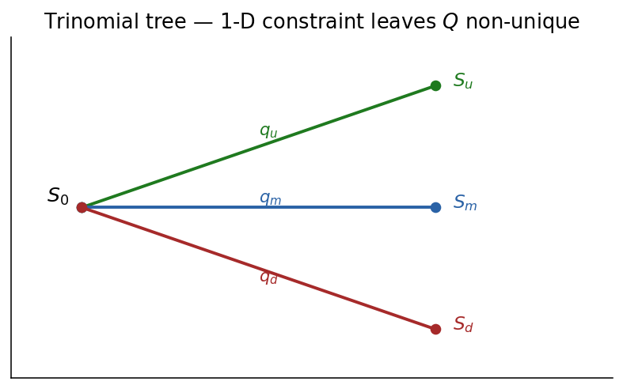
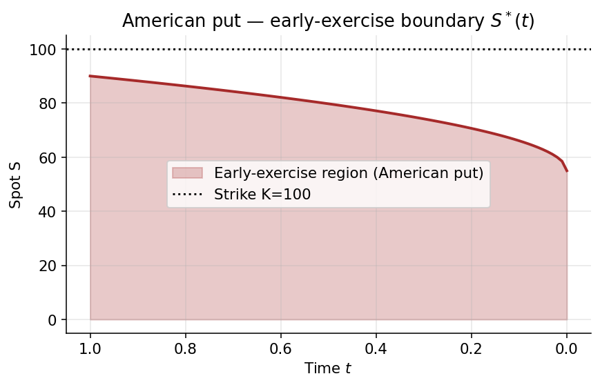

# Chapter 2 — Multi-Period Binomial, CRR, and the FTAP

Chapter 1 established risk-neutral pricing for a single-period two-state economy. Before pushing into continuous time, we need the explicit multi-period binomial machinery — backward induction along a recombining tree — and its limit the Cox–Ross–Rubinstein (CRR) model, whose calibrated up/down sizes give rise to geometric Brownian motion as the step size $\Delta t \to 0$. We present two equivalent CRR parameterisations: the classical $A_n = A_{n-1} e^{c\, x_n}$ Bernoulli lattice and the "direct-Gaussian increment" lattice $A_n = A_{n-1} e^{(\mu - \tfrac{1}{2}\sigma^2)\Delta t \pm \sigma\sqrt{\Delta t}}$ in which the Itô convexity adjustment has already been built into the geometry of the nodes. We then state the Fundamental Theorem of Asset Pricing (FTAP): absence of arbitrage is equivalent to existence of an equivalent martingale measure $\mathbb{Q}$ under which all discounted traded assets are martingales. Next we confront the fact that the measure $\mathbb{Q}$ — and therefore the price of non-replicable claims — is not automatically unique. In the binomial lattice, branching into more than two states destroys uniqueness; we discuss the local risk-minimising hedge as a selection device. The chapter closes with the dynamic-programming recursion for American options on the binomial tree and a short bridge to the continuous-time limit that will occupy Chapters 3–6.

The reader should treat this chapter as the pivot point of the course. The one-period model of Chapter 1 is a toy, but a surprisingly complete toy: every conceptual ingredient of modern derivatives theory — the law of one price, replication, the martingale measure, the decomposition of a payoff into a spanning hedge — lives there in miniature. What is missing is the *arrow of time* and the *algebra of compounding*. Multi-period trees supply both. Once we can iterate the one-step argument and take a limit, the classical tools of mathematical finance simply fall out: Black–Scholes becomes a corollary of the Central Limit Theorem applied to log-returns, early-exercise optimality becomes a Bellman recursion on a graph, and the pricing of genuinely exotic payoffs reduces to either sweeping the tree or forward-simulating. Our goal is not merely to list these results but to make them feel inevitable — to show that they are the unique answers one is forced to if one demands the absence of arbitrage.

A second theme threads through the chapter and will dominate Chapters 3 through 5: the tension between completeness (where $\mathbb{Q}$ is unique and the price is a single number) and incompleteness (where $\mathbb{Q}$ spans a family and prices span an interval). Binomial trees are special because they are, by construction, exactly one-step complete. As soon as we add a third branch — whether that third branch is a default, a jump, a stochastic-volatility state, or just a trinomial approximation — the dimension of the state space outruns the dimension of the tradable asset space, and uniqueness fails. This failure is not a pathology of the model; it is a picture of real-world markets, where stock-and-bond hedges cannot perfectly cover earnings surprises, macro announcements, or corporate credit events. We will see that even when uniqueness fails, the no-arbitrage framework still delivers a *range* of admissible prices, and risk-preference-based devices (utility indifference, local risk-minimisation, minimum-entropy projection) select a single representative from the range. Understanding this structure is arguably more important for quant practice than Black–Scholes itself — every volatility surface in real trading is a witness to market incompleteness, and every model-selection decision in risk management is, at bottom, a choice of $\mathbb{Q}$ inside the set of admissible equivalent martingale measures.

A third theme is computational. We will see *backward induction* in its purest form: start with the payoff at maturity and discount node-by-node back to time zero. This is Richard Bellman's dynamic-programming principle, and it handles Americans and any path-dependence that can be captured by finitely many state variables. The complementary paradigm — Monte Carlo forward simulation — is developed in Chapter 10 once geometric Brownian motion has been placed on rigorous footing. The two paradigms have complementary strengths: backward induction is exact up to the tree's discretisation; Monte Carlo is statistical but scales gracefully in dimension. Serious pricing engines routinely combine both — simulate for the forward-dependent part, induct backwards for the early-exercise part — the so-called Longstaff–Schwartz regression approach is a prototypical example, which we touch on conceptually.

A fourth theme — subtler but pervasive — is the role of the numéraire. The FTAP says that *some* discounted process is a martingale under $\mathbb{Q}$; it is silent on which asset you use as the deflator. This freedom turns out to be extraordinarily useful. The Black–Scholes formula, as we will derive it in Chapter 6, has two probability terms: one computed under the money-market-account measure, and one under the stock-measure. Switching between the two is not a mere bookkeeping trick — it is the operationally cleanest way to evaluate expectations of products like $A_T\cdot \mathbf{1}_{\{A_T>K\}}$, because under the stock-measure the factor $A_T$ collapses into the new numéraire and the expectation reduces to a plain exceedance probability. The same trick underlies the pricing of interest-rate derivatives (use a zero-coupon bond as numéraire) and swaption pricing (use an annuity). We flag this now because the mechanics of numéraire change, developed canonically in Chapter 5, are the same at every level of complexity.

Finally, the chapter is *long on worked numbers*. Wherever we introduce a formula, we pin it with a concrete scenario: a 20% volatility annualised, a 5% interest rate, a 1/252 daily step, a strike at 100 and spot at 100. The reader is encouraged to redo these arithmetic exercises; they are the calibration checks one performs every day on a real trading desk. When a formula "feels right" numerically — when a $\sqrt{\Delta t}$-order correction comes in at a basis-point per day, or a small shift in $q$ produces a visible move in a call price — the formula becomes part of one's intuition, not just a line in a textbook.

With those themes declared, we start at the very simplest node of the theory: a single stock, two states, one step.

---

## 2.1 One-Period Review: the No-Arbitrage Inequality

We begin by recalling the one-period binomial pricing argument, because everything that follows builds on it. The one-period case is simple enough to do by hand, yet already contains the key ideas: no-arbitrage as a geometric constraint, replication as a hedge-portfolio algebra, and the emergence of the risk-neutral probability. The reader who is fully comfortable with this section can skim it; those who are encountering the argument for the first time should spend more time here than anywhere else in the chapter, because mastery of the one-period case makes everything subsequent tractable.

Start at a single node $A$ with two possible successor nodes $A_u > A_d$ and a cash account growing by the gross rate $1 + r$. The one-period no-arbitrage inequality is

$$A_d \;<\; A(1 + r) \;<\; A_u \;\iff\; \text{no arb}. \tag{2.1}$$

To see why this inequality is forced on us, reason by contradiction. Suppose $A(1+r) \le A_d$. Then at time zero I could short-sell $1$ unit of cash and buy $1/A$ units of stock. At time one my stock is worth at least $A_d/A \ge 1+r$ in every state, and I owe the cash-lender $1+r$. Net cash flow at time one is non-negative in every state and strictly positive in the up-state, yielding a riskless profit from zero initial outlay — the textbook definition of an arbitrage. A symmetric argument handles the case $A(1+r)\ge A_u$: borrow against the stock and deposit the cash. The forward price $A(1+r)$ must therefore sit strictly between the two post-states, and this geometric fact is entirely equivalent to absence of arbitrage.

There is also a way to read (2.1) that emphasises its role as a *calibration constraint on the physical world*. Given a stock with empirical upper state $A_u$ and lower state $A_d$ on a horizon of one period, and given a money market compounding at $1+r$, the market's no-arbitrage pricing of everything else is *determined* by the no-arbitrage condition on this triple. If the interest rate is too high — above the forward implied by $(A_u,A_d)$ and the physical probability — dealers can lock in riskless gains by shorting bonds; the forward curve will adjust. In this sense (2.1) is less a theorem than a forecast: any real market that satisfies frictionless trading will *arrange* for (2.1) to hold.

Equivalently, the claim $C$ with terminal values $C_u, C_d$ admits a unique arbitrage-free price via an equivalent risk-neutral measure $\mathbb{Q}$:

$$\exists\, \mathbb{Q} \text{ s.t. } C \;=\; \frac{1}{1+r}\,\mathbb{E}^{\mathbb{Q}}[\,C_1\,] \;\iff\; \text{no arb}. \tag{2.2}$$

This is the deep step. The left-to-right direction says: if no arbitrage holds, there exists a probability $q\in(0,1)$ — uniquely defined in the binomial case by $q = \tfrac{A(1+r)-A_d}{A_u-A_d}$ — such that every contingent claim is priced as a discounted expectation under $q$. The right-to-left direction says: if some positive $q\in(0,1)$ satisfies (2.2), then no arbitrage is possible, because any positive payoff has positive expectation and therefore positive today-price. Together they form the one-period Fundamental Theorem of Asset Pricing, a microcosm of the general FTAP we will state in §2.5.

*Intuition.* (2.1) is the geometric statement "the forward $A(1+r)$ sits strictly between the up and down states"; if it didn't, a combination of long/short asset+cash would earn a riskless profit. (2.2) then rewrites the Arrow prices as a probability measure $\mathbb{Q}$: the risk-neutral weights are the unique convex combination making the discounted asset a one-step martingale.

It is worth pausing over the word *probability* in the last paragraph. The weights $q,1-q$ have all the formal properties of a probability distribution — they are non-negative and sum to unity — but they are *not* the probabilities a forecaster would assign to the two future states. A forecaster with inside knowledge of the stock's fundamentals might believe $A_u$ is twice as likely as $A_d$; that is the physical measure $\mathbb{P}$, denoted by $p$. The risk-neutral measure $\mathbb{Q}$ ignores beliefs about which state is more likely and instead weights the states by what they are *worth* in the market. A scenario where the stock is up might be, in reality, improbable, yet it carries a high $\mathbb{Q}$-weight because the forward is close to $A_u$. The mathematical fact that $\mathbb{Q}$ and $\mathbb{P}$ assign positive probability to the same events (equivalence, $\mathbb{Q}\sim\mathbb{P}$) is essential — both measures see the same scenario space — but their relative weights can diverge arbitrarily far. The Radon–Nikodym derivative $d\mathbb{Q}/d\mathbb{P}$ is the market's *discount of optimism*, and it is the engine behind Girsanov's theorem in continuous time, developed canonically in Chapter 5.

Worked numerical check. Set $A=100$, $r=5\%$ per period, $A_u=120$, $A_d=90$. The forward is $A(1+r)=105$, which lies in $(90,120)$, confirming (2.1). The risk-neutral probability is $q = (105-90)/(120-90) = 1/2$. A call struck at $K=100$ has up-payoff $20$, down-payoff $0$, and price $C = (1/1.05)(1/2\cdot 20 + 1/2\cdot 0) = 10/1.05 \approx 9.524$. A replicating portfolio $\alpha A + \beta = C$ is found by solving $120\alpha + 1.05\beta = 20$ and $90\alpha + 1.05\beta = 0$, yielding $\alpha = 2/3$ shares and $\beta = -60/1.05 \approx -57.14$ dollars of cash (i.e., borrow $57.14$). Checking: $2/3 \cdot 100 - 57.14 = 66.67 - 57.14 = 9.52$ — the same price to two decimal places. The two approaches — expectation under $\mathbb{Q}$ and explicit replication — are mathematically identical, but they emphasise different aspects: the first focuses on *value* ("what is this worth?"), the second on *hedging* ("what position makes this go away?"). Both are the trader's job.

Edge case: what if $A_u = A(1+r)$? Then the up-state has zero $\mathbb{Q}$-weight in the forward pricing, and the risk-neutral $q = 0$. This is on the boundary of the no-arbitrage region and corresponds to a degenerate case where owning the stock is — in expectation — identical to owning the bond in the up-state. Practically, this never happens in a liquid market, but it shows up as the edge of the feasibility set: tight binding of (2.1) means zero slack in the pricing constraint. Similarly, if $A_d = A(1+r)$, then $q=1$.

<!-- figure placeholder: one-period tree A -> {A_u, A_d} with cash 1 -> 1+r, boxed inequality A_d < A(1+r) < A_u; C -> {C_u, C_d} with boxed ∃Q s.t. C = (1/(1+r))E^Q[C_1] -->

---

## 2.2 Multi-Period Binomial Tree — Backward Induction

Section 2.1 priced a one-period claim on a one-period tree; now we scale up. The extension from one period to many periods is conceptually straightforward — pricing at each node via the same one-step argument, with the children's values standing in for the payoff — but it introduces new phenomena (path-dependence, early exercise) and new computational structures (recombining vs. non-recombining trees, the tower property collapsing iterated expectations). This section lays out the formal machinery; subsequent sections put it to work.

Extend the one-step construction to $N$ steps. The tree $A \to \cdots$ branches $2^N$ times; when up-and-down moves commute ($A_{ud} = A_{du}$) the tree recombines into $N+1$ terminal nodes after $N$ steps.

The step from one period to $N$ periods is the step from a textbook exercise to a genuinely useful pricing engine. In a single period we have only two terminal states, which is expressive enough to price any claim whose payoff depends on those two states, but it is not expressive enough to capture any interesting *dynamics*. In $N$ periods we have $N+1$ terminal states (assuming recombination), and the *path* through those states matters for anything more sophisticated than a vanilla European claim. The recombining binomial tree is the simplest structure that captures both features — many terminal states for distributional richness, and a tractable tree topology for backward induction.

The recombination property — $A_{ud}=A_{du}$ — is the mathematical reason the tree stays manageable. Without recombination, after $N$ steps we would have $2^N$ terminal nodes, and pricing would require $2^N$ evaluations. With recombination we have only $N+1$ terminal nodes, and pricing requires $O(N^2)$ evaluations (one for each node in the triangle). At $N=250$ daily steps, that is $\approx 31{,}000$ evaluations — trivial on a laptop — versus $2^{250}\approx 10^{75}$ without recombination, which is more nodes than atoms in the observable universe. Multiplicative models (geometric Brownian motion being the archetype) naturally recombine because multiplication is commutative: $A\cdot u\cdot d = A\cdot d\cdot u$. Additive models (arithmetic Brownian motion, Bachelier's original model) recombine for the same reason. Any model where the up-factor at a node depends on the history fails to recombine and therefore loses the $O(N^2)$ efficiency.

<!-- figure placeholder: two side-by-side trees. Left: general non-recombining 2^N tree. Right: recombining N+1 tree with one node highlighted showing the up-down = down-up recombination box. -->

The pricing principle is one-step-at-a-time risk-neutral discounting: at every interior node, the claim value is $\tfrac{1}{1+r}\mathbb{E}^{\mathbb{Q}}[\,\text{next-step payoff}\,]$ with the node-local $\mathbb{Q}$-probability $q$.

There is an important subtlety. The $\mathbb{Q}$-probability $q$ is generally *node-local*: it can depend on the current spot $A$, the current time, and — if we build state-dependence into the model — on other state variables. In the simplest Cox–Ross–Rubinstein setup, $q$ depends only on the ratios $u,d,1+r$, which are constants, so the tree has a single global $q$. In more general state-dependent models (local volatility, state-dependent interest rates), each node has its own $q$. The backward-induction algorithm is identical either way: at every node, take the $q$-weighted average of the two children's values and discount by one period.

### 2.2.1 Worked example — call struck at 100, maturity $T = 2$

We pause for an extended concrete example before diving into the general CRR formalism. The worked example below uses a small, hand-computable tree to make every arithmetic step transparent. In real practice, trees have hundreds or thousands of steps and are computed on a machine; but the machine is doing exactly the same arithmetic we lay out here, node by node, step by step.

Take a two-period tree on a non-constant-factor lattice:

```
                              ● 130
                             ╱
                     ● 120
                    ╱        ╲
            100 ●             ● 110     (upper half of tree)
                    ╲        ╱
                     ● 90
                             ╲
                              ● 80

   t = 0          t = 1            t = 2

  Local risk-neutral weights q_1 (0→1, up), q_2 (120→130 edge),
  q_3 (90→110 edge) are pinned down by the one-period FTAP at each node.
```
with edge-local interest rates $r_1, r_2, r_3$ on the three time-$0 \to 1 \to 2$ edges. The local risk-neutral probabilities $q_1, q_2, q_3$ are pinned down by matching the parent to the discounted expectation of its children:

$$120 \;=\; \frac{1}{1 + r_?}\!\left(\,130\,q_2 \;+\; 110\,(1 - q_2)\,\right) \;\Longrightarrow\; q_2 = \# \tag{2.3}$$

$$90 \;=\; \frac{1}{1 + r_?}\!\left(\,110\,q_3 \;+\; 80\,(1 - q_3)\,\right) \;\Longrightarrow\; q_3 = \# \tag{2.4}$$

$$100 \;=\; \frac{1}{1 + r_?}\!\left(\,120\,q_1 \;+\; 90\,(1 - q_1)\,\right) \;\Longrightarrow\; q_1 = \# \tag{2.5}$$

Payoff @ $T = 2$. A call struck at $K = 100$ pays

$$\max(A_T - K, 0) \;\equiv\; (A_T - K)_+. \tag{2.6}$$

At the terminal column $A_T \in \{130, 110, 110, 80\}$ the payoffs are $\{30, 10, 10, 0\}$.

The choice of payoff function $(x)_+ = \max(x,0)$ deserves a word of intuition. The $+$-function captures the essential optionality: the holder receives $A_T - K$ whenever it is positive, zero otherwise. There is no obligation to exercise — the option is exercised if and only if it is in the money, and the payoff $(A_T-K)_+$ reflects this decision. The piecewise-linear shape of $(x)_+$ produces the classic "hockey-stick" payoff diagram: flat at zero for $A_T\le K$, linearly ascending at unit slope for $A_T > K$, with a kink at $A_T = K$. All the convexity of an option comes from this kink; pricing convexity is pricing the rounded-over-time version of the hockey stick.

Notice that in the $\{130, 110, 110, 80\}$ column, the middle value $110$ occurs *twice* — this is the recombination at work. The path up-then-down arrives at the same state as the path down-then-up, and both contribute to the same terminal payoff of $\$10$. In the backward recursion, we treat both paths as a single lattice node; the $\mathbb{Q}$-probability of reaching that node is $2q(1-q)$ (two paths, each with probability $q(1-q)$).

Backward step 1 (t = 1 nodes). At the upper intermediate node (stock = 120, children 130 and 110) the call value $C_{1u}$ satisfies

$$C_{1u} \;=\; \frac{1}{1 + r_2}\!\left(\,30\,q_2 \;+\; 10\,(1 - q_2)\,\right) \;=\; \#, \tag{2.7}$$

and at the lower intermediate node (stock = 90, children 110 and 80, payoffs 10 and 0):

$$C_{1d} \;=\; \frac{1}{1 + r_3}\!\left(\,10\,q_3 \;+\; 0\,(1 - q_3)\,\right) \;=\; \#. \tag{2.8}$$

Backward step 2 (t = 0).

$$C_0 \;=\; \frac{1}{1 + r_1}\!\left(\,C_{1u}\,q_1 \;+\; C_{1d}\,(1 - q_1)\,\right) \;=\; \#. \tag{2.9}$$

*Intuition.* Backward induction is the lattice-level manifestation of the tower property: computing today's price as the discounted $\mathbb{Q}$-expectation over the children at each node is equivalent to the one-shot formula $C_0 = \mathbb{E}^{\mathbb{Q}}[\,e^{-rT}C_T\,]$ because nested conditional expectations collapse. The value to doing it step by step is that the same sweep handles path-dependent payoffs and American exercise (§2.8).

To amplify: the tower property says $\mathbb{E}[\mathbb{E}[X\mid\mathcal{F}_t]] = \mathbb{E}[X]$ for any filtration-compatible $X$, and more generally $\mathbb{E}[\mathbb{E}[X\mid\mathcal{F}_t]\mid\mathcal{F}_s] = \mathbb{E}[X\mid\mathcal{F}_s]$ for $s\le t$. At the lattice level, $\mathcal{F}_t$ is the sigma-algebra generated by the first $t$ steps of the tree, so conditioning on $\mathcal{F}_t$ means "knowing which node we are at time $t$". Computing the expectation step by step is literally iterating the tower property: first expect over step $N$ given $\mathcal{F}_{N-1}$, then expect over step $N-1$ given $\mathcal{F}_{N-2}$, and so on back to $\mathcal{F}_0$.

Why does the step-by-step approach generalise so well? Because at every node in the sweep, we are free to do more than just compute the discounted expectation. We can *compare* that expectation to an alternative value (the immediate-exercise value for an American, for instance), or *accumulate* a path-dependent state variable (the running average for an Asian, the running maximum for a lookback), or *check* a path-dependent predicate (has the barrier been breached?). Each of these augmentations slots into the backward-induction algorithm as a per-node computation, and the algorithm retains its $O(N^2)$ efficiency (or $O(N^3)$, $O(N^4)$ for modestly more elaborate state spaces). The one-shot formula $C_0 = \mathbb{E}^{\mathbb{Q}}[e^{-rT}C_T]$ hides all of this adaptability inside a single integral; the lattice exposes it as explicit node-level operations.

### 2.2.2 Path-weights and the CRR telescoping identity

If the per-edge interest rate is constant $r_1 = r_2 = r_3 = r$ the root price becomes a single discounted expectation

$$C_0 \;=\; \frac{1}{(1 + r)^N}\,\mathbb{E}^{\mathbb{Q}}\!\left[\,C_T\,\right], \tag{2.10}$$

with the tree's path probability $q^k(1-q)^{N-k}$ multiplied by the combinatorial path count $\binom{N}{k}$ giving the classical Cox–Ross–Rubinstein pricing sum.

To unpack (2.10) for the European call: letting $k$ count the number of up-moves along a path (so there are $\binom{N}{k}$ paths reaching the same terminal node $A_0 u^k d^{N-k}$), the CRR pricing sum is $C_0 = (1+r)^{-N}\sum_{k=0}^{N}\binom{N}{k} q^k(1-q)^{N-k}(A_0 u^k d^{N-k}-K)_+$. This is a finite-term expansion of a binomial probability times a payoff; as $N\to\infty$ with $u = e^{\sigma\sqrt{\Delta t}}$, $d = e^{-\sigma\sqrt{\Delta t}}$, the binomial distribution converges (by de Moivre–Laplace) to the normal distribution, and the sum converges to the Black–Scholes integral. Running the sum on a computer is straightforward even at $N=10^4$; numerical experiments show convergence to Black–Scholes is $O(1/N)$ in the standard CRR parameterisation, with oscillatory behaviour that can be accelerated by symmetric placement of $K$ inside a node or by Richardson extrapolation.

There is one further layer of elegance. The telescoping identity refers to the fact that the *same* $\mathbb{Q}$-probabilities appear at every step (when $u,d,r$ are constant), so the path probability factorises as $q^k(1-q)^{N-k}$ with $k$ = number of up-moves. The distribution of $k$ is exactly Binomial$(N,q)$. This lets us compute analytical quantities like the moments of $A_T$ directly: $\mathbb{E}^{\mathbb{Q}}[A_T] = A_0(qu + (1-q)d)^N = A_0(1+r)^N$ (as it must, by the martingale property), and $\mathbb{V}^{\mathbb{Q}}[\ln A_T] = N\cdot q(1-q)(\ln(u/d))^2 \approx \sigma^2 T$ to leading order. The binomial structure is not only computationally convenient; it hands us closed-form answers for the moments and — via de Moivre–Laplace — for the distribution itself in the continuous limit.

---

## 2.3 The Cox–Ross–Rubinstein (CRR) Model — Bernoulli Parameterisation

The Cox–Ross–Rubinstein model is arguably the most influential single construction in derivatives pricing after Black–Scholes itself. The authors showed that the binomial lattice — a conceptually simple structure — converges to the Black–Scholes continuous-time model as the step size shrinks, and that the lattice provides a computationally tractable pricing tool for American-style and other non-standard options where the Black–Scholes closed form does not apply. Before CRR, numerical option pricing was the preserve of PDE finite-difference methods; after CRR, a generation of quants learned options on lattices.

The CRR approach is pedagogically valuable because it reduces the entire apparatus of options pricing to a discrete, finite-dimensional linear-algebra exercise. There are no integrals, no stochastic differential equations, no measure-theoretic subtleties — just arithmetic on a tree. Once the student masters the tree, the continuous-time framework falls into place naturally as a limit. This is why we spend so much time on the lattice in this chapter, despite knowing that practical pricing often uses the limit directly.

In a step of size $\Delta t$ replace simple compounding by continuous compounding:

$$(1 + r) \;\longrightarrow\; e^{r\,\Delta t}. \tag{2.11}$$

The replacement of $1+r$ by $e^{r\Delta t}$ is more than cosmetic. It reflects a deliberate choice to align the lattice with the continuous-time limit. In the limit $\Delta t\to 0$ we want the cash account to grow at exactly rate $r$ per unit time, so that $B_T = e^{rT}$. A lattice that used $1+r\Delta t$ would also converge to the same limit (since $1+r\Delta t + O(\Delta t^2) = e^{r\Delta t}$), but the exponential form gives cleaner algebra at every finite $\Delta t$ and respects the multiplicative structure of the log-return process. The Cox–Ross–Rubinstein (CRR) parameterisation takes this seriously: up-moves multiply the asset by $e^c$, down-moves by $e^{-c}$, and the cash account multiplies by $e^{r\Delta t}$ at every step. Symmetry of $\pm c$ ensures recombination, and the exponential form of the cash growth ensures consistency with the GBM limit.

Write the log-return process as

$$A_n \;=\; A_{n-1}\, e^{c\, x_n}, \qquad x_1, x_2, \dots \stackrel{iid}{\sim} \text{Bernoulli}(\pm 1), \tag{2.12}$$

with $\mathbb{P}(x_k = +1) = p,\ \mathbb{P}(x_k = -1) = 1 - p$.

Why Bernoulli $\pm 1$? The choice is almost forced. We want two states per step (to make the market one-step complete), we want symmetric state placements (for recombination), and we want iid increments (for tractable distributional analysis). The symmetric Bernoulli $\pm 1$ is the simplest random variable satisfying all three. Its mean is $2p-1$, its variance is $1-(2p-1)^2$, and — crucially — the sum of $N$ iid such Bernoullis has binomial distribution with mean $N(2p-1)$ and variance $N(1-(2p-1)^2)$, satisfying a Central Limit Theorem with Gaussian limit $\mathcal{N}(N(2p-1),N(1-(2p-1)^2))$. When we scale the sum by $c$ — turning increments into log-returns — we get log-return sums that are asymptotically Gaussian, precisely the behaviour of log-GBM.

The alternative, non-symmetric Bernoulli — say $x_k\in\{u_{\text{up}},u_{\text{down}}\}$ with $u_{\text{up}}\ne u_{\text{down}}$ — would work too, but it forces the log-drift and log-variance into a less clean parameterisation. The symmetric $\pm 1$ choice, combined with a scalar $c$, cleanly separates *size of move* ($c$) from *directional bias* ($p-\tfrac{1}{2}$). This is the CRR convention and it makes moment-matching transparent.

<!-- figure placeholder: three-branch schematic A_0 → {A_0 e^c, A_0, A_0 e^{-c}} labelled with p / (1-p) and a timeline 0 — Δt — T with Δt = T/N (number of steps). -->

Iterating from $t = 0$ to $t = T$ with $N = T / \Delta t$ steps,

$$A_T \;=\; A_0\, e^{c\, x_1}\, e^{c\, x_2}\cdots e^{c\, x_N} \;=\; A_0\,\exp\!\left\{ c\sum_{n=1}^{N} x_n \right\} \;=\; A_0\, e^{c\,X_N}, \tag{2.13}$$

with $X_N := \sum_{n=1}^{N} x_n$.

### 2.3.1 Moments of the increment sum

The calibration strategy is moment-matching: choose model parameters so that the first two moments of the model's log-return distribution match the empirical moments of observed log-returns. This is the simplest form of the method of moments, a general estimation strategy that generalises to generalised-method-of-moments (GMM), quasi-maximum-likelihood, and a host of modern econometric techniques. For the CRR lattice, two free parameters $(p,c)$ match two moments $(\mu,\sigma^2)$, and the system is exactly determined.

An alternative calibration strategy — maximum likelihood estimation — would choose $(p,c)$ to maximise the likelihood of observed returns under the lattice distribution. In the large-sample limit, MLE and method-of-moments agree for the Gaussian-like limit of the binomial, so the practical difference is small. Method of moments is preferred in the CRR context because the algebra is explicit and the results are closed-form.

Linearity plus iid Bernoulli:

$$\mathbb{E}[X_N] \;=\; \sum_{n=1}^{N}\mathbb{E}[x_n] \;=\; N\bigl(\,+1\cdot p + (-1)(1-p)\,\bigr) \;=\; N\,(2p - 1) \;=\; \mu\,\Delta t\, N, \tag{2.14}$$

$$\mathbb{V}[X_N] \;=\; N\,\mathbb{V}[x_1] \;=\; N\!\left(\,\mathbb{E}[x_1^2] - (\mathbb{E}[x_1])^2\,\right) \;=\; N\bigl(1 - (2p - 1)^2\bigr) \;=\; \sigma^2\,\Delta t\, N. \tag{2.15}$$

The assignments $\mathbb{E}[X_N] = \mu\Delta t\, N$ and $\mathbb{V}[X_N] = \sigma^2 \Delta t\, N$ in (2.14)–(2.15) match the data: $\mu$ and $\sigma^2$ are fed in as the annualised mean and variance of the log-return estimated from a price series $S_1, S_2, \dots, S_M$ via the ratios

The factor $\Delta t$ in the per-step variance is the *time-scaling of Brownian motion*. This scaling — variance proportional to time, standard deviation proportional to square-root-of-time — is what separates Brownian motion (and GBM) from a simple random walk. In a random walk with unit-step Bernoulli increments, variance scales as $N$ (number of steps). To embed such a walk in continuous time so that variance scales as $t$ (wall-clock time), we must scale the step size by $\sqrt{\Delta t}$ — exactly the $c = \sigma\sqrt{\Delta t}$ scaling that emerges below. This is why Brownian motion shows up so often in physics and finance: it is the universal scaling limit of any iid-increment process with finite second moment.

$$\ln(S_2 / S_1) \;=\; r_1, \quad \ln(S_3 / S_2) \;=\; r_2, \quad \dots \tag{2.16}$$

$$\widehat{\mu\,\Delta t} \;=\; \frac{1}{M}\sum_{m=1}^{M} r_m \quad\text{(annualised return)}, \tag{2.17}$$

$$\widehat{\sigma^2\,\Delta t} \;=\; \frac{1}{M}\sum_{m=1}^{M} (r_m - \widehat{\mu\Delta t})^2 \quad\text{(annualised variance)}. \tag{2.18}$$

### 2.3.2 Solving for the CRR parameters $(p, c)$

With the moments computed, calibration is a system of two equations in two unknowns. The solution for the up-step size $c$ is immediate (from matching the variance), and the solution for the probability bias $p$ follows (from matching the mean). A useful check: in the $\Delta t\to 0$ limit, $p$ approaches $1/2$ — the lattice becomes a symmetric random walk, reflecting the fact that short-horizon log-returns have expected value dominated by noise rather than drift.

Solve (2.14)–(2.15) simultaneously for $(p, c)$. Using $\mathbb{E}[x^2] = c^2\mathbb{E}[x_1^2] = c^2$ and expanding

$$\mathbb{V}[X_N^{c\text{-scaled}}] \;=\; c^2 N\bigl(1 - (2p - 1)^2\bigr) \;=\; \sigma^2 \Delta t\, N, \tag{2.19}$$

one obtains the Cox–Ross–Rubinstein up-step and physical probability:

$$\boxed{\; c \;=\; \sigma\sqrt{\Delta t} + \cdots, \qquad p \;=\; \tfrac{1}{2}\!\left(\,1 \;+\; \frac{\mu}{\sigma}\,\sqrt{\Delta t}\,\right) + \cdots. \;} \tag{2.20}$$

*Intuition.* Two moments, two unknowns: matching the annualised log-return mean and variance to a biased Bernoulli $\pm c$ gives $c = \sigma\sqrt{\Delta t}$ (variance matches: $c^2 = \sigma^2\Delta t$) and a small $\sqrt{\Delta t}$-order bias in $p$ that captures the drift.

Worked calibration. Suppose we observe an annualised log-return volatility of $\sigma = 20\%$ and drift of $\mu = 10\%$, and use a daily grid $\Delta t = 1/252 \approx 0.003968$. Then $c = 0.20\sqrt{0.003968} \approx 0.01260$, which means each up-move takes the stock up by a factor of $e^{0.01260}\approx 1.01268$, or roughly $+1.27\%$. Each down-move takes it down by $e^{-0.01260}\approx 0.9875$, roughly $-1.25\%$. The bias in $p$ is $\tfrac{1}{2}\cdot(\mu/\sigma)\sqrt{\Delta t} = \tfrac{1}{2}\cdot 0.5 \cdot 0.063 \approx 0.0157$, so $p\approx 0.5157$. In words: on any given day, the stock has a 51.6% chance of going up by 1.27% and a 48.4% chance of going down by 1.25%. The expected daily log-return is $(2p-1)c = 0.031\cdot 0.01260\approx 3.95\times 10^{-4}$, and $(3.95\times 10^{-4})\cdot 252 = 0.0996 \approx 10\%$, recovering $\mu$ as required. The variance is $N(1-(2p-1)^2)c^2 = 252\cdot (1-0.031^2)\cdot 0.01260^2 \approx 252\cdot 1.587\times 10^{-4} = 0.04$, which is $\sigma^2 = (0.2)^2$ as required.

An important side remark: the $\sqrt{\Delta t}$-scaling of $c$ is not an accident; it is the universal scaling of Brownian motion. A Brownian motion $W_t$ has variance $t$, so its typical size on the interval $[t,t+\Delta t]$ is $\sqrt{\Delta t}$. Since $\sigma W_t$ is the diffusion part of log-GBM, its typical size over $\Delta t$ is $\sigma\sqrt{\Delta t}$. The CRR parameterisation faithfully reproduces this scaling, which is exactly why the CRR lattice converges to geometric Brownian motion. By contrast, the *drift* scales as $\mu\Delta t$, much smaller than $\sigma\sqrt{\Delta t}$ for small $\Delta t$: at a one-day horizon, diffusion is roughly $\sqrt{252}\approx 16$ times larger than drift for typical parameters. This is why, over short horizons, financial data look like noise around zero, and why "trend-following" strategies require long holding periods.

### 2.3.3 Converting to the $\mathbb{Q}$-probability

Under $\mathbb{P}$ (the physical measure), the lattice is calibrated to match empirical moments of log-returns. Under $\mathbb{Q}$ (the risk-neutral measure), the lattice is calibrated to make the discounted asset a martingale — that is, to reproduce the no-arbitrage forward price at every node. The $\mathbb{P}\to\mathbb{Q}$ transformation is the heart of derivatives pricing: it says "re-weight the lattice probabilities so the expected return matches the riskless rate, not the empirical expected return."

Risk-neutral pricing on the $e^{\pm c}$ tree demands

$$A \;=\; e^{-r\Delta t}\, \mathbb{E}^{\mathbb{Q}}[\,A_{n}\,] \;=\; e^{-r\Delta t}\!\left(\,q\, A\, e^{\sigma\sqrt{\Delta t}} \;+\; (1 - q)\, A\, e^{-\sigma\sqrt{\Delta t}}\,\right), \tag{2.21}$$

giving

$$\boxed{\; q \;=\; \frac{e^{r\Delta t} - e^{-\sigma\sqrt{\Delta t}}}{e^{+\sigma\sqrt{\Delta t}} - e^{-\sigma\sqrt{\Delta t}}}. \;} \tag{2.22}$$

Small-$\Delta t$ expansion. Using $e^{\pm z} \sim 1 \pm z + \tfrac{1}{2}z^2 + \cdots$ in both numerator and denominator,

$$q \;\sim\; \tfrac{1}{2}\!\left(\,1 \;+\; \frac{r - \tfrac{1}{2}\sigma^2}{\sigma}\,\sqrt{\Delta t}\,\right) + \cdots \tag{2.23}$$

$$p \;\sim\; \tfrac{1}{2}\!\left(\,1 \;+\; \frac{\mu}{\sigma}\,\sqrt{\Delta t}\,\right) + \cdots \qquad\text{(for comparison, under } \mathbb{P}\text{).} \tag{2.24}$$

(The boxed formula (2.22) is *exact* at finite $\Delta t$; only (2.23) is truncated to leading $\sqrt{\Delta t}$ order. The next-order $O(\Delta t)$ correction in (2.23) is numerically small — at daily steps with $\sigma = 20\%$ it is about 0.2% of $q - \tfrac12$, well below bid-ask — but it is worth knowing about when running many-step convergence studies where stacking the truncation error across thousands of steps can produce a measurable bias.)

The $\mathbb{P} \to \mathbb{Q}$ shift replaces the *log-return* drift $\mu$ by the *arithmetic-return* drift $r - \tfrac{1}{2}\sigma^2$ — the Itô convexity adjustment shows up already at the lattice level.

This is a remarkable fact worth lingering on. The Itô correction — the $-\tfrac{1}{2}\sigma^2$ that relates expected log-returns to expected arithmetic returns — is usually introduced as a consequence of Itô's lemma in stochastic calculus (which we formalise in Chapter 3), which itself is a consequence of the $dW_t^2 = dt$ rule. Yet here we see it emerge directly from matching the no-arbitrage constraint on a discrete-time lattice to the small-$\Delta t$ expansion. No calculus required. The reason is that the Itô correction is really a statement about the geometric-vs-arithmetic mean inequality — $\mathbb{E}[e^X]\ge e^{\mathbb{E}[X]}$ with equality only for constant $X$ — and that inequality holds in any setting with non-degenerate randomness. In the continuous-time limit it takes the clean form $-\tfrac{1}{2}\sigma^2$ because Brownian motion has independent Gaussian increments; on the lattice it takes the slightly more cluttered form that matches (2.23), but the qualitative content is identical.

A practical consequence is that a naïve "risk-neutral simulator" that replaces $\mu$ by $r$ in the log-return formula (without the $-\tfrac{1}{2}\sigma^2$) would over-price calls and under-price puts by a factor related to $e^{\sigma^2 T/2}$. At $\sigma = 20\%$, $T = 1$, this is $e^{0.02}\approx 1.02$, a 2% bias; at $\sigma = 50\%$, $T = 2$, it is $e^{0.25}\approx 1.28$, a 28% bias. Getting the Itô correction right in the drift is therefore critical in any practical implementation.

### 2.3.4 Log-moments under $\mathbb{P}$ vs $\mathbb{Q}$

We now pause to summarise what has changed between $\mathbb{P}$ and $\mathbb{Q}$. The summary will be crystallised in the "slogan" below: variances are invariant, means are not. This is one of the most important conceptual takeaways of the chapter and will be a constant companion through all subsequent material.

Combining (2.13) with (2.20) / (2.23),

$$\mathbb{E}^{\mathbb{P}}\!\left[\ln(A_T / A_0)\right] \;=\; \mu\, T, \qquad \mathbb{V}^{\mathbb{P}}\!\left[\ln(A_T / A_0)\right] \;=\; \sigma^2\, T, \tag{2.25}$$

$$\mathbb{E}^{\mathbb{Q}}\!\left[\ln(A_T / A_0)\right] \;=\; \bigl(r - \tfrac{1}{2}\sigma^2\bigr)\, T, \qquad \mathbb{V}^{\mathbb{Q}}\!\left[\ln(A_T / A_0)\right] \;=\; \sigma^2\, T. \tag{2.26}$$

> Slogan. "$\mathbb{P}$ and $\mathbb{Q}$ variances are identical" — "$\mathbb{P}$ and $\mathbb{Q}$ means are *not*".

*Intuition.* Girsanov at the one-line level: a change of equivalent measure can tilt the drift arbitrarily but *cannot* change the diffusion coefficient (volatility) — the quadratic variation is measure-invariant. This is the single most important structural fact about the $\mathbb{P} \leftrightarrow \mathbb{Q}$ passage and it explains why traders calibrate $\sigma$ from *either* physical returns *or* implied-vol surfaces: the answer is the same up to estimation error.

Why is the volatility measure-invariant? Because the volatility parameter $\sigma$ controls the *size* of the Brownian shocks, not their *probabilities*. A change of measure is a re-weighting of scenarios: a set of outcomes that had probability $p$ under $\mathbb{P}$ might have probability $q$ under $\mathbb{Q}$, but the set of outcomes itself — the sample paths $\omega\mapsto A_\cdot(\omega)$ — is unchanged. The quadratic variation $\langle\ln A\rangle_T = \int_0^T \sigma_s^2\,ds$ is computed path-by-path, so it takes the same value under any equivalent measure. This is why implied volatility — a $\mathbb{Q}$-world quantity backed out from market prices — and realised volatility — a $\mathbb{P}$-world quantity estimated from historical prices — should in principle converge to the same number for a correctly specified model. In practice they differ, and the difference is called the *variance risk premium*. The variance risk premium is not a failure of the theory but an indication that the joint model of $(\mathbb{P},\mathbb{Q})$ is richer than Black–Scholes: stochastic volatility, jumps, or fundamental mispricing all contribute to a non-trivial VRP. But the *functional form* of $\sigma$ in the diffusion — that is, the same thing under both measures.

A corollary worth remembering: any *model-free* forecast of realised volatility (say the VIX squared, which is a model-free fair strike of the log-contract) measures the same $\sigma^2$ that a model-based implied volatility measures. This is why volatility arbitrage strategies — trading the spread between VIX futures and realised S&P 500 variance — are closely watched. The spread is the market's premium for bearing volatility risk, not a measurement error.

### 2.3.5 Continuous-time limit — lognormal asset

The passage from the discrete CRR lattice to the continuous-time GBM is one of the most important conceptual bridges in mathematical finance. It connects the combinatorial clarity of lattice pricing (where everything is a finite sum) with the analytical power of stochastic calculus (where everything is a Gaussian integral). Both views are useful, and a good quant is fluent in both. The conversion is driven by the Central Limit Theorem applied to the sum of log-returns: a sum of many small independent shocks becomes Gaussian in the limit, and exponentiating gives a log-normal asset.

Applying the CLT to $X_N = \sum x_n$ as $N \to \infty$ (and $N\Delta t = T$ fixed),

$$\ln(A_T / A_0) \;=\; X_N \;\xrightarrow[N\to\infty]{d,\ \mathbb{P}}\; \mathcal{N}\!\left(\,\mu T,\; \sigma^2 T\,\right), \tag{2.27}$$

$$\ln(A_T / A_0) \;=\; X_N \;\xrightarrow[N\to\infty]{d,\ \mathbb{Q}}\; \mathcal{N}\!\left(\,(r - \tfrac{1}{2}\sigma^2)T,\; \sigma^2 T\,\right). \tag{2.28}$$

Equivalently, in distribution,

$$A_T \;\stackrel{d}{=}\; A_0\, e^{\mu T \;+\; \sigma\sqrt{T}\, Z_{\mathbb{P}}}, \qquad Z_{\mathbb{P}} \sim \mathcal{N}(0, 1), \tag{2.29}$$

$$A_T \;\stackrel{d}{=}\; A_0\, e^{(r - \tfrac{1}{2}\sigma^2)T \;+\; \sigma\sqrt{T}\, Z_{\mathbb{Q}}}, \qquad Z_{\mathbb{Q}} \sim \mathcal{N}(0, 1). \tag{2.30}$$

In words: asset prices in the limit $N\to\infty$ are lognormal r.v. at a fixed point in time. Verifying the martingale property under $\mathbb{Q}$:

$$\mathbb{E}^{\mathbb{P}}[\,A_T\,] \;=\; A_0\, e^{\mu T}\,\mathbb{E}^{\mathbb{P}}\!\bigl[\,e^{\sigma\sqrt{T}\, Z}\,\bigr] \;=\; A_0\, e^{\mu T}\, e^{\tfrac{1}{2}\sigma^2 T} \;=\; A_0\, e^{(\mu + \tfrac{1}{2}\sigma^2) T}, \tag{2.31}$$

$$\mathbb{E}^{\mathbb{Q}}[\,A_T\,] \;=\; A_0\, e^{(r - \tfrac{1}{2}\sigma^2) T}\, e^{\tfrac{1}{2}\sigma^2 T} \;=\; A_0\, e^{r T}. \tag{2.32}$$

Used: $\mathbb{E}[e^{\alpha Z}] = e^{\tfrac{1}{2}\alpha^2}$ for $Z \sim \mathcal{N}(0, 1)$.

The calculation (2.32) deserves a second reading. Under $\mathbb{Q}$ the *log-return* drift is $r-\tfrac{1}{2}\sigma^2$, but the *price* grows at $r$ in expectation. The difference is exactly the $\tfrac{1}{2}\sigma^2$ convexity premium generated by Jensen's inequality applied to the exponential. It is the geometric-vs-arithmetic mean gap in the log-return distribution: the expected value of $e^X$ where $X\sim\mathcal{N}(\nu,\sigma^2)$ is $e^{\nu+\sigma^2/2}$, not $e^\nu$. In log-normal markets, the price distribution is heavily right-skewed, so the mean is pulled up by the upper tail — precisely the $\tfrac{1}{2}\sigma^2$ adjustment.

For the reader uncomfortable with the moment-generating-function formula $\mathbb{E}[e^{\alpha Z}]=e^{\alpha^2/2}$, one way to remember it: the density of $Z\sim\mathcal{N}(0,1)$ is $\phi(z) = (2\pi)^{-1/2}e^{-z^2/2}$, and $\mathbb{E}[e^{\alpha Z}] = \int e^{\alpha z - z^2/2}dz/\sqrt{2\pi}$. Completing the square in the exponent, $\alpha z - z^2/2 = -(z-\alpha)^2/2 + \alpha^2/2$, so the integral becomes $e^{\alpha^2/2}\int e^{-(z-\alpha)^2/2}dz/\sqrt{2\pi} = e^{\alpha^2/2}\cdot 1$ (the inner integral is the normalised density of $\mathcal{N}(\alpha,1)$). This identity is used dozens of times in options theory; memorising it is worth the effort.

### 2.3.6 Calibrating to log-returns vs simple returns — the $\tfrac{1}{2}\sigma^2$ correction

Caveat. The data in (2.16) are *log-returns* $r_m = \ln(S_{m+1}/S_m)$. If you instead calibrated to daily simple (continuously compounded) returns (meaning $(S_{m+1} - S_m)/S_m$ or any first-order expansion without the log), then the estimator of $\mu$ is biased by the Itô correction:

$$\mu \;\longrightarrow\; \mu - \tfrac{1}{2}\sigma^2. \tag{2.33}$$

*Intuition.* $\mathbb{E}[\,\Delta S / S\,] \approx \mathbb{E}[\,\Delta \ln S\,] + \tfrac{1}{2}\sigma^2$ to order $\Delta t$, so a practitioner who fits a simple-return mean and plugs it into a log-drift ends up over-stating the growth rate by $\tfrac{1}{2}\sigma^2$. Always be explicit which object you are fitting.

This source of bias — known as "volatility drag" or "geometric-arithmetic return gap" — is enormously important in retail finance contexts as well. The annualised simple return on the S&P 500 is typically quoted at something like 10%, but the compounded (geometric) return, which governs the actual growth of a buy-and-hold portfolio, is more like $10\% - \tfrac{1}{2}(16\%)^2 = 10\% - 1.3\% \approx 8.7\%$. Over 30 years, the difference between $1.10^{30}\approx 17.4$ and $1.087^{30}\approx 12.3$ is a factor of $1.4$ — a 40% reduction in terminal wealth! The mathematical content is modest; the practical and rhetorical importance is large.

Numerical calibration trap to avoid. If you are given a data set of daily returns and asked to report annualised drift and volatility: always apply $\log$ before averaging. Compute $r_m = \ln(S_{m+1}/S_m)$, take sample mean and variance, then multiply by $252$ to annualise. Do *not* compute simple returns $S_{m+1}/S_m - 1$ and then take $\log$ of the annualised mean; that introduces a $\sigma^2/2$ bias. Good quant toolkits often offer both variants; picking the wrong one is a classic calibration bug.

<!-- figure placeholder: a simulated path A_t with drift line A_0 e^{(μ − σ²/2)t + σ√t Z} overlaid, axes t (horizontal) vs A_t. The drift curve sits below the sample path on average — illustrates the vol drag. -->

### 2.3.7 Pricing vanilla European claims in the CRR limit

Having established the distribution of $A_T$ under $\mathbb{Q}$ in the continuous-time limit, we can now articulate the no-arbitrage price of any European claim as a discounted expectation — which, for smooth payoff functions, evaluates to a standard Gaussian integral. The integral for the European call is the Black–Scholes formula itself; we preview this correspondence in §2.9 and derive the formula rigorously in Chapter 6.

Starting from $C_0/B_0 = \mathbb{E}^{\mathbb{Q}}[\,C_T/B_T\,]$ and using (2.30),

$$C_0 \;=\; e^{-rT}\, \mathbb{E}^{\mathbb{Q}}\!\left[\,(A_T - K)_+\,\right], \qquad A_T \;\stackrel{d}{=}\; A_0\, e^{(r - \tfrac{1}{2}\sigma^2)T + \sigma\sqrt{T}\, Z}. \tag{2.34}$$

The integral reduces to the Black–Scholes formula; see §2.9 for a sketch of the limit and Chapter 6 for the full derivation via the hedging argument.

Before moving on, let us highlight a structural observation. The passage from (2.34) to the closed-form Black–Scholes formula involves evaluating a Gaussian integral of the form $\mathbb{E}[\max(A_0 e^{\mu + \sigma\sqrt{T}Z} - K,0)]$ for $Z\sim\mathcal{N}(0,1)$. This is one of the most-evaluated integrals in all of finance. Its canonical evaluation proceeds by splitting the max into two pieces — the payoff $A_T$ on the exercise set and the strike $K$ on the exercise set — and computing each as a Gaussian tail integral. The split leads to two $\Phi(\cdot)$ terms with arguments differing by $\sigma\sqrt{T}$. The beauty of the CRR approach is that this integral never needs to be evaluated by direct integration; it falls out of a measure-change argument (which we develop canonically in Chapter 5) that replaces integration by a probability lookup.

---

## 2.4 The Alternate CRR Parameterisation — Direct-Gaussian Increment Lattice

The classical CRR of §2.3 uses a symmetric Bernoulli lattice $A \to \{A e^{\sigma\sqrt{\Delta t}}, A e^{-\sigma\sqrt{\Delta t}}\}$ and pushes the drift into the branch-probability $p$. An alternate, equivalent lattice absorbs the Itô convexity adjustment into the *nodes* themselves and sends only a mean-zero $\pm\sigma\sqrt{\Delta t}$ shock through the probabilities.

This section is a deep dive into a topic that is often glossed over in textbook treatments: the *non-uniqueness* of the discretisation. The continuous-time GBM model $dS_t = rS_t\,dt + \sigma S_t\,dW_t$ is a single object, but there are infinitely many discrete lattices that converge to it. The two most common are:

1. *Classical CRR:* $u = e^{\sigma\sqrt{\Delta t}}$, $d = 1/u$, $q = (e^{r\Delta t}-d)/(u-d)$. Symmetric multiplicative factors, risk-neutral probability absorbs drift.
2. *Jarrow–Rudd:* $u = e^{(r-\sigma^2/2)\Delta t + \sigma\sqrt{\Delta t}}$, $d = e^{(r-\sigma^2/2)\Delta t - \sigma\sqrt{\Delta t}}$, $q = 1/2$. Drift-shifted multiplicative factors, fair-coin probability.

The alternate parameterisation in this section is essentially Jarrow–Rudd (under $\mathbb{P}$ with drift $\mu$; under $\mathbb{Q}$ with drift $r$). A third common variant — *Tian's equal-probabilities tree* — chooses $u,d$ to match the first three moments and gets $q = 1/2$ plus slightly better convergence near $K$. These are all different ways to parameterise the same underlying GBM.

### 2.4.1 The two parameterisations, side by side

Placing the two lattices next to each other highlights their symmetry. Every finite-dimensional lattice must assign (a) node values and (b) branch probabilities; the total information content is the same across parameterisations, but how it is distributed differs. In parameterisation I the drift lives in the probability; in parameterisation II it lives in the geometry. Both converge to the same continuous-time GBM, and both handle a European call identically in the limit.

Parameterisation I — symmetric nodes, biased probability (§2.3):

$$A \longrightarrow \begin{cases} A\, e^{+\sigma\sqrt{\Delta t}} & \text{w.p. } p \\[4pt] A\, e^{-\sigma\sqrt{\Delta t}} & \text{w.p. } 1-p \end{cases}, \qquad p = \tfrac{1}{2}\!\left[1 + \tfrac{\mu}{\sigma}\sqrt{\Delta t}\right] + \cdots \tag{2.35}$$

(This is the same $p$ as (2.20) / (2.24): the calibration targets the log-return mean $\mathbb{E}^{\mathbb{P}}[\ln(A_T/A_0)] = \mu T$ — consistent with (2.25) — and the corresponding arithmetic-return identity at the lattice level is $\mathbb{E}^{\mathbb{P}}[A_1] = e^{(\mu + \tfrac{1}{2}\sigma^2)\Delta t}A + O(\Delta t^{3/2})$, with the Itô convexity adjustment appearing on the expectation rather than being absorbed into $p$.)

Parameterisation II — drift-shifted nodes, symmetric probability (alternate CRR):

$$A \longrightarrow \begin{cases} A\, e^{(\mu - \tfrac{1}{2}\sigma^2)\Delta t + \sigma\sqrt{\Delta t}} & \text{w.p. } \tfrac{1}{2} \\[4pt] A\, e^{(\mu - \tfrac{1}{2}\sigma^2)\Delta t - \sigma\sqrt{\Delta t}} & \text{w.p. } \tfrac{1}{2} \end{cases} \tag{2.36}$$

Here the branch probabilities are *fixed* at $\tfrac{1}{2}$ and the drift $(\mu - \tfrac{1}{2}\sigma^2)\Delta t$ is baked into each node.

*Intuition.* Both trees converge to the same lognormal GBM in the limit $\Delta t \to 0$. Parameterisation II is computationally nicer for Monte-Carlo since every path carries the same Bernoulli coin; parameterisation I is closer to the "one-step no-arb inequality" $A_d < A(1+r) < A_u$ picture.

Why does the choice of parameterisation matter for practical implementation? Consider Monte-Carlo simulation. In parameterisation I, each path-step requires drawing a Bernoulli with probability $p = \tfrac{1}{2} + O(\sqrt{\Delta t})$; the probability is close to but not exactly $\tfrac{1}{2}$, so the simulator has to evaluate the bias on every step. In parameterisation II the probability is *exactly* $\tfrac{1}{2}$, so drawing a fair coin suffices and the drift is baked into the geometry at zero cost. This is a small efficiency gain on any single step, but over billions of simulated steps it adds up. More importantly, parameterisation II decouples the "random" piece (the fair coin) from the "deterministic" piece (the drift in the node), which matches the structure of the GBM SDE $dS_t = rS_t\,dt + \sigma S_t\,dW_t$: the drift $r\,dt$ is deterministic, the diffusion $\sigma\,dW_t$ is random. Parameterisation II is the natural discretisation of this SDE.

A less obvious benefit: parameterisation II is the discrete-time analogue of the Euler–Maruyama scheme for log-GBM. Applied to the log-price $X_t = \ln A_t$, the SDE is $dX_t = (r-\tfrac{1}{2}\sigma^2)\,dt + \sigma\,dW_t$, and the Euler step is $X_{n+1} = X_n + (r-\tfrac{1}{2}\sigma^2)\Delta t + \sigma(W_{t_{n+1}}-W_{t_n})$. Replacing the Gaussian increment with a $\pm\sigma\sqrt{\Delta t}$ Bernoulli (matching its first two moments) gives exactly (2.36). Parameterisation II is therefore the *Euler scheme in moment-matched form* — a direct stochastic-calculus interpretation.

### 2.4.2 Verifying parameterisation II matches the first two log-moments

A quick moment-matching check confirms that parameterisation II reproduces the target mean $\mathbb{E}[A_1] = Ae^{\mu\Delta t}$ and log-variance $\sigma^2\Delta t$. The calculation is a direct Taylor expansion of the hyperbolic cosine that appears in the symmetric Bernoulli expectation.

Under $\mathbb{P}$ with $p = \tfrac{1}{2}$ on tree (2.36):

$$\mathbb{E}^{\mathbb{P}}[A_1] \;=\; A\, e^{(\mu - \tfrac{1}{2}\sigma^2)\Delta t}\cdot \tfrac{1}{2}\!\left[\,e^{+\sigma\sqrt{\Delta t}} + e^{-\sigma\sqrt{\Delta t}}\,\right]. \tag{2.37}$$

Expanding $\tfrac{1}{2}[e^{z} + e^{-z}] = 1 + \tfrac{1}{2}z^2 + \cdots$ with $z = \sigma\sqrt{\Delta t}$:

$$\mathbb{E}^{\mathbb{P}}[A_1] \;=\; A\, e^{(\mu - \tfrac{1}{2}\sigma^2)\Delta t}\!\left(1 + \tfrac{1}{2}\sigma^2\Delta t + \cdots\right) \;=\; A\, e^{\mu\Delta t} + \cdots, \tag{2.38}$$

matching the target $\mathbb{E}^{\mathbb{P}}[A_1] = A e^{\mu\Delta t}$ to the relevant order. The log-variance

$$\mathbb{V}^{\mathbb{P}}[\ln(A_1/A)] \;=\; \sigma^2\,\Delta t \tag{2.39}$$

is exact (not just leading-order) because the $\pm\sigma\sqrt{\Delta t}$ Bernoulli has variance $\sigma^2\Delta t$ by construction, and the deterministic drift $(\mu - \tfrac{1}{2}\sigma^2)\Delta t$ drops out of the variance.

### 2.4.3 Risk-neutral probability $q$ under parameterisation II

Under the alternate parameterisation, the martingale condition takes a slightly different form because the node values already incorporate the physical drift. The algebra is a bit more cluttered, but the end result is the same: a small $\sqrt{\Delta t}$-order bias in $q$ that captures the discrepancy between the physical and risk-neutral drifts.

Applying the martingale condition $A = e^{-r\Delta t}\mathbb{E}^{\mathbb{Q}}[A_1]$ to tree (2.36) with $\mathbb{Q}$-probabilities $(q, 1-q)$:

$$A \;=\; e^{-r\Delta t}\!\left[\,q\, A\, e^{(\mu - \tfrac{1}{2}\sigma^2)\Delta t + \sigma\sqrt{\Delta t}} \;+\; (1-q)\, A\, e^{(\mu - \tfrac{1}{2}\sigma^2)\Delta t - \sigma\sqrt{\Delta t}}\,\right]. \tag{2.40}$$

Solving for $q$:

$$q \;=\; \frac{e^{r\Delta t} - e^{(\mu - \tfrac{1}{2}\sigma^2)\Delta t - \sigma\sqrt{\Delta t}}}{e^{(\mu - \tfrac{1}{2}\sigma^2)\Delta t + \sigma\sqrt{\Delta t}} - e^{(\mu - \tfrac{1}{2}\sigma^2)\Delta t - \sigma\sqrt{\Delta t}}} \;=\; \frac{e^{(r - (\mu - \tfrac{1}{2}\sigma^2))\Delta t} - e^{-\sigma\sqrt{\Delta t}}}{e^{+\sigma\sqrt{\Delta t}} - e^{-\sigma\sqrt{\Delta t}}}. \tag{2.41}$$

Introduce the shorthand $\hat r := r - (\mu - \tfrac{1}{2}\sigma^2)$. Expanding to $O(\sqrt{\Delta t})$:

$$q \;\sim\; \frac{(1 + \hat r\Delta t) - (1 - \sigma\sqrt{\Delta t} + \tfrac{1}{2}\sigma^2\Delta t)}{(1 + \sigma\sqrt{\Delta t} + \tfrac{1}{2}\sigma^2\Delta t) - (1 - \sigma\sqrt{\Delta t} + \tfrac{1}{2}\sigma^2\Delta t)} + \cdots \;=\; \frac{\sigma\sqrt{\Delta t} + (\hat r - \tfrac{1}{2}\sigma^2)\Delta t}{2\sigma\sqrt{\Delta t}} + \cdots, \tag{2.42}$$

$$q \;\sim\; \tfrac{1}{2}\!\left[\,1 + \frac{\hat r - \tfrac{1}{2}\sigma^2}{\sigma}\sqrt{\Delta t}\,\right] + \cdots \;=\; \tfrac{1}{2}\!\left[\,1 + \frac{r - \mu}{\sigma}\sqrt{\Delta t}\,\right] + \cdots, \tag{2.43}$$

where the last step uses $\hat r - \tfrac{1}{2}\sigma^2 = r - (\mu - \tfrac{1}{2}\sigma^2) - \tfrac{1}{2}\sigma^2 = r - \mu$.

Comparison with classical CRR (2.23):

$$q_{\text{CRR}} \;\sim\; \tfrac{1}{2}\!\left[\,1 + \frac{r - \tfrac{1}{2}\sigma^2}{\sigma}\sqrt{\Delta t}\,\right] + \cdots \tag{2.44}$$

The two $q$'s differ at $O(\sqrt{\Delta t})$ by exactly the physical drift term, because parameterisation II has already absorbed the drift $(\mu - \tfrac{1}{2}\sigma^2)$ into the node geometry. In the continuous-time limit both parameterisations yield the same lognormal $A_T$ distribution under $\mathbb{Q}$ — consistent with (2.30).

### 2.4.4 Checking $\mathbb{E}^{\mathbb{Q}}[A_1] = e^{r\Delta t} A$ and $\mathbb{V}^{\mathbb{Q}}[\ln(A_1/A)] = \sigma^2\Delta t$

A sanity check on any candidate lattice is that the martingale property holds (expected discounted asset grows at zero rate under $\mathbb{Q}$) and the variance matches the prescribed $\sigma^2$. For parameterisation II, both properties are easy to verify and hold essentially exactly at leading order in $\sqrt{\Delta t}$.

By construction of $q$ in (2.40) the martingale relation $\mathbb{E}^{\mathbb{Q}}[A_1] = A e^{r\Delta t}$ is exact. The log-variance calculation mirrors (2.39) — the Bernoulli $\pm\sigma\sqrt{\Delta t}$ still has variance $\sigma^2\Delta t$ under any $(q, 1-q)$ with $q$ close to $\tfrac{1}{2}$, so

$$\mathbb{V}^{\mathbb{Q}}\!\left[\ln(A_1/A)\right] \;=\; \sigma^2\,\Delta t + O(\Delta t^{3/2}), \tag{2.45}$$

consistent with (2.26).

### 2.4.5 Variant — symmetric-probability drift-shifted tree with free parameter $\alpha$

To emphasise that parameterisation II is one of many equivalent lattice encodings of the same continuous-time GBM, we now introduce a one-parameter family of drift-shifted lattices indexed by a free parameter $\alpha$. Different values of $\alpha$ give different distributions of drift between the node geometry and the branch probabilities, but all converge to the same continuous-time limit.

A further variant takes the node geometry of (2.36) but allows an arbitrary physical-measure probability $p$ determined by an extra parameter $\alpha$:

$$A \longrightarrow \begin{cases} A\, e^{(\alpha - \tfrac{1}{2}\sigma^2)\Delta t + \sigma\sqrt{\Delta t}} & \text{w.p. } p \\[4pt] A\, e^{(\alpha - \tfrac{1}{2}\sigma^2)\Delta t - \sigma\sqrt{\Delta t}} & \text{w.p. } 1 - p \end{cases} \tag{2.46}$$

with $\alpha$ a free (model-side) drift parameter. Requiring $\mathbb{E}^{\mathbb{P}}[A_1] = e^{\mu\Delta t}A$ and expanding to $O(\sqrt{\Delta t})$ gives

$$p \;\sim\; \tfrac{1}{2}\!\left[\,1 + \frac{\mu - \alpha}{\sigma}\sqrt{\Delta t}\,\right] + \cdots \tag{2.47}$$

When $\alpha = \mu$ one recovers $p = \tfrac{1}{2}$ (the alternate CRR of §2.4.1). When $\alpha = 0$ one recovers a variant closer to classical CRR with $p \sim \tfrac{1}{2}[1 + \tfrac{\mu}{\sigma}\sqrt{\Delta t}]$ matching (2.20).

*Intuition.* Any constant $\alpha$ absorbed into the node geometry shifts the required probability-bias by the same amount in the opposite direction — the physical measure $\mathbb{P}$ is a single object, and we have a one-parameter family of equivalent lattice encodings.

This freedom is a useful reminder that the lattice is *a* discretisation, not *the* discretisation. Different choices of $\alpha$ trade off the ease of computing the drift in the node geometry against the ease of computing the probability. In the extreme $\alpha = \mu$ case, we put all drift in the node and use fair-coin probabilities; in the $\alpha = 0$ case, we use symmetric nodes and push all drift into the biased probability. Intermediate values of $\alpha$ produce lattices with some drift in each. For any fixed $\alpha$, the continuous-time limit is the same geometric Brownian motion; the difference is only in the finite-$\Delta t$ convergence constants.

One practical implication: when comparing numerical prices from two different binomial-tree implementations, always check the parameterisation convention. A $0.5\%$ discrepancy at $N=100$ steps between two codes may not be a bug — it may just reflect different choices of $\alpha$ or different placements of $K$ relative to the terminal nodes. For rigorous convergence studies, one must fix a parameterisation and extrapolate.

---

## 2.5 The Fundamental Theorem of Asset Pricing

The FTAP is the single most important theorem in derivatives pricing. It elevates the one-period, two-state intuition of (2.2) to the full continuous-time, infinite-dimensional state-space setting, asserting that *absence of arbitrage* is a precise mathematical equivalent of *existence of an equivalent martingale measure*. Once we have a $\mathbb{Q}$, we can price any claim by taking an expectation; without a $\mathbb{Q}$, we cannot consistently price anything. The FTAP is therefore the gateway between the economic principle (no free lunch) and the computational tool (expected-value pricing).

FTAP. No arbitrage $\iff$ there exists a probability measure $\mathbb{Q}$ equivalent to the physical measure $\mathbb{P}$ (written $\mathbb{Q} \sim \mathbb{P}$) such that for *every* traded asset $X$, the discounted price process $\tilde{X}_t$ is a $\mathbb{Q}$-martingale:

$$\tilde{X}_t \;=\; \mathbb{E}^{\mathbb{Q}}\!\left[\,\tilde{X}_s \mid \mathcal{F}_t\,\right], \qquad s \ge t. \tag{2.48}$$

*Intuition.* The pricing equation says "today's fair price equals the expected future price under $\mathbb{Q}$, once we neutralise the time-value of money by dividing through by the numéraire". The physical measure $\mathbb{P}$ describes how the world actually evolves; $\mathbb{Q}$ re-weights the same scenarios so that all *tradable* risks have zero expected excess return — which is exactly what "no arbitrage" demands at the level of forward-looking bets.

Unpacking the martingale condition (2.48): a *martingale* is a stochastic process whose best forecast is its current value. Formally, $\mathbb{E}[\tilde{X}_s\mid\mathcal{F}_t] = \tilde{X}_t$ for $s\ge t$ means that, given the information available at time $t$, the expected value of the discounted asset at any future time $s$ is exactly today's discounted value. In the language of gambling, a martingale is a "fair game": the expected profit from any betting strategy is zero. If $\tilde{X}$ is a $\mathbb{Q}$-martingale, then no dynamic trading strategy can consistently make money — which is exactly no-arbitrage.

Three important extensions of the FTAP deserve mention, even though we do not need them for this chapter's development:

1. *Semimartingale FTAP.* The Delbaen–Schachermayer theorem extends the FTAP to general continuous-time models where the asset price is a semimartingale. The statement becomes: no "free lunch with vanishing risk" (NFLVR) is equivalent to existence of an equivalent martingale measure.

2. *Multi-asset FTAP.* With $d$ risky assets and a riskless numéraire, the FTAP says no-arbitrage is equivalent to existence of $\mathbb{Q}$ under which *all* discounted asset processes are simultaneously martingales. The dimensionality of the martingale constraints sets the dimensionality of the set $\mathcal{M}_e$ of equivalent martingale measures.

3. *Second FTAP (completeness).* Market completeness is equivalent to $\mathcal{M}_e$ being a singleton. In binomial trees, one asset + cash is enough for completeness. In trinomial trees, we need another independent instrument — a two-state "choose-between-middle-and-outside" security, if one existed. Real markets are typically incomplete, and so $\mathcal{M}_e$ is a non-trivial convex set.

The tilde denotes discounting by a numéraire $B_t$:

$$\tilde{X}_t \;=\; \frac{X_t}{B_t}, \quad \text{where } B_t \text{ is a numéraire asset, } B_t > 0 \text{ a.s.} \tag{2.49}$$

The natural choice is the money-market account $B_t = e^{rt}$, but *any* strictly positive traded asset can serve as numéraire (this freedom is exploited later for forward measures). The mental image is that $\mathbb{Q}$ changes when you change the unit in which you measure wealth — dollars, zero-coupon bonds, shares of the stock — each measurement stick has its own martingale measure. The mechanics of switching between numéraires, including the associated Girsanov change-of-measure, are developed canonically in Chapter 5.

The FTAP comes in two flavours, which we should mention for completeness even though the distinction is subtle. The first FTAP says: absence of arbitrage is equivalent to existence of an equivalent martingale measure. The second FTAP says: absence of arbitrage *and* market completeness (every claim is replicable) is equivalent to *uniqueness* of the equivalent martingale measure. The first is a statement about the set $\mathcal{M}_e$ of equivalent martingale measures being non-empty; the second is a statement about $\mathcal{M}_e$ being a singleton. Binomial trees satisfy both FTAPs: one-step non-degeneracy guarantees $\mathcal{M}_e = \{q\}$, a single measure. Trinomial trees satisfy only the first: $\mathcal{M}_e$ is a non-empty open set, and the market is incomplete.

Why does the FTAP require *equivalent* measures rather than just absolutely continuous ones? Because equivalence ($\mathbb{Q}\sim\mathbb{P}$) means the two measures agree on null events: what has zero probability under $\mathbb{P}$ has zero probability under $\mathbb{Q}$, and vice versa. This is essential for pricing: if $\mathbb{Q}$ assigned zero probability to an event that $\mathbb{P}$ considered non-null, we could create an "arbitrage in probability" by constructing a portfolio that wins on that event; the $\mathbb{Q}$-price would be zero, but the $\mathbb{P}$-expected payoff positive. Equivalence rules this out by construction.

A subtler question is: is $\mathbb{Q}$ really a probability measure, or just a positive linear functional? In finite state spaces they are the same — a non-negative weighting summing to one. In continuous state spaces, $\mathbb{Q}$ is usually defined abstractly as a measure on the sample-path space $\Omega$, and its existence (in the appropriate function-space topology) requires delicate arguments. We will not dwell on these technicalities; suffice it to say the FTAP works in every "nice" market model that practitioners care about.

---

## 2.6 Non-Uniqueness of the Martingale Measure

We arrive now at what may be the most important conceptual issue in modern quantitative finance: market incompleteness and the non-uniqueness of the pricing measure. Up to this point, our pricing arguments have rested on a tacit assumption: that the market contains enough tradable instruments to span every possible future state. In a binomial tree, this assumption holds automatically — two states, two instruments (stock and cash), perfect span. In a trinomial tree, or any richer state space, the assumption fails. The market cannot hedge every possible payoff, and consequently no-arbitrage alone does not determine a unique price.

This is not an academic curiosity. Real markets are universally incomplete. Stochastic volatility, jumps, stochastic interest rates, credit events, counterparty risk — each introduces additional state variables not spanned by vanilla instruments. The practical consequence: an entire industry has grown up around the problem of *how to select* a single price from the arbitrage-free interval. Calibration to market-traded benchmarks, utility-based risk preferences, robust pricing under ambiguity — these are the tools of the trade, and each corresponds to a particular way of selecting $\mathbb{Q}$ from the set $\mathcal{M}_e$ of equivalent martingale measures.

In the single-step binomial model with two post-states the measure $\mathbb{Q}$ was pinned down by one linear equation in one unknown $q$. Once the underlying can branch to three or more states, $\mathbb{Q}$ is no longer unique.

This is arguably the single most important conceptual moment of the chapter. We have been riding the coat-tails of the binomial model's remarkable completeness — every claim replicable, every price unique — but this completeness is an artefact of the lattice structure, not a feature of real markets. Real markets have far more states than tradable instruments: jumps, news shocks, stochastic volatility, counterparty default, liquidity freezes. Any one of these can create an un-spanned payoff, rendering the market incomplete. The FTAP still holds — equivalent martingale measures still exist — but there are many of them, and each produces a different price for the un-spanned claim.

Why, specifically, does three post-states destroy uniqueness? Because the pricing constraints are *linear* — each tradable asset generates one scalar equation $\mathbb{E}^{\mathbb{Q}}[X_1] = X_0 e^{r\Delta t}$ — and the number of free variables is $n-1$ (an $n$-state probability vector has $n-1$ free coordinates, after the sum-to-one normalisation). With stock + cash we get 2 constraints; with $n$ states we get $n-1$ unknowns. For $n = 2$, $2-1 = 1$ unknown and 2 constraints (sum-to-one plus stock equation), giving the unique $q$. For $n = 3$, $3-1 = 2$ unknowns and 2 constraints, giving a one-dimensional family of solutions. For $n$ states and $k$ tradable assets (including cash), the dimension of $\mathcal{M}_e$ is $n-k$. Binomial trees have $n = 2$ and $k = 2$, so $\dim = 0$ and $\mathcal{M}_e$ is a point. Trinomials have $n = 3$ and $k = 2$, so $\dim = 1$ and $\mathcal{M}_e$ is a curve. Adding a third asset (say an index option) would add a constraint and potentially restore uniqueness — this is the *calibration-to-market* strategy that dominates practical quant finance.

Diagram (trinomial stub). Start the stock at $S_0 = 10$. Two alternative models are drawn:

- Binomial branch (left): $10 \longrightarrow \{12,\; 10,\; 8\}$ (three terminal states, one unit of cash, one unit of stock — only 2 constraints for 3 unknowns).
- Trinomial / four-state branch (right): $1 \longrightarrow \{C_u, C_m, C_d\}$ with only $(1,1)$ marginal bond/stock equations available to fix them.

The point is that we have two martingale equations (for cash and the stock) but three or four unknown probabilities, so

$$\mathbb{Q} \text{ is not unique} \;\Longrightarrow\; C_0 \text{ is not necessarily unique.} \tag{2.50}$$

*Intuition.* Every tradable asset contributes one linear constraint on the risk-neutral probability vector. The moment the number of future states outstrips the number of independent constraints, the feasible set of $\mathbb{Q}$'s becomes a whole polytope — and the price of any non-spanned derivative sweeps out an arbitrage-free interval rather than a single number. This is exactly what makes real equity markets incomplete: you cannot perfectly hedge a jump, a stochastic-volatility move, or an idiosyncratic news shock with just stock and cash.

This is perhaps the single most important conceptual takeaway of the chapter, so let us restate it three ways. Algebraically: if $n$ is the number of post-states and $k$ is the number of traded assets (including cash), then the risk-neutral probability vector lives in $\mathbb{R}^n$, sums to one (one constraint), and is positive (open-set constraint, $n$ inequalities). Each tradable adds one linear constraint, bringing the total to $k$ equations in $n$ unknowns. When $k=n$, the system has a unique solution (generically), giving a unique $\mathbb{Q}$ and a complete market. When $k<n$, the system is under-determined, giving an $(n-k)$-dimensional family of solutions and an incomplete market. Geometrically: the forward asset prices carve out a $k$-dimensional affine subspace of the $(n-1)$-dimensional simplex of probability distributions; every point in the intersection is a valid $\mathbb{Q}$. Financially: if two or more scenarios look the same to all currently-traded instruments, we cannot tell them apart from market data alone, and their relative weights are free.

Why completeness matters. If $\mathcal{M}_e$ is a singleton, then every contingent claim $X$ has a unique no-arbitrage price $\mathbb{E}^{\mathbb{Q}}[X/B_T]B_0$. That price is attainable by a dynamic trading strategy — a perfect hedge exists. If $\mathcal{M}_e$ has more than one element, then a given claim might have *different* prices under different $\mathbb{Q}$'s, and the range of those prices is the *arbitrage-free interval*. Any price in the interval is admissible: it can be defended against arbitrage. A seller will quote somewhere near the upper end of the interval (the "super-replication cost"), a buyer somewhere near the lower end (the "sub-replication value"), and the market-clearing price depends on risk preferences, hedging technology, and supply–demand.


*Trinomial tree — non-uniqueness of Q*

### 2.6.1 Geometric picture and local risk-minimisation

To visualise incompleteness, think of the payoff space as a vector space (each future state is a coordinate axis; each claim is a point with one coordinate per state). Tradable assets span a subspace — the "replicable subspace". If the claim lies in this subspace, its price is uniquely determined by the spanning coordinates. If it does not, we need a selection criterion. Local risk-minimisation picks the subspace point closest (in $L^2(\mathbb{P})$ norm) to the claim, and interprets the residual as the unhedgeable risk.

Project all attainable claim values onto a 2-dimensional span spanned by the two traded assets $A_1$ and $B_1$ at time 1. The diagram shows three claim payoffs $C_1, C_2, C_3$ floating above the plane $\operatorname{span}(A_1,B_1)$.

$$C_0 \text{ is unique iff the claim lies in } \operatorname{span}(A_1, B_1). \tag{2.51}$$

When the claim $C_1$ does not lie in this span, one selects a hedge by orthogonal projection under $\mathbb{P}$ — the local risk-minimising hedge:

$$\min_{(\alpha,\beta)} \; \mathbb{E}^{\mathbb{P}}\!\left[\,(\alpha A_1 + \beta B_1 - C_1)^2\,\right]. \tag{2.52}$$

This yields the hedge ratios $(\alpha^\star, \beta^\star)$ that minimise the $L^2$-distance between the replicating portfolio and the target payoff; the residual is the intrinsic (unhedgeable) risk.

*Intuition.* Think of $\operatorname{span}(A_1, B_1)$ as the set of payoffs you can synthesise with a static portfolio of stock and bond. A claim outside that plane has a component you simply *cannot* buy; the best you can do is drop a perpendicular from the claim to the plane. The foot of the perpendicular is the hedge portfolio; the length of the perpendicular (in the $\mathbb{P}$-weighted Euclidean norm) is the minimum residual standard deviation you are stuck warehousing on your book.

Local risk-minimisation is one of several *selection criteria* for an incomplete market's $\mathbb{Q}$. Others include: the *minimum-entropy martingale measure* (choose $\mathbb{Q}\in\mathcal{M}_e$ minimising $\mathbb{E}^{\mathbb{P}}[(d\mathbb{Q}/d\mathbb{P})\ln(d\mathbb{Q}/d\mathbb{P})]$), the *minimum-variance martingale measure* (choose $\mathbb{Q}$ minimising $\mathbb{V}^{\mathbb{P}}[d\mathbb{Q}/d\mathbb{P}]$), the *Esscher transform* (tilt the log-return density by $e^{\theta x}$ and normalise), and *utility indifference pricing* (pick $\mathbb{Q}$ so that a given agent's utility is equal whether she holds the claim or not). Each rule has different axiomatic motivations and produces different prices. In practice, a trader often sidesteps the choice by calibrating $\mathbb{Q}$ directly to a set of liquidly traded benchmark instruments (index options, variance swaps, etc.) — the market effectively *picks* the $\mathbb{Q}$ through its willingness to trade. This is the heart of the art of model calibration: the data picks $\mathbb{Q}$ subject to whatever parametric family the modeller has proposed.

A concrete worked example clarifies (2.52). Take the trinomial in the diagram with $S_0 = 10$, post-states $S_1 \in \{12, 10, 8\}$, physical probabilities $p = (1/3, 1/3, 1/3)$, and zero interest rate. Price the call payoff $C_1 = (2, 0, 0)$. The span of "bond and stock" at time 1 is spanned by the constant function $\mathbf{1} = (1,1,1)$ and the stock payoff $S_1 = (12,10,8)$. Projecting $C_1$ onto this span under $\mathbb{P}$-weighted inner product: compute $\mathbb{E}^{\mathbb{P}}[C_1] = 2/3$, $\mathbb{E}^{\mathbb{P}}[S_1] = 10$, $\mathbb{V}^{\mathbb{P}}[S_1] = (1/3)[4+0+4] = 8/3$, $\mathbb{C}^{\mathbb{P}}[S_1,C_1] = (1/3)[2\cdot 2] = 4/3$. The OLS hedge ratio is $\beta^\star = (4/3)/(8/3) = 1/2$, the intercept is $\alpha^\star = 2/3 - (1/2)\cdot 10 = -14/3$. The best static hedge holds $1/2$ share of stock and $-14/3$ worth of bond; its time-1 value is $(1/2)S_1 + (-14/3) = (4/3, 1/3, -2/3)$ in the up/middle/down states. Residuals: $C_1 - \hat{C}_1 = (2/3, -1/3, 2/3)$. Residual variance $= (1/3)[(2/3)^2 + (1/3)^2 + (2/3)^2] = (1/3)(4/9 + 1/9 + 4/9) = 1/3$. That $1/3$ is the irreducible $L^2$ risk the hedger is stuck with. Worked pricing: the hedger's indifference price is the fair-value midpoint $2/3$, but the arbitrage-free *interval* stretches from the minimum no-arbitrage price (the cheapest $\mathbb{Q}$ in $\mathcal{M}_e$ applied to $C_1$) to the maximum, which for this example runs over $(0, 1)$.

---

## 2.7 Default Model and Incomplete-Market Trees

We now build a discrete default model that will converge to a diffusion with a jump to zero. This is our first concrete working example of an incomplete-market tree in the sense of §2.6.

The default model is our first encounter with a *jump* process. Up to now, all randomness has been continuous: small shocks, Gaussian in the limit, produced by accumulating many independent Bernoulli kicks. Default is different — it is a *rare, catastrophic, discrete event*. In a single infinitesimal step $dt$, the firm either defaults (with probability $\hat{\lambda}\,dt$) or survives (with probability $1-\hat{\lambda}\,dt$); there is no smooth interpolation. The mathematical framework for such events is the *Poisson point process*, and the intensity $\hat{\lambda}$ is the expected rate of jumps per unit time.

Why is this conceptually important? Because it takes us into genuinely *incomplete* territory. Before, our binomial tree had two states and two tradable instruments (stock and cash), so the market was complete and $\mathbb{Q}$ was unique. Now the tree has three states (up/down/default), and we still have only two instruments. We are in the regime of §2.6: $\mathcal{M}_e$ has dimension one, and the price of a non-spanned claim depends on the selection of $\mathbb{Q}$ from this set. In practice, the market selects $\hat{\lambda}$ through credit-sensitive instruments (CDS spreads, corporate bond yields, deep-OTM puts), which pin down the risk-neutral intensity. Without those instruments, $\hat{\lambda}$ would be a free parameter.

The physical default intensity $\lambda$ (the rate of actual defaults, which you might estimate from historical firm data) is generally *lower* than the risk-neutral intensity $\hat{\lambda}$ (the rate implicit in market prices). The difference $\hat{\lambda} - \lambda$ is the *credit risk premium* — the amount by which investors over-weight default scenarios in their pricing, as compensation for bearing the risk. Empirically, this premium is substantial: for investment-grade issuers, $\hat{\lambda}$ can be 2–5 times $\lambda$. This is the credit analogue of the equity risk premium, which explains why equities have higher expected returns than their physical volatility would justify on pure-mean-variance grounds.

On the single period $[t, t+\Delta t]$, the underlying evolves as

$$A_n = A_{n-1} \, e^{\sigma \sqrt{\Delta t}\, x_n}, \qquad x_1, x_2, \dots \stackrel{iid}{\sim} \text{Bernoulli}(\pm 1), \tag{2.53}$$

with $\mathbb{P}(x_n = +1) = \tfrac{1}{2}\!\left(1 + \tfrac{\mu - \tfrac{1}{2}\sigma^2}{\sigma}\sqrt{\Delta t}\right) = p.$

Let $\tau$ denote the time of default (lifetime of the firm), with intensity $\hat{\lambda}$ so that $\tau \sim \text{Exp}(\hat{\lambda})$. The one-step survival/default probabilities are

$$\mathbb{P}\!\left(\tau \in (t, t+\Delta t] \mid \tau > t\right) \;=\; \big(1 - e^{-\hat{\lambda}\Delta t}\big) \;\sim\; \hat{\lambda}\,\Delta t. \tag{2.54}$$

*Intuition.* An exponential lifetime is the minimal *memoryless* survival model: the firm's chance of dying in the next instant is constant at $\hat{\lambda}$ per unit time, independent of how long it has already lived. The first-order expansion $1-e^{-\hat{\lambda}\Delta t} \approx \hat{\lambda}\Delta t$ justifies treating $\hat{\lambda}\Delta t$ as the per-step "default coin flip".

The exponential distribution's defining property — memorylessness — says $\mathbb{P}(\tau>t+s \mid \tau>s) = \mathbb{P}(\tau>t)$. Conditioning on having survived $s$ years does not shift the survival distribution for the next $t$ years. This is a strong simplifying assumption. Empirically it is wrong: firms with longer track records have lower default intensities (the age effect), and default intensities cluster in time (contagion). More realistic models allow $\hat{\lambda}$ to vary stochastically — Cox processes, doubly-stochastic Poisson processes, affine jump-diffusion intensities. Our treatment uses constant $\hat{\lambda}$ only for pedagogical cleanliness; any practical credit engine generalises this.

Intuitively, $\hat{\lambda}$ has units of $1/\text{time}$. At $\hat{\lambda} = 0.02$ (2% per year), the expected lifetime is $1/\hat{\lambda} = 50$ years, and the one-year survival probability is $e^{-0.02}\approx 98\%$. At $\hat{\lambda}=0.10$, expected lifetime is 10 years, one-year survival is 90.5%. The intensity is typical of investment-grade corporate credit (single-A at $\hat{\lambda}\sim 0.005$/yr, BBB at $\sim 0.015$/yr) up through high-yield (single-B at $\sim 0.05$/yr, CCC at $\sim 0.20$/yr). These are calibrated from CDS spreads or bond yield spreads, divided by the loss-given-default fraction.

### 2.7.1 Branching tree with default branch

From a pre-default node $A_{n-1}$ the tree has three children:

$$A_{n-1} \longrightarrow \begin{cases} A_{n-1}\, e^{+\sigma\sqrt{\Delta t}} & \text{w.p. } p\,(1 - \hat{\lambda}\Delta t) \\[4pt] A_{n-1}\, e^{-\sigma\sqrt{\Delta t}} & \text{w.p. } (1-p)(1 - \hat{\lambda}\Delta t) \\[4pt] 0 & \text{w.p. } \hat{\lambda}\,\Delta t \end{cases} \tag{2.55}$$

The riskless bond pays $e^{r\Delta t}$ in all three states (the money-market account is default-insensitive); the risky asset jumps to $0$ on default.

*Intuition.* The tree is binomial *conditional on survival* and adds a third ray that collapses the asset to zero. This is the simplest lattice-level coupling between equity returns and credit events — default is a catastrophic, not a gradual, loss.

### 2.7.2 Survival law

For the lifetime $\tau \sim \text{Exp}(\hat{\lambda})$:

$$\mathbb{P}(\tau > T) \;=\; e^{-\hat{\lambda} T}, \qquad \mathbb{P}\!\left(\tau \in (t, t+\Delta t]\right) \;=\; e^{-\hat{\lambda} t} - e^{-\hat{\lambda}(t+\Delta t)} \;=\; e^{-\hat{\lambda} t}\big(1 - e^{-\hat{\lambda}\Delta t}\big). \tag{2.56}$$

The survival probability $e^{-\hat{\lambda}T}$ is the most important number in corporate credit. At $\hat{\lambda} = 5\%$ per year, five-year survival is $e^{-0.25}\approx 77.9\%$; ten-year survival is $e^{-0.5}\approx 60.7\%$. These numbers govern everything from bond pricing to pension-liability discounting. The exponential form reflects the memoryless property: the firm's probability of making it to year $T$ is the product of the per-year survival probabilities, each equal to $e^{-\hat{\lambda}}$. A time-varying intensity $\hat{\lambda}(t)$ would give survival probability $\exp(-\int_0^T\hat{\lambda}(s)ds)$, but constant intensity is the cleanest starting point.

The density of the default time is $f_\tau(t) = \hat{\lambda}e^{-\hat{\lambda}t}$, and its mean is $1/\hat{\lambda}$. At $\hat{\lambda} = 5\%$, mean time-to-default is 20 years. The variance of $\tau$ is $1/\hat{\lambda}^2$, so the standard deviation equals the mean — a defining feature of exponential distributions. In particular, default times are *highly dispersed*: half the defaults occur before the median $\ln(2)/\hat{\lambda}\approx 13.9$ years, and significant probability mass extends beyond 50 years. This is a feature, not a bug, of the exponential model.

### 2.7.3 Risk-neutral $q$ in the default-free sub-case

As a consistency check, setting $\hat{\lambda} = 0$ should recover the plain CRR result of §2.3. We verify this below, confirming that the default-augmented model reduces to the classical CRR lattice in the limit of no credit risk — exactly as one would expect.

Under $\mathbb{Q}$, the one-step pricing condition (martingale property of the discounted asset) is

$$\frac{A_{n-1}}{B_{n-1}} \;=\; \mathbb{E}^{\mathbb{Q}}\!\left[\frac{A_n}{B_n}\right] \qquad \text{(martingale condition).} \tag{2.57}$$

In the default-free limit $\hat{\lambda} = 0$ one recovers exactly (2.22):

$$q \;=\; \frac{e^{r\Delta t} - e^{-\sigma\sqrt{\Delta t}}}{e^{+\sigma\sqrt{\Delta t}} - e^{-\sigma\sqrt{\Delta t}}} \;\sim\; \tfrac{1}{2}\!\left(1 + \frac{r - \tfrac{1}{2}\sigma^2}{\sigma}\sqrt{\Delta t}\right) + o(\sqrt{\Delta t}). \tag{2.58}$$

$\hat{\lambda}$ is the $\mathbb{Q}$-intensity of default (a risk-neutral hazard rate, potentially different from the physical intensity $\lambda$).

*Intuition.* The formula for $q$ is the unique weight that makes $\{A\text{-up}, A\text{-down}\}$ barycentre exactly the one-step forward growth $e^{r\Delta t}$. Comparing (2.58) to the $\mathbb{P}$-probability $p$ in (2.53): going from $\mathbb{P}$ to $\mathbb{Q}$ is precisely the substitution $\mu \mapsto r$ — the real-world drift is replaced by the riskless rate. That is the change-of-measure at the level of drifts.

### 2.7.4 Including default into the martingale condition

We now build the full three-branch martingale condition, which includes the default branch explicitly. The algebra is a direct generalisation of (2.21): the martingale constraint must now sum over three children, not two, and the default child contributes zero to the asset's forward value. Solving for the surviving-branch $q$-probability gives a slightly shifted version of the default-free result.

With the three-branch tree the martingale condition becomes

$$1 \;=\; q\,(1 - \hat{\lambda}\Delta t)\, e^{\sigma\sqrt{\Delta t} - r\Delta t} \;+\; (1-q)(1 - \hat{\lambda}\Delta t)\, e^{-\sigma\sqrt{\Delta t} - r\Delta t} \;+\; 0 \cdot \hat{\lambda}\Delta t. \tag{2.59}$$

Solving for $q$:

$$q \;=\; \frac{e^{(r+\hat{\lambda})\Delta t} - e^{-\sigma\sqrt{\Delta t}}}{e^{+\sigma\sqrt{\Delta t}} - e^{-\sigma\sqrt{\Delta t}}} \;\sim\; \tfrac{1}{2}\!\left(1 + \frac{r + \hat{\lambda} - \tfrac{1}{2}\sigma^2}{\sigma}\sqrt{\Delta t}\right) + o(\sqrt{\Delta t}). \tag{2.60}$$

The effect of adding a default branch is therefore to shift the risk-neutral drift upward by $\hat{\lambda}$: the surviving branch must grow faster to compensate for the chance of being wiped out.

*Intuition.* If a fraction $\hat{\lambda}\Delta t$ of your probability mass leaks to zero every step, the conditional expected growth of the survivors has to be higher just to keep the unconditional expectation at $e^{r\Delta t}$. Credit risk premia in corporate bonds have exactly this structure: the yield-to-maturity exceeds the riskless rate by roughly the expected loss rate $\hat{\lambda}\cdot \text{LGD}$.

A concrete credit-pricing illustration. Consider a zero-recovery one-year zero-coupon bond issued by a firm with default intensity $\hat{\lambda} = 3\%$. Its fair price is $e^{-(r+\hat{\lambda})T} = e^{-(0.05+0.03)\cdot 1} \approx 0.923$, compared to the riskless bond price $e^{-rT}\approx 0.951$. The yield spread is therefore $\hat{\lambda} = 3\%$ — the spread is the risk-neutral default intensity (in the zero-recovery case). With recovery $R$ (so loss-given-default is $1-R$), the bond price is $e^{-rT}(e^{-\hat{\lambda}T} + R(1-e^{-\hat{\lambda}T}))\approx e^{-rT}(1 - (1-R)\hat{\lambda} T)$, and the spread is $\hat{\lambda}(1-R)$ to leading order. This is the "spread $=$ probability $\times$ loss" relationship that sits at the heart of the CDS market. The CDS premium quoted by a market-maker *is* the market-implied $\hat{\lambda}(1-R)$, and working back out the probability requires an LGD assumption (typically $R\approx 40\%$ for senior unsecured corporate, so $1-R=60\%$).

Now bring the stock back into the picture. On our default tree, the stock's surviving-branch growth is $e^{(r+\hat{\lambda})\Delta t}$; its unconditional expectation is $e^{r\Delta t}$ because the $\hat{\lambda}$ leak balances the surviving boost. Stockholders — as residual claimants — bear the full loss on default, so the stock's equity risk premium under $\mathbb{Q}$ is pushed upward by the credit component. Equity traders often combine this with Merton's structural credit model: view the firm's equity as a call option on its assets, with strike at the debt's face value. The equity is thus *naturally* a credit-contingent claim, and the same $\hat{\lambda}$ that shows up in debt pricing also shows up in the equity vol surface (high equity vol goes with high credit spreads). The stylised empirical fact is sometimes called the "credit–equity link".

### 2.7.5 Risk-neutral expectations of survival

A few expectation identities under the default model are useful for pricing credit-sensitive claims and for setting up the continuous-time limit. These formulas show how the risk-neutral drift is modified by the default intensity and how survival-conditional expectations relate to unconditional ones.

Under $\mathbb{Q}$ the asset and its discounted version satisfy

$$\mathbb{E}^{\mathbb{Q}}\!\left[A_T \; \mathbf{1}_{\{\tau > T\}}\right] \;=\; A_0\, e^{(r+\hat{\lambda})T}, \tag{2.61}$$

and for the bond-denominated (default-insensitive) notional,

$$\mathbb{E}^{\mathbb{Q}}\!\left[A_T\right] \;=\; A_0\, e^{rT}. \tag{2.62}$$

*Intuition.* Equation (2.62) is the FTAP itself at the horizon: the unconditional expected terminal asset price grows at $r$. Equation (2.61) says that, *conditional on surviving*, the asset grows at the higher rate $r+\hat{\lambda}$. Taking the product with the survival probability $e^{-\hat{\lambda}T}$ recovers (2.62): $e^{(r+\hat{\lambda})T}\cdot e^{-\hat{\lambda}T} = e^{rT}$.

### 2.7.6 European pricing recursion with default

The backward recursion on the three-branch tree is just the no-arbitrage condition rearranged: the discounted price at time $t$ equals the risk-neutral expected discounted price at time $t+\Delta t$. We must account for all three possible outcomes — up survival, down survival, and default — weighting each by its risk-neutral probability.

Let $C_{n,j}$ denote the option value at tree node $(n, j)$. The martingale/pricing recursion on the three-branch tree is

$$\frac{C_{n-1,j}}{B_{n-1}} \;=\; \mathbb{E}^{\mathbb{Q}}\!\left[\frac{C_n}{B_n}\right], \tag{2.63}$$

$$C_{n-1, j} \;=\; q\, \frac{e^{-\hat{\lambda}\Delta t}}{e^{r\Delta t}}\, C_{n, j} \;+\; (1-q)\, \frac{e^{-\hat{\lambda}\Delta t}}{e^{r\Delta t}}\, C_{n, j+1} \;+\; (1 - e^{-\hat{\lambda}\Delta t})\cdot C_{n, d}, \tag{2.64}$$

where the default node satisfies

$$C_{n-1, d} \;=\; C_{n, d}\, e^{-r\Delta t}. \tag{2.65}$$

(On default the stock is $0$, so a call has $C_{n,d} \equiv 0$; a put has $C_{n,d} = K$ discounted to today.)

*Intuition.* The recursion is the classical binomial backward sweep with two modifications: each surviving branch is down-weighted by the survival factor $e^{-\hat{\lambda}\Delta t}$, and a third term captures what the option is worth *in* default. For a vanilla call that third term is zero, so credit risk eats value monotonically; for a put it is positive (the put still pays on bankruptcy unless it is a "protected put" that voids on the issuer's own default).

For a concrete numerical illustration: take the vanilla 1-year ATM call with $A_0 = K = 100$, $\sigma = 20\%$, $r = 5\%$, and add a default intensity $\hat{\lambda} = 2\%$. The Black–Scholes price (without default) is approximately $10.45$. Discounting by survival at maturity multiplies by $e^{-\hat{\lambda} T} = e^{-0.02}\approx 0.9802$, and the modified call price is approximately $10.45\cdot 0.9802 \approx 10.24$. A 2% credit intensity produces a 2% reduction in call value. For a deeply-out-of-the-money call (say strike $K = 150$) whose Black–Scholes price is $0.45$, the modified price is $0.44$ — the absolute reduction is smaller, but the relative impact is still 2%. This is a general pattern: constant default intensity scales down call prices by a factor $e^{-\hat{\lambda}(T-t)}$ to leading order, and this is how credit-adjusted "jump-to-default" models are typically parameterised.

---

## 2.8 American Valuation on the Binomial Tree

Before diving into the details, it is worth situating American options in the larger landscape. American-style exercise is the default for single-stock equity options in the US market — virtually all listed single-stock options are American. European-style exercise is standard for index options (S&P 500, Russell 2000) and for European-market listed options. The choice of exercise style matters because American options can be worth more than European ones (since the holder has more optionality), and because American options require more sophisticated pricing and hedging technology.

American options introduce a genuinely new computational challenge: the *stopping problem*. Unlike European options, which always settle at the fixed date $T$, American options give the holder the right to exercise *at any time* $\tau\le T$. The pricing problem becomes a two-part decision: (i) at each node, choose the optimal exercise policy; (ii) under that policy, compute the expected discounted payoff. The two parts are coupled — the expected payoff depends on the policy, and the policy depends on expected payoffs — and they must be solved simultaneously via dynamic programming.

Why can we not simply take the maximum over stopping times analytically? Because the optimal stopping time is not a deterministic time; it is a *random time* that depends on the realised path. Formally, $\tau$ must be a *stopping time* — a random variable adapted to the filtration, so $\{\tau \le t\}\in\mathcal{F}_t$ for all $t$. Stopping times represent non-anticipating exercise policies: we can decide to exercise based on what has happened so far, but not on what will happen. The set of stopping times is combinatorially vast, and direct optimisation is infeasible.

Dynamic programming (Bellman's principle) reduces this to a tractable recursion: "the value of being in state $X$ at time $t$ is the max of (i) exercising now and receiving the intrinsic value, or (ii) holding to time $t+1$ and receiving the expected next-step value". The recursion runs backward from the terminal payoff, sweeping through the lattice in $O(N^2)$ time. The optimal policy falls out as a by-product: at each node, record whether the max was achieved by exercising or by continuing; the exercise boundary is the locus of nodes where the max was achieved by exercising.

### 2.8.1 European → American contrast

We begin by contrasting the European and American exercise styles. The European case has a fixed settlement date $T$; pricing is a single expectation. The American case allows the holder to exercise at any stopping time $\tau\le T$; pricing is a supremum over all such stopping times. The supremum turns out to be computable by backward induction — the classical dynamic-programming result of Bellman — and the resulting price is at least as large as the European price, with the difference being the "early exercise premium".

European option pays $\varphi(A_T)$ at the fixed maturity $T$:

$$V_t \;=\; e^{-r(T - t)}\,\mathbb{E}^{\mathbb{Q}}\!\left[\,\varphi(A_T)\,\right] \;\longrightarrow\; V_T \;=\; \varphi(A_T). \tag{2.66}$$

American option lets the holder choose the exercise epoch $\tau$, a stopping time bounded above by $T$, and pays $\varphi(A_\tau)$ at $\tau$ — meaning the holder "receives $\varphi(A_\tau)$ at the moment they decide to stop".

American put, in particular:

$$\varphi(A_\tau) \;=\; (K - A_\tau)_+. \tag{2.67}$$

Let $\mathcal{S}$ denote the set of $\{\mathcal{F}_t\}$-stopping times bounded by $T$. Then

$$\frac{C_0}{B_0} \;=\; \sup_{\tau \in \mathcal{S}}\; \mathbb{E}^{\mathbb{Q}}\!\left[\frac{(K - A_\tau)_+}{B_\tau}\right]. \tag{2.68}$$

*Intuition.* The American price is the Snell envelope of the intrinsic process: it is the smallest supermartingale that dominates immediate-exercise value at every node. Operationally it says: at each moment, compare "what I get by exercising right now" against "what the option is worth if I wait one more step" — take whichever is larger.

The Snell envelope is a fundamental object in optimal stopping theory. Given an intrinsic-value process $\{I_t\}$ — the payoff from exercising at time $t$ — the Snell envelope $V_t = \mathrm{ess\,sup}_{\tau\ge t}\mathbb{E}[I_\tau\mid\mathcal{F}_t]$ is the smallest $\mathbb{Q}$-supermartingale dominating $I$. "Smallest" means pointwise smallest: for any other supermartingale $M_t\ge I_t$, we have $V_t\le M_t$. "Supermartingale" means $\mathbb{E}[V_s\mid\mathcal{F}_t]\le V_t$ for $s\ge t$, i.e., the value deteriorates in expectation (properly discounted) over time — this is the hallmark of an option where holding costs you expected value relative to exercising. The optimal stopping time is $\tau^* = \inf\{t:V_t = I_t\}$, the first hitting time of the exercise region. At every earlier node, holding is optimal; at $\tau^*$ the two values coincide and exercise is indifferent to continuing.

On the lattice, this abstract machinery reduces to a very simple algorithm: at each node, compare $I_{n,k}$ to $V^h_{n,k}$; set $V_{n,k} = \max(I_{n,k}, V^h_{n,k})$. The exercise boundary appears as the locus of nodes where the two are equal; beyond the boundary (into the exercise region), $I > V^h$; before the boundary (into the continuation region), $V^h > I$. This is exactly the dynamic-programming recursion of (2.69)–(2.72).

### 2.8.2 Tree diagram — hold vs exercise

At every node of the tree the American pricer faces a binary choice: exercise (accept the intrinsic value and stop) or hold (accept the continuation value and continue). The choice is made by comparing the two candidates and taking the larger. This simple max operation, applied at every node, produces the optimal exercise strategy.

At every interior node there are two candidate values:

- $P^h$ — the hold/continuation value (from the one-step backward recursion),
- $P^x \equiv (K - A)_+$ — the immediate-exercise (intrinsic) value.

The actual American value is $P = \max(P^h, P^x)$.

<!-- figure placeholder: wedge-shaped binomial tree with terminal nodes A_{T,1}, A_{T,2}, A_{T,3}, A_{T,4}, ... on the right and payoffs (K − A_{T,k})_+ next to each. An "optimal exercise boundary" curve is drawn cutting diagonally across the wedge; above the curve the node is labelled P^x (exercise), below it P^h (hold). Root node P_0 is shown at the apex. -->

### 2.8.3 Dynamic-programming recursion

The recursion below is the cleanest illustration of Bellman's principle in quantitative finance. At every lattice node we are solving a local optimisation problem — exercise or continue? — and the local solutions stitch together into the global optimum. The same pattern generalises to callable bonds, convertible bonds, American-style swaptions, and a host of structured products with embedded optionality.

On a recombining binomial tree with nodes $(n, k)$, propagate two quantities backward:

- Continuation (holding) value $C^{h}_{n-1, k}$:

$$\frac{C^{h}_{n-1, k}}{B_{n-1, k}} \;=\; q\, \frac{C_{n, k}}{B_{n, k}} \;+\; (1-q)\, \frac{C_{n, k+1}}{B_{n, k+1}} \tag{2.69}$$

$$\Longrightarrow\; C^{h}_{n-1, k} \;=\; e^{-r\Delta t}\,\big(\,q\, C_{n, k} \;+\; (1-q)\, C_{n, k+1}\,\big). \tag{2.70}$$

- Intrinsic (immediate exercise) value $C^{I}_{n-1, k}$:

$$C^{I}_{n-1, k} \;=\; (A_{n-1, k} - K)_+ \quad\text{(call)}, \qquad C^{I}_{n-1, k} \;=\; (K - A_{n-1, k})_+ \quad\text{(put)}. \tag{2.71}$$

- American value — take the larger:

$$\boxed{\; C_{n-1, k} \;=\; \max\!\left(\,C^{I}_{n-1, k},\; C^{h}_{n-1, k}\,\right) \;} \tag{2.72}$$

### 2.8.4 Exercise boundary picture

The exercise boundary is a free boundary in the sense of PDE theory: it is determined *implicitly* by the solution to the pricing equation, not given in advance. At any time $t$, the boundary is the value $A^*(t)$ of the underlying such that the American option value equals its intrinsic value. For an American put, $A^*(t) < K$ and moves closer to $K$ as $t\to T$ (because the exercise region grows). For an American call on a dividend-paying stock, $A^*(t) > K$ and moves closer to $K$ as ex-dividend dates approach.

A diagonal wedge is drawn on the tree: the optimal-exercise boundary separates nodes where $C^{I}_{n,k} > C^{h}_{n,k}$ (exercise immediately, shown on the upper-right for a put — the deep-in-the-money region) from nodes where $C^{h}_{n,k} > C^{I}_{n,k}$ (hold). Nodes on the boundary are labelled "optimal to exercise"; nodes beyond are "optimal to exercise: $C^{I}_{n, k} > C^{h}_{n, k}$".

*Intuition.* For an American put on a non-dividend-paying stock, early exercise is driven by the time-value of the strike: when the stock crashes deep enough, the interest you could earn on the cash proceeds $K$ outweighs the remaining optionality. For an American call on a non-dividend-payer the boundary never bites (early exercise is suboptimal, Merton's theorem), so the American call equals the European call — one of the cleanest no-arbitrage results in the theory.

Merton's theorem deserves a quick proof sketch. An American call holder considering early exercise at time $t$ receives $A_t - K$ if they exercise. But they could instead sell the call in the market (whose value $\ge A_t - K$ always, by the lower bound $C_t\ge A_t - Ke^{-r(T-t)}$ for a non-dividend-paying stock and positive interest rate). In fact $C_t\ge A_t - Ke^{-r(T-t)} > A_t - K$, so selling always dominates exercising. The same argument fails for a dividend-paying stock: if the stock pays a large cash dividend between $t$ and $T$, the holder might prefer exercising immediately (capturing the current cum-dividend price) to holding through the ex-dividend drop. Early exercise of American calls is therefore only relevant on dividend-paying underlyings, around ex-dividend dates. For puts, early exercise is driven by the time-value of the strike, and the boundary exists always (no dividends needed).

The American-put early-exercise premium (AEP) is the difference between American and European put values. At typical parameters ($S_0 = 100$, $K = 100$, $\sigma = 20\%$, $r = 5\%$, $T = 1$), AEP is a few cents — small, but non-zero, and growing with moneyness, with rate, and with time to maturity. Computing AEP requires solving the Snell envelope; there is no closed-form formula. The Bjerksund–Stensland and Geske–Johnson approximations are popular analytical tools for bounding AEP; for exact prices, a binomial or Monte-Carlo with Longstaff–Schwartz regression is standard.


*American put early-exercise boundary*

---

## 2.9 Bridge to Continuous Time

The CRR lattice of §2.3–§2.4 converged, via the Central Limit Theorem applied to the sum of log-returns, to a lognormal distribution for the terminal asset:

$$A_T \;\stackrel{d}{=}\; A_0\, e^{(r - \tfrac{1}{2}\sigma^2)T \;+\; \sigma\sqrt{T}\, Z_{\mathbb{Q}}}, \qquad Z_{\mathbb{Q}} \sim \mathcal{N}(0, 1). \tag{2.73}$$

This is the *marginal* distribution of $A_T$ under $\mathbb{Q}$. Turning this into a *process* — a continuous-time object defined for every $t\in[0,T]$ — requires more work. The scaled sum of Bernoulli shocks along the tree,

$$W^N_t \;:=\; \sqrt{\Delta t}\sum_{n=1}^{\lfloor t/\Delta t\rfloor} x_n, \tag{2.74}$$

converges in distribution (Donsker's functional CLT) to a *Brownian motion* $W_t$ on $[0,T]$. Under $\mathbb{Q}$ the asset itself then converges to geometric Brownian motion (GBM):

$$A_t \;=\; A_0\, e^{(r - \tfrac{1}{2}\sigma^2)t \;+\; \sigma W_t}, \qquad dA_t \;=\; r\,A_t\,dt \;+\; \sigma\,A_t\,dW_t. \tag{2.75}$$

These formulas can be read off the CRR lattice in the limit, and a naïve CLT-style argument gives a convincing heuristic derivation. But a rigorous derivation requires (i) a rigorous construction of Brownian motion, (ii) a rigorous theory of the stochastic integral, and (iii) Itô's lemma, which tells us how to change variables inside stochastic differentials. These foundations are developed systematically in Chapter 3.

The European call price in the GBM limit evaluates to the classical Black–Scholes formula,

$$C_0 \;=\; A_0\,\Phi(d_+) \;-\; K\,e^{-rT}\,\Phi(d_-), \qquad d_\pm \;=\; \frac{\ln(A_0/K) + (r \pm \tfrac{1}{2}\sigma^2)T}{\sigma\sqrt{T}}, \tag{2.76}$$

where $\Phi$ is the standard-normal CDF. The *direct* route from the CRR lattice to (2.76) runs through a measure-change argument: split the call payoff as $(A_T-K)_+ = A_T\,\mathbf{1}_{\{A_T>K\}} - K\,\mathbf{1}_{\{A_T>K\}}$, price the first term under the stock-numéraire measure $\mathbb{Q}^A$ and the second under the money-market measure $\mathbb{Q}$, and evaluate each exceedance probability as a Gaussian tail. This is the Donsker-to-Black-Scholes sketch. Once Itô's lemma is available, the same formula drops out of the hedging argument in Chapter 6.

We defer the full derivation deliberately. The reader will see Black–Scholes emerge in two complementary ways in the chapters ahead:

- Chapter 3 places Brownian motion on rigorous footing, proves Itô's lemma, and solves the GBM SDE explicitly — giving (2.75) as a theorem rather than a heuristic limit.
- Chapter 4 develops the Feynman–Kac connection between SDEs and PDEs.
- Chapter 5 develops the Radon–Nikodym / Girsanov machinery that turns measure changes (including the stock-numéraire switch used in the BS derivation) into a single canonical toolkit.
- Chapter 6 re-derives (2.76) as the canonical Black–Scholes formula from the self-financing hedging argument, and connects it to the Feynman–Kac route as a sanity check.

Monte-Carlo simulation and path-dependent options — forward-starting (cliquet) contracts, up-and-in / knock-out barriers, Asians, lookbacks — are treated in Chapter 10, once the GBM path generator of (2.75) has been placed on rigorous footing. American options on the tree (§2.8 above) remain the cleanest non-trivial use of backward induction on the lattice; path-dependent Americans combine the two paradigms and are the subject of the Longstaff–Schwartz regression technique discussed in Chapter 10.

The upshot for the CRR limit is simple, and we state it as a promise to the reader. The CRR tree converges in distribution to GBM (Donsker's theorem applied to the scaled random walk of the log-price), and the European payoff limit produces the Black–Scholes formula (2.76). This derivation is re-done rigorously in Chapter 6 via Itô's lemma. For now, the reader should take away three things from this chapter:

1. The no-arbitrage pricing of any European claim is a discounted $\mathbb{Q}$-expectation of its payoff.
2. Backward induction on a recombining tree makes that expectation computable in $O(N^2)$ operations and extends naturally to American exercise.
3. In the CRR limit the tree converges to GBM, and vanilla Euro prices converge to Black–Scholes — but writing the limit down honestly requires the stochastic-calculus apparatus of the next three chapters.

---

## Key Takeaways

1. The one-period no-arb inequality $A_d < A(1 + r) < A_u$ is equivalent to existence of a risk-neutral measure $\mathbb{Q}$ such that $C = (1+r)^{-1}\mathbb{E}^{\mathbb{Q}}[C_1]$.
2. Multi-period backward induction prices any European payoff via repeated one-step discounted risk-neutral expectations — the tower-property manifestation of $C_0 = \mathbb{E}^{\mathbb{Q}}[e^{-rT}C_T]$.
3. Classical CRR calibration. Match two moments of the log-return: $c = \sigma\sqrt{\Delta t}$, $p = \tfrac{1}{2}(1 + \tfrac{\mu}{\sigma}\sqrt{\Delta t})$; the risk-neutral $q = \tfrac{1}{2}(1 + \tfrac{r - \sigma^2/2}{\sigma}\sqrt{\Delta t})$.
4. Alternate CRR (drift-shifted lattice). Nodes $A\cdot e^{(\mu - \tfrac{1}{2}\sigma^2)\Delta t \pm \sigma\sqrt{\Delta t}}$ with symmetric probability $p = \tfrac{1}{2}$; the Itô correction is baked into the geometry. Under $\mathbb{Q}$, $q \sim \tfrac{1}{2}[1 + \tfrac{r - \mu}{\sigma}\sqrt{\Delta t}]$. Both parameterisations converge to the same lognormal GBM.
5. Measure-invariant variance. $\mathbb{V}^{\mathbb{P}}[\ln A_T] = \mathbb{V}^{\mathbb{Q}}[\ln A_T] = \sigma^2 T$ — Girsanov cannot change volatility, only drift.
6. Simple- vs log-return bias. Fitting to simple returns shifts the drift estimate by $+\tfrac{1}{2}\sigma^2$; always be explicit which object is being fit.
7. FTAP equates no-arbitrage to the existence of an equivalent martingale measure $\mathbb{Q}$ under which all discounted traded assets are $\mathbb{Q}$-martingales.
8. Numéraire freedom. Any strictly positive traded asset $B_t$ can discount — picking $B_t$ is picking a measure. Canonical derivation of the change-of-measure mechanics is deferred to Chapter 5.
9. Non-uniqueness of $\mathbb{Q}$ appears as soon as the number of future states exceeds the number of traded assets: the claim may not lie in $\operatorname{span}(A_1, B_1)$. The set $\mathcal{M}_e$ of equivalent martingale measures has dimension $n-k$ for $n$ states and $k$ tradables.
10. Local risk-minimisation $\min_{\alpha,\beta}\mathbb{E}^{\mathbb{P}}[(\alpha A_1 + \beta B_1 - C_1)^2]$ selects a hedge but leaves residual, unhedgeable variance.
11. Default as a third branch adds the probability mass $\hat{\lambda}\Delta t$ at $0$ and shifts the risk-neutral drift by $+\hat{\lambda}$ — the surviving branch must grow faster to compensate. This is our first concrete incomplete-market tree.
12. Binomial-to-GBM limit. With Bernoulli $\pm 1$ increments under $\mathbb{Q}$, $A_T \xrightarrow{d} A_0\, e^{(r - \tfrac{1}{2}\sigma^2)T + \sigma\sqrt{T} Z}$ — the marginal distribution of geometric Brownian motion.
13. Donsker's functional CLT promotes the scaled random walk of the log-price to a Brownian motion $W_t$ on $[0,T]$, giving GBM $dA_t = rA_t\,dt + \sigma A_t\,dW_t$ — deferred to Chapter 3 for the rigorous construction.
14. Black–Scholes $C_0 = A_0\Phi(d_+) - Ke^{-rT}\Phi(d_-)$ is the CRR-limit pricing formula for a European call. The derivation via measure change and Itô's lemma is given in Chapters 5 and 6.
15. American options require pointwise comparison of intrinsic and holding values at every node; the optimal policy is a stopping time defined by the exercise boundary. American calls on non-dividend-paying stock equal European calls (Merton's theorem); American puts have a strictly positive early-exercise premium.
16. Monte-Carlo simulation and path-dependent options (cliquets, barriers, Asians) are treated in Chapter 10, once the GBM path generator has been placed on rigorous footing in Chapter 3.

---

## Reference Formulas

One-period no-arbitrage.
$$A_d < A(1 + r) < A_u \;\iff\; \exists\,\mathbb{Q}\text{ s.t. } C = \tfrac{1}{1+r}\,\mathbb{E}^{\mathbb{Q}}[C_1].$$

FTAP / discounted martingale.
$$\tilde{X}_t = \frac{X_t}{B_t}, \qquad \tilde{X}_t = \mathbb{E}^{\mathbb{Q}}\!\left[\tilde{X}_s \mid \mathcal{F}_t\right].$$

Classical CRR calibration (moment-matching).
$$c \;\sim\; \sigma\sqrt{\Delta t}, \qquad p \;\sim\; \tfrac{1}{2}\!\left(1 + \tfrac{\mu}{\sigma}\sqrt{\Delta t}\right), \qquad q \;\sim\; \tfrac{1}{2}\!\left(1 + \tfrac{r - \tfrac{1}{2}\sigma^2}{\sigma}\sqrt{\Delta t}\right).$$

Alternate CRR (drift-shifted lattice).
$$A \to A\, e^{(\mu - \tfrac{1}{2}\sigma^2)\Delta t \pm \sigma\sqrt{\Delta t}}, \qquad p = \tfrac{1}{2}, \qquad q \;\sim\; \tfrac{1}{2}\!\left[\,1 + \tfrac{r - \mu}{\sigma}\sqrt{\Delta t}\,\right] + \cdots.$$

Log-moment invariance.
$$\mathbb{E}^{\mathbb{P}}[\ln(A_T/A_0)] = \mu T, \qquad \mathbb{E}^{\mathbb{Q}}[\ln(A_T/A_0)] = (r - \tfrac{1}{2}\sigma^2) T, \qquad \mathbb{V}^{\mathbb{P}}[\ln(A_T/A_0)] = \mathbb{V}^{\mathbb{Q}}[\ln(A_T/A_0)] = \sigma^2 T.$$

Local risk-minimising hedge.
$$\min_{(\alpha,\beta)}\, \mathbb{E}^{\mathbb{P}}\!\left[(\alpha A_1 + \beta B_1 - C_1)^2\right].$$

Default-tree risk-neutral probability.
$$q = \frac{e^{(r+\hat{\lambda})\Delta t} - e^{-\sigma\sqrt{\Delta t}}}{e^{+\sigma\sqrt{\Delta t}} - e^{-\sigma\sqrt{\Delta t}}}, \qquad q \sim \tfrac{1}{2}\!\left(1 + \frac{r + \hat{\lambda} - \tfrac{1}{2}\sigma^2}{\sigma}\sqrt{\Delta t}\right).$$

Survival law.
$$\mathbb{P}(\tau > T) = e^{-\hat{\lambda} T}, \quad \mathbb{P}(\tau \in (t, t+\Delta t]) = e^{-\hat{\lambda} t}(1 - e^{-\hat{\lambda}\Delta t}).$$

European recursion (default tree).
$$C_{n-1, j} = q\,\frac{e^{-\hat{\lambda}\Delta t}}{e^{r\Delta t}}\, C_{n, j} + (1-q)\,\frac{e^{-\hat{\lambda}\Delta t}}{e^{r\Delta t}}\, C_{n, j+1} + (1 - e^{-\hat{\lambda}\Delta t})\, C_{n, d}.$$

American recursion.
$$C^{h}_{n-1, k} = e^{-r\Delta t}\big(q\, C_{n, k} + (1-q)\, C_{n, k+1}\big),$$
$$C^{I}_{n-1, k} = (A_{n-1, k} - K)_+ \text{ (call)},\quad (K - A_{n-1, k})_+ \text{ (put)},$$
$$C_{n-1, k} = \max\!\left(C^{I}_{n-1, k},\; C^{h}_{n-1, k}\right).$$

CRR-limit lognormal distribution.
$$A_T \;\stackrel{d}{=}\; A_0\, e^{(r - \tfrac{1}{2}\sigma^2)T + \sigma\sqrt{T}\, Z}, \qquad Z \sim \mathcal{N}(0,1) \text{ under } \mathbb{Q}.$$

GBM continuous-time limit (Donsker).
$$A_t = A_0\, e^{(r - \tfrac{1}{2}\sigma^2)t + \sigma W_t}, \qquad dA_t = r\,A_t\,dt + \sigma\,A_t\,dW_t, \quad W\text{ a $\mathbb{Q}$-Brownian motion.}$$

Black–Scholes formula (CRR limit, derived in Chapter 6).
$$C_0 = A_0\,\Phi(d_+) - K e^{-rT}\,\Phi(d_-), \qquad d_\pm = \frac{\ln(A_0/K) + (r \pm \tfrac{1}{2}\sigma^2)T}{\sigma\sqrt{T}}.$$
