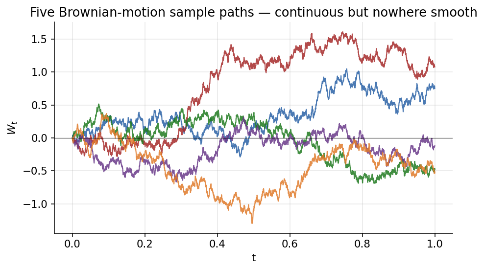
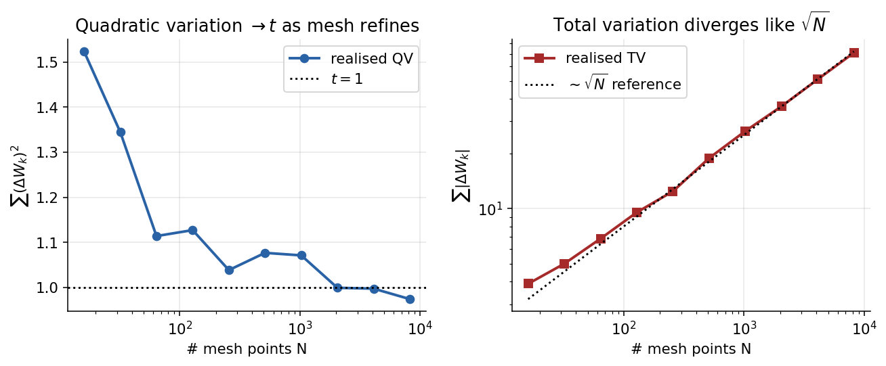
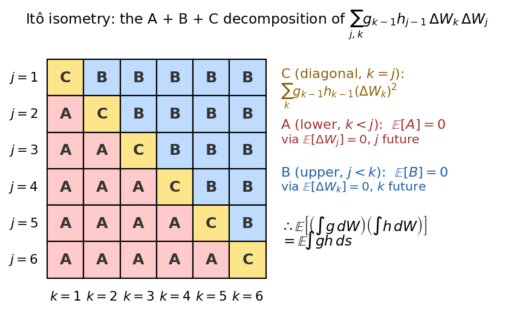
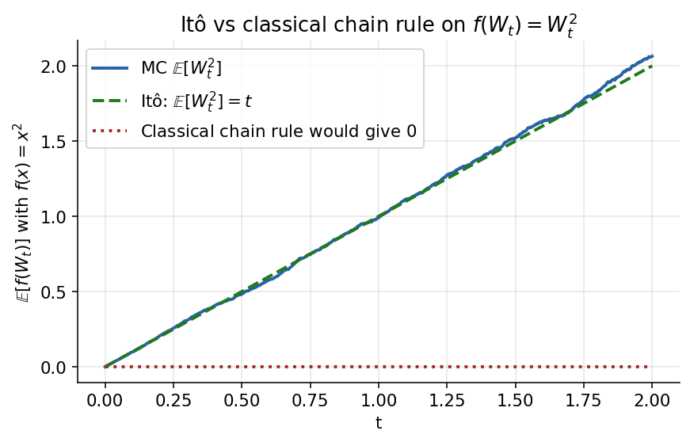
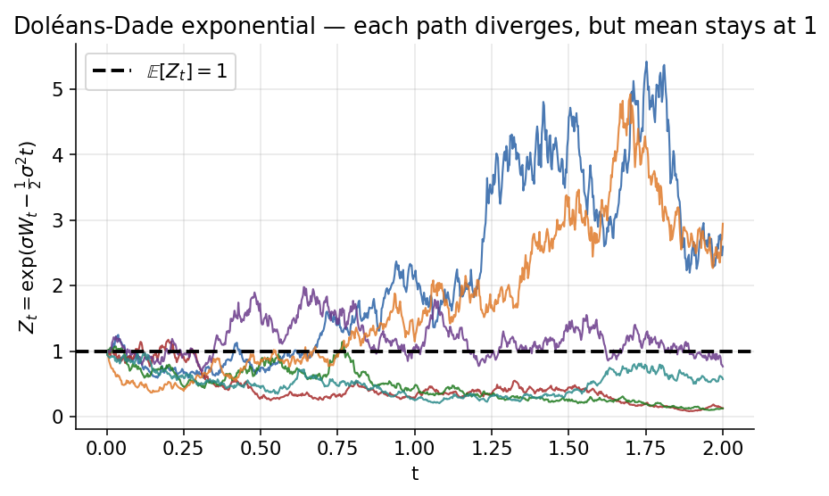
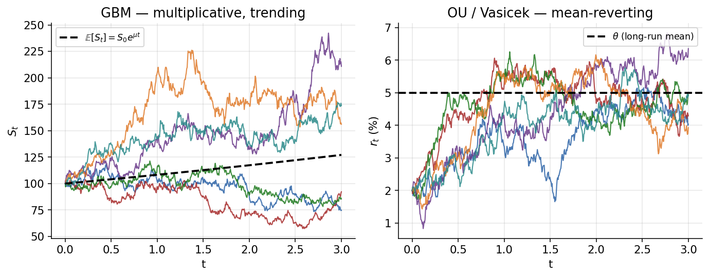

# Chapter 3 — Stochastic-Calculus Primer: Brownian Motion, Itô, and SDE Solutions

This chapter builds the stochastic-calculus apparatus that every later chapter uses. It is the foundational chapter of the guide: from here forward we take Itô's lemma, the Itô isometry, and the closed-form solution of the simplest SDEs as known, and we build measure-change, PDE bridges, and hedging arguments on top of them.

The arc of the chapter is deliberately linear. We start from the scaled random walk of Chapter 2 — the same CRR lattice you already know how to price on — and take a scaling limit to Brownian motion. We then prove the two structural path properties of BM that every derivative-pricing argument rests on (infinite total variation, finite quadratic variation equal to $t$), and use them to define the Itô stochastic integral. The Itô isometry drops out as a clean $L^2$ identity; Brownian moments follow as short MGF exercises; Itô's lemma in three successively more general forms (Lemmas I, II, III) is derived from a second-order Taylor expansion that keeps exactly the terms of size $\mathrm{d}t$. The SDE catalogue at the end of the chapter — GBM, Ornstein–Uhlenbeck, and the generic constant-coefficient diffusion — is each solved as a worked Itô-lemma exercise, so by the end of the chapter the reader knows not only the machinery but the three or four canonical SDEs that every later chapter will invoke.

A small upfront caveat. Nothing in the chapter is harder than one variable of calculus plus one variable of probability — but the *interaction* of those two disciplines is what makes stochastic calculus feel foreign on first reading. The Taylor series of $f(W_t)$ behaves nothing like the Taylor series of $f(x)$, and the mental reflex of "discard the second-order term" has to be permanently unlearned. The payoff is enormous: every pricing formula, every risk sensitivity, every hedging recipe in derivatives markets is downstream of the single identity $(\mathrm{d}W)^2 = \mathrm{d}t$. Master that line and the Black-Scholes PDE, the Greeks, the log-normal density, implied-vol surfaces, the forward measure, and Black-76 all arrange themselves into a small family of corollaries.

A note on notation. We use $W_t$ for Brownian motion throughout. Plain $W$ denotes a $\mathbb{P}$-Brownian motion when no measure is specified; when a Girsanov shift is in play (from Chapter 5 onward) hats or tildes will decorate the BM under the alternative measure. In this chapter measure is immaterial, because every path-property argument we make is invariant under equivalent changes of measure.

---

## 3.1 From Scaled Random Walk to Brownian Motion

### 3.1.1 The CRR tree, viewed as a discrete Brownian motion

Chapter 2 built a multi-period binomial tree for an underlying index, priced options on it by backward induction, and took a Donsker-style continuous-time limit in which the terminal distribution becomes log-normal. We now revisit that construction, but strip away the option-pricing apparatus to expose the underlying object — the *scaled random walk* that the lattice implicitly defines.

Let $x_1, x_2, \dots$ be i.i.d. Bernoulli sign-flips with $\mathbb{P}(x_k = \pm 1) = \tfrac12$. Partition the time axis into steps of size $\Delta t = t/N$ and define a scaled random walk by

$$
W_{n\Delta t} \;=\; W_{(n-1)\Delta t} \;+\; \sqrt{\Delta t}\,x_n, \qquad W_0 \;=\; 0.
\tag{3.1}
$$

Equivalently, summing $N$ increments,

$$
W_{N\Delta t} \;=\; \sqrt{\Delta t}\,\sum_{n=1}^{N} x_n.
\tag{3.2}
$$

Each increment has size $\pm\sqrt{\Delta t}$. The square-root scaling is not cosmetic: shrinking the time-step by a factor of $N$ shrinks each displacement by only $\sqrt{N}$, not by $N$, and that is exactly the asymmetric scaling needed to keep the variance finite in the limit. The multiplicative geometric version used for stock trees in Chapter 2 writes $S \in \{S e^{\sigma\sqrt{\Delta t}}, S e^{-\sigma\sqrt{\Delta t}}\}$; the arithmetic version $W \in \{W + \sqrt{\Delta t}, W - \sqrt{\Delta t}\}$ is what limits to Brownian motion and is what we study in this chapter.

The square-root-of-time scaling is worth a standalone intuition. Suppose you flipped a coin every millisecond for a year and called the net displacement $D$ of a unit-stride random walker. The walker's position at year-end would be $D \sim \mathrm{Normal}(0, N)$ with $N \approx 3.15\times 10^{10}$ steps, giving a standard deviation of $\sqrt{N} \approx 177{,}000$ millimetres — about 177 metres. Now ask the opposite question: how large does each stride have to be so that, after the year, the walker's typical displacement is exactly $1$ metre? Solving $\sqrt{N}\,\ell = 1$ m gives $\ell \approx 5.6\,\mu$m — roughly the size of a red blood cell. The stride $\ell = \sigma\sqrt{\Delta t}$ is the unique scaling that makes the stride shrink as the step-rate grows yet keeps the annual variance finite and positive. That is the whole magic of the $\sqrt{\Delta t}$ factor and the whole magic of Brownian motion.

A second intuition: the stride must shrink faster than the time-step because the *number* of steps grows as $1/\Delta t$ while the variance of the total displacement grows *linearly* in that number. Linear-in-steps times variance-per-step equals total variance; to keep total variance bounded by $t$ per unit time, each step's variance has to be $O(\Delta t)$, which forces the step size to be $O(\sqrt{\Delta t})$. Any other choice either collapses the walk (if you pick $\Delta t$ exactly) or blows it up (if you pick a constant).

### 3.1.2 Moments of the walk

Using $\mathbb{E}[x_n] = 0$ and $\mathrm{Var}[x_n] = 1$:

$$
\mathbb{E}[W_{N\Delta t}] \;=\; \sqrt{\Delta t}\,\sum_{n=1}^N \mathbb{E}[x_n] \;=\; 0,
\tag{3.3}
$$

$$
\mathrm{Var}[W_{N\Delta t}] \;=\; \Delta t\,\sum_{n=1}^N \mathrm{Var}[x_n] \;=\; N\,\Delta t \;=\; t.
\tag{3.4}
$$

So $W_{N\Delta t}$ has mean $0$ and variance $t$ for *any* $N$ — the variance is preserved exactly along the refinement, which is the whole point of picking $\sqrt{\Delta t}$ rather than $\Delta t$ or any other power. Had we used $\Delta t$ the walk would collapse to $0$; had we used a constant, it would explode. Only the square-root scaling keeps $\mathrm{Var}[W_t] = t$.

The key observation to register: the mean and the variance are exact for every $N$, not just asymptotically. When proving convergence of a random quantity it is enormously useful to have one moment already at its limiting value for every finite approximation; convergence then reduces to showing the *other* moment shrinks to zero. That double-moment structure — one moment exact, one shrinking — will reappear in every almost-sure-limit proof in this chapter.

### 3.1.3 CLT: the continuous-time limit

Let $t$ be fixed and $N\to\infty$ (equivalently $\Delta t = t/N \downarrow 0$). By the central limit theorem, the normalised sum $\tfrac{1}{\sqrt{N}}\sum_{n=1}^N x_n$ converges in distribution to a standard normal, so

$$
W_t \;\stackrel{d}{\underset{N\to\infty}{\longrightarrow}}\; \sqrt{t}\,Z, \qquad Z \sim \mathcal{N}(0,1).
\tag{3.5}
$$

Thus in the limit $W_t \sim \mathcal{N}(0,t)$ is Gaussian with mean $0$ and variance $t$. Read this the other way round: the Gaussian marginal at each time is *not* an assumption — it is forced on us by the CLT the moment we impose the correct scaling in (3.1).

The Gaussian law is not posited; it is *inherited* from the CLT's universality. Any other i.i.d. innovation with finite variance — uniform $\pm 1$, Rademacher $\pm 1$ with unfair weights, a truncated triangular distribution, a Laplace distribution with heavy tails (provided the variance is finite), even empirical return distributions from real markets — gives the same Gaussian scaling limit. The only surviving features of the innovation are its mean and its variance; all higher moments wash out under $\sqrt{N}$ averaging. In that sense Brownian motion is the *universal* continuous-time random walk, in the same way the Gaussian is the universal limit of normalised sums. A practical corollary: when you simulate a Brownian motion on a computer, you are almost always generating the fine-grained walk with Gaussian increments $\sqrt{\Delta t}\,Z$ rather than Bernoulli ones, because CLT universality makes the two limits identical.

### 3.1.4 Stationary and independent increments

For any $t < t+s$, write $W_{t+s} - W_t = \sqrt{\Delta t}\sum_{m=1}^M y_m$ with $y_m = x_{N+m}$ a fresh block of sign-flips. By the same CLT, with $M\Delta t = s$,

$$
W_{t+s} - W_t \;\stackrel{d}{\underset{M\to\infty}{\longrightarrow}}\; \sqrt{s}\,Z, \qquad Z \sim \mathcal{N}(0,1).
\tag{3.6}
$$

Because the law of $W_{t+s} - W_t$ depends only on the *length* $s$ of the interval — not on $W_t$ or the starting time $t$ — the process has *stationary increments*. Moreover, for non-overlapping intervals $[t,s]$ and $[u,v]$ the underlying Bernoulli blocks are disjoint, so the two sums are functions of independent random variables and therefore

$$
(W_s - W_t) \;\perp\; (W_v - W_u) \qquad \text{(independent increments)}.
\tag{3.7}
$$

Independent increments is the source of the *Markov property*: knowing $W$ up to time $u$ tells you nothing about future increments beyond what $W_u$ already encodes. Equivalent phrasings — conditional distribution of $W_{t+s}$ given $\mathcal{F}_t$ is $\mathcal{N}(W_t, s)$, and conditional on $W_t$ the future is independent of the past — will be used verbatim in the Feynman-Kac derivations of Chapter 4 and the change-of-numeraire arguments of Chapter 5.

---

## 3.2 Definition of Brownian Motion and Path Properties

Collecting the three properties just derived plus a regularity property, the scaling limit $W = (W_t)_{t\ge 0}$ is defined as a process satisfying

$$
\begin{aligned}
&(\text{i})\;\; W_0 = 0, \\
&(\text{ii})\;\; W_t \stackrel{d}{=} \sqrt{t}\,Z,\quad Z \sim \mathcal{N}(0,1), \\
&(\text{iii})\;\; W \text{ has stationary and independent increments}, \\
&(\text{iv})\;\; W \text{ has continuous paths}.
\end{aligned}
\tag{3.8}
$$

Property (iv) is the only one not already implied by the random-walk construction: the polygonal interpolation of the lattice walk is piecewise-linear, and continuity of the limit needs a tightness argument (Kolmogorov's continuity criterion). Properties (i)–(iii) are the structural skeleton; continuity then paints the skeleton smooth — but, as we are about to see, the *roughness* of that continuity is severe.

A pedagogical remark. The four conditions are conceptually independent, and you can build "partial Brownian motions" that satisfy any three of them but not the fourth. A compound Poisson process satisfies (i)–(iii) but has discontinuous paths and so fails (iv). A process that sits at zero forever satisfies (i) and (iv) but fails (ii) and (iii). A standard Cauchy process (stable with index $1$) satisfies (i), (iii), (iv) but has increments that are Cauchy, not Gaussian, and so fails (ii). It is the combination of all four — specifically Gaussian marginals plus independent increments plus continuity — that pins Brownian motion down uniquely (up to measure-zero null sets).

### 3.2.1 Continuous but nowhere differentiable

A typical sample path of BM is a jittery curve, everywhere continuous but nowhere smooth. Heuristically: the typical displacement over a time-step $\Delta t$ is $|\Delta W| \sim \sqrt{\Delta t}$, so the slope

*Five independent sample paths of $W$ on $[0, 1]$. Every path is continuous but visibly non-smooth at every scale — zooming in reveals identical-looking wiggles. The unbounded-slope property (3.$\infty$) is visible as the path's inability to be "traced with a pencil".*

$$
\frac{\Delta W}{\Delta t} \;\sim\; \frac{\sqrt{\Delta t}}{\Delta t} \;=\; \frac{1}{\sqrt{\Delta t}} \;\longrightarrow\; \infty \quad(\Delta t \downarrow 0).
$$

Every secant slope blows up, so the path has no derivative at any point despite being everywhere continuous. This is the first indication that ordinary calculus cannot handle $W$ — we need a *quadratic* calculus, which §3.3–§3.4 make precise. The intuition for why this forces a new calculus is simple: in any Taylor expansion of a function $f(W_t)$, the second-order term carries a factor $(\Delta W)^2 \sim \Delta t$, which is the *same* order as $\Delta t$ itself. Second-order terms can never be dropped as "small" in the way Newton's calculus assumes.

A concrete analogy is a coastline. Measure a coastline with a kilometre-long ruler and you get one total length; measure it with a metre-long ruler and the length grows because the ruler resolves previously-hidden wiggles; measure with a centimetre-long ruler and the length grows again. In the limit of an infinitesimally fine ruler, the total length diverges. A Brownian path behaves the same way: the *length* (total variation) diverges as the ruler refines, while a different quantity — the *sum of squared straight-line segments* (quadratic variation) — stays finite and equals $t$. Section 3.3 computes the first; Section 3.4 computes the second.

The reason this matters for trading. Every gamma trader lives inside the discrepancy between TV and QV. If BM had finite TV, a delta-hedged option would have zero expected P&L regardless of hedging frequency — there would be no gamma premium to harvest, because the path could be traced arbitrarily precisely with finitely many hedge trades. Infinite TV says the opposite: no matter how often you rehedge, the residual cash flow between rehedges is never negligible. Finite QV — the specific value $t$ — tells you how large that residual is on average, which is the *gamma theta* of options pricing. The two path properties we are about to prove are not abstract measure-theoretic curiosities; they are the mathematical expressions of "options have a gamma premium."

---

## 3.3 Total Variation

### 3.3.1 Definition

For a function $f$ on $[0,t]$ and a partition $\pi = \{t_0, t_1, \dots, t_N\}$ with $0 = t_0 < t_1 < \cdots < t_N = t$, the total variation is

$$
\mathrm{TV}_t \;=\; \lim_{\|\pi\|\downarrow 0}\;\sum_{k} \bigl|\,f(t_k) - f(t_{k-1})\,\bigr|,
\tag{3.9}
$$

where $\|\pi\| = \max_k (t_k - t_{k-1})$ is the mesh size. Pictorially, lay the graph of $f$ flat by flipping each down-stroke upward; the total horizontal length is $\mathrm{TV}_t$.

TV matters because the Riemann-Stieltjes integral $\int g\,\mathrm{d}f$ only exists (in the classical sense) when $f$ has finite total variation on $[0,t]$. For BM we are about to find TV is infinite, which is exactly why the new stochastic integral of §3.5 is needed.

### 3.3.2 Case 1 — $f$ is differentiable (finite TV)

If $f \in C^1$, by the mean-value theorem there exists $t_k^\star \in (t_{k-1}, t_k)$ with $\Delta f_k = f'(t_k^\star)\,\Delta t_k$. Therefore

$$
\sum_k |\Delta f_k| \;=\; \sum_k |f'(t_k^\star)|\,\Delta t_k \;\xrightarrow[\|\pi\|\downarrow 0]{}\; \int_0^t |f'(s)|\,\mathrm{d}s \;<\; +\infty.
\tag{3.10}
$$

Finite TV, as expected for smooth functions. The entire argument fails for BM because $W$ has no derivative anywhere, and in its absence the sum of $|\Delta W_k|$ diverges.

### 3.3.3 Case 2 — Brownian motion has infinite TV

For BM the increments are $\Delta W_k \stackrel{d}{=} \sqrt{\Delta t_k}\,Z_k$ with $Z_k \stackrel{\mathrm{iid}}{\sim} \mathcal{N}(0,1)$. So

$$
\sum_k |W_{t_k} - W_{t_{k-1}}| \;=\; \sum_k \sqrt{\Delta t_k}\,|Z_k|.
\tag{3.11}
$$

The mean. Because $\mathbb{E}|Z| = \sqrt{2/\pi}$ is a finite constant,

$$
\mathbb{E}\!\left[\sum_k \sqrt{\Delta t_k}\,|Z_k|\right] \;=\; \mathbb{E}|Z|\cdot\sum_k \sqrt{\Delta t_k}.
\tag{3.12}
$$

The variance is $c^2\sum_k \Delta t_k = c^2 t$, bounded as the partition refines. The key bound is on the mean:

$$
\sum_k \sqrt{\Delta t_k} \;\ge\; \sum_k \frac{\Delta t_k}{\sqrt{\|\pi\|}} \;=\; \frac{t}{\sqrt{\|\pi\|}} \;\xrightarrow[\|\pi\|\downarrow 0]{}\; +\infty.
\tag{3.13}
$$

So the mean of the TV-sum diverges while its variance stays bounded — concentration around an unbounded mean forces the sum itself to be unbounded. Almost surely,

$$
\boxed{\;\mathrm{TV}_t(W) \;=\; \lim_{\|\pi\|\downarrow 0} \sum_k |W_{t_k} - W_{t_{k-1}}| \;=\; +\infty\;}. \qquad\text{(a.s.)}
\tag{3.14}
$$

Brownian motion is too rough to have a well-defined first-order path integral $\int_0^t g(s)\,\mathrm{d}W_s$ in the Riemann-Stieltjes sense; a new stochastic integral is needed, and that is the subject of §3.5.

The economic shadow. A delta-hedger rebalances $N$ times per unit time and incurs a transaction cost of $c\cdot|\Delta S|$ per trade. Total trading cost equals $c\cdot\sum|\Delta S_k|$, which is the TV sum for $S$. Because $S$ is approximately GBM and GBM has infinite TV, this cost diverges as rebalancing becomes continuous — exactly the feature that prevents the frictionless Black-Scholes derivation from being implementable literally. In practice, hedgers impose a discrete rebalancing grid and accept residual gamma risk; the frictionless-trading assumption is the statement "pretend TV does not diverge, or at least that transactions are free." Whenever a trader complains about transaction costs on a delta-hedging strategy, that is the pathological TV of GBM biting.

---

## 3.4 Quadratic Variation and the Rule $(\mathrm{d}W)^2 = \mathrm{d}t$

### 3.4.1 Definition

The quadratic variation of $f$ on $[0,t]$ is

$$
[f]_t \;=\; [f,f]_t \;=\; \lim_{\|\pi\|\downarrow 0} \sum_k \bigl(\Delta f_k\bigr)^2, \qquad \Delta f_k = f(t_k) - f(t_{k-1}).
\tag{3.15}
$$

Where TV measured path length, QV measures cumulative *squared jitter*. For smooth functions QV vanishes (because $(\Delta f)^2 \approx (f')^2(\Delta t)^2$ is one order higher than $\Delta t$); for BM, as we are about to see, QV equals $t$ exactly — a finite, deterministic number. This is the single most important fact in stochastic calculus, because it converts the heuristic $(\mathrm{d}W)^2 = \mathrm{d}t$ into a rigorous statement.

Why the quadratic version of the sum is well-behaved while the linear version diverges. The sum-of-absolutes $\sum|\Delta W_k|$ behaves like $\sum\sqrt{\Delta t_k}\cdot\mathbb{E}|Z|$ — a sum of *square-roots* — which grows like $\sqrt{N}$. The sum-of-squares $\sum(\Delta W_k)^2$ behaves like $\sum\Delta t_k\cdot\mathbb{E}[Z^2] = t$, constant in $N$. Squaring each increment converts the diverging $\sqrt{\Delta t}$ into a summable $\Delta t$ and shifts the bad behaviour into a benign regime. A cleaner way to state the lesson: TV sees *size*, QV sees *energy*. Brownian motion has bounded energy (the $t$ in $[W,W]_t = t$) but unbounded size (the $+\infty$ in $\mathrm{TV}_t(W) = +\infty$). In trader language, BM has finite integrated variance (= $t$ times vol-squared) but infinite gross trading distance (= integrated $|$price change$|$). The two quantities are not the same, and conflating them is the most common source of Black-Scholes confusion.

### 3.4.2 Case 1 — $f$ differentiable: $[f]_t = 0$

If $f \in C^1$,

$$
\sum_k (\Delta f_k)^2 \;=\; \sum_k \bigl(f'(t_k^\star)\bigr)^2\,(\Delta t_k)^2 \;\le\; \|\pi\|\cdot\int_0^t (f'(s))^2\,\mathrm{d}s \;\xrightarrow[\|\pi\|\downarrow 0]{}\; 0.
\tag{3.16}
$$

So differentiable functions have zero QV. The inequality $(\Delta t_k)^2 \le \Delta t_k\cdot\|\pi\|$ peels off one power of $\|\pi\|$, which kills the sum in the limit. This is why ordinary calculus has no Itô correction: for smooth paths, squared-increment sums are negligible.

Phrased dimensionally: for smooth $f$, $\Delta f_k = O(\Delta t_k)$ so $(\Delta f_k)^2 = O((\Delta t_k)^2)$, and there are $N = t/\Delta t$ of them, giving a total $N\cdot O((\Delta t)^2) = O(\Delta t)\to 0$. For Brownian motion $\Delta W_k = O(\sqrt{\Delta t_k})$, so $(\Delta W_k)^2 = O(\Delta t_k)$ and the sum $N\cdot O(\Delta t) = O(1)$ stays finite. Smooth functions produce $(\Delta f)^2 \sim (\Delta t)^2$ (second-order small); BM produces $(\Delta W)^2 \sim \Delta t$ (first-order small). One order of $\Delta t$ is kept by the squaring, the other washed out — and that retained order produces the Itô correction.

### 3.4.3 Case 2 — Brownian motion: $[W,W]_t = t$

Let $Q = \sum_k (\Delta W_k)^2$ with $\Delta W_k \stackrel{d}{=} \sqrt{\Delta t_k}\,Z_k$, $Z_k \stackrel{\mathrm{iid}}{\sim}\mathcal{N}(0,1)$.

Mean.

$$
\mathbb{E}[Q] \;=\; \sum_k \mathbb{E}\!\left[(\Delta W_k)^2\right] \;=\; \sum_k \Delta t_k \;=\; t.
\tag{3.17}
$$

The mean is *exact* — no limit needed, no $\|\pi\|$ dependence. Every finite partition already gives $\mathbb{E}[Q] = t$.

Variance. Using $\mathrm{Var}((\Delta W_k)^2) = (\Delta t_k)^2\,\mathrm{Var}(Z^2) = 2(\Delta t_k)^2$ (because $\mathrm{Var}(Z^2) = \mathbb{E}[Z^4] - 1 = 3 - 1 = 2$ — the standard-Normal fourth moment $\mathbb{E}[Z^4] = 3$ is derived via the MGF in §3.7.1) and independence across $k$,

$$
\mathrm{Var}[Q] \;=\; 2\sum_k (\Delta t_k)^2 \;\le\; 2\,\|\pi\|\sum_k \Delta t_k \;=\; 2\|\pi\|\,t \;\xrightarrow[\|\pi\|\downarrow 0]{}\; 0.
\tag{3.18}
$$

Conclusion. $Q$ has mean *exactly* $t$ and variance shrinking to zero, so by Chebyshev's inequality ($L^2$-convergence along the full sequence, almost-sure along a thinning subsequence):

$$
\boxed{\;\sum_k (\Delta W_k)^2 \;\xrightarrow[\|\pi\|\downarrow 0]{\mathrm{a.s.}}\; t, \qquad [W,W]_t \;=\; t\;} \qquad\text{(a.s.)}
\tag{3.19}
$$

A striking feature: a *random* object — the sum of squared increments along a random trajectory — converges to a *deterministic* limit $t$. The randomness is there, but it is concentrated so tightly around the mean that in the limit it disappears. Economically, this is why implied volatility is observable at all: the quadratic variation of a stock price is essentially a deterministic integral of $\sigma^2$, not a random quantity.

*The same Brownian path, sampled at progressively finer meshes. Left: $\sum(\Delta W_k)^2$ converges deterministically to $t = 1$ as the mesh refines. Right: $\sum|\Delta W_k|$ diverges like $\sqrt{N}$ — finite energy but unbounded path-length, which is precisely the TV vs QV dichotomy of §3.3–§3.4.*

This "randomness collapsing into determinism" deserves a full beat. In the discrete approximation, $\sum_k(\Delta W_k)^2$ is a sum of $N$ i.i.d. random variables, each equal to $\Delta t\cdot Z_k^2$ for an independent chi-squared-one draw. By the law of large numbers the average of these $Z_k^2$ converges almost surely to $\mathbb{E}[Z^2] = 1$; multiplying by $N\Delta t = t$ gives $\sum(\Delta W_k)^2 \to t$ a.s. The convergence is the LLN dressed up in Brownian clothing. The variance-shrinking-faster-than-mean argument is just Chebyshev telling us the LLN converges rapidly in $L^2$.

**Why "realised variance = integrated variance" in the variance-swap world.** A variance swap pays the holder the realised sample variance $\frac{252}{N}\sum(r_k)^2$ where $r_k$ are daily log-returns. In the GBM model $r_k \approx \sigma\Delta W_k - \tfrac12\sigma^2\Delta t$, so $\sum r_k^2 \approx \sigma^2 \sum(\Delta W_k)^2 \to \sigma^2 t$. The variance-swap payoff concentrates on a deterministic quantity equal to the square of the volatility times the tenor — which is why variance swaps are *exactly* replicable by a portfolio of European options (Carr-Madan replication). In contrast, the TV of the same log-return sequence diverges like $\sqrt{N}$, explaining why "average absolute return" is a nuisance statistic whereas "realised variance" is a well-posed estimator of $\sigma^2$.

### 3.4.4 The Itô shorthand $(\mathrm{d}W)^2 = \mathrm{d}t$

Equation (3.19) is the mathematical justification of the Itô multiplication rules

$$
(\mathrm{d}W_t)^2 \;=\; \mathrm{d}t,\qquad \mathrm{d}W_t\cdot \mathrm{d}t \;=\; 0,\qquad (\mathrm{d}t)^2 \;=\; 0.
\tag{3.20}
$$

These rules drive Itô's formula throughout the rest of the chapter (and this guide). In particular — the crucial pedagogical point — the BM path has *non-zero* QV-roughness ($\sum \Delta W_k^2 \to t$), not the $0$ you might have hoped for from an ordinary-calculus perspective; that $t$ is precisely the reason pricing PDEs carry a $\tfrac12\sigma^2\,\partial_{xx}$ term. Every Itô correction in this guide traces back to (3.20).

The three rules are worth memorising with their intuitive content.

- $(\mathrm{d}W_t)^2 = \mathrm{d}t$. The square of a Gaussian increment of variance $\mathrm{d}t$ has mean $\mathrm{d}t$ and variance $2(\mathrm{d}t)^2 \ll \mathrm{d}t$; the $\mathrm{d}t$-mean dominates, so at leading order $(\mathrm{d}W)^2 = \mathrm{d}t$ is a deterministic identity.
- $\mathrm{d}W_t\cdot\mathrm{d}t = 0$. The increment $\mathrm{d}W_t$ has magnitude $\sqrt{\mathrm{d}t}$, so $\mathrm{d}W\cdot\mathrm{d}t \sim (\mathrm{d}t)^{3/2}$, which is higher-order than $\mathrm{d}t$ and drops out.
- $(\mathrm{d}t)^2 = 0$. Obvious dimensionally; kept in the list for symmetry.

The memorisation trick. Think of $\mathrm{d}W$ as living at scale $\sqrt{\mathrm{d}t}$ and $\mathrm{d}t$ as living at scale $\mathrm{d}t$. Any product of these two atoms scales as $(\mathrm{d}t)^{n/2}$ where $n$ is the total atom count. Keep only products with $n = 2$ (size exactly $\mathrm{d}t$), drop products with $n > 2$. The three rules are just this bookkeeping.

When we apply Itô's lemma we multiply out $(\mathrm{d}X)^2$ for an SDE $\mathrm{d}X = a\,\mathrm{d}t + b\,\mathrm{d}W$, expand

$$(a\,\mathrm{d}t + b\,\mathrm{d}W)^2 \;=\; a^2\,(\mathrm{d}t)^2 + 2ab\,\mathrm{d}t\,\mathrm{d}W + b^2\,(\mathrm{d}W)^2,$$

and then use (3.20): the first two terms vanish, the third becomes $b^2\,\mathrm{d}t$. The rule set collapses the Itô-square of any SDE to a clean $b^2\,\mathrm{d}t$ — the fact used in every Itô-formula application in this chapter. A quick self-check: if you can state and multiply these three rules from memory, you can generate any Itô-formula line on demand.

---

## 3.5 The Itô Stochastic Integral

### 3.5.1 Warm-up — the classical Riemann-Stieltjes integral

For smooth $f$ the chain rule gives

$$
\int_0^t f(s)\,\mathrm{d}f(s) \;=\; \tfrac{1}{2}\,\bigl(f^2(t) - f^2(0)\bigr),
\tag{3.21}
$$

because $\mathrm{d}\bigl(\tfrac{1}{2}f^2(s)\bigr) = f(s)\,\mathrm{d}f(s)$. Remember this answer — when we repeat the calculation for Brownian motion we will find the analogue carries an *extra* $-\tfrac12 t$ term that has no classical counterpart. The classical integral is oblivious to the endpoint choice in the Riemann sum because QV is zero; once we swap $f$ for BM the endpoint choice becomes consequential, and the $-\tfrac12 t$ is exactly the accumulated left-right mismatch summed over infinitely many infinitesimal intervals.

### 3.5.2 The Itô integral, defined

The stochastic analogue uses *left-endpoint* Riemann sums — crucial, because this is what makes the integral a martingale:

$$
\int_0^t W_s\,\mathrm{d}W_s \;\equiv\; \lim_{\|\pi\|\downarrow 0}\;\sum_k W_{t_{k-1}}\,\Delta W_{t_k}, \qquad \Delta W_{t_k} = W_{t_k} - W_{t_{k-1}}.
\tag{3.22}
$$

Evaluating $W$ at the *start* $t_{k-1}$ of each sub-interval makes $W_{t_{k-1}}$ independent of the forward-looking increment $\Delta W_{t_k}$. That independence makes the expectation of each term zero, and hence makes the whole stochastic integral a martingale. Right-endpoints would couple the integrand to its own driving noise and destroy the martingale property.

Economic gloss. The Itô integral is the mathematical expression of a *predictable* trading strategy: at time $t_{k-1}$ you commit to holding $W_{t_{k-1}}$ units of the underlying until $t_k$, and you realise the P&L $W_{t_{k-1}}(W_{t_k} - W_{t_{k-1}})$ over that interval. Predictability means the position size is chosen *before* the random move, not after; the left-endpoint rule enforces exactly that. If you were allowed to pick the right endpoint you could lean into favourable moves you already know about. The martingale property of stochastic integrals is thus the mathematical statement "predictable strategies have zero expected P&L" — the no-arbitrage condition in continuous time.

A different rule called the Stratonovich integral evaluates at the midpoint $\tfrac12(W_{t_{k-1}} + W_{t_k})$. Stratonovich integrals obey the classical chain rule (no Itô correction) but lose the martingale property. For financial modelling the Itô convention is mandatory because the martingale property, not the chain rule, is what encodes no-arbitrage.

### 3.5.3 First worked integral — $\int_0^t W_s\,\mathrm{d}W_s$

The claim, which we prove by a telescoping identity + QV computation, is

$$
I_t \;=\; \int_0^t W_s\,\mathrm{d}W_s \;=\; \tfrac12\,W_t^2 \;-\; \tfrac12\,t \qquad\text{a.s.}
\tag{3.23}
$$

The answer already carries the surprise: the classical guess would be $\tfrac12 W_t^2$, but the stochastic integral subtracts an extra $\tfrac12 t$ — the *Itô correction*, sometimes called the "convexity correction" because it arises from the curvature of $w \mapsto \tfrac12 w^2$ interacting with the QV of $W$. The $\tfrac12 t$ is deterministic, grows linearly, and has no stochastic component; it is the "free" cash that a convex long-gamma position accumulates as time passes. In options language, the correction is the *theta bleed* of a one-lot long-gamma portfolio.

**Proof.** Use the algebraic identity $a(b-a) = \tfrac12(b^2 - a^2) - \tfrac12(b-a)^2$ with $a = W_{t_{k-1}}$, $b = W_{t_k}$:

$$
W_{t_{k-1}}\bigl(W_{t_k} - W_{t_{k-1}}\bigr) \;=\; \tfrac{1}{2}\bigl(W_{t_k}^2 - W_{t_{k-1}}^2\bigr) \;-\; \tfrac{1}{2}\bigl(W_{t_k} - W_{t_{k-1}}\bigr)^2.
\tag{3.24}
$$

Summing over $k$ and using $W_0 = 0$:

$$
\sum_k W_{t_{k-1}}\,\Delta W_{t_k} \;=\; \tfrac{1}{2}\,W_t^2 \;-\; \tfrac{1}{2}\,\sum_k (\Delta W_{t_k})^2.
\tag{3.25}
$$

The left-hand side is the Riemann-like sum defining the Itô integral. The right-hand side has two parts. The first, $\tfrac12 W_t^2$, is the classical Newton-Leibniz answer. The second, $-\tfrac12 \sum_k(\Delta W_{t_k})^2$, is the Itô correction in discrete form — an exact lattice version of $-\tfrac12 t$, because by (3.19) this sum converges almost surely to $t$. Passing to the limit,

$$
\boxed{\;\int_0^t W_s\,\mathrm{d}W_s \;=\; \tfrac{1}{2}\,W_t^2 \;-\; \tfrac{1}{2}\,t\;}.
\tag{3.26}
$$

Three observations on this answer.

1. Taking expectations on both sides of (3.26): $\mathbb{E}\int_0^t W_s\,\mathrm{d}W_s = \tfrac12\mathbb{E}[W_t^2] - \tfrac12 t = 0$. The Itô integral is zero-mean — the martingale property surfaces automatically.
2. The Itô integral is *not* zero, despite having zero mean. Its variance grows with $t$ (we'll compute it via the Itô isometry next): it is a non-trivial random variable concentrated around zero.
3. The difference $I_t - \tfrac12 W_t^2 = -\tfrac12 t$ is *deterministic*. Remarkable: the randomness of the classical antiderivative $\tfrac12 W_t^2$ and the randomness of the Itô integral $I_t$ match exactly, so when subtracted they leave only the $-\tfrac12 t$ correction.

Equivalent form: rearranging (3.26),

$$
\tfrac{1}{2}\,W_t^2 \;=\; \int_0^t W_s\,\mathrm{d}W_s \;+\; \tfrac{1}{2}\,t,
\tag{3.27}
$$

which is Itô's formula applied to $F(w) = \tfrac12 w^2$: $\mathrm{d}(\tfrac12 W_t^2) = W_t\,\mathrm{d}W_t + \tfrac12\,\mathrm{d}t$. The $\tfrac12\,\mathrm{d}t$ correction is exactly what distinguishes the stochastic integral from the classical chain-rule answer.

### 3.5.4 Why the left-endpoint choice matters

Had we used the right-endpoint $W_{t_k}$ (Stratonovich-like), the telescoping identity would have given $+\tfrac12 \sum(\Delta W_k)^2 \to +\tfrac12 t$ rather than $-\tfrac12 t$, producing $\tfrac12 W_t^2$ — the classical answer. Itô's left-endpoint choice is what guarantees the integrand $W_{t_{k-1}}$ is $\mathcal{F}_{t_{k-1}}$-measurable and therefore independent of $\Delta W_{t_k}$, giving the stochastic integral its martingale property.

The financial reading. A left-endpoint integrand is "predictable" — you pick your position before the jump. A right-endpoint integrand is "anticipative" — you pick your position after the jump, with knowledge of what just happened. Anticipative strategies violate no-arbitrage and are inadmissible in continuous-time finance. Itô's insistence on left endpoints is the mathematical enforcement of predictability, and hence of no-arbitrage.

---

## 3.6 The Itô Isometry

The $L^2$-isometry that underlies the definition of the stochastic integral is both a computational workhorse (it reduces any variance-of-stochastic-integral calculation to an ordinary time integral) and a structural theorem (it says the Itô integral is a continuous linear map from a weighted $L^2$ space of integrands into the space of martingales).

**Statement.** For any two adapted integrands $g_s$ and $h_s$ satisfying $\mathbb{E}\int_0^t g_s^2\,\mathrm{d}s < \infty$ and likewise for $h$,

$$
\boxed{\;\mathbb{E}\!\left[\,\Big(\int_0^t g_s\,\mathrm{d}W_s\Big)\Big(\int_0^t h_s\,\mathrm{d}W_s\Big)\,\right]
\;=\; \mathbb{E}\!\left[\,\int_0^t g_s h_s\,\mathrm{d}s\,\right]\;}.
\tag{3.28}
$$

In particular, for $g = h$, the $L^2$-norm of a stochastic integral equals the $L^2$-norm (in $s$ and $\omega$) of its integrand:

$$
\mathbb{E}\!\left[\left(\int_0^t g_s\,\mathrm{d}W_s\right)^{\!2}\right] \;=\; \mathbb{E}\!\int_0^t g_s^2\,\mathrm{d}s.
\tag{3.29}
$$

**Proof — the A + B + C decomposition.** Set $g_t = g(t, W_t)$, $h_t = h(t, W_t)$, and define the residual

$$
\mathcal{E} \;=\; \mathbb{E}\!\left[\Big(\int_0^t g_s\,\mathrm{d}W_s\Big)\Big(\int_0^t h_s\,\mathrm{d}W_s\Big) \;-\; \int_0^t g_s h_s\,\mathrm{d}s\right].
\tag{3.30}
$$

Goal: show $\mathcal{E} = 0$. Fix a partition $\pi = \{0 = t_0 < t_1 < \cdots < t_n = t\}$ and discretise both integrals as Riemann sums, so the first product becomes

$$
\Big(\sum_k g_{t_{k-1}}\Delta W_{t_k}\Big)\Big(\sum_j h_{t_{j-1}}\Delta W_{t_j}\Big)
\;=\; \sum_{k,j} g_{k-1}\,h_{j-1}\,\Delta W_{t_k}\,\Delta W_{t_j},
$$

where $g_{k-1} = g_{t_{k-1}}$ etc. The second piece (the time integral) discretises as $\sum_k g_{k-1}\,h_{k-1}\,\Delta t_k$.

**Step 1 — Split the double sum into three regions** (A, B, C) according to the relationship between indices $j$ and $k$:

$$
\sum_{k,j} g_{k-1}\,h_{j-1}\,\Delta W_{k}\,\Delta W_{j}
\;=\; \underbrace{\sum_{k<j} g_{k-1}\,h_{j-1}\,\Delta W_k\,\Delta W_j}_{A} \;+\; \underbrace{\sum_{j<k} g_{k-1}\,h_{j-1}\,\Delta W_k\,\Delta W_j}_{B} \;+\; \underbrace{\sum_k g_{k-1}\,h_{k-1}\,(\Delta W_k)^2}_{C}.
$$

The matrix picture: the $n\times n$ grid indexed by $(k,j)$ splits into the lower triangle $A$ ($k<j$), the upper triangle $B$ ($j<k$), and the diagonal $C$ ($k=j$, highlighted). The isometry is the claim that the two triangles die in expectation and only the diagonal survives — matching the time-integral piece exactly.

**Step 2 — $\mathbb{E}[A] = 0$.** For any term in $A$ we have $k < j$. Condition on $\mathcal{F}_{t_{j-1}}$: the factors $g_{k-1}$, $h_{j-1}$, and $\Delta W_k$ are all $\mathcal{F}_{t_{j-1}}$-measurable (by convention $h_{j-1} := h_{t_{j-1}}$ is $\mathcal{F}_{t_{j-1}}$-measurable because it is evaluated at the left endpoint of the $j$-th sub-interval; $g_{k-1}$ and $\Delta W_k$ are $\mathcal{F}_{t_k}\subset\mathcal{F}_{t_{j-1}}$-measurable since $k < j \Rightarrow t_k \le t_{j-1}$), while $\Delta W_j$ is independent of $\mathcal{F}_{t_{j-1}}$ with mean zero. Hence

$$
\mathbb{E}\!\left[g_{k-1}\,h_{j-1}\,\Delta W_k\,\Delta W_j\right]
\;=\; \mathbb{E}\!\left[g_{k-1}\,h_{j-1}\,\Delta W_k\right]\cdot\underbrace{\mathbb{E}[\Delta W_j]}_{=\,0}
\;=\; 0,
\tag{3.31}
$$

and summing over $k<j$ gives $\mathbb{E}[A] = 0$.

**Step 3 — $\mathbb{E}[B] = 0$** by the symmetric argument with the roles of $j$ and $k$ swapped.

**Step 4 — Only the diagonal $C$ survives.** Combining the three pieces with the time-integral subtraction,

$$
\mathcal{E} \;=\; \mathbb{E}\!\left[\sum_k g_{k-1}\,h_{k-1}\,\bigl((\Delta W_k)^2 - \Delta t_k\bigr)\right]
\;=\; \sum_k \mathbb{E}[g_{k-1}\,h_{k-1}]\cdot\underbrace{\mathbb{E}[(\Delta W_k)^2 - \Delta t_k]}_{=\,0}
\;=\; 0,
\tag{3.32}
$$

using independence of $g_{k-1} h_{k-1}$ (measurable at $t_{k-1}$) from $\Delta W_k$, and $\mathbb{E}[(\Delta W_k)^2] = \Delta t_k$.

**Step 5 — Pass to the limit.** Equation (3.32) holds for every partition $\pi$; taking $\|\pi\|\downarrow 0$ delivers the isometry (3.28). $\blacksquare$

**Reading the isometry.** The scalar identity $[W,W]_t = t$ becomes, under weighting by $g_s^2$, the statement that the variance of $\int g\,\mathrm{d}W$ equals the integrated squared integrand. In a quant-practitioner translation: "the variance of a stochastic P&L equals the integrated variance contribution of each sub-interval's position." Every variance-swap argument in the rest of the guide is downstream of (3.29).

A weakening of the boundedness assumption gives the result for any $g$ with $\mathbb{E}\int_0^t g_s^2\,\mathrm{d}s < \infty$, via a standard localisation-and-approximation argument. We take this extension for granted from here on.

---

## 3.7 Brownian Moment Calculations

Before moving to Itô's lemma it pays to build a small toolkit of Brownian moment calculations. Each is a quick application of the Gaussian MGF or the independent-increments property, but they show up repeatedly downstream and are worth seeing explicitly.

Two overarching techniques drive every calculation in this section.

- **MGF differentiation.** The moment-generating function $h(a) = \mathbb{E}[e^{aZ}] = e^{a^2/2}$ of a standard normal has the property that $\mathbb{E}[Z^n] = h^{(n)}(0)$. For higher moments we differentiate $h$ as many times as the moment order, then evaluate at $a=0$. This reduces computation of any central Gaussian moment to a mechanical exercise in repeated differentiation of $e^{a^2/2}$.
- **Increment decomposition.** For any $s\le t$, write $W_t = W_s + (W_t - W_s)$, where the second piece is an increment *independent of* $W_s$. This factorises joint expectations as products of marginal expectations of independent pieces, each a centred Gaussian of known variance.

### 3.7.1 Variance of $W_t^2$

Starting from $\mathrm{Var}[W_t^2] = \mathbb{E}[W_t^4] - (\mathbb{E}[W_t^2])^2$ and using $W_t \stackrel{d}{=} \sqrt{t}\,Z$ with $Z\sim\mathcal{N}(0,1)$,

$$
\mathrm{Var}[W_t^2] \;=\; t^2\,\bigl(\mathbb{E}[Z^4] - 1\bigr).
\tag{3.33}
$$

The Gaussian MGF $h(a) = e^{a^2/2}$ has derivatives $h'(a) = a e^{a^2/2}$, $h''(a) = (1+a^2)e^{a^2/2}$, $h'''(a) = (a^3 + 3a)e^{a^2/2}$, $h^{(4)}(a) = (a^4 + 6a^2 + 3)e^{a^2/2}$. Evaluating at $a=0$: $\mathbb{E}[Z^2] = 1$, $\mathbb{E}[Z^4] = 3$. The odd moments vanish by symmetry; the even moments grow as $(2k-1)!! = 1, 3, 15, 105,\dots$. Substituting,

$$
\boxed{\;\mathrm{Var}[W_t^2] \;=\; 2\,t^2\;}.
\tag{3.34}
$$

This is the Brownian analogue of $\mathrm{Var}(X^2) = 2\sigma^4$ for centred Gaussians with variance $\sigma^2 = t$, and it underlies the QV concentration argument of §3.4 (the variance of the QV sum is $\sum 2(\Delta t_k)^2 \le 2\|\pi\|\,t$).

### 3.7.2 Covariance $\mathbb{E}[W_t W_s]$

For $0 \le s \le t$, write $W_t = (W_t - W_s) + W_s$. Then

$$
\mathbb{E}[W_t\,W_s] \;=\; \mathbb{E}[(W_t - W_s)\,W_s] \;+\; \mathbb{E}[W_s^2] \;=\; 0 \;+\; s,
$$

because $W_s$ and the forward increment $W_t - W_s$ are independent mean-zero. Hence

$$
\boxed{\;\mathbb{E}[W_t\,W_s] \;=\; \min(s,t)\;}.
\tag{3.35}
$$

The correlation is $\mathrm{Corr}(W_t, W_s) = \sqrt{s/t}$: nearby times are highly correlated, far-apart times nearly independent. This is also the kernel used when simulating BM on a grid — for $s<t$ the joint law $(W_s, W_t)$ is Gaussian with covariance matrix $\begin{pmatrix}s & s\\ s & t\end{pmatrix}$, whose Cholesky factorisation gives the practical recipe "draw $Z_1, Z_2$ i.i.d. standard normal; set $W_s = \sqrt{s}Z_1$, $W_t = \sqrt{s}Z_1 + \sqrt{t-s}Z_2$."

### 3.7.3 The exponential martingale

A recurring character in this guide. Claim:

$$
\boxed{\;\mathbb{E}[X_t] \;=\; 1 \quad\text{for every } t\ge 0\;}, \qquad X_t = e^{-\tfrac12\sigma^2 t + \sigma W_t}.
\tag{3.36}
$$

Proof by MGF:

$$
\mathbb{E}[X_t] \;=\; e^{-\tfrac12\sigma^2 t}\,\mathbb{E}[e^{\sigma W_t}] \;=\; e^{-\tfrac12\sigma^2 t}\,e^{\tfrac12\sigma^2 t} \;=\; 1,
$$

using $W_t\sim\mathcal{N}(0,t)$ and the Gaussian MGF. The deterministic drift $-\tfrac12\sigma^2 t$ is exactly what is needed to offset the Jensen bump created by exponentiating a centred Gaussian.

Let us dwell on this cancellation because it is worth a thousand Black-Scholes formulas. The random variable $\sigma W_t$ is Gaussian with mean $0$ and variance $\sigma^2 t$. The exponential is strictly convex, so Jensen's inequality says $\mathbb{E}[e^{\sigma W_t}] \ge e^0 = 1$, with strict inequality whenever $\sigma^2 t > 0$. The Jensen bump is quantified by the Gaussian MGF: $\mathbb{E}[e^{\sigma W_t}] = e^{\sigma^2 t/2}$. To kill this bump, subtract $\tfrac12\sigma^2 t$ from the exponent upfront. That is precisely the origin of the $-\tfrac12\sigma^2$ drift in the log-normal solution of GBM: the risk-neutral log-return is $\ln(S_t/S_0) = (r - \tfrac12\sigma^2)t + \sigma W_t$, not $rt + \sigma W_t$, because the bare "$rt$" drift would allow $S_t/S_0$ to grow in expectation and violate the $\mathbb{Q}$-martingale property of the discounted stock. Every long-gamma trader knows this correction intuitively: the convexity of log-normal dynamics gifts you $\tfrac12\sigma^2$ per unit time that risk-neutral pricing has to claw back.

More generally, for any real exponent $c$,

$$
\mathbb{E}[X_t^c] \;=\; e^{-\tfrac12 c\sigma^2 t}\cdot e^{\tfrac12 c^2\sigma^2 t} \;=\; e^{\tfrac12 c(c-1)\sigma^2 t}.
\tag{3.37}
$$

For $c=0$ and $c=1$ the right-hand side equals $1$ — these are the two "zero Jensen bump" cases. For $c=2$ it gives $\mathbb{E}[X_t^2] = e^{\sigma^2 t}$, from which $\mathrm{Var}(X_t) = e^{\sigma^2 t} - 1$ — the well-known log-normal variance. A stronger statement, proved in §3.9 below, is that $X_t$ satisfies the SDE $\mathrm{d}X_t = \sigma X_t\,\mathrm{d}W_t$ and is therefore a martingale.

### 3.7.4 Two Itô-integral variances via isometry

As a quick application of (3.29), let us compute the variance of two Itô integrals that we will meet repeatedly.

First, $I_t = \int_0^t W_s\,\mathrm{d}W_s$. By Itô isometry,

$$
\mathrm{Var}[I_t] \;=\; \mathbb{E}\!\left[\int_0^t W_s^2\,\mathrm{d}s\right] \;=\; \int_0^t s\,\mathrm{d}s \;=\; \tfrac12 t^2.
\tag{3.38}
$$

A sanity check comes from the closed-form $I_t = \tfrac12(W_t^2 - t)$: then $\mathrm{Var}[I_t] = \tfrac14\mathbb{E}[(W_t^2 - t)^2] = \tfrac14(3t^2 - 2t^2 + t^2) = \tfrac12 t^2$. Both routes agree.

Second, $J_t = \int_0^t e^{W_s}\,\mathrm{d}W_s$. The integrand is not Gaussian, so $J_t$ is not Gaussian either, but its variance still follows from (3.29):

$$
\mathrm{Var}[J_t] \;=\; \int_0^t \mathbb{E}[e^{2W_s}]\,\mathrm{d}s \;=\; \int_0^t e^{2s}\,\mathrm{d}s \;=\; \tfrac12(e^{2t} - 1),
\tag{3.39}
$$

using $\mathbb{E}[e^{\alpha W_s}] = e^{\alpha^2 s/2}$. More generally, when the integrand is $e^{\alpha W_s}$, the variance of the Itô integral is $(e^{\alpha^2 t} - 1)/\alpha^2$. This is the template for every "expectation of an exponential Brownian function" in the guide, and we will reuse it without comment.

---

## 3.8 Itô's Lemma for Brownian Motion

Itô's lemma is the single most important tool in this chapter, and perhaps in this guide. It plays the role that the chain rule plays in ordinary calculus: every derivation of an SDE, every passage from one stochastic process to another, every pricing PDE is at bottom an application of Itô. Mastering it reduces stochastic calculus from a foreign language to a small variation on calculus you already know.

The spirit of Itô is "Taylor expand *one more term* than you normally would, then keep only the first-order and second-order-in-$\mathrm{d}W$ contributions, letting everything else vanish." That extra term, the second-order one, is the Itô correction.

### 3.8.1 Setup

Fix a smooth function $f(t, w)$ with $f \in C^{1,2}$ (once-differentiable in $t$, twice-differentiable in $w$, with continuous derivatives), and define the process

$$
X_t \;=\; f(t,\,W_t).
\tag{3.40}
$$

We need one derivative in $t$ because the Taylor expansion in time only goes to first order; $\mathrm{d}t$ itself is the small parameter in the time direction, and its square is negligible. We need *two* derivatives in $w$ because the second-order term in the $w$-Taylor expansion is the one that survives in the limit, contributing $\tfrac12\partial_{ww} f\,\mathrm{d}t$ via $(\mathrm{d}W)^2 = \mathrm{d}t$. Differentiability up to order $(1,2)$ is therefore the minimum smoothness requirement for Itô's lemma to make pointwise sense.

A textbook example. Take $f(t,w) = w^2 + e^{-t}\sin(w)$. Then $\partial_t f = -e^{-t}\sin(w)$, $\partial_w f = 2w + e^{-t}\cos(w)$, and $\partial_{ww}f = 2 - e^{-t}\sin(w)$. All three are continuous, so $f\in C^{1,2}$ and Itô applies. A non-example: $f(t,w) = |w|$, which is only continuous at $w=0$, not differentiable twice. For such functions one needs a more delicate tool (Tanaka's formula with local time) which we do not discuss here — but the lesson is that *kink* payoffs such as $\max(S - K, 0)$ do not satisfy the $C^{1,2}$ hypothesis literally, and their Itô-style analyses carry boundary-delta terms that do not appear in the smooth case.

### 3.8.2 Heuristic derivation via Taylor expansion

Start with the generic Taylor expansion of $f(t+\Delta t,\,W_{t+\Delta t})$ around $(t, W_t)$:

$$
\begin{aligned}
f(t+\Delta t,\, W_{t+\Delta t}) \;-\; f(t, W_t)
\;=\; &\partial_t f\,\Delta t \\
+\;&\partial_w f\,\Delta W \\
+\;&\tfrac12\,\partial_{tt} f\,(\Delta t)^2 \\
+\;&\partial_{tw} f\,\Delta t\,\Delta W \\
+\;&\tfrac12\,\partial_{ww} f\,(\Delta W)^2 \\
+\;&\text{higher-order terms},
\end{aligned}
$$

with $\Delta W = W_{t+\Delta t} - W_t$. Which terms are $O(\Delta t)$ (the "dominant" scale in the limit)?

| Term | Magnitude scaling | Keep or drop? |
| --- | --- | --- |
| $\partial_t f\,\Delta t$ | $\Delta t$ | Keep (deterministic drift) |
| $\partial_w f\,\Delta W$ | $\sqrt{\Delta t}$ | Keep (stochastic term) |
| $\tfrac12 \partial_{ww} f\,(\Delta W)^2$ | $\Delta t$ | Keep (Itô correction) |
| $\tfrac12 \partial_{tt} f\,(\Delta t)^2$ | $(\Delta t)^2$ | Drop |
| $\partial_{tw} f\,\Delta t\,\Delta W$ | $(\Delta t)^{3/2}$ | Drop |
| higher-order | $\le (\Delta t)^{3/2}$ | Drop |

In ordinary calculus the second-order term would be $O((\Delta t)^2)$ and discarded. But for Brownian motion $(\Delta W)^2 \approx \Delta t$ by (3.20) — the second-order term is the *same order* as $\Delta t$, so it must be kept. Cross terms $\Delta t\cdot\Delta W$ and $(\Delta t)^2$ are of strictly higher order and vanish.

Taking the infinitesimal limit yields

$$
\boxed{\;\mathrm{d}X_t \;=\; \left[\partial_t f(t, W_t) \;+\; \tfrac{1}{2}\,\partial_{ww} f(t, W_t)\right]\mathrm{d}t \;+\; \partial_w f(t, W_t)\,\mathrm{d}W_t\;}.
\tag{3.41}
$$

In integrated form:

$$
X_t - X_0 \;=\; \int_0^t \left[\partial_s f + \tfrac{1}{2}\partial_{ww} f\right]\mathrm{d}s \;+\; \int_0^t \partial_w f\,\mathrm{d}W_s.
\tag{3.42}
$$

The first integral is an ordinary Riemann integral; the second is a stochastic integral of the type defined in (3.22).

**Reading (3.41) as a decomposition.** The change in $X_t = f(t, W_t)$ has two independent measurable components:

- A Lebesgue integral of a deterministic integrand evaluated on a stochastic path — this part has bounded variation and zero QV.
- An Itô integral against $\mathrm{d}W$ — a martingale that carries all of the QV of $X$.

Splitting stochastic processes into "bounded-variation drift + martingale noise" is the *Doob–Meyer decomposition*, and for Itô processes it is simply the two pieces of (3.42). Every price process in later chapters is an Itô process, and every derivation ultimately rearranges these two pieces to solve for unknowns.

An important meta-principle. When you apply Itô to a function $f(t,W_t)$ whose expectation you care about, the drift part survives under $\mathbb{E}[\,\cdot\,]$ and the martingale part dies: $\mathbb{E}[f(t,W_t)] - f(0,0) = \int_0^t \mathbb{E}[\partial_s f + \tfrac12\partial_{ww}f]\,\mathrm{d}s$. This is the fastest way to compute expectations — write the Itô differential, take the expectation of the drift, integrate — and it is the core engine of the Feynman-Kac derivations in Chapter 4.

*Monte-Carlo $\mathbb{E}[W_t^2]$ tracks the Itô prediction $t$ (green dashed), not the classical chain rule's $0$ (red dotted). The gap is the Itô correction $\tfrac12 f''\,\mathrm{d}t = \mathrm{d}t$ integrated from $0$ to $t$ — precisely the drift contribution that ordinary calculus discards.*

### 3.8.3 Reading the formula — options-language translation

For $X_t = f(t, W_t)$ interpreted as an option price with $W_t$ being the underlying:

- $\partial_t f$ is **theta** — the passage-of-time sensitivity.
- $\partial_w f$ is **delta** — the underlying sensitivity.
- $\partial_{ww} f$ is **gamma** — the curvature of price versus underlying.

Itô's lemma then reads: "the P&L on a long option $=$ theta$\cdot\mathrm{d}t$ $+$ delta$\cdot\mathrm{d}W$ $+$ $\tfrac12$gamma$\cdot\mathrm{d}t$ (from QV of the underlying)". The $\tfrac12\,\mathrm{gamma}\,\mathrm{d}t$ is precisely the *gamma-theta trade-off* that every options trader lives in daily: a long-gamma book bleeds theta and earns gamma P&L; a short-gamma book collects theta premium and pays for adverse gamma. Itô's lemma is the quantitative expression of this trade-off.

An intuition for the $\tfrac12$ in the Itô correction. The $(\mathrm{d}W)^2 = \mathrm{d}t$ rule supplies a unit of QV per unit time. The Taylor expansion of $f$ in $w$ carries a $\tfrac12\,f''$ coefficient on the squared term (Taylor's second-order term). When we substitute $(\mathrm{d}W)^2 \to \mathrm{d}t$, the $\tfrac12$ stays, and we land on $\tfrac12\,f''(w)\,\mathrm{d}t$. It is not a normalisation mystery — it is just the Taylor coefficient times the QV rate of BM.

### 3.8.4 Three worked Itô-lemma examples

**Example 1 — $\int W\,\mathrm{d}W$ via Itô.**

Goal: compute $\int_0^t W_s\,\mathrm{d}W_s$ using Itô's lemma rather than the telescoping identity of §3.5.

Choose $f(t,w) = \tfrac12 w^2$, so $\partial_t f = 0$, $\partial_w f = w$, $\partial_{ww}f = 1$. Plugging into (3.41):

$$
\mathrm{d}(\tfrac12 W_t^2) \;=\; \tfrac12\,\mathrm{d}t \;+\; W_t\,\mathrm{d}W_t.
$$

Integrating from $0$ to $t$ with $W_0 = 0$ gives $\tfrac12 W_t^2 = \tfrac12 t + \int_0^t W_s\,\mathrm{d}W_s$, so

$$
\int_0^t W_s\,\mathrm{d}W_s \;=\; \tfrac12 W_t^2 - \tfrac12 t,
\tag{3.43}
$$

in agreement with (3.26). Four lines instead of the full telescoping proof of §3.5 — Itô's lemma is massively more efficient.

**Example 2 — $\int W^2\,\mathrm{d}W$.**

Choose $f(t,w) = \tfrac13 w^3$, so $\partial_t f = 0$, $\partial_w f = w^2$, $\partial_{ww} f = 2w$. Plugging into (3.41):

$$
\mathrm{d}(\tfrac13 W_t^3) \;=\; W_t\,\mathrm{d}t \;+\; W_t^2\,\mathrm{d}W_t.
$$

Integrating and solving for the stochastic integral:

$$
\boxed{\;\int_0^t W_s^2\,\mathrm{d}W_s \;=\; \tfrac13 W_t^3 \;-\; \int_0^t W_s\,\mathrm{d}s\;}.
\tag{3.44}
$$

The remaining $\int_0^t W_s\,\mathrm{d}s$ is an ordinary pathwise Riemann integral, not a stochastic one. Itô has converted the stochastic integral into (algebraic term) $+$ (pathwise integral). The pathwise piece cannot be eliminated algebraically — it depends on the *entire path* $(W_s)_{s\in[0,t]}$, not just the endpoint $W_t$. Its distribution is Gaussian with $\mathrm{Var}\!\int_0^t W_s\,\mathrm{d}s = \int_0^t\!\int_0^t \min(u,v)\,\mathrm{d}u\,\mathrm{d}v = \tfrac13 t^3$.

**Example 3 — the exponential martingale.**

Goal: given $X_t = e^{-\tfrac12\sigma^2 t + \sigma W_t}$, find the SDE it satisfies.

Choose $f(t,w) = e^{-\tfrac12\sigma^2 t + \sigma w}$. Each partial derivative is proportional to $f$ itself (a feature of the exponential): $\partial_t f = -\tfrac12\sigma^2 f$, $\partial_w f = \sigma f$, $\partial_{ww}f = \sigma^2 f$. Plugging into (3.41):

$$
\mathrm{d}X_t \;=\; \left[-\tfrac12\sigma^2 X_t + \tfrac12\sigma^2 X_t\right]\mathrm{d}t + \sigma X_t\,\mathrm{d}W_t \;=\; \sigma X_t\,\mathrm{d}W_t.
$$

The drift bracket cancels exactly — the deterministic $-\tfrac12\sigma^2$ in the exponent is designed to kill the Itô correction $\tfrac12\sigma^2$. Hence

$$
\boxed{\;\mathrm{d}X_t \;=\; \sigma\,X_t\,\mathrm{d}W_t\;}.
\tag{3.45}
$$

$X_t$ satisfies a driftless geometric SDE and is therefore a martingale. This is the rigorous proof of the $\mathbb{E}[X_t] = 1$ claim in (3.36).

The exponential martingale (3.45) is a prototype of a larger class. The Doléans-Dade exponential $\mathcal{E}(M)_t = \exp(M_t - \tfrac12\langle M\rangle_t)$ of any continuous martingale $M$ is similarly designed: the $-\tfrac12\langle M\rangle_t$ is exactly the drift shift needed to turn $e^{M_t}$ into a martingale. For $M_t = \sigma W_t$, $\langle M\rangle_t = \sigma^2 t$, recovering (3.45). The Doléans-Dade exponential reappears in Chapter 5 as the Radon-Nikodym derivative for Brownian-motion measure changes.

*Six sample paths of $Z_t = \exp(\sigma W_t - \tfrac12\sigma^2 t)$ with $\sigma = 0.9$. Individual trajectories span orders of magnitude — some rocket upward, others drift toward zero — yet $\mathbb{E}[Z_t] = 1$ for every $t$. The $-\tfrac12\sigma^2 t$ drift is precisely the Itô correction that keeps the process a martingale despite its wildly dispersed paths.*

---

## 3.9 Itô's Lemma for General Itô Processes

The lemma in §3.8 handled $X_t = f(t, W_t)$ where the underlying process was BM itself. In practice one usually wants to transform a diffusion with non-trivial drift and diffusion coefficients — a GBM, an OU process, a general Itô process. The extension is mechanical and is called **Itô's Lemma III** in the chapter's internal numbering.

### 3.9.1 Setup

Let $X_t$ be an Itô process satisfying

$$
\mathrm{d}X_t \;=\; \mu(t, X_t)\,\mathrm{d}t \;+\; \sigma(t, X_t)\,\mathrm{d}W_t,
\tag{3.46}
$$

for adapted drift $\mu$ and diffusion $\sigma$ (possibly functions of $t$ and $X_t$). Let $g \in C^{1,2}$ and define $Y_t = g(t, X_t)$. Then

$$
\boxed{\;\mathrm{d}Y_t \;=\; \alpha(t, X_t)\,\mathrm{d}t \;+\; \beta(t, X_t)\,\mathrm{d}W_t\;},
$$

where

$$
\begin{aligned}
\alpha(t, x) &\;=\; \partial_t g(t, x) \;+\; \mu(t, x)\,\partial_x g(t, x) \;+\; \tfrac12\,\sigma^2(t, x)\,\partial_{xx} g(t, x), \\
\beta(t, x) &\;=\; \sigma(t, x)\,\partial_x g(t, x).
\end{aligned}
\tag{3.47}
$$

Equivalently, in the compact "derivative-free" form,

$$
\mathrm{d}g(t, X_t) \;=\; \partial_t g\,\mathrm{d}t \;+\; \partial_x g\,\mathrm{d}X_t \;+\; \tfrac12\,\partial_{xx} g\,(\mathrm{d}X_t)^2,
\tag{3.48}
$$

with the Itô multiplication rules (3.20), implying $(\mathrm{d}X_t)^2 = \sigma^2(t, X_t)\,\mathrm{d}t$. The derivation is a simple extension of the BM case: use $(\mathrm{d}X_t)^2 = \sigma^2\,\mathrm{d}t$ in the Taylor expansion and keep first-order terms. The result is the BM Itô formula with two substitutions: the drift of $X$ becomes $\mu$ (instead of zero), and the diffusion of $X$ becomes $\sigma$ (instead of one).

**Consistency with the BM case.** Setting $\mu = 0$ and $\sigma = 1$ in (3.47) recovers (3.41) exactly — so Lemma III is a genuine generalisation, not a rewrite. Setting additionally $\partial_t g = 0$ recovers the time-independent version. The three levels of generality — $f(W_t)$, $f(t, W_t)$, $g(t, X_t)$ — form a hierarchy of increasing scope; everything in the later chapters uses the most general form (3.47).

### 3.9.2 Cross-variation and multi-factor Itô

If $X_t$ and $Y_t$ are two Itô processes driven by the same or correlated Brownian motions, their cross-variation $\mathrm{d}X_t\,\mathrm{d}Y_t$ is computed by multiplying out the SDEs and applying the Itô rules. For independent BMs $W^1, W^2$, the rule is $\mathrm{d}W^1\,\mathrm{d}W^2 = 0$; for correlated BMs with instantaneous correlation $\rho$, $\mathrm{d}W^1\,\mathrm{d}W^2 = \rho\,\mathrm{d}t$. This is how multi-factor models handle cross-terms in stochastic integrals — each pair of driving noises contributes its own cross-variation rate.

Itô's lemma for functions of two Itô processes is then

$$
\mathrm{d}f(t, X_t, Y_t) = \partial_t f\,\mathrm{d}t + \partial_x f\,\mathrm{d}X_t + \partial_y f\,\mathrm{d}Y_t + \tfrac12\partial_{xx}f\,(\mathrm{d}X)^2 + \partial_{xy}f\,\mathrm{d}X\,\mathrm{d}Y + \tfrac12\partial_{yy}f\,(\mathrm{d}Y)^2.
\tag{3.49}
$$

Every instance of "two risk factors interact" in derivatives pricing — quanto options, dual-currency bonds, baskets, stochastic-vol Heston — is an application of (3.49). We will meet these explicitly in Chapter 8 (Margrabe exchange options) and Chapter 14 (Heston).

---

## 3.10 SDE Catalogue

With Itô's lemma in hand we now solve the three canonical SDEs that every later chapter will invoke: Geometric Brownian Motion (GBM), the Ornstein-Uhlenbeck / Vasicek process, and the generic constant-coefficient arithmetic SDE. Each is solved as a worked exercise in Lemma III.

### 3.10.1 Geometric Brownian Motion (GBM)

The GBM SDE is

$$
\mathrm{d}S_t \;=\; \mu\,S_t\,\mathrm{d}t \;+\; \sigma\,S_t\,\mathrm{d}W_t, \qquad S_0 \text{ given},
\tag{3.50}
$$

with constants $\mu$ and $\sigma > 0$. This is the dynamics assumed for the underlying asset throughout the Black-Scholes framework (with $\mu$ replaced by $r$ under the risk-neutral measure in Chapter 6).

**Solution by Itô on $\ln S$.** Apply Lemma III with $g(t, s) = \ln s$ and $(\mu(t,s), \sigma(t,s)) = (\mu s, \sigma s)$. Partial derivatives: $\partial_t g = 0$, $\partial_s g = 1/s$, $\partial_{ss} g = -1/s^2$. Plugging into (3.47):

$$
\mathrm{d}(\ln S_t) \;=\; \left[\,0 \;+\; \frac{\mu S_t}{S_t} \;+\; \tfrac12\,\sigma^2 S_t^2\cdot\!\left(\!-\frac{1}{S_t^2}\right)\right]\mathrm{d}t \;+\; \frac{\sigma S_t}{S_t}\,\mathrm{d}W_t \;=\; \left(\mu - \tfrac12\sigma^2\right)\,\mathrm{d}t \;+\; \sigma\,\mathrm{d}W_t.
\tag{3.51}
$$

The right-hand side is a constant-drift, constant-diffusion SDE — an arithmetic BM with drift $\mu - \tfrac12\sigma^2$ and volatility $\sigma$. Integrating:

$$
\ln S_t - \ln S_0 \;=\; (\mu - \tfrac12\sigma^2)\,t \;+\; \sigma W_t,
$$

and therefore

$$
\boxed{\;S_t \;=\; S_0\,e^{(\mu - \tfrac12\sigma^2)\,t \;+\; \sigma W_t}\qquad (\text{GBM closed form})\;}.
\tag{3.52}
$$

This is the explicit closed-form solution of the GBM SDE, and it is how every Monte Carlo simulator generates stock-price paths under the Black-Scholes model: draw $W_t \sim \mathcal{N}(0, t)$, plug into (3.52), get $S_t$. There is no time-discretisation error in this exact scheme; the only error is the Gaussian approximation of $W_t$, which is *exact* on any finite time horizon.

**Expected value.** Using $\mathbb{E}[e^{\sigma W_t}] = e^{\sigma^2 t/2}$,

$$
\mathbb{E}[S_t] \;=\; S_0\,e^{(\mu - \tfrac12\sigma^2)t}\cdot e^{\tfrac12\sigma^2 t} \;=\; S_0\,e^{\mu t}.
\tag{3.53}
$$

The expected continuously-compounded return is $\mu$, *irrespective of* $\sigma$. Volatility leaves the expected forward value unchanged but does shift the median and all other quantiles of the log-normal distribution. The risk-neutral valuation of derivatives exploits this by ensuring $\mu = r$ (the risk-free rate) under $\mathbb{Q}$, so $\mathbb{E}^{\mathbb{Q}}[S_t] = S_0\,e^{rt}$ — the cost of carrying the stock equals the riskless growth rate.

**The $-\tfrac12\sigma^2$ correction is not optional.** A common mistake is to apply separation of variables to (3.50): write $\mathrm{d}S/S = \mu\,\mathrm{d}t + \sigma\,\mathrm{d}W$ and integrate both sides to get $\ln S_t = \ln S_0 + \mu t + \sigma W_t$, i.e. $S_t = S_0 e^{\mu t + \sigma W_t}$. This is *wrong*. The chain rule $\mathrm{d}(\ln S) = \mathrm{d}S/S$ does not hold for SDEs; Itô's lemma tells us it is $\mathrm{d}(\ln S) = \mathrm{d}S/S - \tfrac12(\mathrm{d}S)^2/S^2 = \mathrm{d}S/S - \tfrac12\sigma^2\,\mathrm{d}t$. The missing $-\tfrac12\sigma^2\,\mathrm{d}t$ piece is the Itô correction, and forgetting it produces $\mathbb{E}[S_t] = S_0 e^{\mu t + \sigma^2 t/2}$ — which violates the martingale property of the discounted stock (when $\mu = r$). The $-\tfrac12\sigma^2$ in (3.52) is precisely what restores the martingale property.

### 3.10.2 Ornstein-Uhlenbeck / Vasicek

The OU SDE — also known as the Vasicek short-rate equation when applied to interest rates — is

$$
\mathrm{d}r_t \;=\; \kappa(\theta - r_t)\,\mathrm{d}t \;+\; \sigma\,\mathrm{d}W_t, \qquad r_0 \text{ given},
\tag{3.54}
$$

with constants $\kappa > 0$ (mean-reversion speed), $\theta$ (long-run mean), and $\sigma$ (volatility). The drift $\kappa(\theta - r_t)$ pulls $r_t$ toward $\theta$ at rate $\kappa$; the diffusion is constant and Gaussian. This is the simplest mean-reverting SDE and serves as the workhorse short-rate model in Chapter 12.

**Solution by integrating factor.** The drift is linear in $r_t$, which suggests the integrating-factor technique familiar from linear first-order ODEs. Multiply both sides of (3.54) by $e^{\kappa t}$ and recognise the left-hand side as an exact differential:

$$
\mathrm{d}(e^{\kappa t}\,r_t) \;=\; e^{\kappa t}\,\mathrm{d}r_t \;+\; \kappa\,e^{\kappa t}\,r_t\,\mathrm{d}t \;=\; e^{\kappa t}\bigl(\kappa\theta\,\mathrm{d}t + \sigma\,\mathrm{d}W_t\bigr),
$$

where the second equality substitutes (3.54) after the cancellation $-\kappa r_t + \kappa r_t = 0$. Integrating from $0$ to $t$:

$$
e^{\kappa t}\,r_t - r_0 \;=\; \kappa\theta\int_0^t e^{\kappa u}\,\mathrm{d}u \;+\; \sigma\int_0^t e^{\kappa u}\,\mathrm{d}W_u \;=\; \theta(e^{\kappa t} - 1) \;+\; \sigma\int_0^t e^{\kappa u}\,\mathrm{d}W_u.
$$

Multiplying through by $e^{-\kappa t}$:

$$
\boxed{\;r_t \;=\; r_0 e^{-\kappa t} \;+\; \theta\bigl(1 - e^{-\kappa t}\bigr) \;+\; \sigma\int_0^t e^{-\kappa(t-u)}\,\mathrm{d}W_u\;}.
\tag{3.55}
$$

The integrating-factor step can also be verified as an Itô-lemma computation: apply Lemma III with $g(t, r) = e^{\kappa t}\,r$, compute $\partial_t g = \kappa e^{\kappa t}\,r$, $\partial_r g = e^{\kappa t}$, $\partial_{rr} g = 0$, and substitute into (3.47). The result $\mathrm{d}(e^{\kappa t}r_t) = e^{\kappa t}\bigl(\kappa\theta\,\mathrm{d}t + \sigma\,\mathrm{d}W_t\bigr)$ matches the integrating-factor derivation — a clean example of Lemma III in action.

**Distribution of $r_t$.** The stochastic integral in (3.55) is a linear combination of Gaussian increments, so $r_t$ is itself Gaussian. Its mean is the deterministic relaxation

$$
\mathbb{E}[r_t] \;=\; r_0 e^{-\kappa t} \;+\; \theta(1 - e^{-\kappa t}),
\tag{3.56}
$$

which starts at $r_0$ and relaxes exponentially to $\theta$ as $t\to\infty$. The variance follows from the Itô isometry (3.29):

$$
\mathrm{Var}[r_t] \;=\; \sigma^2\int_0^t e^{-2\kappa(t-u)}\,\mathrm{d}u \;=\; \frac{\sigma^2}{2\kappa}\!\left(1 - e^{-2\kappa t}\right).
\tag{3.57}
$$

Two limits worth registering. As $t \to \infty$, $\mathrm{Var}[r_t] \to \sigma^2/(2\kappa)$: mean-reversion caps the long-run variance at a finite value, unlike plain Brownian motion whose variance grows linearly forever. As $t \downarrow 0$, $\mathrm{Var}[r_t] \to \sigma^2 t$: over short horizons the OU process is indistinguishable from a Brownian motion, because the mean-reversion drift has had no time to act. The density picture — the mean $r_0 e^{-\kappa t} + \theta(1-e^{-\kappa t})$ relaxing from $r_0$ toward $\theta$, flanked by $\pm 2\,\mathrm{sd}$ bands that widen quickly at first and then plateau — captures the qualitative picture that every mean-reverting model shares: transient-widening, long-run stationarity.

The integrated rate $\int_0^T r_u\,\mathrm{d}u$, needed for bond pricing in Chapter 12, is also Gaussian — as a linear functional of the Gaussian process $r_t$ — and its mean and variance are computed by the same Fubini / Itô-isometry combination. We defer the explicit formula to Chapter 12 where it is put to work.

*Side-by-side comparison of the two workhorse SDEs. **Left:** GBM paths trend exponentially with multiplicative noise; the mean curve $S_0 e^{\mu t}$ grows without bound. **Right:** OU / Vasicek paths wobble around the long-run mean $\theta$; variance saturates at $\sigma^2/(2\kappa)$ so the ensemble never escapes. Mean-reversion is visually unmistakable.*

### 3.10.3 Constant-coefficient arithmetic BM

The simplest possible SDE — no state-dependence in either drift or diffusion — is

$$
\mathrm{d}X_t \;=\; a\,\mathrm{d}t \;+\; b\,\mathrm{d}W_t, \qquad X_0 \text{ given},
\tag{3.58}
$$

with constants $a$ and $b$. Because the coefficients do not depend on $X_t$, direct integration works without any transformation:

$$
X_t \;=\; X_0 \;+\; a\,t \;+\; b\,W_t.
\tag{3.59}
$$

The solution is Gaussian with mean $X_0 + a t$ and variance $b^2 t$. This is the "trivially solvable" SDE, and its chief uses are (i) as the reference process after Itô-transforming a more complicated SDE to constant coefficients (e.g. the log-GBM reduction (3.51)), and (ii) as the Bachelier model of asset prices — rarely used for equities but standard in certain rates markets (notably swaption pricing with normal volatilities, which we revisit in Chapter 15).

One subtle point worth registering: arithmetic BM allows $X_t$ to go *negative* (since a Gaussian has full support on $\mathbb{R}$), whereas GBM keeps $S_t > 0$ almost surely. The choice between the two models is therefore often dictated by whether negative values are economically reasonable — equities must be non-negative, so GBM; interest rates can (occasionally, post-2014) be negative, so arithmetic-style models are once again respectable in that domain.

### 3.10.4 Summary of solved SDEs

| SDE | Solution | Distribution of $X_t$ |
| --- | --- | --- |
| $\mathrm{d}S_t = \mu S_t\,\mathrm{d}t + \sigma S_t\,\mathrm{d}W_t$ (GBM) | $S_t = S_0\,e^{(\mu - \tfrac12\sigma^2)t + \sigma W_t}$ | Log-normal |
| $\mathrm{d}r_t = \kappa(\theta - r_t)\,\mathrm{d}t + \sigma\,\mathrm{d}W_t$ (OU) | $r_t = r_0 e^{-\kappa t} + \theta(1-e^{-\kappa t}) + \sigma\!\int_0^t e^{-\kappa(t-u)}\,\mathrm{d}W_u$ | Gaussian |
| $\mathrm{d}X_t = a\,\mathrm{d}t + b\,\mathrm{d}W_t$ (arithmetic BM) | $X_t = X_0 + a t + b W_t$ | Gaussian |

Every SDE encountered in the rest of the guide either is one of these three or reduces to one by an Itô transformation. The Heston stochastic-volatility model of Chapter 14 is one partial exception (the variance process is CIR, which requires a Bessel-process argument we develop there), but even it uses OU-like integrating-factor ideas on the variance term.

---

## 3.11 Worked Stochastic Integrals

We now assemble a small library of stochastic integrals that later chapters invoke. The operational recipe for computing any $\int_0^t g(s, W_s)\,\mathrm{d}W_s$ is always the same:

1. Choose a candidate $f(t, w)$ such that $\partial_w f(t, w) = g(t, w)$.
2. Compute the Itô differential $\mathrm{d}f(t, W_t)$ using (3.41).
3. Integrate from $0$ to $t$ and solve for the stochastic integral:
$$\int_0^t g(s, W_s)\,\mathrm{d}W_s = f(t, W_t) - f(0, 0) - \int_0^t [\partial_s f + \tfrac12\partial_{ww}f]\,\mathrm{d}s.$$

The right-hand side is pathwise — a mix of terminal-value evaluations and ordinary Riemann integrals. The stochastic integral has been *reduced* to these ingredients. That is the whole trick.

### 3.11.1 A stochastic integration-by-parts: $\int_0^t s\,W_s\,\mathrm{d}W_s$

Consider the product $X_t = t\,W_t^2$, i.e. take $f(t, w) = t\,w^2$. Partials: $\partial_t f = w^2$, $\partial_w f = 2 t w$, $\partial_{ww} f = 2 t$. Plugging into (3.41):

$$
\mathrm{d}(t\,W_t^2) \;=\; \bigl[\,W_t^2 \;+\; t\,\bigr]\,\mathrm{d}t \;+\; 2 t\,W_t\,\mathrm{d}W_t.
\tag{3.60}
$$

Integrating from $0$ to $t$ with $X_0 = 0$:

$$
t\,W_t^2 \;=\; \int_0^t \bigl(W_s^2 + s\bigr)\,\mathrm{d}s \;+\; \int_0^t 2 s\,W_s\,\mathrm{d}W_s,
$$

so that

$$
\boxed{\;\int_0^t 2\,s\,W_s\,\mathrm{d}W_s \;=\; t\,W_t^2 \;-\; \int_0^t W_s^2\,\mathrm{d}s \;-\; \tfrac12 t^2\;}.
\tag{3.61}
$$

This is a stochastic integration-by-parts identity for $s\,W_s$: the product of a deterministic function of $s$ and a Brownian function is expressible in terms of the terminal product plus ordinary pathwise integrals. A sanity check: taking expectations on both sides, the left-hand side is $0$ (martingale), and the right-hand side is $\mathbb{E}[tW_t^2] - \int_0^t s\,\mathrm{d}s - \tfrac12 t^2 = t\cdot t - \tfrac12 t^2 - \tfrac12 t^2 = 0$. ✓

More generally, for any $f(t, w) = \phi(t)\,\psi(w)$ product form, Itô's lemma gives the analogue of the ordinary product rule with an Itô correction:

$$
\mathrm{d}(\phi(t)\,\psi(W_t)) \;=\; \phi'(t)\,\psi(W_t)\,\mathrm{d}t \;+\; \phi(t)\,\psi'(W_t)\,\mathrm{d}W_t \;+\; \tfrac12\,\phi(t)\,\psi''(W_t)\,\mathrm{d}t.
\tag{3.62}
$$

### 3.11.2 Integration-by-parts for $\int_0^t s\,e^{W_s}\,\mathrm{d}W_s$

Take $f(t, w) = t\,e^{w}$, chosen so that $\partial_w f = t\,e^w$ — almost the desired $s\,e^{W_s}$, but with $t$ frozen rather than integrated. Partials: $\partial_t f = e^w$, $\partial_w f = t\,e^w$, $\partial_{ww} f = t\,e^w$. Itô:

$$
\mathrm{d}(t\,e^{W_t}) \;=\; \bigl[\,e^{W_t} \;+\; \tfrac12\,t\,e^{W_t}\,\bigr]\,\mathrm{d}t \;+\; t\,e^{W_t}\,\mathrm{d}W_t.
\tag{3.63}
$$

Integrating $0\to t$ and rearranging,

$$
\boxed{\;\int_0^t s\,e^{W_s}\,\mathrm{d}W_s \;=\; t\,e^{W_t} \;-\; \int_0^t e^{W_s}\,\mathrm{d}s \;-\; \tfrac12\int_0^t s\,e^{W_s}\,\mathrm{d}s\;}.
\tag{3.64}
$$

The answer decomposes into a terminal-value algebraic piece and two pathwise Riemann integrals. Neither pathwise integral has a simpler closed form, but both are perfectly tractable for Monte Carlo simulation or moment calculations. The stochastic integral $\int_0^t s e^{W_s}\,\mathrm{d}W_s$ itself is a martingale with variance $\int_0^t s^2\,\mathbb{E}[e^{2W_s}]\,\mathrm{d}s = \int_0^t s^2 e^{2s}\,\mathrm{d}s$ by Itô isometry. This is the template for every "polynomial-in-$s$ times exponential-in-$W_s$" integral that appears downstream.

### 3.11.3 A catalogue of Brownian computations

The following compact list summarises the moments that will be reused without re-derivation:

$$
\mathbb{E}[W_t] = 0, \qquad \mathrm{Var}[W_t] = t, \qquad \mathbb{E}[W_t^4] = 3t^2,
$$

$$
\mathbb{E}[W_s W_t] = \min(s,t), \qquad \mathrm{Var}[W_t^2] = 2 t^2,
$$

$$
\mathbb{E}[e^{\sigma W_t}] = e^{\tfrac12\sigma^2 t}, \qquad \mathbb{E}[e^{-\tfrac12\sigma^2 t + \sigma W_t}] = 1,
$$

$$
\mathrm{Var}\!\left[\int_0^t g_s\,\mathrm{d}W_s\right] = \int_0^t \mathbb{E}[g_s^2]\,\mathrm{d}s,
$$

$$
\mathrm{Var}\!\left[\int_0^t W_s\,\mathrm{d}s\right] = \tfrac13 t^3.
$$

Every one of these is either a direct MGF exercise or a one-line Itô-isometry application. None will be re-derived in later chapters.

---

## 3.12 Chapter Summary

What this chapter has established:

- **Brownian motion** is the continuum limit of a symmetric scaled random walk with $\sqrt{\Delta t}$ increments. It has Gaussian marginals, stationary and independent increments, continuous paths — properties (i)-(iv) of (3.8).
- **Path properties.** BM has infinite total variation (3.14) and finite quadratic variation $[W,W]_t = t$ (3.19), summarised by the Itô rule $(\mathrm{d}W)^2 = \mathrm{d}t$ in (3.20).
- **The Itô integral** $\int_0^t g_s\,\mathrm{d}W_s$ is defined by left-endpoint Riemann sums (3.22). The left-endpoint choice is what makes it a martingale — the mathematical encoding of no-arbitrage predictability.
- **The Itô isometry** (3.28)-(3.29) computes the variance of any stochastic integral as a deterministic time integral of the squared integrand. It generalises $[W,W]_t = t$ from the identity to arbitrary integrands.
- **Itô's lemma** (3.41) — the stochastic chain rule — carries an extra term $\tfrac12\partial_{ww}f\,\mathrm{d}t$ relative to the classical chain rule, absent in ordinary calculus because smooth paths have zero QV. The general form (3.47) handles transforms of any Itô process.
- **SDE catalogue.** GBM (3.52), OU/Vasicek (3.55), and arithmetic BM (3.59) are the three canonical SDEs. Every SDE encountered later either is one of these three or reduces to one by an Itô transformation.

### Key takeaways

1. **$(\mathrm{d}W)^2 = \mathrm{d}t$ is the source of every Itô correction.** Every time you see a $-\tfrac12\sigma^2 t$, $\tfrac12\,\sigma^2\,\partial_{xx}$, or "convexity adjustment" in a later chapter, it descends from this single identity.
2. **TV versus QV.** BM has infinite TV (distance) but finite QV (energy). The gap between them is the gamma-theta trade-off of options and the structural reason variance swaps replicate by log-contracts while "realised-absolute-value swaps" do not.
3. **Left endpoints matter.** The Itô integral's martingale property depends on evaluating the integrand at $t_{k-1}$, not $t_k$. This is the mathematical expression of "predictable strategies earn zero expected P&L," i.e. no-arbitrage in continuous time.
4. **Itô's lemma is the chain rule plus curvature.** Options traders already know it: long-gamma books bleed theta at the rate $\tfrac12\sigma^2 S^2\Gamma$, and this rate is exactly the Itô correction applied to the Black-Scholes price.
5. **Closed-form SDEs are scarce.** Only a handful of SDEs admit explicit solutions — GBM, OU, linear-Gaussian, and a few others. The rest are solved numerically (Euler-Maruyama, Milstein) or transformed to a solvable form by Itô's lemma (the Lamperti transform).

### Reference formulas

- **Itô rules:** $(\mathrm{d}W)^2 = \mathrm{d}t$, $\mathrm{d}W\,\mathrm{d}t = 0$, $(\mathrm{d}t)^2 = 0$.
- **Itô's lemma for $X_t = f(t, W_t)$:**
$$\mathrm{d}X_t = \bigl[\partial_t f + \tfrac12\partial_{ww}f\bigr]\,\mathrm{d}t + \partial_w f\,\mathrm{d}W_t.$$
- **Itô's lemma for $Y_t = g(t, X_t)$ with $\mathrm{d}X_t = \mu\,\mathrm{d}t + \sigma\,\mathrm{d}W_t$:**
$$\mathrm{d}Y_t = \bigl[\partial_t g + \mu\,\partial_x g + \tfrac12\sigma^2\,\partial_{xx}g\bigr]\,\mathrm{d}t + \sigma\,\partial_x g\,\mathrm{d}W_t.$$
- **Itô isometry:**
$$\mathbb{E}\!\left[\left(\int_0^t g_s\,\mathrm{d}W_s\right)^{\!2}\right] = \mathbb{E}\!\int_0^t g_s^2\,\mathrm{d}s.$$
- **GBM solution:** $S_t = S_0\,e^{(\mu - \tfrac12\sigma^2)t + \sigma W_t}$.
- **OU solution:** $r_t = r_0 e^{-\kappa t} + \theta(1 - e^{-\kappa t}) + \sigma\int_0^t e^{-\kappa(t-u)}\,\mathrm{d}W_u$, with $\mathrm{Var}[r_t] = \tfrac{\sigma^2}{2\kappa}(1 - e^{-2\kappa t})$.
- **Exponential martingale:** $\mathrm{d}(e^{-\tfrac12\sigma^2 t + \sigma W_t}) = \sigma\,e^{-\tfrac12\sigma^2 t + \sigma W_t}\,\mathrm{d}W_t$, driftless.
- **Key Brownian moments:** $\mathbb{E}[W_t^2] = t$, $\mathbb{E}[W_t^4] = 3t^2$, $\mathbb{E}[W_s W_t] = \min(s,t)$, $\mathbb{E}[e^{\sigma W_t}] = e^{\sigma^2 t/2}$.

With these tools in hand we turn in Chapter 4 to the Feynman-Kac bridge between SDEs and PDEs, which will hand us the Kolmogorov backward equation and prepare the ground for the risk-neutral pricing framework of Chapters 5-8.

<!--
Phase B step 8 note on figures: CH03 references none of the ch08-* figures directly.
If a BM-path figure is produced later for this chapter, it should be named
ch03-bm-path.png; if a QV-convergence figure is produced, it should be named
ch03-qv-convergence.png. Neither exists yet in figures/ so no rename is required
at this step. Leave any existing ch08-*.png references in OLD-CH08 alone.
-->

