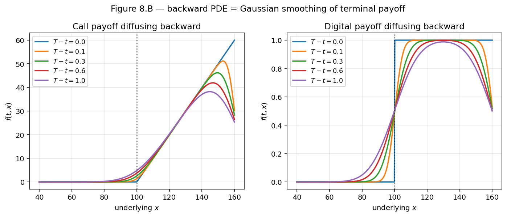
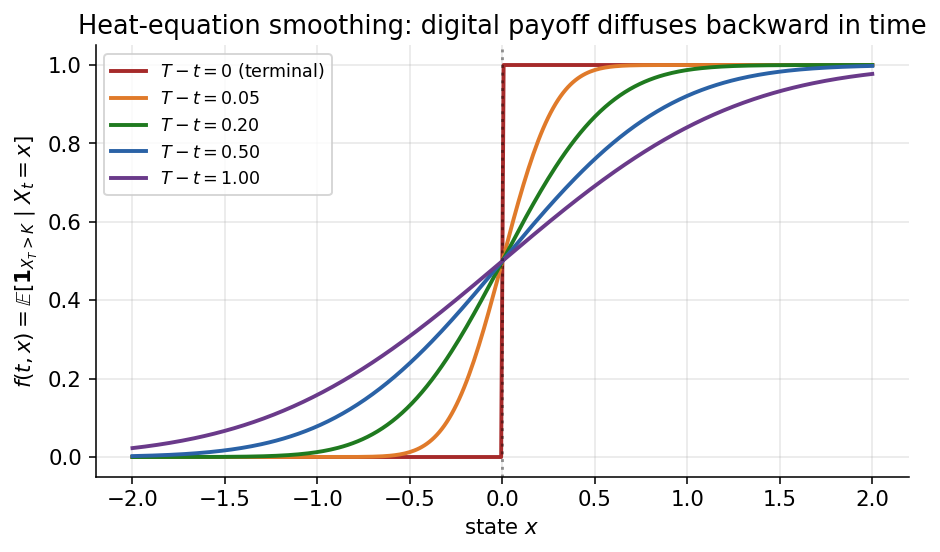
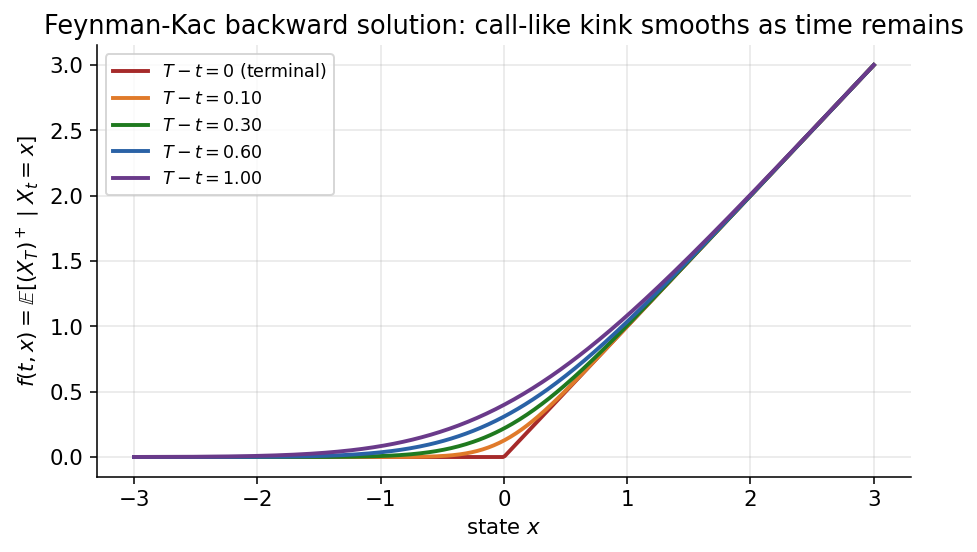
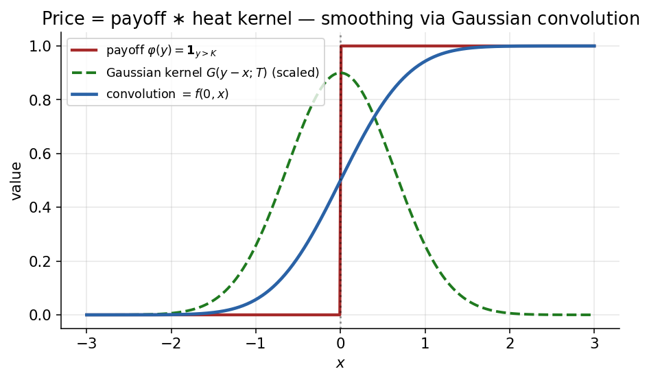
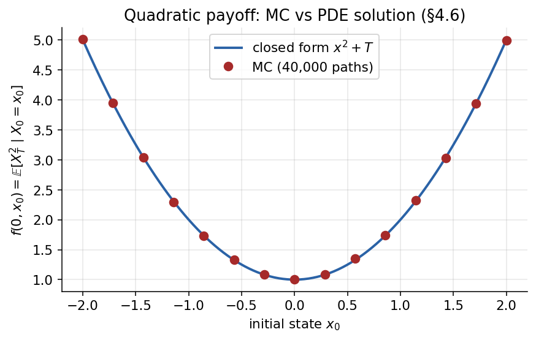
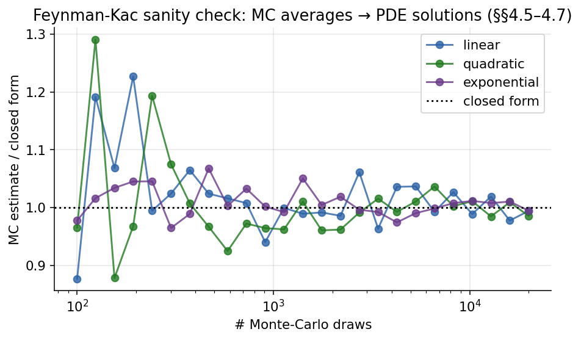
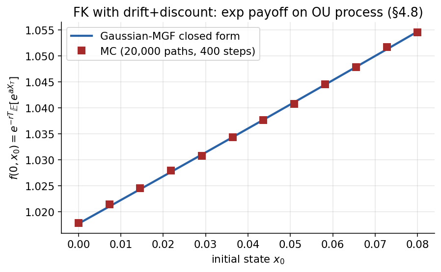

# Chapter 4 — Feynman-Kac and the SDE-PDE Bridge

Chapter 3 built the stochastic-calculus toolkit — Brownian motion, Itô integrals, Itô's lemma in its three forms — and closed with a small catalogue of SDEs we can now solve. This chapter uses that toolkit for its first major payoff: the *Feynman-Kac* theorem, the bidirectional bridge that identifies a linear parabolic PDE with the conditional expectation of a diffusion-driven payoff. Once that bridge is in place, every pricing problem we meet — Black-Scholes in Chapter 6, Vasicek bond prices in Chapter 12, caplets in Chapter 15 — is a single substitution into the same template.

The ambition of this chapter is limited on purpose. We will not derive Black-Scholes yet (that happens twice in Chapter 6: once via the hedging argument and once as a Feynman-Kac corollary). We will not introduce measure changes (Chapter 5). What we *will* do is establish the PDE ⇔ expectation duality in three progressively general forms — zero-drift Brownian motion, constant-coefficient drifted BM with discounting, and finally state-and-time-dependent coefficients — and we will compute three worked examples by hand so the reader sees the machinery turn.

## 4.1 Motivation — Why an SDE-PDE Bridge Matters

Every pricing question in this guide eventually reduces to one of two computations:

1. Solve a backward parabolic PDE on a space-time grid.
2. Average a random payoff over sample paths of a diffusion.

These two procedures look entirely different. The first is a deterministic calculation on a mesh, implemented in finite-difference or finite-element code. The second is a probabilistic calculation on simulated trajectories, implemented as Monte Carlo. They appear to require different numerical libraries, different error analyses, different parallelisation strategies, and different testing regimes.

Feynman-Kac says they are the same calculation. Given a linear parabolic PDE with terminal data, one can always write the solution as a conditional expectation over the paths of an associated diffusion. Conversely, given a conditional expectation of a smooth function of a diffusion's terminal state, the expectation solves a specific PDE. The reader gets to pick the weapon: whichever side of the bridge is easier for the problem at hand.

The *why it matters* is entirely practical. Low-dimensional problems with smooth coefficients — a European vanilla on a single asset, a caplet on a single forward rate — are almost always faster to price via PDE: a Crank-Nicolson grid with a few hundred nodes converges in milliseconds. High-dimensional problems — basket options on $N > 3$ underliers, path-dependent exotics with many state variables, multi-factor rate models — are almost always faster via Monte Carlo, whose error scales as $1/\sqrt{N_{\text{paths}}}$ independently of state dimension. American-style features (early exercise) favour PDEs because the exercise boundary embeds directly into the grid. Path-dependent features (barriers, Asians, lookbacks) favour Monte Carlo because they require tracking a path functional. Feynman-Kac is what guarantees that whichever route one chooses, the answer is the same.

There is a deeper reason the bridge is worth spending a chapter on. Every *pricing PDE* that appears in mathematical finance — Black-Scholes, Vasicek's bond-price equation, Hull-White's calibrated equation, Heston's two-factor equation, the short-rate equations of Chapter 12, the caplet equations of Chapter 15 — is a Feynman-Kac PDE for some SDE and some discount rate. Mastering the bridge in full generality (state-and-time-dependent coefficients, state-dependent discount) gives the reader a single theorem that, properly instantiated, handles *every* linear pricing problem in the guide. The instantiations differ only in what you plug in for $a(t,x)$, $b(t,x)$, $c(t,x)$, and $\varphi(x)$.

The chapter closes with a brief preview: in Chapter 6 we will apply the state-dependent Feynman-Kac theorem to geometric Brownian motion and recover the Black-Scholes PDE and the risk-neutral pricing formula in one line each. That is the end-state. This chapter lays the general theorem; Chapter 6 collects the dividend.

---

## 4.2 The Zero-Drift Feynman-Kac Theorem

We begin with the simplest possible instance of the theorem — a driftless, undiscounted Brownian motion with a terminal payoff. Every later version is a decoration of this base case, so it is worth pinning down the geometry before adding coefficients.

Let $X = (X_t)_{t \ge 0}$ denote a standard Brownian motion (as constructed in Chapter 3), and fix a horizon $T > 0$ and a payoff $\varphi : \mathbb{R} \to \mathbb{R}$ satisfying mild integrability (polynomial growth is more than enough for every concrete payoff in this guide). Consider the backward Cauchy problem

$$
\begin{cases}
\partial_t f(t, x) \;+\; \tfrac{1}{2}\,\partial_{xx} f(t, x) \;=\; 0, & (t, x) \in [0, T) \times \mathbb{R}, \\[2pt]
f(T, x) \;=\; \varphi(x).
\end{cases}
\tag{4.1}
$$

Feynman-Kac asserts that this PDE is *equivalent* to the probabilistic representation

$$
\boxed{\;f(t, x) \;=\; \mathbb{E}_{t, x}\!\left[\,\varphi(X_T)\,\right] \;\equiv\; \mathbb{E}\!\left[\,\varphi(X_T)\,\big|\,X_t = x\,\right].\;}
\tag{4.2}
$$

The biconditional carries both directions. **PDE $\Rightarrow$ expectation:** a classical solution of $(4.1)$ admits the expectation representation $(4.2)$. **Expectation $\Rightarrow$ PDE:** conversely, the function $x \mapsto \mathbb{E}_{t,x}[\varphi(X_T)]$ automatically satisfies $(4.1)$. In practice one direction or the other is the easier computation, and Feynman-Kac lets us freely pick.

### 4.2.1 What the PDE is

The PDE on the left of $(4.1)$ is the (reverse) heat equation. The forward heat equation $\partial_t u = \tfrac12 \partial_{xx} u$ describes the diffusion of heat through a conducting medium with thermal diffusivity $\tfrac12$; reversing the arrow of time (replacing $t$ with $T-t$) gives $\partial_t f + \tfrac12 \partial_{xx} f = 0$, which is the Kolmogorov backward equation for Brownian motion. The payoff $\varphi$ at expiry plays the role of an initial heat distribution, and the PDE smooths it backward in time from $T$ down to $t$. Option prices are literally temperature distributions evolving under a thermal-diffusion physics, with the terminal payoff as initial temperature profile and "conductivity" equal to $\tfrac12$ (the Brownian diffusion rate). The heat-equation picture is more than metaphor: every qualitative feature of diffusion — smoothing of discontinuities, infinite propagation speed, exponential decay of modes — translates directly into a feature of option prices, and we will use this repeatedly.

*As $t$ moves backward from $T$ toward $0$, the terminal payoff $\varphi$ diffuses and smooths: kinks (vanilla calls) round off, step functions (digitals) bloom into Gaussian-shaped bumps. Every option price is literally a smoothed payoff, where the smoothing kernel is a Gaussian of width $\sqrt{T-t}$.*

*Concrete instance of $(4.2)$ with $\varphi(x) = \mathbf{1}_{\{x > 0\}}$: the terminal step function (red) smooths into $\Phi((x - K)/\sqrt{T-t})$ as time runs backward, interpolating between a sharp jump at expiry and a near-flat curve at long look-ahead.*

*The same smoothing pattern on a piecewise-linear payoff $\varphi(x)=(x)^+$. At expiry (red) the kink is sharp; rolling time back toward $t=0$ smooths the kink into an analytic curve whose width grows like $\sqrt{T-t}$. This is the spatial shape every European call price inherits once log-space coordinates are in place.*

*The biconditional $(4.1)$–$(4.2)$ in the simplest possible setting: today's price $f(0,x)$ equals the payoff $\varphi$ convolved with a Gaussian heat kernel of width $\sqrt{T}$. Every Feynman-Kac price is literally a Gaussian-smoothed payoff.*

### 4.2.2 What the expectation is

The right-hand side of $(4.2)$ is the conditional-expectation scoreboard: at time $t$, given that the current state is $X_t = x$, average the payoff $\varphi(X_T)$ over every Brownian trajectory that starts at $(t, x)$ and wanders until $T$. Because Brownian motion is Markov — it forgets its pre-$t$ history — the expectation only depends on the pair $(t, x)$, never on the path that brought us to $x$. That Markov collapse is why $f$ is a function of two real variables rather than a functional on the full path space.

Two readings of the biconditional are used constantly in practice:

- **PDE $\to$ expectation.** Hard PDE computations can be replaced with Monte-Carlo averages: simulate $N$ Brownian paths from $x$ starting at time $t$, evaluate $\varphi(X_T)$ on each, and take the sample mean. The error scales as $1/\sqrt{N}$ independently of state dimension. This is the foundation of Monte-Carlo pricing.
- **Expectation $\to$ PDE.** Potentially infinite-dimensional averages over paths can be replaced by finite-dimensional PDE solves on a small grid. Finite-difference methods (implicit Euler, Crank-Nicolson) exploit exactly this direction. The PDE lives on a two-dimensional $(t, x)$ mesh; the path space is infinite-dimensional. Trading path dimension for grid dimension is often a good deal in low-dimensional problems.

Which direction to pick is problem-driven. High-dimensional state spaces (basket options on many underliers, multi-factor rate models) favour Monte Carlo because a PDE mesh becomes curse-of-dimensionality slow as soon as the state dimension exceeds about three. Low-dimensional problems with American features favour PDEs because one can embed the exercise boundary directly into the grid. Feynman-Kac is what guarantees the answer is the same either way.

### 4.2.3 Path-integral intuition — why the equivalence is not magic

Before proving the theorem it is worth seeing, at a hand-waving level, why the two sides of $(4.1)$–$(4.2)$ *must* agree. Two observations are responsible.

First, the *Markov property*. Brownian motion forgets its history, so the scoreboard $f(t, x) = \mathbb{E}[\varphi(X_T) | X_t = x]$ depends only on $(t, x)$, not on whatever happened before time $t$. That is why $f$ is an ordinary function of two variables and not some path-functional.

Second, the *local dynamics*. Over an infinitesimal time-step $\mathrm{d}t$, the state changes by $\mathrm{d}X = \mathrm{d}W \sim \mathcal{N}(0, \mathrm{d}t)$. The scoreboard must obey the tower identity

$$
f(t, x) \;=\; \mathbb{E}\!\left[\,f(t + \mathrm{d}t, \, x + \mathrm{d}W)\,\right],
\tag{4.3}
$$

because the expected value of the next-instant scoreboard, averaged over the single-step increment $\mathrm{d}W$, must reproduce the current scoreboard (otherwise the "average of future payoffs" description would be internally inconsistent). Taylor-expand the right-hand side of $(4.3)$:

$$
f(t + \mathrm{d}t, x + \mathrm{d}W) \;=\; f(t, x) \;+\; \partial_t f\,\mathrm{d}t \;+\; \partial_x f\,\mathrm{d}W \;+\; \tfrac12\,\partial_{xx} f\,(\mathrm{d}W)^2 \;+\; \cdots
$$

Take expectations, using $\mathbb{E}[\mathrm{d}W] = 0$ and the Itô shorthand $(\mathrm{d}W)^2 = \mathrm{d}t$ from Chapter 3:

$$
\mathbb{E}[f(t + \mathrm{d}t, x + \mathrm{d}W)] \;=\; f(t, x) \;+\; \left(\partial_t f + \tfrac12 \partial_{xx} f\right)\mathrm{d}t.
$$

Subtracting $f(t, x)$ from both sides of $(4.3)$ and dividing by $\mathrm{d}t$ leaves

$$
0 \;=\; \partial_t f + \tfrac12 \partial_{xx} f,
$$

which is precisely the PDE $(4.1)$. The terminal condition $f(T, x) = \varphi(x)$ is automatic: at expiry the scoreboard has no time left to average, so it must read the payoff directly.

So the PDE is nothing but the *local self-consistency* of the averaging scoreboard, and Feynman-Kac is the *global integrated form* of that local condition. The next section turns this sketch into a proof using martingale language.

---

## 4.3 A Martingale Derivation of the Backward PDE

The Taylor-expansion sketch of §4.2.3 is essentially correct but cuts two corners. First, it quietly assumes $f$ is smooth enough to Taylor-expand. Second, it treats $(\mathrm{d}W)^2 = \mathrm{d}t$ as a symbolic identity rather than as a consequence of quadratic variation. This section gives the clean derivation: the scoreboard is a *martingale* by the tower property of conditional expectations, and Itô's lemma applied to a martingale forces the drift to vanish — which is the PDE.

The payoff of this slower proof is a reusable *template*. Every pricing PDE in this guide will be derived by the same three moves: (i) write the candidate price as a conditional expectation of a terminal payoff; (ii) apply Itô's lemma to the candidate to decompose its increment into drift plus martingale; (iii) demand that the drift vanish, which gives the PDE. Learn the template once here; reuse it in Chapter 6 (Black-Scholes), Chapter 12 (Vasicek bond), Chapter 15 (caplets), and anywhere else a linear parabolic PDE is needed.

### 4.3.1 Setup and the candidate

Fix a horizon $T$ and a payoff $\varphi : \mathbb{R} \to \mathbb{R}$ with polynomial growth. Let $X_t$ be a standard Brownian motion. Define the candidate pricing function

$$
f(t, x) \;\equiv\; \mathbb{E}\!\left[\,\varphi(X_T)\,\big|\,X_t = x\,\right] \;=\; \mathbb{E}_{t,x}[\varphi(X_T)].
\tag{4.4}
$$

The question the proof will answer is: *what PDE does $f$ satisfy as a function of $(t, x)$?* The answer is $(\partial_t + \tfrac12 \partial_{xx})f = 0$ with terminal data $f(T, x) = \varphi(x)$, but this is not a definitional statement — it is a theorem derivable from (a) iterated expectation and (b) Itô's lemma applied to $f(t, X_t)$.

Picture the scoreboard. Imagine a grid of sample paths $X_t$ fanning out from a fixed starting point $(t, x)$ on the left, reaching an irregular cloud of terminal values $X_T$ on the right at time $T$. The payoff $\varphi(\cdot)$ assigns a number to each terminal value; averaging those numbers over the path cloud gives $f(t, x)$. Now slide a vertical slice forward to an intermediate time $s \in (t, T)$. On that slice, paths have evolved to random values $X_s$, and from each $X_s$ a new fan of continuations reaches $X_T$ at maturity. The *local* average $\mathbb{E}[\varphi(X_T) | X_s]$ at each $X_s$ is itself a random variable — a function of $X_s$ via the Markov property — and taking the *outer* average of those local averages back to $(t, x)$ must reproduce the original global average. That is the tower law, and it is the engine of the martingale argument.

### 4.3.2 The auxiliary process $\eta_s = f(s, X_s)$

Define a stochastic process indexed by the intermediate time $s \in [t, T]$:

$$
\eta_s \;\equiv\; f(s, X_s) \;=\; \mathbb{E}\!\left[\,\varphi(X_T)\,\big|\,X_s\,\right].
\tag{4.5}
$$

Geometrically, $\eta_s$ is "the best current guess of $\varphi(X_T)$ given everything known up to time $s$." Because $X$ is Markov, conditioning on the full filtration $\mathcal{F}_s$ of the Brownian motion collapses to conditioning on the single random variable $X_s$:

$$
\mathbb{E}\!\left[\varphi(X_T) \,\big|\, \mathcal{F}_s\right] \;=\; \mathbb{E}\!\left[\varphi(X_T) \,\big|\, X_s\right] \;=\; f(s, X_s) \;=\; \eta_s.
\tag{4.6}
$$

The first equality is the Markov property of Brownian motion (independent increments collapse the filtration dependence to the current state); the second is the definition of $f$; the third is notation. This three-step unwinding is worth memorising because it reappears in every measure-change, numeraire-swap, and forward-measure derivation in later chapters.

### 4.3.3 Tower law $\Rightarrow$ $\eta$ is a martingale

Claim. The process $s \mapsto \eta_s$ is a martingale in $s$ under the natural filtration $\{\mathcal{F}_s\}$ of $X$. Concretely, for any $t \le s_1 \le s_2 \le T$,

$$
\mathbb{E}\!\left[\eta_{s_2} \,\big|\, \mathcal{F}_{s_1}\right] \;=\; \eta_{s_1}.
\tag{4.7}
$$

*Proof.* Plug in the definition:

$$
\mathbb{E}[\eta_{s_2} | \mathcal{F}_{s_1}] \;=\; \mathbb{E}\!\left[\,\mathbb{E}[\varphi(X_T) | \mathcal{F}_{s_2}]\,\big|\,\mathcal{F}_{s_1}\right].
$$

The outer expectation is over information up to $s_1$; the inner expectation is over information up to $s_2 \ge s_1$. Apply the tower property of conditional expectations — $\mathbb{E}[\mathbb{E}[A | \mathcal{G}] | \mathcal{H}] = \mathbb{E}[A | \mathcal{H}]$ whenever $\mathcal{H} \subseteq \mathcal{G}$ — with $\mathcal{H} = \mathcal{F}_{s_1}$ and $\mathcal{G} = \mathcal{F}_{s_2}$ (the latter is indeed finer because more time has passed):

$$
\mathbb{E}\!\left[\,\mathbb{E}[\varphi(X_T) | \mathcal{F}_{s_2}]\,\big|\,\mathcal{F}_{s_1}\right] \;=\; \mathbb{E}[\varphi(X_T) | \mathcal{F}_{s_1}] \;=\; \eta_{s_1}.
$$

Therefore $\eta_{s_1} = \mathbb{E}[\eta_{s_2} | \mathcal{F}_{s_1}]$, the martingale property. $\square$

The argument uses only nesting of filtrations plus iterated expectation — no PDE, no Itô's lemma, no specifics of Brownian motion. *Any* process of the form "conditional expectation of a fixed $\mathcal{F}_T$-measurable random variable" is a martingale. These are called *Doob martingales* or *closed martingales*, and they are the universal way to manufacture a martingale from a given payoff. The payoff $\varphi(X_T)$ is the "closing" random variable; $\eta_s$ is the stream of running conditional expectations.

A gambler's intuition. A gambler's running wealth under fair odds is a martingale because the expected next-period wealth equals the current wealth. The scoreboard $\eta_s$ generalises that: the best estimate of a future payoff, given the information so far, is itself a fair-game process. Any new information that moves $\eta_s$ must do so symmetrically up and down — otherwise the new information would be predictable from the old, contradicting that we already conditioned on everything known. This is the probabilistic content of the slogan "rational pricing is a martingale under the pricing measure."

### 4.3.4 Itô's lemma on $\eta_s = f(s, X_s)$

Having established that $\eta_s$ is a martingale, we now apply Itô's lemma to read off what PDE $f$ must satisfy. Assume $f \in C^{1,2}([0,T) \times \mathbb{R})$ — continuously differentiable in $t$ once, in $x$ twice. This is an a-posteriori regularity result for Feynman-Kac solutions with smooth enough payoffs, and we take it for granted here. Apply Itô's lemma II from Chapter 3 with $X_s = W_s$:

$$
\mathrm{d}\eta_s \;=\; \partial_t f(s, X_s)\,\mathrm{d}s \;+\; \partial_x f(s, X_s)\,\mathrm{d}X_s \;+\; \tfrac12\,\partial_{xx} f(s, X_s)\,(\mathrm{d}X_s)^2.
\tag{4.8}
$$

Using the Itô shorthand $(\mathrm{d}X_s)^2 = \mathrm{d}s$ and grouping the $\mathrm{d}s$ and $\mathrm{d}X_s$ terms,

$$
\mathrm{d}\eta_s \;=\; \underbrace{\left[\,\partial_t f + \tfrac12\,\partial_{xx} f\,\right]}_{\text{drift}}\mathrm{d}s \;+\; \underbrace{\partial_x f}_{\text{diffusion}}\,\mathrm{d}X_s,
\tag{4.9}
$$

with both partial derivatives evaluated at $(s, X_s)$.

### 4.3.5 Drift-killing identity

The diffusion term $\partial_x f\,\mathrm{d}X_s$ integrated against $\mathrm{d}W$ is a pure stochastic integral, hence a martingale by the construction of the Itô integral in Chapter 3. So the difference between $\eta_s$ and the martingale $\int \partial_x f\,\mathrm{d}X$ is the deterministic drift term $\int[\partial_t f + \tfrac12 \partial_{xx} f]\,\mathrm{d}s$. But we proved in §4.3.3 that $\eta_s$ is already a martingale. Subtracting a martingale from a martingale leaves a martingale, so the drift term $\int[\partial_t f + \tfrac12 \partial_{xx} f]\,\mathrm{d}s$ is itself a martingale.

Now the key fact: this drift is a process of *bounded variation* (it is an ordinary Riemann integral in $s$), and the only continuous martingale of finite variation is the zero process. (This is a standard decomposition result: a continuous martingale with paths of finite variation must be almost-surely constant; combining "constant" with "starts at zero" gives "identically zero.") Therefore the drift vanishes:

$$
\int_t^s\!\left[\partial_t f(u, X_u) + \tfrac12\partial_{xx}f(u, X_u)\right]\mathrm{d}u \;\equiv\; 0 \quad \text{for every } s \in [t, T].
$$

Because this holds for every path (including paths visiting every real number at arbitrarily chosen times) and the integrand is continuous, the integrand must vanish pointwise:

$$
\boxed{\;\partial_t f(t, x) + \tfrac12\,\partial_{xx} f(t, x) \;=\; 0\;} \qquad \text{for all } (t, x) \in [0, T) \times \mathbb{R}.
\tag{4.10}
$$

This is the Kolmogorov backward equation, and we have just derived it from the martingale property of the Doob-closed process $\eta$. $\square$

### 4.3.6 Micro-local version (telescoping)

For readers who prefer a faster, differential-style argument: take $s = t + \Delta t$ with $\Delta t$ small. The martingale condition gives $\eta_t = \mathbb{E}[\eta_{t + \Delta t} | \mathcal{F}_t]$, i.e.

$$
0 \;=\; \mathbb{E}\!\left[\,\eta_{t + \Delta t} - \eta_t \,\big|\, \mathcal{F}_t\right] \;=\; \mathbb{E}\!\left[\,\mathrm{d}\eta_t \,\big|\, \mathcal{F}_t\right].
\tag{4.11}
$$

Substituting $(4.9)$ and using $\mathbb{E}[\mathrm{d}X_t | \mathcal{F}_t] = 0$ (the stochastic-integral piece is a martingale increment),

$$
0 \;=\; \mathbb{E}\!\left[\,(\partial_t f + \tfrac12 \partial_{xx} f)\,\mathrm{d}t \;+\; \partial_x f\,\mathrm{d}X_t\,\big|\,\mathcal{F}_t\right] \;=\; (\partial_t f + \tfrac12 \partial_{xx} f)\,\mathrm{d}t.
$$

Dividing by $\mathrm{d}t$ and taking $\Delta t \downarrow 0$ gives $\partial_t f + \tfrac12 \partial_{xx} f = 0$, the same PDE $(4.10)$. The first derivation is more rigorous (it handles the full time interval); the second is faster in practice. Either yields the same result.

### 4.3.7 Two lessons from the derivation

*First*, every pricing PDE in this guide is secretly the identity *"drift-kill the Itô decomposition of a conditional-expectation process."* Once one learns to recognise that pattern, every PDE in the book — Black-Scholes (Chapter 6), short-rate PDEs (Chapter 12), caplet PDEs (Chapter 15) — is derivable in four lines: write the expectation, apply Itô, set the drift to zero, add boundary conditions. The PDE is a *consequence* of the martingale structure, not an independent postulate.

*Second*, the PDE-to-expectation direction and the expectation-to-PDE direction of Feynman-Kac are *dual*: each implies the other. The full theorem is really a pair of results that share the same PDE. Computationally, the choice of which direction to use is problem-dependent — Monte Carlo prefers expectation, finite-difference grids prefer PDE — but the theoretical content is symmetric.

---

## 4.4 Boundary Condition and Summary of the Zero-Drift Case

The derivation of §4.3 produced the PDE $(4.10)$ from the martingale property of $\eta$, but we still need to verify the terminal condition $f(T, x) = \varphi(x)$. That is immediate from the definition of $f$: at $s = T$ the conditioning has frozen the Brownian motion at its terminal value, so

$$
\eta_T \;=\; \mathbb{E}[\varphi(X_T) | X_T] \;=\; \varphi(X_T),
$$

and evaluating at $X_T = x$ gives $f(T, x) = \varphi(x)$. The boundary data is *built into* the probabilistic construction — one of the attractive features of the expectation approach. In a PDE-only view one must *impose* the terminal data by hand; in the expectation view it falls out as a tautology.

### 4.4.1 What the zero-drift theorem says

Putting the pieces of §§4.2–4.3 together:

> **Zero-drift Feynman-Kac.** Let $X$ be a standard Brownian motion and let $\varphi : \mathbb{R} \to \mathbb{R}$ have polynomial growth. The function $f(t, x) = \mathbb{E}_{t, x}[\varphi(X_T)]$ is the (unique classical) solution of the backward heat equation $\partial_t f + \tfrac12 \partial_{xx} f = 0$ on $[0, T) \times \mathbb{R}$ with terminal data $f(T, \cdot) = \varphi(\cdot)$.

The three ingredients of the proof — Markov collapse, Doob-martingale of expectations, drift-kill via Itô — will *all* reappear in every subsequent generalisation. The only thing that changes is what one drops into the Itô decomposition.

### 4.4.2 A remark on regularity

The derivation of §4.3 assumed $f \in C^{1,2}$, i.e. continuously differentiable once in time and twice in space. For Brownian motion with a smooth payoff (e.g. $\varphi \in C^2$ with controlled growth), standard PDE theory guarantees the Feynman-Kac solution is smooth on the open domain $[0, T) \times \mathbb{R}$ — continuity up to $t = T$ requires $\varphi$ to be continuous, but the interior regularity is automatic.

For *discontinuous* payoffs — a digital option $\varphi(x) = \mathbf{1}\{x > K\}$ or a barrier payoff involving an indicator — the classical theorem does not directly apply because the terminal data is not continuous. Two standard work-arounds cover every case in practice: (i) approximate the discontinuous payoff by a sequence of smooth payoffs $\varphi_n \to \varphi$ and pass to the limit in the solution (this preserves the expectation representation because integration against the Gaussian kernel regularises the discontinuity); or (ii) use viscosity-solution theory, which extends Feynman-Kac to a much wider class of payoffs at the cost of replacing "classical derivative" with a weak notion. Working traders rarely need viscosity solutions because approximation by smooth payoffs handles every concrete case. The reader should keep in mind that the $C^{1,2}$ assumption is not strictly necessary but simplifies the presentation.

### 4.4.3 Why linearity matters

Observe that the PDE $(4.1)$ is *linear* in $f$: if $f_1$ and $f_2$ solve the PDE with terminal data $\varphi_1$ and $\varphi_2$ respectively, then $\alpha f_1 + \beta f_2$ solves it with terminal data $\alpha \varphi_1 + \beta \varphi_2$. On the expectation side this reads $\mathbb{E}[\alpha \varphi_1(X_T) + \beta \varphi_2(X_T)] = \alpha \mathbb{E}[\varphi_1(X_T)] + \beta \mathbb{E}[\varphi_2(X_T)]$, the linearity of expectation. The two linearities agree, as they must.

Linearity is why we can decompose an arbitrary payoff into a linear combination of simpler payoffs and price each piece separately. This is the basis of the *Carr-Madan replication* trick — any European payoff with sufficient regularity can be written as an integral of vanillas against a continuous distribution of strikes — and is used heavily in variance-swap and volatility-derivative pricing. In the present chapter we use linearity more modestly: the worked examples in §§4.5–4.7 will cover three basis payoffs (linear $x$, quadratic $x^2$, exponential $e^{ax}$) from which more complex payoffs can be assembled by superposition.

---

## 4.5 Example 1 — Linear Payoff $\varphi(x) = x$

The simplest possible test case. A linear payoff exercises none of the non-trivial machinery of stochastic calculus — the answer is what one would guess — but it serves as a base-line sanity check. If the Feynman-Kac machinery did *not* return $x$ for this payoff, something would be wrong with the setup.

Consider the Cauchy problem

$$
\begin{cases}
\partial_t f + \tfrac12 \partial_{xx} f \;=\; 0, \\
f(T, x) \;=\; x.
\end{cases}
\tag{4.12}
$$

By Feynman-Kac $(4.2)$,

$$
f(t, x) \;=\; \mathbb{E}_{t, x}[X_T],
$$

where $X$ is a standard Brownian motion. Brownian increments are Gaussian,

$$
X_T - X_t \;\sim\; \mathcal{N}(0, T - t), \qquad \text{so} \qquad X_T \stackrel{d}{=} x + \sqrt{T - t}\,Z, \quad Z \sim \mathcal{N}(0, 1).
$$

Therefore

$$
f(t, x) \;=\; \mathbb{E}_{t, x}\!\left[\,x + \sqrt{T - t}\,Z\,\right] \;=\; x \;+\; \sqrt{T - t}\cdot\mathbb{E}[Z] \;=\; x.
\tag{4.13}
$$

**PDE verification.** With $f(t, x) = x$, $\partial_t f = 0$, $\partial_x f = 1$, $\partial_{xx} f = 0$, so $\partial_t f + \tfrac12 \partial_{xx} f = 0$. Terminal condition $f(T, x) = x$ holds by inspection. Both branches agree.

### 4.5.1 Why this answer is natural

A linear payoff has zero *convexity*, so Jensen's inequality is an equality and the expectation coincides with the initial state. Whenever $\varphi$ is affine, $\mathbb{E}_{t, x}[\varphi(X_T)] = \varphi(x)$. This will fail as soon as we move to $x^2$ (convex) or $e^{-x}$ (log-convex) in the next two examples — but convexity first has to be introduced.

A trader's-eye reading. If "linear payoff $\varphi(x) = x$" represents a forward contract on an asset whose price follows driftless Brownian motion, the forward value today must equal the current spot $x$ because there is no expected drift under the driftless pricing measure. (Adding a drift would introduce a forward premium, as we will see in §4.8.) Feynman-Kac delivers this in one line — the expected terminal value equals the current value, exactly as arbitrage considerations demand.

Second view: the backward heat equation applied to a linear function is trivially satisfied because linear functions have zero curvature. The Itô correction *does nothing* for straight-line payoffs. As soon as the payoff bends — calls, puts, digitals — curvature reappears and the correction starts influencing the answer. That is precisely why options have nonzero *convexity premium* relative to forwards of the same underlying, and why vanilla options are more interesting to price than forward contracts.

---

## 4.6 Example 2 — Quadratic Payoff $\varphi(x) = x^2$

The first non-trivial example, and the one where convexity starts to matter. The quadratic payoff is also the simplest test case for variance-swap-style replication arguments, because the squared terminal value is the canonical "variance" functional.

Solve

$$
\begin{cases}
\partial_t f + \tfrac12 \partial_{xx} f \;=\; 0, \\
f(T, x) \;=\; x^2.
\end{cases}
\tag{4.14}
$$

Feynman-Kac gives

$$
f(t, x) \;=\; \mathbb{E}_{t, x}[X_T^2] \;=\; \mathbb{E}_{t, x}\!\left[\,\big((X_T - X_t) + X_t\big)^2\,\right],
$$

with $X_T - X_t \sim \mathcal{N}(0, T - t)$ and $X_t = x$ under $\mathbb{E}_{t, x}$. Expanding the square and taking expectations term by term:

$$
f(t, x) \;=\; \mathbb{E}_{t, x}\!\left[\,(X_T - X_t)^2 + 2 X_t (X_T - X_t) + X_t^2\,\right] \;=\; (T - t) \;+\; 0 \;+\; x^2,
$$

where the three contributions come from $\mathbb{E}[(X_T - X_t)^2] = \mathrm{Var}(X_T - X_t) = T - t$, $\mathbb{E}[(X_T - X_t)] = 0$, and $\mathbb{E}[X_t^2 | X_t = x] = x^2$. Hence

$$
\boxed{\;f(t, x) \;=\; x^2 + (T - t)\;}.
\tag{4.15}
$$

**PDE verification.** With $f(t, x) = x^2 + (T - t)$, $\partial_t f = -1$, $\partial_{xx} f = 2$, so $\partial_t f + \tfrac12 \partial_{xx} f = -1 + 1 = 0$. At $t = T$: $f(T, x) = x^2 + 0 = x^2$. Both the PDE and the terminal condition are satisfied.

### 4.6.1 Convexity reading

The extra $(T - t)$ in $(4.15)$ is the *time-value of convexity*. A convex payoff rewards variance, and Brownian increments supply exactly $\mathrm{Var}(X_T | X_t = x) = T - t$ worth of variance. This is the simplest incarnation of *vega/volga premium* in option pricing. The result is consistent with the direct stochastic-integral calculation

$$
X_T^2 \;=\; X_t^2 \;+\; 2\!\int_t^T X_s\,\mathrm{d}X_s \;+\; (T - t),
$$

which is Itô's lemma applied to $F(x) = x^2$ shifted by $X_t$. Taking expectations makes the middle (martingale) term vanish and recovers $(4.15)$.

### 4.6.2 Variance-swap interpretation

The payoff $X_T^2$ is (up to a constant) the variance-swap payoff — it pays the final squared value of the state. If $X$ starts at $x$, the expected squared final value equals the starting squared value plus the remaining variance $T - t$. The longer the remaining tenor, the more variance accumulates, and the higher the expected squared terminal value. This is the "time-value of variance," the direct analogue of the time-value of an option's convexity.

The formula $f(t, x) = x^2 + (T - t)$ is also the fair value of a specific swap: if one enters a variance swap at time $t$ with "strike" $x^2$ and holds to maturity, the expected payoff at maturity is $X_T^2$. In the driftless, no-discount setting the fair strike is $x^2 + (T - t)$ — the starting squared value plus the remaining variance. Every variance-swap dealer ultimately prices this identity; Feynman-Kac delivers the answer with two lines of Gaussian algebra.

*Sanity check of $(4.15)$: Monte-Carlo averages of $X_T^2$ at a grid of initial states $x_0$ (red dots) fall exactly on the PDE closed form $x_0^2 + T$ (blue curve). The $+T$ offset is the "time-value of variance" — the convexity premium that Brownian motion pays out for a quadratic payoff.*

---

## 4.7 Example 3 — Exponential Payoffs $\varphi(x) = e^{ax}$

Exponential payoffs are the log-space analogue of the log-normal pricing problems that dominate the rest of the guide. Because the log of a geometric-Brownian-motion asset is a drifted arithmetic Brownian motion, every result derived here with $X = W$ will translate into a stock-price result by the substitution $X = \ln S$. Many closed-form formulas in rates, credit, and equity pricing fall out of this single expectation once the drift and discounting extensions of §4.8 are in place.

### 4.7.1 Base case $\varphi(x) = e^{-x}$

Solve

$$
\begin{cases}
\partial_t f + \tfrac12 \partial_{xx} f \;=\; 0, \\
f(T, x) \;=\; e^{-x}.
\end{cases}
\tag{4.16}
$$

Feynman-Kac gives

$$
f(t, x) \;=\; \mathbb{E}_{t, x}[\,e^{-X_T}\,].
$$

Because $X_T | X_t = x$ is $\mathcal{N}(x, T - t)$, apply the Gaussian moment-generating function $\mathbb{E}[e^{\lambda Y}] = e^{\lambda \mu + \tfrac12 \lambda^2 \sigma^2}$ with $\lambda = -1$, $\mu = x$, $\sigma^2 = T - t$:

$$
\boxed{\;f(t, x) \;=\; e^{-x + \tfrac12 (T - t)}\;}.
\tag{4.17}
$$

**PDE verification.** With $f = e^{-x + \tfrac12(T - t)}$: $\partial_t f = -\tfrac12 f$, $\partial_x f = -f$, $\partial_{xx} f = f$. Then $\partial_t f + \tfrac12 \partial_{xx} f = -\tfrac12 f + \tfrac12 f = 0$. Terminal condition $f(T, x) = e^{-x}$ holds.

**Jensen bump.** Notice $f(t, x) = e^{-x} \cdot e^{\tfrac12 (T - t)}$ — the answer exceeds the payoff evaluated at the mean $e^{-x}$ by the factor $e^{\tfrac12(T - t)}$. This is the *convexity premium*. In the log variable this is exactly the $\tfrac12 \sigma^2 t$ Itô correction that will reappear in the Black-Scholes formula. Its sign follows from Jensen's inequality applied to the convex function $e^{-x}$: $\mathbb{E}[e^{-X_T}] \ge e^{-\mathbb{E}[X_T]} = e^{-x}$, with strict inequality whenever $X_T$ has nonzero variance.

### 4.7.2 General exponent $\varphi(x) = e^{ax}$

A one-parameter generalisation that shows the convexity bump scales as $a^2$, not $|a|$. Solve

$$
\begin{cases}
\partial_t f + \tfrac12 \partial_{xx} f \;=\; 0, \\
f(T, x) \;=\; e^{ax},
\end{cases} \qquad a \in \mathbb{R}.
\tag{4.18}
$$

By Feynman-Kac, using $X_T = x + (X_T - X_t)$ with $X_T - X_t \sim \mathcal{N}(0, T - t)$,

$$
f(t, x) \;=\; \mathbb{E}_{t, x}[\,e^{a X_T}\,] \;=\; e^{ax}\cdot \mathbb{E}[\,e^{a (X_T - X_t)}\,] \;=\; e^{ax}\cdot e^{\tfrac12 a^2 (T - t)},
$$

using the Gaussian MGF with $\lambda = a$, $\sigma^2 = T - t$. Compactly,

$$
\boxed{\;f(t, x) \;=\; \exp\!\left\{\,a\,x \;+\; \tfrac12\,a^2\,(T - t)\,\right\}\;}.
\tag{4.19}
$$

**PDE verification.** Let $\gamma = \tfrac12 a^2$. Then $f = e^{ax + \gamma(T - t)}$ gives $\partial_t f = -\gamma f$, $\partial_x f = a f$, $\partial_{xx} f = a^2 f$. Plugging into the PDE:

$$
\partial_t f + \tfrac12 \partial_{xx} f \;=\; -\gamma f + \tfrac12 a^2 f \;=\; -\tfrac12 a^2 f + \tfrac12 a^2 f \;=\; 0. \quad\checkmark
$$

Terminal: $f(T, x) = e^{ax + 0} = e^{ax}$.

### 4.7.3 Reading the result

Setting $a = 1$ gives $f(t, x) = e^{x + \tfrac12 (T - t)}$, the "up-exponential" mirror of $(4.17)$; setting $a = -1$ recovers $(4.17)$. The parameter $a$ controls both the exponential-growth rate of the payoff in $x$ and, via $a^2 / 2$, the convexity premium. Even the sign of $a$ does not affect the convexity bump — only $|a|$ matters, because the Gaussian MGF depends on $a^2$. This is the cleanest illustration that *convexity in Feynman-Kac is an even function of the exponent coefficient*.

**A link forward to Black-Scholes.** For a geometric Brownian motion $S_t = S_0\,e^{(\mu - \tfrac12 \sigma^2)t + \sigma W_t}$ with $W$ a Brownian motion, the $n$-th moment $\mathbb{E}[S_t^n]$ arises from applying $(4.19)$ with $X_t = \ln S_t$, $a = n$, and the appropriate drift correction. The resulting formula $\mathbb{E}[S_t^n] = S_0^n\,e^{n \mu t + \tfrac12 n(n - 1)\sigma^2 t}$ is the basis for variance-swap pricing ($n = 2$), volatility derivatives, and power-option closed forms — all of which are $a \in \{2, 3, \dots\}$ specialisations of the Gaussian MGF identity $(4.19)$. We will pick this thread up in Chapter 6.

*For each of the three worked payoffs (linear $x$, quadratic $x^2$, exponential $e^{ax}$ with $a=0.8$), Monte-Carlo averaging over $N$ Brownian endpoints $X_T \sim \mathcal{N}(x_0, T)$ converges at rate $1/\sqrt{N}$ to the Gaussian-MGF closed form from $(4.13)$–$(4.19)$. Feynman-Kac is a two-way street in code as well as in theory.*

### 4.7.4 A five-term ledger preview

The three worked examples so far have all used a driftless, undiscounted Brownian motion. In §4.8 we will generalise to drifted BM with a discount rate, and the exponential payoff $\varphi(x) = e^{-x}$ will pick up three new terms in the exponent: a drift shift, a discount drag, and an unchanged convexity bump. The resulting formula reads like a ledger where each effect appears on a separate line. It is worth internalising the base case $(4.17)$ now because the drifted version $(4.26)$ below is literally $(4.17)$ with three visible additions.

---

## 4.8 Feynman-Kac with Drift, Diffusion, and Discounting

Every worked example so far has used a driftless Brownian motion with unit diffusion and no discounting. Real pricing problems require three generalisations: the underlying may have a nonzero drift, its diffusion coefficient need not be one, and the payoff must be discounted back to the present. Feynman-Kac extends to each in a mechanical way, and in this section we do all three at once.

### 4.8.1 Statement

Let $a \in \mathbb{R}$, $b > 0$, and $c \in \mathbb{R}$ be constants. Consider the backward Cauchy problem with a lower-order term:

$$
\begin{cases}
\partial_t f(t, x) \;+\; a\,\partial_x f(t, x) \;+\; \tfrac12\,b^2\,\partial_{xx} f(t, x) \;=\; c\,f(t, x), \\[2pt]
f(T, x) \;=\; \varphi(x).
\end{cases}
\tag{4.20}
$$

The probabilistic representation of the solution is

$$
\boxed{\;f(t, x) \;=\; \mathbb{E}_{t, x}\!\left[\,e^{-c(T - t)}\,\varphi(X_T)\,\right],\;}
\tag{4.21}
$$

where $X = (X_s)_{s \ge 0}$ is a drifted Brownian motion solving

$$
\mathrm{d}X_s \;=\; a\,\mathrm{d}s \;+\; b\,\mathrm{d}W_s, \qquad W \text{ a standard BM},
\tag{4.22}
$$

i.e. $X_s = X_0 + a\,s + b\,W_s$ (arithmetic Brownian motion with drift $a$ and volatility $b$).

### 4.8.2 Proof sketch

Start from the expectation $f(t, x) = \mathbb{E}_{t, x}[e^{-c(T - t)}\varphi(X_T)]$ and apply Itô's lemma to the auxiliary process

$$
g_s \;\equiv\; e^{-c(s - t)}\,f(s, X_s), \qquad s \in [t, T].
$$

Compute $\mathrm{d}g_s$ using the product rule plus Itô's lemma III applied to $f(s, X_s)$:

$$
\mathrm{d}g_s \;=\; e^{-c(s - t)}\!\left\{-c\,f\,\mathrm{d}s \;+\; \left[\partial_t f + a\,\partial_x f + \tfrac12 b^2 \partial_{xx} f\right]\mathrm{d}s \;+\; b\,\partial_x f\,\mathrm{d}W_s\right\}.
\tag{4.23}
$$

For $g_s$ to be a martingale — which it must be, because $g_T = e^{-c(T - t)}\varphi(X_T)$ and conditional expectations of fixed random variables are martingales — the $\mathrm{d}s$ drift must vanish:

$$
-c\,f + \partial_t f + a\,\partial_x f + \tfrac12 b^2 \partial_{xx} f \;=\; 0,
$$

which is exactly the PDE $(4.20)$. Conversely, if $f$ satisfies the PDE, the drift of $g_s$ is identically zero; $g_s$ is therefore a martingale, and taking $\mathbb{E}_{t, x}$ of $g_t = f(t, x)$ and $g_T = e^{-c(T - t)}\varphi(X_T)$ yields the representation $(4.21)$.

The two-way proof is the essence of Feynman-Kac: the PDE *is* the drift-killing condition for $e^{-c(s - t)} f(s, X_s)$, and any function satisfying that PDE automatically represents an expectation.

### 4.8.3 Role of each coefficient

Each term in $(4.20)$ has a direct counterpart in $(4.21)$:

| PDE term | SDE / expectation counterpart |
|---|---|
| $a\,\partial_x f$ | drift of $X$: each path is pushed by $a\,\mathrm{d}s$ per step. |
| $\tfrac12 b^2\,\partial_{xx} f$ | diffusion of $X$: paths spread with variance $b^2\,\mathrm{d}s$ per step. |
| $-c\,f$ | exponential decay / discount factor $e^{-c(T - t)}$ applied to the payoff. |
| terminal $f(T, x) = \varphi(x)$ | the expectation at $s = T$ is literally $\varphi(X_T)$ with $X_T = x$. |

The dictionary reading of $(4.20) \Leftrightarrow (4.21)$: *"$a$ and $b$ pick the law of $X$; $c$ attaches a per-unit-time discount to every path."*

### 4.8.4 Why the discount sign flips

On the PDE side, the discount term sits as $-c f$ on the left (or equivalently $+c f$ on the right), because it represents "the present value grows at rate $c$ as we move *forward* in time and must be peeled back as we solve *backward*." On the expectation side, the discount appears as $e^{-c(T - t)}$ *inside* the expectation, because it represents "each path's terminal payoff is multiplied by the present-value discount factor."

The two are related by the PDE being a backward equation: integrating $\partial_t f = c f - (\text{diffusion terms})$ from $t$ back to $T$ attaches a factor $e^{-c(T - t)}$ to the terminal payoff, exactly as Feynman-Kac says. A common source of sign errors is to confuse the two conventions; keeping the bookkeeping consistent requires always writing the PDE with $-c f$ on the left and the expectation with $e^{-c(T - t)}$ inside, or vice versa with flipped signs.

### 4.8.5 Geometric reading: linearity and the parabolic class

The PDE $(4.20)$ is a *linear parabolic PDE* with coefficients that depend on $x$ and $t$ but not on $f$ itself. Linearity is essential: it means solutions superpose. If $\varphi_1$ and $\varphi_2$ are two terminal payoffs, then $\alpha f_1 + \beta f_2$ solves the PDE with terminal $\alpha \varphi_1 + \beta \varphi_2$. On the expectation side this corresponds to $\mathbb{E}[\alpha \varphi_1 + \beta \varphi_2] = \alpha \mathbb{E}[\varphi_1] + \beta \mathbb{E}[\varphi_2]$ — another form of the same statement.

The linearity is why we can decompose an arbitrary payoff into a basis (call spreads, digitals, exponentials) and price each piece separately. The Carr-Madan replication trick that underlies variance swaps and other volatility derivatives is one application; the moment-generating-function manipulations we use in the worked examples are another.

### 4.8.6 Worked case: exponential payoff with drift, diffusion, and discount

Solve $(4.20)$ with $\varphi(x) = e^{-x}$:

$$
\begin{cases}
\partial_t f + a\,\partial_x f + \tfrac12 b^2 \partial_{xx} f \;=\; c\,f, \\
f(T, x) \;=\; e^{-x}.
\end{cases}
\tag{4.24}
$$

By $(4.21)$,

$$
f(t, x) \;=\; \mathbb{E}_{t, x}\!\left[\,e^{-X_T}\,e^{-c(T - t)}\,\right].
$$

The increment of $X$ under the drifted BM $(4.22)$ is

$$
X_T - X_t \;=\; a(T - t) + b\,(W_T - W_t) \;\stackrel{d}{=}\; a(T - t) + b\sqrt{T - t}\,Z, \qquad Z \sim \mathcal{N}(0, 1),
$$

so $X_T | X_t = x$ is Gaussian with mean $x + a(T - t)$ and variance $b^2 (T - t)$. Substituting,

$$
f(t, x) \;=\; \mathbb{E}\!\left[\,\exp\!\left\{-x - a(T - t) - b\sqrt{T - t}\,Z - c(T - t)\right\}\,\right].
$$

Taking the Gaussian MGF of $-b\sqrt{T - t}\,Z$, which contributes $e^{\tfrac12 b^2 (T - t)}$:

$$
f(t, x) \;=\; \exp\!\left\{-x - a(T - t) + \tfrac12 b^2 (T - t) - c(T - t)\right\}.
$$

Collecting terms with common factor $(T - t)$:

$$
\boxed{\;f(t, x) \;=\; \exp\!\left\{\,-x \;-\; \left(a + c - \tfrac12 b^2\right)(T - t)\,\right\}\;}.
\tag{4.25}
$$

Equivalently, defining $\gamma = a + c - \tfrac12 b^2$ for shorthand,

$$
f(t, x) \;=\; e^{-x - \gamma(T - t)}.
\tag{4.26}
$$

### 4.8.7 Reading formula $(4.25)$ as a ledger

The exponent $-x - (a + c - \tfrac12 b^2)(T - t)$ has five distinguishable contributions, one per ingredient of the problem:

1. $-x$: the payoff $e^{-X_T}$ evaluated "on average" around the starting point.
2. $-a(T - t)$: drift of $X$ shifts the mean of $X_T$ by $+a(T - t)$, which in the payoff $e^{-X_T}$ becomes a factor $e^{-a(T - t)}$.
3. $+\tfrac12 b^2 (T - t)$: Jensen bump from $b$-scale Gaussian noise in $X_T$, exactly as in the base case $(4.17)$.
4. $-c(T - t)$: discount factor from the $c f$ term in the PDE.
5. The sign pattern "+" on the convexity term and "−" on the drift and discount is specific to the exponential-*decreasing* payoff $e^{-x}$. For $e^{+x}$ (exponential-increasing) the drift sign would flip, because the Gaussian MGF with $\lambda = +1$ gives $\lambda \mu = +a(T - t)$.

Each of these five contributions has a well-defined financial counterpart in real option pricing: drift is the risk-neutral cost-of-carry, discount is the time-value-of-money effect, convexity is the gamma/vega premium. The cleanness of the ledger is the payoff of having set up Feynman-Kac carefully: complicated models decompose into their individual effects rather than tangling them together.

**Sanity limits.** Setting $a = c = 0$, $b = 1$ recovers $(4.17)$. Setting $b = 0$ (pure deterministic drift) gives $f(t, x) = e^{-x - (a + c)(T - t)}$ — deterministic evolution of $X$ followed by deterministic discounting, no convexity. Setting $a = c = 0$ with general $b$ gives $f = e^{-x + \tfrac12 b^2 (T - t)}$, the $b$-scaled Jensen bump. Every qualitative feature — convexity bonus $\tfrac12 b^2 (T - t)$, discount drag $c(T - t)$, drift shift $a(T - t)$ — sits visibly in the exponent.

**Direct PDE check.** Differentiate $(4.26)$ and verify $(4.20)$. With $f = e^{-x - \gamma(T - t)}$ and $\gamma = a + c - \tfrac12 b^2$:

$$
\partial_t f = +\gamma f, \qquad \partial_x f = -f, \qquad \partial_{xx} f = f.
$$

Plugging into the PDE's left-minus-right:

$$
\partial_t f + a\,\partial_x f + \tfrac12 b^2 \partial_{xx} f - c f \;=\; \gamma f - a f + \tfrac12 b^2 f - c f \;=\; (\gamma - a + \tfrac12 b^2 - c)\,f.
$$

Substituting $\gamma = a + c - \tfrac12 b^2$:

$$
\gamma - a + \tfrac12 b^2 - c \;=\; (a + c - \tfrac12 b^2) - a + \tfrac12 b^2 - c \;=\; 0. \quad\checkmark
$$

All five terms cancel, confirming that $(4.25)$ solves $(4.20)$ with the right terminal condition.

---

## 4.9 Integrating-Factor Interpretation of the Discount

The discounted version of Feynman-Kac in §4.8 handled a *constant* discount rate $c$. For many applications — credit-risk pricing where $c = \lambda(t, x)$ is a state-dependent hazard rate, interest-rate models where $c(t, r) = r$ is itself a stochastic short rate — one wants to accommodate a discount rate that depends on time and the current state of the diffusion. The full state-dependent version is the subject of §4.10. Before going there, this section presents an alternative *integrating-factor* derivation that gives a clean proof even when $c$ depends on $(t, x)$, and that makes the connection between discounting and change-of-numeraire transparent.

### 4.9.1 Setup

Let $X$ be a standard Brownian motion and $c(t, x)$ a bounded-continuous function. Suppose $f$ satisfies the Cauchy problem

$$
\begin{cases}
(\partial_t + \tfrac12 \partial_{xx})\,f(t, x) \;=\; c(t, x)\,f(t, x), \\
f(T, x) \;=\; \varphi(x).
\end{cases}
\tag{4.27}
$$

Then $f$ admits the representation

$$
\boxed{\;f(t, x) \;=\; \mathbb{E}_{t, x}\!\left[\,\varphi(X_T)\,\exp\!\left(-\!\int_t^T c(u, X_u)\,\mathrm{d}u\right)\,\right].\;}
\tag{4.28}
$$

When $c$ is a constant, the path integral $\int_t^T c\,\mathrm{d}u = c(T - t)$ collapses and we recover $(4.21)$ with $a = 0$, $b = 1$. When $c(t, x) = x$ — interpreting $X_t$ as a stochastic short rate — the expression $\int_t^T X_u\,\mathrm{d}u$ is the integrated short rate along the realised path, and $(4.28)$ becomes the bond-price formula used heavily in Chapter 12. When $c(t, x) = \lambda(t, x)$ is a hazard rate, $(4.28)$ becomes the survival-probability formula used in credit-derivative pricing.

### 4.9.2 Derivation via integrating factor

Define, paralleling §4.3.2, the candidate

$$
g_t \;\equiv\; \mathbb{E}\!\left[\,\varphi(X_T)\,e^{-\int_t^T c(u, X_u)\,\mathrm{d}u}\,\Big|\,\mathcal{F}_t\right].
\tag{4.29}
$$

The issue with $g_t$ is that the discount factor $e^{-\int_t^T c\,\mathrm{d}u}$ inside the expectation depends on $t$ through the lower limit of integration. That time-dependence means $g_t$ is not immediately in the standard "conditional expectation of a fixed $\mathcal{F}_T$-measurable random variable" form, and it is not obvious that $g_t$ is a martingale.

The fix is an integrating factor. Define

$$
h_t \;\equiv\; e^{-\int_0^t c(u, X_u)\,\mathrm{d}u}\,g_t \;=\; \mathbb{E}\!\left[\,\varphi(X_T)\,e^{-\int_0^T c(u, X_u)\,\mathrm{d}u}\,\Big|\,\mathcal{F}_t\right].
\tag{4.30}
$$

The content of the second equality: the multiplicative factor $e^{-\int_0^t c\,\mathrm{d}u}$ is $\mathcal{F}_t$-measurable, so it can be pulled inside the conditional expectation in $(4.29)$, combining with the already-present $e^{-\int_t^T c\,\mathrm{d}u}$ to give the single discount factor $e^{-\int_0^T c\,\mathrm{d}u}$ running over the *full* horizon $[0, T]$. The inside of the expectation in $(4.30)$ is an honest $\mathcal{F}_T$-measurable random variable with no residual $t$-dependence. Therefore $h_t$ is manifestly a Doob martingale (conditional expectation of a fixed random variable is always a martingale). The underlying mechanism: rewrite $g_t = e^{+\int_0^t c\,\mathrm du}\cdot \mathbb{E}[H\mid\mathcal{F}_t]$ with $H := \varphi(X_T)e^{-\int_0^T c\,\mathrm du}$ fixed and $\mathcal F_T$-measurable; the Doob piece is a true martingale, but the prefactor $e^{+\int_0^t c\,\mathrm du}$ grows (for $c \ge 0$) and makes $g_t$ a super-martingale rather than a martingale. Multiplying $g_t$ by the integrating factor $e^{-\int_0^t c\,\mathrm du}$ in (4.30) cancels the prefactor *exactly*, which is the compensation that kills the super-martingale drift and restores the martingale property — that is the punchline of the device.

### 4.9.3 Itô's product rule kills the drift

Apply Itô to $h_t = e^{-\int_0^t c\,\mathrm{d}u}\,g_t$. The integrating-factor process has differential $\mathrm{d}\!\left[e^{-\int_0^t c\,\mathrm{d}u}\right] = -c(t, X_t)\,e^{-\int_0^t c\,\mathrm{d}u}\,\mathrm{d}t$ (purely deterministic in the quadratic-variation sense — it has no $\mathrm{d}W$ component, so no cross-variation term appears when one applies the product rule):

$$
\mathrm{d}h_t \;=\; -c(t, X_t)\,h_t\,\mathrm{d}t \;+\; e^{-\int_0^t c\,\mathrm{d}u}\,\mathrm{d}g_t.
\tag{4.31}
$$

Expand $\mathrm{d}g_t$ via Itô's lemma II on $g_t = f(t, X_t)$ — this uses the assumption that the candidate pricing function $f$ satisfies sufficient regularity:

$$
\mathrm{d}g_t \;=\; \left[\partial_t f + \tfrac12 \partial_{xx} f\right]\mathrm{d}t \;+\; \partial_x f\,\mathrm{d}X_t.
$$

Substituting into $(4.31)$ and collecting $\mathrm{d}t$ and $\mathrm{d}W$ terms:

$$
\mathrm{d}h_t \;=\; \left[-c(t, X_t)\,f + \partial_t f + \tfrac12 \partial_{xx} f\right]\,e^{-\int_0^t c\,\mathrm{d}u}\,\mathrm{d}t \;+\; (\text{martingale}),
\tag{4.32}
$$

where "martingale" refers to the pure $\mathrm{d}X_t = \mathrm{d}W_t$ piece $e^{-\int_0^t c\,\mathrm{d}u}\,\partial_x f\,\mathrm{d}W_t$, which is a stochastic integral hence a martingale. Because we established in $(4.30)$ that $h_t$ is itself a martingale, the $\mathrm{d}t$ drift in $(4.32)$ must vanish:

$$
-c(t, X_t)\,f + \partial_t f + \tfrac12 \partial_{xx} f \;=\; 0,
$$

and because $f = f(t, X_t)$ is evaluated pointwise in $(t, x)$, this gives

$$
\boxed{\;\partial_t f(t, x) + \tfrac12\,\partial_{xx} f(t, x) \;=\; c(t, x)\,f(t, x).\;}
\tag{4.33}
$$

This is the PDE $(4.27)$. The terminal condition $f(T, x) = \varphi(x)$ follows from the definition at $t = T$ because the conditioning has frozen $X_T = x$ and the discount integral has shrunk to zero. $\square$

### 4.9.4 The integrating factor as a change of numeraire

The integrating-factor move has a direct financial interpretation. In financial terms, the quantity $g_t$ is a price *denominated in time-$t$ units* — the discount factor runs from $t$ to $T$, peeling terminal payoffs back to time-$t$ dollars. The quantity $h_t$ is a price *denominated in time-$0$ units* — the discount factor runs from $0$ to $T$, peeling terminal payoffs back to time-$0$ dollars.

Changing the numeraire from the time-$t$ clock to the time-$0$ clock is accomplished by the multiplicative factor $e^{-\int_0^t c\,\mathrm{d}u}$, which is exactly the bank-account value at time $t$ relative to time-$0$ cash. This is the same multiplicative construction we will meet in full generality in Chapter 5, where any positive tradable (not just the bank account) is allowed to serve as numeraire. The integrating factor in $(4.30)$ is the simplest instance of the change-of-numeraire technique: it is the change from time-$t$-denominated prices to time-$0$-denominated prices, which coincides with multiplying by the money-market numeraire.

### 4.9.5 Connection to credit and rates

Two applications of $(4.28)$ that will be developed in later chapters are worth flagging now.

*Short-rate bond pricing.* Take $c(t, x) = x$ and interpret $X_t$ as a short-rate process. Then $\int_t^T X_u\,\mathrm{d}u$ is the realised integrated short rate from $t$ to $T$, and with terminal payoff $\varphi = 1$ (a unit-face zero-coupon bond),

$$
P(t, x) \;=\; \mathbb{E}_{t, x}\!\left[\,e^{-\int_t^T X_u\,\mathrm{d}u}\,\right]
$$

is the fair value of a zero-coupon bond. Chapter 12 will evaluate this expectation under the Vasicek and Hull-White models and obtain the affine bond-price formula $P(t, x) = e^{A(t, T) - B(t, T)\,x}$.

*Defaultable claims.* Take $c(t, x) = r + \lambda(t, x)$ where $r$ is the risk-free short rate and $\lambda(t, x)$ is a hazard rate. Then $e^{-\int_t^T \lambda\,\mathrm{d}u}$ is the survival probability from $t$ to $T$ along the realised path, and $(4.28)$ with terminal payoff $\varphi = 1$ gives the time-$t$ value of a unit payment at $T$ conditional on survival. This is the basic building block of credit-derivative pricing — defaultable bonds, CDS, and credit-linked notes are all assembled from such survival factors.

Both applications require the state-dependent version of Feynman-Kac that is the subject of the next section.

---

## 4.10 Feynman-Kac with State- and Time-Dependent Coefficients

The constant-coefficient version $(4.20)$–$(4.21)$ is enough for driftless BM, for arithmetic BM with constant drift, and for a handful of toy models. Most real-world pricing — including the Black-Scholes model for equity derivatives and the short-rate models for fixed income — requires *state-dependent* coefficients where $a$, $b$, and $c$ are themselves functions of $(t, x)$. This section states and proves the general theorem and then shows three important instantiations.

### 4.10.1 The general theorem

Let $a, b, c : [0, T] \times \mathbb{R} \to \mathbb{R}$ be sufficiently regular functions — continuous with mild growth conditions on $a$ and $b$, and boundedness on $c$; these are the conditions under which the associated SDE has a unique strong solution and the corresponding PDE has a classical solution. Consider the Cauchy problem

$$
\begin{cases}
\partial_t h(t, x) \;+\; a(t, x)\,\partial_x h(t, x) \;+\; \tfrac12\,b^2(t, x)\,\partial_{xx} h(t, x) \;=\; c(t, x)\,h(t, x), \\[2pt]
h(T, x) \;=\; H(x),
\end{cases}
\tag{4.34}
$$

with terminal payoff $H : \mathbb{R} \to \mathbb{R}$ satisfying polynomial growth. Then the solution admits the probabilistic representation

$$
\boxed{\;h(t, x) \;=\; \mathbb{E}\!\left[\,\exp\!\left\{-\!\int_t^T c(u, X_u)\,\mathrm{d}u\right\}\,H(X_T)\,\Big|\,X_t = x\right],\;}
\tag{4.35}
$$

where the process $X$ satisfies the Itô SDE

$$
\mathrm{d}X_s \;=\; a(s, X_s)\,\mathrm{d}s \;+\; b(s, X_s)\,\mathrm{d}W_s, \qquad s \in [t, T].
\tag{4.36}
$$

This is the *complete* Feynman-Kac theorem used in practice. Every linear parabolic pricing PDE in this guide is an instantiation of it, and the dictionary between PDE coefficients and SDE/discount is strict.

### 4.10.2 Three features worth noting

*The drift $a(s, X_s)$ and diffusion $b(s, X_s)$ may depend on both time and the current state.* No constancy assumption is required. The SDE $(4.36)$ is the general Itô diffusion, and Itô's lemma III from Chapter 3 is exactly the tool we need.

*The discount rate $c(s, X_s)$ may itself be stochastic* — a function of the state $X_s$. In this case the integrated discount $\int_t^T c(u, X_u)\,\mathrm{d}u$ is a path-dependent random variable, not a deterministic number $c(T - t)$. The path integral is exactly how stochastic-rate bond pricing works: $c(t, r) = r$ with $X = r_t$ a short-rate process yields bond prices $P(t, T) = \mathbb{E}_t[e^{-\int_t^T r_s\,\mathrm{d}s}]$.

*The payoff $H(X_T)$ is evaluated at the final state only.* We do not allow path-dependent payoffs in the basic statement. Path-dependency — barrier options that knock out if the path touches a level, Asian options that depend on the average price — requires further machinery: auxiliary state variables (e.g. the running minimum becomes a second state), augmented Itô processes, or variational inequalities for American-style features. Each extension preserves the Feynman-Kac spirit but with extra bookkeeping. The basic theorem $(4.34)$–$(4.35)$ covers every European-style payoff on a single state variable.

### 4.10.3 Why the path-dependent discount is necessary

On the PDE side, the discount term $c(t, x)\,h$ is spatially variable — it depends on where in the $(t, x)$ domain the price-surface is being evaluated. On the expectation side, the discount factor $e^{-\int c\,\mathrm{d}u}$ integrates $c$ along the *realised path* $X$ from $t$ to $T$. These two forms are duals: the PDE evaluates $c$ locally at each point, and the expectation accumulates that local rate along each sample path.

For constant $c$, the path integral collapses to $c(T - t)$ and we recover the constant-discount version $(4.21)$. For spatially-varying $c$, the two sides of Feynman-Kac exchange "local evaluation" for "path accumulation" — a conceptual swap that is easiest to appreciate in the simple example $c(t, x) = x$: on the PDE side we see a linear-in-state zero-order term; on the expectation side we see $e^{-\int_t^T X_u\,\mathrm{d}u}$, a path-dependent random variable. The two forms are identical in content, just organised differently.

### 4.10.4 Proof

Apply Itô's lemma III (the general form from Chapter 3 that accommodates a general Itô process) to the process

$$
Y_s \;\equiv\; \exp\!\left\{-\!\int_t^s c(u, X_u)\,\mathrm{d}u\right\}\cdot h(s, X_s), \qquad s \in [t, T].
\tag{4.37}
$$

The first factor is a deterministic-in-its-integrand exponential of an Itô process, so its differential has no $\mathrm{d}W$ component:

$$
\mathrm{d}\!\left[\,e^{-\int_t^s c\,\mathrm{d}u}\,\right] \;=\; -c(s, X_s)\,e^{-\int_t^s c\,\mathrm{d}u}\,\mathrm{d}s.
$$

Apply the product rule together with Itô's lemma III on $h(s, X_s)$:

$$
\mathrm{d}h(s, X_s) \;=\; \left[\partial_t h + a\,\partial_x h + \tfrac12 b^2\,\partial_{xx} h\right]\,\mathrm{d}s \;+\; b\,\partial_x h\,\mathrm{d}W_s,
$$

with all partial derivatives evaluated at $(s, X_s)$. Combining via the product rule,

$$
\mathrm{d}Y_s \;=\; e^{-\int_t^s c\,\mathrm{d}u}\!\left\{\left[-c\,h + \partial_t h + a\,\partial_x h + \tfrac12 b^2\,\partial_{xx} h\right]\mathrm{d}s \;+\; b\,\partial_x h\,\mathrm{d}W_s\right\}.
\tag{4.38}
$$

The $\mathrm{d}s$ coefficient inside the braces vanishes identically on $[t, T]$ by the PDE $(4.34)$. Therefore

$$
\mathrm{d}Y_s \;=\; e^{-\int_t^s c\,\mathrm{d}u}\cdot b(s, X_s)\,\partial_x h(s, X_s)\,\mathrm{d}W_s.
$$

The right-hand side is a pure stochastic integral against Brownian motion. Under the integrability conditions of §4.4.2 — specifically $\mathbb{E}_{t,x}\!\int_t^T e^{-2\int_t^s c\,\mathrm du}\,b(s, X_s)^2\,(\partial_x h)^2\,\mathrm ds < \infty$, which is the standard regularity hypothesis on the Feynman–Kac solution — the stochastic integral is a true martingale (not merely a local martingale). Hence $Y$ is a martingale on $[t, T]$, and taking $\mathbb{E}_{t, x}$ of both $Y_t$ and $Y_T$:

$$
h(t, x) \;=\; Y_t \;=\; \mathbb{E}_{t, x}[Y_T] \;=\; \mathbb{E}_{t, x}\!\left[e^{-\int_t^T c\,\mathrm{d}u}\,h(T, X_T)\right] \;=\; \mathbb{E}_{t, x}\!\left[e^{-\int_t^T c\,\mathrm{d}u}\,H(X_T)\right],
$$

using the terminal condition $h(T, \cdot) = H(\cdot)$. This is exactly $(4.35)$. $\square$

The argument generalises the constant-coefficient proof of §4.8 almost verbatim; the only new ingredient is Itô's lemma III's handling of state-dependent drift and diffusion. The key structural observation — a discounted, payoff-evaluated process is a martingale whose drift must vanish — is unchanged.

### 4.10.5 Reading off the Black-Scholes PDE

Plug $a(t, x) = r x$, $b(t, x) = \sigma x$, $c(t, x) = r$ into $(4.34)$, all state-linear or constant. The PDE becomes

$$
\partial_t h + r x\,\partial_x h + \tfrac12 \sigma^2 x^2\,\partial_{xx} h \;=\; r\,h,
\tag{4.39}
$$

which is the Black-Scholes PDE. The expectation $(4.35)$ becomes

$$
h(t, x) \;=\; \mathbb{E}_{t, x}\!\left[e^{-r(T - t)}\,H(X_T)\right], \qquad \mathrm{d}X_s = r X_s\,\mathrm{d}s + \sigma X_s\,\mathrm{d}W_s,
\tag{4.40}
$$

which is the risk-neutral pricing formula for a claim $H(X_T)$ on a geometric-Brownian-motion underlying.

The Black-Scholes formula for a European call or put is therefore literally a corollary of the general Feynman-Kac theorem, specialised to GBM coefficients and a vanilla payoff. Chapter 6 works this out in explicit form and shows how the same result falls out of the independent *hedging* argument due to Black, Scholes, and Merton (1973). That independent route gives a second derivation that converges on $(4.39)$–$(4.40)$ by an entirely different path — no Itô's lemma on an expectation, no drift-killing — and the agreement of the two derivations is the signature of a solid theory.

### 4.10.6 Reading off the Vasicek bond price

Plug $a(t, r) = \kappa(\theta - r)$, $b(t, r) = \sigma$, $c(t, r) = r$, and $H(r) = 1$ into $(4.34)$. The PDE becomes the Vasicek bond-price PDE

$$
\partial_t P + \kappa(\theta - r)\,\partial_r P + \tfrac12 \sigma^2\,\partial_{rr} P \;=\; r\,P, \qquad P(T, r) = 1.
\tag{4.41}
$$

The expectation becomes

$$
P(t, r) \;=\; \mathbb{E}_{t, r}\!\left[e^{-\int_t^T r_s\,\mathrm{d}s}\right], \qquad \mathrm{d}r_s = \kappa(\theta - r_s)\,\mathrm{d}s + \sigma\,\mathrm{d}W_s,
\tag{4.42}
$$

the classical fair value of a zero-coupon bond under a Vasicek short rate. Chapter 12 solves this PDE (equivalently, evaluates this expectation) to obtain the affine closed form $P(t, r) = e^{A(t, T) - B(t, T) r}$, where $A$ and $B$ solve a Riccati-like ODE system. The Feynman-Kac representation is what reduces the bond-price problem to a Gaussian path-integral calculation — one of the cleanest applications of the full theorem.

*Stress test of $(4.35)$ on a mean-reverting state variable. For $\mathrm{d}X = -\kappa(X-\theta)\,\mathrm{d}t + \sigma\,\mathrm{d}W$ with payoff $e^{aX_T}$ and constant discount $r$, the Gaussian-MGF closed form $e^{-rT}\exp(a\,m + \tfrac12 a^2 v)$ with $m,v$ the OU conditional mean/variance (blue) matches time-stepped Monte Carlo (red) across starting states — a full workout of the drift-plus-diffusion-plus-discount form before meeting Vasicek in Chapter 12.*

### 4.10.7 The unifying observation

The two readings above exemplify a general principle: *every linear PDE with a first-order drift term, a second-order diffusion term, and a zero-order "potential" or "discount" term is a Feynman-Kac PDE for some SDE and some discount rate.* Identify the coefficients, write down the SDE, plug into $(4.35)$, and the expectation representation falls out. Whenever one encounters a Cauchy problem of the form $(4.34)$, the mental reflex should be to translate it into expectation form via $(4.35)$ — often the expectation is easier to evaluate by Gaussian algebra or Monte Carlo than the PDE is by finite differences, and vice versa.

This mechanical translation is the chief dividend of the chapter. The reader who internalises it will find that the dozen or so pricing PDEs that appear in later chapters are not new theorems, they are new instantiations of the same theorem.

---

## 4.11 Preview — Black-Scholes and Vasicek as Feynman-Kac Instantiations

The derivations of §4.10.5 and §4.10.6 are *structural*: they show that the Black-Scholes and Vasicek PDEs arise as specialisations of $(4.34)$. They do not actually *solve* the PDEs to produce closed-form prices. The latter step requires additional ingredients — for Black-Scholes, the change of variable $x = \ln s$ that reduces GBM to drifted BM plus Gaussian-integral bookkeeping; for Vasicek, the affine ansatz $P = e^{A - B r}$ that reduces the PDE to two coupled ODEs. Both are carried out in later chapters: Black-Scholes in Chapter 6, Vasicek in Chapter 12.

The purpose of the present section is a *preview* — to make the forward references concrete without actually deriving the formulas. The reader leaving Chapter 4 should understand that the machinery here does all of the *conceptual* work of pricing; what Chapter 6 and Chapter 12 add is essentially algebra.

### 4.11.1 Preview — the Black-Scholes route in Chapter 6

Chapter 6 will derive the Black-Scholes formula twice: once by the classical replication argument of Black-Scholes-Merton, and once as a direct application of $(4.35)$. The Feynman-Kac route proceeds in three algebraic steps:

1. Start from the state-dependent PDE $(4.39)$ with terminal payoff $H(x) = (x - K)_+$ for a European call.
2. Change variable from $x$ to $y = \ln x$; because $\ln$ is a smooth increasing bijection on $\mathbb{R}_{>0}$, the substitution converts GBM to drifted Brownian motion, and the PDE $(4.39)$ transforms into a constant-coefficient equation of the form $(4.20)$ with $a = r - \tfrac12 \sigma^2$, $b = \sigma$, $c = r$.
3. Apply $(4.21)$ to the transformed PDE. The resulting expectation is a Gaussian integral over the log-normal distribution of $X_T$; evaluating it gives the familiar $C(t, S) = S\,\Phi(d_1) - K e^{-r(T - t)}\,\Phi(d_2)$.

No new techniques are needed — only the Gaussian-MGF machinery of §§4.5–4.7 applied to the log-moneyness variable. Chapter 6 will walk through this in detail and compare it to the hedging-argument derivation.

### 4.11.2 Preview — the Vasicek route in Chapter 12

Chapter 12 will use the Vasicek bond-price PDE $(4.41)$ as the entry point to affine term-structure theory. The Feynman-Kac route there is less formulaic than Black-Scholes because the underlying Ornstein-Uhlenbeck process has a Gaussian distribution for $r_t$ (inherited from its linear SDE) but the integrated rate $\int_t^T r_s\,\mathrm{d}s$ also has a Gaussian distribution — with a covariance structure that must be computed.

The steps are:

1. Observe that the OU SDE $\mathrm{d}r_s = \kappa(\theta - r_s)\,\mathrm{d}s + \sigma\,\mathrm{d}W_s$ has an explicit solution via the integrating factor $e^{\kappa s}$. The solution is a Gaussian process whose mean and variance can be computed directly.
2. The integrated short rate $\int_t^T r_s\,\mathrm{d}s$ is a linear functional of a Gaussian process, hence itself Gaussian. Its mean and variance can be computed in closed form using Itô's isometry.
3. Plug into $(4.42)$ and use the Gaussian MGF: $\mathbb{E}[e^{-Y}] = e^{-\mathbb{E}[Y] + \tfrac12 \mathrm{Var}(Y)}$ for Gaussian $Y$. The result is the affine closed form $P(t, r) = e^{A(t, T) - B(t, T) r}$ with $A$ and $B$ given by explicit formulas in $\kappa$, $\theta$, $\sigma$, and $T - t$.

Alternatively, one can solve the PDE $(4.41)$ directly by positing the affine ansatz $P(t, r) = e^{A(t, T) - B(t, T)\,r}$ and matching coefficients of $r^0$ and $r^1$ in the PDE; this reduces the problem to an ODE system for $A$ and $B$. The two approaches agree — it is the same Feynman-Kac duality at work.

### 4.11.3 A word on the chapters beyond

The Feynman-Kac template $(4.34)$–$(4.35)$ will also power:

- **Hull-White (Chapter 12).** A time-dependent version of Vasicek with $\theta \to \theta(t)$ calibrated to the initial yield curve. Still a Gaussian process, still an affine bond price, but $A(t, T)$ now absorbs the market yield curve via an integral of $\theta(u)$.
- **Short-rate caplet pricing (Chapter 15).** Under the $T$-forward measure, a caplet is a Black-76-style call on a forward rate. The expectation representation is a Feynman-Kac formula with $c = 0$ (the discount has been absorbed into the measure change) and $a, b$ chosen to give the forward-rate dynamics under the $T$-forward measure.
- **Heston (Chapter 14).** Two-factor Feynman-Kac with a two-dimensional state $(S_t, V_t)$ and a two-dimensional Brownian driver. The general theorem $(4.35)$ extends to higher dimensions by the obvious replacement of partial derivatives and stochastic integrals, with the caveat that the associated PDE now has a mixed partial $\partial_{s v}$ from the correlated noise.

In each case the *structural* work — writing down the right PDE, identifying the coefficients, recognising that it is Feynman-Kac for some SDE — is a one-line exercise once the template of this chapter is internalised. The *algebraic* work of solving the PDE or evaluating the expectation is where each later chapter spends its time.

### 4.11.4 Summary of the preview

One theorem; many applications. Four lines to go from "I see a linear parabolic PDE with terminal data" to "I can write down an expectation representation and start evaluating it." That is the entire point of Chapter 4.

---

## 4.12 Key Takeaways

1. **Feynman-Kac is a two-way bridge.** A linear parabolic PDE with terminal data is *equivalent* to a conditional expectation over paths of an associated diffusion. Either side of the bridge can be used, and the answer is the same — the reader chooses whichever is easier for the problem at hand.

2. **The zero-drift base case.** $\partial_t f + \tfrac12 \partial_{xx} f = 0$ with $f(T, x) = \varphi(x)$ has the solution $f(t, x) = \mathbb{E}_{t, x}[\varphi(X_T)]$ for $X$ a standard Brownian motion — equations $(4.1)$ and $(4.2)$.

3. **Proof template: three moves.** Every pricing PDE in the guide is derived by (i) writing the candidate price as a conditional expectation of a terminal payoff, (ii) applying Itô's lemma to decompose its increment into drift plus martingale, (iii) demanding the drift vanish. This three-move template recurs in Chapters 6, 12, and 15.

4. **Doob martingale of expectations.** For any fixed $\mathcal{F}_T$-measurable $Y$, the process $\eta_s = \mathbb{E}[Y | \mathcal{F}_s]$ is a martingale in $s$ by the tower property. When $Y = \varphi(X_T)$, Markov collapse makes $\eta_s = f(s, X_s)$ a function of the current state alone — equation $(4.5)$.

5. **Drift-killing identity.** A continuous martingale of bounded variation is identically zero. Applying this to the drift of $\eta_s = f(s, X_s)$ forces $\partial_t f + \tfrac12 \partial_{xx} f = 0$, which is the backward heat equation — equation $(4.10)$.

6. **Terminal condition is automatic.** In the expectation representation, evaluating at $s = T$ freezes $X_T = x$ and forces $f(T, x) = \varphi(x)$. The boundary data that must be imposed by hand in a PDE-only view is built-in from the conditional-expectation construction.

7. **Linear payoff $\varphi(x) = x$.** $f(t, x) = x$ — a driftless Brownian motion's expected terminal value equals the current state. Convexity is zero, Jensen is an equality, nothing interesting happens. Equation $(4.13)$.

8. **Quadratic payoff $\varphi(x) = x^2$.** $f(t, x) = x^2 + (T - t)$ — the convexity premium equals the remaining Brownian variance. This is the simplest incarnation of vega premium and the canonical variance-swap identity. Equation $(4.15)$.

9. **Exponential payoff $\varphi(x) = e^{ax}$.** $f(t, x) = e^{ax + \tfrac12 a^2 (T - t)}$ — the convexity bump scales as $a^2$, not $|a|$, because the Gaussian MGF depends on the square. Equation $(4.19)$.

10. **Drift, diffusion, and discounting extension.** The constant-coefficient PDE $\partial_t f + a\,\partial_x f + \tfrac12 b^2 \partial_{xx} f = c\,f$ with $f(T, x) = \varphi(x)$ has the expectation representation $f(t, x) = \mathbb{E}_{t, x}[e^{-c(T - t)}\varphi(X_T)]$, where $X$ is drifted BM $\mathrm{d}X_s = a\,\mathrm{d}s + b\,\mathrm{d}W_s$. Equations $(4.20)$–$(4.22)$.

11. **The five-term ledger.** For $\varphi(x) = e^{-x}$ with constant $a, b, c$, $f(t, x) = \exp\{-x - (a + c - \tfrac12 b^2)(T - t)\}$. Each coefficient appears on its own line in the exponent: drift, discount, and convexity cleanly separated. Equation $(4.25)$.

12. **Integrating factor for path-dependent discount.** When $c = c(t, x)$ is state-dependent, the candidate $g_t = \mathbb{E}[\varphi(X_T)\,e^{-\int_t^T c\,\mathrm{d}u} | \mathcal{F}_t]$ has a time-dependent discount. Multiplying by $e^{-\int_0^t c\,\mathrm{d}u}$ absorbs the variable lower limit, making $h_t$ a Doob martingale. The integrating factor is the simplest instance of the change-of-numeraire technique. Equations $(4.29)$–$(4.30)$.

13. **The general Feynman-Kac theorem.** For $a, b, c$ state- and time-dependent, the PDE $\partial_t h + a(t, x)\,\partial_x h + \tfrac12 b^2(t, x)\,\partial_{xx} h = c(t, x)\,h$ with terminal $H$ has the solution $h(t, x) = \mathbb{E}_{t, x}[e^{-\int_t^T c(u, X_u)\,\mathrm{d}u}\,H(X_T)]$, where $X$ satisfies $\mathrm{d}X_s = a(s, X_s)\,\mathrm{d}s + b(s, X_s)\,\mathrm{d}W_s$. Equations $(4.34)$–$(4.36)$.

14. **The unifying observation.** Every linear parabolic PDE with first-order, second-order, and zero-order terms is a Feynman-Kac PDE for *some* SDE and *some* discount rate. Identify the coefficients, write down the SDE, and the expectation representation falls out.

15. **Black-Scholes is a Feynman-Kac corollary.** Plug $a = r x$, $b = \sigma x$, $c = r$ into $(4.34)$ and recover the Black-Scholes PDE $\partial_t h + rx\,\partial_x h + \tfrac12 \sigma^2 x^2\,\partial_{xx} h = r\,h$. The closed-form call/put formula is a Gaussian-integral evaluation of the corresponding expectation; Chapter 6 works it out.

16. **Vasicek is a Feynman-Kac corollary.** Plug $a = \kappa(\theta - r)$, $b = \sigma$, $c = r$, $H = 1$ and recover the Vasicek bond-price PDE with $P(T, r) = 1$. The bond price $P(t, r) = \mathbb{E}_{t, r}[e^{-\int_t^T r_s\,\mathrm{d}s}]$ is affine in $r$; Chapter 12 derives the closed form.

17. **PDE versus Monte-Carlo routing.** Low-dimensional smooth problems favour PDE; high-dimensional and path-dependent problems favour Monte Carlo. Feynman-Kac guarantees the two methods produce the same numerical answer, enabling cross-validation: run both, check agreement, investigate any mismatch above the expected error bound.

18. **Path-dependent payoffs require additional state.** The basic theorem $(4.35)$ handles $H(X_T)$ — payoffs of the terminal state alone. Barrier, Asian, and lookback payoffs require adding an auxiliary state variable (running min, running average, running max) and re-applying Feynman-Kac on the augmented state. The theorem's spirit extends; the bookkeeping becomes more intricate.

19. **Sign conventions: the discount flips.** In the PDE, the discount appears as $-c\,f$ on the left. In the expectation, it appears as $e^{-c(T - t)}$ inside. The two sign conventions come from the PDE being solved backward in time; they are consistent but easy to confuse.

20. **Terminal condition reflex.** Whenever a Feynman-Kac problem is set up, write down the terminal condition first. It is the single most common source of setup errors, and in the expectation view it fixes the payoff $\varphi$ (or $H$) that gets averaged. Every other ingredient — drift, diffusion, discount — is secondary.

---

---

## 4.13 Reference Formulas

### 4.13.1 Feynman-Kac statements

| Object | Formula | Eq. |
|---|---|---|
| F-K zero-drift PDE | $\partial_t f + \tfrac12\,\partial_{xx} f = 0$, $f(T, x) = \varphi(x)$ | $(4.1)$ |
| F-K zero-drift expectation | $f(t, x) = \mathbb{E}_{t, x}[\varphi(X_T)]$, $X$ a standard BM | $(4.2)$ |
| F-K constant-coefficient PDE | $\partial_t f + a\,\partial_x f + \tfrac12 b^2\,\partial_{xx} f = c\,f$ | $(4.20)$ |
| F-K constant-coefficient expectation | $f(t, x) = \mathbb{E}_{t, x}[e^{-c(T - t)}\varphi(X_T)]$, $\mathrm{d}X = a\,\mathrm{d}s + b\,\mathrm{d}W$ | $(4.21)$ |
| F-K state-dependent $c$ expectation | $f(t, x) = \mathbb{E}_{t, x}[\varphi(X_T)\,e^{-\int_t^T c(u, X_u)\,\mathrm{d}u}]$ | $(4.28)$ |
| F-K general (state-dep. $a, b, c$) PDE | $\partial_t h + a(t, x)\,\partial_x h + \tfrac12 b^2(t, x)\,\partial_{xx} h = c(t, x)\,h$ | $(4.34)$ |
| F-K general expectation | $h(t, x) = \mathbb{E}_{t, x}[e^{-\int_t^T c(u, X_u)\,\mathrm{d}u}\,H(X_T)]$ | $(4.35)$ |
| SDE for the diffusion $X$ | $\mathrm{d}X_s = a(s, X_s)\,\mathrm{d}s + b(s, X_s)\,\mathrm{d}W_s$ | $(4.36)$ |

### 4.13.2 Derivation internals

| Object | Formula | Eq. |
|---|---|---|
| Local self-consistency (tower) | $f(t, x) = \mathbb{E}[f(t + \mathrm{d}t,\,x + \mathrm{d}W)]$ | $(4.3)$ |
| Candidate pricing function | $f(t, x) = \mathbb{E}[\varphi(X_T) \mid X_t = x]$ | $(4.4)$ |
| Doob martingale | $\eta_s = f(s, X_s) = \mathbb{E}[\varphi(X_T) \mid X_s]$ | $(4.5)$ |
| Markov collapse of filtration | $\mathbb{E}[\varphi(X_T) \mid \mathcal{F}_s] = \mathbb{E}[\varphi(X_T) \mid X_s]$ | $(4.6)$ |
| Martingale property of $\eta$ | $\mathbb{E}[\eta_{s_2} \mid \mathcal{F}_{s_1}] = \eta_{s_1}$ for $s_1 \le s_2$ | $(4.7)$ |
| Itô decomposition of $\eta$ | $\mathrm{d}\eta_s = [\partial_t f + \tfrac12 \partial_{xx} f]\,\mathrm{d}s + \partial_x f\,\mathrm{d}X_s$ | $(4.9)$ |
| Backward PDE (zero-drift) | $\partial_t f + \tfrac12\,\partial_{xx} f = 0$ | $(4.10)$ |
| Integrating factor | $h_t = e^{-\int_0^t c(u, X_u)\,\mathrm{d}u}\,g_t$ | $(4.30)$ |
| Product rule for $h$ | $\mathrm{d}h_t = -c\,h_t\,\mathrm{d}t + e^{-\int_0^t c\,\mathrm{d}u}\,\mathrm{d}g_t$ | $(4.31)$ |

### 4.13.3 Worked examples

| Payoff | Solution | Eq. |
|---|---|---|
| Linear $\varphi(x) = x$ | $f(t, x) = x$ | $(4.13)$ |
| Quadratic $\varphi(x) = x^2$ | $f(t, x) = x^2 + (T - t)$ | $(4.15)$ |
| Exponential base $\varphi(x) = e^{-x}$ | $f(t, x) = e^{-x + \tfrac12 (T - t)}$ | $(4.17)$ |
| General exponential $\varphi(x) = e^{a x}$ | $f(t, x) = e^{a x + \tfrac12 a^2 (T - t)}$ | $(4.19)$ |
| Exponential with $a, b, c$ constants | $f(t, x) = \exp\{-x - (a + c - \tfrac12 b^2)(T - t)\}$ | $(4.25)$ |

### 4.13.4 Instantiations

| Model | Coefficients | PDE / expectation |
|---|---|---|
| Black-Scholes (GBM) | $a = r x$, $b = \sigma x$, $c = r$ | $\partial_t h + r x\,\partial_x h + \tfrac12 \sigma^2 x^2\,\partial_{xx} h = r h$ |
| Black-Scholes expectation | as above | $h(t, x) = \mathbb{E}_{t, x}[e^{-r(T - t)}\,H(X_T)]$, $\mathrm{d}X = r X\,\mathrm{d}s + \sigma X\,\mathrm{d}W$ |
| Vasicek bond | $a = \kappa(\theta - r)$, $b = \sigma$, $c = r$, $H = 1$ | $\partial_t P + \kappa(\theta - r)\,\partial_r P + \tfrac12 \sigma^2\,\partial_{rr} P = r P$ |
| Vasicek bond expectation | as above | $P(t, r) = \mathbb{E}_{t, r}[e^{-\int_t^T r_s\,\mathrm{d}s}]$ |
| Hazard-rate survival | $a, b$ arbitrary, $c = \lambda(t, x)$, $H = 1$ | $P_{\text{surv}}(t, x) = \mathbb{E}_{t, x}[e^{-\int_t^T \lambda(u, X_u)\,\mathrm{d}u}]$ |

### 4.13.5 Useful Gaussian identities

| Object | Formula |
|---|---|
| Gaussian MGF | $\mathbb{E}[e^{\lambda Z}] = e^{\tfrac12 \lambda^2}$, $Z \sim \mathcal{N}(0, 1)$ |
| Shifted Gaussian MGF | $\mathbb{E}[e^{\lambda Y}] = e^{\lambda \mu + \tfrac12 \lambda^2 \sigma^2}$, $Y \sim \mathcal{N}(\mu, \sigma^2)$ |
| Brownian increment | $X_T - X_t \sim \mathcal{N}(0, T - t)$, hence $X_T \mid X_t = x \sim \mathcal{N}(x, T - t)$ |
| Drifted BM increment | For $\mathrm{d}X = a\,\mathrm{d}s + b\,\mathrm{d}W$: $X_T \mid X_t = x \sim \mathcal{N}(x + a(T - t),\,b^2 (T - t))$ |
| Integrated Gaussian process | If $X$ is Gaussian with covariance $\mathrm{Cov}(X_s, X_u)$, then $\int_t^T X_u\,\mathrm{d}u$ is Gaussian with computable mean and variance. |
