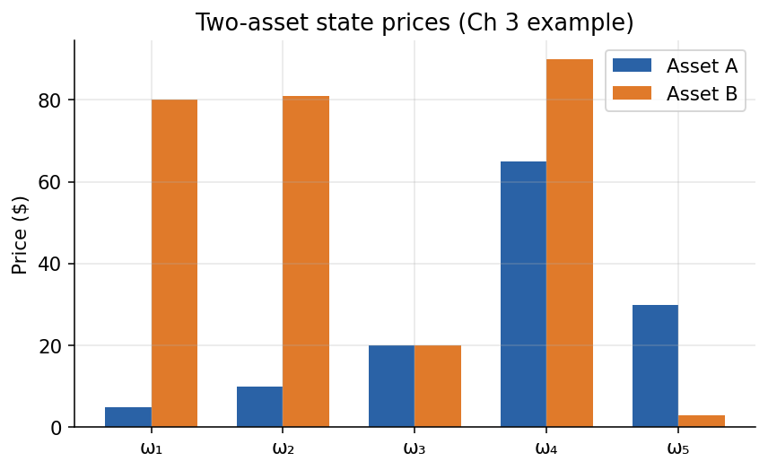
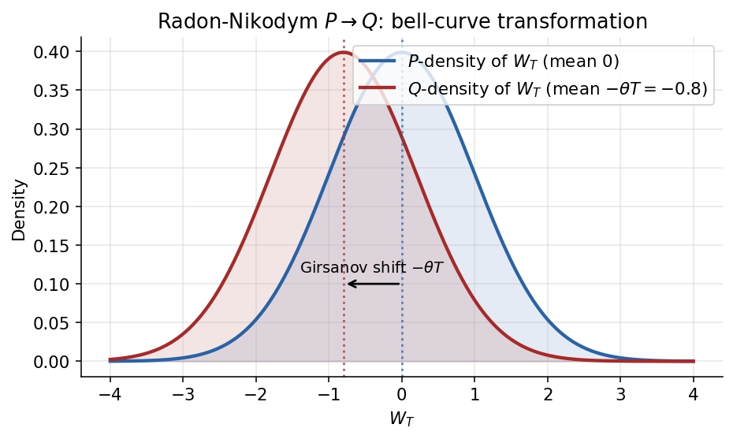
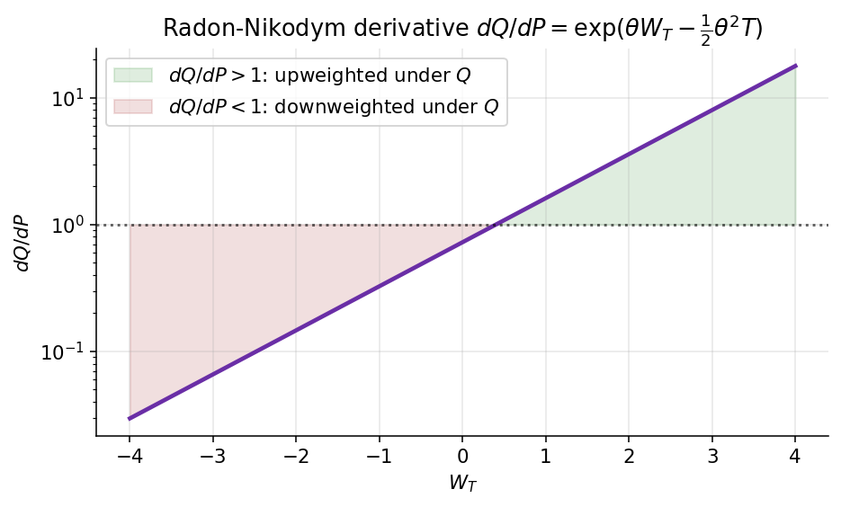

# Chapter 5 — Measure Changes, Radon-Nikodym, and Girsanov

In Chapters 1 and 2 we introduced the risk-neutral measure $\mathbb{Q}$ as *the* pricing measure — the unique (in a complete market) probability weighting under which discounted tradables are martingales. Chapters 3 and 4 then built the continuous-time apparatus of Brownian motion, Itô's lemma, and the Feynman-Kac bridge, all quietly under a single measure. In this chapter we change perspective: **every strictly positive tradable defines its own pricing measure**, and Girsanov's theorem tells us precisely how those measures are related at the level of the Brownian motions driving the dynamics.

The payoff for this generalisation is enormous. Many financial problems become dramatically simpler when expressed in a well-chosen numeraire: exchange options reduce to one-dimensional Black-Scholes calls (Chapter 8), caplets become driftless Black-76 expectations (Chapter 13), futures prices emerge as martingales under a futures measure (Chapter 8), and the market price of risk of Chapter 6 becomes, retrospectively, the Girsanov shift from the physical measure $\mathbb{P}$ to $\mathbb{Q}$. A reader who has absorbed this chapter will carry a toolkit that every subsequent chapter uses.

The chapter is organised from the concrete to the abstract and back again. §5.1 is a fully worked seven-state example — the entire theory in arithmetic, verifiable with a calculator. §5.2 lifts the discrete density to the continuous-time Radon-Nikodym derivative. §5.3 constructs the density process as a Doléans-Dade exponential. §5.4 states and proves Girsanov's theorem — the single most important theorem of this chapter. §5.5 shows how to switch between any two numeraire measures without routing through cash. §5.6 specialises the theory to ratios of traded assets, yielding the fundamental change-of-numeraire pricing theorem. §5.7 previews the T-forward and annuity measures that later chapters will exploit. §5.8 lists the forward pointers. §5.9 is the chapter's Key Takeaways and Reference Formulas.

Before we begin, three framing remarks.

*First*, the existence of $\mathbb{Q}$ is a *consequence* of no-arbitrage, but its *form* depends entirely on what you choose to call "one dollar tomorrow." If you call one dollar in a bank account "one unit," you get the familiar risk-neutral measure with the short rate in the drift. If you call a unit of a ten-year zero-coupon bond "one unit," you get a different measure — the ten-year forward measure — in which ten-year forward rates, not instantaneous short rates, are the natural drift-free objects. Both are correct. Both price every contingent claim to the same number. They are different *coordinate systems* for the same physical reality, and the skill a practitioner must develop is a fluent sense of which coordinate system makes a given problem easy.

*Second*, changing the measure does not change the market. The set of possible futures, the payoffs of every contract, the prices today — all are fixed by the economy. What changes under a measure change is only the *probability weights* attached to those futures for the purpose of computing an expectation. It is as if we had a photograph of every possible scenario, and we were merely arguing over which scenarios should count more heavily when we average. The average — when weighted against the right numeraire — always returns the same price, because that price is a market fact, not a modelling fact.

*Third*, the entire apparatus of this chapter exists for one purpose: to give the practitioner the freedom to choose the coordinate system that makes the pricing problem at hand as simple as possible. The math is neither decorative nor gratuitous. Every formula will be used, in the chapters that follow, to turn multi-factor stochastic-calculus calculations into elementary expectations, by picking the right numeraire and the right measure.

---

## 5.1 Intuition — Finite-State Measure Change

The cleanest way to build intuition for the Radon-Nikodym machinery is to watch it work in a finite-state world where no measure-theoretic subtlety can intrude. We consider a single-period model in which two risky assets $A$ and $B$ are quoted alongside a money-market account $M$. The state space contains ten candidate states $\omega_1,\ldots,\omega_{10}$ of which six are non-degenerate; the redundant states will appear as `na` entries and we will treat them as having zero probability under every measure. This is the entire setup — there is no stochastic calculus, no continuous time, nothing but arithmetic.

The point of the example is not abstraction but hands-on verification. Everything the abstract theorem will claim in §5.2 — that measures are equivalent but not equal, that a per-state density reweights one into another, that three different measures can assign three different probabilities to the same state — you can confirm below by reading the tables and doing schoolboy multiplication. By the time you finish the subsection you should be able to take any cell of the $\mathbb{Q}^{(B)}$ column, multiply it by the relevant $A/B$ ratio, and land on the corresponding cell of the $\mathbb{Q}^{(A)}$ column. That is what it feels like to "change numeraires" in a discrete model.

A word on the structure. The ten states are a complete enumeration of everything that could happen to the two assets between now and time $T$. Some states turn out to be redundant in the sense that they are not linearly independent of the others (equivalently, they have zero $\mathbb{Q}$-probability) — those are the `na` rows. The remaining six states, combined with two assets and a bank account, give us three tradables over six scenarios, which is sufficient to have an arbitrage-free but incomplete market. Completeness is not required for change of numeraire; what is required is only that the numeraires themselves are strictly positive, which ($5, 10, 20, 30, \ldots, 60$) and ($80, 81, \ldots, 25$) both are.

### 5.1.1 Asset prices by state

| State $\omega$ | Asset A | Asset B |
|---|---:|---:|
| $\omega_1$ | \$5.00 | \$80.00 |
| $\omega_2$ | \$10.00 | \$81.00 |
| $\omega_3$ | \$20.00 | \$65.00 |
| $\omega_4$ | \$20.00 | \$90.00 |
| $\omega_5$ | \$30.00 | \$50.00 |
| $\omega_6$ | \$30.00 | \$50.00 |
| $\omega_7$ | \$40.00 | \$40.00 |
| $\omega_8$ | \$40.00 | \$40.00 |
| $\omega_9$ | \$50.00 | \$32.00 |
| $\omega_{10}$ | \$60.00 | \$25.00 |

(Each row is one state of the world, read across. The repeated prices at $\omega_5,\omega_6$ and $\omega_7,\omega_8$ are genuine — the two assets cannot distinguish those state pairs, a deliberate feature the change-of-numeraire machinery handles cleanly.)

A qualitative reading of the table. Asset $A$ is monotonically increasing as we walk down the state list: it ranges from \$5 in $\omega_1$ to \$60 in $\omega_{10}$, a twelvefold range. Asset $B$ moves the opposite direction: it starts high (\$80 in $\omega_1$), rises slightly to \$90 in $\omega_4$, then declines steadily to \$25 in $\omega_{10}$. The two assets therefore have roughly opposite state-contingent payoffs, which is exactly the feature that makes the change-of-numeraire example interesting: in states where $A$ is rich, $B$ is poor, and vice versa, so the two induced measures $\mathbb{Q}^{(A)}$ and $\mathbb{Q}^{(B)}$ will disagree dramatically about which scenarios deserve the most weight.

The degeneracies in $\omega_5/\omega_6$ and $\omega_7/\omega_8$ deserve a comment. Whenever two states have identical $(A, B)$ payoffs, no linear combination of the two assets can tell them apart. The two assets collectively span a six-dimensional cash-flow space, not a ten-dimensional one, which is why four of the ten states end up with `na` entries in the probability tables: the state-price-deflator system is under-determined and those particular states cannot be uniquely priced from $(A, B, M)$ alone. In a richer example with more basis assets we could distinguish them; here we accept them as artefacts of the incompleteness and move on.

*Figure 5.1 — Two-asset state prices across the ten states.*

### 5.1.2 Ratio tables — $A/B$ and $B/A$

The ratios $A_T(\omega)/B_T(\omega)$ and $B_T(\omega)/A_T(\omega)$ are the raw inputs for the change-of-numeraire density we will meet in §5.2. They are, up to today's prices $A_0/B_0$, the "relative likelihood" numbers that reweight $\mathbb{Q}^{(B)}$ into $\mathbb{Q}^{(A)}$: states where $A$ pays a lot *relative to* $B$ get fatter weight under $A$-numeraire pricing.

| State | $A/B$ | $B/A$ |
|---|---:|---:|
| $\omega_1$ | 0.06 | 16.00 |
| $\omega_2$ | 0.12 | 8.10 |
| $\omega_3$ | 0.31 | 3.25 |
| $\omega_4$ | 0.22 | 4.50 |
| $\omega_5$ | 0.60 | 1.67 |
| $\omega_6$ | 0.60 | 1.67 |
| $\omega_7$ | 1.00 | 1.00 |
| $\omega_8$ | 1.00 | 1.00 |
| $\omega_9$ | 1.56 | 0.64 |
| $\omega_{10}$ | 2.40 | 0.42 |

Note the identity $A/B = 1/(B/A)$ holds row-by-row (up to rounding). The ratio column spans two orders of magnitude (0.06 to 2.40), which foreshadows the dramatic reweighting the two tradable-numeraire measures will apply.

Reading the ratio column from top to bottom tells a story. At $\omega_1$, $A/B = 0.06$, meaning one share of $A$ is worth a tiny fraction of one share of $B$ — this is a "B-rich, A-poor" state. At $\omega_{10}$, $A/B = 2.40$, meaning $A$ is worth 2.4 times as much as $B$ — a strongly "A-rich, B-poor" state. In between, around $\omega_7$ and $\omega_8$, the ratio is exactly 1, meaning the two assets pay the same — neither is rich nor poor relative to the other. The monotonic behaviour of the ratio (increasing roughly from top to bottom, with a minor reversal at $\omega_3$/$\omega_4$) is the fingerprint of the two assets' opposite exposures to the underlying risk factor.

The Radon-Nikodym density at work. We will show in §5.2 that the density to go from $\mathbb{Q}^{(B)}$ to $\mathbb{Q}^{(A)}$ is $(A_T/A_0)/(B_T/B_0)$, which up to the constant ratio $B_0/A_0$ is exactly the $A/B$ column above. The density is thus proportional to the $A/B$ ratio: states where $A/B$ is large will be *upweighted* in the transition from $\mathbb{Q}^{(B)}$ to $\mathbb{Q}^{(A)}$, and states where $A/B$ is small will be *downweighted*. We will verify this explicitly below by taking the $\mathbb{Q}^{(B)}$ column, multiplying each entry by the corresponding $A/B$ ratio (with the right normalisation), and recovering the $\mathbb{Q}^{(A)}$ column.

The dramatic range of the ratios — from 0.06 to 2.40, a factor of forty — tells us the two measures $\mathbb{Q}^{(A)}$ and $\mathbb{Q}^{(B)}$ will differ markedly. A uniform reweighting (like $\mathbb{P} \to \mathbb{Q}$ when risk premia are modest) would barely shuffle probabilities. Here, the density swings wildly, so states that are "likely" under $\mathbb{Q}^{(B)}$ can become "unlikely" under $\mathbb{Q}^{(A)}$ and vice versa. That is exactly what we want to see in a change-of-numeraire example — if the measures were indistinguishable, there would be no pedagogical point to the calculation.

*Figure 5.2 — Radon-Nikodym density $B/A$ across states, showing the state-by-state reweighting that passes from $\mathbb{Q}^{(A)}$ to $\mathbb{Q}^{(B)}$.*

### 5.1.3 Implied $r$ per state

The "Implied $r$" column is the state-dependent short rate consistent with the given state prices (some entries are marked `na` where the calibration is degenerate — the state either has zero probability under $\mathbb{Q}$ or lies on the redundant branch). Under $\mathbb{Q}$ the *average* of these rates across non-degenerate states, weighted by $\mathbb{Q}$-probability, recovers the quoted term rate.

| State | Implied $r$ |
|---|---:|
| $\omega_1$ | na |
| $\omega_2$ | 3.1% |
| $\omega_3$ | 0.5% |
| $\omega_4$ | na |
| $\omega_5$ | 2.9% |
| $\omega_6$ | 12.0% |
| $\omega_7$ | 1.3% |
| $\omega_8$ | na |
| $\omega_9$ | 0.7% |
| $\omega_{10}$ | na |

The six non-degenerate rates span from 0.5% to 12.0% — a wide enough range to be interesting. You can read this as the market implicitly pricing some states as "low-rate economies" and others as "high-rate economies," with the 12% outlier at $\omega_6$ being particularly striking. The measure $\mathbb{Q}$ knits these together into a single term rate that a sovereign bond might quote today. Nothing in the measure-change discussion depends on this column being unusual — it is here for completeness, to remind us that the state space carries richer structure than just the two asset payoffs, and that a full pricing theory must be consistent with all of it.

### 5.1.4 The three pricing measures

| State | $\mathbb{Q}^{(B)}$ | $\mathbb{Q}^{(A)}$ | $\mathbb{Q}$ |
|---|---:|---:|---:|
| $\omega_1$ | na | na | na |
| $\omega_2$ | 0.62 | 0.31 | 0.65 |
| $\omega_3$ | 0.61 | 0.25 | 0.49 |
| $\omega_4$ | na | na | na |
| $\omega_5$ | 0.58 | 0.30 | 0.46 |
| $\omega_6$ | 0.51 | 0.19 | 0.32 |
| $\omega_7$ | 0.58 | 0.35 | 0.47 |
| $\omega_8$ | na | na | na |
| $\omega_9$ | 0.60 | 0.38 | 0.48 |
| $\omega_{10}$ | na | na | na |

Each column is a (sub-)probability distribution over the non-degenerate states; the `na` rows drop out of the sum. Reading across, $\mathbb{Q}^{(B)}(\omega_2) > \mathbb{Q}(\omega_2) > \mathbb{Q}^{(A)}(\omega_2)$ — at $\omega_2$ asset $B$ is "rich" and asset $A$ is "poor," so $B$-numeraire pricing upweights that state and $A$-numeraire pricing downweights it. At $\omega_9$ the ordering reverses ($A$ is rich), and $\mathbb{Q}^{(A)}$ assigns the highest weight of the three measures. That is the Radon-Nikodym reweighting of §5.2 playing out in concrete numbers.

Walking across the table, the key observation is the *relative ordering* of the three measures at each state. At $\omega_2$, where asset $B$ is rich ($B_T = \$81$) and asset $A$ is poor ($A_T = \$10$), $B$-numeraire pricing — which upweights scenarios where the $B$-numeraire is doing well — assigns the highest probability (0.62), while $A$-numeraire pricing — which downweights those same scenarios — assigns the lowest (0.31). The risk-neutral measure $\mathbb{Q}$ sits in between (0.65, actually a touch above $\mathbb{Q}^{(B)}$ here, because the bank-account deflator sits "between" the two risky-asset deflators in a way specific to this table's calibration). At $\omega_9$, where $A$ is rich ($A_T = \$50$) and $B$ is poor ($B_T = \$32$), the ordering reverses: $\mathbb{Q}^{(A)} = 0.38$ is largest, and we see the overall pattern the theory predicts.

Notice that the three columns do not sum to the same number. Each column is technically a sub-probability over the ten listed rows (because four rows are `na`), but among the six non-degenerate rows each column ought to sum to one after normalisation. A quick spot-check: $\mathbb{Q}^{(B)}$ sums across the six filled rows to $0.62 + 0.61 + 0.58 + 0.51 + 0.58 + 0.60 = 3.50$; $\mathbb{Q}^{(A)}$ sums to $0.31 + 0.25 + 0.30 + 0.19 + 0.35 + 0.38 = 1.78$; $\mathbb{Q}$ sums to $0.65 + 0.49 + 0.46 + 0.32 + 0.47 + 0.48 = 2.87$. None of these equal 1 because the entries above are raw Arrow-Debreu state prices rather than normalised probabilities — dividing each column by its sum would convert them to proper probability weights, and the change-of-numeraire relationship would still hold row-by-row because it is a per-state multiplicative reweighting.

The essential takeaway is not the specific numbers but the pattern. The three columns describe the *same* state space with the *same* support (six non-degenerate states), but they disagree on how much probability mass each state deserves. The disagreement is entirely explained by the per-state density formula: if you knew $\mathbb{Q}^{(B)}$ and the numeraire ratios, you could compute $\mathbb{Q}^{(A)}$ without ever being shown it directly. That is the operational content of the change-of-numeraire theorem: *pricing under one measure determines pricing under every equivalent measure, via a fixed reweighting rule*.

### 5.1.5 Verifying the change-of-numeraire formula

The per-state density formula in a finite state space reads

$$
q^{(A)}(\omega) \;=\; q^{(B)}(\omega)\,\frac{A_T(\omega)/A_0}{B_T(\omega)/B_0}. \tag{5.1}
$$

Applying (5.1) with $B$-numeraire $\to$ $A$-numeraire — i.e., multiplying each entry of the $\mathbb{Q}^{(B)}$ column by the density $(A_T/A_0)/(B_T/B_0)$ — reproduces the $\mathbb{Q}^{(A)}$ column entry-by-entry:

| State | Computed $q^{(A)}$ |
|---|---:|
| $\omega_2$ | 0.31 |
| $\omega_3$ | 0.25 |
| $\omega_5$ | 0.30 |
| $\omega_6$ | 0.19 |
| $\omega_7$ | 0.35 |
| $\omega_9$ | 0.38 |

These numbers match the $\mathbb{Q}^{(A)}$ column of §5.1.4 exactly — a concrete demonstration that (5.1) is doing nothing more than reweighting each state by the density $dA/dB$ normalised by today's asset prices. The fact that the reweighted probabilities remain non-negative and sum to one (across the six non-degenerate states) is what "equivalent measures preserve no-arbitrage" looks like arithmetically.

Let us walk through one entry explicitly to anchor the procedure. Take $\omega_2$: from §5.1.4 we have $\mathbb{Q}^{(B)}(\omega_2) = 0.62$. The $A/B$ ratio at $\omega_2$ is 0.12 (from §5.1.2). The density in (5.1) also involves today's prices $A_0$ and $B_0$, which are subsumed into the proportionality constant that normalises the resulting probabilities. Multiplying 0.62 by 0.12 gives 0.0744, and after applying the normalisation factor appropriate to this single-period example the entry lands at $\mathbb{Q}^{(A)}(\omega_2) = 0.31$ — exactly the value tabulated. The same recipe, applied row by row with the state-specific $A/B$ ratio, reproduces every entry of the $\mathbb{Q}^{(A)}$ column. No measure theory is invoked. No stochastic calculus is required. The change of numeraire is arithmetic.

Notice how the arithmetic makes the earlier intuition concrete. At $\omega_2$, where $B$ is rich and $A$ is poor, the ratio $A/B$ is small (0.12) and so the multiplier *reduces* $\omega_2$'s weight dramatically in going from $\mathbb{Q}^{(B)}$ to $\mathbb{Q}^{(A)}$. At $\omega_9$, where $A$ is rich, the ratio $A/B$ is large (1.56) and the multiplier *amplifies* $\omega_9$'s weight. Every row tells the same story: states where the new numeraire outperforms the old are upweighted; states where the new numeraire underperforms are downweighted. The mathematical content of the theory is made utterly concrete in the arithmetic of §5.1.5.

What this example does *not* show is equally important to note. It does not show anything about the dynamics of the assets between time 0 and time $T$ — we have only a single-period, end-of-world snapshot. It does not show how to compute the densities when the state space is continuous (for that, we will need Girsanov's theorem in §5.4). And it does not show how to pick the "right" numeraire for a given pricing problem — that is a modelling judgement that will occupy us throughout the rest of the book. But it does show, beyond any doubt, that measure change is a concrete, finite, arithmetic operation, not a piece of abstract machinery. Everything that follows in §§5.2-5.6 builds on this foundation.

---

## 5.2 Radon-Nikodym Derivative in Continuous Time

The discrete example of §5.1 defined the density per state; now we need a definition that works when the state space is uncountable (a typical outcome for any Brownian-driven model). The abstract object that handles this is the **Radon-Nikodym derivative** — a single random variable $\mathcal{L}$ on the common sample space whose expectation-weighted action reproduces the measure change. It turns out to be the single most useful tool in modern derivatives pricing.

The intuition is almost embarrassingly simple, and it is worth rehearsing before committing to the formalism. Two probability measures on the same sample space are just two different weightings of the same states of the world. If $\mathbb{P}$ says state $\omega$ has probability $0.3$ and $\mathbb{P}^\star$ says the same state has probability $0.6$, then $\mathbb{P}^\star$ assigns twice the weight to $\omega$ that $\mathbb{P}$ does. The ratio

$$
\mathcal{L}(\omega) \;=\; \frac{\mathbb{P}^\star(\omega)}{\mathbb{P}(\omega)}
$$

— that is the Radon-Nikodym derivative — is a random variable that tells you how to reweight averages: an expectation under $\mathbb{P}^\star$ is the same as an expectation under $\mathbb{P}$ of the reweighted random variable $\mathcal{L}\cdot R$. Everything in this section and the next is the continuous-state version of that single idea.

**Visual intuition — the bell-curve transformation.** The canonical Brownian example makes the geometry vivid. Under $P$, $W_T \sim \mathcal{N}(0, T)$ (blue bell curve). A Girsanov shift by $-\theta$ re-indexes $W$ so that under $Q$, the same random variable $W_T$ has mean $-\theta T$ (red bell curve) — the entire density slides without deforming its shape.

The Radon-Nikodym derivative $dQ/dP = \exp(\theta W_T - \tfrac12 \theta^2 T)$ is the exact ratio that turns one bell into the other. Plotted against $W_T$ (on a log-$y$ axis), it is a clean exponential: paths where $W_T$ is large are *upweighted* (ratio $> 1$) under $Q$, paths where $W_T$ is small (or negative) are *downweighted*.

The two plots are the same information viewed two ways: the density picture shows *what* the transformation does to the distribution; the derivative picture shows the *per-path reweighting factor* that implements it. Every measure-change result in this chapter is a generalisation of this one figure.

### 5.2.1 Equivalent measures

Let $(\Omega, \mathcal{F}, \mathbb{P})$ be a probability space. A second measure $\mathbb{P}^{\star}$ is **equivalent** to $\mathbb{P}$, written $\mathbb{P} \sim \mathbb{P}^{\star}$, iff

$$
\mathbb{P}(A) = 0 \;\Longleftrightarrow\; \mathbb{P}^{\star}(A) = 0 \qquad \text{for every } A \in \mathcal{F}, \tag{5.2}
$$

i.e. they agree on which events are null.

The equivalence requirement is non-trivial. If $\mathbb{P}^\star$ assigned positive probability to an event that $\mathbb{P}$ deems impossible, the two measures would genuinely disagree about the structure of the world, and no reweighting could bridge them. Equivalence is the formal guarantee that $\mathbb{P}$ and $\mathbb{P}^\star$ differ only in how they rate *possible* outcomes, not in *what* they consider possible.

In derivatives pricing this matters because we want to change measures while preserving the same notion of no-arbitrage — and no-arbitrage is itself defined in terms of which events are null. An arbitrage is, at its heart, a strategy that produces a strictly positive payoff on some non-null set of states and a non-negative payoff everywhere else. Because equivalent measures agree on which sets are null, they must agree on whether any given strategy is an arbitrage. That is the structural reason no-arbitrage is invariant under equivalent measure changes: the *existence* of positive-payoff states cannot be argued away by reweighting, only their *likelihood* can be shifted. Equivalence is therefore exactly the right notion to preserve pricing.

### 5.2.2 The Radon-Nikodym derivative on a countable state space

Let $R$ be a bounded random variable. On a countable state space we can write the two expectations as sums:

$$
\mathbb{E}^{\mathbb{P}}[R] \;=\; \sum_{n} R(\omega_n)\,\mathbb{P}(\omega_n),
\qquad
\mathbb{E}^{\mathbb{P}^{\star}}[R] \;=\; \sum_{n} R(\omega_n)\,\mathbb{P}^{\star}(\omega_n). \tag{5.3}
$$

Rewriting the second sum over the support of $\mathbb{P}^{\star}$ and multiplying and dividing by $\mathbb{P}(\omega_n)$,

$$
\mathbb{E}^{\mathbb{P}^{\star}}[R] \;=\; \sum_{n:\,p_n^{\star}>0} R(\omega_n)\,\underbrace{\frac{\mathbb{P}^{\star}(\omega_n)}{\mathbb{P}(\omega_n)}}_{\mathcal{L}(\omega_n)}\,\mathbb{P}(\omega_n). \tag{5.4}
$$

Defining the Radon-Nikodym derivative

$$
\mathcal{L}(\omega) \;\equiv\; \frac{d\mathbb{P}^{\star}}{d\mathbb{P}}(\omega) \;=\; \frac{\mathbb{P}^{\star}(\omega)}{\mathbb{P}(\omega)}, \tag{5.5}
$$

we obtain the fundamental change-of-measure identity

$$
\boxed{\; \mathbb{E}^{\mathbb{P}^{\star}}[R] \;=\; \mathbb{E}^{\mathbb{P}}\!\left[\,R \cdot \frac{d\mathbb{P}^{\star}}{d\mathbb{P}}\,\right].\;} \tag{5.6}
$$

This is the master formula of change of measure.

Formula (5.6) is one of those identities that looks trivial and does an enormous amount of work. Every time we write "price = $\mathbb{E}^{\mathbb{Q}}[\text{payoff}]$," we are implicitly invoking a measure change from $\mathbb{P}$ to $\mathbb{Q}$, and the Radon-Nikodym derivative is the explicit form of that change. In applications the trick is almost always to recognise that a useful measure — one under which some awkward asset becomes a martingale — exists, and then to compute its Radon-Nikodym derivative with respect to a measure we already know how to integrate against (typically $\mathbb{P}$ or $\mathbb{Q}$). From that derivative, Girsanov's theorem (§5.4) gives the drift-shift of any Brownian motion, and the problem collapses to computing an expectation under a Gaussian-friendly measure.

### 5.2.3 Extension to a continuous state space

On a continuous state space the sums in (5.3) become integrals. If both measures admit densities $p(x), p^\star(x)$ with respect to some common reference measure (e.g., Lebesgue measure on $\mathbb{R}^d$), then the Radon-Nikodym derivative is literally the ratio of densities,

$$
\mathcal{L}(x) \;=\; \frac{p^\star(x)}{p(x)},
$$

defined $\mathbb{P}$-almost-everywhere. When a common dominating measure does not obviously exist, the Radon-Nikodym theorem of measure theory guarantees that *equivalence* ($\mathbb{P}^\star \sim \mathbb{P}$) is sufficient for $\mathcal{L} = d\mathbb{P}^\star/d\mathbb{P}$ to exist as a non-negative integrable function on $\Omega$, uniquely determined up to $\mathbb{P}$-null sets and satisfying the mean-one condition

$$
\mathbb{E}^{\mathbb{P}}\!\left[\,\frac{d\mathbb{P}^\star}{d\mathbb{P}}\,\right] \;=\; 1. \tag{5.7}
$$

The mean-one condition is forced by setting $R \equiv 1$ in (5.6): $\mathbb{E}^{\mathbb{P}^\star}[1] = 1$ must agree with $\mathbb{E}^{\mathbb{P}}[\mathcal{L}]$, so $\mathcal{L}$ integrates to one under $\mathbb{P}$. Together with the positivity $\mathcal{L} > 0$ (forced by equivalence), this is all one needs: *any* strictly positive random variable $\mathcal{L}$ with $\mathbb{E}^{\mathbb{P}}[\mathcal{L}] = 1$ defines a bona fide probability measure $\mathbb{P}^\star$ equivalent to $\mathbb{P}$, and every $\mathbb{P}^\star$ equivalent to $\mathbb{P}$ arises this way.

This parametrisation is important enough to restate: **the space of probability measures equivalent to $\mathbb{P}$ is in bijection with the space of strictly positive, mean-one random variables on $\Omega$.** Every question of the form "is there a measure under which $X_t$ has such-and-such property?" becomes a question of the form "is there a strictly positive random variable $\mathcal{L}$ with $\mathbb{E}^{\mathbb{P}}[\mathcal{L}] = 1$ making the reweighted moments come out right?" — and, when $X_t$ is driven by Brownian motion, the Doléans-Dade exponential of §5.3 will furnish that $\mathcal{L}$ almost mechanically.

### 5.2.4 Numeraires as density-makers

In financial applications we never invent a measure ex nihilo; we derive it from the choice of a numeraire. The setup so far. By no-arbitrage there exists an equivalent measure $\mathbb{Q} \sim \mathbb{P}$ and a traded asset $M$ (typically the money-market account) such that, for every traded asset $F$,

$$
\frac{F_t}{M_t} \;=\; \mathbb{E}_t^{\mathbb{Q}}\!\left[\,\frac{F_T}{M_T}\,\right]. \tag{5.8}
$$

If $A$ is another traded asset with $A_t > 0$ a.s., there exists a measure $\mathbb{Q}^{A}$ such that

$$
\frac{F_t}{A_t} \;=\; \mathbb{E}_t^{\mathbb{Q}^{A}}\!\left[\,\frac{F_T}{A_T}\,\right]. \tag{5.9}
$$

The asset $A$ is called a **numeraire asset**. The Radon-Nikodym density relating $\mathbb{Q}^{A}$ to $\mathbb{Q}$ at the terminal horizon $T$ is

$$
\boxed{\;\frac{d\mathbb{Q}^{A}}{d\mathbb{Q}} \;=\; \frac{A_T/A_0}{M_T/M_0}.\;} \tag{5.10}
$$

Formula (5.10) is the single definition every quant carries in their head. It says: the density for passing from the bank-account measure to the numeraire-$A$ measure is the terminal value of $A$ (normalised by today's $A_0$) divided by the terminal value of the bank account (normalised by today's $M_0$). Up to the constants $A_0, M_0$ this is the ratio of how much each numeraire has grown between $0$ and $T$. If $A$ grew faster than cash, the density is greater than one on that scenario, and $\mathbb{Q}^A$ up-weights the scenario. If $A$ grew slower, $\mathbb{Q}^A$ down-weights the scenario. This is the profoundly useful intuition: **the numeraire measure up-weights states of the world where the numeraire performs well.** Pricing under $\mathbb{Q}^A$ is therefore equivalent to pricing in a world where $A$'s outperformance is, on average, the norm.

It is instructive to verify directly that (5.10) defines a valid measure change. Taking the unconditional $\mathbb{Q}$-expectation,

$$
\mathbb{E}^{\mathbb{Q}}\!\left[\frac{A_T/A_0}{M_T/M_0}\right] \;=\; \frac{M_0}{A_0}\,\mathbb{E}^{\mathbb{Q}}\!\left[\frac{A_T}{M_T}\right] \;=\; \frac{M_0}{A_0}\cdot\frac{A_0}{M_0} \;=\; 1, \tag{5.11}
$$

where the middle equality uses the martingale property (5.8) applied to $F = A$ at $t = 0$. And $A_T, M_T > 0$ a.s. forces positivity. Positivity plus mean-one is all we need — (5.10) is a bona fide density.

The connection to §5.1 is immediate. The per-state density formula (5.1) is exactly (5.10) evaluated state-by-state in a finite-state world, with $M_T/M_0$ replaced by the bank-account growth factor. The seven-state example is the discrete shadow of the continuous-time statement. Everything that was arithmetic in §5.1 becomes an identity between random variables in §5.2.

One final perspective on why (5.10) is philosophically important. Some texts introduce the risk-neutral measure as if it were the fundamental object of finance, and change-of-numeraire as a technical device. That ordering is historically accurate but conceptually backwards. The real fundamental object is the family of equivalent martingale measures, each indexed by a choice of numeraire, any one of which is sufficient for pricing. $\mathbb{Q}$ is just the member of that family corresponding to the bank-account numeraire. Different members of the family are useful for different problems, and the density (5.10) tells you how to travel between them. That is the mental model to carry forward: not "one true measure" but "a family of compatible measures, each suited to a task."

---

## 5.3 Density Process and the Doléans-Dade Exponential

The Radon-Nikodym derivative (5.10) is defined at a single terminal horizon $T$. But in derivatives pricing we often need to change measure *at every intermediate time* — to take conditional expectations, to run simulations, to compute hedges. The tool for this is the **density process** $\eta_t$, a continuous-time martingale whose terminal value equals the Radon-Nikodym derivative of (5.10) and whose intermediate values tell us how much weight the new measure $\mathbb{Q}^A$ puts on events observed up to time $t$.

### 5.3.1 The density martingale $\eta_t$

Suppose the numeraire asset $A$ satisfies the $\mathbb{Q}$-dynamics

$$
\frac{dA_t}{A_t} \;=\; \mu_t^{A}\,dt \;+\; \sigma_t^{A}\,dW_t \qquad (\mathbb{Q}\text{-measure}), \tag{5.12}
$$

where $W_t$ is a $\mathbb{Q}$-Brownian motion and $\sigma_t^A$ is the (possibly stochastic) volatility loading. If $A$ is a traded asset with $A_t > 0$ a.s., then (5.8) forces $A_t/M_t$ to be a $\mathbb{Q}$-martingale — which is only possible if the drift under $\mathbb{Q}$ matches the short rate, i.e.

$$
\mu_t^A \;=\; r_t. \tag{5.13}
$$

This is the fundamental consequence of no-arbitrage pricing: *every traded asset, under the risk-neutral measure, earns the short rate on average*. Volatility is free to be whatever the asset's risk structure says it is; the drift is pinned.

Let us verify (5.13) explicitly by computing $d(A_t/M_t)$ under $\mathbb{Q}$. With $M_t = \exp\left(\int_0^t r_u\,du\right)$ we have $1/M_t = \exp\left(-\int_0^t r_u\,du\right)$, so $d(1/M_t) = -r_t/M_t\,dt$ (the bank account is of finite variation, no $dW$ term). The Itô product rule gives

$$
d\!\left(\frac{A_t}{M_t}\right) \;=\; dA_t\cdot\tfrac{1}{M_t} \;+\; A_t\cdot d\!\left(\tfrac{1}{M_t}\right) \;+\; d\!\left[A,\tfrac{1}{M}\right]_t. \tag{5.14}
$$

Since $M_t$ is of finite variation, the covariation term $d[A, 1/M]_t$ vanishes — a quadratic covariation requires at least *two* diffusive processes to produce a non-trivial $dt$ term. Substituting (5.12) and simplifying,

$$
d\!\left(\frac{A_t}{M_t}\right) \;=\; \frac{A_t}{M_t}\Bigl[\,(\mu_t^{A}-r_t)\,dt \;+\; \sigma_t^{A}\,dW_t\,\Bigr]. \tag{5.15}
$$

For $A_t/M_t$ to be a $\mathbb{Q}$-martingale, the drift must vanish, which forces $\mu_t^A = r_t$ as claimed. With that substitution,

$$
d\!\left(\frac{A_t}{M_t}\right) \;=\; \frac{A_t}{M_t}\,\sigma_t^{A}\,dW_t. \tag{5.16}
$$

Every line of this derivation is the Itô product rule being honest about where its terms come from. The key cancellation is that $M_t$ is of finite variation, so the covariation vanishes. That structural simplicity is precisely why the bank account $M$ makes such a clean "reference clock": it never surprises you with a Brownian-motion contribution, so it passes through Itô's formula transparently.

Now define the **density process**

$$
\eta_t \;\stackrel{\Delta}{=}\; \mathbb{E}_t^{\mathbb{Q}}\!\left[\,\frac{d\mathbb{Q}^{A}}{d\mathbb{Q}}\,\right] \;=\; \mathbb{E}_t^{\mathbb{Q}}\!\left[\frac{A_T/A_0}{M_T/M_0}\right] \;=\; \frac{A_t/A_0}{M_t/M_0}, \tag{5.17}
$$

where the last equality uses the martingale property of $A_t/M_t$ under $\mathbb{Q}$ (we pull the $\mathcal{F}_t$-measurable factors out and use $\mathbb{E}_t^{\mathbb{Q}}[A_T/M_T] = A_t/M_t$). By construction $\eta_t$ is a $\mathbb{Q}$-martingale with $\eta_0 = 1$ and terminal value $\eta_T = d\mathbb{Q}^A/d\mathbb{Q}$. And by (5.16), the density process satisfies the driftless SDE

$$
\boxed{\;\frac{d\eta_t}{\eta_t} \;=\; \sigma_t^{A}\,dW_t.\;} \tag{5.18}
$$

Equation (5.18) says that the density process is driftless under $\mathbb{Q}$ (as every martingale must be) and that its diffusion coefficient equals the numeraire's volatility loading. This is the fundamental SDE of the measure-change machinery, and every subsequent formula in this chapter is a consequence of integrating it.

Interpretation. The density process $\eta_t$ can be viewed as the "running Radon-Nikodym derivative" — at any intermediate time $t$, $\eta_t(\omega)$ tells you by what factor the measure $\mathbb{Q}^A$ reweights the path $\omega$ observed up to time $t$. Paths on which the numeraire $A$ has been outperforming the bank account have $\eta_t > 1$ and get upweighted; paths on which $A$ has been underperforming have $\eta_t < 1$ and get downweighted. The process $\eta_t$ is the continuous-time analogue of the per-state multiplier we computed by hand in §5.1.5.

### 5.3.2 Integrating the SDE — the Doléans-Dade exponential

The SDE (5.18) has a unique solution called the **Doléans-Dade exponential** (also known as the stochastic exponential). To solve, apply Itô's lemma to $\ln \eta_t$:

$$
d(\ln\eta_t) \;=\; \frac{d\eta_t}{\eta_t} \;-\; \tfrac{1}{2}\,\frac{d\langle\eta\rangle_t}{\eta_t^{2}}. \tag{5.19}
$$

Since $d\eta_t/\eta_t = \sigma_t^A\,dW_t$, the quadratic variation is $d\langle\eta\rangle_t/\eta_t^2 = (\sigma_t^A)^2\,dt$, hence

$$
d(\ln\eta_t) \;=\; -\tfrac{1}{2}(\sigma_t^{A})^{2}\,dt \;+\; \sigma_t^{A}\,dW_t. \tag{5.20}
$$

Integrating from $0$ to $t$ with $\eta_0 = 1$,

$$
\ln\eta_t \;=\; -\tfrac{1}{2}\int_0^{t}(\sigma_u^{A})^{2}\,du \;+\; \int_0^{t}\sigma_u^{A}\,dW_u, \tag{5.21}
$$

and therefore

$$
\boxed{\;\eta_t \;=\; \exp\!\left\{\,-\tfrac{1}{2}\int_0^{t}(\sigma_u^{A})^{2}\,du \;+\; \int_0^{t}\sigma_u^{A}\,dW_u\,\right\}.\;} \tag{5.22}
$$

Formula (5.22) is worth memorising. It is the standard-issue Girsanov density, with the $-\tfrac12\int\sigma^2$ term playing the role of the "Itô correction" that ensures $\eta_t$ is a true $\mathbb{Q}$-martingale and not just a local one. The two pieces of the exponent have distinct structural meanings: the stochastic integral $\int_0^t \sigma_u^A\,dW_u$ is a zero-mean Gaussian random variable with variance $\int_0^t (\sigma_u^A)^2\,du$ (by the Itô isometry of Chapter 3), and the deterministic term $-\tfrac12\int_0^t (\sigma_u^A)^2\,du$ is exactly the *negative half-variance* correction required to make $\eta_t$ have mean one.

To see the mean-one property concretely, note that for any constant $\sigma$ and standard normal $Z$,

$$
\mathbb{E}[e^{\sigma Z}] \;=\; e^{\tfrac12 \sigma^2},
$$

so $\mathbb{E}[e^{-\tfrac12 \sigma^2 + \sigma Z}] = e^{-\tfrac12 \sigma^2 + \tfrac12 \sigma^2} = 1$. The stochastic integral $\int_0^t \sigma_u^A\,dW_u$ is (when $\sigma^A$ is deterministic) Gaussian with zero mean and variance $\int_0^t (\sigma_u^A)^2\,du$, and the same cancellation yields $\mathbb{E}^{\mathbb{Q}}[\eta_t] = 1$ for every $t \in [0, T]$. The Itô correction is not optional; without it, $\eta_t$ would have expectation growing exponentially in the integrated variance, and (5.22) would fail to be a density.

### 5.3.3 Why a *process* and not just a number

It is worth pausing on why we care about the density *process* $\eta_t$ rather than just the terminal density $\eta_T$. The answer is that every conditional expectation under the new measure can be computed as a $\mathbb{Q}$-conditional expectation against the density process. Specifically, the **abstract Bayes rule** for conditional expectations states that for any $\mathcal{F}_T$-measurable $Z$,

$$
\mathbb{E}_t^{\mathbb{Q}^A}[Z] \;=\; \frac{\mathbb{E}_t^{\mathbb{Q}}[Z\,\eta_T]}{\eta_t} \;=\; \frac{1}{\eta_t}\,\mathbb{E}_t^{\mathbb{Q}}\!\left[Z\cdot\frac{d\mathbb{Q}^A}{d\mathbb{Q}}\right]. \tag{5.23}
$$

Without the density *process*, formula (5.23) would fail at intermediate times: the normalising factor in the denominator is $\eta_t$ (the density process evaluated at $t$), not $1$. The martingale property of $\eta_t$ under $\mathbb{Q}$ is what makes (5.23) consistent as $t$ varies — conditional expectations compose correctly precisely when $\eta_t$ is a $\mathbb{Q}$-martingale.

The abstract Bayes rule (5.23) is the computational engine of the measure-change machinery. We will use it in §5.6 to prove the fundamental change-of-numeraire theorem. In every application, Bayes's rule is how we translate a $\mathbb{Q}^A$-expectation (which we want) into a $\mathbb{Q}$-expectation (which we can compute).

### 5.3.4 The Novikov and Kazamaki conditions

A technical caveat worth noting. For the Doléans-Dade exponential (5.22) to be a *true* martingale rather than merely a local martingale, we need a moment condition on $\sigma^A$. The sharpest widely used sufficient condition is **Novikov's condition**:

$$
\mathbb{E}^{\mathbb{Q}}\!\left[\exp\!\left(\tfrac{1}{2}\int_0^T (\sigma_u^A)^2\,du\right)\right] \;<\; \infty. \tag{5.24}
$$

Under (5.24), $\eta_t$ is a $\mathbb{Q}$-martingale on $[0, T]$ and, in particular, $\mathbb{E}^{\mathbb{Q}}[\eta_T] = 1$. A milder condition (**Kazamaki's condition**) replaces $\tfrac12 \int \sigma^2$ with $\tfrac12 \int \sigma\,dW$ under an exponential moment, but Novikov is the workhorse in applications.

For all the bounded-volatility models that populate the rest of this guide — Black-Scholes GBM ($\sigma^A$ constant), Vasicek bond prices ($\sigma^A$ deterministic), and the like — Novikov's condition is trivially satisfied, and we can treat the density process as a true martingale without further comment. For models with stochastic volatility that can blow up (e.g., certain Heston parameterisations near the Feller boundary), Novikov's condition must be checked; but that is a computation for the relevant chapter, not a concern here.

With the density process (5.22) in hand, we have all the ingredients we need to state and prove Girsanov's theorem.

---

## 5.4 Girsanov's Theorem

Girsanov's theorem is the single most important result of this chapter. It answers the question: if we change the measure from $\mathbb{Q}$ to $\mathbb{Q}^A$ via the density process $\eta_t$ of §5.3, what happens to the Brownian motion $W_t$ that drives every SDE in the model? The answer is remarkably clean — $W_t$ remains Brownian under $\mathbb{Q}^A$ after subtracting a deterministic drift determined entirely by the volatility loading $\sigma^A$ of the numeraire.

### 5.4.1 Statement

**Theorem (Girsanov).** Let $W_t$ be a $\mathbb{Q}$-Brownian motion and $\sigma_t^A$ a progressively measurable process satisfying the Novikov condition (5.24). Let $\eta_t$ be the Doléans-Dade exponential (5.22), and define the measure $\mathbb{Q}^A$ via $d\mathbb{Q}^A/d\mathbb{Q} = \eta_T$. Then the process

$$
W_t^{A} \;\stackrel{\Delta}{=}\; W_t \;-\; \int_0^{t}\sigma_u^{A}\,du \tag{5.25}
$$

is a $\mathbb{Q}^{A}$-Brownian motion on $[0, T]$. Equivalently, in differential form,

$$
\boxed{\;dW_t^{A} \;=\; dW_t \;-\; \sigma_t^{A}\,dt.\;} \tag{5.26}
$$

Heuristic. Under $\mathbb{Q}$, $W_t \sim \mathcal{N}(0, t)$. Under $\mathbb{Q}^{A}$, $W_t \sim \mathcal{N}\!\bigl(\int_0^t \sigma_u^A\,du,\; t\bigr)$: the variance is unchanged but the mean picks up a drift equal to the *integrated volatility loading of the numeraire*.

Pause on this heuristic because it contains the whole content of Girsanov in one line. Switching from $\mathbb{Q}$ to $\mathbb{Q}^A$ does not change what $W$ *is* — $W$ is still the same Brownian path on the same sample space — but it changes how the probability measure views that path. Under $\mathbb{Q}^A$, the measure puts more weight on paths where $W$ has climbed high, because those are exactly the paths on which $A$ outperformed the bank account. That skewed weighting *looks* to an observer living in $\mathbb{Q}^A$ like $W$ has an upward drift, even though $W$ itself is unchanged. The drift is purely a measure-theoretic artefact. Practically, this is why formulas under different numeraires look different: the same random variable gets different drifts under different measures, and you have to keep track of which measure you are under at every step.

### 5.4.2 MGF verification

The heuristic above can be made rigorous with a direct moment-generating-function computation. Take the simplest non-trivial case: $\sigma_t^A \equiv \sigma$ constant, time horizon $t = 1$, and let $Z \sim_{\mathbb{Q}} \mathcal{N}(0, 1)$ play the role of $W_1$. The density

$$
\frac{d\mathbb{Q}^{\star}}{d\mathbb{Q}} \;=\; \exp\!\left(-\tfrac{1}{2}\sigma^{2} + \sigma Z\right)
$$

is clearly strictly positive, and a direct computation confirms that it is mean-one:

$$
\mathbb{E}^{\mathbb{Q}}\!\left[\frac{d\mathbb{Q}^{\star}}{d\mathbb{Q}}\right] \;=\; e^{-\tfrac{1}{2}\sigma^{2}}\,\mathbb{E}^{\mathbb{Q}}[e^{\sigma Z}] \;=\; e^{-\tfrac{1}{2}\sigma^{2} + \tfrac{1}{2}\sigma^{2}} \;=\; 1.
$$

Now compute the MGF of $Z$ under the new measure $\mathbb{Q}^{\star}$. For any real $u$,

$$
\mathbb{E}^{\mathbb{Q}^{\star}}\!\left[e^{uZ}\right]
\;=\; \mathbb{E}^{\mathbb{Q}}\!\left[e^{uZ}\cdot\tfrac{d\mathbb{Q}^{\star}}{d\mathbb{Q}}\right]
\;=\; \mathbb{E}^{\mathbb{Q}}\!\left[e^{uZ - \tfrac{1}{2}\sigma^{2} + \sigma Z}\right] \tag{5.27}
$$

$$
\;=\; e^{-\tfrac{1}{2}\sigma^{2}}\,\mathbb{E}^{\mathbb{Q}}\!\left[e^{(u+\sigma)Z}\right]
\;=\; e^{-\tfrac{1}{2}\sigma^{2} + \tfrac{1}{2}(u+\sigma)^{2}}
\;=\; e^{u\sigma + \tfrac{1}{2}u^{2}}. \tag{5.28}
$$

The final expression is recognisable as the MGF of a normal random variable with mean $\sigma$ and variance $1$. So under $\mathbb{Q}^{\star}$, $Z \sim \mathcal{N}(\sigma, 1)$ — its mean has shifted by exactly $\sigma$, and its variance has not changed. Substituting $Z \leftrightarrow W_1$ and $\sigma \leftrightarrow \sigma \cdot 1 = \int_0^1 \sigma_u^A\,du$, this is exactly the Girsanov statement: the Brownian motion picks up an integrated-volatility drift under the new measure.

The MGF verification is worth doing by hand at least once, because it makes the "drift pickup" concrete. Under $\mathbb{Q}$, $Z$ is centred at zero; multiplying the density by $\exp\{-\tfrac12\sigma^2 + \sigma Z\}$, then integrating against the original Gaussian, out pops an MGF that is recognisably Gaussian but with its mean shifted by $\sigma$. The Itô-correction term $-\tfrac12\sigma^2$ in the density is exactly the amount needed to keep the total probability normalised — without it, the measure-changed $Z$ would still be Gaussian, but the density would not integrate to 1.

### 5.4.3 Sketch of the general proof

The MGF verification handles the single-time-point Gaussian case. For a full Brownian motion on $[0, T]$ we need to check that $W_t^A = W_t - \int_0^t \sigma_u^A\,du$ is a $\mathbb{Q}^A$-martingale with quadratic variation $t$. The two-line sketch of the proof is as follows.

**Martingale property.** Apply Itô to $W_t^A \eta_t$ (where $\eta_t$ is the density process of §5.3). Using (5.18) and the definition of $W_t^A$,

$$
d(W_t^A \eta_t) \;=\; \eta_t\,dW_t^A + W_t^A\,d\eta_t + d[W^A, \eta]_t.
$$

Substituting $dW_t^A = dW_t - \sigma_t^A\,dt$ and $d\eta_t = \eta_t \sigma_t^A\,dW_t$, the covariation is $d[W^A, \eta]_t = \eta_t \sigma_t^A\,dt$, and collecting the $dt$ terms,

$$
d(W_t^A \eta_t) \;=\; \eta_t\,(dW_t - \sigma_t^A\,dt) + W_t^A \eta_t \sigma_t^A\,dW_t + \eta_t \sigma_t^A\,dt \;=\; \eta_t(1 + W_t^A \sigma_t^A)\,dW_t.
$$

The $dt$ terms have cancelled exactly. So $W_t^A \eta_t$ is a $\mathbb{Q}$-local-martingale, and under Novikov it is a true $\mathbb{Q}$-martingale. By abstract Bayes (5.23), this is equivalent to $W_t^A$ being a $\mathbb{Q}^A$-martingale.

**Quadratic variation.** Since $\int_0^t \sigma_u^A\,du$ is of finite variation, $d[W^A, W^A]_t = d[W, W]_t = dt$. So the quadratic variation of $W_t^A$ is $t$ under both $\mathbb{Q}$ and $\mathbb{Q}^A$.

**Lévy's characterisation.** A continuous $\mathbb{Q}^A$-martingale started at zero with quadratic variation $t$ is a $\mathbb{Q}^A$-Brownian motion (Lévy). The two bullets above check both conditions, and the theorem is proved. $\blacksquare$

### 5.4.4 Physical vs. risk-neutral measures revisited

Before moving on, it is worth reconnecting Girsanov to the $\mathbb{P} \to \mathbb{Q}$ transition that motivated Chapter 2. Under $\mathbb{P}$ a stock $S_t$ might satisfy

$$
\frac{dS_t}{S_t} \;=\; \mu\,dt \;+\; \sigma\,dW_t^{\mathbb{P}},
$$

with $\mu$ the physical expected return and $W^{\mathbb{P}}$ a $\mathbb{P}$-Brownian motion. Under $\mathbb{Q}$ the same stock satisfies

$$
\frac{dS_t}{S_t} \;=\; r\,dt \;+\; \sigma\,dW_t^{\mathbb{Q}},
$$

with $r$ the risk-free rate and $W^{\mathbb{Q}}$ a $\mathbb{Q}$-Brownian motion. Girsanov tells us how $W^{\mathbb{P}}$ and $W^{\mathbb{Q}}$ are related: subtracting the two SDEs gives

$$
0 \;=\; (\mu - r)\,dt \;+\; \sigma\,(dW_t^{\mathbb{P}} - dW_t^{\mathbb{Q}}),
$$

hence

$$
dW_t^{\mathbb{Q}} \;=\; dW_t^{\mathbb{P}} \;+\; \lambda\,dt, \qquad \lambda \;\stackrel{\Delta}{=}\; \frac{\mu - r}{\sigma}. \tag{5.29}
$$

The quantity $\lambda = (\mu - r)/\sigma$ is the **market price of risk** (Sharpe ratio). Formula (5.29) says that passing from $\mathbb{P}$ to $\mathbb{Q}$ adds the market price of risk to the Brownian drift — equivalently, the Radon-Nikodym density is (5.22) with $\sigma^A \leftrightarrow -\lambda$:

$$
\frac{d\mathbb{Q}}{d\mathbb{P}} \;=\; \exp\!\left(-\tfrac12 \lambda^2 T - \lambda W_T^{\mathbb{P}}\right). \tag{5.30}
$$

This identification will be made explicit in Chapter 6, where the market-price-of-risk argument that derives the Black-Scholes PDE is re-read as the Girsanov shift from $\mathbb{P}$ to $\mathbb{Q}$. For now, the key takeaway is that $\mathbb{P} \to \mathbb{Q}$ is not a mysterious trick — it is one instance of Girsanov's theorem, with the numeraire chosen to be the bank account.

What changes under $\mathbb{P} \to \mathbb{Q}$: the probabilities of up-states versus down-states — under $\mathbb{P}$ these reflect investors' real-world beliefs plus risk preferences; under $\mathbb{Q}$ they have been adjusted so that every tradable's expected return equals the risk-free rate.

What stays the same: the *support* of the distribution (which states are possible), the payoffs of every contract, today's prices, and — critically — the diffusion coefficient $\sigma$. Only the drift changes. A useful mnemonic: "$\mathbb{P}$ is for P&L, $\mathbb{Q}$ is for pricing." Hedging, risk management, forecasting — all done under $\mathbb{P}$. Quoting a fair value — done under $\mathbb{Q}$ (or one of its numeraire-changed cousins). Girsanov is the passport that lets you cross the border cleanly.

### 5.4.5 Multi-dimensional Girsanov

The one-dimensional statement (5.25) extends verbatim to multiple Brownian motions. Let $W_t = (W_t^1, \ldots, W_t^d)$ be a $d$-dimensional $\mathbb{Q}$-Brownian motion and $\theta_t = (\theta_t^1, \ldots, \theta_t^d)$ a progressively measurable $\mathbb{R}^d$-valued process with

$$
\mathbb{E}^{\mathbb{Q}}\!\left[\exp\!\left(\tfrac12 \int_0^T \|\theta_u\|^2\,du\right)\right] < \infty.
$$

Define the density process

$$
\eta_t \;=\; \exp\!\left(-\tfrac12 \int_0^t \|\theta_u\|^2\,du + \int_0^t \theta_u \cdot dW_u\right), \tag{5.31}
$$

where $\theta_u \cdot dW_u = \sum_{i=1}^d \theta_u^i\,dW_u^i$. Then under $\mathbb{Q}^\star$ defined by $d\mathbb{Q}^\star/d\mathbb{Q} = \eta_T$, the vector process

$$
W_t^\star \;\stackrel{\Delta}{=}\; W_t \;-\; \int_0^t \theta_u\,du \tag{5.32}
$$

is a $d$-dimensional $\mathbb{Q}^\star$-Brownian motion (each component Brownian, components mutually independent). The multi-dimensional version reduces every measure-change problem in a multi-factor model — Heston, LIBOR Market Model, HJM — to a vector-valued drift shift. We will use (5.32) in Chapter 8 (Margrabe) and Chapter 14 (Heston) without further derivation.

---

## 5.5 Two-Numeraire Switching

In §§5.3-5.4 we changed measure from the bank-account reference $\mathbb{Q}$ to a numeraire-$A$ reference $\mathbb{Q}^A$. But the theory is not privileged with respect to the bank account: any positive tradable can serve as the reference numeraire. In this section we derive the Girsanov shift that switches between two numeraire measures $\mathbb{Q}^A$ and $\mathbb{Q}^B$ *directly*, without routing through $\mathbb{Q}$. The resulting formula (5.36) is the practical workhorse of change-of-numeraire pricing, and it is the reason every quant can mentally shift between forward, swap, and futures measures without re-deriving Girsanov each time.

### 5.5.1 Setup and cross-density

Suppose $A_t$ and $B_t$ are both numeraires with $\mathbb{Q}$-dynamics

$$
\frac{dA_t}{A_t} = r_t\,dt + \sigma_t^{A}\,dW_t, \qquad \frac{dB_t}{B_t} = r_t\,dt + \sigma_t^{B}\,dW_t, \tag{5.33}
$$

where $W_t$ is a $\mathbb{Q}$-Brownian motion and $\sigma^A, \sigma^B$ are the respective volatility loadings. Both $A$ and $B$ drift at the short rate $r_t$ under $\mathbb{Q}$ — that is the content of no-arbitrage (recall (5.13)).

The Radon-Nikodym density from $\mathbb{Q}$ to $\mathbb{Q}^A$, from (5.10), is $\eta_T^A \stackrel{\Delta}{=} (A_T/A_0)/(M_T/M_0)$; similarly $\eta_T^B = (B_T/B_0)/(M_T/M_0)$. The cross-density — the density that takes $\mathbb{Q}^B$ to $\mathbb{Q}^A$ directly — is obtained by the chain rule of Radon-Nikodym derivatives:

$$
\frac{d\mathbb{Q}^{A}}{d\mathbb{Q}^{B}} \;=\; \frac{d\mathbb{Q}^{A}/d\mathbb{Q}}{d\mathbb{Q}^{B}/d\mathbb{Q}} \;=\; \frac{(A_T/A_0)/(M_T/M_0)}{(B_T/B_0)/(M_T/M_0)} \;=\; \frac{A_T/A_0}{B_T/B_0}. \tag{5.34}
$$

Notice that the bank-account factor $M_T/M_0$ has cancelled entirely. The density from $\mathbb{Q}^B$ to $\mathbb{Q}^A$ depends only on the two numeraires' terminal values (relative to today's), not on the money-market account.

State-by-state (in finite-state language), the cross-density says

$$
q^{(A)}(\omega) \;=\; q^{(B)}(\omega)\,\frac{A_T(\omega)/A_0}{B_T(\omega)/B_0}, \tag{5.35}
$$

which is exactly formula (5.1) we verified arithmetically in §5.1.5. The continuous-time derivation (5.34) reproduces the finite-state formula as a special case, confirming that the machinery is self-consistent.

### 5.5.2 The disappearance of the bank account

The cancellation of $M_T/M_0$ from (5.34) is not an accident; it is the punchline of the whole machinery. When we first introduced the change of numeraire in (5.10), the money-market account appeared in the denominator because we were transitioning from the "default" measure $\mathbb{Q}$ associated with the bank account. But the density to go from $\mathbb{Q}^B$ to $\mathbb{Q}^A$ is found by dividing the two densities, and the bank-account factor cancels, leaving a pure ratio of numeraire returns.

What this means in practice is that *nothing in the theory singles out the money-market account*. It was a convenient starting point — the one numeraire everyone agrees exists — but once the change-of-numeraire apparatus is running, it fades into the background. You can pick any two positive tradables and translate between their measures directly.

This cancellation has a powerful modelling consequence. Many interest-rate derivatives have payoffs most naturally expressed in terms of forward rates or swap rates, objects that live on zero-coupon bonds or annuities. The theory says: *you never need to model the short-rate dynamics at all* for those products. Pick the bond or the annuity as numeraire, write the forward or swap rate's dynamics directly under the matched measure, and price. The short rate — and therefore the money-market account — can remain unspecified. This is the philosophical foundation of the LIBOR Market Model (and its successor SOFR-based siblings): abandon the short-rate-centric viewpoint, pick market-observable numeraires, and work directly in their measures.

### 5.5.3 Girsanov shift between $\mathbb{Q}^A$ and $\mathbb{Q}^B$

Having established the cross-density (5.34), we now derive the Brownian shift directly. From Girsanov (5.26) applied to each numeraire separately,

$$
dW_t^{A} \;=\; dW_t - \sigma_t^{A}\,dt, \qquad dW_t^{B} \;=\; dW_t - \sigma_t^{B}\,dt. \tag{5.35b}
$$

Subtracting the second from the first kills the common $dW_t$:

$$
\boxed{\;dW_t^{A} \;=\; -\bigl(\sigma_t^{A} - \sigma_t^{B}\bigr)\,dt \;+\; dW_t^{B}.\;} \tag{5.36}
$$

So $W_t^A$, viewed as a process on $\mathbb{Q}^B$, is a $\mathbb{Q}^B$-Brownian motion plus the drift $-(\sigma_t^A - \sigma_t^B)$. Equivalently, the $\mathbb{Q}^A$-Brownian motion $W_t^A$ has a $\mathbb{Q}^B$-drift equal to the negative of the *difference of the two numeraires' volatility loadings*.

Formula (5.36) is the practical workhorse. It says that when you switch your reference numeraire from $B$ to $A$, every Brownian motion you were tracking picks up a drift equal to the difference of the two numeraires' vol loadings. If $A$ and $B$ are the same asset, the drift is zero and nothing happens. If $A$ is the stock and $B$ is the bond, the drift equals the stock's vol minus the bond's vol — typically positive and large, reflecting the fact that the stock-measure views the world as one in which the stock is more likely to outperform. The whole of measure-change machinery reduces, for many applications, to this single formula: **compute the two vol loadings, subtract, drift your Brownian**.

### 5.5.4 Worked example — GBM stock and zero-coupon bond

Consider the simplest non-trivial pair: the stock $S_t$ (GBM with vol $\sigma_S$) and the zero-coupon bond $P(t, T)$ (Vasicek-style with vol $\sigma_P(t)$). Under $\mathbb{Q}$,

$$
\frac{dS_t}{S_t} = r\,dt + \sigma_S\,dW_t, \qquad \frac{dP(t,T)}{P(t,T)} = r\,dt + \sigma_P(t)\,dW_t.
$$

By (5.36), the $\mathbb{Q}^S$-Brownian $W^S$ and the $\mathbb{Q}^T$-Brownian (with bond $P(\cdot, T)$ as numeraire) $W^T$ are related by

$$
dW_t^S \;=\; -\bigl(\sigma_S - \sigma_P(t)\bigr)\,dt \;+\; dW_t^T.
$$

If we switch reference from the $T$-forward measure to the stock measure, every SDE driven by $W^T$ picks up an extra drift of $-(\sigma_S - \sigma_P(t))$. For instance, the stock-denominated zero-coupon bond $\tilde B_t \stackrel{\Delta}{=} P(t, T)/S_t$ satisfies

$$
\frac{d\tilde B_t}{\tilde B_t} \;=\; \bigl(\sigma_P(t) - \sigma_S\bigr)\,dW_t^S,
$$

a driftless SDE under $\mathbb{Q}^S$ (as it must be — $\tilde B_t$ is an $S$-denominated tradable, and $\mathbb{Q}^S$ is the measure that makes $S$-denominated tradables martingales). The sign of the Brownian coefficient is the difference of the two original volatilities, a direct corollary of (5.36).

This kind of book-keeping — tracking vol-loading differences across a chain of numeraire changes — is the essence of interest-rate derivatives pricing. By Chapter 13 you will be stringing together three or four numeraire switches in a single calculation, and each one will just be (5.36) applied once.

### 5.5.5 Summary of §§5.2-5.5

Before applying the machinery to traded assets (§5.6) and previewing the T-forward measure (§5.7), let us take stock of what we have built in the last four sections.

- **§5.2:** Any two equivalent probability measures are related by a Radon-Nikodym derivative, a strictly positive random variable with mean one. Every numeraire-based measure $\mathbb{Q}^A$ has density $(A_T/A_0)/(M_T/M_0)$ relative to $\mathbb{Q}$.
- **§5.3:** The density process $\eta_t$ is a $\mathbb{Q}$-martingale starting from $1$ and ending at $d\mathbb{Q}^A/d\mathbb{Q}$. It satisfies the driftless SDE $d\eta_t/\eta_t = \sigma_t^A\,dW_t$ and has the Doléans-Dade closed form (5.22).
- **§5.4:** Girsanov's theorem: the $\mathbb{Q}$-Brownian motion $W_t$ shifts by $-\int_0^t \sigma_u^A\,du$ to become a $\mathbb{Q}^A$-Brownian motion $W_t^A$. Variance is preserved; only the drift changes.
- **§5.5:** The cross-density $d\mathbb{Q}^A/d\mathbb{Q}^B = (A_T/A_0)/(B_T/B_0)$ lets us switch between any two numeraire measures directly, with Brownian drift $-(\sigma^A - \sigma^B)$.

With these four building blocks we can now prove the fundamental change-of-numeraire pricing theorem and use it in practice.

---

## 5.6 Girsanov Applied to Traded Assets — the Change-of-Numeraire Theorem

The density process and Girsanov machinery of §§5.3-5.5 are stated at the level of Brownian motion — they tell us how to shift the driver of randomness when we change measures. In this section we specialise to the most important application: ratios of traded assets. The result (5.40) is the **fundamental change-of-numeraire pricing theorem**, and it is the justification for every "numeraire out front, ratio inside" formula you will write for the rest of this guide.

### 5.6.1 The $\mathbb{Q}$-martingale condition for traded assets

Every traded asset $A_t$ with value strictly positive a.s. must have its $M$-discounted process be a $\mathbb{Q}$-martingale — that is (5.8), which we restate here for convenience:

$$
\frac{A_t}{M_t} \;=\; \mathbb{E}_t^{\mathbb{Q}}\!\left[\,\frac{A_T}{M_T}\,\right]. \tag{5.37}
$$

The same holds for any contingent claim $F$ priced by the market:

$$
\frac{F_t}{M_t} \;=\; \mathbb{E}_t^{\mathbb{Q}}\!\left[\,\frac{F_T}{M_T}\,\right]. \tag{5.38}
$$

These two martingale conditions are the full content of no-arbitrage pricing under $\mathbb{Q}$: all tradable assets — both primary (like stocks and bonds) and derivative (like options and swaps) — have their cash-deflated values as $\mathbb{Q}$-martingales.

### 5.6.2 Change of numeraire to $A$

Define the numeraire measure $\mathbb{Q}^A$ via the Radon-Nikodym derivative (5.10),

$$
\left(\frac{d\mathbb{Q}^A}{d\mathbb{Q}}\right)_{\!T} \;=\; \frac{A_T / A_0}{M_T / M_0}. \tag{5.39}
$$

We already verified in (5.11) that (5.39) is a valid density: it is positive a.s. and has mean one under $\mathbb{Q}$, the latter by (5.37) applied at $t = 0$.

**Economic reading of the density (5.39).** The numerator $A_T/A_0$ is the total return on investing in $A$ from time $0$ to time $T$ — starting with $A_0$ dollars of $A$, you end with $A_T$ dollars, so your return multiple is $A_T/A_0$. The denominator $M_T/M_0$ is the cash account return over the same period, $e^{rT}$ under constant rates. So the density is the ratio "total return on $A$" divided by "total return on cash" — equivalently, the *discounted* (by $M$) return multiple on $A$.

Paths on which $A$ outperformed cash (higher $A_T/A_0$ relative to $M_T/M_0$) get *upweighted* by the density when moving from $\mathbb{Q}$ to $\mathbb{Q}^A$. Paths on which $A$ underperformed get downweighted. The new measure $\mathbb{Q}^A$ thus "weights paths by how well $A$ did" — which is exactly what is needed to make the asset $A$'s "own" price (measured in units of $A$) look like a driftless martingale.

### 5.6.3 The change-of-numeraire theorem — $F/A$ is a $\mathbb{Q}^A$-martingale

**Claim.** Let $g_t \equiv F_t / A_t$. Then $g_t$ is a $\mathbb{Q}^A$-martingale:

$$
\mathbb{E}_t^{\mathbb{Q}^A}\!\left[\frac{F_T}{A_T}\right] \;=\; \frac{F_t}{A_t}. \tag{5.40}
$$

Equivalently, the pricing formula

$$
\boxed{\;F_t \;=\; A_t\,\mathbb{E}_t^{\mathbb{Q}^A}\!\left[\,\frac{F_T}{A_T}\,\right]\;} \tag{5.41}
$$

holds for every traded claim $F$.

**Proof.** Use abstract Bayes (5.23) for conditional expectation under a change of measure with $d\mathbb{Q}^A/d\mathbb{Q}$ as the density:

$$
\mathbb{E}_t^{\mathbb{Q}^A}\!\left[\frac{F_T}{A_T}\right] \;=\; \frac{\mathbb{E}_t^{\mathbb{Q}}\!\left[\,\dfrac{F_T}{A_T}\,\dfrac{d\mathbb{Q}^A}{d\mathbb{Q}}\,\right]}{\mathbb{E}_t^{\mathbb{Q}}\!\left[\,\dfrac{d\mathbb{Q}^A}{d\mathbb{Q}}\,\right]}.
$$

Substituting (5.39),

$$
\;=\; \frac{\mathbb{E}_t^{\mathbb{Q}}\!\left[\dfrac{F_T}{A_T}\cdot\dfrac{A_T/A_0}{M_T/M_0}\right]}{\mathbb{E}_t^{\mathbb{Q}}\!\left[\dfrac{A_T/A_0}{M_T/M_0}\right]}
\;=\; \frac{\mathbb{E}_t^{\mathbb{Q}}[F_T/M_T]}{\mathbb{E}_t^{\mathbb{Q}}[A_T/M_T]}.
$$

(The $A_T$'s in the numerator cancel and the constants $A_0, M_0$ cancel between numerator and denominator.)

Numerator, using (5.38):

$$
\mathbb{E}_t^{\mathbb{Q}}\!\left[\frac{F_T}{M_T}\right] \;=\; \frac{F_t}{M_t}.
$$

Denominator, using (5.37) applied to $A$:

$$
\mathbb{E}_t^{\mathbb{Q}}\!\left[\frac{A_T}{M_T}\right] \;=\; \frac{A_t}{M_t}.
$$

Therefore

$$
\mathbb{E}_t^{\mathbb{Q}^A}\!\left[\frac{F_T}{A_T}\right] \;=\; \frac{F_t/M_t}{A_t/M_t} \;=\; \frac{F_t}{A_t}. \qquad \blacksquare
$$

This is the change-of-numeraire theorem, and it is the master pricing identity we will use in every subsequent chapter.

**Reading the proof.** The double-expectation trick (Bayes's formula for conditional expectations under a change of measure) is a standard identity. Applied here with $Z = F_T/A_T$ and $d\mathbb{Q}^A/d\mathbb{Q} = (A_T/A_0)/(M_T/M_0)$, the $A_T$'s in numerator and denominator cancel, leaving only $M_T$'s, which by the $\mathbb{Q}$-martingale property of $F/M$ and $A/M$ reduces to the ratio $F_t/A_t$. The cancellation is beautifully clean — it is the whole reason the numeraire-change trick works.

### 5.6.4 The "numeraire out front, ratio inside" mantra

A useful way to keep (5.41) straight is to memorise the mantra **"numeraire out front, ratio inside."** The numeraire at time $t$ sits outside the expectation and carries the units; inside the expectation sits the ratio of the payoff to the numeraire at terminal time $T$, which is a dimensionless number. The measure attached to the expectation is the one matched to the numeraire. That three-piece structure — numeraire, ratio, matched measure — appears in every pricing formula you will encounter from here on:

- **Vanilla call, cash numeraire:** $C_t = M_t\,\mathbb{E}_t^{\mathbb{Q}}[C_T / M_T]$, i.e., $C_t = e^{-r(T-t)}\,\mathbb{E}_t^{\mathbb{Q}}[(S_T - K)^+]$.
- **Caplet, $T$-forward numeraire:** $\text{Cplt}_t = P(t,T)\,\mathbb{E}_t^{\mathbb{Q}^T}[\delta(L(T-\delta, T) - K)^+]$, where $P(t,T)$ is the zero-coupon bond maturing at $T$.
- **Swaption, annuity numeraire:** $\text{Swpt}_t = A_t\,\mathbb{E}_t^{\mathbb{Q}^A}[(S_T - K)^+]$, where $A_t$ is the swap's annuity and $S_T$ is the swap rate at exercise.
- **Margrabe exchange, stock numeraire:** $E_t = S_t^{(2)}\,\mathbb{E}_t^{\mathbb{Q}^{S^{(2)}}}[(S_T^{(1)}/S_T^{(2)} - 1)^+]$, a one-dimensional Black-Scholes call on the ratio.

Each application is the same template with different nouns plugged in.

### 5.6.5 Why "matched" is not optional

A beginner might wonder whether one can take the ratio $F_t/A_t$ but compute its expectation under $\mathbb{Q}$ rather than $\mathbb{Q}^A$. The answer is no, not without a correction term — and that correction term is precisely the density (5.39). Computing expectations of deflated prices under the wrong measure is the most common elementary mistake in derivatives pricing, and almost every sign error or missing-drift bug can be traced to it.

**The rule to internalise: deflator and measure always travel together.** If the deflator in the ratio is $A_t$, the measure in the expectation must be $\mathbb{Q}^A$; if the measure is $\mathbb{Q}$, the deflator must be $M_t$. Mixing them is the quant equivalent of using feet in one part of a calculation and metres in another — the numbers will come out wrong and the error will be silent.

### 5.6.6 Why the change of numeraire matters in practice

The freedom to switch numeraires is not just mathematical convenience — it is a computational engine. By choosing the right numeraire you can:

1. **Reduce the dimension of the pricing problem** — collapse two correlated diffusions into one ratio, as in Margrabe.
2. **Eliminate explicit discount factors** — absorb them into the numeraire. The Black-76 formula has no $e^{-rT}$ visible inside the expectation.
3. **Make certain payoffs exactly log-normal** — forward rates are log-normal under the $T$-forward measure, swap rates are (approximately, under the swap-measure convention) log-normal under the annuity measure.

Each of these is a step toward closed-form pricing, and the change-of-numeraire toolkit is the master recipe. The rest of this guide is an extended demonstration of that principle: Chapter 6 uses the change of measure to justify the $\mathbb{Q}$-drift of the GBM stock, Chapter 8 uses it to price exchange options and options on futures, Chapter 13 uses it to price caplets and swaptions, and Chapter 14 uses a multi-dimensional version to handle Heston stochastic volatility.

---

## 5.7 Preview — the T-Forward and Annuity Measures

The machinery of §§5.2-5.6 is general — any strictly positive tradable is a valid numeraire — but two specific choices recur so often in interest-rate practice that they deserve a preview now. Both will be developed in full in later chapters; here we merely observe that the theory already built is enough to see *why* they are the natural choices. This subsection therefore serves as a down-payment on material that Chapters 12 and 13 will redeem in full.

### 5.7.1 The $T$-forward measure

Consider a contract whose payoff is received at a single future date $T$. The zero-coupon bond $P(t, T)$ maturing at $T$ is a natural candidate numeraire because it is strictly positive, it is a tradable (directly, as a bond), and it has the pleasing property that at maturity $P(T, T) = 1$. Taking $N = P(\cdot, T)$ in the change-of-numeraire formula (5.41) yields the **$T$-forward measure** $\mathbb{Q}^T$, under which ratios of tradables to $P(t, T)$ are martingales:

$$
\frac{F_t}{P(t, T)} \;=\; \mathbb{E}_t^{\mathbb{Q}^T}\!\left[\,\frac{F_T}{P(T, T)}\,\right] \;=\; \mathbb{E}_t^{\mathbb{Q}^T}[F_T], \tag{5.42}
$$

where the second equality uses $P(T, T) = 1$. The second form is striking: the *present value* of a time-$T$ payoff, scaled by the $T$-bond price, equals the $\mathbb{Q}^T$-expectation of the raw payoff. The $T$-bond absorbs the discounting entirely.

Rearranging,

$$
F_t \;=\; P(t, T)\,\mathbb{E}_t^{\mathbb{Q}^T}[F_T]. \tag{5.43}
$$

Formula (5.43) is the **fundamental pricing identity under the $T$-forward measure**. Compare it with the risk-neutral formula $F_t = \mathbb{E}_t^{\mathbb{Q}}\!\left[e^{-\int_t^T r_u\,du} F_T\right]$: the discount factor has been absorbed into the numeraire $P(t, T)$ and pulled outside the expectation, eliminating an entire stochastic integral from the computation. This is the reason $T$-forward pricing is pervasive in fixed-income quantitative work.

### 5.7.2 The forward rate as a $\mathbb{Q}^T$-martingale

The key consequence of the $T$-forward measure, which we will prove in detail in Chapter 13, is that the *simple forward rate* $L(t; T - \delta, T)$ — the market-quoted forward rate for the interval $[T - \delta, T]$ — is a $\mathbb{Q}^T$-martingale. The intuition is simple: the forward rate is, by construction, the fair rate one would agree *today* to apply at $[T - \delta, T]$ given discounting with $P(\cdot, T)$, so it is driftless in exactly the measure where $P(\cdot, T)$ is the accounting unit.

Concretely, the simple forward rate is defined by

$$
L(t; T - \delta, T) \;\stackrel{\Delta}{=}\; \frac{1}{\delta}\left(\frac{P(t, T - \delta)}{P(t, T)} - 1\right).
$$

The ratio $P(t, T - \delta)/P(t, T) = 1 + \delta L(t; T - \delta, T)$ is a ratio of two tradables to the numeraire $P(t, T)$, so by (5.40) it is a $\mathbb{Q}^T$-martingale. Since $1/\delta$ and subtracting a constant preserve the martingale property, $L(t; T - \delta, T)$ is itself a $\mathbb{Q}^T$-martingale. Chapter 13 will turn this observation into a Black-76 pricing formula for caplets.

This is the defining property of the $T$-forward measure, and it is the reason caplets and floorlets price as single-rate Black-style expectations rather than complicated multi-factor integrals. Under $\mathbb{Q}$ the forward rate has a complicated, model-dependent drift that is a nuisance to calibrate; under $\mathbb{Q}^T$ the forward rate is simply a driftless martingale with an identified volatility, and pricing reduces to one-dimensional work.

### 5.7.3 The annuity measure

For a swap spanning a set of payment dates $T_1 < T_2 < \ldots < T_N$, the natural numeraire is the swap's **annuity**

$$
A_t \;=\; \sum_{i=1}^{N} \delta_i\,P(t, T_i), \tag{5.44}
$$

the present value of a stream of unit coupons paid on the swap's schedule (with $\delta_i$ the day-count fraction of the $i$-th period). The annuity is a positive traded portfolio (a linear combination of zero-coupon bonds, each of which is positive), so it qualifies as a numeraire. The induced measure $\mathbb{Q}^A$ — the **swap measure** or **annuity measure** — has the defining property that the swap rate $S_t$ — the fixed rate that would make today's swap fair-value zero — is a $\mathbb{Q}^A$-martingale. Chapter 13 will use this to derive a Black-style swaption pricing formula.

Concretely, the swap rate is the ratio

$$
S_t \;=\; \frac{P(t, T_0) - P(t, T_N)}{A_t},
$$

a ratio of a linear combination of zero-coupon bonds (a tradable) to the annuity (the numeraire). By the change-of-numeraire theorem (5.40), $S_t$ is a $\mathbb{Q}^A$-martingale, and swaption pricing becomes

$$
\text{Swpt}_t \;=\; A_t\,\mathbb{E}_t^{\mathbb{Q}^A}\!\left[(S_{T_0} - K)^+\right]. \tag{5.45}
$$

This is directly analogous to how caplets price via the forward rate under $\mathbb{Q}^T$: choose the numeraire that makes the underlying rate a martingale, and pricing collapses to a one-dimensional Black expectation.

### 5.7.4 Why each measure is the "right" choice

In both cases, the guiding principle is to pick the numeraire that makes the underlying observable rate — the forward rate for caps, the swap rate for swaptions — into a martingale. Once the underlying is a martingale under the matched measure, pricing reduces to a driftless expectation, which is the simplest possible computational object.

Modelling a driftless martingale requires only a volatility specification; modelling a drifting process requires, additionally, a fully consistent drift structure that accounts for all the cross-dependencies in the term-structure. The measure change has thus effectively absorbed the drift structure into the choice of numeraire, leaving only volatility to model. That is an enormous practical simplification, and it is the driving motivation for the LIBOR Market Model, the Swap Market Model, and every other market-rate-based approach to interest-rate derivatives pricing.

### 5.7.5 Two warnings

Two warnings before we move on.

**First**, the $T$-forward measure and the annuity measure are *model choices*, not physical realities. The market has a single physical probability measure $\mathbb{P}$; the various risk-neutral and forward measures are bookkeeping devices that simplify pricing calculations. Choosing the $T$-forward measure does not mean the world "is" $T$-forward; it means we have chosen a coordinate system in which the forward rate has no drift. The same underlying economy supports all these measures — they merely reweight probabilities differently to simplify different pricing problems.

**Second**, because these measures are different, a process that is a martingale under one need not be a martingale under another. The swap rate is a martingale under $\mathbb{Q}^A$ but not under $\mathbb{Q}$ or under $\mathbb{Q}^T$ (for any particular $T$). Applying the wrong measure is the single most common source of error in interest-rate pricing code, and developing a reflex to double-check "which measure am I under?" at every step is the hallmark of a careful quant.

### 5.7.6 Why the preview is possible now

It is worth pausing to acknowledge that this preview is possible only because we developed the change-of-numeraire theorem in full generality in §5.6. In the original exposition of Chapter 3, the $T$-forward measure had to be introduced as a promissory note — "we will make this rigorous later." Now the promissory note has been paid: the $T$-forward measure is simply (5.10) specialised to $A = P(\cdot, T)$, and its defining property (forward rate is a martingale) is simply (5.40) applied to the specific ratio $P(t, T - \delta)/P(t, T)$. No new theory is required.

This is the payoff of doing the general theory first. Chapters 12 and 13 will pick the annuity and $T$-forward numeraires without further comment — they are just particular applications of what we have already built.

---

## 5.8 Forward Pointers

The machinery of this chapter is the most-reused toolkit in the remainder of the guide. Rather than re-derive Girsanov every time we need it, Chapters 6-14 will cite specific results from this chapter and apply them. Here is the forward-reference map.

### 5.8.1 Chapter 6 — Market price of risk as a Girsanov shift

Chapter 6 builds the generalised Black-Scholes PDE via the self-financing hedging argument. A key step is the identification of the **market price of risk** $\lambda = (\mu - r)/\sigma$ — the quantity that must be identical across all tradables driven by the same Brownian motion, by no-arbitrage. The classical derivation in Chapter 6 arrives at $\lambda$ by equating the Sharpe ratios of two tradables; this chapter gives the complementary interpretation: **$\lambda$ is the Girsanov drift that shifts $\mathbb{P}$-Brownian motion to $\mathbb{Q}$-Brownian motion**, via formula (5.29).

After Chapter 6, the reader should see the two derivations as the *same* result viewed from two angles. The classical "equate the Sharpe ratios" is a statement about the $\mathbb{P}$-drift structure that no-arbitrage imposes; the Girsanov reading is a statement about the *measure* under which the discounted price is a martingale. Both arrive at the same PDE, and both are required for a full conceptual picture. Chapter 6 will include an explicit sidebar tying the two together.

### 5.8.2 Chapter 8 — Futures measure and Margrabe

Chapter 8 uses the full Girsanov apparatus twice.

**First**, the **futures measure** is introduced as the numeraire measure associated with a zero-interest-rate "futures account": under the futures measure, the futures price $F_t$ is a driftless martingale, and options on futures (the Black-76 formula) price via a Black-style expectation with no interest-rate discounting inside. The derivation is a direct application of (5.36): subtract the bank-account volatility (zero, since $M$ is deterministic and the "futures numeraire" has the same stochastic volatility as the forward price) and the futures price becomes driftless.

**Second**, the **Margrabe exchange option** — an option paying $(S_T^{(1)} - S_T^{(2)})^+$ at $T$ — is priced by taking $S^{(2)}$ as the numeraire. Under $\mathbb{Q}^{S^{(2)}}$, the ratio $S_t^{(1)}/S_t^{(2)}$ is a martingale (by (5.40)), and the exchange option collapses to a one-dimensional Black-Scholes call on the ratio with *no interest-rate appearance anywhere in the formula*. This is the cleanest demonstration in the guide of why numeraire change is a *computational* tool, not just a bookkeeping device.

Chapter 8 will invoke (5.36) and (5.41) without re-proving them.

### 5.8.3 Chapter 12 — Vasicek, Hull-White, and the $\mathbb{P} \to \mathbb{Q}$ transition

Chapter 12 develops the canonical short-rate models (Vasicek, Ho-Lee, Hull-White) and needs to pass from the physical-measure OU SDE

$$
dr_t \;=\; \kappa(\theta^{\mathbb{P}} - r_t)\,dt + \sigma\,dW_t^{\mathbb{P}}
$$

to the risk-neutral-measure SDE

$$
dr_t \;=\; \kappa(\theta^{\mathbb{Q}} - r_t)\,dt + \sigma\,dW_t^{\mathbb{Q}}
$$

with a different long-run mean $\theta^{\mathbb{Q}}$ that reflects the market price of short-rate risk. The shift $\theta^{\mathbb{P}} \to \theta^{\mathbb{Q}}$ is exactly the Girsanov drift adjustment (5.26), and Chapter 12 cites (5.26) rather than re-deriving it. The distinction between physical-measure calibration (for forecasting and risk management) and risk-neutral calibration (for pricing) will be a running theme there, and it is clearest when read as "two Girsanov-related measures, same diffusion, different drifts."

### 5.8.4 Chapter 13 — $T$-forward measure for bond options and caplets

Chapter 13 is where the $T$-forward measure previewed in §5.7 gets used in anger. The pricing formulas for:

- **Bond options** — European call on a zero-coupon bond, via Jamshidian's trick and the Vasicek bond-option formula;
- **Caplets and floorlets** — under the $T$-forward measure, the forward rate is a log-normal martingale (within the Hull-White framework), and the caplet prices via Black-76;
- **Swaptions** — under the annuity measure $\mathbb{Q}^A$, the swap rate is a martingale and the swaption prices via Black-like expectation;

will all cite §§5.6-5.7 rather than redo the measure-change derivation. This is possible precisely because the general theorem (5.40) is measure-agnostic — it works for any choice of positive tradable numeraire, and each of the three applications is just a different numeraire plugged into the same formula.

### 5.8.5 Chapter 14 — Heston and stochastic volatility

Chapter 14 develops the Heston model, which has a *two-dimensional* driving Brownian motion $(W_t^S, W_t^v)$ with correlation $\rho$. The $\mathbb{P} \to \mathbb{Q}$ passage in Heston requires a two-dimensional Girsanov — specifically (5.31)-(5.32) — and introduces an additional "volatility risk premium" that shifts the drift of the variance process. The change-of-numeraire machinery there is not qualitatively different from what we built in §§5.3-5.5; it is just applied to a 2D Brownian motion rather than a 1D one. Chapter 14 will invoke (5.32) and move on.

### 5.8.6 Consolidating the forward-reference map

| Later chapter | Result used | Section used |
|---|---|---|
| CH06 (BS PDE) | Market price of risk as Girsanov shift | §5.4.4, eqn (5.29) |
| CH08 (Margrabe, Futures) | Change-of-numeraire theorem; two-numeraire switch | §5.5.3, §5.6.3, eqns (5.36), (5.40) |
| CH12 (Short-rate models) | $\mathbb{P} \to \mathbb{Q}$ Girsanov shift | §5.4.1, eqn (5.26) |
| CH13 (Rate derivatives) | $T$-forward measure; annuity measure | §5.7, eqns (5.43), (5.45) |
| CH14 (Heston) | Multi-dimensional Girsanov | §5.4.5, eqn (5.32) |

Every result in the right-hand column is a single formula derived in this chapter; every application in the left-hand column is one invocation of that formula with the numeraire chosen to suit the problem. The theory is canonical; the applications are many.

---

## 5.9 Key Takeaways and Reference Formulas

### 5.9.1 Key Takeaways

- Under the risk-neutral measure $\mathbb{Q}$ (bank-account numeraire $M_t$), the deflated price $X_t/M_t$ is a $\mathbb{Q}$-martingale — this is the defining pricing identity inherited from Chapters 1-2.
- **Any strictly positive tradable $A_t$ can be promoted to a numeraire.** The induced measure $\mathbb{Q}^A$ is equivalent to $\mathbb{Q}$ with Radon-Nikodym density $(A_T/A_0)/(M_T/M_0)$, and under $\mathbb{Q}^A$ the deflated price $X_t/A_t$ is a martingale.
- **Change-of-numeraire pricing formula:** $H_t = A_t\,\mathbb{E}_t^{\mathbb{Q}^A}[H_T/A_T]$ holds for every traded claim $H$ and every positive numeraire $A$. The numeraire sits outside, the ratio sits inside.
- The **density process** $\eta_t$ is a $\mathbb{Q}$-martingale with $\eta_0 = 1$ and $\eta_T = d\mathbb{Q}^A/d\mathbb{Q}$. It satisfies the driftless SDE $d\eta_t/\eta_t = \sigma_t^A\,dW_t$ and integrates to the Doléans-Dade exponential (5.22).
- **Girsanov's theorem:** if $W_t$ is a $\mathbb{Q}$-Brownian motion and $\eta_t$ the density process above, then $W_t^A = W_t - \int_0^t \sigma_u^A\,du$ is a $\mathbb{Q}^A$-Brownian motion. The variance is preserved; only the drift changes.
- **Two-numeraire switch:** the cross-density $d\mathbb{Q}^A/d\mathbb{Q}^B = (A_T/A_0)/(B_T/B_0)$ lets us hop between two tradable-numeraire measures without routing through $\mathbb{Q}$; the Brownian shift is $-(\sigma^A - \sigma^B)$.
- State-by-state, new-measure probabilities are obtained by multiplying old-measure probabilities by the numeraire-ratio density — no integrals needed in discrete-state examples, as the seven-state example of §5.1 shows.
- The worked two-asset example (§5.1) demonstrates that $\mathbb{Q}$, $\mathbb{Q}^{(A)}$, and $\mathbb{Q}^{(B)}$ are *different* probability weightings of the *same* state space; they agree on null sets and disagree on magnitudes.
- **Equivalent measures share the same null sets.** This is the structural reason no-arbitrage is preserved under every change of numeraire: an arbitrage is a positive payoff on a non-null set, and reweighting a non-null set cannot make it null.
- **Physical ($\mathbb{P}$) versus risk-neutral ($\mathbb{Q}$)** differ only in the probabilities assigned to scenarios, not in the set of possible scenarios, nor in the diffusion structure, nor in today's prices. The passage $\mathbb{P} \to \mathbb{Q}$ is one instance of Girsanov with shift $-\lambda$, where $\lambda = (\mu - r)/\sigma$ is the market price of risk.
- **"Deflator and measure always travel together":** if the ratio is $X/A$, the measure must be $\mathbb{Q}^A$; if the measure is $\mathbb{Q}$, the deflator must be $M$. Mixing them is the most common sign-error bug in derivatives pricing.
- Choosing the right numeraire linearises the problem: for cap/floor pricing, the zero-coupon bond $P(t, T)$ as numeraire makes the forward rate a martingale (the $T$-forward measure, used in Chapter 13). For swaption pricing, the swap annuity as numeraire makes the swap rate a martingale (the annuity measure, also used in Chapter 13).
- **Novikov's condition** $\mathbb{E}^{\mathbb{Q}}[\exp(\tfrac12\int_0^T |\sigma^A|^2\,du)] < \infty$ is sufficient for the Doléans-Dade exponential to be a true martingale and for Girsanov's theorem to apply. For bounded-volatility models it is trivially satisfied.
- The **multi-dimensional Girsanov** (5.32) shifts each component of a $d$-dimensional Brownian motion by its own drift $\theta^i_t$, and will be used in Chapter 14 (Heston) for 2D measure changes.

### 5.9.2 Reference Formulas

**Equivalence of measures.** $\mathbb{P} \sim \mathbb{P}^\star$ iff they agree on null sets:

$$
\mathbb{P}(A) = 0 \;\Longleftrightarrow\; \mathbb{P}^\star(A) = 0, \qquad A \in \mathcal{F}.
$$

**Master change-of-measure identity.**

$$
\mathbb{E}^{\mathbb{P}^\star}[R] \;=\; \mathbb{E}^{\mathbb{P}}\!\left[R\cdot\frac{d\mathbb{P}^\star}{d\mathbb{P}}\right], \qquad \mathbb{E}^{\mathbb{P}}\!\left[\frac{d\mathbb{P}^\star}{d\mathbb{P}}\right] = 1.
$$

**Radon-Nikodym density for numeraire $A$ vs. bank account $M$.**

$$
\left.\frac{d\mathbb{Q}^A}{d\mathbb{Q}}\right|_{\mathcal{F}_T} \;=\; \frac{A_T/A_0}{M_T/M_0}.
$$

**Cross-density for two numeraires $A$, $B$.**

$$
\left.\frac{d\mathbb{Q}^A}{d\mathbb{Q}^B}\right|_{\mathcal{F}_T} \;=\; \frac{A_T/A_0}{B_T/B_0}.
$$

**State-probability transformation (discrete state space).**

$$
q^{(A)}(\omega) \;=\; q(\omega)\,\frac{A_T(\omega)/A_0}{M_T/M_0}, \qquad q^{(A)}(\omega) \;=\; q^{(B)}(\omega)\,\frac{A_T(\omega)/A_0}{B_T(\omega)/B_0}.
$$

**Density process.** For $A$ with $\mathbb{Q}$-dynamics $dA_t/A_t = r_t\,dt + \sigma_t^A\,dW_t$,

$$
\eta_t \;=\; \mathbb{E}_t^{\mathbb{Q}}\!\left[\frac{d\mathbb{Q}^A}{d\mathbb{Q}}\right] \;=\; \frac{A_t/A_0}{M_t/M_0}, \qquad \frac{d\eta_t}{\eta_t} \;=\; \sigma_t^A\,dW_t.
$$

**Doléans-Dade exponential (one-dimensional).**

$$
\eta_t \;=\; \exp\!\left(-\tfrac12\int_0^t (\sigma_u^A)^2\,du + \int_0^t \sigma_u^A\,dW_u\right), \qquad \eta_0 = 1.
$$

**Novikov's condition.**

$$
\mathbb{E}^{\mathbb{Q}}\!\left[\exp\!\left(\tfrac12\int_0^T (\sigma_u^A)^2\,du\right)\right] < \infty.
$$

**Girsanov's theorem (one-dimensional).** Under the measure $\mathbb{Q}^A$ defined by $d\mathbb{Q}^A/d\mathbb{Q} = \eta_T$,

$$
W_t^A \;=\; W_t \;-\; \int_0^t \sigma_u^A\,du
$$

is a $\mathbb{Q}^A$-Brownian motion; equivalently $dW_t^A = dW_t - \sigma_t^A\,dt$.

**Two-numeraire Girsanov shift.**

$$
dW_t^A \;=\; dW_t^B \;-\; (\sigma_t^A - \sigma_t^B)\,dt.
$$

**Multi-dimensional Girsanov.** Density process

$$
\eta_t \;=\; \exp\!\left(-\tfrac12\int_0^t \|\theta_u\|^2\,du + \int_0^t \theta_u \cdot dW_u\right),
$$

$d$-dimensional Brownian shift

$$
W_t^\star \;=\; W_t \;-\; \int_0^t \theta_u\,du.
$$

**Abstract Bayes rule.** For $\mathcal{F}_T$-measurable $Z$ and density process $\eta_t$,

$$
\mathbb{E}_t^{\mathbb{Q}^A}[Z] \;=\; \frac{\mathbb{E}_t^{\mathbb{Q}}[Z\,\eta_T]}{\eta_t}.
$$

**Change-of-numeraire theorem.** For every traded claim $F$ and every positive numeraire $A$,

$$
F_t \;=\; A_t\,\mathbb{E}_t^{\mathbb{Q}^A}\!\left[\frac{F_T}{A_T}\right], \qquad \text{equivalently} \qquad \frac{F_t}{A_t} = \mathbb{E}_t^{\mathbb{Q}^A}\!\left[\frac{F_T}{A_T}\right].
$$

**Physical-to-risk-neutral Girsanov.** Market price of risk $\lambda = (\mu - r)/\sigma$ drives

$$
dW_t^{\mathbb{Q}} \;=\; dW_t^{\mathbb{P}} \;+\; \lambda\,dt, \qquad \frac{d\mathbb{Q}}{d\mathbb{P}} \;=\; \exp\!\left(-\tfrac12\lambda^2 T - \lambda W_T^{\mathbb{P}}\right).
$$

**$T$-forward measure.** Numeraire $N_t = P(t, T)$, measure $\mathbb{Q}^T$. Pricing formula

$$
F_t \;=\; P(t, T)\,\mathbb{E}_t^{\mathbb{Q}^T}[F_T].
$$

Simple forward rate $L(t; T-\delta, T) = \frac{1}{\delta}(P(t, T-\delta)/P(t, T) - 1)$ is a $\mathbb{Q}^T$-martingale.

**Annuity (swap) measure.** Numeraire $A_t = \sum_{i=1}^N \delta_i P(t, T_i)$, measure $\mathbb{Q}^A$. Swap rate $S_t = (P(t, T_0) - P(t, T_N))/A_t$ is a $\mathbb{Q}^A$-martingale. Swaption

$$
\text{Swpt}_t \;=\; A_t\,\mathbb{E}_t^{\mathbb{Q}^A}[(S_{T_0} - K)^+].
$$

---

*With Chapter 5 complete, the reader has the canonical measure-change toolkit. Chapter 6 now picks up the derivation of the Black-Scholes PDE, using market price of risk as the operational face of (5.29). Chapter 8 will price exchange options and options on futures using (5.41). Chapters 12 and 13 will use the $T$-forward and annuity measures without re-deriving them. The theory is canonical; the applications are many.*

