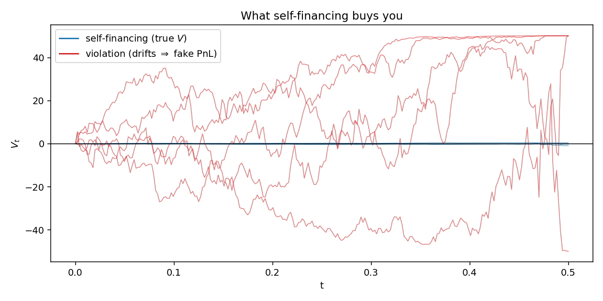
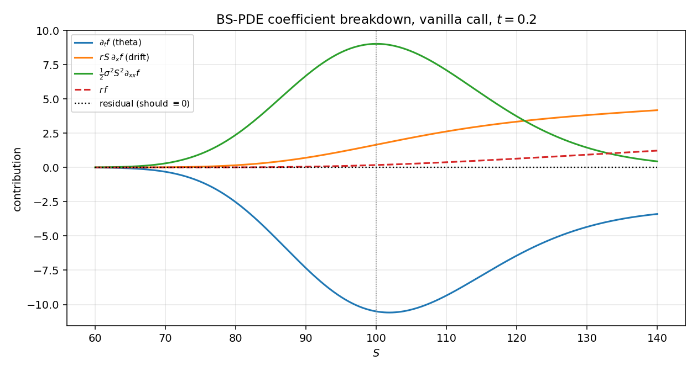
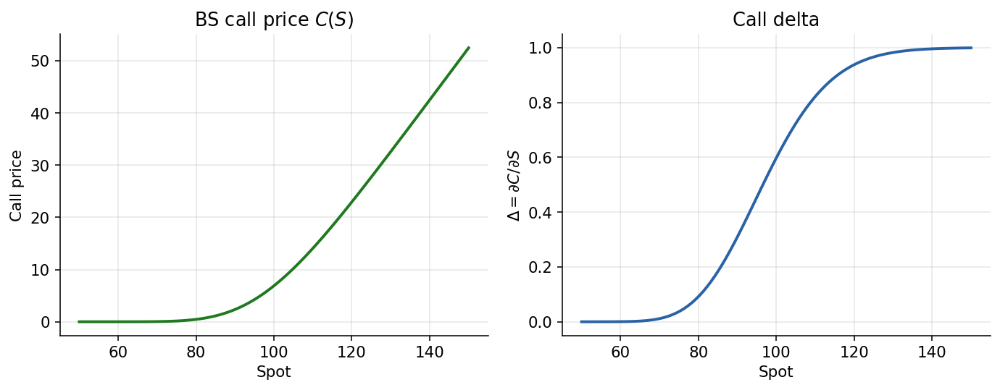
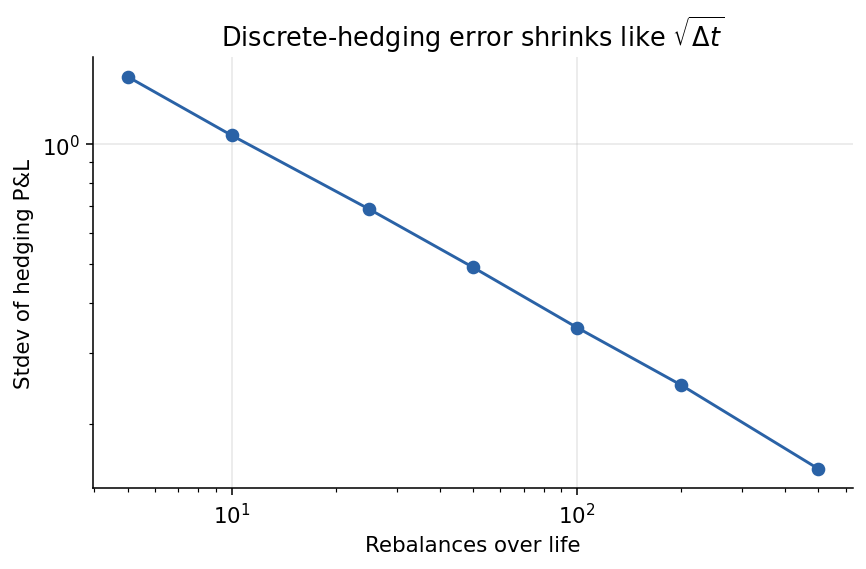
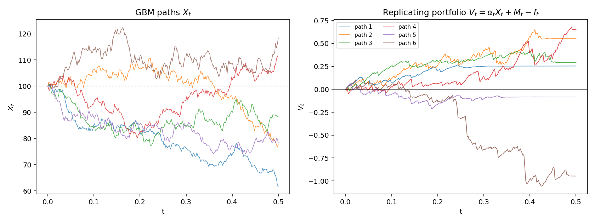
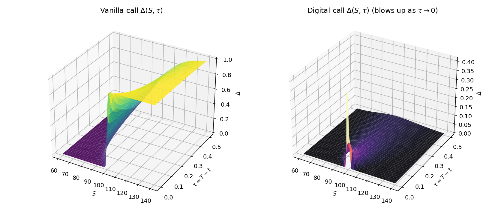

# Chapter 6 — Dynamic Hedging I: Self-Financing Strategies and the Black-Scholes PDE

*With Brownian motion, the Itô calculus, the Feynman-Kac bridge, and the
measure-change machinery now in hand (chapters 3-5), we have every tool we
need to derive the Black-Scholes partial differential equation from first
principles.*

The chapter proceeds in three acts. First we build the **self-financing
replicating portfolio** — a continuous-time limit of the discrete hedge of
Chapter 2 — and show that forcing it to have zero local risk produces a
**market price of risk** that is the same for every traded claim. Cross-
referencing Chapter 5, we'll see that this quantity is exactly the Girsanov
drift shift that turns the physical measure $\mathbb{P}$ into the pricing
measure $\mathbb{Q}$. Second, we derive the **generalised Black-Scholes
PDE** for a single-factor Itô-driven underlying, specialise it to geometric
Brownian motion, and read off the classical Black-Scholes formulas for
calls, puts, and digitals. We then show that the **same** PDE appears via a
Feynman-Kac martingale argument, closing the loop with Chapter 4. Third, we
turn to the **practical reality of discrete rebalancing**: we compute the
hedge-error distribution under time-based rebalancing, study its variance
scaling in $\sqrt{\Delta t}$, and examine a move-based alternative that
trades quadratic-variation budget for path-dependence.

Throughout, notation follows the stochastic-calculus primer in CH03.
Unqualified $W_t$ denotes a standard $\mathbb{P}$-Brownian motion; its
$\mathbb{Q}$-counterpart will be denoted $\widetilde W_t$ once the change
of measure is performed.

---

## 6.1 Setup — underlying, money market, and two contingent claims

Before we can write the replication argument, we have to be absolutely clear
about what is traded, what is observable but not traded, and what we are
trying to price. That taxonomy matters, because the machinery only works
when the thing we use for hedging is *something we can buy and sell*. If we
try to hedge a weather derivative by "selling temperature", the argument
collapses. The cleanest way to keep this straight is to introduce four
objects: an index, a bank account, a traded claim on the index, and a new
claim on the index whose value we want to discover.

It is worth pausing to notice that this cast of characters is more general
than the textbook "stock, bank, option" triple, and for good reason. In many
real markets the source of risk is not something you can hold in inventory.
You cannot own a share of the VIX; you cannot own a share of the S&P 500
index directly without replicating it component-by-component; you cannot own
a cubic metre of rain. What you *can* own are forwards, ETFs, futures, and
swaps whose value is a smooth function of the underlying index. Those
derived instruments are what we will call $g$ in the argument below, and
they are the true hedge vehicles. Keeping the index $X$ and the hedge $g$
formally distinct forces us to treat markets as they actually are: a
tradeable layer sitting on top of a possibly untradeable risk factor.

### 6.1.1 The underlying index

Assume there is some underlying index

$$
X = (X_t)_{0 \le t \le T}, \qquad \text{(not necessarily traded)}
$$

that satisfies, under the physical measure $\mathbb{P}$,

$$
\mathrm{d}X_t \;=\; \underbrace{\mu(t,X_t)}_{\text{drift}}\,\mathrm{d}t
\;+\; \underbrace{\sigma(t,X_t)}_{\text{volatility}}\,\mathrm{d}W_t. \tag{6.1}
$$

Think of $X_t$ as the quantity everyone is watching — a stock price, an
index level, a spread, a variance process. It is the *source of
uncertainty*. The drift $\mu(t,X_t)$ captures the systematic tendency of $X$
to rise or fall, and the volatility $\sigma(t,X_t)$ captures the scale of
the noise. Two features of (6.1) deserve emphasis. First, both coefficients
depend on $(t,X_t)$, which means the model already allows for local
volatility structures. Second, we stay deliberately agnostic about whether
$X$ is itself something one can purchase. For a stock, it is; for the VIX
or a credit spread, it is not, and we will need a separately traded
instrument to hedge.

The dependence on $(t,X_t)$ is rich enough to accommodate every
single-factor diffusion model that is popular in practice. Constant
volatility yields plain geometric Brownian motion. A power-of-$X$
volatility, like $\sigma(t,x) = \sigma x^\beta$ with $\beta < 1$, captures
the "leverage effect" seen in equities — volatility rises as prices fall. A
volatility that depends explicitly on time, $\sigma(t,x) = \sigma_0\,h(t)$,
models scheduled-event risk. A volatility that mean-reverts to a long-run
level would require a second factor, which is why single-factor
local-volatility models fall short of capturing skew *and* term structure
simultaneously.

A quick sanity check that this framework is rich enough: the drift
$\mu(t,X_t)$ can be whatever you want, including strongly mean-reverting or
trending. The deep fact we will discover is that for *hedging* purposes the
drift is irrelevant — the option price only depends on $\sigma$ and $r$. So
even though the setup allows an arbitrary drift, the punchline is that the
answer does not see it. That is not a bug; it is a feature. It means the
hedger does not need to forecast the stock's expected return, which is a
notoriously difficult exercise that nobody does well, and can price options
purely from volatility, which is comparatively easy to estimate.

### 6.1.2 The money-market account

The money-market account is traded:

$$
M = (M_t)_{0 \le t \le T},\qquad
\frac{\mathrm{d}M_t}{M_t} \;=\; r(t,X_t)\,\mathrm{d}t. \tag{6.2}
$$

The money-market account is the boring workhorse of the argument — the
riskless rail against which all excess returns are measured. Notice there
is no $\mathrm{d}W_t$ term: cash grows deterministically (at a rate that may
itself depend on time and the state $X_t$, so this still covers stochastic
short-rate models). In the body of this chapter we will typically treat $r$
as constant to keep the algebra clean, but the derivation never needs that
assumption until we specialise to closed-form solutions.

The name "money-market account" deserves some unpacking. In real markets,
the riskless rate is a legal fiction more than a physical instrument —
there is no single bond or deposit that delivers exactly $r_t$ with zero
credit risk and zero liquidity risk. What exists instead is a collection of
instruments (overnight repos, central-bank deposit facilities, short-term
Treasury bills, Fed funds) whose yields hover near some common reference
rate, and desks use the best available proxy. For derivatives priced
against an equity underlying, the usual proxy is the OIS curve (overnight-
indexed swap), because it matches the cost of funding a collateralised
derivatives position.

One more comment on what *finite variation* means for $M$. Because cash
accrues deterministically, the process $M_t$ has no quadratic variation. In
the Itô calculus vocabulary (CH03), $\mathrm{d}[M,M]_t = 0$ and
$\mathrm{d}[\beta,M]_t = 0$ for any adapted process $\beta$. This is why the
cross-variation term involving $M$ drops out of the self-financing expansion
in §6.2: cash does not "wiggle", so buying more cash at the current rate
does not generate a quadratic cross term.

### 6.1.3 A traded contingent claim $g$

Some contingent claim on $X$, call this claim $g$, is traded:

$$
g = (g_t)_{0 \le t \le T}, \qquad g_t = g(t,X_t).
$$

By Itô's lemma (CH03),

$$
\frac{\mathrm{d}g_t}{g_t} \;=\; \mu^g(t,X_t)\,\mathrm{d}t \;+\; \sigma^g(t,X_t)\,\mathrm{d}W_t, \tag{6.3}
$$

and in general

$$
\mathrm{d}g_t \;=\; \Big( \partial_t g(t,X_t) + \partial_x g(t,X_t)\,\mu(t,X_t)
+ \tfrac{1}{2}\,\partial_{xx} g(t,X_t)\,\sigma^2(t,X_t) \Big)\,\mathrm{d}t
\;+\; \partial_x g(t,X_t)\,\sigma(t,X_t)\,\mathrm{d}W_t. \tag{6.4}
$$

The role of $g$ is the workhorse of our hedge. We need *some* instrument
whose value moves with $X$, and which we can actually buy and sell, to
neutralise the $\mathrm{d}W_t$ risk in the claim we are pricing. In the
canonical stock setting, $g$ and $X$ are the same thing; in fixed income or
commodities, $g$ might be a futures contract written on an underlying swap
rate or a convenience-yielded spot; in volatility markets, $g$ could be a
variance swap. The key is only that $g$ is Itô-driven by the same Brownian
motion $W$ — the same source of randomness — because that is what allows a
linear combination to cancel the noise.

Equation (6.4) is Itô's lemma in its most workmanlike form, and it is worth
spending a moment on why every term is there. The drift of $g$ has three
pieces. The $\partial_t g$ piece is the *passage-of-time* effect: even if
the underlying does not move at all, the function $g(t,x)$ may still
change simply because $t$ is advancing. This is theta. The $\partial_x g
\cdot \mu$ piece is the *directional* effect — slope times speed, like any
chain rule. The $\tfrac12 \partial_{xx} g \cdot \sigma^2$ piece is the *Itô
correction*: in stochastic calculus, the second-order term does *not*
vanish, because $(\mathrm{d}W)^2 = \mathrm{d}t$. Convexity — the second
spatial derivative — injects a drift of its own into any function of a
diffusion process, and that drift is half the gamma times the instantaneous
variance. This is the mathematical seed of every gamma-trading argument in
the rest of the book.

The diffusion of $g$ is simpler: $\partial_x g \cdot \sigma$. The
volatility of $g$ is the volatility of $X$ times the slope of $g$ with
respect to $X$. If $g$ is a deep-in-the-money call, its slope is close to
one and its volatility is close to the stock's; if $g$ is deep out-of-the-
money, its slope is close to zero and its volatility is small.

### 6.1.4 Goal — price a new claim $f$

Goal: value a new claim $f = (f_t)_{0 \le t \le T}$ which pays at maturity

$$
f_T \;=\; \varphi(X_T),
$$

where $\varphi$ is the payoff, e.g. $\varphi(x) = (x - K)_+$ for a vanilla
call. Write $f_t = f(t,X_t)$. By Itô's lemma

$$
\frac{\mathrm{d}f_t}{f_t} \;=\; \mu^f(t,X_t)\,\mathrm{d}t \;+\; \sigma^f(t,X_t)\,\mathrm{d}W_t. \tag{6.5}
$$

Notice that $\mu^f$ and $\sigma^f$ are not free inputs: once we assume $f$
is a smooth function of $(t,X_t)$, Itô fixes both drift and diffusion in
terms of partial derivatives of $f$ and the coefficients of $X$. That fact
is what ultimately turns the hedging argument into a PDE — we will push the
equalities through until every economic condition is a condition on partial
derivatives of a single function.

There is a methodological subtlety worth flagging. The ansatz $f_t =
f(t,X_t)$ is a *modelling* assumption, not a law of nature. For vanilla
options it is uncontroversial; their payoff is a function of $X_T$ alone.
For path-dependent options — barriers, lookbacks, Asians — the assumption
is wrong as stated, and we have to enlarge the state variable to include
whatever path statistic the payoff depends on (running max, running
average, time spent below a barrier). The general framework then says the
price is a function of $(t, X_t, \text{path state})$ and Itô's lemma has to
be applied to that augmented state. For the rest of this chapter we stick
to the vanilla case.

### 6.1.5 A brief meditation on completeness

Before diving into the replication argument, it is worth pausing to note
the technical assumption hiding in plain sight: *market completeness*. The
framework posits a single Brownian motion $W$ driving $X$ and a single
traded asset $g$ whose volatility comes from the same $W$. That makes the
market complete with respect to claims that depend only on $(t, X_t)$:
every such claim can be replicated using stock and cash. If we enlarged the
state space — say, by making $\sigma$ itself a random process driven by an
independent Brownian motion $W^\sigma$ — we would lose completeness. There
would be claims that depend on the joint $(W, W^\sigma)$ that cannot be
replicated using $g$ and cash alone. We would need an additional hedge
instrument (typically another option) to span the second source of risk.

Real markets are in some sense "as complete as the hedging instruments
available", which is a moving target. More liquid underlyings (large-cap
equities, major indices) have richer options markets and therefore more
hedgeable risk dimensions. The theory in this chapter treats the
single-underlying, complete-market case; multi-factor and incomplete-market
extensions are natural generalisations but are beyond the scope of the
present exposition.

One implication of completeness is *uniqueness of price*. In a complete
market, there is a single risk-neutral measure $\mathbb{Q}$, and every
claim has a single fair price under it (CH05). In an incomplete market,
there can be a family of equivalent risk-neutral measures, and different
choices give different prices. The market has to coordinate on one of them
via trading and supply-demand dynamics, which introduces a residual
randomness to prices that is outside the pure replication argument.

---

## 6.2 The self-financing replicating portfolio

We hold:

- $\alpha_t$ — units of $g_t$,
- $\beta_t$ — units of $M_t$,
- $-1$ — unit of $f_t$.

In words: we are long $\alpha_t$ shares of the traded claim, we have
$\beta_t$ units of cash earning the short rate, and we are short exactly
one unit of the new claim $f$. The idea is that the stock-plus-cash
position tries to replicate $f$; if it succeeds, the *net* position has
zero risk and zero value. The discipline of replication is: pick $\alpha_t$
and $\beta_t$ — and only those two — to pay down the risk of the short $f$.

The mental picture is of a small machine with two adjustable knobs. The
first knob, $\alpha_t$, controls how much stock we hold; the second,
$\beta_t$, controls how much cash. At each instant, the trader twiddles
both knobs. The target of the twiddling is to make the machine's total
value track $f_t$ so closely that the net (machine minus short $f$) is
identically zero. If we succeed at every instant, the final machine value
at $t = T$ will exactly equal the option's payoff $\varphi(X_T)$, and the
short position we wrote at $t = 0$ is perfectly neutralised. The option's
value today is then the cost of setting the machine running on day zero.

We need self-financing strategies. Define the portfolio value

$$
V_t \;=\; \alpha_t\,g_t + \beta_t\,M_t - f_t. \tag{6.6}
$$

We need $V_0 = 0$ (zero initial cost — otherwise we are giving or taking
money for free at $t=0$).

The condition $V_0 = 0$ is essential. If the replicating stock-plus-cash
package costs more than what we collected for writing $f$, we have paid
for the hedge out of nowhere; if it costs less, someone handed us money
for free. A genuine replication argument must have the stock-plus-cash
package cost exactly $f_0$. The algebra below will show that this "fair
value" equals $f_0$ precisely when no-arbitrage holds, which is why the
argument cannot be decoupled from its economic premise.

At $t = 0$, we write the option (collect $f_0$) and immediately deploy
that cash — some into $\alpha_0$ shares of $g$, the rest into the
money-market account as $\beta_0$ units. After that initial allocation, no
fresh cash ever enters the portfolio; the only thing the trader does for
the rest of the option's life is *reshuffle* between stock and cash in
response to market moves and the passage of time. The minus sign in front
of $f_t$ is critical: we are the short side of $f$, which is the side that
has to build the hedge. The long side would simply hold the option and
wait.

### 6.2.1 Naïve differentiation vs self-financing

Taking the total differential:

$$
\mathrm{d}V_t \;=\; \mathrm{d}(\alpha_t g_t) + \mathrm{d}(\beta_t M_t) - \mathrm{d}f_t.
$$

Expanding by Itô's product rule (CH03),

$$
\mathrm{d}V_t \;=\; \underbrace{\mathrm{d}\alpha_t\,g_t}_{\text{extra}}
+ \alpha_t\,\mathrm{d}g_t + \underbrace{\mathrm{d}[\alpha,g]_t}_{\text{extra}}
+ \underbrace{\mathrm{d}\beta_t\,M_t}_{\text{extra}}
+ \beta_t\,\mathrm{d}M_t + \underbrace{\mathrm{d}[\beta,M]_t}_{=\,0}
- \mathrm{d}f_t. \tag{6.7}
$$

(The cross-variation $\mathrm{d}[\beta,M]_t = 0$ because $M$ is of finite
variation.) The self-financing constraint forces the "extra" rebalancing
pieces to cancel, i.e.

$$
\mathrm{d}\alpha_t\,g_t + \mathrm{d}[\alpha,g]_t + \mathrm{d}\beta_t\,M_t \;=\; 0. \tag{6.8}
$$

This is the single most conceptually important equation in the chapter,
and it is worth dwelling on. Ordinary calculus tells us that
$\mathrm{d}(\alpha g) = \alpha\,\mathrm{d}g + g\,\mathrm{d}\alpha$. That
identity is mathematically correct but *financially wrong*: it records
changes in wealth that would have required money to appear or disappear
from nowhere. The $g\,\mathrm{d}\alpha$ term is the dollar cost of *adding
new shares* at the current price, which a trader does not pay from thin
air — she has to sell some of her money-market holding to fund the
purchase. The equation (6.8) is the formal version of that common-sense
statement.

To make the point visceral: imagine you hold 100 shares of a \$50 stock,
worth \$5000. Suppose you suddenly decide you want to hold 200 shares, and
at the moment of decision the stock is still at \$50. Did your wealth just
jump by \$5000? Of course not — you had to hand \$5000 of cash to the
market to get those extra shares. Naïve calculus says $\mathrm{d}(\alpha g) =
g\,\mathrm{d}\alpha$ would count that \$5000 as new wealth, which is
absurd. The self-financing constraint (6.8) says that the cash leg
$\beta_t M_t$ has to shrink by exactly \$5000 in the same instant, so the
*total* portfolio value is unchanged by the rebalance itself. Only
subsequent *price* moves — the stock going from \$50 to \$51, the bank
accruing interest — change the total wealth. This is the iron law we are
about to build the whole pricing theory on: dollars don't appear, dollars
don't vanish, and the only source of P&L is mark-to-market.

The cross-variation term $\mathrm{d}[\alpha,g]_t$ deserves a final
comment. If $\alpha_t$ is a diffusion — meaning the trader's position
itself has a $\mathrm{d}W$ component, which happens whenever $\alpha_t =
\partial_x f(t,X_t)$ and $X$ is Itô-driven — then $\alpha$ and $g$ share a
common Brownian driver and their covariation is non-zero. That cross-term
lives in the rebalance leg and is absorbed into the self-financing
constraint. In the discrete world of §6.11 it shows up as the
$(\alpha_{t_n} - \alpha_{t_{n-1}})\,X_{t_n}$ piece of the bank recursion:
when you change your share count, you trade the *difference* at the
prevailing price, and the cash account absorbs the cost.

### 6.2.2 Interpreting self-financing

Between $t$ and $t + \Delta t$ we move from $(\alpha_t,\beta_t)$ to
$(\alpha_{t+\Delta t},\beta_{t+\Delta t})$; the change in wealth consists
only of the asset moves $\Delta g_t$ and $\Delta M_t$, not of fresh money
injected from outside:

$$
\Delta V_t \;=\; \alpha_t\,(\Delta g_t) + \beta_t\,(\Delta M_t) - \Delta f_t. \tag{6.9}
$$

> Why self-financing means $\mathrm{d}V = \alpha\,\mathrm{d}g +
> \beta\,\mathrm{d}M - \mathrm{d}f$. The naive Itô expansion contains six
> terms (two $\mathrm{d}\alpha\,g$-style rebalance terms, two "hold" terms
> $\alpha\,\mathrm{d}g, \beta\,\mathrm{d}M$, a quadratic cross-variation
> $\mathrm{d}[\alpha,g]$, and $\mathrm{d}f$). But a trader never swaps
> cash into or out of the portfolio from outside — so when she buys
> $\mathrm{d}\alpha$ more shares of $g$ she must sell enough $M$ to pay
> for it at the current price $g_t$. The self-financing constraint (6.8)
> is the statement "the rebalance leg is free". What survives is exactly
> the mark-to-market of the *held* positions: $\alpha\,\mathrm{d}g +
> \beta\,\mathrm{d}M$. Wealth moves only because markets moved, never
> because money appeared.

A portfolio that is self-financing is one whose wealth process is
*pathwise* determined by the asset price paths and the initial position —
no external injections, no trapdoors where money can appear. This is the
financial analogue of conservation of energy: nothing gets spent or
produced in the rebalance itself. The implication for pricing is profound:
if two self-financing portfolios end at the same terminal value on every
path, they must have the same value today, because if they didn't, buying
the cheap one and shorting the expensive one would yield a costless
portfolio with zero risk and a positive initial P&L — a free lunch.


*Dropping the rebalance-cost term fabricates PnL — the classic "something
for nothing" that (6.8) forbids.*

### 6.2.3 Applying the self-financing constraint

After cancellation,

$$
\mathrm{d}V_t \;=\; \alpha_t\,\mathrm{d}g_t + \beta_t\,\mathrm{d}M_t - \mathrm{d}f_t. \tag{6.10}
$$

The only surviving terms are the three "mark-to-market" pieces: the P&L
from the $\alpha_t$ shares of $g$ because $g$ moved, the interest accrual
on the bank account, and the change in the liability $f$. There is
*nothing else*.

Substituting (6.2), (6.3), (6.5):

$$
\mathrm{d}V_t \;=\; \alpha_t\big(\mu^g_t g_t\,\mathrm{d}t + \sigma^g_t g_t\,\mathrm{d}W_t\big)
+ \beta_t M_t r_t\,\mathrm{d}t
- \big(\mu^f_t f_t\,\mathrm{d}t + \sigma^f_t f_t\,\mathrm{d}W_t\big). \tag{6.11}
$$

Collecting drift and diffusion,

$$
\boxed{\;\mathrm{d}V_t \;=\; \big(\alpha_t\mu^g_t g_t + \beta_t M_t r_t - \mu^f_t f_t\big)\,\mathrm{d}t
\;+\; \big(\alpha_t\sigma^g_t g_t - \sigma^f_t f_t\big)\,\mathrm{d}W_t\;} \tag{6.12}
$$

Equation (6.12) has the form $\mathrm{d}V_t = \text{drift}\,\mathrm{d}t +
\text{noise}\,\mathrm{d}W_t$, and we have two free knobs — $\alpha_t$ and
$\beta_t$ — to play with. The strategy is exactly what a sensible trader
would do in words: first get rid of the noise (pick $\alpha_t$ to
annihilate the $\mathrm{d}W_t$ coefficient), then inspect what remains and
let economics constrain the rest.

This two-stage procedure — kill noise, then inspect drift — is the
mathematical heart of every replication argument in finance. If the
underlying has $k$ sources of risk instead of one, we need $k$ traded
claims instead of one; we pick $k$ holdings to kill each of the $k$ noise
terms simultaneously; the remaining drift must equal the risk-free rate on
the net cash position. In the Heston stochastic-volatility model, for
example, there are two sources of risk (the stock's diffusion and the
volatility's diffusion), and we need two hedge instruments (the stock and
another option) to kill both.

---

## 6.3 Locally removing the risk — the delta-hedge ratio

Locally remove risk, so set the $\mathrm{d}W_t$ coefficient to zero:

$$
\alpha_t\,\sigma^g_t\,g_t - \sigma^f_t\,f_t \;=\; 0
\;\;\Longrightarrow\;\;
\boxed{\;\alpha_t \;=\; \frac{\sigma^f_t}{\sigma^g_t}\,\frac{f_t}{g_t}\;} \tag{6.13}
$$

This is the delta-hedge ratio in its most general form. Before we unpack
it, note what we have achieved: the instant we pick $\alpha_t$ as above,
the *random* part of $\mathrm{d}V_t$ — the bit that depends on which
direction the Brownian motion happened to move — disappears. Over a small
enough interval, the portfolio is locally riskless.

The formula has a crystalline interpretation: $\alpha_t$ is the ratio of
the dollar-volatilities of $f$ and $g$. If $f$ is twice as volatile in
dollar terms as $g$, we need twice as many units of $g$ to keep up. In
the common case where $g = X$ (the stock itself is traded), we have
$\sigma^g_t g_t = \sigma^x_t$ and $\sigma^f_t f_t = \sigma^x_t\,\partial_x
f$, so the ratio collapses to $\alpha_t = \partial_x f$ — the partial
derivative of the option value with respect to the spot, a.k.a. the
*delta*. The replicating portfolio is the option's Doppelgänger: at each
instant, it holds exactly as much stock as the option's price is sensitive
to the stock — no more, no less.

A concrete numerical illustration. Suppose the stock is trading at \$100
with $\sigma = 20\%$, so the dollar volatility of one share is roughly
$100 \cdot 0.20 = 20$ dollars per unit of $W$. Suppose the option we are
hedging has $\partial_x f = 0.6$, so its dollar volatility is $0.6 \cdot
20 = 12$ dollars per unit of $W$. To neutralise the option's Brownian
motion exposure, we hold $0.6$ shares of stock. If the stock now moves by
1% in a tiny interval, the option's price moves by $0.6 \cdot 1\% \cdot
100 = 0.60$ dollars and the share position moves by $0.6 \cdot 1 = 0.60$
dollars — they cancel to the instant.

A useful edge case. A deep-ITM call has delta approaching 1, so the
hedger holds roughly one full share per option. A deep-OTM call has delta
approaching 0, so the hedger holds almost no stock, and the bank account
is approximately the option's premium invested at the risk-free rate. Again,
gamma is nearly zero, rebalancing is minimal. The hedging problem is
*easy* in both extremes and hardest *at the money*, where the delta is
around 0.5 but the gamma is large and rebalancing is frequent.

One subtlety worth flagging: the formula $\alpha_t = \partial_x f(t, X_t)$
is not a *static* ratio. As time passes and the stock moves, both arguments
of the partial derivative change, and the required hedge ratio changes
too. This is why dynamic hedging is called *dynamic*: the hedge ratio is a
moving target that must be chased.

With this choice,

$$
\mathrm{d}V_t \;=\; \big(\alpha_t \mu^g_t g_t + \beta_t M_t r_t - \mu^f_t f_t\big)\,\mathrm{d}t
\;=\; \mathcal{A}_t\,\mathrm{d}t. \tag{6.14}
$$

After the $\mathrm{d}W_t$ term has been killed, the remaining dynamics are
purely deterministic over an infinitesimal interval. The portfolio earns
some drift $\mathcal{A}_t$ per unit time, and the question becomes: what
does that drift have to be?

### 6.3.1 No-arbitrage forces $\mathcal{A}_t = 0$

- If $\mathcal{A}_t > 0$: profit guaranteed — arbitrage.
- If $\mathcal{A}_t < 0$: reverse the strategy to get profit.

The argument is stark. We have built, by pure bookkeeping, a self-financing
portfolio with zero initial cost ($V_0 = 0$) and zero instantaneous risk.
If its value drifts upward, we are printing money; if it drifts downward,
we swap the signs of all holdings and *then* we are printing money. The
only logical possibility consistent with no free lunches is that the drift
is exactly zero.

Therefore, to avoid arbitrage,

$$
\boxed{\;\mathcal{A}_t \;=\; 0\;}. \tag{6.15}
$$

Combined with $V_0 = 0$, the entire portfolio process satisfies $V_t = 0$
for all $t$, hence

$$
\mathcal{A}_t = 0 \;\Longrightarrow\; V_t = 0 \;\Longrightarrow\;
\alpha_t g_t + \beta_t M_t - f_t = 0
\;\Longrightarrow\; \beta_t M_t \;=\; f_t - \alpha_t g_t. \tag{6.16}
$$

Equation (6.16) is the pricing identity in disguise. Read it from right
to left: at any instant, the unique cash holding that keeps the hedge
costless is precisely $f_t - \alpha_t g_t$. Equivalently, the value of
the option *is* the value of the self-financing stock-plus-cash package
that replicates it. The pricing question has been reduced to a
constructive recipe: hold $\alpha_t$ shares of $g$, hold $(f_t - \alpha_t
g_t)/M_t$ units of the money market, and the wealth of the package exactly
tracks the option from now until expiry.

To see the recipe in practical terms, suppose the option value right now
is \$3.50 and the delta is 0.6, and the stock is at \$100. The
replicating package holds 0.6 shares (worth \$60) and has $-\$56.50$ in
the money market (i.e. borrows \$56.50). The total package value is $0.6
\cdot 100 - 56.50 = 3.50$, which matches the option. If the stock rises
to \$101, the shares are worth $0.6 \cdot 101 = \$60.60$ and the loan is
now slightly more expensive by the interest accrual, but the option
itself has risen by the first-order amount $0.6 \cdot \$1 = \$0.60$ to
\$4.10. The package now holds the updated delta (say 0.62) of the new
stock price, so the trader must buy $0.02$ shares, funded by additional
borrowing. And so on, every instant. That is the whole game.

---

## 6.4 Market price of risk

Having extracted the zero-drift consequence, we unpack it into a statement
about expected returns, which turns out to be one of the deepest identities
in quantitative finance.

Write out $\mathcal{A}_t = 0$:

$$
\alpha_t \mu^g_t g_t + r_t\,(f_t - \alpha_t g_t) - \mu^f_t f_t \;=\; 0. \tag{6.17}
$$

Rearrange,

$$
\alpha_t\,\mu^g_t\,g_t + r_t f_t - r_t \alpha_t g_t - f_t \mu^f_t \;=\; 0. \tag{6.18}
$$

Recall $\alpha_t = \dfrac{\sigma^f_t}{\sigma^g_t}\dfrac{f_t}{g_t}$.
Substituting and dividing by $f_t$,

$$
\frac{\mu^g_t - r_t}{\sigma^g_t} \;=\; \frac{\mu^f_t - r_t}{\sigma^f_t}
\;=\; \lambda_t \;=\; \lambda(t,X_t). \tag{6.19}
$$

> **Sharpe ratios of all assets on the underlying index are equal.**

We started from a single no-arbitrage condition and derived that every
single derivative on $X$ — vanilla call, digital, variance swap, structured
product — must have the same expected excess return per unit of
volatility. They can have wildly different drifts and wildly different
volatilities, but the *ratio* of excess return to volatility is pinned down
to the same number $\lambda_t$ for every instrument on the same
underlying. Economics collapses the whole zoo into one scalar.

$\lambda_t$ is the **market price of risk** — a market property (not an
asset-specific quantity). Thus

$$
\boxed{\;\frac{\mu^f_t - r_t}{\sigma^f_t} \;=\; \lambda_t
\;\Longleftrightarrow\;
\mu^f_t - r_t \;=\; \lambda_t\,\sigma^f_t\;}. \tag{6.20}
$$

> **The connection to Girsanov.** In CH05 we derived Girsanov's theorem:
> given a predictable shift $\lambda_t$, there is an equivalent measure
> $\mathbb{Q}$ under which $\widetilde W_t := W_t + \int_0^t
> \lambda_s\,\mathrm{d}s$ is a Brownian motion. Under $\mathbb{Q}$ the drift
> of $X$ becomes $\mu^x_t - \sigma^x_t\,\lambda_t$. Equation (6.20) is
> *exactly* the economic statement that picks out the Girsanov shift
> $\lambda_t$ that neutralises the risk premium: under $\mathbb{Q}$, every
> traded claim on $X$ has drift $r_t$ (no risk premium), which is the
> defining property of the risk-neutral measure. The "market price of risk"
> and the "Girsanov drift shift" are the *same scalar*, viewed from two
> sides: economics says every instrument must share it, CH05 says a
> specific measure change zeros it out.

Rewriting (6.20) as $\mu^f_t = r_t + \lambda_t\,\sigma^f_t$ says that
*every* instrument's expected return decomposes into a risk-free piece and
a risk premium. The risk premium is not some mysterious extra — it is
literally the volatility of the instrument times the market price of a
unit of volatility. A stock with twice the volatility of another, in the
same market, must deliver twice the excess return in expectation (under
the physical measure). An option that has five times the dollar-volatility
of the stock must deliver five times the excess return.

Under $\mathbb{Q}$, the construct that makes all instruments drift at the
risk-free rate, the market price of risk is zero: it is the fictitious
world where risk-takers demand no compensation. Pricing under $\mathbb{Q}$
is pricing *as if* no one required a risk premium, which is correct for a
replication-cost argument because the replicator does not care about risk
premiums — she has eliminated the risk entirely. The Girsanov shift
$-\sigma\lambda$ in the drift is precisely the adjustment from the real
world (where risk is priced) to the risk-neutral world (where it is not).
And because the shift is only to the drift, not to the diffusion
coefficient, all variance-based quantities (gamma P&L, vega P&L) are the
same under either measure. The variance is measure-invariant; only the
drift shifts.

A concrete number may help ground the concept. Over the past century the
US equity market has earned roughly 6-7% per year in excess of the
risk-free rate with an annualised volatility of roughly 15-17%. That
gives a long-run Sharpe ratio of about 0.4, which is the implicit estimate
of $\lambda$ that equity markets offer to long-term investors. When
market participants talk about "risk premium" in casual conversation,
they are usually talking about the quantity $\lambda \cdot \sigma$ — the
extra expected return in percentage points per year — but the cleaner
object is $\lambda$ itself, because it is shared across all instruments
on the same underlying.

An illuminating thought experiment. Imagine two derivatives on the same
stock, a vanilla call and a digital. In real-world statistics, the call
might have an expected excess return of 30% per year with a volatility of
75% per year; the digital might have an expected excess return of 3% with
a volatility of 7.5%. Naively these look like very different risk-reward
profiles. But their Sharpe ratios are both 0.4, exactly matching the
stock's. The market is saying that despite one being ten times more
volatile than the other in absolute terms, both are paying the same
*price* per unit of risk exposure. Noting this invariance is what makes
(6.19) such a powerful pricing lens: it strips out the incidental scale
of each instrument and reveals a single underlying risk-price that all
of them respect.

One more remark. The market price of risk is a *state-dependent*
quantity; $\lambda_t = \lambda(t, X_t)$ in general, not a constant. In
quiet bull markets investors are willing to take risk cheaply, so
$\lambda$ is small; in panics after a crash $\lambda$ can spike as
investors demand enormous compensation for exposure. The option prices
derived below do *not* depend on $\lambda$ because the replicator erases
the risk altogether. But the *flow* of orders in the options market —
whether people are net buyers or sellers of protection — does depend on
$\lambda$, because risk-averse investors with high $\lambda$ are willing
to pay more for a put than risk-neutral replicators.

---

## 6.5 The generalised Black-Scholes PDE

We have a scalar identity: $\mu^f - r = \lambda \sigma^f$. We now translate
it into a PDE by recalling what $\mu^f$ and $\sigma^f$ actually *are* — Itô
expressions involving partial derivatives of the pricing function
$f(t,x)$. Substituting those expressions turns the economic statement
into a differential equation that the pricing function must satisfy.

The move from a scalar identity to a partial differential equation is a
small conceptual leap that is easy to miss on first reading. The identity
$\mu^f - r = \lambda \sigma^f$ is a statement about numbers: at every
instant, some particular combination of numbers must vanish. But those
numbers are themselves computed from the pricing function $f(t,x)$ via
Itô's lemma, so the statement is really "this combination of partial
derivatives of $f$ must vanish at every point $(t,x)$". That, by
definition, is a partial differential equation.

Recall (via Itô's lemma) for $f(t,x)$:

$$
\mu^f_t \;=\; \frac{\partial_t f_t + \mu^x_t\,\partial_x f_t
+ \tfrac{1}{2}(\sigma^x_t)^2\,\partial_{xx}f_t}{f_t}, \tag{6.21}
$$

$$
\sigma^f_t \;=\; \frac{\sigma^x_t\,\partial_x f_t}{f_t}. \tag{6.22}
$$

(Here $\mu^x_t,\sigma^x_t$ are the coefficients of $X$ from (6.1).) Plug
into $\mu^f_t - r_t = \lambda_t \sigma^f_t$:

$$
\partial_t f_t + \big(\mu^x_t - \sigma^x_t \lambda_t\big)\,\partial_x f_t
+ \tfrac{1}{2}(\sigma^x_t)^2\,\partial_{xx}f_t \;=\; r_t\,f_t. \tag{6.23}
$$

This has to hold $\forall (t,x)$. Hence:

$$
\boxed{\;\begin{aligned}
&\partial_t f(t,x) + \big(\mu^x(t,x) - \sigma^x(t,x)\,\lambda(t,x)\big)\,\partial_x f(t,x) \\
&\qquad + \tfrac{1}{2}\big(\sigma^x(t,x)\big)^2\,\partial_{xx}f(t,x) \;=\; r(t,x)\,f(t,x), \\
&\qquad\qquad\qquad\qquad\qquad f(T,x) \;=\; \varphi(x).
\end{aligned}\;} \tag{6.24}
$$

**Generalised Black-Scholes PDE.**

This is the consistency condition that ties together everything the option
is going to do between now and expiry. The terminal condition $f(T,x) =
\varphi(x)$ anchors the pricing function at maturity to the payoff shape,
and the PDE propagates that shape back in time. The replicating
portfolio's delta today — $\partial_x f(t,X_t)$ — is chosen precisely so
that the option we are manufacturing ends up with the right payoff
tomorrow.

Look at the structure of the PDE for a moment. The linear operator on the
left-hand side is a backwards parabolic operator — backwards because time
flows the "wrong" way (we propagate from the terminal condition at $T$
back to the present), parabolic because the second-order derivative
appears with a positive coefficient. Parabolic equations describe
diffusion-like evolution: information smears out as time flows, corners
round off, sharp features disappear. In option pricing, that translates
to the idea that any fine-grained feature of the payoff at maturity — a
sharp kink at the strike, a step at a digital, a cliff at a barrier —
gets smoothed out as we go backwards in time.

The coefficient $(\mu^x - \sigma^x \lambda)$ multiplying $\partial_x f$
deserves special attention. It is not the physical drift $\mu^x$; it is
the physical drift minus the risk premium $\sigma^x \lambda$. The
subtraction is exactly the Girsanov shift from CH05 that turns the
physical $\mathbb{P}$-Brownian motion into a risk-neutral
$\mathbb{Q}$-Brownian motion. So (6.24) can be read as "the expected rate
of change of $f$ along a risk-neutral drift, plus the Itô correction,
equals the carry cost". In expectation form, the same statement is
Feynman-Kac (CH04), as we will see again in §6.7A and (6.40).

> **Why the BS PDE encodes no-arbitrage.** Read (6.24) coefficient-by-
> coefficient: the $\partial_x f$ term carries the risk-neutral drift
> $(\mu^x - \sigma^x\lambda)$, not the physical drift $\mu^x$. That
> subtraction $-\sigma^x\lambda$ is exactly the Girsanov change-of-measure
> (CH05) that turns $W$ into a $\mathbb{Q}$-Brownian motion. The $\tfrac12
> (\sigma^x)^2\,\partial_{xx} f$ term is Itô's curvature correction — it
> is independent of drift, which is why option prices ultimately don't
> depend on $\mu$. The RHS $r f$ says the whole hedge-replicating
> portfolio must grow at the risk-free rate (otherwise §6.3.1's arbitrage
> trade exists). The Feynman-Kac representation (6.40) is *the same
> statement* in expectation form.
>
> **What happens when $\Delta$ is wrong.** If you hold $\alpha_t \ne
> \partial_x f$, the $\mathrm{d}W_t$ coefficient (6.12) is non-zero and
> the hedge error over $[t, t+\mathrm{d}t]$ is $(\alpha_t\sigma^g_t g_t -
> \sigma^f_t f_t)\,\mathrm{d}W_t$ — a mean-zero *noise* term plus a
> second-order drift $\tfrac12\,\partial_{xx} f\,(\mathrm{d}X_t^2 -
> \sigma^2 X_t^2\mathrm{d}t)$ that accumulates as realised-minus-implied
> variance. This is the famous *P&L attribution*: discretely-hedged short
> gamma loses money when realised vol exceeds implied, and makes money
> when it under-realises. See `ch06-hedge-error.png`.

That P&L attribution deserves a second look, because it is the most
practically important fact in all of options trading. When we sell an
option and delta-hedge it using the Black-Scholes delta computed with an
implied volatility $\sigma_{\text{imp}}$, our instantaneous P&L is (to
leading order) proportional to $\Gamma \cdot S^2 \cdot
(\sigma_{\text{imp}}^2 - \sigma_{\text{real}}^2)\,\mathrm{d}t$. If
realised volatility turns out to be lower than the implied volatility we
priced the option at, the short-option position makes money on each small
interval; if realised is higher, we lose. The gamma $\Gamma = \partial_{xx}
f$ multiplies everything because it is the "curvature" of the payoff —
a payoff with no curvature has no gamma exposure and no sensitivity to
the realised variance path. The cleanest way to think of option P&L is
therefore as a daily duel between implied and realised variance, weighted
by the gamma we are carrying. The option market is, in a very real sense,
a market for variance.

To make the decomposition explicit, consider what happens over a small
interval $[t, t+\mathrm{d}t]$ when we are short one option and hold
$\alpha_t = \partial_x f(t, X_t)$ shares of stock. The option moves by
$\mathrm{d}f = \partial_t f\,\mathrm{d}t + \partial_x f\,\mathrm{d}X +
\tfrac12 \partial_{xx} f\,(\mathrm{d}X)^2$ by Itô, where $(\mathrm{d}X)^2
= \sigma_{\text{real}}^2 X^2\,\mathrm{d}t$ on the realised path. Using the
PDE (6.27) with $\sigma_{\text{imp}}$ as the model volatility, the net
P&L on the short-option package works out to

$$
\tfrac12 \partial_{xx} f \cdot X^2 \cdot (\sigma_{\text{imp}}^2 -
\sigma_{\text{real}}^2)\,\mathrm{d}t.
$$

If realised vol came in below implied, this is positive — the short
wins; if above, the short loses.

A delta-hedged short-option position has *zero* exposure to the stock's
level and *pure* exposure to realised variance. A trader who is bearish
on volatility can express that view cleanly by selling options and
delta-hedging. Her P&L is a textbook variance swap, paid off in continuous
time as a function of the realised-minus-implied variance along the path.


*Theta pays for gamma: the three LHS terms balance $r f$ *exactly* — the
dotted residual is numerically zero.*

One more framing, for readers who like symmetries. The BS PDE is often
written as "theta plus convection plus diffusion equals interest", and
each piece has a trading interpretation: theta is the time-decay we earn
(or pay) for holding the option, convection is the drift-driven
directional re-pricing, diffusion is the gamma-weighted re-pricing from
variance, and the RHS interest is the financing cost of the replication.
A long-gamma, short-theta option is paying you theta every day for the
right to harvest gamma-variance; the BS PDE is the identity that, once we
pick a consistent volatility, makes those two cancel exactly in
expectation.

One more observation about the structure of (6.24) that is often
overlooked. The PDE is linear in $f$. This linearity is the reason option
prices obey simple addition: the price of a portfolio of options equals
the sum of the prices of the individual options. Traders exploit this
every day by building structured products out of simple building blocks —
a call spread is a long-call minus a short-call, a straddle is a
long-call plus a long-put, a butterfly is a specific linear combination
of three strikes. Each of these structures is a sum of vanilla
instruments, and its price is the sum of the corresponding BS formulas.

---

## 6.6 Specialising to Black-Scholes (GBM)

The generalised PDE is beautiful but abstract. To get to numbers, we
specialise to the single most famous setting in quantitative finance:
geometric Brownian motion. In GBM, the stock has constant proportional
drift and volatility, and it is traded directly — so $g = X$.

In the Black-Scholes model:

$$
\mu^x(t,x) \;=\; \mu x, \qquad \sigma^x(t,x) \;=\; \sigma x,
$$

so

$$
\mathrm{d}X_t \;=\; X_t \mu\,\mathrm{d}t + X_t \sigma\,\mathrm{d}W_t. \tag{6.25}
$$

In divided form, $\mathrm{d}S_t/S_t = \mu\,\mathrm{d}t +
\sigma\,\mathrm{d}W_t$: the *percentage* increment of the stock is a
Gaussian with mean $\mu\,\mathrm{d}t$ and variance $\sigma^2\,\mathrm{d}t$
— geometric Brownian motion. Applying Itô's lemma to $\ln S_t$ (CH03)
turns this into a constant-coefficient arithmetic SDE,

$$
\mathrm{d}(\ln S_t) \;=\; \big(\mu - \tfrac12\sigma^2\big)\,\mathrm{d}t \;+\; \sigma\,\mathrm{d}W_t,
$$

which integrates immediately. Exponentiating,

$$
S_t \;=\; S_0\,\exp\!\Big(\big(\mu - \tfrac12\sigma^2\big)\,t \;+\; \sigma W_t\Big)
\;\stackrel{d}{=}\; S_0\,\exp\!\Big(\big(\mu - \tfrac12\sigma^2\big)\,t \;+\; \sigma\sqrt{t}\,Z\Big),
\qquad Z \sim \mathcal{N}(0,1).
\tag{6.25a}
$$

The distribution of $S_t$ is therefore log-normal with log-mean $(\mu -
\tfrac12\sigma^2)\,t$ and log-variance $\sigma^2 t$. The $-\tfrac12\sigma^2$
term is the Itô correction: without it, $\mathbb{E}[S_t]$ would *not*
equal $S_0 e^{\mu t}$. With it, $\mathbb{E}[S_t] = S_0 e^{\mu t}$ exactly.

Take $g(t,x) = x$, so that $X$ is indeed traded (with $\sigma^g = \sigma$,
$\mu^g = \mu$), and let $r(t,x) = r$ (constant). Therefore

$$
\lambda \;=\; \frac{\mu - r}{\sigma}. \tag{6.26}
$$

In GBM, the market price of risk is literally the stock's Sharpe ratio.
That identity, which fell out of a general no-arbitrage argument, is what
gives $\lambda$ its evocative name and what motivates the risk-neutral
measure $\mathbb{Q}$ (CH05) as the probability law under which the stock
drifts at the risk-free rate.

Substituting into (6.24):

$$
\partial_t f + \underbrace{(\mu - \sigma\lambda)}_{=\,r}\,x\,\partial_x f
+ \tfrac{1}{2}\sigma^2 x^2\,\partial_{xx}f \;=\; r f.
$$

$$
\boxed{\;\begin{aligned}
&\partial_t f + r\,x\,\partial_x f + \tfrac{1}{2}\sigma^2 x^2\,\partial_{xx} f \;=\; r f, \\
&f(T,x) \;=\; \varphi(x).
\end{aligned}\;} \tag{6.27}
$$

**Black-Scholes PDE.**

Look at what happened: the stock's physical drift $\mu$ disappeared
completely from the PDE. It was absorbed by the market price of risk
combination $\mu - \sigma\lambda$, which is just $r$. Option prices under
no-arbitrage do not depend on the real-world expected return of the stock
— a fact that was counterintuitive to early practitioners but which makes
perfect sense once you realise the option is being priced by its
replication cost, and the replication only cares about the *scale* of
the stock's noise, not its direction.

This is one of those results that sounds impossible until you see why.
The common intuition says "options on a stock with a higher expected
return should be worth more". The intuition is correct for *unhedged*
investors, who pay for calls expecting to profit from the drift. But it
is wrong for *hedgers*, who are building a machine that tracks the payoff
state-by-state regardless of the drift. The hedger's cost depends only on
how hard the machine has to work, and a machine working against a
high-vol stock has a harder job than one working against a low-vol stock,
regardless of drift. The two perspectives reconcile via the risk-neutral
measure: a hedger's fair price is the same as an "investor's fair price"
under a world where everyone is risk-neutral.

To drive this home with a numerical example, consider two hypothetical
stocks. Stock A is a high-growth tech company with expected annual return
15% and volatility 30%. Stock B is a boring utility with expected annual
return 3% and volatility 30%. Both trade at \$100; we price a 1-year
at-the-money call with $r = 5\%$. The Black-Scholes call price depends on
$x$, $K$, $r$, $\sigma$, $T-t$ — not on $\mu$. The same number for both
stocks.

One more angle: because the drift is eliminated, implied volatility is
revealed as "the market's forecast of future volatility" in a very
specific sense. An at-the-money implied vol of 20% is the market's
unbiased estimate of the root-mean-square of log-returns over the
option's life, *under the risk-neutral measure*. Under the physical
measure it might be a little different (typically a bit lower, because
the risk-neutral measure puts more weight on bad outcomes), but the gap
is small for liquid equity options.

---

## 6.7 Black-Scholes formulas for call, put, and digital

With the PDE (6.27) in hand, we can read off closed forms for the three
canonical vanilla payoffs. The call and put solutions can be obtained
either by substituting an ansatz into (6.27), by computing the
risk-neutral expectation directly under (6.25a), or — most concisely —
via the Feynman-Kac bridge of CH04. All three routes give the same
formulas; we record them here and defer the derivation details to §6.7A.

**Vanilla call.** For $\varphi(x) = (x - K)_+$,

$$
\boxed{\;f(t,x) \;=\; x\,\Phi(d_+) \;-\; K\,e^{-r(T-t)}\,\Phi(d_-)\;} \tag{6.28}
$$

with

$$
d_\pm \;=\; \frac{\ln(x/K) + \big(r \pm \tfrac{1}{2}\sigma^2\big)(T-t)}{\sigma\sqrt{T-t}}. \tag{6.29}
$$

Equation (6.28) is the **Black-Scholes call formula**. You can read it in
two pieces: the first term $x\,\Phi(d_+)$ is the expected stock payoff
*given that the option expires in the money* — a probability-weighted
piece of the stock, computed under the stock-numeraire measure. The
second term $K\,\Phi(d_-)\,e^{-r(T-t)}$ is the discounted strike times the
risk-neutral probability of being in the money. The difference is the
expected net gain from exercising. The symmetry $d_+ = d_- +
\sigma\sqrt{T-t}$ connects the two terms: the extra $\sigma\sqrt{T-t}$ in
$d_+$ is the "vol lift" that accounts for the fact that, conditional on
ending in the money, the expected log-price is elevated relative to its
unconditional median.

**Vanilla put.** For $\varphi(x) = (K - x)_+$, the cleanest route is via
**put-call parity**. From the algebraic identity $(X_T - K)_+ - (K -
X_T)_+ = X_T - K$, take risk-neutral expectations and discount:

$$
\boxed{\;C(t,x) - P(t,x) \;=\; x - K\,e^{-r(T-t)}\;} \tag{6.30}
$$

Parity is **model-independent** — it does not depend on GBM, or even on
the stock dynamics at all. It follows purely from the algebraic identity
combined with the existence of a risk-neutral measure (CH05) under which
discounted traded prices are martingales. Put-call parity violations are
therefore the cleanest possible arbitrage signal. Solving (6.30) for $P$:

$$
\boxed{\;P(t,x) \;=\; K\,e^{-r(T-t)}\,\Phi(-d_-) \;-\; x\,\Phi(-d_+)\;} \tag{6.31}
$$

**Digital call.** For $\varphi(x) = \mathbb{1}_{\,x \,\ge\, K}$, the
discounted price is simply the risk-neutral in-the-money probability
times the discount factor:

$$
\boxed{\;f(t,x) \;=\; e^{-r(T-t)}\,\Phi(d_-)\;} \tag{6.32}
$$

Under GBM, the indicator $\{X_T \ge K\}$ is equivalent to
$\{Z \ge -d_-\}$ where $Z \sim \mathcal{N}(0,1)$, so the $\mathbb{Q}$-probability is
$\Phi(d_-)$, which gives (6.32). Far in the money, $d_-$ is large and
$\Phi(d_-) \approx 1$; far out of the money, $d_-$ is strongly negative
and $\Phi(d_-) \approx 0$; at the money, $\Phi(d_-)$ sits somewhere near
$\tfrac12$.

### 6.7.1 Greeks from the closed form

From (6.28) we can read off all the Greeks of the vanilla call
analytically. The key identity that makes the algebra collapse is the
**strike-shifting identity** $x\,\phi(d_+) = K\,e^{-r(T-t)}\,\phi(d_-)$,
which is provable by direct algebra on the density arguments.

- **Delta**: $\Delta^C \;=\; \partial_x f \;=\; \Phi(d_+) \in (0,1)$.
- **Gamma**: $\Gamma^C \;=\; \partial_{xx} f \;=\; \dfrac{\phi(d_+)}{x\,\sigma\sqrt{T-t}}$.
- **Vega**: $\mathcal{V}^C \;=\; \partial_\sigma f \;=\; x\,\phi(d_+)\,\sqrt{T-t}$.

For the put, parity gives $\Delta^P = \Delta^C - 1 \in (-1, 0)$ and
$\Gamma^P = \Gamma^C$ (differentiating parity twice in $x$): calls and
puts of the same strike and maturity have *identical* gamma. Vega is
also shared: $\mathcal{V}^P = \mathcal{V}^C$.

The gamma formula exhibits a striking $1/\sqrt{T-t}$ divergence at the
money as $t \to T$: the at-the-money gamma blows up like $1/\sqrt{T-t}$.
This is the *pin gamma* phenomenon — on expiration day a market-maker's
gamma exposure is effectively all in a narrow band around the strike,
which is why gamma books are rebalanced with extra care on expiration
Fridays. Integrated across spot, however, $\int \Gamma^C\,\mathrm{d}x =
\Delta^C(\infty) - \Delta^C(0) = 1 - 0 = 1$: the total gamma "mass" is
conserved across time-to-expiry. What changes is how that mass is
distributed spatially.

**Digital greeks.** The digital call's delta from (6.32) is

$$
\partial_x f^{\mathrm{dig}} \;=\; e^{-r(T-t)}\,\frac{\phi(d_-)}{x\,\sigma\sqrt{T-t}},
\tag{6.33}
$$

which has a *pathological* limit as $T - t \to 0$ at $x = K$: the
numerator $\phi(d_-) \to \phi(0) = 1/\sqrt{2\pi}$ is bounded away from
zero, while the denominator $\sqrt{T-t}$ tends to zero. The delta blows
up without bound at the strike. We will visualise this in §6.11.7 and
discuss the call-spread hedge that practitioners use to tame it.


*BS price and delta curves.*

---

## 6.7A Dual derivation via Feynman-Kac

The self-financing hedging argument of §§6.2–6.5 is the route by which
Black, Scholes, and Merton originally derived the PDE (6.27). There is a
second, entirely independent route that arrives at *exactly* the same PDE
and the same formulas: the **Feynman-Kac** bridge of CH04. Seeing both
routes is worthwhile because they foreground different pieces of the
machinery and their agreement is the mark of a solid theory.

### 6.7A.1 Setup under the risk-neutral measure

Under the risk-neutral measure $\mathbb{Q}$ constructed in CH05, the
traded asset and bank account satisfy

$$
\frac{\mathrm{d}S_t}{S_t} \;=\; r\,\mathrm{d}t \;+\; \sigma\,\mathrm{d}\widetilde W_t, \qquad
\frac{\mathrm{d}M_t}{M_t} \;=\; r\,\mathrm{d}t, \tag{6.34}
$$

where $\widetilde W_t$ is a $\mathbb{Q}$-Brownian motion. The drift is
$r$, not the real-world $\mu$, because $\mathbb{Q}$ is chosen so that
$S_t/M_t$ is a $\mathbb{Q}$-martingale — and that martingale condition
forces the drift of $\mathrm{d}S/S$ to equal $r$. The physical expected
return $\mu$ never appears in derivative prices; it is *absorbed into the
measure change* via the Radon-Nikodym derivative of CH05, with Girsanov
shift $\lambda = (\mu - r)/\sigma$.

### 6.7A.2 Applying Feynman-Kac

The claim $\xi = (\xi_t)$ with $\xi_T = \varphi(S_T)$ has pricing function
$F_t = f(t, S_t)$. Feynman-Kac (CH04) applied with drift $a(x) = rx$,
diffusion $b(x) = \sigma x$, and discounting $c = r$ yields the
representation

$$
f(t, x) \;=\; \mathbb{E}_{t,x}^{\mathbb{Q}}\!\left[\,e^{-r(T-t)}\,\varphi(X_T)\,\right],
\qquad \mathrm{d}X_s = r\,X_s\,\mathrm{d}s + \sigma\,X_s\,\mathrm{d}\widetilde W_s.
\tag{6.35}
$$

By the CH04 FK theorem, $f(t,x)$ satisfies the PDE

$$
\partial_t f + r\,x\,\partial_x f + \tfrac12\sigma^2 x^2\,\partial_{xx} f \;=\; r\,f, \qquad f(T,x) = \varphi(x).
\tag{6.36}
$$

This is *identical* to (6.27). Two independent derivations — the hedging
argument of §6.5 and the FK martingale argument of CH04 — converge on the
same PDE. That convergence is not a coincidence; both are expressing the
same fact in different languages.

### 6.7A.3 Discounted price as a $\mathbb{Q}$-martingale

The clearest way to see the equivalence is via the discounted price. Let
$Y_t := f(t, X_t)/M_t$. Applying Itô's lemma (CH03) and collecting the
$\mathrm{d}t$ terms gives

$$
\mathrm{d}Y_t \;=\; \frac{1}{M_t}\!\left(\partial_t f + r x\,\partial_x f + \tfrac12\sigma^2 x^2 \partial_{xx} f - r f\right)\!\mathrm{d}t \;+\; \frac{\sigma x \,\partial_x f}{M_t}\,\mathrm{d}\widetilde W_t.
\tag{6.37}
$$

By the Black-Scholes PDE (6.36), the $\mathrm{d}t$ bracket vanishes
identically, leaving only the Brownian piece — i.e. $Y$ is a (local)
martingale. **The PDE is exactly the drift-killer**: $\mathbb{Q}$ is
defined so the bracket equals zero.

In this framing, the Black-Scholes PDE is not mysterious partial-
differential-equation magic; it is *literally* the statement "the
discounted price of the claim is a martingale under $\mathbb{Q}$"
translated into Itô derivatives. Memorise the chain of equivalences:

> **Martingale $\;\Leftrightarrow\;$ drift is zero $\;\Leftrightarrow\;$ PDE holds.**

If you ever forget what the Black-Scholes PDE says, you can reconstruct
it: take the Itô of the discounted price, set the drift to zero, and copy
out the bracket. That bracket is the PDE.

### 6.7A.4 Recovering the call formula from the expectation

With (6.35) in hand, we can derive (6.28) by direct integration.
Integrate $\mathrm{d}X_s/X_s = r\,\mathrm{d}s + \sigma\,\mathrm{d}\widetilde W_s$
with $X_t = x$ to get

$$
X_T \;=\; x\cdot\exp\!\Big\{(r - \tfrac12\sigma^2)(T - t) + \sigma(\widetilde W_T - \widetilde W_t)\Big\}. \tag{6.38}
$$

Decompose the call payoff as $(X_T - K)_+ = X_T\,\mathbb{1}_{X_T > K} -
K\,\mathbb{1}_{X_T > K}$. The second piece is the discounted digital
times $K$: from (6.32), $K\,e^{-r(T-t)}\,\Phi(d_-)$. The first piece
— the stock-delivery leg — uses the change-of-numeraire trick of CH05.
Under the stock-numeraire measure $\mathbb{Q}^S$ (with $S_t$ as numeraire
rather than the money account $M_t$), the expectation $\mathbb{E}^{\mathbb{Q}^S}[\mathbb{1}_{X_T >
K}]$ equals $\Phi(d_+)$ with $d_+ = d_- + \sigma\sqrt{T-t}$. Translating
back to the $\mathbb{Q}$-expectation via the Radon-Nikodym density
$\mathrm{d}\mathbb{Q}^S/\mathrm{d}\mathbb{Q} = S_T/(S_t\,e^{r(T-t)})$:

$$
\mathbb{E}_{t,x}^{\mathbb{Q}}\!\left[e^{-r(T-t)}\,X_T\,\mathbb{1}_{X_T > K}\right] \;=\; x\cdot\Phi(d_+). \tag{6.39}
$$

Combining the two pieces recovers (6.28). The structure "probability of
payoff times conditional expected payoff" is visible in the formula:
$\Phi(d_-) = \mathbb{Q}(X_T > K)$ is the risk-neutral probability of
exercise; $\Phi(d_+) = \mathbb{Q}^S(X_T > K)$ is the stock-measure
probability of exercise. The two differ by the Girsanov shift
$\sigma\sqrt{T-t}$ between the two numeraire measures.

### 6.7A.5 Why two derivations

The two routes emphasise different machinery. The hedging derivation of
§§6.2–6.5 foregrounds the self-financing condition, the market price of
risk, and no-arbitrage: the PDE is the economic consistency requirement
that replication imposes. The Feynman-Kac derivation foregrounds the
measure change: the PDE is the drift-killer that defines $\mathbb{Q}$,
and the expectation under $\mathbb{Q}$ *is* the price. A practitioner
who can flip fluently between the two representations has a much richer
toolkit than one who is comfortable with only one. For payoffs that admit
a clean Gaussian integral (vanilla calls, digitals, log-contracts), the
expectation form is the natural computational route. For payoffs that do
not admit closed-form integration but are low-dimensional in state space
(American exercise, barriers, free-boundary problems), the PDE form is
the numerical workhorse via finite differences.

---

## 6.8 Worked Example 1 — Linear payoff $\varphi(x) = x$ (sanity check)

Before attacking a real option we check the machinery on a trivial payoff
— the claim that simply pays the stock price at maturity. Obviously the
forward price of such a claim is the stock itself, so the PDE had better
produce $f(t,x) = x$.

*We expect that $f(t,x) = x$.* PDE check-out: Indeed,

$$
\partial_t f = 0,\qquad \partial_x f = 1,\qquad \partial_{xx} f = 0,
$$

so the LHS of (6.27) is $0 + rx\cdot 1 + 0 = rx = r f$. ✓

The "delta" of this trivial claim is exactly 1 — we replicate a
stock-payoff by holding one share of the stock, with no cash leg. This
sanity check is not wasted effort: any time you solve the BS PDE
numerically, it is worth verifying that the scheme reproduces this
trivial case exactly. If your finite-difference solver can't price a
stock, it can't price a call either.

**Direct probabilistic derivation.** Under the risk-neutral measure
$\mathbb{Q}$ (CH05),

$$
X_T \;\overset{d}{=}\; X_t\,e^{(r - \tfrac{1}{2}\sigma^2)(T-t) + \sigma\sqrt{T-t}\,Z},
\qquad Z \sim \mathcal{N}(0,1).
$$

Hence

$$
\text{price} \;=\; \mathbb{E}^{\mathbb{Q}}_t\!\left[e^{-r(T-t)}\,X_T\right]
\;=\; X_t\,\mathbb{E}^{\mathbb{Q}}\!\left[e^{-\tfrac{1}{2}\sigma^2(T-t) + \sigma\sqrt{T-t}\,Z}\right] \;=\; X_t. \tag{6.40}
$$

The bracket is a mean-1 log-normal, confirming $f(t,x) = x$ via the
Feynman-Kac route as well.

Two ways up the same mountain: the PDE approach and the expectation
approach. Both agree. This is the Feynman-Kac theorem (CH04) in its most
elementary form, and it hints at the broader fact that solving the BS
PDE is the same thing as computing a discounted expectation under
$\mathbb{Q}$.

---

## 6.9 Worked Example 2 — Separable ansatz $f(t, x) = x^2\,\ell(t)$

The next step up in difficulty is a non-trivial but tractable payoff: the
squared payoff $\varphi(x) = x^2$. This arises naturally when pricing
variance products, and the separable ansatz $f(t,x) = x^2 \ell(t)$
reduces the PDE to an ODE.

Squared payoffs may look contrived at first glance. Who writes a contract
that pays out the square of a stock price? The answer is: nobody,
directly. But squared payoffs appear as building blocks in variance
swaps, in the hedging decomposition of log-contracts, and in the
moment-matching approximations used to price basket options. They are the
simplest non-linear payoff in the Itô world, and their price is a clean
window onto how the PDE handles convexity.

Use the ansatz $f(t,x) = x^2 \,\ell(t)$ with $\ell(T) = 1$. Then

$$
\partial_t f = x^2\,\dot\ell,\qquad \partial_x f = 2 x \ell,\qquad \partial_{xx} f = 2\ell.
$$

Plug into (6.27):

$$
\underbrace{x^2\dot\ell}_{\partial_t f}
+ \underbrace{rx\cdot 2x\ell}_{rx\,\partial_x f}
+ \underbrace{\tfrac{1}{2}\sigma^2 x^2\cdot 2\ell}_{\tfrac{1}{2}\sigma^2 x^2\,\partial_{xx}f}
\;=\; \underbrace{r\,x^2\ell}_{rf}. \tag{6.41}
$$

Divide by $x^2$:

$$
\dot\ell + (r + \sigma^2)\ell \;=\; 0
\;\Longrightarrow\;
\ell(t) \;=\; e^{(r + \sigma^2)(T - t)}. \tag{6.42}
$$

So

$$
\boxed{\;f(t,x) \;=\; x^2\,e^{(r+\sigma^2)(T-t)}\;}. \tag{6.43}
$$

The solution has a delightful structure: the squared-payoff price today
is today's squared stock price times a time-decay factor that grows with
$\sigma^2$. The volatility shows up *additively* to the rate inside the
exponent, which is a fingerprint of variance products — their value is
an affine function of integrated variance, so anything that boosts
variance boosts their value exponentially over time.

Notice also how the ansatz mechanised a PDE into an ODE. The PDE was a
partial differential equation in two variables $(t, x)$, and the ansatz
peeled off the $x$-dependence by asserting it must be proportional to
$x^2$. What was left was an ordinary differential equation in $t$ alone,
with an easy exponential solution. This is a common trick for payoffs
that are homogeneous in $x$ — any power-of-$x$ payoff yields an ansatz
that reduces to an ODE.

The delta of this claim is $\partial_x f = 2x\ell(t)$ — linear in the
stock — and the gamma is $\partial_{xx} f = 2\ell(t)$, a constant. A
constant-gamma payoff is the cleanest possible vehicle for harvesting
realised variance: the P&L per unit time is just $\Gamma \cdot S^2 \cdot
\mathrm{d}\langle \log S\rangle$, which is the classic "gamma times
variance" accounting that variance-swap desks live by.

A quick numerical illustration. Suppose $r = 5\%$, $\sigma = 20\%$, and
$T - t = 1$ year. The time-decay factor is $e^{(0.05 + 0.04) \cdot 1} =
e^{0.09} \approx 1.094$. So the squared-payoff claim trades at a 9.4%
premium over the naive "cash-and-carry" square, and that premium is
almost entirely the $\sigma^2 = 0.04$ contribution. If we shocked
volatility to 30%, the factor becomes $e^{0.14} \approx 1.150$ — a 15%
premium. Variance-based products are extremely vega-heavy because their
price is literally an exponential in $\sigma^2$.

The connection between the $x^2$ payoff and a variance swap is worth
spelling out. A variance swap is a contract that pays the realised
quadratic variation of $\ln X$ over $[0, T]$ minus a pre-agreed strike.
The realised quadratic variation of $\ln X$ under GBM is $\sigma^2 T$. The
variance-swap buyer is thus long realised variance. The key fact is that
this variance payoff can be replicated statically using a portfolio of
European options (via the log-contract decomposition), plus a dynamic
delta-hedge on the underlying. The squared payoff $x^2$ is one component
of that decomposition, and its tractability in the GBM model is what
makes the overall variance-swap replication argument go through.

---

## 6.9A Worked Example 3 — Digital call (closed form + PDE verification)

The third worked example stress-tests the hedging machinery: the digital
call. It pays \$1 if the stock ends above a strike and zero otherwise —
a discontinuous payoff. Discontinuities are where hedging theory starts
to creak, because the replicating portfolio has to reproduce a jump in
expected value using instruments that move continuously. The pricing
formula comes out cleanly (we already wrote it as (6.32)), but the
hedging behaviour near expiry is pathological, as we will see in
§6.11.7.

**Payoff and closed form.** Recall

$$
\varphi(x) \;=\; \mathbb{1}_{\,x \,\ge\, K}, \qquad
f(t,x) \;=\; e^{-r(T-t)}\,\Phi\!\big(d_-(t,x)\big), \tag{6.44}
$$

with

$$
d_-(t,x) \;=\; \frac{\ln(x/K) + (r - \tfrac{1}{2}\sigma^2)(T-t)}{\sigma\sqrt{T-t}}. \tag{6.45}
$$

A worked example anchors the formula. Suppose $S = \$100$, $K = \$100$,
$r = 5\%$, $\sigma = 20\%$, and $T - t = 0.5$ year. Then $\ln(S/K) = 0$,
and $(r - \tfrac12 \sigma^2)(T-t) = (0.05 - 0.02)(0.5) = 0.015$. The
denominator $\sigma\sqrt{T-t} = 0.2 \cdot 0.707 = 0.1414$. So $d_- =
0.015 / 0.1414 \approx 0.106$, and $\Phi(0.106) \approx 0.542$. The
digital call price is $e^{-0.025} \cdot 0.542 \approx 0.529$: about 53
cents to receive a dollar at expiry.

### 6.9A.1 PDE verification

It is mechanical but instructive to verify that the formula actually
solves the PDE (6.27). The partial derivatives come from the chain rule
applied to the composition $\Phi(d_-(t,x))$.

Time derivative:

$$
\partial_t f \;=\; e^{-r(T-t)}\,\Phi'(d_-(t,x))\,\partial_t d_-
\;+\; r\,f. \tag{6.46}
$$

Space derivatives:

$$
\partial_x f \;=\; e^{-r(T-t)}\,\Phi'(d_-(t,x))\,\partial_x d_-,
\qquad \partial_x d_- \;=\; \frac{1}{x\,\sigma\sqrt{T-t}}, \tag{6.47}
$$

$$
\partial_{xx} f \;=\; e^{-r(T-t)}\Big\{\Phi''(d_-(t,x))\,(\partial_x d_-)^2 + \Phi'(d_-(t,x))\,\partial_{xx} d_-\Big\}, \tag{6.48}
$$

with

$$
\partial_{xx} d_- \;=\; -\,\frac{1}{x^2\,\sigma\sqrt{T-t}},
\qquad \Phi''(x) \;=\; -\,x\,\Phi'(x),\quad \Phi'(x) \;=\; \frac{e^{-\tfrac{1}{2}x^2}}{\sqrt{2\pi}}. \tag{6.49}
$$

Combining (6.46)-(6.49) in (6.27) verifies the PDE: the $rf$ terms
cancel against $\partial_t f$'s $+rf$ piece, and the drift-plus-diffusion
piece cancels thanks to $\Phi'' = -x\Phi'$. ✓

The identity $\Phi'' = -x\Phi'$ is the algebraic engine that makes the
digital verification fall out so neatly. It is also what makes the normal
distribution such a natural fit with Brownian motion: the Gaussian density
is the unique probability law whose log-derivative is linear, and this
property dovetails with the $\tfrac12 \sigma^2 x^2 \partial_{xx}$ term in
the PDE to collapse all the cross-terms at exactly the right moment.

The digital's delta, which we read off from (6.47), has the shape
$\partial_x f = e^{-r(T-t)}\,\Phi'(d_-)/(x\sigma\sqrt{T-t})$. For spot
values not exactly at the strike, $d_-$ diverges to $\pm\infty$ as time
to expiry shrinks, which kills $\Phi'(d_-)$ exponentially. But for spot
values at the strike, $d_-$ stays bounded and $\Phi'(d_-)$ is bounded
away from zero; the delta is then dominated by the $1/\sqrt{T-t}$
singularity in the denominator. This is the mathematical version of
"infinite delta at the strike in the last instant" that we will
visualise in §6.11.7.

A useful quantitative check. For a digital with $K = \$100$, $\sigma =
20\%$, and $r = 5\%$, the peak delta with 1 month to expiry is roughly
$0.4/(100 \cdot 0.2 \cdot \sqrt{1/12}) \approx 0.07$ per dollar of stock.
With 1 day to expiry, the peak delta is $\approx 0.4$ per dollar. With
1 hour to expiry, the peak delta is roughly $2$ per dollar — untradeable
in practice. The scaling $1/\sqrt{T-t}$ is brutal: halving the time to
expiry only increases the peak delta by a factor of $\sqrt{2}$, but over
many halvings the number grows without bound. Digital hedging is a race
against the clock.

---

## 6.10 Time-based hedging recursion

So far we have been doing everything in PDE language. There is a
parallel, often more useful, language of expectations. Feynman-Kac (CH04)
tells us that any solution of the PDE can be rewritten as a discounted
$\mathbb{Q}$-expectation of the payoff, where $\mathbb{Q}$ is the measure
under which the underlying drifts at the risk-free rate minus $\sigma
\lambda$. This is the final piece of the pricing puzzle: the replicating
portfolio, the PDE, and the expectation are three equivalent statements
of the same no-arbitrage fact.

The three-way equivalence — replication, PDE, expectation — is a deep
fact with practical consequences. Depending on the problem, one
representation is much easier to work with than the others. For payoffs
that are smooth functions of a lognormal variable (like the vanilla
call), the expectation is straightforward. For payoffs on a non-Gaussian
state variable, the PDE is often the numerical workhorse. And for
complicated hedging studies — where we want to visualise the replication
portfolio's tracking behaviour over sample paths — the self-financing
construction is the natural tool.

Under risk neutrality,

$$
f(t,x) \;=\; \mathbb{E}^{\mathbb{Q}}_{t,x}\!\left[\varphi(X_T)\,e^{-\int_t^T r_u\,\mathrm{d}u}\right], \qquad X_t = x. \tag{6.50}
$$

Notice that the expectation is taken under $\mathbb{Q}$, not
$\mathbb{P}$. Under $\mathbb{Q}$, the drift of $X$ is modified by the
Girsanov shift $-\sigma^x \lambda$, which in the Black-Scholes case
collapses the drift to $r X_t$. The physical drift $\mu$ has been
*completely eliminated* from the pricing machine.

The $\mathbb{Q}$-dynamics of $X$ are

$$
\mathrm{d}X_t \;=\; \underbrace{\big(\mu^x_t - \sigma^x_t\,\lambda_t\big)}_{\,=\,r_t X_t\text{ in BS}}\,\mathrm{d}t
\;+\; \sigma^x_t\,\mathrm{d}\widetilde W_t, \tag{6.51}
$$

where $\widetilde W_t$ is a $\mathbb{Q}$-Brownian motion (CH05).

One subtle but beautiful feature of the $\mathbb{Q}$-measure is that it
makes all discounted traded prices into martingales. Under $\mathbb{Q}$,
$e^{-rt} X_t$ is a martingale, $e^{-rt} g_t$ is a martingale, and
$e^{-rt} f_t$ is a martingale. This is why the discounted-expectation
formula (6.50) works: the discounted option price today equals the
expected discounted payoff at expiry. The martingale language is the
backbone of continuous-time finance, and it slots into the dynamic
hedging story as the expectation-side of the replication coin.

The **Fundamental Theorem of Asset Pricing** formalises this connection.
It states that, in a market satisfying mild technical conditions, there
is no arbitrage if and only if there exists at least one equivalent
martingale measure $\mathbb{Q}$ under which all discounted traded prices
are martingales. Furthermore, if the market is complete (as in our
single-Brownian-motion setup), the martingale measure is unique. Self-
financing plus no-arbitrage implies the existence of $\mathbb{Q}$; market
completeness implies uniqueness; and the risk-neutral expectation (6.50)
is what you get when you integrate any payoff against this unique
measure.

### 6.10.1 Specialisation to Black-Scholes

$$
\mathrm{d}X_t \;=\; \mu X_t\,\mathrm{d}t + \sigma X_t\,\mathrm{d}W_t
\;=\; r\,X_t\,\mathrm{d}t + \sigma X_t\,\mathrm{d}\widetilde W_t,\qquad r = \text{const}. \tag{6.52}
$$

The call, put, and digital formulas (6.28), (6.31), and (6.32) all
follow from plugging (6.38) into (6.50) and computing the Gaussian
integrals, as sketched in §6.7A.4. The three formulas are the three
canonical closed forms that every option-pricing library implements.

It is worth writing out what the Greeks mean in units. The delta
$\Phi(d_+)$ is dimensionless — it is the number of shares per option.
The gamma $\phi(d_+)/(x\sigma\sqrt{T-t})$ has units of shares per dollar
of stock, which is to say "how fast the delta changes as the stock
moves". The vega $x\phi(d_+)\sqrt{T-t}$ has units of dollars per unit of
volatility; a typical convention is to quote vega per "vol point" (1%
change in $\sigma$), which gives the dollar sensitivity of the option
to a one-percentage-point move in implied volatility. These three
numbers are the core risk measures of the option position; any serious
trading desk watches them in real time.

The curvature features of the vanilla call are specially illuminating.
The gamma peaks at-the-money because that is where the payoff has its
"kink"; further from the strike, the payoff is either essentially linear
(deep ITM) or essentially zero (deep OTM), and a linear payoff has no
curvature. The gamma also grows as expiry approaches for at-the-money
options, because the remaining convexity has to be concentrated into a
shrinking window. Gamma and vega are cousins — both express the option's
exposure to variance — and they are most pronounced where the payoff is
most non-linear.

---

## 6.11 Discrete hedging of a continuous model

The theoretical result is that continuous rebalancing at every instant
produces *exact* replication — $V_t \equiv 0$, every day, every path. In
real life, we rebalance at some discrete frequency: daily, hourly, once
per tick. The replication therefore has tracking error, and the structure
of that error is what we turn to now. We will see that the dominant
source of error scales like $\sqrt{\Delta t}$ per step, and that — importantly
— this error comes from discretisation of the Brownian motion, not from
any model mismatch. Model mismatch is a separate, more insidious source
of error.

The transition from the continuous-time theory to real-world hedging is
where the rubber meets the road. On paper, continuous rebalancing
produces exact replication; in reality, the fastest any trader can
rebalance is tick-by-tick, and even tick-by-tick is at millisecond
intervals, not truly continuous. The gap between "continuous" and "very
frequently" is not just a quantitative small-error question — it has a
specific structure that shapes how traders set up their rebalancing
workflows.

### 6.11.1 Holdings rule

$$
\alpha_t \;=\; \frac{\sigma^f_t\,f_t}{\sigma^g_t\,g_t}
\;=\; \partial_x f(t,X_t)\qquad \text{if } X_t \text{ is traded.} \tag{6.53}
$$

(Using $\sigma^g_t g_t = \sigma^x_t$ when $g_t = X_t$, and $\sigma^f_t
f_t = \sigma^x_t\,\partial_x f_t$.) Thus the stock-hedge ratio is the
delta, $\Delta_t \equiv \partial_x f(t,X_t)$.

The clean identification of $\alpha_t$ with the delta is the reason
"delta hedging" is the universal name of this procedure. In principle,
at each instant we should hold exactly $\partial_x f$ shares. In
practice, we hold that many shares at the *last rebalance time* and let
the position drift until the next rebalance.

This "hold at last rebalance" approximation introduces two categories of
error. The first is *path-dependent*: between rebalance times, the stock
moves away from its last-hedged value, so the ideal $\partial_x f$
shifts, and the portfolio's actual delta drifts away from the ideal
delta. The larger the stock move, the larger the drift. This shows up as
gamma-driven P&L noise over each rebalance interval. The second category
is *calendar-dependent*: even if the stock does not move, time passes,
and the ideal delta changes because $\partial_x f(t, X_t)$ depends on $t$
as well as on $X_t$.

A mental picture helps. On a $g(t,S)$-vs-$S$ diagram, the ideal delta at
time $t$ is the slope of the chord to the pricing surface at the current
spot $S_t$. The trader's rebalancing procedure can be visualised as
"climbing the slope" one chord at a time: at $t_0$ we install a tangent
line at $(t_0, S_{t_0})$ with slope $\alpha_{t_0}$; at $t_1$ the surface
has evolved, the spot has moved, and a new tangent line is installed
with slope $\alpha_{t_1}$; and so on. Between tangent installations, the
held portfolio is an affine function of $S$ — constant slope — while the
true pricing function is curved, and the mismatch is precisely the
rebalance-interval P&L noise we called the gamma residual.

### 6.11.2 At $t_0 = 0$ — sold $f$, get $f_0$

- Buy $\alpha_0$ units of $X$ (costs $\alpha_0 X_0$).
- Bank account: $M_0 = f_0 - \alpha_0 X_0$.

At inception, we collect the option premium $f_0$, use some of it to buy
the initial delta in shares, and deposit what's left in the money
market. The bank account is positive or negative depending on whether
the initial hedge was a big chunk of the premium (e.g. deep
in-the-money calls need a big share purchase) or small (far
out-of-the-money).

For a concrete example, suppose we sell a 3-month at-the-money call on a
stock at \$100, implied vol 25%, rate 5%, and collect roughly \$5.60 in
premium (delta about 0.55). We immediately buy 0.55 shares at \$100
each, costing \$55, and the money-market account starts at $\$5.60 -
\$55 = -\$49.40$. That is a \$49 negative balance on the bank — we are
borrowing. That is normal: the short-call hedge requires borrowing to
fund the stock purchase. Over time, as the option's delta changes, we
will borrow more or lend back.

### 6.11.3 At $t_1$

- Asset now has value $\alpha_{t_0} X_{t_1}$.
- Bank value: $M_{t_0}\,e^{r\,\Delta t}$.

Must rebalance to new units of $X$ (cost $\alpha_{t_1} X_{t_1}$). Bank is
now

$$
M_{t_1} \;=\; M_0\,e^{r\,\Delta t} \;-\; (\alpha_{t_1} - \alpha_{t_0})\,X_{t_1}. \tag{6.54}
$$

At the first rebalance, the delta has moved because both time has passed
and the stock has moved. We adjust our share holding to the new delta
and pay for (or receive from) the adjustment out of the bank account.

Notice the algebraic symmetry of (6.54). The first term, $M_0 e^{r
\Delta t}$, is the bank's natural growth due to interest. The second
term, $-(\alpha_{t_1} - \alpha_{t_0}) X_{t_1}$, is the cost of the
rebalance, evaluated at the *new* stock price $X_{t_1}$. The rebalance
price is always the current stock price, not the old one, because we
are trading at today's market; this is what distinguishes self-financing
from the naive product rule.

### 6.11.4 At $t_2$

- Asset value: $\alpha_{t_1}\,X_{t_2}$.
- Bank value: $M_{t_1}\,e^{r\,\Delta t}$.
- Rebalance: $\alpha_{t_2}$ units of $X$ (cost $\alpha_{t_2} X_{t_2}$).
- Bank is now

$$
M_{t_2} \;=\; M_{t_1}\,e^{r\,\Delta t} \;-\; (\alpha_{t_2} - \alpha_{t_1})\,X_{t_2}. \tag{6.55}
$$

### 6.11.5 Repeat

$$
\boxed{\;M_{t_n} \;=\; M_{t_{n-1}}\,e^{r\,\Delta t} \;-\; (\alpha_{t_n} - \alpha_{t_{n-1}})\,X_{t_n}\;} \tag{6.56}
$$

No rebalancing between $t_0, t_1, \dots, t_{N-1}, t_N = T$.

In practice, every rebalance also incurs a *transaction cost* that the
idealised recursion ignores. Let $\kappa(q)$ denote the dollar cost of
trading $q$ shares. The realistic recursion reads

$$
M_k \;=\; M_{k-1}\,e^{r\,\Delta t_k} \;-\; (\alpha_k - \alpha_{k-1})\,S_k \;-\; \kappa\!\big(\alpha_k - \alpha_{k-1}\big), \tag{6.57}
$$

and the cumulative cost $\sum_k \kappa(\alpha_k - \alpha_{k-1})$ is the
*hedge slippage bill* that ultimately sits against the theoretical P&L of
(6.58). The presence of transaction cost is what makes rebalancing a
genuine optimisation problem rather than a "rebalance as often as
possible" prescription.

The recursion (6.56) is the entire operational content of discrete delta
hedging. Given the delta path $\alpha_t$ (which the trader computes from
the BS formula using some implied volatility) and the realised stock
path $X_t$, (6.56) tells you exactly what your bank balance is at every
rebalance date.

### 6.11.6 Terminal P&L

At $t_N$ we owe the option payoff:

$$
\boxed{\;\mathrm{PnL} \;=\; \Big(M_{t_{N-1}}\,e^{r\,\Delta t} \;+\; \alpha_{t_{N-1}}\,X_{t_N}\Big) \;-\; \varphi(X_{t_N})\;} \tag{6.58}
$$

If replication were exact, this quantity would be zero. In reality, it
is a random variable whose mean, under correct model specification, is
zero and whose standard deviation scales roughly like $\sqrt{\Delta t}$
times a gamma-weighted integral along the path. Doubling the rebalancing
frequency therefore cuts the standard deviation by $\sqrt{2}$, not by
$2$ — diminishing returns.

The $\sqrt{\Delta t}$ scaling is worth understanding in detail because
it sets the fundamental ceiling on what discrete hedging can achieve.
Over a single rebalance interval, the stock's log-return is roughly
$\sigma\sqrt{\Delta t}\,Z$ where $Z$ is a standard normal. The P&L error
on that interval, coming from the mismatch between the held constant-
$\alpha$ position and the ideal-$\partial_x f$ position, is essentially
a quadratic Taylor expansion of the option price: $\tfrac12 \partial_{xx}
f \cdot (X_{t_{n+1}} - X_{t_n})^2$, minus the expected quadratic piece
that the PDE has already "paid for". The residual is $\tfrac12
\partial_{xx} f \cdot X^2 \sigma^2 (Z^2 - 1) \Delta t$. The quantity $Z^2 -
1$ has mean zero and variance 2, so the residual's per-step standard
deviation scales like $\Gamma S^2 \sigma^2 \Delta t$. Summing
independent residuals over $N$ steps gives a total standard deviation of
order $\sqrt{N} \cdot \Gamma S^2 \sigma^2 \Delta t = \Gamma S^2 \sigma^2
\sqrt{T \Delta t}$.

The deeper lesson is that the $\sqrt{\Delta t}$ error only goes to zero
if the model itself is right. If the true volatility of the stock is
different from the $\sigma$ we used to compute the delta, the P&L
(6.58) is no longer mean-zero: it acquires a bias equal to the
gamma-weighted integral of the squared-vol mismatch, which *does not
shrink* as we rebalance more frequently. This is why selling options is
not free money — you may be perfectly delta-hedged in a model sense,
but if the market realises a larger-than-implied variance, the gamma
bill comes due regardless of how often you rebalance.

The two sources of hedging error are worth separating cleanly in your
mind. The first source — *discretisation error* — comes from finite
rebalance frequency and shrinks as $\sqrt{T\Delta t}$ when $\Delta t \to
0$. The second source — *model error* — comes from using the wrong
volatility to compute the delta. The per-interval bias is
$\tfrac12 \Gamma S^2 (\sigma_{\text{imp}}^2 - \sigma_{\text{real}}^2)\,\Delta t$,
and the total bias is $\tfrac12 \int \Gamma S^2 (\sigma_{\text{imp}}^2 -
\sigma_{\text{real}}^2)\,\mathrm{d}t$, which *does not shrink as we
rebalance more often*. It is a systematic mis-pricing, not a
discretisation artefact. You cannot hedge out a vol mis-specification by
trading more; you can only hedge it out by buying or selling vega
(i.e. other options) to neutralise the mismatch.

This distinction between discretisation error and model error is, in
practice, the distinction between how a trader thinks about her book
day-to-day and how a risk manager thinks about it quarter-to-quarter.
Day-to-day, the trader worries about rebalancing frequency and
transaction costs. Quarter-to-quarter, the risk manager worries about
whether the implied vol surface is pricing the true distribution of
returns. A desk that only does the former and ignores the latter is
running blind; a desk that only does the latter and ignores the former
is bleeding commissions.

There is a fourth, even more dangerous source of hedging error that lives
outside the Brownian-motion framework altogether: **jumps**. Over a jump
of size $J$, the option price changes not by the first-order Taylor
amount $\partial_x f \cdot J$ but by the full $f(t, X + J) - f(t, X)$.
For a long-gamma position this is a positive surprise; for a short-gamma
position it is a loss that can be arbitrarily large. No amount of
"rebalance faster" can cure this, because the jump happens between
rebalances *by definition*. The only cure is to hedge with other options
that share the same jump exposure.

The jump risk explains several empirical features of real-world option
markets. Short-dated at-the-money options always trade at an implied
volatility higher than the realised volatility, especially right before
earnings announcements. The "crash-o-phobia" skew in equity index options
— the fact that out-of-the-money puts trade at a much higher implied
volatility than comparable calls — is another reflection of jump
concerns: investors are paying up for protection against large downward
jumps, and hedgers who short those puts cannot offset the risk with
delta-hedging alone.


*Discrete-hedging error vs rebalance frequency.*


*Ideal continuous hedging would pin $V_t \equiv 0$; daily rebalancing
leaves visible gamma-driven wiggles.*

The key identity that every real trader internalises is that,
conditional on a fixed delta-hedging strategy at some constant
$\sigma_{\text{hedge}}$, the running P&L of a short-option-plus-delta-
hedge position is

$$
\text{P\&L}_{[t, t+\Delta t]} \;\approx\; \tfrac12 \,\Gamma_t \,X_t^2 \,\big(\sigma_{\text{hedge}}^2 - \tfrac{(\Delta X_t / X_t)^2}{\Delta t}\big)\,\Delta t.
$$

Read this carefully. The $\sigma_{\text{hedge}}^2$ piece is what the
hedger "thinks" will happen. The $(\Delta X_t / X_t)^2 / \Delta t$ piece
is what actually happened. The difference, multiplied by $\tfrac12
\Gamma X^2$, is the P&L increment on that interval. The integral over
the life of the option is the terminal P&L of the delta-hedging
strategy. A delta-hedged option is essentially a *variance swap* in a
convex wrapper.

### 6.11.7 Shape of $\alpha_t$ near expiry — digital call

Near $t = T$, the digital-call delta $\alpha = \partial_x f$ spikes
around the strike $K$. A useful way to watch this evolve is to plot the
delta as a function of spot for three representative time slices:

```
  α(x, t)
   │                                  t = T   (Heaviside step, δ-like γ)
 1 ├─ ─ ─ ─ ─ ─ ─ ─ ─ ─ │────────────────────────
   │                    │  ╱────‾‾‾‾‾‾‾‾‾‾‾‾‾‾‾     t ~ T   (tight sigmoid)
   │                    │ ╱
   │                    │╱            ____──────    t ≪ T   (broad logistic)
   │                .·'│·.    __──‾‾‾
   │            .·'   │   ‾‾
   │        .·'       │
   │    .·'           │
 0 ●───────────────────│────────────────────────→ x = spot
                       K

  As t → T⁻, the delta α sharpens from a broad S-curve into a
  step at K: gamma blows up and the hedge becomes impossible.
```

- **$t \ll T$ (far from expiry):** the delta is a broad, logistic-looking
  curve rising gently from near $0$ on the far left through roughly
  $\tfrac12$ at $x = K$ to near $1$ on the far right. Gamma is modest
  and the hedge is easy to track.
- **$t \sim T$ (close to expiry):** the logistic tightens into a sharp
  S-curve concentrated near $K$. Gamma grows large in a narrow band;
  outside the band the delta is essentially $0$ or $1$.
- **$t = T$ (at expiry):** the delta jumps from $0$ to $1$ at $K$ — a
  step function — and its derivative (gamma) is a Dirac $\delta$-spike.

As $t \to T^-$ the delta sharpens into a Dirac $\delta$-function centred
at $K$ — hedging a digital near expiry is basically impossible without
discontinuous position changes ("delta blow-up").

The reason is instructive. The digital's payoff is a step function: it
jumps from zero to one as the stock crosses the strike. Since the delta
is the spatial derivative of the option price, and the option price
near expiry looks more and more like the step payoff itself, the delta
must look more and more like the derivative of a step — a Dirac delta
in the limit. Digitals are therefore either priced with a significant
vega / pin-risk premium or hedged as **call spreads** (two offsetting
vanilla calls with strikes slightly above and below the digital strike),
which smooths the payoff and the delta.

A digital call that pays \$1 if $X_T \ge K$ can be approximately
replicated by going long a vanilla call struck at $K - \epsilon/2$ and
short a vanilla call struck at $K + \epsilon/2$, scaled by $1/\epsilon$.
As $\epsilon \to 0$, this call spread converges to the digital. But for
any finite $\epsilon$, the call spread has a bounded delta around the
strike, bounded by $1/\epsilon$. The wider the spread, the less hedging
difficulty, but the more residual risk from the approximation.


*Left: smooth vanilla delta. Right: digital delta tents at $K$ as
$\tau\to 0$ — the hedger must trade arbitrarily large size around the
strike.*

---

## 6.12 Move-based hedging

The time-based hedging scheme of §6.11 rebalances on a fixed clock —
every day, every hour, every minute. That is conceptually clean but often
operationally wasteful: on a quiet day, the delta barely moves, and
paying commissions to rebalance at noon is silly. **Move-based hedging**
instead monitors the delta itself and rebalances only when it drifts
outside a pre-specified band around the last-hedged value.

The philosophy behind move-based hedging is that what the trader cares
about is the *delta error* — the gap between the current-held delta and
the current-ideal delta — not the clock. As long as the delta error stays
small, the portfolio is well-hedged and no trade is needed. Only when
the delta error exceeds a threshold does trading become worthwhile.

Continuous-time theory rebalances at every instant; discrete time
rebalances on a clock $t_0,t_1,\dots,t_N$. Move-based hedging rebalances
whenever the delta $\alpha_t$ wanders outside a band around its
last-hedged value:

- Set a band $[\alpha^\star - \epsilon,\ \alpha^\star + \epsilon]$.
- Let $\alpha_t$ drift inside the band.
- When $\alpha_t$ exits, re-centre: new $\alpha^\star = \alpha_t$,
  restart.

Pictorially:

```
  α_t (ideal delta)
   │   ┌─────────────────┐                              ← band 1
   │   │   .·'·.         │                                around α*_1
   │   │ .'     '·._     │
   │  ●'            '·._ │   (exit ↑, re-centre)
   │                     ╳─────────────────┐           ← band 2
   │                     │●'·.             │             around α*_2
   │                     │    '·._         │
   │                     │        '·._     │
   │                     │            '·._ │  (exit ↓, re-centre)
   │                     └─────────────────╳───────┐   ← band 3
   │                                       │●·._   │     around α*_3
   │                                       │    '·.│
   └───────────────────────────────────────────────────→ t

  Delta drifts inside a band around α*; on exit, a trade snaps
  back to the current α_t and a fresh band re-centres.
```

Move-based hedging trades fewer times than time-based hedging for the
same tracking error on smooth paths, but pays up on rapid gamma swings.

There is a trade-off between two evils. Tight bands mean frequent
rebalancing (high commission cost) but tight tracking of the delta (low
gamma-bleed risk). Wide bands mean infrequent rebalancing (low
commission cost) but the portfolio can drift far from the target delta.
The optimal band width depends on the cost of transacting, the
volatility of the underlying, the gamma of the position, and the
trader's risk tolerance.

A useful way to think about the choice is to imagine the trader's delta
as a random walk against a target. Time-based hedging snaps the walk
back to target on a fixed schedule regardless of how far it has drifted;
move-based hedging lets the walk roam free until it exits a band, then
snaps it back. Over a continuous horizon, the *expected number of
trades* under move-based hedging scales inversely with the square of the
band width — narrow bands trigger often, wide bands trigger rarely —
while the *tracking error* scales linearly with the band width. This is
the fundamental cost/benefit dial: you get quadratically fewer trades
for a linear increase in tracking noise.

A stylised Monte-Carlo experiment makes the shape of the frontier
concrete. Simulating a short at-the-money three-month call under GBM
and hedging under a move-based rule with transaction cost 10 bps per
share traded, the mean and standard deviation of terminal P&L for a
selection of band widths $\epsilon$ (expressed as a fraction of initial
delta) come out approximately as:

| Band $\epsilon$ | Mean P&L | P&L std |
|---|---|---|
| 0.00625 | -0.39 | 0.705 |
| 0.0125  | -0.35 | 0.710 |
| 0.025   | -0.34 | 0.750 |
| 0.05    | -0.34 | 0.850 |
| 0.10    | -0.32 | 1.290 |
| 0.20    | -0.33 | 2.190 |

Traced from top to bottom, the band is widening. The mean P&L climbs
*slightly* (from -0.39 to about -0.32) because fewer trades means less
total transaction-cost bleed. But the standard deviation *grows*
substantially (from 0.71 to 2.19) because the delta is allowed to wander
further before being corrected, producing larger gamma residuals per
rebalance interval. This is the classic mean/std efficient frontier, and
the desk's job is to pick the point on it that aligns with its risk
budget.

The shape of this frontier is surprisingly universal. Re-run the
experiment under different parameters and the *location* of the curve
shifts but its *shape* (concave, roughly hyperbolic near the shoulder)
is preserved. The curve's parametric form is essentially "commission +
variance = $a/\epsilon^2 + b\epsilon^2$", whose minimum over $\epsilon$
gives the optimal band when the desk's objective is mean-variance.

The quadratic-versus-linear scaling is worth a line of explanation. The
number of band-crossings by a Brownian motion with volatility $\sigma$
over time $T$ is of order $T \sigma^2 / \epsilon^2$ (the classic
local-time result). Doubling the band width $\epsilon$ therefore reduces
the number of trades by a factor of 4, but only increases the typical
delta error by a factor of 2. Cost savings scale quadratically with the
relaxation of the precision constraint.

One final operational remark. Regardless of whether a desk rebalances
by clock or by delta move, it is almost always correct to *also*
rebalance at specific predictable moments — the open, the close, the
pre-earnings hour, right before a central-bank announcement. These are
the moments when the assumed continuity of the price path is most
likely to break: gaps at the open, close-auction mean-reversion,
headline-driven jumps. A disciplined hedger layers move-based triggers
on a clock-based baseline and hard-codes additional rebalances around
known risk events.

A practical remark on how desks actually implement move-based hedging:
most production systems use a **delta-dollars** band rather than a pure
delta band. Delta-dollars is the dollar value of the stock-equivalent
exposure ($\Delta \cdot S$), which normalises across underlyings of
different price levels. Bands expressed in delta-dollars are natively
comparable across the book and feed cleanly into the desk's risk-limit
system. Beyond delta-dollars bands, more sophisticated desks layer
**gamma-adjusted** bands — the idea being that a position with high gamma
needs to be rebalanced more often because its delta moves more per unit
of stock move.

In a world with zero transaction costs, continuous rebalancing is
trivially optimal. In a world with finite transaction costs, neither
time-based nor move-based is universally optimal. The modern derivatives
desk uses a hybrid approach, running time-based rebalancing as a
baseline safety net and move-based overlays where they add value. The
chapter's discussion of continuous dynamic hedging is the theoretical
idealisation these practical schemes are trying to approximate.

---

## 6.13 Key Takeaways

---

## 6.14 Reference Formulas Appendix
