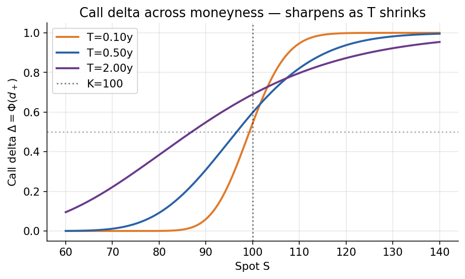
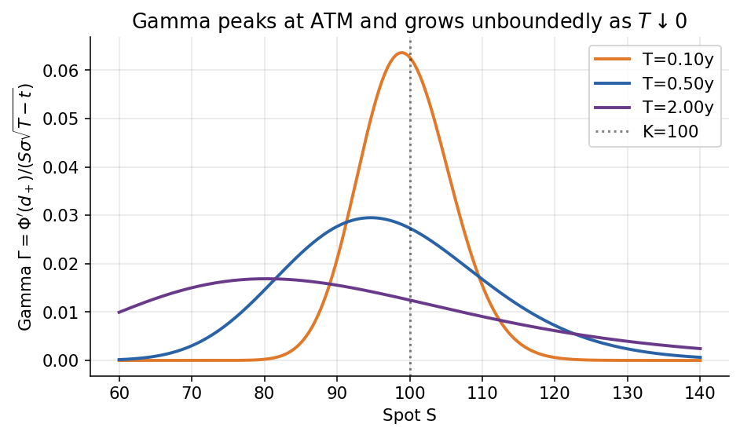
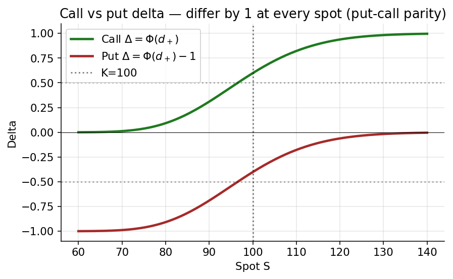
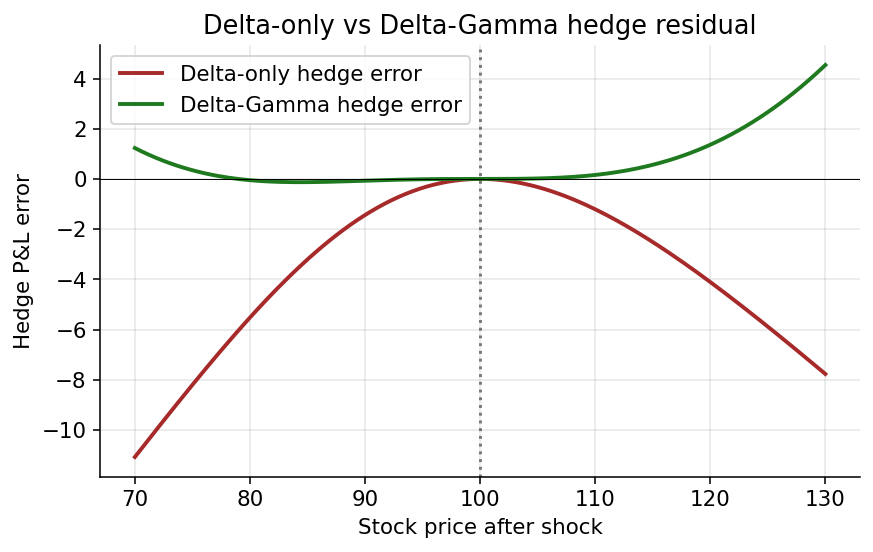
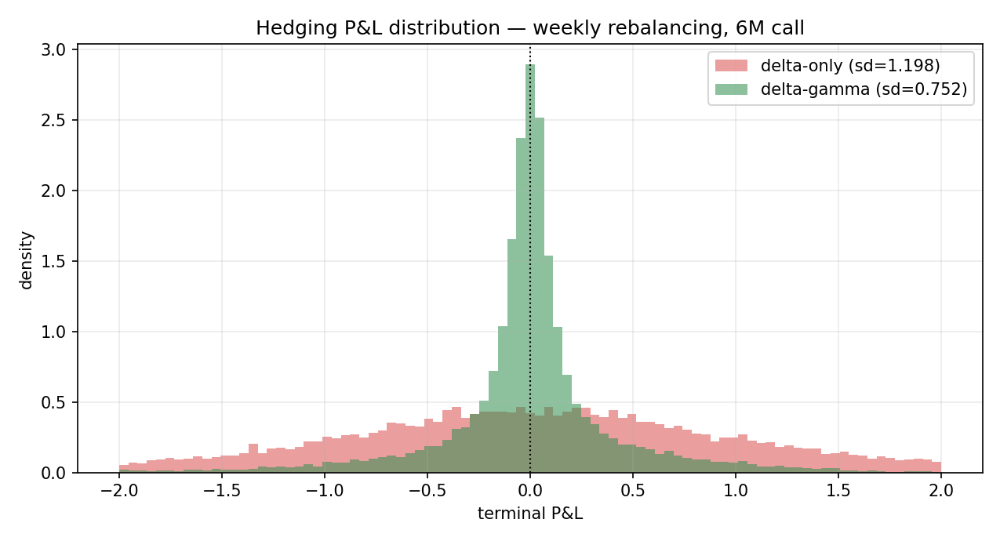
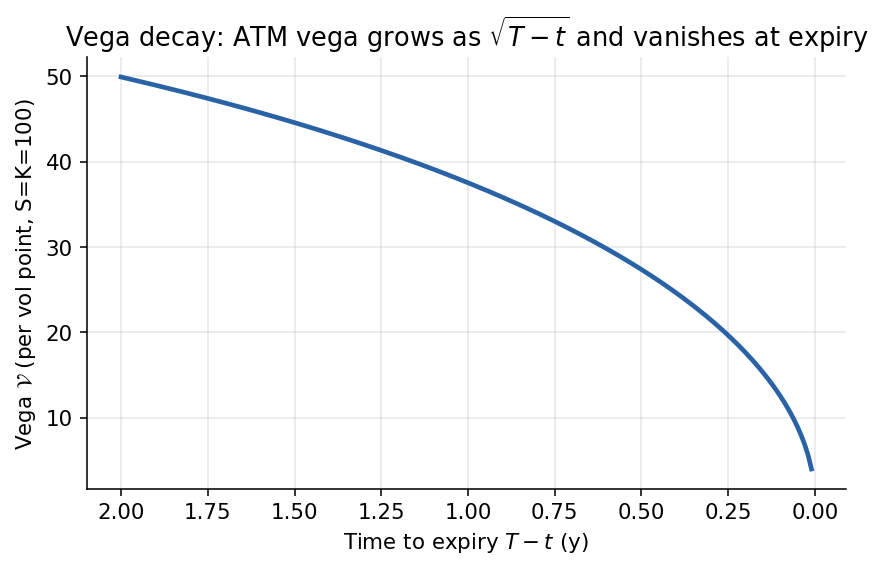
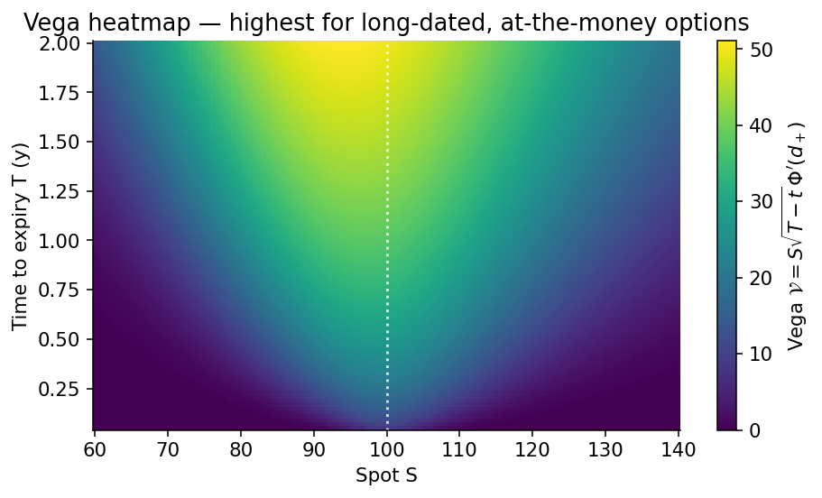

# Chapter 7 — Dynamic Hedging II: Greeks, Delta-Gamma, Vega, and Dividends

*Chapter 6 established the single-instrument delta hedge, the generalised
Black-Scholes PDE, and the Greeks that fall out of the closed-form vanilla
formulas. This chapter is the follow-up. We enlarge the hedging portfolio —
first to neutralise curvature (delta-gamma), then to neutralise volatility
exposure (vega), then to accommodate dividend-paying underlyings — and we
pay the self-financing bookkeeping explicitly when transaction costs enter
the picture. The underlying machinery is the same Itô expansion that drove
Chapter 6; what changes is the dimension of the hedging basis and the list
of Greeks we target.*

---

## 7.0 Chapter orientation

A delta-hedged short-option position is not a risk-free position. It is
**first-order** risk-free: the coefficient of $\mathrm{d}W_t$ in the
self-financing Itô increment has been zeroed, so the portfolio has no
instantaneous Brownian exposure. The residual risks live in the higher-order
terms, and they have names. *Gamma* is the coefficient of $(\Delta S)^2$ —
the curvature of the option price in the spot direction; *vega* is the
coefficient of $\Delta\sigma$ — the sensitivity of the option price to a
shift in the volatility parameter; *theta* is the coefficient of $\Delta t$
— the passage of time; and a zoo of cross-derivatives (vanna, volga, charm,
speed, colour) parameterise every other way a smooth price function can wiggle.

Most of these higher Greeks are not hedgeable with the stock alone. The stock
has *zero* gamma, *zero* vega, and *zero* dependence on implied volatility,
so no position in $S_t$ and cash can neutralise curvature or vol-level risk.
To hedge those exposures we must enlarge the hedging basis by adding another
traded option — or two, or ten, depending on how many higher Greeks we want
to annihilate. The linear algebra is straightforward; the operational
bookkeeping is where the subtleties live, and that is where this chapter
spends most of its time.

The chapter proceeds in seven acts. §7.1 is a brief Greeks recap that fixes
notation and bridges from Chapter 6. §7.2 is the central methodological
section: **delta-gamma hedging unified** — we give two framings (two-instrument
replication and local quadratic fit) of the same construction and show they
agree. §7.3 introduces vega and the extension of the replicating-portfolio
argument to stochastic volatility. §7.4 derives the Black-Scholes-Merton PDE
with continuous dividend yield. §7.5 takes up transaction costs and the
Leland volatility adjustment. §7.6 surveys price, delta, and gamma sketches
for puts, calls, and parity. §7.7 introduces **dollar Greeks** — the units
that risk-management desks actually use. The chapter closes with Key
Takeaways and a Reference Formulas appendix.

Throughout, notation follows Chapter 6: $S_t$ is the stock, $g(t,S)$ or
$f(t,S)$ is a contingent claim, $\Delta = \partial_S g$, $\Gamma =
\partial_{SS} g$, $\mathcal{V} = \partial_\sigma g$. Unqualified expectations
are under the risk-neutral measure $\mathbb{Q}$ unless otherwise noted.

---

## 7.1 Greeks recap — a bridge from Chapter 6

Chapter 6 produced the Black-Scholes PDE and, by solving it for the vanilla
call, delivered a collection of partial derivatives that every derivatives
trader learns by heart. It is worth restating the catalogue explicitly before
we start putting them to work.

Let $g(t, S; \sigma, r)$ be the price function of a European claim on an
underlying $S$ with volatility $\sigma$ and constant short rate $r$. The
*first-order* Greeks measure the linear sensitivity of $g$ to the four
natural inputs — spot, time, volatility, and the short rate:

$$
\Delta_t \;\equiv\; \partial_S g, \qquad
\Theta_t \;\equiv\; \partial_t g, \qquad
\mathcal{V}_t \;\equiv\; \partial_\sigma g, \qquad
\rho_t \;\equiv\; \partial_r g. \tag{7.1}
$$

The *second-order* Greeks measure curvature and cross-sensitivities:

$$
\Gamma_t \;\equiv\; \partial_{SS} g, \qquad
\text{vanna}_t \;\equiv\; \partial_{S\sigma} g, \qquad
\text{volga}_t \;\equiv\; \partial_{\sigma\sigma} g, \qquad
\text{charm}_t \;\equiv\; \partial_{St} g. \tag{7.2}
$$

And the *third-order* Greeks extend the cascade — speed
$\partial_{SSS} g$, colour $\partial_{SSt} g$, zomma $\partial_{SS\sigma} g$,
and so on — with each successive Greek characterising a tighter layer of
residual risk.

For a European call under Black-Scholes the closed forms are

$$
\Delta_{\mathrm{call}} \;=\; \Phi(d_+), \qquad
\Gamma \;=\; \frac{\Phi'(d_+)}{S\,\sigma\sqrt{T-t}}, \qquad
\mathcal{V} \;=\; S\,\sqrt{T-t}\,\Phi'(d_+), \tag{7.3}
$$

and for a European put, $\Delta_{\mathrm{put}} = \Phi(d_+) - 1 = -\Phi(-d_+)$,
with the same $\Gamma$ and $\mathcal{V}$ as the call (we will prove the gamma
identity via put-call parity in §7.6). Here $\Phi$ and $\Phi'$ are the
standard normal CDF and density, and $d_\pm = [\ln(S/K) + (r \pm
\tfrac{1}{2}\sigma^2)(T-t)] / (\sigma\sqrt{T-t})$ is the Black-Scholes
moneyness index.


*Black-Scholes call delta $\Phi(d_+)$ as a function of spot for three maturities. Long-dated options have gradual deltas spread across moneyness; near expiry the delta compresses toward a step at the strike, tracking the digital payoff that $\Delta_{\mathrm{call}}$ becomes in the $T\downarrow t$ limit.*


*Gamma $= \Phi'(d_+)/(S\sigma\sqrt{T-t})$ peaks at the at-the-money strike for every maturity, and the peak grows without bound as $T\downarrow t$. A short ATM option is a short-gamma position that becomes dangerously short as expiry approaches — the terminal-gamma pinning effect.*


*Put-call parity in delta form: $\Delta_{\mathrm{call}} - \Delta_{\mathrm{put}} = 1$ for every spot. The call delta rises from $0$ to $+1$ through the strike; the put delta sits a parallel unit below, running from $-1$ to $0$. A long call plus a short put with the same strike is always $100\%$ long the underlying.*

What Chapter 6 *proved* was that picking $\alpha_t = \partial_S g(t, S_t)$
units of the stock against a short position in the claim zeroes out the
$\mathrm{d}W_t$ coefficient in the self-financing increment. Zeroing the
drift then forces the pricing PDE, and the option's fair value is the cost
of funding the replicating portfolio. That argument used **exactly one
Greek** — delta — because exactly one random factor $W_t$ was being
neutralised, and exactly one hedging asset $S_t$ was being traded against it.

The limitation is baked in. A position that is delta-hedged at time $t$ is
not delta-hedged at time $t + \Delta t$, because the delta has changed. The
rebalance from $\alpha_t = \Delta_t$ to $\alpha_{t+\Delta t} = \Delta_{t+\Delta t}$
happens at the prevailing stock price, and the gap between the required
hedge and the held hedge over the interval $[t, t+\Delta t]$ exposes the
portfolio to whatever risks delta does *not* cover: curvature (gamma), the
tilt of volatility over time (vega + vol dynamics), and all the higher-order
effects. In the continuous-time limit those residuals vanish — this is the
content of the Black-Scholes replication theorem — but in discrete time they
are the dominant source of hedge-error P&L variance.

This chapter is the systematic treatment of those residuals. §7.2 removes
the gamma residual by adding a second option to the hedging basis. §7.3
takes up the vega residual. §7.4 relaxes the "non-dividend-paying stock"
assumption. §7.5 puts the self-financing bookkeeping under a microscope to
see how transaction costs bleed into the P&L. §7.6 synthesises the put-call
parity consequences on all of the above, and §7.7 translates the abstract
Greeks into the dollar-denominated units that desks actually use.

One framing remark before we begin. The reader who has learned Chapter 6's
self-financing argument may be tempted to view the extensions in this chapter
as mere decorations on the core structure. They are not. Each extra Greek
matched corresponds to a specific and separate risk that the single-instrument
hedge leaves *on the books*. A flow desk that prices options but leaves gamma
unhedged, vega unhedged, and dividends mis-modelled is not running a
"simplified" version of the Black-Scholes hedge — it is running a book whose
actual risk exposure is dominated by the residuals, not by the delta. The
residuals are the business.

---

## 7.2 Delta-gamma hedging — two framings unified

Up to this point the replicating portfolio has consisted of one risky
instrument — either the stock $S$ directly, or a traded claim $g$ — and the
bank account. That is enough to kill the first-order risk of the position,
and as we have seen repeatedly it suffices to derive the pricing PDE. But a
delta-neutral position is not the same thing as a *risk-neutral* position:
its value is insensitive to the first derivative of the stock move, yet still
very sensitive to the second derivative. A large move of either sign moves
the P&L of a delta-hedged short option position by roughly
$\tfrac{1}{2}\,\Gamma\,(\Delta S)^2$, and the sign of that term — negative
for a short option — is precisely the jump loss that the gamma P&L
decomposition records as the price paid for selling convexity.

The practical question is how to hedge *gamma* as well as *delta*. The
answer is to enlarge the hedging set: in addition to the stock $S$ and the
cash account $M$, the trader holds a position in an auxiliary traded claim
$h(t, S_t)$ — typically another option — whose curvature can be used to
offset the curvature of the target claim. The hedging portfolio now has two
risky knobs ($\alpha_t$ units of $S$ and $\gamma_t$ units of $h$) and one
cash knob ($\beta_t$ units of $M$), and the matching conditions are two:
first-order (delta) and second-order (gamma). That is exactly the minimum
machinery needed to neutralise a quadratic local expansion of the target
price function.

There are two equivalent ways to arrive at the same construction, and both
are worth seeing. The first — which we call *Framing A*, two-instrument
replication — is the structural argument: the target claim's Itô expansion
includes a $\mathrm{d}W_t$-coefficient (delta) and a $\mathrm{d}t$-coefficient
that depends on $\Gamma$, and the hedging portfolio must match both; this
forces the hedge to contain a *second risky asset* whose Itô expansion has
the right $\Gamma$. The second — which we call *Framing B*, local quadratic
fit — is the practical argument: the target's price function is a smooth
curve in $S$ at each fixed $t$, and we are trying to replicate its first
and second spatial derivatives using a stock (which has delta 1 and gamma
0) and a second option (which has known delta $\Delta^h$ and gamma $\Gamma^h$);
matching both derivatives yields a $2\times 2$ linear system whose unique
solution gives the hedge ratios. The two framings yield the same formulas
and the same operational recipe; they differ in which first-principles
story one tells to justify them. We give both in full, side by side.

### 7.2.1 Local Taylor expansion of a claim

Let $g(t, S)$ be the price of a European option on $S$, with partial
derivatives $\partial_S g$, $\partial_{SS} g$, and so on. Fix a reference
spot $S_t$ and consider the value of the option if the spot were to change
by a small amount $(S - S_t)$. A second-order Taylor expansion in the spot
variable reads

$$
g(t, S) \;=\; g(t, S_t) \;+\; (S - S_t)\,\partial_S g(t, S_t)
\;+\; \tfrac{1}{2}\,(S - S_t)^2\,\partial_{SS} g(t, S_t) \;+\; \cdots, \tag{7.4}
$$

with the customary naming convention

$$
\Delta^g_t \;\equiv\; \partial_S g(t, S_t), \qquad
\Gamma^g_t \;\equiv\; \partial_{SS} g(t, S_t). \tag{7.5}
$$

The delta $\Delta^g_t$ is the slope of the pricing function at the current
spot; the gamma $\Gamma^g_t$ is the curvature. A vanilla call's pricing
function is a smoothed version of the hockey-stick payoff — zero in the
far-left, curving upward near the strike, and asymptoting to a line of
slope one far to the right — so its delta runs from $0$ to $1$ and its
gamma is a localised bump around the strike. For an at-the-money call close
to expiry, the gamma is tall and narrow; far from expiry, the gamma is
short and broad.

Visually, one can imagine three curves superimposed on a single axis of
spot $S$: the payoff (a kinked line), the current option price $g(t, S)$
(a smooth convex curve sitting above the payoff), and two auxiliary lines
drawn at the reference point $S_t$ — the *tangent* with slope $\Delta^g_t$
(the linear delta approximation) and a *parabola* matching both slope and
curvature (the delta-gamma approximation). The tangent deviates from the
true price as soon as $S$ moves an appreciable distance; the parabola hugs
the true price for considerably longer because it matches the curvature.
This is the geometric content of delta-gamma hedging: we are trying to
replicate an option not with a flat share holding (a horizontal line) but
with a share holding plus a second-option holding whose combined curvature
matches the target's.

A delta-only (linear) hedge is a *tangent line* at the current spot — it
matches the slope, so small moves are neutralised, but any curvature in the
payoff is missed. Gamma adds the second derivative, so the hedge becomes a
*tangent parabola* that hugs the payoff over a much wider window. Away from
the edge, the approximation error scales as $(\Delta S)^3$ instead of
$(\Delta S)^2$ — a full order of accuracy gained per extra Greek matched.

There is a deeper reason the quadratic truncation is natural. Under
geometric Brownian motion, the leading stochastic move over a short interval
has $(\Delta S)^2 \sim S^2 \sigma^2 \Delta t$, so the second-order Taylor
term is of the same order as $\Delta t$ itself — one cannot ignore it
without simultaneously ignoring all the time-derivative structure of the
pricing PDE. The third-order Taylor term, $(\Delta S)^3 \sim
S^3 \sigma^3 (\Delta t)^{3/2}$, is of higher order in $\Delta t$ and
legitimately vanishes in the small-step limit. So "delta and gamma" is not
an arbitrary cutoff: it is exactly the order at which the stochastic and
deterministic terms balance in Itô calculus. Higher Greeks matter only
through discrete-rebalancing residuals, not through the continuous-time
limit.


*Figure 7.1 — Delta-only hedge (tangent line) vs delta-gamma hedge
(tangent parabola) fit against the convex call payoff.*

### 7.2.2 Framing A — two-instrument replication

The structural view begins from the replicating-portfolio argument of
Chapter 6. We are *short* one unit of a target claim $g$; we seek a
self-financing portfolio whose value tracks $g$ at every $(t, S)$. Against
a delta hedge alone, the portfolio value has a non-zero $(\Delta S)^2$
coefficient: the gamma mismatch is a distinct source of risk that cannot
be killed by any share position, because the stock has zero gamma. To
absorb the gamma we must add a second *curved* instrument — a second
traded claim whose own $\partial_{SS} h$ is non-zero.

Let $h(t, S)$ be another traded option on $S$ — typically vanilla, liquid,
and chosen to have gamma at the same scale as the target's. The hedging
portfolio is

$$
V(t, S) \;=\; \alpha_t\,S \;+\; \beta_t\,M_t \;+\; \gamma_t\,h(t, S), \tag{7.6}
$$

where $\alpha_t$ is the number of shares, $\gamma_t$ is the number of units
of the auxiliary option, $\beta_t$ is the number of units of the
money-market account $M_t = e^{rt}$, and the hedge is set up so that $V$
matches the target $g$ claim-for-claim. Applying a Taylor expansion around
$S_t$ to both the portfolio and the target,

$$
V(t, S) \;=\; \alpha_t\,S \;+\; \beta_t\,M_t \;+\; \gamma_t\!\left[h(t, S_t)
+ (S - S_t)\,\partial_S h(t, S_t)
+ \tfrac{1}{2}(S - S_t)^2\,\partial_{SS} h(t, S_t)\right] + \cdots, \tag{7.7}
$$

$$
g(t, S) \;=\; g(t, S_t) \;+\; (S - S_t)\,\partial_S g(t, S_t)
\;+\; \tfrac{1}{2}(S - S_t)^2\,\partial_{SS} g(t, S_t) \;+\; \cdots. \tag{7.8}
$$

Matching coefficients of $(S - S_t)$ and $(S - S_t)^2$ between the portfolio
and the target gives the *delta-gamma hedge conditions*:

$$
\alpha_t \;+\; \gamma_t\,\partial_S h(t, S_t) \;=\; \partial_S g(t, S_t), \tag{7.9}
$$

$$
\gamma_t\,\partial_{SS} h(t, S_t) \;=\; \partial_{SS} g(t, S_t). \tag{7.10}
$$

Denote $\Delta^h_t = \partial_S h$, $\Gamma^h_t = \partial_{SS} h$, and
$\Delta^g_t$, $\Gamma^g_t$ similarly. Solving (7.9)–(7.10) for the two
unknowns,

$$
\boxed{\;\gamma_t \;=\; \frac{\Gamma^g_t}{\Gamma^h_t}, \qquad
\alpha_t \;=\; \Delta^g_t \;-\; \frac{\Gamma^g_t}{\Gamma^h_t}\,\Delta^h_t. \;} \tag{7.11}
$$

These are the two hedge ratios. Read (7.11) as a two-step recipe: first fix
$\gamma_t$ so that the auxiliary option's gamma times $\gamma_t$ matches
the target gamma — that is gamma-matching, equation (7.10); then set
$\alpha_t$ so that the *net* delta of the $\gamma_t$-scaled auxiliary plus
$\alpha_t$-scaled stock matches the target delta — that is delta-matching,
equation (7.9), solved after $\gamma_t$ is pinned down. The order matters
because gamma-matching uses only $h$ (the stock has zero gamma), while
delta-matching uses both $h$ and $S$. One cannot delta-hedge first and then
gamma-hedge, because the gamma-hedge step would disturb the delta that had
already been arranged. The correct order — gamma first, then delta — is
the operational lesson of the pair (7.11).

With $\alpha_t$ and $\gamma_t$ in hand, the cash leg follows from the total
portfolio value. At inception, we sold $g$ and collected $g_0$; we bought
$\gamma_0$ units of $h$ at $h_0$ and $\alpha_0$ shares at $S_0$; whatever
is left we deposit in the bank, so

$$
M_0 \;=\; g_0 \;-\; \alpha_0\,S_0 \;-\; \gamma_0\,h_0. \tag{7.12}
$$

This is the delta-gamma analogue of the delta-only initial-balance recipe
from §6.11.2: the premium collected pays for both the share-hedge and the
option-hedge, and the residual sits in the bank earning the short rate.
Depending on the sign of $\gamma_0$ and the price of $h$, the initial bank
balance may be positive (net lender) or negative (net borrower). For a
short position in a short-dated at-the-money call hedged with a short-dated
different-strike call, typically $\gamma_0 > 0$ (we are *long* gamma in the
auxiliary to offset our *short* gamma in the target), which means we pay
for $h$ and the initial bank balance shrinks by $\gamma_0 h_0$ relative to
the delta-only hedge.

Verifying that the resulting portfolio matches both delta and gamma is a
one-line check:

$$
\Delta^V_t \;=\; \alpha_t \;+\; \gamma_t\,\Delta^h_t \;=\; \Delta^g_t, \qquad
\Gamma^V_t \;=\; \gamma_t\,\Gamma^h_t \;=\; \Gamma^g_t. \tag{7.13}
$$

Both hold by construction. The portfolio tracks the target to second order,
and the tracking error is now of order $(S - S_t)^3$ rather than
$(S - S_t)^2$. Under a Brownian-motion underlying, the cubic term is of
order $(\Delta t)^{3/2}$ per rebalance interval, substantially smaller than
the $\Delta t$ gamma residual of the delta-only hedge. Delta-gamma hedging
is therefore genuinely higher-order: it does not merely shift the coefficient
on the error, it shifts the *scaling exponent* — the variance of the
tracking error now falls as $1/N^2$ in the rebalance count rather than
$1/N$, and the standard deviation falls as $1/N$ rather than $1/\sqrt{N}$.

The structural story is therefore clean. A delta-only hedge replicates the
target's Itô expansion only through the $\mathrm{d}W$ coefficient; the
second-order $\mathrm{d}t$ piece proportional to $\Gamma$ is unmatched. A
delta-gamma hedge replicates *both* coefficients, by enlarging the hedging
basis to include a second traded claim whose own expansion has the required
curvature. Each additional Greek matched corresponds to one additional
hedging instrument in the basis and one additional linear equation to
solve; the arithmetic remains elementary, and the replication theorem of
Chapter 6 generalises verbatim.

### 7.2.3 Framing B — local quadratic fit

The practical view starts from a slightly different position. A hedged book
has a *loss distribution*, and the purpose of hedging is to compress that
distribution toward zero — ideally a tight cluster around a risk-free
return but more realistically a tight cluster around whatever expected
alpha the strategy aims to extract. Delta hedging collapses the linear
dependence on the underlying; delta-gamma hedging additionally collapses
the quadratic dependence. Each additional Greek matched corresponds to a
further reduction in the variance of the hedged P&L — and hence a smaller
VaR and CTE at any confidence level.

The economic logic is worth stating plainly. When a derivatives dealer
sells an option, the premium received is — in theory — exactly the
expected discounted cost of replicating the option's payoff under a specific
hedging strategy. The hedging strategy itself is the *justification* for
the premium: "we charge $g_0$ because if we trade according to these rules,
we can deliver $\varphi(S_T)$ for exactly $g_0$ plus a small residual that
vanishes in the limit of continuous rebalancing." This is the Black-Scholes
promise, and it is the foundation of the entire derivatives industry. Delta
hedging is the first-order implementation of this promise; delta-gamma is
a refinement that tightens the residual by neutralising the first significant
source of hedging error — namely the second-order Taylor term in the payoff
function.

What shapes the residual? Every discrete-time hedging error can be traced
to the gap between the continuous-time idealisation and the real-world
rebalance grid. If the rebalance happens at times $t_0 < t_1 < \ldots < t_N$,
the hedge is perfect *at* each rebalance time but drifts *between* rebalance
times as the underlying price moves without the hedge being adjusted. The
size of the drift depends on the second derivative of the payoff (gamma)
times the square of the price move. Summed over many small intervals, this
drift is the leading source of residual P&L variance. Delta-gamma hedging
neutralises this leading source — at the cost of introducing a
gamma-dependent cash flow (because the gamma hedge itself has to be
rebalanced when gamma changes, which happens as spot moves and as time
passes).

A slightly deeper view is that hedging is not really about eliminating
risk; it is about *exchanging* one kind of risk for another. A delta-only
hedge converts directional price risk into gamma-residual risk. A delta-gamma
hedge converts gamma-residual risk into (smaller) third-order-Taylor-residual
risk plus execution risk plus model risk (because gamma itself depends on
volatility, which you may have mis-specified). The deeper you go into higher
Greeks, the smaller the direct residual but the more layered the
model-dependence. Professional traders have a keen sense of which residual
risks are tolerable (those that net out across many similar trades) and
which are not (those that are directional and correlated across the book).
The art of running a derivatives desk is not to hedge everything; it is to
hedge the dangerous things and leave the safe things alone.

Visualising a call payoff $\varphi(x) = (x - K)_+$ and its smoothed
(time-$t$) price $g(t, x)$ together — with the discounted-strike asymptote
$(x - K e^{-r(T-t)})$ drawn for reference, and the horizontal axis marked
$K$, $x_t$, $x_{t + \Delta t}$ — the Taylor expansion in $\Delta x$ is

$$
g(t, S_t + \Delta S) \;=\; g(t, S_t)
\;+\; \Delta S\,\underbrace{\partial_S g(t, S_t)}_{\text{delta } \Delta}
\;+\; \tfrac{1}{2}(\Delta S)^2\,\underbrace{\partial_{SS} g(t, S_t)}_{\text{gamma } \Gamma}
\;+\; \cdots. \tag{7.14}
$$

The higher-order terms are the remaining Greeks — vega, theta, vanna,
volga, speed, and so on.

We hedge a short position in the target claim $g$ using the stock $S_t$,
the money-market account $M_t$, and a second traded claim $h_t$ whose
Greeks we know. With units $\alpha_t$ of $S$, $\beta_t$ of $M$, and
$\gamma_t$ of $h$, the hedge portfolio is

$$
V_t \;=\; \alpha_t\,S_t \;+\; \beta_t\,M_t \;+\; \gamma_t\,h_t, \tag{7.15}
$$

and we *fit* its spatial derivatives at $S_t$ to those of the target. The
first-derivative match is

$$
\partial_S V_t \;=\; \alpha_t \;+\; \gamma_t\,\partial_S h \;=\; \Delta^g, \tag{7.16}
$$

and the second-derivative match is

$$
\partial_{SS} V_t \;=\; \gamma_t\,\partial_{SS} h \;=\; \Gamma^g, \tag{7.17}
$$

since the stock contributes $0$ to gamma ($\partial_{SS}(\alpha_t S_t) = 0$)
and the bank contributes $0$ to both delta and gamma. Only the auxiliary
claim $h$ carries curvature, which is why we need it.

The linear system (7.16)–(7.17) has a particularly clean matrix form:

$$
\begin{pmatrix} 1 & \Delta^h \\ 0 & \Gamma^h \end{pmatrix}
\begin{pmatrix} \alpha_t \\ \gamma_t \end{pmatrix}
\;=\;
\begin{pmatrix} \Delta^g \\ \Gamma^g \end{pmatrix}. \tag{7.18}
$$

The matrix is upper-triangular — the stock contributes only to delta
(upper-left entry $1$, lower-left $0$) and the auxiliary option contributes
to both delta and gamma. Inverting the triangular matrix,

$$
\begin{pmatrix} \alpha_t \\ \gamma_t \end{pmatrix}
\;=\;
\begin{pmatrix} 1 & -\Delta^h/\Gamma^h \\ 0 & 1/\Gamma^h \end{pmatrix}
\begin{pmatrix} \Delta^g \\ \Gamma^g \end{pmatrix}, \tag{7.19}
$$

which recovers exactly the boxed pair from Framing A:

$$
\gamma_t \;=\; \frac{\Gamma^g}{\Gamma^h}, \qquad
\alpha_t \;=\; \Delta^g \;-\; \frac{\Gamma^g}{\Gamma^h}\,\Delta^h. \tag{7.20}
$$

The choice of auxiliary claim $h$ deserves a moment of thought. In practice
$h$ is almost always a liquid, exchange-traded vanilla option — an
at-the-money listed call or put with a short expiry is the classic choice
because it has high gamma per dollar of premium and a tight bid-ask. A
deep-in-the-money option would work mathematically but has low gamma, so
large notional amounts are required to match the target's gamma; that
increases funding and transaction costs. A far-out-of-the-money option
would also work but its gamma changes rapidly with spot, so the hedge
weights would rebalance aggressively and incur turnover. The ATM short-dated
option threads the needle: high gamma, moderate turnover, low execution cost.

There is a subtler point about the *cross-Greek profile* of $h$. When we
hedge a target $g$ whose gamma and vega (and cross-Greek vanna, say) both
matter, choosing $h$ with the same gamma profile does not automatically
match the vega profile. In fact a single auxiliary claim can at best match
one higher-order Greek at a time; matching both gamma and vega requires
two auxiliary claims, typically two listed options at different strikes or
expiries whose gamma and vega profiles are linearly independent. This is
the operational reason that serious exotic-hedging desks maintain entire
*option-book hedging portfolios* consisting of dozens of liquid vanillas,
not just one or two: the target exotic has a many-dimensional Greek profile
and needs a high-dimensional hedging basis to match it accurately. The
linear algebra is essentially a least-squares fit of the target's Greek
vector onto the span of the available hedging-instrument Greek vectors.

When the Greek matrix is nearly singular — which happens when the hedging
instruments have similar Greek profiles — the hedge weights become
numerically unstable and can flip signs or blow up in magnitude. This is a
common pitfall in automated hedging systems: two ATM options with nearby
expiries might have nearly parallel Greek vectors, so their contributions
cannot be cleanly separated, and tiny changes in Greeks produce enormous
changes in hedge ratios. The operational fix is to regularise the system
(ridge regression on the hedge solution), or to pick a hedging basis with
intentionally diverse Greek profiles (options at widely different strikes
and expiries). Diversity in the hedging basis gives a well-conditioned
matrix and stable hedge weights.

A common conceptual error is to forget the second term in (7.20) — to
compute the delta hedge as $\alpha = \Delta^g$ and then bolt on a
gamma-matching layer of $h$. That is internally inconsistent because the
$h$ position itself has a delta; one has over-delta-hedged by exactly
$\gamma_t\,\Delta^h$. The correct construction is simultaneous: pick
$\gamma_t$ to zero the portfolio's gamma, then pick $\alpha_t$ to zero the
*residual* delta after accounting for $h$'s delta contribution.

### 7.2.4 Reconciling the two framings

The two derivations above — two-instrument replication (Framing A) and
local quadratic fit (Framing B) — end at the same boxed pair of hedge
ratios (7.11) and (7.20). That is not a coincidence. The agreement is a
consequence of a deep duality: requiring the hedged portfolio's *Itô
dynamics* to match the target's is the same as requiring the hedged
portfolio's *spatial Taylor expansion* to match the target's, *in the
GBM-with-constant-coefficients setting we have been working in*.

To see why, note that for any smooth $V(t, S_t)$ Itô's lemma delivers

$$
\mathrm{d}V \;=\; \left(\partial_t V + \mu\,S_t\,\partial_S V + \tfrac{1}{2}\sigma^2 S_t^2\,\partial_{SS} V\right)\mathrm{d}t
\;+\; \sigma\,S_t\,\partial_S V\,\mathrm{d}W_t. \tag{7.21}
$$

The coefficient of $\mathrm{d}W_t$ is $\sigma S_t$ times $\partial_S V$,
i.e. delta. The coefficient of $\mathrm{d}t$ has $\partial_{SS} V$ buried
inside the convexity term. Matching $\mathrm{d}V = \mathrm{d}g$ at the Itô
level therefore requires matching *both* $\partial_S V = \partial_S g$
(the $\mathrm{d}W$ coefficient) and $\partial_{SS} V = \partial_{SS} g$
(via the convexity term in $\mathrm{d}t$). Those are precisely the two
conditions of Framing B. Conversely, Framing B's spatial Taylor match at
$S = S_t$ produces a portfolio whose $\mathrm{d}W$ and convexity contributions
match the target's at $S_t$, which is the Framing-A condition.

The cleanest way to state the equivalence is this: in a single-factor Itô
model, matching the portfolio's *first and second spatial derivatives*
to the target's is equivalent to matching the coefficients of $\mathrm{d}W_t$
and the $\partial_{SS}$ part of the $\mathrm{d}t$-term in the Itô expansion.
The $\partial_t$ and $\mu\,\partial_S$ pieces of the $\mathrm{d}t$-term are
already absorbed by the pricing PDE (they are what the cash leg pays for),
which is why the system reduces to just two equations in two unknowns.

An equivalent way to see it: the hedging portfolio has three degrees of
freedom $(\alpha_t, \beta_t, \gamma_t)$. The self-financing condition and
the matching of the *value* $V_t = g_t$ (which pins $\beta_t$) together
eliminate one degree of freedom and one constraint. We are left with two
degrees of freedom $(\alpha_t, \gamma_t)$ and two constraints (delta and
gamma match). The system is exactly determined; the solution is unique;
and it is what both framings produce.

There is one structural consequence of this duality worth calling out.
Framing A makes it immediate that the delta-gamma hedge is **exact in the
continuous-time limit** — the Itô dynamics of the replicating portfolio
match the target claim's, and the tracking error goes to zero almost surely
as the rebalance grid refines. Framing B makes it immediate that under
*discrete* rebalancing the leading residual scales as $(\Delta S)^3$, and
so has variance of order $(\Delta t)^3$ per interval and $(\Delta t)^2$ when
summed over $N = T/\Delta t$ intervals. The standard deviation therefore
scales as $1/N$ rather than $1/\sqrt{N}$ as in the delta-only case. The
two framings reinforce each other: one tells us that the hedge is
theoretically exact, the other tells us how fast the discretisation error
vanishes.

We will use Framing B's linear-algebra presentation for all the computations
that follow, because it generalises cleanly to $n$-Greek hedging with $n$
traded instruments, and we will invoke Framing A's structural argument
whenever we need to justify that the resulting construction is self-financing
and replicates the target in the no-arbitrage sense.

### 7.2.5 Worked numerical example — gamma-matching an ATM option

Let us make (7.15) concrete with specific numbers. Suppose we sell a
1-year ATM call on a $\$100$ stock: strike $K_g = 100$, expiry $T_g = 1$
year, implied vol $\sigma = 25\%$, rate $r = 3\%$. Using Black-Scholes we
get price $g_0 \approx 10.94$, $\Delta^g \approx 0.59$, $\Gamma^g \approx
0.0156$. To gamma-hedge we use a 3-month ATM call on the same underlying:
strike $K_h = 100$, expiry $T_h = 0.25$ year, same vol and rate. Its price
is $h_0 \approx 5.40$, $\Delta^h \approx 0.53$, $\Gamma^h \approx 0.0313$.

Applying (7.20),

$$
\gamma_0 \;=\; \frac{\Gamma^g}{\Gamma^h} \;=\; \frac{0.0156}{0.0313} \;\approx\; 0.498. \tag{7.22}
$$

We buy roughly half a unit of the 3-month call for every 1-unit short
position in the 1-year call. Then

$$
\alpha_0 \;=\; \Delta^g \;-\; \frac{\Gamma^g}{\Gamma^h}\,\Delta^h
\;=\; 0.59 \;-\; 0.498 \cdot 0.53 \;\approx\; 0.326. \tag{7.23}
$$

We buy $0.326$ shares. The initial outlay for the hedge is

$$
\alpha_0 \cdot S_0 \;+\; \gamma_0 \cdot h_0
\;=\; 0.326 \cdot 100 \;+\; 0.498 \cdot 5.40
\;=\; 32.6 \;+\; 2.69 \;=\; 35.29. \tag{7.24}
$$

We received $g_0 = 10.94$ for selling the 1-year call, so the cash account
starts at

$$
M_0 \;=\; g_0 \;-\; \alpha_0 S_0 \;-\; \gamma_0 h_0 \;=\; 10.94 \;-\; 35.29 \;=\; -24.35. \tag{7.25}
$$

Meaning we borrow $\$24.35$ to establish the hedge. Over the next rebalance
period we pay interest on this borrowing at rate $r$, and the stock and
option positions mark to market at whatever new spot and option price the
market delivers.

Compare this with a pure delta hedge: $\alpha_0 = \Delta^g = 0.59$ shares,
cash account $10.94 - 0.59 \cdot 100 = -48.06$. The delta-gamma hedge
requires *less* borrowing ($\$24.35$ vs $\$48.06$) because the
gamma-hedging option supplies some of the delta. But the delta-gamma hedge
carries the 3-month option position, which must be rolled or rebalanced as
it ages toward its own expiry; it introduces its own theta decay and vega
exposure. The trade-off is that delta-gamma reduces residual variance at
the cost of a more complex rebalancing schedule and additional
instrument-specific Greeks that must themselves be monitored.

If we repeat this exercise with a 1-month ATM hedging option instead of a
3-month one, the gamma is higher (roughly $0.054$ vs $0.031$), so we need
fewer units: $\gamma_0 = 0.0156 / 0.054 \approx 0.289$. The higher-gamma
hedge is more efficient in notional terms — less option notional required
to match the target's gamma — but also rebalances faster because its own
gamma drifts quickly with spot and time. The choice between a 1-month and
3-month hedging option is a trade-off between notional efficiency and
rebalancing cost, typically resolved by desk policy.

A *numerical sanity check* on the local-fit quality. For our sold 1-year
ATM call and a $2\%$ spot move ($\Delta S = 2$), the true price change is
about $1.15$. The delta-only approximation predicts $\Delta^g \cdot \Delta S
= 0.59 \cdot 2 = 1.18$ (a $2.6\%$ relative error, which is coincidentally
tight because the gamma and theta contributions partly offset). The
delta-gamma approximation predicts $0.59 \cdot 2 + \tfrac{1}{2} \cdot
0.0156 \cdot 4 = 1.21$ — in this *particular* window the quadratic fit and
linear fit are both within a cent of the truth, because the 1-year option
has modest gamma. For a 3-month ATM call, the gamma is nearly twice as
large; for a 1-month ATM call it is three to four times larger. At a $10\%$
move, the quality of the two approximations diverges sharply: delta-only
misses the truth by several percent, delta-gamma matches to sub-percent
accuracy. Delta-gamma is a superb *local* hedge and a mediocre *global*
one; it is designed to be refreshed frequently on a grid rather than held
for a long interval.

The failure mode for large moves has a systematic character. Near the
strike, gamma is positive and large; it decays for moves far in either
direction. A quadratic extrapolation assumes gamma remains at its
spot-level value even as the stock moves far from the spot, but gamma
*itself* decays as we move away from the strike. This makes the delta-gamma
quadratic an over-estimate of convexity in the wings, leading to systematic
over-prediction of price changes for large moves. This is precisely the
scenario in which third-order (speed) corrections start to matter: speed
captures the rate at which gamma decays, and including it pulls the
quadratic toward the true curve in the wings. For risk-measurement purposes
— particularly VaR and stress-testing at 3-to-5-sigma confidence — the
"delta-gamma-parametric" methodology has to be augmented by full
revaluation when the scenarios push far into the wings.

### 7.2.6 The discrete delta-gamma recursion

When continuous rebalancing is discretised, the analogue of the delta-only
cash-account recursion of §6.11 for the two-instrument hedge is

$$
M_{t_k} \;=\; M_{t_{k-1}}\,e^{r\,\Delta t}
\;-\; (\alpha_{t_k} - \alpha_{t_{k-1}})\,S_{t_k}
\;-\; (\gamma_{t_k} - \gamma_{t_{k-1}})\,h_{t_k}, \tag{7.26}
$$

where each rebalance at time $t_k$ requires buying or selling enough stock
to restore the delta match, *and* enough of the auxiliary option to restore
the gamma match. Both trades are funded out of the bank account (or
deposited into it), and the bank grows between rebalances at the risk-free
rate. The structure is identical to the pure-delta recursion but with an
extra $h$-trading term on the right-hand side. Transaction costs, if
included, are simply summed over the two legs — we take up the details in
§7.5.

Equation (7.26) is the operational engine of any delta-gamma hedging
program. Each morning (or each rebalance tick) the trader observes the new
stock price $S_{t_k}$ and option price $h_{t_k}$, recomputes the desired
hedge weights $\alpha_{t_k}$ and $\gamma_{t_k}$ from (7.20) using the
updated Greeks, and executes the increments $\alpha_{t_k} - \alpha_{t_{k-1}}$
in the stock and $\gamma_{t_k} - \gamma_{t_{k-1}}$ in the option. The cash
flow from these executions debits the bank account. Between rebalances the
bank account compounds at the short rate.

The *absolute* size of each rebalance trade depends on how much the Greeks
have drifted since the last rebalance, which in turn depends on how much
the stock has moved, how much time has passed, and how curved the target's
Greek profile is. A near-the-money, short-dated option has delta and gamma
that change rapidly with spot, so its hedge rebalances frequently and the
cash account sees a lot of churn. A far-dated, deep-in-the-money option has
an almost linear payoff and a nearly constant delta, so the hedge barely
moves and rebalance costs are low. These observations underpin the whole
*gamma scalping* school of proprietary option trading: taking long-gamma
positions on short-dated ATMs and systematically extracting the rebalance
cash-flow turnover as P&L, funded by theta decay.

One useful mental model of the rebalance cash flow is to think of it as a
*betting ledger* between the desk and the market. Each morning, the stock
has moved; the desk's required delta has changed; the desk executes the
delta change at the current stock price; and that execution booked a cash
flow. If the stock moved up and the desk had to buy more stock to re-hedge,
the desk pays for stock at a higher price than yesterday's average — so the
rebalance has a small negative cash flow relative to zero. If the stock
moved up and the desk had to sell stock (long-gamma position), the desk
receives cash at the higher price and the rebalance has a positive cash
flow. The aggregate pattern of positive and negative rebalance cash flows
over the option's life is exactly the *gamma P&L*, and its magnitude is
$\tfrac{1}{2} \Gamma (\Delta S)^2$ per rebalance, summed over all rebalances,
minus the theta bleed. This is the famous "buy low, sell high" mechanism
that underlies gamma scalping — and its mirror image, the "sell high, buy
low" pain of being short gamma in a trending market.

At maturity $t_N = T$, the portfolio wealth owes the option payoff:

$$
P_N \;=\; M_{t_{N-1}}\,e^{r\,\Delta t}
\;+\; \alpha_{t_{N-1}}\,S_{t_N}
\;+\; \gamma_{t_{N-1}}\,h_{t_N}
\;-\; \varphi(S_{t_N}), \tag{7.27}
$$

and the expression in parentheses collapses, if the hedge tracked
perfectly, to $\varphi(S_{t_N})$, leaving $P_N = 0$. In a well-specified
model with no transaction costs and continuous rebalancing, (7.27) is
identically zero; in reality, it is a small random variable whose
distribution is tighter than the analogous delta-only P&L because the
leading gamma error has been removed. We quantify the tightening next.

### 7.2.7 Terminal P&L and residual scaling

At expiry $t_N = T$ we liquidate the hedge and deliver the claim payoff
$\varphi(S_T)$. The realised profit-and-loss of the delta-gamma hedged book
is

$$
\boxed{\;\mathrm{P\&L} \;=\; M_{t_{N-1}}\,e^{r\,\Delta t}
\;+\; \alpha_{t_{N-1}}\,S_{t_N}
\;+\; \gamma_{t_{N-1}}\,h_{t_N}
\;-\; \varphi(S_{t_N}).\;} \tag{7.28}
$$

Under a continuous-time, frictionless, complete-market set-up this quantity
is identically zero; under discrete rebalancing it is a random variable
whose variance shrinks as the grid is refined. The delta-gamma hedge has an
order-of-magnitude smaller P&L variance than a pure delta hedge because it
neutralises the quadratic term in the Taylor expansion — the leading
residual is cubic in $\Delta S$ rather than quadratic.

The *scaling argument* is worth carrying through carefully, because it is
the quantitative payoff of all the extra machinery. A delta-only hedge
leaves a residual that is quadratic in the stock move per rebalance
interval. The variance of that residual scales as the variance of
$(\Delta S)^2$, which for GBM is of order $(\sigma^2 \Delta t)^2 \cdot S^4$.
Summing over $N$ rebalance intervals of length $\Delta t = T/N$, the total
residual variance scales as

$$
N \cdot \Big(\sigma^2 \tfrac{T}{N}\Big)^{\!2}
\;=\; \frac{\sigma^4 T^2}{N}. \tag{7.29}
$$

The standard deviation therefore scales as $1/\sqrt{N}$ — slow convergence.
A delta-gamma hedge leaves a residual that is *cubic* in the stock move per
interval. Its variance scales as the variance of $(\Delta S)^3 \sim
S^6 \sigma^6 (\Delta t)^3$. Summing,

$$
N \cdot \Big(\sigma^6 \tfrac{T^3}{N^3}\Big)
\;=\; \frac{\sigma^6 T^3}{N^2}, \tag{7.30}
$$

with standard deviation scaling as $1/N$. So on a weekly grid, the
delta-gamma standard deviation is a factor $\sqrt{N}$ smaller than the
delta-only standard deviation; for $N = 52$ weekly rebalances, that is
roughly a factor of $7$ reduction. The difference between $1/\sqrt{N}$ and
$1/N$ convergence is the practical justification for the extra hedging
instrument.


*Figure 7.2 — Monte-Carlo terminal-P&L density under weekly rebalancing:
delta-gamma hedge tightens variance by roughly $2\times$ relative to pure
delta, with a tighter tail and lighter skew.*

There is an elegant symmetry with the VaR/CTE discussion of Chapter 9.
Hedging reshapes the loss distribution from something with pronounced tails
(pure delta hedge, residual dominated by gamma) to something much more
Gaussian (delta-gamma hedge, residual dominated by higher-order terms that
tend to cancel). The CTE of the hedged P&L falls by a factor that is
roughly the square of the factor by which the standard deviation falls —
because the CTE of a Gaussian is a fixed multiple of its standard deviation.
So the practical benefit of delta-gamma over delta-only is not just a
tighter variance but a disproportionately smaller tail.

A further symmetry is with the Cornish-Fisher expansion. The delta-only
hedged P&L has significant skewness and excess kurtosis inherited from the
$(\Delta S)^2$ term — $(\Delta S)^2$ is the square of a zero-mean Gaussian,
which is a chi-squared distribution with pronounced skewness and excess
kurtosis. The delta-gamma hedged P&L has its leading residual $(\Delta S)^3$,
which is a cubed Gaussian — a distribution with zero skewness but very
heavy tails (before mixing with other residuals). The interplay between
these two distributions is why the naive Gaussian VaR applied to a
delta-only hedged book can be misleading: the residual is chi-squared, not
Gaussian, and the Cornish-Fisher correction to the Gaussian VaR is
substantial. For a delta-gamma hedged book, the residual is closer to
Gaussian in its quantile behaviour, and the Cornish-Fisher correction is
smaller. This is another lens through which to see the CTE-compression
benefit of delta-gamma: not just a tighter variance but a closer-to-Normal
shape that plays better with standard risk measures.

### 7.2.8 Long-gamma vs short-gamma — when residual convexity is a feature

An important subtlety is that pure delta hedging — deliberately leaving
gamma exposure — is sometimes desirable, not a mistake to be corrected. A
trader who buys options and delta-hedges them has a portfolio that is
*long gamma*. Long gamma means the hedged P&L is a convex function of the
stock price: whichever direction the stock moves, the hedge *under*-hedges
in the direction of profit and *over*-hedges in the direction of loss, so
both tails are positive. The cost of carrying this convexity is theta —
the time decay of the owned options.

A long-gamma, short-theta book wants the stock to move. If it moves enough
(in either direction) faster than the theta bleed, the book makes money;
if it doesn't, the theta eats the convexity profit and the book loses
money. This is a volatility trade — a bet on realised volatility exceeding
implied volatility, expressed as a delta-hedged long-option position.
*Gamma scalping* is its operational incarnation: the trader intentionally
does *not* gamma-hedge, collects the realised-vs-implied vol premium on
the gamma, and pays the theta bleed as the cost of doing business.

The P&L of a delta-hedged long-gamma position over a small time interval
is approximately

$$
\Delta P \;\approx\; \tfrac{1}{2} \Gamma\,S^2\,\big(r_t^2 \;-\; \sigma_{\mathrm{imp}}^2\,\Delta t\big), \tag{7.31}
$$

where $r_t$ is the realised log-return and $\sigma_{\mathrm{imp}}$ is the
implied volatility at which the option was bought. If realised volatility
exceeds implied, the position makes money; if realised volatility falls
short, it loses. Aggregated over the option's life, this is a
*realised-vs-implied variance* trade, and its expected P&L is the *variance
risk premium* — the systematic compensation earned by long-volatility
traders for bearing the tail risk of volatility spikes. Empirically,
implied volatility in equity-index options exceeds realised volatility by
two to four percentage points on average, making the short-vol trade a
profitable strategy most of the time, punctuated by catastrophic losses
during volatility spikes (August 2011, February 2018, March 2020). The
gamma-scalping long-vol trade is the opposite: small systematic losses
most of the time, offset by large gains during volatility spikes. Which
side of the trade to be on depends on one's view of the current implied-vol
level relative to expected realised vol over the option's life.

Gamma scalping as a business has been a major component of equity
derivatives trading for decades. Market-making desks sell options to
clients (collecting the vol premium), delta-hedge the position, and realise
a spread between implied and realised volatility. The spread is the
compensation for providing liquidity; it also carries tail risk because
when realised vol spikes, the short-gamma position bleeds fast. Large
option market-makers have taken significant losses on their gamma-scalping
books during major volatility events, and several have gone bankrupt in
smaller volatility spikes. The key risk-management discipline is to size
the short-gamma exposure such that even a three- or four-sigma realised-vol
shock does not exceed the firm's risk appetite.

Correspondingly, a short-gamma book — typical of option sellers — wants
the stock to sit still. Every move in either direction costs money (the
short gamma concavity); every day that passes adds theta decay as income.
Option sellers routinely choose *not* to gamma-hedge by buying back
curvature, because doing so would neutralise the theta income and leave
them with a pure funding trade. Instead they run short gamma within
explicit risk limits — a dollar-gamma budget, a vega budget, a
stress-scenario P&L limit — and live with the convexity exposure because
the theta is the whole point of being short.

So the choice between pure-delta and delta-gamma hedging is not always
about variance minimisation. It is about whether the residual gamma
exposure is a bug (for a sell-side client-facilitation book that wants to
be flat) or a feature (for a vol-trading book that monetises gamma). The
mathematics of (7.11) gives the recipe for *eliminating* gamma; the
business context determines whether you want to apply that recipe or
deliberately leave gamma on the books. A well-designed risk framework
explicitly tracks gamma at the book level and reports both the hedged VaR
(assuming gamma-neutral) and the unhedged VaR (with actual gamma) so that
the choice is made with eyes open.

Commercially, the choice between "lay off all gamma via matching options"
and "warehouse the gamma" is closely tied to the desk's business model. A
flow desk that handles client order flow wants to be flat — it collects
bid-ask on the client trade, hedges with another option to neutralise
gamma, and books a tight spread. A vol desk that takes proprietary
volatility positions wants to carry gamma — it expresses a view that
realised versus implied vol will diverge in a specific direction and takes
the appropriate side. Large derivative houses run both types of book
side-by-side, with internal transfer-pricing mechanisms that allow
flow-desk gamma to be transferred to the prop-desk at fair market prices.
The risk infrastructure has to support both models, and the P&L attribution
has to cleanly separate "flow spread" from "prop P&L" for compensation
purposes. These operational details are invisible from the mathematical
level but central to how real trading floors operate.

### 7.2.9 Why two Greeks — and why not three?

A natural question: if delta-gamma hedging neutralises the first and second
spatial derivatives of the target price, why not add a third option and
neutralise the third derivative (*speed*) as well? Why stop at two?

The answer is partly practical and partly principled. *Practically*, each
additional Greek we target requires an additional liquid traded instrument
whose own higher-order Greeks are independent of the others' — and the
option-market's supply of liquid, uncorrelated higher-Greek vehicles is
limited. A third-order hedge would in principle require a third option
whose *speed* (third spatial derivative of price) is appreciable and whose
delta and gamma can be matched simultaneously, and in liquid vanilla
markets the three-dimensional system is often ill-conditioned.

*Principled*, the magnitude of successive spatial derivatives decays
rapidly under a diffusion: the third-order term in the Taylor expansion is
multiplied by $(\Delta S)^3 \sim (\Delta t)^{3/2}$, which is already small,
and the marginal variance reduction per unit of additional hedging effort
is modest. Most desks stop at delta-gamma; a few specialised books
(volatility arbitrage, barrier-option market-making) add vega and sometimes
vanna and volga (cross-derivatives with volatility) to handle risk that is
orthogonal to spot moves.

The third-order term worth naming is *speed*: $\partial_{SSS} g$. Speed
measures how gamma changes with spot — effectively the "gamma of gamma."
In the regions where gamma is changing rapidly (near the strike as expiry
approaches), speed is large, and a delta-gamma hedge that ignores speed
will have a rebalancing schedule that is optimised for the wrong curvature
as spot moves. Exotic desks sometimes match speed as a third-layer hedge
using a third traded option with a different gamma profile, but this is
rare because the operational complexity outweighs the residual-risk
reduction for most portfolios. The theoretical observation is that matching
delta, gamma, and speed reduces the leading residual error from cubic to
quartic in the stock move, shaving yet another order off the residual
variance.

A related fourth-order Greek is *colour* (also called *gamma decay* or
$\partial_{SS t} g$), measuring how gamma changes with time. Colour matters
most for short-dated options where gamma concentrates rapidly; a
colour-hedged position stays gamma-neutral across the trading day even as
time decays. Colour is rarely hedged because time passes deterministically
— one can simply rebalance more frequently as expiry approaches rather
than add colour-hedging instruments. Nevertheless, colour is reported on
most desk-level Greek sheets as a monitoring metric.

The *Greek hierarchy* on a typical desk is therefore:

- **Delta** $\Delta = \partial_S f$. First-order sensitivity to underlying
  price. Hedged by holding $-\Delta$ units of stock. Eliminates first-order
  directional risk.
- **Gamma** $\Gamma = \partial_{SS} f$. Second-order sensitivity. Hedged by
  trading a second option with known $\Gamma^h$. Eliminates second-order
  convexity risk.
- **Vega** $\mathcal{V} = \partial_\sigma f$. Sensitivity to implied
  volatility. Hedged by trading options with matching vega profiles.
  Eliminates volatility-level risk.
- **Theta** $\Theta = \partial_t f$. Sensitivity to time passage. Not
  directly hedgeable (time passes deterministically) but tracked as the
  "carry cost" of holding the position.
- **Rho** $\rho = \partial_r f$. Sensitivity to the risk-free rate. Hedged
  with rate instruments (bonds, swaps, futures). Small for short-dated
  options, significant for long-dated ones.
- **Vanna** $\partial^2 f / (\partial S\,\partial\sigma)$. Cross-sensitivity
  of delta to volatility. Significant for skew-sensitive structures.
- **Volga** $\partial^2 f / \partial\sigma^2$. Second-order volatility
  sensitivity. Significant for volatility-of-volatility exposures.
- **Charm** $\partial^2 f / (\partial S\,\partial t)$. Cross-sensitivity of
  delta to time. Drives "delta bleed" as expiry approaches.
- **Colour** $\partial^2 f / (\partial S^2\,\partial t) = \partial \Gamma /
  \partial t$. Time decay of gamma.
- **Speed** $\partial^3 f / \partial S^3$. Third-order price sensitivity.

A production risk system reports all of these and more. The practical art
of hedging is to know which Greeks matter for which book. An FX options
book cares about vega and vanna (skew sensitivity). An equity-index
volatility book cares about gamma, vega, and volga (vol-of-vol). A
single-name equity options book cares about delta, gamma, and vega plus
basis risk to the index hedge. A rates-swaptions book cares about delta,
gamma, vega, and rho plus yield-curve exposures. Each business's unique
Greek fingerprint dictates which hedging instruments it keeps on hand and
which it trades regularly.

---

## 7.3 Vega and volatility risk

The Black-Scholes framework takes the volatility $\sigma$ as a constant
parameter. In the market, volatility is a living number: it changes day to
day, bar to bar, and sometimes intrabar. The sensitivity of an option's
price to changes in the assumed volatility is called *vega*:

$$
\mathcal{V}_t \;\equiv\; \partial_\sigma g(t, S_t;\, \sigma). \tag{7.32}
$$

Equivalently, vega measures by how many cents the option's price rises if
the volatility input moves up by one percentage point. Vega is strictly
speaking the most awkward of the first-order Greeks because $\sigma$ is
not itself a traded quantity — the underlying trades, the option trades,
but no one trades "volatility" directly except through volatility-linked
contracts (variance swaps, VIX futures). When we write $\mathcal{V}_t =
\partial_\sigma g$ we are differentiating a pricing *formula* with respect
to one of its parameters, not a market process. The conceptual leap from
"assumed-sensitivity" to "tradable risk" is what makes vega non-trivial and
what motivates the extensions to stochastic volatility in §7.3.2.

### 7.3.1 Vega of a vanilla Black-Scholes call

For a European call under Black-Scholes, vega has a clean closed form,

$$
\mathcal{V}_t \;=\; S_t\,\sqrt{T - t}\,\Phi'(d_+), \tag{7.33}
$$

where $d_+ = [\ln(S_t/K) + (r + \tfrac{1}{2}\sigma^2)(T - t)] / (\sigma\sqrt{T-t})$
is the usual moneyness index and $\Phi'(x) = (2\pi)^{-1/2} e^{-x^2/2}$ is
the standard normal density. Two features of (7.33) are worth flagging.

First, vega is positive for *every* vanilla option — both calls and puts
gain value when volatility rises, because higher volatility means more
upside (for calls) and more downside (for puts) on the payoff distribution,
and the forward value of each is sensitive to the mass in its own tail.
This is a universal property of convex payoffs: a convex function of a
random variable is monotone in the spread of the random variable, so
increasing the volatility of the underlying increases the expected payoff.
Puts and calls being convex in $S_T$, their forward prices rise with
volatility.

Second, vega peaks at the at-the-money strike and decays to zero for deep
in-the-money or deep out-of-the-money options. An ATM short-dated call has
the largest vega per unit of option; a deep-ITM LEAPS has essentially none.


*ATM vega as a function of time-to-expiry (x-axis inverted so time runs forward toward expiry on the right). Vega scales as $\sqrt{T-t}$ and collapses to zero at expiry — the option has no volatility sensitivity once the payoff is locked in. This is why short-dated ATM options are the preferred instrument for *discharging* vega risk (low cost per unit) and long-dated ATM options for *accumulating* it.*


*Vega $\mathcal{V} = S\sqrt{T-t}\,\Phi'(d_+)$ plotted over $(S, T)$. The bright band runs along the at-the-money ridge; vega grows with $\sqrt{T-t}$ at fixed moneyness, so long-dated ATM options carry the largest vega per contract. This is why "volatility duration" is a long-dated ATM product by construction.*

That pattern — vega concentrated near the ATM strike — is the reason
straddles and strangles are the prototypical *volatility trades*: they
maximise vega exposure per unit of capital deployed. A long straddle (long
ATM call + long ATM put) has vega equal to twice that of a single ATM
option while its delta is near zero by symmetry, giving the maximum
"volatility-per-unit-of-directional-exposure" of any simple vanilla
combination.

A useful numerical benchmark to keep in mind: at the money, the density
$\Phi'(0) = 1/\sqrt{2\pi} \approx 0.4$. For a $\$100$ stock and a three-month
option ($\sqrt{0.25} = 0.5$),

$$
\mathcal{V}_t \;\approx\; 100 \cdot 0.5 \cdot 0.4 \;=\; 20\text{ cents per volatility point}. \tag{7.34}
$$

If volatility moves by $1$ point in a day (a large but not extraordinary
move), the option's price changes by $20$ cents — a substantial fraction
of the option's total premium for short-dated contracts. Vega risk is the
second-largest source of P&L volatility for most options books, after
delta-unhedged direction.

### 7.3.2 Volatility as a hidden state variable

Strictly speaking, (7.32) is an *assumed-sensitivity* measure — the model
takes $\sigma$ as constant, so differentiating with respect to it produces
a derivative of a formula, not of a reality. The conceptual leap needed to
turn vega into a tradable hedge is to admit that volatility is *itself* a
stochastic process. Once we adopt a stochastic-volatility model (Heston,
SABR, local-vol surfaces — the subject of Chapter 14), the option price is
a function $g(t, S_t, \sigma_t)$ of three state variables, and Itô's lemma
applied to this richer function picks up a $\partial_\sigma g \cdot
\mathrm{d}\sigma_t$ term that did not appear in the constant-volatility
treatment.

The multi-dimensional Itô expansion reads

$$
\begin{aligned}
\mathrm{d}g_t \;=\;& \partial_t g\,\mathrm{d}t
\;+\; \partial_S g\,\mathrm{d}S_t
\;+\; \partial_\sigma g\,\mathrm{d}\sigma_t \\
&+\; \tfrac{1}{2}\partial_{SS} g\,\mathrm{d}\langle S, S\rangle_t
\;+\; \partial_{S\sigma} g\,\mathrm{d}\langle S, \sigma\rangle_t
\;+\; \tfrac{1}{2}\partial_{\sigma\sigma} g\,\mathrm{d}\langle \sigma, \sigma\rangle_t.
\end{aligned} \tag{7.35}
$$

The new drift term contains a *vega times drift of volatility* piece, a
*cross-gamma* $\partial_{S\sigma} g \cdot \mathrm{d}\langle S, \sigma\rangle_t$
piece that captures the correlation between spot and vol moves, and a
*volga* $\tfrac{1}{2}\partial_{\sigma\sigma} g \cdot \mathrm{d}\langle
\sigma, \sigma\rangle_t$ piece that captures the convexity of the option in
the volatility direction. Each of these is a distinct risk that the
replicating portfolio must accommodate.

The upshot is that in a stochastic-volatility world, a pure delta-hedged
portfolio is *not* self-financing: it leaks value through the vega leg
every time volatility drifts, and it leaks value through the cross-gamma
leg every time spot and vol move together. To close the replication
argument one must enlarge the hedging set yet again to include a second
option traded on the same underlying, matching both the target's vega
*and* its vega-weighted gamma. This *three-instrument portfolio* (stock,
cash, first option, second option) is how sophisticated options desks run
in practice, and it is why the book of any real market-maker is
two-dimensional in its Greek profile: a grid of delta and vega exposures
rather than a single delta number.

The linear-algebra generalisation of the delta-gamma system (7.18) is
immediate. If we wish to match delta, gamma, and vega simultaneously, we
need three hedging instruments beyond cash — the stock (which contributes
to delta only) and two options $h_1, h_2$ with different Greek profiles.
The match equations are

$$
\begin{pmatrix}
1 & \Delta^{h_1} & \Delta^{h_2} \\
0 & \Gamma^{h_1} & \Gamma^{h_2} \\
0 & \mathcal{V}^{h_1} & \mathcal{V}^{h_2}
\end{pmatrix}
\begin{pmatrix} \alpha_t \\ \gamma^1_t \\ \gamma^2_t \end{pmatrix}
\;=\;
\begin{pmatrix} \Delta^g \\ \Gamma^g \\ \mathcal{V}^g \end{pmatrix}, \tag{7.36}
$$

and the system has a unique solution whenever the $2\times 2$ sub-matrix
of $(\Gamma, \mathcal{V})$ of the two hedging options is non-singular — i.e.
whenever $h_1$ and $h_2$ have *linearly independent* gamma-vega profiles.
Inverting the matrix gives the hedge weights in closed form. A diligent
reader will reproduce (7.20) as the $2\times 2$ sub-case when vega matching
is dropped.

### 7.3.3 Vega hedging in practice

On a working desk, the operational story is this. A vanilla-option
market-maker inventories options across a range of strikes and maturities.
Each option has its own vega. The sum of vegas across the book is the
*total vega* exposure, measured in dollars per volatility point. Desks
typically run vega limits by tenor bucket — "front-month vega, $X$;
second-month vega, $Y$" — because vega at different tenors is priced off
different points on the implied-volatility curve and may move in opposite
directions. When a desk's total vega exceeds its limit in any bucket, the
risk manager asks for vega to be reduced — either by closing positions in
that bucket or by putting on an offsetting position in another option of
similar vega.

A common hedging tactic is to offset vega with a different-tenor option on
the same underlying, exploiting the different time-dependence of vega. A
long one-month straddle and a short three-month straddle with appropriate
sizing will produce a near-vega-neutral position whose *vega term structure*
is what the trader is really betting on. This kind of *calendar-spread*
structure is a standard vehicle for expressing views on the implied-vol
curve without taking on direct vega risk.

Across strikes, the analogous structure is a *skew trade*: long an
out-of-the-money put and short an out-of-the-money call (a "risk reversal")
has near-zero vega at the ATM point but significant *vanna* exposure — the
position makes money if the skew steepens and loses if it flattens. Skew
trades are the bread and butter of equity-index volatility desks, where
the persistent put-skew premium has been a reliable source of P&L for
decades (subject to occasional sharp reversals during skew-collapse
episodes).

The practical issue with vega hedging is that *vega is not a single number*.
An option has a vega at every point on its implied-vol surface — one vega
per strike, per expiry — and the total position's risk is against the
entire surface, not against a single scalar. Risk-management systems
therefore aggregate vega into *buckets*: vega at the $3$-month ATM point,
vega at the $6$-month $25$-delta-put point, and so on. A vega-neutral
book has zero total vega in *every* bucket, not just the headline number.
Achieving bucket-level vega neutrality requires a carefully chosen basis
of hedging options, typically two or three per bucket to handle the
cross-bucket dependence.

### 7.3.4 Higher-order volatility Greeks — volga, vanna, charm

The higher-order volatility Greeks — *volga* ($\partial_{\sigma\sigma}$,
convexity in volatility), *vanna* ($\partial_{S\sigma}$, cross-sensitivity
of delta to vol), and *charm* ($\partial_{S t}$, vega decay of delta) —
become relevant for structured-product desks that sell options with
unusual strike-vol dependencies (digitals, barriers, auto-callables,
cliquets). These Greeks are not standard for a vanilla book but appear
routinely in exotic-option valuations.

*Volga* measures the convexity of the option price in the volatility
direction. Long volga positions profit when volatility spikes *regardless
of direction*, because the second derivative of the option price in $\sigma$
is positive near the ATM and decays in the wings. A volga-long, vega-flat
book is betting that implied volatility will move but is agnostic about
whether it moves up or down — a "vol-of-vol" bet. Barriers and cliquets
typically have significant volga at the barrier or reset dates, and their
hedging programs must include volga-neutralising vanilla options (typically
a butterfly of three strikes) alongside the gamma and vega hedges.

*Vanna* measures the cross-sensitivity of delta to volatility — or
equivalently, the cross-sensitivity of vega to spot. A positive-vanna
position's delta increases when volatility rises; a negative-vanna
position's delta falls. Skew-sensitive structures (risk reversals, down-
and-out barriers) have concentrated vanna profiles, and hedging them
requires asymmetric choices of strikes — typically out-of-the-money puts
and calls at different deltas to produce the desired vanna without
introducing vega or volga.

*Charm* (or $\partial \Delta / \partial t$) measures how delta drifts in
time even when spot is constant. For an ATM short-dated call, charm is
small; for an in-the-money or out-of-the-money option near expiry, charm
can be substantial — it is the source of "delta decay" that a trader sees
as her book's delta drifts overnight even though nothing in the market has
moved. Charm is rarely hedged directly (since time passes deterministically
and more frequent delta-rebalancing handles it), but it is prominently
reported on overnight Greek sheets so that the opening-book delta is
correctly anticipated.

Each of these Greeks carries its own operational story, and each demands
a specific kind of hedging instrument to neutralise. The extension of the
replicating-portfolio argument to stochastic volatility, jumps, and rough
paths is the subject of entire later chapters (Chapter 14 for Heston,
beyond the present guide for jumps and rough vol) and is what drives the
ever-increasing complexity of modern derivatives-pricing engines.

---

## 7.4 Options on a dividend-paying asset

The stock we have been hedging in Chapter 6 has paid no dividends — it is
a "pure capital appreciation" asset, and its entire return has flowed
through the SDE $\mathrm{d}S_t / S_t = \mu\,\mathrm{d}t + \sigma\,
\mathrm{d}W_t$. Real stocks pay dividends, sometimes as quarterly cash
payouts, sometimes continuously (as in certain index products or in the
idealisation where we treat the total-return series). In the
continuous-dividend idealisation, the stock pays a dividend yield $q$ per
unit time per unit of stock: an investor holding one share over
$[t, t + \mathrm{d}t]$ receives a cash payment $q\,S_t\,\mathrm{d}t$ into
her account.

This small operational change propagates through the self-financing
replication argument in a specific and instructive way. The result is the
*Black-Scholes-Merton PDE with dividend yield*, whose only alteration from
the no-dividend case is the replacement of $r$ by $r - q$ in the drift
coefficient of the first-derivative term. Derivation follows.

### 7.4.1 Setup — continuous dividend yield

Let $S_t$ be the stock and let it satisfy

$$
\frac{\mathrm{d}S_t}{S_t} \;=\; \mu\,\mathrm{d}t \;+\; \sigma\,\mathrm{d}W_t, \tag{7.37}
$$

with a *continuous dividend yield* $q$: holding one share over
$[t, t + \mathrm{d}t]$ delivers $q\,S_t\,\mathrm{d}t$ in cash. The bank
account is, as always,

$$
\mathrm{d}B_t \;=\; r\,B_t\,\mathrm{d}t. \tag{7.38}
$$

We value a European claim $g_t = g(t, S_t)$ on $S$ with terminal payoff
$g(T, S) = \varphi(S)$. Writing $g \in C^{1,2}$ so that Itô's lemma
applies, we set up a self-financing portfolio

$$
V_t \;=\; \alpha_t\,S_t \;+\; \beta_t\,B_t \;-\; g_t \tag{7.39}
$$

with $\alpha_t$ shares, $\beta_t$ units of cash, and a short unit of the
target claim. At inception we choose $V_0 = 0$ — the usual replication
convention.

### 7.4.2 Self-financing increment with dividends

The self-financing increment must now account for the dividend stream.
Over $[t, t + \mathrm{d}t]$ the wealth change has four sources: the stock's
price move $\alpha_t\,\mathrm{d}S_t$, the dividend income
$\alpha_t\,q\,S_t\,\mathrm{d}t$, the bank's growth $\beta_t\,\mathrm{d}B_t$,
and the change in the short claim's value $-\mathrm{d}g_t$:

$$
\mathrm{d}V_t \;=\; \alpha_t\,\mathrm{d}S_t
\;+\; \alpha_t\,q\,S_t\,\mathrm{d}t
\;+\; \beta_t\,\mathrm{d}B_t
\;-\; \mathrm{d}g_t. \tag{7.40}
$$

The dividend term is what is new. Compared with the no-dividend setting,
(7.40) adds a positive drift $\alpha_t\,q\,S_t$: shares held through an
interval earn a dividend whether or not the price moves. In the stock-only
part of the portfolio, this makes holding long $\alpha_t$ shares look more
attractive than it did before — an effect we will see propagate into the
option's PDE as a shift in the drift coefficient.

Expanding $\mathrm{d}S_t$, $\mathrm{d}B_t$, and $\mathrm{d}g_t$ via Itô's
lemma,

$$
\mathrm{d}V_t \;=\; \alpha_t\!\left(\mu\,S_t\,\mathrm{d}t + \sigma\,S_t\,\mathrm{d}W_t\right)
\;+\; \alpha_t\,q\,S_t\,\mathrm{d}t
\;+\; \beta_t\,r\,B_t\,\mathrm{d}t
\;-\; \left[\big(\partial_t g + \mu\,S_t\,\partial_S g + \tfrac{1}{2}\sigma^2 S_t^2\,\partial_{SS} g\big)\mathrm{d}t
+ \sigma\,S_t\,\partial_S g\,\mathrm{d}W_t\right]. \tag{7.41}
$$

Grouping $\mathrm{d}t$ and $\mathrm{d}W$ separately,

$$
\mathrm{d}V_t \;=\;
\underbrace{\!\left[\alpha_t(\mu + q)S_t + \beta_t\,r\,B_t - \big(\partial_t g + \mu\,S_t\,\partial_S g + \tfrac{1}{2}\sigma^2 S_t^2\,\partial_{SS} g\big)\right]}_{\equiv\,\mathcal{A}_t}\!\mathrm{d}t
\;+\; \sigma\,S_t\!\left[\alpha_t - \partial_S g\right]\mathrm{d}W_t. \tag{7.42}
$$

### 7.4.3 Zeroing the noise and drift

The coefficient of $\mathrm{d}W_t$ in (7.42) vanishes iff

$$
\alpha_t \;=\; \partial_S g(t, S_t), \tag{7.43}
$$

which is the delta hedge — identical to the no-dividend case. The drift
coefficient $\mathcal{A}_t$ must vanish for $V_t \equiv 0$ to hold (since
$V_0 = 0$ and $\mathrm{d}V_t$ must be predictable to avoid an arbitrage).
Setting $\mathcal{A}_t = 0$ and substituting $\alpha_t = \partial_S g$,

$$
\partial_S g\,(\mu + q)\,S_t
\;+\; \beta_t\,r\,B_t
\;-\; \partial_t g
\;-\; \mu\,S_t\,\partial_S g
\;-\; \tfrac{1}{2}\sigma^2 S_t^2\,\partial_{SS} g \;=\; 0. \tag{7.44}
$$

The first and fourth terms combine:

$$
\partial_S g\,(\mu + q)\,S_t \;-\; \mu\,S_t\,\partial_S g \;=\; q\,S_t\,\partial_S g. \tag{7.45}
$$

Thus

$$
\beta_t\,r\,B_t \;=\; \partial_t g \;+\; \tfrac{1}{2}\sigma^2 S_t^2\,\partial_{SS} g \;-\; q\,S_t\,\partial_S g. \tag{7.46}
$$

### 7.4.4 Identifying $\beta_t$ and closing the PDE

From $V_t = 0$ and $\alpha_t = \partial_S g$ we obtain

$$
\beta_t\,B_t \;=\; g_t \;-\; \alpha_t\,S_t \;=\; g_t \;-\; S_t\,\partial_S g. \tag{7.47}
$$

Substituting this into the left side of (7.46),

$$
r\,(g_t - S_t\,\partial_S g) \;=\; \partial_t g \;+\; \tfrac{1}{2}\sigma^2 S_t^2\,\partial_{SS} g \;-\; q\,S_t\,\partial_S g. \tag{7.48}
$$

Rearranging produces the *Black-Scholes-Merton PDE with continuous dividend
yield*:

$$
\boxed{\;\partial_t g \;+\; (r - q)\,S\,\partial_S g \;+\; \tfrac{1}{2}\sigma^2 S^2\,\partial_{SS} g \;=\; r\,g,
\qquad g(T, S) = \varphi(S). \;} \tag{7.49}
$$

Compare with the no-dividend PDE of Chapter 6: the only change is that the
drift of the first-derivative term has become $r - q$ rather than $r$. The
discount rate on the right-hand side is still the full $r$ (the option
itself does not pay a dividend), but the *risk-neutral* drift of the stock
has been reduced by the dividend yield. Under the risk-neutral measure
$\mathbb{Q}$, the stock now satisfies

$$
\mathrm{d}S_t \;=\; (r - q)\,S_t\,\mathrm{d}t \;+\; \sigma\,S_t\,\mathrm{d}\widehat{W}_t, \tag{7.50}
$$

so the *total-return* process $S_t e^{q t}$ (stock plus reinvested
dividends) drifts at $r$, but the bare price process $S_t$ drifts at
$r - q$. The market is still risk-neutral on the *reinvestment* of
dividends, but the quoted price lags the reinvested total return by the
dividend yield.

A useful derivation consistency check is that the dividend-less case is
recovered by setting $q = 0$: (7.49) reduces to the classical Black-Scholes
PDE with drift $r$, and (7.50) reduces to the classical risk-neutral
log-normal dynamics of Chapter 6. The dividend correction enters the drift
linearly and nowhere else — the volatility structure, the discount rate on
the RHS, and the terminal condition are all unchanged.

### 7.4.5 The Black-Scholes-Merton formula with dividends

The closed-form European call on a dividend-paying stock under (7.49) is

$$
g(t, S) \;=\; S\,e^{-q(T - t)}\,\Phi(d_+) \;-\; K\,e^{-r(T - t)}\,\Phi(d_-), \tag{7.51}
$$

with

$$
d_\pm \;=\; \frac{\ln(S/K) \;+\; \big(r - q \pm \tfrac{1}{2}\sigma^2\big)(T - t)}{\sigma\sqrt{T - t}}. \tag{7.52}
$$

Three features are worth noting.

*First*, the stock term is discounted by $e^{-q(T-t)}$ — the
dividend-reduced forward value of the share at expiry. A long call holder
does not receive the dividends that flow to the share during the option's
life, so the effective "stock value" embedded in the option is only
$S e^{-q(T-t)}$, not the full spot $S$.

*Second*, the moneyness drift $r - q$ replaces $r$ inside $d_\pm$,
consistent with (7.50). Under the risk-neutral measure the stock's forward
price is $F_t = S_t e^{(r - q)(T - t)}$, and the $d_\pm$ factors record the
log-moneyness relative to this forward, re-standardised by the volatility.

*Third*, the formula reduces to the classical Black-Scholes call when
$q = 0$, and it reduces to the Margrabe formula for an exchange option
when the strike is itself a random asset and its "dividend yield" is its
own risk-free return (Chapter 8).

For a European put, the analogous formula is

$$
g(t, S) \;=\; K\,e^{-r(T-t)}\,\Phi(-d_-) \;-\; S\,e^{-q(T-t)}\,\Phi(-d_+), \tag{7.53}
$$

with the same $d_\pm$ as the call — a direct consequence of put-call parity,
which we state formally in §7.6.5.

A useful reinterpretation of (7.51)–(7.52) is via the *forward price* of
the stock. Define

$$
F_t \;=\; S_t\,e^{(r - q)(T - t)}, \tag{7.54}
$$

the no-arbitrage forward price delivered at $T$. Then (7.51) can be
rewritten

$$
g(t, S) \;=\; e^{-r(T-t)}\!\left[F_t\,\Phi(d_+) \;-\; K\,\Phi(d_-)\right], \tag{7.55}
$$

which looks like the classical formula with the spot $S_t$ replaced by the
forward $F_t$ and the stock's discount rate replaced by $r$. This is the
beginning of the *forward-measure* viewpoint developed in Chapter 8: by
pricing against the forward numeraire, the dividend yield effectively
disappears from the formula, absorbed into the forward price. The elegance
of the forward view is that it treats the dividend structure and the
interest-rate structure as one combined drift, visible only through $F_t$.

### 7.4.6 Delta of a dividend-paying call

Differentiating (7.51) with respect to $S$ gives

$$
\Delta_t \;=\; e^{-q(T - t)}\,\Phi(d_+). \tag{7.56}
$$

The dividend-induced factor $e^{-q(T - t)}$ is smaller than unity, so the
delta of a dividend-paying call is *smaller* than the corresponding
no-dividend call — a consequence of the stock losing value through the
dividend stream that will never flow to the option holder. For continuously
compounded dividends and long horizons, this discount factor can be
substantial: a $2\%$ dividend over five years shaves the delta by almost
$10\%$ relative to the naive no-dividend formula. Traders who fail to
adjust for dividends consistently overhedge (carry too many shares),
creating a systematic tracking error that drains P&L. Explicit handling of
the dividend yield in the delta calculation is therefore a must for any
book hedging dividend-paying equities, and the relevant discount factor
is always $e^{-q(T - t)}$ applied to the stock side.

The gamma is similarly modified:

$$
\Gamma_t \;=\; \frac{e^{-q(T - t)}\,\Phi'(d_+)}{S\,\sigma\sqrt{T - t}}, \tag{7.57}
$$

and the vega is

$$
\mathcal{V}_t \;=\; S\,e^{-q(T - t)}\,\sqrt{T - t}\,\Phi'(d_+). \tag{7.58}
$$

(An equivalent form swaps the $S$-term for a $K$-term via the
Black–Scholes "$\Phi'$ identity" $S\,e^{-q(T-t)}\,\Phi'(d_+) =
K\,e^{-r(T-t)}\,\Phi'(d_-)$, giving $\mathcal{V}_t = K\,e^{-r(T-t)}
\sqrt{T-t}\,\Phi'(d_-)$. Some references quote the $K$-form; both are
numerically identical and readers cross-checking against other texts
should recognise the equivalence.)

All Greeks carry the $e^{-q(T - t)}$ dividend-discount factor applied to
the $S$-dependent part; the $K$-dependent discount factor remains $e^{-r(T-t)}$.
This structural fact is worth remembering for quick sanity checks on any
pricing library — if a library returns a dividend-stock delta that matches
the no-dividend delta exactly, the library is wrong.

### 7.4.7 Forward reformulation

For the practitioner who wants to price options on dividend-paying stocks,
the cleanest route is to work directly with the forward price. Define
$F_t = S_t e^{(r - q)(T - t)}$ as in (7.54). Then $F_t$ is a
$\mathbb{Q}$-martingale (no drift under the forward's discount scheme),
and the option price satisfies

$$
g(t, F) \;=\; e^{-r(T - t)}\,\mathbb{E}^{\mathbb{Q}}_t[\varphi(F_T)], \tag{7.59}
$$

which is just a discounted expectation of the terminal payoff expressed as
a function of the terminal forward. For a vanilla call with $\varphi(F) =
(F - K)_+$, the expectation is evaluated in closed form to give (7.55) —
the familiar Black-76 formula that appears again in Chapters 8 (options on
futures), 13 (bond options), and 15 (swaptions) with only the definition
of "the forward" changing. The invariance is no accident: it is the
change-of-numeraire argument of Chapter 5 doing its job. Any time we can
identify a traded forward that is a martingale under its natural pricing
measure, a Black-type formula is available; the dividend-adjusted equity
option is just the first place we see this universality explicitly.

The forward reformulation also makes the self-financing argument shorter.
Since $F_t$ is a tradable asset (through a futures contract or a
synthetic cash-and-carry on the dividend-paying stock), and since $F_t$
is a $\mathbb{Q}$-martingale, the hedge $\alpha_t^F = \partial_F g$ in the
forward reproduces the Black-76 PDE directly, with no drift term. We defer
the detailed derivation to Chapter 8; here we simply note that the dividend
yield's main pedagogical lesson is this: *dividends tilt the drift; they do
not change the essential structure of the hedging problem*. Once the
problem is expressed against the forward numeraire, the dividend yield
disappears into the forward price, and we are back in an unadorned
Black-76 world.

---

## 7.5 Transaction costs and the self-financing bookkeeping

Self-financing is one of those notions that seem trivially obvious until
you try to write it down precisely, and then they turn out to hide subtle
corner cases. Intuitively, self-financing says: "nothing flows into or out
of the portfolio except through changes in the market prices of the assets
we hold." No external cash injections, no dividend leaks, no funding gaps.
But once we allow continuous trading, the act of adjusting the weights
$(\alpha_t, \beta_t, \gamma_t)$ itself creates price-driven cash flows, and
those need to be accounted for before the clean "$\mathrm{d}V = \alpha\,
\mathrm{d}S + \beta\,\mathrm{d}M + \gamma\,\mathrm{d}h$" intuition is
actually valid. Chapter 6 skated over this subtlety because the naive
form sufficed for the Black-Scholes PDE derivation. In this section we
revisit the self-financing condition with enough rigour to handle two
real-world complications: transaction costs, which were ignored in
Chapter 6, and the covariation terms that appear when the hedge weights
are themselves stochastic.

### 7.5.1 Self-financing revisited — the covariation terms

For a portfolio $V_t = \alpha_t\,S_t + \beta_t\,M_t - g_t$ (long stock,
long cash, short the claim we sold), Itô's product rule gives

$$
\begin{aligned}
\mathrm{d}V_t \;=\;& \alpha_t\,\mathrm{d}S_t \;+\; \beta_t\,\mathrm{d}M_t \;-\; \mathrm{d}g_t \\
&+\; \mathrm{d}\alpha_t\,S_t \;+\; \mathrm{d}\beta_t\,M_t \;+\; \mathrm{d}[\alpha, S]_t \;+\; \mathrm{d}[\beta, M]_t.
\end{aligned} \tag{7.60}
$$

The "gain-from-trading" terms are $\alpha_t\,\mathrm{d}S_t +
\beta_t\,\mathrm{d}M_t - \mathrm{d}g_t$; the remaining four terms are the
trading cost from revising $(\alpha, \beta)$ and must vanish under
self-financing.

The historical motivation for the self-financing concept traces back to the
arbitrage-pricing literature of the 1970s and 1980s. Merton, Harrison,
Pliska, and others needed a precise mathematical notion of a *replicating
portfolio* that would let them invoke the no-arbitrage principle and derive
pricing formulas. If a portfolio strategy $(\alpha_t, \beta_t)$ replicates
a target payoff $\varphi(S_T)$ at time $T$, and the strategy requires no
external cash input between $t = 0$ and $t = T$, then its time-zero cost
must equal the fair price of $\varphi$. The "requires no external cash
input" condition is exactly the self-financing condition, and its precise
statement in continuous time is what we are developing here. Without the
self-financing bookkeeping, the replicating-portfolio argument collapses
because one can surreptitiously pump cash in or out and claim to have
replicated anything.

There is an additional subtlety worth flagging. In the full continuous-time
setting, $\alpha_t$ and $\beta_t$ are themselves stochastic processes —
they depend on the path of $S_t$ up to time $t$. So the joint dynamics of
$(\alpha_t, S_t)$ and $(\beta_t, M_t)$ involve quadratic covariations
that do not vanish and do not reduce to simple product-rule formulas. The
covariation terms $\mathrm{d}[\alpha, S]$ and $\mathrm{d}[\beta, M]$
capture exactly this stochastic coupling. In the degenerate case where
$\alpha$ is purely deterministic (say, a static buy-and-hold strategy),
the covariations vanish and the naive product rule applies. But in any
interesting dynamic-hedging context, $\alpha$ depends on $S$ and the
covariations are non-trivial.

### 7.5.2 Before-and-after rebalance accounting

Fix the instant $t$ and split it into a before-rebalance leg using
$(\alpha_t, \beta_t)$ and an after-rebalance leg using $(\alpha_{t + \Delta t},
\beta_{t + \Delta t})$. The before-leg value carried into $t + \Delta t$ is

$$
\alpha_t\,S_{t + \Delta t} \;+\; \beta_t\,M_{t + \Delta t} \;-\; g_{t + \Delta t}, \tag{7.61}
$$

and the after-leg value at $t + \Delta t$ is

$$
\alpha_{t + \Delta t}\,S_{t + \Delta t} \;+\; \beta_{t + \Delta t}\,M_{t + \Delta t} \;-\; g_{t + \Delta t}. \tag{7.62}
$$

The discrete value increment

$$
\Delta V_t \;=\; \alpha_t\,\Delta S_t \;+\; \beta_t\,\Delta M_t \;-\; \Delta g_t \tag{7.63}
$$

is valid only if before $=$ after at $t + \Delta t$, i.e.

$$
\Delta\alpha_t\,\underbrace{S_{t + \Delta t}}_{S_t + \Delta S_t}
\;+\; \Delta\beta_t\,\underbrace{M_{t + \Delta t}}_{M_t + \Delta M_t} \;=\; 0. \tag{7.64}
$$

Expanding the product,

$$
\Delta\alpha_t\,S_t \;+\; \Delta\alpha_t\,\Delta S_t \;+\; \Delta\beta_t\,M_t \;+\; \Delta\beta_t\,\Delta M_t \;=\; 0, \tag{7.65}
$$

and passing to the continuous limit (where $\Delta\alpha\,\Delta S \to
\mathrm{d}[\alpha, S]$, the quadratic covariation),

$$
\boxed{\;\mathrm{d}\alpha_t\,S_t \;+\; \mathrm{d}[\alpha, S]_t \;+\; \mathrm{d}\beta_t\,M_t \;+\; \mathrm{d}[\beta, M]_t \;=\; 0.\;} \tag{7.66}
$$

Equation (7.66) is the *precise* statement of self-financing — it
annihilates exactly the four "extra" terms in (7.60), leaving only the
gain-from-trading terms on the right-hand side. In continuous-time finance,
naively writing "$\mathrm{d}V = \alpha\,\mathrm{d}S + \beta\,\mathrm{d}M$"
*assumes* (7.66) as a side condition; it is not automatic. The
quadratic-variation terms $\mathrm{d}[\alpha, S]$ and $\mathrm{d}[\beta, M]$
are what distinguish genuine self-financing from a pretend one.

A worked example clarifies why the covariation terms cannot be ignored.
Suppose $\alpha_t$ is itself a function of $S_t$ — as it will be in any
delta-hedging strategy, since $\alpha = \Delta(t, S_t)$. Then Itô gives
$\mathrm{d}\alpha = \partial_t \Delta\,\mathrm{d}t + \partial_S \Delta\,
\mathrm{d}S + \tfrac{1}{2}\partial_{SS}\Delta\,\mathrm{d}[S, S]$, and the
covariation

$$
\mathrm{d}[\alpha, S]_t \;=\; \partial_S \Delta\,\mathrm{d}[S, S]_t
\;=\; \Gamma\,\sigma^2 S^2\,\mathrm{d}t \tag{7.67}
$$

is non-zero. Ignoring this term would mis-count the trading cost of a
continuous delta hedge by exactly the gamma-times-variance bleed that is
at the heart of option theory. The whole Black-Scholes argument is really
a careful bookkeeping of (7.66): the self-financing condition is what
guarantees that the PDE governing $g$ must have the form it does, with the
$\tfrac{1}{2}\sigma^2 S^2 \partial_{SS}$ term coming precisely from the
quadratic-variation contribution.

In discrete rebalancing, the analogous statement is that each rebalance at
time $t_k$ must be executed at the *prevailing* price $S_{t_k}$, not at the
time-$t_{k-1}$ price. That is what makes the cross-product
$\Delta\alpha_t\,\Delta S_t$ non-negligible. The recursion (7.26) encodes
exactly this: the rebalance increment $(\alpha_{t_k} - \alpha_{t_{k-1}})$
is multiplied by the current price $S_{t_k}$, not by $S_{t_{k-1}}$. A desk
that tried to book rebalance trades at yesterday's close would generate
phantom P&L precisely equal to the ignored covariation term.

### 7.5.3 Proportional transaction costs

In the Black-Scholes idealisation, rebalances are free. In reality, each
rebalance of size $\Delta\alpha_t$ at price $S_{t + \Delta t}$ costs a
bid-ask spread $c\,|\Delta\alpha_t|\,S_{t + \Delta t}$ where $c$ is the
proportional spread. The self-financing condition picks up a non-vanishing
negative term:

$$
\mathrm{d}\alpha_t\,S_t \;+\; \mathrm{d}[\alpha, S]_t
\;+\; \mathrm{d}\beta_t\,M_t \;+\; \mathrm{d}[\beta, M]_t
\;=\; -c\,|\mathrm{d}\alpha_t|\,S_t \;-\; c\,|\mathrm{d}\gamma_t|\,h_t. \tag{7.68}
$$

The absolute-value structure is the crucial feature: transaction costs are
paid whether the rebalance is a buy or a sell, so the cost does not cancel
across oscillating rebalances. This dissipation is what drives the
*optimal-hedging-band* framework we take up in §7.5.5 — one does not want
to rebalance for every tiny move because the cost $c\,|\mathrm{d}\alpha|$
accumulates quickly, so rebalances are deferred until the delta drift
exceeds a threshold determined by cost and volatility.

To get a sense of the magnitude, suppose a desk is delta-hedging a single
option over a year, with daily rebalances (so $N = 250$). For an ATM
three-month call on a $\$100$ stock with $\sigma = 25\%$, the typical daily
$|\Delta\alpha_t|$ is of order $\Gamma \cdot |\Delta S| \approx 0.032 \cdot
(100 \cdot 0.25/\sqrt{250}) \approx 0.05$ shares per day. With a bid-ask
spread of $c = 0.01\%$ (one basis point — typical for listed equity), the
daily cost is $0.01\% \cdot 0.05 \cdot 100 = \$0.0005$ per option. Over $250$
days, the cumulative cost is about $\$0.12$ per option, or roughly $1\%$ of
the option's premium — small but not negligible. For illiquid or
wide-spread markets ($c = 0.1\%$ or higher), the cumulative cost can be
several percent of the premium, which fundamentally changes the economics
of the trade.

For a gamma-hedging leg using a second option with much wider bid-ask, the
cost can easily exceed the gamma-reduction benefit. This is why
delta-gamma hedging is not universal: on desks where the gamma-hedging
option's bid-ask is large relative to the gamma-induced P&L variance, the
pure-delta hedge is actually the *cheaper* strategy once costs are
included. The delta-gamma hedge wins only when the auxiliary option's
bid-ask is small enough that the cost of holding and rebalancing it is
less than the variance reduction it provides.

### 7.5.4 Leland volatility adjustment

Leland's 1985 paper on option replication with transaction costs showed
that in the presence of proportional costs, the optimal hedging strategy
is no longer continuous rebalancing; it is a discrete strategy that
rebalances on a fixed grid, and the pricing implication is that the option
is priced *as if* the volatility were slightly *higher* than the actual
volatility. The so-called "Leland volatility" adjustment is

$$
\sigma_{\mathrm{Leland}}^{\,2} \;=\; \sigma^2 \;+\; c\,\sigma\,\sqrt{\frac{8}{\pi\,\Delta t}}, \tag{7.69}
$$

where $\Delta t$ is the rebalance interval and $c$ is the proportional
bid-ask spread. The adjustment is small for small spreads but becomes
significant in illiquid markets or during stress periods when spreads
widen. For $c = 0.01\%$, daily rebalancing ($\Delta t = 1/250$), and
$\sigma = 25\%$, the adjustment is of order $0.25 \cdot \sqrt{8/\pi} \cdot
10^{-4} \cdot \sqrt{250} \approx 0.006$, or about $0.6$ vol points — small
but real. For $c = 0.1\%$ (stressed), the adjustment jumps to $6$ vol
points — enough to materially change the dealer's price.

The Leland formula has a remarkable interpretation: *transaction costs are
priced as a volatility premium*. The desk that hedges with a cost $c$
effectively realises a higher volatility than the market-implied $\sigma$,
so to be compensated for the cost it charges a higher premium for the
option. This premium is mathematically equivalent to pricing the option
with $\sigma_{\mathrm{Leland}}$ instead of $\sigma$. In other words, the
"correct" price to a dealer accounts for its own hedging costs through an
upward vol adjustment that depends on spread and rebalance frequency.

Modern extensions of Leland's result (Hoggard-Whalley-Wilmott, Kabanov,
others) give optimal rebalancing bands that depend on time, spot, and
proportional cost in closed form under specific preferences. These models
produce prices and hedging strategies that outperform the pure Leland
adjustment for large positions or illiquid underlyings.

The practical lesson from (7.69) is that *the Black-Scholes theoretical
price is a starting point, not an end point*. Real dealer prices overlay
several adjustments onto the textbook $\sigma$:

- a Leland-style transaction-cost adjustment;
- an XVA adjustment (CVA for counterparty credit, FVA for funding, KVA for
  regulatory capital, MVA for initial margin);
- a skew/smile adjustment (using a strike-specific implied vol rather
  than a single $\sigma$);
- a liquidity-premium adjustment for illiquid underlyings.

Each of these is a small correction in the ideal world and a large one in
stressed conditions. The working quant learns to treat the Black-Scholes
formula as the *reference*, not the *answer*.

### 7.5.5 Optimal rebalancing bands — a sketch

---

## 7.6 Put-call parity, deltas, and gammas

Throughout this section $C = C(t, S)$ and $P = P(t, S)$ denote the
Black-Scholes European call and put prices on a stock paying a
continuous dividend yield $q$, struck at $K$ and expiring at $T$; we
write $\tau = T - t$ for time to expiry. The one identity that ties
them together is put-call parity,
```math
C(t, S) \;-\; P(t, S) \;=\; S\,e^{-q\tau} \;-\; K\,e^{-r\tau}. \tag{7.59}
```
(7.59) is a static, *model-independent* identity: it is a no-arbitrage
consequence of the trivial payoff decomposition
$\max(S_T - K, 0) - \max(K - S_T, 0) = S_T - K$, discounted to $t$.
Every Greek identity between call and put follows by differentiating
(7.59) in the relevant variable — spot, volatility, time, or rate —
and the right-hand side, which is a simple forward contract minus a
zero-coupon bond, is transparent in each.

### 7.6.1 Put price curve

Applying parity to the call formula (7.51) gives the closed-form put
price under continuous dividend yield:
```math
P(t, S) \;=\; K\,e^{-r\tau}\,\Phi(-d_-) \;-\; S\,e^{-q\tau}\,\Phi(-d_+), \tag{7.60}
```
with $d_\pm$ as in (7.52). The put is convex in $S$, monotonically
decreasing (a larger spot lowers the value of the right-to-sell), and
tends to $K e^{-r\tau} - S e^{-q\tau}$ deep in the money ($S \ll K$)
and to $0$ deep out of the money ($S \gg K$). At expiry the curve
collapses to the hockey-stick payoff $\max(K - S_T, 0)$.

### 7.6.2 Call price curve

For reference alongside (7.60) the call price (7.51) is
```math
C(t, S) \;=\; S\,e^{-q\tau}\,\Phi(d_+) \;-\; K\,e^{-r\tau}\,\Phi(d_-). \tag{7.61}
```
The call is convex in $S$, monotonically increasing, bounded below by
the intrinsic value $(S e^{-q\tau} - K e^{-r\tau})_+$ (the modified
forward-minus-bond) and above by $S e^{-q\tau}$.

### 7.6.3 Delta curves

Differentiating (7.59) once in $S$ and using
$\partial_S(S e^{-q\tau}) = e^{-q\tau}$ gives the *parity identity for
delta*,
```math
\Delta^C \;-\; \Delta^P \;=\; e^{-q\tau}. \tag{7.62}
```
Combined with the call-delta formula
$\Delta^C = e^{-q\tau}\Phi(d_+)$ from (7.56), this yields the put
delta
```math
\Delta^P \;=\; e^{-q\tau}\Phi(d_+) \;-\; e^{-q\tau} \;=\; -\,e^{-q\tau}\,\Phi(-d_+). \tag{7.63}
```
As expected, $\Delta^P \in [-e^{-q\tau}, 0]$: a long put has negative
delta bounded below by $-e^{-q\tau}$ (ATM-deep-ITM put $\to$ near
$-e^{-q\tau}$; OTM put $\to 0$). The two delta curves are vertical
translates of each other by $e^{-q\tau}$ — a clean visual diagnostic.

### 7.6.4 Gamma curves and pin risk

Differentiating (7.62) once more in $S$, the right-hand side
$e^{-q\tau}$ is constant in $S$, so
```math
\Gamma^C \;=\; \Gamma^P \;=\; \frac{e^{-q\tau}\,\Phi'(d_+)}{S\,\sigma\sqrt{\tau}}. \tag{7.64}
```
This is the *gamma parity identity* previewed in §7.1 — calls and
puts at the same strike share a single gamma curve. Consequently, a
delta-neutral spread that is short one call and long one put at the
same strike has *zero* gamma; the combination is the synthetic short
forward of §7.6.6, whose value is linear in $S$.

*Pin risk.* As $\tau \downarrow 0$ the ATM gamma blows up like
$1/\sqrt{\tau}$: from (7.64) at $S = K e^{(r-q)\tau}$,
$\Gamma \sim 1/(K\sigma\sqrt{2\pi\tau})$. A short ATM option on
expiry day can whip between $\Delta = 0$ and $\Delta = \pm e^{-q\tau}$
as $S$ crosses $K$ — the delta becomes a step function and hedging it
requires arbitrarily-large trades on arbitrarily-small spot moves.
This is *pin risk*. Because $\Gamma^C = \Gamma^P$, it afflicts calls
and puts symmetrically, and it is one of the main reasons market
makers flatten ATM option exposure in the final hours before expiry.

### 7.6.5 Put-call parity and its Greek consequences

We now collect the full slate of parity consequences obtained by
differentiating (7.59) in each model variable. All follow
mechanically, and the right-hand side of each identity has a
transparent forward-minus-bond interpretation.

**Delta.** $\partial_S$ of (7.59):
$\Delta^C - \Delta^P = e^{-q\tau}$. (7.62)

**Gamma.** $\partial_{SS}$ of (7.59): $\Gamma^C = \Gamma^P$. (7.64)
The right-hand side of parity is linear in $S$, so its second
derivative vanishes.

**Vega.** Neither $S e^{-q\tau}$ nor $K e^{-r\tau}$ depends on $\sigma$
(parity is a *static* no-arb identity independent of volatility
assumptions), so $\partial_\sigma$ of (7.59) gives
```math
\mathcal{V}^C \;=\; \mathcal{V}^P. \tag{7.65}
```
Calls and puts at the same strike share a single vega curve. A
delta-hedged short call is vega-short; a delta-hedged short put is
equally vega-short — which is why a straddle (long call + long put at
the same strike) doubles vega, matching (7.65) with a factor of two.

**Theta.** $\partial_t$ of (7.59), using $\partial_t e^{-q\tau} =
q e^{-q\tau}$ and $\partial_t e^{-r\tau} = r e^{-r\tau}$:
```math
\Theta^C \;-\; \Theta^P \;=\; -\,q\,S\,e^{-q\tau} \;+\; r\,K\,e^{-r\tau}. \tag{7.66}
```
The difference in theta is *not* zero, because the forward and the
bond on the right-hand side of parity each decay at their own rate.
For $q = 0$ (no dividend), $\Theta^C - \Theta^P = r K e^{-r\tau} > 0$,
so a call decays less unfavourably than a put of the same strike —
the standard "rates help calls, hurt puts" intuition.

**Rho.** $\partial_r$ of (7.59), noting that $S e^{-q\tau}$ is
rate-independent while $K e^{-r\tau}$ carries a $-\tau$:
```math
\rho^C \;-\; \rho^P \;=\; \tau\,K\,e^{-r\tau}. \tag{7.67}
```
Calls have positive rho and puts negative rho; the gap between them
is exactly the PV01-scale of the strike-bond.

**Dividend sensitivity.** $\partial_q$ of (7.59):
$\partial_q C - \partial_q P = -\tau S e^{-q\tau}$. Calls are hurt by
higher dividends (stock trades ex-div), puts benefit symmetrically.

These identities are all *exact* and *model-free* in the sense that
they follow from (7.59) without reference to any Black-Scholes or
log-normal assumption. They therefore hold in Heston, in local-vol,
in every complete arbitrage-free model — any model in which parity is
imposed (which is every sensible model) respects (7.62)-(7.67)
identically.

### 7.6.6 Synthetic positions

Rewriting parity as
```math
C \;-\; P \;=\; S\,e^{-q\tau} \;-\; K\,e^{-r\tau} \tag{7.68}
```
says that a *long-call-short-put* portfolio at strike $K$ is
equivalent to a long position in $e^{-q\tau}$ shares of stock
(equivalently, one forward contract delivered at $T$) funded by a
short $K$-notional zero-coupon bond maturing at $T$. This is the
*synthetic forward*: a way to construct directional equity exposure
from options alone.

Symmetric rearrangements give the other useful syntheses:
synthetic long stock is $S e^{-q\tau} = C - P + K e^{-r\tau}$ (long
call + short put + long bond); synthetic short stock is
$-S e^{-q\tau} = P - C - K e^{-r\tau}$. Traders use these
replications when the physical stock is hard to borrow, when margin
requirements differ between cash equities and options, or when the
options market is more liquid than the stock at the relevant size.
The Greek profile of a synthetic is dictated by (7.62)-(7.67): a
synthetic long forward is delta-$e^{-q\tau}$, gamma-zero, vega-zero,
and theta-$(-qSe^{-q\tau} + rKe^{-r\tau})$, which is exactly the
Greek profile of the forward contract it replicates — a consistency
check with nothing to tune.

---

## 7.7 Dollar Greeks — $\Gamma^\$$ and $\mathcal{V}^\$$

### 7.7.1 Dollar gamma

### 7.7.2 Dollar vega

### 7.7.3 Reading a desk-level Greek report

---

## 7.8 Key Takeaways

---

## 7.9 Reference Formulas Appendix
