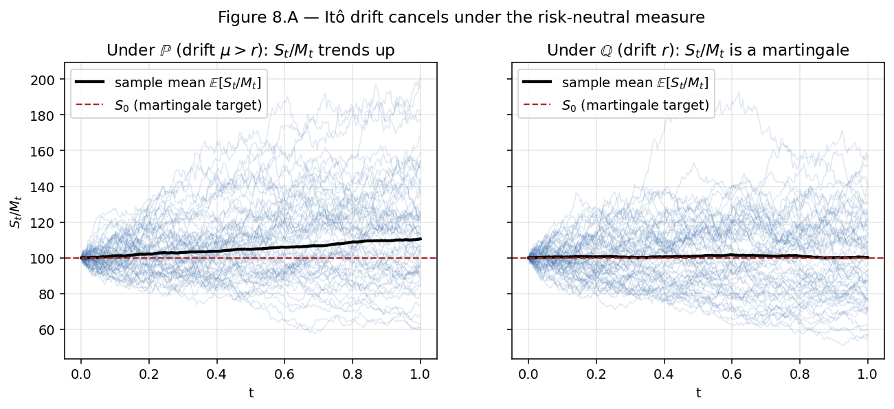
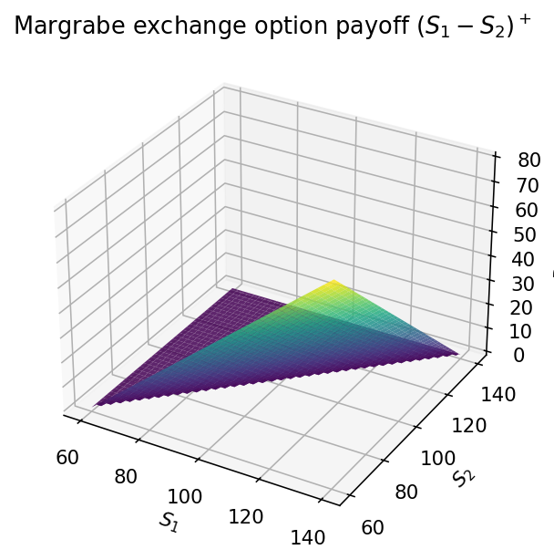
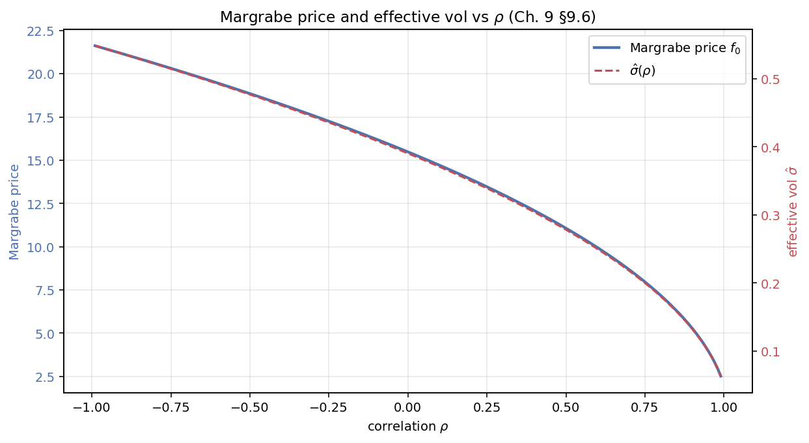

# Chapter 8 — Forwards, Futures, and the Black PDE

The previous two chapters developed the theory of dynamic hedging for
derivatives written on a spot asset: self-financing replication, the
Black–Scholes PDE, the Greeks, and the handling of dividends. This chapter
turns to a family of underlyings that look superficially similar but behave
dramatically differently under the risk-neutral measure: *forwards* and
*futures*. The payoff structure of a European call on, say, the December
S&P 500 futures looks identical to a call on the spot index. But the
pricing PDE loses its first-derivative drift term, the closed-form formula
discards a factor of $e^{-rT}$, and the underlying dynamics under
$\mathbb{Q}$ are a driftless diffusion rather than a GBM with drift $r$. The
reason is the one structural feature that makes a futures contract not a
stock: *entering a futures position costs nothing*.

This chapter consolidates three strands of material that appeared
separately in the original draft. From the dynamic-hedging chapters we take
the self-financing derivation of the Black PDE for options on futures, which
is the cleanest structural argument. From the Feynman–Kac chapter we take
the parallel martingale derivation, which serves as a cross-check and
connects to the general machinery of CH04. From the futures-contracts
chapter we take the concrete pricing examples (Bachelier and
Ornstein–Uhlenbeck futures), the Margrabe exchange option — the tidiest use
of a two-asset change of measure in the guide — and the convexity
adjustment between futures and forwards under stochastic rates.

The chapter leans on CH05's canonical Girsanov derivation every time we
change numeraire, and on CH06's BS PDE every time we compare the Black PDE
to its spot-asset cousin. Feynman–Kac cross-checks reach back to CH04.

**A note on the forward/futures distinction.** A reader reading carefully
will notice that we use the symbol $F_t(T)$ for both the forward price
and the futures price, distinguishing them only by context or by the
superscripts "fwd"/"fut" when ambiguity threatens. This matches the
market convention: under deterministic rates the two are identical (§8.2)
and the single symbol $F_t(T)$ is what quant traders write on the
blackboard; under stochastic rates the two differ by the convexity
adjustment of §8.11, and the distinction matters. Throughout §§8.3–8.10
we take rates as constant (or, equivalently, as deterministic) and treat
$F_t(T)$ as either forward or futures depending on which pricing
argument we are running. Only in §8.11 does the distinction become
load-bearing.

**Who this chapter is for.** A reader who has finished CH06 knows the
Black–Scholes PDE for an option on a spot asset and has internalised the
self-financing apparatus. A reader who has finished CH05 knows Girsanov's
theorem and how to change numeraire. This chapter is the natural
consolidation of those two threads: the Black PDE is the BS PDE applied
to a martingale underlying (the futures), and the Margrabe formula is a
numeraire-change exercise in its purest form. The content is structural,
not computational: once one understands *why* the Black PDE has no
first-derivative drift term and *why* the Margrabe formula has no
discount factor, every variant in the subsequent chapters — caplets,
swaptions, bond options, exchange options on swaps — becomes a
specialisation of the same pattern.

---

## 8.1 Forward Price from a Zero-Cost Claim

A *forward contract* signed at time $t$ with delivery at $T$ and strike $K$
is the simplest possible derivative: an obligation to exchange one unit of
the underlying for the pre-agreed cash amount $K$ at maturity. Its terminal
payoff is $S_T - K$ for the long side and $K - S_T$ for the short side. By
the risk-neutral pricing rule developed in CH06, its value at time $t$ is

$$
\Pi_t \;=\; \mathbb{E}^{\mathbb{Q}}\!\left[\,e^{-r(T - t)}(S_T - K)\,\big|\,\mathcal{F}_t\right]. \tag{8.1}
$$

At signing, the strike $K$ is chosen so that $\Pi_t = 0$ — neither
counterparty pays the other to enter. Setting (8.1) to zero and solving,

$$
K \;=\; \mathbb{E}^{\mathbb{Q}}[\,S_T \mid \mathcal{F}_t\,] \;=\; S_t\,e^{r(T - t)}, \tag{8.2}
$$

where the second equality uses that $S_t\,e^{-rt}$ is a $\mathbb{Q}$-martingale
under the bank-account numeraire (CH05). We call this $K$ the *forward
price at time $t$ for delivery at $T$* and denote it $F^{\text{fwd}}_t(T)$:

$$
F^{\text{fwd}}_t(T) \;=\; S_t\,e^{r(T - t)}. \tag{8.3}
$$

For a stock paying a continuous dividend yield $\delta$ the formula is
$F^{\text{fwd}}_t(T) = S_t\,e^{(r - \delta)(T-t)}$, consistent with the
dividend-paying generalisation in CH07. Geometrically, $F^{\text{fwd}}_t(T)$
is the *fair strike* of a just-signed forward contract — the price at which
the two counterparties are indifferent to taking either side. As $t$
advances toward $T$, $F^{\text{fwd}}_t(T) \to S_T$: the forward price
collapses into the spot as the carry window shrinks.

An intuitive picture: plot $F^{\text{fwd}}_t(T)$ against $S_t$ at a fixed
date $t$. For the no-dividend case it is a straight line through the origin
with slope $e^{r(T-t)} > 1$, sitting slightly above the diagonal $F = S$
that a trader might naively draw. The gap is the *cost of carry* — the
interest saved by not having to hold the stock until $T$. For a
dividend-paying stock the slope is $e^{(r-\delta)(T-t)}$, which is less
than one if $\delta > r$ (the stock yields more than the bank account). In
that regime the forward sits *below* the spot — the commodity-market
phenomenon known as *backwardation*. Its opposite, $\delta < r$, is
*contango*. The sign of $r - \delta$ drives substantial trading strategies
in commodity derivatives, precious metals, and dividend-yield products.

**The cash-and-carry story.** Formula (8.3) can also be obtained by a pure
no-arbitrage argument that does not invoke $\mathbb{Q}$ at all — worth
retelling once because it makes the answer feel inevitable. At time $t$, a
trader can either promise to buy the asset at $T$ for the strike $K$ (zero
cost today, cash outflow $K$ at $T$), or *synthesise* the same exposure by
borrowing $S_t$ dollars today and purchasing one share of $S$ outright. At
$T$ the trader has one share either way; the only difference is the cash
leg. To repay the loan requires $S_t / P(t,T)$ dollars at $T$, where
$P(t,T) = e^{-r(T-t)}$ is the $T$-maturity discount bond. No-arbitrage
forces the two routes to have the same cash outflow at $T$, giving

$$
F^{\text{fwd}}_t(T) \;=\; \frac{S_t}{P(t,T)}. \tag{8.4}
$$

Under constant rates $P(t,T) = e^{-r(T-t)}$ and (8.4) reduces to (8.3). The
formula depends only on the spot and the discount bond — *not* on the
statistical properties of $S$, not on volatility, not on anyone's view on
where $S$ is going. That independence is often underappreciated: the
forward price is a cold no-arbitrage number, while the forward *value* of
an existing contract with a stale strike reflects the market-implied drift
of $S$.

*Forward price term structure — cash-and-carry $F^{\text{fwd}}(t,T) = S_t/P(t,T)$ across maturities.*

**Forward price vs forward value.** The distinction matters. The *forward
value* at time $t$ of an existing contract with legacy strike $K_0$ is
$\Pi_t = (F^{\text{fwd}}_t(T) - K_0)\,P(t,T)$, the discounted difference
between the current fair strike and the contract's locked-in strike. The
*forward price* $F^{\text{fwd}}_t(T)$ is the strike that would make a
*newly signed* contract worth zero. Every day the market quotes the latter;
the former is mark-to-market on a portfolio of contracts with various
strikes. Pricing conventions differ on which number is meant by "the
forward"; always check.

Under the $T$-forward measure $\mathbb{Q}^T$ with numeraire $P(t,T)$, the
ratio $S_t / P(t,T) = F^{\text{fwd}}_t(T)$ is a martingale by construction —
this is the general numeraire-pricing identity of CH05 applied with
$A = P(\cdot, T)$ and $F = S$. That martingale property is why forwards
admit clean Black-type formulas even when rates are stochastic: under
$\mathbb{Q}^T$, the forward price is driftless, and log-Black or
normal-Black closed-forms fall out immediately. We shall return to this
point in CH13 where it is used to price bond options.

**A put-call parity for forwards.** One of the cleanest structural facts
about forwards is their *linearity*: a long forward with strike $K$ plus a
short forward with strike $K'$ is a position that pays $(S_T - K) - (S_T
- K') = K' - K$ at maturity, independent of the spot. The present value
of this difference is $(K' - K)\,P(t, T)$. Writing $\Pi_t(K)$ for the
time-$t$ value of a long forward with strike $K$, we therefore have

$$
\Pi_t(K) \;-\; \Pi_t(K') \;=\; (K' - K)\,P(t, T),
$$

which is a put-call parity for the forward contract alone. Combined with
$\Pi_t(F^{\text{fwd}}_t(T)) = 0$ — the zero-value property of the newly
signed forward — we recover $\Pi_t(K) = (F^{\text{fwd}}_t(T) - K)\,P(t,
T)$, the formula quoted above (8.5). Every trader working with forwards
reasons this way implicitly: the mark-to-market of an off-market forward
is just the discounted difference between the current fair forward price
and the contract's strike.

**Cost of carry, generalised.** The formula $F^{\text{fwd}} = S/P$
generalises to other asset classes by adjusting the carry leg:

- *Equities with continuous dividend yield $\delta$.* Holding the stock
  earns $\delta\,\mathrm{d}t$ in dividends per unit time; the cash-and-carry
  becomes $F^{\text{fwd}}_t(T) = S_t\,e^{(r - \delta)(T - t)}$.
- *Foreign exchange.* With domestic rate $r$ and foreign rate $r^f$,
  holding the foreign currency earns $r^f$; the cash-and-carry becomes
  $F^{\text{fwd}}_t(T) = S_t\,e^{(r - r^f)(T - t)}$ (covered interest rate
  parity).
- *Storable commodity with convenience yield $y$ and storage cost $u$.*
  Holding the physical commodity earns a convenience yield $y$ (for
  commercial users) but costs storage at rate $u$; the forward is
  $F^{\text{fwd}}_t(T) = S_t\,e^{(r - y + u)(T - t)}$.

In each case the drift of the "cost of carry" under $\mathbb{Q}$ equals $r
- \text{(net yield)}$, and the forward/futures price is the spot
compounded at that drift. The formulas of §§8.5–8.11 apply uniformly to
any of these cases with appropriate substitution.

---

## 8.2 Forwards vs. Futures — The Role of Daily Settlement

Forwards and futures are the two simplest delta-one derivatives — linear
claims on the future value of an underlying — but they differ in one
crucial operational respect: *when cash changes hands*. Forwards settle at
maturity; futures settle daily. That small-looking difference has large
consequences for pricing, hedging, and the shape of the backward PDE.

Both are *forward-looking* instruments: they specify a price for delivery of
an asset at a future date. Both are *zero-sum* at initiation: one party is
long, one is short, and no money changes hands upfront (for forwards) or
only margin collateral does (for futures). Both have delta approximately
equal to one: a $1 move in the underlying moves the forward/futures P&L by
approximately $1. Yet the two instruments are priced by different PDEs,
and the Black '76 futures-call formula differs from Black–Scholes in ways
that matter when quoting option prices.

**The forward contract.** A forward is an obligation to buy/sell an asset
$S$ at a future time $T$ at a pre-determined strike $K$. Its terminal
payoff is $S_T - K$, so its time-$t$ value is

$$
\Pi_t \;=\; S_t \;-\; K\,P(t,T), \tag{8.5}
$$

by exactly the two-piece argument of §8.1 (the asset leg is worth $S_t$
today because $S_t/M_t$ is a $\mathbb{Q}$-martingale; the cash leg $-K$ is
deterministic and worth $-K P(t,T)$). Between signing and maturity the
forward's mark-to-market value drifts as the spot moves: it climbs when $S$
rises, falls when $S$ drops, and accumulates an unrealised gain/loss on the
holder's balance sheet. *No cash* is exchanged between counterparties
during the life of the contract; the accumulated P&L is settled all at
once at delivery.

**The futures contract.** A futures contract is also an obligation to
transact at a future date, but changes in the futures price $F_t(T)$ are
settled in cash *every day* into a margin account. Critically,

$$
\text{value of a futures position} \;\equiv\; 0, \tag{8.6}
$$

at every instant by design. Entering a futures position costs nothing; the
contract carries no book value at any mark. Every infinitesimal gain $\mathrm{d}F_t$
is paid out in cash into the margin account immediately, so the holder's
exposure at any instant is to the *next* daily price change only. The
cumulative P&L of a one-lot long futures position from inception up to
time $t$ is simply $F_t(T) - F_0(T)$ — the running sum of daily
settlements.

The zero-value feature is the single most important structural difference
between forwards and futures. It is why futures can be traded in large
notional with only a margin deposit, and why they sit at the centre of the
clearing/settlement plumbing of modern exchanges. It is also why — as we
are about to see — the pricing PDE for options on futures differs from
Black–Scholes by the loss of one term.

**Margin account illustration.** The following table traces a one-lot long
position through four days:

| $t$ | $F_t(T)$ | $\Delta F$ | Margin cash flow | Cumulative margin |
|---|---|---|---|---|
| 0 | 100 | — | 0 | 0 |
| 1 | 101 | +1 | +1 | +1 |
| 2 | 103 | +2 | +2 | +3 |
| 3 | 99 | -4 | -4 | -1 |

Day 0: open long at $F_0 = 100$. No cash exchanged. Day 1: the futures
rises to 101; the broker credits +1 to the margin account. Day 2: +2 more.
Day 3: the futures drops to 99; the broker debits 4. The cumulative margin
at day $t$ is always $F_t - F_0$ — this is the *mark-to-market invariant*
of a futures contract. Continuously, we write $\mathrm{d}F_t$ for the
instantaneous cash flow into the margin account, and the cumulative P&L
up to $t$ is $\int_0^t \mathrm{d}F_s = F_t - F_0$.

**Contrast with a forward.** The forward holder's running P&L is also
$F_t - F_0$ in present value, but the cash flow arrives only at maturity.
Futures deliver the same economic P&L spread out in real time as cash.
Under deterministic interest rates this distinction is invisible — the
present value of a cash stream equals the present value of a single
maturity payment if we can borrow and lend freely at $r$. Under *stochastic*
rates, however, the daily cash flows of a futures position earn (or pay)
interest at a rate that may be correlated with $S$ itself, and this
correlation opens a price gap between the futures quote and the forward
quote that we compute in §8.11.

**Operational summary.** If a forward's mid-market implied strike moves
from $F_0$ to $F_0 + 1$, the holder's forward mark-to-market moves from 0
to +1 (discounted). A futures holder earning the same +1 move gets +1 in
cash deposited to their margin account *that day*, and the futures
mark-to-market stays at 0. The two are economically equivalent modulo the
interest earned on the margin cash — a difference that is small for short
tenors but nontrivial for multi-year contracts.

---

## 8.3 The Futures Price as a $\mathbb{Q}$-Martingale

The economic consequence of daily settlement is a sharp mathematical fact:
*the futures price itself is a martingale under the risk-neutral measure
$\mathbb{Q}$*. The argument is almost tautological once one accepts the
zero-value premise (8.6). Over any short interval $[t, t^+]$ the P&L of a
one-lot long futures position is purely stochastic — it is the accumulated
mark-to-market cash flow $F_{t^+} - F_t$ — and because the position costs
nothing to open, no-arbitrage forces the expected P&L under $\mathbb{Q}$ to
be zero:

$$
\mathbb{E}^{\mathbb{Q}}\!\left[\,F_{t^+}(T) - F_t(T)\mid \mathcal{F}_t\,\right] \;=\; 0. \tag{8.7}
$$

If the conditional expectation were non-zero, there would be a free option:
a position that costs nothing to enter, has symmetric upside and downside
from the holder's perspective, but carries a positive expected return under
the pricing measure. The no-arbitrage principle rules out precisely such
free options. Equivalently, for all $s \le t$,

$$
\boxed{\;\mathbb{E}^{\mathbb{Q}}\!\bigl[F_t(T) \mid \mathcal{F}_s\bigr] \;=\; F_s(T)\;} \tag{8.8}
$$

— the futures price is a $\mathbb{Q}$-martingale.

**A trio of drifts.** It is worth lining up the three kinds of asset that
appear in this guide and noting the drift each of them takes under $\mathbb{Q}$:

| Asset type | $\mathbb{Q}$-drift | Reason |
|---|---|---|
| *Traded asset* (e.g. a non-dividend stock) | $r\,X_t$ | Discounted price $X_t/M_t$ is a $\mathbb{Q}$-martingale; carry at $r$ |
| *Traded asset with yield $\delta$* | $(r - \delta)\,X_t$ | Discounted total return (price + dividends) is a $\mathbb{Q}$-martingale |
| *Futures quote* $F_t(T)$ | $0$ | Position is costless; expected change under $\mathbb{Q}$ is zero |
| *Non-traded variable* (e.g. temperature) | $\mu^{\mathbb{Q}}_t - \sigma_t\,\lambda_t$ | Needs a market price of risk $\lambda_t$ (CH06) |

The first three rows are pinned by replication arguments. The fourth
requires additional market information — a market price of risk — because
there is no hedgeable instrument that pins the drift. For the rest of this
chapter, the futures price is the canonical example of row 3.

**Forward prices are different.** Contrast (8.8) with the analogous
statement for a *forward* price $F^{\text{fwd}}_t(T) = S_t/P(t,T)$. Under
$\mathbb{Q}$ (bank-account numeraire), $F^{\text{fwd}}_t(T)$ is *not* a
martingale in general — both $S_t$ and $1/P(t,T)$ drift, and their ratio
drifts. The cleanest statement is instead that $F^{\text{fwd}}_t(T)$ is a
$\mathbb{Q}^T$-martingale, where $\mathbb{Q}^T$ is the $T$-forward measure
with numeraire $P(\cdot, T)$. This follows from the general numeraire
identity of CH05: if $A$ is a traded numeraire, every traded asset divided
by $A$ is a $\mathbb{Q}^A$-martingale, and $S_t / P(t,T)$ is precisely such a
ratio. Futures and forwards therefore live in *different measures*: the
futures price is naturally a $\mathbb{Q}$-martingale, the forward price is
naturally a $\mathbb{Q}^T$-martingale. Under deterministic rates the two
measures coincide (their Radon–Nikodym density collapses to 1), so futures
and forwards coincide; under stochastic rates they diverge and the gap is
the convexity adjustment of §8.11.

**A subtle point about "the futures is undiscounted".** It is tempting to
read (8.8) as saying the futures *price* requires no discounting. That is
correct. But an *option on a futures* — whose cash payoff settles at some
maturity $T_0$ — is an ordinary traded derivative whose cash payoff must
be discounted back to today in the usual way. The common pitfall is to
conflate the two: the futures *quote* has no drift under $\mathbb{Q}$, but
the option's *value* still carries the usual discount factor $e^{-r(T_0-t)}$.
The Black '76 formula in §8.7 will make this explicit.

---

## 8.4 Dynamics of the Futures Price Under $\mathbb{Q}$

The martingale property (8.8) fixes the $\mathbb{Q}$-drift of $F_t(T)$ at
zero, but leaves the volatility unspecified. Different market settings
motivate different volatility parameterisations. We postulate a general
form

$$
\mathrm{d}F_t(T) \;=\; \sigma^F(t, F_t(T))\,\mathrm{d}\widehat{W}_t \qquad (\mathbb{Q}\text{-measure}), \tag{8.9}
$$

with $\widehat{W}$ a $\mathbb{Q}$-Brownian motion. The specific functional
form of $\sigma^F(t, F)$ is a modelling choice:

- **GBM.** $\sigma^F(t, F) = \sigma\,F$ yields the log-normal Black '76 model
  of §8.7, which is the market standard for equity-index futures, FX
  forwards, and commodity-futures implied-volatility quotation.
- **Bachelier (arithmetic).** $\sigma^F(t, F) = \sigma$ (constant) yields
  the arithmetic-Brownian model of §8.8, appropriate when $F$ can go
  negative — interest-rate futures near the zero bound, or crude-oil
  futures during the April 2020 episode.
- **Samuelson / OU.** $\sigma^F(t, F) = \sigma\,e^{-\eta(T - t)}$ yields a
  mean-reverting arithmetic model where the vol loading *decays* as one
  looks further forward in the curve — matching the empirical fact that
  long-dated commodity futures move less in absolute terms than front-month
  ones (§8.9).

**Derivation under constant rates.** For the GBM case it is worth showing
that (8.9) with $\sigma^F = \sigma F$ falls out of the spot dynamics plus
the cost-of-carry identity. Suppose the spot satisfies

$$
\frac{\mathrm{d}S_t}{S_t} \;=\; \mu\,\mathrm{d}t \;+\; \sigma\,\mathrm{d}W_t \qquad (\mathbb{P}), \tag{8.10}
$$

and constant rates $r$ apply. The forward/futures price is $F_t(T) =
S_t\,e^{r(T-t)}$. By Itô on $f(t, S) = S\,e^{r(T-t)}$,

$$
\mathrm{d}F_t(T) \;=\; e^{r(T-t)}\,\mathrm{d}S_t \;-\; r\,S_t\,e^{r(T-t)}\,\mathrm{d}t. \tag{8.11}
$$

Expanding $\mathrm{d}S_t = \mu S_t\,\mathrm{d}t + \sigma S_t\,\mathrm{d}W_t$
and using $F_t = S_t\,e^{r(T-t)}$,

$$
\frac{\mathrm{d}F_t(T)}{F_t(T)} \;=\; (\mu - r)\,\mathrm{d}t \;+\; \sigma\,\mathrm{d}W_t \qquad (\mathbb{P}). \tag{8.12}
$$

Under the risk-neutral measure $\mathbb{Q}$, the stock's drift is $\mu = r$
(CH06, market-price-of-risk argument). Substituting,

$$
\boxed{\;\frac{\mathrm{d}F_t(T)}{F_t(T)} \;=\; \sigma\,\mathrm{d}\widehat{W}_t \qquad (\mathbb{Q}).\;} \tag{8.13}
$$

The drift $(\mu - r)\,\mathrm{d}t$ in (8.12) is exactly cancelled under
$\mathbb{Q}$ by the measure change $\mathrm{d}W_t \to \mathrm{d}\widehat{W}_t
+ \lambda\,\mathrm{d}t$ with $\lambda = (\mu - r)/\sigma$ (Girsanov, CH05).
The drift $(\mu - r)$ gets killed; the diffusion $\sigma$ survives. This is
the martingale property (8.8) made explicit at the SDE level. Every drift
term in the spot SDE — whether from physical-world mean-reversion, from
the cost of carry $r$, or from a dividend yield — is absorbed into the
futures quote or vanishes under $\mathbb{Q}$; what survives on the futures
is only the diffusion term.

**Case with dividends.** If the stock pays a continuous yield $\delta$, the
spot drifts at $r - \delta$ under $\mathbb{Q}$, and the cost-of-carry
formula becomes $F_t(T) = S_t\,e^{(r-\delta)(T-t)}$. Applying Itô's product
rule to $F_t = S_t\,g(t)$ with $g(t) = e^{(r-\delta)(T-t)}$, $g'(t) = -(r-\delta) g(t)$:

$$
\begin{aligned}
\mathrm{d}F_t &= g(t)\,\mathrm{d}S_t + S_t\,g'(t)\,\mathrm{d}t \\
&= g(t) S_t\!\left[(r-\delta)\,\mathrm{d}t + \sigma\,\mathrm{d}\widehat{W}_t\right] - (r-\delta) g(t) S_t\,\mathrm{d}t \\
&= \sigma\,g(t) S_t\,\mathrm{d}\widehat{W}_t = \sigma F_t\,\mathrm{d}\widehat{W}_t,
\end{aligned}
$$

so

$$
\boxed{\;\frac{\mathrm{d}F_t(T)}{F_t(T)} \;=\; \sigma\,\mathrm{d}\widehat{W}_t \qquad (\mathbb{Q})\;}.
$$

The $(r-\delta)$-drift of the spot exactly cancels the time-decay of the
carry factor: $F$ is a $\mathbb{Q}$-martingale even with dividends, as the
FTAP on futures (8.8) demands. This is the general principle — any
continuous yield or cost-of-carry term that affects the spot under
$\mathbb{Q}$ gets absorbed into the forward's deterministic drift and
cancels, leaving pure diffusion on the forward/futures quote.

**General dynamics.** For modelling purposes, we often write (8.9) with a
general state- and time-dependent volatility $\sigma^F(t, F)$:

$$
\mathrm{d}F_t(T) \;=\; \sigma^F(t, F_t(T))\,\mathrm{d}\widehat{W}_t. \tag{8.14}
$$

All the machinery of the next three sections works at this level of
generality: the Black PDE, its Feynman–Kac representation, and the
closed-forms for specific choices of $\sigma^F$ are all instances of (8.14).

---

## 8.5 Options on Futures — The Black PDE

A European option written on a futures contract is a derivative whose
terminal payoff is a function of the futures price at exercise:

$$
g_{T_0} \;=\; \varphi\!\big(F_{T_0}(T)\big), \tag{8.15}
$$

where $T_0$ is the option's exercise date and $T \ge T_0$ is the futures'
delivery date. The two dates are frequently equal — for standardised
exchange-listed products, option maturity coincides with the underlying
futures' delivery — but they need not be. A typical example is a European
call on the December S&P 500 futures: the payoff at exercise is
$(F_{T_0}(T) - K)_+$, with both dates fixed by the contract specifications.

The pricing problem looks superficially identical to the BS problem of
CH06, with the futures price taking the role of the underlying. But
because the futures price is a martingale under $\mathbb{Q}$, the resulting
PDE will differ in one subtle structural way: the first-derivative drift
term that appears in BS will *vanish*. We derive this by the same
self-financing argument used in CH06; the key accounting twist is that
entering a futures position costs nothing.

### 8.5.1 Setup of the replicating portfolio

Let $g_t = g(t, F_t(T))$ denote the price of a European option on the
futures. We build a replicating portfolio of futures and cash, short one
unit of the option:

$$
V_t \;=\; \alpha_t\,F_t(T) \;+\; \beta_t\,B_t \;-\; g_t, \tag{8.16}
$$

where $\alpha_t$ is the number of *futures* contracts held, $\beta_t$ is
the number of units of the money-market account $B_t$ (with
$\mathrm{d}B_t = r\,B_t\,\mathrm{d}t$), and $V_0 = 0$. A subtle but crucial
point about (8.16): because entering a futures contract *costs nothing*,
the "value" that $\alpha_t\,F_t(T)$ contributes is not a capital outlay —
it is the notional that accrues P&L through daily mark-to-market. We are
not paying $\alpha_t\,F_t$ today to open the position; we are exposed to
$\alpha_t\,\mathrm{d}F_t$ through the daily marks.

For the self-financing bookkeeping it is in fact cleaner to write the
portfolio as

$$
V_t \;=\; \alpha_t\cdot\underbrace{0}_{\text{futures value}} \;+\; \beta_t\,B_t \;-\; g_t, \tag{8.17}
$$

explicitly recognising that the *position* in the futures is worth zero at
every instant. The P&L from the futures comes entirely from the daily
cash flow $\alpha_t\,\mathrm{d}F_t$, not from any change in a non-existent
book value. Both (8.16) and (8.17) yield the same self-financing equation
(as we are about to see); they differ only in whether the "value"
$\alpha_t F_t$ is counted as non-zero on the balance sheet (it is not).

### 8.5.2 Self-financing increment

The self-financing wealth change is

$$
\mathrm{d}V_t \;=\; \alpha_t\,\mathrm{d}F_t(T) \;+\; \beta_t\,\mathrm{d}B_t \;-\; \mathrm{d}g_t. \tag{8.18}
$$

Note the *absence* of a "capital outlay" term for the futures. Compared to
the stock-BS derivation of CH06, where the portfolio contained an
$\alpha_t\,\mathrm{d}S_t$ term, (8.18) has an $\alpha_t\,\mathrm{d}F_t$ term
with the same form. The difference is *bookkeeping*: in the stock case,
$\alpha_t\,\mathrm{d}S_t$ represents the change in book value of shares
held; in the futures case, $\alpha_t\,\mathrm{d}F_t$ represents the cash
flow into the margin account, with no corresponding change in book value
because the position is always worth zero. The formal self-financing
identity has the same shape; only the interpretation of the term differs.

Expanding via Itô's lemma on $g(t, F)$ and substituting (8.14):

$$
\mathrm{d}g_t \;=\; \left[\partial_t g \;+\; \tfrac12 (\sigma^F)^2\,\partial_{FF} g\right]\mathrm{d}t \;+\; \sigma^F\,\partial_F g\,\mathrm{d}\widehat{W}_t, \tag{8.19}
$$

where we have used the fact that $F_t$ has zero drift under $\mathbb{Q}$ so
no $\mu^F\,\partial_F g$ term appears. Substituting (8.19) and (8.14) into
(8.18),

$$
\mathrm{d}V_t \;=\; \alpha_t\,\sigma^F\,\mathrm{d}\widehat{W}_t \;+\; \beta_t\,r\,B_t\,\mathrm{d}t \;-\; \left[\partial_t g + \tfrac12 (\sigma^F)^2\,\partial_{FF} g\right]\mathrm{d}t \;-\; \sigma^F\,\partial_F g\,\mathrm{d}\widehat{W}_t. \tag{8.20}
$$

### 8.5.3 Eliminating the Brownian noise

The $\mathrm{d}\widehat{W}_t$ coefficient is $\sigma^F\,(\alpha_t - \partial_F g)$,
which vanishes iff

$$
\boxed{\;\alpha_t \;=\; \partial_F g(t, F_t(T)).\;} \tag{8.21}
$$

This is the *futures-delta* hedge: hold $\partial_F g$ units of futures
notional. Unlike the spot-delta of CH06, this is not a number of shares of
$S$ but a number of futures contracts, each representing notional exposure
of one unit of $F_t(T)$. Operationally, for a call option with
$\partial_F g = 0.6$, the hedge is to be long 0.6 futures contracts per
option written — a practical trader's number, because futures are typically
traded in integer multiples and 0.6 means "hold 3 futures for every 5
option contracts short". The "delta" reported on a trader's screen for an
option on a futures is this $\partial_F g$.

### 8.5.4 No-arbitrage fixes the drift

With $\alpha_t = \partial_F g$ imposed, the $\mathrm{d}t$ coefficient in
(8.20) is

$$
\mathcal{A}_t \;=\; \beta_t\,r\,B_t \;-\; \partial_t g \;-\; \tfrac12 (\sigma^F)^2\,\partial_{FF} g. \tag{8.22}
$$

No-arbitrage requires $V_t \equiv 0$ (we started with zero wealth and
$\mathrm{d}V_t$ is now purely non-stochastic — any non-zero drift would
generate a riskless profit). From $V_t = 0$ and the zero-value feature of
the futures position, $\beta_t\,B_t = g_t$, so

$$
\beta_t\,r\,B_t \;=\; r\,g_t. \tag{8.23}
$$

Setting $\mathcal{A}_t = 0$ and substituting (8.23) gives the *Black PDE
for options on futures*:

$$
\boxed{\;\partial_t g \;+\; \tfrac12\,(\sigma^F(t, F))^2\,\partial_{FF} g \;=\; r\,g, \qquad g(T_0, F) = \varphi(F).\;} \tag{8.24}
$$

### 8.5.5 Structural observation

Compare (8.24) with the standard Black–Scholes PDE of CH06 for an option
on a non-dividend stock:

$$
\partial_t g \;+\; r\,S\,\partial_S g \;+\; \tfrac12\,\sigma^2 S^2\,\partial_{SS} g \;=\; r\,g.
$$

The first-derivative drift term $r\,S\,\partial_S g$ has *disappeared* in
(8.24). This is the Black PDE's signature feature, and it is a direct
consequence of the zero drift of $F_t$ under $\mathbb{Q}$. One way to see
this: the first-derivative drift in BS comes from the Feynman–Kac formula
applied to $\mathrm{d}S_t = r S_t\,\mathrm{d}t + \sigma S_t\,\mathrm{d}\widehat{W}_t$
— the Feynman–Kac generator of $S$ has a drift piece $r\,S\,\partial_S$.
When the underlying is a futures with zero drift under $\mathbb{Q}$, the
generator has no drift piece at all, and the PDE picks up only the
second-derivative diffusion term.

The $r\,g$ term on the right-hand side is not eliminated — this is the
*discount* term, reflecting that the *option's* cash value settles in
dollars at $T_0$ and must be discounted at $r$. The futures price itself is
undiscounted; the option on it is a cash-settled claim that is.

For constant volatility $\sigma^F(t, F) = \sigma\,F$, (8.24) becomes

$$
\partial_t g \;+\; \tfrac12\,\sigma^2\,F^2\,\partial_{FF} g \;=\; r\,g, \qquad g(T_0, F) = \varphi(F), \tag{8.25}
$$

which is the PDE that the Black '76 formula of §8.7 solves.

### 8.5.6 Market-price-of-risk reading

It is worth recasting the derivation through the market-price-of-risk
language of CH06, because the resulting identity makes the "no-drift for
futures" feature completely transparent. Recall from CH06 that for any
traded asset $X_t$ following $\mathrm{d}X_t = \mu^X_t\,X_t\,\mathrm{d}t +
\sigma^X_t\,X_t\,\mathrm{d}W_t$, no-arbitrage pins the market price of
risk $\lambda_t = (\mu^X_t - r)/\sigma^X_t$ to a common value across all
traded assets on the same Brownian. An option $g_t = g(t, F_t)$ on the
futures has Itô dynamics

$$
\mathrm{d}g_t \;=\; \mu^g_t\,\mathrm{d}t \;+\; \sigma^g_t\,\mathrm{d}W_t,
\qquad
\mu^g_t = \partial_t g + \mu^F_t\,\partial_F g + \tfrac12 (\sigma^F_t)^2\,\partial_{FF} g, \quad
\sigma^g_t = \sigma^F_t\,\partial_F g.
$$

The market-price-of-risk identity relating the claim to the futures is

$$
\frac{\mu^F_t}{\sigma^F_t} \;=\; \frac{\mu^g_t - r\,g_t}{\sigma^g_t}. \tag{8.25a}
$$

For a *traded asset* underlying the BS PDE, both sides equal $\lambda_t
= (\mu - r)/\sigma$ with the usual cost-of-carry $r$. For the *futures*,
the left-hand side is $\mu^F_t / \sigma^F_t$ — and under $\mathbb{Q}$,
$\mu^F_t = 0$, so the left-hand side is zero. The identity (8.25a)
therefore forces $\mu^g_t = r\,g_t$, which is precisely the
drift-equals-$rg$ condition that produces the Black PDE (8.24). The
missing first-derivative drift term in the Black PDE is thus the direct
algebraic consequence of the zero drift of the futures under $\mathbb{Q}$.

**Reading for the practitioner.** The market-price-of-risk of a futures is
*zero* under the futures' own pricing measure. Futures contracts carry no
cost of carry (entering is free), so the "drift minus carry" of a futures
is just its drift. Under $\mathbb{Q}$, which pins the drift to zero, the
Sharpe ratio of a futures is identically zero. Claims priced off the
futures inherit cost-of-carry $r\,g$ (the claim itself has dollar value
and can be borrowed against at rate $r$), so their drift under $\mathbb{Q}$
is $\mu^g = r\,g$ — the "$r\,g$ discount" term in the Black PDE.

---

## 8.6 Feynman–Kac Cross-Check

The derivation of the Black PDE in §8.5 proceeded via the self-financing
hedge argument — a structural route that makes the zero-outlay feature of
the futures explicit. An independent cross-check comes from applying the
general Feynman–Kac theorem of CH04 directly to the futures dynamics.

Let $g(t, F)$ satisfy the Black PDE (8.24). By the Feynman–Kac theorem of
CH04 applied to the SDE (8.14) with zero drift, the PDE

$$
\partial_t g \;+\; \tfrac12\,(\sigma^F)^2\,\partial_{FF} g \;=\; r\,g, \qquad g(T_0, F) = \varphi(F),
$$

has the stochastic representation

$$
\boxed{\;g(t, F) \;=\; \mathbb{E}^{\mathbb{Q}}\!\left[\,e^{-r(T_0 - t)}\,\varphi(F_{T_0}(T))\;\Big|\;F_t(T) = F\,\right],\;} \tag{8.26}
$$

where $F_u$ follows the driftless SDE (8.14) under $\mathbb{Q}$. This is
the direct analogue of the CH04 stock-BS representation, with two
differences:

- the drift of the underlying inside the expectation is *zero* (not $r$),
  because the futures is a $\mathbb{Q}$-martingale;
- the discount factor $e^{-r(T_0 - t)}$ is present, because the option's
  *cash payoff* still settles at $T_0$ and must be discounted back to today.

**Sanity check against the hedging derivation.** The two derivations yield
the same PDE (8.24), so the same formula (8.26) solves both. This is the
CH06 ↔ CH04 duality applied in the futures setting: the PDE can be
derived *either* by a self-financing replication argument *or* by a
martingale-representation argument, and the two routes must agree because
no-arbitrage and risk-neutral pricing are the same thing under the hood.

**An alternative "forward-measure" reading.** Under a measure change that
absorbs the $e^{-r(T_0-t)}$ factor — specifically, moving from $\mathbb{Q}$
to the $T_0$-forward measure $\mathbb{Q}^{T_0}$ with numeraire $P(\cdot,
T_0)$, the $T_0$-maturity zero-coupon bond — the representation (8.26)
simplifies to

$$
\frac{g(t, F)}{P(t, T_0)} \;=\; \mathbb{E}^{\mathbb{Q}^{T_0}}\!\left[\,\varphi(F_{T_0}(T))\,\big|\,F_t(T) = F\,\right]. \tag{8.27}
$$

Under constant rates $P(t, T_0) = e^{-r(T_0 - t)}$, and (8.27) reduces to
(8.26). Under stochastic rates, $\mathbb{Q}$ and $\mathbb{Q}^{T_0}$ are
genuinely different measures, and the convexity adjustment of §8.11 becomes
visible. For the Black PDE under constant rates — the case we focus on in
§§8.7–8.9 — the two expressions are identical. For the interest-rate
applications of CH13, (8.27) is the cleaner starting point.

**Integrating the SDE.** From (8.14) with $\sigma^F(t, F) = \sigma F$
(constant relative volatility), a straightforward Itô integration gives

$$
F_{T_0}(T) \;=\; F_t(T)\,\exp\!\left\{-\tfrac12 \sigma^2 (T_0 - t) + \sigma\,(\widehat{W}_{T_0} - \widehat{W}_t)\right\}, \tag{8.28}
$$

so $F_{T_0}(T)$ is log-normal under $\mathbb{Q}$ with log-mean $\ln F_t(T) -
\tfrac12 \sigma^2 (T_0 - t)$ and log-variance $\sigma^2 (T_0 - t)$. This is
the log-normal distribution that the Black '76 closed-form of §8.7
integrates against.

**Arithmetic case.** For $\sigma^F(t, F) = \sigma$ (Bachelier, constant
absolute vol), (8.14) integrates to

$$
F_{T_0}(T) \;=\; F_t(T) \;+\; \sigma\,(\widehat{W}_{T_0} - \widehat{W}_t), \tag{8.29}
$$

so $F_{T_0}(T)$ is normally distributed under $\mathbb{Q}$ with mean
$F_t(T)$ and variance $\sigma^2 (T_0 - t)$. Note the positivity of the
mean: the futures price itself is the conditional expectation of its
terminal value, which is a restatement of the martingale property (8.8).

In both cases — GBM and Bachelier — the distribution of $F_{T_0}(T)$ under
$\mathbb{Q}$ is centred at the current futures quote $F_t(T)$, which is
exactly what the martingale property requires. The only difference between
the two cases is whether the distribution is lognormal (GBM) or normal
(Bachelier).

---

## 8.7 The Black '76 Closed Form

For the constant-volatility GBM case $\sigma^F(t, F) = \sigma F$ with
payoff $\varphi(F) = (F - K)_+$, the PDE (8.25) admits the celebrated
*Black '76* closed-form solution:

$$
\boxed{\;g(t, F) \;=\; e^{-r(T_0 - t)}\!\left[\,F\,\Phi(d_+) \;-\; K\,\Phi(d_-)\,\right],\;} \tag{8.30}
$$

with

$$
d_\pm \;=\; \frac{\ln(F/K) \;\pm\; \tfrac12\,\sigma^2\,(T_0 - t)}{\sigma\,\sqrt{T_0 - t}}. \tag{8.31}
$$

**Derivation via Feynman–Kac.** Starting from (8.26) with $\varphi(F) =
(F - K)_+$ and the log-normal law (8.28):

$$
g(t, F) \;=\; e^{-r(T_0 - t)}\,\mathbb{E}^{\mathbb{Q}}\!\left[\,(F_{T_0}(T) - K)_+ \mid F_t(T) = F\,\right].
$$

The expectation is the classical log-normal "call-option" integral, and the
log-variance is $\sigma^2(T_0 - t)$ with log-mean $\ln F - \tfrac12 \sigma^2
(T_0 - t)$. A direct Gaussian computation gives

$$
\mathbb{E}^{\mathbb{Q}}\!\left[(F_{T_0} - K)_+ \mid F_t = F\right] \;=\; F\,\Phi(d_+) \;-\; K\,\Phi(d_-),
$$

and multiplying by the discount $e^{-r(T_0 - t)}$ yields (8.30).

**Comparison to Black–Scholes.** The standard BS formula on a non-dividend
stock is

$$
C^{\text{BS}}(S, K, r, \sigma, \tau) \;=\; S\,\Phi(d_1) \;-\; K\,e^{-r\tau}\,\Phi(d_2),
$$

with $d_{1,2} = [\ln(S/K) + (r \pm \tfrac12 \sigma^2)\tau]/(\sigma\sqrt{\tau})$.
The Black '76 formula (8.30) differs in two readable ways:

| | Black–Scholes (spot) | Black '76 (futures) |
|---|---|---|
| "Moneyness" in $d_\pm$ | $\ln(S/K) + r\tau$ | $\ln(F/K)$ only |
| Coefficient on $\Phi(d_+)$ | $S$ | $e^{-r\tau}\,F$ |
| Coefficient on $\Phi(d_-)$ | $K\,e^{-r\tau}$ | $e^{-r\tau}\,K$ |

The first change reflects the absence of a first-derivative drift term in
the Black PDE — the "cost of carry" $r\tau$ that shifts the moneyness in
BS does not appear in Black '76 because the underlying is already a
martingale. The second change reflects that the futures quote $F$ is
itself undiscounted; to state the option price as a dollar amount today,
we simply discount the whole expression by $e^{-r\tau}$.

**Three observations on the formula.**

First, (8.30) is the classical BS formula *with the spot replaced by the
forward* and *with no drift shift in $d_\pm$*. The formula is strictly
simpler than the dividend-paying BS formula of CH07: the dividend yield
does not appear at all because it has already been absorbed into the
definition of the forward/futures price. Third, the formula specialises
cleanly to the constant-dividend-stock case: plugging $F_t(T) =
S_t\,e^{(r-\delta)(T-t)}$ into (8.30) and simplifying recovers the
dividend-BS formula of CH07 exactly. Black '76 is the natural
"forward-measure" simplification of the dividend-BS formula.

Second, a common pitfall: the discount factor in (8.30) is $e^{-r(T_0 -
t)}$, not $e^{-r(T - t)}$. The option matures at $T_0$ (potentially
earlier than the futures' delivery at $T$), and the discount is from today
to *option maturity*, not to futures delivery. For standardised
exchange-listed products the two dates coincide — but for bespoke
derivatives written on an exchange-listed futures (e.g. a mid-curve option
on an interest-rate future) they can differ by several months. Always check
which date enters the discount.

Third, the Black '76 delta — the sensitivity of the option price to the
futures quote — is

$$
\partial_F g \;=\; e^{-r(T_0 - t)}\,\Phi(d_+). \tag{8.32}
$$

Compare to the Black–Scholes spot delta $\Phi(d_1)$: the Black '76 delta is
*discounted*. Operationally this means that to hedge one option written,
one holds fewer than $\Phi(d_+)$ futures contracts — specifically, one
holds $e^{-r(T_0 - t)}\,\Phi(d_+)$. For short-dated options the discount
is small and the two deltas differ only at the third decimal; for
multi-year options the discount can be noticeable.

**Black '76 Greeks.** Differentiating (8.30) yields a complete table of
Greeks. Writing $\tau = T_0 - t$ and $\phi$ for the standard-normal PDF:

$$
\begin{aligned}
\Delta \;&=\; \partial_F g \;=\; e^{-r\tau}\,\Phi(d_+), \\
\Gamma \;&=\; \partial_{FF} g \;=\; \frac{e^{-r\tau}\,\phi(d_+)}{F\,\sigma\,\sqrt{\tau}}, \\
\text{Vega} \;&=\; \partial_\sigma g \;=\; e^{-r\tau}\,F\,\phi(d_+)\,\sqrt{\tau}, \\
\Theta \;&=\; \partial_t g \;=\; -\frac{e^{-r\tau}\,F\,\phi(d_+)\,\sigma}{2\sqrt{\tau}} \;+\; r\,e^{-r\tau}\,[F\,\Phi(d_+) - K\,\Phi(d_-)], \\
\rho \;&=\; \partial_r g \;=\; -\tau\,g(t, F).
\end{aligned}
$$

Several features are worth flagging. First, the gamma has an extra
discount factor $e^{-r\tau}$ compared to BS — again a consequence of the
"futures is a martingale, not a GBM" feature. Second, the rho is
*negative* for a call: an increase in rates lowers the call price (because
the cash settlement at expiry is discounted more heavily), whereas for a
BS spot call on a non-dividend stock, rho is positive. The sign flip is
one of the cleaner diagnostic tests for whether a pricing engine is
treating a contract as a spot-based or futures-based product. Third, the
vega formula is similar to BS, but the $F$ sitting outside is the futures
quote, not the spot — so a Black '76 vega of 0.5 on a $100 futures
differs from a BS vega of 0.5 on a $100 spot only by the overall discount
factor and the substitution $S \to F$.

**A worked numerical check.** Take $F = 100$, $K = 100$, $\sigma = 20\%$,
$\tau = 0.25$ years, $r = 5\%$. Then $d_+ = \tfrac12\sigma\sqrt{\tau} =
0.05$ and $d_- = -d_+ = -0.05$. $\Phi(0.05) \approx 0.5199$, $\Phi(-0.05)
\approx 0.4801$. The Black '76 call price is

$$
g \;=\; e^{-0.05\cdot 0.25}\,[100 \cdot 0.5199 - 100 \cdot 0.4801] \;\approx\; 0.9876 \cdot 3.98 \;\approx\; 3.93.
$$

The analogous BS call on a $100 spot with the same volatility and a
$100 strike at the same rate is $S\,\Phi(d_1) - K\,e^{-r\tau}\,\Phi(d_2)$
with $d_{1,2} = (r \pm \tfrac12\sigma^2)\tau / (\sigma\sqrt{\tau})$,
giving $d_1 \approx 0.175$, $d_2 \approx 0.075$, and a price near $4.62$.
The BS call is higher than the Black '76 call because the spot drift
under $\mathbb{Q}$ is $r > 0$ — the underlying grows into the strike —
while the futures is a martingale and does not. The difference is exactly
the first-derivative drift term cumulating over $\tau$.

**Why the Black formula is so ubiquitous.** The Black '76 formula appears
in a surprising number of places beyond literal options on exchange-traded
futures. It is the market-standard quotation for caps, floors, and
swaptions on interest-rate forwards (CH15); for options on commodity
forwards; and — via a well-known convention — for at-the-money options on
forward-looking yield curves. The underlying reason is always the same:
whenever the underlying is (or can be reparameterised as) a martingale
under *some* appropriately chosen measure, the pricing PDE loses its
first-derivative drift term and the closed-form reduces to (8.30). In the
LIBOR/SOFR caplet setting of CH15, the forward rate $L(t, T_1, T_2)$ is a
martingale under the $T_2$-forward measure, and the caplet price is
exactly the Black '76 formula with $F$ denoting the forward rate and
$\sigma$ its forward-rate volatility. The technical device of changing
numeraire — formalised in CH05 — generalises the futures-price argument to
these other martingale underlyings, and every such numeraire change
collapses the relevant pricing PDE to a Black-style form.

*Drift-cancel schematic — the first-derivative drift term in the Black PDE
vanishes because the futures is a $\mathbb{Q}$-martingale, leaving only the
second-derivative diffusion.*

---

## 8.8 Example — Bachelier Futures and the Arithmetic Binary

The Bachelier (arithmetic Brownian motion) specification is the simplest
possible futures model: constant *absolute* volatility, no drift. Although
the log-normal Black '76 model of §8.7 dominates textbook presentations,
the arithmetic model is the natural choice for underlyings that can go
negative — short-rate futures near the zero bound, or, famously, crude-oil
futures during the April 2020 negative-price episode. It also isolates the
features of the martingale pricing approach from the mechanics of
log-normal integration, which is pedagogically useful.

Take

$$
\mathrm{d}F_t \;=\; \sigma\,\mathrm{d}\widehat{W}_t \qquad (\mathbb{Q}), \tag{8.33}
$$

with constant absolute volatility $\sigma$, and consider a *binary call*

$$
\varphi(F) \;=\; \mathbf{1}_{\{F > K\}}
$$

— the claim pays 1 unit if the futures is above $K$ at option expiry $T_0$,
zero otherwise. For simplicity we take $r = 0$ in this example so that
no discount factor clutters the formula; the general $r \neq 0$ result
multiplies the answer by $e^{-r(T_0 - t)}$.

### 8.8.1 Terminal distribution

From (8.33),

$$
F_{T_0} - F_t \;=\; \sigma\,(\widehat{W}_{T_0} - \widehat{W}_t), \qquad \widehat{W}_{T_0} - \widehat{W}_t \stackrel{d}{=} \mathcal{N}(0, T_0 - t), \tag{8.34}
$$

so $F_{T_0}$ is conditionally normal with mean $F_t$ (the martingale
property) and variance $\sigma^2\,(T_0 - t)$.

### 8.8.2 Pricing

By Feynman–Kac (8.26) with $r = 0$,

$$
h(t, F) \;=\; \mathbb{E}^{\mathbb{Q}}_{t, F}\!\left[\,\mathbf{1}_{\{F_{T_0} > K\}}\,\right] \;=\; \mathbb{Q}_{t, F}\bigl(F_{T_0} > K\bigr). \tag{8.35}
$$

Writing $F_{T_0} - F_t = \sigma\,(\widehat{W}_{T_0} - \widehat{W}_t)$ and
letting $Z \sim \mathcal{N}(0, 1)$,

$$
h(t, F) \;=\; \mathbb{Q}\!\left(Z \;>\; \frac{K - F}{\sigma\,\sqrt{T_0 - t}}\right) \;=\; \Phi\!\left(\frac{F - K}{\sigma\,\sqrt{T_0 - t}}\right), \tag{8.36}
$$

with $\Phi$ the standard-normal CDF. (For the historically-rooted version
using $\sigma = 2$ that appears in the draft, one simply substitutes
$\sigma = 2$ into (8.36).)

### 8.8.3 Reading the answer

The shape of (8.36) rewards a slow look. The numerator $F - K$ measures
how far "in the money" the digital currently is in dollar terms; the
denominator $\sigma\,\sqrt{T_0 - t}$ is the standard deviation of futures
price moves over the remaining time. The ratio is a *$z$-score* — the
number of standard deviations by which the current futures quote exceeds
the strike — and the price of the digital is simply the probability that a
standard normal exceeds minus that $z$-score.

Three limits are worth noting:

- **Deep in the money.** $F \gg K$: the $z$-score is large and positive,
  $\Phi \to 1$, and the digital is worth (correctly) almost its full
  notional of 1.
- **Deep out of the money.** $F \ll K$: the $z$-score is large and negative,
  $\Phi \to 0$, and the digital is worth almost nothing.
- **At the money.** $F = K$: $\Phi(0) = 1/2$ regardless of volatility — a
  feature unique to the arithmetic-Brownian model, where payoff symmetry
  around the mean produces an exact fifty-fifty digital. In the log-normal
  Black '76 model, the ATM digital is not exactly $1/2$ because of the
  asymmetric log-normal distribution; the two models agree only in the
  small-vol limit.

**Discounting.** If $r \neq 0$, the digital payoff of 1 dollar at $T_0$
must be discounted back to today, giving $h(t, F) = e^{-r(T_0 - t)}\,\Phi((F - K)/(\sigma\sqrt{T_0 - t}))$.
The distribution of $F_{T_0}$ is *not* affected by $r$ because $F$ is a
$\mathbb{Q}$-martingale regardless of the interest rate; the discount only
touches the dollar-valued payoff.

**A limiting check.** As $T_0 \to t$, the argument $(F - K)/(\sigma\sqrt{T_0
- t}) \to \pm\infty$ depending on the sign of $F - K$, and $\Phi$ collapses
to the indicator $\mathbf{1}_{\{F > K\}}$ — exactly the terminal payoff.
As $T_0 \to \infty$, the argument goes to zero and $\Phi(0) = 1/2$ — a
binary call infinitely far from expiry has value $1/2$ because the
distribution of $F_{T_0}$ spreads uniformly over positive and negative
half-lines. Both limits confirm the formula's consistency.

---

## 8.9 Example — Ornstein–Uhlenbeck Futures and the Samuelson Effect

The Bachelier model is too simple to describe real commodity or
interest-rate futures markets. Empirically, the *volatility* of the
futures curve is not flat across maturities: long-dated crude futures move
much less in absolute terms than front-month contracts; the same is true
of rates futures, where a hike priced into the December contract barely
perturbs the contract two years out. The empirical name for this pattern
is the *Samuelson effect*, and an OU-type model with a time-decaying
volatility loading $\sigma\,e^{-\eta(T - t)}$ is the cleanest way to
reproduce it.

### 8.9.1 Specification

Under the *physical* measure, the futures is often specified as a
mean-reverting diffusion:

$$
\mathrm{d}F_t(T) \;=\; \kappa\,(\theta - F_t(T))\,\mathrm{d}t \;+\; \sigma\,e^{-\eta(T - t)}\,\mathrm{d}W_t \qquad (\mathbb{P}). \tag{8.37}
$$

But under the risk-neutral measure $\mathbb{Q}$, the martingale property
(8.8) forces the drift to vanish. Girsanov's theorem (CH05) tells us
there is always a measure equivalent to $\mathbb{P}$ that kills any given
drift, and the martingale property of a costless position forces that
measure to be the pricing measure $\mathbb{Q}$. Accordingly, under
$\mathbb{Q}$,

$$
\mathrm{d}F_t(T) \;=\; \sigma\,e^{-\eta(T - t)}\,\mathrm{d}\widehat{W}_t. \tag{8.38}
$$

The mean-reversion drift *was* present in the physical-world dynamics but
*does not need to appear* under $\mathbb{Q}$: the information about
where the futures is heading is already encoded in the initial forward
curve $F_0(T)$ and in the volatility decay $e^{-\eta(T-t)}$. Said
differently, once the market has priced a forward curve that reflects
mean-reversion, the curve itself carries the information, and the
$\mathbb{Q}$-dynamics of each individual futures quote can be driftless
without loss.

### 8.9.2 The Samuelson decay

The economic content of the loading $e^{-\eta(T-t)}$ is the following. A
shock to the spot propagates through to futures of every maturity, but
because the spot itself is mean-reverting, shocks decay before they reach
delivery. A contract with delivery $T$ therefore "sees" only the fraction
$e^{-\eta(T-t)}$ of any time-$t$ shock — the rest has time to mean-revert
back to $\theta$ before delivery. Long-dated contracts sit on the flat
part of the decay curve with a small vol loading; the front month sits on
the steep part. As calendar time $t$ advances and the contract approaches
its own delivery $T$, the exponent $\eta(T - t)$ shrinks toward zero, the
vol loading grows toward $\sigma$, and the futures quote becomes more and
more responsive to spot shocks. That is the Samuelson effect made
quantitative.

*Samuelson decay — the vol loading $\sigma e^{-\eta(T-t)}$ drops with
tenor, so far-dated contracts respond less to same-size shocks than near
contracts.*

### 8.9.3 Terminal distribution

From (8.38),

$$
F_{T_0}(T) - F_t(T) \;=\; \int_t^{T_0} \sigma\,e^{-\eta(T - u)}\,\mathrm{d}\widehat{W}_u. \tag{8.39}
$$

The integrand is deterministic, so the right-hand side is Gaussian with
mean zero. By Itô's isometry, the variance is

$$
\Sigma_t^2 \;=\; \int_t^{T_0} \sigma^2\,e^{-2\eta(T - u)}\,\mathrm{d}u \;=\; \sigma^2\,\frac{e^{-2\eta(T - T_0)} - e^{-2\eta(T - t)}}{2\eta}. \tag{8.40}
$$

Hence

$$
F_{T_0}(T) - F_t(T) \;\sim_{\mathbb{Q}}\; \mathcal{N}(0, \Sigma_t^2), \tag{8.41}
$$

conditional on $\mathcal{F}_t$.

**Reading (8.40).** Formula (8.40) is worth staring at. It encodes the
total variance accumulated by the futures between $t$ (now) and $T_0$
(option expiry), given that delivery is at $T$. There are three dials:

- $\sigma$ is the peak instantaneous vol, attained at delivery ($T = u$);
- $\eta$ is the speed at which long-dated vols decay below that peak;
- the $T - t$ vs $T - T_0$ spacing controls where on the decay curve we
  are integrating.

Two useful limits:

- **$\eta \to 0$.** Expanding the exponentials, $\Sigma_t^2 \to \sigma^2\,(T_0
  - t)$ — ordinary Brownian motion with constant vol. The Samuelson
  decay vanishes.
- **$\eta \to \infty$.** The exponents push the integrand to essentially
  zero everywhere except in a tiny sliver just before $T$, and $\Sigma_t^2
  \to 0$: long-dated futures with infinite decay are stationary and
  have no vol.

Real markets sit in between, with $\eta$ estimated in the range $0.3$ to
$2.0$ per year for many commodities and interest rates.

### 8.9.4 Pricing the binary

For the binary call $\varphi(F) = \mathbf{1}_{\{F > K\}}$ at option expiry
$T_0$, with $r = 0$:

$$
h(t, F) \;=\; \mathbb{Q}_{t, F}(F_{T_0}(T) > K) \;=\; \mathbb{Q}(F_{T_0} - F_t > K - F_t), \tag{8.42}
$$

and writing $F_{T_0} - F_t = \Sigma_t\,Z$ with $Z \sim \mathcal{N}(0, 1)$,

$$
h(t, F) \;=\; \mathbb{Q}\!\left(Z > \frac{K - F}{\Sigma_t}\right) \;=\; \Phi\!\left(\frac{F - K}{\Sigma_t}\right), \tag{8.43}
$$

with $\Sigma_t$ defined in (8.40).

**Structural similarity.** Formula (8.43) has the same structural shape as
the Bachelier binary formula (8.36): both are $\Phi$ of a $(F - K)/\Sigma$
$z$-score. The Samuelson structure is entirely packaged into the single
number $\Sigma_t$. This single-number compression is a feature of the
arithmetic-Brownian world: no matter how baroque the vol surface of the
futures, as long as the SDE is driftless with a deterministic (possibly
time-dependent) vol, the terminal distribution is normal with variance
equal to the integrated instantaneous variance, and any digital-style
payoff prices off $\Phi$ of a single $z$-score.

### 8.9.5 Practical implication

In a Samuelson world, an option on a long-dated futures contract is
dramatically cheaper than an option on a short-dated one of otherwise
similar characteristics. The variance $\Sigma_t^2$ shrinks as $T - T_0$
grows. Traders who ignore this — who price both options with the same
instantaneous vol $\sigma$ — will systematically overprice the far-dated
option and underprice the near-dated one, losing money to anyone running
the proper term structure. This asymmetry is the reason commodity options
desks and interest-rate desks keep dedicated term-structure models for
futures vol rather than relying on a single flat parameter.

The Samuelson effect is a first illustration of a pattern that will recur
throughout the guide: *the unconditional vol of an option is an integral
over time-dependent instantaneous vols*, and model-free bounds on option
prices often follow from convexity arguments applied to this integral.
The same algebra reappears in Hull–White (CH12) and in caplet pricing
(CH15).

### 8.9.6 Numerical illustration

Take $\sigma = 0.40$ (40% instantaneous vol at delivery), $\eta = 1.0$
per year, $T = 2$ (delivery at 2 years), $T_0 = 0.25$ (option on the
2-year futures expiring in 3 months), $t = 0$, $F_0 = 50$, $K = 55$.
Then

$$
\Sigma_0^2 \;=\; 0.40^2\,\frac{e^{-2 \cdot (2 - 0.25)} - e^{-2 \cdot 2}}{2} \;=\; 0.16\,\frac{e^{-3.5} - e^{-4}}{2} \;\approx\; 0.16\,\frac{0.0302 - 0.0183}{2} \;\approx\; 0.000952.
$$

So $\Sigma_0 \approx 0.0309$ in absolute futures-price units — i.e. the
standard deviation of the terminal futures price is about 3.1 cents.
Compare this to the analogous ordinary Bachelier model with flat vol
$\sigma = 0.40$: the standard deviation would be $0.40\,\sqrt{0.25} = 0.20$,
roughly six times larger. The Samuelson decay has substantially deflated
the effective vol because the option is far from the futures' delivery
date, and the vol loading at $t \le T_0 = 0.25$ is only
$0.40\,e^{-1 \cdot 1.75} \approx 0.069$ — about a sixth of the peak
vol at delivery.

Consequently, the digital $\Phi((F - K)/\Sigma_0) = \Phi(-5/0.0309)
\approx \Phi(-162)$ is effectively zero: the strike is so far above the
current futures quote (in units of the tiny $\Sigma_0$) that no
plausible path can reach it. In the flat-vol Bachelier model with
$\Sigma = 0.20$, the analogous $\Phi(-5/0.20) \approx \Phi(-25)$ is also
effectively zero — but for different reasons. The moral: in a Samuelson
world, option pricing near-to-expiry but far-from-delivery requires
genuinely different reasoning than a flat-vol model suggests.

### 8.9.7 Connection to HJM-style frameworks

The OU futures model of (8.38) is in fact a special case of the
Heath–Jarrow–Morton (HJM) framework for modelling the *entire forward
curve* as a collection of driftless diffusions. In HJM, each forward
price $F(t, T)$ is driftless under the risk-neutral measure but has its
own volatility loading $\sigma^F(t, T)$ which can depend on both calendar
time $t$ and the contract's delivery $T$. The Samuelson specification
$\sigma^F(t, T) = \sigma\,e^{-\eta(T - t)}$ is the single-factor,
exponentially-decaying-vol instance of HJM that is tractable in closed
form. Multi-factor HJM models — with several Brownian motions driving
different regions of the curve — are standard in commodity and
fixed-income practice; we encounter them again in CH13 (multi-factor
short-rate models) and CH15 (LIBOR market models).

---

## 8.10 Margrabe Exchange Option — A Numeraire Change Tour de Force

The Margrabe exchange option is the perfect testbed for the numeraire-change
machinery of CH05. A frontal assault on it — setting up a two-dimensional
PDE in $A$ and $B$ and trying to solve — is painful; a judicious change of
numeraire reduces the problem to a one-dimensional Black–Scholes put with
no interest-rate discounting visible anywhere. The reduction is
near-magical the first time one sees it, and it illustrates a principle
that applies far beyond this single example: *if the payoff has a natural
unit (dollars, shares of $A$, shares of $B$, bonds), price in that unit*.
Discounting, drifts, and the multi-dimensional diffusion all collapse when
one speaks the right numeraire language.

### 8.10.1 Setup

Suppose there are two traded assets $A$ and $B$ with dynamics under the
physical measure

$$
\frac{\mathrm{d}A_t}{A_t} \;=\; \mu^A\,\mathrm{d}t \;+\; \sigma^A\,\mathrm{d}W_t, \qquad
\frac{\mathrm{d}B_t}{B_t} \;=\; \mu^B\,\mathrm{d}t \;+\; \sigma^B\,\mathrm{d}W_t \qquad (\mathbb{P}), \tag{8.44}
$$

driven (for the moment) by the same scalar Brownian $W$. The general
correlated case is handled by (8.55) below. We value the *Margrabe
exchange option* paying

$$
\mathcal{C} \;=\; \max(A_T - B_T,\, 0) \tag{8.45}
$$

at maturity $T$. Intuitively this is a call on $A$ struck at $B$ — or,
equivalently, a put on $B$ struck at $A$, since $\max(A - B, 0)$ can be
read either way. The striking feature of the Margrabe payoff, as against a
vanilla call, is that the *strike is itself a random variable*, moving in
lockstep with the other leg. This is the source of all the elegance that
follows: if we denominate everything in units of $A$, the strike becomes
the constant 1 (because $A_T$ in units of $A_T$ is simply 1), and the
problem collapses to pricing a put on the ratio $B/A$ struck at 1. All
the randomness of $A$ has been absorbed into the numeraire.

*Margrabe exchange option payoff surface $\max(A_T - B_T, 0)$ across
$(A_T, B_T)$.*

### 8.10.2 Step 1 — Risk-neutral pricing under $\mathbb{Q}$

First, change measure from $\mathbb{P}$ to the bank-account measure
$\mathbb{Q}$ so that both assets drift at the risk-free rate $r$:

$$
\frac{\mathrm{d}A_t}{A_t} \;=\; r\,\mathrm{d}t \;+\; \sigma^A\,\mathrm{d}W_t^{\mathbb{Q}}, \qquad
\frac{\mathrm{d}B_t}{B_t} \;=\; r\,\mathrm{d}t \;+\; \sigma^B\,\mathrm{d}W_t^{\mathbb{Q}}. \tag{8.46}
$$

(Girsanov's theorem from CH05 guarantees such a measure exists, with drift
shifts $\lambda^A = (\mu^A - r)/\sigma^A$ and $\lambda^B = (\mu^B -
r)/\sigma^B$. When the same $W$ drives both, consistency requires
$\lambda^A = \lambda^B$ — the market-price-of-risk condition of CH06.)

The risk-neutral price is

$$
f(t, A, B) \;=\; \mathbb{E}^{\mathbb{Q}}_{t, A, B}\!\left[\,(A_T - B_T)_+\,e^{-r(T - t)}\,\right]. \tag{8.47}
$$

Trying to evaluate (8.47) directly requires a two-dimensional log-normal
integral in $(A_T, B_T)$ — feasible but not elegant.

### 8.10.3 Step 2 — Change numeraire to $A$

Divide both sides of (8.47) by $A_t$. By the general numeraire-pricing
identity of CH05,

$$
\frac{f(t, A, B)}{A_t} \;=\; \mathbb{E}^{\mathbb{Q}^A}_{t, A, B}\!\left[\,\frac{(A_T - B_T)_+}{A_T}\,\right] \;=\; \mathbb{E}^{\mathbb{Q}^A}_{t, A, B}\!\left[\,\Bigl(1 - \tfrac{B_T}{A_T}\Bigr)_+\,\right], \tag{8.48}
$$

where $\mathbb{Q}^A$ is the measure with numeraire $A$ — under which
every traded asset divided by $A$ is a martingale. The Radon–Nikodym
density is $\mathrm{d}\mathbb{Q}^A / \mathrm{d}\mathbb{Q} = (A_T/A_0)/(M_T/M_0)$,
as derived in CH05.

The move from (8.47) to (8.48) is where the magic happens. Dividing the
option price by $A_t$ reinterprets "price" as "how many shares of $A$ is
the option worth". Because $A$ is itself a traded asset, the price in
units of $A$ must be a $\mathbb{Q}^A$-martingale, which kills the discount
factor entirely: a martingale's value today is just its conditional
expectation tomorrow, no time-value adjustment required. What remains
inside the expectation is a payoff of $(1 - B_T/A_T)_+$ — an ordinary put
on the single random variable $X_T = B_T/A_T$ struck at 1. We have turned
a two-asset pricing problem into a one-asset pricing problem.

Define

$$
X_t \;\equiv\; \frac{B_t}{A_t}, \tag{8.49}
$$

which, being the price of the traded asset $B$ expressed in numeraire $A$,
is a $\mathbb{Q}^A$-martingale.

### 8.10.4 Step 3 — Dynamics of $X_t$ under $\mathbb{Q}^A$

To evaluate (8.48) we need the SDE for $X_t$ under $\mathbb{Q}^A$. The
Girsanov shift from $\mathbb{Q}$ to $\mathbb{Q}^A$, derived in CH05, is

$$
\mathrm{d}W_t^{\mathbb{Q}} \;=\; \sigma^A\,\mathrm{d}t \;+\; \mathrm{d}W_t^A, \tag{8.50}
$$

i.e. the $\mathbb{Q}$-Brownian picks up a drift equal to the volatility
loading of the numeraire $A$ when viewed under $\mathbb{Q}^A$.

Compute $\mathrm{d}(1/A_t)$ via Itô on $f(A) = 1/A$, with $f' = -1/A^2$,
$f'' = 2/A^3$:

$$
\mathrm{d}\!\left(\frac{1}{A_t}\right) \;=\; -\frac{\mathrm{d}A_t}{A_t^2} \;+\; \tfrac12 \cdot \frac{2}{A_t^3}\,(\sigma^A A_t)^2\,\mathrm{d}t \;=\; \frac{1}{A_t}\bigl[((\sigma^A)^2 - r)\,\mathrm{d}t \;-\; \sigma^A\,\mathrm{d}W_t^{\mathbb{Q}}\bigr]. \tag{8.51}
$$

Then, using the Itô product rule on $X_t = B_t \cdot (1/A_t)$ with
covariation $\mathrm{d}[B, 1/A]_t = -(B_t/A_t)\,\sigma^A \sigma^B\,\mathrm{d}t$,

$$
\mathrm{d}\!\left(\frac{B_t}{A_t}\right) \;=\; \frac{B_t}{A_t}\bigl(r\,\mathrm{d}t + \sigma^B\,\mathrm{d}W_t^{\mathbb{Q}}\bigr) \;+\; \frac{B_t}{A_t}\bigl[((\sigma^A)^2 - r)\,\mathrm{d}t - \sigma^A\,\mathrm{d}W_t^{\mathbb{Q}}\bigr] \;-\; \frac{B_t}{A_t}\,\sigma^A \sigma^B\,\mathrm{d}t. \tag{8.52}
$$

Collecting $\mathrm{d}t$ and $\mathrm{d}W_t^{\mathbb{Q}}$ terms,

$$
\mathrm{d}\!\left(\frac{B_t}{A_t}\right) \;=\; \frac{B_t}{A_t}\Bigl\{\bigl[(\sigma^A)^2 - \sigma^A \sigma^B\bigr]\,\mathrm{d}t \;+\; (\sigma^B - \sigma^A)\,\mathrm{d}W_t^{\mathbb{Q}}\Bigr\}. \tag{8.53}
$$

Now substitute (8.50) $\mathrm{d}W_t^{\mathbb{Q}} = \sigma^A\,\mathrm{d}t +
\mathrm{d}W_t^A$:

$$
\mathrm{d}\!\left(\frac{B_t}{A_t}\right) \;=\; \frac{B_t}{A_t}\Bigl\{\underbrace{\bigl[(\sigma^A)^2 - \sigma^A \sigma^B + (\sigma^B - \sigma^A)\sigma^A\bigr]}_{\;=\; 0}\,\mathrm{d}t \;+\; (\sigma^B - \sigma^A)\,\mathrm{d}W_t^A\Bigr\}, \tag{8.54}
$$

confirming that $X_t = B_t/A_t$ is a $\mathbb{Q}^A$-martingale, and

$$
\boxed{\;\frac{\mathrm{d}X_t}{X_t} \;=\; (\sigma^B - \sigma^A)\,\mathrm{d}W_t^A.\;} \tag{8.55}
$$

Despite all the Itô bookkeeping in (8.51)–(8.54), the end result is a
geometric Brownian motion for $X$ with *no drift* and a volatility equal
to the simple difference $\sigma^B - \sigma^A$. The zero drift is enforced
by the numeraire property — it had to come out that way — and the explicit
calculation shows every drift term cancelling. The volatility is the
*relative* vol: how much $B$ moves relative to $A$, which is the only vol
relevant when we measure everything in units of $A$. When $A$ and $B$ are
driven by the same Brownian with the same vol, the ratio is deterministic
and the option has no optionality; (8.55) gives zero vol, correctly.

### 8.10.5 Correlated case

In the general correlated case with two distinct Brownians $W^{(1)}, W^{(2)}$
of correlation $\rho$,

$$
\frac{\mathrm{d}A_t}{A_t} \;=\; r\,\mathrm{d}t + \sigma^A\,\mathrm{d}W^{(1)}_t, \qquad
\frac{\mathrm{d}B_t}{B_t} \;=\; r\,\mathrm{d}t + \sigma^B\,\mathrm{d}W^{(2)}_t, \qquad \mathrm{d}\langle W^{(1)}, W^{(2)}\rangle_t = \rho\,\mathrm{d}t,
$$

the same Itô calculation yields $\mathrm{d}X_t / X_t = \hat{\sigma}\,\mathrm{d}W^A_t$
with

$$
\boxed{\;\hat{\sigma}^2 \;=\; (\sigma^A)^2 \;-\; 2\rho\,\sigma^A \sigma^B \;+\; (\sigma^B)^2.\;} \tag{8.56}
$$

The scalar-BM result (8.55) is the special case $\rho = +1$ with both assets
driven by the *same* $W$, which collapses (8.56) to $\hat{\sigma}^2 =
(\sigma^B - \sigma^A)^2$ and hence $\hat{\sigma} = |\sigma^B - \sigma^A|$.

**Reading (8.56).** This is one of those small-looking results that
deserves a lot of respect. It says *the only interaction between the two
assets that matters for the exchange option is their correlation* — not
their individual drifts, not their individual levels, just $\rho$. Crank
$\rho$ up toward $+1$ (assets move in lockstep): $\hat{\sigma}^2$ shrinks
toward $(\sigma^A - \sigma^B)^2$, and two assets that always move together
cannot drift apart in relative terms — the option is cheap. Crank $\rho$
down toward $-1$ (assets move oppositely): $\hat{\sigma}^2$ balloons to
$(\sigma^A + \sigma^B)^2$, and two maximally anti-correlated assets are
maximally divergent in relative terms — the option is expensive. In a
Margrabe setting, *correlation is the pricing input* — more so than any
individual vol — which is why dispersion traders and index arbitrageurs
obsess over correlation term structures.

*Margrabe price as a function of correlation $\rho$ — option value
increases monotonically as $\rho$ decreases, since divergent assets
maximise the expected spread.*

### 8.10.6 Step 4 — The Margrabe formula

Since $X_t$ is a geometric Brownian motion under $\mathbb{Q}^A$ with
volatility $\hat{\sigma}$ and *no drift*, the inner expectation in (8.48)
is a Black–Scholes put on $X$ struck at 1 with $r = 0$ (no discount under
the martingale measure):

$$
\frac{f_t}{A_t} \;=\; \Phi(-d_-) \;-\; \frac{B_t}{A_t}\,\Phi(-d_+), \qquad d_\pm \;=\; \frac{-\ln(B_t/A_t) \pm \tfrac12 \hat{\sigma}^2 (T - t)}{\hat{\sigma}\,\sqrt{T - t}}. \tag{8.57}
$$

Rearranging into the familiar Margrabe form,

$$
\boxed{\;f_t \;=\; A_t\,\Phi(d_1) \;-\; B_t\,\Phi(d_2),\;} \qquad d_1 \;=\; \frac{\ln(A_t/B_t) + \tfrac12 \hat{\sigma}^2 (T - t)}{\hat{\sigma}\,\sqrt{T - t}}, \quad d_2 \;=\; d_1 - \hat{\sigma}\,\sqrt{T - t}. \tag{8.58}
$$

No discounting appears because we priced under $\mathbb{Q}^A$ and the
payoff is denominated in units of $A$; the numeraire absorbs the interest
rate.

### 8.10.7 Analogy with Black–Scholes

Compare (8.58) to the standard Black–Scholes call formula $C = S\,\Phi(d_1)
- K\,e^{-rT}\,\Phi(d_2)$. The two look almost identical, with three
substitutions: the stock $S$ becomes $A$, the discounted strike $K\,e^{-rT}$
becomes $B$, and the single volatility $\sigma$ becomes the relative vol
$\hat{\sigma}$. The discounted strike in BS plays exactly the role $B$
plays in Margrabe — a "random" strike whose dynamics (growth at rate $r$
in BS, geometric Brownian in Margrabe) have been absorbed into the second
term. Once one sees this analogy, Margrabe is not a new formula but
Black–Scholes in a different costume.

### 8.10.8 Relative moneyness, not levels

A practical reading of (8.58): Margrabe does not care about the *levels*
of $A$ and $B$, only their ratio $X = B/A$. The option is at-the-money
when $A_t = B_t$. Higher correlation $\rho$ shrinks $\hat{\sigma}$ and
therefore the option value — a "best-of" is cheapest when the two
underlyings are clones. The limit $\rho = 1$, $\sigma^A = \sigma^B$ gives
$\hat{\sigma} = 0$ and the option is worth $\max(A_t - B_t, 0)$ exactly
(deterministic, no optionality).

When trading an exchange option, do not look at the absolute levels of the
two assets; look at their ratio. If the ratio is far from 1, the option
is deep in or deep out of the money, and gamma is low. If the ratio is
near 1, the option is ATM and gamma is high. Similarly, do not think
about each asset's vol separately; think about the *spread vol*
$\hat{\sigma}$, which is the only vol the option cares about. Skew and
smile in $\hat{\sigma}$ — to the extent they exist — reflect co-movement
of individual skews with correlation dynamics, and they are one of the
subtlest risks in dispersion trading.

### 8.10.9 Worked numerical example

Take $A_0 = B_0 = 100$ (ATM), $\sigma^A = 0.25$, $\sigma^B = 0.30$, $\rho
= 0.6$, $T = 1$ year, $r = 3\%$. Then

$$
\hat{\sigma}^2 \;=\; 0.25^2 - 2 \cdot 0.6 \cdot 0.25 \cdot 0.30 + 0.30^2 \;=\; 0.0625 - 0.09 + 0.09 \;=\; 0.0625,
$$

so $\hat{\sigma} = 0.25$. Note: the spread vol equals $\sigma^A$ in this
specific case — a coincidence of the correlation and vol values, not a
general feature. The $d$-parameters are $d_1 = \tfrac12 \hat{\sigma} = 0.125$
and $d_2 = -0.125$, giving $\Phi(d_1) \approx 0.5497$, $\Phi(d_2) \approx
0.4503$. The Margrabe price is

$$
f_0 \;=\; 100 \cdot 0.5497 \;-\; 100 \cdot 0.4503 \;=\; 9.94.
$$

Notice the absence of any discount factor — this is the numeraire-change
magic of (8.58). The price is 9.94% of the reference asset's notional,
which is the right-of-magnitude value for an ATM exchange option with a
25% spread vol over one year.

Now flip the correlation to $\rho = -0.6$:

$$
\hat{\sigma}^2 \;=\; 0.0625 + 0.09 + 0.09 \;=\; 0.2425, \qquad \hat{\sigma} \;\approx\; 0.4924.
$$

The spread vol almost doubles, and the Margrabe price rises to
approximately $19.5$ — nearly double the positive-correlation case. This
is the correlation sensitivity made quantitative: flipping the sign of
$\rho$ from $+0.6$ to $-0.6$ changes the fair price of the exchange
option by 100%. Dispersion-trading desks, which systematically sell
single-name options and buy index options to monetise the
correlation-vs-individual-vol gap, live and die by this relationship.

### 8.10.10 Generalisations and pitfalls

The Margrabe formula (8.58) has been generalised in several directions
that appear elsewhere in the guide:

- **Stochastic volatility.** If either $\sigma^A$ or $\sigma^B$ is itself
  stochastic (a Heston-like model, CH14), the Margrabe formula is an
  approximation and one falls back on characteristic-function or
  Monte-Carlo methods.
- **Multiple assets.** The "best-of" option $\max(A_T, B_T, C_T)$ does
  *not* admit a closed-form generalisation of (8.58) — the best-of
  requires three-dimensional integration and is typically handled by
  quasi-Monte-Carlo or semi-analytic methods (Stulz 1982, Johnson 1987).
- **Dividend-paying legs.** If either asset pays a continuous yield, the
  cash-and-carry growth of $A$ and $B$ is adjusted by subtracting the
  yield, and the formula remains valid with modified drifts.

A common pitfall: the vol loadings $\sigma^A$ and $\sigma^B$ in (8.56)
must be the *same Brownian-motion loadings* — i.e. the coefficients
appearing in front of the *same* $\mathrm{d}W^{(k)}_t$ components. If one
decomposes each asset's volatility into a sum of loadings on common and
idiosyncratic factors, the Margrabe spread vol must be computed by
appropriately combining the components. For two independent Brownians of
volatilities $\sigma^A, \sigma^B$ (i.e. $\rho = 0$), the spread vol is
$\hat{\sigma} = \sqrt{(\sigma^A)^2 + (\sigma^B)^2}$ — the formula reduces
to the Pythagorean sum, as expected for independent vol components.

---

## 8.11 Futures vs Forward — Convexity Adjustment Under Stochastic Rates

We are now in a position to pay off the promise made in §8.2: under
stochastic rates, futures and forwards on the same underlying differ by a
*convexity adjustment*, whose sign is controlled by the sign of
$\mathrm{Cov}^{\mathbb{Q}}(r_t, S_t)$. The intuition is financial, not
mathematical, and it is worth building before writing any formulas down.

### 8.11.1 The intuition

Picture two traders. Alice is long a *forward* on $S$ with maturity $T$;
Bob is long a *futures* on $S$ with the same maturity. Both have the same
final exposure to $S_T$. But between now and $T$, Bob receives daily
mark-to-market cash flows into a margin account, while Alice does nothing.
If $S$ goes up, Bob receives cash; if $S$ goes down, Bob pays cash.

Now suppose $S$ and $r$ are positively correlated — a plausible story for
an equity index and the short rate during normal macro regimes, or for a
bond futures and the short rate (which would be the same rate, making the
correlation mechanical). On the days Bob receives cash (up-days for $S$),
rates are also high, so Bob reinvests the cash at a *high* rate. On the
days Bob pays cash (down-days for $S$), rates are low, so Bob finances
the losses at a *low* rate. Bob wins on both ends of this timing
asymmetry, and the extra value he captures must be compensated at
inception by a *higher* futures price relative to the forward. This is the
convexity adjustment: $F^{\text{fut}} > F^{\text{fwd}}$ when $\mathrm{Cov}(r, S)
> 0$, and the opposite sign when the correlation flips.

Conversely, if $r$ and $S$ are negatively correlated (as they might be for
a bond futures and the short rate, depending on the economic regime), Bob
reinvests his up-day cash at low rates and finances his down-day losses at
high rates. The timing asymmetry now works *against* Bob, and the fair
futures price must sit *below* the forward to compensate.

If rates are deterministic — or if $S$ and $r$ are uncorrelated under
$\mathbb{Q}$ — the timing asymmetry is gone, and the two prices coincide.

### 8.11.2 The formula

Under $\mathbb{Q}$ (bank-account numeraire $M_t$), the futures price
$F^{\text{fut}}_t(T)$ is a martingale (§8.3). Under the $T$-forward
measure $\mathbb{Q}^T$ (bond numeraire $P(\cdot, T)$), the forward price
$F^{\text{fwd}}_t(T) = S_t/P(t, T)$ is a martingale (CH05). Taking
conditional expectations at time $t$,

$$
F^{\text{fut}}(t, T) \;=\; \mathbb{E}^{\mathbb{Q}}_t[S_T], \qquad
F^{\text{fwd}}(t, T) \;=\; \mathbb{E}^{\mathbb{Q}^T}_t[S_T] \;=\; \frac{\mathbb{E}^{\mathbb{Q}}_t\!\left[S_T\,e^{-\int_t^T r_u\,\mathrm{d}u}\right]}{P(t, T)}. \tag{8.59}
$$

Their difference is the convexity adjustment. By the identity
$\mathrm{Cov}(X, Y) = \mathbb{E}[XY] - \mathbb{E}[X]\mathbb{E}[Y]$ applied
to the inner expectation, one obtains

$$
F^{\text{fut}}(t, T) \;-\; F^{\text{fwd}}(t, T) \;=\; \frac{1}{P(t, T)}\,\mathrm{Cov}^{\mathbb{Q}}_t\!\left(S_T,\,1 - e^{-\int_t^T r_u\,\mathrm{d}u}\right), \tag{8.60}
$$

which to leading order in the covariance is approximately

$$
F^{\text{fut}}(t, T) \;-\; F^{\text{fwd}}(t, T) \;\approx\; \int_t^T\!\!\int_t^T \mathrm{Cov}^{\mathbb{Q}}_t\bigl(\mathrm{d}\ln S_u,\,r_v\,\mathrm{d}v\bigr). \tag{8.61}
$$

### 8.11.3 The sign rule

Positive correlation between $S$ (hence $F^{\text{fut}}$) and $r$ means
MTM gains are reinvested at higher rates while losses are financed at
lower rates — this is worth money to the long, so the fair futures price
must be *above* the forward. Negative correlation flips it. In summary:

| Regime | Relation |
|---|---|
| $r$ deterministic | $F^{\text{fut}}(t, T) = F^{\text{fwd}}(t, T) = S_t / P(t, T)$ |
| $r$ stochastic, $\mathrm{Cov}^{\mathbb{Q}}(r_t, F^{\text{fut}}_t) = 0$ | $F^{\text{fut}} = F^{\text{fwd}}$ |
| $r$ stochastic, positive correlation | $F^{\text{fut}} > F^{\text{fwd}}$ |
| $r$ stochastic, negative correlation | $F^{\text{fut}} < F^{\text{fwd}}$ |

The two measures — bank-account and $T$-forward — coincide iff $P(t, T)$
is deterministic. When they coincide, so do the expectations.

*Futures-forward basis under stochastic rates — positive $r$–$S$
correlation pushes the basis positive, negative correlation pushes it
negative. The magnitude is controlled by rate volatility and the tenor.*

### 8.11.4 Magnitudes in practice

How big is the convexity adjustment? A rough rule of thumb:

- **Short-dated eurodollar / SOFR futures.** Here the underlying rate and
  the reinvestment rate are both tied to the same short-rate curve, so
  $\rho \approx 1$ and the correlation effect is maximal. The adjustment
  can reach several basis points and is routinely quoted and hedged by
  rates desks. Dedicated convexity-adjustment calculators are standard in
  rates-trading software.
- **Long-dated equity index futures.** Correlation between equity returns
  and rates is modest, rate vols are low, and the adjustment is typically
  small (a few basis points on a multi-year contract). Still, for
  institutional hedgers running multi-billion-dollar exposures, a few
  basis points can matter.
- **FX futures.** Non-trivial because of the "quanto" correlation between
  the FX rate and the domestic short rate. The formula (8.61) is still the
  starting point, but the practitioner's job is to specify a model
  (typically Hull–White for the short rate, log-normal for FX, with a
  correlation $\rho$ between them) and evaluate the double integral
  analytically.

### 8.11.5 The deeper reading

A subtle but important observation: the convexity adjustment is a
*measure-change effect*, not a modelling choice. The two prices
$F^{\text{fut}}$ and $F^{\text{fwd}}$ are *both* martingales, but under
*different* measures — the bank-account measure and the $T$-forward
measure — and those two measures assign different weights to states of
the world unless rates are deterministic. When rates are deterministic,
the bank-account numeraire $M_t = e^{\int r}$ and the bond numeraire
$P(t, T)$ differ by a deterministic factor, the two measures coincide,
and the two martingale expectations coincide. When rates are stochastic,
the numeraires diverge in a state-dependent way, and so do the
expectations.

This is the first example of a pattern that pervades the fixed-income
chapters of this guide: *convexity adjustments of the same structural form
appear wherever a quantity is quoted under one measure but needs to be
priced under another*. The classic cases:

- Futures vs forwards on a single asset (this section).
- Convexity adjustments for CMS rates (CH13), where a swap rate expected
  under the annuity measure differs from its value expected under the
  $T$-forward measure.
- Quanto adjustments for FX-linked payoffs, where a dollar payoff
  proportional to a foreign asset carries a correlation-dependent
  adjustment.

In every case the adjustment is a covariance term with the same
structural shape as (8.60): the difference between two martingale prices
is a covariance of state variables under the reference measure. Once the
reader internalises this once for futures-vs-forwards, the CH13
convexity-adjustment calculations become routine.

### 8.11.6 A Hull–White closed-form approximation

Writing down a concrete convexity-adjustment number requires a model for
both $S$ and $r$. The most common textbook choice is to take $S$
log-normal and $r$ Hull–White (CH12), with a constant correlation $\rho$
between the Brownians. Under that model, Hull (2018) gives the
approximation

$$
\ln F^{\text{fut}}(t, T) - \ln F^{\text{fwd}}(t, T) \;\approx\; \rho\,\sigma_S\,\sigma_r\,\frac{(T - t)^2}{2},
$$

where $\sigma_S$ is the spot volatility and $\sigma_r$ is the short-rate
vol. The quadratic-in-tenor scaling is characteristic of convexity
adjustments: over short tenors the effect is negligible, but it grows
quickly with maturity. For eurodollar/SOFR futures with $\sigma_r \approx
0.01$ (1% absolute rate vol), $\sigma_S \approx 0.0025$ (own-vol for a
short rate), $\rho \approx 1$, and $T - t = 5$ years, the adjustment is
roughly $1 \cdot 0.01 \cdot 0.0025 \cdot 12.5 = 0.0003$ or 3 basis
points — a number that matches practitioner quotations for multi-year
eurodollar convexity adjustments.

### 8.11.7 Hedging implications

From a portfolio-management standpoint, the futures-vs-forward convexity
adjustment has a direct hedging consequence: if a dealer has hedged a
forward exposure with futures (or vice versa), and rates subsequently
become more volatile, the hedge *slippage* is proportional to the
convexity adjustment. Dealers who systematically run futures-vs-forward
basis books (the cross between cash-settled swap futures and OTC swaps,
for instance) must mark their book daily to the evolving convexity
adjustment and adjust hedges to reflect the changing rate volatility.
The sensitivity of the basis to rate vol is often called the *vega of
the convexity adjustment*, and is one of the diagnostics that
rates-trading desks monitor as part of their broader rate-vol exposure.

---

## 8.12 Key Takeaways

1. **Forward price.** The fair forward strike $F^{\text{fwd}}_t(T) = S_t /
   P(t, T)$ is pinned by cash-and-carry no-arbitrage, independent of
   volatility or any statistical properties of $S$. Under constant rates
   this reduces to $S_t\,e^{r(T - t)}$; with a dividend yield, to
   $S_t\,e^{(r - \delta)(T - t)}$.

2. **Forwards vs futures.** Forwards settle at maturity; futures settle
   daily. The futures position is zero-valued at every instant by design
   (daily MTM absorbs every infinitesimal gain/loss immediately), while the
   forward's value drifts with the spot until maturity. This
   zero-value feature is why the futures price is a $\mathbb{Q}$-martingale
   and why the Black PDE has no first-derivative drift term.

3. **Three drifts under $\mathbb{Q}$.**
   - Traded asset: drift $r\,X_t$.
   - Traded asset with yield $\delta$: drift $(r - \delta)\,X_t$.
   - Futures quote: drift $0$ (costless position).

4. **Dynamics of $F_t$ under $\mathbb{Q}$.** $\mathrm{d}F_t(T) = \sigma^F(t,
   F)\,\mathrm{d}\widehat{W}_t$ with no drift. Specific choices of
   $\sigma^F$ yield GBM (constant relative vol, used in Black '76),
   Bachelier (constant absolute vol, used when $F$ can go negative), and
   Samuelson/OU (time-decaying vol loading, used for commodity futures).

5. **Black PDE.** For an option $g(t, F)$ on a futures with payoff
   $\varphi(F_{T_0})$,

   $$
   \partial_t g \;+\; \tfrac12\,(\sigma^F)^2\,\partial_{FF} g \;=\; r\,g, \qquad g(T_0, F) = \varphi(F).
   $$

   The missing $r\,F\,\partial_F g$ term is the signature of
   martingale-underlying pricing. The $r\,g$ discount term remains because
   the option's dollar payoff still settles at $T_0$.

6. **Feynman–Kac cross-check.** The Black PDE has the stochastic
   representation $g(t, F) = \mathbb{E}^{\mathbb{Q}}[\,e^{-r(T_0 -
   t)}\,\varphi(F_{T_0})\,|\,F_t = F\,]$ with $F_u$ satisfying the
   driftless SDE under $\mathbb{Q}$.

7. **Black '76 closed form.** For log-normal futures with constant
   relative vol $\sigma$ and a call payoff,

   $$
   g(t, F) \;=\; e^{-r(T_0 - t)}\,[F\,\Phi(d_+) \;-\; K\,\Phi(d_-)], \qquad d_\pm \;=\; \frac{\ln(F/K) \pm \tfrac12 \sigma^2 (T_0 - t)}{\sigma\,\sqrt{T_0 - t}}.
   $$

   Structurally, Black '76 is BS with $S \to F$, $r \to 0$ in $d_\pm$, and
   an overall discount $e^{-r(T_0 - t)}$.

8. **Bachelier binary.** Under $\mathrm{d}F_t = \sigma\,\mathrm{d}\widehat{W}_t$,
   a digital call prices as $\Phi((F - K)/(\sigma\,\sqrt{T_0 - t}))$. At
   the money ($F = K$), the price is exactly $1/2$ — a symmetry unique to
   the arithmetic model.

9. **Samuelson / OU futures.** Under $\mathrm{d}F_t = \sigma\,e^{-\eta(T -
   t)}\,\mathrm{d}\widehat{W}_t$, terminal variance is
   $\Sigma_t^2 = \sigma^2\,(e^{-2\eta(T - T_0)} - e^{-2\eta(T -
   t)})/(2\eta)$ and a digital call prices as $\Phi((F - K)/\Sigma_t)$.
   Long-dated futures have smaller $\Sigma_t$ than short-dated ones — the
   Samuelson effect.

10. **Margrabe exchange option.** Under numeraire $A$, the ratio $X_t =
    B_t/A_t$ is a martingale with vol $\hat{\sigma} =
    \sqrt{(\sigma^A)^2 - 2\rho\,\sigma^A\sigma^B + (\sigma^B)^2}$,
    yielding $f_t = A_t\,\Phi(d_1) - B_t\,\Phi(d_2)$. No discount factor
    appears because the numeraire absorbs interest. Correlation $\rho$,
    not individual drifts or levels, determines the option value.

11. **Futures vs forward convexity.** Under stochastic rates,
    $F^{\text{fut}} - F^{\text{fwd}}$ is a covariance of $S_T$ with the
    rate-path discount factor, proportional to $\mathrm{Cov}^{\mathbb{Q}}(r,
    S)$ in the leading-order limit. Positive correlation pushes the
    futures price above the forward; negative correlation pushes it
    below. Under deterministic rates, the two prices coincide.

12. **Numeraire is the theme.** The futures price is natural under
    $\mathbb{Q}$; the forward price is natural under $\mathbb{Q}^T$; the
    Margrabe exchange option is natural under one of its own legs. Each
    "naturalness" is an invitation to change measure; accepting the
    invitation collapses the pricing problem, while refusing it forces one
    to grind through a PDE that did not need to be set up.

---

## Appendix — Reference Formulas

| Label | Formula |
|---|---|
| (8.3) | $F^{\text{fwd}}_t(T) = S_t\,e^{r(T - t)}$ (constant rates, no dividend) |
| (8.4) | $F^{\text{fwd}}_t(T) = S_t / P(t, T)$ (cash-and-carry, any rates) |
| (8.8) | $\mathbb{E}^{\mathbb{Q}}[F_t(T) \mid \mathcal{F}_s] = F_s(T)$ (futures is a $\mathbb{Q}$-martingale) |
| (8.9) | $\mathrm{d}F_t(T) = \sigma^F(t, F_t(T))\,\mathrm{d}\widehat{W}_t$ (general futures SDE under $\mathbb{Q}$) |
| (8.13) | $\mathrm{d}F_t/F_t = \sigma\,\mathrm{d}\widehat{W}_t$ (log-normal futures under $\mathbb{Q}$) |
| (8.21) | $\alpha_t = \partial_F g(t, F_t)$ (futures-delta hedge) |
| (8.24) | $\partial_t g + \tfrac12(\sigma^F)^2\,\partial_{FF} g = r\,g$, $g(T_0, F) = \varphi(F)$ (Black PDE) |
| (8.26) | $g(t, F) = \mathbb{E}^{\mathbb{Q}}[\,e^{-r(T_0 - t)}\,\varphi(F_{T_0})\,\|\,F_t = F\,]$ (Feynman–Kac) |
| (8.30) | $g = e^{-r(T_0 - t)}[F\,\Phi(d_+) - K\,\Phi(d_-)]$ (Black '76 call) |
| (8.31) | $d_\pm = [\ln(F/K) \pm \tfrac12\sigma^2(T_0 - t)]/(\sigma\sqrt{T_0 - t})$ |
| (8.32) | $\partial_F g = e^{-r(T_0 - t)}\,\Phi(d_+)$ (Black '76 delta) |
| (8.36) | Bachelier binary: $h(t, F) = \Phi((F - K)/(\sigma\,\sqrt{T_0 - t}))$ |
| (8.40) | Samuelson variance: $\Sigma_t^2 = \sigma^2\,(e^{-2\eta(T - T_0)} - e^{-2\eta(T - t)})/(2\eta)$ |
| (8.43) | OU binary: $h(t, F) = \Phi((F - K)/\Sigma_t)$ |
| (8.55) | $\mathrm{d}X_t/X_t = (\sigma^B - \sigma^A)\,\mathrm{d}W_t^A$ (Margrabe ratio dynamics, scalar BM) |
| (8.56) | $\hat{\sigma}^2 = (\sigma^A)^2 - 2\rho\,\sigma^A\sigma^B + (\sigma^B)^2$ (Margrabe spread vol) |
| (8.58) | Margrabe: $f_t = A_t\,\Phi(d_1) - B_t\,\Phi(d_2)$ |
| (8.60) | $F^{\text{fut}} - F^{\text{fwd}} = \mathrm{Cov}^{\mathbb{Q}}_t(S_T,\,1 - e^{-\int r})\,/\,P(t, T)$ |
| (8.61) | Convexity $\approx \int_t^T\!\int_t^T \mathrm{Cov}^{\mathbb{Q}}_t(\mathrm{d}\ln S_u,\,r_v\,\mathrm{d}v)$ |

