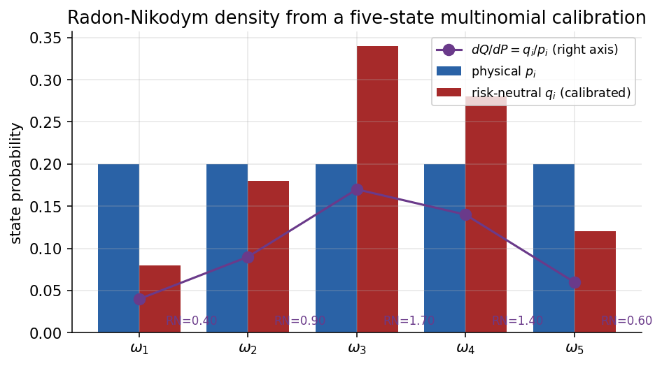
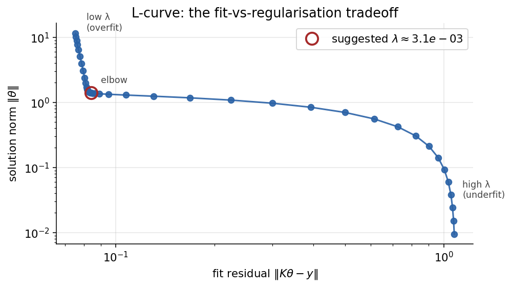
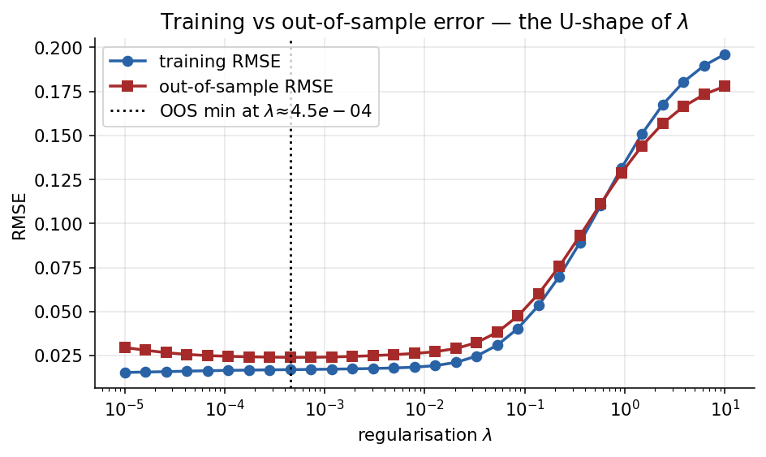
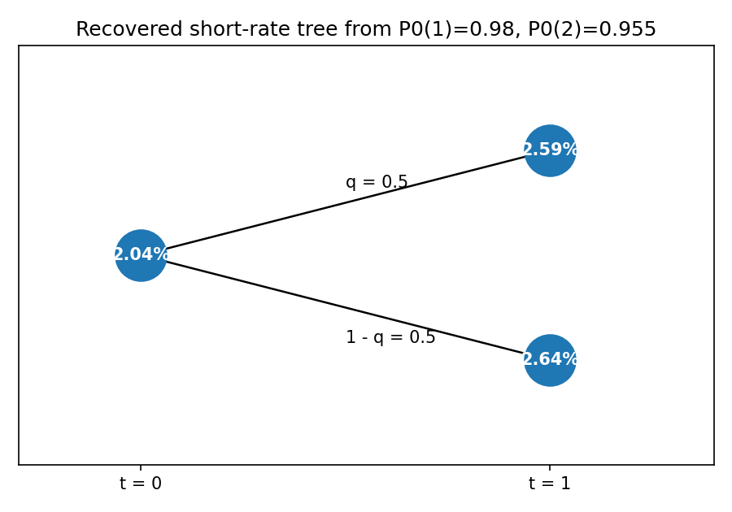
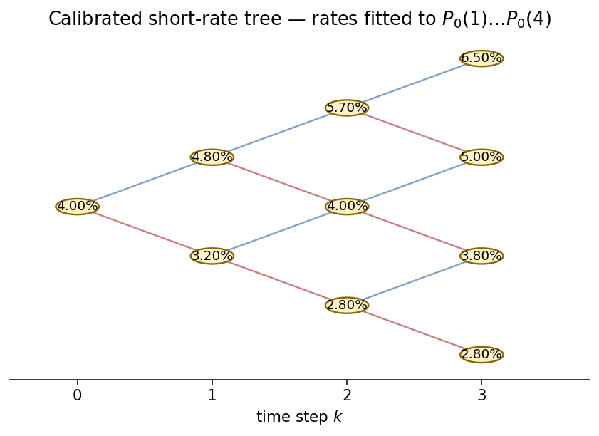
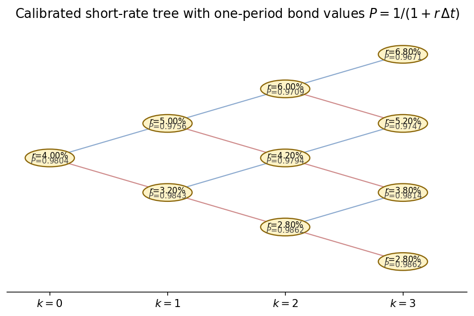
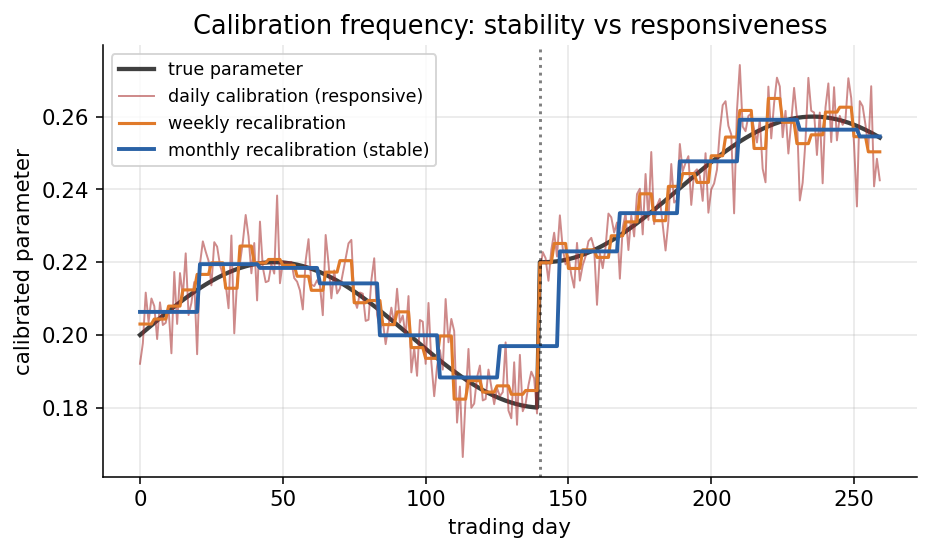

# Chapter 11 — Calibration: Lattices, Short Rates, and the Yield Curve

## 11.0 Motivation: What Calibration Means

The previous part of the course built a continuous-time toolkit. CH03 proved Itô's lemma; CH04 proved Feynman–Kac; CH05 consolidated measure change and Girsanov. Those chapters established that, given a model, we can price: specify the dynamics, choose a numeraire, take an expectation. This chapter inverts the direction of that flow. Given market quotes — option prices, zero-coupon bond yields, swap rates — *how do we choose the model parameters that reproduce what the market is already saying?* That is calibration.

The shift in perspective is worth pausing on before diving into the technical apparatus. In the forward direction, pricing asks a "what if" question: if the world behaves according to these parameters, what price would any given contingent claim command? In the inverse direction, calibration asks a "given that" question: given that the market is quoting these prices right now, what must the world's parameters be? The forward question is mathematically clean — one plugs in numbers and turns a computational crank. The inverse question is philosophically harder, because it forces us to grapple with the fact that the market speaks in a noisy, over-determined, sometimes contradictory voice. Two dealers may quote the same option at slightly different prices; the same option may trade at different prices minutes apart; the same underlying may have liquid quotes for some strikes and maturities but vanishing liquidity for others. Calibration is the discipline of listening to this chorus and extracting a single coherent parameter vector that respects, within tolerance, everything the market has said.

Calibration is the daily bread of any trading desk, structuring team, or risk group. Before a pricing model can be used to quote a fresh trade, hedge a book, or mark positions to market, its parameters must be tuned to whatever the market is already saying. A beautifully specified model with miscalibrated inputs is worse than no model at all — it produces hedges that fail in ways the specification cannot explain, and marks that drift away from any counterparty's reconciliation. A concrete picture helps anchor the stakes. Imagine a desk holding a portfolio of exotic options — cliquets, autocallables, variance swaps — whose value depends on the whole implied-volatility surface and on the interest-rate term structure. Every morning, before trading opens, the pricing system needs to ingest yesterday's closing quotes on several hundred vanillas and several dozen bonds, convert them into a consistent set of model parameters, and use those parameters to mark the exotic book. If the calibration is stable and accurate, the marks are defensible to the counterparty, the risk officer, and the auditor. If the calibration is unstable — if the parameters jump by 20% from Monday to Tuesday despite the market barely moving — the marks wobble too, and the desk spends its day explaining unrealised P&L swings instead of trading. A single bad calibration day can generate a flurry of calls from risk management, custodians, and prime brokers demanding explanations for positions suddenly worth several percent less than yesterday. Stable, disciplined calibration is therefore not an academic nicety; it is an operational necessity.

The Fundamental Theorem of Asset Pricing (FTAP), introduced in CH02 and restated in CH05 after the measure-change machinery was in place, tells us that *no arbitrage* is equivalent to the existence of an equivalent martingale measure $\mathbb{Q}$ relative to a chosen numeraire. Calibration is the inverse problem: pick the $\mathbb{Q}$-parameters so that model-implied prices reproduce the observed prices. If we succeed, we have a model that — by construction — cannot be arbitraged against the specific instruments we calibrated to. Whether it also prices *unobserved* instruments correctly is a different question, and one we will return to repeatedly.

This distinction between "arbitrage-free with respect to calibration instruments" and "arbitrage-free with respect to all instruments" matters more than it might appear. A calibration procedure can make a model arbitrage-free against, say, the twenty vanilla S&P options used as calibration targets, while simultaneously making it deeply inconsistent with the thirty-year swap curve, the VIX futures strip, or correlated foreign-exchange pairs. The model passes a local arbitrage-freeness test but fails the global one. In practice this is almost always the situation — no single-factor or even two-factor model matches every quote in every market simultaneously — so calibration is as much about choosing *which* arbitrages to close as it is about closing them. A desk that trades S&P variance swaps picks calibration instruments that make the S&P variance surface arbitrage-free; it accepts residuals on unrelated markets.

**The three faces of a pricing model.** Every pricing model leads a triple life. The first face is *descriptive*: it tries to capture the dynamics that generate real price paths (random walks with drift, mean-reverting rates, stochastic volatility, jumps). The second face is *evaluative*: it assigns prices to payoffs not yet traded, by taking risk-neutral expectations. The third face — the one most relevant for this chapter — is *inverse*: it translates observed market prices back into the parameters the model would need to reproduce them. Calibration is the procedure that mediates between these faces, taking the market's observed prices and turning them into the inputs the descriptive and evaluative faces require. These three faces are not equally respected in practice. The evaluative face is the one customers interact with: they ask for a price and they receive one, and they judge the desk by the tightness and consistency of those prices. The descriptive face is the statistician's preoccupation: does the model generate paths that, after appropriate change of measure, resemble historical data? The inverse face — calibration — is where the two other faces meet, and where the engineering effort is largely spent. A bank's quant analytics group will typically devote a disproportionate share of its development time to calibration infrastructure: solvers, stability monitors, outlier filters, persistence layers. The evaluative engine is often a simpler object sitting downstream of the calibration pipeline.

**Why calibration is an inverse problem.** A *forward* pricing problem takes parameters $\Theta$ (volatility, mean-reversion, risk-neutral drift) and returns a price $C(\Theta)$. An *inverse* problem takes an observed price $C^{\text{mkt}}$ and asks: which $\Theta$ made it? Unlike the forward direction, which is well-posed by construction, the inverse direction can be ill-posed in three classic ways — *existence* (no $\Theta$ reproduces the quote exactly, perhaps because of bid-ask spread noise or model misspecification), *uniqueness* (many $\Theta$'s reproduce it, as when two different volatility surfaces imply the same vanilla prices but different exotic prices), and *stability* (small price perturbations cause large parameter jumps, so the calibrated parameters jitter violently from day to day even when the market itself has not moved materially). Any serious calibration effort has to recognise which of these pathologies apply and which technique tames them. Non-existence is typically handled by relaxing the requirement of exact fit and instead minimising a loss function that measures the gap between model and market — weighted least squares being the workhorse, where the weights encode either bid-ask spread tolerance or instrument liquidity. Non-uniqueness is handled by regularisation: adding penalty terms that favour parameter values close to a prior or historical average, so that among equally-well-fitting parameter vectors the one closest to the prior wins. Instability is addressed by a combination of regularisation and smoothing across calibration dates — one does not recalibrate from scratch every day, but rather uses yesterday's calibrated parameters as a warm start, and penalises large deviations unless the data genuinely supports them.

Moment matching — the workhorse of this chapter in the discrete setting — is attractive precisely because it dodges these pathologies: we match a small number of analytically tractable summary statistics (mean, variance, correlation) rather than a full price surface, so the map $\Theta \mapsto \text{moments}$ is usually a smooth local diffeomorphism and inversion reduces to solving a low-dimensional algebraic system. The cost is fidelity: matching two moments does not mean matching the full distribution. Two lognormal distributions with the same mean and variance are identical; two skewed-fat-tailed distributions with the same mean and variance can price out-of-the-money options very differently. The price we pay for moment matching's convenience is that the resulting model is only as good as a two-parameter summary of reality. For a variance swap, whose payoff is linear in realised variance, matching the first two moments of log-returns is essentially all the model has to do. For a deep out-of-the-money put, whose payoff lives entirely in the left tail, matching the first two moments is grossly insufficient — you need to match the tail directly. The match between calibration instruments and trading-book exposures is therefore the practitioner's first and most important design choice.

**The identifiability question.** Can distinct parameter sets produce identical data? On a single-period binomial lattice, $(p, c)$ is identified by matching two moments: given $(\hat\mu T, \sigma^2 T)$ there is a unique $(p, c)$ modulo the sign of $c$. For Vasicek (CH12), $(\kappa, \theta, \sigma)$ is identified from the yield curve plus one volatility input, but many parameter combinations produce *nearly* identical yield curves (the flat-likelihood direction where $\kappa$ and $\sigma$ are only well-identified as the ratio $\sigma^2/(2\kappa)$ in the long yield). Experienced practitioners learn which directions in parameter space are stiff (well-identified) and which are sloppy (nearly flat). Ignoring the sloppy directions is fine for pricing instruments close to the calibration set; it is dangerous for extrapolation. Downstream users who ask "what is $\kappa$?" must be told "anywhere in this range; the data is not informative" rather than given a spuriously precise point estimate.

**Market-consistent modelling.** A second theme running through this chapter is that your model's outputs are other desks' inputs. The yield you quote for a five-year bond will be used, perhaps ten minutes later, by someone pricing a five-year swap or a swaption expiring in two years on a three-year swap. If your calibration produces yields that are inconsistent with observable zero-coupon prices, you have introduced arbitrage into the downstream book. Market-consistent modelling is therefore not a purist's preoccupation: it is a network property of the whole derivatives ecosystem. Calibration is the point at which your model joins the network or introduces an inconsistency into it.

A third theme is *objective function design*. We will move from the naive "minimise squared price error" toward more sophisticated weighting schemes: weighting by vega so that thinly-priced out-of-the-money options do not dominate, weighting by bid-ask spread so that low-confidence quotes contribute less, weighting by liquidity so that benchmarks dominate the fit. A fourth theme is *numerical method selection*: Nelder–Mead for robustness, Levenberg–Marquardt for speed, BFGS for smooth general objectives, differential evolution for multimodal global search, MCMC for full parameter uncertainty. A well-equipped calibration system uses a hybrid of two or three methods, selected by problem shape and runtime budget.

We work through three settings of increasing operational richness:

1. FTAP on a single-period lattice — recovering $q$ and the step size $c$ from price ratios.
2. Change of measure on a multinomial lattice — recovering the $q$-weights and handling non-uniqueness via optimisation and regularisation.
3. The interest-rate analogue — zero-coupon bond prices, bootstrapping a short-rate lattice period by period.

The continuous-time Vasicek / Ho–Lee / Hull–White machinery that this discrete story motivates is developed in CH12; its applications (IRS, CDS, bond options, the T-forward measure) appear in CH13.

## 11.1 FTAP on a Lattice

### 11.1.1 Fundamental Theorem of Asset Pricing

The first tool we need is the theorem that connects market data to model structure. Its statement is deceptively simple, but every calibration procedure in this chapter is, at bottom, a specialisation of this single equation to a particular set of observed prices.

**FTAP (restated from CH02 / CH05).** *No arbitrage* $\iff$ *there exists an equivalent martingale measure* $\mathbb{Q} \sim \mathbb{P}$ *such that for every traded asset* $X$:

$$
\frac{X_t}{B_t} \;=\; \mathbb{E}^{\mathbb{Q}}\!\left[\,\frac{X_T}{B_T}\,\Big|\,\mathcal{F}_t\,\right] \tag{11.1}
$$

where $B_t$ is a traded numeraire with $B_t > 0$ a.s. Any traded asset normalised by the numeraire is a $\mathbb{Q}$-martingale.

Equation (11.1) is the most important equation in this chapter and one of the most important in all of derivatives pricing. It is worth committing to memory, not just as a formula but as a template. Every calibration exercise we will perform is an instance of this template: specify $X$, specify $B_t$, observe the left-hand side from market data, parameterise the right-hand side in terms of model parameters, and solve for the parameters. The specific forms will differ — sometimes the right-hand side is a simple discrete expectation, sometimes a continuous-time expectation, sometimes a Gaussian integral — but the structure is universal.

Let us unpack each term carefully. The traded asset $X$ can be a stock, a bond, a futures contract, or a derivative — the theorem is agnostic about type, only that $X$ is a price process quoted in a market where self-financing trading is available. The numeraire $B_t$ is a reference asset against which all other prices are measured; it can be the money-market account (so $B_t = e^{rt}$ in a constant-rate world, or $\exp(\int_0^t r_u\,du)$ with stochastic rates), a zero-coupon bond, a foreign currency, or any other strictly positive traded process. The measure $\mathbb{Q}$ depends on the choice of numeraire: switching numeraires is equivalent to switching measures, as developed canonically in CH05. The conditional expectation $\mathbb{E}^{\mathbb{Q}}[\cdot\mid\mathcal{F}_t]$ is taken under $\mathbb{Q}$ and conditioned on the information available at time $t$.

The content of the theorem, stripped of formalism, is this: *you can price any claim by taking an expectation, provided you use the right measure*. The right measure is the one under which normalised prices become martingales. The right measure exists precisely when the market admits no arbitrage. And — crucially for us — the right measure is uniquely identified once you know enough about the market. Two subtleties of the statement are worth flagging. First, FTAP in its fullest generality requires care about integrability conditions, stopping times, and the precise notion of "no arbitrage" (no free lunch with vanishing risk is the right technical notion in continuous time). These subtleties matter in pathological cases but are invisible in the calibrations we perform. Second, the uniqueness of $\mathbb{Q}$ holds only in *complete* markets, where every contingent claim can be hedged. In incomplete markets (jumps, stochastic volatility without traded volatility), there are many equivalent martingale measures, each giving different prices for claims that cannot be hedged. Calibration in incomplete markets picks *one* of these measures — the one that matches the observed prices — but the choice is a modelling decision, not a mathematical inevitability.

**Reading FTAP as a calibration rule.** The theorem is often taught as an existence statement, but operationally it is a *constraint*. For every tradable instrument whose $t=0$ price we observe, (11.1) gives one equation linking the unknown $\mathbb{Q}$-probabilities (and unknown lattice parameters) to the observed price. With enough independent instruments and enough unknowns, we get a determined (often over-determined) system. Calibration is then nothing more than *solving this system* — sometimes in closed form (as in §11.1.3 for the binomial moments, or §11.3 for bond lattice bootstrap) and sometimes numerically (least squares against a basket of options). Think of FTAP as giving you a *coordinate system* on the space of market-consistent models. Each observed price is a coordinate; each unknown parameter is an axis. Calibration asks whether the observed coordinates uniquely pick out a point on the axes. If they do, we are done. If they underdetermine the point, we need more quotes. If they overdetermine it, we solve in a least-squares sense and live with residuals — which, in practice, is almost always the situation.

A useful mental exercise: count equations and unknowns at the start of any calibration problem. A single-factor Vasicek has four unknowns ($\kappa, \theta, \sigma, r_0$). The short-rate observation gives one equation directly. Each bond-price observation gives one more equation. So four bond-price observations are needed to pin down four unknowns, giving an exactly-determined system. In practice we observe far more than four bonds — maybe twenty at various maturities — so the system is over-determined, residuals are non-zero, and calibration is a least-squares exercise. The Heston stochastic-volatility model has five unknowns plus the initial spot; a liquid vanilla market provides hundreds of quotes, so the system is massively over-determined. This disparity between unknowns and observations is typical and is what makes calibration a statistical, not algebraic, problem.

**Why numeraire invariance matters.** FTAP says the same underlying prices satisfy (11.1) for many choices of numeraire, with correspondingly different measures. This is not a redundancy; it is a powerful tool. In equity derivatives the most common choice is the money-market account, so $\mathbb{Q}$ is the usual risk-neutral measure. For interest-rate derivatives the $T$-forward measure (numeraire $= P_t(T)$) simplifies expectations that would otherwise involve stochastic discounting; CH13 uses it pervasively. For FX and quanto products, the domestic money market makes sense for some payoffs and the foreign one for others. The practitioner picks the numeraire that *annihilates* the most inconvenient source of randomness from the payoff, and the theorem guarantees the answer is the same regardless.

### 11.1.2 Single-Period Binomial Lattice

Before we write down the lattice, it is worth pausing on why the binomial structure is chosen rather than, say, a Gaussian step-size distribution. The answer is pedagogical economy: the binomial model has only two free parameters per step (the probability of up and the step size), matching the two pieces of market data we want to extract (drift and volatility). This symmetry between parameters and observations is the cleanest possible setting for learning how moment matching works. Once the binomial case is understood, extending to Gaussian, to multinomial, or to jump-extended processes is a matter of adding structure, not changing logic.

Start with one node $A_{n-1}$ branching to two nodes over $\Delta t$:

$$
A_{n-1}\;\longrightarrow\;\begin{cases}
A_{n-1}\,e^{+c\sqrt{\Delta t}} & \text{(up)} \\
A_{n-1}\,e^{-c\sqrt{\Delta t}} & \text{(down)}
\end{cases}
$$

More compactly, introduce iid Bernoulli ticks $x_1, x_2, \ldots$ with $\mathbb{P}(x_i = +1) = p$, $\mathbb{P}(x_i = -1) = 1-p$. Then

$$
A_n \;=\; A_{n-1}\,e^{c\, x_n},\qquad x_i\stackrel{\text{iid}}{\sim}\text{Bernoulli}(\pm 1). \tag{11.2}
$$

The log-return $\ln(A_n/A_{n-1}) = c\,x_n$ is $\pm c$.

The parameter $c$ has a clean interpretation: it is the magnitude of a single-step log-return. If $c = 0.02$ and $\Delta t = 1$ day, then on any given day the asset moves either up by roughly $2\%$ or down by roughly $2\%$ (we use the exponential so that up-and-down produces $e^{c}e^{-c} = 1$, recovering the original level; multiplicative symmetry matters here because log-returns are what sum across time). The parameter $p$ is the probability that the move is up; under the physical measure $\mathbb{P}$ this is tilted by the expected return, under the risk-neutral measure $\mathbb{Q}$ it is tilted only by the cost of carry.

It is worth pausing on why log-returns, rather than arithmetic returns, are the right quantity to model multiplicatively. Arithmetic returns do not add across time: if an asset is up $10\%$ today and up $10\%$ tomorrow, the two-day return is $21\%$, not $20\%$. Log-returns *do* add. This additivity is what makes log-returns amenable to the Central Limit Theorem — the sum of iid log-returns is approximately Gaussian, while the product of iid gross returns is approximately lognormal. The binomial model embraces this by writing each step as $S_n = S_{n-1}e^{c x_n}$ rather than $S_n = S_{n-1}(1 + c x_n)$, making the multi-step composition $S_N = S_0 e^{c(x_1 + x_2 + \cdots + x_N)}$ a clean exponential of the summed shocks.

The Bernoulli shock $x_i \in \{+1, -1\}$ is conventional — it lets us write each step as a scaled shock rather than a case split. In the small-$\Delta t$ limit, the sum of many iid Bernoulli shocks is approximately Gaussian by the Central Limit Theorem, so the binomial lattice converges to Brownian motion (CH03). This is how the binomial model recovers the Black–Scholes world in the limit, and why the tree can be used as a discrete surrogate for continuous-time pricing. It is also why moment matching gets the right answer: matching two moments of a two-valued random variable fixes its distribution completely, and the CLT does the rest. A practical aside: the binomial tree as described here is *recombining* — the up-then-down path and the down-then-up path land at the same price $S_0 e^{c}e^{-c} = S_0$. A recombining tree has $n+1$ possible terminal nodes after $n$ steps (rather than $2^n$), which makes both pricing and calibration computationally tractable.

### 11.1.3 Recovering $p$ and $c$ from Observed Data

We want the parameters $(p, c)$ — strictly, $(q, c)$ under $\mathbb{Q}$ — to reflect what the market shows. Match the first two moments of the log-return.

**Mean.**
$$
\mathbb{E}^{\mathbb{P}}\!\left[\ln\!\tfrac{A_T}{A_0}\right] \;=\; \mathcal{N}\,c(2p-1) \;\equiv\; \hat\mu T \tag{11.3}
$$

where $\mathcal{N} = T/\Delta t$ is the number of steps. The equation should be parsed as follows. On each step, the log-return is $c\,x_i$, which has expectation $c\mathbb{E}[x_i] = c(2p-1)$. Summing over $\mathcal{N}$ iid steps gives total log-return $\mathcal{N}c(2p-1)$. Equating this to $\hat\mu T$ — the observed physical drift — gives us our first calibration equation. Note the structural parallel with the familiar one-factor Gaussian world: the total drift over $T$ is linear in $T$, because drift is additive across independent steps.

Where does $\hat\mu T$ come from in practice? There are several sources, each with pitfalls. The most direct is historical return data: compute the sample mean of daily log-returns and scale to annual. This gives a point estimate of the physical drift, but the estimate is noisy — a one-year window of daily returns gives a drift estimate with standard error of order $\sigma/\sqrt{T}$, which for $\sigma = 20\%$ and $T = 1$ year is $20\%$ of the true drift. Historical drift estimates are therefore nearly useless at short horizons and only marginal at long ones; this is why risk-neutral measures are so much more widely used in pricing applications — the $\mathbb{Q}$-drift is pinned down by the risk-free rate, which is observable with essentially no noise.

**Variance.**
$$
\mathbb{V}^{\mathbb{P}}\!\left[\ln\!\tfrac{A_T}{A_0}\right] \;=\; \mathcal{N}\,c^2\bigl(1 - (2p-1)^2\bigr) \;\equiv\; \sigma^2 T. \tag{11.4}
$$

Variance adds across iid steps, so total variance is $\mathcal{N}$ times the single-step variance. The single-step variance is $c^2\mathbb{V}[x_i]$ because $c$ is a deterministic scale factor. And $\mathbb{V}[x_i] = \mathbb{E}[x_i^2] - (\mathbb{E}[x_i])^2 = 1 - (2p-1)^2$, using $x_i^2 = 1$ with probability one. The quantity $(2p-1)^2$ is small when $p$ is near $1/2$ — which, as we will see, is the regime relevant for small time-steps — so $\mathbb{V}[x_i]\approx 1$ and the variance is approximately $\mathcal{N}c^2$.

The variance $\sigma^2 T$ is much easier to measure empirically than the drift $\hat\mu T$. The standard error of a realised variance estimate scales as $\sigma^2\sqrt{2/T}$ for large $T$ and small sampling intervals, so even a one-year history of daily returns gives a variance estimate accurate to a few percent. This is why volatility estimates from historical data are generally taken seriously in practical pricing, while drift estimates are regarded with considerable skepticism.

Equations (11.3) and (11.4) form a two-equation system in the two unknowns $(p, c)$. The $\mathbb{Q}$-version is structurally identical, only with $\hat\mu$ replaced by the risk-neutral drift. This two-for-two structure is a general feature of well-designed moment-matching schemes: the number of free parameters equals the number of moments matched, so the system is square and generically has a unique solution.

### 11.1.4 Small-Step Asymptotics

Write $\sigma^2 T = \mathcal{N}\,c^2\bigl(1-(2p-1)^2\bigr)$. For small $\Delta t$, $(2p-1)^2 \ll 1$, so

$$
\sigma^2 T \;\approx\; \mathcal{N}\,c^2 \;=\; \frac{T}{\Delta t}\,c^2
\quad\Longrightarrow\quad \boxed{\;c \;\approx\; \sigma\sqrt{\Delta t}\;} \tag{11.5}
$$

Substituting into the mean equation $\hat\mu T = c\,\mathcal{N}(2p-1)$ gives $2p - 1 \approx (\hat\mu/\sigma)\sqrt{\Delta t}$ and hence

$$
\boxed{\;p \;\approx\; \tfrac{1}{2}\!\left(1 + \tfrac{\hat\mu}{\sigma}\sqrt{\Delta t}\right)\;} \tag{11.6}
$$

This is the calibration of the physical probability $p$. Under $\mathbb{Q}$, the same structural formula applies with $\hat\mu$ replaced by the drift that makes $A_t/B_t$ a martingale (e.g. $r - \tfrac12\sigma^2$ for a log-normal asset).

**Worked example.** Take $\sigma = 0.20$, $\hat\mu = 0.08$, $\Delta t = 1/252$. Then $c = 0.20\sqrt{1/252} \approx 0.01260$ and $p \approx \tfrac12(1 + 0.4\sqrt{1/252}) \approx \tfrac12(1 + 0.0252) = 0.5126$. An equity with $20\%$ annualised volatility and $8\%$ annualised drift has, on a one-day step, about a $1.26\%$ typical log-return shock and a $51.26\%$ probability of an up-move. The asymmetry between up and down probabilities (just over one percentage point) is small enough that if you looked at a few days of such returns you would see what looks like a fair coin; the asymmetry only becomes clear when you aggregate hundreds of days. Drift is small on short horizons and dominates only over long ones, which is why the "random walk" intuition for short-term stock movements is approximately correct, and why the drift-extractable information in historical returns is notoriously noisy. The Sharpe ratio of $0.08/0.20 = 0.4$ is typical for equity indices — equity risk premium divided by equity volatility — and reappears as the dominant signal in the calibration.

**Why the Brownian limit emerges.** The deeper reason moment matching recovers the right continuous-time dynamics is the CLT. If on each step we match the conditional mean and variance of log-returns to $\hat\mu\Delta t$ and $\sigma^2\Delta t$ respectively, and the shocks are independent, then the sum of $\mathcal{N} = T/\Delta t$ steps is a random variable with mean $\hat\mu T$ and variance $\sigma^2 T$. As $\Delta t \to 0$, the CLT guarantees this sum converges in distribution to $\mathcal{N}(\hat\mu T, \sigma^2 T)$ — which is exactly the log-return distribution of geometric Brownian motion. The binomial tree is therefore not a separate model from Black–Scholes; it is a discretisation that converges to the same limit, provided the step sizes and probabilities are chosen (i.e. calibrated) in the way (11.5) and (11.6) prescribe. The scaling laws emerge from dimensional analysis alone. Variance scales as $\sigma^2 \Delta t$, so the step size scales as $\sigma \sqrt{\Delta t}$. The drift contribution to the log-return scales as $\hat\mu \Delta t$, and the probability tilt must therefore scale as $\hat\mu \Delta t / (\sigma \sqrt{\Delta t}) = (\hat\mu/\sigma) \sqrt{\Delta t}$.

**From physical to risk-neutral: where the Sharpe ratio goes.** Under $\mathbb{Q}$, the drift that enters (11.6) is not $\hat\mu$ but the martingale drift — for a stock paying no dividends in a constant-rate world, $r - \tfrac12\sigma^2$. The Sharpe ratio of the *risk premium* is therefore $(\hat\mu - r)/\sigma$, and this is precisely the quantity that disappears when we pass to $\mathbb{Q}$. The formula structure is unchanged; the numerator in the tilt shifts from $\hat\mu$ to $r - \tfrac12\sigma^2$, reflecting the replacement of realised returns by risk-free returns. This is the lattice incarnation of Girsanov's theorem (CH05).

**Calibration as an inverse problem, restated.** The binomial calibration is formally an *exactly-determined* inverse problem, not an ill-posed one. Two moments and two unknowns; a smooth, monotonic map between moments and parameters as long as $\sigma > 0$; closed-form inversion via (11.5)–(11.6); straightforward stability. All three of the usual pathologies of inverse problems — non-existence, non-uniqueness, instability — are absent. This is why the binomial case is pedagogically so useful: it lets us see the moment-matching machinery at its cleanest, before the complications of real-world calibration sink their teeth in. The other calibration problems in this chapter and the next — the bond-lattice bootstrap in §11.3, the Vasicek yield-curve fit in CH12, and the implied-vol surface fits in CH14 — are all, to varying degrees, ill-posed, and each will require one or more of the three remedies: weighted least squares, regularisation, and cross-date smoothing.

## 11.2 Change of Measure on Multinomial Trees

### 11.2.1 Setup: Why Multinomial

Consider a richer lattice where a single node $A_0$ branches to multiple children (e.g. three children $A_1, B_1, C_1$ each with its own sub-tree). Pricing under $\mathbb{P}$ uses probabilities $\{p^A, p^B, p^C\}$; pricing under $\mathbb{Q}$ uses $\{q^A, q^B, q^C\}$. We want to express the $q$'s in terms of the $p$'s (and of observed price ratios).

Why bother with multinomial trees? The binomial tree is adequate for simple equity options, but as soon as the state space has more than one non-trivial dimension — say, an equity *and* an interest rate, or an asset with both a continuous price component and a discrete jump component — we need lattices with more than two branches per step. Trinomial trees also have a useful practical feature: the middle branch allows the state to hold roughly constant, which is convenient for modelling slow processes like mean-reverting interest rates. The calibration logic below is cleanest in the binomial case but generalises naturally.

A concrete example makes the case for multinomial lattices vivid. Consider a callable bond: the issuer has the right to redeem the bond at par on specified dates. Pricing this requires a short-rate lattice, because the call decision depends on where rates go. If rates spike up, the bond price drops, and the issuer has no incentive to call (they can reborrow more cheaply by not calling). If rates drop, the bond price rises, and the issuer calls to refinance. A binomial short-rate tree is clumsy for this: the two branches move the state up or down with equal probability, but mean-reverting rates typically have three economic regimes — rising, falling, or flat — and the flat regime is where most of the probability mass sits. A trinomial tree with up, middle, and down branches captures this more naturally: the middle branch lets the rate stay roughly where it is (consistent with a typical short-rate half-life of several years), and the up and down branches capture the tails. The price of a callable bond computed on a trinomial lattice converges to the true continuous-time price faster than on a binomial lattice with the same number of total nodes. Another example: jump-diffusion equity models. If the underlying can either diffuse continuously or jump to a distressed level, a single binomial branch cannot capture both dynamics. A trinomial tree with "up diffusion", "down diffusion", and "jump" branches handles this cleanly, at the cost of needing to calibrate three probabilities and three step sizes rather than two.

The martingale identity (11.1) applied to numeraire-normalised values gives, for each asset $C$ (traded) and numeraire $A$:

$$
\frac{C_0}{A_0} \;=\; q^A\,\frac{C_u}{A_u} + (1-q^A)\,\frac{C_d}{A_d} \tag{11.7}
$$

$$
\frac{C_0}{B_0} \;=\; q^B\,\frac{C_u}{B_u} + (1-q^B)\,\frac{C_d}{B_d} \tag{11.8}
$$

Here $C_u, C_d$ are the values of $C$ in the up and down states; $A_u, A_d, B_u, B_d$ are similarly the values of the two numeraire candidates. The superscripts on $q$ track *which* numeraire the measure is defined relative to — $\mathbb{Q}^A$ is the measure that makes things a martingale in units of $A$, and correspondingly for $\mathbb{Q}^B$. Different numeraires correspond to different martingale measures, even though they price the same underlying claims; CH05 treated the continuous-time version of this relationship exhaustively.

### 11.2.2 Solving for $q$

From (11.7):
$$
q^A \;=\; \frac{\dfrac{C_0}{A_0} - \dfrac{C_d}{A_d}}{\dfrac{C_u}{A_u} - \dfrac{C_d}{A_d}}, \qquad q^B \;=\; \frac{\dfrac{C_0}{B_0} - \dfrac{C_d}{B_d}}{\dfrac{C_u}{B_u} - \dfrac{C_d}{B_d}}. \tag{11.9}
$$

Formulas (11.9) are simply the no-arbitrage pricing rule inverted. Read them as follows: the risk-neutral probability of an up-move is the "lever arm" that makes the current normalised price $C_0/A_0$ an exact convex combination of the up- and down-state normalised prices. If the current price is above the midpoint of the up and down possibilities, $q^A > 1/2$; if below, $q^A < 1/2$. Crucially, if the current price is *outside* the range $[C_d/A_d, C_u/A_u]$, there is no valid $q^A \in [0,1]$ and the market is arbitrageable. This last observation is why FTAP links the existence of $\mathbb{Q}$ to the absence of arbitrage: when an arbitrage exists, no consistent martingale measure can reproduce the quotes.

A worked scenario makes this concrete. Suppose at time zero we observe $C_0 = 100$, $A_0 = 98$, and at time $\Delta t$ the two possible states are $(C_u, A_u) = (110, 102)$ and $(C_d, A_d) = (90, 98)$. The current ratio $C_0/A_0 = 100/98 \approx 1.0204$; the up-state ratio $C_u/A_u = 110/102 \approx 1.0784$; the down-state ratio $C_d/A_d = 90/98 \approx 0.9184$. The current ratio sits comfortably between the two future ratios, so the system is arbitrage-free, and we compute $q^A = (1.0204 - 0.9184)/(1.0784 - 0.9184) = 0.1020/0.1600 = 0.6375$. The $\mathbb{Q}^A$-probability of an up-move is $63.75\%$; the down-probability is $36.25\%$. These probabilities are the market's *implicit* forward-looking assessment, under numeraire $A$, of the likelihood of each future state; they reflect both genuine subjective probabilities and risk preferences, compressed into a single no-arbitrage quantity. Now suppose instead that $C_0$ is observed at $112$ rather than $100$. The current ratio becomes $112/98 \approx 1.1429$, which is *above* the up-state ratio $1.0784$. There is no $q^A \in [0,1]$ that can reconcile this — the current price is higher than even the best future outcome, so an arbitrageur could short $C$, buy $A$, and collect the spread. The system is explicitly arbitrageable, and the calibration fails. Calibration is not an optional step that improves the model — it is an *arbitrage-detection* step. If calibration produces well-defined parameters, the market is (locally) arbitrage-free; if it cannot, there is a profitable trade sitting on the screen. In practice, this situation is rare but not unheard of: stale quotes, manual data-entry errors, or genuine market dislocations can all produce momentary violations. A disciplined calibration system flags such quotes and either excludes them or alerts a human operator.

### 11.2.3 Radon–Nikodym on a Finite Tree

Express the same ratio $C_0/B_0$ using numeraire $A$ and convert:

$$
\frac{C_0}{B_0} \;=\; q^A\,\frac{A_0}{B_0}\cdot\frac{C_u}{A_u} + (1-q^A)\,\frac{A_0}{B_0}\cdot\frac{C_d}{A_d}
$$

Rewriting with $B$-ratios,

$$
\frac{C_0}{B_0} \;=\; \underbrace{q^A\,\frac{A_0}{B_0}\cdot\frac{B_u}{A_u}}_{>\,0}\cdot\frac{C_u}{B_u}
\;+\; \underbrace{(1-q^A)\,\frac{A_0}{B_0}\cdot\frac{B_d}{A_d}}_{>\,0}\cdot\frac{C_d}{B_d}. \tag{11.10}
$$

The key trick here is multiplying top and bottom by appropriate ratios so that $C$ appears normalised by $B$ (as on the left) rather than by $A$. What matters is the *form* of the result: $C_0/B_0$ is expressed as a convex combination of $C_u/B_u$ and $C_d/B_d$, with new weights that differ from $q^A$. Those new weights are the $\mathbb{Q}^B$-probabilities, and they must equal $q^B, 1-q^B$ because (11.8) is the unique such representation. Compare term-by-term with (11.8):

$$
q^B \;=\; q^A\cdot\frac{B_u/A_u}{B_0/A_0},
\qquad
(1-q^B) \;=\; (1-q^A)\cdot\frac{B_d/A_d}{B_0/A_0}. \tag{11.11}
$$

Consistency check. Summing the two pieces must give $1$:

$$
q^B + (1-q^B) \;=\; \frac{A_0}{B_0}\!\left[\,q^A\,\frac{B_u}{A_u} + (1-q^A)\,\frac{B_d}{A_d}\right]
\;=\; \frac{A_0}{B_0}\cdot\frac{B_0}{A_0} \;=\; 1. \;\checkmark \tag{11.12}
$$

The bracket equals $B_0/A_0$ because $B/A$ is itself a $\mathbb{Q}^A$-martingale. This consistency check is not a triviality; it is the embodiment of the martingale property. If $B/A$ is not a $\mathbb{Q}^A$-martingale, the calculation fails — the two new weights do not sum to one, meaning there is no valid measure $\mathbb{Q}^B$. So the existence of an alternative pricing measure is equivalent to the original one correctly pricing the *new numeraire* as a tradable asset.

Equations (11.11) are exactly the Radon–Nikodym density on the lattice:

$$
\boxed{\;
\frac{d\mathbb{Q}^B}{d\mathbb{Q}^A}(\omega) \;=\; \frac{B_\cdot(\omega)/B_0}{A_\cdot(\omega)/A_0}
\;}\tag{11.13}
$$

i.e. the density is the *ratio of numeraire-returns*. In shorthand, writing $\tilde A = A/A_0$ and $\tilde B = B/B_0$:

$$
\frac{d\mathbb{Q}^B}{d\mathbb{Q}^A} \;=\; \frac{\tilde B}{\tilde A}. \tag{11.14}
$$

This is the discrete-time, finite-state incarnation of the Radon–Nikodym derivative that CH05 developed in continuous time. Under $\mathbb{Q}^A$ all prices are "measured in units of $A$"; switching numeraires to $B$ is a relabelling of the unit, so scenarios where $B$ has over-performed $A$ get up-weighted by their realised relative return $B_\cdot/A_\cdot$ (normalised by the $t=0$ ratio so that the density has mean one). The Radon–Nikodym density is therefore a tradable object — the "relative performance" of the two numeraires — not a mysterious abstraction. A probability measure has to integrate to one, so any valid Radon–Nikodym density must have $\mathbb{E}^{\mathbb{Q}^A}[d\mathbb{Q}^B/d\mathbb{Q}^A] = 1$. From (11.14): under $\mathbb{Q}^A$, $\mathbb{E}^{\mathbb{Q}^A}[\tilde B_T / \tilde A_T] = \tilde B_0 / \tilde A_0 = 1$, using that $B/A$ is a $\mathbb{Q}^A$-martingale. So indeed the density has mean one, and $\mathbb{Q}^B$ is a well-defined probability measure.

**Multi-step extension.** If the tree branches further at the up-node (children with sub-probabilities $q_u, r_u, \ldots$) and similarly at the down-node, each local change-of-measure is governed by the same ratio. The overall change of measure from $t=0$ to $t=T$ is the composition of all these local operations along every path. In the continuous-time analogue (CH05), this becomes a stochastic exponential; in the discrete case it is a telescoping product of local ratios. A calibrated tree can be diagnosed: at every node, one can check that the local martingale property holds for each numeraire pair. If any of these local checks fails, the calibration has introduced a local arbitrage — which is a bug. Production calibration systems routinely run these checks as unit tests, catching implementation errors that would otherwise manifest as mysterious mispricings downstream.

*Five-state discrete world: physical probabilities $p_i$ (blue) are uniform, while calibrated risk-neutral probabilities $q_i$ (red) tilt mass toward the central "stress" states that pricing data implicates. The RN density $dQ/dP = q_i/p_i$ (purple markers) records that tilt state-by-state and is the discrete-tree analogue of the continuous-time Girsanov density of CH05.*

### 11.2.4 Calibration as Optimisation: The Least-Squares Setup

Before turning to the interest-rate case, we pause to lay out the calibration problem as it is actually formulated in practical systems. Given $N$ observed market instruments with prices $\{C_i^{\text{mkt}}\}_{i=1}^N$, a model with parameter vector $\Theta \in \mathbb{R}^d$, and a model pricing function $C_i^{\text{model}}(\Theta)$, the simplest calibration objective is

$$
\Theta^\star \;=\; \arg\min_\Theta \sum_{i=1}^N \bigl(C_i^{\text{model}}(\Theta) - C_i^{\text{mkt}}\bigr)^2. \tag{11.15}
$$

This is the ordinary least-squares (OLS) objective. Minimising (11.15) gives the parameter vector that, on average, best reproduces the market prices. The word "best" hides multitudes — "best" in what sense, under what weighting, with what penalty for over-fit — and the next several paragraphs unpack these choices.

The first and most important refinement is *weighting*. Not all market prices are equally informative. A deep in-the-money call option that trades with a tight bid-ask is a tighter constraint on the model than a deep out-of-the-money put trading with a wide bid-ask and small absolute price. Equal weighting in price space treats them as equally important; weighting each residual by the inverse bid-ask squared downweights the noisy quote and lets the clean quote dominate. The weighted least-squares objective is

$$
\Theta^\star \;=\; \arg\min_\Theta \sum_{i=1}^N w_i\bigl(C_i^{\text{model}}(\Theta) - C_i^{\text{mkt}}\bigr)^2, \tag{11.16}
$$

with $w_i = 1/\text{spread}_i^2$ or some related quantity. The algebraic form is the same as (11.15); the economic content is very different.

A second common weighting scheme is *vega weighting*. For options, the natural trader-friendly quantity is implied volatility, not price. Two options with the same implied volatility but different strikes have very different prices, yet carry the same economic information. Converting the least-squares fit from price space to implied-volatility space is equivalent to weighting each price residual by $1/\text{vega}_i$, because vega $= \partial C/\partial \sigma_{\text{imp}}$ is exactly the local conversion factor. The vega-weighted objective is

$$
\Theta^\star \;=\; \arg\min_\Theta \sum_{i=1}^N \frac{\bigl(C_i^{\text{model}}(\Theta) - C_i^{\text{mkt}}\bigr)^2}{\text{vega}_i^2}, \tag{11.17}
$$

which is equivalent (to first order, near the market-implied volatility) to

$$
\Theta^\star \;=\; \arg\min_\Theta \sum_{i=1}^N \bigl(\sigma_i^{\text{model}}(\Theta) - \sigma_i^{\text{imp,mkt}}\bigr)^2. \tag{11.18}
$$

Vega is the option's sensitivity to implied volatility; near-the-money options have high vega, deep OTM options have low vega. In price space, a $1\%$ error in an at-the-money price might correspond to a $0.1$-vol error, while a $1\%$ error in a deep OTM price might correspond to a $5$-vol error. An unweighted fit would treat these as equally bad; a vega-weighted fit treats the deep OTM error as $50$ times worse — as a trader quoting in vol space would insist. A subtle caveat: vega-weighting is a *linearisation*; it breaks down for very deep OTM options where the vega is vanishingly small and a literal $1/\text{vega}^2$ weight gives that strike enormous, usually spurious, importance. A practical weighting scheme caps the weight, $w_i = \min(1/\text{vega}_i^2, w_{\max})$, or combines vega and spread weighting via a harmonic mean. Tuning these caps is part of the craft of building a robust calibration.

### 11.2.5 Global vs Local Minima

The objective function (11.15) is, in general, a non-convex function of the parameters $\Theta$. For the binomial lattice it happens to be quadratic (the moment-matching equations are linear in parameters after log-transformation), but for more general models — stochastic volatility, jump diffusion, multi-factor rates — the landscape has multiple local minima. Which minimum the optimiser finds depends on where it starts. This is a serious practical concern. An equity trader who runs a stochastic-volatility model on Monday morning and gets parameters $(\kappa = 2, \theta = 0.04, \sigma_v = 0.3, \rho = -0.7)$ may rerun the same calibration on Tuesday with yesterday's minimum as a starting point and get $(\kappa = 2.1, \theta = 0.041, \sigma_v = 0.31, \rho = -0.71)$ — a small, economically sensible shift. But if the starting point is reset to a default every day, Tuesday's run might find a completely different local minimum, say $(\kappa = 0.5, \theta = 0.06, \sigma_v = 0.5, \rho = -0.9)$, with similar fit quality but very different economic implications. The two parameter vectors produce nearly identical prices on the calibration basket but very different prices on instruments *outside* the basket. If the bank uses the Monday parameters to price exotics on Tuesday but recalibrates for the blotter, the exotics will be valued one way while the hedging positions use a different calibration — a recipe for P&L surprise.

The standard defenses against this problem are:

1. **Warm starts.** Always initialise today's calibration from yesterday's minimum. This enforces continuity across dates and typically keeps the optimiser in the same local basin even if another basin is marginally deeper. The cost is that the calibration may become "stuck" in a stale minimum if the market has genuinely moved to a new regime; the remedy is to add periodic cold starts to check for regime shifts.
2. **Multi-start optimisation.** Run the optimiser from several starting points (a small random grid, or structured starts from economically plausible prior values) and take the best. If multiple starts converge to distinct minima of comparable depth, the problem is flagged as non-identifiable and a human operator is consulted.
3. **Global optimisation methods.** Use algorithms designed to escape local minima — simulated annealing, differential evolution, genetic algorithms, basin-hopping. These are slower than gradient-based local methods but more reliably find global minima.
4. **Problem reformulation.** Often the landscape can be smoothed by changing variables. Calibrating Heston (CH14) in $(\kappa, \theta, \sigma_v, v_0, \rho)$ is notoriously multimodal; reparameterising in terms of more orthogonal quantities — at-the-money variance, skew, curvature, mean-reversion speed — can make the landscape nearly convex. This is sometimes called "calibrating in the right coordinates".

### 11.2.6 Numerical Methods

The optimisation problems above are nonlinear least-squares in a moderate-dimensional space. Several algorithmic families are in common use. *Nelder–Mead* maintains a simplex of $d+1$ points and iteratively reflects, expands, contracts, and shrinks it; it requires only function evaluations (no gradients), so it is robust to objectives that are noisy, discontinuous, or expensive to differentiate, at the cost of slow convergence. *Levenberg–Marquardt* is the gold standard for nonlinear least-squares: it exploits the sum-of-squares structure to approximate the Hessian from Jacobians alone, and blends Gauss–Newton with gradient-descent via a damping parameter $\lambda$. It typically converges in tens of iterations on well-posed problems; for implied-vol-surface fits with $N \sim 100$ instruments and $d \sim 5$ parameters, it converges in milliseconds. *BFGS* and *L-BFGS* are quasi-Newton methods building up a Hessian approximation iteratively — the full version for moderate $d$, the limited-memory version for thousands of parameters. *Differential evolution* and related global methods maintain a population of candidate parameter vectors and evolve them via mutation, crossover, and selection; they are slower (seconds to minutes) but reliably find global minima.

**Hybrid strategies.** A production calibration system rarely uses a single method. A typical setup: start with a coarse differential-evolution search to find a plausible global minimum; refine with Levenberg–Marquardt for tight local convergence; verify stability with a Nelder–Mead polish. Practical runtime targets: a single-factor rates model against 20 bond quotes under $10$ ms; Heston against $100$ vanilla options under $100$ ms; a multi-factor Libor market model against $500$ caplet/swaption quotes under $10$ seconds. Faster is always better, but stability and correctness trump speed by a wide margin in production.

### 11.2.7 Regularisation and Well-Posedness

When the calibration problem is under-determined — more parameters than informative observations, or observations that leave a sloppy direction unpinned — regularisation adds a penalty term to the objective function:

$$
\Theta^\star \;=\; \arg\min_\Theta \Bigl[\sum_i w_i\bigl(C_i^{\text{model}}(\Theta) - C_i^{\text{mkt}}\bigr)^2 + \lambda \,\mathcal{R}(\Theta)\Bigr]. \tag{11.19}
$$

The penalty $\mathcal{R}(\Theta)$ encodes prior knowledge: smoothness ($\|\nabla^2 \Theta\|^2$ for curve fits), proximity to a historical mean ($\|\Theta - \Theta_{\text{prior}}\|^2$), sparsity ($\|\Theta\|_1$), or any other property the modeller wants to encourage. The weight $\lambda$ controls how much regularisation is applied: small $\lambda$ trusts the data, large $\lambda$ trusts the prior. Choosing $\lambda$ is itself a subproblem, usually handled by cross-validation (try several $\lambda$ values and pick the one that minimises out-of-sample error) or by Bayesian hierarchical modelling (treat $\lambda$ as a hyperparameter to be integrated over).

The Bayesian interpretation of regularisation is worth holding in mind. A penalty $\|\Theta - \Theta_{\text{prior}}\|^2$ is equivalent to a Gaussian prior on $\Theta$ centred at $\Theta_{\text{prior}}$; a penalty $\|\Theta\|_1$ is equivalent to a Laplace prior at zero; a penalty $\|\nabla^2 \Theta\|^2$ encodes a prior that parameter values change smoothly along some ordering (useful for term-structure calibration where we expect neighbouring maturities to have similar parameters). Regularisation is the frequentist's way of sneaking Bayesian priors into a point-estimate framework.

**The fit-vs-extrapolation tradeoff.** Strong regularisation ($\lambda$ large) produces parameter estimates that are close to the prior, insensitive to the data, and therefore stable but potentially biased. Weak regularisation ($\lambda$ small) produces parameter estimates that fit the data tightly, sensitive to every wiggle, and therefore unbiased in expectation but high-variance in any given run.

*L-curve diagnostic for a Tikhonov-regularised linear inverse problem. Each point is one value of $\lambda$; the corner (elbow, marked) is the classical heuristic choice — the regularisation strength beyond which further stiffening raises residual without lowering solution norm. Small-$\lambda$ end: data-fitting, overfit regime. Large-$\lambda$ end: prior-dominated, underfit regime.* The sweet spot depends on the application: a conservatively-marked book wants stability (high $\lambda$); an aggressive trading book wants responsiveness (low $\lambda$). There is no universal right answer, and the choice is part of the desk's risk-appetite statement. A related perspective: in-sample fit is a strictly decreasing function of $\lambda$ (regularisation makes the model stiffer, so it fits the training data less well), while out-of-sample fit is typically U-shaped (zero regularisation overfits, infinite regularisation underfits, and the optimum is somewhere in between). Cross-validation finds this optimum empirically.

*The U-shape of out-of-sample error (red) in $\lambda$ contrasts with the monotone rise of training error (blue). Small $\lambda$ overfits — training error shrinks but OOS error spikes; large $\lambda$ underfits — both errors rise. The optimum $\lambda$ is the OOS minimiser, found in practice by cross-validation.*

**Out-of-sample stability.** A calibrated model's in-sample performance is tautological: by construction, the model matches its calibration instruments to within the optimiser's tolerance. The real test is *out-of-sample*: does the model correctly price instruments that were not in the calibration basket? There are two flavours of out-of-sample test. The first is *cross-sectional*: calibrate using a subset of instruments (say, vanilla options at strikes $K_1, \ldots, K_{10}$) and check the fit on a held-out strike $K_{11}$. If the model is correctly specified and the calibration is well-regularised, the held-out fit should be nearly as good as the in-sample fit. If the held-out fit is markedly worse, the model is overfitting — squeezing the in-sample error to zero at the cost of off-sample generalisation. The second flavour is *temporal*: calibrate today, price a hold-out instrument today, then hold the model parameters fixed and re-price the same instrument tomorrow. Compare against tomorrow's market price. If parameters are stable day-to-day, the deviation should be small; if parameters wobble, the deviation will be dominated by recalibration noise rather than genuine market movement. Both tests are routinely neglected in practice — the in-sample fit is visually appealing and easy to report to management, while out-of-sample tests require more infrastructure. But any model going into production should be subjected to both.

## 11.3 Short-Rate Bootstrap on a Bond Lattice

### 11.3.1 Zero-Coupon Bonds as Calibration Instruments

Let $P_t(T)$ denote the zero-coupon bond price at time $t$ paying $1$ at maturity $T$. On a short-rate lattice $\{r_0, r_{11}, r_{22}, \ldots\}$ (a recombining tree of realised short rates indexed by time step and node-within-step), the one-period bond satisfies

$$
P_0(1) \;=\; \frac{1}{1 + r_0}
\qquad\Longleftrightarrow\qquad
r_0 \;=\; \frac{1}{P_0(1)} - 1. \tag{11.20}
$$

(Convention note. The discount factor $1/(1 + r_t)$ used throughout
§11.3 is the *simple-compounding* version; elsewhere in the guide — and
in the CRR lattice conventions of §11.1.2 — we use exponential
discounting $e^{-r_t\,\Delta t}$. The two agree to leading order in
$\Delta t$ — $1/(1+r_t\Delta t) = e^{-r_t\Delta t}(1 + O(\Delta t^2))$ —
so the sequential-bootstrapping arithmetic below is unaffected at the
orders of accuracy we care about. We keep the simple-compounding form
in §11.3 because it matches the market quoting convention for
short-dated zero coupons, which is how the bootstrap inputs are
usually presented in practice.)

Two-period bonds satisfy, at each child node,

$$
P_{11}(2) \;=\; \frac{1}{1 + r_{11}},\qquad P_{22}(2) \;=\; \frac{1}{1 + r_{22}}. \tag{11.21}
$$

Rolling back to $t=0$ under the risk-neutral measure $\mathbb{Q}$:

$$
P_0(2) \;=\; \frac{1}{1 + r_0}\!\left[\,q\,P_{11}(2) + (1-q)\,P_{22}(2)\right]. \tag{11.22}
$$

Zero-coupon bonds are the canonical calibration instruments for interest-rate models because their payoffs are entirely deterministic — they pay $1$ at maturity, with no optionality to muddy the waters. Any uncertainty in the bond's current price therefore comes purely from the uncertainty of the path of short rates between now and maturity. Observing $P_0(T)$ for many maturities pins down the *term structure* of the short-rate risk-neutral dynamics, which is exactly what a short-rate model needs.

A useful intuition: a zero-coupon bond's yield is the constant rate at which, if the future were certain, the bond would compound to face value. When the future is uncertain, the yield is the *certainty-equivalent* rate — the deterministic rate that, if applied over the bond's life, would produce the same discounted payoff as the actual stochastic rate path. Because Jensen's inequality makes the expectation of the discount factor bigger than the discount factor at the expected rate, the certainty-equivalent yield is slightly below the expected average rate. This is the convexity correction that CH12 derives rigorously for the Vasicek model; at this stage, the point is only that every bond quote is a statement about the certainty-equivalent of a stochastic path, and each independent maturity provides one independent equation relating parameters to data.

Equation (11.20) is the simplest imaginable calibration equation: knowing today's one-period bond price directly gives today's short rate. Equation (11.21) is equally simple, but at the next time step — at each possible future short-rate state, the corresponding one-period bond price is fixed. The interesting work happens in (11.22), which enforces no-arbitrage between the $t=0$ quote and the $t=\Delta t$ states. Here both $q$ and the short-rate states are, in principle, unknowns. The progression from (11.20) to (11.22) illustrates a key feature of tree-based calibration: each successive equation adds information about one more future time slice. (11.20) pins the $t=0$ node; (11.22) pins the $t=\Delta t$ node (given a vol input); the analogous three-step equation pins $t=2\Delta t$; and so on. The calibration proceeds recursively, one time slice at a time, building up a discrete yield-curve-consistent tree. This is the same recursive logic as in the Black–Derman–Toy (BDT) model or the Ho–Lee model — both of which are, at bottom, schemes for backing out tree parameters from bond-price ratios, one time slice at a time, in a way that exactly reproduces the observed yield curve. CH12 develops the continuous-time limits of these constructions; here we focus on the discrete bootstrap.

### 11.3.2 Recovering $q$ and the Short Rates

Given $P_0(1)$ (one-year bond price) and $P_0(2)$ (two-year bond price), plus a volatility assumption that fixes the spread between $r_{11}$ and $r_{22}$ (e.g. $r_{22} = r_{11}\,e^{-2c\sqrt{\Delta t}}$), equations (11.20)–(11.22) give a system of two equations in $(q, r_{11})$ that can be solved numerically. A simple illustrative case takes $q = 1/2$, which then delivers $r_{11}$ explicitly from (11.22): $r_{11}$ is chosen such that $\frac{1}{1+r_{11}}$ and $\frac{1}{1+r_{22}}$, mixed half-half, reproduce $P_0(2)(1+r_0)$. In practice the tree is built *sequentially* from the observed yield curve $\{P_0(1), P_0(2), P_0(3), \ldots\}$ and a term structure of volatilities — at each new level we solve for the fresh short-rate node that reprices the newly observed bond.

**Why sequential construction works.** The recursive nature of bond pricing — today's bond price is a discount of a convex combination of tomorrow's bond prices, which are themselves discounts of further-future bond prices — means calibration can be done layer by layer. Once the $t=0$ node is pinned down (trivially from (11.20)), the $t=\Delta t$ layer is pinned down by the two-period bond (11.22) plus a volatility input. The three-period bond $P_0(3)$ then pins down the $t=2\Delta t$ layer, and so on. This is the classical Ho–Lee / Hull–White / BDT construction, and it produces a tree that exactly reproduces the input yield curve by design. The tree is then said to be *bootstrapped*.

**The role of the volatility input.** Without a volatility input, the system is underdetermined: for a binomial tree at step $t=\Delta t$ there are two rate states $r_{11}, r_{22}$ and a transition probability $q$, but only one bond quote $P_0(2)$ — three unknowns and one equation. We need extra information to pin down the spread between $r_{11}$ and $r_{22}$. In practice this comes from one of three sources: (i) an explicit volatility assumption (e.g. "short rates have $1.2\%$ annualised vol"), (ii) a market quote on an interest-rate option (caplet, swaption) whose price encodes the volatility, or (iii) a direct measurement of historical volatility of the short rate. Each source gives a different calibration flavour; market-consistency purists prefer (ii) because it is the only source that is consistent with tradable instruments.

**Interpolation vs extrapolation.** The bootstrapped tree reproduces the calibration instruments *exactly*. That is a property of construction, not a property of truth. For maturities *within* the calibration set, the model is interpolating between observed quotes, and we are entitled to a measured trust in its outputs. For maturities *beyond* the calibration set — or for instruments that depend on joint dynamics we have not fit — the model is extrapolating, and its outputs are only as good as the extrapolation. This distinction matters enormously in practice: a Vasicek fit calibrated to the 1-month, 3-month, 6-month, and 1-year bonds will reproduce those four quotes exactly (if it has four free parameters) but may produce wildly different 30-year yields from a Vasicek fit calibrated to 10-year, 20-year, and 30-year bonds. Both fits are "correct" in the interpolating region; neither is trustworthy in the extrapolating region.

The practical implication is that a calibration's range of trustworthiness is determined by its calibration set, not by the model's parametric form. A Vasicek model calibrated to short maturities will give short-maturity answers you can trust, but its long-maturity extrapolation is model-dependent in ways the short-maturity data cannot validate. Similarly, an implied-vol surface calibrated to near-the-money strikes will give near-the-money prices you can trust, but deep out-of-the-money extrapolation is driven by the model's tail behaviour, which the near-the-money data does not constrain. Recognising and reporting this range-of-trustworthiness is a hallmark of mature modelling practice. It is often the first question a risk committee asks before approving the use of a model: "for what range of instruments and market conditions has this model been validated?"

> **Key point.** The tree expectation is taken under the *bond-numeraire* risk-neutral measure, i.e. payoffs are discounted by $\prod(1+r_{m-1}\Delta t)$ along each path, which is the discrete analogue of discounting by $\exp(\int_0^T r_u\,du)$ under $\mathbb{Q}^M$. CH05 formalised this numeraire-by-numeraire correspondence in continuous time.

*Recovered short-rate tree — given two bond quotes and a volatility spread $c$, the pair $(r_0, r_{11})$ is pinned down by the no-arbitrage mixing relation (11.22).*

*Layered extension: a four-step recombining short-rate tree whose node rates have been bootstrapped from a sequence of bond quotes $P_0(1), \ldots, P_0(4)$ and a term structure of volatilities. Each time-slice is pinned down by the freshly observed bond; the tree is arbitrage-free by construction and exactly reprices its calibration instruments.*

*The same calibrated tree, now annotated with the implied one-period bond value $P=1/(1+r\,\Delta t)$ at each node. This is the object pricing routines roll back over: each step multiplies the weighted average of child-node bond values by the parent's discount factor, and matching this roll-back to the observed $P_0(T)$ quotes pins down the calibration.*

### 11.3.3 Bid-Ask, Stale Quotes, and Data Hygiene

**Bid-ask spreads and stale quotes.** In real markets, $P_0(T)$ is not a single number but a bid-ask pair $(P^{\text{bid}}, P^{\text{ask}})$, and between transactions the quote may be stale — indicating only an indicative level rather than a tradable price. Calibration that targets an arbitrary mid-price within the bid-ask can give nonsensical parameter wobble: if the spread is $2$ basis points and calibration is trying to fit to $0.1$ basis point precision, the resulting parameters will move randomly within a band set by the spread even when no economic information has changed. A disciplined calibration treats the bid-ask as a confidence interval: fit the mid, but accept any parameters that produce model prices inside the bid-ask as equally valid. Stale quotes are even more pernicious; if a bond hasn't traded in a week, its "price" is an echo, and calibrating to it pollutes the rest of the curve.

An instructive exercise is to simulate the impact of bid-ask noise on a calibrated parameter vector. Take a realistic fit — say, a Vasicek calibration to ten bond quotes — and perturb each input yield by a uniform random amount in $[-\text{spread}/2, +\text{spread}/2]$. Rerun the calibration for many such perturbations, and plot the resulting distribution of calibrated parameters. If the spread is $2$ basis points and the parameter distribution spans $10\%$ of the point estimate, the calibration is reporting precision far in excess of what the data supports. A well-calibrated system's reported precision should roughly match the width of this simulated perturbation distribution — any tighter is over-confidence, any looser is under-utilisation of the data. This exercise is worth running periodically as a calibration sanity check; it catches both model misspecification and implementation bugs that compress or inflate the reported precision artificially.

**Liquidity weighting.** A related practical refinement: weight each quote in the calibration objective by its liquidity, proxied by trading volume or quote frequency. A quote for an on-the-run 10-year Treasury is updated every second and traded millions of times a day; a quote for an off-the-run 17-year Treasury may be updated only a few times a day and traded in small size. Both quotes are nominally "mid prices", but the 10-year mid is a much more trustworthy signal. Weighting by volume (or by the inverse of some proxy for staleness) is one way to ensure the calibration reflects the information in the market rather than the information in yesterday's stale print. A common scheme: weight each residual by the instrument's proportion of recent trading volume, normalised so that the weights sum to one.

**Data hygiene.** Before calibration runs, a disciplined pipeline filters quotes according to several rules: drop quotes older than a threshold (typically 30 minutes for rates, shorter for equities); drop quotes with bid-ask spreads wider than some multiple of the instrument's typical spread; drop outliers that disagree with nearby quotes by more than an error bar. These hygiene steps are mundane but they account for a substantial share of the "why did the calibration jump" incidents that quantitative groups fire-drill around. A good calibration system logs exactly which quotes were accepted and which were rejected, so that post-hoc investigations can reconstruct the decision chain. The lattice bootstrap is a good place to enforce this discipline because its layer-by-layer structure makes it easy to localise a bad quote to a specific maturity: if the fit blows up at year $7$, the culprit is typically a stale or cross-dealer-inconsistent $7$-year quote, and an operator can verify this in seconds.

## 11.4 Roadmap: From Lattices to Continuous-Time Models

The three settings we have worked through — the single-period binomial, the multinomial lattice with optimisation and regularisation, the recursive bond-lattice bootstrap — share a common skeleton. Each instance begins with FTAP (11.1), translates observed market prices into equations for unknown parameters, and solves the resulting system either in closed form or by optimisation. The lattice structure is a pedagogical convenience: it makes the equations transparent, the arbitrage conditions explicit, and the Radon–Nikodym density computable by hand. But no real trading desk actually runs its production calibration on a binomial tree for a complex product. The next step — the one this part of the course is about to take — is to replace these discrete lattices with their continuous-time limits, keeping the calibration logic but upgrading the dynamics.

The pattern of that upgrade is already visible in the binomial case. Equations (11.5) and (11.6) said the step size scales as $\sigma\sqrt{\Delta t}$ and the drift-tilt scales as $(\hat\mu/\sigma)\sqrt{\Delta t}$. Taking $\Delta t \to 0$ under this scaling, the sum of iid Bernoulli log-returns converges by the CLT to Brownian motion with drift $\hat\mu$ and diffusion $\sigma$. That is the Donsker limit. In continuous time the asset becomes a geometric Brownian motion; its log is a Brownian motion with drift; Girsanov (CH05) gives the change of measure from $\mathbb{P}$ to $\mathbb{Q}$ explicitly as a shift in drift. The same argument, applied to a short-rate lattice with a mean-reverting drift, produces the Vasicek SDE $dr_t = \kappa(\theta - r_t)\,dt + \sigma\,dW_t$ in the limit. That SDE is the subject of **CH12**, where we derive its explicit solution, the distribution of $r_T$, the distribution of $\int_0^T r_u\,du$, and the closed-form bond price. We also pick up the Ho–Lee continuous limit and the Hull–White time-dependent extension, all developed from a single canonical Vasicek backbone. The three separate continuous-time short-rate treatments that originally lived in the old guide are consolidated there.

The applications of those continuous-time short-rate models — interest-rate swaps, swap rates, credit default swaps, callable bonds, European bond options, the $T$-forward measure in use rather than in preview — are the subject of **CH13**. The $T$-forward measure is particularly important: by choosing the $T$-maturity zero-coupon bond as numeraire, the bond price itself becomes a tradable whose discounted process is a martingale, and the stochastic discounting that clutters expectations under the money-market measure $\mathbb{Q}^M$ is absorbed into the numeraire. The result is a pricing machinery that produces Black-type closed forms for caplets and bond options. CH13 derives all of these applications by cross-reference to CH05 (for Girsanov and measure change) and CH12 (for the short-rate dynamics); it does not re-derive Vasicek, and it does not re-derive Girsanov. The calibration patterns from the present chapter carry over directly: every application in CH13 is, ultimately, another instance of FTAP (11.1) applied to a specific payoff and numeraire.

Two themes thread through the rest of the course. The first is that *calibration is a thin wrapper around pricing*: once the forward pricing function $\Theta \mapsto C^{\text{model}}(\Theta)$ is known, the calibration optimisation (11.15)–(11.19) is a generic numerical procedure. CH12 and CH13 contribute the forward pricing functions for the rates products; CH11 has contributed the optimisation and regularisation machinery. The second theme is that *the lattice is the right mental model even when the production code is continuous-time*. When a Vasicek calibration misbehaves in CH12, the diagnostic question is always "what does this failure look like on a coarsened trinomial lattice?" The tree makes the arbitrage conditions visible; the SDE hides them inside an Itô calculus. A calibration engineer who can translate freely between the two representations has both the rigour of the continuous-time machinery and the intuition of the lattice.

CH14 (Heston stochastic volatility) and CH15 (caps, floors, swaptions) will use every piece of the calibration machinery developed here: market-consistent objectives, vega weighting, regularisation, warm starts, non-identifiability diagnostics. The Heston calibration in particular is a notoriously ill-posed problem — the parameters $(\kappa, \theta, \sigma_v, v_0, \rho)$ have strong pairwise correlations in the likelihood surface, the objective is multimodal, and naive optimisers wander between local minima. Every remedy we have described here (reparameterisation in orthogonal coordinates, multi-start optimisation, regularisation toward a historical prior, cross-validation on held-out strikes) is used in practice. By the time the reader reaches CH14, the calibration apparatus should feel routine; only the Heston-specific pricing machinery (Fourier inversion of the characteristic function, Riccati ODEs for the transform) will be new.

## 11.5 Governance and the Sociology of Calibration

Before the chapter closes, a few perspectives that cut across the technical apparatus above but deserve standalone treatment. Calibration is a technical discipline; it is also an institutional one, with stakeholders, governance structures, and failure modes that no amount of mathematical sophistication alone can address.

### 11.5.1 The Sociology of Calibration

Quantitative finance is often taught as pure mathematics, but calibration is a profoundly social activity. The calibration team in a bank interacts daily with traders (who want their marks to reflect where they think the market is — even if that disagrees with the quoted mid), risk managers (who want parameters to be conservative, stable, and auditable), sales and structuring (who want competitive quotes on new trades, which means tight fits), operations (who want the calibration to complete reliably overnight without human intervention), and auditors (who want the whole process to be documented, reproducible, and governed). These stakeholders have genuinely conflicting priorities. A trader wants a tight fit; a risk manager wants stability. Sales wants aggressive quotes; operations wants simple code. Resolving these tensions is the real work of the quantitative calibration function, and it requires technical tools (the regularisation and weighting schemes we have surveyed) plus governance structures (change-management processes, model validation, override logs). A calibration system is not just a piece of code; it is a sociotechnical artifact that embodies the bank's approach to these tradeoffs.

### 11.5.2 Calibration vs Estimation: A Terminological Aside

The words "calibration" and "estimation" are sometimes used interchangeably but should not be. *Estimation* is a statistical procedure: given data generated by an unknown process, infer the process's parameters. *Calibration* is a pricing procedure: given market quotes generated by a pricing process, infer the parameters that reproduce the quotes.

The distinction matters because the objectives differ. Estimation minimises some notion of statistical discrepancy — likelihood, $L^2$ distance from empirical moments, whatever. Calibration minimises *pricing* discrepancy — the difference between model-implied prices and observed market prices. In the Vasicek case developed in CH12, the calibration objective minimises squared yield errors; this is not quite the same as the maximum-likelihood estimator of the Vasicek parameters from historical short-rate data, though in well-behaved cases they should produce similar answers.

A practical consequence: parameters "calibrated" to market quotes are under the *risk-neutral* measure $\mathbb{Q}$, while parameters "estimated" from historical data are under the *physical* measure $\mathbb{P}$. The two measures differ by the market price of risk (Girsanov's theorem, CH05), and failing to distinguish them is a common cause of confusion and error. For pricing applications, use $\mathbb{Q}$-calibrated parameters. For risk management (e.g. computing historical VaR, CH09), use $\mathbb{P}$-estimated parameters. Mixing the two will produce systematic biases.

### 11.5.3 The Role of Hedging in Calibration Selection

The choice of calibration instruments should be driven by the desk's hedging strategy. If you plan to hedge an exotic option using a basket of vanilla options at specific strikes and maturities, calibrate your model to exactly that basket. This ensures the model reproduces the hedge-instrument prices and therefore produces consistent hedge ratios. Calibrating to a different basket, even a superset, can produce incorrect hedge ratios, leading to hedge slippage and P&L surprises.

A concrete example: suppose you hedge a five-year cliquet using variance swaps at $1, 2, 3, 4, 5$ year maturities. Calibrate your model to exactly these variance swap prices. The calibrated model will price your cliquet in a way consistent with the hedge portfolio, so the sum of (cliquet mark + hedge portfolio mark) is stable under market moves to first order. Calibrate instead to a fine grid of vanilla options — which contains *more* information than the variance swap quotes — and the cliquet mark may drift relative to the hedge, producing spurious P&L. This principle is sometimes called "calibrate to what you hedge with". It is one of the most important practical lessons of derivatives pricing, and it explains why there is no universal best calibration recipe — the calibration that is right for your desk depends on the specific products and hedge mix.

### 11.5.4 The Choice of Calibration Frequency

How often should a model be recalibrated? The answer depends on the volatility of the market, the cost of computation, the stability properties of the model, and the business's tolerance for mark shifts. Market-making desks may recalibrate implicitly every time they receive a quote, using fast local methods (Levenberg–Marquardt with warm starts) to re-fit in milliseconds; end-of-day calibration against closing quotes is the standard for marking the book and computing regulatory metrics; slower-moving parameters (e.g. mean-reversion speeds in rates models) may be recalibrated only weekly or monthly, producing more stable marks at the cost of slower adaptation to regime changes; event-driven calibration triggered by a central-bank announcement, a volatility spike, or a residual outside a threshold combines stability with responsiveness. A well-designed calibration system supports multiple frequencies simultaneously, with different models tied to different frequencies as appropriate.

*A synthetic parameter that drifts smoothly through a regime break at day 140. **Daily** recalibration (faint red) is responsive but noisy; **monthly** recalibration (blue) is stable but lags the regime shift by up to a month; **weekly** recalibration (orange) sits in between. No frequency dominates — the trade-off is real and the choice belongs to the desk's risk-appetite statement.*

### 11.5.5 The Limits of Market Consistency

We have emphasised market consistency throughout this chapter, but it has limits. A market-consistent model reproduces observed prices by construction. It does *not* predict future prices; it cannot anticipate regime shifts; it cannot distinguish an informed quote from a stale one; and it cannot correct for market mispricings that your analysis has identified.

A value-oriented investor or discretionary trader who has an independent view about what prices *should be* will deliberately diverge from market-consistency. They will use models calibrated to *their* view of fair value, not to the market's quoted mid. This is a different modelling paradigm, and it is appropriate for certain seats (prop trading, asset management, hedge funds) but not others (market making, flow derivatives). For the market maker, consistency with the market is a must; for the prop trader, the whole point is to be inconsistent with the market in defensible directions. Calibration, in the market-consistent sense we have been developing, is therefore a *specific* modelling discipline associated with *specific* business functions.

### 11.5.6 Connections to Machine Learning

In recent years, there has been growing interest in using machine-learning techniques for calibration. The motivation: neural networks can learn the model pricing function (the map from parameters to prices) once, and then calibration reduces to inverting this learned function — which can be orders of magnitude faster than re-solving the pricing problem at every optimiser step. A typical setup: generate a large training dataset of (parameters, prices) pairs by running the model forward on randomly sampled parameters, train a neural network to approximate the pricing function, and at calibration time solve an inverse problem over the network using gradient-based methods that backpropagate through it. This approach has been applied successfully to Heston calibration (CH14), Bermudan options, and rough-vol models. The downsides: the network has to be retrained when the model specification changes; accuracy in extreme parameter regions is limited by training-set coverage; and the system inherits the stability issues of neural networks including adversarial sensitivity and out-of-distribution failures. For stable well-studied models, the learning-accelerated calibration is often worth the complexity; for experimental or custom models, a traditional iterative calibration is often simpler.

### 11.5.7 Benchmarking Calibration Performance

How do you know your calibration is doing a good job? Several benchmarks are worth tracking on a daily basis. *In-sample fit quality* — the average residual across calibration instruments — should be comparable to the bid-ask spread, not dramatically smaller (a sign of overfitting) or larger (a sign of model misspecification). *Out-of-sample fit quality* on instruments not in the calibration basket should be comparable to in-sample fit; a large gap indicates overfitting. *Temporal stability* — the day-over-day change in calibrated parameters on a calm day — should be small; large daily jumps suggest either an unstable calibration or a genuine market move, and careful attribution is needed to distinguish them. *Consistency across product lines*: if the same parameters price multiple products, residuals on each product's validation instruments should be comparable. *Predictive power*: for models used in forward-looking analysis, does the simulated distribution of future prices match what actually happens? A mature calibration function tracks all of these metrics on dashboards, alerts on unusual patterns, and escalates to human review when any threshold is breached.

### 11.5.8 Calibration Governance and Model Risk

Calibration is a regulated activity. Post-2008, banks are required to maintain formal model-risk-management frameworks that cover calibration procedures. The typical requirements include documentation of the calibration methodology (choice of instruments, weighting schemes, regularisation, numerical methods), independent validation of statistical properties and out-of-sample performance, monitoring of calibration outputs over time with alerts for unusual residuals or parameter jumps, override tracking of any manual adjustments with documented rationale, and periodic review of the methodology to ensure it remains fit for purpose under changing market conditions. These requirements are not bureaucratic overhead; they are defenses against the failure modes we have discussed throughout the chapter. A well-calibrated model that no one monitors will silently drift into a bad regime; a well-monitored model with bad calibration methodology will produce a documented trail of bad answers. Good governance combines technical quality with organisational discipline.

### 11.5.9 A Final Pragmatic Perspective

Calibration sits at the intersection of mathematics, statistics, software engineering, and institutional judgement. It is a deeply practical discipline, yet it rests on theoretical foundations (FTAP, change of measure, affine models) as elegant as any in quantitative finance. The practitioner who masters calibration is mastering the translation layer between the market's abstract signal and the model's concrete prediction — a translation performed dozens of times a day, across every desk and every product, at every institution that trades derivatives. Calibration is an inverse problem; it is often ill-posed in subtle ways; and the three classical pathologies (non-existence, non-uniqueness, instability) each call for distinct remedies. Moment matching is the cleanest tool for lattice calibration; change-of-numeraire machinery is a practical tool, not an abstract indulgence; and identifiability is never guaranteed. Bid-ask spreads set a precision floor. With these tools and mindsets in place, calibration becomes not a mysterious black art but a disciplined craft — one where mathematics, code, and judgement combine to extract useful signal from a noisy, over-determined market, in a way that is auditable, reproducible, and defensible.

## 11.6 Key Takeaways

1. **FTAP is the calibration engine.** Every model parameter is pinned down by requiring (11.1) to hold at observed prices. Market quotes are equations; parameters are unknowns; calibration is just solving the system.
2. **Calibration is an inverse problem.** It can be ill-posed in three classic ways: non-existence (no $\Theta$ reproduces the quotes exactly), non-uniqueness (many $\Theta$'s reproduce them), and instability (small price perturbations cause large parameter jumps). Each pathology has a distinct remedy: weighted least squares, regularisation, and warm-start smoothing respectively.
3. **Binomial scaling.** $c \sim \sigma\sqrt{\Delta t}$ and $p \sim \tfrac12(1 + (\hat\mu/\sigma)\sqrt{\Delta t})$ — moment matching on the lattice. This recovers the Black–Scholes limit because matching mean and variance per step is exactly what the CLT needs to produce Brownian motion. CH03 proved the corresponding continuous-time construction; CH06 uses it to derive the BS PDE.
4. **Change of numeraire on a lattice.** $d\mathbb{Q}^B/d\mathbb{Q}^A = (B/B_0)/(A/A_0)$. The same payoff can be priced under any consistent (measure, numeraire) pair — pick the numeraire that simplifies the expectation. CH05 developed the continuous-time canonical derivation.
5. **Bond-price ratios recover $(q, r_0)$.** $r_0 = 1/P_0(1) - 1$ and the two-period relation (11.22) recovers the next tree layer given a volatility input. Sequential bootstrapping builds the full tree. CH12 develops the continuous-time Vasicek / Ho–Lee / Hull–White models whose lattice discretisation this construction is.
6. **Identifiability matters.** Some parameter directions are stiff (well-pinned by the data), others are sloppy (nearly flat likelihood). For single-factor Vasicek, $\kappa$ and $\sigma$ are jointly identified as the ratio $\sigma^2/\kappa^2$ from the long yield — the individual values are not pinned by bond quotes alone. To break the degeneracy, include volatility-sensitive instruments (caplets, swaptions from CH13) in the calibration set.
7. **Bid-ask and stale quotes set the precision floor.** Never calibrate tighter than the market's own resolution. Overfitting inside the bid-ask band produces spurious parameter instability. A disciplined pipeline filters out stale quotes and outliers before calibration runs.
8. **Interpolation vs extrapolation.** A calibrated model reproduces its inputs by construction; that does not make its outputs trustworthy outside the calibration range. Always distinguish between "what the market told us" and "what the model guesses".
9. **Calibration objective design is load-bearing.** The choice between unweighted, spread-weighted, vega-weighted, and regularised objectives is not cosmetic — different choices lead to different parameter estimates, different stability properties, and different out-of-sample behaviours. Make the choice explicitly and revisit it when market conditions change.
10. **Numerical methods must match the problem shape.** Nelder–Mead for noisy low-dimensional fits; Levenberg–Marquardt for smooth nonlinear least squares; BFGS for smooth general objectives; differential evolution for multimodal global search. A production system uses hybrids with warm starts and periodic multi-start checks.
11. **Out-of-sample testing is mandatory.** A model that fits in-sample beautifully but fails on held-out data is overfitting; production use of such a model is dangerous. Cross-validation and held-out strikes/maturities are essential discipline.
12. **Regime-awareness protects against silent calibration failure.** Monitor residuals, parameter-change magnitudes, and fit quality over time; escalate unusual patterns to human judgment rather than letting the system keep running silently.
13. **Calibrate vs estimate are not synonyms.** $\mathbb{Q}$-parameters (from market quotes) price derivatives; $\mathbb{P}$-parameters (from historical data) drive risk scenarios. Do not mix them.
14. **Calibrate to what you hedge with.** The right calibration basket is the one whose instruments you plan to use as hedges; fitting a richer basket than the hedge set can produce consistent prices but inconsistent hedge ratios.

---

## 11.7 Reference Formulas

### 11.7.1 Binomial lattice

$$A_n = A_{n-1}e^{c\,x_n},\quad x_n\stackrel{\text{iid}}{\sim}\text{Bernoulli}(\pm 1)$$

$$c \;\approx\; \sigma\sqrt{\Delta t},\qquad p \;\approx\; \tfrac{1}{2}\!\left(1 + \tfrac{\hat\mu}{\sigma}\sqrt{\Delta t}\right)$$

Risk-neutral version: replace $\hat\mu \to r - \tfrac12\sigma^2$ for a lognormal asset.

### 11.7.2 Change of measure on a lattice

$$
q^B = q^A\,\frac{B_u/A_u}{B_0/A_0}, \qquad
1-q^B = (1-q^A)\,\frac{B_d/A_d}{B_0/A_0}
$$

$$
\frac{d\mathbb{Q}^B}{d\mathbb{Q}^A}(\omega) \;=\; \frac{B(\omega)/B_0}{A(\omega)/A_0}
$$

### 11.7.3 Zero-coupon bonds on a lattice

$$
P_t(T) \;=\; \frac{1}{1+r_t}\,\mathbb{E}_t^{\mathbb{Q}}\!\left[P_{t+\Delta t}(T)\right]
$$

$$
r_0 \;=\; \tfrac{1}{P_0(1)} - 1, \qquad
M_T \;=\; \prod_{m=1}^{T/\Delta t}(1 + r_{m-1}\Delta t)
$$

In the continuous-time limit (developed in CH12),

$$
P_t(T) \;=\; \mathbb{E}^{\mathbb{Q}}_t\!\left[\exp\!\left(-\int_t^T r_u\,du\right)\right]
$$

### 11.7.4 Calibration objective functions

Unweighted least squares:
$$\Theta^\star \;=\; \arg\min_\Theta \sum_i \bigl(C_i^{\text{model}} - C_i^{\text{mkt}}\bigr)^2$$

Weighted least squares (bid-ask or liquidity):
$$\Theta^\star \;=\; \arg\min_\Theta \sum_i w_i \bigl(C_i^{\text{model}} - C_i^{\text{mkt}}\bigr)^2, \quad w_i = 1/\text{spread}_i^2$$

Vega-weighted (implied-vol-space):
$$\Theta^\star \;=\; \arg\min_\Theta \sum_i \bigl(\sigma_i^{\text{model}} - \sigma_i^{\text{imp,mkt}}\bigr)^2$$

Regularised:
$$\Theta^\star \;=\; \arg\min_\Theta \left[\sum_i w_i\bigl(C_i^{\text{model}} - C_i^{\text{mkt}}\bigr)^2 + \lambda\,\|\Theta - \Theta_{\text{prior}}\|^2\right]$$

### 11.7.5 Identifiability diagnostics

Hessian condition number:
$$\kappa(H) \;=\; \sigma_{\max}(H)/\sigma_{\min}(H)$$

- $\kappa(H) \sim 10$: well-posed
- $\kappa(H) \sim 10^3$: marginal; consider regularisation
- $\kappa(H) \sim 10^6$: ill-posed; restructure problem

### 11.7.6 Stepwise calibration checklist

1. Load and filter market quotes; drop stale and outlier observations.
2. Convert to calibration targets (yields for bonds, implied vols for options).
3. Set weights (bid-ask, vega, or liquidity based).
4. Initialise from yesterday's parameters (warm start) or from a default prior (cold start).
5. Run local optimiser (Levenberg–Marquardt or BFGS) to convergence.
6. Check convergence diagnostics: residuals, condition number, profile likelihood.
7. Sanity check parameters against historical ranges and economic plausibility.
8. Verify out-of-sample fit on held-out instruments.
9. Persist calibrated parameters with metadata (timestamp, residuals, diagnostics).

---

**Cross-references.** CH02 (FTAP on the multi-period binomial) is the direct predecessor of §11.1; CH05 (Radon–Nikodym, Girsanov, density process) is the canonical treatment of the measure-change machinery whose discrete-lattice instance is §11.2. CH12 develops the continuous-time Vasicek / Ho–Lee / Hull–White short-rate models whose lattice discretisation this chapter has been calibrating. CH13 deploys those continuous-time models in applications (IRS, CDS, bond options, callable bonds, $T$-forward measure). CH14 (Heston) applies the ill-posed-calibration remedies surveyed in §11.2 to a stochastic-volatility setting with notoriously correlated parameter directions.
