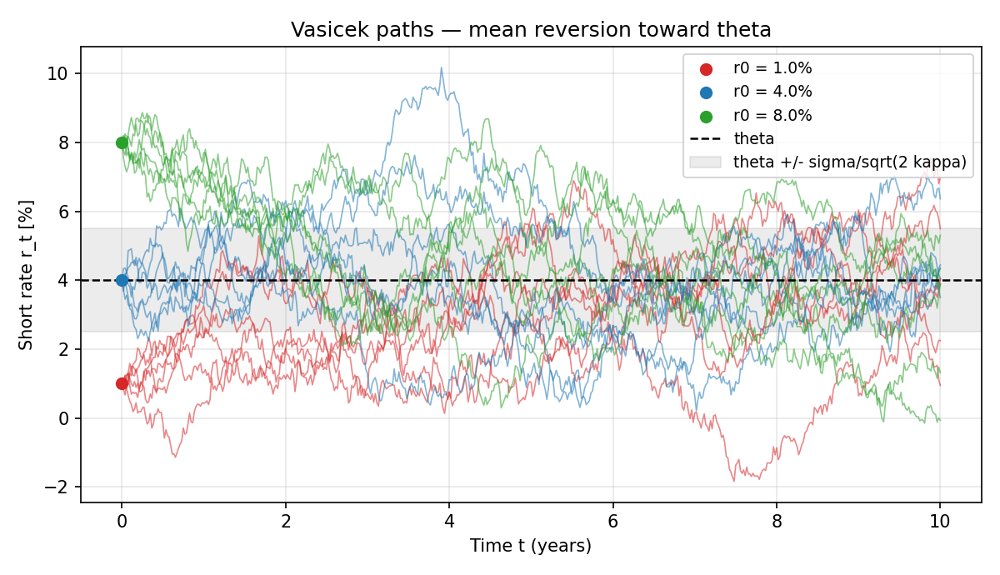
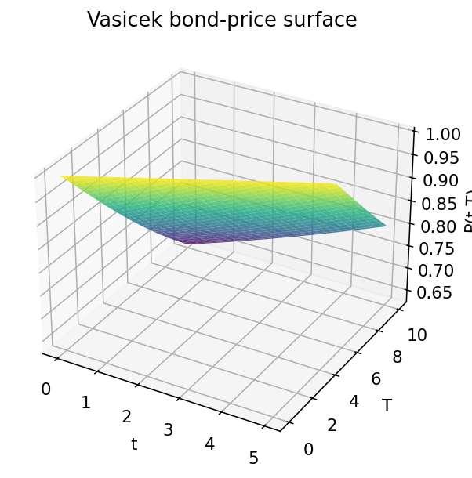
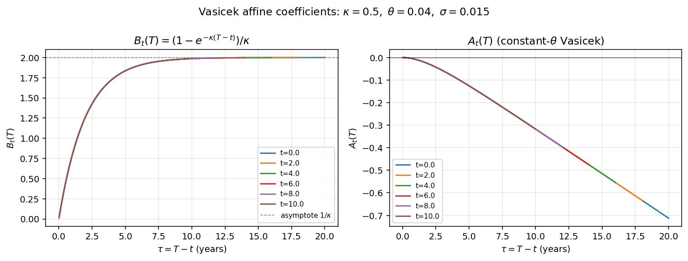
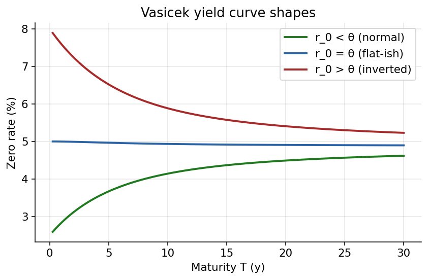
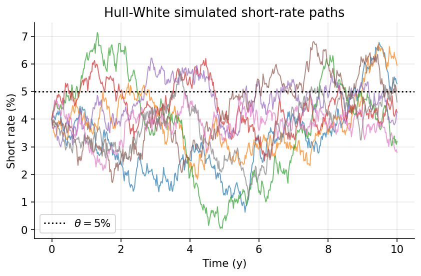
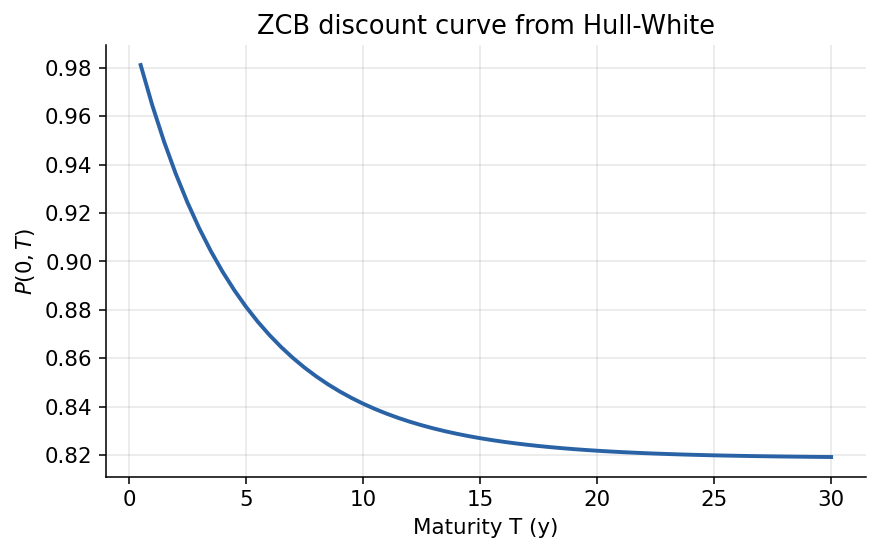
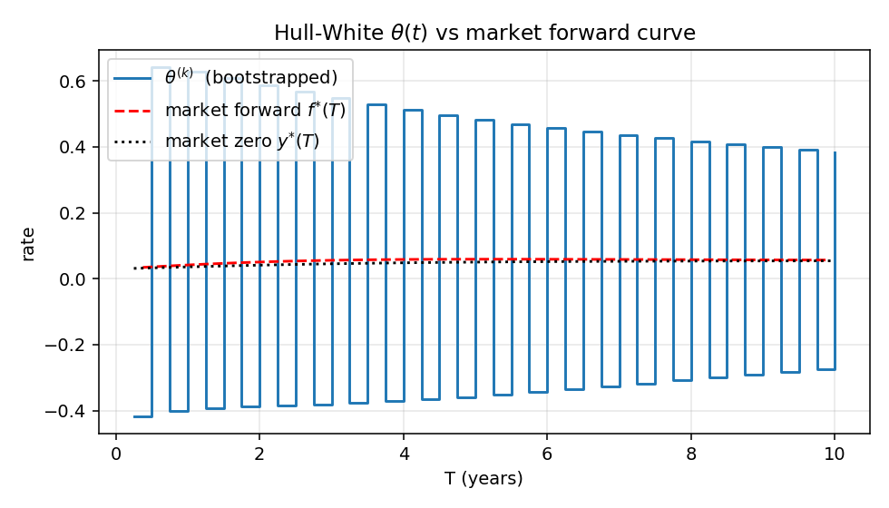

# CH12 — Short-Rate Models: Vasicek, Ho-Lee, Hull-White, Affine

*Part IV — Interest-Rate Models. Depends on CH03 (Itô, OU solution), CH04
(Feynman-Kac for bond pricing), CH05 (Girsanov for the passage from the
physical measure $\mathbb{P}$ to the risk-neutral measure $\mathbb{Q}$), and
CH11 (calibration on lattices).*

This is the chapter in which the yield curve becomes an object we can
*model* rather than merely observe. The calibration chapter (CH11)
built short-rate lattices by matching observed bond prices term by
term; here we replace the lattice with a continuous-time stochastic
differential equation and derive closed-form bond prices, yield curves,
and volatility structures from the dynamics themselves. Three models
— Vasicek, Ho-Lee, and Hull-White — are developed as a single
narrative, with Vasicek as the canonical derivation that the other two
specialise or extend. The applications (interest-rate swaps, CDS, bond
options, callable bonds) live in Chapter 13; the caps, floors, and
swaptions capstone lives in Chapter 15. This chapter's single job is
to build the model.

## 12.1 Motivation: why short-rate models

The philosophical shift from equity option pricing to interest-rate option
pricing is worth making explicit at the outset. In the Black–Scholes world
there is one underlying asset (a stock) and one derivative price to compute
at a time; discounting is done by a constant or deterministic rate and plays
no interesting role. In interest-rate modelling the situation is inverted:
the "underlying" is the entire term structure — a whole surface of bond
prices indexed by maturity $T$ — and the quantity being discounted is itself
stochastic. The core ambition of short-rate modelling is the dramatic
compression this entails: we posit a single scalar state variable $r_t$,
specify its dynamics, and from that one equation recover the *entire* yield
curve along with consistent prices for every rate-sensitive derivative
written on it.

To appreciate the ambition, consider the scale of the object the model is
trying to describe. A full yield curve has continuously many points
(maturities from one day to fifty years), each carrying a price. The market
simultaneously quotes prices for thousands of bonds, swaps, swaptions, caps,
floors, and exotic rate derivatives, all written on this curve. Any
internally consistent price system for all these products must respect
no-arbitrage relationships between them — too many to enumerate by hand.
The short-rate programme proposes that all of this structure is implicit in
a single stochastic process for $r_t$, and that once $r_t$'s dynamics are
specified, every other price follows. This is an extraordinary claim,
reminiscent of the classical ambition of physics to derive all of
macroscopic phenomena from a small set of microscopic laws. In rates, the
short-rate SDE plays the role of the fundamental law, and the whole
machinery of this chapter is the derivation of its consequences.

The compression succeeds because the required structural ingredients —
linear drift, linear-or-state-dependent squared volatility, Markovian state
— are exactly the conditions for the affine-pricing apparatus to work. A
non-affine short-rate model would fail to produce tractable bond prices
(not because of any physical objection but because the mathematics would
not close in finite form), and would therefore fail to support the whole
edifice of rate-derivative pricing. Affine structure is both the secret of
the model's success and the source of its limitations: real rate dynamics
have features (regime shifts, heavy tails, non-affine macro dependence)
that cannot be captured in a pure affine framework. We will return to
these limitations at several points.

A second thing worth noting at the outset: short-rate models are
*reduced-form*. They do not ask where interest rates come from (monetary
policy, inflation expectations, term-premium decomposition) but instead
posit a parsimonious stochastic process and calibrate its parameters to
observed market prices. This is a feature, not a bug. For trading and
hedging purposes one needs consistency with market quotes and analytical
tractability; deep macro structure is left to other models. The Vasicek
class we develop here is the simplest non-trivial example, and the
techniques transfer almost verbatim to its descendants (Cox–Ingersoll–Ross,
Hull–White, multi-factor affine, quadratic-Gaussian).

A final orienting remark: the whole programme sits at the intersection of
three disciplines — stochastic analysis (Itô calculus, Girsanov,
martingale representation), partial differential equations (Feynman–Kac,
parabolic PDEs with source terms), and economics (no-arbitrage,
equilibrium pricing, the stochastic discount factor). Each supplies a
tool, none of them is the whole story. The stochastic analyst sees an
Ornstein–Uhlenbeck process and writes down moment-generating functions;
the PDE theorist sees a linear parabolic operator and solves with an
affine ansatz; the economist sees a no-arbitrage price and asks what
constraints consistency imposes. When they all converge on the same
bond-price formula $P_t(T) = e^{A_t(T) - B_t(T) r_t}$, each feels
vindicated. In truth, the formula lives at the intersection and is richer
for it.

Short-rate models are *not* forecasting tools. A Vasicek model, fed
with today's yield curve and today's implied vols, will say nothing
useful about whether rates will rise or fall — it will only say, given
a family of possible future rate paths, what price today's arbitrage
conditions impose on a specific derivative. That distinction is
subtle but fundamental, and newcomers to rates often get it wrong.
More precisely: a Vasicek calibrated to today's curve produces
expectations of future rates under $\mathbb{Q}$, not under $\mathbb{P}$.
The difference between these two expectations is the term premium — a
quantity of genuine economic interest but one that short-rate models
treat as a free parameter rather than something to be explained. If
you want to ask "what will rates actually do next year?" you need
macroeconomics, survey data, or factor models, not Vasicek. If you
want to ask "what is today's arbitrage-free price for a swaption?"
you need Vasicek (or a cousin), not macroeconomics. Confusing these
two questions is the most common conceptual mistake in rates
modelling, and clarity on the split is essential before any formulas
get written down. Every time a trader talks about "the market's
implied path of rates," they are implicitly working under a specific
measure; losing track of which measure is a recipe for expensive
mistakes.

### 12.1.1 Warm-up: rate trees and the non-uniqueness of $\mathbb{Q}$

Before writing a continuous-time model, it pays to recall what went right
on a recombining *equity* tree and what goes subtly different on a *rate*
tree. On an equity tree the risk-neutral probability $q$ is *pinned down*
by no-arbitrage once $u, d, r$ are fixed:
$q = (e^{r\Delta t} - d)/(u - d)$. There is no choice. On a rate tree the
corresponding $q$ is *not* unique. This is the conceptual pivot of the
whole chapter, and it motivates both the time-dependent drift in
Hull-White and the notion of "calibration" itself.

Why the difference? Because the Fundamental Theorem of Asset Pricing
applies to *tradables*. The short rate $r_t$ is not a tradable: you
cannot, at time $t$, walk into a market and "buy one unit of $r_t$" the
way you can buy a share of Apple. What you can buy is the money-market
account (which earns $r_t$ instantaneously) or a zero-coupon bond (which
pays \$1 at a specific future date). So arbitrage pins down the measure
$\mathbb{Q}$ through its action on bonds, not through its action on
$r_t$. Different short-rate dynamics can reproduce the same observed
bond prices, and arbitrage has no way to distinguish between them.
Resolving this freedom is what "calibration" does.

Concretely, imagine a two-step rate tree with $r_0$ pinned by $P_0(1)$.
For any choice of $q_0 \in (0,1)$, and any choice of $(r_{1u}, r_{1d})$,
the tree prices $P_0(2)$ as some function of $(r_{1u}, r_{1d}, q_0)$.
With three free parameters and one observation, there is a two-parameter
family of consistent choices. Adding $P_0(3)$ adds one more equation
but also three more free $r_{2*}$ values plus $q_1$, leaving the system
perpetually under-determined: at every step we add one observation and
more than one free parameter.

> **Slogan.** *The short-rate tree is not the price of a traded asset.
> Therefore $q$ is not uniquely determined by no-arbitrage. We must add
> external information — the market bond prices — to pin down $\theta$.*

This is the discrete-time shadow of the continuous-time statement
"Hull-White has infinitely many $\theta(t)$ choices for any given
$(\kappa, \sigma)$, and only the curve-fit picks one out."

Two further consequences. First, calibration of a rate model requires
strictly more inputs than calibration of a stock model. A stock model
needs only the spot and (maybe) one vol surface. A rate model needs an
entire yield curve (to pin down $\theta$ or $\theta_t$), at least one
vol instrument (to pin down $\sigma$), and a choice of mean-reversion
(to pin down $\kappa$). This reflects the deeper fact that rate
derivatives live on a surface in $(t,T)$ space, while stock derivatives
live on a curve in $T$ alone.

Second, the non-uniqueness is what gives short-rate modelling its
freedom and, simultaneously, its burden. Every modeller picks a family —
Ho-Lee, Vasicek, Hull-White, CIR, Black-Karasinski — and within that
family parameters are calibrated to the market. Different families
produce different pricings for off-curve instruments (caps, swaptions,
CDS) even when they agree on the calibration bonds. The choice of
family is a genuine modelling decision, not algebra.

### 12.1.2 The traded primitives: $M_t$ and $P_t(T)$

Short rates are not traded. What is traded are:

- the money-market (bank) account
```math
\mathrm{d}M_t = r_t\, M_t\, \mathrm{d}t, \qquad M_0 = 1,
\tag{12.1}
```
equivalently $M_t = \exp\!\big(\int_0^t r_s\, \mathrm{d}s\big)$;
- zero-coupon bonds of various maturities $T$, with price process
$\big(P_t(T)\big)_{0\le t\le T}$ and terminal condition $P_T(T) = 1$.
Bonds are contingent claims on the short-rate *path* — every bond pays
\$1 at maturity, so its value today is determined by the law of
$\int_0^T r_s\,\mathrm{d}s$.

Think of the contrast with Black-Scholes. There, the stock $S_t$ is
itself the traded asset: no-arbitrage directly pins its $\mathbb{Q}$-drift
to be $r$, end of story. There is no market-price-of-risk freedom to
worry about because the state variable coincides with the tradable. In
short-rate modelling, the state variable ($r_t$) and the tradables
($M_t$, bonds) are *different*, and the mathematical relationship between
them must be specified. That relationship is the market price of risk,
and it is an additional *modelling* choice on top of the SDE for $r_t$.
Short-rate models have a layer of structure that equity models do not;
they are correspondingly more flexible.

The bank account $M_t$ plays the role of a "price of forgetting." Every
instant, $M_t$ grows by $r_t\,\mathrm{d}t$, regardless of whether $r_t$
is moving randomly or staying fixed. It is a non-decreasing adapted
process that encodes the total discount accumulated from 0 to $t$.
Dividing other prices by $M_t$ factors out this accumulated discount and
is what produces $\mathbb{Q}$-martingales: it is the cleanest way of
separating the deterministic exponential growth due to compounding from
the stochastic information embedded in prices themselves. Every
subsequent numeraire change in this chapter and the next is a variation
on this theme — pick a reference asset, divide, and study the resulting
relative prices.

## 12.2 Discrete motivation: AR(1) and the continuous limit

Why does an AR(1) belong here at all? Because empirical short-rate series
(Fed funds, EONIA, SONIA, SOFR) look remarkably unlike random walks and
remarkably like stationary mean-reverting processes. Plot a multi-decade
history of a policy rate and it moves in slow waves that hover around
levels broadly set by trend inflation and potential growth; it does not
diffuse toward infinity the way a geometric Brownian motion would. The
simplest model that captures this is a linear combination of yesterday's
rate, a drift toward a mean, and a Gaussian shock — the discrete
AR(1):
```math
r_n \;=\; \alpha\, r_{n-1} \;+\; \beta_n \;+\; \sigma\sqrt{\Delta t}\, \varepsilon_n,
\qquad \varepsilon_n \stackrel{\text{iid}}{\sim} \mathcal{N}(0,1).
\tag{12.2}
```
Rewriting (12.2) in "innovation form,"
```math
r_n - r_{n-1} \;=\; \kappa(\theta - r_{n-1})\,\Delta t \;+\; \sigma\sqrt{\Delta t}\,\varepsilon_n,
\tag{12.3}
```
makes the correspondence with a continuous mean-reverting SDE transparent.
Identifying $\alpha \leftrightarrow 1 - \kappa\Delta t$,
$\beta_n \leftrightarrow \kappa\theta\Delta t$, and
$\varepsilon_n\sqrt{\Delta t} \leftrightarrow \mathrm{d}W_t$, and sending
$\Delta t \to 0$, recovers the Vasicek SDE
```math
\mathrm{d}r_t \;=\; \kappa(\theta - r_t)\,\mathrm{d}t \;+\; \sigma\,\mathrm{d}W_t.
\tag{12.4}
```
The persistence $\alpha$ and the mean-reversion speed $\kappa$ are two
views of the same quantity: $\alpha = e^{-\kappa\Delta t}$ in exact
correspondence, and for small $\Delta t$ this is well approximated by
$1 - \kappa\Delta t$. A daily AR(1) with $\alpha = 0.998$ corresponds to
$\kappa = -\ln(0.998)/(1/252) \approx 0.50$ — a roughly-annual
mean-reversion speed consistent with empirical policy rates.

The other useful intuition from the AR(1) view is that the continuous-time
process $r_t$ has *memory*. Under geometric Brownian motion (the
Black-Scholes stock model) today's price contains no information about
tomorrow's trajectory beyond its own level; under Vasicek, today's rate
contains information about the *deviation from the mean* that partially
persists. This memory is what makes mean reversion predictable at longer
horizons — not because we can forecast the noise, but because we know the
drift will systematically pull the process back toward $\theta$ at an
estimable rate. For derivatives pricing this matters: an option that
pays off a function of the integrated rate over time is fundamentally a
bet on these mean-reverting dynamics, and its price depends sensitively
on how much memory the process has.

### 12.2.1 Why continuous time?

The continuous limit is not just aesthetic. In discrete time, pricing a
$T$-year zero-coupon bond means computing an expectation of a product of
$T/\Delta t$ correlated random discount factors — a high-dimensional
integral with no closed form. In continuous time, by contrast, the same
object becomes an expectation of the exponential of a Gaussian integral,
whose moment-generating function is explicit. Continuous time is what
unlocks the closed-form bond price $P_t(T) = e^{A_t(T) - B_t(T)r_t}$ that
makes the calibration and hedging machinery workable.

The gap between a continuous-time Vasicek and a sensible daily discrete
approximation is, in practice, negligible compared with model-specification
error, parameter-estimation error, or liquidity effects. Nobody should
lose sleep over the "continuous vs discrete" dichotomy once calibration
is done. What matters is that continuous time gives us a tractable
language in which to express and solve pricing problems; the language is
a tool, not a claim about ontology.

There is also a pedagogical virtue to continuous time. In discrete time,
the various random-walk and AR(1) models look superficially similar —
they differ only in the fine print of their coefficients — and it is
easy to lose sight of which model is adequate for a given problem. In
continuous time the functional forms of drifts and diffusions are
starker and more revealing: a constant drift is obviously different from
a linear-in-state drift, a constant diffusion is obviously different
from a $\sqrt{r}$ diffusion. The continuous-time formulation makes the
modelling choices *legible*, and legibility is a precondition for
careful thinking.

### 12.2.1.b Estimating AR(1) Vasicek from historical data

The AR(1) representation (12.3) is useful not only pedagogically but for
parameter estimation. Given a time series of observations
$\{r_0, r_1, \ldots, r_N\}$ on a $\Delta t$ grid, ordinary least squares
regression of $r_n$ on $r_{n-1}$ yields estimates of the slope $\beta =
1 - \kappa\Delta t$ and intercept $\kappa\theta\Delta t$, from which
$\kappa = (1 - \beta)/\Delta t$ and $\theta = \alpha/(1 - \beta)$ follow
directly. The residuals from this regression have variance $\sigma^2
\Delta t$, giving an estimate of $\sigma$. This simple estimation
procedure is the physical-measure ($\mathbb{P}$) calibration of
Vasicek, and it can be implemented in a few lines of linear algebra — a
reminder that many "exotic" quantitative finance tools reduce to
well-known statistical procedures once the algebra is peeled away.

The sample autocorrelation at lag $h$ — $\text{Corr}(r_s, r_{s+h})$ —
should follow the theoretical form $e^{-\kappa h}$ in stationary
equilibrium. Plotting empirical autocorrelation against lag on a
log-linear scale and fitting a straight line is a quick diagnostic of
whether the data are well-described by an OU / AR(1) process. If the
empirical autocorrelation decays exponentially, the AR(1) is a good
fit; if it decays faster (over-damped) or slower (long memory), the
data are telling you something the simple model misses. Long memory
is a particularly well-studied deviation; models with multiple
mean-reversion speeds (G2++, three-factor affine) capture it by
having one slow and one fast factor.

Two important identifiability warnings. First, estimates of $\kappa$
are notoriously noisy in short samples: the "half-life of a shock"
is a slow-moving feature, and short-window data contains limited
information about it. Robust estimates typically require decades of
daily data, or at least years of high-frequency data. Second, the
physical-measure estimates of $\kappa^{\mathbb{P}}$ and
$\theta^{\mathbb{P}}$ differ systematically from their risk-neutral
counterparts $\kappa^{\mathbb{Q}}$ and $\theta^{\mathbb{Q}}$ by the
market price of risk. The volatility $\sigma$ is measure-invariant
(Girsanov changes drift but not diffusion), so it should theoretically
agree across historical and calibration estimates — a useful sanity
check when running both.

### 12.2.2 From $\mathbb{P}$ to $\mathbb{Q}$ (cross-reference CH05)

Under the physical measure $\mathbb{P}$, write the short rate as
```math
\mathrm{d}r_t \;=\; \mu(t,r_t)\,\mathrm{d}t \;+\; \sigma(t,r_t)\,\mathrm{d}W_t.
\tag{12.5}
```
By Girsanov's theorem (Chapter 5), the change of measure to the
risk-neutral $\mathbb{Q}$ shifts the drift by
$-\lambda_t\,\sigma(t, r_t)$, where $\lambda_t$ is the *market price of
interest-rate risk*:
```math
\mathrm{d}r_t \;=\; \big(\mu(t, r_t) - \lambda_t\,\sigma(t, r_t)\big)\,\mathrm{d}t \;+\; \sigma(t, r_t)\,\mathrm{d}\widehat{W}_t.
\tag{12.6}
```
We do not re-derive Girsanov here — that happened in Chapter 5, where the
density process, Doléans-Dade exponential, and two-numeraire switching
were developed as the canonical treatment. What matters for this chapter
is the consequence. Three standard choices of $\lambda_t$ preserve the
affine structure:

- Constant $\lambda_t = $ const: only shifts $\theta$ (the long-run mean
under $\mathbb{Q}$ differs from that under $\mathbb{P}$).
- Affine in $r_t$: $\lambda_t = a + b\,r_t$: shifts both $\theta$ and
$\kappa$.
- Deterministic function of time $\lambda_t = a_t + b_t\,r_t$: yields
Hull-White with time-dependent $\theta_t$.

All three preserve the linear drift, and under $\mathbb{Q}$ the short
rate continues to satisfy
```math
\mathrm{d}r_t \;=\; \kappa(\theta_t - r_t)\,\mathrm{d}t \;+\; \sigma\,\mathrm{d}\widehat{W}_t,
\tag{12.7}
```
where $\theta_t$ is (in general) a deterministic function of time. The
diffusion $\sigma$ does *not* change under Girsanov: Brownian motions
have the same quadratic variation under equivalent measures, so
calibrated volatilities carry over directly across measure specifications
without needing adjustment. Only drifts change when measures change.

The economic content of $\lambda_t$ is worth a pause. Under
$\mathbb{P}$ rate shocks are perceived as risky, and investors demand
compensation for holding bonds whose prices move inversely to those
shocks. That compensation is the term premium, and it biases the
$\mathbb{P}$-drift of $r_t$ relative to what a risk-neutral agent would
perceive. Because we never directly observe $\lambda_t$ — we only see
prices, and prices aggregate $\mathbb{P}$-dynamics with $\lambda_t$ into
a single $\mathbb{Q}$-drift — the modelling convention is to work
entirely under $\mathbb{Q}$ and let historical data inform the shape (if
any) of $\lambda_t$ separately. In short-rate modelling for pricing, it
is almost universal to specify dynamics directly under $\mathbb{Q}$ and
never write $\mathbb{P}$-dynamics explicitly.

### 12.2.3 The fundamental bond-pricing formula

By the general theory of risk-neutral pricing (Chapter 5), relative
prices of all traded assets are $\mathbb{Q}$-martingales once we divide
by the numeraire $M_t$. For a zero-coupon bond with terminal payoff 1,
```math
\frac{P_t(T)}{M_t} \;=\; \mathbb{E}^{\mathbb{Q}}_t\!\left[\,\frac{1}{M_T}\,\right]
\qquad\Longrightarrow\qquad
\boxed{\;\; P_t(T) \;=\; \mathbb{E}^{\mathbb{Q}}_t\!\left[\, e^{-\int_t^T r_s\,\mathrm{d}s}\,\right]. \;\;}
\tag{12.8}
```

Equation (12.8) is the master formula of short-rate modelling. Read
carefully, it says that today's bond price is *exactly* the risk-neutral
expectation of the continuously-compounded discount factor over the
bond's life. This sentence contains a lot: it simultaneously asserts
no-arbitrage (the price is an expectation), identifies the right measure
($\mathbb{Q}$), specifies the right numeraire ($M_t$), and provides a
concrete algorithm (integrate $r_s$ along simulated paths and average).
Every bond price in this chapter — and every yield, forward rate, swap
rate, caplet, and swaption derived from bond prices in Chapter 13 — is a
consequence of this formula.

A useful consistency check: when $r_t = r$ is deterministic and
constant, (12.8) reduces to $P_t(T) = e^{-r(T-t)}$. When $r_t$ is
deterministic but time-varying, it reduces to $P_t(T) = e^{-\int_t^T
r_s\,\mathrm{d}s}$. Only when $r_t$ is stochastic does the expectation
become non-trivial; the formula generalises the deterministic cases
smoothly and recovers them as special limits.

The algorithmic reading of (12.8) is equally important. If we cannot
evaluate the expectation analytically — say, because the model is too
complex for a closed form — we can always simulate: generate many Monte
Carlo paths of $r_t$ from $t$ to $T$ under $\mathbb{Q}$, compute the
realised discount factor along each path, and average. The bond price
converges in probability to the average as the number of paths grows.
The entire business of finding closed forms (the affine trick we are
about to execute) is a way of *avoiding* Monte Carlo by exploiting
special structure; when that structure is absent, Monte Carlo is there
to catch us.

---

## 12.3 Vasicek — the canonical derivation

This is the technical heart of the chapter. Take (12.7) with constant
$\theta$, which gives the original Vasicek (1977) model:
```math
\boxed{\;\; \mathrm{d}r_t \;=\; \kappa(\theta - r_t)\,\mathrm{d}t \;+\; \sigma\,\mathrm{d}\widehat{W}_t, \qquad \kappa, \theta, \sigma > 0. \;\;}
\tag{12.9}
```
The drift is linear-restoring, the diffusion is constant, and the solution
is an Ornstein-Uhlenbeck process: a mean-reverting Gaussian process with
long-run mean $\theta$ and mean-reversion speed $\kappa$.

**Intuition — mean reversion.** Whenever $r_t$ wanders above $\theta$,
the drift pulls it *down* in proportion to the deviation; when it drifts
below, the drift pushes it *up*. Economically this mirrors the behaviour
of real short rates — central banks tighten when rates are "too low"
(inflation pressure) and ease when they are "too high" (recession risk),
so rates orbit around a neutral level rather than random-walking. The
speed $\kappa$ controls how fast this happens: the *half-life* of
deviations is $\ln 2/\kappa$. With $\kappa = 0.3$ a shock decays by half
in about 2.3 years; with $\kappa = 1.0$, in about 8 months. The
stationary distribution is $\mathcal{N}(\theta, \sigma^2/(2\kappa))$ —
larger $\kappa$ (stronger pull) or smaller $\sigma$ (less noise) narrows
the long-run distribution around $\theta$.

The half-life interpretation deserves emphasis because it is how
practitioners think about $\kappa$. Nobody calibrating reasons directly
in units of "inverse time" — they reason in half-lives, because a
half-life has immediately physical meaning. "A $\kappa$ of 0.3
corresponds to a rate-shock half-life of 2.3 years" is a statement any
rates trader can sanity-check against intuition about how long a
Fed-funds deviation persists before the next cutting or hiking cycle
unwinds it. If a calibrated $\kappa$ implies a half-life that is wildly
too short (weeks) or absurdly too long (decades), something is wrong.

The Gaussian structure is the other defining feature of Vasicek. It is
what makes every subsequent computation tractable: a linear combination
of Gaussian increments is Gaussian, an integral of Gaussians is Gaussian,
and the exponential of a Gaussian has a closed-form mean (its
moment-generating function). The whole affine bond-price formula
ultimately rests on this one fact. The price paid is that $r_t$ can, in
principle, go negative: the Gaussian distribution is supported on all of
$\mathbb{R}$. Before the 2008-2020 era of unconventional monetary
policy, this was viewed as the model's most conspicuous defect. After
2014 several European and Japanese policy rates did go meaningfully
negative, and suddenly Vasicek's ability to accommodate negative rates
became a *feature*, not a bug. No other equally tractable short-rate
model handles negative rates so naturally.

### 12.3.1 The SDE and the explicit solution

Solve (12.9) by the standard OU integrating factor. Set
$r_t = e^{-\kappa t} g_t$ (equivalently $g_t = e^{\kappa t} r_t$). By
Itô's lemma (Chapter 3),
```math
\mathrm{d}r_t = -\kappa\, e^{-\kappa t} g_t\,\mathrm{d}t \;+\; e^{-\kappa t}\,\mathrm{d}g_t = -\kappa r_t\,\mathrm{d}t + e^{-\kappa t}\,\mathrm{d}g_t.
\tag{12.10}
```
Matching (12.10) against (12.9),
```math
\mathrm{d}g_t \;=\; \kappa\, e^{\kappa t}\,\theta\,\mathrm{d}t \;+\; \sigma\, e^{\kappa t}\,\mathrm{d}\widehat{W}_t.
\tag{12.11}
```
Integrate from $t$ to $T$ and rearrange using $g_T - g_t = e^{\kappa T}r_T - e^{\kappa t}r_t$:
```math
\boxed{\;\; r_T \;=\; e^{-\kappa(T-t)}\, r_t \;+\; \theta\!\left(1 - e^{-\kappa(T-t)}\right) \;+\; \sigma\!\int_t^T e^{-\kappa(T-s)}\,\mathrm{d}\widehat{W}_s. \;\;}
\tag{12.12}
```

The integrating-factor trick used here generalises to essentially every
linear SDE. The key move is multiplying through by $e^{\kappa t}$, which
converts the mean-reverting term $-\kappa r_t\,\mathrm{d}t$ into a pure
differential. Once that is done, the remaining drift and diffusion have
no $r_t$ dependence and can be integrated directly — the non-trivial
feedback has been algebraically removed. The price of admission is that
the final expression involves a weighted stochastic integral against the
kernel $e^{-\kappa(T-s)}$, with weights that decay exponentially as you
look further back. These decaying weights have a beautiful physical
meaning: the current short rate is a weighted average of all past
shocks, with older shocks discounted more heavily because the
mean-reverting drift has had more time to "forget" them. This is exactly
the continuous-time analogue of a discrete AR(1) with autoregressive
coefficient $e^{-\kappa\Delta t}$.

The structural similarity between (12.12) and the Ornstein-Uhlenbeck
result in physics is worth noting: there an OU process describes the
velocity of a particle undergoing Brownian motion in a viscous fluid.
The mean-reverting drift $\kappa(\theta - r_t)$ is analogous to a
frictional force pulling the velocity toward equilibrium; the diffusion
$\sigma\,\mathrm{d}\widehat{W}_t$ is analogous to random molecular
collisions. The exponential memory of past shocks is the mathematical
signature of frictional damping. All classical physical intuition about
coloured noise, spectral densities, and correlation times carries
directly across to interest-rate modelling.

Read (12.12) piece by piece: the first term $e^{-\kappa(T-t)}r_t$ is the
*deterministic* decay of the current rate toward the mean; the second
term $\theta(1 - e^{-\kappa(T-t)})$ is the deterministic buildup of the
mean-reversion level; the third term is a mean-zero Gaussian random
variable whose variance grows from 0 (at $T=t$) toward the stationary
value $\sigma^2/(2\kappa)$ (as $T\to\infty$). Three effects neatly
separated: where we are now, how fast we revert, how noisy the journey
is. Every intuition about OU processes — and therefore about Vasicek,
Hull-White, and half the short-rate literature — can be read off this
one equation.

### 12.3.1.b Joint distribution over multiple times

A property of (12.12) that matters in practice: the joint distribution
of $(r_{t_1}, r_{t_2}, \ldots, r_{t_n})$ at any finite collection of
times is multivariate Gaussian. This follows because each $r_{t_i}$ is
an affine function of the same Brownian motion, and linear combinations
of a Brownian path are jointly Gaussian. The mean and covariance of
this multivariate Gaussian can be computed explicitly:
```math
\mathrm{Cov}(r_s, r_t) \;=\; \sigma^2\,e^{-\kappa(s+t)}\!\int_0^{\min(s,t)} e^{2\kappa u}\,\mathrm{d}u \;=\; \frac{\sigma^2}{2\kappa}\!\left(e^{-\kappa|t-s|} - e^{-\kappa(t+s)}\right).
\tag{12.12a}
```
The dominant term is the exponentially decaying autocorrelation
$e^{-\kappa|t-s|}$; the subtracted term accounts for the boundary
effect near $t = s = 0$. In the stationary limit ($s, t \gg 1/\kappa$)
the covariance reduces to $\frac{\sigma^2}{2\kappa} e^{-\kappa|t-s|}$,
exactly matching the classical OU correlation structure.

This multivariate-Gaussian structure is what makes *exact* Monte Carlo
simulation of Vasicek paths so efficient. If you need samples at
specific times $\{t_1, \ldots, t_n\}$, you can compute the exact
covariance matrix, Cholesky-factor it, and draw correlated Gaussians
in one shot — no Euler discretisation error. For Monte Carlo of
payoffs that depend only on terminal rates (e.g. European bond options)
you do not even need the full covariance matrix; a single Gaussian
draw for $r_T$ suffices. CIR, by contrast, does not admit this
luxury: its non-central chi-squared distribution is exact but more
awkward to sample. The analytical tractability of Vasicek therefore
extends beyond pricing into simulation efficiency — a reason to prefer
Vasicek when it fits.

### 12.3.2 Distribution of $r_T$

From (12.12), $r_T$ conditional on $\mathcal{F}_t$ is Gaussian with
```math
\mathbb{E}^{\mathbb{Q}}_t[r_T] \;=\; e^{-\kappa(T-t)}\,r_t + \theta\bigl(1 - e^{-\kappa(T-t)}\bigr),
\tag{12.13}
```
```math
\mathbb{V}^{\mathbb{Q}}_t[r_T] \;=\; \sigma^2\!\int_t^T e^{-2\kappa(T-s)}\,\mathrm{d}s \;=\; \frac{\sigma^2}{2\kappa}\!\left(1 - e^{-2\kappa(T-t)}\right).
\tag{12.14}
```
The variance starts at 0 at $T = t$ (no time, no uncertainty) and
saturates at $\sigma^2/(2\kappa)$ as $T \to \infty$ (the stationary
variance). The half-saturation time is $\ln 2/(2\kappa)$, so half of the
stationary variance accumulates in $\ln 2/(2\kappa)$ years. With
$\kappa = 0.3$ this is about 1.15 years — meaning over a 1-year horizon,
rates have accumulated about half their long-run uncertainty. Beyond
about $5/(2\kappa) \approx 8$ years the distribution is essentially
stationary.

A worked example sharpens this. Take $\kappa = 0.3$ (half-life about 2.3
years) and $\sigma = 0.01$ (annualised 100 bp vol). The stationary
standard deviation is $\sigma/\sqrt{2\kappa} = 0.01/\sqrt{0.6} \approx
0.0129$, or 129 basis points. A normal distribution with this standard
deviation would put roughly two-thirds of its mass within $\theta \pm
129$ bp and 95% within $\theta \pm 258$ bp. For $\theta = 0.04$ that
gives a plausible long-run range of roughly $1\%$ to $7\%$ for the short
rate — consistent with the long-run range of actual policy rates in
mature economies. Had we taken $\sigma = 0.03$ (a highly volatile
regime), the stationary sd would be 387 bp and the 95% band would extend
from $-3.7\%$ to $+11.7\%$, clearly including negative rates. This
explicit scaling is one of Vasicek's virtues: it lets you read off the
implications of parameter choices in two-second mental math.

The ratio $(1 - e^{-2\kappa(T-t)})$ is a useful "mixing fraction" that
tells you how close to stationarity the process is at horizon $T - t$.
At $T - t = 1/\kappa$ (one mean-reversion time) the mixing fraction is
$1 - e^{-2} \approx 0.865$. At $T - t = 2/\kappa$ it is about 0.982.
For practical purposes one can treat any horizon beyond $3/\kappa$ as
effectively stationary, and this is how simulation studies typically
validate their "burn-in" periods before extracting stationary
statistics.


*Vasicek paths from three starting points all pull toward $\theta$
(dashed line), with dispersion widening then stabilising at
$\sigma/\sqrt{2\kappa}$.*

There is a visual intuition worth internalising: draw the $(t, r)$-plane
with a horizontal line at $r = \theta$. The rate process starts at
$(0, r_0)$. In the deterministic case (set $\sigma = 0$), the path is
an exponential curve approaching $\theta$ asymptotically:
```math
r_t \;=\; r_0\,e^{-\kappa t} \;+\; \theta\bigl(1 - e^{-\kappa t}\bigr).
\tag{12.13a}
```
In the stochastic case, this curve is the "centreline" around which
sample paths fluctuate, with Gaussian noise amplitude growing from
zero (at $t = 0$ the rate is deterministically $r_0$) toward the
stationary value $\sqrt{\sigma^2/(2\kappa)}$ as $t \to \infty$.
Drawing many sample paths overlaid on the same axes produces an
"hourglass" pattern: tight at $t = 0$, fanning out over time,
eventually settling into a constant-width band centred at $\theta$.

Concrete numbers: with $\kappa = 0.15$, $\theta = 4\%$, $r_0 = 2\%$,
the deterministic rate path rises from 2% toward 4% along an
exponential with half-life $\ln 2/0.15 \approx 4.6$ years.
$\mathbb{E}[r_1] \approx 2.28\%$, $\mathbb{E}[r_5] \approx 3.06\%$,
$\mathbb{E}[r_{20}] \approx 3.90\%$. The approach is exponential:
the gap to $\theta$ halves every 4.6 years. If instead $r_0 = 6\%$
(above target), the trajectory is inverted — an exponential decay
from 6% down toward 4%, same timescales. In either case the mean
rate at time $t$ is a specific weighted average of starting point and
target, with weights determined entirely by $\kappa t$.

**Intuition for the stationary variance $\sigma^2/(2\kappa)$.** Each
incremental shock injects variance $\sigma^2\Delta t$ into the process;
each unit of time, mean reversion exponentially erodes that variance
at rate $2\kappa$ (the factor of 2 because variance is a second
moment). In equilibrium, the rate at which new variance is injected
equals the rate at which old variance is damped:
$\sigma^2 = 2\kappa V_{\text{eq}}$, giving $V_{\text{eq}} =
\sigma^2/(2\kappa)$. This balance between injection and decay is the
mechanism behind the ergodic variance. Imagine water being poured into
a leaky bucket: constant inflow at rate $\sigma^2$, outflow proportional
to the current water level at rate $2\kappa V$. In equilibrium, the
water level settles at $V = \sigma^2/(2\kappa)$, where inflow equals
outflow.

The $\kappa$-$\sigma$ identifiability problem, re-posed. The
stationary variance depends only on the ratio $\sigma^2/\kappa$, so
any two parameter vectors with the same ratio (but different individual
$\sigma$ and $\kappa$) produce identical equilibrium distributions.
The difference shows up only in the *transient* behaviour: how quickly
the distribution approaches equilibrium from a non-equilibrium start.
A high-$\kappa$, high-$\sigma$ combination has both strong mean
reversion and high volatility; it converges quickly. A low-$\kappa$,
low-$\sigma$ combination converges slowly. On a yield curve close to
equilibrium, the two parameter sets fit equally well, and the
calibration is non-identifiable. On a yield curve far from
equilibrium, the transient differs and data becomes informative.

### 12.3.3 Distribution of the integrated rate $\int_t^T r_u\,\mathrm{d}u$

To compute the bond price $P_t(T) = \mathbb{E}^{\mathbb{Q}}_t[e^{-\int_t^T
r_s\,\mathrm{d}s}]$ we need the law of
$\int_t^T r_s\,\mathrm{d}s$. Substitute (12.12) and apply Fubini to swap
the time integral with the stochastic integral:
```math
\int_t^T r_s\,\mathrm{d}s \;=\; \frac{1 - e^{-\kappa(T-t)}}{\kappa}\, r_t \;+\; \theta\!\int_t^T\!\bigl(1 - e^{-\kappa(T-s)}\bigr)\,\mathrm{d}s \;+\; \frac{\sigma}{\kappa}\!\int_t^T\!\bigl(1 - e^{-\kappa(T-s)}\bigr)\,\mathrm{d}\widehat{W}_s.
\tag{12.15}
```

The kernel $(1 - e^{-\kappa(T-s)})/\kappa$ that appears throughout
(12.15) has a name worth remembering — it is the quantity we will call
$B_s(T)$. Its role here is to tell us how much each shock
$\mathrm{d}\widehat{W}_s$ at time $s$ contributes to the integrated
short rate through maturity $T$. A shock at time $s \ll T$ has almost
time $T - s$ for its effect to propagate through the mean-reverting
dynamics, so its contribution is nearly $1/\kappa$. A shock at $s
\approx T$ barely has time to act, so its contribution tends to zero.
This exponential down-weighting of late-arriving shocks is the same
phenomenon that gives bonds their characteristic convexity behaviour.

The Fubini step deserves a brief justification. Technically, Fubini for
stochastic integrals requires enough integrability of the integrand; in
the OU case the kernel $e^{-\kappa(T-s)}$ is bounded uniformly in $s \in
[t, T]$, so all the required integrability conditions are trivially
satisfied. In richer models (say, a state-dependent-diffusion CIR
process) the justification is more delicate. For Vasicek, however, the
swap goes through with no fuss — another small benefit of working in
the Gaussian world. (See Chapter 3 for the Itô isometry that underpins
this.)

Another useful perspective: $B_s(T)$ is exactly what one would compute
if asked, "how much does a point shock to $r_s$ raise the integrated
short rate $\int_t^T r_u\,\mathrm{d}u$?" A shock of size $\delta$ at
time $s$ means that, subsequently, $r_u$ for $u > s$ is elevated by
$\delta e^{-\kappa(u-s)}$ (the deterministic OU response to an impulse).
Integrating from $s$ to $T$ gives $\delta \cdot (1 -
e^{-\kappa(T-s)})/\kappa = \delta B_s(T)$. So $B_s(T)$ is the
impulse-response function of the integrated short rate with respect to
a shock at time $s$. This impulse-response interpretation links the
bond-pricing formula to the broader literature on linear systems,
transfer functions, and spectral methods.

Conditional on $\mathcal{F}_t$, (12.15) is therefore a Gaussian random
variable $\int_t^T r_s\,\mathrm{d}s \,\big|\,\mathcal{F}_t \sim
\mathcal{N}(\mu_*, \Sigma_*^2)$ with
```math
\mu_* \;=\; \mathbb{E}^{\mathbb{Q}}_t\!\left[\int_t^T r_s\,\mathrm{d}s\right] \;=\; \frac{1 - e^{-\kappa(T-t)}}{\kappa}\, r_t \;+\; \theta\!\left[(T - t) - \frac{1 - e^{-\kappa(T-t)}}{\kappa}\right],
\tag{12.16}
```
```math
\Sigma_*^2 \;=\; \mathbb{V}^{\mathbb{Q}}_t\!\left[\int_t^T r_s\,\mathrm{d}s\right] \;=\; \frac{\sigma^2}{\kappa^2}\!\int_t^T\!\bigl(1 - e^{-\kappa(T-s)}\bigr)^2\,\mathrm{d}s.
\tag{12.17}
```

The Gaussianity of $\int_t^T r_s\,\mathrm{d}s$ is the crux. It follows
because (i) under Vasicek, $r_s$ is a linear combination of Gaussian
shocks through (12.12), (ii) integration against a deterministic kernel
preserves Gaussianity (a linear operation on a Gaussian vector), and
(iii) Fubini lets us legitimately swap the time integral and the
expectation. That the *integral* of a Gaussian process is itself
Gaussian is not obvious — for a non-linear function of a Gaussian
process it would fail — and this is precisely why Gaussian short-rate
models are so disproportionately tractable compared to alternatives.

To see why the CIR model cannot easily replicate this step, notice that
under CIR $r_s = \text{(something involving } \sqrt{r_{s-}}\text{)}$,
which is *not* a linear combination of Gaussian noise — it is a
non-central chi-squared process whose integral has no simple closed-form
distribution. In the CIR bond-pricing derivation one still obtains an
affine formula $P_t(T) = e^{A_t(T) - B_t(T)r_t}$, but the derivation
goes through the PDE route (§12.3.5 below) rather than the
direct-expectation route. The PDE approach generalises; the
direct-expectation approach is a Gaussian-specific luxury.

The explicit variance formula (12.17), after expanding the square and
integrating term-by-term, becomes
```math
\Sigma_*^2 \;=\; \frac{\sigma^2}{\kappa^2}\!\left[(T - t) \;-\; \frac{2(1 - e^{-\kappa(T-t)})}{\kappa} \;+\; \frac{1 - e^{-2\kappa(T-t)}}{2\kappa}\right].
\tag{12.18}
```
For typical parameters ($\kappa = 0.3$, $\sigma = 0.01$, $T - t = 5$
years), $B_t(T) = (1 - e^{-1.5})/0.3 \approx 2.59$, and the bracketed
expression evaluates to approximately $5 - 5.18 + 1.59 = 1.41$.
Multiplying by $\sigma^2/\kappa^2 \approx 1.11 \times 10^{-3}$ gives
$\Sigma_*^2 \approx 1.57 \times 10^{-3}$, so the standard deviation of
the integrated rate is about 4%. Worth internalising these numerics:
they are what the formulas translate into with real inputs.

### 12.3.4 Closed-form bond price

Because $\int_t^T r_s\,\mathrm{d}s$ is Gaussian with mean $\mu_*$ and
variance $\Sigma_*^2$, its moment-generating function at $-1$ gives the
bond price directly:
```math
P_t(T) \;=\; \mathbb{E}^{\mathbb{Q}}_t\!\left[e^{-\int_t^T r_s\,\mathrm{d}s}\right] \;=\; \exp\!\left\{-\mu_* + \tfrac{1}{2}\Sigma_*^2\right\}.
\tag{12.19}
```

Equation (12.19) is the single most important step in the derivation if
you want to understand *why* the bond price has the form it does. The
identity $\mathbb{E}[e^X] = e^{\mathbb{E}X + \frac{1}{2}\mathbb{V}X}$
for Gaussian $X$ is the engine. Without Gaussianity this identity fails
(one would need the full characteristic function or a Laplace
transform), and the resulting bond price would have no closed form.

The $+\tfrac{1}{2}\Sigma_*^2$ term is the *convexity correction*:
because the exponential is convex, a random discount factor is worth
*more* on average than the exponential of the mean rate, and the gap is
exactly one-half the variance. Practitioners sometimes call this
"Jensen's mountain" — it is the reason bond yields are below expected
future short rates even in the absence of a term premium.

To make the Jensen effect vivid, consider a toy case: imagine the short
rate over the next year will be either 2% or 6% with equal probability,
so the mean rate is 4%. The "naive" discount factor computed from the
mean rate is $e^{-0.04} = 0.9608$. The correct discount factor is
$\tfrac{1}{2}(e^{-0.02} + e^{-0.06}) = \tfrac{1}{2}(0.9802 + 0.9418) =
0.9610$. The difference is small (2 bp in yield terms) but always in
the same direction. Now change the rates to 0% and 8% (higher
variance, same mean): correct discount $\tfrac{1}{2}(1 + e^{-0.08}) =
0.9616$. The gap has widened to 8 bp. The gap scales with the variance
of the rate distribution, exactly as the $+\tfrac{1}{2}\Sigma_*^2$ term
predicts. This is Jensen's inequality in action.

The convexity correction has profound practical implications. It
explains why forward rates are typically *higher* than expected future
spot rates (the convexity premium baked into forwards); why a long-dated
bond yield can be below the long-run mean of the short rate even in the
absence of any risk premium; why swaps convexity-adjusted to remove the
bias have a specific bid-offer structure tied to $\sigma^2$. A rates
trader who does not internalise the convexity correction is doomed to
misprice every structured rate product; the $\tfrac{1}{2}\mathbb{V}$
term is where the money hides.

Plugging (12.16) and (12.17) into (12.19) gives, after some algebra, the
*affine term structure*:
```math
\boxed{\;\; P_t(T) \;=\; e^{A_t(T) \,-\, B_t(T)\, r_t}, \;\;}
\tag{12.20}
```
with
```math
B_t(T) \;=\; \frac{1 - e^{-\kappa(T-t)}}{\kappa},
\tag{12.21}
```
```math
A_t(T) \;=\; -\theta\bigl((T-t) - B_t(T)\bigr) \;+\; \frac{\sigma^2}{2\kappa^2}\!\int_t^T\!\bigl(1 - e^{-\kappa(T-s)}\bigr)^2\,\mathrm{d}s.
\tag{12.22}
```
(Here $s$ is the dummy integration variable running across the bond's
life, not to be confused with the current time $t$; the reference
formulas at §12.9 reuse the same $s$ label.) The structure $P = e^{A -
Br}$ — with $A, B$ deterministic functions of $(t, T)$ independent of
$r$ — is called an affine term structure.


*Vasicek bond-price surface $P(t,T)$ as a function of the current short
rate and maturity.*

Let us decode (12.20). The bond price is a log-linear function of the
current short rate: $\ln P_t(T) = A_t(T) - B_t(T) r_t$. The coefficient
$B_t(T)$ is the bond's *duration-like* sensitivity: $-\partial_{r_t}\ln
P_t(T) = B_t(T)$ is the modified duration with respect to short-rate
shocks. For short maturities ($T \to t$), $B_t(T) \to 0$ and the bond
is insensitive to $r_t$. For long maturities ($T \to \infty$), $B_t(T)
\to 1/\kappa$, meaning a very long bond has a finite duration of
$1/\kappa$ years — *not* unbounded, because mean reversion caps the
effect. A Vasicek with $\kappa = 0.1$ (very slow reversion) gives a
long-bond duration of 10 years; with $\kappa = 0.5$, 2 years. This is a
radically different picture from a random-walk interest rate, under
which long-bond duration would grow without bound.

The finite long-bond duration is one of Vasicek's most distinctive — and
economically sensible — predictions. Actual 30-year bonds do not have
three times the sensitivity of 10-year bonds to short-rate moves. The
reason is mean reversion: a short-rate shock today does not permanently
change expected rates fifty years from now — it is absorbed by the
mean-reverting dynamics over a few $1/\kappa$ years. So the marginal
duration contribution of each additional year beyond a few $1/\kappa$
years is essentially zero. The bond-duration cap at $1/\kappa$ is the
quantitative expression of this economic insight.

Boundary conditions: $B_T(T) = 0$, $A_T(T) = 0$, so $P_T(T) = 1$. These
encode the defining property of a zero-coupon bond: at maturity it pays
exactly one unit of currency regardless of the state of the economy.


*$B_t(T)$ rises from 0 to the asymptote $1/\kappa$, encoding rate
sensitivity of long bonds; $A_t(T)$ is negative and grows in magnitude
with maturity, reflecting the drift and convexity adjustments.*

### 12.3.5 Affine ansatz and the PDE route

There is a second, independent route to (12.20) — and it is the one
that generalises most smoothly to more complex models (CIR,
quadratic-Gaussian, multi-factor affine). Fix $T$ and view $P_t(T) =
g(t, r_t)$ as a function of the state $r_t$. The Feynman-Kac
representation (Chapter 4) says
```math
P_t(T) \;=\; \mathbb{E}^{\mathbb{Q}}_t\!\left[e^{-\int_t^T r_s\,\mathrm{d}s}\right], \quad \mathrm{d}r_t = \kappa(\theta - r_t)\,\mathrm{d}t + \sigma\,\mathrm{d}\widehat{W}_t,
\tag{12.23}
```
and therefore $g(t, r)$ satisfies the bond-pricing PDE
```math
\bigl(\partial_t + \mathcal{L}\bigr)\,g(t, r) \;=\; r\,g(t, r), \qquad g(T, r) = 1,
\tag{12.24}
```
with infinitesimal generator
```math
\mathcal{L} \;=\; \kappa(\theta - r)\,\partial_r + \tfrac{1}{2}\sigma^2\,\partial_{rr}.
\tag{12.25}
```

Why does the PDE carry a source term $-rg$ rather than being sourceless?
Because we are not working with discounted prices directly; we are
working with undiscounted bond prices. As time advances by
$\mathrm{d}t$, the bond's value is reduced by a factor of
$e^{-r_t\,\mathrm{d}t} \approx 1 - r_t\,\mathrm{d}t$, which contributes
$-r_t g\,\mathrm{d}t$ to the dynamics. Multiplying $g$ by the discount
factor $e^{-\int r}$ would give a process satisfying a sourceless PDE;
the sourced PDE here is for the un-discounted price. A bond is a traded
asset, so its discounted price is a $\mathbb{Q}$-martingale; its
undiscounted price is not (it drifts at $r_t$), which is why (12.24)
has a non-zero source.

**Affine ansatz.** Guess
```math
g(t, r) \;=\; e^{A_t - B_t r}, \qquad A_T = 0,\ B_T = 0.
\tag{12.26}
```
Derivatives: $\partial_t g = (\dot A_t - \dot B_t r)g$,
$\partial_r g = -B_t g$, $\partial_{rr} g = B_t^2 g$. Substitute into
(12.24) and divide by $g$:
```math
\bigl(\dot A_t - \kappa B_t \theta + \tfrac{1}{2}\sigma^2 B_t^2\bigr) \;+\; \bigl(-\dot B_t + \kappa B_t - 1\bigr)\,r \;=\; 0.
\tag{12.27}
```

Equation (12.27) is doing something subtle. The left-hand side is a
polynomial in $r$ of degree one — an $r^0$ coefficient and an $r^1$
coefficient. For this polynomial to vanish for *all* values of $r$,
both coefficients must individually be zero. This is the *matching of
coefficients* move, and it is the step that turns one PDE into two ODEs.
It works only because the affine ansatz was the right guess; had we
tried a quadratic ansatz $\log P = A - Br - Cr^2$, we would have picked
up an $r^2$ coefficient that did not naturally vanish, and the ansatz
would have failed. The class of models for which coefficient-matching
succeeds is precisely the class of affine models — hence the name.

Coefficient matching gives the *affine term-structure ODE system*:
```math
\boxed{\;\;
\begin{cases}
\dot A_t - \kappa B_t\, \theta + \tfrac{1}{2}\sigma^2 B_t^2 \;=\; 0, & \text{(A-ODE)} \\[4pt]
\dot B_t - \kappa B_t + 1 \;=\; 0, & \text{(B-ODE)}
\end{cases}
\qquad A_T = 0,\ B_T = 0. \;\;}
\tag{12.28}
```

The ODE system (12.28) is structurally beautiful: the $B$-equation is
autonomous (involves only $B$ and constants), while the $A$-equation
depends on $B$ as an input. Solve for $B$ first, then plug the result
into the $A$-equation and integrate. In richer models the $B$-equation
becomes a Riccati ODE (quadratic in $B$); here in Vasicek it is merely
linear, because the diffusion is constant rather than state-dependent.

**Solving B-ODE.** Equation $\dot B_t - \kappa B_t + 1 = 0$ in standard
form is $\dot B_t = \kappa B_t - 1$ with $B_T = 0$. Integrating factor
$e^{-\kappa t}$ gives
```math
B_t(T) \;=\; \frac{1 - e^{-\kappa(T-t)}}{\kappa},
\tag{12.29}
```
matching (12.21) exactly. This function depends only on $\tau = T - t$,
not separately on $t$ and $T$ — a consequence of the constant-coefficient
structure.

**Solving A-ODE.** Plug $B_t(T)$ into the $A$-ODE and integrate from $t$
to $T$ using $A_T = 0$:
```math
A_t(T) \;=\; -\!\int_t^T \kappa\, B_s(T)\,\theta\,\mathrm{d}s \;+\; \frac{\sigma^2}{2}\!\int_t^T B_s(T)^2\,\mathrm{d}s.
\tag{12.30}
```
Substituting $\kappa B_s(T) = 1 - e^{-\kappa(T-s)}$ and
$\kappa^2 B_s(T)^2 = (1 - e^{-\kappa(T-s)})^2$, (12.30) becomes exactly
(12.22), providing a cross-check between the two derivation routes.

The two derivations — moment-generating-function (§12.3.4) and PDE /
affine ansatz (§12.3.5) — arrive at the same answer via genuinely
different routes. The former is analytically direct but only works
because Gaussianity makes the MGF explicit. The latter is abstractly
more general (it depends only on affine structure, not on Gaussianity)
and therefore extends to CIR, quadratic-Gaussian models, and affine
jump-diffusions. In research the PDE approach is more often the
starting point because it generalises more cleanly; in pedagogy the
direct-expectation route is more transparent for the Vasicek special
case we are working through.

Some authors prefer yet a third derivation: the martingale-based
approach, where one guesses the bond-price formula and verifies that
the discounted price $P_t(T)/M_t$ is a martingale under $\mathbb{Q}$.
This is the most elegant route when it works, because it directly
confirms the no-arbitrage condition rather than deriving the price and
verifying arbitrage-freeness as a corollary. The three approaches —
expectation, PDE, martingale — form a triad that characterises
risk-neutral pricing from three complementary angles: operational (how
to compute it), analytic (what equation does it satisfy), and economic
(why is it arbitrage-free). Mastering all three is the mark of a
mature quant.

A more general methodological lesson from this cross-check: in
quantitative finance, having two independent derivations of the same
result is not redundancy — it is insurance. Each derivation exposes a
different aspect of the mathematical structure, and each is vulnerable
to a different class of errors. The direct-expectation approach is
prone to integration mistakes and Fubini-justification gaps; the PDE
approach is prone to ansatz-guessing errors and boundary-condition
confusion. When both converge on the same formula, one gains high
confidence that neither class of errors has been made.

## 12.4 The yield curve under Vasicek

### 12.4.1 Yields and instantaneous forward rates

The continuously-compounded yield for maturity $T$ at time $t$ is
```math
y_t(T) \;=\; -\,\frac{\ln P_t(T)}{T - t} \;=\; \frac{-A_t(T) + B_t(T)\, r_t}{T - t}.
\tag{12.31}
```
Yields, not bond prices, are what practitioners and the press typically
quote, so (12.31) is probably the most practically used formula derived
from Vasicek. The conversion from bond prices to yields is conceptually
a simple logarithm-and-divide; the practical utility is that yields are
approximately stationary over long periods, while bond prices drift
toward 1 at maturity.

Under Vasicek, the yield decomposition
$y_t(T) = -A_t(T)/(T-t) + B_t(T)/(T-t) \cdot r_t$ shows that yields are
themselves affine in $r_t$. The coefficient $B_t(T)/(T-t)$ is the
yield's sensitivity to the short rate; it approaches 1 at short
maturities (so short-maturity yields essentially equal $r_t$) and
approaches 0 at long maturities (so long-maturity yields are almost
insensitive to $r_t$, a consequence of mean reversion). The intercept
$-A_t(T)/(T-t)$ is the "term-structure contribution" — the part of the
yield that does not depend on today's rate.

The instantaneous forward rate at maturity $T$ is
$f_t(T) = -\partial_T \ln P_t(T)$. It is the rate at which an investor
could lock in a forward contract today starting at $T$ for an
infinitesimal period. Equivalently, it is the expected $T$-instantaneous
short rate under the $T$-forward measure (see Chapter 13). Bond prices
and forward rates are related by
$\ln P_t(T) = -\int_t^T f_t(s)\,\mathrm{d}s$, and the short rate itself
satisfies $r_t = f_t(t)$.

A common trap: the forward rate $f_t(T)$ is *not* in general equal to
the expected future short rate $\mathbb{E}[r_T]$. Under the $T$-forward
measure, $f_t(T) = \widetilde{\mathbb{E}}^T[r_T]$; under the risk-neutral
measure, $\mathbb{E}^{\mathbb{Q}}[r_T]$ differs by a convexity
adjustment; under the physical measure, there is an additional
risk-premium correction. When a commentator says "the market expects
rates to be X% in five years" and cites a five-year forward rate, that
statement is true under $\widetilde{\mathbb{Q}}^5$ but not under
$\mathbb{P}$ — and the wedge between them can be substantial,
particularly at longer horizons. Being precise about *which* measure
one is discussing is a hallmark of careful rates analysis.

### 12.4.2 Yield curve shapes

For Vasicek:

- As $T \to t$: $y_t(T) \to r_t$ (the short rate itself).
- As $T \to \infty$: $y_t(T) \to \theta - \tfrac{1}{2}\,\sigma^2/\kappa^2$
(the long yield — constant in $r_t$).
- In between: the curve can be monotone, humped, or inverted depending
on $r_t$ vs $\theta$.

The long-yield limit $\theta - \tfrac{1}{2}\sigma^2/\kappa^2$ deserves a
pause. The first term, $\theta$, is the long-run mean of the short rate
— what you would expect if you simply averaged rates over the infinite
future. The second term is a *subtraction*: the long yield is *below*
the expected long-run short rate. This negative gap is the convexity
premium: because the discount factor is a convex function of the
integrated rate, random variation in future rates raises the expected
discount factor above the deterministic benchmark, and therefore lowers
the implied yield. The magnitude $\sigma^2/(2\kappa^2)$ is proportional
to the stationary variance of $r_t$ — more volatile or less
mean-reverting short rates give larger convexity premia. This is a
genuine economic prediction: in high-volatility environments, long
yields should trade *below* consensus expectations of the long-run
short rate, and the gap should widen with volatility. Empirically this
is reasonably well supported.

Quantifying in a concrete case: with $\sigma = 0.01$ and $\kappa = 0.3$,
the premium is $(0.01)^2/(2 \cdot 0.09) = 5.56 \times 10^{-4}$, or
about 5.6 basis points. With higher volatility $\sigma = 0.02$ it
quadruples to 22 bp. With slower reversion $\kappa = 0.15$, the
denominator halves-squared to 0.0225 and the premium is 22.2 bp. So
the convexity premium is most visible in slow-reverting, high-volatility
environments — exactly the sort of regime that tends to produce
inverted or unusually flat yield curves.


*Vasicek yield-curve shapes for three starting short rates, showing
the classical monotone-rising, humped, and inverted regimes.*

An illustrative calibration. Take $\kappa = 0.3$, $\theta = 0.04$,
$\sigma = 0.015$ and consider three starting rates: $r_0 \in
\{0.01, 0.04, 0.08\}$. For each compute $y_0(T)$ across
$T \in \{1, 2, 5, 10, 30\}$ years.

For $r_0 = 0.01$ (well below $\theta$): the short end is near 1%,
rises through about 2.5% at 2 years, 3.2% at 5, 3.6% at 10, and
approaches the long-end asymptote $\theta - \sigma^2/(2\kappa^2) =
0.04 - 0.00125 \approx 3.88\%$ at 30. A monotonically rising curve —
the classical "normal" yield curve in a below-neutral environment.

For $r_0 = 0.04$ (at $\theta$): the curve is nearly flat around
3.9%, with only the convexity correction producing a slight downward
drift at longer maturities.

For $r_0 = 0.08$ (well above $\theta$): the short end is at 8%,
falling through about 6.6% at 2 years, 5.0% at 5, 4.3% at 10, and
3.88% at 30. An inverted curve — typical of late-cycle monetary
tightening when short rates are elevated but the market expects them
to fall.

These three scenarios show that Vasicek produces economically sensible
curve shapes across the full range of initial conditions, entirely
through the mean-reversion parameter $\kappa$ and the long-run mean
$\theta$. The deterministic convergence $r_t \to \theta$ drives the
shape, and the convexity correction fine-tunes the long end.

### 12.4.3 The 1-factor limitation

Crucially, all shifts of the curve under Vasicek are driven by a single
factor $r_t$. Any change in the short rate must propagate through the
*entire* yield curve in a fixed, deterministic way dictated by $B_t(T)$.
So if the short rate rises by 25 bp, the 2-year yield rises by some
specific amount, the 10-year by another, the 30-year by yet another —
but the *ratios* among these moves are fixed by the model. Reality is
not so rigid: actual yield-curve moves are dominated by three roughly
orthogonal factors (level, slope, curvature) that move independently.
Principal-components analysis of daily yield-curve changes consistently
shows that three factors explain 95-99% of the variance.

To capture this, practitioners turn to multi-factor affine models —
typically two-factor Hull-White or three-factor affine with independent
Ornstein-Uhlenbeck factors. Each factor contributes its own affine
loading, so a linear combination can match observed yield-curve
dynamics much more faithfully. The cost is higher calibration
complexity and more parameters to stabilise; the benefit is hedges that
actually work under real curve reshapes.

A few common multi-factor specifications deserve mention.

First, the **two-factor Gaussian model (G2++)**: two independent (or
correlated) Ornstein-Uhlenbeck processes $x_t$ and $y_t$, with the
short rate defined as $r_t = x_t + y_t + \phi(t)$ where $\phi(t)$ is a
deterministic shift calibrated to today's curve. With two
mean-reversion speeds $\kappa_x, \kappa_y$ and two volatilities
$\sigma_x, \sigma_y$ plus a correlation $\rho$, the model has enough
freedom to match level-plus-slope curve dynamics and a reasonable vol
surface. G2++ is the most widely used multi-factor rates model in
derivative pricing libraries.

Second, the **three-factor affine model**: three OU factors, allowing
separate calibration to level, slope, and curvature. The bond-price
formula remains exponential-affine in the three-factor state vector,
and the matrix Riccati ODE for $B(t, T)$ can be solved explicitly
under mild assumptions (diagonal mean-reversion matrix).

Third, the **Libor Market Model (LMM)**: a radical departure that
models individual forward rates directly rather than a short rate. LMM
can match any yield curve by construction (forward rates are model
inputs, not model outputs) and any swaption vol cube by suitable
specification of forward-rate volatilities and correlations. The
price for this flexibility is giving up the low-dimensional affine
structure: LMM is high-dimensional, state-vector-based, and typically
requires Monte Carlo for complex payoffs.

Which multi-factor model to use is ultimately a portfolio-specific
decision. For vanilla cap-floor-swaption books, G2++ is usually
sufficient. For Bermudan or callable products, LMM or extended affine
models may be needed. For CVA/XVA computations across a huge book, the
calibration speed and hedging accuracy of affine models make them
attractive even when LMM would be "more accurate" per trade.

## 12.5 Ho-Lee — the canonical derivation

Vasicek with constant $\theta$ has three parameters $(\kappa, \theta,
\sigma)$ and can fit only three features of a yield curve — a level, a
slope, and a curvature, roughly. A real observed curve has dozens of
quoted maturities and cannot be reproduced by any three-parameter
model. The natural fix is to let the drift schedule vary with time.
The simplest such extension drops the mean-reversion altogether and
retains only the time-varying drift: this is the Ho-Lee model, which
we now derive from first principles. It serves a dual purpose — it is
historically the first example of exact yield-curve calibration, and
it is mathematically the $\kappa \to 0$ limit of Hull-White that we
develop in §12.6.

### 12.5.1 Discrete Ho-Lee

The discrete Ho-Lee dynamics on a $\Delta t$ grid:
```math
\boxed{\;\; r_n \;=\; r_{n-1} \;+\; \theta_{n-1}\,\Delta t \;+\; \sigma\sqrt{\Delta t}\,x_n, \qquad x_n\stackrel{\text{iid}}{\sim}\pm 1\text{ Bernoulli}, \ \mathbb{Q}(x_n = \pm 1) = \tfrac{1}{2}. \;\;}
\tag{12.32}
```

Read (12.32) aloud: "tomorrow's short rate equals today's short rate,
plus a deterministic drift over the step, plus a symmetric random
coin-flip scaled to the right standard deviation." The drift
$\theta_{n-1}$ is what curves the rate process to match the market;
the shock $\sigma\sqrt{\Delta t}\,x_n$ is the noise that lets the rate
move up or down. Because the shock is additive (not multiplicative)
and symmetric, the up-move and down-move at each node have equal
magnitude. This produces a recombining tree — two steps up and one
step down lands at the same node as one up and two down, reshuffled.

**Key features.**

- *Arithmetic, not geometric.* Rates are added, not scaled — rates
can go negative. Historically this was Ho-Lee's greatest weakness;
post-2008, actually a feature when pricing negative-rate regimes.
- *No mean reversion.* The Ho-Lee dynamic is Vasicek with $\kappa = 0$;
only the drift $\theta_n$ shapes the curve. A pure random walk in
rates (with drift) means that far out in maturity the distribution of
$r_T$ becomes increasingly diffuse and wide.
- *Recombining tree.* With a symmetric $\pm 1$ shock and constant
$\sigma$, up-then-down and down-then-up return to the same node. The
recombination reduces the node count at step $n$ from $2^n$ to $n+1$,
making calibration linear-time rather than exponential. This is the
single largest computational advantage of Ho-Lee and a property
preserved by its continuous-time limit.

**Calibration goal.** Find $\theta_0, \theta_1, \theta_2, \ldots$ so
that the model matches the market bond prices $P_0(1), P_0(2),
P_0(3), \ldots$. The bootstrap is triangular: $\theta_0$ depends only
on $P_0(1)$ and $P_0(2)$, $\theta_1$ on $P_0(3)$ given $\theta_0$, and
so on. We never solve a nonlinear system. At every step, each new
market bond price adds exactly one new equation in exactly one new
unknown $\theta_n$ — one of the cleanest pieces of structure in
quantitative finance.

With $q = 1/2$ inside the tree probability measure, bond prices are
```math
P_0(1) \;=\; e^{-r_0\,\Delta t}, \qquad P_0(2) \;=\; e^{-r_0\Delta t}\!\left[\tfrac{1}{2} e^{-r_{1u}\Delta t} \;+\; \tfrac{1}{2} e^{-r_{1d}\Delta t}\right],
\tag{12.33}
```
and similarly $P_0(3)$ depends on $\theta_0, \theta_1$, giving us one
equation in $\theta_1$ once $\theta_0$ is known. The philosophical
takeaway: calibration replaces the abstract non-uniqueness of
$\mathbb{Q}$ (§12.1.1) with a specific choice of $\theta$-schedule
that makes model-implied bond prices equal market-observed bond prices.
Once that schedule is fixed, every other derivative prices off the
resulting tree without further calibration.

### 12.5.2 Continuous-time limit (direct Donsker argument)

The cleanest path to the continuous-time Ho-Lee model: start from
(12.32), sum the recursion, and pass $N \to \infty$ directly,
bypassing the Vasicek/Hull-White machinery. Fix a horizon $T$, set
$\Delta t = T/N$ with $t_n = n\Delta t$, and iterate (12.32):
```math
r_N \;=\; r_0 \;+\; \sum_{n=1}^{N}\theta_{n-1}\,\Delta t \;+\; \sigma\sqrt{\Delta t}\sum_{n=1}^{N} x_n.
\tag{12.34}
```
This is a pure telescoping sum: starting level $r_0$, cumulative drift,
cumulative shock. The moments are immediate:
```math
\mathbb{E}^{\mathbb{Q}}[r_T] \;\to\; r_0 \;+\; \int_0^T \theta_u\,\mathrm{d}u, \qquad \mathbb{V}^{\mathbb{Q}}[r_T] \;=\; \sigma^2 T.
\tag{12.35}
```
By Donsker's Invariance Principle — a sum of iid $\pm 1$ shocks,
scaled by $\sqrt{\Delta t}$, converges in distribution to Brownian
motion — we have
```math
\boxed{\;\; r_T \;\stackrel{d}{=}\; r_0 \;+\; \int_0^T \theta_u\,\mathrm{d}u \;+\; \sigma\sqrt{T}\,Z, \qquad Z \sim \mathcal{N}(0, 1), \;\;}
\tag{12.36}
```
equivalently the SDE
```math
\mathrm{d}r_t \;=\; \theta_t\,\mathrm{d}t \;+\; \sigma\,\mathrm{d}W_t.
\tag{12.37}
```

The $\sqrt{\Delta t}$ scaling on the shock is the fundamental scaling
of Brownian motion, which has quadratic variation $\mathrm{d}t$. Had
we scaled by $\Delta t$ instead, the limit would have been
deterministic (shock vanishing); by $1$, it would have been infinite
(shock exploding). The "right" scaling $\sqrt{\Delta t}$ is exactly
what keeps the variance of the sum of $N$ shocks finite. This scaling
shows up in everything from heat diffusion to stock returns to
interest-rate innovations; it is the signature of a process driven by
"many small independent shocks" (Chapter 3's construction of Brownian
motion reviews this in detail).

Negative rates are explicit: $r_T \sim \mathcal{N}(r_0 + \int \theta,
\sigma^2 T)$, so $\mathbb{P}(r_T < 0) = \Phi(-M/\sqrt{V}) > 0$ where
$M$ is the mean and $V$ the variance. For $T = 10$ years,
$\sigma = 1\%$, $M = 3\%$, that probability is $\Phi(-0.95) \approx
17\%$ — substantial. For $T = 1$ year it drops to $\approx 2\%$.
Negative rates thus bite mainly at long horizons, where variance has
had time to accumulate.

**Distribution of the integrated rate.** A shock at time $t$ affects
*all* future $r_u$ for $u \in [t, T]$ (the additive structure with no
reversion has infinite memory), contributing with lever-arm weight
$T - t$ to the integrated rate. Working through the double-sum
calculation,
```math
\int_0^T r_u\,\mathrm{d}u \;\stackrel{d}{=}\; r_0\,T \;+\; \int_0^T\!\int_0^u \theta_s\,\mathrm{d}s\,\mathrm{d}u \;+\; \left(\frac{\sigma^2 T^3}{3}\right)^{\!1/2}\!Z.
\tag{12.38}
```

The cubic growth $T^3/3$ of the variance — as opposed to $T$ for the
process itself — is Ho-Lee's signature of missing mean reversion.
Physically: $\text{Var}[\int_0^T r_u\,\mathrm{d}u] = \int_0^T (T -
t)^2\,\mathrm{d}t \cdot \sigma^2 = \sigma^2 T^3/3$. A 30-year
Ho-Lee at $\sigma = 1\%$ would give $\sigma^2 T^3/3 = 10^{-4} \cdot
9000 = 0.9$, an integrated-rate standard deviation of 94%. This is
absurdly large — translated into bond-price uncertainty, it implies
extreme price sensitivity to model parameters at long horizons. Mean
reversion (Vasicek/HW) fixes this by making variance grow only
linearly in $T$ at long horizons. This is the single biggest practical
reason Ho-Lee is rarely used for long-dated instruments.

### 12.5.2.b The meaning of the $\sqrt{\Delta t}$ scaling

The scaling $\sqrt{\Delta t}$ on the shock is not arbitrary. Brownian
motion was first introduced by Einstein (1905) to model pollen grains
in water — particles buffeted by countless small random molecular
collisions. Einstein's analysis showed that for such a process, the
position's variance grows linearly in time: $\mathbb{V}[X_t] \propto
t$. Linear variance growth in continuous time translates to $\sqrt{\Delta t}$
scaling of discrete increments (because variance of a sum of $N$
independent increments equals $N$ times the per-increment variance,
and if $N$ times some number equals $T$, then the per-increment
standard deviation is $\sqrt{T/N} = \sqrt{\Delta t}$). This scaling
shows up in heat diffusion, stock returns, interest-rate innovations,
and countless other physical processes. It is the signature of "many
small independent shocks."

The $\sqrt{\Delta t}$ scaling also underpins the famous quadratic-
variation result: $(\mathrm{d}W_t)^2 = \mathrm{d}t$ in the Itô-calculus
limit. This is not an equality in the ordinary sense (both sides are
random) but a precise statement about how squared infinitesimal
increments behave in $L^2$. That $(\mathrm{d}W_t)^2$ is deterministic
(equal to $\mathrm{d}t$) is the reason Brownian calculus has its
peculiar features — Itô's lemma includes a second-order term
proportional to variance, reflecting the nonzero quadratic variation.
In rate pricing, this shows up as the convexity term $C_T$; in equity
pricing, as the extra $\frac{1}{2}\sigma^2$ drift in the geometric-
Brownian solution.

If we relax the "finite variance" constraint and allow shocks to have
heavy tails with infinite variance, the limit becomes a stable Lévy
process instead of Brownian motion. Stable Lévy processes have jumps;
they are discontinuous. This is the mathematical basis for jump-
diffusion models of rates, equity prices, and credit spreads. Such
models are sometimes used when heavy tails are important (e.g.
pricing equity index options during tail events), but they are not
standard for rates. The Gaussian limit is the default because it
matches observed rate-change distributions reasonably well at the
level of daily moves, and the mathematical benefits are substantial.

### 12.5.3 Bond price and calibration under continuous Ho-Lee

Because $I_T = \int_0^T r_u\,\mathrm{d}u$ is Gaussian,
$\mathbb{E}^{\mathbb{Q}}[e^{-I_T}] = \exp(-\mathbb{E}I_T +
\tfrac{1}{2}\mathbb{V}I_T)$, giving
```math
\boxed{\;\; \ln P_0(T) \;=\; -r_0\,T \;-\; \int_0^T\!\int_0^u \theta_s\,\mathrm{d}s\,\mathrm{d}u \;+\; \frac{\sigma^2 T^3}{6}. \;\;}
\tag{12.39}
```
The $+\sigma^2 T^3/6$ is the Ho-Lee convexity adjustment. Read in
context of (12.19): $+\tfrac{1}{2}\Sigma_*^2 = +\tfrac{1}{2}\sigma^2
T^3/3 = \sigma^2 T^3/6$ — Jensen's mountain applied to a cubically
growing variance.

**Calibration via differentiation.** Since (12.39) expresses $\ln
P_0(T)$ as a double integral of $\theta$ plus known terms,
differentiating twice with respect to $T$ pulls out $\theta_T$
pointwise.

First derivative:
```math
\partial_T \ln P_0^*(T) \;=\; -r_0 \;-\; \int_0^T \theta_s\,\mathrm{d}s \;+\; \frac{\sigma^2 T^2}{2}.
\tag{12.40}
```
Since $\partial_T \ln P_0^*(T) = -f_0(T)$, this rearranges to the
Ho-Lee forward-curve identity $f_0(T) = r_0 + \int_0^T \theta_s\,
\mathrm{d}s - \sigma^2 T^2/2$.

Second derivative:
```math
\partial_T^2 \ln P_0^*(T) \;=\; -\theta_T \;+\; \sigma^2 T,
\tag{12.41}
```
and therefore
```math
\boxed{\;\; \theta_T \;=\; -\,\partial_T^2 \ln P_0^*(T) \;+\; \sigma^2 T. \;\;}
\tag{12.42}
```

Equation (12.42) is the classical Ho-Lee calibration identity. Read
it intuitively: the drift target $\theta_T$ at time $T$ is "the slope
of the forward curve" plus "a convexity bump proportional to $T$." If
the forward curve is flat, the drift target is just the convexity
bump. If the forward curve is rising, $\theta_T$ is positive and the
model drifts rates upward on average.

In practice one fits a smooth parametric form (Nelson-Siegel,
Svensson, cubic splines) to the observed log-bond curve, differentiates
the fit twice, adds the convexity bump, and reads off $\theta_T$ at
every grid point. The choice of curve-smoother affects the resulting
$\theta(t)$ qualitatively: noisy second derivatives translate into
noisy $\theta(t)$, which makes the rate model unstable and gives
erratic prices for non-calibration instruments.

### 12.5.4 Ho-Lee as the $\kappa \to 0$ limit of Hull-White

Ho-Lee is precisely the $\kappa = 0$ specialisation of the Hull-White
dynamics (below):
```math
\underbrace{\mathrm{d}r_t = \kappa(\theta_t - r_t)\,\mathrm{d}t + \sigma\,\mathrm{d}W_t}_{\text{Hull-White}}
\xrightarrow{\kappa \to 0}
\underbrace{\mathrm{d}r_t = \theta_t\,\mathrm{d}t + \sigma\,\mathrm{d}W_t}_{\text{Ho-Lee}}
```
with the understanding that the Hull-White $\theta_t$ must diverge as
$1/\kappa$ for the limit to be well-defined — the joint limit
$\kappa\theta_t \to \theta_{\text{HL}}$ is what survives. Conceptually
the three models nest: Ho-Lee is the simplest thing; Vasicek adds a
pull-to-constant-target; Hull-White makes that target time-varying.
The calibration machinery for Hull-White specialises to Vasicek
(constant $\theta$) and to Ho-Lee ($\kappa = 0$) with minimal changes.
This pedagogical nesting is why we present them in this order.

## 12.6 Hull-White — the canonical derivation

Vasicek captures mean reversion but has only a constant $\theta$, so it
can fit only a single feature of the observed term structure (roughly,
the long-run mean). Ho-Lee captures exact yield-curve matching but has
no mean reversion, so its variance grows cubically and the model
breaks at long horizons. Hull-White is the best of both worlds:
Vasicek dynamics with a *time-dependent* drift target $\theta(t)$.
The function $\theta(t)$ is calibrated so the model exactly reproduces
today's yield curve, while the mean-reversion parameter $\kappa$ tames
variance growth.

### 12.6.1 Discrete Hull-White

Promote the constant $\theta$ in (12.9) to a deterministic function
$\theta_t$ and replace $\pm 1$ Bernoullis with Gaussian innovations:
```math
\boxed{\;\; r_{t_n} - r_{t_{n-1}} \;=\; \kappa\bigl(\theta_{t_{n-1}} - r_{t_{n-1}}\bigr)\,\Delta t \;+\; \sigma\sqrt{\Delta t}\,\chi_n, \qquad \chi_n \stackrel{\text{iid}}{\sim} \mathcal{N}(0, 1). \;\;}
\tag{12.43}
```

The move from constant $\theta$ to time-varying $\theta(t)$ is the
conceptual leap. In Vasicek the process always reverts toward the same
number, so you can only fit one long-run level. In Hull-White the
process reverts toward a *moving target* — the target itself is a
calibrated function of time — so every part of the yield curve can be
independently matched. The price is infinite-dimensional calibration
(one $\theta$ per time point), but as we will see this reduces to a
linear bootstrap exactly as in Ho-Lee.

**What the parameters mean.**

- $\kappa$ is a *speed*: the deterministic part of (12.43) pulls $r$
toward $\theta_t$ at exponential rate $\kappa$. Large $\kappa \Rightarrow$
very "sticky" short rate around $\theta$; small $\kappa \Rightarrow$
near-random-walk (Ho-Lee). Typical calibrated values live in 0.05-0.3
per year, giving shock half-lives of 2-15 years.
- $\sigma$ sets the innovation scale. The unconditional variance of
$r_T$ approaches $\sigma^2/(2\kappa)$ as $T \to \infty$. Typical
$\sigma$ values are 0.005-0.02 in absolute rate terms (50-200 bp per
year root-volatility).
- $\theta(t)$ is the *drift shaper*: the knob tuned to the market. In
the limit it is essentially $f_0(t) + \sigma^2 \cdot(\text{convexity})$,
where $f_0(t)$ is the instantaneous forward rate.

It is worth pausing on the division of labour. $\kappa$ and $\sigma$
are the *volatility-structure* parameters — they determine how rates
move, how persistent shocks are, how volatile caps and swaptions will
be. These are typically calibrated *jointly* against vol-sensitive
instruments (ATM swaption prices). $\theta(t)$ is the *curve-fitting*
parameter, chosen conditionally on $(\kappa, \sigma)$ to exactly match
the discount curve. So calibration has two stages: first pick $(\kappa,
\sigma)$ to match vol-sensitive instruments, then bootstrap $\theta(t)$
to match bond prices. This two-stage structure is characteristic of
rates calibration in practice.

In production systems the two stages are often iterated. A first pass
with historically-sensible $(\kappa, \sigma)$ produces a $\theta(t)$
schedule. The resulting model is then used to price a set of
swaptions, and the $(\kappa, \sigma)$ are adjusted to reduce
swaption-price errors. Then $\theta(t)$ is re-bootstrapped with the
updated $(\kappa, \sigma)$, and so on until convergence. The inner
bootstrap (curve) takes microseconds; the outer optimisation (swaption
fit) takes seconds to minutes. The separation of concerns is crucial:
the fast bootstrap runs inside the slow optimiser.


*Hull-White simulated short-rate paths reverting to time-dependent
$\theta(t)$.*

### 12.6.2 Summed integral and continuous limit

Unrolling (12.43) recursively with $\beta = 1 - \kappa\Delta t$ and
$\alpha_{n-1} = \kappa\theta_{t_{n-1}}\Delta t$ yields the same
geometric structure as the Vasicek unrolling, with the single
difference that the intercept $\alpha$ varies with $n$:
```math
r_T \;=\; r_0\,\beta^N \;+\; \sum_{n=1}^N \alpha_{n-1}\,\beta^{N-n} \;+\; \sigma\sqrt{\Delta t}\sum_{n=1}^N x_n\,\beta^{N-n}.
\tag{12.44}
```

Taking $N \to \infty$ with $\Delta t = T/N$, the standard Donsker-type
identifications give:

- $(1 - \kappa T/N)^{N-n} \to e^{-\kappa(T-u)}$,
- $(1 - \kappa T/N)^N \to e^{-\kappa T}$,
- $\sum_n (\cdot)\,\Delta t \to \int_0^T (\cdot)\,\mathrm{d}u$,
- $\sigma\sqrt{\Delta t}\sum_n x_n\,\beta^{N-n} \to \sigma\int_0^T
e^{-\kappa(T-u)}\,\mathrm{d}W_u$.

Each of these is a standard stochastic-calculus limit (Chapter 3):
the first two use $\lim_N(1 + x/N)^N = e^x$; the third is the
Riemann-sum-to-integral limit; the fourth is Itô's stochastic-integral
construction for a deterministic integrand.

The Wiener integral $\int_0^T e^{-\kappa(T-u)}\,\mathrm{d}W_u$ is a
Gaussian random variable with mean zero and variance
$\int_0^T e^{-2\kappa(T-u)}\,\mathrm{d}u = (1 -
e^{-2\kappa T})/(2\kappa)$ — exactly the Vasicek stationary-variance
formula. This clean Gaussian structure is the source of the
closed-form bond price. Had the integrand been state-dependent (like
$\sqrt{r_u}$ in CIR), the integral would be a true Itô integral, not a
Wiener integral, and its distribution would not be Gaussian.

The limit of (12.44) is the explicit Hull-White solution:
```math
r_T \;=\; r_0\,e^{-\kappa T} \;+\; \kappa\!\int_0^T e^{-\kappa(T-u)}\,\theta_u\,\mathrm{d}u \;+\; \sigma\!\int_0^T e^{-\kappa(T-u)}\,\mathrm{d}W_u.
\tag{12.45}
```
The pattern is identical to Vasicek with constant $\theta$ (equation
(12.12)); only the deterministic drift contribution has been
generalised from a function of $\tau = T - t$ alone to a true integral
against the time-varying $\theta_u$.

### 12.6.3 Hull-White bond price

The integrated rate, by the same Fubini manipulation as in §12.3.3:
```math
\int_0^T r_u\,\mathrm{d}u \;=\; r_0\,B_T \;+\; A_T \;+\; \frac{\sigma}{\kappa}\!\int_0^T\!\bigl(1 - e^{-\kappa(T-u)}\bigr)\,\mathrm{d}W_u,
\tag{12.46}
```
where
```math
B_T \;=\; \frac{1 - e^{-\kappa T}}{\kappa}, \qquad A_T \;=\; \int_0^T \theta_u\,\bigl(1 - e^{-\kappa(T-u)}\bigr)\,\mathrm{d}u.
\tag{12.47}
```

$B_T$ is worth a moment because it is the single most-used quantity in
Hull-White computations: the "effective duration" that the current
short rate $r_0$ exerts on the integrated rate. In the $\kappa \to 0$
limit, $B_T \to T$ (no reversion means the current rate affects the
entire horizon). In the $\kappa \to \infty$ limit, $B_T \to 0$
(infinite reversion instantly forgets the current rate). For typical
$\kappa \in [0.05, 0.3]$, the ratio $B_T/T$ ranges from near 1 at
short $T$ down to something much smaller at long $T$. For $\kappa =
0.15$ and $T = 30$: $B_T = (1 - e^{-4.5})/0.15 \approx 6.6$, so
$B_T/T \approx 0.22$. The current rate has 22% as much influence on
the 30-year bond price as it would under no mean reversion.

Because the integrated rate is Gaussian with mean $r_0 B_T + A_T$ and
variance
```math
\mathbb{V}\!\left[\int_0^T r_u\,\mathrm{d}u\right] \;=\; \frac{\sigma^2}{\kappa^2}\!\int_0^T\!\bigl(1 - e^{-\kappa(T-u)}\bigr)^2\,\mathrm{d}u \;\equiv\; 2\,C_T,
\tag{12.48}
```
the Hull-White bond price comes out directly from the Gaussian
moment-generating function:
```math
\boxed{\;\; P_0(T) \;=\; \exp\!\left\{-r_0\,B_T \;-\; A_T \;+\; C_T\right\}, \;\;}
\tag{12.49}
```
with convexity adjustment
```math
C_T \;=\; \frac{\sigma^2}{2\kappa^2}\!\int_0^T\!\bigl(1 - e^{-\kappa(T-u)}\bigr)^2\,\mathrm{d}u.
\tag{12.50}
```

Reading (12.49), three pieces:

- $r_0 B_T$: current-level contribution, decaying at rate $\kappa$
because a rate shock "today" is damped over the life of the bond.
- $A_T$: the drift contribution from the $\theta$ path. All the
market information about future forward rates lives here.
- $+C_T$: positive convexity. Jensen's inequality makes the bond
strictly *more* valuable than naive plug-in discounting suggests.
This is the Hull-White analogue of the $\sigma^2 T^3/6$ term in
Ho-Lee and of the $\tfrac{1}{2}\Sigma_*^2$ term in constant-$\theta$
Vasicek.

**Sanity checks.** As $\kappa \to 0$ (Taylor-expanding $(1 -
e^{-\kappa(T-u)})^2 \approx \kappa^2(T-u)^2$), we have $B_T \to T$,
$A_T \to \int_0^T \theta_u\,\mathrm{d}u$, and $C_T \to \sigma^2
T^3/6$. Formula (12.49) collapses to the Ho-Lee formula (12.39).
Setting $\theta(t) = \theta$ constant, $A_T = \theta(T - B_T)$ and
(12.49) specialises to Vasicek. The nesting is clean and complete:
Ho-Lee $\subset$ Vasicek $\subset$ Hull-White.

The $\kappa^2$ cancellation in the $C_T$ limit is a specific instance
of a more general phenomenon: many quantities in Hull-White approach
their Ho-Lee limits smoothly as $\kappa \to 0$, because the
mean-reversion structure enters quadratically in the variance terms
and linearly in the mean terms. This smoothness of limits lets us
calibrate Vasicek/Hull-White parameters to low $\kappa$ values
without numerical difficulty.

**Worked magnitude.** For $T = 10$, $\sigma = 0.01$, $\kappa = 0.1$:
the integral $\int_0^{10}(1 - e^{-0.1(10-u)})^2\,\mathrm{d}u = 10 -
2(1 - e^{-1})/0.1 + (1 - e^{-2})/0.2 = 10 - 12.64 + 4.32 = 1.68$,
so $C_{10} = (10^{-4}/0.02)\cdot 1.68 = 0.0084$ — an 84-bp bonus in
log-bond. By comparison, Ho-Lee with the same $\sigma$ at $T = 10$
gives $C_{10} = \sigma^2 T^3/6 = 0.0167$, or 167 bp — roughly double.
Mean reversion halves the 10-year convexity bonus and the gap grows
exponentially at longer tenors. At $T = 30$ the Ho-Lee number is
$\sigma^2 T^3/6 = 0.45$ (4500 bp!) while Hull-White ($\kappa = 0.1$)
comes in around 600 bp — an order of magnitude smaller. This is why
mean reversion matters for long-dated pricing: Ho-Lee's unbounded
convexity growth is unrealistic; Hull-White's bounded growth matches
market observations.


*Model-implied zero-coupon bond / discount curve $P_0(T)$.*

### 12.6.3.b Precomputation and numerical considerations

For pricing efficiency it is convenient to precompute the "basis
functions" once per maturity $T$: $1 - e^{-\kappa(T-t)}$,
$(T-t) - B_t(T)$, and $(T-t) - 2B_t(T) + (1 - e^{-2\kappa(T-t)})/(2\kappa)$.
Then $A_t(T)$ and $B_t(T)$ are simple linear combinations with
coefficients $\theta$, $\sigma^2/(2\kappa^2)$, etc. In production
rates libraries, the ODEs for $A$ and $B$ are solved once at
model-initialisation time and cached; during pricing, the pre-computed
$A(t, T)$ and $B(t, T)$ are simply evaluated at the appropriate $(t, T)$
pair. This makes bond pricing essentially instantaneous — a table
lookup rather than an integration. The same caching strategy applies
to multi-factor affine models and is part of why these models scale so
gracefully to large trading books.

The finite long-bond duration $1/\kappa$ is the quantitative expression
of mean reversion, and it is a useful diagnostic. A $\kappa$ of 0.02
implies a long-bond duration cap of 50 years, which is physically
implausible — no market participant believes that short-rate shocks
persist for half a century. A $\kappa$ of 2.0 implies a cap of
6 months, which is implausibly small. The reasonable range $\kappa
\in [0.1, 0.5]$ maps to long-bond durations between 2 and 10 years,
matching empirical observation. When a calibration algorithm returns
a $\kappa$ outside this range, something is likely wrong: over-fitting,
compensating misspecification, or an identification issue.

### 12.6.4 Calibrating $\theta(u)$ to the market curve

In practice one observes market bond prices $P_0^*(T)$ (or yields) at
$t = 0$ for all maturities $T$. The idea of Hull-White: choose the
deterministic function $\theta_t$ so the model reproduces $P_0^*(T)$
exactly. Why is this so important? Because a rates trader using a
model that doesn't match today's curve is effectively betting that
today's market is mispriced — almost never a useful default. With
$\theta(t)$ free, the model has enough functional freedom to fit any
observed curve exactly; the remaining parameters $(\kappa, \sigma)$
are then fit to options on bonds.

From (12.49), taking logs at $t = 0$,
```math
\ln P_0^*(T) \;=\; -r_0\,B_T \;-\; \int_0^T \theta_u\,\bigl(1 - e^{-\kappa(T-u)}\bigr)\,\mathrm{d}u \;+\; C_T.
\tag{12.51}
```

**Closed-form inversion.** Differentiating twice in $T$ gives the
pointwise Hull-White calibration identity:
```math
\boxed{\;\; \theta(T) \;=\; \frac{1}{\kappa}\,\partial_T f_0(T) \;+\; f_0(T) \;+\; \frac{\sigma^2}{2\kappa^2}\!\left(1 - e^{-2\kappa T}\right), \;\;}
\tag{12.52}
```
where $f_0(T) = -\partial_T \ln P_0^*(T)$ is the market instantaneous
forward rate. The first term is the slope of the forward curve scaled
by $1/\kappa$, the second is a level match to the forward itself, and
the third is a maturity-dependent convexity adjustment that saturates
at $\sigma^2/(2\kappa^2)$ for large $T$. In the $\kappa \to 0$ limit,
$\kappa\,\theta(T)$ — not $\theta(T)$ itself — must remain finite (see
§12.5.4): multiplying (12.52) through by $\kappa$ gives
$\kappa\theta(T) = \partial_T f_0(T) + \kappa f_0(T) +
(\sigma^2/2\kappa)(1-e^{-2\kappa T})$, and taking $\kappa \to 0$ the
middle term vanishes while the last approaches $\sigma^2 T$, so
$\kappa\theta \to \partial_T f_0 + \sigma^2 T = \theta_{\text{HL}}$,
recovering the Ho-Lee formula (12.42).

**Bucket bootstrap.** In implementation, (12.52) is rarely used
literally because it requires a second derivative of the observed
forward curve, which is numerically ill-conditioned. Production
implementations parameterise $\theta(t)$ as piecewise constant on the
bond-maturity grid, and solve for the parameter values that exactly
reproduce observed bond prices. Splitting the integral in (12.51)
into bucket contributions with piecewise-constant $\theta^{(m)}$ on
$[T_{m-1}, T_m]$:
```math
A_{T_k} \;=\; \sum_{m=1}^k \theta^{(m)}\,\alpha^{(m, k)}, \qquad \alpha^{(m, k)} \;=\; (T_m - T_{m-1}) \;-\; \frac{e^{-\kappa(T_k - T_m)} - e^{-\kappa(T_k - T_{m-1})}}{\kappa}.
\tag{12.53}
```
Solving (12.51) for the current bucket $\theta^{(k)}$ yields the
bootstrap recursion:
```math
\boxed{\;\; \theta^{(k)} \;=\; \frac{T_k\, y_k^* \;-\; r_0\, B_{T_k} \;+\; C_{T_k} \;-\; \sum_{m=1}^{k-1}\theta^{(m)}\,\alpha^{(m, k)}}{\alpha^{(k, k)}}. \;\;}
\tag{12.54}
```

This is a simple linear bootstrap, exactly analogous to Ho-Lee and to
yield-curve stripping: each tenor $T_k$ determines $\theta^{(k)}$
given the already-calibrated earlier buckets. No optimisation, no
iteration, no nonlinearity. Just a sequence of divisions.

The $\alpha^{(m, k)}$ are "overlap weights" — how much of bucket $m$'s
drift influences the integrated rate up to horizon $T_k$. They are
pure geometry of the exponential kernel and do not depend on market
data; production implementations precompute them once per $\kappa$
and cache. Their key property is causality: $\alpha^{(m, k)} = 0$ for
$m > k$, which is what makes the bootstrap triangular. A $\theta^{(m)}$
for $m > k$ has no effect on $P_0(T_k)$ (it refers to rates in the
future relative to $T_k$), so adding tenor $T_k$ determines only
$\theta^{(k)}$ and leaves earlier buckets fixed.

**Worked example.** Take $\kappa = 0.15$, $\sigma = 0.012$, $r_0 =
0.04$, market yields $y_1^* = 0.042$ at $T_1 = 1$ and $y_2^* =
0.045$ at $T_2 = 2$. Compute $B_{T_1} = (1 - e^{-0.15})/0.15 \approx
0.9286$ and $C_{T_1} \approx 3.4 \times 10^{-5}$. With $k = 1$ the
sum is empty and $\alpha^{(1, 1)} = T_1 - B_{T_1} \approx 0.0714$.
Then
```math
\theta^{(1)} \;\approx\; \frac{1 \cdot 0.042 - 0.04 \cdot 0.9286 + 3.4\mathrm{e}{-5}}{0.0714} \;\approx\; 0.0691.
```
The calibrated drift target is about 6.9% — well above the current
4% level. This is the "overshoot": mean reversion only partially
converges the rate toward $\theta^{(1)}$ over one year
($\mathbb{E}[r_1] = 0.04 \cdot e^{-0.15} + \theta^{(1)}(1 -
e^{-0.15}) \approx 0.04 \cdot 0.861 + \theta^{(1)} \cdot 0.139$), so
$\theta^{(1)}$ must overshoot the target rate level to achieve the
market-implied integrated-rate value.


*$\theta(t)$ sits slightly above the market forward curve because of
the convexity adjustment $C_T$.*

For a trader using this model, the practical consequence is that the
calibrated drift schedule $\theta(t)$ should *not* be interpreted as
"what the market expects the rate to be at time $t$." That would
only be true in the $\kappa \to 0$ limit. With mean reversion,
$\theta(t)$ is instead "what the target has to be so that the
expected rate path matches the market's forward curve," which is
different. The expected rate path itself is
$\mathbb{E}[r_t] = r_0 e^{-\kappa t} + \kappa\int_0^t
e^{-\kappa(t-u)}\theta_u\,\mathrm{d}u$, which is smoother than
$\theta(t)$.

**Philosophical note.** By adjusting $\theta(t)$ to match today's
curve exactly, Hull-White gives up the possibility of *explaining* the
curve in terms of a small number of stationary parameters. The curve
is now an input, not a prediction. This is a feature for pricing
(you want your model to agree with market quotes) but a bug for
economic insight (you can't test your $\mathbb{Q}$-dynamics against
curve data you haven't already used to calibrate them). In this
sense Hull-White is a member of a broad class of "calibrated" models
in finance whose primary virtue is practical rather than explanatory.

There is a deeper parallel to the Black-Scholes world. In equity, the
"implied volatility" surface is what the market uses to quote options;
it is not a model parameter but a derived quantity. In rates, the
forward curve $f_0(\cdot)$ is what the market quotes; $\theta(t)$ is
the corresponding derived quantity. Both are "market-implied" model
inputs computed from quoted prices via specific formulas.

### 12.6.5 Practical implementation considerations

The calibration described above is conceptually simple but has several
practical wrinkles worth flagging for someone who will actually
implement it.

**Curve smoothing.** The pointwise formula (12.52) requires a
first and second derivative of the market forward curve. Real market
data (swap quotes, futures, bond prices) are discrete and noisy;
naive numerical differentiation will produce erratic $\theta(t)$ that
oscillates between buckets and destabilises the pricing engine.
Production implementations fit a smooth parametric form to the log-
discount curve before differentiating. Common choices include cubic
splines (flexible, but can oscillate near endpoints), Nelson-Siegel
(four parameters capturing level, slope, curvature, and one
shape parameter), Svensson (Nelson-Siegel plus two more parameters
for improved curvature fit), and tension splines (controlled
smoothness). The choice trades off exact fit against parameter
stability; over-smoothed curves produce stale prices, under-smoothed
curves produce noisy prices. The sweet spot is chosen based on
the desk's risk appetite and is re-evaluated periodically.

**Bucket stability.** Piecewise-constant $\theta(t)$ has a subtle
defect: the drift is discontinuous at bucket boundaries, producing
small kinks in the implied forward curve. These kinks are usually
invisible in pricing but can show up as spurious "vol spikes" in
certain risk metrics. Smoother representations (piecewise linear,
cubic splines) avoid the kinks at the cost of more calibration
parameters per bucket. A compromise is to use piecewise-constant
$\theta(t)$ plus a post-processing smoothing step that redistributes
drift mass across adjacent buckets while preserving exact bond-price
fit. Some practitioners prefer to parameterise the cumulative integral
$\Theta(t) = \int_0^t \theta(u)\,\mathrm{d}u$ directly, which is
smoother than $\theta$ itself.

**Chicken-and-egg $(\kappa, \sigma, \theta)$ joint calibration.** The
Hull-White convexity term $C_T$ depends on $(\kappa, \sigma)$, so
bootstrapping $\theta(t)$ requires knowing these first. But $(\kappa,
\sigma)$ are typically determined by fitting to caplet and swaption
prices, which themselves depend on the already-extracted $\theta(t)$.
The standard resolution is iterative: pick initial $(\kappa, \sigma)$
from historical estimates; extract $\theta(t)$ via (12.54); fit
$(\kappa, \sigma)$ to option prices; re-extract $\theta(t)$; iterate
until convergence. In practice convergence is fast (a few iterations)
because the interaction between $\theta(t)$ and option prices is weak
for typical parameters. Damping, regularisation, and convergence
diagnostics are standard components of serious implementations.

**Instrument set selection.** Which market instruments should the
model be calibrated to? For vanilla books, the practical answer is:
(i) the short-end of the curve from overnight rates and short-dated
futures; (ii) the intermediate-dated part from medium-term swaps and
futures; (iii) the long end from long-dated swaps; (iv) a strip of
ATM caplets or swaptions for $(\kappa, \sigma)$. For more exotic
portfolios (callable bonds, Bermudan swaptions) additional volatility
instruments may be needed. The calibration error across each
instrument set is typically monitored as a diagnostic; deviations
signal either a model limitation or a data issue.

**Real-time re-calibration.** Because each calibration step is
linear-time, production systems can re-calibrate every few seconds
or faster as the market ticks. Whether they *should* is a deeper
question: constantly-shifting $\theta(t)$ muddies P&L attribution
("market moved" vs "model re-fit") and creates numerical noise. Most
desks re-calibrate at a few natural cadences (morning open, mid-day,
end of day, plus on large market moves). The choice of cadence is a
trade-off between model freshness and signal-to-noise.

## 12.7 Affine term structure and the duality of short-rate models

The word "affine" denotes a very specific class of models with a precise
structural signature: the drift and the squared diffusion of the state
variable are both linear (affine) functions of the state. Vasicek sits
at the simplest end of this class (constant diffusion, linear drift).
CIR complicates matters by allowing the diffusion $\sigma\sqrt{r_t}$
to depend on $r_t$ — this makes the squared diffusion $\sigma^2 r_t$
linear in $r_t$, so the model is still affine but the ODE for $B$
becomes a genuine Riccati equation. Multi-factor extensions replace
$r_t$ with a vector state and the scalar ODE for $B$ with a matrix
Riccati ODE. In every case the bond price remains exponential-affine
in the state vector, and that is the single structural property that
makes the entire edifice tractable.

The affine class has been systematically characterised in a celebrated
1996 paper by Duffie and Kan. They showed that if one posits an
exponential-affine bond price $P(t, T, x) = \exp(A(t, T) + B(t, T)^\top
x)$ for some state vector $x$, then the underlying state must have a
very restricted form of dynamics: the drift must be affine in $x$, the
instantaneous covariance matrix must be affine in $x$ (with
coefficients specifying exactly which linear combinations of state
variables can drive which diagonal entries of the covariance), and the
structure must be compatible across maturities. Moreover, Duffie and
Kan classified the admissible affine models by their "signature" —
whether each state variable can take all real values or must be
non-negative. Vasicek is a pure "Gaussian" affine model (all state
variables unconstrained); CIR is a "square-root" affine model (one
state variable positive, with $\sqrt{\cdot}$ diffusion); mixed affine
models combine these. The Duffie-Kan classification underlies
essentially every multi-factor bond-pricing library in practice.

Outside the affine class, exponential-affine bond prices are impossible:
if the dynamics of the state are not affine, the bond price will not
have this form. What do you get instead? Typically, semi-closed-form
approximations (via characteristic functions, transform inversions, or
perturbation expansions), Monte Carlo, or numerical PDE methods. These
techniques work, but they are slower and less transparent than the
affine closed form. For this reason, most practical rates libraries
implement pricing as "affine-first, with plug-ins for non-affine
corrections."

### 12.7.1 The three models in one diagram

The three models derived in this chapter occupy three corners of a
small parameter space:

| Model | $\kappa$ | $\theta$ | SDE / bond price |
|---|---|---|---|
| Ho-Lee | $0$ | $\theta(t)$ | $\mathrm{d}r_t = \theta(t)\,\mathrm{d}t + \sigma\,\mathrm{d}W_t$; $\ln P_0(T)$ has $+\sigma^2 T^3/6$ convexity |
| Vasicek | $\kappa > 0$ | constant | $\mathrm{d}r_t = \kappa(\theta - r_t)\,\mathrm{d}t + \sigma\,\mathrm{d}W_t$; $P_t(T) = e^{A_t(T) - B_t(T)r_t}$ affine |
| Hull-White | $\kappa > 0$ | $\theta(t)$ | Vasicek dynamics with $\theta_t$ calibrated to market curve |

The nesting is transparent: Hull-White $\supset$ Vasicek $\supset$
Ho-Lee, with each inclusion obtained by freezing one more parameter.
Vasicek is Hull-White with $\theta_t$ held constant; Ho-Lee is
Hull-White with $\kappa \to 0$ (and the $\kappa\theta_t$ product held
fixed). In production use, Hull-White is almost always the model of
choice because it is the only one of the three that fits the observed
yield curve exactly.

### 12.7.2 Duality: three perspectives on the same formula

The bond price $P_t(T) = e^{A_t(T) - B_t(T)r_t}$ can be derived by
three independent routes, each shining light on a different aspect:

1. **Direct expectation (§12.3.4, §12.5.3, §12.6.3).** Use the
explicit Gaussian solution for $r_t$, integrate to get the Gaussian
law of $\int_t^T r_u\,\mathrm{d}u$, apply the moment-generating
function. This route makes the Jensen-convexity origin of the formula
transparent and generalises to any Gaussian affine model.
2. **Affine ansatz + PDE (§12.3.5).** Use Feynman-Kac to convert the
expectation into a parabolic PDE with source term $-rg$; guess an
exponential-affine solution; match coefficients to obtain a pair of
ODEs for $A$ and $B$. This route makes the affine structure of the
model explicit and generalises to any affine model including CIR and
quadratic-Gaussian.
3. **Martingale verification (discussed but not executed).** Postulate
the formula $P = e^{A - Br}$, compute $\mathrm{d}(P/M)$ using Itô,
verify that the drift is zero under $\mathbb{Q}$. This route
directly confirms the no-arbitrage condition and is the most elegant
but requires pre-knowledge of the formula.

That all three converge on the same answer is both a consistency
check and a window onto the structural richness of affine models.
Each route carries some information the others don't: the direct
expectation carries the probabilistic intuition (Jensen, Gaussian
MGF); the PDE carries the analytic intuition (elliptic operators,
Riccati ODEs); the martingale verification carries the economic
intuition (no-arbitrage as martingality). Mastering all three is the
difference between pricing a bond and understanding what its price
means.

### 12.7.2.b Historical context and the negative-rates saga

The three models derived in this chapter have a combined history worth
a brief reflection. Vasicek (1977) was the first major analytically-
tractable short-rate model. Its introduction of the affine framework
foreshadowed decades of work that would eventually produce the Duffie-
Kan classification and the entire affine-pricing industry. For
pedagogical purposes, it is the natural starting point: three
parameters, a clean OU solution, a closed-form bond.

Ho and Lee (1986) shifted the emphasis from model structure to model
*calibration*: they proposed not a new class of dynamics but a
recognition that discrete drift parameters should be tuned to match
observed bond prices bucket by bucket. This was a conceptual advance
as much as a mathematical one. It reframed modelling as a two-layer
endeavour — posit a structure, then calibrate its free parameters to
market data — that has dominated quantitative finance ever since.

Hull and White (1990) fused the two: they took Vasicek's mean-reverting
structure and Ho-Lee's time-dependent drift, obtaining a model that
combined analytical tractability with exact yield-curve calibration.
The result was so immediately useful that Hull-White rapidly became
the industry default, and it remains the base-case rates model in
most pricing libraries today. The Black-Karasinski (1991) and
Black-Derman-Toy (1990) alternatives, which work with $\ln r_t$
rather than $r_t$ to enforce positivity, are sometimes preferred for
their non-negativity property but pay for it in lost affine structure.

The saga of negative rates deserves attention because it illustrates
how modelling orthodoxies get disrupted by market events. For decades
the CIR (1985) model — Vasicek-with-$\sqrt{r}$-diffusion — was
considered the "principled" choice for rates modelling because it
keeps $r_t \ge 0$. Regulators sometimes even required it, on the
logic that a model permitting nonsensical outputs must be wrong.
Then came 2014: the ECB's deposit facility rate went to -0.10%, then
-0.20%, eventually -0.50%; Swiss and Danish rates went deeply negative;
Japanese rates followed. Suddenly the "nonsensical" output of Vasicek
was the *actual* output of the market, and CIR was stranded on the
wrong side of reality, unable to express the current state of the
world. Hull-White's Gaussian structure — permitting negative rates
as part of the state space — became a feature, not a bug.

The lesson is that modelling choices are not timeless; they reflect
economic conditions, and conditions change. A rates quant in 2026 who
cannot express a negative interest rate in their model is a rates
quant who cannot price a five-year EUR receiver swaption, and that is
a crippling limitation. The sensible response is modellers' pluralism:
understand multiple models, know which is appropriate in which regime,
and be prepared to switch when the world changes. Because the
mathematical techniques for affine models are largely shared across
the family, the cost of keeping both in one's toolkit is modest; the
cost of having only one is potentially catastrophic.

### 12.7.3 Where this chapter leaves the reader

By the end of §12.6 the reader can:

- Derive Vasicek from first principles, arriving at the bond-price
formula (12.20)-(12.22) by both the direct-expectation and PDE routes.
- Extend to Hull-White by letting $\theta \to \theta(t)$, and bootstrap
$\theta(t)$ to exactly reproduce an observed yield curve.
- Specialise to Ho-Lee by setting $\kappa \to 0$, with the understanding
that the resulting cubic variance growth limits the model to
short-dated products.
- Read off the yield curve, forward curve, and convexity adjustment as
analytical by-products.

What is *not* in this chapter: applications. The IRS par-rate formula,
the Jamshidian bond-option formula, the T-forward measure, callable
bonds, CDS, and multi-factor / LMM / SABR all live in Chapter 13 (rate
derivatives) and Chapter 15 (caps and swaptions). The division of
labour is: this chapter *builds the model*; the next two *use it*.

---

## 12.8 Key Takeaways

1. **Short rates are not traded; bonds are.** The Fundamental Theorem
of Asset Pricing applies to tradables, so the risk-neutral measure
$\mathbb{Q}$ is defined by its action on $M_t$ and $P_t(T)$, not on
$r_t$. This creates a genuine degree of freedom (the market price of
risk $\lambda_t$) that must be fixed externally — typically by
calibration to observed bond prices.

2. **The master pricing formula is
$P_t(T) = \mathbb{E}^{\mathbb{Q}}_t[e^{-\int_t^T r_s\,\mathrm{d}s}]$.**
It is model-agnostic — every short-rate model computes the same
conditional expectation, differing only in how the expectation is
evaluated. Affine models evaluate it in closed form.

3. **Vasicek: three parameters, one bond-price formula.** The SDE
$\mathrm{d}r_t = \kappa(\theta - r_t)\,\mathrm{d}t +
\sigma\,\mathrm{d}W_t$ yields, via either the direct-expectation
route or the PDE / affine-ansatz route, the closed-form bond price
$P_t(T) = e^{A_t(T) - B_t(T) r_t}$ with $B_t(T) = (1 -
e^{-\kappa(T-t)})/\kappa$.

4. **Bonds are convex in rates (Jensen's mountain).** The
$+\tfrac{1}{2}\Sigma_*^2$ term in the Gaussian MGF is the convexity
adjustment that makes long bonds worth *more* than naive plug-in
discounting suggests. It explains why long yields trade below
expected long-run short rates even without a term premium.

5. **Long-bond duration is capped at $1/\kappa$.** This is Vasicek's
most economically distinctive prediction: unlike a random-walk rate
model, mean reversion means long bonds have finite sensitivity to the
current short rate. Any calibrated $\kappa$ outside the range
$[0.1, 0.5]$ is suspect.

6. **Long yield = $\theta - \tfrac{1}{2}\sigma^2/\kappa^2$.** The long
end of the yield curve is *below* the long-run mean of the short rate
by a convexity premium. Larger in high-vol or slow-reverting
regimes.

7. **Ho-Lee is the $\kappa \to 0$ limit.** Pure random walk with
time-varying drift. Bond price has the simple form
$\ln P_0(T) = -r_0 T - \iint\theta + \sigma^2 T^3/6$; drift pointwise
calibration $\theta_T = -\partial_T^2 \ln P_0^*(T) + \sigma^2 T$.
The cubic $T^3$ variance growth means Ho-Lee breaks at long
maturities.

8. **Hull-White = Vasicek with time-varying $\theta(t)$.** Exact
yield-curve fit by construction, via a linear triangular bootstrap
(12.54) analogous to Ho-Lee's. Two-stage calibration in practice:
$(\kappa, \sigma)$ fit to swaption vols, then $\theta(t)$ bootstrapped
to match bonds.

9. **One-factor is a limitation.** Vasicek/HW can only produce
parallel-shift curve moves (up to the $B_t(T)$ loading). Real
curve dynamics have three factors (level, slope, curvature); for
hedging and pricing curve-twist-sensitive products, move to G2++ or
multi-factor affine or LMM.

10. **Affine = tractable.** The structural property "drift linear,
squared diffusion linear in the state" is what makes coefficient-
matching work in the PDE ansatz, reduces the infinite-dimensional
pricing problem to two ODEs, and ultimately gives closed-form bond
prices. Ho-Lee, Vasicek, HW, CIR, G2++, and the Duffie-Kan affine
family all share this property; Black-Karasinski (log-rate) and
stochastic-vol rates models do not.

---

## 12.9 Reference Formulas

### Core dynamics

```math
\mathrm{d}r_t = \kappa(\theta(t) - r_t)\,\mathrm{d}t + \sigma\,\mathrm{d}\widehat{W}_t
```

- $\theta(t) = $ const gives Vasicek; $\kappa = 0$ gives Ho-Lee.

### Explicit solution

```math
r_T = e^{-\kappa(T-t)}\, r_t + \kappa\!\int_t^T e^{-\kappa(T-s)}\theta(s)\,\mathrm{d}s + \sigma\!\int_t^T e^{-\kappa(T-s)}\,\mathrm{d}\widehat{W}_s
```

### Distribution of $r_T$ (Vasicek, const $\theta$)

```math
r_T \;\sim\; \mathcal{N}\!\left(\theta + e^{-\kappa(T-t)}(r_t - \theta),\;\; \tfrac{\sigma^2}{2\kappa}\bigl(1 - e^{-2\kappa(T-t)}\bigr)\right)
```

Stationary limit: $\mathcal{N}(\theta, \sigma^2/(2\kappa))$.

### Integrated rate (Vasicek)

```math
\int_t^T r_s\,\mathrm{d}s \;=\; B_t(T)\, r_t + \theta\bigl((T-t) - B_t(T)\bigr) + \tfrac{\sigma}{\kappa}\!\int_t^T\bigl(1 - e^{-\kappa(T-s)}\bigr)\,\mathrm{d}\widehat{W}_s
```

Gaussian with mean and variance in (12.16)-(12.18).

### Vasicek affine bond price

```math
P_t(T) = e^{A_t(T) - B_t(T)\, r_t}, \qquad B_t(T) = \frac{1 - e^{-\kappa(T-t)}}{\kappa}
```

```math
A_t(T) = -\theta\bigl((T-t) - B_t(T)\bigr) + \tfrac{\sigma^2}{2\kappa^2}\!\int_t^T\bigl(1 - e^{-\kappa(T-s)}\bigr)^2\,\mathrm{d}s
```

### Affine ansatz ODE system

```math
\begin{cases}
\dot{A}_t - \kappa B_t\, \theta(t) + \tfrac{1}{2}\sigma^2 B_t^2 = 0 \\[3pt]
\dot{B}_t - \kappa B_t + 1 = 0
\end{cases}
\qquad A_T = B_T = 0
```

### Vasicek yield curve

```math
y_t(T) = \frac{B_t(T)\,r_t - A_t(T)}{T - t}
```

Limits: $y_t(t) = r_t$; $y_t(\infty) = \theta - \tfrac{1}{2}\sigma^2/\kappa^2$.

### Ho-Lee bond price

```math
\ln P_0(T) \;=\; -r_0\,T \;-\; \int_0^T\!\int_0^u \theta_s\,\mathrm{d}s\,\mathrm{d}u \;+\; \frac{\sigma^2 T^3}{6}
```

### Ho-Lee calibration identity

```math
\theta_T \;=\; -\,\partial_T^2 \ln P_0^*(T) \;+\; \sigma^2 T \;=\; \partial_T f_0(T) + \sigma^2 T
```

### Hull-White bond price

```math
P_0(T) = \exp\{-r_0\,B_T - A_T + C_T\}
```

```math
B_T = \frac{1 - e^{-\kappa T}}{\kappa}, \quad A_T = \int_0^T \theta_u\bigl(1 - e^{-\kappa(T-u)}\bigr)\,\mathrm{d}u, \quad C_T = \frac{\sigma^2}{2\kappa^2}\int_0^T\!\bigl(1 - e^{-\kappa(T-u)}\bigr)^2\,\mathrm{d}u
```

### Hull-White pointwise calibration

```math
\theta(T) \;=\; \frac{1}{\kappa}\,\partial_T f_0(T) + f_0(T) + \frac{\sigma^2}{2\kappa^2}\bigl(1 - e^{-2\kappa T}\bigr)
```

### Hull-White bucket bootstrap

```math
\theta^{(k)} \;=\; \frac{T_k\,y_k^* - r_0\,B_{T_k} + C_{T_k} - \sum_{m=1}^{k-1}\theta^{(m)}\,\alpha^{(m,k)}}{\alpha^{(k,k)}}
```

with
```math
\alpha^{(m,k)} \;=\; (T_m - T_{m-1}) \;-\; \frac{e^{-\kappa(T_k - T_m)} - e^{-\kappa(T_k - T_{m-1})}}{\kappa}.
```

### Three-model nesting

| Model | $\kappa$ | $\theta$ | Long-run $\mathbb{V}[r_T]$ | Convexity $C_T$ as $T\to\infty$ |
|---|---|---|---|---|
| Ho-Lee | $0$ | $\theta(t)$ | $\sigma^2 T$ | $\sigma^2 T^3/6$ (cubic) |
| Vasicek | $\kappa > 0$ | const | $\sigma^2/(2\kappa)$ | bounded growth |
| Hull-White | $\kappa > 0$ | $\theta(t)$ | $\sigma^2/(2\kappa)$ | $\sigma^2 T/(2\kappa^2)$ (linear) |

### Half-life

```math
\tau_{1/2} = \frac{\ln 2}{\kappa}
```

Typical calibrated $\kappa \in [0.1, 0.5]$ corresponds to rate-shock
half-lives of 1.4 to 7 years.
