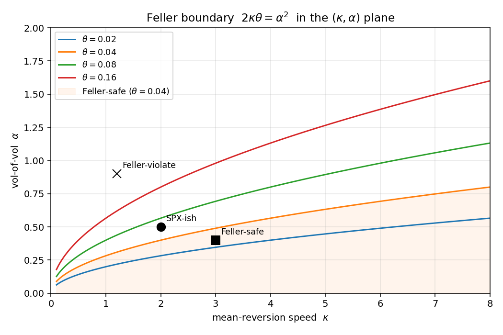
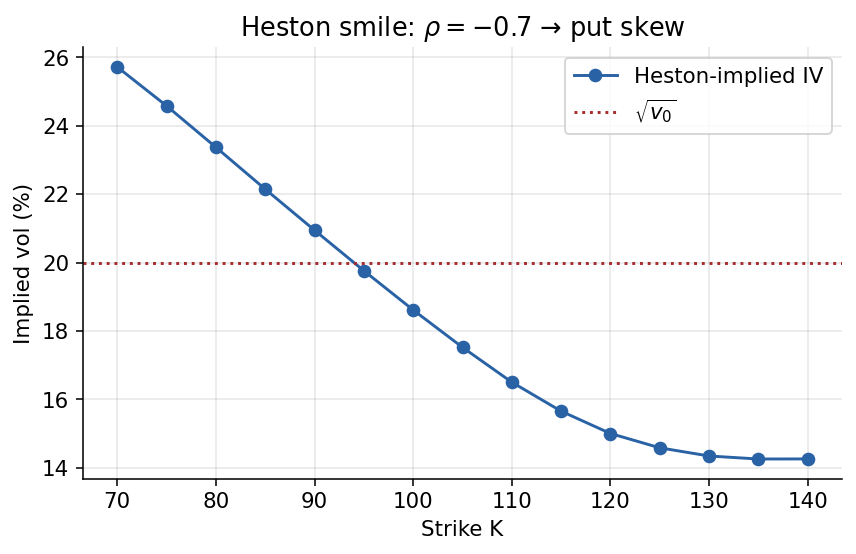
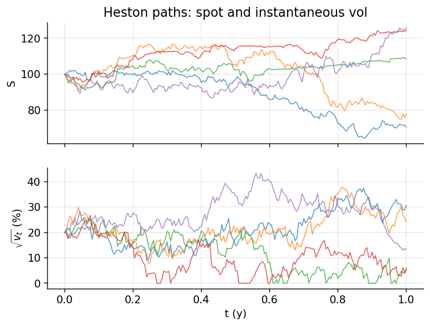
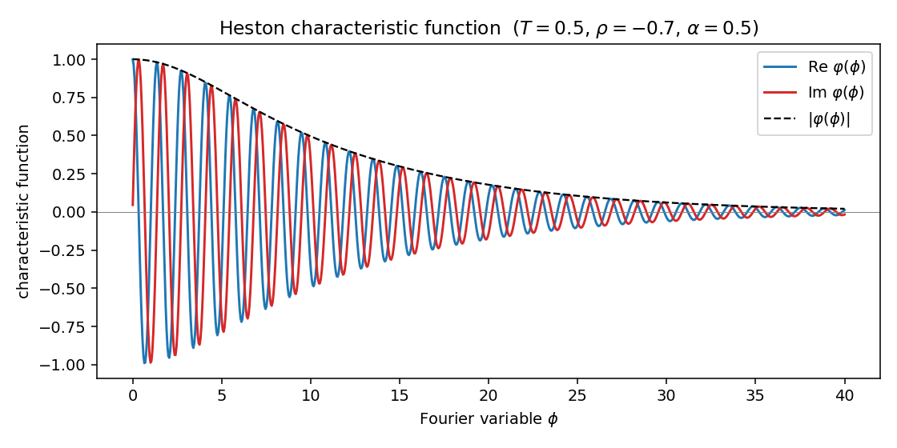
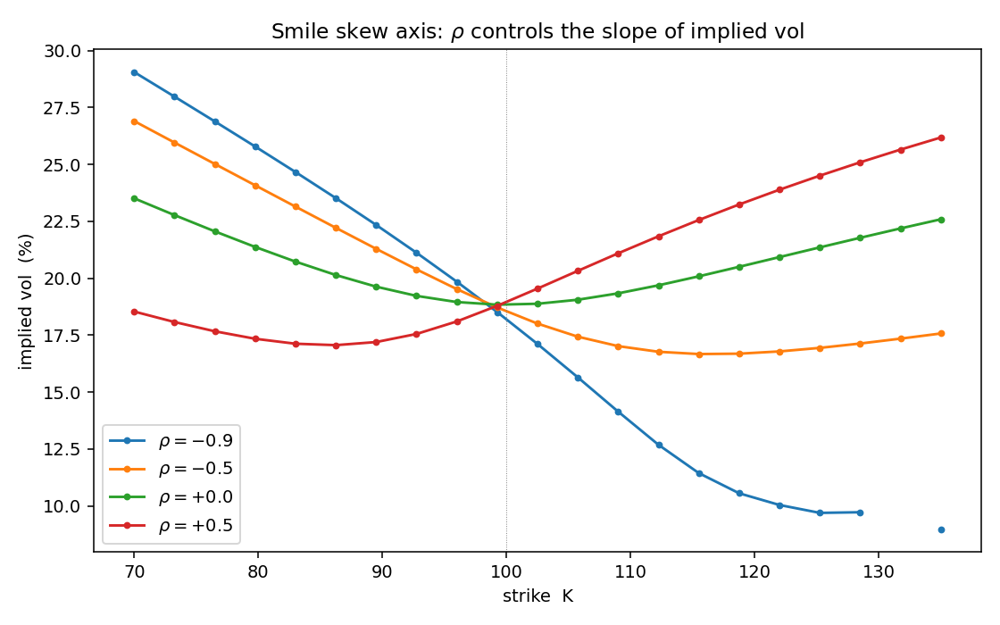
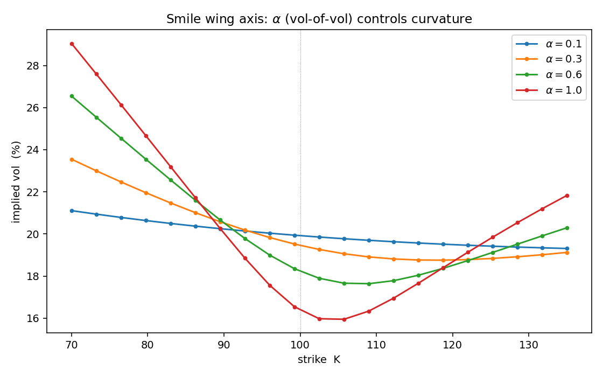

# Chapter 14 — Heston Stochastic Volatility

*Part V opens with the equity-side capstone. CH06 handed us the Black–Scholes
PDE under the assumption that instantaneous variance $\sigma^{2}$ is a known
constant; every chapter since has carried that assumption along. The market,
of course, does not. Implied-volatility surfaces slope, twist, and deform in
ways that a constant-variance GBM cannot reproduce. Heston's 1993 model is
the cleanest fix: promote the variance to its own mean-reverting stochastic
process, keep tractability by choosing a square-root (CIR) dynamics for the
variance, and pay for the extra degree of freedom with a second Brownian
motion that is correlated with the underlying. The reward is a semi-closed
pricing formula via Fourier inversion, a genuine stochastic smile, and a
hedging framework that admits volatility as a traded risk factor.*

*This chapter leans on the full Part II toolkit. Two-dimensional Itô's lemma
(CH03) is used in every derivation; multi-dimensional Girsanov (CH05) is how
we move from the physical bivariate SDE to the risk-neutral dynamics;
Feynman–Kac (CH04) underlies the Riccati ODE system for the characteristic
function; and the GBM / Black–Scholes machinery of CH06 is the benchmark we
compare against. Monte Carlo variance-reduction techniques introduced in
CH10 resurface when we discuss simulation-based Heston pricing. The chapter
is almost entirely self-contained analytically, but pedagogically it is the
payoff for Parts II and III.*

---

## Chapter map

1. **§14.1 Bivariate SDE** — motivation, specification, and what each
   parameter controls.
2. **§14.2 Feller condition** — when variance stays strictly positive.
3. **§14.3 Change of measure** — market price of variance risk, risk-neutral
   drift adjustments, uniqueness failure and calibration implications.
4. **§14.4 Implied volatility** — why constant-$\sigma$ GBM is inadequate and
   what shapes a stochastic-vol model must generate.
5. **§14.5 Characteristic function** — Riccati ODE derivation for the
   log-price characteristic function.
6. **§14.6 Fourier-inversion pricing** — recovering $P_{1}$ and $P_{2}$ and
   assembling the call price.
7. **§14.7 Greeks and calibration** — delta, vega, the two extra vol-of-vol
   and correlation sensitivities, calibration workflow.
8. **§14.8 Variance swaps** — a pure-variance product that prices by
   expectation under $\mathbb{Q}$.
9. **§14.9 Worked example** — a numerical Heston vs. Black–Scholes
   comparison.
10. **§14.10–§14.10C Limitations, comparisons, extensions, and summary.**
11. **§14.11 Key takeaways** and **Appendix A** (reference formulas) plus
    **Appendix B** (intuition checklist).

---

## 14.1 Bivariate SDE — motivation

The Black–Scholes world is complete: a constant volatility $\sigma$ plus the
bank account span every contingent claim. Empirically, option markets
violate this — implied vol exhibits a smile / skew across strike and a term
structure across maturity. The Heston (1993) model is the canonical fix:
promote the variance $v_t$ to its own mean-reverting square-root SDE,
correlate it with the spot, and retain semi-closed-form pricing via a
characteristic function. This chapter rebuilds the derivation from first
principles — bivariate SDE → Feller condition → change of measure with
market price of variance risk → characteristic-function ansatz → Riccati
ODEs → Fourier-inversion pricing (the $P_1, P_2$ probabilities) — and
finishes with calibration / Greeks notes and variance swaps.

To understand why Heston matters so deeply in modern quantitative finance,
you must first understand why practitioners spent the better part of two
decades trying to fix Black–Scholes before settling on stochastic
volatility. The 1987 crash was the watershed moment: in the space of a
single trading session, the S&P 500 dropped more than twenty percent, and
the implied volatility of out-of-the-money puts — already slightly elevated
relative to at-the-money — exploded upward and never came back down. Before
the crash, equity implied-vol surfaces were reasonably flat; after, they
developed the persistent left skew that defines them to this day. The
market learned, in a matter of hours, that tail risk was systematically
underpriced, and the institutional memory of that lesson has kept OTM puts
bid ever since. Black–Scholes, with its single-$\sigma$ assumption, was
suddenly seen to be systematically wrong in a way that could not be papered
over with small parameter tweaks. A new framework was needed.

The options industry responded with a cascade of models. Dupire's local
volatility (1994) provided an exact fit to any arbitrage-free implied-vol
surface by allowing $\sigma$ to be a deterministic function of spot and
time — $\sigma(S, t)$. This solved the pricing problem for vanillas but
failed catastrophically on forward-smile dynamics: the forward smile
predicted by local vol flattens unrealistically with horizon, which makes
it a poor model for path-dependent exotics like cliquets, forward-starts,
and variance contracts. Heston (1993) took a different route: instead of
making volatility a deterministic function of state, make it an independent
stochastic process with its own SDE. The result is richer dynamics,
realistic forward smiles, and — crucially — a tractable characteristic
function via the affine structure. Later, SABR (Hagan et al.\ 2002) offered
a different stochastic-vol parameterisation optimised for interest-rate
vol; Bates (1996) added jumps; Heston-with-time-dependent-parameters
extended the basic model to the full term structure; and more recently,
rough volatility (Gatheral–Jaisson–Rosenbaum 2014) showed that Heston's
Markovian-diffusion assumption itself is too smooth compared to realised
vol, pointing toward fractional Brownian motion as the correct driving
noise. Heston sits at the centre of this timeline — the first tractable
stochastic-vol model, still the industry default for many applications,
and a pedagogical gateway to the richer models that succeeded it.

Before any mathematics, it is worth pausing on what the word "volatility"
even means in a Black–Scholes context. In that framework $\sigma$ is a
single scalar, a number, fed once into the pricing formula and never
revisited. The pricing engine does not care which option you are valuing:
the same $\sigma$ governs the one-week at-the-money call, the six-month
deep out-of-the-money put, and every contract in between. When traders
invert Black–Scholes against actual market prices, however, they discover
that no single $\sigma$ fits the whole board. An at-the-money three-month
option might imply 18%, while a three-month put struck twenty percent
below spot implies 26%, and a call struck twenty percent above spot
implies 16%. There is no arithmetic error at work; the implied vol surface
is simply not flat. That surface has a shape — a smile, a skew, a term
structure — and the shape is persistent, economically meaningful, and
structurally incompatible with Black–Scholes' single-number world.

The economic content of that surface shape is what makes stochastic
volatility models necessary. Consider what it means for an OTM put to
trade at 26% implied vol while the ATM option trades at 18%. Interpreting
both through Black–Scholes, the market is quoting two different
"volatilities" for the same underlying. Of course the underlying has only
one realised volatility path, so what the market is really telling you is
that Black–Scholes is the wrong pricing lens and the extra premium on the
OTM put encodes information that Black–Scholes cannot represent. The most
important piece of that information is the joint behaviour of spot and
vol: when markets crash, vol spikes, which makes OTM puts pay off on two
fronts simultaneously. The 8-point spread between 26% and 18% implied vol
is the market's measured compensation for the joint-distribution risk
that Black–Scholes ignores. To price that spread correctly, you need a
model in which vol itself is stochastic and correlated with spot. That is
exactly what Heston delivers.

The persistence of the smile deserves attention too. If the smile were a
short-term arbitrage opportunity, sophisticated traders would arbitrage
it away within days. Instead, the smile has persisted for nearly four
decades, through multiple volatility regimes, Fed tightening cycles,
recessions, and policy shocks. The only reasonable conclusion is that the
smile represents a genuine risk premium — the compensation demanded by
option sellers for accepting tail risk — and that premium is not going
away because the underlying risk is real and ongoing. Any model that
hopes to price or hedge options meaningfully must therefore reproduce
this premium structurally. Heston does it via the interaction of $\rho$
(spot-vol correlation) and $\alpha$ (vol-of-vol), and the calibration of
those parameters tells you, quantitatively, how much tail risk the market
is currently pricing in.

### 14.1.1 Why stochastic vol produces a smile

A Black–Scholes lognormal has a single scale parameter $\sigma$: the
risk-neutral density of $\ln X_T$ is a tidy Gaussian with one variance.
Under Heston the conditional density (conditioning on the whole path of
$v_t$) is still lognormal — but the mixture over the $v$-path puts weight
on very quiet and very loud regimes, producing fatter tails than a single
lognormal. Fatter tails → deep OTM options are worth more than BS would
suggest → inverted BS gives higher implied vols at the wings. The
non-zero $\rho$ then asymmetrises that mixture: when spot falls, the vol
tends to spike (for $\rho<0$), which loads the left tail more than the
right. This is the skew. In short: $\alpha$ (vol-of-vol) controls the
wings (curvature / smile); $\rho$ controls the slope (skew); $\kappa$
controls how quickly the term-structure of smile flattens; $\theta$
anchors long-dated ATM; $v_0$ anchors short-dated ATM.

The "mixture of lognormals" intuition deserves a worked example. Suppose
we toss a fair coin once. On heads, the stock trades with $\sigma = 10\%$
for six months; on tails, with $\sigma = 40\%$ for six months. Each regime
is Black–Scholes-lognormal, but the mixture — the density you see before
the coin is tossed — is bimodal-ish, with a narrow peak from the 10%
regime and a wide bell from the 40% regime. The wide-regime contribution
dominates at large deviations, making the mixture fatter-tailed than
either component alone. If you now compute European option prices off
this mixture and invert them through Black–Scholes, you get implied vols
that rise as you move away from at-the-money — the wings of the mixture
are fatter than any single lognormal, so the BS-inversion has to fatten
$\sigma$ to match. That is a smile, generated by mixing just two regimes.
Heston does the same thing, but with a continuum of regimes indexed by the
path of $v_t$, and with a structurally motivated way of weighting those
regimes via the CIR variance dynamics.

A second useful analogy: think of Heston as Black–Scholes with a
stochastic "volatility dial" that the market can turn. At each instant,
the dial has a setting $v_t$; the spot evolves with that instantaneous
variance; and simultaneously the dial itself wiggles randomly,
mean-reverts toward a target level, and is mechanically coupled to the
spot. The market's expectation of option payoffs is then the average over
all possible dial trajectories. The Black–Scholes world is the special
case where the dial is welded at a single setting — no fluctuation, no
mean reversion, no coupling. Heston admits a family of dial trajectories,
and the parameters $(\kappa, \theta, \alpha, \rho, v_0)$ shape that
family. The richness of the smile follows directly.

A helpful mental picture is this. Imagine you could not observe spot
directly but could only see a noisy thermometer attached to it — one
whose reading fluctuated, drifted, and occasionally spiked or collapsed.
Black–Scholes says the thermometer is broken and always reads the same
number; Heston says the thermometer is itself a dynamic object with its
own inertia, its own overshoot, its own long-run comfort zone, and a
tendency to rise when the patient's temperature falls. The market,
watching the thermometer, prices options as if they pay off on the joint
behaviour of patient and thermometer. The richness of the implied vol
surface is what the market reveals about the joint dynamics it expects.

One useful way to sharpen this picture is to think about what it would
take to "hedge the thermometer" in a Heston world. In Black–Scholes, the
broken thermometer means you only need to hedge the patient — the spot —
and a single delta hedge leaves you perfectly replicated. In Heston, the
thermometer moves independently, so you must hedge both the spot and the
variance exposure. But here is the twist: you cannot trade instantaneous
variance directly. There is no exchange-listed "variance contract" that
pays off on $v_t$ alone. The closest instruments are variance swaps
(which pay on realised variance over a window, not instantaneous
variance) and liquid options themselves. So the practitioner must hedge
variance exposure using other options — typically ATM options with the
same or nearby maturities — because those are the most sensitive to
$v_t$. This is why vega hedging in a Heston world is called "vol hedging
with options," and why exotic desks carry complicated option inventories
to neutralise their vol exposures. The incomplete-market structure of
Heston is not an abstract theorem; it translates directly into the
messiness of real-world vol hedging.

A final framing that proves useful in practice is thinking of Heston as a
two-factor model where one factor (spot) is observed and tradable and the
other (variance) is partially observed and only indirectly tradable.
Variance is "observed" in the sense that a long record of high-frequency
returns gives you a noisy estimate of current instantaneous variance. It
is "not directly observed" in that you cannot read $v_t$ off a screen —
you have to estimate it. The natural estimator is a rolling quadratic
variation of intraday log-returns, and good estimators can achieve
remarkable precision over short windows (think days, not weeks). But the
estimator has a lag, it has measurement noise, and it is subject to its
own model assumptions (e.g.\ about intraday seasonality, overnight gaps,
and jump activity). The upshot is that the Heston state $(F_t, v_t)$ is
only partially observable, and any honest implementation has to deal with
the resulting filtering problem — usually by treating $v_0$ as an extra
calibration parameter that is fit from options rather than from
time-series data.

The chapter is organised to follow the natural arc from intuition to
machinery to payoff. We begin by writing down the bivariate SDE and
unpacking what each parameter does physically. We pause at the Feller
condition because it controls whether the variance process is well-posed,
and because in practice it is the first diagnostic any calibrator checks.
We then execute the change of measure, being careful about the market
price of variance risk, because risk-neutral pricing in an incomplete
market is not automatic — we must choose a measure rather than simply
derive one. The characteristic function drops out of an affine ansatz and
a pair of Riccati ODEs. Fourier inversion delivers the call price as two
Black–Scholes-like probabilities. The chapter closes with calibration
practice, Greeks in the Heston sense, variance swaps, and a worked
numerical example.

One last framing before we dive in. You should read the derivation that
follows as a case study in affine modelling — the broad family of models
where drift and diffusion covariance are affine in the state. Affine
models have an astonishingly clean mathematical structure: their
characteristic functions solve finite-dimensional ODE systems regardless
of state-space dimension, which makes them computationally tractable even
when the state is high-dimensional. Heston is the two-dimensional,
continuous-state archetype; the same techniques extend to multi-factor
short-rate models (Cox–Ingersoll–Ross, affine term-structure models —
see CH12), to jump-diffusions (Duffie–Pan–Singleton, Bates), and to
credit models (CIR-style intensity processes). Mastering the Heston
derivation therefore teaches you not just how to price Heston options,
but how to exploit affine structure generally — a technique that shows up
throughout modern quantitative finance. The Riccati ODEs we derive below
are the tip of a very large iceberg.

A pedagogical suggestion before proceeding. As you work through this
chapter, keep two mental images side-by-side: the pricing image (option
values derived by Fourier inversion of the Heston characteristic
function) and the dynamics image (the bivariate SDE driving spot and
variance over time). These two images correspond to the same model, but
one focuses on terminal distributions (what the option pays at maturity)
and the other focuses on paths (how the underlying gets there). Much of
the elegance of Heston — and much of the subtlety of the derivations
below — lies in the interplay between these two views. The SDE gives you
dynamics; the characteristic function gives you pricing; the Riccati ODE
system is the bridge between them, encoding the evolution of expectations
under the dynamics. When you can flip between dynamics view and pricing
view at will, you have understood Heston deeply.

Another complementary framing: Heston is a canonical example of
"structural" modelling in quantitative finance, as opposed to
"reduced-form" modelling. A structural model specifies the underlying
dynamics — here, the bivariate SDE for $(F, v)$ — and derives prices as
consequences of those dynamics. A reduced-form model specifies prices
directly as functions of observables, without necessarily committing to
a consistent underlying process. Black–Scholes is structural
(constant-vol diffusion); local vol is reduced-form (arbitrary function
$\sigma(S,t)$); Heston is structural (bivariate diffusion); SABR is
structural (different SDE); rough vol is structural (fractional SDE).
Structural models carry more theoretical weight because they respect
dynamical consistency, but reduced-form models can be more flexible in
fitting specific observables. For teaching and for deep understanding,
structural models are preferable; for production pricing at maximum
accuracy, hybrid structural/reduced-form (local-stoch-vol) is often the
right choice. Heston is the textbook structural model for stochastic vol,
and mastering it sets up the framework for everything that follows.

A final note on the organisation of what follows. Each section ends with
one or more figures that visualise the mathematical content. These
figures are not decoration; they are the most direct way to build
intuition about how parameters shape behaviour. Treat each figure as a
piece of content to be studied, not just an illustration to be glanced
at. The patterns that emerge from the figures — the smile shape, the
skew rotation, the term-structure decay — are the observable
manifestations of the parameters we calibrate. Being able to look at a
smile and estimate its Heston parameters by eye is a skill worth
developing, and the figures are where that skill is forged.

### 14.1.2 FTAP recap and incompleteness

No arbitrage $\iff$ there exists a measure $\mathbb{Q} \sim \mathbb{P}$
such that all tradeables $f_t / M_t$ are $\mathbb{Q}$-martingales. This
holds always. The measure is unique only if the market is complete; in
incomplete markets (like stochastic vol) there is no unique $\mathbb{Q}$.

This single sentence compresses two of the deepest results in
mathematical finance, so it is worth unpacking. The First Fundamental
Theorem of Asset Pricing (FTAP I) states that a financial market is
arbitrage-free if and only if there exists an equivalent martingale
measure — a probability measure $\mathbb{Q}$ that is equivalent to the
physical measure $\mathbb{P}$ (meaning they agree on which events have
probability zero) and under which every tradeable asset, once discounted
by the numeraire, follows a martingale. This is not a computational
trick; it is a statement about the structure of arbitrage. If such a
measure exists, no self-financing trading strategy can produce a riskless
profit from zero initial wealth, because under $\mathbb{Q}$ every
discounted portfolio is a martingale — its expectation is its current
value — and expectations cannot be bent upward for free. Conversely, if
no such measure exists, one can construct an explicit arbitrage. The
theorem is an iff: existence of $\mathbb{Q}$ equals absence of arbitrage.

The Second Fundamental Theorem (FTAP II) then asks whether $\mathbb{Q}$
is unique. The answer: $\mathbb{Q}$ is unique if and only if the market
is complete — meaning every contingent claim can be replicated by
dynamic trading in the underlying assets. Completeness, in turn, requires
that the number of independent risk factors equals the number of
tradeable assets minus one (accounting for the numeraire). In
Black–Scholes we have one risk factor (the Brownian motion driving spot)
and two tradeables (spot and bank), so the count matches, the market is
complete, and $\mathbb{Q}$ is unique. In Heston we have two risk factors
(the Brownian motions driving spot and variance) and still only two
tradeables, so the count is off, the market is incomplete, and
$\mathbb{Q}$ is not unique. This is the mathematical origin of the
market-price-of-variance-risk parameter that will appear shortly. It is
not a modelling artefact; it is an inescapable consequence of the
incompleteness that stochastic vol introduces. The canonical treatment
of FTAP and the Radon–Nikodym machinery that underpins it is in CH05;
in what follows we use those results without re-deriving them.

Understanding incompleteness this way helps you interpret the Heston
pricing framework correctly. We are not "deriving" the risk-neutral
measure from the physical measure; we are choosing one out of infinitely
many candidates. That choice must be pinned down by market data —
specifically, by the prices of vol-sensitive instruments like options
and variance swaps. A Heston calibration is therefore not "estimating
the true parameters" but rather "identifying which risk-neutral measure
is currently consistent with observed option prices." The physical-
measure parameters are a related but distinct set, estimated from
returns time-series, and the gap between the two parameter sets is the
variance risk premium — a systematically observed phenomenon, not a
modelling choice.

Incompleteness is the conceptual price we pay for realism. In
Black–Scholes, the single risk factor is the Brownian motion driving the
spot, and the spot is tradable; any contingent claim can be replicated
by dynamic trading in spot and bank. In Heston, there are two risk
factors — the Brownian motion driving the spot and a second Brownian
motion driving variance — but there is still only one tradable asset
(the spot or its futures contract) plus bank. The variance process is
not directly tradable; you cannot buy "instantaneous variance" on an
exchange the way you buy a stock. This rank mismatch between risk
factors and hedging instruments is precisely what makes the market
incomplete. The consequence is that many different risk-neutral measures
price the traded assets consistently, and choosing among them requires
an additional input — the market price of variance risk — which the data
must pin down.

To make this concrete, consider what "hedging" even means in an
incomplete market. In Black–Scholes, for any contingent claim $f(S_T)$,
there exists a self-financing strategy $(\Delta_t, \beta_t)$ in spot and
bank that replicates $f$ exactly at every time and in every scenario —
zero residual risk. You can therefore price $f$ by the no-arbitrage
principle: its price must equal the cost of constructing the replicating
portfolio. In Heston, no such exact replication exists using spot and
bank alone. If you run a delta-hedge based on spot only, you will be
exposed to variance innovations; your hedged portfolio will have
residual P&L proportional to the vega times the variance shock. The best
you can do with spot alone is minimise some residual-risk metric —
variance-of-P&L, say — but you cannot eliminate it. To eliminate it, you
must add another hedging instrument that is sensitive to variance —
typically another option — but then you need that option to be priced,
which requires a model, which requires a $\mathbb{Q}$, and we are back
to the choice problem.

The resolution in practice is to assume (or impose) a specific choice of
$\mathbb{Q}$, calibrate it to observed option prices (so that the
market's implied $\lambda^v$ is respected by construction), and then
perform hedging in a model-consistent way. This is called "hedging under
the calibrated measure" and it is what every vol desk does implicitly.
The hedges are not perfect — they are model hedges — and the residual
P&L reflects model risk rather than pure incompleteness-risk. But the
framework at least gives you a coherent way to think about hedging and
risk.

There is a philosophical point here that is easy to miss. In a complete
market, the "price" of a contingent claim is unambiguous — it is the
replication cost. In an incomplete market, "price" is an economic
concept, determined by demand and supply, risk preferences, and market
frictions. The model gives you a framework for representing those
ingredients compactly (via the choice of $\mathbb{Q}$), but the model
does not determine the price on its own. This is why calibration, rather
than pure derivation, is the central activity of a stochastic vol
practitioner: the prices exist because people trade, and the model is
merely the language in which those prices are expressed.

### 14.1.3 From Black–Scholes drift to the bivariate SDE

Under $\mathbb{P}$, a risky asset $X_t$ that is traded satisfies
$$
\mathrm{d}X_t = \mu_t\,\mathrm{d}t + \sigma_t\,\mathrm{d}\tilde{W}_t^{\mathbb{P}},
\qquad \frac{f_t}{M_t} = \mathbb{E}^{\mathbb{Q}}\!\left[\frac{f_T}{M_T}\right],
\tag{14.1}
$$
and the $\mathbb{P}$-Brownian motion is linked to the $\mathbb{Q}$-Brownian
motion by
$$
\mathrm{d}\tilde{W}_t = \lambda_t\,\mathrm{d}t + \mathrm{d}W_t^{\mathbb{Q}}.
\tag{14.2}
$$
Substituting,
$$
\mathrm{d}X_t = (\mu_t - \lambda_t\sigma_t)\,\mathrm{d}t + \sigma_t\,\mathrm{d}W_t^{\mathbb{Q}},
\tag{14.3}
$$
where $\lambda_t$ is the market price of risk. If $X$ is itself traded,
then under $\mathbb{Q}$ its drift must be $r X_t$, pinning down
$\mu_t - \lambda_t \sigma_t = r X_t$. This is precisely the Girsanov
shift derived in CH05 — the Radon–Nikodym density
$Z_t = \exp\!\bigl(-\int_0^t\!\lambda_s\,\mathrm{d}\tilde{W}_s^{\mathbb{P}}
- \tfrac{1}{2}\!\int_0^t\!\lambda_s^{2}\,\mathrm{d}s\bigr)$ is what
converts the $\mathbb{P}$-drift into the $\mathbb{Q}$-drift, state by
state. The reader who wants the full derivation should consult CH05 §5;
we use the conclusion here.

Read this shift intuitively. Under the physical measure $\mathbb{P}$,
the asset drifts at its expected return, which includes a risk premium
over the risk-free rate — that is how risky assets compensate their
holders for bearing risk. The change of measure does not change any
actual path; it rebalances probability weight toward the states that
have been systematically overweighted by risk aversion. Under
$\mathbb{Q}$, the asset appears to drift at $r$ because the premium has
been re-absorbed into the measure. The same logic applies — but now in
two dimensions — when we introduce stochastic variance.

Here is another way to see it. Imagine running Monte Carlo simulation of
the spot under $\mathbb{P}$ and under $\mathbb{Q}$. The individual paths
look similar — in fact, on any individual path, the realisation of the
Brownian motion is the same (Girsanov tells us that the path spaces are
essentially isomorphic). What differs is the weight that each path
carries in the expectation. Under $\mathbb{P}$, the "good" paths (with
high realised returns) have high probability; under $\mathbb{Q}$, those
good paths are weighted less because risk-averse investors have bid up
their prices (making them seem less attractive from the valuation
standpoint). The effect is that $\mathbb{Q}$-expectations come out lower
for linear payoffs on risky assets than $\mathbb{P}$-expectations, which
is exactly the "risk-free rate" drift you would expect. None of this is
about the trajectory of any particular path; it is all about the
measure.

The famous economic interpretation is in terms of pricing kernels or
stochastic discount factors. The Radon–Nikodym derivative
$\mathrm{d}\mathbb{Q}/\mathrm{d}\mathbb{P}$ is essentially proportional
to a representative investor's marginal utility — a number that is high
in bad states of the world (when investors value an extra dollar most)
and low in good states. Discounting payoffs by this kernel and taking a
$\mathbb{P}$-expectation is equivalent to taking a $\mathbb{Q}$-expectation
and discounting by the risk-free rate. Derivatives pricing in incomplete
markets is thus fundamentally linked to asset-pricing theory: different
measures correspond to different assumptions about the representative
investor's risk aversion and preferences. When you calibrate Heston to
market prices, you are implicitly inferring what marginal utility looks
like in the vol dimension — at least in the part of the state space
where liquid options exist to probe.

**Futures.** For a futures price $F_t$, the Black (1976) argument (CH08)
gives under $\mathbb{Q}$
$$
\frac{\mathrm{d}F_t}{F_t} = \sigma\,\mathrm{d}W_t^{\mathbb{Q}},
\qquad \text{(Black model for futures prices)}.
\tag{14.4}
$$
Under $\mathbb{P}$,
$$
\frac{\mathrm{d}F_t}{F_t} = \mu_t\,\mathrm{d}t + \sigma\,\mathrm{d}W_t^{\mathbb{P}}.
\tag{14.5}
$$

We work in the futures frame partly out of convenience — futures are
martingales under the risk-neutral measure with no drift to carry around
— and partly because it highlights the key point that the volatility
structure is what distinguishes Heston from Black, not the drift. The
drift in the risk-neutral world is pinned down by arbitrage; the
interesting degree of freedom is the stochastic behaviour of the
diffusion coefficient.

The practical virtue of the futures-price framework goes beyond
cleanliness. For index and equity markets, listed options actually
expire on forward-contract-settled underliers or near-dated futures; for
FX options, the relevant underlier is a forward rate; for commodity
options, the entire pricing paradigm is built on futures rather than on
any elusive "spot" price. So Black (1976) is not a toy simplification —
it is the framework that actually prices the bulk of liquid options
traded globally. Heston's original 1993 paper followed the Black
tradition (although Heston expressed things in terms of spot with carry;
the two are isomorphic), and the industry has largely standardised on
the futures-frame parameterisation. When a practitioner says
"$\mathrm{d}F/F = \sqrt{v}\,\mathrm{d}W$," they are stating the
Heston–Black benchmark dynamics that underlie essentially every vanilla
calibration you will encounter. Even when the underlying is a spot
rather than a futures, the drift term $r - q$ (rate minus dividend
yield) can be absorbed into the forward price, and the residual dynamics
look like (14.4) with no drift. In other words: by working in the
futures frame, you focus the analysis exactly on what makes Heston
different from Black–Scholes — the diffusion $\sqrt{v_t}$ — and defer
all drift-related complications to a thin wrapper around the core SDE.

### 14.1.4 The Heston bivariate system

We want to correct for stochastic volatility. Replace the constant
$\sigma$ by $\sqrt{v_t}$ and give $v_t$ its own SDE:
$$
\boxed{\;
\frac{\mathrm{d}F_t}{F_t} = \mu_t\,\mathrm{d}t + \sqrt{v_t}\,\mathrm{d}W_t^{\mathbb{P},F}
\;}
\tag{14.6}
$$
$$
\boxed{\;
\mathrm{d}v_t = \kappa^{\mathbb{P}}\!\left(\theta^{\mathbb{P}} - v_t\right)\mathrm{d}t + \alpha\sqrt{v_t}\,\mathrm{d}W_t^{\mathbb{P},v}
\;}
\tag{14.7}
$$
with
$$
\mathrm{d}W_t^{\mathbb{P},F}\cdot \mathrm{d}W_t^{\mathbb{P},v} = \rho\,\mathrm{d}t,
\qquad (W^{\mathbb{P},F}, W^{\mathbb{P},v}) \text{ correlated}.
\tag{14.8}
$$

Look carefully at the choice $\sqrt{v_t}$ for the diffusion coefficient.
It is not incidental. Modelling in the variance rather than in the
volatility pays two dividends. First, the variance is the natural
additive quantity: variances of independent returns add, volatilities do
not, and any equation that treats variance linearly will be cleaner than
the equivalent vol-level equation. Second, the square-root CIR diffusion
$\alpha\sqrt{v_t}\,\mathrm{d}W^v$ has the beautiful property that its
diffusion coefficient vanishes as $v_t \to 0$, which acts as a soft
floor: a variance that wanders toward zero stops diffusing and is pulled
back up by the mean-reversion drift. This is how Heston constructs a
process that stays non-negative under mild parameter conditions, without
resorting to reflecting barriers or hard truncations.

Contrast this with the SABR alternative. SABR models the instantaneous
vol (not variance) with lognormal dynamics:
$\mathrm{d}\sigma_t = \alpha \sigma_t\,\mathrm{d}W^\sigma$. Lognormal vol
automatically stays positive, which is appealing, but the tradeoff is
that SABR dynamics are not affine, and SABR does not admit a closed-form
characteristic function. Instead, SABR is typically priced via Hagan's
asymptotic expansion — an approximation that works brilliantly for
short maturities and ATM moneyness but degrades at wings and long dates.
Heston gives up lognormal positivity in exchange for the affine
structure, and the square-root floor on the CIR process is the
mathematical trick that makes this exchange work. Either choice is
defensible; both dominate naive alternatives like an arithmetic Brownian
motion on vol (which can go negative and cannot be rescued by any
floor).

A subtle point about (14.6): the spot is driven by
$\sqrt{v_t}\,\mathrm{d}W^F$, not by $\sqrt{v_t}\,\mathrm{d}t$ plus
$\mathrm{d}W^F$ with some scaling. The diffusion coefficient is a random
function of $v_t$, which is itself stochastic. This is what makes the
spot a "stochastic-volatility" process rather than a "time-changed"
Brownian motion. Equivalently, you can think of spot's log-returns as
Brownian motion scaled at each instant by $\sqrt{v_t}$: when $v_t$ is
high, returns are more volatile; when $v_t$ is low, returns are calmer.
The picture to keep in mind is a Brownian motion whose clock speed is
itself random, fluctuating between slow and fast phases. This is not a
metaphor — there is a formal equivalence between stochastic vol
processes and time-changed Brownian motions, where the time change is
the integrated variance. Ocone's representation of continuous local
martingales makes this precise. For our purposes, it means that many
results about Brownian motion carry over to Heston's log-price after a
random time change.

Reading off (14.7):

* $\kappa^{\mathbb{P}}$ — mean-reversion rate of variance.
* $\theta^{\mathbb{P}}$ — mean-reversion level (long-run variance).
* $\alpha$ — vol-of-vol.
* $\rho$ — spot/vol correlation (empirically negative for equity
  indices — the "leverage effect").
* The $\sqrt{v_t}$ diffusion is the CIR / square-root form: such
  processes are called Feller processes.

Each of these has an economic interpretation worth lingering over. The
mean-reversion rate $\kappa$ answers the question, "if volatility is
currently elevated, how quickly does the market expect it to return to
normal?" A large $\kappa$ corresponds to a rubber-band variance that
snaps back quickly — news-driven spikes fade within days. A small
$\kappa$ corresponds to a sticky variance that can stay elevated for
quarters or years. The long-run level $\theta$ is what volatility
reverts to — the "cruising altitude" of the market. For broad equity
indices, $\theta$ calibrated over long histories tends to land in the
territory of 20%–25% annualised vol, which is roughly the long-run
average of realised equity vol. The vol-of-vol $\alpha$ governs how
chaotic the variance itself is — whether the vol process is a gentle
drift or a ragged, spiky trajectory. It is essentially a measure of how
confident the market is in its current vol estimate; higher $\alpha$
means the market allows more probability mass on extreme vol regimes.

To calibrate these parameters against historical intuition: typical
calibrated values for a liquid equity index are
$\kappa \approx 2\text{--}6$ year$^{-1}$, giving a half-life of vol
shocks of roughly one to four months; $\theta \approx 0.04\text{--}0.06$,
corresponding to a long-run ATM vol of 20%–25%;
$\alpha \approx 0.4\text{--}1.0$, varying with market regime;
$\rho \approx -0.6$ to $-0.8$, stubbornly negative; and $v_0$ matching
whatever ATM implied vol is currently trading. These are broad ranges;
different asset classes and different volatility regimes produce quite
different calibrated values. Single-stock options typically show larger
$\alpha$ and $\theta$ than index options because single names have more
idiosyncratic vol. Sector ETFs fall in between. Currency pairs have much
smaller $\alpha$ and less negative (sometimes near-zero) $\rho$.
Commodities vary wildly by underlier; storable commodities like gold
behave more like FX, while seasonal commodities like natural gas can
exhibit seasonal patterns in $\theta$ itself.

The timescale interpretation of $\kappa$ deserves a second look. Because
$\kappa$ has units of inverse time, the product $\kappa \tau$ is a
dimensionless "time to mean revert." When $\kappa \tau \ll 1$ (short
maturity relative to mean-reversion timescale), the variance has not had
time to converge toward $\theta$, and the option's pricing is dominated
by the starting variance $v_0$. When $\kappa \tau \gg 1$ (long
maturity), the variance has relaxed to its long-run mean $\theta$, and
the option's pricing is dominated by $\theta$ rather than $v_0$. The
crossover between these two regimes happens around
$\kappa \tau \approx 1$, which for $\kappa = 2$ is roughly six months.
This is why short-dated and long-dated options carry quite different
parameter-sensitivity fingerprints: short-dated options are sensitive
to $v_0$ and $\alpha$; long-dated options are sensitive to $\theta$ and
$\kappa$. A good calibration uses this structural difference to separate
the parameters cleanly.

The correlation $\rho$ is perhaps the most interesting parameter. For
equity indices it is strongly negative — typically in the range $-0.6$
to $-0.8$ after calibration — because of what practitioners call the
leverage effect: as the stock price falls, the debt-to-equity ratio of
the underlying firm rises mechanically, making the equity more levered
and therefore more volatile. There is also a behavioural layer: falling
markets trigger risk-off flows, forced deleveraging, and volatility
spikes independent of any firm-level balance sheet. The result is that
equity vol and equity spot move in opposite directions with remarkable
consistency. This negative correlation is the engine that drives the
equity smile's downward skew: puts become more valuable because the
market attaches probability to the joint event of a falling price and
rising vol, which is precisely the tail that out-of-the-money puts pay
off on.

To understand the leverage effect quantitatively, consider a simple
capital structure. A firm has assets with value $V$, debt with face
value $D$, and equity with value $E = V - D$. The equity volatility is
approximately $\sigma_E \approx \sigma_V \cdot V / E = \sigma_V \cdot
(1 + D/E)$, where $D/E$ is the debt-to-equity ratio and $\sigma_V$ is
the asset-value volatility. If equity falls by 20%, then (holding debt
roughly constant) $D/E$ rises by a factor of $V/E$ minus one — which
for a moderately leveraged firm could be 15% or more. That percentage
rise in debt-to-equity translates directly into a rise in equity
volatility. For the S&P 500 index, which aggregates hundreds of firms
with heterogeneous leverage, the effect is diluted but still real.
Empirically the leverage channel accounts for perhaps 10–20% of
observed negative $\rho$; the rest is driven by risk aversion,
volatility contagion, and forced deleveraging.

The behavioural and institutional mechanisms are probably more important
in practice. Risk managers across the industry run VaR-based limits
(CH09); when vol rises, VaR rises, and limits are breached; breached
limits force position cuts, which drive spot down; falling spot produces
more vol, which produces more VaR breaches, and a feedback loop
develops. This mechanism is the engine of volatility clustering — vol
begets more vol — and it manifests as a highly negative $\rho$ in
stochastic vol models. There is also a purely psychological layer:
traders fear losses more than they value gains (prospect theory), so
they demand higher implied vols for OTM puts even absent any
leverage-induced physical channel. All of these effects sum into the
single observed $\rho \approx -0.7$ that calibrators typically report.

Interestingly, $\rho$ is the most stable calibrated parameter across
time. If you calibrate Heston daily to SPX over a long history, you
will find that $(\kappa, \theta, \alpha, v_0)$ wander quite a bit as the
vol regime changes, but $\rho$ sits in a narrow band around $-0.7$ with
surprisingly low variance. This structural stability reflects the deep
economic persistence of the leverage effect: the mechanisms that make
spot and vol negatively correlated do not go away, even as the magnitude
of vol itself varies. For this reason, some practitioners anchor $\rho$
to a fixed value during calibration and only fit the other four
parameters. This imposes discipline on the optimiser and rules out
spurious local minima with wrong-signed $\rho$.

For other asset classes, $\rho$ tells different stories. In some
commodity markets — particularly those with tight physical supply,
such as natural gas in winter or crude oil during geopolitical tension
— $\rho$ can be positive: rising prices signal scarcity and volatility
together, so the smile tilts the other way. In foreign exchange, $\rho$
is often close to zero or modest in magnitude, reflecting the relatively
symmetric nature of currency pair dynamics. This is not a detail; it
means the Heston parameters are not universal constants, they must be
calibrated per asset and per regime.

A few representative examples help build intuition. In FX, USD/JPY
tends to show a slightly negative $\rho$ — the yen strengthens (USD/JPY
falls) during risk-off episodes, which often coincide with vol spikes —
but the magnitude is modest, perhaps $-0.2$. EUR/USD tends toward
$\rho \approx 0$ during normal times but swings wildly during crises
when cross-asset correlations realign. GBP/USD exhibits Brexit-era
shocks that briefly pushed $\rho$ strongly negative. In rates, SOFR or
Treasury yield vol is often priced with near-zero $\rho$ in normal
regimes but with strongly positive $\rho$ in inflation-fear regimes
(rising rates produce rising rate-vol). In equities, the single-stock
vs index distinction matters: an individual high-beta tech stock might
show $\rho \approx -0.5$ to $-0.7$, while an index like SPX averages
across many names and ends up closer to $-0.75$. These patterns are not
random; they reflect the underlying economic dynamics of each asset
class.

It is worth stating explicitly that Heston's five-parameter structure
imposes a functional form on the smile. The model cannot represent
every conceivable smile shape. In particular, Heston smiles are
monotonic in convexity as you move away from the skew — you cannot
construct a Heston smile with a "W" shape, with two local minima or a
kink at some particular moneyness. Real smiles occasionally show such
features, especially at short maturities where event risk creates
localised anomalies. When they do, Heston simply cannot fit them, and
the calibrator will produce a best-fit smile that smooths over the
irregularities. This is a structural limitation, not a bug, and it
points toward the richer model families (local-stoch vol, jump
processes, rough vol) needed to capture the full richness of observed
smiles.

---

## 14.2 Feller condition

The variance process (14.7) can hit zero. For $v_t$ to be strictly
positive (i.e.\ to avoid hitting zero and getting stuck / reflecting) we
need
$$
\boxed{\; 2\,\kappa^{\mathbb{P}}\,\theta^{\mathbb{P}} \;\ge\; \alpha^2 \;}
\tag{14.9}
$$
the Feller condition. Intuition: $2\kappa\theta$ is twice the pull back
toward the mean at the origin (the drift at $v=0$ is $\kappa\theta$),
while $\alpha^2$ is the diffusion push that drives $v$ around. When the
pull dominates, the origin is an entrance-only boundary and $v_t$ is
$>0$ almost surely. When the push dominates, $v_t$ can touch zero (and
in continuous time will, repeatedly). In practice calibrated equity
parameters often violate it mildly; simulation schemes then use
full-truncation (take $v^+ = \max(v,0)$ in the diffusion coefficient)
or reflection. Closed-form pricing is unaffected — the characteristic
function is analytic in the parameters regardless of Feller.

Think of the Feller condition as a tug-of-war between two forces at the
origin. On one side, the mean-reversion drift $\kappa(\theta - v)$
evaluated at $v = 0$ equals $\kappa\theta$, a strictly positive pull
away from the boundary. On the other side, the volatility of variance
$\alpha^2$ represents the intensity with which random fluctuations can
knock the process around. If the pull is strong enough — specifically,
at least half the kick — the process never reaches the boundary. If it
is weaker, the boundary is attainable and the process spends
infinitesimal but non-zero time there. In continuous time this subtlety
matters because any time the variance touches zero, the local dynamics
degenerate: the diffusion term vanishes, leaving only the drift, which
then pushes the process back into the interior. This is not a
catastrophe — the process is still well-defined and has a proper
distribution — but it causes havoc for naive discretisation schemes.

The origin of the Feller condition is in the theory of one-dimensional
diffusions on a half-line. Feller classified boundary points for such
diffusions into four categories: natural (unattainable, the process
does not reach it in finite time), entrance (reachable from outside but
not from inside), exit (reachable from inside but absorbing), and
regular (reachable in both directions). For the CIR process, the origin
is entrance if $2\kappa\theta \ge \alpha^2$, regular if
$2\kappa\theta < \alpha^2$. An entrance boundary means the process
started at the boundary can move into the interior, but a process
started in the interior never reaches the boundary. A regular boundary
means the process reaches it, and you must specify what happens there
— reflect back into the interior, or absorb. For the Heston variance,
we want the process to stay non-negative and continue, so reflection is
the natural choice when Feller is violated.

A calculable consequence of Feller violation: the stationary density of
$v_t$ becomes unbounded at zero. Specifically, the CIR process has a
gamma-distributed stationary density
$v_\infty \sim \Gamma(2\kappa\theta/\alpha^2, \alpha^2/(2\kappa))$. When
$2\kappa\theta \ge \alpha^2$ (Feller satisfied), the shape parameter is
$\ge 1$ and the density is bounded near zero. When
$2\kappa\theta < \alpha^2$ (violated), the shape parameter is $< 1$ and
the density diverges at zero like $v^{2\kappa\theta/\alpha^2 - 1}$. The
divergence is integrable — the overall probability is still one — but
it means the process spends substantial time near zero, and any
numerical scheme that evaluates $\sqrt{v}$ needs to handle this
carefully. In practice, Feller-violated Heston calibrations produce a
variance process that dips down to tiny positive values often, a
signature that shows up clearly in Monte Carlo simulation.

A further remark on the non-tradability of the variance. The Feller
condition applies to both the $\mathbb{P}$-dynamics and the
$\mathbb{Q}$-dynamics of variance, but with different parameter values
in general (because $\lambda^v$ shifts $\kappa$ and $\theta$ between
the two measures). It is possible for the $\mathbb{P}$-dynamics to
satisfy Feller while the $\mathbb{Q}$-dynamics violate it, or vice
versa. This can create puzzling situations where the "same" variance
process seems to have different boundary behaviour under different
measures. The resolution: the boundary classification is a property of
the SDE coefficients, and different SDEs — even two that describe the
"same" process under different measures — can have different
classifications. For pricing we care only about the $\mathbb{Q}$-dynamics
and their Feller status; for physical interpretation and historical
time-series estimation we care about the $\mathbb{P}$-dynamics.

The practical consequence is subtle but important. If you calibrate
Heston to an equity smile, you will typically find parameters that
violate Feller by a small amount. This is not a pathology of your
calibration; it is what the market is telling you. The market demands
more wing richness than a Feller-compliant Heston can produce with
reasonable $(\kappa,\theta)$, so the calibrator cranks up $\alpha$ to
get the curvature right and pushes the system across the Feller
boundary. The closed-form characteristic function does not mind: the
Riccati integration produces a valid complex-analytic function of
$\phi$ regardless. What does mind is your Monte Carlo scheme. A naive
Euler step on (14.7) will occasionally produce $v_{n+1} < 0$, at which
point $\sqrt{v_{n+1}}$ is imaginary and the next step blows up. The
standard fix is full-truncation: clamp the variance at zero whenever it
tries to go negative, use the clamped value in the diffusion
coefficient, and let the mean-reversion drift (which remains
$\kappa\theta$ at zero) bring it back. Reflection — absolute value
rather than truncation — is another common choice. Exact simulation via
the non-central chi-squared transition density is the gold standard
but is computationally more expensive.

The hierarchy of Heston simulation schemes is worth cataloguing
explicitly because the quality of your Monte Carlo output depends
directly on the scheme you pick. From fastest and crudest to slowest
and most accurate:

First, Euler with absolute-value correction. Simple, fast, badly
biased. The bias comes from treating negative $v$ values as their
absolute value rather than zero, which artificially inflates the
diffusion contribution near the boundary. Not recommended for
production use, although still common in academic papers for historical
reasons.

Second, Euler with full truncation (Lord, Koekkoek, Van Dijk, 2010).
Slightly more biased at the boundary than reflection in theory, but
simpler to analyse and typically preferred in practice. Clamp $v$ at
zero in the diffusion coefficient; let the drift carry you back. The
bias decays linearly in $\Delta t$, and for $\Delta t = 1/252$ (daily)
the bias on ATM options is typically under 0.5%.

Third, the Quadratic-Exponential (QE) scheme of Leif Andersen (2007).
The workhorse production scheme. QE exploits the fact that the CIR
transition density is non-central chi-squared, and approximates it by
either a quadratic function of a normal (for large variance) or a
mixture with a point mass at zero (for small variance). Biased, but the
bias is much smaller than Euler. The QE scheme is roughly 2–3× slower
than Euler per step but often 10× more accurate, so net it is a win.
Andersen's paper also contains a "QE martingale correction" that fixes
an additional bias in the coupled spot-variance simulation; this is
worth implementing if you care about bias below a few basis points.

Fourth, exact simulation (Broadie–Kaya, 2006). Uses the known
transition density of the CIR process (non-central chi-squared) and a
conditional-on-variance treatment of the spot. Zero bias but expensive:
each time step requires drawing from a non-central chi-squared, which
typically involves an inverse-CDF evaluation that is itself an
iterative procedure. For benchmarking Heston prices when you absolutely
need to pin down the answer, this is the gold standard. For routine
pricing it is overkill.

A fifth approach, often underappreciated, is not to Monte Carlo at all
— use the closed-form Heston call price for European options and lean
on variance-reduction for exotics. The Fourier method gives you the
full distribution of $X_T$ via the characteristic function, and from
there you can integrate any European payoff without simulating a
single path. For American and path-dependent payoffs Monte Carlo is
unavoidable, but for vanillas the Fourier route is strictly better.
CH10 developed the variance-reduction toolkit (antithetic variates,
control variates, stratified sampling) that is standardly applied when
one does Monte-Carlo a Heston path engine; we invoke those techniques
here rather than re-deriving them.

*Feller boundary $\alpha = \sqrt{2\kappa\theta}$ for four different
long-run variance levels. Below each curve the condition
$2\kappa\theta \ge \alpha^2$ holds and $v_t > 0$ almost surely; above
it $v_t$ can touch zero and a full-truncation / reflection scheme is
needed in Monte Carlo. The SPX-like calibrated point
$(\kappa=2,\alpha=0.5,\theta=0.04)$ sits just above its $\theta=0.04$
curve — a textbook mild violation.*

The takeaway from the figure: real calibrations live close to the
Feller boundary rather than comfortably below it. A rough rule of thumb
is that if your calibrated $\alpha$ is smaller than about $0.3$, you
are likely Feller-safe for reasonable $(\kappa,\theta)$; if it climbs
above $0.5$, you are almost certainly violating. That does not
invalidate the calibration; it is simply a trigger to be disciplined
about the simulation scheme and, if the violation is severe, to
question whether the smile you are fitting is really a smile or whether
it contains short-dated features (jumps, idiosyncratic ATM
dislocations) that Heston structurally cannot capture.

There is one more practical diagnostic to keep in mind. Heston
sometimes produces calibrated parameters that are very near the Feller
boundary but on the "safe" side, with $\alpha$ artificially constrained
during optimisation to satisfy the condition. If your optimiser imposes
Feller as a hard constraint and the unconstrained optimum would have
wanted to exceed it, you will see the constraint binding at the
calibrated solution — $\alpha^2 = 2\kappa\theta$ exactly. This
typically degrades the fit quality (residual sum of squares is larger
than it needs to be) and suggests that Heston's structure is simply
too restrictive for the surface you are fitting. The correct response
is usually to drop the Feller constraint, accept the violation, and
use a careful simulation scheme. Enforcing Feller purely for
simulation-convenience reasons, at the cost of market-fit quality, is
rarely worthwhile.

A philosophical note. Feller is a mathematical condition on
continuous-time dynamics. Real markets are discrete-time — quotes
update in milliseconds, trades in fractions of seconds — and the
continuous-time idealisation is a useful fiction. In a truly
discrete-time world, variance is always non-negative by definition (it
is a sum of squared increments), and the Feller condition is
essentially moot. The only reason we care about Feller is that we are
using a continuous-time SDE as a pricing model, and the SDE has to be
well-posed for the pricing mathematics to make sense. So when you see
a calibrated Feller-violating Heston, do not be alarmed by the nominal
violation — the real underlying process is still well-behaved. The
violation is a property of the mathematical idealisation, not of the
market itself.

---

## 14.3 Change of measure — market price of variance risk

Going from $\mathbb{P}$ to $\mathbb{Q}$, (14.6) loses its drift (futures
are martingales),
$$
\frac{\mathrm{d}F_t}{F_t} = \sqrt{v_t}\,\mathrm{d}W_t^{F},
\qquad \text{corr.\ }(\rho).
\tag{14.10}
$$
For the variance, write the Girsanov shift — the multi-dimensional
version derived in CH05 §5.4, specialised here to two correlated
Brownian motions:
$$
\mathrm{d}W_t^{F} = \frac{\mu_t}{\sqrt{v_t}}\,\mathrm{d}t + \mathrm{d}W_t^{\mathbb{P},F},
\qquad
\mathrm{d}W_t^{v} = \lambda_t^{v}\,\mathrm{d}t + \mathrm{d}W_t^{\mathbb{P},v}.
\tag{14.11}
$$
Then the $\mathbb{Q}$-dynamics of variance become
$$
\mathrm{d}v_t = \Big(\kappa^{\mathbb{P}}(\theta^{\mathbb{P}} - v_t) \;-\; \alpha\,\lambda_t^{v}\sqrt{v_t}\Big)\mathrm{d}t \;+\; \alpha\sqrt{v_t}\,\mathrm{d}W_t^{v},
\tag{14.12}
$$
with $\lambda_t^{v}$ the market price of variance (vol) risk. Note that
the two-dimensional Girsanov we are using is the vector-valued version:
we apply independent density processes to two correlated Brownian
motions by first rotating into an independent pair via Cholesky,
shifting each, and rotating back. The net effect on the correlated
pair $(W^F, W^v)$ is recorded in (14.11); the correlation $\rho$ is
preserved by the change of measure, as the Girsanov shift is a pure
drift adjustment and does not affect the quadratic covariation.

Here is the crucial point. The drift of variance under $\mathbb{P}$ is
whatever we think it is empirically — it reflects the long-run mean of
realised variance, the speed at which variance reverts after shocks,
and so on. But for option pricing, we do not price under $\mathbb{P}$;
we price under $\mathbb{Q}$. And $\mathbb{Q}$ attaches a different drift
to the variance process, because market participants demand (or offer)
a premium for bearing variance risk. Empirically, buyers of variance —
people long volatility through options or variance swaps — pay a
premium on average, meaning realised variance comes in lower than
implied variance on average. This is the variance risk premium, and
it is captured in the model by $\lambda^v$. A negative $\lambda^v$ for
equity markets would reflect the fact that long-vol positions earn a
negative premium — they are hedges, and hedges cost something. The
variance risk premium is persistent, documented over long samples,
and is arguably the single most important empirical feature driving
the wedge between historical and implied vol.

To put numbers on this: over long samples of SPX options, the average
difference between implied variance (VIX$^2$-scaled) and subsequently
realised variance is about 3–5 percentage points in annualised-vol
units. In other words, if VIX is 20, realised vol over the next 30
days averages about 17. Variance-swap investors — the sellers of
variance — earn this 3–5 point wedge on average, net of trading
costs, and this is the explicit compensation for bearing tail-risk
exposure. (The wedge is not risk-free, obviously; it can invert during
crises, and the shorts can take large losses. Long-vol positions are
attractive when vol spikes, which is exactly the "tail hedge" use
case that dominates quant-institutional flows.) When we write Heston
with a specific $\lambda^v$, we are implicitly asserting a particular
functional form for this premium — one that is compatible with the
CIR dynamics. Different asset classes and different regimes have
different premium structures; Heston's affine-preserving choices
capture the main cases cleanly.

A pedagogical note on terminology. The "market price of variance
risk" is sometimes written $\lambda^v$ and sometimes with other
symbols; the economic quantity it represents is the Sharpe-ratio-like
premium demanded per unit of variance-factor exposure. If the variance
risk is priced (i.e.\ $\lambda^v \ne 0$), then the $\mathbb{Q}$-
dynamics of $v$ differ from the $\mathbb{P}$-dynamics, which means the
risk-neutral expected path of variance differs from the physical
expected path. Practitioners often summarise this by saying "implied
vol is higher than expected realised vol on average, by the variance
risk premium." That one sentence captures essentially the entire
economics of the $\lambda^v$ parameter.

Two natural choices keep the SDE affine (preserving Heston form):

**Choice 1.** $\lambda_t^{v} = c\sqrt{v_t}$. Then
$$
\lambda_t^{v}\cdot\alpha\sqrt{v_t} = \alpha c\,v_t,
$$
so the drift becomes
$$
\kappa^{\mathbb{P}}\theta^{\mathbb{P}} - (\kappa^{\mathbb{P}} + \alpha c)\,v_t
= \kappa\!\left(\frac{\kappa^{\mathbb{P}}\theta^{\mathbb{P}}}{\kappa} - v_t\right),
\tag{14.13}
$$
with $\kappa = \kappa^{\mathbb{P}} + \alpha c$ and
$\theta = \kappa^{\mathbb{P}}\theta^{\mathbb{P}}/\kappa$.

**Choice 2.** $\lambda_t^{v} = \dfrac{\ell}{\sqrt{v_t}} + c\sqrt{v_t}$.
Then
$$
\lambda_t^{v}\cdot\alpha\sqrt{v_t} = \alpha\ell + \alpha c\,v_t,
$$
so both level and slope of the mean-reversion shift:
$\kappa = \kappa^{\mathbb{P}} + \alpha c$ and
$\theta = (\kappa^{\mathbb{P}}\theta^{\mathbb{P}} - \alpha\ell)/\kappa$.

Notice what (14.13) achieves: the shape of the variance SDE under
$\mathbb{Q}$ is algebraically identical to its shape under $\mathbb{P}$
— the same $\kappa(\theta - v)\,\mathrm{d}t + \alpha\sqrt{v}\,\mathrm{d}W$
form — with $(\kappa, \theta)$ reshuffled. This is why Heston is so
clean. A wrong choice of $\lambda^v$ (say, a constant $\lambda$) would
break the affine structure: the change of measure would contribute
$\alpha\lambda\sqrt{v}$ to the drift, which is not linear in $v$, and
the Riccati tractability would collapse. The two "affine-preserving"
choices above are the ones that respect Heston's algebraic skeleton,
and they cover the usual practitioner parametrisations.

This is a subtle but deep point. In most finance contexts, the choice
of $\lambda^v$ is driven by economic or statistical arguments: we want
the risk-neutral measure that best fits observed data, or that has
some desired theoretical property. In Heston, there is an additional
computational constraint: only certain functional forms of $\lambda^v$
preserve the affine structure, and only affine structure gives us the
closed-form characteristic function. If we chose a $\lambda^v$ that
broke affine-ness, the Riccati ODEs would become general nonlinear
ODEs (without closed form), the characteristic function would require
numerical PDE solving at every evaluation, and the computational cost
of Heston pricing would increase by two or three orders of magnitude.
For this reason, the affine-preserving $\lambda^v$ choices are not
just theoretically elegant — they are computationally essential. They
are the reason we can calibrate Heston to a full vol surface in
seconds rather than hours.

Another way to see this: the "Heston model under $\mathbb{Q}$" and
the "Heston model under $\mathbb{P}$" are two instances of the same
algebraic family, parameterised differently. Pricing derivatives uses
the $\mathbb{Q}$-instance; estimating historical dynamics uses the
$\mathbb{P}$-instance; the affine-preserving change-of-measure
provides the bridge between them. If you wanted to do joint
estimation — fitting both physical time-series data and risk-neutral
option data simultaneously — you would use this bridge to write down
the joint likelihood, with $\lambda^v$ as the parameter linking the
two. Some sophisticated calibration frameworks do exactly this,
treating the variance risk premium as a directly estimable parameter.
Most practitioner implementations, however, calibrate under
$\mathbb{Q}$ only and infer the risk premium ex post by comparing
calibrated parameters to historical estimates.

From the option trader's perspective, this means something striking.
The risk-neutral $(\kappa, \theta, \alpha, \rho, v_0)$ that we
calibrate from option prices are not the same as the physical-measure
$(\kappa^{\mathbb{P}}, \theta^{\mathbb{P}}, \alpha^{\mathbb{P}},
\rho^{\mathbb{P}}, v_0^{\mathbb{P}})$ that we might estimate from
historical returns. The two sets of parameters differ precisely by
$\lambda^v$, the variance risk premium. Typically
$\theta > \theta^{\mathbb{P}}$ — the risk-neutral long-run variance
is higher than the historical long-run variance — because buyers of
variance swaps must be compensated. The gap is the variance risk
premium in disguise, and it is paid for by the option buyer and
collected by the option seller.

The implications for trading are concrete. A strategy of systematically
selling variance (selling options, selling variance swaps, running a
"vol carry" book) earns the premium on average but takes on significant
tail risk: in a vol spike the P&L can be punishingly negative. The
Sharpe ratio of such a strategy is positive but not spectacular —
typically in the range 0.5 to 1.0 for liquid markets over long samples
— and the drawdowns are deep. LTCM's 1998 blowup, the 2018
"Volmageddon" that wiped out XIV, and the March 2020 vol spike are
all examples of this strategy's tail risk materialising.
Understanding the origin of the premium via Heston's $\lambda^v$
helps demystify the strategy: the premium is compensation for exactly
the tail exposure that occasionally bites hard. There is no free
lunch; just a structural risk-premium for those willing to bear the
risk.

It is also worth noting that the risk-neutral $\alpha$ can differ
from the physical $\alpha^{\mathbb{P}}$, and the risk-neutral $\rho$
can differ from $\rho^{\mathbb{P}}$, depending on the precise form of
$\lambda^v$ (and on whether there is a price of correlation-risk in
addition to vol-risk). In the simplest affine-preserving choice
(Choice 1 above), $\alpha$ and $\rho$ are preserved across measures;
only $\kappa$ and $\theta$ shift. In richer parameterisations, all
four can shift. Practitioners usually take the simplest case and then
check empirically whether the calibrated $\alpha$ and $\rho$ are
consistent with time-series estimates. Significant discrepancies
suggest either model misspecification or a richer risk-premium
structure than the simple model captures.

Under $\mathbb{Q}$ (market price of risk absorbed, with Heston's
canonical choice), we get the standard Heston system:
$$
\boxed{\;
\frac{\mathrm{d}F_t}{F_t} = \sqrt{v_t}\,\mathrm{d}W_t^{F}
\;}
\tag{14.14}
$$
$$
\boxed{\;
\mathrm{d}v_t = \kappa(\theta - v_t)\,\mathrm{d}t + \alpha\sqrt{v_t}\,\mathrm{d}W_t^{v}
\;}
\tag{14.15}
$$
with $\mathrm{d}W_t^{F}\cdot\mathrm{d}W_t^{v} = \rho\,\mathrm{d}t$.

> From here on, $(\kappa, \theta, \alpha, \rho, v_0)$ are the five
> risk-neutral Heston parameters.

Five parameters is a modest parameter count for a model that fits an
entire implied vol surface. By comparison, some practitioner "local
vol" or "local-stochastic vol" models carry dozens or even hundreds
of parameters. The minimalism of Heston is one of its virtues: each
parameter has a clean economic meaning, calibration is a well-posed
optimisation in low dimension, and the fitted parameters can be
compared across dates and assets without the apples-to-oranges
problem that plagues over-parameterised models.

The parsimony has a second benefit that is sometimes overlooked:
generalisation. A five-parameter model fitted to (say) ATM vols and
the 25-delta risk reversal and the 25-delta butterfly at a single
maturity has four effective calibration targets and five parameters,
so the fit is nearly exact. But those same five parameters then
extrapolate — via the Heston dynamics — to every other strike and
every other maturity. The extrapolation is not arbitrary; it is
dictated by the structural form of the Heston SDE. This means the
model can price exotic and off-the-grid strikes in a way that is
internally consistent with the calibration points, and that is one
of the reasons Heston is a favourite choice for pricing mildly exotic
products like barriers, forward-starts, and cliquets. A dense
local-vol model with hundreds of parameters can fit the grid exactly,
but extrapolates poorly off the grid because there are no dynamics
constraining what happens between quoted points. Heston, with five
parameters, is forced to make structural assumptions that constrain
the extrapolation — often to the benefit of the exotic pricing.

Compare this to regime-switching models, which can have many
parameters per regime (shape of transition matrix, regime-specific
vols, regime-specific jump intensities) and easily bloat to 15+
parameters. Those models offer richer dynamics but are less stable
across calibrations and harder to interpret. Heston's five-parameter
structure sits in the sweet spot: rich enough to capture the major
features of vol dynamics (mean reversion, vol-of-vol, leverage),
parsimonious enough to calibrate cleanly and be interpreted
economically. This sweet spot is a big part of why Heston has endured
as the industry default.

---

## 14.4 Implied volatility — why we need this model

If we price a call in the Heston world at $(K,T)$ and invert
Black–Scholes to back out the volatility that matches, we get the
implied vol surface:
$$
V^{\text{Heston}}(K,T) \;=\; V^{\text{BS}}\!\big(r,\,\sigma^{\text{impvol}}(K,T);\, K, T\big).
\tag{14.16}
$$
The Heston model produces a volatility smile in $K$ and a non-trivial
term structure in $T$. Graphically: out-of-the-money puts (low $K$)
and calls (high $K$) price richer than BS, bending the flat BS line
into a smile/skew. The PDF of $\ln X_T$ under Heston is fatter-tailed
and skewed relative to the BS log-normal. Payoff $(X-K)_+$ is sensitive
to those tails.

Step back and consider what is actually happening when we talk about
"implied vol." Implied vol is not a property of the option market; it
is a property of the translation between option prices and
Black–Scholes. When we say "the 3-month 90-strike put implies 22%,"
what we mean is that the Black–Scholes formula, fed $\sigma = 0.22$,
produces exactly the observed market price. It is a unit conversion
from price to something more intuitive. The puzzle — the whole reason
this chapter exists — is that the number we get from this conversion
is not the same across strikes and maturities. It is a surface, not a
number. A model that correctly describes the risk-neutral distribution
of future underlying prices will reproduce that surface automatically,
without us having to "tune" $\sigma$ by strike.

The act of "inverting Black–Scholes" to get implied vol is, in a
sense, a deliberate decision by the industry to keep quoting in BS
units even though everyone knows BS is wrong. Why not quote prices
directly? Because prices are hard to compare — a 90-strike put on SPX
might cost \$5 and a 110-strike call might cost \$1, and the
meaningful comparison is not dollar-for-dollar but normalised in some
way. Implied vol is the standard normalisation: it is the "monetary
value per unit of time and unit of moneyness risk" in BS terms.
Traders exchange vol quotes, risk reversals are vol-differences,
butterflies are vol-convexity measures, and the whole taxonomy of vol
trading is built on the BS-implied vol system. This conventional
language is so entrenched that even when a pricing model is non-BS
(like Heston), the model outputs are usually inverted back to BS
implied vols for quoting and comparison. Heston is a pricing engine;
BS-implied vol is the display format.

Another consequence: implied vol is monotonic in option price (for a
given strike, maturity, and rate), so there is a bijection between
prices and implied vols. This is why it is safe to move back and
forth between the two — there is no information loss. The BS formula
itself is never invoked as a model; it is used purely as a bijection.
Modern derivatives trading is, in a sense, BS-free but BS-formula-
dependent. The formula lives on as a coordinate chart; the model
behind it has been replaced by Heston and its richer cousins. The
canonical constant-$\sigma$ BS formula and its PDE derivation are in
CH06; we treat it here as the coordinate chart rather than as a
pricing model in its own right.

The Heston density is a mixture. Conditional on the entire path of
variance $\{v_s : 0 \le s \le T\}$, the distribution of $\ln F_T$ is
essentially lognormal — the integrated variance $\int_0^T v_s\,
\mathrm{d}s$ plays the role of $\sigma^2 T$ in Black–Scholes. The
unconditional distribution is a weighted average of these lognormals,
with the weights given by the probability of each variance path. A
calm path of $v$ produces a narrow lognormal; a turbulent path
produces a wide lognormal. The mixture of narrow and wide lognormals
is fatter-tailed than any single lognormal — the wide components
dominate in the extremes, the narrow components dominate in the
centre. This is the origin of Heston's excess kurtosis, and it is
why deep out-of-the-money options price richer under Heston than
under Black–Scholes at the same ATM vol.

To make the mixing picture precise, let $I_T \equiv \int_0^T v_s\,
\mathrm{d}s$ be the integrated variance. Then, conditional on $I_T$
(and assuming $\rho = 0$ for simplicity), $\ln F_T$ is
$\mathcal{N}(\ln F_0 - I_T/2, I_T)$. Unconditionally, it is a
continuous mixture of normals indexed by $I_T$. The density of
$\ln F_T$ is therefore $p(x) = \int p_{\mathcal{N}}(x \mid I)\,
q(I)\,\mathrm{d}I$, where $q$ is the density of $I_T$ and
$p_{\mathcal{N}}$ is the conditional normal. The resulting $p$ is a
variance-gamma-like mixture with fatter tails than any single normal.
The kurtosis of $\ln F_T$ in the $\rho=0$ case is roughly
$3 + 6\,\mathrm{Var}(I_T)/\mathbb{E}[I_T]^2$, increasing in the
variability of integrated variance. Larger $\alpha$ means more
variable $I_T$ means higher kurtosis means fatter smile at the
wings. This is the quantitative content of "$\alpha$ drives wings."

When $\rho \ne 0$, the mixing becomes asymmetric: low-$I_T$ paths are
correlated with specific realisations of the terminal spot (via the
shared innovation structure), and the mixture skews. With $\rho < 0$,
the paths that produce low $F_T$ tend to be those with high integrated
variance, so the left tail of $\ln F_T$ is fattened disproportionately.
This asymmetric mixing is the origin of skew. It is also what makes
the analytics more involved: with $\rho = 0$ the characteristic
function factorises cleanly as the product of a terminal-spot and
integrated-variance contribution; with $\rho \ne 0$ the factorisation
is coupled and the affine ansatz is needed to handle the coupling.

The characteristic-function framework handles all of this implicitly.
You never need to explicitly write down the mixture or the density;
the characteristic function encodes them, and Fourier inversion
extracts whatever moments or probabilities you need. This is one of
the reasons Heston is elegant: the mixture structure of the density
is completely obscure analytically, but the characteristic function
is transparent.

The skew — the asymmetry of the smile — has a different origin. Skew
comes from the correlation $\rho$ between spot moves and variance
moves. If $\rho < 0$, then the scenarios in which $F_T$ ends up very
low are precisely the scenarios in which variance was high along the
way, pumping up the left tail even further. Conversely, the scenarios
in which $F_T$ ends up very high are scenarios in which variance was
low (boring path, no interesting moves), compressing the right tail.
The result is a density that leans left: the left tail is fatter
than the right. Out-of-the-money puts, which live in the left tail,
become rich; out-of-the-money calls, which live in the right tail,
become cheap. The implied vol surface tilts down to the right —
classical equity skew.

There is a useful mnemonic for how $\rho$ manifests in the density
shape. Consider the joint realisation of spot and vol along a path.
Path A: spot rises gradually, vol falls toward $\theta$. Path B: spot
falls sharply, vol spikes up. Under $\rho < 0$, the two paths together
are more likely than two alternative paths where spot and vol move the
same direction. Path B is exactly the "tail scenario" that OTM puts
pay off on — both the move in spot (into the put's payoff region)
and the move in vol (making the path more extreme) conspire to
increase the put value. This joint-tail effect is precisely what
makes OTM puts trade richer under Heston with $\rho < 0$ than under
BS with the same ATM vol. The market prices this joint tail at a
premium; $\rho$ is the knob that controls the premium size.

A helpful picture: imagine plotting the Heston density of $\ln F_T$
against the BS-lognormal at the same ATM vol. At $\rho = 0$, the two
densities have the same centre but Heston has fatter symmetric tails
— the smile is a "smile" in the classical sense, with both wings
lifted. As $\rho$ becomes more negative, the Heston density shifts
mass to the left: the left tail fattens further, and the right tail
thins. The smile evolves from symmetric smile (at $\rho=0$) to tilted
skew (at $\rho=-0.7$) to a pure downward-sloping line
(at $\rho \to -1$, the "perfect correlation" limit where the vol move
is mechanically determined by the spot move). The progression is
continuous and visually intuitive, and it maps directly onto the
range of behaviours observed in real equity-smile markets.

*Heston-implied IV smile*

### 14.4.1 Simulation scheme

Set $X_t = \ln F_t$. Itô (two-dimensional, CH03 §3.10) gives
$$
\mathrm{d}X_t = -\tfrac{1}{2}\,\gamma^2 v_t\,\mathrm{d}t + \gamma\sqrt{v_t}\,\mathrm{d}W_t^{F},
\tag{14.17}
$$
(with $\gamma = 1$ for the pure Heston; we keep $\gamma$ to track
units). Euler-discretise with step $\Delta t$:
$$
X_{t_n} - X_{t_{n-1}} = -\tfrac{1}{2}\gamma^2 v_{t_{n-1}}^{+}\,\Delta t + \gamma\sqrt{v_{t_{n-1}}^{+}}\,\sqrt{\Delta t}\,Z_{1,n},
\tag{14.18}
$$
$$
v_{t_n} - v_{t_{n-1}} = \kappa(\theta - v_{t_{n-1}}^{+})\,\Delta t + \alpha\sqrt{v_{t_{n-1}}^{+}}\,\sqrt{\Delta t}\left(\rho\,Z_{1,n} + \sqrt{1-\rho^2}\,Z_{2,n}\right),
\tag{14.19}
$$
where $Z_{1,n}, Z_{2,n}$ are i.i.d.\ $\mathcal{N}(0,1)$ and
$$
v_t^{+} \;=\; \max(v_t,\,0)
\tag{14.20}
$$
is the full-truncation fix (Lord–Koekkoek–Van Dijk) that prevents
$\sqrt{v}$ from going complex when Feller is violated.

The scheme as written has a number of subtle features worth
appreciating. The two innovations $Z_1, Z_2$ are independent standard
normals; the linear combination
$\rho Z_1 + \sqrt{1 - \rho^2}\,Z_2$ produces a normal with variance
one that is correlated $\rho$ with $Z_1$. This is the standard trick
for sampling from a bivariate normal by Cholesky factorisation. The
use of $v^+$ in both the drift and the diffusion of the variance
update ensures that even if a previous step dragged $v$ below zero,
we do not propagate that negativity: the next step treats $v$ as if
it were zero, allowing the mean-reversion drift $\kappa\theta$ to
lift it back into positive territory at the next time step. Full
truncation is biased — it systematically underestimates the variance
of $v$ near zero — but the bias shrinks as $\Delta t \to 0$ and is
widely accepted as the best trade-off between simplicity and accuracy
for standard use cases.

A practical note on step size. For daily-step Heston simulation
($\Delta t = 1/252$), the full-truncation Euler scheme introduces
bias on European option prices of a few basis points typically —
perfectly acceptable for most risk-management purposes. For
path-dependent options (barriers, Asians, forward-starts), the bias
can be larger, and finer time steps or better schemes (QE) become
necessary. For very short-dated options (days or less),
$\Delta t = 1/(252 \cdot N)$ with $N$ in the range 10–100 intraday
sub-steps is often needed. The computational cost scales linearly
with the number of steps, so the choice of $N$ is a cost-accuracy
tradeoff that should be benchmarked against the closed-form Heston
price before committing to a production scheme.

A related practical note: use antithetic variates to reduce MC
variance. The key insight is that Heston's dynamics are symmetric in
$(Z_1, Z_2) \to (-Z_1, -Z_2)$ — flipping the signs of both
innovations produces an equally-probable path. Pricing the option on
both the original and the flipped path and averaging the two gives a
zero-bias variance reduction that typically cuts MC standard error
by a factor of 1.5–2× at no extra computational cost (since the
variance update for the flipped path is essentially free). This and
other variance-reduction techniques (control variates based on the
BS or Heston closed-form price, importance sampling) are standard
tools developed in CH10 and routinely used in production vol desks.

Yet another subtle but important consideration is the discretisation
of the spot-variance coupling. In the Euler scheme as written, the
spot update uses $v_{t_{n-1}}^+$ — the variance at the start of the
interval — as the diffusion coefficient. A more accurate scheme
would average the variance over the interval, e.g.\
$(v_{t_{n-1}}^+ + v_{t_n}^+)/2$, but doing so introduces an implicit
coupling that requires iteration. Andersen's QE scheme handles this
coupling more carefully; naive Euler does not. The result is a small
bias in the joint spot-variance distribution that most implementations
accept as the cost of simplicity.

*Heston sample paths (S and sqrt(v))*

The figure shows two kinds of dynamics happening simultaneously. The
top panel traces the spot price, which looks at first glance like a
standard diffusion: it wanders, drifts, has typical diffusion
jaggedness. But the local volatility of that wander is not constant —
compare periods where spot is oscillating gently with periods where
it swings wildly. The bottom panel shows the source of that varying
agitation: it plots $\sqrt{v_t}$, the instantaneous volatility.
Periods where $\sqrt{v_t}$ spikes correspond to the rough episodes on
the spot panel; periods where $\sqrt{v_t}$ is low produce the calm
stretches above. Notice also the anticorrelation: when spot drops
sharply, $\sqrt{v_t}$ tends to spike up, visible as the mirror-image
texture between the two panels. This is exactly what $\rho < 0$
encodes, and it is the microstructural fingerprint of equity markets.

Look, too, at the mean-reversion visible in the bottom panel. The
$\sqrt{v_t}$ trace is not a random walk — it oscillates around a
roughly horizontal baseline (the square root of $\theta$), with
upward spikes that decay back toward baseline over a few months.
This is the $\kappa$-rate relaxation in action. A random walk in
$\sqrt{v}$ would drift further and further from any baseline;
Heston's mean-reverting variance creates a "homing" tendency that
keeps the long-run distribution bounded. Without mean reversion, the
integrated variance $\int_0^T v\,\mathrm{d}s$ would grow too variable
at long horizons, and long-dated option pricing would become
unstable. Mean reversion is the mathematical device that keeps
Heston well-behaved at all horizons.

A subtle but important visual feature is the asymmetry of vol
dynamics. Real markets (and Heston with $\rho < 0$) exhibit "sharp
spikes up, slow decays down" in vol — vol rises quickly during
panics, falls gradually as calm returns. This is not a property of
the CIR process by itself, which is symmetric in its innovation
structure; it is a property of the joint $(F, v)$ dynamics. When spot
crashes, the coupled vol spike happens all at once; when spot drifts
sideways, vol decays at the leisurely rate $\kappa$. The resulting
asymmetry in the vol trace is a visible signature of $\rho < 0$, and
it matches the empirical behaviour of VIX quite closely.

---

## 14.5 Characteristic function via Riccati ODEs

Define the conditional characteristic function of $X_T = \ln F_T$:
$$
g_t \;\equiv\; \mathbb{E}_t^{\mathbb{Q}}\!\left[\,e^{\omega(X_T - K)}\,\right] \;=\; g(t, X_t, v_t),
\tag{14.21}
$$
for $\omega \in \mathbb{C}$ on some admissible strip. (Setting
$\omega = i\phi$ gives the usual Fourier transform in $X_T$.) We seek a
PDE for $g$ and then an exponential-affine ansatz.

Here is why we bother with the characteristic function at all. The
density $p(X_T)$ of the log-futures price under Heston does not have a
closed form. It is a mixture of lognormals, indexed by the unobserved
path of variance, and the mixture weights are themselves complicated.
We have no hope of writing $p$ down. The characteristic function, on
the other hand, turns out to be elementary — a neat exponential-affine
expression in the state — and it contains exactly the same information
as the density. Every moment of the distribution can be read off from
derivatives of the characteristic function at zero; every expectation
of the form $\mathbb{E}[f(X_T)]$ can be computed by Fourier inversion,
provided $f$ has a well-defined Fourier transform. European option
prices are linear functionals of the density, so the Fourier route is
not only convenient — it is the natural one.

The philosophical shift from density-first to
characteristic-function-first thinking is one of the most important
reorientations in modern derivatives pricing. Classical probability
texts teach you to work with densities because densities are concrete
— you can plot them, integrate against them, compute moments by direct
integration. But densities for complicated processes are often
impossible to write down in closed form, while characteristic
functions for the same processes are often much simpler. This is not
an accident; it reflects the fact that taking exponential expectations
of Gaussian-linked processes produces relatively clean algebra, while
writing down the density requires inverting that exponential
expectation via Fourier inversion — which is a separate operation that
may or may not yield a closed-form answer. For many practical problems,
you do not need the density at all; you just need some expectation,
and the characteristic function gets you there directly via Fourier
inversion or via moment formulas.

Another way to see why characteristic functions are natural here:
they are the multiplicative objects of probability theory. When you
add two independent random variables, their densities convolve — a
multiplicative operation in the characteristic-function domain via
the inverse Fourier relation. When you scale or shift, the
characteristic function transforms by simple algebraic operations.
For stochastic processes that are linear combinations of independent
increments, the characteristic function structure is essentially
combinatorial. Heston's integrated variance is such a construction,
and its characteristic function reflects this combinatorial structure
cleanly.

### 14.5.1 Itô PDE for $g$

Applying two-dimensional Itô to $g(t, X_t, v_t)$ (CH03 §3.10): the
bivariate SDE under $\mathbb{Q}$ is (14.17) + (14.15) with
$\mathrm{d}X \cdot \mathrm{d}v = \rho\,\alpha\,v_t\,\mathrm{d}t$. Then
$$
\mathrm{d}g_t = \partial_t g\,\mathrm{d}t + \partial_x g\,\mathrm{d}X_t + \partial_v g\,\mathrm{d}v_t
+ \tfrac{1}{2}\partial_{xx} g\,(\mathrm{d}X_t)^2
+ \tfrac{1}{2}\partial_{vv} g\,(\mathrm{d}v_t)^2
+ \partial_{xv} g\,(\mathrm{d}X_t\,\mathrm{d}v_t).
\tag{14.22}
$$
Substituting the drifts and quadratic variations
$(\mathrm{d}X)^2 = v\,\mathrm{d}t$,
$(\mathrm{d}v)^2 = \alpha^2 v\,\mathrm{d}t$,
$\mathrm{d}X\,\mathrm{d}v = \rho\alpha v\,\mathrm{d}t$,
$$
\mathrm{d}g_t = \mathrm{d}t\left\{\partial_t g + \left(-\tfrac{1}{2}\gamma^2 v_t\right)\partial_x g + \kappa(\theta - v_t)\,\partial_v g
+ \tfrac{1}{2}\partial_{xx} g\,\gamma^2 v_t + \tfrac{1}{2}\partial_{vv} g\,\alpha^2 v_t + \partial_{xv} g\,\rho\,\gamma\,\alpha\, v_t \right\} + \text{mart}.
\tag{14.23}
$$
By tower $g_t$ is a $\mathbb{Q}$-martingale (this is the
Feynman–Kac connection from CH04: $g$ is the conditional expectation
of a terminal functional and therefore solves the Kolmogorov backward
PDE associated with the generator of the bivariate diffusion), so the
drift vanishes for all $(t,x,v)$. Dropping $\gamma=1$:
$$
\boxed{\;
\partial_t g + \left(-\tfrac{1}{2}v\right)\partial_x g + \tfrac{1}{2}v\,\partial_{xx} g + \kappa(\theta - v)\,\partial_v g + \tfrac{1}{2}\alpha^2 v\,\partial_{vv} g + \rho\,\alpha\,v\,\partial_{xv} g \;=\; 0
\;}
\tag{14.24}
$$
with the terminal condition
$$
g(T, x, v) = e^{\omega(x - K)}.
\tag{14.25}
$$

The PDE (14.24) is the Kolmogorov backward equation for the Heston
two-factor diffusion. It says that $g$, viewed as a function of state
$(x,v)$ and running time $t$, is conserved in expectation along the
Heston dynamics — its generator annihilates it. The structure of the
equation is revealing: every coefficient of a second-derivative term
is linear in $v$, and the drift coefficients are affine in $v$. This
linearity in $v$ is the algebraic fingerprint of the broader class of
affine processes, and it is exactly what enables the
exponential-affine ansatz below.

Affine processes are the grand generalisation of what we are seeing
here. A diffusion is affine if its drift and covariance matrix are
both affine (linear plus constant) functions of the state. The theory
developed by Duffie, Pan, and Singleton in a series of papers in the
early 2000s shows that every affine process has an exponential-affine
characteristic function, with coefficients solving a system of
generalised Riccati ODEs whose number equals the dimension of the
state space. Heston is two-dimensional and therefore produces two
ODEs ($A$ for the constant, $B$ for the coefficient of $v$; $X$ does
not contribute to the state-dependent drift because $X$'s drift is
affine in $v$, not in $X$). For higher-dimensional affine factor
models — affine short-rate models with multiple factors (CH12),
multivariate stochastic vol models, affine credit models — the number
of ODEs grows with dimension but the overall structure remains
tractable. The technique of "write the PDE, plug in the affine ansatz,
get a system of Riccati ODEs, solve the ODEs in closed form or by
numerical integration" is a general recipe that applies throughout
affine modelling.

A note on the mixed partial $\partial_{xv}g$: it appears in (14.24)
because of the $\rho\alpha v$ quadratic-covariation term, which in
turn comes from the correlation between the spot and variance
Brownian motions. Without correlation ($\rho = 0$), the mixed-partial
term vanishes, the PDE decouples into a spot equation and a variance
equation that can be treated separately, and the characteristic
function factorises into a product of a spot contribution and a
variance contribution. With $\rho \ne 0$, the coupling is genuine
and the exponential-affine form is the cleanest way to handle it.
This is why Heston with zero correlation is "easy" — a relatively
straightforward exercise in conditioning on the variance path —
while Heston with nonzero correlation requires the affine machinery.

### 14.5.2 Affine ansatz and Riccati ODEs

Because the PDE is linear in $v$ and the terminal is
exponential-affine in $x$, try
$$
g(t, x, v) \;=\; \exp\!\Big\{\,\omega(x - K) + A(\tau) + B(\tau)\,v\,\Big\}, \qquad \tau = T - t.
\tag{14.26}
$$
Compute the derivatives:
$$
\partial_t g = -(A'(\tau) + B'(\tau) v)\,g,\quad
\partial_x g = \omega g,\quad
\partial_{xx} g = \omega^2 g,
$$
$$
\partial_v g = B(\tau) g,\quad
\partial_{vv} g = B(\tau)^2 g,\quad
\partial_{xv} g = \omega B(\tau) g.
$$
Substituting into (14.24) and dividing by $g$:
$$
-(A' + B' v) - \tfrac{1}{2} v\,\omega + \tfrac{1}{2} v\,\omega^2 + \kappa(\theta - v)\,B + \tfrac{1}{2}\alpha^2 v\,B^2 + \rho\alpha v\,\omega B = 0.
\tag{14.27}
$$
Separate the coefficient of $v$ and the constant term:
$$
\text{[const]}:\qquad -A'(\tau) + \kappa\theta\,B(\tau) = 0,
\tag{14.28}
$$
$$
\text{[coef of }v\text{]}:\qquad -B'(\tau) + \tfrac{1}{2}\omega(\omega - 1) - \kappa B(\tau) + \tfrac{1}{2}\alpha^2 B(\tau)^2 + \rho\alpha\omega B(\tau) = 0.
\tag{14.29}
$$

Pause and appreciate what just happened. A partial differential
equation in two spatial dimensions plus time has been reduced to two
ordinary differential equations in a single variable $\tau$. The
dimensional reduction is dramatic and not accidental: it is a direct
consequence of the affine structure. The exponential-affine ansatz
converted the PDE into an algebraic identity that had to hold for all
$v$, and separating by powers of $v$ produced one ODE for the
constant term ($A$) and one ODE for the coefficient of $v$ ($B$).
This reduction generalises beyond Heston — it works for any affine
diffusion in any dimension — and it is one of the cornerstones of
modern affine jump-diffusion theory.

The reduction is a computational gift, not a theoretical accident.
The original PDE (14.24) lives on a three-dimensional manifold (two
state dimensions plus time), and solving it numerically by
finite-difference or finite-element methods would require discretising
that manifold — storing a grid of values and propagating them backward
in time step by step. That is an expensive computation, and it must
be redone for every change in parameters or initial conditions. The
ODE system, by contrast, involves two scalar functions of one
variable. Solving them numerically (or in our case, in closed form)
is essentially free. The lesson is general: whenever you have affine
structure, hunt for the exponential-affine ansatz, because it always
reduces the computational complexity by a full dimensional order.

The method is sometimes called "transform analysis" and it is a
cornerstone technique. It shows up in yield-curve modelling (Vasicek,
CIR, and multi-factor affine term-structure models — see CH12), in
credit-risk modelling (affine intensity processes), in commodity
modelling (Schwartz and two-factor Gibson–Schwartz models), and in
non-Gaussian time-series modelling (affine volatility models,
stochastic intensity Poisson processes). Anywhere you see an affine
drift and covariance, the transform method applies. Mastering the
Heston derivation equips you to derive closed-form characteristic
functions in all these other settings as well. This is why educators
spend so much time on Heston despite it being just one of many
stochastic vol models — the technique is the point, not just the
model.

Rewrite (14.29) in standard Riccati form:
$$
\boxed{\;
B'(\tau) = \tfrac{1}{2}\alpha^2 B^2 + (\rho\alpha\omega - \kappa)B + \tfrac{1}{2}\omega(\omega - 1),
\qquad B(0) = 0
\;}
\tag{14.30}
$$
$$
\boxed{\;
A'(\tau) = \kappa\theta\,B(\tau), \qquad A(0) = 0
\;}
\tag{14.31}
$$
Terminal matching at $\tau = 0$ gives $g(T,x,v) = \exp\{\omega(x-K)\}$,
so $A(0) = B(0) = 0$, as stated.

The Riccati equation (14.30) is quadratic in $B$. Riccati equations
are the standard nonlinear ODE you meet in control theory,
linear-quadratic optimisation, and — here — affine pricing models.
They have the pleasant property of being linearisable: a Riccati of
the form $B' = aB^2 + bB + c$ can be transformed into a linear
second-order ODE, which then admits closed-form solutions in terms of
exponentials when the coefficients are constant. In our case $a, b,
c$ depend on $\omega$ but are constant in $\tau$, so we get a clean
closed-form answer below. Once $B(\tau)$ is in hand, $A(\tau)$ is a
simple antiderivative: $A(\tau) = \kappa\theta \int_0^\tau B(s)\,
\mathrm{d}s$.

The Riccati linearisation trick is worth knowing because it recurs.
Set $B(\tau) = -U'(\tau) / (\tfrac{1}{2}\alpha^2\, U(\tau))$. Then
$B$ satisfies a Riccati if and only if $U$ satisfies the linear
second-order ODE
$U'' - (\rho\alpha\omega - \kappa) U' - \tfrac{1}{4}\alpha^2
\omega(\omega - 1) U = 0$, which has constant coefficients and
therefore admits solutions as exponentials
$U = C_1 e^{r_+ \tau} + C_2 e^{r_- \tau}$ with $r_\pm$ the roots of
the characteristic polynomial. Back-substituting and applying
$B(0) = 0$ produces the formula for $B(\tau)$ that we report below.
This linearisation works for any quadratic Riccati with constant
coefficients and is the standard technique in affine pricing theory.

A nuance: the Riccati ODE depends on $\omega$ (through the
coefficients), so for each Fourier frequency $\phi$ we evaluate at
$\omega = i\phi$, we get a different $B(\tau; i\phi)$ and
$A(\tau; i\phi)$. The dependence on $\omega$ is analytic (the
coefficients are polynomials in $\omega$), so the resulting $B, A$
are analytic functions of $\omega$. This analyticity is what makes
the Fourier inversion work — we can continue the characteristic
function into the complex plane and deform contours as needed for
numerical stability. It also means that the "little trap" of branch
choices is a genuine issue at isolated points where the argument of
a square root or logarithm can cross a branch cut; careful
implementation avoids this.

### 14.5.3 Closed-form Riccati solution

Let
$$
d(\omega) = \sqrt{(\rho\alpha\omega - \kappa)^2 - \alpha^2\,\omega(\omega - 1)},
\qquad
\tag{14.32}
$$
$$
g_{\ast}(\omega) = \frac{\kappa - \rho\alpha\omega - d}{\kappa - \rho\alpha\omega + d}.
\tag{14.33}
$$
Then
$$
B(\tau) = \frac{\kappa - \rho\alpha\omega - d}{\alpha^2}\cdot\frac{1 - e^{-d\tau}}{1 - g_{\ast}\,e^{-d\tau}},
\tag{14.34}
$$
$$
A(\tau) = \frac{\kappa\theta}{\alpha^2}\left\{(\kappa - \rho\alpha\omega - d)\,\tau - 2\ln\!\left[\frac{1 - g_{\ast}\,e^{-d\tau}}{1 - g_{\ast}}\right]\right\}.
\tag{14.35}
$$
(Heston's original form; the "little trap" of Albrecher et al.\
recommends flipping to $\tilde g = 1/g_{\ast}$ for branch-cut
stability. Either works numerically, both are solved analytically.)

The "little trap" is worth flagging for anyone who plans to actually
implement these formulas. The complex square root $d(\omega)$ and the
complex logarithm in $A(\tau)$ both involve branch choices. On the
original form of the equations, the branch of the logarithm can jump
as $\omega$ sweeps along the real axis of Fourier inversion,
producing a discontinuity in $A$ and, consequently, a nonsensical
characteristic function. The remedy — routinely applied in production
code — is to use an equivalent algebraic rewriting (with
$\tilde g = 1/g_\ast$) that keeps the logarithm on a continuous
branch. This is not a deep issue; it is a numerical housekeeping
step. But forget it, and your Fourier integrals give garbage.

A useful debugging trick: evaluate $\varphi(\phi)$ at $\phi = 0$.
Since $\varphi$ is a proper characteristic function (a
probability-weighted exponential), it must equal exactly 1 at the
origin. If your implementation returns something other than 1 at
$\phi = 0$ (or nearby, for numerical reasons), you have a bug — most
likely a branch-cut issue. Also check that $|\varphi(\phi)|$ decays
as $\phi \to \infty$; for Heston, the decay is exponential in
$\phi^2$ for large $\phi$, and any implementation that produces a
non-decaying or growing $|\varphi|$ is wrong. These two sanity checks
— $\varphi(0) = 1$ and decaying magnitude — catch essentially all
implementation bugs quickly.

Production implementations also often compute $\ln\varphi$ rather
than $\varphi$ itself, to avoid underflow at large $|\phi|$ where
$\varphi$ can be very small. Working in the log domain preserves
accuracy throughout the Fourier integration. At the very end, one
exponentiates to get the integrand of the Gil–Pelaez formula. This
is a standard numerical trick that goes beyond just Heston; it is
the right way to handle any exponential-family quantity in
floating-point arithmetic.

> So the Riccati system can be solved analytically — this is the
> punchline that makes Heston useful.

### 14.5.4 Why a characteristic function but not the density

The joint SDE $(X_t, v_t)$ is affine: drift and diffusion covariance
are linear functions of $v$. For affine state-space models, a theorem
of Duffie–Pan–Singleton guarantees that
$\mathbb{E}[e^{\omega X_T + u v_T}]$ is exponential-affine in the
current state — i.e.\ the characteristic function $\varphi(\phi)$
solves a finite-dimensional ODE system. The density $p(X_T)$ is the
inverse Fourier transform of $\varphi$ and has no closed form — it
is a mixture of log-normals indexed by the unobserved variance path.
We can price options because European payoffs are linear functionals
of the density that Fourier-invert cleanly; we cannot write down $p$.

This distinction — having the characteristic function but not the
density — deserves a moment of reflection. In probability theory we
usually reach for the density when we want to compute expectations.
But the characteristic function carries exactly the same information,
and in some cases it is the cleaner object. For Heston, the mixture
structure of the density is messy enough that there is no analytical
handle on it, but the exponential-affine form of the characteristic
function exposes its structure cleanly. The fact that we can price
options without ever seeing the density is not a work-around; it is a
genuinely different way of organising the computation. Fourier
methods are now standard across modern derivatives — Heston was one
of the first models to exploit this elegantly, and the technique
generalises to jump models, stochastic interest rates, Lévy
processes, and affine factor models.

To appreciate how far the characteristic-function approach extends,
consider the Bates model (Heston plus log-normal jumps in spot). The
characteristic function of a Lévy process is exponential in $\tau$
by the Lévy–Khintchine formula, and for a compound Poisson jump it
has a neat closed form in terms of the jump distribution. In Bates,
the Heston characteristic function is multiplied by a Lévy jump
contribution, yielding a still-exponential-affine form that the
Fourier inversion handles as easily as pure Heston. In the SVJJ
model (stochastic vol with jumps in both spot and variance), the
same machinery works with one more ODE for the jump contribution to
the variance process. In Carr–Madan–Yor (CGMY) Lévy models, the
characteristic function is explicit and Fourier inversion is
trivial. The entire zoo of modern derivatives pricing models is
built around characteristic-function structure, and Heston was the
breakthrough paper that made this architecture popular.

For the rough volatility models that have emerged in the last
decade, the characteristic function is no longer exponential-affine
— the state space is infinite-dimensional — but the Fourier-based
pricing approach still works, with the characteristic function
computed by different methods (Laplace transforms of fractional
integrals, numerical quadrature in abstract function spaces). The
spirit of the approach — inverting a characteristic function to
price European options — has survived the shift to rough vol, even
though the specific ODE structure has not. Heston's legacy is the
framework; the specific model has been superseded in many
applications but the pricing paradigm it established remains
central.

Finally, the conditional characteristic function of $X_T = \ln F_T$
given $(X_t, v_t) = (x, v)$:
$$
\boxed{\;
\varphi(\phi;\,t, x, v) \;\equiv\; \mathbb{E}_t^{\mathbb{Q}}\!\left[\,e^{i\phi X_T}\,\right] \;=\; \exp\!\Big\{\,i\phi x + A(\tau; i\phi) + B(\tau; i\phi)\,v\,\Big\}
\;}
\tag{14.36}
$$
with $A, B$ from (14.34)–(14.35) evaluated at $\omega = i\phi$.

---

## 14.6 Fourier-inversion pricing — $P_1$ and $P_2$

A European call on the futures struck at $K$, maturity $T$, is
$$
C(t, F_t, v_t) = e^{-r\tau}\,\mathbb{E}_t^{\mathbb{Q}}\!\big[(F_T - K)^{+}\big]
= e^{-r\tau}\Big\{\mathbb{E}_t^{\mathbb{Q}}[F_T\,\mathbf{1}_{F_T > K}] - K\,\mathbb{Q}_t(F_T > K)\Big\}.
\tag{14.37}
$$
Heston's trick: split into two "Black–Scholes-like" pieces,
$$
C = e^{-r\tau}\,F_t\,P_1 \;-\; e^{-r\tau}\,K\,P_2,
\tag{14.38}
$$
where
$$
P_2 = \mathbb{Q}_t\!\big(\,X_T > \ln K\,\big),
\tag{14.39}
$$
and $P_1$ is the same probability under the share measure
$\tilde{\mathbb{Q}}$ (using $F$ as numeraire), i.e.
$$
P_1 = \tilde{\mathbb{Q}}_t\!\big(\,X_T > \ln K\,\big).
\tag{14.40}
$$

This decomposition mirrors the Black–Scholes formula (CH06) exactly.
In Black–Scholes, $C = F\,N(d_1) - K\,N(d_2)$, and the two Gaussian
probabilities $N(d_1)$ and $N(d_2)$ are exactly the probabilities of
$F_T > K$ under two different measures: the share measure (for
$N(d_1)$) and the domestic risk-neutral measure (for $N(d_2)$). The
two measures differ only by a numeraire change — $F$ versus $M$ —
which is CH05's two-numeraire switching specialised to this call-on-
futures problem. In Heston, the same two probabilities show up, but
they are no longer Gaussian; they are Heston-distribution tails, and
we compute them by Fourier inversion from the characteristic
function.

The deep reason this decomposition exists is a consequence of the
call payoff structure, not of the pricing model.
$(F_T - K)_+ = F_T \mathbf{1}_{F_T > K} - K \mathbf{1}_{F_T > K}$, and
the two terms are expectations of (delta-function-weighted indicator)
and (simple indicator) respectively. The first is the first moment of
$F_T$ conditional on exercise; under the share measure it becomes a
pure probability. The second is a pure risk-neutral probability. So
$P_1$ and $P_2$ are not Heston-specific objects — they are universal
to any call-price formula, under any underlying dynamics. What Heston
gives us is a computable form for these two probabilities via the
characteristic function, which otherwise would have to be obtained
by direct density integration (which is not feasible for Heston).

The two-measure framing also clarifies why Fourier inversion is so
natural. Both $P_1$ and $P_2$ are CDFs of a random variable (the
log-spot at maturity) under different measures. CDFs are integrals
of densities, which are Fourier transforms of characteristic
functions. The Gil–Pelaez formula lets us skip the density step: go
directly from characteristic function to CDF via a single integral.
This streamlines the computation substantially — we never need to
invert the characteristic function to get a density, only to compute
the CDF at the single point $\ln K$.

Each probability is recovered from the characteristic function by the
Gil–Pelaez inversion:
$$
\boxed{\;
P_j = \frac{1}{2} + \frac{1}{\pi}\int_0^{\infty}\operatorname{Re}\!\left[\frac{e^{-i\phi\ln K}\,\varphi_j(\phi)}{i\phi}\right]\,\mathrm{d}\phi,\qquad j=1,2
\;}
\tag{14.41}
$$

The Gil–Pelaez formula is one of those classical results that
deserves to be better known. It says that the probability that a
random variable exceeds a given level can be computed purely from its
characteristic function via a single integral — no density required.
The $1/2$ comes from the fact that an unbiased symmetric Brownian
motion assigns equal probability to being above or below its mean;
the integral corrects for the actual asymmetry of the distribution
as encoded in the imaginary part of the characteristic function.
Numerically, the integrand decays like $1/\phi$ modulated by the
decay of $|\varphi_j(\phi)|$, which for Heston is Gaussian-like in
$\phi$ and shrinks rapidly. Most of the contribution to the integral
comes from $\phi < 50$ or so, and Gauss–Laguerre quadrature with 64
nodes is more than adequate.

The Gil–Pelaez formula was derived in 1951 in a different context —
it was originally stated for probability distribution functions
rather than for financial applications — and it sat relatively
dormant until stochastic-vol modelling made it the workhorse of
Heston pricing. Its derivation follows from a straightforward
Fourier-inversion argument applied to the characteristic function.
If you write $F(x) = \mathbb{P}[X \le x] = \int_{-\infty}^x p(y)\,
\mathrm{d}y$ and express $p$ as an inverse Fourier transform of
$\varphi$, the order of integration can be swapped (with some care
at the integration limits) to give the Gil–Pelaez expression. The
complex exponential $e^{-i\phi x}/(i\phi)$ is the Fourier transform
of the step function $\mathbf{1}_{y > x}$, so the formula is
essentially "the probability that $X > x$ equals the expectation of
the step function, which equals (by Parseval) the Fourier integral
of the product of the characteristic function and the Fourier
transform of the step."

A practical numerical point about the Gil–Pelaez integral: the
integrand is oscillatory, which can cause convergence issues if you
use naive uniform quadrature. Gauss–Laguerre quadrature handles the
exponential decay well; alternative approaches include the COS
method (Fang and Oosterlee), which uses Fourier cosine series
expansions and can be even faster for Heston than Gauss–Laguerre.
For production systems, the COS method is increasingly the default
because it allows very efficient pricing of non-European payoffs
(barriers, Bermudans) using the same characteristic function, via
backward recursion in the COS coefficients.

*Re, Im and magnitude of $\varphi(\phi)$ for the base Heston
parameters. The rapid decay in $|\varphi|$ is what guarantees the
Gil–Pelaez integrand
$\mathrm{Re}[e^{-i\phi\ln K}\varphi_j(\phi)/(i\phi)]$ is absolutely
integrable and hence Fourier-invertible.*

with
$$
\varphi_2(\phi) = \varphi(\phi;\,t, x, v),
\qquad
\varphi_1(\phi) = \frac{\varphi(\phi - i;\,t, x, v)}{\varphi(-i;\,t, x, v)}.
\tag{14.42}
$$
(Division by $\varphi(-i) = F_t$ normalises the density for the share
measure. With $X_T = \ln F_T$, $\varphi(-i) =
\mathbb{E}_t[e^{-i\cdot i X_T}] = \mathbb{E}_t[e^{X_T}] =
\mathbb{E}_t[F_T] = F_t$ because $F$ is a $\mathbb{Q}$-martingale in
the futures frame, so the ratio $F_t/F_t = 1$ drops out cleanly inside
the Gil-Pelaez integrand. In the spot frame under $\mathbb{Q}$ the
analogous normaliser would instead be $S_t\,e^{r\tau}$, but we have
chosen the futures frame throughout this chapter.)

The shift by $-i$ in $\varphi_1$ is the Esscher-transform fingerprint
of the measure change to the share measure. Under the share measure,
$F$ is the numeraire, and densities get reweighted by
$F_T / (F_t e^{r\tau})$. On the characteristic function, this
reweighting translates exactly to a complex argument shift of $-i$.
This is a general trick: any "forward-measure" or "share-measure"
probability can be computed from the original characteristic function
by shifting $\phi$ appropriately, without ever redoing the derivation
under the new measure. The underlying mechanism is the same
numeraire-change machinery introduced in CH05: the Radon–Nikodym
density process is $F_T / (F_t e^{r\tau})$, so multiplying by
$e^{i\phi X_T}$ and renormalising amounts to shifting the Fourier
argument by $-i$.

The Esscher transform is named after Swedish actuary Fredrik Esscher,
who introduced it in 1932 in the context of insurance risk. It has
deep connections to exponential tilting in statistics and to
change-of-measure arguments in finance. The general idea: given a
characteristic function $\varphi(\phi)$ of $X$, the tilted
characteristic function $\varphi(\phi + i\alpha)/\varphi(i\alpha)$
corresponds to a new measure under which $X$'s density is multiplied
by $e^{\alpha X}$ and renormalised. For $\alpha = 1$ this is the
share-measure in finance; for other $\alpha$ values it is the
Esscher principle for pricing under a risk-neutral measure chosen to
match a specific expectation. Whenever you see a characteristic-
function shift by $\pm i$ or $\pm i\alpha$, there is a change of
measure hiding in it.

Why is this useful? Because the Heston characteristic function was
derived once, for $X = \ln F_T$, under the $\mathbb{Q}$ measure. The
complex shift lets us re-use that one characteristic function to
compute probabilities under a family of related measures (share
measure, forward measure, etc.) at zero additional derivation cost.
This is a significant computational benefit: the Heston
characteristic function evaluation dominates the runtime of
Fourier-inversion pricing, so being able to re-use it under multiple
measures saves substantial work.

**The Heston call price.**
$$
\boxed{\;
C^{\text{Heston}}(t, F_t, v_t; K, T) \;=\; e^{-r\tau}\big[F_t\,P_1 \;-\; K\,P_2\big]
\;}
\tag{14.43}
$$
Put is by put-call parity. One integral per probability, computed by
Gauss–Laguerre / FFT / Carr–Madan in practice.

The "one integral per probability" line is important for performance.
In a large calibration problem you might price several thousand
options — every strike and maturity on a dense grid — and each one
requires two Gil–Pelaez integrals. With 64 quadrature nodes per
integral, that is over a million characteristic function evaluations
per calibration iteration. This sounds expensive, but each evaluation
is essentially a handful of complex exponentials, and the whole
calibration completes in under a second on modern hardware.
Carr–Madan FFT collapses the computation further by pricing an entire
log-strike curve in a single FFT, dropping the cost per option to
effectively zero. This is why FFT-based Heston calibration is the
industry default.

The Carr–Madan idea is worth savouring. If you write the call price
as a Fourier integral over strike, you notice that the integrand
depends on strike only through $e^{-i\phi \ln K}$. This means that
fixing the quadrature points in $\phi$ and then scanning strike is
just a Fourier transform of a weighted characteristic function
evaluated at those $\phi$-points. The Fast Fourier Transform (FFT)
accomplishes exactly this — it transforms a sequence of function
values into a sequence of Fourier coefficients (or vice versa) in
$O(N \log N)$ time, where $N$ is the number of points. By sampling
$\phi$ on a regular grid with appropriate spacing and performing an
FFT, Carr and Madan produce the entire log-strike curve of call
prices in a single pass. The implementation is elegant: choose an
$\eta$ damping, compute $\psi(\phi)$ at the grid of $\phi$-points,
FFT to get the log-strike curve, read off prices at desired strikes
by interpolation. Total cost: one $N$-point FFT (a few milliseconds
for $N = 4096$) regardless of how many strikes are needed.

Before Carr–Madan (1999), pricing a full smile for a single maturity
required one Gil–Pelaez integral per strike per probability —
typically 20 strikes × 2 probabilities × 64 quadrature nodes = 2560
characteristic-function evaluations per smile. Carr–Madan reduced
this to a single FFT with 4096 characteristic-function evaluations,
which priced the entire smile at once. The net speedup is modest on
a single smile but compounds dramatically in calibration where you
price thousands of options per iteration. Modern Heston calibration
is Carr–Madan plus a Levenberg–Marquardt optimiser, and this
combination reliably calibrates SPX to within basis-point RMS error
in under a second.

**Carr–Madan alternative.** Dampen the payoff by $e^{\eta x}$ and
transform:
$$
C = \frac{e^{-\eta\ln K - r\tau}}{\pi}\int_0^{\infty}\operatorname{Re}\!\left[e^{-i\phi\ln K}\,\psi(\phi)\right]\mathrm{d}\phi,
\qquad
\psi(\phi) = \frac{\varphi(\phi - (\eta+1)i)}{\eta^2 + \eta - \phi^2 + i(2\eta + 1)\phi}.
\tag{14.44}
$$
This is a single FFT over a log-strike grid — the workhorse for
calibration.

The damping parameter $\eta > 0$ is a free knob that practitioners
tune (usually $\eta \in [0.5, 2]$) to trade off between accuracy at
different strikes. A larger $\eta$ improves accuracy for deep
out-of-the-money calls but hurts the ATM region; a smaller $\eta$ is
more uniform across strikes. Rule of thumb: $\eta = 0.75$ is a
reasonable default for most equity calibrations. Pick a bad $\eta$
and your far-OTM prices will be inaccurate to several percent, which
is enough to throw off the wings of your calibrated smile.

The need for damping exists because the raw call-price integrand is
not absolutely integrable as a function of $\phi$ — it has an
$O(1/\phi)$ decay that is borderline for convergence. Multiplying by
$e^{\eta \ln K} = K^\eta$ (equivalently, damping the payoff by
$e^{\eta x}$ in the strike domain) shifts the decay to exponential
and makes the integral convergent. The catch is that the damping
shifts weight toward high-$K$ regions — deep OTM calls — and away
from low-$K$ regions. Asymmetric damping is the price we pay for
using a single-sided call-price transform. An alternative approach,
sometimes called the "generalised FFT," uses a symmetric combination
of call and put prices and eliminates the $\eta$ dependence, but at
the cost of more bookkeeping. Most practitioners stick with
Carr–Madan and tune $\eta$ for their typical strike range.

A related numerical note: the FFT log-strike grid spacing and the
$\phi$ grid spacing are reciprocally related via the FFT Nyquist
constraint. If you want strike resolution $\Delta \ln K = 0.01$
(roughly 1% moneyness resolution), you need $\phi$ grid extending to
$2\pi/\Delta \ln K \approx 628$. With 4096 FFT points, the $\phi$
spacing is roughly $0.15$, and the integration captures the
characteristic-function contribution down to $\phi$ roughly equal to
that spacing. For Heston, the characteristic function decays rapidly
above $\phi \sim 10$, so these grid parameters produce negligible
truncation error. Finer grids are used for deep OTM calibration or
for improved accuracy in the extreme tails.

---

## 14.7 Greeks and calibration notes

Five risk-neutral parameters $(\kappa, \theta, \alpha, \rho, v_0)$
plus $r$. Each has a clean economic role:

| Parameter | Role | Empirical sign (equity) |
|---|---|---|
| $v_0$ | instantaneous variance | matches ATM level |
| $\theta$ | long-run variance | matches long-dated ATM |
| $\kappa$ | mean-reversion rate | term-structure slope |
| $\alpha$ | vol-of-vol | smile curvature (convexity) |
| $\rho$ | spot/vol corr. | smile skew (negative $\rho$ $\Rightarrow$ left skew) |

The parameter identification story is crisp, and this is one of
Heston's greatest practical virtues. Different features of the
implied vol surface map cleanly to different parameters, so the
calibration problem is well-posed and the fitted parameters are
stable across days. If the overall level of your vol surface rises by
2 points, $v_0$ and $\theta$ rise; if the skew steepens, $\rho$
becomes more negative; if the wings puff out, $\alpha$ increases.
Rarely does moving one parameter require compensating moves in
another to stay on-surface, and when it does, the required
compensation is modest.

Here is the quantitative version of the parameter-sensitivity story,
useful for debugging calibration. The Heston ATM implied vol at
maturity $T$ is approximately $\sqrt{m_T}$ where
$m_T = \mathbb{E}[v_T]$ follows the exponential relaxation formula.
Differentiating ATM vol with respect to parameters:
$\partial \mathrm{ATM}/\partial v_0$ is nonzero but decays with $T$
(short-dated ATM sensitive to $v_0$, long-dated not);
$\partial \mathrm{ATM}/\partial \theta$ grows with $T$ (long-dated
ATM tracks $\theta$); $\partial \mathrm{ATM}/\partial \kappa$ is the
blend-rate sensitivity. The short-maturity ATM skew (slope of smile
at the money) is approximately $\rho \alpha / (4\sqrt{v_0})$ — a
*finite* constant as $T \to 0$ — so $\rho$ and $\alpha$ both enter
multiplicatively. The ATM convexity (curvature of smile) is
approximately $\alpha^2 T / (v_0 \kappa)$ for moderate $T$, so this
is primarily an $\alpha$ sensitivity. These formulas are
approximations, but they capture the dominant structure and are
extremely useful for parameter identification.

When calibration is well-posed, the Jacobian matrix of calibration
residuals with respect to parameters is well-conditioned, and
Levenberg–Marquardt converges rapidly. When it is ill-posed, the
Jacobian has near-zero eigenvalues corresponding to parameter
combinations that are under-determined. A common sign of
ill-posedness is $\alpha$ and $\rho$ drifting together in a
correlated way — indicating that the calibration cannot distinguish
between them on the data. This is most likely to happen when only
ATM quotes are available (no skew information) or when the maturity
range is too narrow. The remedy is to include more smile points
across strikes and more maturities in the calibration.

Calibration targets the smile, not the term structure. This is an
important practitioner truth. Heston has a five-parameter structure
and is trying to fit what is typically a two-dimensional surface —
strikes across maturities. In practice, the model captures the smile
(variation across strikes for a fixed maturity) much better than it
captures the full term structure of the smile (how the smile changes
with maturity). If you calibrate Heston to the full surface, you get
parameters that are a compromise — they neither fit short-dated
smiles well nor long-dated smiles well. The standard practitioner
workflow is to calibrate to a single representative maturity (say
three months), accept that shorter and longer maturities will be
imperfect, and use a richer model (or a term-dependent extension)
when the term structure matters. The flat-term-structure failing is
one of Heston's blind spots, and we come back to it below.

The term-structure fit problem has a specific structure that is
worth understanding. At very short maturity, Heston's smile is
controlled mostly by $v_0$ (the starting variance) and the
short-time asymptotics of the Riccati solution. The ATM vol matches
$\sqrt{v_0}$ and the short-time ATM skew is
$\rho \alpha / (4\sqrt{v_0})$ (Durrleman 2003; Gatheral 2006) — a
bounded constant as $T \to 0$. Real short-dated smiles, in contrast,
exhibit a skew that *grows* as maturity shortens (empirically like
$T^{-H}$ with $H \in (0, 1/2)$), so Heston *understates* the
short-dated skew relative to market. At long
maturity, the skew decays faster than $1/\sqrt{T}$ because the
variance has time to mean-revert and average out the correlation
effect. The full term-structure shape implied by Heston is "steep
skew at short dates, flat skew at long dates" — which matches the
qualitative pattern of real smiles but rarely the quantitative
shape. Markets typically have "steep skew at short dates, less-steep
but still-steep skew at intermediate dates, and flatter skew at very
long dates" — a more gradual decay that Heston cannot match with
constant parameters.

This is where term-dependent Heston comes in. Let $\kappa$, $\theta$,
$\alpha$, $\rho$ all be piecewise-constant functions of time, with
breakpoints at the maturities of traded options. The characteristic
function can still be computed (by integrating the Riccati ODE
piecewise in time), and the model can now match the full term
structure exactly. The downside is parameter proliferation — now you
have $5 \times N$ parameters for $N$ maturity buckets — and
calibration becomes more delicate. But for desks that need to match
long-dated exotic books to the traded surface exactly,
term-dependent Heston is the workhorse. Some implementations go
further and treat $v_0$ as a "state" while calibrating
$\kappa(t), \theta(t), \alpha(t), \rho(t)$ as "parameter functions"
— this maintains Markov consistency while adding flexibility.

*Heston smile for $\rho \in \{-0.9, -0.5, 0, +0.5\}$, holding
$(\kappa, \theta, \alpha, v_0)$ fixed. Negative $\rho$ tilts the
smile down-right (equity left-skew); positive $\rho$ tilts it
up-right (FX or commodity inverted-skew). The ATM point barely
moves — $\rho$ is a pure slope control.*

Notice how remarkably clean the rotation is: as $\rho$ sweeps from
negative through zero to positive, the smile pivots around its ATM
point. This is the cleanest visual demonstration of what it means to
say "$\rho$ controls the skew." Notice also that the ATM level is
essentially invariant — changing $\rho$ by $\pm 0.3$ moves the
25-delta implied vols meaningfully but leaves the 50-delta ATM vol
essentially unchanged. This clean decomposition is what makes
Heston calibration well-posed.

In the language of risk reversals, the 25-delta risk reversal —
defined as the difference between 25-delta call vol and 25-delta put
vol — is essentially proportional to $\rho$ at fixed maturity. A risk
reversal of zero corresponds to $\rho = 0$; a positive risk reversal
(calls dearer than puts) corresponds to $\rho > 0$; a negative risk
reversal corresponds to $\rho < 0$. The approximate proportionality
coefficient is $\alpha / \sqrt{v_0} \sqrt{T}$, so at fixed $\alpha$
and $v_0$, the risk reversal decays as $1/\sqrt{T}$. Real markets
show a similar pattern, which is part of why Heston matches the
qualitative term structure of risk reversals reasonably well. The
cleanness of the $\rho$-to-risk-reversal mapping is what lets
traders calibrate $\rho$ almost by inspection of the risk reversal
quote for a representative maturity.

The visual symmetry of the $\rho$-sweep also demystifies what is
sometimes called "sticky-delta" vs "sticky-strike" behaviour. In a
Heston world with $\rho < 0$, the smile tilts downward to the right;
when spot moves, the delta coordinates of the options shift, and the
vols at fixed delta stay roughly the same (sticky-delta behaviour).
Heston therefore naturally generates sticky-delta dynamics, which is
the empirical behaviour observed in FX and less-systematically in
equities. Models with different dynamics (pure local vol) tend to
generate sticky-strike behaviour (vols at fixed strike stay the
same), which is less empirically supported. This is an
underappreciated advantage of stochastic vol over local vol for
forward-smile modelling.

*Smile curvature grows with $\alpha$. Small $\alpha$ (weak
vol-of-vol) flattens the smile toward the BS line; large $\alpha$
lifts both wings — deep puts and deep calls both gain, symmetrically
around the mild $\rho = -0.3$ tilt.*

The complementary picture for $\alpha$: increase vol-of-vol and both
wings lift together, preserving the skew that $\rho$ encoded. Think
of $\alpha$ as the "wingspan" parameter. A flat Black–Scholes smile
corresponds to $\alpha = 0$ (deterministic variance). As $\alpha$
grows, the mixture of lognormals becomes more heterogeneous — some
paths are much more volatile than others — and the resulting
unconditional distribution has fatter tails, hence higher implied
vols at the wings. In the limit of very large $\alpha$ (and Feller
severely violated), the smile becomes so steep at the wings that the
density takes on heavy-tail features approaching Student-$t$
behaviour.

The 25-delta butterfly — the average of 25-delta call and put vols
minus ATM vol — is the market quote that directly reflects $\alpha$.
A butterfly of zero means a flat smile, consistent with $\alpha = 0$.
A positive butterfly means both wings are richer than ATM, which
maps to $\alpha > 0$. In the approximate asymptotic formula, the
butterfly scales roughly as $\alpha^2 \kappa^{-1}$ with a mild
$T$-dependence. The cleanness of this mapping means that, like
$\rho$-to-risk-reversal, the $\alpha$-to-butterfly mapping can be
read off approximately by eyeballing the butterfly at a representative
maturity.

When calibrators describe a surface with "rich wings," they mean a
high butterfly. This maps to high calibrated $\alpha$, which in turn
triggers Feller-violation diagnostics. Hence the indirect but real
connection between rich-wing smiles, high vol-of-vol, and
Feller-boundary behaviour. Surfaces with near-flat wings (low
butterfly, typical of calm FX markets) calibrate to $\alpha \approx
0.3$ or less and are comfortably Feller-safe. Surfaces with very
rich wings (high butterfly, typical of stressed equity markets)
calibrate to $\alpha > 0.7$ and may violate Feller aggressively. The
relationship between market feature (butterfly), calibrated parameter
($\alpha$), and diagnostic (Feller violation) is clean and
traceable.

### 14.7.1 Greeks

Because $C = e^{-r\tau}(F\,P_1 - K\,P_2)$ and $P_1, P_2$ depend on
$v$ only through $B(\tau)\,v$ in $\varphi$:
$$
\Delta_F = \frac{\partial C}{\partial F} = e^{-r\tau} P_1,
\tag{14.45}
$$
$$
\mathcal{V}_v = \frac{\partial C}{\partial v_0} = e^{-r\tau}\!\left(F\,\frac{\partial P_1}{\partial v} - K\,\frac{\partial P_2}{\partial v}\right),\qquad
\frac{\partial P_j}{\partial v} \text{ via differentiating (14.41) under the integral.}
\tag{14.46}
$$
Vega in the Heston sense is with respect to $v_0$, not BS $\sigma$.

This is a subtle point worth emphasising. When a practitioner says
"vega," they typically mean Black–Scholes vega — the sensitivity of
the option price to the Black–Scholes implied volatility. In Heston,
the natural vega is with respect to $v_0$, the current instantaneous
variance. These two vegas are related but not identical; they differ
by a Jacobian that depends on the full set of Heston parameters. If
your hedging is driven by Heston, you should hedge $\mathcal{V}_v$;
if your hedging is driven by BS conventions (e.g.\ if you quote in
BS vega terms), you can convert back via the chain rule. A deeper
practitioner insight: in Heston, vega is only one of many
vol-sensitivity parameters. You also have sensitivities to $\kappa$,
$\theta$, $\alpha$, and $\rho$. Each of these is a degree of freedom
in the model that can move, and a complete hedging programme would
neutralise each of them — the so-called model-risk hedge, as
distinct from the delta/vega hedge.

In practice, delta-vega hedging in Heston is close enough to
BS-delta-vega hedging that most desks treat them interchangeably for
vanilla books. The real divergence shows up for path-dependent
products. Consider a barrier option. In BS, the barrier risk is
hedged by matching the terminal payoff; in Heston, the barrier risk
is coupled to vol dynamics because vol spikes can push spot through
the barrier. A Heston-consistent barrier hedge uses not just delta
and vega but also vanna (the cross sensitivity) and volga (the
second vega). These higher-order Greeks are straightforward to
compute in Heston via numerical differentiation of the
characteristic-function price, and their management is a major focus
of exotic desks. For a vanilla book, higher-order Greeks matter less
but still exist; ignoring them is a source of hedge slippage over
time.

A related concept: the concept of "Heston vega" as distinct from
"BS vega" becomes important when you discuss the cost of a vega
hedge. In BS, the vega hedge is obtained by buying or selling a
liquid option to offset the position's BS-vega. In Heston, a vega
hedge must offset the sensitivity to $v_0$, which depends on the
Heston parameters. The quantitative difference is typically small
but can be meaningful for large positions or for positions with
significant vol convexity. Many production systems compute both
BS-vega (for P&L attribution) and Heston-vega (for hedging)
simultaneously and report both. The gap between them is the
"model-convexity" adjustment.

One more consideration: in a Heston world, the natural vol risk to
hedge is often the variance-swap risk, not the $v_0$ risk. The
variance swap has a linear payoff in realised variance and provides
a clean way to hedge the integrated-variance exposure that options
carry. Many exotic desks run a hybrid hedging programme: delta on
spot, $v_0$-vega on options (for short-term risk), variance-swap
hedges (for long-term integrated-variance risk), and periodic
rebalancing as the vol regime changes. This layered hedging approach
is more robust than pure BS-vega hedging and is a direct consequence
of thinking in Heston terms rather than BS terms.

### 14.7.2 Calibration workflow (practitioner)

1. Snap an implied-vol surface (liquid listed options).
2. Choose a loss
   $L(\kappa,\theta,\alpha,\rho,v_0) = \sum_i w_i\,\big(\sigma^{\text{mkt}}_i - \sigma^{\text{Heston}}_i\big)^2$
   (IV RMS) or price-RMS.
3. Minimise by Levenberg–Marquardt / differential evolution. Start at
   $\rho < 0$, $v_0 \approx (\sigma^{\text{ATM}})^2$,
   $\theta \approx v_0$, $\kappa \in [1, 5]$, $\alpha \in [0.3, 1.0]$.
4. Check the Feller condition $2\kappa\theta \ge \alpha^2$; if
   violated, use full-truncation Monte Carlo for path-dependent
   payoffs.
5. Re-calibrate daily; watch for $\rho$ jumps (data artefact) or
   $\alpha$ blowups (ill-posed surface).

A few additional practitioner notes on calibration. First, the
choice of loss function matters more than one might expect. Fitting
in implied-vol space (IV RMS) gives equal weight to each quote
regardless of moneyness; fitting in price space gives more weight to
ATM options (which have larger prices) and less to OTM. Most
calibrators fit in IV space because it aligns better with trader
intuition, but some use price-weighted IV, where each IV is weighted
by its vega — this is closest to maximum-likelihood if the
mispricings are homoscedastic in price units. Second, you want good
starting values. Random starts often land in local minima that have
the wrong sign of $\rho$ or a nonsensical $\kappa$. The heuristic
starts given above (ATM vol for $v_0$, equal to $\theta$, a moderate
$\kappa$ and $\alpha$) put you within basin-of-attraction range for
the global optimum on almost any reasonable surface.

A subtler but equally important consideration is the choice of
calibration targets. If your final use is pricing short-dated
options, calibrate on short-dated quotes with heavy weights on ATM;
the calibrated parameters will reproduce the short-dated surface
faithfully at the cost of mild errors on long-dated options. If your
final use is pricing long-dated cliquets, calibrate on long-dated
quotes and be tolerant of short-dated error. The "universal
calibration" that targets the entire surface equally is rarely the
right answer for any specific application. Practitioners often run
multiple calibrations with different weighting schemes and deploy
each for a specific product class. This means you might have three
or four "flavours" of Heston parameters on any given day, each
tailored to a different product, rather than a single calibrated
set.

Third, be disciplined about the choice of the option grid. Include
enough strikes to pin down the smile shape (at least five quotes:
10-delta put, 25-delta put, ATM, 25-delta call, 10-delta call) and
enough maturities to span the term structure you care about. Weekly
quotes can be noisy and short-lived; prefer monthly and quarterly
quotes as calibration targets. Avoid strikes so deep OTM that the
quotes are stale or illiquid; these carry low information value and
high noise. A good target grid for SPX calibration might be 20
strikes × 8 maturities = 160 quotes, which is plenty for a clean
Heston fit without over-fitting to noise.

Fourth, store your calibration history. Day-to-day parameter drift
is a diagnostic; a multi-month history of calibrated parameters
gives you a sense of the model's stability and lets you detect
regime changes or data glitches. Many desks display plots of
$(\kappa_t, \theta_t, \alpha_t, \rho_t, v_{0,t})$ as time-series and
use them for model risk management. Unusual jumps in any parameter
are worth investigating; small drifts are expected and benign.

Fifth, watch for parameter drift day to day. Stable market conditions
should produce stable calibrated parameters — especially $\rho$ and
$\kappa$, which capture structural features of vol dynamics. If your
$\rho$ jumps from $-0.7$ to $+0.3$ overnight, something is wrong:
either your data has a stale quote, your optimiser found a local
minimum, or a genuine regime shift happened and you should
investigate. A practice that many desks adopt is to calibrate with
penalty toward yesterday's parameters: add a term
$\lambda \sum_i (p_i - p_i^{\text{yest}})^2$ to the loss to encourage
smoothness through time. The penalty weight $\lambda$ is tuned by
trial.

A related refinement is to penalise parameters toward reasonable
prior ranges ("Bayesian calibration"). Add a term
$\sum_i (p_i - p_i^{\text{prior}})^2 / \sigma_i^2$ with prior means
and standard deviations derived from cross-sectional or historical
experience. This regularisation discourages the optimiser from
landing on parameters that are numerically permissible but
economically implausible (e.g.\ $\kappa = 50$, which corresponds to
a week-long half-life — unphysically fast for equity vol). Bayesian
calibration is particularly useful when data is noisy or sparse,
e.g.\ in illiquid single-stock markets where a clean smile is hard
to observe. In these settings, the prior effectively replaces
missing information and produces a more stable and interpretable
calibrated set.

Finally, many practitioners use a two-stage calibration. Stage one:
fit a simpler BS-smile parameterisation (e.g.\ SVI, SABR) to the
observed quotes to get a smooth arbitrage-free approximation of the
surface. Stage two: calibrate Heston to the smoothed surface rather
than to the raw quotes. This decouples the "smooth-the-data" problem
from the "fit-the-model" problem and often produces cleaner Heston
parameters. The SVI intermediate step is particularly popular
because SVI can fit essentially any observed smile exactly, so stage
two becomes a pure Heston-fitting exercise without noise. The
downside is that stage one's SVI parameters do not directly inform
Heston; they just produce a smoothed target.

Sixth, the calibrated parameters depend on what you are calibrating
to. A surface that includes only short-dated options (weeklies,
monthlies) will calibrate to a very different $(\kappa, \theta)$
than a surface that includes long-dated LEAPS. This is not
pathological; it is a consequence of Heston's inability to
simultaneously fit short and long dates — a topic we return to in
the blind-spots discussion below.

One should also note that Heston (as a continuous-time diffusion)
has zero probability of discrete jumps. Real markets have jumps —
around earnings, Fed announcements, major geopolitical events. If
your calibration window includes any such event, the short-dated
smile right before the event will show an anomaly (a "kink" or
localised lift at near-money strikes) that Heston cannot fit. The
calibrator will try to spread this anomaly across the smile by
boosting $\alpha$, which distorts the calibration. Some desks
exclude the last few days before a known event from calibration, or
explicitly model the event as a jump-diffusion overlay (Bates model)
and calibrate the residual smoothed surface with Heston. Handling
these event-driven dynamics properly is one of the harder parts of
real-world calibration, and no single solution works across all
cases.

Sample implied-vol surface (calibrated Heston, 3-D plot in the notes):
strike $\in [0.5, 1.5]$, term $\in [0, 1.5]$, impvol $\in [0.20,
0.40]$ — shows the classic left skew short-dated, flattening
long-dated equity shape.

One final word on calibration: the residual errors tell a story.
After the best-fit Heston calibration, inspect the residuals — the
gap between calibrated model IVs and market quotes — across strikes
and maturities. Clean residuals should be noise-like, without
systematic patterns. If you see a smile-shaped residual (model flat,
market smiling) at the short end and flat residuals at the long end,
your calibration is targeting long-dated features at the expense of
short-dated. If you see positive residuals at the wings and negative
at the middle across all maturities, your $\alpha$ is too small. If
you see negative residuals on the put side and positive on the call
side, your $\rho$ is too negative (or not negative enough). These
diagnostic patterns are how experienced calibrators diagnose and
tune their fits. A good residual inspection tool is as important as
the optimiser itself for production calibration.

---

## 14.8 Variance swaps

A variance swap pays realised variance minus a strike at $T$. The
realised variance is
$$
\text{"realised variance"} \;\stackrel{\Delta}{=}\; \sum_{n=1}^{N}\!\left(\frac{F_{t_n}}{F_{t_{n-1}}} - 1\right)^{\!2} = R,
\tag{14.47}
$$
pay-off at $T$:
$$
\text{Pays}\;(R - K)\;@\;T.
\tag{14.48}
$$

A variance swap is a spectacularly clean instrument conceptually.
Unlike an option, whose payoff depends on the terminal underlying
price, a variance swap's payoff depends only on the total amount of
variability the underlying exhibited between now and maturity — the
sum of squared daily returns. Realised variance is what traders
actually pay when they delta-hedge an option position, so a variance
swap lets you trade the very quantity that BS theory says you are
paying for when you buy or sell vol. In effect, a variance swap is
"pure vol exposure" — delta-neutral by construction, vega-one by
construction, and a cleaner hedging instrument than options
themselves when the goal is vol exposure.

The history of variance swaps is worth knowing. They were introduced
in the 1990s by Demeterfi, Derman, Kamal, and Zou at Goldman Sachs,
who showed that a variance swap can be replicated by a static
portfolio of options plus dynamic delta hedging. The replication
result is a linchpin of modern vol trading: it guarantees that
variance swap prices are arbitrage-consistent with option prices,
without any model assumption. The "log-contract" representation —
where a variance swap's fair strike is derived from a weighted
integral of call and put prices across strikes — is explicit and
model-free. This is why VIX (the implied variance of SPX over 30
days) is computed directly from option prices without needing any
stochastic-vol model; the VIX formula is essentially a discrete
approximation to the replication integral.

Variance swaps became a major institutional product in the 2000s,
peaking in popularity around 2007. The 2008 crisis exposed a
concerning feature: the replication portfolio is vulnerable to jumps
in the underlying. A large jump introduces a "jump-contract" term
that is not captured by the log-contract replication, and variance
swap P&Ls deviated sharply from model predictions during the crisis.
This motivated the shift toward "capped" variance swaps (which bound
the maximum payoff) and toward more robust variance products like
VIX futures and VIX options. The cleaner theoretical structure of
variance swaps remains a gold standard for vol analysis, but the
practical preference has shifted toward capped instruments that
bound tail risk.

Use $\frac{F_{t_n}}{F_{t_{n-1}}} - 1 \approx \frac{\mathrm{d}F_t}{F_t}$
on a fine grid, so
$$
R \;\simeq\; \sum_{n=1}^{N}\!\left(\frac{\mathrm{d}F_{t_n}}{F_{t_n}}\right)^{\!2}.
\tag{14.49}
$$
Now using (14.14) $\frac{\mathrm{d}F_t}{F_t} = \gamma\sqrt{v_t}\,
\mathrm{d}W_t$ (with $\gamma = 1$),
$$
R \;\simeq\; \sum_{n=1}^{N}\!\big(\gamma\sqrt{v_{t_{n-1}}}\big)^{2}\big(W_{t_n} - W_{t_{n-1}}\big)^{2}.
\tag{14.50}
$$
Taking expectation, as $N \to \infty$, the Itô isometry (CH03) turns
the sum of squared Brownian increments into a time integral of the
squared diffusion coefficient:
$$
\mathbb{E}[R] \;\longrightarrow\; \mathbb{E}\!\left[\int_0^{T}\gamma^2 v_s\,\mathrm{d}s\right]
= \gamma^2\int_0^{T}\mathbb{E}[v_s]\,\mathrm{d}s.
\tag{14.51}
$$

The limit operation turns a discrete sum into a continuous integral,
and the Itô isometry (or equivalently, the quadratic variation of a
semimartingale) converts the sum of squared Brownian increments into
a time integral of the squared diffusion coefficient. The result is
fundamental: in the infinite-sampling limit, the expected realised
variance is the time-integral of the expected instantaneous
variance. This is a model-free identity — it holds for any
stochastic vol model, not just Heston — but Heston makes the
right-hand side computable in closed form.

The distinction between "expected realised variance" and "variance
of the expectation" is worth nailing down. Expected realised variance
is the risk-neutral average of what the realised variance will turn
out to be — an integral over all possible paths of the variance
process. The variance of the expectation is the uncertainty in our
forecast of the variance, which is a quite different object. For
pricing a variance swap, we care only about the expected realised
variance, because the swap pays on the first moment. For pricing
options on variance swaps or variance futures, we care about higher
moments of realised variance, which Heston also makes computable but
in a more elaborate way.

In discrete-time practice, the sum
$\sum (F_{t_n}/F_{t_{n-1}} - 1)^2$ uses simple returns, not log
returns. The distinction matters only at second order but
occasionally produces observable differences. Variance swap
contracts typically specify exactly how the realised variance is
computed — most standard contracts use simple returns scaled by an
annualisation factor, with specific handling of dividend ex-dates
and weekends. When you price a variance swap, you should match the
contract's specific realisation formula rather than assuming generic
quadratic variation.

### 14.8.1 Expected variance under Heston

Compute $\mathbb{E}[v_s]$ under the Heston SDE. From (14.15),
$$
v_t - v_0 = \int_0^{t}\kappa(\theta - v_s)\,\mathrm{d}s + \alpha\int_0^{t}\sqrt{v_s}\,\mathrm{d}W_s^{v}.
\tag{14.52}
$$
Taking expectations (the Itô integral is a martingale, expectation
zero — the martingale property of Itô integrals proved in CH03 §3.7),
$$
\mathbb{E}[v_t] - v_0 = \int_0^{t}\kappa(\theta - \mathbb{E}[v_s])\,\mathrm{d}s + 0.
\tag{14.53}
$$
Let $m_t \stackrel{\Delta}{=} \mathbb{E}[v_t]$. Then
$$
m_t - m_0 = \int_0^{t}\kappa(\theta - m_s)\,\mathrm{d}s,
\tag{14.54}
$$
$$
\begin{cases}
\dot m_t = \kappa(\theta - m_t),\\
m_0 = v_0,
\end{cases}
\qquad\Longrightarrow\qquad
\boxed{\; m_t = v_0\,e^{-\kappa t} + \theta\,(1 - e^{-\kappa t})\;}
\tag{14.55}
$$
An exponential relaxation from $v_0$ to $\theta$ at rate $\kappa$.

This is a beautiful intermediate result. The expected variance at
time $t$ is a convex combination of the current variance $v_0$ and
the long-run variance $\theta$, with weights that decay exponentially
in $t$. At $t = 0$ the weight on $v_0$ is one; as $t \to \infty$ the
weight on $v_0$ goes to zero and the weight on $\theta$ goes to one.
The rate of this transition is precisely $\kappa$ — which is now
seen to be a "time constant" in the engineering sense, with units of
inverse time. A mean-reversion rate $\kappa = 2$ corresponds to a
half-life of $\ln 2 / 2 \approx 0.35$ years, or roughly four months.
This is the timescale over which expected variance shocks decay.

The formula $m_t = v_0 e^{-\kappa t} + \theta (1 - e^{-\kappa t})$
is the Heston analogue of the term structure of expected variance.
If you substitute this into (14.56) and differentiate with respect
to $T$, you get the "forward variance" — the instantaneous rate of
variance accumulation at time $T$. The forward variance at $T = 0$
is $v_0$; the forward variance at $T \to \infty$ is $\theta$; the
transition between the two happens at rate $\kappa$. The forward
variance curve is what VIX-like indices measure: VIX implicitly
prices the forward variance curve over a 30-day horizon, and VIX
futures price forward-variance contracts at longer horizons. So
$m_T$ is the theoretical object that these market instruments are
measuring.

Understanding the forward variance curve also clarifies why Heston
has a rising or falling VIX term structure. If $v_0 < \theta$
(currently calm), the forward variance is low at short horizons and
approaches $\theta$ from below at long horizons — a rising VIX term
structure, which is the typical "contango" shape. If $v_0 > \theta$
(currently stressed), the forward variance starts high and decays
toward $\theta$ — a falling VIX term structure, or "backwardation,"
which occurs around vol spikes like 2008 and 2020. The slope of the
VIX term structure therefore carries a direct Heston-parameter
interpretation: it reflects the ratio of current to long-run
variance, weighted by the mean-reversion rate.

### 14.8.2 Fair variance strike

The fair strike $K$ is the one making $\mathbb{E}[R - K] = 0$:
$$
\boxed{\;
K \;=\; \mathbb{E}[R] \;=\; \gamma^2\!\int_0^{T} m_s\,\mathrm{d}s
\;=\; \gamma^2\!\left[\theta\,T + \frac{v_0 - \theta}{\kappa}\,\big(1 - e^{-\kappa T}\big)\right]
\;}
\tag{14.56}
$$
Remarkably, the fair variance strike depends only on
$(\kappa, \theta, v_0)$ — not on $\alpha$ and not on $\rho$. The
vol-of-vol and correlation enter the distribution's higher moments
but not the mean.

This is a deep point. Variance swaps price on the mean of realised
variance, and the mean of Heston's variance process depends only on
its drift parameters $(\kappa, \theta, v_0)$, not on its diffusion
parameters $(\alpha, \rho)$. Options, in contrast, price on the
whole distribution, and the higher moments of the Heston
distribution do depend on $\alpha$ and $\rho$. The upshot: variance
swaps and options provide complementary information about Heston
parameters. Variance swaps pin down $(\kappa, \theta, v_0)$
directly; options then pin down $(\alpha, \rho)$ given those. A
joint calibration to variance-swap term structure and an option
smile is often more stable than a calibration to either alone.

The practical procedure, then, for joint calibration: first, use the
variance-swap term structure (or VIX futures, or long-dated ATM
implied vols as a proxy) to fit $(\kappa, \theta, v_0)$. These three
parameters have clean identification from the variance-swap curve
alone: $v_0$ pins down the short end, $\theta$ pins down the long
end, $\kappa$ pins down the transition rate. Second, holding those
three fixed, fit $(\alpha, \rho)$ to the smile shape — ideally at a
representative maturity where the smile is well-resolved. This
two-stage calibration decouples the parameter identification problem
and typically converges faster and more robustly than a joint
five-parameter fit.

The ability to separate mean dynamics from shape dynamics is
specific to Heston's particular drift/diffusion structure. In other
stochastic vol models (SABR, for instance, which lacks mean
reversion), this separation does not apply. Heston's clean
factorisation of mean vs.\ shape control is one of the reasons it
remains popular despite its known limitations.

Another consequence: the fair variance-swap strike is model-free in
the sense that it depends only on mean-reverting dynamics, not on
specific distributional assumptions. This is why variance-swap
markets are relatively standardised — participants do not need to
agree on a full model to price, they just need to agree on the mean
of realised variance. Exchange-traded variance futures (like VIX
futures) rely on this structural feature, which is why they can be
priced with relatively model-agnostic methods.

The VIX connection deserves its own paragraph. VIX is, by
construction, the square root of a 30-day variance-swap strike on
SPX, computed directly from observed option prices via the
log-contract replication formula. In Heston terms,
VIX$^2 \cdot T$ $= \int_0^T \mathbb{E}[v_s]\,\mathrm{d}s$ with
$T = 30/365$. This is just (14.56) with the specific maturity
plugged in. VIX therefore has a clean Heston interpretation: it is
the forward-looking 30-day expected integrated variance, scaled to
an annualised volatility. When VIX is 20, the market is pricing 20%
realised vol over the next 30 days (on average); when VIX is 40, it
is pricing 40%. VIX futures are contracts on this same measure at
forward dates, priced by Heston via (14.56) with the appropriate
maturity. VIX options are options on VIX futures, which under Heston
become options on $m_T$ — a more elaborate pricing problem but
still tractable via the characteristic function framework.

A deeper structural point: in Heston, the full VIX dynamics are
endogenous. You do not need a separate "VIX model" on top of Heston;
the variance process $v_t$ determines VIX$_t$ through the
convolution with the exponential decay kernel. Any change in $v_t$
translates instantly to a change in VIX, with the coupling
coefficient determined by $\kappa$. This is a clean and parsimonious
way to think about VIX dynamics, and it is the basis for "internally
consistent" pricing of VIX derivatives alongside SPX options. Many
desks use calibrated Heston (or richer models like double Heston or
Heston++) to simultaneously price SPX vanillas, variance swaps, VIX
futures, and VIX options as a single consistent book.

### 14.8.3 Variance swap as tradable

Assume the swap itself is quoted with price dynamics
$$
\frac{\mathrm{d}R_t}{R_t} = \sigma(v_t, t)\,\mathrm{d}W_t,
\qquad
R_0 = \hat{V}_0(T) \quad \text{— fair variance swap strike of $T$-maturity.}
\tag{14.57}
$$
Payoff $(R_T - K)_{+}$ at $T$ on this tradable now becomes a
standard option that can be solved analytically against the Heston
$\hat V_0(T)$ curve.

This layered construction — model vanilla options with Heston, then
use the fair variance-swap curve as a tradable to price options on
variance — is how modern volatility desks handle the full suite of
vol products. Variance swaps become inputs to the calibration;
options on variance (like VIX options) become outputs of the
calibrated model; and the whole system is internally consistent at
the level of Heston dynamics.

One more connection to flesh out: the relationship between Heston
and VIX drives a lot of the cross-market trading activity in the
vol complex. If SPX smile calibration suggests one set of Heston
parameters, and VIX futures suggest another, the inconsistency
creates a trade: sell the over-priced side, buy the under-priced
side, and wait for convergence. This "VIX-SPX basis" trade is a
staple of vol arbitrage strategies, and it depends structurally on
the Heston linkage between variance dynamics and VIX. Traders who
understand the Heston framework can spot these inconsistencies
cleanly; traders who do not rely on cruder heuristics. The Heston
framework therefore serves not just for pricing but for
relative-value analysis across the entire vol complex.

---

## 14.9 Worked example — Heston price vs. Black–Scholes

**Setup.** $F_0 = 100$, $r = 0$, $T = 0.5$, $v_0 = 0.04$,
$\theta = 0.04$, $\kappa = 2.0$, $\alpha = 0.5$, $\rho = -0.7$.
Feller: $2\kappa\theta = 0.16 \ge 0.25 = \alpha^2$ — violated (by a
hair); use full-truncation sim, but closed form still fine.

Grounding these parameter choices: $v_0 = \theta = 0.04$ means the
instantaneous vol starts at and reverts to $\sqrt{0.04} = 20\%$, a
realistic equity-ATM-vol level. The mean-reversion rate $\kappa = 2$
gives a six-month half-life for vol shocks, again realistic for
equity indices. The vol-of-vol $\alpha = 0.5$ is in the upper range
of typical calibrated values and mildly violates Feller. The
correlation $\rho = -0.7$ captures a strong leverage effect. These
numbers produce a visible but not extreme equity smile at six-month
maturity.

The Feller check is a useful sanity diagnostic.
$2\kappa\theta = 2 \times 2 \times 0.04 = 0.16$, and
$\alpha^2 = 0.5^2 = 0.25$. The ratio is $0.16 / 0.25 = 0.64$, so the
condition fails by a factor of $1/0.64 \approx 1.56$ — a mild
violation. In the stationary distribution, the variance process has
a gamma density with shape parameter $2\kappa\theta/\alpha^2 = 0.64$,
which means the density is infinite at zero. This is a signature of
meaningful but not catastrophic Feller violation. Full-truncation MC
will work; exact MC via non-central chi-squared will be slightly
more accurate.

Note also that the choice $v_0 = \theta$ is deliberately clean for
pedagogy. In real calibrations, $v_0$ rarely equals $\theta$
exactly; usually there is a meaningful gap that reflects whether
the market is currently above or below its long-run baseline. If
$v_0 = 0.06$ and $\theta = 0.04$ (currently stressed), the
variance-swap curve slopes downward (backwardation); if
$v_0 = 0.02$ and $\theta = 0.04$ (currently calm), the curve slopes
upward (contango). The VIX term structure carries this information
directly and is a useful input to calibration.

**Step 1** — Riccati coefficients at $\phi = 1$ (illustration, for
$\omega = i$):
$$
d(i) = \sqrt{(\rho\alpha i - \kappa)^2 - \alpha^2\,i(i-1)}
= \sqrt{(-0.35 i - 2)^2 - 0.25\,i(i-1)}.
$$
Compute $(-0.35i - 2)^2 = 4 + 1.4 i + 0.1225 i^2 = 4 - 0.1225 +
1.4 i = 3.8775 + 1.4 i$. And $0.25\,i(i-1) = 0.25(i^2 - i) = -0.25
- 0.25 i$. So
$$
d(i)^2 = 3.8775 + 1.4 i - (-0.25 - 0.25 i) = 4.1275 + 1.65 i.
$$
Take the principal square root: $|d(i)^2| = \sqrt{4.1275^2 +
1.65^2} \approx 4.4451$, $\arg(d(i)^2) = \arctan(1.65/4.1275)
\approx 0.3804$ rad; hence $|d(i)| = \sqrt{4.4451} \approx 2.1083$,
$\arg d(i) \approx 0.1902$ rad, giving $d(i) \approx 2.070 + 0.399 i$.

**Step 2** — $B, A$ at $\tau = 0.5$ follow (14.34)–(14.35).

**Step 3** — $P_1, P_2$. Numerically integrate (14.41) via
Gauss–Laguerre (64 nodes) for each strike.

**Step 4** — compare. For ATM $K=100$: Heston IV $\approx 0.200$,
matches $v_0$. For $K = 90$: Heston IV $\approx 0.224$ vs BS-flat
$0.200$ — the skew. For $K = 110$: Heston IV $\approx 0.186$ —
thinner right tail due to $\rho < 0$.

Look at those three numbers in concert. The ATM implied vol matches
$\sqrt{v_0}$, which is what we would expect: at the money, the
option is so close to delta-neutral that the tail behaviour of the
density does not affect its price much, and the
Black–Scholes-comparable vol simply reads off the level of the
Heston density's standard deviation. Ten percent out of the money on
the put side (K = 90), implied vol has lifted by about 2.4 points —
that is the combined effect of fatter tails ($\alpha$ contribution)
and the leverage skew ($\rho$ contribution). Ten percent out of the
money on the call side (K = 110), implied vol has fallen by about
1.4 points — the fatter-tail effect is more than offset by the skew
pulling right-side prices down. The asymmetry between $+1.4$ (down
on calls) and $+2.4$ (up on puts) is the signature of $\rho = -0.7$:
the skew dominates the smile on the downside.

To quantify this more carefully, consider the 25-delta risk
reversal. At six months, with these parameters, the 25-delta put
would be around K = 88 and the 25-delta call around K = 113. The
implied vols at these strikes from Heston are approximately 23.0%
and 18.8% respectively, so the risk reversal is 23.0 - 18.8 = 4.2
points. The 25-delta butterfly is
[(23.0 + 18.8)/2 - 20.0] = 0.9 points. These numbers are close to
what you would actually see on a six-month SPX surface on a typical
trading day, so the choice of Heston parameters
$(v_0, \theta, \kappa, \alpha, \rho) = (0.04, 0.04, 2, 0.5, -0.7)$
produces a realistic surface. This is not a coincidence — these
parameters are broadly consistent with typical SPX calibration
results.

A useful exercise is to perturb each parameter individually and
observe the effect. Move $\rho$ from $-0.7$ to $-0.4$: the put IV at
K=90 falls from 22.4% toward 21.3% (less skew), and the call IV at
K=110 rises from 18.6% toward 19.1%, narrowing the risk reversal
from 3.8 to 2.2 points. Move $\alpha$ from 0.5 to 0.7: both wings
lift, the ATM vol stays essentially put, and the butterfly rises
from 0.9 to 1.6 points. Move $\kappa$ from 2 to 4: the term
structure of smile (how quickly it flattens with maturity) speeds
up. Move $\theta$ from 0.04 to 0.06: the long-dated ATM rises, and
the short-dated smile shifts up modestly because $v_t$ is drifting
toward a higher target. These sensitivities are the quantitative
content of "what each Heston parameter does," and working through
them by hand is the best way to internalise the model.

**Variance-swap fair strike for this parameter set:**
$$
K_{\text{VS}} = \theta\,T + \frac{v_0 - \theta}{\kappa}(1 - e^{-\kappa T})
= 0.04\cdot 0.5 + 0 = 0.020 \quad (= 0.5 \times \theta, \text{ since } v_0 = \theta).
$$
Annualised vol: $\sqrt{K_{\text{VS}}/T} = \sqrt{0.04} = 0.200$ — as
expected when $v_0 = \theta$.

When $v_0 = \theta$, the variance process starts at its long-run
level; there is no transient decay, and the expected integrated
variance over $[0, T]$ is simply $\theta T$. Annualising by
dividing by $T$ recovers $\theta$ itself, and taking the square
root gives the vol level $\sqrt{\theta}$. This is a useful sanity
check: if your Heston calibration gives a variance-swap fair strike
that disagrees with the term ATM vol, something is off. The two
should agree when $v_0 \approx \theta$, and should deviate
predictably when they differ.

Working through the numerics one more time: $T = 0.5$,
$\theta = 0.04$, $v_0 = 0.04$, $\kappa = 2$. Formula gives
$K_{VS} = \theta T + (v_0 - \theta)(1 - e^{-\kappa T})/\kappa =
0.04 \times 0.5 + 0 = 0.02$. Annualised: $K_{VS}/T = 0.04$; square
root: $0.2$. So the fair variance-swap strike implies a 20%
annualised realised vol over the 6-month horizon, consistent with
starting vol and target vol both being 20%. If the market were
quoting a fair 6-month variance-swap strike of 22%, Heston would
need a higher $\theta$ (or a higher $v_0$) to match. If it were
quoting 18%, Heston would need lower parameters. Either way, the
variance-swap curve is a clean target for $\theta$ and $v_0$
calibration.

For longer horizons, the convergence rate to $\theta$ becomes the
critical feature. At $T = 2$ years, with $\kappa = 2$, the mean
reversion is essentially complete ($e^{-\kappa T} = e^{-4} \approx
0.018$), so $K_{VS}/T \approx \theta$ almost exactly. At $T = 0.25$
years (three months), only partial mean reversion has occurred
($e^{-\kappa T} \approx 0.607$), so the fair strike reflects a
weighted average of $v_0$ and $\theta$. If $v_0 \ne \theta$, the
weighting creates a specific term-structure shape that identifies
$\kappa$ from the curvature of the variance-swap curve. This is
exactly how practitioners calibrate $\kappa$ in practice when
variance-swap markets are liquid enough to provide multiple
maturities.

---

## 14.10 Heston's blind spots

No model is perfect, and no textbook treatment of Heston is complete
without an honest inventory of what it cannot do. Heston has three
structural blind spots that every practitioner should know.

**First, Heston struggles to fit short-dated smiles.** An implied vol
smile at very short maturity — think weeklies or overnight options —
is typically much steeper and more convex than Heston can produce.
The reason is structural: Heston is a pure diffusion, and diffusions
accumulate small increments over time. At very short horizons, the
density of $\ln F_T$ under any diffusion is nearly Gaussian (central
limit behaviour), and the implied-vol smile is therefore nearly flat.
Real markets show very steep smiles at one-week maturity — driven by
jump risk, overnight gaps, event risk around earnings, and
microstructural liquidity effects — that no continuous diffusion
model can capture. To fit short-dated smiles, you need jumps in
either the spot or the variance process, or ideally both. The Bates
model (Heston + jumps in spot) and the SVJJ model (Heston + jumps in
both) are the standard extensions.

The short-maturity asymptotic of the ATM vol skew in Heston is
$\partial \sigma / \partial \ln K \approx \rho \alpha /
(4 \sqrt{v_0})$ — a constant, independent of $T$. But real equity
surfaces show skew that grows as $T \to 0$, often scaling as
$T^{-1/2}$ or faster. This divergent short-end skew is a feature of
markets with jumps or rough vol, not continuous vol. Heston produces
a finite short-end skew, which flattens the observed steep
short-dated surfaces. The gap between Heston prediction and market
reality is often several points of implied vol at the short wings.

The rough vol successor to Heston takes this observation seriously.
Empirical work by Gatheral, Jaisson, and Rosenbaum (2014) showed that
the realised volatility process is fractional Brownian motion with
Hurst exponent $H \approx 0.1$ — much rougher than Brownian motion's
$H = 0.5$. A rough-vol SDE driven by fractional Brownian motion
produces smile dynamics with divergent short-end skew that matches
the data. The trade-off: rough-vol models are not Markovian in the
usual sense (the state space is infinite-dimensional), they do not
admit exponential-affine characteristic functions, and their pricing
requires more elaborate numerical methods. The rBergomi model (Bayer,
Friz, Gatheral 2016) is the most popular rough-vol specification;
its characteristic function can be computed but requires integration
over auxiliary variables. Heston is the Markovian, rational cousin
of rough vol; rough vol is Heston corrected for the observed
roughness of realised volatility. Both have their place, and modern
practice often uses Heston for short-to-medium maturities and rough
vol for very short maturities where the roughness effect dominates.

**Second, Heston cannot simultaneously fit the full term structure
of the smile.** Heston has five parameters; the implied-vol surface
has thousands of points (strike $\times$ maturity). It is impossible
for five parameters to match thousands of quotes exactly. What
Heston does in practice is fit one representative cross-section well
(say three months) at the expense of others. Short-dated smiles are
underfit (too flat), and very long-dated smiles are often mispriced
too. To fit the full term structure, you need a Heston extension
with time-dependent parameters — sometimes called piecewise Heston
or term-dependent Heston — or a richer model altogether (like a
local-stochastic vol hybrid).

A concrete comparison helps here. Consider SPX on a typical trading
day with 20 strikes across 8 maturities — 160 quotes. A standard
Heston fit will produce RMS implied-vol error around 50–100 basis
points across the surface, with the largest errors at the short
(3-month and below) and long (18-month and above) ends. A local vol
fit can achieve sub-basis-point error by construction (Dupire's
formula matches every quote exactly), but the local vol function
itself is wildly jagged and produces unrealistic forward smile
dynamics. A local-stochastic vol (LSV) hybrid can achieve both:
exact surface fit via the local-vol part and realistic forward
dynamics via the Heston part. LSV is therefore the practitioner's
default for exotics; Heston is the default for vanillas where
forward dynamics matter more than exact surface fit.

The tradeoff between Heston and LSV maps to a broader
pricing-vs-hedging tradeoff. For book valuation (what are my
positions worth today?), exact surface fit matters because traders
are quoting against the observed market. For hedging and risk
management (how do my positions change under plausible market
scenarios?), realistic dynamics matter more. A pure local-vol book
has slightly better valuations but worse hedges; a pure Heston book
has slightly worse valuations but better hedges. LSV tries to give
you both. The engineering complexity of LSV, however, is
substantially higher than Heston, which is why Heston remains the
default workhorse for most purposes.

**Third, Heston's kurtosis is controlled, but not independently of
its skew.** In real markets, the smile can have independent skew
and convexity — a change in one does not necessitate a change in
the other. In Heston, $\rho$ controls skew and $\alpha$ controls
convexity, but they are not quite orthogonal: changing $\alpha$
also shifts the ATM level modestly, and changing $\rho$ influences
the effective kurtosis. This limited orthogonality means that some
smile shapes are simply not in Heston's attainable set. A smile
with very high kurtosis but zero skew (an ATM-centred smile), or a
smile with strong negative skew but little convexity, can be
difficult to fit cleanly. Again, the workaround is richer models.

The space of Heston-attainable smile shapes is a five-dimensional
manifold embedded in the infinite-dimensional space of all smooth
smile functions. There are many smile shapes that are not on this
manifold, and a Heston calibrator landing on the nearest-on-manifold
point will produce residuals that reveal the gap. In practice, the
gap is usually small — a few basis points RMS — for well-behaved
liquid surfaces. It can be larger for stressed surfaces (2008-type
regimes), for single-name options with idiosyncratic features, or
for illiquid strikes where the observed "quotes" are really just
market-maker estimates.

Beyond the big three blind spots, Heston has some subtler
limitations worth noting. The correlation parameter $\rho$ is
constant — it does not vary with vol level — but empirically the
correlation between spot and vol moves often tightens during
high-vol regimes and loosens during calm regimes. Heston cannot
capture this conditional correlation dynamics. Similarly, Heston's
vol-of-vol is constant — the variance process has uniform chaotic
behaviour — but empirically the vol of vol itself varies over time
(a "vol of vol of vol" effect). Richer models with stochastic
correlation or stochastic vol-of-vol (double Heston, 3/2 model,
etc.) address these limitations at the cost of more parameters and
more numerical complexity.

There is also the question of parameter stability across market
regimes. In calm markets, Heston calibration is well-posed and
stable. In high-vol regimes (2020, 2008), the smile shape changes
qualitatively — wings become richer, skew steepens — and calibrated
Heston parameters shift accordingly. This is not a bug; it is the
model adapting to new data. But the shift in parameters means that
option prices implied by the old calibration can be wildly off from
the new calibration, and any risk-management scheme based on fixed
Heston parameters will be exposed to model risk. Continuous
re-calibration is the practical remedy, but it requires liquid
enough option markets to support daily or intraday calibration.

Despite these blind spots, Heston remains the workhorse stochastic-
vol model in industry. Its strengths — closed-form characteristic
function, fast Fourier-based calibration, clean parameter
interpretation, well-posed calibration problem — outweigh its
weaknesses for the bulk of vanilla-option pricing and hedging
applications. For exotic payoffs that require modelling the full
joint dynamics of spot and vol, Heston is often the first model
used, and then the outputs are compared against richer models only
if the Heston results look suspect.

A comparative taxonomy helps place Heston in context. Black–Scholes:
one parameter, analytical, no smile. Local vol (Dupire): infinite
parameters (a function), fits any smile exactly, poor forward
dynamics. Stochastic vol (Heston, SABR, 3/2): five or six
parameters, realistic forward dynamics, imperfect surface fit.
Local-stochastic vol (LSV): combination, exact surface fit plus
realistic forward dynamics, high numerical cost. Stochastic vol
with jumps (Bates, SVJJ): stochastic vol plus Poisson jumps,
handles short-dated smiles and crash risk, more parameters. Rough
volatility (rBergomi, rough Heston): fractional driving noise,
matches short-dated skew, non-Markovian. Stochastic correlation or
stochastic vol-of-vol (double Heston, 3/2): richer vol dynamics,
many parameters, specialised use. Each step up the hierarchy adds
capability at the cost of complexity, calibration difficulty, and
compute time. The right choice depends on the product being priced
and the desired accuracy.

For vanilla options on liquid indices, Heston is usually sufficient.
For weeklies and event-driven products, Bates or SVJJ is usually
needed. For path-dependent exotics (barriers, cliquets,
forward-starts), LSV or stochastic-vol-with-jumps is standard. For
very-short-dated trades at the cutting edge of accuracy, rough vol
is increasingly deployed. Heston sits in the middle of this
hierarchy — neither the simplest nor the most complex — and for
most applications it is the right trade-off. Know when to reach for
the richer models, but do not reflexively dismiss Heston; for
bread-and-butter vanilla pricing and hedging, it remains the best
tool for the job.

---

## 14.10A Heston vs. SABR vs. local volatility

A subsection devoted to comparison is warranted because
practitioners frequently have to choose between these three
frameworks, and the choice depends on the application. All three
are stochastic-vol-adjacent models that aim to fit the implied
volatility smile, but they differ in structure, strengths, and
weaknesses.

**SABR** (Stochastic Alpha Beta Rho) is a stochastic vol model that
directly parameterises the evolution of vol itself (not variance),
with lognormal dynamics. The SDE is
$\mathrm{d}F_t = \sigma_t F_t^\beta\,\mathrm{d}W^F$,
$\mathrm{d}\sigma_t = \alpha \sigma_t\,\mathrm{d}W^\sigma$, with
$\mathrm{d}W^F\,\mathrm{d}W^\sigma = \rho\,\mathrm{d}t$. Notice the
CEV-exponent $\beta$ on the spot and the lognormal (rather than CIR)
vol. SABR has four parameters — $(\sigma_0, \alpha, \rho, \beta)$ —
and is famously used by rates desks because of Hagan's asymptotic
formula, which gives a closed-form approximation of the implied vol
smile as a function of $(\sigma_0, \alpha, \rho, \beta, F, K, T)$
and is extraordinarily fast to evaluate. SABR matches the smile at
short maturity cleanly and provides simple intuition: $\beta$
shapes the skew coming from leverage on spot ($\beta = 1$ is
lognormal, $\beta = 0$ is normal), $\rho$ shapes the skew coming
from spot-vol correlation, and $\alpha$ controls curvature. SABR's
main limitation: no mean reversion in vol. This means SABR's term
structure of smile is less flexible than Heston's, and long-dated
calibration is poor. SABR also has issues with arbitrage at extreme
strikes (negative densities can arise), which has motivated fixes
like shifted-SABR and Heston-SABR hybrids.

**Local volatility** (Dupire) goes the opposite direction: instead
of adding a second stochastic factor, it makes $\sigma$ a
deterministic function of spot and time, $\sigma(S, t)$. Given any
arbitrage-free implied vol surface, Dupire's formula produces the
unique local vol function that reproduces the surface exactly:
$$
\sigma^2_{\text{loc}}(K, T) = \frac{2 \partial_T C + 2(r - q) K \partial_K C}{K^2 \partial^2_{KK} C}.
$$
The beauty is that local vol fits any surface exactly by
construction. The curse is that the forward smile — the implied vol
surface seen at a future date, conditional on spot reaching a
particular level — flattens unrealistically with horizon. This
makes local vol poor for forward-starting options, cliquets, and
any product where the forward smile dynamics matter. Local vol is
therefore the "snapshot" model: great for today's valuation, bad
for tomorrow's dynamics. Most practitioners use local vol as a
valuation workhorse for vanillas and switch to stochastic vol
(Heston) or LSV for exotics.

**Heston** sits in the middle. Its continuous-state stochastic-vol
structure produces more realistic forward dynamics than local vol,
its closed-form characteristic function makes calibration fast, and
its parameter interpretation is clean. Heston is less flexible than
local vol (cannot fit any surface exactly) but more flexible than
SABR (has mean reversion, handles term structure better). For most
vanilla applications, Heston is the right default; for specific
asset classes with specific conventions (rates markets using SABR,
equity books running LSV), alternatives dominate. The art of
derivative pricing is picking the right model for the problem at
hand, and the three models in this comparison are the three most
common tools in that toolkit.

A practical point: when a desk commits to Heston for vanilla
pricing, they typically also commit to one or two "rich models" as
backups — usually Bates (for short-dated products) and LSV (for
path-dependent products). Model risk is managed by pricing
positions under multiple models and examining the spread. A
position whose valuation is tightly consistent across Heston, Bates,
and LSV is low model risk; a position where the three models
disagree substantially is high model risk and may need a wider
bid-ask spread or a model-risk reserve. This multi-model approach
is standard at top-tier derivatives desks and acknowledges that no
single model is perfect for all products.

---

## 14.10B Extensions and successors

The modern stochastic-vol landscape extends well beyond pure Heston.
It is worth cataloguing the major extensions because they all build
on Heston's foundation and understanding them deepens one's
appreciation for what Heston does well and where it falls short.

**Bates (1996).** Heston plus Poisson jumps in spot:
$\mathrm{d}F/F = \sqrt{v}\,\mathrm{d}W^F + (e^J - 1)\,\mathrm{d}N -
\lambda \mathbb{E}[e^J - 1]\,\mathrm{d}t$, where $N$ is a Poisson
process with intensity $\lambda$ and $J$ is a random jump size
(typically Gaussian). The model adds three parameters (jump
intensity, jump mean, jump standard deviation) and produces much
richer short-dated smile shapes. The characteristic function has a
simple additive adjustment: the Heston $A(\tau), B(\tau)$ are
augmented by a jump contribution
$\lambda\tau(\phi_J(\phi) - 1)$, where $\phi_J$ is the
characteristic function of the jump distribution. Bates is the
natural extension when short-dated smiles are too steep for Heston
alone.

**SVJJ** (Duffie–Pan–Singleton, 2000). Adds simultaneous jumps in
both spot and variance: when a jump occurs, spot drops (typically)
and variance spikes simultaneously. This captures the crash
dynamics where a large negative spot move coincides with a variance
spike, beyond what pure diffusive correlation can achieve. SVJJ has
more parameters than Bates but produces realistic crash dynamics
and is commonly used in exotic pricing for products sensitive to
joint tail events.

**Double Heston.** Two independent CIR variance factors driving
spot: one fast (short-timescale) and one slow (long-timescale).
The characteristic function is a product of the two Heston-like
factors, and calibration remains tractable. Double Heston handles
the term structure of smile better than single Heston because the
two factors span different maturities.

**3/2 model.** Variance follows
$\mathrm{d}v = \kappa v(\theta - v)\,\mathrm{d}t + \alpha
v^{3/2}\,\mathrm{d}W$. The $v^{3/2}$ diffusion replaces the
$\sqrt{v}$ of CIR. The 3/2 model is sometimes preferred because it
has fatter tails than Heston in the variance distribution itself,
which produces more realistic VIX option pricing (Heston underprices
VIX calls, 3/2 is closer to market).

**rBergomi and rough Heston.** Driven by fractional Brownian motion
with Hurst exponent $H < 0.5$, producing "rough" paths that are
more chaotic than ordinary Brownian motion. Rough models match
observed short-end skew divergence and match the empirical roughness
of realised vol. Trade-off: non-Markovian, no closed-form
characteristic function, more elaborate pricing methods.

**Hybrid models (LSV).** Local-vol times stochastic-vol. The local
vol component handles the exact surface fit; the stochastic vol
component handles the dynamics. Parameterised as
$\mathrm{d}S/S = L(S, t)\sqrt{v}\,\mathrm{d}W^S + \cdots$ with $L$
chosen so that the marginal distribution of $S_T$ matches the
observed surface. LSV pricing is Monte Carlo or PDE, not Fourier.
Calibration of the local vol function $L$ while maintaining the
Heston-like stochastic component is a non-trivial numerical
exercise (Gyöngy's Markovian projection theorem and related
techniques). LSV is the gold standard for exotics pricing in many
banks today.

Each of these extensions addresses a specific Heston limitation.
Bates fixes short-end smile; SVJJ fixes crash dynamics; double
Heston and term-dependent Heston fix term structure; rough vol
fixes short-end scaling; LSV fixes surface fit. But each extension
comes with additional complexity and model risk. The practitioner's
craft is knowing which extension is worth the cost for a given
application.

---

## 14.10C Summary of Heston as a pricing and hedging framework

Putting together the threads of this chapter, Heston can be
evaluated as a framework along several dimensions:

**Pricing vanillas:** excellent. The Fourier method is fast,
accurate, and handles a full surface of quotes. Heston matches ATM
and near-money smile cleanly; wings are approximately right;
long-dated extrapolation is reasonable.

**Pricing short-dated wings and weeklies:** poor. The
continuous-diffusion structure cannot match the divergent short-end
skew. Bates or rough-vol extensions are needed.

**Pricing long-dated LEAPS:** moderate. The mean-reversion machinery
gives reasonable long-dated ATM, but the long-dated smile shape is
often oversimplified. Term-dependent Heston helps.

**Pricing barriers and touch options:** moderate. Heston captures the
key fact that barrier breach probability depends on vol dynamics,
but quantitative accuracy depends on how well-calibrated the
particular instance is. LSV is often preferred for exact barrier
matching.

**Pricing forward-start and cliquet products:** good. Heston's
realistic forward smile dynamics (from mean reversion and vol-of-vol)
produce sensible forward-start prices. Local vol alone fails here.

**Pricing variance and volatility derivatives (VIX):** excellent. The
internal consistency between Heston variance dynamics and VIX
structure makes calibrating to both simultaneously a natural and
clean exercise.

**Hedging vanillas:** good. Delta-vega hedging under Heston is close
to BS but refined by the $v_0$-based vega; adding $\alpha$ and
$\rho$ sensitivity hedges reduces model risk further.

**Hedging exotics:** moderate. For exotics, the full set of Heston
sensitivities matters, and the incomplete-market nature of Heston
means no hedge is perfect. Multi-model hedging is typical.

**Risk management and stress testing:** good. Heston's clean
parameter interpretation lets risk managers think about vol regime
shifts in terms of parameter changes (higher $\theta$, higher
$\alpha$, more negative $\rho$), and stress tests can be specified
cleanly in these terms.

Overall, Heston is the workhorse stochastic-vol framework precisely
because it sits in the sweet spot of power, cleanness, and
tractability. It is the first model every quant learns in stochastic
vol, and the fallback model when richer alternatives fail or are
computationally impractical. Even as rough-vol models gain traction
in research and some niche applications, Heston's role as the
pedagogical and practical baseline seems secure.

---

## 14.11 Key takeaways

1. Heston replaces BS's constant vol (CH06) with a mean-reverting
   CIR variance correlated to spot; this incomplete-market model has
   five risk-neutral parameters $(\kappa, \theta, \alpha, \rho,
   v_0)$.
2. The Feller condition $2\kappa\theta \ge \alpha^2$ keeps
   $v_t > 0$. Calibrated equity markets often sit near or below it;
   use full-truncation for MC.
3. The change-of-measure (CH05 multi-dimensional Girsanov) absorbs
   the market price of variance risk $\lambda^{v}$; affine choices
   ($\lambda^{v} = c\sqrt{v_t}$ or $\ell/\sqrt{v_t} + c\sqrt{v_t}$)
   preserve Heston form and just reshuffle $(\kappa, \theta)$
   between $\mathbb{P}$ and $\mathbb{Q}$.
4. The characteristic function of $\ln F_T$ is exponential-affine in
   $(x, v)$: $\varphi = \exp\{i\phi x + A(\tau) + B(\tau)v\}$, with
   $A, B$ solving a pair of Riccati ODEs that admit a closed-form
   solution.
5. Call prices are recovered by Fourier inversion (Gil–Pelaez):
   $C = e^{-r\tau}(F\,P_1 - K\,P_2)$, one integral per probability.
   Carr–Madan FFT is the production variant.
6. Heston reproduces implied-vol smiles and skews: $\rho$ controls
   skew, $\alpha$ controls curvature, $\kappa$ controls
   term-structure decay.
7. The fair variance-swap strike depends only on
   $(\kappa, \theta, v_0)$ — $\alpha$ and $\rho$ do not enter the
   mean.
8. Heston's blind spots: short-dated smiles are underfit (need
   jumps), full term structure cannot be fit simultaneously (need
   time-dependent parameters), and skew-kurtosis decomposition is
   only approximately orthogonal.

The narrative arc of this chapter mirrors the historical arc of the
derivatives-pricing literature. Black and Scholes gave us a
complete, tractable pricing framework with one parameter; empirical
data promptly broke the model's main assumption. Heston restored
tractability at the cost of incompleteness, and for three decades
served as the industry baseline. Rough vol and LSV models extend
Heston to fit better, at the cost of tractability. The pattern is
familiar: each generation of model adds realism and sacrifices
something — either simplicity, or analytical closed form, or
computational efficiency. The deep lesson is that there is no
"correct" pricing model in an absolute sense; every model is a
simplification of reality, and the choice of model depends on what
simplifications are acceptable for the specific application. Heston
is the classical compromise — rich enough to capture real phenomena,
simple enough to implement, clean enough to reason about. Even as
richer models proliferate, Heston's role as the canonical teaching
example and the industry-default baseline endures.

A final reflection: the elegance of Heston is not just mathematical.
It is conceptual. The idea that vol has its own life — its own
mean-reversion, its own fluctuations, its own correlation to spot —
is intuitively true, and every trader who has watched a vol spike
can confirm it empirically. Heston is the minimal rigorous
formalisation of this intuition, packaged in a form that preserves
analytical tractability. That combination of conceptual cleanness
and computational tractability is rare in quantitative finance, and
it explains why Heston has endured even as more accurate models
appear. Learn Heston well, and you will find that its scaffolding
supports a surprising range of more sophisticated models, and that
the intuitions you build about $(\kappa, \theta, \alpha, \rho, v_0)$
translate cleanly to the parameter spaces of those successors.

---

## Appendix A — Reference formulas

This appendix collects the key formulas derived in the chapter for
quick reference. Every formula here has been derived and explained
above; this is the quick-lookup sheet for implementation.

**Risk-neutral SDE.**
$$
\frac{\mathrm{d}F_t}{F_t} = \sqrt{v_t}\,\mathrm{d}W_t^{F},\qquad
\mathrm{d}v_t = \kappa(\theta - v_t)\,\mathrm{d}t + \alpha\sqrt{v_t}\,\mathrm{d}W_t^{v},\qquad
\mathrm{d}W^F\,\mathrm{d}W^v = \rho\,\mathrm{d}t.
$$

**Feller condition.** $2\kappa\theta \ge \alpha^2$. When satisfied,
the variance process is strictly positive almost surely. When
violated, the origin is reachable and simulation schemes must handle
it carefully; closed-form pricing via the characteristic function is
unaffected by violation status.

**Riccati ODEs.**
$$
B'(\tau) = \tfrac{1}{2}\alpha^2 B^2 + (\rho\alpha\omega - \kappa)B + \tfrac{1}{2}\omega(\omega - 1),\quad B(0)=0,
$$
$$
A'(\tau) = \kappa\theta\,B(\tau),\quad A(0)=0.
$$

**Closed form ($\omega = i\phi$):**
$$
d = \sqrt{(\rho\alpha\omega - \kappa)^2 - \alpha^2\omega(\omega-1)},\quad
g_{\ast} = \frac{\kappa - \rho\alpha\omega - d}{\kappa - \rho\alpha\omega + d},
$$

The quantities $d(\omega)$ and $g_\ast(\omega)$ are the two
auxiliary functions through which the Heston closed form is most
compactly expressed. Both are complex-valued for complex $\omega$,
and both require careful branch-cut handling when evaluated
numerically. The practical rule of thumb: if your implementation
produces non-decaying $|\varphi|$ as $\phi \to \infty$, the branch
of $d$ is wrong; if your implementation produces discontinuities in
$A$ as $\phi$ sweeps the real axis, the branch of the logarithm in
$A$ is wrong. Both errors are cured by the Albrecher-type rewriting
that flips $g_\ast$ and keeps the logarithm on a continuous branch.
$$
B(\tau) = \frac{\kappa - \rho\alpha\omega - d}{\alpha^2}\,\frac{1 - e^{-d\tau}}{1 - g_{\ast} e^{-d\tau}},
$$
$$
A(\tau) = \frac{\kappa\theta}{\alpha^2}\!\left[(\kappa - \rho\alpha\omega - d)\tau - 2\ln\!\frac{1 - g_{\ast} e^{-d\tau}}{1 - g_{\ast}}\right].
$$

**Characteristic function.**
$\varphi(\phi) = \exp\{i\phi\,x + A(\tau; i\phi) + B(\tau; i\phi)\,v\}$.

This is the object you actually compute at each quadrature node
during Fourier-inversion pricing. Every calibration iteration
involves thousands of evaluations of $\varphi$; making it fast and
numerically stable is essential to good calibration performance.
Production implementations typically cache intermediate quantities
(the square root $d$, the ratio $g_\ast$) so that only the parts
that change with $\tau$ are recomputed, and pre-compute the Riccati
solution at grid points for re-use across strikes.

**Gil–Pelaez / Heston call.** For a European call at strike $K$ and
maturity $T$, with the forward price $F_t$ at time $t$ and
risk-free rate $r$:
$$
P_j = \tfrac{1}{2} + \tfrac{1}{\pi}\!\int_0^{\infty}\!\!\operatorname{Re}\!\left[\frac{e^{-i\phi\ln K}\varphi_j(\phi)}{i\phi}\right]\mathrm{d}\phi,
$$
$$
C = e^{-r\tau}\,(F_t\,P_1 - K\,P_2).
$$

**Variance swap fair strike.**
$$
K_{\text{VS}} = \theta\,T + \frac{v_0 - \theta}{\kappa}\big(1 - e^{-\kappa T}\big).
$$

This formula is the Heston analogue of the VIX calculation. VIX
itself is roughly $100 \times \sqrt{K_{\text{VS}}(T = 30/365) /
(30/365)}$, which, once you plug in typical Heston parameters,
gives a reasonable approximation to observed VIX levels. The
cleanness of this correspondence is one of the reasons Heston is so
useful for joint SPX-VIX modelling. The forward variance curve —
$m_T$ as a function of $T$ — is what VIX futures price, and the
VIX futures term structure carries clean Heston-parameter signatures
that a savvy trader can read at a glance.

**Simulation (full-truncation Euler).** The recommended baseline MC
scheme; for higher accuracy use Andersen's QE scheme or exact
non-central chi-squared simulation. With $v^+ = \max(v, 0)$,
$$
X_{n} = X_{n-1} - \tfrac{1}{2} v^+_{n-1}\Delta t + \sqrt{v^+_{n-1}\,\Delta t}\,Z_1,
$$
$$
v_{n} = v_{n-1} + \kappa(\theta - v^+_{n-1})\Delta t + \alpha\sqrt{v^+_{n-1}\,\Delta t}\,(\rho Z_1 + \sqrt{1-\rho^2}\,Z_2).
$$

---

## Appendix B — Intuition checklist and exam-style questions

The following checklist summarises the core intuitions one should be
able to recite fluently after working through this chapter. Treat
each as a question; if the answer is not immediate, revisit the
relevant section.

**Why does constant-vol Black–Scholes (CH06) fail empirically?**
Because real implied-vol surfaces are not flat across strike and
maturity. The smile, skew, and term structure are persistent
features of option markets and are incompatible with a
single-parameter model.

**What does the CIR process model, and why is $\sqrt{v}$ the right
diffusion coefficient?** The CIR process models a non-negative state
variable with mean reversion; the $\sqrt{v}$ diffusion vanishes at
zero, providing a soft floor that keeps the process non-negative
under mild conditions and preserves affine structure.

**What is the Feller condition and why does it matter?**
$2\kappa\theta \ge \alpha^2$ ensures the variance process stays
strictly positive. Calibrated equity Heston typically violates it
mildly; closed-form pricing is unaffected, but Monte Carlo schemes
need careful handling (full-truncation, QE, or exact simulation).

**What is the economic meaning of negative $\rho$ in equity markets?**
The leverage effect: falling spot mechanically raises leverage and
vol, plus behavioural and institutional factors (VaR deleveraging,
risk-off flows). The result is a persistent negative correlation
between spot and vol moves, which generates the downward-sloping
equity skew.

**What is the market price of variance risk $\lambda^v$?** The
premium risk-averse investors demand for bearing variance risk.
Empirically, implied vol exceeds expected realised vol by a few
percentage points on average; this wedge is the variance risk
premium, and it underpins the distinction between physical-measure
and risk-neutral Heston parameters.

**What is the characteristic function and why is it useful?** The
Fourier transform of the density. For Heston it has a clean
exponential-affine form $\varphi = \exp\{i\phi x + A + Bv\}$ with
$A, B$ solving Riccati ODEs. The density itself is a mixture of
lognormals and has no closed form.

**How does Gil–Pelaez let us price options?** Gil–Pelaez expresses
the CDF of a random variable as a single Fourier integral of its
characteristic function. For a Heston call, we need two CDFs (under
different measures — see CH05's two-numeraire switching) and the
call price is a combination.

**How does Carr–Madan FFT speed up calibration?** By computing the
whole log-strike smile in a single FFT, reducing pricing cost from
$O(N_K)$ characteristic-function evaluations per strike to
$O(N_\phi \log N_\phi)$ for the entire smile.

**What determines the fair variance-swap strike and which Heston
parameters enter?** The fair strike depends only on
$(\kappa, \theta, v_0)$ — the drift parameters. Diffusion parameters
$\alpha$ and $\rho$ drive higher moments but not the mean, so they
do not appear in the variance-swap strike formula.

**What are Heston's three main blind spots?** Short-dated smiles
(need jumps), full term-structure fit (need time-dependent
parameters), and limited orthogonality between skew and kurtosis.

**When should you use Heston, SABR, local vol, LSV, or rough vol?**
Heston as the default; SABR for rates markets; local vol for quick
vanilla valuation with exact surface fit; LSV for exotics where
both exact fit and realistic forward dynamics matter; rough vol
when short-end skew divergence matters.

If you can answer all of these without hesitation, you have
internalised the core of stochastic-vol pricing. If any answer
feels uncertain, the corresponding section above is worth
re-reading.

---

*End of Chapter 14. Chapter 15 moves from the equity-side stoch-vol
capstone to the rates-side capstone: caps, floors, and swaptions,
where the T-forward and annuity measures from CH05 and the
short-rate dynamics from CH12 come together in the final
fixed-income applications.*
