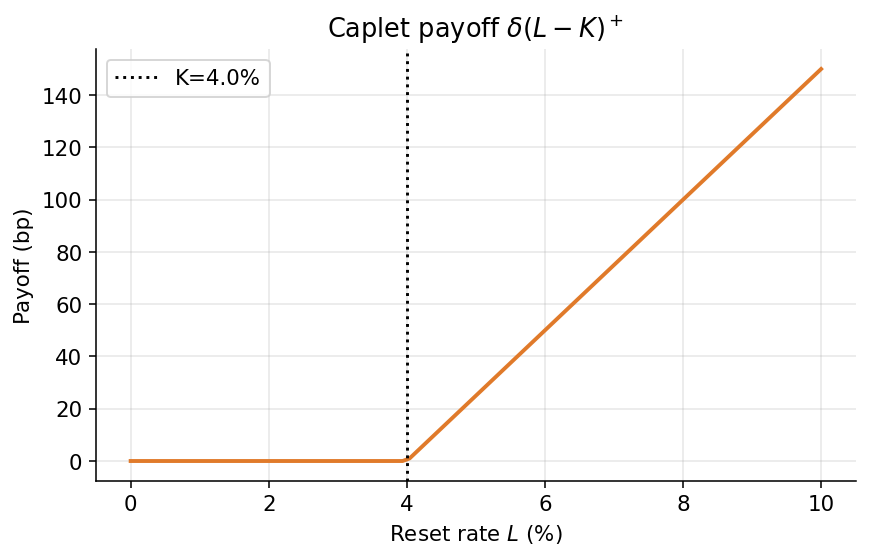
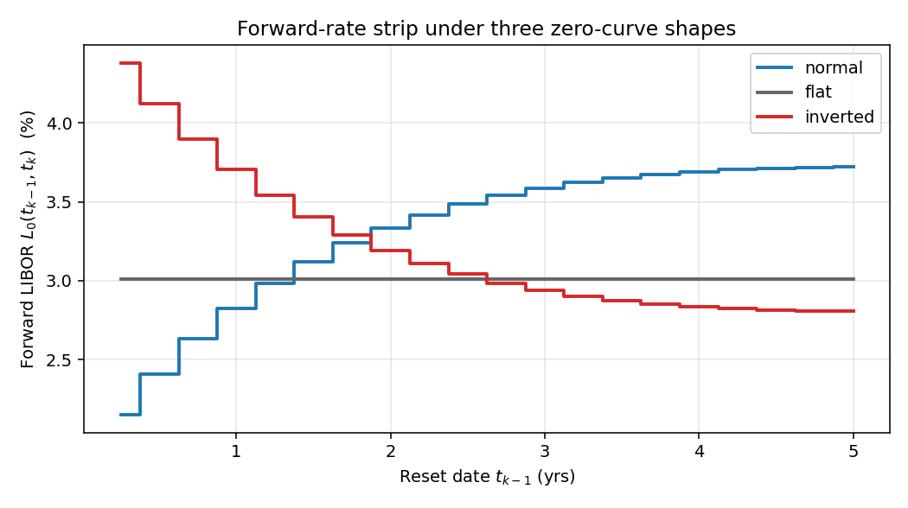
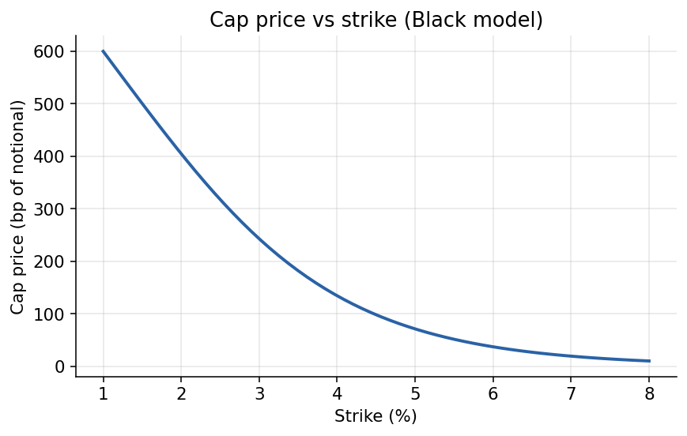
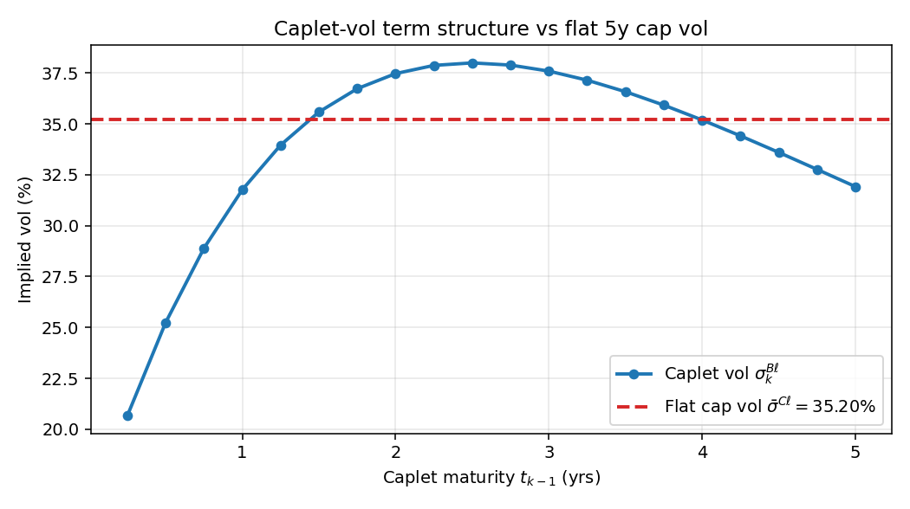
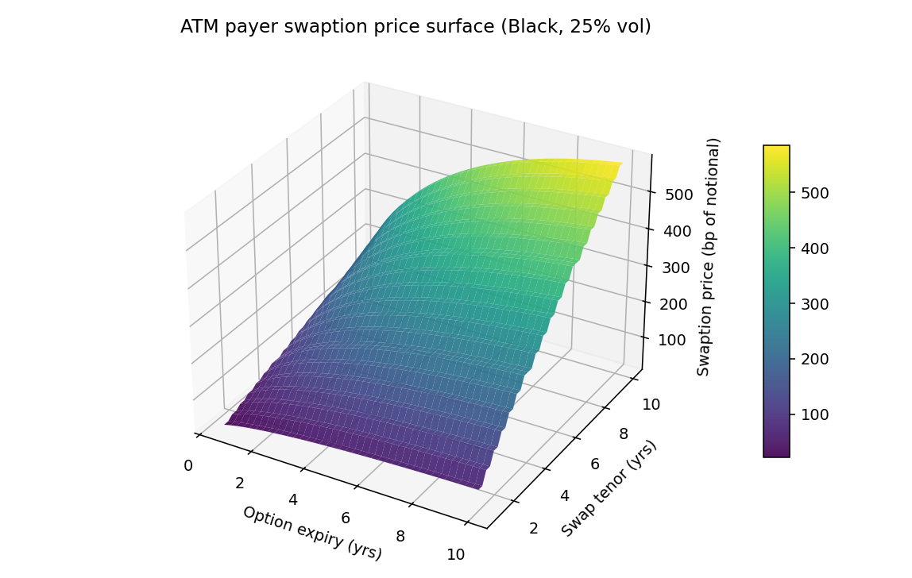
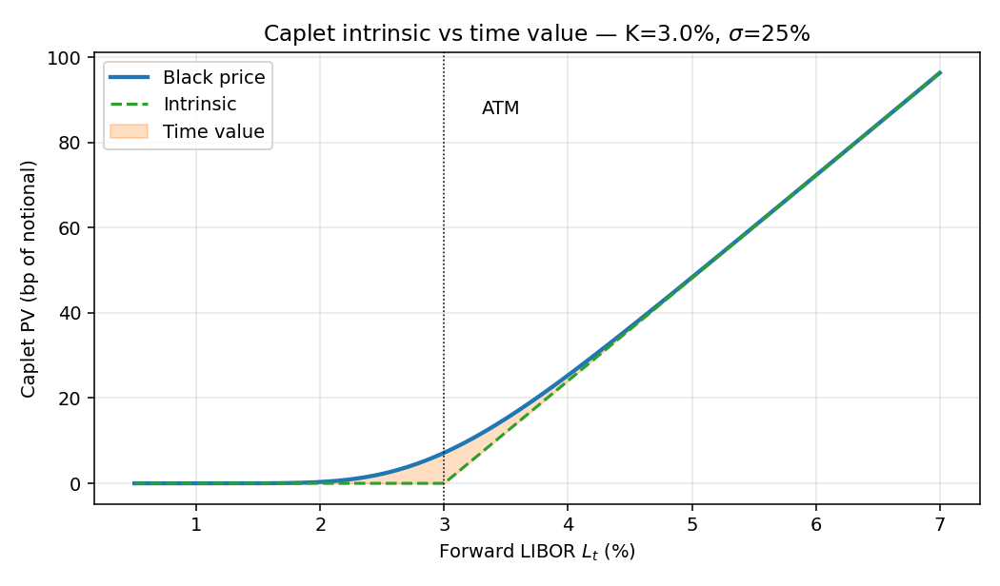

# Chapter 15 — Caps, Floors, and Swaptions

## 15.0 The rates-side capstone

This chapter is the final application of the numeraire-change machinery built earlier in the guide. In Chapter 5 we constructed the Radon-Nikodym / Girsanov apparatus in full generality: every strictly positive tradable defines a measure, forward measures in particular are generated by zero-coupon bonds, and the annuity measure arises as a portfolio-of-bonds numeraire. In Chapter 12 we built the short-rate models — Vasicek, Ho-Lee, Hull-White, and the general affine framework — that give us closed-form bond prices $P_t(T) = e^{A_t(T) - B_t(T)\,r_t}$ and explicit bond volatilities $B_t(T)\,\sigma$. In Chapter 13 we priced interest-rate swaps, CDS, callable bonds, and European bond options, using the T-forward measure as a cross-reference back to Chapter 5.

Caps, floors, and swaptions are the product set that ties all of this together. A cap decomposes exactly, with no cross terms, into a strip of single-date caplets, each priced as a Black-76 call under its own T-forward measure $\mathbb{Q}^{T_i}$. A swaption is irreducibly multi-date, but under the annuity measure $\mathbb{Q}^X$ the par swap rate $S_t$ becomes a single scalar martingale and the whole $n$-dimensional bond-price problem collapses into a single Black call on $S$. Both moves are instances of the same general principle — pick a numeraire under which the underlying becomes a martingale and the payoff factors cleanly — and both are immediate applications of the Girsanov theorem from Chapter 5. We do not re-derive the T-forward measure or the change-of-Brownian-motion formula; we cite them. What is new in this chapter is how they get used.

Interest-rate derivatives — caps, caplets, floors, and swaptions — form the backbone of the modern rate-options market. They exist because the floating reference rate a borrower actually pays each quarter (historically LIBOR, increasingly SOFR, EURIBOR, TONA, SONIA) is random, and every participant in the interest-rate universe — a homeowner with a variable-rate mortgage, a corporate treasurer rolling short-term funding, a pension plan hedging long-dated liabilities, a swap dealer running a matched book — ends up needing convex protection against moves in that rate. A cap is the clean way to buy a ceiling on floating cost; a floor is the clean way to buy a floor on floating income; a swaption is the option to enter a swap at a pre-agreed fixed rate. Together they span a huge fraction of the daily volume in interest-rate vega.

Unlike equity options, where the natural numeraire is the money-market account $B(t)$ and everything lives on a continuous-time stock process, rate options live on a discrete tenor grid $\{t_0 < t_1 < \dots < t_n\}$ — the fixing and payment dates — and each payoff depends on a rate that is only ever observed on those dates. This discrete scaffolding looks clumsy at first, but it is actually a gift: by choosing the right numeraire for each tenor point, the pricing problem decomposes cleanly into a strip of independent Black-76-style calls. The trick is to price each caplet under the $T_i$-forward measure $\mathbb{Q}^{T_i}$ from Chapter 5, whose numeraire is the zero-coupon bond $P(t, T_i)$. Under $\mathbb{Q}^{T_i}$ the simple forward LIBOR $L(t, T_{i-1}, T_i)$ is a martingale — so if we additionally assume it is log-normal, we recover Black-76 formulas for the individual caplets, and the cap is simply $\sum_i$ caplets with no cross-terms. That decomposition is the single most important fact in this chapter; everything else is either setup or consequence.

The rest of this chapter builds that picture carefully. We start from the definition of LIBOR via zero-coupon bond accrual, show how a cap arises naturally as the optional part of a swap (the swap itself was priced in Chapter 13), change numeraires to simplify the pricing expectation (using the Girsanov machinery from Chapter 5), derive Black-76 for each caplet, then extend the same machinery to swaptions via the annuity numeraire. We end with worked numerical examples and a discussion of practical issues: flat cap vols versus stripped caplet vol term structures, what happens in negative-rate regimes (Bachelier rather than Black), and the post-2008 transition from LIBOR to SOFR and its overnight-compounded cousins.

A word on mindset before we begin. For a practitioner, the art of rate options is much less about the Black formula itself — which is one-liner code once you know what goes into it — and much more about *knowing which numeraire to use when*. Every product has a numeraire under which its pricing problem collapses to a scalar Black expectation. Finding that numeraire is the whole game. Caplets want the $t_k$-bond; swaptions want the annuity; bond options (Chapter 13) want the delivery-date bond; constant-maturity-swap-flavored products need a convexity-adjusted measure; and so on. Once you internalize the principle — pick a numeraire such that the underlying becomes a martingale and the payoff factors cleanly — the formulas flow. The rest is implementation detail and bookkeeping.

---

## 15.1 Caps, Caplets, and the Interest-Rate Swap

A cap is an interest-rate option made up of caplets. Caps/floors are close cousins of swaptions (swap options). The easiest way to see where a cap comes from is to start with its underlying — a plain vanilla interest-rate swap, as priced in Chapter 13 — and ask what happens when you put an option on the floating leg.

Consider a standard interest-rate swap (IRS) between counterparties A and B on notional $N$, with fixed leg $F$ and floating leg $\ell$:

$$
A \;\xrightleftharpoons[\ell]{F}\; B \qquad \text{(IRS)} \tag{15.1}
$$

In words, A pays fixed and receives floating; B pays floating and receives fixed. The notional $N$ never actually changes hands — it is simply a scale factor that multiplies the rate spread on each payment date. Both legs are quoted as annualized rates, but each period's payment applies only for the year-fraction $\Delta t_k$ between consecutive fixing/payment dates.

On the tenor grid $t_0 < t_1 < t_2 < \dots < t_n$:

- Fixed leg pays $F\,\Delta t_k$ at each $t_k$, $k = 1, \dots, n$.
- Floating leg pays $L_{t_{k-1}}(t_k)\,\Delta t_k$ at $t_k$, where the rate is set at $t_{k-1}$ and paid at $t_k$.

The timing convention — fix at $t_{k-1}$, pay at $t_k$ — is not a quirk but the defining feature of the instrument. It is the same thing a bank does when it quotes you a three-month floating-rate loan: on the reset date, it looks up the prevailing rate, locks it in for the coming quarter, and hands you the bill at the end of the quarter. In options-pricing language this has a subtle consequence: the payoff is known one period before it is paid, so we need to discount it from the payment date $t_k$ even though randomness is resolved at the fixing date $t_{k-1}$. That small dislocation is exactly what the $t_k$-forward measure is built to handle.

Here $L_{t_{k-1}}(t_k) \equiv L(t_{k-1}, t_{k-1}, t_k)$ is the simple (LIBOR) rate for the period $[t_{k-1}, t_k]$ fixed at $t_{k-1}$. It is defined through the zero-coupon bond:

$$
P_{t_{k-1}}(t_k) \;=\; \bigl(1 + \Delta t_k \, L_{t_{k-1}}(t_k)\bigr)^{-1}
\quad\Longrightarrow\quad
L_{t_{k-1}}(t_k) \;=\; \frac{1}{\Delta t_k}\left[\frac{1}{P_{t_{k-1}}(t_k)} - 1\right]
\tag{15.2}
$$

so that investing $P_{t_{k-1}}(t_k)$ at $t_{k-1}$ yields \$1 at $t_k$. This is the single most important definition in the chapter. LIBOR (and every simple forward rate) is not a primitive object floating in the air — it is a *derived quantity*, built out of zero-coupon bond prices by the simple-accrual formula above. The market does not pick a number and call it the rate; it observes bond prices and implies a rate. That ordering matters. When we later want to model LIBOR as log-normal under the $t_k$-forward measure, we are really making a modelling choice about the *ratio* $P_t(t_{k-1})/P_t(t_k)$, because that is what the rate is. Every martingale statement, every change-of-measure drift, and every Black-76 formula in this chapter ultimately rests on the fact that $L$ is a ratio of tradables — the generic sufficient condition for a $\mathbb{Q}^N$-martingale under a numeraire $N$, as established in Chapter 5.

Intuitively, one dollar at $t_{k-1}$ invested at the simple rate $L$ for the fraction $\Delta t_k$ grows to $1 + \Delta t_k L$ at $t_k$. Equivalently, the bond $P_{t_{k-1}}(t_k)$ is what you must pay at $t_{k-1}$ to receive exactly one dollar at $t_k$, and by no-arbitrage its reciprocal equals the growth factor $1 + \Delta t_k L$. Any deviation and you can arbitrage a lender or borrower. So simple-rate accrual and the zero-coupon bond are two views of the same object.

### Net cash flow to A and the cap payoff

A's net flow at $t_k$ is $\bigl(L_{t_{k-1}}(t_k) - F\bigr)\Delta t_k$ — linear in the realized rate $\ell$. If the realized LIBOR comes in above the fixed leg $F$, A (who is paying fixed) makes money on that period; if LIBOR comes in below $F$, A loses on the period. The swap is symmetric and linear — there is no optionality.

A cap caps the floating cost at strike $K$: instead of paying $F$, A enters a contract $C$ that delivers the payoff

$$
\Delta t_k \,\bigl(L_{t_{k-1}}(t_k) - K\bigr)_{+}
\qquad\text{at each } t_k,\; k=1,\dots,n.
\tag{15.3}
$$

Each of these $n$ period payoffs is called a caplet. The function $(\cdot)_+$ makes it clear that A is only ever compensated when LIBOR exceeds $K$ — the downside is truncated at zero. Economically, the caplet is A's insurance against a single bad fixing; the cap is the bundled insurance across all future fixings of the underlying swap. Graphically the net flow is hockey-stick shaped in $\ell$ with kink at $K$:

```
  caplet payoff  Δt_k · (ℓ − K)_+
    │                              ╱
    │                             ╱
    │                            ╱
    │                           ╱
    │                          ╱
    │                         ╱
    │                        ╱
  0 ●───────────────────────●────────────────→ ℓ  (reset LIBOR)
                            K

  Hockey-stick in ℓ: zero below the strike, slope Δt_k above.
  Convex in ℓ  ⟹  cap is long vega in the forward-rate vol.
```

So the cap is a strip of caplets, each one a call option on the forward LIBOR rate fixed at $t_{k-1}$ and paid at $t_k$. The hockey-stick diagram above also reveals why a cap is convex in the rate: every caplet is, and the sum of convex functions is convex. Convexity in the floating rate translates directly into positive vega — a cap always benefits from a higher realized volatility of forward rates, holding everything else fixed. This is the structural reason cap markets trade a vol surface in the first place.


*Caplet payoff vs reset rate*

A brief note on naming. A "1y1y" caplet resets in one year and pays at approximately one-year-and-one-tenor. A "5y cap" is a strip of caplets running from the first reset out to five years. Swaption quotes use a two-dimensional grid, expiry × tenor, e.g. "2y5y" is a 2-year option to enter a 5-year swap. Once you internalize the tenor grid, all this nomenclature becomes self-explanatory.

---

## 15.2 Caplet Price under the Risk-Neutral Measure

Our job is to price a caplet today, at time $t$. There are two natural candidates for the numeraire we use to discount the random future payoff: the money-market account $B_t$, which is universal and always available, or the zero-coupon bond $P_t(t_k)$ maturing on the payment date, which is more bespoke but (as we will see) much cleaner. Let us try the money-market account first, and see why it fails.

Let $g_t^{(k)}$ denote the price at time $t$ of a caplet maturing at $t_k$ (payment date). Under the risk-neutral measure $\mathbb{Q}$ with bank-account numeraire $B_t = \exp\!\int_0^t r_s\,\mathrm{d}s$:

$$
\frac{g_t^{(k)}}{B_t}
\;=\;
\mathbb{E}^{\mathbb{Q}}_t\!\left[\,\frac{\Delta t_k\,\bigl(L_{t_{k-1}}(t_k) - K\bigr)_{+}}{B_{t_k}}\,\right].
\tag{15.4}
$$

This is awkward because $B_{t_k}$ is random and correlated with $L_{t_{k-1}}(t_k)$. Remedy: use the $t_k$-bond as numeraire (the T-forward measure from Chapter 5).

> Intuition. $B_{t_k}$ depends on the entire short-rate path from $t$ to $t_k$, and high rates imply both a high LIBOR fixing *and* heavy discounting — these two effects do not separate inside the expectation. Switching to $P_t(t_k)$ as numeraire effectively "pre-pays" the discount at time $t$, so the only random thing left inside the expectation is the payoff itself. The cost is a change of measure: the driving Brownian acquires a drift $B_t(t_k)\sigma$ (the generic Girsanov shift of Chapter 5), but that drift vanishes for the one quantity we care about — the forward rate — because forward rates are, by construction, ratios of tradables to the new numeraire.

Before we actually execute that change, it is worth pausing on the intuition about why the bank-account numeraire is awkward. In an equity option, the underlying (a stock price) and the numeraire (the bank account) are almost independent in practice — rates are not the primary driver of stock variance, and for short-dated equity options you can usually treat them as constants. In a rate option, the underlying *is* a rate, and the bank account is driven by the *same* rate. When LIBOR realizes high, the money-market account has also grown fast, so the discount factor $1/B_{t_k}$ has shrunk. The payoff goes up, the discount goes down, and the two are negatively correlated inside the same expectation. You cannot factor them, and you cannot pull one out. This is exactly the situation a good change of numeraire is designed to fix: rather than fight the correlation, we absorb the discounting into the numeraire by choosing a numeraire whose value on the payment date exactly cancels the discount.

---

## 15.3 Change of Numeraire — the $T_i$-Forward Measure

Under the $t_k$-forward measure $\mathbb{Q}^{t_k}$, whose numeraire is $P_t(t_k) = P(t, t_k)$ (see Chapter 5 for the general density-process construction and Girsanov drift shift):

$$
\frac{g_t^{(k)}}{P_t(t_k)}
\;=\;
\mathbb{E}_t^{\mathbb{Q}^{t_k}}\!\left[\,\frac{\bigl(L_{t_{k-1}}(t_k) - K\bigr)_{+}}{P_{t_k}(t_k)}\,\right]\Delta t_k
\;=\;
\mathbb{E}_t^{\mathbb{Q}^{t_k}}\!\left[\bigl(L_{t_{k-1}}(t_k) - K\bigr)_{+}\right]\Delta t_k,
\tag{15.5}
$$

since $P_{t_k}(t_k) = 1$. Read (15.5) carefully. The discount factor $1/B_{t_k}$ that plagued (15.4) has been replaced by $1/P_{t_k}(t_k) = 1$, because the $t_k$-bond is worth exactly one dollar on its own maturity. All of the discounting has been absorbed into the $P_t(t_k)$ that sits outside the expectation. What is left inside the expectation is just the clean payoff. This is the payoff of a textbook call option on $L_{t_{k-1}}(t_k)$, evaluated under the measure $\mathbb{Q}^{t_k}$, with no discount to worry about.

Plugging in (15.2), $L_{t_{k-1}}(t_k) = \tfrac{1}{\Delta t_k}\!\left[\tfrac{1}{P_{t_{k-1}}(t_k)} - 1\right]$.

Define the likelihood ratio (key ratio that becomes a martingale under $\mathbb{Q}^{t_k}$):

$$
X_t \;=\; \frac{P_t(t_{k-1})}{P_t(t_k)}\,,
\qquad
X_{t_{k-1}} = \frac{1}{P_{t_{k-1}}(t_k)}.
\tag{15.6}
$$

Why is $X_t$ the "right" object? Because $X_t$ is a ratio of two tradable zero-coupon bonds, one of which is the numeraire. That is the generic template for a $\mathbb{Q}^{t_k}$-martingale: any tradable divided by the numeraire is a martingale under the measure associated with that numeraire (Chapter 5). No drifts to calculate, no Itô acrobatics. The caplet payoff is an affine function of $X_{t_{k-1}}$, which is itself an affine function of $L_{t_{k-1}}(t_k)$, so the whole pricing problem boils down to the distribution of $X$ (or equivalently $L$) at the fixing date.

### Vasicek illustration

To make this concrete, let us do the change of measure inside a specific short-rate model where bond dynamics are explicit. The Vasicek model (Chapter 12) is the cleanest choice because bond prices are affine-exponential in the short rate, which makes every calculation transparent.

In the Vasicek model bond prices are affine (Chapter 12):

$$
P_t(T) \;=\; e^{\,A_t(T) \,-\, B_t(T)\,r_t},
\qquad
\frac{\mathrm{d}P_t(T)}{P_t(T)} \;=\; r_t\,\mathrm{d}t \,-\, B_t(T)\,\sigma\,\mathrm{d}\widetilde{W}_t,
\tag{15.7}
$$

by Itô (the drift is the short rate, and $B_t(T)\sigma$ is the bond volatility). Notice the intuitive content: bond prices drift upward at the short rate $r_t$ under the risk-neutral measure (that is the "bonds earn the riskless rate on average" statement), and the volatility is $B_t(T)\sigma$ — bigger for longer-dated bonds, because a longer bond has more duration to be shaken around by the short-rate shock.

Taking $\mathrm{d}\ln$ of $X_t$:

$$
\frac{\mathrm{d}X_t}{X_t}
\;=\;
\bigl(\operatorname{vol}\,t_{k-1} - \operatorname{vol}\,t_k\bigr)\,
\;=\;
\bigl(-B_t(t_{k-1}) + B_t(t_k)\bigr)\,\sigma\,\mathrm{d}\widetilde{W}_t^{(k)},
\tag{15.8}
$$

where $\widetilde{W}_t^{(k)}$ is a Brownian motion under $\mathbb{Q}^{t_k}$. The drift has cancelled — $X_t$ is a $\mathbb{Q}^{t_k}$-martingale, consistent with being a ratio of a tradable ($P_t(t_{k-1})$) and the numeraire ($P_t(t_k)$). This cancellation is not an accident of the Vasicek model; it is a general fact about changes of numeraire (Chapter 5), of which Vasicek is just a concrete instance.

Write the bond-vol differential as

$$
\Sigma_t \;\equiv\; -B_t(t_{k-1}) + B_t(t_k),
\qquad
\mathrm{d}\widetilde{W}_t^{(k)} = B_t(t_k)\,\sigma\,\mathrm{d}t + \mathrm{d}\widetilde{W}_t.
\tag{15.9}
$$

The second equation is the key change-of-measure statement: when you switch the numeraire from the bank account $B_t$ to the $t_k$-bond $P_t(t_k)$, the Brownian motion that drives everything gets a drift $B_t(t_k)\sigma$. This drift is exactly the bond's volatility, which is exactly the amount by which the new numeraire differs from the old. That is Girsanov talking (Chapter 5); the story is the same whatever the driving model, as long as the numeraire is a strictly positive tradable.

Then

$$
g_t^{(k)} \;=\; P_t(t_k)\,\mathbb{E}_t^{\mathbb{Q}^{t_k}}\!\left[\,(X_{t_{k-1}} - \mathcal{K})_+\,\right]\Delta t_k,
\qquad \mathcal{K} \equiv 1 + \Delta t_k\,K.
\tag{15.10}
$$

Notice the strike transformation. In terms of LIBOR the strike was $K$; in terms of $X = 1/P_{t_{k-1}}(t_k)$ it becomes $\mathcal{K} = 1 + \Delta t_k K$. This is just a re-expression of the same kink in the payoff function; the kink sits at whatever value of the underlying makes the pre-$(\cdot)_+$ expression vanish. Because $X$ and $L$ are affinely related, an option on one is exactly an option on the other, with a re-scaled strike and a re-scaled notional. No information lost.

Because $X_t$ is a log-normal $\mathbb{Q}^{t_k}$-martingale (in the Gaussian Vasicek case), this is exactly a Black-Scholes expectation:

$$
\boxed{\;
g_t^{(k)}
\;=\;
P_t(t_k)\,\Bigl[\,X_t\,\Phi(d_+) - \mathcal{K}\,\Phi(d_-)\,\Bigr]
\;}
\tag{15.11}
$$

$$
d_{\pm}
\;=\;
\frac{\ln(X_t/\mathcal{K}) \;\pm\; \tfrac{1}{2}\int_t^{t_{k-1}}\Sigma_s^{\,2}\,\mathrm{d}s}
{\left(\int_t^{t_{k-1}}\Sigma_s^{\,2}\,\mathrm{d}s\right)^{1/2}}.
\tag{15.12}
$$

The term $\int_t^{t_{k-1}}\Sigma_s^{\,2}\,\mathrm{d}s$ is the cumulative quadratic variation of $\ln X$ up to the fixing date. In a stationary Black-76 framing it will simply become $\sigma^2(t_{k-1}-t)$ — a single vol times time to fix — but in a more general model it can be time-dependent. Either way, the structure is Black-Scholes: log-moneyness divided by a standard deviation.

### Cap as a sum of caplets

$$
\mathrm{Cap}_t \;=\; \sum_{k=1}^{n} g_t^{(k)}.
\tag{15.13}
$$

This single equation is the whole point of the change of numeraire. We got here because the cap payoff is a *sum* of single-date payoffs; each single-date payoff depends on a fixing at a single date; and each fixing can be priced under its *own* forward measure. There is no need for a joint model of the whole forward-rate curve — you only need one marginal distribution per fixing date. That is a huge reduction in modelling burden, and it is the structural reason caps are vastly easier to price than path-dependent products.

---

## 15.4 Black Implied Vols — the Market Convention

The Vasicek derivation gave us a Black-style formula, but the market standard is to skip the short-rate model and assume directly that each forward LIBOR is log-normal under its own $t_k$-forward measure (GBM for forward rates). This is the LIBOR market model (LMM / BGM) seed.

Why skip the short-rate model? Because practitioners care about cap and swaption prices, not about calibrating some hidden short-rate process. If we can directly parameterize the quantity that appears in the payoff — the forward rate — with a log-normal distribution, and use the market to back out the one free parameter (the Black caplet vol), then we have a quoting convention that is both unambiguous and model-free in spirit. The short-rate model is a means to an end; the Black caplet vol is the end itself.

Let $L_{t_{k-1}}(t_k) \stackrel{d}{=} L_t(t_{k-1}, t_k) \cdot Y_{t_{k-1}}$, where $L_t(t_{k-1}, t_k)$ is today's forward rate for the $[t_{k-1}, t_k]$ period:

$$
L_t(t_{k-1}, t_k)
\;=\;
\frac{1}{\Delta t_k}\!\left[\frac{P_t(t_{k-1})}{P_t(t_k)} - 1\right].
\tag{15.14}
$$

Equation (15.14) says the forward rate is directly readable off the zero-coupon curve. There is no need to observe it in some separate market; once you have bond prices, you have forward rates. Conversely, forward rates and bond prices are two languages for the same object — if you quote the curve in forward-rate language, you can rebuild every bond; if you quote it in bond language, you can rebuild every forward. This dual view matters because caps and floors are effectively bets on the *forward-rate* representation, while bond desks tend to think in the *bond-price* representation. The conversion is mechanical but worth internalizing.

One checks, using $P_t(t_{k-1}) = P_t(t_k)\bigl(1 + \Delta t_k L_t(t_{k-1}, t_k)\bigr)$, that $L_t(t_{k-1}, t_k)$ is a ratio of tradables to the numeraire $P_t(t_k)$, hence a $\mathbb{Q}^{t_k}$-martingale. To see the tradable identification explicitly, note that $P_t(t_{k-1})/P_t(t_k) - 1$ can be interpreted as the time-$t$ price of a portfolio: "buy one $t_{k-1}$-bond, short one $t_k$-bond." That portfolio's price divided by the numeraire $P_t(t_k)$ is a $\mathbb{Q}^{t_k}$-martingale by the generic tradable-over-numeraire rule (Chapter 5). The constant $1/\Delta t_k$ just rescales the units.


*Three stylized zero-curve regimes — normal (upward-sloping), flat, and inverted (downward-sloping) — each imply a very different forward-LIBOR strip $\{L_0(t_{k-1},t_k)\}_k$.*

In practice the shape of the forward strip is one of the first things a rates trader looks at. An upward-sloping curve ("normal") says the market expects future short rates to rise, so out-in-the-future caplets will start life closer to the money than the first caplet. A flat curve says the market is pricing roughly constant expected short rates. An inverted curve signals expected easing. All three can coexist with the same spot rate, and the caplet strip will behave very differently under each.

Postulate driftless GBM under that measure:

$$
\frac{\mathrm{d}L_t^{(k)}}{L_t^{(k)}} \;=\; \sigma\,\mathrm{d}W_t^{t_k},
\qquad L_t^{(k)} \equiv L_t(t_{k-1}, t_k).
\tag{15.15}
$$

"$\mathbb{Q}$-Brownian motion" here means under $\mathbb{Q}^{t_k}$. This is the direct postulate: forward LIBOR is a log-normal martingale under its own forward measure. The only free parameter is the volatility $\sigma$; by assumption the drift is zero (which is forced, because $L^{(k)}$ is a martingale under $\mathbb{Q}^{t_k}$). There is nothing to solve — given $\sigma$, the distribution of $L_{t_{k-1}}^{(k)}$ is pinned down.

Starting at $t$:

$$
L_{t_{k-1}}^{(k)} \;=\; L_t(t_{k-1}, t_k)\,\exp\!\Bigl(-\tfrac{1}{2}\sigma^2(t_{k-1}-t) \,+\, \sigma\bigl(W_{t_{k-1}}^{t_k} - W_t^{t_k}\bigr)\Bigr).
\tag{15.16}
$$

This is the textbook GBM solution: log-mean $-\tfrac12\sigma^2(t_{k-1}-t)$, log-variance $\sigma^2(t_{k-1}-t)$, multiplicative shift by the forward rate today. The log-normality is what keeps forward LIBOR strictly positive — a feature that made perfect sense in the regime before the 2008 financial crisis, and that causes trouble afterwards (see §15.4b below).

### Black's formula for a caplet

Plug (15.16) into (15.5). Since $L_{t_{k-1}}^{(k)}$ is log-normal with mean $L_t^{(k)}$ under $\mathbb{Q}^{t_k}$:

$$
g_t^{(k)} \;=\; P_t(t_k)\,\mathbb{E}^{\mathbb{Q}^{t_k}}\!\left[\,\bigl(L_{t_{k-1}}^{(k)} - K\bigr)_+\,\right]\Delta t_k,
$$

$$
\boxed{\;
g_t^{B(k)}
\;=\;
P_t(t_k)\,\Bigl\{\,L_t(t_{k-1}, t_k)\,\Phi(d_+) \;-\; K\,\Phi(d_-)\,\Bigr\}\,\Delta t_k
\;}
\tag{15.17}
$$

$$
d_{\pm}
\;=\;
\frac{\ln\!\bigl(L_t(t_{k-1}, t_k)/K\bigr) \;\pm\; \tfrac{1}{2}\sigma^2(t_{k-1} - t)}
{\sigma\,(t_{k-1} - t)^{1/2}}.
\tag{15.18}
$$

This is the Black-76 caplet formula. Each caplet has its own vol $\sigma_k^{B\ell}$ (the "Black caplet vol") — there is one implied vol per caplet. Structurally, (15.17) looks identical to a Black-Scholes call on a non-dividend-paying stock with spot $L_t$, strike $K$, volatility $\sigma$, time to expiry $t_{k-1}-t$, with one crucial difference: the discount factor outside the bracket is $P_t(t_k)$, which uses the payment date $t_k$, not the fixing date $t_{k-1}$. That subtle dislocation — pay at $t_k$, fix at $t_{k-1}$ — is exactly why the forward measure is valuable. The discount uses the right number, even though the randomness is resolved one period earlier.

The Black-76 framing is also what makes caps and floors trade as a vol market rather than a price market. Dealers quote Black caplet vols (or flat cap vols); buyers and sellers negotiate in vol units; prices are computed from vols on the fly. This is directly analogous to the equity-option market, with one important distinction: each caplet has its own vol, because each one is struck against a different forward rate at a different maturity. The object that gets quoted is therefore not a single vol number but a *term structure* of caplet vols.

**Alternative derivation: caplet as a put on a zero-coupon bond.**
There is a second, model-independent route to the caplet that does not
require a measure change. Start from the caplet payoff at $t_{k-1}$
(i.e., one period before payment):
$\Delta t_k (L_{t_{k-1}}(t_k) - K)_+ = (1 - (1 + K\Delta t_k)
P_{t_{k-1}}(t_k))_+$, using $1 + L_{t_{k-1}}(t_k)\Delta t_k =
1/P_{t_{k-1}}(t_k)$. Multiplying through by $(1 + K\Delta t_k)$ and
rearranging,
```math
(1 + K\Delta t_k)\cdot\Delta t_k\,(L_{t_{k-1}}(t_k) - K)_+ \;=\; \bigl(K_{\text{bond}} - P_{t_{k-1}}(t_k)\bigr)_+\,,\qquad K_{\text{bond}} := \frac{1}{1 + K\Delta t_k}.
```
Discounting from $t_k$ back to $t$ under the money-market measure, the
caplet is equivalent (up to the scalar $(1 + K\Delta t_k)$) to a
European *put* on the zero-coupon bond $P_{\cdot}(t_k)$ with expiry
$t_{k-1}$ and strike $K_{\text{bond}}$. Any short-rate model that
gives a closed-form European bond-option formula — the Vasicek-Black
put of CH13 §13.6 is the canonical example — therefore prices the
caplet without a measure change. This alternative is pedagogically
useful because it links caplets directly to the bond-option technology
of CH13 and provides a clean consistency check between the Black-76
caplet formula (forward-measure route) and the Vasicek-Black bond-put
formula (money-market-measure route) — agreement of the two routes is
a good diagnostic for any rates-model implementation.


*Cap price vs strike (Black model)*

The cap price is monotonically decreasing in the strike $K$ (higher strike, less in-the-money, less intrinsic, less option value). For very low strikes the cap behaves like a forward swap (all caplets deep in the money, optionality worth almost nothing on top of intrinsic). For very high strikes the cap behaves like a lottery ticket (all caplets deep out of the money, value almost entirely time value). The curvature between these extremes is driven by the Black caplet vol term structure; that is what makes the cap surface genuinely interesting.

### Cap in terms of Black vols

$$
\sum_{k=1}^{n} g_t^{B(k)} \;=\; \sum_{k=1}^{n} g_t^{B(k)}(\sigma_k^{B\ell}),
\tag{15.19}
$$

with $\sigma_k^{B\ell}$ the k-th caplet Black implied vol. A flat cap vol $\sigma_n^{C\ell}$ is the single $\sigma$ such that $\sum_k g^B(\sigma) = \mathrm{Cap}_t^{\mathrm{mkt}}$ — conceptually useful but coarser than the per-caplet term structure:

```
  caplet-vol strip  (each row = one market-quoted cap)
   σ_1^{Bℓ}  │  ●                                 1-period cap  (1 caplet)
   σ_2^{Bℓ}  │  ●────●────●                       2-period cap  (3 caplets)
   σ_3^{Bℓ}  │  ●────●────●────●────●             3-period cap  (5 caplets)
             └──┼────┼────┼────┼────┼──────────→ reset date
               t_0  t_1  t_2  t_3  t_4 …

  Stripping: solve for σ_k^{Bℓ} recursively so each cap row re-prices
  its quoted market premium. Adding one tenor adds one unknown vol.
```

One "strips" caplet vols recursively from quoted cap prices with increasing maturity. The stripping procedure is simple in principle and sometimes fiddly in practice. You start at the shortest-dated cap — say, a 1-year cap with four quarterly caplets — and find the single flat vol that reprices it. That flat vol is imposed as the common vol for caplets 1–4 (or, more defensibly, the first caplet inherits its vol and the later three share a common number). You then take the next cap (the 2-year), subtract the known value of caplets 1–4 from its market price, and the residual must equal the value of caplets 5–8 under *their* common vol. Solve one-dimensionally for that vol. Repeat out the curve. The result is a term structure $\sigma_k^{B\ell}$ defined pointwise at each tenor, usually interpolated smoothly in between.

One subtlety: the market actually quotes caps at a few standard strikes (ATM plus a handful of fixed-strike grids), and the stripping must be done at each strike separately, giving a full two-dimensional caplet-vol surface indexed by (expiry, strike). Traders then fit parametric forms (SABR being the workhorse) through the strike dimension at each expiry, creating a smooth implied-vol surface that can be interpolated and extrapolated.


*A stylized upward-humped caplet-vol curve $\sigma_k^{B\ell}$ — typical of cap markets — is shown alongside the flat cap vol $\bar\sigma^{C\ell}$ that reprices the whole 5-y cap. The flat cap vol averages the strip (roughly in a vega-weighted sense), which is why traders prefer the per-caplet term structure for hedging.*

The humped shape in the figure is common in real markets. Very short-dated caplets tend to have lower vol because the first fixing is close and the near-term rate path is well-anchored by central-bank policy. Very long-dated caplets also tend to have lower vol because long-run rate expectations are less volatile than near-term dislocations. The peak tends to sit around the 2–3 year point, where central-bank uncertainty and term-structure dynamics combine to produce the widest distribution of outcomes. Flat cap vols smear this shape into a single number, and while they are handy for quick quoting, no serious hedger uses them to compute vega: you want the sensitivity to each individual caplet vol, not to the weighted average.

> Why cap $=$ sum of caplets exactly (no cross-terms). Each caplet pays $\Delta t_k(L_{t_{k-1}}(t_k)-K)_+$ on a *single* fixed date $t_k$. The cap's payoff is the pointwise sum over $k$, and expectation is linear, so $\text{Cap}_t = \sum_k g_t^{(k)}$ — no covariance or correlation terms ever appear. This is what makes caps structurally simpler than, say, a swaption (which is an option on a *sum* of rates and so does carry cross-sectional covariance). It also means each caplet can be priced under its *own* forward measure $\mathbb{Q}^{t_k}$ with its *own* Black vol $\sigma_k^{B\ell}$ — the chapter's central decomposition.

The italicized distinction in that callout is worth extra emphasis. In a cap, the nonlinearity acts caplet-by-caplet: each caplet takes a max, and then you add. In a swaption, the nonlinearity acts on the *already-summed* stream of cashflows: you add up the swap values first, and only then take a max. This difference is what forces swaptions onto a different numeraire (the annuity) and makes them sensitive to forward-rate correlations that caps are not. It is also why caps and swaptions, although both built from the same underlying rate dynamics, carry different information: cap vols reflect the marginal distribution of each forward rate, while swaption vols additionally reflect the covariance structure across forward rates. A full rates model must calibrate to both simultaneously to be internally consistent.

---

## 15.4b Bachelier vs Black in a Negative-Rate World

The Black-76 framework above rests on one assumption that is uncontroversial in most of modern financial history: that forward rates are strictly positive. Log-normality forces this, since $L_{t_{k-1}}^{(k)} = L_t^{(k)} \exp(\text{something})$ and the exponent is always strictly positive. For decades this was a reasonable view of the world — a negative short rate was almost unthinkable, because banks could always hold physical cash instead of lending at a loss, and so the zero lower bound seemed binding by arbitrage.

The post-2008 experience blew that up. The European Central Bank, the Swiss National Bank, the Bank of Japan, and others spent multiple years with deposit rates set explicitly below zero, and market forward rates on EURIBOR and JPY curves traded visibly negative across a wide range of tenors. Suddenly Black-76 could not even *represent* a market quote — you cannot compute $\ln(L/K)$ if $L$ is negative, and the model assigns zero probability to outcomes that were happening in real time.

Market practice migrated in two directions. The first was the *shifted-Black* model: write $L \to L + \alpha$ for some positive shift $\alpha$, assume that $L + \alpha$ is log-normal under $\mathbb{Q}^{t_k}$, and price Black-76 with the shifted variables. This is a cheap fix — it preserves the closed-form and the market intuition of a Black vol, while permitting negative realizations of $L$ itself as long as they stay above $-\alpha$.

The second, more structural fix was the *Bachelier* or *normal* model: assume that the forward rate follows arithmetic Brownian motion rather than geometric, so

$$
\mathrm{d}L_t^{(k)} \;=\; \sigma_N\,\mathrm{d}W_t^{t_k},
$$

with $\sigma_N$ the *normal* (basis-point) volatility. The caplet price under Bachelier is another closed-form expression involving $\Phi$ and the normal density, with a moneyness $(L_t - K)/(\sigma_N \sqrt{t_{k-1}-t})$. The normal model prices forward rates as a Gaussian distribution centered on the current forward, with no lower bound — perfectly happy to assign positive probability to negative rates, because that is exactly what happened in reality.

The two conventions are related by a rough rule of thumb: at the money, $\sigma_N \approx \sigma_B \cdot L$, where $\sigma_B$ is the Black vol and $L$ is the underlying forward rate. So a 25% Black vol on a 4% forward is roughly equivalent to a 100 bp normal vol. Away from ATM they diverge, and the choice of quoting convention matters. Modern rate-derivative desks now routinely switch between conventions, with normal vols dominating European markets (especially EUR and CHF) and shifted-Black or straight Black vols still common in USD markets where the zero bound has remained in force for most of history.

The same observations apply to swaptions — normal swaption vols are now the industry standard in much of Europe, and a senior quant cannot afford to be sloppy about which convention a given quote is in.

---

## 15.5 Swaptions

So far we have priced an option on a *single* fixing of a forward rate. A swaption is an option on an entire *swap* — a bundled set of fixings. The payoff structure is similar in spirit but different in a crucial detail: the max is taken at the swap level, not at the caplet level. This has real consequences for what modelling assumptions we need and what numeraire makes the problem tractable.

A swaption (swap option) gives A the right, at $t_0$, to enter a payer swap with fixed leg $F$, reset/payment dates $t_1, \dots, t_n$, floating rates $L_{t_0}(t_1), L_{t_1}(t_2), \dots, L_{t_{n-1}}(t_n)$. So on the exercise date $t_0$, A looks at the then-current swap value: if the floating leg is worth more than the fixed leg (i.e. rates have risen above $F$ on average), A exercises and enters the swap at the pre-agreed fixed rate, locking in a favorable position. If rates have fallen, A lets the option expire.

### Payoff at $t_0$

$$
C_{t_0} \;=\; \bigl(V_{t_0}^{\,\ell} - V_{t_0}^{\text{fixed}}\bigr)_{+},
\tag{15.20}
$$

where

$$
V_{t_0}^{\text{fixed}} \;=\; F\sum_{k=1}^{n} P_{t_0}(t_k)\,\Delta t_k,
\qquad
V_{t_0}^{\,\ell} \;=\; 1 - P_{t_0}(t_n).
\tag{15.21}
$$

(The floating leg's PV at $t_0$ is $1 - P_{t_0}(t_n)$ — a standard "par" identity from Chapter 13.) The par identity says: receive a stream of LIBOR fixings from $t_0$ to $t_n$ is, in present-value terms, the same as receiving \$1 at $t_0$ and paying back \$1 at $t_n$. This is because each floating cashflow "resets" the invested principal at the then-current rate, so the floating leg is PV-equivalent to principal in minus principal out, which is $1 - P_{t_0}(t_n)$.

Hence

$$
C_{t_0} \;=\; \Bigl(\,1 - P_{t_0}(t_n) \;-\; F\sum_{k=1}^{n} P_{t_0}(t_k)\,\Delta t_k\,\Bigr)_{+}.
\tag{15.22}
$$

Now the max operates on a nonlinear combination of $n+1$ bond prices — $P_{t_0}(t_1), \dots, P_{t_0}(t_n)$ all enter through the fixed leg, and $P_{t_0}(t_n)$ also enters through the floating leg. Under a multi-factor short-rate model these bond prices are generically correlated, and the max cannot be decomposed caplet-style. This is the structural reason swaptions are harder than caps.

### In an affine (Vasicek) model: find $r^{*}$

There is a slick trick available in one-factor affine models (recall the affine ansatz and ODE system of Chapter 12). Because all bond prices are monotone (decreasing) in the single state variable $r_{t_0}$, the swaption's intrinsic value is monotone in $r_{t_0}$ too. So the exercise region $\{C_{t_0} > 0\}$ is a half-line in $r_{t_0}$, and there is a single critical value $r^*$ that separates "in the money" from "out of the money."

In an affine short-rate model, $P_t(T) = e^{A_t(T) - B_t(T)\,r_t}$. At $t_0$, the swaption is in-the-money iff a threshold condition on $r_{t_0}$ is satisfied. Find $r^{*}$ such that

$$
\sum_{k=1}^{n} c_k\,P_{t_0}(t_k; r^{*}) \;=\; 1,
\qquad c_k = F\,\Delta t_k\;(k<n),\;\; c_n = 1 + \Delta t_n F.
\tag{15.23}
$$

Then exercise region is $\{r_{t_0} > r^{*}\}$ (bonds monotone $\downarrow$ in $r$), and

$$
C_{t_0} \;=\; \Bigl(1 - \sum_k c_k\,P_{t_0}(t_k)\Bigr)\mathbf{1}_{r_{t_0} > r^{*}}
\;=\; \mathbf{1}_{r_{t_0} > r^{*}} - \sum_k c_k\,P_{t_0}(t_k)\,\mathbf{1}_{r_{t_0} > r^{*}}.
\tag{15.24}
$$

Using $\mathbf{1}_{r_{t_0} > r^{*}} = \mathbf{1}_{P_{t_0}(t_k) < P_k^{*}}$ with $P_k^{*} \equiv P_{t_0}(t_k; r^{*})$ (monotone in $r$), so

$$
-\,B_{t_0}(t_k)\,r_{t_0} \;<\; -\,B_{t_0}(t_k)\,r^{*}
\;\Longleftrightarrow\;
A_{t_0}(t_k) - B_{t_0}(t_k)\,r_{t_0} \;<\; A_{t_0}(t_k) - B_{t_0}(t_k)\,r^{*}.
\tag{15.25}
$$

This is the Jamshidian trick in miniature (compare Chapter 13's European bond-option derivation): a joint indicator over all $n$ bond prices reduces, in a one-factor model, to a single scalar condition on $r_{t_0}$. Each bond-price indicator can then be handled separately, and the swaption decomposes into a portfolio of bond options — each one priced with its own Black-style formula as in Chapter 13.

### Risk-neutral pricing of the swaption

$$
g_t \;=\;
\mathbb{E}^{\mathbb{Q}}_t\!\left[\,e^{-\int_t^{t_0} r_s\mathrm{d}s}\,\bigl(\mathbf{1}_{r_{t_0} > r^{*}} - \sum_k c_k\,P_{t_0}(t_k)\,\mathbf{1}_{r_{t_0} > r^{*}}\bigr)\,\right]
$$

$$
\;=\;
\mathbb{E}^{\mathbb{Q}}_t\!\left[e^{-\int_t^{t_0} r_s\mathrm{d}s}\,\mathbf{1}_{r_{t_0} > r^{*}}\right]
\;-\;
\sum_k c_k\,\mathbb{E}^{\mathbb{Q}}_t\!\left[e^{-\int_t^{t_0} r_s\mathrm{d}s}\,P_{t_0}(t_k)\,\mathbf{1}_{P_{t_0}(t_k) < P_k^{*}}\right].
\tag{15.26}
$$

Each of these expectations can now be handled by an appropriate change of numeraire. The first term uses $P_t(t_0)$ (the $t_0$-bond), which converts the integral-times-indicator into a pure $\mathbb{Q}^{t_0}$-probability. The sum of later terms uses $P_t(t_k)$ for each $k$, again turning each summand into a $\mathbb{Q}^{t_k}$-probability times a discount factor. This is the affine-model workhorse.

Use $P_t(t_k)$ as the numeraire for the $k$-th term (change from $\mathbb{Q}$ to $\mathbb{Q}^{t_k}$):

$$
h_t^{k} \;\equiv\; \mathbb{E}^{\mathbb{Q}}_t\!\left[e^{-\int_t^{t_0}r_s\,\mathrm{d}s}\,P_{t_0}(t_k)\,\mathbf{1}_{P_{t_0}(t_k) < P_k^{*}}\right],
\qquad
\frac{h_t^{k}}{P_t(t_k)} = \mathbb{E}^{\mathbb{Q}^{t_k}}_t\!\bigl[\mathbf{1}_{P_{t_0}(t_k) < P_k^{*}}\bigr].
\tag{15.27}
$$

Hence

$$
h_t^{k} \;=\; P_t(t_k)\,\mathbb{Q}^{t_k}\!\bigl(P_{t_0}(t_k) < P_k^{*}\bigr).
\tag{15.28}
$$

Under $\mathbb{Q}^{t_k}$ the bond dynamics carry the numeraire adjustment (Girsanov drift shift, Chapter 5):

$$
\frac{\mathrm{d}P_t(t_n)}{P_t(t_n)}
\;=\;
r_t\,\mathrm{d}t - B_t(t_n)\,\sigma\,\mathrm{d}\widetilde{W}_t
\;=\;
\bigl(r_t + B_t^{2}(t_k)\,\sigma^{2}\bigr)\mathrm{d}t - B_t(t_n)\,\sigma\,\mathrm{d}\widetilde{W}_t^{\,k},
$$

$$
\mathrm{d}\widetilde{W}_t^{\,k} \;=\; B_t(t_k)\,\sigma\,\mathrm{d}t \,+\, \mathrm{d}\widetilde{W}_t.
\tag{15.29}
$$

The remaining term is a Gaussian tail:

$$
\mathbb{Q}^{t_k}\!\bigl(P_{t_0}(t_k)^{-1} > P_k^{*\,-1}\bigr)
\;=\;
\mathbb{Q}^{t_k}\!\bigl(X_{t_0} > P_k^{*\,-1}\bigr),
\qquad
X_t = \frac{P_t(t_0)}{P_t(t_k)},\quad t\ge t_0,
\tag{15.30}
$$

a $\mathbb{Q}^{t_k}$-martingale (same structure as §15.3). So each term collapses to a Gaussian tail probability, computable in closed form once the model's bond-vol structure is pinned down. The whole swaption price is then a finite sum of $\Phi$'s, each weighted by an appropriate bond price.

This Vasicek approach is historically important and still pedagogically clean, but it is not how modern desks price swaptions at their core. Modern practice uses the annuity measure, described next, which gives a one-shot Black formula directly on the par swap rate — no Jamshidian decomposition, no need for a calibrated short-rate model.

---

## 15.6 Swaption as Black on the Swap Rate

The Jamshidian route above works, but is ugly — it introduces a model-dependent threshold $r^*$, requires an affine short-rate specification, and does not directly give a Black formula on the swap rate, which is what the market actually quotes. There is a cleaner approach: choose a numeraire that matches the *structure* of the payoff. The apparatus is exactly the general change-of-numeraire of Chapter 5; we just pick a portfolio numeraire instead of a single-bond numeraire.

Collect terms using the annuity numeraire:

$$
C_{t_0} \;=\; \Bigl(1 - P_{t_0}(t_n) - F\sum_k \Delta t_k\,P_{t_0}(t_k)\Bigr)_{+},
\qquad
X_t \;\equiv\; \sum_k \Delta t_k\,P_t(t_k) \quad\text{(annuity)}.
\tag{15.31}
$$

The annuity $X_t = \sum_k \Delta t_k P_t(t_k)$ is a strictly positive portfolio of zero-coupon bonds — exactly the present value of \$1 received on every payment date of the swap's fixed leg. Because it is a portfolio of tradables, it is itself tradable and strictly positive, so it qualifies as a numeraire (Chapter 5).

Assume $X_t$ is a valid numeraire:

$$
\frac{\mathrm{d}X_t}{X_t} \;=\; r_t\,\mathrm{d}t + (\cdots)\,\mathrm{d}\widetilde{W}_t,\qquad X_t > 0 \text{ a.s.}
\tag{15.32}
$$

Change to $\mathbb{Q}^{X}$ with numeraire $X_t$:

$$
\frac{g_t}{X_t}
\;=\;
\mathbb{E}^{\mathbb{Q}^{X}}_t\!\left[\frac{\bigl(1 - P_{t_0}(t_n) - F\sum_k\Delta t_k P_{t_0}(t_k)\bigr)_{+}}{\sum_k \Delta t_k P_{t_0}(t_k)}\right]
$$

$$
\;=\;
\mathbb{E}^{\mathbb{Q}^{X}}_t\!\left[\,\left(\,\frac{1 - P_{t_0}(t_n)}{\sum_k \Delta t_k P_{t_0}(t_k)} \,-\, F\right)_{+}\,\right]
\;=\;
\mathbb{E}^{\mathbb{Q}^{X}}_t\!\bigl[(S_{t_0} - F)_{+}\bigr],
\tag{15.33}
$$

where the par swap rate is (recall Chapter 13's IRS section)

$$
\boxed{\;
S_t \;=\; \frac{1 - P_t(t_n)}{\sum_k \Delta t_k\,P_t(t_k)}
\;}
\tag{15.34}
$$

— and $S_t$ is a $\mathbb{Q}^{X}$-martingale (it is a ratio of the tradable $1 - P_t(t_n)$ to the numeraire $X_t$). This is the critical insight. The par swap rate is defined as the value of the fixed rate that makes the two legs of the swap equal on net at inception. By construction, $S_t = (\text{floating PV}) / (\text{annuity PV})$. Both numerator and denominator are tradables, and the denominator is the numeraire, so the ratio is automatically a $\mathbb{Q}^X$-martingale by the tradable-over-numeraire principle (Chapter 5).

Hence

$$
g_t \;=\; X_t\,\mathbb{E}^{\mathbb{Q}^{X}}_t\!\bigl[(S_{t_0} - F)_{+}\bigr].
\tag{15.35}
$$

All of the complicated $n$-dimensional bond-price structure has collapsed into a scalar call on the single random variable $S_{t_0}$. If we posit a distribution for $S_{t_0}$ under $\mathbb{Q}^X$, the entire expectation is tractable.

### Log-normal swap-rate model (LSM)

Assume

$$
\frac{\mathrm{d}S_t}{S_t} \;=\; \sigma\,\mathrm{d}\widetilde{W}_t^{X}
\;\Longrightarrow\; \text{Black formula for swaption.}
\tag{15.36}
$$

Then (under GBM with mean $S_t$):

$$
\boxed{\;
g_t \;=\; X_t\,\bigl(\,S_t\,\Phi(d_+) \;-\; F\,\Phi(d_-)\,\bigr)
\;}
\tag{15.37}
$$

$$
d_{\pm} \;=\; \frac{\ln(S_t/F) \;\pm\; \tfrac{1}{2}\sigma^{2}(t_0 - t)}{\sigma\,(t_0 - t)^{1/2}}.
\tag{15.38}
$$

This is the Black swaption formula: a call on the swap rate $S_t$, with the annuity $X_t$ as discount factor. Exactly the same structure as Black-Scholes on an equity, exactly the same structure as the Black caplet, with the right numeraire ($X_t$) replacing the bank account or the single $t_k$-bond.


*The Black swaption price from (15.37) varies smoothly over the expiry × tenor grid — the standard market quoting convention. With flat forward rates and flat vol, longer tenor (larger annuity $X_t$) dominates, while longer expiry adds Black-time value.*

The swaption market therefore trades a *two-dimensional* vol surface: expiry (how long until the option decision) times tenor (how long is the underlying swap). A 2y5y swaption is the 2-year option to enter a 5-year swap. Dealers quote vols for all relevant pairs, and a senior vol trader will typically run hedges along both axes simultaneously. The caplet surface, by contrast, is one-dimensional in tenor (the expiry and the fixing date are tied together by the tenor grid).

Consistency between the caplet surface and the swaption surface is a nontrivial constraint on a full rates model. Caps give you the marginal vol of each forward rate individually; swaptions give you the vol of a weighted sum of forward rates, which depends on the correlations among them. A model that calibrates to caps alone is underdetermined on the correlation structure; a model that calibrates to swaptions alone is underdetermined on the marginals. Full-scale production models (LMM, SABR-LMM, stochastic-vol variants) try to fit both simultaneously.

> What the annuity numeraire does. The swaption payoff $\bigl(1-P_{t_0}(t_n)-F\sum_k\Delta t_k P_{t_0}(t_k)\bigr)_+$ mixes $n+1$ bond prices through a *nonlinear* max operator. Under $\mathbb{Q}$ or any single $\mathbb{Q}^{t_k}$, none of these terms is a martingale, so no clean closed form exists. Dividing the payoff by the annuity $X_t=\sum_k\Delta t_k P_t(t_k)$ — itself a positive portfolio of tradables — produces a clean call on a single scalar, the par swap rate $S_t=(1-P_t(t_n))/X_t$. Because $1-P_t(t_n)$ is itself a (self-financing) tradable (buy a $t_n$-bond, fund with a rolling float), $S_t$ is a ratio of a tradable to the numeraire and hence a $\mathbb{Q}^X$-martingale. The whole problem collapses to Black on one variable. This is the same trick as a caplet, just with a bigger numeraire.

---

## 15.7 Worked Example — Pricing a 1-into-1 Caplet

Concrete numbers are the best way to anchor the formulas. Let us price a single quarterly caplet using the Black-76 formula and check that the answer makes sense.

Suppose today is $t = 0$, with:

- $t_{k-1} = 1$ yr, $t_k = 1.25$ yr, $\Delta t_k = 0.25$ yr.
- Today's forward rate $L_0(1, 1.25) = 4.00\%$.
- Strike $K = 3.50\%$.
- Black caplet vol $\sigma = 25\%$.
- Discount $P_0(1.25) = 0.955$.

We are therefore looking at a caplet that fixes 1 year from now and pays 1.25 years from now, on a forward rate that is currently 4% against a strike of 3.5%. The caplet is in the money in the forward sense (forward rate above strike), so intrinsic value is positive. Time to fix is 1 year and the vol is 25%, so there is a meaningful time value component as well.

Compute:

$$
d_+ = \frac{\ln(0.04/0.035) + 0.5(0.25)^{2}(1)}{0.25\sqrt{1}}
 = \frac{0.1335 + 0.03125}{0.25}
 = 0.659,
$$
$$
d_- = d_+ - 0.25 = 0.409.
$$

With $\Phi(0.659) \approx 0.745$, $\Phi(0.409) \approx 0.659$:

$$
g_0 = 0.955 \times \bigl(0.04 \times 0.745 - 0.035 \times 0.659\bigr)\times 0.25
$$
$$
 = 0.955 \times (0.02980 - 0.02307)\times 0.25
 = 0.955 \times 0.006734 \times 0.25
 \approx 0.001607
$$

i.e. about 16.07 bp of notional — the caplet PV. To see that this number is in the right ballpark, compare to the rough intrinsic value: $0.25 \times (0.04 - 0.035) \times 0.955 \approx 0.001194$, or about 11.94 bp. The Black price of 16.07 bp is above intrinsic by about 4 bp, which is the time-value contribution. That looks right: 1-year time to fix at 25% Black vol on a rate close to the money should buy you a few bp of convexity value.

Rough sanity checks like this are indispensable at a trading desk. If you compute a Black caplet value and the answer comes out *below* intrinsic, something is wrong. If the answer comes out many multiples above intrinsic on a caplet that is deep in the money, something is wrong. Time value should be non-negative, bounded by the product of vol and $\sqrt{T}$, and roughly symmetric around the ATM log-moneyness. These heuristics catch a huge fraction of data errors.


*For a 1y caplet, the Black price splits into intrinsic $P_t(t_k)\Delta t_k(L_t-K)_+$ and time value $g_t^{B(k)}-\text{intrinsic}$. The time component peaks near ATM and decays symmetrically in $\ln(L/K)$ — the classic log-moneyness curvature that drives cap vega.*

## 15.8 Worked Example — Stripping Caplet Vols from a 2-Year Cap

A harder and more realistic task is to back out caplet vols from market cap quotes. Assume we see market prices for quarterly-settled caps at two tenors, and we want to produce a caplet-vol term structure consistent with both. The mechanics of the stripping procedure are easy once you see them laid out.

Suppose quarterly caps:

- 1-yr cap (4 caplets) trades at $C_4^{\mathrm{mkt}}$.
- 2-yr cap (8 caplets) trades at $C_8^{\mathrm{mkt}}$.

Given already-stripped $\{\sigma_1^{B\ell}, \dots, \sigma_4^{B\ell}\}$ from the 1-yr cap, solve

$$
C_8^{\mathrm{mkt}} - \sum_{k=1}^{4} g^{B(k)}\bigl(\sigma_k^{B\ell}\bigr)
\;=\;
\sum_{k=5}^{8} g^{B(k)}(\sigma^{\star})
$$

for the common forward caplet vol $\sigma^{\star}$ over the fifth-through-eighth periods (one-dimensional root find). This is the bootstrap logic behind caplet-vol term structures. The left-hand side is what the market is telling you about "extra" option value beyond the 1-year cap; the right-hand side is what the Black formula gives for caplets 5–8 at an unknown common vol $\sigma^*$. One equation, one unknown, monotone in the unknown, so the root-find is straightforward.

Repeating this bootstrap at progressively longer tenors — 3-year, 4-year, 5-year, 7-year, 10-year — builds out a caplet-vol term structure. The key thing to notice is that each bootstrap step only requires the *already-stripped* earlier caplet vols plus one additional market cap price; it is a recursive procedure that rolls forward in tenor. If any single market quote is stale or mis-recorded, the error propagates into all later vols — so real desks run multiple integrity checks as part of the stripping pipeline.

In practice, caps are quoted at several strikes simultaneously (ATM, ATM $\pm$ 25 bp, ATM $\pm$ 50 bp, and further), and the stripping must be done at each strike. The result is a two-dimensional (tenor, strike) caplet-vol surface. Practitioners typically fit a parametric smile model — SABR being the standard choice — through the strike dimension at each tenor, yielding a smooth and arbitrage-aware surface that can be interpolated and extrapolated.

---

## 15.9 LIBOR to SOFR and Why It Matters

The entire Black-76 caplet framework was built in a world where the reference floating rate was LIBOR — the London Interbank Offered Rate. LIBOR had two features that made it a natural fit for this pricing technology: it was forward-looking (quoted at the start of an accrual period for that period's rate), and it was a credit-sensitive unsecured bank rate (which gave the curve a term premium and a nonzero credit spread over a truly riskless reference).

Following the rate-fixing scandals of the 2010s, LIBOR has been substantially withdrawn. USD LIBOR for most major tenors ceased publication; GBP LIBOR is gone; EUR is largely replaced by €STR; JPY by TONA; CHF by SARON. The replacements — SOFR in the US, SONIA in the UK, €STR in the euro area, TONA in Japan — are overnight risk-free rates. They are *backward-looking* rather than forward-looking: the rate for an accrual period is computed by compounding realized overnight fixings, so you only know the period's rate at the *end* of the period, not the beginning.

This timing inversion changes several things in our framework. First, the defining identity (15.2) no longer applies cleanly — the compounded SOFR rate is not a single bond-based accrual but a product of overnight factors. Second, the forward rate concept is now subtler: you can still define a forward SOFR rate, but the convexity adjustment between the in-arrears-compounded fixing and a hypothetical in-advance fixing is not zero, and careful dealers track it. Third, the caplet/floorlet conventions have been redefined to handle backward-looking fixings — SOFR caplets pay on the payment date based on a compounded in-arrears rate, which introduces a small Black-model bias that is typically accommodated by a small adjustment to the effective fix time.

The cap market has adapted: SOFR caps now trade actively in the US, with quoting conventions analogous to the old LIBOR cap market but adapted for the in-arrears mechanics. SOFR caplet vol stripping works similarly, with the appropriate fix-time adjustments. The fundamental architecture — per-caplet Black vols under per-caplet forward measures — survives essentially intact, which is testimony to how structurally the framework is built. What changed was the identity of the underlying rate, not the pricing framework.

A senior quant in 2026 should be fully bilingual in LIBOR and SOFR conventions, particularly on books that still contain legacy LIBOR-linked instruments (some long-dated swaps and structured products will persist for years). The transition has also highlighted how important it is not to hard-code "LIBOR" anywhere in a risk system; the abstraction layer is "a simple forward rate under its own forward measure," and that abstraction is robust to the index choice.

There is one more subtlety worth mentioning about the LIBOR-SOFR transition. Because SOFR is a compounded overnight rate and carries no bank-credit component, the SOFR term structure sits systematically below the historical LIBOR curve by a basis spread that varies with credit conditions. For legacy LIBOR-linked contracts that were converted to SOFR, the industry adopted a standard fallback: the reference rate becomes "SOFR + fallback spread," where the spread is the historical median LIBOR-SOFR basis over a five-year lookback window. The cap-and-floor framework above treats that fallback spread as an additive shift to the forward curve, and the Black-76 pricing proceeds as before. Dealers hedging legacy books must track the basis risk — a cap struck against the fallback-adjusted SOFR curve has slightly different sensitivities than an otherwise-identical cap struck against a clean SOFR curve, and the difference shows up in P&L when the basis moves. This is the kind of nuance that separates a practitioner who merely knows the formulas from one who actually runs a rate-vol book.

---

## 15.10 Key Takeaways

1. Cap = strip of caplets. Each caplet is a European call on a forward LIBOR rate, fixed at $t_{k-1}$ and paid at $t_k$. The "cap = sum of caplets" decomposition is exact (no cross-terms), because the max acts on each caplet's fixing separately.
2. Pricing numeraire: switching from $B_t$ to $P_t(t_k)$ kills the correlation between discount and payoff. Under $\mathbb{Q}^{t_k}$ the forward LIBOR $L_t(t_{k-1}, t_k)$ is a martingale, because it is a ratio of the tradable $(P_t(t_{k-1}) - P_t(t_k))/\Delta t_k$ to the numeraire $P_t(t_k)$.
3. Change of measure (Chapter 5): $\mathrm{d}\widetilde{W}_t^{(k)} = B_t(t_k)\sigma\,\mathrm{d}t + \mathrm{d}\widetilde{W}_t$ in the Vasicek model of Chapter 12; more generally, drift compensation absorbs the bond-vol. This is just Girsanov applied to the $P_t(t_k)$-numeraire.
4. Black-76 caplet falls out when we postulate log-normal forward rates under $\mathbb{Q}^{t_k}$ — one implied vol per caplet, not one per cap. Quoting flat cap vols is a convenience; hedging is always in terms of the per-caplet term structure.
5. In negative-rate regimes, Black-76 fails outright because $\ln L$ is undefined. Shifted-Black and Bachelier models are the two practical fixes; normal (Bachelier) vols dominate European quoting conventions today.
6. Swaptions are priced analogously using the annuity numeraire $X_t = \sum_k \Delta t_k P_t(t_k)$, under which the par swap rate $S_t = \bigl(1 - P_t(t_n)\bigr)/X_t$ is a martingale. Log-normal $S_t$ gives the Black swaption formula. The Jamshidian route of Chapter 13 gives an alternative derivation in one-factor affine models.
7. Calibration: strip caplet vols from cap quotes in order of maturity; quote swaption vols on a $(\text{expiry}, \text{tenor})$ grid. Consistent full-curve models (LMM variants) calibrate to both simultaneously.
8. LIBOR is largely retired; SOFR (and other overnight-compounded risk-free rates) has taken over. The pricing architecture survives; the mechanical details of fixing and compounding change. Risk systems should abstract "LIBOR" to "simple forward rate under its own forward measure."

---

## 15.11 Reference Formulas

### Forward rate / bond relationship

$$
P_t(t_k) = P_t(t_{k-1})\bigl(1 + \Delta t_k\,L_t(t_{k-1}, t_k)\bigr)^{-1},
\qquad
L_t(t_{k-1}, t_k) = \frac{1}{\Delta t_k}\!\left[\frac{P_t(t_{k-1})}{P_t(t_k)} - 1\right].
$$

### Caplet payoff (paid at $t_k$)

$$
\text{payoff}_{t_k} = \Delta t_k\,\bigl(L_{t_{k-1}}(t_k) - K\bigr)_{+}.
$$

### Caplet price — Black-76

$$
g_t^{(k)} = P_t(t_k)\,\Delta t_k\,\bigl[L_t(t_{k-1}, t_k)\,\Phi(d_+) - K\,\Phi(d_-)\bigr],
$$
$$
d_{\pm} = \frac{\ln\!\bigl(L_t/K\bigr) \pm \tfrac12\sigma_k^{2}(t_{k-1}-t)}{\sigma_k\sqrt{t_{k-1}-t}}.
$$

### Cap

$$
\mathrm{Cap}_t = \sum_{k=1}^{n} g_t^{(k)}.
$$

### Swap rate (par)

$$
S_t = \frac{1 - P_t(t_n)}{\sum_{k=1}^{n}\Delta t_k\,P_t(t_k)}.
$$

### Swaption — Black

$$
g_t = X_t\,\bigl[S_t\,\Phi(d_+) - F\,\Phi(d_-)\bigr],\qquad
X_t = \sum_k \Delta t_k P_t(t_k),
$$
$$
d_{\pm} = \frac{\ln(S_t/F)\pm\tfrac12\sigma^{2}(t_0 - t)}{\sigma\sqrt{t_0 - t}}.
$$

### Change-of-measure driver under $\mathbb{Q}^{t_k}$ (Vasicek, Chapter 12 bond dynamics + Chapter 5 Girsanov)

$$
\mathrm{d}\widetilde{W}_t^{(k)} = B_t(t_k)\,\sigma\,\mathrm{d}t + \mathrm{d}\widetilde{W}_t,
\qquad
\frac{\mathrm{d}P_t(T)}{P_t(T)} = r_t\,\mathrm{d}t - B_t(T)\,\sigma\,\mathrm{d}\widetilde{W}_t.
$$

### Bachelier / normal caplet (for negative-rate regimes)

$$
\mathrm{d}L_t^{(k)} = \sigma_N\,\mathrm{d}W_t^{t_k},
$$
$$
g_t^{N(k)} = P_t(t_k)\,\Delta t_k\,\bigl[(L_t-K)\Phi(d) + \sigma_N\sqrt{t_{k-1}-t}\,\varphi(d)\bigr],\qquad d = \frac{L_t - K}{\sigma_N\sqrt{t_{k-1}-t}}.
$$
