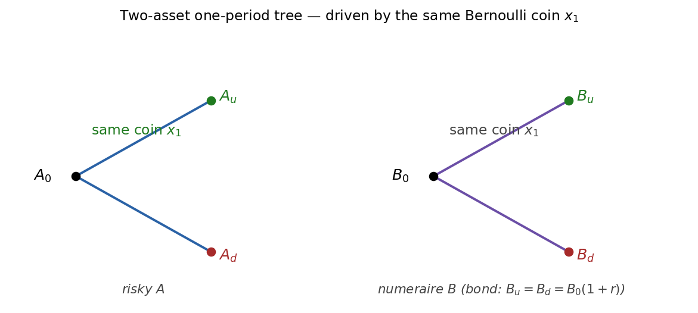
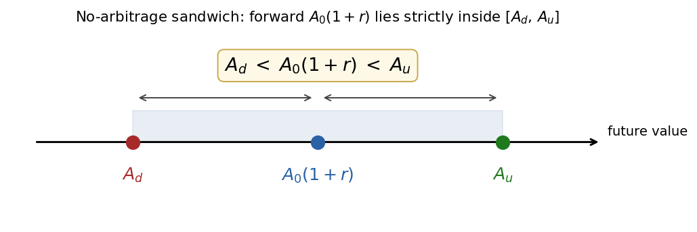
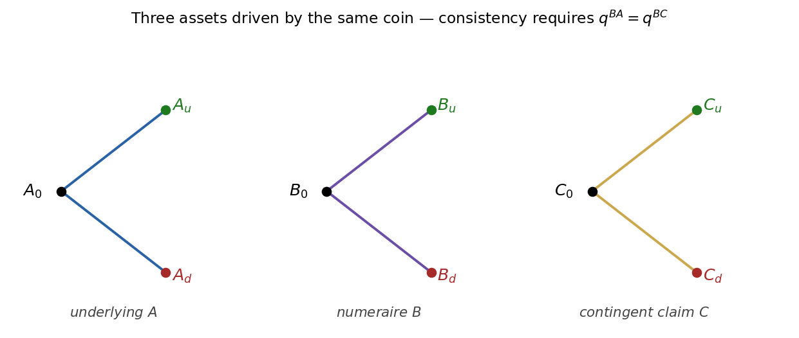
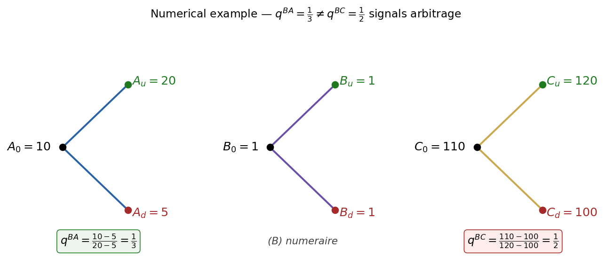
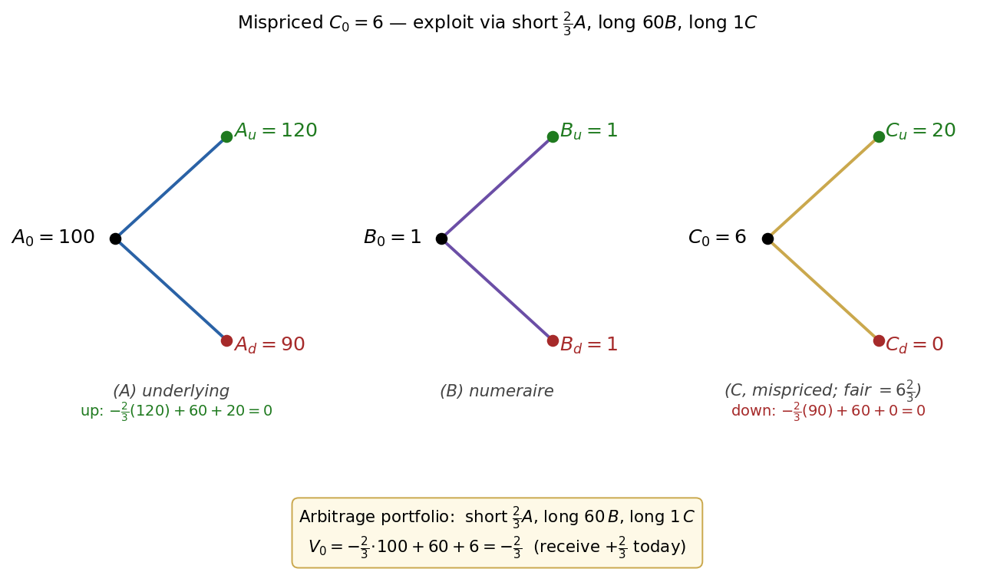
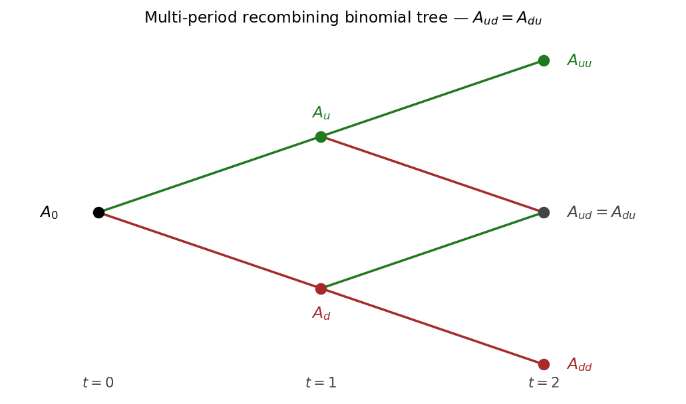

# Chapter 1 — One-Period Binomial: No-Arbitrage and Replication

This chapter develops arbitrage-free pricing in the simplest possible model: a single risky asset with two future values, observed over one time step. We introduce a numeraire bond, define arbitrage, and show that the absence of arbitrage forces a unique synthetic probability measure under which discounted asset prices are martingales. Every continuous-time pricing formula in the rest of the book — Black–Scholes, Heston, HJM — is a limiting case of what is derived in the next few pages.

> Narrative spine. A derivative's price is the cost of the portfolio that replicates it, computed as a discounted expectation under a measure that makes traded assets martingales. The binomial model isolates this idea cleanly with no stochastic calculus, no measure-theoretic probability, and no Itô's lemma — yet every conceptual ingredient of the continuous-time theory appears in finite-dimensional form. We do not invoke utility theory or preferences: replication forces the price to depend only on hedging cost. Indifference pricing for non-replicable claims is treated separately in the appendix.

---

## 1. The One-Period Binomial Tree

Consider a single risky asset $A$ observed at two dates $t = 0$ and $t = 1$. At $t=1$ the price takes one of two values, $A_u$ (up) or $A_d$ (down), with real-world up-probability

$$p \in (0,1). \tag{1.1}$$

Strict positivity ($p \in (0,1)$, not $[0,1]$) keeps both states genuinely reachable under $\mathbb{P}$ and forces any equivalent martingale measure $\mathbb{Q}$ to assign positive weight to both branches as well — without it the pricing theory collapses on equivalence grounds.

*One-period binomial tree.*

The (random) time-1 price can be written as a function of a Bernoulli indicator $x_1 \in \{1, 0\}$:

$$A_1 = A_u\, x_1 + A_d\,(1 - x_1), \qquad x_1 = \begin{cases} 1 & \text{w.p. } p \\ 0 & \text{w.p. } 1-p. \end{cases} \tag{1.2}$$

A single random coordinate $x_1$ generates the whole filtration $\mathcal{F}_1$ — one source of randomness, one degree of freedom to hedge it with. That dimension match (one coin, two assets) is exactly what later delivers a *unique* risk-neutral measure. Replace $x_1$ with a three-valued random variable and the count breaks: three payoffs to match, two assets, generically no replication — the simplest incomplete market.

A naïve "discounted expectation under $\mathbb{P}$" guess for the price is

$$A_0 \;=\; \frac{p\,A_u + (1-p)\,A_d}{1 + r}, \qquad A_0 \in (A_d, A_u), \tag{1.3}$$

with $r$ the one-period risk-free rate. (1.3) is *not* a pricing rule — $\mathbb{P}$ does not price, only a risk-neutral measure $\mathbb{Q}$ does. (1.3) implicitly assumes $A$ earns the risk-free rate, but a risky asset earns $r$ plus a premium; that premium is what distinguishes $\mathbb{P}$ from $\mathbb{Q}$.

### 1.1 Two numerical examples — why expected value is not enough

Two symmetric lotteries with identical $\mathbb{P}$-expectation but very different "felt" risk:

$$p = \tfrac{1}{2}, \qquad A_u = 100, \qquad A_d = -100. \tag{1.4}$$

$$p = \tfrac{1}{2}, \qquad A_u = 10^{6}, \qquad A_d = -10^{6}. \tag{1.5}$$

Both have zero expected payoff; no one would price them the same — the second is existentially ruinous. Expected value alone cannot price for a risk-averse agent. The miracle of no-arbitrage pricing (§2) is that risk-aversion cancels out as soon as the payoff is replicable.

### Case study: Buffett's long-dated SPX put sale (2006–2026)

*Berkshire Hathaway sold $\sim$ \$36B notional of European-style put options on four global equity indices (S\&P 500, FTSE, Euro Stoxx 50, Nikkei) between 2004 and 2008, collecting roughly \$4.5B in premium upfront and contracting to pay only at maturities clustering between 2018 and 2028. Buffett famously called the Black-Scholes price of these contracts "Alice in Wonderland." By the time the last expirations rolled off in 2026, every index sat well above its 2006-era strikes and the entire \$36B notional expired worthless — Berkshire kept the full \$4.5B premium plus 20 years of float.*

**Context.** The contracts were European, deeply out-of-the-money (struck close to the 2006–2008 spot levels), and could not be exercised before maturity — the only cashflow risk was the terminal payoff $\max(K - S_T, 0)$ at expiries 15–20 years out. Counterparties (mostly investment banks repackaging structured-product downside protection) wanted a long-vol, long-equity-tail hedge; only an entity with a permanent capital base could plausibly *write* it without onerous collateral terms. Buffett's pitch was simple: over 20 years, the indices in question had never been negative once you included dividends, and Berkshire's $\mathbb{P}$-view assigned essentially zero probability to the strikes being breached at expiry. Realised history validated him: over 2006–2026, the S\&P 500 went from $\sim$ 1280 in March 2006 to $\sim$ 5300 in May 2026, a 4$\times$ cumulative move; the Nikkei staged a similar (delayed) recovery; FTSE and Euro Stoxx 50 both finished above their 2006 marks. Every option ended worthless.

**Math mapping.** Read this through the one-period machinery of §1. Berkshire's $\mathbb{P}$-expected payoff was deeply negative (i.e. the option had near-zero $\mathbb{P}$-expected loss to the writer); the bank counterparties' $\mathbb{Q}$-expected payoff, computed with a Black-Scholes vol surface implying $\sim$ 20% vol over a 20-year horizon, was substantial — fat enough to justify quoting the contract at a multi-billion dollar premium. The disagreement is not mathematical error on either side; it is the formal one-period observation that the *risk-neutral* price (2.2) requires a *replicating hedge*, and at 20-year tenors there is no liquid hedge instrument — no traded 20-year SPX option, no 20-year variance swap, nothing to short against. The synthetic $\mathbb{Q}$ in §2 is constructed from prices of *traded* hedge instruments at the relevant horizon; without those, the formal $\mathbb{Q}$-price is academic and the actual transaction price gets pulled back toward the writer's $\mathbb{P}$-view plus a risk-premium charge for warehousing the un-hedgeable risk. Buffett's edge was that Berkshire's capital base (then \$120B, now well over \$300B) made the firm *effectively risk-neutral* at this scale — the marginal utility of a \$36B tail loss, conditional on it occurring inside a portfolio that size, was approximately linear, so Berkshire could quote a price close to its $\mathbb{P}$-expected loss rather than a distorted utility-of-loss price. The premium it collected was the variance risk premium that the broader market could not absorb for lack of hedge counterparties.

**Lesson.** Three takeaways for the new hire. First, the §1 separation of "preference-free pricing where replication is possible" from "preference-driven pricing where it is not" is not a textbook nicety — it is the entire economic reason this trade existed. The bank counterparties had no choice but to lay off the risk somewhere; Berkshire was the only entity sized to take it without requiring a hedge. Second, $\mathbb{Q}$-pricing is a lever, not a law: when no hedge instrument exists at your horizon, the *formal* $\mathbb{Q}$-price loses its no-arb teeth and the realised price collapses to "what does the marginal warehouser charge to hold this risk on its book." Third, the trade is a clean illustration of the variance risk premium: implied vol over 20-year horizons is structurally higher than realised vol because there is no efficient mechanism to short it; the writers of long-dated puts capture that premium and absorb the (rare, fat-tailed) downside in exchange. Berkshire kept \$4.5B + 20 years of float because its capital base was large enough to make the un-hedgeable risk warehousable on its balance sheet at a price the market was willing to pay.

---

## 2. Two-Asset Model and Arbitrage

Introduce a second asset and argue purely from the absence of arbitrage. The result is a formula that looks like an expected value — under a synthetic measure $\mathbb{Q}$ that prices every replicable claim correctly.

Two assets at $t=0, 1$: risky $A$ and numeraire $B$, both driven by the *same* Bernoulli coin. In the bond case $B_u = B_d = B_0(1+r)$; the general case allows $B$ its own leaves:

*Two parallel one-period trees: risky $A$ and numeraire $B$ branch on the same Bernoulli coin $x_1$. The bond case sets $B_u = B_d = B_0(1+r)$.*

The "same coin" assumption is the discrete-time avatar of "one Brownian motion" in continuous time: it matches risk dimension to hedge dimension and forces market completeness. The general $B_u \neq B_d$ setup extends to FX and stochastic-interest-rate models.

### 2.1 Portfolio value

Introduce a portfolio $(\alpha,\beta)$ holding $\alpha$ units of $A$ and $\beta$ units of $B$:

$$V_0 \;=\; \alpha A_0 + \beta B_0, \tag{2.1}$$

$$V_1 \;=\; \alpha A_1 + \beta B_1. \tag{2.2}$$

Weights are signed: $\alpha < 0$ is a short position in $A$, $\beta < 0$ is borrowing at the bond rate. Self-financing is automatic across the single $[0,1]$ interval (no rebalancing event); §7 imposes it explicitly in the multi-period setting. The map $(\alpha, \beta) \mapsto (V_1^u, V_1^d)$ is linear with matrix rows $(A_u, B_u)$ and $(A_d, B_d)$; invertibility ($A_u B_d \neq A_d B_u$) is exactly market completeness, revisited in §5.

### 2.2 Definition of arbitrage

An arbitrage strategy (portfolio) $(\alpha,\beta)$ is one such that

$$\text{(i)} \quad V_0 = 0, \tag{2.3}$$

$$\text{(ii)} \quad \exists\, t \text{ s.t. } \quad \text{(a)} \;\; \mathbb{P}(V_t \geq 0) = 1 \quad\text{(never lose)}, \tag{2.4}$$

$$\hspace{3.5cm} \text{(b)} \;\; \mathbb{P}(V_t > 0) > 0 \quad\text{(sometimes win)}. \tag{2.5}$$

In plain English: enter at zero cost, never lose, sometimes win — a free lunch. The "weak" form (2.5) (positive gain on a positive-probability set) is the version that delivers the EMM in the FFT.

### 2.3 Sign-sanity toy trees

Three toy trees illustrate when the definition fires:

- Tree (a): $0 \to \{1, 0\}$ — arbitrage (cost 0 today, outcome $\geq 0$ always, positive sometimes).
- Tree (b): $0 \to \{1, -1\}$ — not an arbitrage (down-state loses).
- Tree (c): $0 \to \{1, 1\}$ — arbitrage (pays 1 for sure at cost 0).

Sandwich check on $A_0/B_0$:

| Tree label | $A_0$ | $A_d$ | $A_u$ | Check $A_d/B_d < A_0/B_0 < A_u/B_u$? (with $B\equiv 1$) | Verdict |
|:---:|:---:|:---:|:---:|:---:|:---:|
| $(-)$ | $10$ | $5$ | $20$ | $5 < 10 < 20$ | No arb |
| $(+)$ | $2$ | $4$ | $15$ | $4 \not< 2$ | Arb |
| $(14\ldots)$ | $\approx 14$ | $0$ | $0$ | violates | Arb |

For tree $(-)$: $q = (A_0 - A_d)/(A_u - A_d) = (10 - 5)/(20 - 5) = 1/3$. If $A_0/B_0$ sits strictly between the two relative-price leaves the model is viable; outside, one leaf dominates.

### 2.4 Scaled-tree arbitrage illustration

Bond tree $1 \to \{1+r, 1+r\}$ vs. asset tree $1 \to \{1, 1\}$. With $\alpha$ in the asset and $-\alpha$ in the bond, the zero-cost portfolio pays $\{(1-r)\alpha,\; -\alpha r\}$. Arbitrage would require

$$\begin{pmatrix} 1-r > 0 \\ -r < 0 \end{pmatrix} \quad \text{or} \quad \begin{pmatrix} 1-r < 0 \\ -r > 0 \end{pmatrix}, \tag{2.6}$$

which simplify to the impossible sign-combinations

$$\boxed{\; r > 0 \text{ and } r < 1 \;} \quad \Vert \quad \boxed{\; r < 0 \text{ and } r > 1 \;} \tag{2.7}$$

so for reasonable $r$ no arb exists; the practical upshot is the standard ordering (2.8) below.

### 2.5 The standard ordering

$$A_0 \in (A_d, A_u), \qquad A_u > A_d, \qquad B_0 > 0. \tag{2.8}$$

The "up"/"down" labelling is WLOG; positivity of $B$ lets us form ratios $A/B$. Strict inequalities are the discrete analogue of $\sigma > 0$ in Black–Scholes.

---

## 3. No-Arbitrage Bound on $A_0$

Absence of arbitrage forces $A_0$ to lie strictly between its discounted up and down values. We show it twice — bond case first, then general numeraire.

### 3.1 Absolute-price derivation (bond case)

With $B_u = B_d = B_0(1+r)$, impose $V_0 = 0$:

$$\beta \;=\; -\,\alpha\,\frac{A_0}{B_0}. \tag{3.1}$$

A zero-cost portfolio is parameterised by the single number $\alpha$. Substitute into the terminal values:

$$\text{up: } \;\; \alpha A_u + \beta B_0(1+r) \;=\; \bigl(A_u - (1+r)A_0\bigr)\alpha, \tag{3.2}$$

$$\text{down: } \;\; \alpha A_d + \beta B_0(1+r) \;=\; \bigl(A_d - (1+r)A_0\bigr)\alpha. \tag{3.3}$$

If both brackets share a sign, an appropriate $\alpha$ creates a free lunch. The only viable case is opposite signs, and by $A_u > A_d$ the up-bracket is the positive one:

$$A_u - (1+r)A_0 > 0 \quad\text{and}\quad A_d - (1+r)A_0 < 0. \tag{3.4}$$

These combine to

$$\boxed{\; A_d \;<\; A_0(1+r) \;<\; A_u \;} \qquad \text{(no-arb)}. \tag{3.5}$$

I.e. the forward price $A_0(1+r)$ must lie strictly between the two future spot values:

*The forward price $A_0(1+r)$ must sit strictly between the two future spot leaves $A_d$ and $A_u$ — any other ordering admits an arbitrage.*

*No-arbitrage requires* $d < 1+r < u$.

$A_0(1+r)$ is the *forward price* of $A$; the sandwich is the only configuration with no dominance. In gross-return form, this is the textbook "$d < 1+r < u$".

### 3.2 Relative-price derivation (general numeraire)

The bond's role was purely as a clock; any strictly positive numeraire $B$ works the same way. With $\beta = -\alpha A_0/B_0$:

$$\alpha A_u + \beta B_u \;=\; \alpha\!\left(A_u - \frac{A_0}{B_0}\,B_u\right), \tag{3.6}$$

$$\alpha A_d + \beta B_d \;=\; \alpha\!\left(A_d - \frac{A_0}{B_0}\,B_d\right). \tag{3.7}$$

For no arbitrage the two bracketed factors must have opposite signs:

$$\left.\begin{array}{l} A_u - \dfrac{A_0}{B_0}\, B_u \;>\; 0 \\[4pt] A_d - \dfrac{A_0}{B_0}\, B_d \;<\; 0 \end{array}\right\} \quad\text{all other cases lead to arb.} \tag{3.8}$$

(Implicit non-degeneracy: the $2\times 2$ payoff matrix $\bigl(\begin{smallmatrix}A_u & A_d \\ B_u & B_d\end{smallmatrix}\bigr)$ is non-singular, equivalently $A_u/B_u \ne A_d/B_d$. This is the market-completeness hypothesis; for a bond numeraire $B_u = B_d$ it holds automatically, for a general numeraire it must be imposed.)

Equivalently, dividing through by $B_u, B_d > 0$:

$$\boxed{\;\frac{A_d}{B_d} \;<\; \frac{A_0}{B_0} \;<\; \frac{A_u}{B_u}\;} \qquad \text{(no-arbitrage condition)}. \tag{3.9}$$

In the bond case (3.9) reduces to (3.5). The numeraire-free form generalises to FX (foreign bond), swaptions (annuity), and spread options (one of the underlyings).

### 3.3 Restatement as existence of a risk-neutral weight $q$

Convert the inequality into an equality. (3.9) is equivalent to: $\exists\, q \in (0,1)$ such that

$$\boxed{\;\frac{A_0}{B_0} \;=\; q\,\frac{A_u}{B_u} \;+\; (1-q)\,\frac{A_d}{B_d}\;} \;\;\Longleftrightarrow\;\; \text{no arbitrage.} \tag{3.10}$$

A number lies strictly between two endpoints iff it is a convex combination with weights in $(0,1)$. Rearranging: $q = (A_0/B_0 - A_d/B_d)/(A_u/B_u - A_d/B_d)$ — the relative position of the current relative price within the leaf interval, depending only on observable prices, not on $p$ or utility. For an asset with positive excess return $q < p$: $\mathbb{Q}$ tilts weight to the down-state, the Girsanov shift $\mu - r$ that §8 makes explicit.

Equivalently,

$$\tilde A_0 \;=\; \mathbb{E}^{\mathbb{Q}}\!\left[\, \tilde A_1 \,\right], \qquad\text{where}\qquad \tilde A_t \;=\; \frac{A_t}{B_t} \quad\text{(relative price)}, \tag{3.11}$$

under $\mathbb{Q}$ with up-probability $q$. The relative price $\tilde A$ is a *$\mathbb{Q}$-martingale* — zero expected drift in numeraire units. The same $q$ then prices every contingent claim written on $(A,B)$.

---

## 4. A Third Asset: Replication and Arbitrage-Free Pricing

Add a contingent claim $C$ with payoff $(C_u, C_d)$. Its price is pinned down uniquely by $(A,B)$. Two demonstrations: $q$-consistency here, explicit replication in §5.

*Underlying $A$, numeraire $B$, and contingent claim $C$ — all three branch on the same coin. A single EMM exists iff the implied risk-neutral weights $q^{BA}$ and $q^{BC}$ agree.*

Each of $A$ and $C$, when priced in units of $B$, must be a martingale under some $q \in (0,1)$:

$$\tilde A_0^B \;=\; \mathbb{E}^{\mathbb{Q}}\!\left[\,\tilde A_1^B\,\right] \;\;\longrightarrow\;\; q^{BA} \in (0,1), \tag{4.1}$$

$$\tilde C_0^B \;=\; \mathbb{E}^{\mathbb{Q}}\!\left[\,\tilde C_1^B\,\right] \;\;\longrightarrow\;\; q^{BC} \in (0,1). \tag{4.2}$$

If $q^{BA} \neq q^{BC}$ no single EMM exists — the FFT signal of arbitrage. With $q^{BA}$ extracted from $(A,B)$, the fair $C_0$ must satisfy

$$\frac{C_0}{B_0} \;\stackrel{?}{=}\; \frac{C_u}{B_u}\,q^{BA} \;+\; \frac{C_d}{B_d}\,(1 - q^{BA}). \tag{4.3}$$

Disagreement signals mispricing.

### 4.1 Numerical example — mispriced third asset

Three trees:

*Numerical leaves: $A: 10\to\{20,5\}$, $B\equiv 1$, $C: 110\to\{120,100\}$. The implied weights $q^{BA}=\tfrac{1}{3}$ and $q^{BC}=\tfrac{1}{2}$ disagree — no single EMM exists, hence arbitrage.*

Step 1 — $q^{BA}$ from $(A,B)$ via (3.10):

$$10 \;=\; 20\, q^{BA} + 5\,(1 - q^{BA}) \;\;\Rightarrow\;\; q^{BA} = \tfrac{1}{3}. \tag{4.4}$$

Step 2 — extract $q^{BC}$ from $(C,B)$:

$$110 \;=\; 120\, q^{BC} + 100\,(1 - q^{BC}) \;\;\Rightarrow\;\; q^{BC} = \tfrac{10}{20} = \tfrac{1}{2}. \tag{4.5}$$

Two weights, two answers — arbitrage.

Step 3 — forcing $q = 1/3$ onto $C$:

$$\widehat C_0 \;=\; 120 \cdot \tfrac{1}{3} \;+\; 100 \cdot \tfrac{2}{3} \;=\; 40 + 66\tfrac{2}{3} \;\approx\; 106.67 \;<\; 110. \tag{4.6}$$

$C_0 = 110$ is too expensive. Short $C$ at $110$, buy the $(A,B)$ replicant for $106.67$, pocket $\$3.33$.

Step 4 — explicit replication. Match $C$'s payoff with $V_0 = 110$:

$$V_0 \;=\; 10\alpha + \beta - 110 \;=\; 0 \;\;\Rightarrow\;\; \beta = 110 - 10\alpha. \tag{4.7}$$

Match each leaf (with $C$ sold short, hence the $-C_i$ term):

$$\text{up:}\quad 20\alpha + \beta - 120 \;=\; 10\alpha - 10, \tag{4.8}$$

$$\text{down:}\quad 5\alpha + \beta - 100 \;=\; -5\alpha + 10 \;=\; 0. \tag{4.9}$$

The down-leaf gives $\alpha = 2$, $\beta = 90$, $V_1^{\text{up}} = 10$. Both diagnostics ($q$-consistency and explicit replication) agree.

---

## 5. Replication — The General Recipe

Solve for $(\alpha, \beta)$ reproducing $C$'s payoff state-by-state; the fair price of $C$ is then the current value of that portfolio.

$$C_u \;=\; \alpha A_u + \beta B_u, \tag{5.1}$$

$$C_d \;=\; \alpha A_d + \beta B_d. \tag{5.2}$$

Then by no-arbitrage

$$C_0 \;=\; \alpha A_0 + \beta B_0, \tag{5.3}$$

otherwise an arbitrage exists (buy cheaper, short expensive). The $2\times 2$ system has determinant $A_u B_d - A_d B_u \neq 0$ iff $A_u/B_u \neq A_d/B_d$ — market completeness.

### 5.1 Closed-form replicating weights

Multiply (5.1) by $B_d$, (5.2) by $B_u$, subtract:

$$\alpha\,(A_u B_d - A_d B_u) \;=\; C_u B_d - C_d B_u. \tag{5.4}$$

Hence

$$\boxed{\; \alpha \;=\; \frac{C_u B_d - C_d B_u}{A_u B_d - A_d B_u} \;} \tag{5.5}$$

$$\boxed{\; \beta \;=\; \frac{C_u A_d - C_d A_u}{B_u A_d - B_d A_u} \;} \tag{5.6}$$

$\alpha$ is the *delta* of $C$. In the bond case it reduces to $\alpha = (C_u - C_d)/(A_u - A_d)$, the "rise over run" delta; $\beta$ is the residual.

### 5.2 Pricing identity and explicit $q$

Substituting back into (5.3) yields

$$\boxed{\;\frac{C_0}{B_0} \;=\; q\,\frac{C_u}{B_u} \;+\; (1-q)\,\frac{C_d}{B_d}\;} \tag{5.7}$$

where

$$q \;=\; \dfrac{\dfrac{A_0}{B_0} - \dfrac{A_d}{B_d}}{\dfrac{A_u}{B_u} - \dfrac{A_d}{B_d}}. \tag{5.8}$$

The same $q$ prices every claim. The physical probability $p$ appears nowhere: traders disagreeing about $p$ still agree on $C_0$ given observable prices. Self-consistency:

$$\frac{A_0}{B_0} \;=\; q\,\frac{A_u}{B_u} \;+\; (1-q)\,\frac{A_d}{B_d}. \tag{5.9}$$

### 5.3 Bond case: the classical formula

In the bond case $B_u = B_d = B_0(1+r)$, formulas (5.7)–(5.8) reduce to

$$C_0 \;=\; \frac{1}{1+r}\bigl(q\,C_u + (1-q)\,C_d\bigr), \qquad q \;=\; \frac{A_0(1+r) - A_d}{A_u - A_d}. \tag{5.10}$$

$q \in (0,1)$ is precisely the no-arb bound (3.5). Check: $A_0 = 100, A_u = 110, A_d = 90, r = 5\%$ gives $q = 0.75$; a call struck at 100 prices to $C_0 \approx 7.14$.

### 5.4 First Fundamental Theorem (one-period form)

> No-arbitrage $\;\Longleftrightarrow\;$ $\exists\, \mathbb{Q}\sim\mathbb{P}$ s.t. for all traded assets $X$, $\;\tilde X_0 \;=\; \mathbb{E}^{\mathbb{Q}}[\,\tilde X_1\,]$,

where

$$\tilde X_t \;=\; \frac{X_t}{B_t} \qquad\text{and}\qquad \mathbb{P}(B_t > 0) = 1 \quad(\text{$B$ is called a numeraire asset}). \tag{5.11}$$

FFT: economic no-free-lunches $\Leftrightarrow$ probabilistic existence of an EMM. $\mathbb{Q} \sim \mathbb{P}$ ensures the two measures agree on null sets. When $B_t = e^{rt}$ the associated $\mathbb{Q}$ is the *risk-neutral measure*; other numeraires (stock, forward) appear in later chapters.

In the bond case:

$$\boxed{\; C_0 \;=\; \frac{1}{1+r}\,\mathbb{E}^{\mathbb{Q}}[\,C_1\,] \;} \qquad \text{otherwise } \exists \text{ an arbitrage.} \tag{5.12}$$

(5.12) is the discrete-time prototype of every practical derivatives pricing formula. In incomplete markets (more risks than instruments) uniqueness fails — multiple EMMs, the content of the Second FFT.

---

## 6. Worked Example — European Call on $A$ Struck at 100

Setup: $A: 100 \to \{120, 90\}$; $B: 1 \to \{1, 1\}$ ($r = 0$); $C$ payoff $\{20, 0\}$ (call struck at $K=100$).

A call/put gives the right (not obligation) to buy/sell $A$ at $K$ at $t=1$:

$$\text{Call}(A_1; K) \;=\; \max(A_1 - K,\; 0). \tag{6.1}$$

$$\text{Put}(A_1; K) \;=\; \max(K - A_1,\; 0). \tag{6.2}$$

The payoffs at maturity are the canonical hockey-sticks:

*Vanilla call and put payoffs.*

### 6.1 Solve replication

System from (5.1)–(5.2): $120\alpha + \beta = 20$, $90\alpha + \beta = 0$. Subtract: $\alpha = 2/3$, $\beta = -60$.

$$\alpha = \tfrac{2}{3}, \qquad \beta = -60. \tag{6.3}$$

Delta $\alpha = 2/3$ is the discrete analog of $\Delta = N(d_1)$.

### 6.2 No-arbitrage value of $C$

$$C_0 \;=\; \tfrac{2}{3}\cdot 100 + (-60) \;=\; 6\tfrac{2}{3}. \tag{6.4}$$

### 6.3 Cross-check via risk-neutral formula

From (5.10) with $r=0$:

$$100 \;=\; q\cdot 120 + (1-q)\cdot 90 \;=\; 90 + 30q \;\;\Rightarrow\;\; q = \tfrac{1}{3}. \tag{6.5}$$

Therefore

$$C_0 \;=\; q \cdot 20 + (1-q)\cdot 0 \;=\; \tfrac{1}{3}\cdot 20 \;=\; 6\tfrac{2}{3}. \tag{6.6}$$

Both methods agree: $C_0 = 6\tfrac{2}{3}$, independent of $p$.

### 6.4 Constructing the arbitrage when $C_0 = 6$ (mispriced)

Trees:

*With $C$ trading at $6$ (fair value $6\tfrac{2}{3}$), the portfolio short $\tfrac{2}{3}A$, long $60B$, long $1C$ collects $+\tfrac{2}{3}$ today and pays exactly $0$ in both terminal states.*

Strategy: short $\tfrac{2}{3}$ of $A$, long $60$ of $B$, long $1$ unit of $C$. Initial cashflow:

$$V_0 \;=\; -\tfrac{2}{3}\cdot 100 + 60 + 6 \;=\; -\tfrac{2}{3}. \tag{6.7}$$

i.e. the arbitrage pays $+\tfrac{2}{3}$ today. Terminal values:

$$V_1^{(u)} \;=\; -\tfrac{2}{3}\cdot 120 + 60 + 20 \;=\; 0, \tag{6.8}$$

$$V_1^{(d)} \;=\; -\tfrac{2}{3}\cdot 90 + 60 + 0 \;=\; 0. \tag{6.9}$$

The agent pockets $\tfrac{2}{3}$ today, zero risk at $t=1$ — confirming the no-arb price is $6\tfrac{2}{3}$.

---

## 7. Multi-Period Binomial

Multi-period pricing is one-period pricing applied iteratively backward through the tree.

Extend to $N$ periods. Let $x_n$ be i.i.d. Bernoulli $\pm 1$ with $\mathbb{P}(x_n = +1) = p$. The asset compounds multiplicatively:

$$A_n \;=\; A_{n-1}\, e^{c\, x_n}, \tag{7.1}$$

where $c$ is a step size (to be calibrated in §8). The tree branches recursively:

*Two-step recombining tree: $A_0 \to \{A_u, A_d\} \to \{A_{uu}, A_{ud}=A_{du}, A_{dd}\}$. The middle $t=2$ node is shared because up-then-down equals down-then-up.*

and likewise for $B$. These are recombining trees, so $A_{ud} = A_{du}$.

The multiplicative update guarantees $A_n > 0$ on every path and makes $\log A_n$ a random walk — the precondition for the log-normal CLT limit. After $N$ steps the terminal price $A_0 u^k d^{N-k}$ has $\mathbb{P}$-probability $\binom{N}{k} p^k (1-p)^{N-k}$ — binomial in the up-count.

### 7.1 Filtration and arbitrage

A strategy $(\alpha_t, \beta_t)$ must be *adapted* to $\mathcal{F}_t$ (no peeking at $A_{t+1}$). An arbitrage has $V_0 = 0$ and $\exists\, t$ with $\mathbb{P}(V_t \geq 0) = 1$, $\mathbb{P}(V_t > 0) > 0$. We also impose *self-financing* ($V_{t+1}^- = V_{t+1}$) — without it, every claim would be trivially replicable by capital injection.

### 7.2 Martingale characterisation (multi-period)

$$\boxed{\;\text{no arb} \;\Longleftrightarrow\; \exists\, \mathbb{Q} \sim \mathbb{P} \text{ s.t. } \forall\, t < s \text{ and all traded } X, \quad \tilde X_t \;=\; \mathbb{E}^{\mathbb{Q}}\!\left[\, \tilde X_s \,\middle|\, \mathcal{F}_t \,\right]. \;} \tag{7.2}$$

Relative prices are $\mathbb{Q}$-martingales. The tower property lets us price by *backward induction*: roll back one step at a time using (5.10). For American options, at each node take $\max(\text{exercise}, \text{discounted continuation})$. Path-dependent claims add state variables.

---

## 8. Matching Drift and Volatility

Calibrate $(c, p)$ so the tree approximates geometric Brownian motion with drift $\mu$, volatility $\sigma$:

$$A_n \;=\; A_{n-1}\, e^{\sigma\sqrt{\Delta t}\, x_n} \tag{8.1}$$

(step size $c = \sigma\sqrt{\Delta t}$). Matching $\sigma^2 T$ to $N c^2$ forces $c^2 = \sigma^2 \Delta t$ — the *diffusive scaling* that makes the limit Brownian rather than trivial.

### 8.1 Matching the mean of the log-return

Sum $N$ steps:

$$\ln\!\left(\frac{A_T}{A_0}\right) \;=\; \sigma\sqrt{\Delta t} \;\sum_{n=1}^{N} x_n, \qquad N\,\Delta t = T. \tag{8.2}$$

Take expectation:

$$\mathbb{E}\!\left[\,\ln\!\frac{A_T}{A_0}\,\right] \;=\; \sigma\sqrt{\Delta t}\,\cdot N\,(2p - 1) \;=\; (\mu - \tfrac{1}{2}\sigma^2)\, T. \tag{8.3}$$

The target $(\mu - \tfrac{1}{2}\sigma^2)T$ is the Itô correction for GBM. Solve for $p$:

$$2p - 1 \;=\; \frac{\mu - \tfrac{1}{2}\sigma^2}{\sigma}\,\sqrt{\Delta t}, \tag{8.4}$$

$$\boxed{\; p \;=\; \tfrac{1}{2}\!\left[\, 1 \;+\; \frac{\mu - \tfrac{1}{2}\sigma^2}{\sigma}\,\sqrt{\Delta t}\,\right]. \;} \tag{8.5}$$

For $A$ to grow on average at $e^{\mu T}$, $\log A$ must grow at $(\mu - \tfrac{1}{2}\sigma^2)T$ — the Itô penalty. Equity with $\mu = 10\%$, $\sigma = 20\%$, $\Delta t = 1/252$ gives $p \approx 0.513$ (a $1.3\%$ daily tilt that aggregates to $8\%$ annual log-drift over $252$ steps).

### 8.2 Matching the variance

$$\mathbb{V}\!\left[\,\ln\!\frac{A_T}{A_0}\,\right] \;=\; \sigma^2\,\Delta t\,\cdot N\,\mathbb{V}[x_i]. \tag{8.6}$$

For the Bernoulli $\pm 1$:

$$\mathbb{V}[x_i] \;=\; \mathbb{E}[x_i^2] - (\mathbb{E}[x_i])^2 \;=\; 1 - \left(\frac{\mu - \tfrac{1}{2}\sigma^2}{\sigma}\right)^{\!2}\Delta t. \tag{8.7}$$

Hence

$$\mathbb{V}\!\left[\,\ln\!\frac{A_T}{A_0}\,\right] \;=\; \sigma^2\, T \cdot \left(1 - \left(\frac{\mu - \tfrac{1}{2}\sigma^2}{\sigma}\right)^{\!2}\Delta t\right). \tag{8.8}$$

As $\Delta t \to 0$ the variance tends to $\sigma^2 T$.

### 8.3 Risk-neutral probability $q$ for the calibrated tree

The calculation parallels §8.1 with $\mu \mapsto r$. Bank account at rate $r$:

$$B_t \;=\; e^{r t}, \qquad B_n \;=\; B_{n-1}\, e^{r\,\Delta t}. \tag{8.9}$$

The martingale identity

$$\frac{A_t}{B_t} \;=\; \mathbb{E}^{\mathbb{Q}}\!\left[\,\frac{A_s}{B_s}\,\middle|\, \mathcal{F}_t\,\right] \tag{8.10}$$

applied to one step gives

$$\frac{A_{n-1}}{B_{n-1}} \;=\; \frac{A_{n-1}}{B_{n-1}}\, e^{\sigma\sqrt{\Delta t} - r\Delta t}\, q \;+\; \frac{A_{n-1}}{B_{n-1}}\, e^{-\sigma\sqrt{\Delta t} - r\Delta t}\,(1-q). \tag{8.11}$$

Cancel $A_{n-1}/B_{n-1}$ and solve:

$$q \;=\; \frac{e^{r\Delta t} - e^{-\sigma\sqrt{\Delta t}}}{e^{\sigma\sqrt{\Delta t}} - e^{-\sigma\sqrt{\Delta t}}}. \tag{8.12}$$

*CRR form.* Writing $u = e^{\sigma\sqrt{\Delta t}}$ and $d = e^{-\sigma\sqrt{\Delta t}}$, (8.12) becomes the familiar Cox–Ross–Rubinstein formula

$$q \;=\; \frac{e^{r\Delta t} - d}{u - d}. \tag{8.13}$$

$d < e^{r\Delta t} < u$ is exactly $q \in (0,1)$. (8.13) is the workhorse of discrete-time option pricing.

### 8.4 Small-$\Delta t$ expansion of $q$

Using $e^x \sim 1 + x + \tfrac{1}{2}x^2 + o(x^2)$:

Numerator:

$$\text{num} \;=\; \big(1 + r\Delta t\big) - \big(1 - \sigma\sqrt{\Delta t} + \tfrac{1}{2}\sigma^2\Delta t\big) + \cdots \;=\; \sigma\sqrt{\Delta t} + \big(r - \tfrac{1}{2}\sigma^2\big)\Delta t + \cdots \tag{8.14}$$

Denominator:

$$\text{denom} \;=\; \big(1 + \sigma\sqrt{\Delta t} + \tfrac{1}{2}\sigma^2\Delta t\big) - \big(1 - \sigma\sqrt{\Delta t} + \tfrac{1}{2}\sigma^2\Delta t\big) + \cdots \;=\; 2\sigma\sqrt{\Delta t} + \cdots \tag{8.15}$$

Ratio:

$$q \;=\; \tfrac{1}{2}\!\left[\,1 \;+\; \frac{r - \tfrac{1}{2}\sigma^2}{\sigma}\,\sqrt{\Delta t}\,\right] + \cdots \tag{8.16}$$

This matches (8.5) with $\mu \mapsto r$: the swap $\mu \mapsto r$ *is* the Girsanov shift from $\mathbb{P}$ to $\mathbb{Q}$ in one line — the equity risk premium $\mu - r$ absorbed into the coin bias.

$$\mathbb{E}^{\mathbb{Q}}\!\left[\,\ln\!\frac{A_T}{A_0}\,\right] \;=\; \big(r - \tfrac{1}{2}\sigma^2\big)\, T, \tag{8.17}$$

$$\mathbb{V}^{\mathbb{Q}}\!\left[\,\ln\!\frac{A_T}{A_0}\,\right] \;=\; \sigma^2\, T + \xi\,\Delta t, \tag{8.18}$$

with $\xi \Delta t \to 0$. Volatility survives the measure change (Girsanov shifts drifts only) — this is why $\sigma$ is calibrated from market prices without ever estimating $\mu$. Inverting (5.10)/(8.13) at a quoted option price gives the *implied volatility*.

---

## 9. Limiting Distribution

As $N \to \infty$ the calibrated tree converges to a log-normal distribution — equivalently, GBM. §11 gives the rigorous CF proof. Take $N \to \infty$ in (8.2):

$$\ln\!\left(\frac{A_T}{A_0}\right) \;=\; \sigma\sqrt{\Delta t}\,\sum_{n=1}^{N} x_n \;\xrightarrow[N \to +\infty]{d}\; \mathcal{N}(\,\cdot\,;\,\cdot\,), \tag{9.1}$$

with

$$\text{mean} = \big(\mu - \tfrac{1}{2}\sigma^2\big)\, T, \qquad \text{var} = \sigma^2\, T. \tag{9.2}$$

CLT on $N$ scaled coin flips with bias (8.5). Equivalently:

$$A_T \;\stackrel{d}{=}\; A_0\, e^{(\mu - \frac{1}{2}\sigma^2)\, T \;+\; \sigma\sqrt{T}\, Z}, \qquad Z \sim_{\mathbb{P}} \mathcal{N}(0;1). \tag{9.3}$$

Taking the expectation (MGF of a Gaussian):

$$\mathbb{E}[A_T] \;=\; A_0\, e^{(\mu - \frac{1}{2}\sigma^2)T} \cdot \mathbb{E}\!\left[\, e^{\sigma\sqrt{T}\, Z}\,\right] \;=\; A_0\, e^{(\mu - \frac{1}{2}\sigma^2)T} \cdot e^{\frac{1}{2}\sigma^2 T} \;=\; A_0\, e^{\mu T}. \tag{9.4}$$

The Itô $-\tfrac{1}{2}\sigma^2 T$ in the median exponent and the $+\tfrac{1}{2}\sigma^2 T$ from the MGF cancel: $\mu$ is the growth rate of the *expectation*, $\mu - \tfrac{1}{2}\sigma^2$ that of the *log-median*. Under $\mathbb{Q}$, $\mathbb{E}^{\mathbb{Q}}[A_T] = A_0 e^{rT}$.

---

## 10. Existence of Martingale Measure $\Rightarrow$ No Arbitrage

The proof of one direction of the FFT — short, general, no completeness required.

Setup. $A_t^{(1)}, \ldots, A_t^{(n)} \geq 0$ $\mathbb{P}$-a.s., $B_t > 0$ $\mathbb{P}$-a.s., $t \in \{0, 1\}$.

Hypothesis. Suppose $\exists\, \mathbb{Q} \sim \mathbb{P}$ s.t.

$$\frac{A_0^{(k)}}{B_0} \;=\; \mathbb{E}^{\mathbb{Q}}\!\left[\,\frac{A_1^{(k)}}{B_1}\,\right], \qquad k = 1,\ldots, n. \tag{10.1}$$

Claim. Any portfolio $(\alpha^{(1)},\ldots,\alpha^{(n)},\beta)$ such that

$$\mathbb{P}(V_1 \geq 0) = 1, \qquad \mathbb{P}(V_1 > 0) > 0, \tag{10.2}$$

must have $V_0 > 0$, ruling out arbitrage (which would require $V_0 = 0$).

Derivation. Compute $V_0$ directly:

$$V_0 \;=\; \beta\, B_0 + \sum_{k=1}^{n} \alpha^{(k)} A_0^{(k)}. \tag{10.3}$$

Factor out $B_0$ and use the martingale hypothesis:

$$V_0 \;=\; B_0\!\left[\,\beta \;+\; \sum_{k=1}^{n} \alpha^{(k)}\,\frac{A_0^{(k)}}{B_0}\,\right] \;=\; B_0\,\mathbb{E}^{\mathbb{Q}}\!\left[\,\frac{B_1}{B_1}\,\beta \;+\; \sum_{k=1}^{n} \alpha^{(k)}\,\frac{A_1^{(k)}}{B_1}\,\right]. \tag{10.4}$$

Combining:

$$V_0 \;=\; B_0\,\mathbb{E}^{\mathbb{Q}}\!\left[\,\frac{\beta\, B_1 \;+\; \sum_{k=1}^{n} \alpha^{(k)} A_1^{(k)}}{B_1}\,\right] \;=\; B_0\,\mathbb{E}^{\mathbb{Q}}\!\left[\,\frac{V_1}{B_1}\,\right] \;>\; 0. \tag{10.5}$$

The last inequality uses $B_0, B_1 > 0$ and (since $\mathbb{Q}\sim\mathbb{P}$) $V_1 \geq 0$ $\mathbb{Q}$-a.s. with $V_1 > 0$ on a $\mathbb{Q}$-positive set. Hence $V_0 > 0$ and no portfolio satisfying (10.2) can have $V_0 = 0$. $\blacksquare$

The converse (no arb $\Rightarrow \exists\mathbb{Q}$) requires a separating-hyperplane argument on the zero-cost payoff cone (Dalang–Morton–Willinger).

---

## 11. Central Limit Theorem for the Binomial Tree

CF proof that the calibrated tree of §8 converges to the Gaussian claimed in §9.

Setup. Let

$$X \;=\; \sigma\sqrt{\Delta t}\,\sum_{n=1}^{N} x_i, \qquad \Delta t \;=\; \frac{T}{N}. \tag{11.1}$$

With the calibrated probabilities

$$\mathbb{P}(x_i = +1) \;=\; p \;=\; \tfrac{1}{2}\!\left[\,1 \;+\; \frac{\mu - \tfrac{1}{2}\sigma^2}{\sigma}\,\sqrt{\Delta t}\,\right], \tag{11.2}$$

$$\mathbb{P}(x_i = -1) \;=\; 1 - p \;=\; \tfrac{1}{2}\!\left[\,1 \;-\; \frac{\mu - \tfrac{1}{2}\sigma^2}{\sigma}\,\sqrt{\Delta t}\,\right]. \tag{11.3}$$

Let $\hat\mu \;\doteq\; \mu - \tfrac{1}{2}\sigma^2$ (log-drift).

Goal. Show that as $N \to +\infty$,

$$X \;\xrightarrow[N\to+\infty]{d}\; \mathcal{N}\!\big(\hat\mu\, T,\; \sigma^2 T\big). \tag{11.4}$$

Method. Characteristic function. Compute

$$\mathbb{E}\!\left[\,e^{i u X}\,\right] \;=\; \mathbb{E}\!\left[\,e^{i u \sigma\sqrt{\Delta t}\,\sum_{n=1}^{N} x_i}\,\right] \;=\; \left(\,\mathbb{E}\!\left[\,e^{i u \sigma\sqrt{\Delta t}\, x_i}\,\right]\,\right)^{N}. \tag{11.5}$$

CFs factor over independent sums and uniquely determine distributions (Lévy continuity). Expand the inner expectation:

$$\mathbb{E}\!\left[\,e^{i u \sigma\sqrt{\Delta t}\, x_i}\,\right] \;=\; \mathbb{E}\!\left[\,1 + i u \sigma\sqrt{\Delta t}\, x_i - \tfrac{1}{2}u^2\sigma^2\,\Delta t\, x_i^2 + o(\Delta t)\,\right] \tag{11.6}$$

$$= 1 + i u \sigma\sqrt{\Delta t}\,\mathbb{E}[x_i] - \tfrac{1}{2}u^2\sigma^2\,\Delta t\,\mathbb{E}[x_i^2] + o(\Delta t). \tag{11.7}$$

Next compute:

$$\mathbb{E}[x_i] \;=\; 2p - 1 \;=\; \frac{\hat\mu}{\sigma}\,\sqrt{\Delta t}, \tag{11.8}$$

and

$$\mathbb{E}[x_i^2] \;=\; 1. \tag{11.9}$$

Substituting:

$$\boxed{\;\mathbb{E}\!\left[\,e^{i u \sigma\sqrt{\Delta t}\, x_i}\,\right] \;=\; 1 + i u\, \hat\mu\, \Delta t \;-\; \tfrac{1}{2} u^2 \sigma^2\, \Delta t \;+\; o(\Delta t).\;} \tag{11.10}$$

The $\sqrt{\Delta t}$ cancels because $\mathbb{E}[x_i] = O(\sqrt{\Delta t})$ — exactly the calibration (8.5).

So:

$$\mathbb{E}\!\left[\,e^{i u X}\,\right] \;=\; \left(1 + \big(i u\,\hat\mu - \tfrac{1}{2}\sigma^2 u^2\big)\,\Delta t \;+\; o(\Delta t)\right)^{N} \xrightarrow[N\to\infty]{}\; e^{\,\big(i u\,\hat\mu - \tfrac{1}{2}\sigma^2 u^2\big)\, T}, \tag{11.11}$$

using the classical limit

$$\left(1 + \tfrac{a}{N}\right)^{N} \;\xrightarrow[N\to\infty]{}\; e^{a}. \tag{11.12}$$

Recognising the right-hand side of (11.11) as the characteristic function of a Gaussian with mean $\hat\mu T$ and variance $\sigma^2 T$:

$$\boxed{\;X \;\xrightarrow[N\to\infty]{d}\; \mathcal{N}\!\big(\hat\mu\, T;\; \sigma^2 T\big). \;} \tag{11.13}$$

CF of $\mathcal{N}(m, v)$ is $e^{i u m - \tfrac{1}{2} v u^2}$; matching to (11.11) gives $m = \hat\mu T$, $v = \sigma^2 T$, exactly (9.2). $A_T$ is log-normal in the limit — geometric Brownian motion derived from scratch without stochastic calculus.

---

## Worked Examples

### WE-1. Why $\mathbb{P}$-expectation is not a price

Take a tree with $A_0 = 100$, $A_u = 110$, $A_d = 95$, $r = 0$, and physical probability $p = 0.6$. The naïve discounted expectation is $0.6 \cdot 110 + 0.4 \cdot 95 = 104$, suggesting the asset is *under-priced*. But under the risk-neutral measure $q = (100 - 95)/(110 - 95) = 1/3$, the discounted expectation is $\tfrac13 \cdot 110 + \tfrac23 \cdot 95 = 100$ — exactly the spot. Two traders disagreeing about $p$ would compute different $\mathbb{P}$-expectations; neither is a price. The price is what it costs to *replicate* the payoff, and replication knows nothing about $p$.

### WE-2. Sign check with three small trees | Tree | $A_0$ | $A_d$ | $A_u$ | Check $A_d < A_0 < A_u$? | Verdict |
|:---:|:---:|:---:|:---:|:---:|:---:|
| $(-)$ | $10$ | $5$ | $20$ | $5 < 10 < 20$ | No arb |
| $(+)$ | $2$ | $4$ | $15$ | $4 \not< 2$ | Arb |
| $(14\ldots)$ | $\approx 14$ | $0$ | $0$ | violates | Arb |

For tree $(-)$: $q = (10-5)/(20-5) = 1/3$. Diagnosis is a strict inequality test, no probabilities required.

### WE-3. Third asset mispriced - $A$: $10 \to \{20, 5\}$; $B$: $1 \to \{1,1\}$ (so $r=0$); $C$: $110 \to \{120, 100\}$.
- $q$ from $A$-tree: $q^{BA} = 1/3$. Fair $\widehat C_0 = 120 \cdot \tfrac{1}{3} + 100 \cdot \tfrac{2}{3} \approx 106.67 < 110$.
- Replicating portfolio: $\alpha = 2$, $\beta = 90$. Selling $C$ at $110$ and buying $(2,90)$ in $(A,B)$ gives $V_0 = 0$, $V_1^{\text{up}} = +10$, $V_1^{\text{down}} = 0$ — an arbitrage.
- Internal solve of $q^{BC}$: $110 = 120 q + 100(1-q) \Rightarrow q^{BC} = 1/2$, inconsistent with $q^{BA} = 1/3$.

### WE-4. European call on $A$ at strike $K=100$ With tree $100 \to \{120, 90\}$, $r = 0$, $K = 100$:

| quantity | value |
|---|---|
| $\alpha$ (shares of $A$) | $2/3$ |
| $\beta$ (bonds) | $-60$ |
| $q$ (risk-neutral prob.) | $1/3$ |
| no-arb call price $C_0$ | $6\tfrac{2}{3}$ |
| arbitrage profit if $C_0 = 6$ | $+\tfrac{2}{3}$ at $t=0$, $0$ at $t=1$ |

Put-call parity check: put has payoff $\{0, 10\}$, $P_0 = 2/3 \cdot 10 = 20/3$, so $C_0 - P_0 = 0 = A_0 - K e^{-rT}$.

---

## Key Takeaways

- Naive expected-value pricing fails for risk-averse agents: a $\pm 100$ coin-flip is nothing like a $\pm 10^6$ coin-flip, yet they have equal expectation.
- One-period no-arbitrage: $V_0 = 0$, $\mathbb{P}(V_t \geq 0) = 1$, $\mathbb{P}(V_t > 0) > 0$ defines an arb; no-arb is equivalent to $A_d/B_d < A_0/B_0 < A_u/B_u$, i.e. in the bond case $A_d < A_0(1+r) < A_u$.
- Risk-neutral measure: $\exists\, q \in (0,1)$ such that $A_0/B_0 = q\,A_u/B_u + (1-q)\,A_d/B_d$, with explicit $q = (A_0/B_0 - A_d/B_d)/(A_u/B_u - A_d/B_d)$.
- Replication = pricing: any claim $C$ with payoffs $(C_u, C_d)$ can be synthesised by $(\alpha, \beta)$ in $(A, B)$; formulas (5.5)–(5.6). The unique arbitrage-free price is $C_0/B_0 = q\, C_u/B_u + (1-q)\, C_d/B_d$, which in the bond case reduces to $C_0 = \frac{1}{1+r}\mathbb{E}^{\mathbb{Q}}[C_1]$.
- Relative prices are $\mathbb{Q}$-martingales — First Fundamental Theorem: no arb $\Leftrightarrow \exists\, \mathbb{Q}\sim\mathbb{P}$ s.t. $\tilde X_0 = \mathbb{E}^{\mathbb{Q}}[\tilde X_1]$ for every traded $X$.
- Multi-period extension: $\mathcal{F}_t$-adapted strategies, $\tilde X_t = \mathbb{E}^{\mathbb{Q}}[\tilde X_s | \mathcal{F}_t]$ for all $t < s$.
- Calibrated tree: $c = \sigma\sqrt{\Delta t}$ and $p = \tfrac{1}{2}[1 + (\mu - \tfrac{1}{2}\sigma^2)\sqrt{\Delta t}/\sigma]$ match log-normal drift $\mu - \tfrac{1}{2}\sigma^2$ and variance $\sigma^2$ per unit time.
- Risk-neutral $q$ in continuous calibration: $q = (e^{r\Delta t} - e^{-\sigma\sqrt{\Delta t}})/(e^{\sigma\sqrt{\Delta t}} - e^{-\sigma\sqrt{\Delta t}})$, expanding to $\tfrac{1}{2}[1 + (r - \tfrac{1}{2}\sigma^2)\sqrt{\Delta t}/\sigma]$. The swap $\mu \mapsto r$ is the Girsanov shift.
- Limit law: $\ln(A_T/A_0) \xrightarrow{d} \mathcal{N}((\mu - \tfrac{1}{2}\sigma^2)T, \sigma^2 T)$ and $\mathbb{E}[A_T] = A_0 e^{\mu T}$.
- One direction of the FFT proved explicitly: existence of $\mathbb{Q}$ forces $V_0 = B_0\, \mathbb{E}^{\mathbb{Q}}[V_1/B_1] > 0$ for any non-negative, non-trivial terminal wealth — ruling out arbitrage.
- CLT via characteristic functions: $(1 + a/N)^N \to e^a$ produces $\mathbb{E}[e^{iuX}] \to e^{iu\hat\mu T - \frac{1}{2}\sigma^2 u^2 T}$ and hence $X \xrightarrow{d} \mathcal{N}(\hat\mu T, \sigma^2 T)$.

---

## Reference Formulas

Binomial fair-price relation (physical, not a pricing rule):
$$A_0 = \frac{p A_u + (1-p) A_d}{1+r}$$

Arbitrage (definition):
$$V_0 = 0, \qquad \mathbb{P}(V_t \geq 0) = 1, \qquad \mathbb{P}(V_t > 0) > 0$$

No-arbitrage bound (bond case):
$$A_d < A_0(1+r) < A_u$$

No-arbitrage bound (general numeraire):
$$\frac{A_d}{B_d} < \frac{A_0}{B_0} < \frac{A_u}{B_u}$$

Risk-neutral probability (general):
$$q = \dfrac{A_0/B_0 - A_d/B_d}{A_u/B_u - A_d/B_d}$$

Risk-neutral probability (bond case):
$$q = \frac{A_0(1+r) - A_d}{A_u - A_d}$$

Replicating portfolio for claim $C$:
$$\alpha = \frac{C_u B_d - C_d B_u}{A_u B_d - A_d B_u}, \qquad \beta = \frac{C_u A_d - C_d A_u}{B_u A_d - B_d A_u}$$

Risk-neutral pricing (general):
$$\frac{C_0}{B_0} = q\,\frac{C_u}{B_u} + (1-q)\,\frac{C_d}{B_d}$$

Risk-neutral pricing (bond case):
$$C_0 = \frac{1}{1+r}\,\mathbb{E}^{\mathbb{Q}}[C_1] = \frac{1}{1+r}\bigl(q\,C_u + (1-q)\,C_d\bigr)$$

First Fundamental Theorem (one-period):
$$\text{no arb} \;\Longleftrightarrow\; \exists\, \mathbb{Q}\sim\mathbb{P} \text{ s.t. } \tilde X_0 = \mathbb{E}^{\mathbb{Q}}[\tilde X_1]\ \forall\text{ traded } X,\qquad \tilde X_t = X_t/B_t$$

Multi-period martingale characterisation:
$$\text{no arb} \;\Longleftrightarrow\; \exists\, \mathbb{Q}\sim\mathbb{P}:\ \tilde X_t = \mathbb{E}^{\mathbb{Q}}[\tilde X_s | \mathcal{F}_t],\ \forall t<s,\ \forall X\text{ traded}$$

Multiplicative binomial update:
$$A_n = A_{n-1}\, e^{\sigma\sqrt{\Delta t}\, x_n}, \qquad x_n \in \{\pm 1\}$$

Calibrated physical $p$:
$$p = \tfrac{1}{2}\bigl[1 + \tfrac{\mu - \tfrac{1}{2}\sigma^2}{\sigma}\sqrt{\Delta t}\bigr]$$

Calibrated risk-neutral $q$ (CRR form):
$$q = \frac{e^{r\Delta t} - d}{u - d}, \qquad u = e^{\sigma\sqrt{\Delta t}},\ d = e^{-\sigma\sqrt{\Delta t}}$$

Small-$\Delta t$ expansion of $q$:
$$q \approx \tfrac{1}{2}\bigl[1 + \tfrac{r - \tfrac{1}{2}\sigma^2}{\sigma}\sqrt{\Delta t}\bigr]$$

Log-normal limit distribution:
$$\ln(A_T/A_0) \;\xrightarrow{d}\; \mathcal{N}\bigl((\mu - \tfrac{1}{2}\sigma^2)T,\ \sigma^2 T\bigr), \qquad \mathbb{E}[A_T] = A_0 e^{\mu T}$$

Call and put payoffs:
$$\text{Call}(A_1; K) = \max(A_1 - K,\; 0), \qquad \text{Put}(A_1; K) = \max(K - A_1,\; 0)$$
