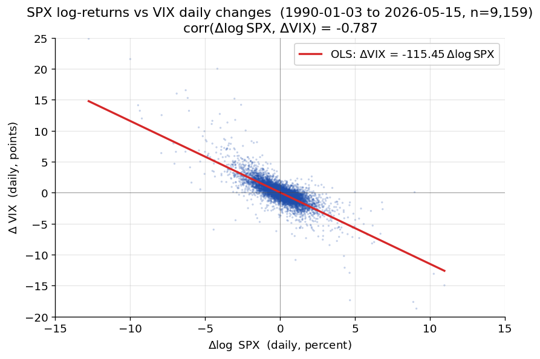
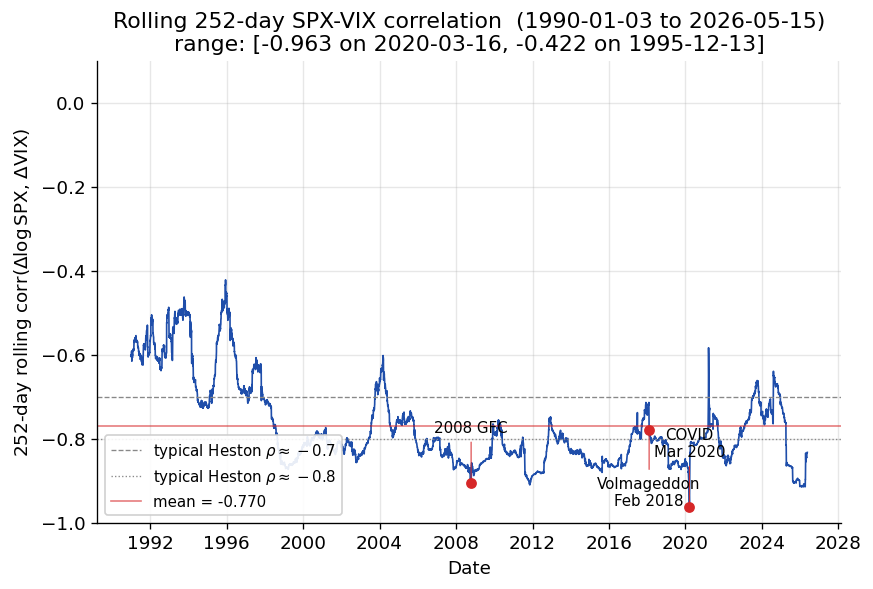
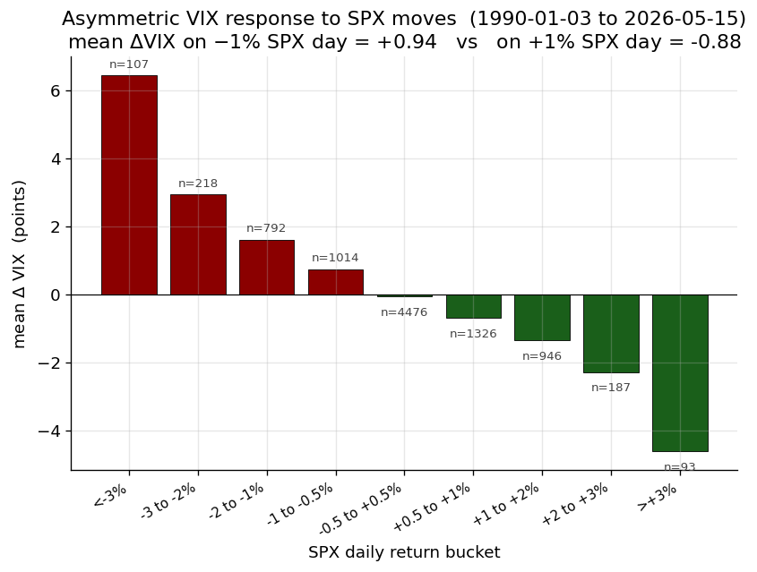

# Chapter 10 — Heston Stochastic Volatility

*Part V opens with the equity-side capstone. Chapter 6 handed us the Black–Scholes
PDE under the assumption that instantaneous variance $\sigma^{2}$ is a known
constant; every chapter since has carried that assumption along. The market,
of course, does not. Implied-volatility surfaces slope, twist, and deform in
ways that a constant-variance GBM cannot reproduce. Heston's 1993 model is
the cleanest fix: promote the variance to its own mean-reverting stochastic
process, keep tractability by choosing a square-root (CIR) dynamics for the
variance, and pay for the extra degree of freedom with a second Brownian
motion that is correlated with the underlying. The reward is a semi-closed
pricing formula via Fourier inversion, a genuine stochastic smile, and a
hedging framework that admits volatility as a traded risk factor.*

*This chapter leans on the full Part II toolkit. Two-dimensional Itô's lemma
(Chapter 3) is used in every derivation; multi-dimensional Girsanov (Chapter 5) is how
we move from the physical bivariate SDE to the risk-neutral dynamics;
Feynman–Kac (Chapter 4) underlies the Riccati ODE system for the characteristic
function; and the GBM / Black–Scholes machinery of Chapter 6 is the benchmark we
compare against. Monte Carlo variance-reduction techniques introduced in
Chapter 9 resurface when we discuss simulation-based Heston pricing. The chapter
is almost entirely self-contained analytically, but pedagogically it is the
payoff for Parts II and III.*

---

## Chapter map

1. **§10.1 Bivariate SDE** — motivation, specification, and what each
   parameter controls.
2. **§10.2 Feller condition** — when variance stays strictly positive.
3. **§10.3 Change of measure** — market price of variance risk, risk-neutral
   drift adjustments, uniqueness failure and calibration implications.
4. **§10.4 Implied volatility** — why constant-$\sigma$ GBM is inadequate and
   what shapes a stochastic-vol model must generate.
5. **§10.5 Characteristic function** — Riccati ODE derivation for the
   log-price characteristic function.
6. **§10.6 Fourier-inversion pricing** — recovering $P_{1}$ and $P_{2}$ and
   assembling the call price.
7. **§10.7 Greeks and calibration** — delta, vega, the two extra vol-of-vol
   and correlation sensitivities, calibration workflow.
8. **§10.8 Variance swaps** — a pure-variance product that prices by
   expectation under $\mathbb{Q}$.
9. **§10.9 Worked example** — a numerical Heston vs. Black–Scholes
   comparison.
10. **§10.10–§10.10B Limitations, comparisons, and extensions.**
11. **§10.11 Key takeaways**, **Appendix A** (reference formulas), and
    **Appendix B** (VIX vs SPX historical correlation study).

---

## 10.1 Bivariate SDE — motivation

The Black–Scholes world is complete: a constant volatility $\sigma$ plus the
bank account span every contingent claim. Empirically, option markets
violate this — implied vol exhibits a smile / skew across strike and a term
structure across maturity. The Heston (1993) model is the canonical fix:
promote the variance $v_t$ to its own mean-reverting square-root SDE,
correlate it with the spot, and retain semi-closed-form pricing via a
characteristic function. This chapter rebuilds the derivation from first
principles — bivariate SDE $\to$ Feller condition $\to$ change of measure with
market price of variance risk $\to$ characteristic-function ansatz $\to$ Riccati
ODEs $\to$ Fourier-inversion pricing (the $P_1, P_2$ probabilities) — and
finishes with calibration / Greeks notes and variance swaps.

The post-1987 equity smile is the empirical motivation. Pre-crash surfaces were reasonably flat; the crash and the rapid revaluation of tail risk created the persistent left skew that defines equity vol to this day. Two responses emerged: Dupire's local-vol (exact surface fit but unrealistic forward smile) and Heston (independent variance SDE with realistic forward dynamics and a tractable characteristic function via the affine structure). Heston sits between local-vol and the modern rough-vol family as the pedagogical and practical baseline.

### 10.1.1 Why stochastic vol produces a smile

A Black–Scholes lognormal has a single scale parameter $\sigma$: the
risk-neutral density of $\ln X_T$ is a tidy Gaussian with one variance.
Under Heston the conditional density (conditioning on the whole path of
$v_t$) is still lognormal — but the mixture over the $v$-path puts weight
on very quiet and very loud regimes, producing fatter tails than a single
lognormal. Fatter tails $\to$ deep OTM options are worth more than BS would
suggest $\to$ inverted BS gives higher implied vols at the wings. The
non-zero $\rho$ then asymmetrises that mixture: when spot falls, the vol
tends to spike (for $\rho<0$), which loads the left tail more than the
right. This is the skew. In short: $\alpha$ (vol-of-vol) controls the
wings (curvature / smile); $\rho$ controls the slope (skew); $\kappa$
controls how quickly the term-structure of smile flattens; $\theta$
anchors long-dated ATM; $v_0$ anchors short-dated ATM.

**Mixture intuition.** Heston is Black-Scholes with a stochastic volatility "dial" $v_t$ — mean-reverting toward $\theta$, perturbed by $\alpha\sqrt{v}\,\mathrm{d}W^v$, and correlated to spot with $\rho$. The terminal distribution of $\ln F_T$ is a continuous mixture of lognormals indexed by the path of $v$; mixing fatness creates the smile, and the spot-vol correlation tilts it into a skew.

Heston is also the canonical *affine* model: drift and diffusion-covariance are linear in $(F, v)$, so the characteristic function solves a finite-dimensional Riccati ODE system regardless of state-space dimension. The same affine structure underlies CIR short-rate models, Duffie-Pan-Singleton jump-diffusions, and CIR-style credit intensities.

### 10.1.2 FTAP recap and incompleteness

No arbitrage $\iff$ there exists a measure $\mathbb{Q} \sim \mathbb{P}$
such that all tradeables $f_t / M_t$ are $\mathbb{Q}$-martingales. This
holds always. The measure is unique only if the market is complete; in
incomplete markets (like stochastic vol) there is no unique $\mathbb{Q}$.

FTAP I (Chapter 5) gives existence of $\mathbb{Q}$ iff no arbitrage; FTAP II gives uniqueness iff the market is complete. Heston has two risk factors ($W^F, W^v$) but only one tradable risk-bearing asset ($F$); the rank mismatch makes the market incomplete, and there is a one-parameter family of risk-neutral measures parameterised by the market price of variance risk. Calibration "identifies which $\mathbb{Q}$ is currently consistent with observed option prices"; the gap between $\mathbb{P}$-parameters (from returns) and $\mathbb{Q}$-parameters (from options) is the variance risk premium.

To make this concrete, consider what "hedging" even means in an
incomplete market. In Black–Scholes, for any contingent claim $f(S_T)$,
there exists a self-financing strategy $(\Delta_t, \beta_t)$ in spot and
bank that replicates $f$ exactly at every time and in every scenario —
zero residual risk. You can therefore price $f$ by the no-arbitrage
principle: its price must equal the cost of constructing the replicating
portfolio. In Heston, no such exact replication exists using spot and
bank alone. If you run a delta-hedge based on spot only, you will be
exposed to variance innovations; your hedged portfolio will have
residual P&L proportional to the vega times the variance shock. The best
you can do with spot alone is minimise some residual-risk metric —
variance-of-P&L, say — but you cannot eliminate it. To eliminate it, you
must add another hedging instrument that is sensitive to variance —
typically another option — but then you need that option to be priced,
which requires a model, which requires a $\mathbb{Q}$, and we are back
to the choice problem.

The resolution in practice is to assume (or impose) a specific choice of
$\mathbb{Q}$, calibrate it to observed option prices (so that the
market's implied $\lambda^v$ is respected by construction), and then
perform hedging in a model-consistent way. This is called "hedging under
the calibrated measure" and it is what every vol desk does implicitly.
The hedges are not perfect — they are model hedges — and the residual
P&L reflects model risk rather than pure incompleteness-risk. But the
framework at least gives you a coherent way to think about hedging and
risk.

There is a philosophical point here that is easy to miss. In a complete
market, the "price" of a contingent claim is unambiguous — it is the
replication cost. In an incomplete market, "price" is an economic
concept, determined by demand and supply, risk preferences, and market
frictions. The model gives you a framework for representing those
ingredients compactly (via the choice of $\mathbb{Q}$), but the model
does not determine the price on its own. This is why calibration, rather
than pure derivation, is the central activity of a stochastic vol
practitioner: the prices exist because people trade, and the model is
merely the language in which those prices are expressed.

### 10.1.3 From Black–Scholes drift to the bivariate SDE

Under $\mathbb{P}$, a risky asset $X_t$ that is traded satisfies
$$
\mathrm{d}X_t = \mu_t\,\mathrm{d}t + \sigma_t\,\mathrm{d}\tilde{W}_t^{\mathbb{P}},
\qquad \frac{f_t}{M_t} = \mathbb{E}^{\mathbb{Q}}\!\left[\frac{f_T}{M_T}\right],
\tag{10.1}
$$
and the $\mathbb{P}$-Brownian motion is linked to the $\mathbb{Q}$-Brownian
motion by
$$
\mathrm{d}\tilde{W}_t = \lambda_t\,\mathrm{d}t + \mathrm{d}W_t^{\mathbb{Q}}.
\tag{10.2}
$$
Substituting,
$$
\mathrm{d}X_t = (\mu_t - \lambda_t\sigma_t)\,\mathrm{d}t + \sigma_t\,\mathrm{d}W_t^{\mathbb{Q}},
\tag{10.3}
$$
where $\lambda_t$ is the market price of risk. If $X$ is itself traded,
then under $\mathbb{Q}$ its drift must be $r X_t$, pinning down
$\mu_t - \lambda_t \sigma_t = r X_t$. This is precisely the Girsanov
shift derived in Chapter 5 — the Radon–Nikodym density
$Z_t = \exp\!\bigl(-\int_0^t\!\lambda_s\,\mathrm{d}\tilde{W}_s^{\mathbb{P}}
- \tfrac{1}{2}\!\int_0^t\!\lambda_s^{2}\,\mathrm{d}s\bigr)$ is what
converts the $\mathbb{P}$-drift into the $\mathbb{Q}$-drift, state by
state. The reader who wants the full derivation should consult Chapter 5 §5;
we use the conclusion here.

Read this shift intuitively. Under the physical measure $\mathbb{P}$,
the asset drifts at its expected return, which includes a risk premium
over the risk-free rate — that is how risky assets compensate their
holders for bearing risk. The change of measure does not change any
actual path; it rebalances probability weight toward the states that
have been systematically overweighted by risk aversion. Under
$\mathbb{Q}$, the asset appears to drift at $r$ because the premium has
been re-absorbed into the measure. The same logic applies — but now in
two dimensions — when we introduce stochastic variance.

Here is another way to see it. Imagine running Monte Carlo simulation of
the spot under $\mathbb{P}$ and under $\mathbb{Q}$. The individual paths
look similar — in fact, on any individual path, the realisation of the
Brownian motion is the same (Girsanov tells us that the path spaces are
essentially isomorphic). What differs is the weight that each path
carries in the expectation. Under $\mathbb{P}$, the "good" paths (with
high realised returns) have high probability; under $\mathbb{Q}$, those
good paths are weighted less because risk-averse investors have bid up
their prices (making them seem less attractive from the valuation
standpoint). The effect is that $\mathbb{Q}$-expectations come out lower
for linear payoffs on risky assets than $\mathbb{P}$-expectations, which
is exactly the "risk-free rate" drift you would expect. None of this is
about the trajectory of any particular path; it is all about the
measure.

The famous economic interpretation is in terms of pricing kernels or
stochastic discount factors. The Radon–Nikodym derivative
$\mathrm{d}\mathbb{Q}/\mathrm{d}\mathbb{P}$ is essentially proportional
to a representative investor's marginal utility — a number that is high
in bad states of the world (when investors value an extra dollar most)
and low in good states. Discounting payoffs by this kernel and taking a
$\mathbb{P}$-expectation is equivalent to taking a $\mathbb{Q}$-expectation
and discounting by the risk-free rate. Derivatives pricing in incomplete
markets is thus fundamentally linked to asset-pricing theory: different
measures correspond to different assumptions about the representative
investor's risk aversion and preferences. When you calibrate Heston to
market prices, you are implicitly inferring what marginal utility looks
like in the vol dimension — at least in the part of the state space
where liquid options exist to probe.

**Futures.** For a futures price $F_t$, the Black (1976) argument (Chapter 8)
gives under $\mathbb{Q}$
$$
\frac{\mathrm{d}F_t}{F_t} = \sigma\,\mathrm{d}W_t^{\mathbb{Q}},
\qquad \text{(Black model for futures prices)}.
\tag{10.4}
$$
Under $\mathbb{P}$,
$$
\frac{\mathrm{d}F_t}{F_t} = \mu_t\,\mathrm{d}t + \sigma\,\mathrm{d}W_t^{\mathbb{P}}.
\tag{10.5}
$$

We work in the futures frame partly out of convenience — futures are
martingales under the risk-neutral measure with no drift to carry around
— and partly because it highlights the key point that the volatility
structure is what distinguishes Heston from Black, not the drift. The
drift in the risk-neutral world is pinned down by arbitrage; the
interesting degree of freedom is the stochastic behaviour of the
diffusion coefficient.

The practical virtue of the futures-price framework goes beyond
cleanliness. For index and equity markets, listed options actually
expire on forward-contract-settled underliers or near-dated futures; for
FX options, the relevant underlier is a forward rate; for commodity
options, the entire pricing paradigm is built on futures rather than on
any elusive "spot" price. So Black (1976) is not a toy simplification —
it is the framework that actually prices the bulk of liquid options
traded globally. Heston's original 1993 paper followed the Black
tradition (although Heston expressed things in terms of spot with carry;
the two are isomorphic), and the industry has largely standardised on
the futures-frame parameterisation. When a practitioner says
"$\mathrm{d}F/F = \sqrt{v}\,\mathrm{d}W$," they are stating the
Heston–Black benchmark dynamics that underlie essentially every vanilla
calibration you will encounter. Even when the underlying is a spot
rather than a futures, the drift term $r - q$ (rate minus dividend
yield) can be absorbed into the forward price, and the residual dynamics
look like (10.4) with no drift. In other words: by working in the
futures frame, you focus the analysis exactly on what makes Heston
different from Black–Scholes — the diffusion $\sqrt{v_t}$ — and defer
all drift-related complications to a thin wrapper around the core SDE.

### 10.1.4 The Heston bivariate system

We want to correct for stochastic volatility. Replace the constant
$\sigma$ by $\sqrt{v_t}$ and give $v_t$ its own SDE:
$$
\boxed{\;
\frac{\mathrm{d}F_t}{F_t} = \mu_t\,\mathrm{d}t + \sqrt{v_t}\,\mathrm{d}W_t^{\mathbb{P},F}
\;}
\tag{10.6}
$$
$$
\boxed{\;
\mathrm{d}v_t = \kappa^{\mathbb{P}}\!\left(\theta^{\mathbb{P}} - v_t\right)\mathrm{d}t + \alpha\sqrt{v_t}\,\mathrm{d}W_t^{\mathbb{P},v}
\;}
\tag{10.7}
$$
with
$$
\mathrm{d}W_t^{\mathbb{P},F}\cdot \mathrm{d}W_t^{\mathbb{P},v} = \rho\,\mathrm{d}t,
\qquad (W^{\mathbb{P},F}, W^{\mathbb{P},v}) \text{ correlated}.
\tag{10.8}
$$

Look carefully at the choice $\sqrt{v_t}$ for the diffusion coefficient.
It is not incidental. Modelling in the variance rather than in the
volatility pays two dividends. First, the variance is the natural
additive quantity: variances of independent returns add, volatilities do
not, and any equation that treats variance linearly will be cleaner than
the equivalent vol-level equation. Second, the square-root CIR diffusion
$\alpha\sqrt{v_t}\,\mathrm{d}W^v$ has the beautiful property that its
diffusion coefficient vanishes as $v_t \to 0$, which acts as a soft
floor: a variance that wanders toward zero stops diffusing and is pulled
back up by the mean-reversion drift. This is how Heston constructs a
process that stays non-negative under mild parameter conditions, without
resorting to reflecting barriers or hard truncations.

Contrast this with the SABR alternative. SABR models the instantaneous
vol (not variance) with lognormal dynamics:
$\mathrm{d}\sigma_t = \alpha \sigma_t\,\mathrm{d}W^\sigma$. Lognormal vol
automatically stays positive, which is appealing, but the tradeoff is
that SABR dynamics are not affine, and SABR does not admit a closed-form
characteristic function. Instead, SABR is typically priced via Hagan's
asymptotic expansion — an approximation that works brilliantly for
short maturities and ATM moneyness but degrades at wings and long dates.
Heston gives up lognormal positivity in exchange for the affine
structure, and the square-root floor on the CIR process is the
mathematical trick that makes this exchange work. Either choice is
defensible; both dominate naive alternatives like an arithmetic Brownian
motion on vol (which can go negative and cannot be rescued by any
floor).

A subtle point about (10.6): the spot is driven by
$\sqrt{v_t}\,\mathrm{d}W^F$, not by $\sqrt{v_t}\,\mathrm{d}t$ plus
$\mathrm{d}W^F$ with some scaling. The diffusion coefficient is a random
function of $v_t$, which is itself stochastic. This is what makes the
spot a "stochastic-volatility" process rather than a "time-changed"
Brownian motion. Equivalently, you can think of spot's log-returns as
Brownian motion scaled at each instant by $\sqrt{v_t}$: when $v_t$ is
high, returns are more volatile; when $v_t$ is low, returns are calmer.
The picture to keep in mind is a Brownian motion whose clock speed is
itself random, fluctuating between slow and fast phases. This is not a
metaphor — there is a formal equivalence between stochastic vol
processes and time-changed Brownian motions, where the time change is
the integrated variance. Ocone's representation of continuous local
martingales makes this precise. For our purposes, it means that many
results about Brownian motion carry over to Heston's log-price after a
random time change.

Reading off (10.7):

* $\kappa^{\mathbb{P}}$ — mean-reversion rate of variance.
* $\theta^{\mathbb{P}}$ — mean-reversion level (long-run variance).
* $\alpha$ — vol-of-vol.
* $\rho$ — spot/vol correlation (empirically negative for equity
  indices — the "leverage effect").
* The $\sqrt{v_t}$ diffusion is the CIR / square-root form: such
  processes are called Feller processes.

Each of these has an economic interpretation worth lingering over. The
mean-reversion rate $\kappa$ answers the question, "if volatility is
currently elevated, how quickly does the market expect it to return to
normal?" A large $\kappa$ corresponds to a rubber-band variance that
snaps back quickly — news-driven spikes fade within days. A small
$\kappa$ corresponds to a sticky variance that can stay elevated for
quarters or years. The long-run level $\theta$ is what volatility
reverts to — the "cruising altitude" of the market. For broad equity
indices, $\theta$ calibrated over long histories tends to land in the
territory of 20%–25% annualised vol, which is roughly the long-run
average of realised equity vol. The vol-of-vol $\alpha$ governs how
chaotic the variance itself is — whether the vol process is a gentle
drift or a ragged, spiky trajectory. It is essentially a measure of how
confident the market is in its current vol estimate; higher $\alpha$
means the market allows more probability mass on extreme vol regimes.

To calibrate these parameters against historical intuition: typical
calibrated values for a liquid equity index are
$\kappa \approx 2\text{--}6$ year$^{-1}$, giving a half-life of vol
shocks of roughly one to four months; $\theta \approx 0.04\text{--}0.06$,
corresponding to a long-run ATM vol of 20%–25%;
$\alpha \approx 0.4\text{--}1.0$, varying with market regime;
$\rho \approx -0.6$ to $-0.8$, stubbornly negative; and $v_0$ matching
whatever ATM implied vol is currently trading. These are broad ranges;
different asset classes and different volatility regimes produce quite
different calibrated values. Single-stock options typically show larger
$\alpha$ and $\theta$ than index options because single names have more
idiosyncratic vol. Sector ETFs fall in between. Currency pairs have much
smaller $\alpha$ and less negative (sometimes near-zero) $\rho$.
Commodities vary wildly by underlier; storable commodities like gold
behave more like FX, while seasonal commodities like natural gas can
exhibit seasonal patterns in $\theta$ itself.

The timescale interpretation of $\kappa$ deserves a second look. Because
$\kappa$ has units of inverse time, the product $\kappa \tau$ is a
dimensionless "time to mean revert." When $\kappa \tau \ll 1$ (short
maturity relative to mean-reversion timescale), the variance has not had
time to converge toward $\theta$, and the option's pricing is dominated
by the starting variance $v_0$. When $\kappa \tau \gg 1$ (long
maturity), the variance has relaxed to its long-run mean $\theta$, and
the option's pricing is dominated by $\theta$ rather than $v_0$. The
crossover between these two regimes happens around
$\kappa \tau \approx 1$, which for $\kappa = 2$ is roughly six months.
This is why short-dated and long-dated options carry quite different
parameter-sensitivity fingerprints: short-dated options are sensitive
to $v_0$ and $\alpha$; long-dated options are sensitive to $\theta$ and
$\kappa$. A good calibration uses this structural difference to separate
the parameters cleanly.

The correlation $\rho$ is perhaps the most interesting parameter. For
equity indices it is strongly negative — typically in the range $-0.6$
to $-0.8$ after calibration — because of what practitioners call the
leverage effect: as the stock price falls, the debt-to-equity ratio of
the underlying firm rises mechanically, making the equity more levered
and therefore more volatile. There is also a behavioural layer: falling
markets trigger risk-off flows, forced deleveraging, and volatility
spikes independent of any firm-level balance sheet. The result is that
equity vol and equity spot move in opposite directions with remarkable
consistency. This negative correlation is the engine that drives the
equity smile's downward skew: puts become more valuable because the
market attaches probability to the joint event of a falling price and
rising vol, which is precisely the tail that out-of-the-money puts pay
off on.

To understand the leverage effect quantitatively, consider a simple
capital structure. A firm has assets with value $V$, debt with face
value $D$, and equity with value $E = V - D$. The equity volatility is
approximately $\sigma_E \approx \sigma_V \cdot V / E = \sigma_V \cdot
(1 + D/E)$, where $D/E$ is the debt-to-equity ratio and $\sigma_V$ is
the asset-value volatility. If equity falls by 20%, then (holding debt
roughly constant) $D/E$ rises by a factor of $V/E$ minus one — which
for a moderately leveraged firm could be 15% or more. That percentage
rise in debt-to-equity translates directly into a rise in equity
volatility. For the S&P 500 index, which aggregates hundreds of firms
with heterogeneous leverage, the effect is diluted but still real.
Empirically the leverage channel accounts for perhaps 10–20% of
observed negative $\rho$; the rest is driven by risk aversion,
volatility contagion, and forced deleveraging.

The behavioural and institutional mechanisms are probably more important
in practice. Risk managers across the industry run VaR-based limits
(Chapter 15); when vol rises, VaR rises, and limits are breached; breached
limits force position cuts, which drive spot down; falling spot produces
more vol, which produces more VaR breaches, and a feedback loop
develops. This mechanism is the engine of volatility clustering — vol
begets more vol — and it manifests as a highly negative $\rho$ in
stochastic vol models. There is also a purely psychological layer:
traders fear losses more than they value gains (prospect theory), so
they demand higher implied vols for OTM puts even absent any
leverage-induced physical channel. All of these effects sum into the
single observed $\rho \approx -0.7$ that calibrators typically report.

Interestingly, $\rho$ is the most stable calibrated parameter across
time. If you calibrate Heston daily to SPX over a long history, you
will find that $(\kappa, \theta, \alpha, v_0)$ wander quite a bit as the
vol regime changes, but $\rho$ sits in a narrow band around $-0.7$ with
surprisingly low variance. This structural stability reflects the deep
economic persistence of the leverage effect: the mechanisms that make
spot and vol negatively correlated do not go away, even as the magnitude
of vol itself varies. For this reason, some practitioners anchor $\rho$
to a fixed value during calibration and only fit the other four
parameters. This imposes discipline on the optimiser and rules out
spurious local minima with wrong-signed $\rho$.

For other asset classes, $\rho$ tells different stories. In some
commodity markets — particularly those with tight physical supply,
such as natural gas in winter or crude oil during geopolitical tension
— $\rho$ can be positive: rising prices signal scarcity and volatility
together, so the smile tilts the other way. In foreign exchange, $\rho$
is often close to zero or modest in magnitude, reflecting the relatively
symmetric nature of currency pair dynamics. This is not a detail; it
means the Heston parameters are not universal constants, they must be
calibrated per asset and per regime.

A few representative examples help build intuition. In FX, USD/JPY
tends to show a slightly negative $\rho$ — the yen strengthens (USD/JPY
falls) during risk-off episodes, which often coincide with vol spikes —
but the magnitude is modest, perhaps $-0.2$. EUR/USD tends toward
$\rho \approx 0$ during normal times but swings wildly during crises
when cross-asset correlations realign. GBP/USD exhibits Brexit-era
shocks that briefly pushed $\rho$ strongly negative. In rates, SOFR or
Treasury yield vol is often priced with near-zero $\rho$ in normal
regimes but with strongly positive $\rho$ in inflation-fear regimes
(rising rates produce rising rate-vol). In equities, the single-stock
vs index distinction matters: an individual high-beta tech stock might
show $\rho \approx -0.5$ to $-0.7$, while an index like SPX averages
across many names and ends up closer to $-0.75$. These patterns are not
random; they reflect the underlying economic dynamics of each asset
class.

It is worth stating explicitly that Heston's five-parameter structure
imposes a functional form on the smile. The model cannot represent
every conceivable smile shape. In particular, Heston smiles are
monotonic in convexity as you move away from the skew — you cannot
construct a Heston smile with a "W" shape, with two local minima or a
kink at some particular moneyness. Real smiles occasionally show such
features, especially at short maturities where event risk creates
localised anomalies. When they do, Heston simply cannot fit them, and
the calibrator will produce a best-fit smile that smooths over the
irregularities. This is a structural limitation, not a bug, and it
points toward the richer model families (local-stoch vol, jump
processes, rough vol) needed to capture the full richness of observed
smiles.

---

## 10.2 Feller condition

The variance process (10.7) can hit zero. For $v_t$ to be strictly
positive (i.e.\ to avoid hitting zero and getting stuck / reflecting) we
need
$$
\boxed{\; 2\,\kappa^{\mathbb{P}}\,\theta^{\mathbb{P}} \;\ge\; \alpha^2 \;}
\tag{10.9}
$$
the Feller condition. Intuition: $2\kappa\theta$ is twice the pull back
toward the mean at the origin (the drift at $v=0$ is $\kappa\theta$),
while $\alpha^2$ is the diffusion push that drives $v$ around. When the
pull dominates, the origin is an entrance-only boundary and $v_t$ is
$>0$ almost surely. When the push dominates, $v_t$ can touch zero (and
in continuous time will, repeatedly). In practice calibrated equity
parameters often violate it mildly; simulation schemes then use
full-truncation (take $v^+ = \max(v,0)$ in the diffusion coefficient)
or reflection. Closed-form pricing is unaffected — the characteristic
function is analytic in the parameters regardless of Feller.

**Boundary classification.** For the CIR variance, the origin is *inaccessible* — Feller-classified as an entrance-natural boundary in the strict-inequality case, sometimes loosely called "entrance" — when $2\kappa\theta \ge \alpha^2$, and *regular* (reachable, requires a boundary rule) otherwise. The stationary density of $v_t$ is gamma-distributed with shape $2\kappa\theta/\alpha^2$ — bounded at the origin if Feller holds, divergent (but integrable) like $v^{2\kappa\theta/\alpha^2 - 1}$ if violated.

**Calibrated Heston typically violates Feller mildly.** The market demands more wing richness than a Feller-compliant calibration can deliver, so the calibrator cranks $\alpha$ across the boundary. Closed-form pricing is unaffected; Monte Carlo simulation needs careful handling.

**Simulation hierarchy** (fastest/crudest to slowest/most accurate):

1. **Euler with full truncation** (Lord–Koekkoek–Van Dijk 2010): clamp $v$ at zero in the diffusion coefficient. Linear-in-$\Delta t$ bias; for daily steps the ATM bias is typically under 0.5%.
2. **Quadratic-Exponential (QE)** (Andersen 2007): approximates the non-central chi-squared transition density by a quadratic-of-normal in the high regime and a normal-plus-point-mass in the low regime. 2–3$\times$ slower than Euler, ~10$\times$ more accurate. Production workhorse.
3. **Exact (Broadie–Kaya 2006):** draw directly from the non-central chi-squared transition. Zero bias but expensive; reserve for benchmarking.

For vanillas, the Fourier closed form skips MC entirely.

*Feller boundary $\alpha = \sqrt{2\kappa\theta}$ for four long-run variance levels. SPX-like calibrations sit slightly above — a textbook mild violation.*

---

## 10.3 Change of measure — market price of variance risk

Going from $\mathbb{P}$ to $\mathbb{Q}$, (10.6) loses its drift (futures
are martingales),
$$
\frac{\mathrm{d}F_t}{F_t} = \sqrt{v_t}\,\mathrm{d}W_t^{F},
\qquad \text{corr.\ }(\rho).
\tag{10.10}
$$
For the variance, write the Girsanov shift — the multi-dimensional
version derived in Chapter 5 §5.4, specialised here to two correlated
Brownian motions:
$$
\mathrm{d}W_t^{F} = \frac{\mu_t}{\sqrt{v_t}}\,\mathrm{d}t + \mathrm{d}W_t^{\mathbb{P},F},
\qquad
\mathrm{d}W_t^{v} = \lambda_t^{v}\,\mathrm{d}t + \mathrm{d}W_t^{\mathbb{P},v}.
\tag{10.11}
$$
Then the $\mathbb{Q}$-dynamics of variance become
$$
\mathrm{d}v_t = \Big(\kappa^{\mathbb{P}}(\theta^{\mathbb{P}} - v_t) \;-\; \alpha\,\lambda_t^{v}\sqrt{v_t}\Big)\mathrm{d}t \;+\; \alpha\sqrt{v_t}\,\mathrm{d}W_t^{v},
\tag{10.12}
$$
with $\lambda_t^{v}$ the market price of variance (vol) risk. The
two-dimensional Girsanov we are using is the vector-valued version:
we apply independent density processes to two correlated Brownian
motions by first rotating into an independent pair via Cholesky,
shifting each, and rotating back. The net effect on the correlated
pair $(W^F, W^v)$ is recorded in (10.11); the correlation $\rho$ is
preserved by the change of measure, as the Girsanov shift is a pure
drift adjustment and does not affect the quadratic covariation.

Here is the crucial point. The drift of variance under $\mathbb{P}$ is
whatever we think it is empirically — it reflects the long-run mean of
realised variance, the speed at which variance reverts after shocks,
and so on. But for option pricing, we do not price under $\mathbb{P}$;
we price under $\mathbb{Q}$. And $\mathbb{Q}$ attaches a different drift
to the variance process, because market participants demand (or offer)
a premium for bearing variance risk. Empirically, buyers of variance —
people long volatility through options or variance swaps — pay a
premium on average, meaning realised variance comes in lower than
implied variance on average. This is the variance risk premium, and
it is captured in the model by $\lambda^v$. A negative $\lambda^v$ for
equity markets would reflect the fact that long-vol positions earn a
negative premium — they are hedges, and hedges cost something. The
variance risk premium is persistent, documented over long samples,
and is arguably the single most important empirical feature driving
the wedge between historical and implied vol.

To put numbers on this: over long samples of SPX options, the average
difference between implied variance (VIX$^2$-scaled) and subsequently
realised variance is about 3–5 percentage points in annualised-vol
units. In other words, if VIX is 20, realised vol over the next 30
days averages about 17. Variance-swap investors — the sellers of
variance — earn this 3–5 point wedge on average, net of trading
costs, and this is the explicit compensation for bearing tail-risk
exposure. (The wedge is not risk-free, obviously; it can invert during
crises, and the shorts can take large losses. Long-vol positions are
attractive when vol spikes, which is exactly the "tail hedge" use
case that dominates quant-institutional flows.) When we write Heston
with a specific $\lambda^v$, we are implicitly asserting a particular
functional form for this premium — one that is compatible with the
CIR dynamics. Different asset classes and different regimes have
different premium structures; Heston's affine-preserving choices
capture the main cases cleanly.

A pedagogical note on terminology. The "market price of variance
risk" is sometimes written $\lambda^v$ and sometimes with other
symbols; the economic quantity it represents is the Sharpe-ratio-like
premium demanded per unit of variance-factor exposure. If the variance
risk is priced (i.e.\ $\lambda^v \ne 0$), then the $\mathbb{Q}$-
dynamics of $v$ differ from the $\mathbb{P}$-dynamics, which means the
risk-neutral expected path of variance differs from the physical
expected path. Practitioners often summarise this by saying "implied
vol is higher than expected realised vol on average, by the variance
risk premium." That one sentence captures essentially the entire
economics of the $\lambda^v$ parameter.

Two natural choices keep the SDE affine (preserving Heston form):

**Choice 1.** $\lambda_t^{v} = c\sqrt{v_t}$. Then
$$
\lambda_t^{v}\cdot\alpha\sqrt{v_t} = \alpha c\,v_t,
$$
so the drift becomes
$$
\kappa^{\mathbb{P}}\theta^{\mathbb{P}} - (\kappa^{\mathbb{P}} + \alpha c)\,v_t
= \kappa\!\left(\frac{\kappa^{\mathbb{P}}\theta^{\mathbb{P}}}{\kappa} - v_t\right),
\tag{10.13}
$$
with $\kappa = \kappa^{\mathbb{P}} + \alpha c$ and
$\theta = \kappa^{\mathbb{P}}\theta^{\mathbb{P}}/\kappa$.

**Choice 2.** $\lambda_t^{v} = \dfrac{\ell}{\sqrt{v_t}} + c\sqrt{v_t}$.
Then
$$
\lambda_t^{v}\cdot\alpha\sqrt{v_t} = \alpha\ell + \alpha c\,v_t,
$$
so both level and slope of the mean-reversion shift:
$\kappa = \kappa^{\mathbb{P}} + \alpha c$ and
$\theta = (\kappa^{\mathbb{P}}\theta^{\mathbb{P}} - \alpha\ell)/\kappa$.

Notice what (10.13) achieves: the shape of the variance SDE under
$\mathbb{Q}$ is algebraically identical to its shape under $\mathbb{P}$
— the same $\kappa(\theta - v)\,\mathrm{d}t + \alpha\sqrt{v}\,\mathrm{d}W$
form — with $(\kappa, \theta)$ reshuffled. This is why Heston is so
clean. A wrong choice of $\lambda^v$ (say, a constant $\lambda$) would
break the affine structure: the change of measure would contribute
$\alpha\lambda\sqrt{v}$ to the drift, which is not linear in $v$, and
the Riccati tractability would collapse. The two "affine-preserving"
choices above are the ones that respect Heston's algebraic skeleton,
and they cover the usual practitioner parametrisations.

This is a subtle but deep point. In most finance contexts, the choice
of $\lambda^v$ is driven by economic or statistical arguments: we want
the risk-neutral measure that best fits observed data, or that has
some desired theoretical property. In Heston, there is an additional
computational constraint: only certain functional forms of $\lambda^v$
preserve the affine structure, and only affine structure gives us the
closed-form characteristic function. If we chose a $\lambda^v$ that
broke affine-ness, the Riccati ODEs would become general nonlinear
ODEs (without closed form), the characteristic function would require
numerical PDE solving at every evaluation, and the computational cost
of Heston pricing would increase by two or three orders of magnitude.
For this reason, the affine-preserving $\lambda^v$ choices are not
just theoretically elegant — they are computationally essential. They
are the reason we can calibrate Heston to a full vol surface in
seconds rather than hours.

Another way to see this: the "Heston model under $\mathbb{Q}$" and
the "Heston model under $\mathbb{P}$" are two instances of the same
algebraic family, parameterised differently. Pricing derivatives uses
the $\mathbb{Q}$-instance; estimating historical dynamics uses the
$\mathbb{P}$-instance; the affine-preserving change-of-measure
provides the bridge between them. If you wanted to do joint
estimation — fitting both physical time-series data and risk-neutral
option data simultaneously — you would use this bridge to write down
the joint likelihood, with $\lambda^v$ as the parameter linking the
two. Some sophisticated calibration frameworks do exactly this,
treating the variance risk premium as a directly estimable parameter.
Most practitioner implementations, however, calibrate under
$\mathbb{Q}$ only and infer the risk premium ex post by comparing
calibrated parameters to historical estimates.

From the option trader's perspective, this means something striking.
The risk-neutral $(\kappa, \theta, \alpha, \rho, v_0)$ that we
calibrate from option prices are not the same as the physical-measure
$(\kappa^{\mathbb{P}}, \theta^{\mathbb{P}}, \alpha^{\mathbb{P}},
\rho^{\mathbb{P}}, v_0^{\mathbb{P}})$ that we might estimate from
historical returns. The two sets of parameters differ precisely by
$\lambda^v$, the variance risk premium. Typically
$\theta > \theta^{\mathbb{P}}$ — the risk-neutral long-run variance
is higher than the historical long-run variance — because buyers of
variance swaps must be compensated. The gap is the variance risk
premium in disguise, and it is paid for by the option buyer and
collected by the option seller.

The implications for trading are concrete. A strategy of systematically
selling variance (selling options, selling variance swaps, running a
"vol carry" book) earns the premium on average but takes on significant
tail risk: in a vol spike the P&L can be punishingly negative. The
Sharpe ratio of such a strategy is positive but not spectacular —
typically in the range 0.5 to 1.0 for liquid markets over long samples
— and the drawdowns are deep. LTCM's 1998 blowup, the 2018
"Volmageddon" that wiped out XIV, and the March 2020 vol spike are
all examples of this strategy's tail risk materialising.
Understanding the origin of the premium via Heston's $\lambda^v$
helps demystify the strategy: the premium is compensation for exactly
the tail exposure that occasionally bites hard. There is no free
lunch; just a structural risk-premium for those willing to bear the
risk.

It is also worth noting that the risk-neutral $\alpha$ can differ
from the physical $\alpha^{\mathbb{P}}$, and the risk-neutral $\rho$
can differ from $\rho^{\mathbb{P}}$, depending on the precise form of
$\lambda^v$ (and on whether there is a price of correlation-risk in
addition to vol-risk). In the simplest affine-preserving choice
(Choice 1 above), $\alpha$ and $\rho$ are preserved across measures;
only $\kappa$ and $\theta$ shift. In richer parameterisations, all
four can shift. Practitioners usually take the simplest case and then
check empirically whether the calibrated $\alpha$ and $\rho$ are
consistent with time-series estimates. Significant discrepancies
suggest either model misspecification or a richer risk-premium
structure than the simple model captures.

Under $\mathbb{Q}$ (market price of risk absorbed, with Heston's
canonical choice), we get the standard Heston system:
$$
\boxed{\;
\frac{\mathrm{d}F_t}{F_t} = \sqrt{v_t}\,\mathrm{d}W_t^{F}
\;}
\tag{10.14}
$$
$$
\boxed{\;
\mathrm{d}v_t = \kappa(\theta - v_t)\,\mathrm{d}t + \alpha\sqrt{v_t}\,\mathrm{d}W_t^{v}
\;}
\tag{10.15}
$$
with $\mathrm{d}W_t^{F}\cdot\mathrm{d}W_t^{v} = \rho\,\mathrm{d}t$.

> From here on, $(\kappa, \theta, \alpha, \rho, v_0)$ are the five
> risk-neutral Heston parameters.

Five parameters is a modest parameter count for a model that fits an
entire implied vol surface. By comparison, some practitioner "local
vol" or "local-stochastic vol" models carry dozens or even hundreds
of parameters. The minimalism of Heston is one of its virtues: each
parameter has a clean economic meaning, calibration is a well-posed
optimisation in low dimension, and the fitted parameters can be
compared across dates and assets without the apples-to-oranges
problem that plagues over-parameterised models.

The parsimony has a second benefit that is sometimes overlooked:
generalisation. A five-parameter model fitted to (say) ATM vols and
the 25-delta risk reversal and the 25-delta butterfly at a single
maturity has four effective calibration targets and five parameters,
so the fit is nearly exact. But those same five parameters then
extrapolate — via the Heston dynamics — to every other strike and
every other maturity. The extrapolation is not arbitrary; it is
dictated by the structural form of the Heston SDE. This means the
model can price exotic and off-the-grid strikes in a way that is
internally consistent with the calibration points, and that is one
of the reasons Heston is a favourite choice for pricing mildly exotic
products like barriers, forward-starts, and cliquets. A dense
local-vol model with hundreds of parameters can fit the grid exactly,
but extrapolates poorly off the grid because there are no dynamics
constraining what happens between quoted points. Heston, with five
parameters, is forced to make structural assumptions that constrain
the extrapolation — often to the benefit of the exotic pricing.

Compare this to regime-switching models, which can have many
parameters per regime (shape of transition matrix, regime-specific
vols, regime-specific jump intensities) and easily bloat to 15+
parameters. Those models offer richer dynamics but are less stable
across calibrations and harder to interpret. Heston's five-parameter
structure sits in the sweet spot: rich enough to capture the major
features of vol dynamics (mean reversion, vol-of-vol, leverage),
parsimonious enough to calibrate cleanly and be interpreted
economically. This sweet spot is a big part of why Heston has endured
as the industry default.

---

## 10.4 Implied volatility — why we need this model

If we price a call in the Heston world at $(K,T)$ and invert
Black–Scholes to back out the volatility that matches, we get the
implied vol surface:
$$
V^{\text{Heston}}(K,T) \;=\; V^{\text{BS}}\!\big(r,\,\sigma^{\text{impvol}}(K,T);\, K, T\big).
\tag{10.16}
$$
The Heston model produces a volatility smile in $K$ and a non-trivial
term structure in $T$. Graphically: out-of-the-money puts (low $K$)
and calls (high $K$) price richer than BS, bending the flat BS line
into a smile/skew. The PDF of $\ln X_T$ under Heston is fatter-tailed
and skewed relative to the BS log-normal. Payoff $(X-K)_+$ is sensitive
to those tails.

**Implied vol as coordinate chart.** Implied vol is a BS-formula bijection between price and a "vol unit"; the BS formula here is a quoting convention, not a pricing model. The Heston density of $\ln F_T$ is a continuous mixture of lognormals indexed by the integrated variance $I_T = \int_0^T v_s\,\mathrm{d}s$. Mixing fattens the tails (kurtosis $\approx 3 + 6\,\mathrm{Var}(I_T)/\mathbb{E}[I_T]^2$), and $\alpha$ drives the wings.

**Skew from $\rho$.** With $\rho < 0$, low-$F_T$ scenarios are precisely the ones with high integrated variance — the mixture asymmetrises, the left tail fattens, the right tail thins. The smile evolves from symmetric (at $\rho = 0$) through equity-style skew ($\rho = -0.7$) to a pure downward line as $\rho \to -1$. The characteristic-function framework handles all of this implicitly without needing to write down the mixture explicitly.

*Heston-implied IV smile*

### Case study (a): 1987 crash and the birth of vol skew

*Pre-1987 BS-implied vols were essentially flat across strikes.*
*Post-Oct 1987 the equity-index left skew became a permanent fixture.*
*Heston with $\rho < 0$ is the simplest model that reproduces it.*

**Context.** Through the 1970s and early 1980s, Black-Scholes flat-vol
calibrations produced implied vols that were, for liquid index options,
roughly flat across strikes — the small differences (a "smile" with
slight bowing toward OTM strikes) were treated as a numerical curiosity
arising from BS's lognormal misspecification. On 19 October 1987 the
S&P 500 fell 20.5% in a single session; the SPX OEX-style listed put
options that traded the following day repriced at radically different
implied vols across strikes, with the deepest OTM puts trading at vols
5–10 points above ATM. Over the months following, the "skew" persisted
at every observation; by 1990 it had become a permanent structural
feature of equity index option pricing, distinct from the modest smile
visible in single-stock or commodity option markets.

Mark Rubinstein's "Implied Binomial Trees" (Journal of Finance, 1994)
is the canonical academic documentation of the post-1987 skew: he
constructed binomial trees fitted to S&P 500 option quotes pre- and
post-crash and showed the implied risk-neutral density of $\ln S_T$
shifted from the symmetric-fattened-tails of pre-1987 to a strongly
left-skewed distribution post-1987. Subsequent work by Bates (1996),
Bakshi-Cao-Chen (1997), and others quantified the skew's persistence
across decades and across markets — wherever a 1987-style large
downward move had occurred (or was perceived as possible), the
permanent skew followed.

**Through the chapter's math.** Black-Scholes lognormality (Chapter 6,
equation 6.12) imposes a *symmetric* distribution on $\ln S_T$ — the
left and right tails have identical shape. To produce a skew, you must
either (i) introduce jumps (Merton 1976, Bates 1996), or (ii) make
volatility itself stochastic with a non-zero spot-vol correlation. The
Heston specification (10.1) does the second: the variance process $v_t$
is correlated $\rho$ with the spot innovation, and with $\rho < 0$ the
joint distribution skews exactly as the empirical post-1987 surface
demands. The mechanism is captured by the mixture decomposition above:
under $\rho < 0$, paths with low terminal $F_T$ tend to have *high*
integrated variance $I_T = \int v_s\,\mathrm ds$ (vol spiked as the
spot crashed), so the conditional density of $\ln F_T$ given low $F_T$
is fat-tailed — exactly what makes OTM puts richer than BS quotes. A
typical 2025 SPX surface fits to $\rho \in [-0.80, -0.60]$ — that
number is not a free parameter, it is the market's price of structural
joint crash risk inherited from October 1987.

**Lesson.** The skew is not a model defect to be calibrated away — it is
the market's *structural memory* of asymmetric tail risk. Every flat-vol
BS calibration since 1987 has been systematically wrong on OTM puts (it
under-prices them) and wrong on OTM calls (it over-prices them, slightly).
The empirical case for stochastic volatility, and specifically for
$\rho < 0$ in the Heston framework, is exactly the post-1987 fact that
no symmetric model can reproduce a persistent left skew. Practitioners
read $\rho$ as a "leverage parameter" — the more leveraged the
underlying (equity indices in markets where firms carry debt), the more
negative $\rho$ tends to be. Fixed-income, FX, and commodity surfaces
exhibit much smaller (or zero) skew because their underlying processes
do not have the same structural joint-crash dynamic. The lesson for
this chapter is that $\rho$ is not a fudge factor; it is the most
information-dense parameter in the calibration, and a desk that locks
$\rho$ at a stale value is hedging a fundamentally different surface
than the market is quoting.

---

### 10.4.1 Simulation scheme

Set $X_t = \ln F_t$. Itô (two-dimensional, Chapter 3 §3.10) gives
$$
\mathrm{d}X_t = -\tfrac{1}{2}\,\gamma^2 v_t\,\mathrm{d}t + \gamma\sqrt{v_t}\,\mathrm{d}W_t^{F},
\tag{10.17}
$$
(with $\gamma = 1$ for the pure Heston; we keep $\gamma$ to track
units). Euler-discretise with step $\Delta t$:
$$
X_{t_n} - X_{t_{n-1}} = -\tfrac{1}{2}\gamma^2 v_{t_{n-1}}^{+}\,\Delta t + \gamma\sqrt{v_{t_{n-1}}^{+}}\,\sqrt{\Delta t}\,Z_{1,n},
\tag{10.18}
$$
$$
v_{t_n} - v_{t_{n-1}} = \kappa(\theta - v_{t_{n-1}}^{+})\,\Delta t + \alpha\sqrt{v_{t_{n-1}}^{+}}\,\sqrt{\Delta t}\left(\rho\,Z_{1,n} + \sqrt{1-\rho^2}\,Z_{2,n}\right),
\tag{10.19}
$$
where $Z_{1,n}, Z_{2,n}$ are i.i.d.\ $\mathcal{N}(0,1)$ and
$$
v_t^{+} \;=\; \max(v_t,\,0)
\tag{10.20}
$$
is the full-truncation fix (Lord–Koekkoek–Van Dijk) that prevents
$\sqrt{v}$ from going complex when Feller is violated.

The scheme as written has a number of subtle features worth
appreciating. The two innovations $Z_1, Z_2$ are independent standard
normals; the linear combination
$\rho Z_1 + \sqrt{1 - \rho^2}\,Z_2$ produces a normal with variance
one that is correlated $\rho$ with $Z_1$. This is the standard trick
for sampling from a bivariate normal by Cholesky factorisation. The
use of $v^+$ in both the drift and the diffusion of the variance
update ensures that even if a previous step dragged $v$ below zero,
we do not propagate that negativity: the next step treats $v$ as if
it were zero, allowing the mean-reversion drift $\kappa\theta$ to
lift it back into positive territory at the next time step. Full
truncation is biased — it systematically underestimates the variance
of $v$ near zero — but the bias shrinks as $\Delta t \to 0$ and is
widely accepted as the best trade-off between simplicity and accuracy
for standard use cases.

A practical note on step size. For daily-step Heston simulation
($\Delta t = 1/252$), the full-truncation Euler scheme introduces
bias on European option prices of a few basis points typically —
perfectly acceptable for most risk-management purposes. For
path-dependent options (barriers, Asians, forward-starts), the bias
can be larger, and finer time steps or better schemes (QE) become
necessary. For very short-dated options (days or less),
$\Delta t = 1/(252 \cdot N)$ with $N$ in the range 10–100 intraday
sub-steps is often needed. The computational cost scales linearly
with the number of steps, so the choice of $N$ is a cost-accuracy
tradeoff that should be benchmarked against the closed-form Heston
price before committing to a production scheme.

A related practical note: use antithetic variates to reduce MC
variance. Heston's dynamics are symmetric in
$(Z_1, Z_2) \to (-Z_1, -Z_2)$ — flipping the signs of both
innovations produces an equally probable path. Pricing the option on
both the original and the flipped path and averaging the two gives a
zero-bias variance reduction that typically cuts MC standard error
by a factor of 1.5–2$\times$ at no extra computational cost (since the
variance update for the flipped path is essentially free). This and
other variance-reduction techniques (control variates based on the
BS or Heston closed-form price, importance sampling) are standard
tools developed in Chapter 9 and routinely used in production vol desks.

Yet another subtle but important consideration is the discretisation
of the spot-variance coupling. In the Euler scheme as written, the
spot update uses $v_{t_{n-1}}^+$ — the variance at the start of the
interval — as the diffusion coefficient. A more accurate scheme
would average the variance over the interval, e.g.\
$(v_{t_{n-1}}^+ + v_{t_n}^+)/2$, but doing so introduces an implicit
coupling that requires iteration. Andersen's QE scheme handles this
coupling more carefully; naive Euler does not. The result is a small
bias in the joint spot-variance distribution that most implementations
accept as the cost of simplicity.

*Heston sample paths (S and sqrt(v))*

The figure shows two kinds of dynamics happening simultaneously. The
top panel traces the spot price, which looks at first glance like a
standard diffusion: it wanders, drifts, has typical diffusion
jaggedness. But the local volatility of that wander is not constant —
compare periods where spot is oscillating gently with periods where
it swings wildly. The bottom panel shows the source of that varying
agitation: it plots $\sqrt{v_t}$, the instantaneous volatility.
Periods where $\sqrt{v_t}$ spikes correspond to the rough episodes on
the spot panel; periods where $\sqrt{v_t}$ is low produce the calm
stretches above. Notice also the anticorrelation: when spot drops
sharply, $\sqrt{v_t}$ tends to spike up, visible as the mirror-image
texture between the two panels. This is exactly what $\rho < 0$
encodes, and it is the microstructural fingerprint of equity markets.

Look, too, at the mean-reversion visible in the bottom panel. The
$\sqrt{v_t}$ trace is not a random walk — it oscillates around a
roughly horizontal baseline (the square root of $\theta$), with
upward spikes that decay back toward baseline over a few months.
This is the $\kappa$-rate relaxation in action. A random walk in
$\sqrt{v}$ would drift further and further from any baseline;
Heston's mean-reverting variance creates a "homing" tendency that
keeps the long-run distribution bounded. Without mean reversion, the
integrated variance $\int_0^T v\,\mathrm{d}s$ would grow too variable
at long horizons, and long-dated option pricing would become
unstable. Mean reversion is the mathematical device that keeps
Heston well-behaved at all horizons.

A subtle but important visual feature is the asymmetry of vol
dynamics. Real markets (and Heston with $\rho < 0$) exhibit "sharp
spikes up, slow decays down" in vol — vol rises quickly during
panics, falls gradually as calm returns. This is not a property of
the CIR process by itself, which is symmetric in its innovation
structure; it is a property of the joint $(F, v)$ dynamics. When spot
crashes, the coupled vol spike happens all at once; when spot drifts
sideways, vol decays at the leisurely rate $\kappa$. The resulting
asymmetry in the vol trace is a visible signature of $\rho < 0$, and
it matches the empirical behaviour of VIX quite closely.

---

## 10.5 Characteristic function via Riccati ODEs

Define the conditional characteristic function of $X_T = \ln F_T$:
$$
g_t \;\equiv\; \mathbb{E}_t^{\mathbb{Q}}\!\left[\,e^{\omega(X_T - K)}\,\right] \;=\; g(t, X_t, v_t),
\tag{10.21}
$$
for $\omega \in \mathbb{C}$ on some admissible strip. (Setting
$\omega = i\phi$ gives the usual Fourier transform in $X_T$.) We seek a
PDE for $g$ and then an exponential-affine ansatz.

Here is why we bother with the characteristic function at all. The
density $p(X_T)$ of the log-futures price under Heston does not have a
closed form. It is a mixture of lognormals, indexed by the unobserved
path of variance, and the mixture weights are themselves complicated.
We have no hope of writing $p$ down. The characteristic function, on
the other hand, turns out to be elementary — a neat exponential-affine
expression in the state — and it contains exactly the same information
as the density. Every moment of the distribution can be read off from
derivatives of the characteristic function at zero; every expectation
of the form $\mathbb{E}[f(X_T)]$ can be computed by Fourier inversion,
provided $f$ has a well-defined Fourier transform. European option
prices are linear functionals of the density, so the Fourier route is
not only convenient — it is the natural one.

The philosophical shift from density-first to
characteristic-function-first thinking is one of the most important
reorientations in modern derivatives pricing. Classical probability
texts teach you to work with densities because densities are concrete
— you can plot them, integrate against them, compute moments by direct
integration. But densities for complicated processes are often
impossible to write down in closed form, while characteristic
functions for the same processes are often much simpler. This is not
an accident; it reflects the fact that taking exponential expectations
of Gaussian-linked processes produces relatively clean algebra, while
writing down the density requires inverting that exponential
expectation via Fourier inversion — which is a separate operation that
may or may not yield a closed-form answer. For many practical problems,
you do not need the density at all; you just need some expectation,
and the characteristic function gets you there directly via Fourier
inversion or via moment formulas.

Another way to see why characteristic functions are natural here:
they are the multiplicative objects of probability theory. When you
add two independent random variables, their densities convolve — a
multiplicative operation in the characteristic-function domain via
the inverse Fourier relation. When you scale or shift, the
characteristic function transforms by simple algebraic operations.
For stochastic processes that are linear combinations of independent
increments, the characteristic function structure is essentially
combinatorial. Heston's integrated variance is such a construction,
and its characteristic function reflects this combinatorial structure
cleanly.

### 10.5.1 Itô PDE for $g$

Applying two-dimensional Itô to $g(t, X_t, v_t)$ (Chapter 3 §3.10): the
bivariate SDE under $\mathbb{Q}$ is (10.17) + (10.15) with
$\mathrm{d}X \cdot \mathrm{d}v = \rho\,\alpha\,v_t\,\mathrm{d}t$. Then
$$
\mathrm{d}g_t = \partial_t g\,\mathrm{d}t + \partial_x g\,\mathrm{d}X_t + \partial_v g\,\mathrm{d}v_t
+ \tfrac{1}{2}\partial_{xx} g\,(\mathrm{d}X_t)^2
+ \tfrac{1}{2}\partial_{vv} g\,(\mathrm{d}v_t)^2
+ \partial_{xv} g\,(\mathrm{d}X_t\,\mathrm{d}v_t).
\tag{10.22}
$$
Substituting the drifts and quadratic variations
$(\mathrm{d}X)^2 = v\,\mathrm{d}t$,
$(\mathrm{d}v)^2 = \alpha^2 v\,\mathrm{d}t$,
$\mathrm{d}X\,\mathrm{d}v = \rho\alpha v\,\mathrm{d}t$,
$$
\mathrm{d}g_t = \mathrm{d}t\left\{\partial_t g + \left(-\tfrac{1}{2}\gamma^2 v_t\right)\partial_x g + \kappa(\theta - v_t)\,\partial_v g
+ \tfrac{1}{2}\partial_{xx} g\,\gamma^2 v_t + \tfrac{1}{2}\partial_{vv} g\,\alpha^2 v_t + \partial_{xv} g\,\rho\,\gamma\,\alpha\, v_t \right\} + \text{mart}.
\tag{10.23}
$$
By tower $g_t$ is a $\mathbb{Q}$-martingale (this is the
Feynman–Kac connection from Chapter 4: $g$ is the conditional expectation
of a terminal functional and therefore solves the Kolmogorov backward
PDE associated with the generator of the bivariate diffusion), so the
drift vanishes for all $(t,x,v)$. Dropping $\gamma=1$:
$$
\boxed{\;
\partial_t g + \left(-\tfrac{1}{2}v\right)\partial_x g + \tfrac{1}{2}v\,\partial_{xx} g + \kappa(\theta - v)\,\partial_v g + \tfrac{1}{2}\alpha^2 v\,\partial_{vv} g + \rho\,\alpha\,v\,\partial_{xv} g \;=\; 0
\;}
\tag{10.24}
$$
with the terminal condition
$$
g(T, x, v) = e^{\omega(x - K)}.
\tag{10.25}
$$

The PDE (10.24) is the Kolmogorov backward equation for the Heston
two-factor diffusion. It says that $g$, viewed as a function of state
$(x,v)$ and running time $t$, is conserved in expectation along the
Heston dynamics — its generator annihilates it. The structure of the
equation is revealing: every coefficient of a second-derivative term
is linear in $v$, and the drift coefficients are affine in $v$. This
linearity in $v$ is the algebraic fingerprint of the broader class of
affine processes, and it is exactly what enables the
exponential-affine ansatz below.

Affine processes are the grand generalisation of what we are seeing
here. A diffusion is affine if its drift and covariance matrix are
both affine (linear plus constant) functions of the state. The theory
developed by Duffie, Pan, and Singleton in a series of papers in the
early 2000s shows that every affine process has an exponential-affine
characteristic function, with coefficients solving a system of
generalised Riccati ODEs whose number equals the dimension of the
state space. Heston is two-dimensional and therefore produces two
ODEs ($A$ for the constant, $B$ for the coefficient of $v$; $X$ does
not contribute to the state-dependent drift because $X$'s drift is
affine in $v$, not in $X$). For higher-dimensional affine factor
models — affine short-rate models with multiple factors (Chapter 12),
multivariate stochastic vol models, affine credit models — the number
of ODEs grows with dimension but the overall structure remains
tractable. The technique of "write the PDE, plug in the affine ansatz,
get a system of Riccati ODEs, solve the ODEs in closed form or by
numerical integration" is a general recipe that applies throughout
affine modelling.

A note on the mixed partial $\partial_{xv}g$: it appears in (10.24)
because of the $\rho\alpha v$ quadratic-covariation term, which in
turn comes from the correlation between the spot and variance
Brownian motions. Without correlation ($\rho = 0$), the mixed-partial
term vanishes, the PDE decouples into a spot equation and a variance
equation that can be treated separately, and the characteristic
function factorises into a product of a spot contribution and a
variance contribution. With $\rho \ne 0$, the coupling is genuine
and the exponential-affine form is the cleanest way to handle it.
This is why Heston with zero correlation is "easy" — a relatively
straightforward exercise in conditioning on the variance path —
while Heston with nonzero correlation requires the affine machinery.

### 10.5.2 Affine ansatz and Riccati ODEs

Because the PDE is linear in $v$ and the terminal is
exponential-affine in $x$, try
$$
g(t, x, v) \;=\; \exp\!\Big\{\,\omega(x - K) + A(\tau) + B(\tau)\,v\,\Big\}, \qquad \tau = T - t.
\tag{10.26}
$$
Compute the derivatives:
$$
\partial_t g = -(A'(\tau) + B'(\tau) v)\,g,\quad
\partial_x g = \omega g,\quad
\partial_{xx} g = \omega^2 g,
$$
$$
\partial_v g = B(\tau) g,\quad
\partial_{vv} g = B(\tau)^2 g,\quad
\partial_{xv} g = \omega B(\tau) g.
$$
Substituting into (10.24) and dividing by $g$:
$$
-(A' + B' v) - \tfrac{1}{2} v\,\omega + \tfrac{1}{2} v\,\omega^2 + \kappa(\theta - v)\,B + \tfrac{1}{2}\alpha^2 v\,B^2 + \rho\alpha v\,\omega B = 0.
\tag{10.27}
$$
Separate the coefficient of $v$ and the constant term:
$$
\text{[const]}:\qquad -A'(\tau) + \kappa\theta\,B(\tau) = 0,
\tag{10.28}
$$
$$
\text{[coef of }v\text{]}:\qquad -B'(\tau) + \tfrac{1}{2}\omega(\omega - 1) - \kappa B(\tau) + \tfrac{1}{2}\alpha^2 B(\tau)^2 + \rho\alpha\omega B(\tau) = 0.
\tag{10.29}
$$

Pause and appreciate what just happened. A partial differential
equation in two spatial dimensions plus time has been reduced to two
ordinary differential equations in a single variable $\tau$. The
dimensional reduction is dramatic and not accidental: it is a direct
consequence of the affine structure. The exponential-affine ansatz
converted the PDE into an algebraic identity that had to hold for all
$v$, and separating by powers of $v$ produced one ODE for the
constant term ($A$) and one ODE for the coefficient of $v$ ($B$).
This reduction generalises beyond Heston — it works for any affine
diffusion in any dimension — and it is one of the cornerstones of
modern affine jump-diffusion theory.

The reduction is a computational gift, not a theoretical accident.
The original PDE (10.24) lives on a three-dimensional manifold (two
state dimensions plus time), and solving it numerically by
finite-difference or finite-element methods would require discretising
that manifold — storing a grid of values and propagating them backward
in time step by step. That is an expensive computation, and it must
be redone for every change in parameters or initial conditions. The
ODE system, by contrast, involves two scalar functions of one
variable. Solving them numerically (or in our case, in closed form)
is essentially free. The lesson is general: whenever you have affine
structure, hunt for the exponential-affine ansatz, because it always
reduces the computational complexity by a full dimensional order.

The method is sometimes called "transform analysis" and it is a
cornerstone technique. It shows up in yield-curve modelling (Vasicek,
CIR, and multi-factor affine term-structure models — see Chapter 12), in
credit-risk modelling (affine intensity processes), in commodity
modelling (Schwartz and two-factor Gibson–Schwartz models), and in
non-Gaussian time-series modelling (affine volatility models,
stochastic intensity Poisson processes). Anywhere you see an affine
drift and covariance, the transform method applies. Mastering the
Heston derivation equips you to derive closed-form characteristic
functions in all these other settings as well. This is why educators
spend so much time on Heston despite it being just one of many
stochastic vol models — the technique is the point, not just the
model.

Rewrite (10.29) in standard Riccati form:
$$
\boxed{\;
B'(\tau) = \tfrac{1}{2}\alpha^2 B^2 + (\rho\alpha\omega - \kappa)B + \tfrac{1}{2}\omega(\omega - 1),
\qquad B(0) = 0
\;}
\tag{10.30}
$$
$$
\boxed{\;
A'(\tau) = \kappa\theta\,B(\tau), \qquad A(0) = 0
\;}
\tag{10.31}
$$
Terminal matching at $\tau = 0$ gives $g(T,x,v) = \exp\{\omega(x-K)\}$,
so $A(0) = B(0) = 0$, as stated.

The Riccati equation (10.30) is quadratic in $B$. Riccati equations
are the standard nonlinear ODE you meet in control theory,
linear-quadratic optimisation, and — here — affine pricing models.
They have the pleasant property of being linearisable: a Riccati of
the form $B' = aB^2 + bB + c$ can be transformed into a linear
second-order ODE, which then admits closed-form solutions in terms of
exponentials when the coefficients are constant. In our case $a, b,
c$ depend on $\omega$ but are constant in $\tau$, so we get a clean
closed-form answer below. Once $B(\tau)$ is in hand, $A(\tau)$ is a
simple antiderivative: $A(\tau) = \kappa\theta \int_0^\tau B(s)\,
\mathrm{d}s$.

The Riccati linearisation trick is worth knowing because it recurs.
Set $B(\tau) = -U'(\tau) / (\tfrac{1}{2}\alpha^2\, U(\tau))$. Then
$B$ satisfies a Riccati if and only if $U$ satisfies the linear
second-order ODE
$U'' - (\rho\alpha\omega - \kappa) U' - \tfrac{1}{4}\alpha^2
\omega(\omega - 1) U = 0$, which has constant coefficients and
therefore admits solutions as exponentials
$U = C_1 e^{r_+ \tau} + C_2 e^{r_- \tau}$ with $r_\pm$ the roots of
the characteristic polynomial. Back-substituting and applying
$B(0) = 0$ produces the formula for $B(\tau)$ that we report below.
This linearisation works for any quadratic Riccati with constant
coefficients and is the standard technique in affine pricing theory.

A nuance: the Riccati ODE depends on $\omega$ (through the
coefficients), so for each Fourier frequency $\phi$ we evaluate at
$\omega = i\phi$, we get a different $B(\tau; i\phi)$ and
$A(\tau; i\phi)$. The dependence on $\omega$ is analytic (the
coefficients are polynomials in $\omega$), so the resulting $B, A$
are analytic functions of $\omega$. This analyticity is what makes
the Fourier inversion work — we can continue the characteristic
function into the complex plane and deform contours as needed for
numerical stability. It also means that the "little trap" of branch
choices is a genuine issue at isolated points where the argument of
a square root or logarithm can cross a branch cut; careful
implementation avoids this.

### 10.5.3 Closed-form Riccati solution

Let
$$
d(\omega) = \sqrt{(\rho\alpha\omega - \kappa)^2 - \alpha^2\,\omega(\omega - 1)},
\qquad
\tag{10.32}
$$
$$
g_{\ast}(\omega) = \frac{\kappa - \rho\alpha\omega - d}{\kappa - \rho\alpha\omega + d}.
\tag{10.33}
$$
Then
$$
B(\tau) = \frac{\kappa - \rho\alpha\omega - d}{\alpha^2}\cdot\frac{1 - e^{-d\tau}}{1 - g_{\ast}\,e^{-d\tau}},
\tag{10.34}
$$
$$
A(\tau) = \frac{\kappa\theta}{\alpha^2}\left\{(\kappa - \rho\alpha\omega - d)\,\tau - 2\ln\!\left[\frac{1 - g_{\ast}\,e^{-d\tau}}{1 - g_{\ast}}\right]\right\}.
\tag{10.35}
$$
(Heston's original form; the "little trap" of Albrecher et al.\
recommends flipping to $\tilde g = 1/g_{\ast}$ for branch-cut
stability. Either works numerically, both are solved analytically.)

The "little trap" is worth flagging for anyone who plans to actually
implement these formulas. The complex square root $d(\omega)$ and the
complex logarithm in $A(\tau)$ both involve branch choices. On the
original form of the equations, the branch of the logarithm can jump
as $\omega$ sweeps along the real axis of Fourier inversion,
producing a discontinuity in $A$ and, consequently, a nonsensical
characteristic function. The remedy — routinely applied in production
code — is to use an equivalent algebraic rewriting (with
$\tilde g = 1/g_\ast$) that keeps the logarithm on a continuous
branch. This is not a deep issue; it is a numerical housekeeping
step. But forget it, and your Fourier integrals give garbage.

A useful debugging trick: evaluate $\varphi(\phi)$ at $\phi = 0$.
Since $\varphi$ is a proper characteristic function (a
probability-weighted exponential), it must equal exactly 1 at the
origin. If your implementation returns something other than 1 at
$\phi = 0$ (or nearby, for numerical reasons), you have a bug — most
likely a branch-cut issue. Also check that $|\varphi(\phi)|$ decays
as $\phi \to \infty$; for Heston, the decay is exponential in
$\phi^2$ for large $\phi$, and any implementation that produces a
non-decaying or growing $|\varphi|$ is wrong. These two sanity checks
— $\varphi(0) = 1$ and decaying magnitude — catch essentially all
implementation bugs quickly.

Production implementations also often compute $\ln\varphi$ rather
than $\varphi$ itself, to avoid underflow at large $|\phi|$ where
$\varphi$ can be very small. Working in the log domain preserves
accuracy throughout the Fourier integration. At the very end, one
exponentiates to get the integrand of the Gil–Pelaez formula. This
is a standard numerical trick that goes beyond just Heston; it is
the right way to handle any exponential-family quantity in
floating-point arithmetic.

> So the Riccati system can be solved analytically — this is the
> punchline that makes Heston useful.

### 10.5.4 Why a characteristic function but not the density

The joint SDE $(X_t, v_t)$ is affine: drift and diffusion covariance
are linear functions of $v$. For affine state-space models, a theorem
of Duffie–Pan–Singleton guarantees that
$\mathbb{E}[e^{\omega X_T + u v_T}]$ is exponential-affine in the
current state — i.e.\ the characteristic function $\varphi(\phi)$
solves a finite-dimensional ODE system. The density $p(X_T)$ is the
inverse Fourier transform of $\varphi$ and has no closed form — it
is a mixture of log-normals indexed by the unobserved variance path.
We can price options because European payoffs are linear functionals
of the density that Fourier-invert cleanly; we cannot write down $p$.

This distinction — having the characteristic function but not the
density — deserves a moment of reflection. In probability theory we
usually reach for the density when we want to compute expectations.
But the characteristic function carries exactly the same information,
and in some cases it is the cleaner object. For Heston, the mixture
structure of the density is messy enough that there is no analytical
handle on it, but the exponential-affine form of the characteristic
function exposes its structure cleanly. The fact that we can price
options without ever seeing the density is not a work-around; it is a
genuinely different way of organising the computation. Fourier
methods are now standard across modern derivatives — Heston was one
of the first models to exploit this elegantly, and the technique
generalises to jump models, stochastic interest rates, Lévy
processes, and affine factor models.

To appreciate how far the characteristic-function approach extends,
consider the Bates model (Heston plus log-normal jumps in spot). The
characteristic function of a Lévy process is exponential in $\tau$
by the Lévy–Khintchine formula, and for a compound Poisson jump it
has a neat closed form in terms of the jump distribution. In Bates,
the Heston characteristic function is multiplied by a Lévy jump
contribution, yielding a still-exponential-affine form that the
Fourier inversion handles as easily as pure Heston. In the SVJJ
model (stochastic vol with jumps in both spot and variance), the
same machinery works with one more ODE for the jump contribution to
the variance process. In Carr–Madan–Yor (CGMY) Lévy models, the
characteristic function is explicit and Fourier inversion is
trivial. The entire zoo of modern derivatives pricing models is
built around characteristic-function structure, and Heston was the
breakthrough paper that made this architecture popular.

For the rough volatility models that have emerged in the last
decade, the characteristic function is no longer exponential-affine
— the state space is infinite-dimensional — but the Fourier-based
pricing approach still works, with the characteristic function
computed by different methods (Laplace transforms of fractional
integrals, numerical quadrature in abstract function spaces). The
spirit of the approach — inverting a characteristic function to
price European options — has survived the shift to rough vol, even
though the specific ODE structure has not. Heston's legacy is the
framework; the specific model has been superseded in many
applications but the pricing paradigm it established remains
central.

Finally, the conditional characteristic function of $X_T = \ln F_T$
given $(X_t, v_t) = (x, v)$:
$$
\boxed{\;
\varphi(\phi;\,t, x, v) \;\equiv\; \mathbb{E}_t^{\mathbb{Q}}\!\left[\,e^{i\phi X_T}\,\right] \;=\; \exp\!\Big\{\,i\phi x + A(\tau; i\phi) + B(\tau; i\phi)\,v\,\Big\}
\;}
\tag{10.36}
$$
with $A, B$ from (10.34)–(10.35) evaluated at $\omega = i\phi$.

---

## 10.6 Fourier-inversion pricing — $P_1$ and $P_2$

A European call on the futures struck at $K$, maturity $T$, is
$$
C(t, F_t, v_t) = e^{-r\tau}\,\mathbb{E}_t^{\mathbb{Q}}\!\big[(F_T - K)^{+}\big]
= e^{-r\tau}\Big\{\mathbb{E}_t^{\mathbb{Q}}[F_T\,\mathbf{1}_{F_T > K}] - K\,\mathbb{Q}_t(F_T > K)\Big\}.
\tag{10.37}
$$
Heston's trick: split into two "Black–Scholes-like" pieces,
$$
C = e^{-r\tau}\,F_t\,P_1 \;-\; e^{-r\tau}\,K\,P_2,
\tag{10.38}
$$
where
$$
P_2 = \mathbb{Q}_t\!\big(\,X_T > \ln K\,\big),
\tag{10.39}
$$
and $P_1$ is the same probability under the share measure
$\tilde{\mathbb{Q}}$ (using $F$ as numeraire), i.e.
$$
P_1 = \tilde{\mathbb{Q}}_t\!\big(\,X_T > \ln K\,\big).
\tag{10.40}
$$

This decomposition mirrors the Black–Scholes formula (Chapter 6) exactly.
In Black–Scholes, $C = F\,N(d_1) - K\,N(d_2)$, and the two Gaussian
probabilities $N(d_1)$ and $N(d_2)$ are exactly the probabilities of
$F_T > K$ under two different measures: the share measure (for
$N(d_1)$) and the domestic risk-neutral measure (for $N(d_2)$). The
two measures differ only by a numeraire change — $F$ versus $M$ —
which is Chapter 5's two-numeraire switching specialised to this call-on-
futures problem. In Heston, the same two probabilities show up, but
they are no longer Gaussian; they are Heston-distribution tails, and
we compute them by Fourier inversion from the characteristic
function.

The deep reason this decomposition exists is a consequence of the
call payoff structure, not of the pricing model.
$(F_T - K)_+ = F_T \mathbf{1}_{F_T > K} - K \mathbf{1}_{F_T > K}$, and
the two terms are expectations of (delta-function-weighted indicator)
and (simple indicator) respectively. The first is the first moment of
$F_T$ conditional on exercise; under the share measure it becomes a
pure probability. The second is a pure risk-neutral probability. So
$P_1$ and $P_2$ are not Heston-specific objects — they are universal
to any call-price formula, under any underlying dynamics. What Heston
gives us is a computable form for these two probabilities via the
characteristic function, which otherwise would have to be obtained
by direct density integration (which is not feasible for Heston).

The two-measure framing also clarifies why Fourier inversion is so
natural. Both $P_1$ and $P_2$ are CDFs of a random variable (the
log-spot at maturity) under different measures. CDFs are integrals
of densities, which are Fourier transforms of characteristic
functions. The Gil–Pelaez formula lets us skip the density step: go
directly from characteristic function to CDF via a single integral.
This streamlines the computation substantially — we never need to
invert the characteristic function to get a density, only to compute
the CDF at the single point $\ln K$.

Each probability is recovered from the characteristic function by the
Gil–Pelaez inversion:
$$
\boxed{\;
P_j = \frac{1}{2} + \frac{1}{\pi}\int_0^{\infty}\operatorname{Re}\!\left[\frac{e^{-i\phi\ln K}\,\varphi_j(\phi)}{i\phi}\right]\,\mathrm{d}\phi,\qquad j=1,2
\;}
\tag{10.41}
$$

The Gil–Pelaez formula is one of those classical results that
deserves to be better known. It says that the probability that a
random variable exceeds a given level can be computed purely from its
characteristic function via a single integral — no density required.
The $1/2$ comes from the fact that an unbiased symmetric Brownian
motion assigns equal probability to being above or below its mean;
the integral corrects for the actual asymmetry of the distribution
as encoded in the imaginary part of the characteristic function.
Numerically, the integrand decays like $1/\phi$ modulated by the
decay of $|\varphi_j(\phi)|$, which for Heston is Gaussian-like in
$\phi$ and shrinks rapidly. Most of the contribution to the integral
comes from $\phi < 50$ or so, and Gauss–Laguerre quadrature with 64
nodes is more than adequate.

The Gil–Pelaez formula was derived in 1951 in a different context —
it was originally stated for probability distribution functions
rather than for financial applications — and it sat relatively
dormant until stochastic-vol modelling made it the workhorse of
Heston pricing. Its derivation follows from a straightforward
Fourier-inversion argument applied to the characteristic function.
If you write $F(x) = \mathbb{P}[X \le x] = \int_{-\infty}^x p(y)\,
\mathrm{d}y$ and express $p$ as an inverse Fourier transform of
$\varphi$, the order of integration can be swapped (with some care
at the integration limits) to give the Gil–Pelaez expression. The
complex exponential $e^{-i\phi x}/(i\phi)$ is the Fourier transform
of the step function $\mathbf{1}_{y > x}$, so the formula is
essentially "the probability that $X > x$ equals the expectation of
the step function, which equals (by Parseval) the Fourier integral
of the product of the characteristic function and the Fourier
transform of the step."

A practical numerical point about the Gil–Pelaez integral: the
integrand is oscillatory, which can cause convergence issues if you
use naive uniform quadrature. Gauss–Laguerre quadrature handles the
exponential decay well; alternative approaches include the COS
method (Fang and Oosterlee), which uses Fourier cosine series
expansions and can be even faster for Heston than Gauss–Laguerre.
For production systems, the COS method is increasingly the default
because it allows very efficient pricing of non-European payoffs
(barriers, Bermudans) using the same characteristic function, via
backward recursion in the COS coefficients.

*Re, Im and magnitude of $\varphi(\phi)$ for the base Heston
parameters. The rapid decay in $|\varphi|$ is what guarantees the
Gil–Pelaez integrand
$\mathrm{Re}[e^{-i\phi\ln K}\varphi_j(\phi)/(i\phi)]$ is absolutely
integrable and hence Fourier-invertible.*

with
$$
\varphi_2(\phi) = \varphi(\phi;\,t, x, v),
\qquad
\varphi_1(\phi) = \frac{\varphi(\phi - i;\,t, x, v)}{\varphi(-i;\,t, x, v)}.
\tag{10.42}
$$
(Division by $\varphi(-i) = F_t$ normalises the density for the share
measure. With $X_T = \ln F_T$, $\varphi(-i) =
\mathbb{E}_t[e^{-i\cdot i X_T}] = \mathbb{E}_t[e^{X_T}] =
\mathbb{E}_t[F_T] = F_t$ because $F$ is a $\mathbb{Q}$-martingale in
the futures frame, so the ratio $F_t/F_t = 1$ drops out cleanly inside
the Gil-Pelaez integrand. In the spot frame under $\mathbb{Q}$ the
analogous normaliser would instead be $S_t\,e^{r\tau}$, but we have
chosen the futures frame throughout this chapter.)

The shift by $-i$ in $\varphi_1$ is the Esscher-transform fingerprint
of the measure change to the share measure. Under the share measure,
$F$ is the numeraire, and densities get reweighted by
$F_T / (F_t e^{r\tau})$. On the characteristic function, this
reweighting translates exactly to a complex argument shift of $-i$.
This is a general trick: any "forward-measure" or "share-measure"
probability can be computed from the original characteristic function
by shifting $\phi$ appropriately, without ever redoing the derivation
under the new measure. The underlying mechanism is the same
numeraire-change machinery introduced in Chapter 5: the Radon–Nikodym
density process is $F_T / (F_t e^{r\tau})$, so multiplying by
$e^{i\phi X_T}$ and renormalising amounts to shifting the Fourier
argument by $-i$.

The Esscher transform is named after Swedish actuary Fredrik Esscher,
who introduced it in 1932 in the context of insurance risk. It has
deep connections to exponential tilting in statistics and to
change-of-measure arguments in finance. The general idea: given a
characteristic function $\varphi(\phi)$ of $X$, the tilted
characteristic function $\varphi(\phi + i\alpha)/\varphi(i\alpha)$
corresponds to a new measure under which $X$'s density is multiplied
by $e^{\alpha X}$ and renormalised. For $\alpha = 1$ this is the
share-measure in finance; for other $\alpha$ values it is the
Esscher principle for pricing under a risk-neutral measure chosen to
match a specific expectation. Whenever you see a characteristic-
function shift by $\pm i$ or $\pm i\alpha$, there is a change of
measure hiding in it.

Why is this useful? Because the Heston characteristic function was
derived once, for $X = \ln F_T$, under the $\mathbb{Q}$ measure. The
complex shift lets us re-use that one characteristic function to
compute probabilities under a family of related measures (share
measure, forward measure, etc.) at zero additional derivation cost.
This is a significant computational benefit: the Heston
characteristic function evaluation dominates the runtime of
Fourier-inversion pricing, so being able to re-use it under multiple
measures saves substantial work.

**The Heston call price.**
$$
\boxed{\;
C^{\text{Heston}}(t, F_t, v_t; K, T) \;=\; e^{-r\tau}\big[F_t\,P_1 \;-\; K\,P_2\big]
\;}
\tag{10.43}
$$
Put is by put-call parity. One integral per probability, computed by
Gauss–Laguerre / FFT / Carr–Madan in practice.

The "one integral per probability" line is important for performance.
In a large calibration problem you might price several thousand
options — every strike and maturity on a dense grid — and each one
requires two Gil–Pelaez integrals. With 64 quadrature nodes per
integral, that is over a million characteristic function evaluations
per calibration iteration. This sounds expensive, but each evaluation
is essentially a handful of complex exponentials, and the whole
calibration completes in under a second on modern hardware.
Carr–Madan FFT collapses the computation further by pricing an entire
log-strike curve in a single FFT, dropping the cost per option to
effectively zero. This is why FFT-based Heston calibration is the
industry default.

The Carr–Madan idea is worth savouring. If you write the call price
as a Fourier integral over strike, you notice that the integrand
depends on strike only through $e^{-i\phi \ln K}$. This means that
fixing the quadrature points in $\phi$ and then scanning strike is
just a Fourier transform of a weighted characteristic function
evaluated at those $\phi$-points. The Fast Fourier Transform (FFT)
accomplishes exactly this — it transforms a sequence of function
values into a sequence of Fourier coefficients (or vice versa) in
$O(N \log N)$ time, where $N$ is the number of points. By sampling
$\phi$ on a regular grid with appropriate spacing and performing an
FFT, Carr and Madan produce the entire log-strike curve of call
prices in a single pass. The implementation is elegant: choose an
$\eta$ damping, compute $\psi(\phi)$ at the grid of $\phi$-points,
FFT to get the log-strike curve, read off prices at desired strikes
by interpolation. Total cost: one $N$-point FFT (a few milliseconds
for $N = 4096$) regardless of how many strikes are needed.

Before Carr–Madan (1999), pricing a full smile for a single maturity
required one Gil–Pelaez integral per strike per probability —
typically 20 strikes $\times$ 2 probabilities $\times$ 64 quadrature nodes = 2560
characteristic-function evaluations per smile. Carr–Madan reduced
this to a single FFT with 4096 characteristic-function evaluations,
which priced the entire smile at once. The net speedup is modest on
a single smile but compounds dramatically in calibration where you
price thousands of options per iteration. Modern Heston calibration
is Carr–Madan plus a Levenberg–Marquardt optimiser, and this
combination reliably calibrates SPX to within basis-point RMS error
in under a second.

**Carr–Madan alternative.** Dampen the payoff by $e^{\eta x}$ and
transform:
$$
C = \frac{e^{-\eta\ln K - r\tau}}{\pi}\int_0^{\infty}\operatorname{Re}\!\left[e^{-i\phi\ln K}\,\psi(\phi)\right]\mathrm{d}\phi,
\qquad
\psi(\phi) = \frac{\varphi(\phi - (\eta+1)i)}{\eta^2 + \eta - \phi^2 + i(2\eta + 1)\phi}.
\tag{10.44}
$$
This is a single FFT over a log-strike grid — the workhorse for
calibration.

The damping parameter $\eta > 0$ is a free knob that practitioners
tune (usually $\eta \in [0.5, 2]$) to trade off between accuracy at
different strikes. A larger $\eta$ improves accuracy for deep
out-of-the-money calls but hurts the ATM region; a smaller $\eta$ is
more uniform across strikes. Rule of thumb: $\eta = 0.75$ is a
reasonable default for most equity calibrations. Pick a bad $\eta$
and your far-OTM prices will be inaccurate to several percent, which
is enough to throw off the wings of your calibrated smile.

The need for damping exists because the raw call-price integrand is
not absolutely integrable as a function of $\phi$ — it has an
$O(1/\phi)$ decay that is borderline for convergence. Multiplying by
$e^{\eta \ln K} = K^\eta$ (equivalently, damping the payoff by
$e^{\eta x}$ in the strike domain) shifts the decay to exponential
and makes the integral convergent. The catch is that the damping
shifts weight toward high-$K$ regions — deep OTM calls — and away
from low-$K$ regions. Asymmetric damping is the price we pay for
using a single-sided call-price transform. An alternative approach,
sometimes called the "generalised FFT," uses a symmetric combination
of call and put prices and eliminates the $\eta$ dependence, but at
the cost of more bookkeeping. Most practitioners stick with
Carr–Madan and tune $\eta$ for their typical strike range.

A related numerical note: the FFT log-strike grid spacing and the
$\phi$ grid spacing are reciprocally related via the FFT Nyquist
constraint. If you want strike resolution $\Delta \ln K = 0.01$
(roughly 1% moneyness resolution), you need $\phi$ grid extending to
$2\pi/\Delta \ln K \approx 628$. With 4096 FFT points, the $\phi$
spacing is roughly $0.15$, and the integration captures the
characteristic-function contribution down to $\phi$ roughly equal to
that spacing. For Heston, the characteristic function decays rapidly
above $\phi \sim 10$, so these grid parameters produce negligible
truncation error. Finer grids are used for deep OTM calibration or
for improved accuracy in the extreme tails.

---

## 10.7 Greeks and calibration notes

Five risk-neutral parameters $(\kappa, \theta, \alpha, \rho, v_0)$
plus $r$. Each has a clean economic role:

| Parameter | Role | Empirical sign (equity) |
|---|---|---|
| $v_0$ | instantaneous variance | matches ATM level |
| $\theta$ | long-run variance | matches long-dated ATM |
| $\kappa$ | mean-reversion rate | term-structure slope |
| $\alpha$ | vol-of-vol | smile curvature (convexity) |
| $\rho$ | spot/vol corr. | smile skew (negative $\rho$ $\Rightarrow$ left skew) |

The parameter identification story is crisp, and this is one of
Heston's greatest practical virtues. Different features of the
implied vol surface map cleanly to different parameters, so the
calibration problem is well-posed and the fitted parameters are
stable across days. If the overall level of your vol surface rises by
2 points, $v_0$ and $\theta$ rise; if the skew steepens, $\rho$
becomes more negative; if the wings puff out, $\alpha$ increases.
Rarely does moving one parameter require compensating moves in
another to stay on-surface, and when it does, the required
compensation is modest.

Here is the quantitative version of the parameter-sensitivity story,
useful for debugging calibration. The Heston ATM implied vol at
maturity $T$ is approximately $\sqrt{m_T}$ where
$m_T = \mathbb{E}[v_T]$ follows the exponential relaxation formula.
Differentiating ATM vol with respect to parameters:
$\partial \mathrm{ATM}/\partial v_0$ is nonzero but decays with $T$
(short-dated ATM sensitive to $v_0$, long-dated not);
$\partial \mathrm{ATM}/\partial \theta$ grows with $T$ (long-dated
ATM tracks $\theta$); $\partial \mathrm{ATM}/\partial \kappa$ is the
blend-rate sensitivity. The short-maturity ATM skew (slope of smile
at the money) is approximately $\rho \alpha / (4\sqrt{v_0})$ — a
*finite* constant as $T \to 0$ — so $\rho$ and $\alpha$ both enter
multiplicatively. The ATM convexity (curvature of smile) is
approximately $\alpha^2 T / (v_0 \kappa)$ for moderate $T$, so this
is primarily an $\alpha$ sensitivity. These formulas are
approximations, but they capture the dominant structure and are
extremely useful for parameter identification.

When calibration is well-posed, the Jacobian matrix of calibration
residuals with respect to parameters is well-conditioned, and
Levenberg–Marquardt converges rapidly. When it is ill-posed, the
Jacobian has near-zero eigenvalues corresponding to parameter
combinations that are under-determined. A common sign of
ill-posedness is $\alpha$ and $\rho$ drifting together in a
correlated way — indicating that the calibration cannot distinguish
between them on the data. This is most likely to happen when only
ATM quotes are available (no skew information) or when the maturity
range is too narrow. The remedy is to include more smile points
across strikes and more maturities in the calibration.

Calibration targets the smile, not the term structure. This is an
important practitioner truth. Heston has a five-parameter structure
and is trying to fit what is typically a two-dimensional surface —
strikes across maturities. In practice, the model captures the smile
(variation across strikes for a fixed maturity) much better than it
captures the full term structure of the smile (how the smile changes
with maturity). If you calibrate Heston to the full surface, you get
parameters that are a compromise — they neither fit short-dated
smiles well nor long-dated smiles well. The standard practitioner
workflow is to calibrate to a single representative maturity (say
three months), accept that shorter and longer maturities will be
imperfect, and use a richer model (or a term-dependent extension)
when the term structure matters. The flat-term-structure failing is
one of Heston's blind spots, and we come back to it below.

The term-structure fit problem has a specific structure that is
worth understanding. At very short maturity, Heston's smile is
controlled mostly by $v_0$ (the starting variance) and the
short-time asymptotics of the Riccati solution. The ATM vol matches
$\sqrt{v_0}$ and the short-time ATM skew is
$\rho \alpha / (4\sqrt{v_0})$ (Durrleman 2003; Gatheral 2006) — a
bounded constant as $T \to 0$. Real short-dated smiles, in contrast,
exhibit a skew that *grows* as maturity shortens (empirically like
$T^{-H}$ with $H \in (0, 1/2)$), so Heston *understates* the
short-dated skew relative to market. At long
maturity, the skew decays faster than $1/\sqrt{T}$ because the
variance has time to mean-revert and average out the correlation
effect. The full term-structure shape implied by Heston is "steep
skew at short dates, flat skew at long dates" — which matches the
qualitative pattern of real smiles but rarely the quantitative
shape. Markets typically have "steep skew at short dates, less-steep
but still-steep skew at intermediate dates, and flatter skew at very
long dates" — a more gradual decay that Heston cannot match with
constant parameters.

This is where term-dependent Heston comes in. Let $\kappa$, $\theta$,
$\alpha$, $\rho$ all be piecewise-constant functions of time, with
breakpoints at the maturities of traded options. The characteristic
function can still be computed (by integrating the Riccati ODE
piecewise in time), and the model can now match the full term
structure exactly. The downside is parameter proliferation — now you
have $5 \times N$ parameters for $N$ maturity buckets — and
calibration becomes more delicate. But for desks that need to match
long-dated exotic books to the traded surface exactly,
term-dependent Heston is the workhorse. Some implementations go
further and treat $v_0$ as a "state" while calibrating
$\kappa(t), \theta(t), \alpha(t), \rho(t)$ as "parameter functions"
— this maintains Markov consistency while adding flexibility.

*Heston smile for $\rho \in \{-0.9, -0.5, 0, +0.5\}$, holding
$(\kappa, \theta, \alpha, v_0)$ fixed. Negative $\rho$ tilts the
smile down-right (equity left-skew); positive $\rho$ tilts it
up-right (FX or commodity inverted-skew). The ATM point barely
moves — $\rho$ is a pure slope control.*

Notice how remarkably clean the rotation is: as $\rho$ sweeps from
negative through zero to positive, the smile pivots around its ATM
point. This is the cleanest visual demonstration of what it means to
say "$\rho$ controls the skew." Notice also that the ATM level is
essentially invariant — changing $\rho$ by $\pm 0.3$ moves the
25-delta implied vols meaningfully but leaves the 50-delta ATM vol
essentially unchanged. This clean decomposition is what makes
Heston calibration well-posed.

In the language of risk reversals, the 25-delta risk reversal —
defined as the difference between 25-delta call vol and 25-delta put
vol — is essentially proportional to $\rho$ at fixed maturity. A risk
reversal of zero corresponds to $\rho = 0$; a positive risk reversal
(calls dearer than puts) corresponds to $\rho > 0$; a negative risk
reversal corresponds to $\rho < 0$. The approximate proportionality
coefficient is $\alpha / \sqrt{v_0} \sqrt{T}$, so at fixed $\alpha$
and $v_0$, the risk reversal decays as $1/\sqrt{T}$. Real markets
show a similar pattern, which is part of why Heston matches the
qualitative term structure of risk reversals reasonably well. The
cleanness of the $\rho$-to-risk-reversal mapping is what lets
traders calibrate $\rho$ almost by inspection of the risk reversal
quote for a representative maturity.

The visual symmetry of the $\rho$-sweep also demystifies what is
sometimes called "sticky-delta" vs "sticky-strike" behaviour. In a
Heston world with $\rho < 0$, the smile tilts downward to the right;
when spot moves, the delta coordinates of the options shift, and the
vols at fixed delta stay roughly the same (sticky-delta behaviour).
Heston therefore naturally generates sticky-delta dynamics, which is
the empirical behaviour observed in FX and less-systematically in
equities. Models with different dynamics (pure local vol) tend to
generate sticky-strike behaviour (vols at fixed strike stay the
same), which is less empirically supported. This is an
underappreciated advantage of stochastic vol over local vol for
forward-smile modelling.

*Smile curvature grows with $\alpha$. Small $\alpha$ (weak
vol-of-vol) flattens the smile toward the BS line; large $\alpha$
lifts both wings — deep puts and deep calls both gain, symmetrically
around the mild $\rho = -0.3$ tilt.*

The complementary picture for $\alpha$: increase vol-of-vol and both
wings lift together, preserving the skew that $\rho$ encoded. Think
of $\alpha$ as the "wingspan" parameter. A flat Black–Scholes smile
corresponds to $\alpha = 0$ (deterministic variance). As $\alpha$
grows, the mixture of lognormals becomes more heterogeneous — some
paths are much more volatile than others — and the resulting
unconditional distribution has fatter tails, hence higher implied
vols at the wings. In the limit of very large $\alpha$ (and Feller
severely violated), the smile becomes so steep at the wings that the
density takes on heavy-tail features approaching Student-$t$
behaviour.

The 25-delta butterfly — the average of 25-delta call and put vols
minus ATM vol — is the market quote that directly reflects $\alpha$.
A butterfly of zero means a flat smile, consistent with $\alpha = 0$.
A positive butterfly means both wings are richer than ATM, which
maps to $\alpha > 0$. In the approximate asymptotic formula, the
butterfly scales roughly as $\alpha^2 \kappa^{-1}$ with a mild
$T$-dependence. The cleanness of this mapping means that, like
$\rho$-to-risk-reversal, the $\alpha$-to-butterfly mapping can be
read off approximately by eyeballing the butterfly at a representative
maturity.

When calibrators describe a surface with "rich wings," they mean a
high butterfly. This maps to high calibrated $\alpha$, which in turn
triggers Feller-violation diagnostics. Hence the indirect but real
connection between rich-wing smiles, high vol-of-vol, and
Feller-boundary behaviour. Surfaces with near-flat wings (low
butterfly, typical of calm FX markets) calibrate to $\alpha \approx
0.3$ or less and are comfortably Feller-safe. Surfaces with very
rich wings (high butterfly, typical of stressed equity markets)
calibrate to $\alpha > 0.7$ and may violate Feller aggressively. The
relationship between market feature (butterfly), calibrated parameter
($\alpha$), and diagnostic (Feller violation) is clean and
traceable.

### 10.7.1 Greeks

Because $C = e^{-r\tau}(F\,P_1 - K\,P_2)$ and $P_1, P_2$ depend on
$v$ only through $B(\tau)\,v$ in $\varphi$:
$$
\Delta_F = \frac{\partial C}{\partial F} = e^{-r\tau} P_1,
\tag{10.45}
$$
$$
\mathcal{V}_v = \frac{\partial C}{\partial v_0} = e^{-r\tau}\!\left(F\,\frac{\partial P_1}{\partial v} - K\,\frac{\partial P_2}{\partial v}\right),\qquad
\frac{\partial P_j}{\partial v} \text{ via differentiating (10.41) under the integral.}
\tag{10.46}
$$
Vega in the Heston sense is with respect to $v_0$, not BS $\sigma$.

This is a subtle point worth emphasising. When a practitioner says
"vega," they typically mean Black–Scholes vega — the sensitivity of
the option price to the Black–Scholes implied volatility. In Heston,
the natural vega is with respect to $v_0$, the current instantaneous
variance. These two vegas are related but not identical; they differ
by a Jacobian that depends on the full set of Heston parameters. If
your hedging is driven by Heston, you should hedge $\mathcal{V}_v$;
if your hedging is driven by BS conventions (e.g.\ if you quote in
BS vega terms), you can convert back via the chain rule. A deeper
practitioner insight: in Heston, vega is only one of many
vol-sensitivity parameters. You also have sensitivities to $\kappa$,
$\theta$, $\alpha$, and $\rho$. Each of these is a degree of freedom
in the model that can move, and a complete hedging programme would
neutralise each of them — the so-called model-risk hedge, as
distinct from the delta/vega hedge.

In practice, delta-vega hedging in Heston is close enough to
BS-delta-vega hedging that most desks treat them interchangeably for
vanilla books. The real divergence shows up for path-dependent
products. Consider a barrier option. In BS, the barrier risk is
hedged by matching the terminal payoff; in Heston, the barrier risk
is coupled to vol dynamics because vol spikes can push spot through
the barrier. A Heston-consistent barrier hedge uses not just delta
and vega but also vanna (the cross sensitivity) and volga (the
second vega). These higher-order Greeks are straightforward to
compute in Heston via numerical differentiation of the
characteristic-function price, and their management is a major focus
of exotic desks. For a vanilla book, higher-order Greeks matter less
but still exist; ignoring them is a source of hedge slippage over
time.

A related concept: the concept of "Heston vega" as distinct from
"BS vega" becomes important when you discuss the cost of a vega
hedge. In BS, the vega hedge is obtained by buying or selling a
liquid option to offset the position's BS-vega. In Heston, a vega
hedge must offset the sensitivity to $v_0$, which depends on the
Heston parameters. The quantitative difference is typically small
but can be meaningful for large positions or for positions with
significant vol convexity. Many production systems compute both
BS-vega (for P&L attribution) and Heston-vega (for hedging)
simultaneously and report both. The gap between them is the
"model-convexity" adjustment.

One more consideration: in a Heston world, the natural vol risk to
hedge is often the variance-swap risk, not the $v_0$ risk. The
variance swap has a linear payoff in realised variance and provides
a clean way to hedge the integrated-variance exposure that options
carry. Many exotic desks run a hybrid hedging programme: delta on
spot, $v_0$-vega on options (for short-term risk), variance-swap
hedges (for long-term integrated-variance risk), and periodic
rebalancing as the vol regime changes. This layered hedging approach
is more robust than pure BS-vega hedging and is a direct consequence
of thinking in Heston terms rather than BS terms.

<!-- TODO V5: move generic parts to Chapter 11 §11.x (calibration chapter); keep only Heston-specific notes here -->
### 10.7.2 Calibration workflow (practitioner)

1. Snap an implied-vol surface (liquid listed options).
2. Choose a loss $L = \sum_i w_i (\sigma^{\text{mkt}}_i - \sigma^{\text{Heston}}_i)^2$ (IV RMS) or price-RMS.
3. Minimise by Levenberg–Marquardt / differential evolution. Start at $\rho < 0$, $v_0 \approx (\sigma^{\text{ATM}})^2$, $\theta \approx v_0$, $\kappa \in [1, 5]$, $\alpha \in [0.3, 1.0]$.
4. Check Feller; if violated, use full-truncation MC for path-dependent payoffs.
5. Re-calibrate daily; watch for $\rho$ jumps (data artefact) or $\alpha$ blowups (ill-posed surface).

**Generic practitioner notes (to move to Chapter 11):** IV-RMS vs price-RMS weighting; basin-of-attraction starting values; multi-target calibrations per product class; time-smoothness and Bayesian regularisation; two-stage SVI-prefit-then-Heston pipelines; pre-event masking for known jumps. These are general non-linear-least-squares hygiene rules; nothing Heston-specific.

**Heston-specific calibration notes.** $\rho$ and $\kappa$ should be stable day-to-day in stable regimes; sudden jumps signal data or regime issues. The five Heston parameters trade off in well-known ways: $(\kappa, \theta)$ determine the term structure; $(\alpha, \rho)$ determine the smile shape per expiry; $v_0$ anchors the short end. Surface inability to simultaneously fit short and long dates is a Heston blind spot (§10.10), not a calibration failure.

Residual diagnostics: smile-shaped residual at short end + flat at long end $\to$ calibration is targeting long-dated; wing-positive/middle-negative residuals across maturities $\to$ $\alpha$ too small; put-negative/call-positive $\to$ $\rho$ wrong sign.

### Case study (b): March 2020 COVID — vol surface explodes from 12 to 80

*VIX 14 $\to$ 82 in 18 trading days; the entire vol surface levitated.*
*Heston re-calibration shows $v_0$ jumping 5–10$\times$, $\xi$ doubling.*
*Production desks moved from 1$\times$ to 4–6$\times$ daily re-calibration intraday.*

**Context.** Between Wednesday 19 February and Monday 16 March 2020, the
VIX rose from 13.68 to 82.69 — its highest closing level on record at
that time, surpassing the 80.86 close from the November 2008 GFC peak.
The S&P 500 fell from 3393.52 (Feb 19) to 2480.64 (Mar 12, an 11-day
sequence of −3% to −10% daily prints), and to 2304.92 (Mar 23 intraday
trough). On the option side, the entire vol surface levitated: ATM
implied vols on 30-day SPX rose from ~12% to ~70%; the persistent
post-1987 skew (case study a) flattened materially as panic-driven OTM
put buying narrowed the relative gap between ATM and the wings; longer
tenors (1y, 2y) rose less than 30-day but still doubled or tripled. For
options dealers (the Greek-letter sell-side: Goldman, Citi, JPM, MS,
Susquehanna), every Heston-calibrated book was repricing daily by tens
to hundreds of millions on the vega component alone.

The mechanical impact on a desk MTM was direct. A typical SPX vol-desk
book runs a vega notional in the $20–100M per vol-point range, computed
across the surface. ATM vega P&L = $\Delta\sigma \times$ vega; a +5
vol-point day on a $50M-vega book is a $250M MTM mark. The first week
of the COVID move (20 Feb – 28 Feb) saw some desks book $200M+ in vega
P&L per day from realised gamma alone (long-vol books) or from forced
delta-rebalancing of structurally short-vol positions (short-vol books).
The intraday MTM volatility was severe enough that the post-2020 review
period at most major dealers tightened intraday risk-limit refresh
cadence.

**Through the chapter's math.** Heston re-calibration through the
Feb-March 2020 period shows three near-simultaneous parameter shifts.
Pre-crisis (Feb 2020) calibration on a 30-day liquid SPX surface gave
roughly $v_0 \approx 0.014$ (~12% vol), $\theta \approx 0.030$ (~17% long-
run vol), $\kappa \approx 4$, $\xi \approx 0.55$, $\rho \approx -0.75$.
Mid-March 2020 calibration on the same surface gave $v_0 \approx 0.16$
(~40% vol; up by a factor of ~10), $\theta \approx 0.060$ (~25%; up
roughly 2$\times$), $\kappa$ roughly stable at $\sim 3$, $\xi \approx 1.2$
(roughly 2$\times$), $\rho \approx -0.40$ (the skew flattened — case study a's
"leverage parameter" measurably weakened in the panic, as ATM and OTM
both bid). The Greeks the desk cared about were $\partial V/\partial v_0$
(short-end vega), $\partial V/\partial \xi$ (volga, vol-of-vol exposure),
and $\partial V/\partial \rho$ (the skew Greek). For a typical $50M-vega
ATM book, the volga exposure ($\partial^2 V/\partial v_0\,\partial \xi$
in Heston language) was the second-largest Greek by P&L impact and was
materially under-hedged on most desks pre-COVID.

**Lesson.** The five Heston parameters are not eternal constants — they
are slow-moving state variables, and in genuine regime change they
become *fast*-moving. Two operational consequences. First, the standard
once-daily Heston re-calibration cadence (snap surface at the 4 PM
close, fit, run risk on the new parameters until the next close) is
inadequate in stress regimes; a vol surface that levitates 30 points
between the open and the close has produced six-figure MTM moves on
every single contract before the calibration catches up. Post-COVID
production cadence at the major dealers moved to 4–6 intraday
re-calibrations during stress periods (typically 9:45, 11:00, 13:00,
14:30, and 15:45 ET on US trading days), with bespoke event-driven
runs around scheduled news. Second, the desk's risk limits should be
expressed not just in vega but in the *full* Heston-Greek vector
including volga and the skew Greek; a book that is vega-flat but volga-
long can take a six-sigma loss on a vol-of-vol regime change with no
warning from the daily VaR system. The lesson for the Chapter-10 reader
is operational: the elegance of Heston's five-parameter parsimony is a
feature in calm markets and a liability in regime change, and the
production response is to instrument the parameter trajectories
themselves as risk variables.

---

## 10.8 Variance swaps

A variance swap pays realised variance minus a strike at $T$. The
realised variance is
$$
\text{"realised variance"} \;\stackrel{\Delta}{=}\; \sum_{n=1}^{N}\!\left(\frac{F_{t_n}}{F_{t_{n-1}}} - 1\right)^{\!2} = R,
\tag{10.47}
$$
pay-off at $T$:
$$
\text{Pays}\;(R - K)\;@\;T.
\tag{10.48}
$$

A variance swap pays on total realised variability — "pure vol exposure," delta-neutral, vega-one. Demeterfi–Derman–Kamal–Zou (1999) showed the model-free log-contract replication via a static portfolio of options plus dynamic delta hedge, which is also the basis of the VIX formula. The 2008 crisis exposed jump-vulnerability of the replication, motivating capped variance swaps and the shift toward VIX-based vol products.

Use $\frac{F_{t_n}}{F_{t_{n-1}}} - 1 \approx \frac{\mathrm{d}F_t}{F_t}$
on a fine grid, so
$$
R \;\simeq\; \sum_{n=1}^{N}\!\left(\frac{\mathrm{d}F_{t_n}}{F_{t_n}}\right)^{\!2}.
\tag{10.49}
$$
Now using (10.14) $\frac{\mathrm{d}F_t}{F_t} = \gamma\sqrt{v_t}\,
\mathrm{d}W_t$ (with $\gamma = 1$),
$$
R \;\simeq\; \sum_{n=1}^{N}\!\big(\gamma\sqrt{v_{t_{n-1}}}\big)^{2}\big(W_{t_n} - W_{t_{n-1}}\big)^{2}.
\tag{10.50}
$$
Taking expectation, as $N \to \infty$, the Itô isometry (Chapter 3) turns
the sum of squared Brownian increments into a time integral of the
squared diffusion coefficient:
$$
\mathbb{E}[R] \;\longrightarrow\; \mathbb{E}\!\left[\int_0^{T}\gamma^2 v_s\,\mathrm{d}s\right]
= \gamma^2\int_0^{T}\mathbb{E}[v_s]\,\mathrm{d}s.
\tag{10.51}
$$

The infinite-sampling limit gives expected realised variance = time-integral of expected instantaneous variance — a model-free identity that Heston makes closed-form.

### 10.8.1 Expected variance under Heston

Compute $\mathbb{E}[v_s]$ under the Heston SDE. From (10.15),
$$
v_t - v_0 = \int_0^{t}\kappa(\theta - v_s)\,\mathrm{d}s + \alpha\int_0^{t}\sqrt{v_s}\,\mathrm{d}W_s^{v}.
\tag{10.52}
$$
Taking expectations (the Itô integral is a martingale, expectation
zero — the martingale property of Itô integrals proved in Chapter 3 §3.7),
$$
\mathbb{E}[v_t] - v_0 = \int_0^{t}\kappa(\theta - \mathbb{E}[v_s])\,\mathrm{d}s + 0.
\tag{10.53}
$$
Let $m_t \stackrel{\Delta}{=} \mathbb{E}[v_t]$. Then
$$
m_t - m_0 = \int_0^{t}\kappa(\theta - m_s)\,\mathrm{d}s,
\tag{10.54}
$$
$$
\begin{cases}
\dot m_t = \kappa(\theta - m_t),\\
m_0 = v_0,
\end{cases}
\qquad\Longrightarrow\qquad
\boxed{\; m_t = v_0\,e^{-\kappa t} + \theta\,(1 - e^{-\kappa t})\;}
\tag{10.55}
$$
An exponential relaxation from $v_0$ to $\theta$ at rate $\kappa$.

Expected variance is a convex combination of $v_0$ and $\theta$ with weights decaying exponentially at rate $\kappa$; $\kappa$ is the time-constant for variance-shock decay. The slope of the VIX term structure carries a clean Heston interpretation: $v_0 < \theta$ gives a rising (contango) VIX curve, $v_0 > \theta$ gives backwardation.

### 10.8.2 Fair variance strike

The fair strike $K$ is the one making $\mathbb{E}[R - K] = 0$:
$$
\boxed{\;
K \;=\; \mathbb{E}[R] \;=\; \gamma^2\!\int_0^{T} m_s\,\mathrm{d}s
\;=\; \gamma^2\!\left[\theta\,T + \frac{v_0 - \theta}{\kappa}\,\big(1 - e^{-\kappa T}\big)\right]
\;}
\tag{10.56}
$$
Remarkably, the fair variance strike depends only on
$(\kappa, \theta, v_0)$ — not on $\alpha$ and not on $\rho$. The
vol-of-vol and correlation enter the distribution's higher moments
but not the mean.

Variance swaps and options give complementary information: variance-swap term structure pins down $(\kappa, \theta, v_0)$ (mean dynamics, depending only on drift parameters); options then pin down $(\alpha, \rho)$ (shape, depending on diffusion). A two-stage calibration is more stable than a joint five-parameter fit.

**VIX connection.** VIX is the square-root of a 30-day variance-swap strike on SPX: VIX$^2 \cdot (30/365) = \int_0^{30/365} m_s\,\mathrm{d}s$. VIX futures price forward expected integrated variance at longer horizons via (10.56); VIX options become options on $m_T$ — still tractable via the characteristic function. In Heston, VIX dynamics are *endogenous* (determined by $v_t$ through the exponential-decay kernel), so a single calibrated Heston can simultaneously price SPX vanillas, variance swaps, VIX futures, and VIX options as one consistent book.

### 10.8.3 Variance swap as tradable

Assume the swap itself is quoted with price dynamics
$$
\frac{\mathrm{d}R_t}{R_t} = \sigma(v_t, t)\,\mathrm{d}W_t,
\qquad
R_0 = \hat{V}_0(T) \quad \text{— fair variance swap strike of $T$-maturity.}
\tag{10.57}
$$
Payoff $(R_T - K)_{+}$ at $T$ on this tradable now becomes a
standard option that can be solved analytically against the Heston
$\hat V_0(T)$ curve.

This layered construction — model vanilla options with Heston, then
use the fair variance-swap curve as a tradable to price options on
variance — is how modern volatility desks handle the full suite of
vol products. Variance swaps become inputs to the calibration;
options on variance (like VIX options) become outputs of the
calibrated model; and the whole system is internally consistent at
the level of Heston dynamics.

One more connection to flesh out: the relationship between Heston
and VIX drives a lot of the cross-market trading activity in the
vol complex. If SPX smile calibration suggests one set of Heston
parameters, and VIX futures suggest another, the inconsistency
creates a trade: sell the over-priced side, buy the under-priced
side, and wait for convergence. This "VIX-SPX basis" trade is a
staple of vol arbitrage strategies, and it depends structurally on
the Heston linkage between variance dynamics and VIX. Traders who
understand the Heston framework can spot these inconsistencies
cleanly; traders who do not rely on cruder heuristics. The Heston
framework therefore serves not just for pricing but for
relative-value analysis across the entire vol complex.

---

## 10.9 Worked example — Heston price vs. Black–Scholes

**Setup.** $F_0 = 100$, $r = 0$, $T = 0.5$, $v_0 = 0.04$,
$\theta = 0.04$, $\kappa = 2.0$, $\alpha = 0.5$, $\rho = -0.7$.
Feller: $2\kappa\theta = 0.16 \ge 0.25 = \alpha^2$ — violated (by a
hair); use full-truncation sim, but closed form still fine.

Grounding these parameter choices: $v_0 = \theta = 0.04$ means the
instantaneous vol starts at and reverts to $\sqrt{0.04} = 20\%$, a
realistic equity-ATM-vol level. The mean-reversion rate $\kappa = 2$
gives a six-month half-life for vol shocks, again realistic for
equity indices. The vol-of-vol $\alpha = 0.5$ is in the upper range
of typical calibrated values and mildly violates Feller. The
correlation $\rho = -0.7$ captures a strong leverage effect. These
numbers produce a visible but not extreme equity smile at six-month
maturity.

The Feller check is a useful sanity diagnostic.
$2\kappa\theta = 2 \times 2 \times 0.04 = 0.16$, and
$\alpha^2 = 0.5^2 = 0.25$. The ratio is $0.16 / 0.25 = 0.64$, so the
condition fails by a factor of $1/0.64 \approx 1.56$ — a mild
violation. In the stationary distribution, the variance process has
a gamma density with shape parameter $2\kappa\theta/\alpha^2 = 0.64$,
which means the density is infinite at zero. This is a signature of
meaningful but not catastrophic Feller violation. Full-truncation MC
will work; exact MC via non-central chi-squared will be slightly
more accurate.

Note also that the choice $v_0 = \theta$ is deliberately clean for
pedagogy. In real calibrations, $v_0$ rarely equals $\theta$
exactly; usually there is a meaningful gap that reflects whether
the market is currently above or below its long-run baseline. If
$v_0 = 0.06$ and $\theta = 0.04$ (currently stressed), the
variance-swap curve slopes downward (backwardation); if
$v_0 = 0.02$ and $\theta = 0.04$ (currently calm), the curve slopes
upward (contango). The VIX term structure carries this information
directly and is a useful input to calibration.

**Step 1** — Riccati coefficients at $\phi = 1$ (illustration, for
$\omega = i$):
$$
d(i) = \sqrt{(\rho\alpha i - \kappa)^2 - \alpha^2\,i(i-1)}
= \sqrt{(-0.35 i - 2)^2 - 0.25\,i(i-1)}.
$$
Compute $(-0.35i - 2)^2 = 4 + 1.4 i + 0.1225 i^2 = 4 - 0.1225 +
1.4 i = 3.8775 + 1.4 i$. And $0.25\,i(i-1) = 0.25(i^2 - i) = -0.25
- 0.25 i$. So
$$
d(i)^2 = 3.8775 + 1.4 i - (-0.25 - 0.25 i) = 4.1275 + 1.65 i.
$$
Take the principal square root: $|d(i)^2| = \sqrt{4.1275^2 +
1.65^2} \approx 4.4451$, $\arg(d(i)^2) = \arctan(1.65/4.1275)
\approx 0.3804$ rad; hence $|d(i)| = \sqrt{4.4451} \approx 2.1083$,
$\arg d(i) \approx 0.1902$ rad, giving $d(i) \approx 2.070 + 0.399 i$.

**Step 2** — $B, A$ at $\tau = 0.5$ follow (10.34)–(10.35).

**Step 3** — $P_1, P_2$. Numerically integrate (10.41) via
Gauss–Laguerre (64 nodes) for each strike.

**Step 4** — compare. For ATM $K=100$: Heston IV $\approx 0.200$,
matches $v_0$. For $K = 90$: Heston IV $\approx 0.224$ vs BS-flat
$0.200$ — the skew. For $K = 110$: Heston IV $\approx 0.186$ —
thinner right tail due to $\rho < 0$.

Look at those three numbers in concert. The ATM implied vol matches
$\sqrt{v_0}$, which is what we would expect: at the money, the
option is so close to delta-neutral that the tail behaviour of the
density does not affect its price much, and the
Black–Scholes-comparable vol simply reads off the level of the
Heston density's standard deviation. Ten percent out of the money on
the put side (K = 90), implied vol has lifted by about 2.4 points —
that is the combined effect of fatter tails ($\alpha$ contribution)
and the leverage skew ($\rho$ contribution). Ten percent out of the
money on the call side (K = 110), implied vol has fallen by about
1.4 points — the fatter-tail effect is more than offset by the skew
pulling right-side prices down. The asymmetry between $+1.4$ (down
on calls) and $+2.4$ (up on puts) is the signature of $\rho = -0.7$:
the skew dominates the smile on the downside.

To quantify this more carefully, consider the 25-delta risk
reversal. At six months, with these parameters, the 25-delta put
would be around K = 88 and the 25-delta call around K = 113. The
implied vols at these strikes from Heston are approximately 23.0%
and 18.8% respectively, so the risk reversal is 23.0 - 18.8 = 4.2
points. The 25-delta butterfly is
[(23.0 + 18.8)/2 - 20.0] = 0.9 points. These numbers are close to
what you would actually see on a six-month SPX surface on a typical
trading day, so the choice of Heston parameters
$(v_0, \theta, \kappa, \alpha, \rho) = (0.04, 0.04, 2, 0.5, -0.7)$
produces a realistic surface. This is not a coincidence — these
parameters are broadly consistent with typical SPX calibration
results.

A useful exercise is to perturb each parameter individually and
observe the effect. Move $\rho$ from $-0.7$ to $-0.4$: the put IV at
K=90 falls from 22.4% toward 21.3% (less skew), and the call IV at
K=110 rises from 18.6% toward 19.1%, narrowing the risk reversal
from 3.8 to 2.2 points. Move $\alpha$ from 0.5 to 0.7: both wings
lift, the ATM vol stays essentially put, and the butterfly rises
from 0.9 to 1.6 points. Move $\kappa$ from 2 to 4: the term
structure of smile (how quickly it flattens with maturity) speeds
up. Move $\theta$ from 0.04 to 0.06: the long-dated ATM rises, and
the short-dated smile shifts up modestly because $v_t$ is drifting
toward a higher target. These sensitivities are the quantitative
content of "what each Heston parameter does," and working through
them by hand is the best way to internalise the model.

**Variance-swap fair strike for this parameter set:**
$$
K_{\text{VS}} = \theta\,T + \frac{v_0 - \theta}{\kappa}(1 - e^{-\kappa T})
= 0.04\cdot 0.5 + 0 = 0.020 \quad (= 0.5 \times \theta, \text{ since } v_0 = \theta).
$$
Annualised vol: $\sqrt{K_{\text{VS}}/T} = \sqrt{0.04} = 0.200$ — as
expected when $v_0 = \theta$.

When $v_0 = \theta$, the variance process starts at its long-run
level; there is no transient decay, and the expected integrated
variance over $[0, T]$ is simply $\theta T$. Annualising by
dividing by $T$ recovers $\theta$ itself, and taking the square
root gives the vol level $\sqrt{\theta}$. This is a useful sanity
check: if your Heston calibration gives a variance-swap fair strike
that disagrees with the term ATM vol, something is off. The two
should agree when $v_0 \approx \theta$, and should deviate
predictably when they differ.

Working through the numerics one more time: $T = 0.5$,
$\theta = 0.04$, $v_0 = 0.04$, $\kappa = 2$. Formula gives
$K_{VS} = \theta T + (v_0 - \theta)(1 - e^{-\kappa T})/\kappa =
0.04 \times 0.5 + 0 = 0.02$. Annualised: $K_{VS}/T = 0.04$; square
root: $0.2$. So the fair variance-swap strike implies a 20%
annualised realised vol over the 6-month horizon, consistent with
starting vol and target vol both being 20%. If the market were
quoting a fair 6-month variance-swap strike of 22%, Heston would
need a higher $\theta$ (or a higher $v_0$) to match. If it were
quoting 18%, Heston would need lower parameters. Either way, the
variance-swap curve is a clean target for $\theta$ and $v_0$
calibration.

For longer horizons, the convergence rate to $\theta$ becomes the
critical feature. At $T = 2$ years, with $\kappa = 2$, the mean
reversion is essentially complete ($e^{-\kappa T} = e^{-4} \approx
0.018$), so $K_{VS}/T \approx \theta$ almost exactly. At $T = 0.25$
years (three months), only partial mean reversion has occurred
($e^{-\kappa T} \approx 0.607$), so the fair strike reflects a
weighted average of $v_0$ and $\theta$. If $v_0 \ne \theta$, the
weighting creates a specific term-structure shape that identifies
$\kappa$ from the curvature of the variance-swap curve. This is
exactly how practitioners calibrate $\kappa$ in practice when
variance-swap markets are liquid enough to provide multiple
maturities.

---

## 10.10 Limits, alternatives, and extensions

### 10.10.1 Structural limitations

Three structural limitations every practitioner should know.

**1. Short-dated smiles are underfit.** Pure-diffusion ATM skew is constant in $T$ (the Heston short-maturity asymptotic is $\partial\sigma/\partial\ln K \approx \rho\alpha/(4\sqrt{v_0})$), but real equity surfaces show skew growing as $T \to 0$, often $T^{-1/2}$ or faster. This divergent short-end skew requires jumps (Bates, SVJJ) or rough vol (rBergomi, $H \approx 0.1$).

**2. Full term-structure fit is impossible with 5 parameters.** Heston fits one cross-section (say 3-month) well at the cost of others. Typical SPX calibration produces 50–100 bp RMS implied-vol error across a 160-quote surface, largest at the short (≤3m) and long (≥18m) ends. The remedy: piecewise/term-dependent Heston, or LSV (local × stochastic — exact surface fit + realistic forward dynamics, the exotics gold standard).

**3. Skew and kurtosis are not quite orthogonal.** $\rho$ controls skew and $\alpha$ controls curvature, but they are coupled: changing $\alpha$ shifts ATM modestly, and changing $\rho$ influences kurtosis. Some smile shapes — very high kurtosis with zero skew, strong skew with little convexity — are simply not in Heston's attainable five-parameter manifold.

**Sub-limits.** Constant $\rho$ misses regime-dependent spot-vol correlation; constant $\alpha$ misses time-varying vol-of-vol; calibration is stable in calm regimes but parameters shift qualitatively in high-vol regimes (2008, 2020). Continuous re-calibration is the practical remedy.

Despite these limits, Heston remains the workhorse: closed-form CF, fast Fourier calibration, clean parameter interpretation, well-posed calibration. The model hierarchy — BS → local vol → Heston → LSV → Bates/SVJJ → rough vol — adds capability at the cost of complexity; Heston sits in the middle as the right default for vanilla pricing and hedging.

---

### 10.10.2 Heston vs. SABR vs. local volatility

Three smile-fitting frameworks dominate vanilla pricing.

- **SABR** (Hagan): $\mathrm{d}F = \sigma F^\beta\,\mathrm{d}W^F$, $\mathrm{d}\sigma = \alpha\sigma\,\mathrm{d}W^\sigma$, with $\rho$. Four parameters; Hagan's asymptotic closed-form makes calibration extraordinarily fast; $\beta$ shapes skew via leverage, $\rho$ via correlation, $\alpha$ controls curvature. No vol mean-reversion — poor long-dated term structure; extreme-strike arbitrage issues motivate shifted-SABR.
- **Local vol** (Dupire): $\sigma(S, t)$ deterministic, fit exactly to any arbitrage-free surface via $\sigma^2_{\text{loc}}(K, T) = (2\partial_T C + 2(r-q)K\partial_K C) / (K^2 \partial^2_{KK} C)$. Exact surface fit by construction, but forward smile flattens unrealistically — bad for forward-starts and cliquets. The "snapshot" model.
- **Heston** sits between: realistic forward dynamics (better than local vol), term-structure flexibility (better than SABR), clean parameter interpretation. Default for most vanilla applications; LSV (local × stochastic) is the exotics gold standard.

Production desks typically run multi-model pricing (Heston + Bates + LSV) and reserve model risk on positions where the three disagree.

---

### 10.10.3 Extensions and successors

- **Bates (1996):** Heston + Poisson jumps in spot. Three extra parameters; the characteristic function gets an additive $\lambda\tau(\phi_J - 1)$ term. Fixes too-flat short-dated smiles.
- **SVJJ (Duffie–Pan–Singleton 2000):** simultaneous spot + variance jumps. Captures crash dynamics beyond diffusive $\rho$.
- **Double Heston:** two independent CIR factors (fast + slow). Better term structure.
- **3/2 model:** $\mathrm{d}v = \kappa v(\theta-v)\,\mathrm{d}t + \alpha v^{3/2}\,\mathrm{d}W$. Fatter variance tails — improves VIX option pricing.
- **rBergomi / rough Heston:** fractional Brownian driver with $H < 0.5$. Matches short-end skew divergence. Non-Markovian, no closed-form CF.
- **LSV:** $\mathrm{d}S/S = L(S,t)\sqrt{v}\,\mathrm{d}W^S + \cdots$. Local-vol leverage on top of stochastic vol. Exact surface fit + realistic dynamics, but MC/PDE-only pricing. Gold standard for exotics.

Each extension addresses one Heston limitation; the practitioner's craft is knowing which is worth the added complexity.

### 10.10.4 Case study — February 2018 "Volmageddon"

The XIV liquidation of February 5, 2018 is the cleanest stress test
the post-2008 era has produced for constant-parameter Heston, and
the model fails it almost surgically. Going into the day, the SPX
had drifted down about 4% over the prior week; intraday on the 5th
the index closed down 4.1%. That alone is a routine move — the
month before had seen comparable single-day declines without
incident. What was not routine was VIX: it opened near 17, traded
through 30 by mid-afternoon, and printed 50 in late-session
illiquid markets as the short-volatility exchange-traded products
(XIV and SVXY together held roughly $3.0bn) were forced to buy
$200mm of VIX futures vega in the last 90 minutes. XIV terminated
the next morning at a 96% loss.

Read this through Heston's lens. A 5-parameter constant-coefficient
model is asked to reconcile two facts: spot moved $-4\%$ (a
moderate $-1.5\sigma$ event under the prevailing $v_0$), and the
short-end implied vol roughly tripled. Pure-diffusion Heston with a
typical $\rho \approx -0.75$ and the day's $\alpha \approx 1.5$
predicts a vol move of order $\rho\alpha\sqrt{v_0}\cdot|\Delta
S/S|$ — call it 3 vol points for a $-4\%$ tape. The realised
30-day IV move was closer to 15 points. The model is short by a
factor of five on the day, and the source of the shortfall is not
$\rho$ (which is already strongly negative) but $\alpha$: vol-of-vol
had effectively doubled overnight, driven by the forced ETP rebalance
flow rather than fundamentals. Constant $\alpha$ cannot represent a
flow-induced regime shift.

Three lessons land cleanly. **First**, the asymmetric tail observed
in Appendix B is not a smooth function of spot return — it loads
heavily on episodes where dealer/ETP positioning amplifies vol
moves out of proportion to spot moves. **Second**, the Volmageddon
trace in our rolling-$\rho$ history (Appendix B, $-0.79$ on
2018-02-28) is *less* negative than mean, not more: when vol moves
independently of spot, instantaneous correlation falls in absolute
value even as realised tail correlation rises. **Third**, a
short-vol book hedged under static Heston systematically
underestimates the relevant stress P&L because the dominant move
in stress is in $\alpha$, not $\rho$. The pragmatic responses are
piecewise/term-dependent $\alpha$, jump-diffusion overlays (Bates /
SVJJ), or — increasingly — rough-vol models whose driver has built-in
non-stationarity in its vol-of-vol.

---

## 10.11 Key takeaways

1. Heston replaces BS's constant vol (Chapter 6) with a mean-reverting
   CIR variance correlated to spot; this incomplete-market model has
   five risk-neutral parameters $(\kappa, \theta, \alpha, \rho,
   v_0)$.
2. The Feller condition $2\kappa\theta \ge \alpha^2$ keeps
   $v_t > 0$. Calibrated equity markets often sit near or below it;
   use full-truncation for MC.
3. The change-of-measure (Chapter 5 multi-dimensional Girsanov) absorbs
   the market price of variance risk $\lambda^{v}$; affine choices
   ($\lambda^{v} = c\sqrt{v_t}$ or $\ell/\sqrt{v_t} + c\sqrt{v_t}$)
   preserve Heston form and just reshuffle $(\kappa, \theta)$
   between $\mathbb{P}$ and $\mathbb{Q}$.
4. The characteristic function of $\ln F_T$ is exponential-affine in
   $(x, v)$: $\varphi = \exp\{i\phi x + A(\tau) + B(\tau)v\}$, with
   $A, B$ solving a pair of Riccati ODEs that admit a closed-form
   solution.
5. Call prices are recovered by Fourier inversion (Gil–Pelaez):
   $C = e^{-r\tau}(F\,P_1 - K\,P_2)$, one integral per probability.
   Carr–Madan FFT is the production variant.
6. Heston reproduces implied-vol smiles and skews: $\rho$ controls
   skew, $\alpha$ controls curvature, $\kappa$ controls
   term-structure decay.
7. The fair variance-swap strike depends only on
   $(\kappa, \theta, v_0)$ — $\alpha$ and $\rho$ do not enter the
   mean.
8. Heston's blind spots: short-dated smiles are underfit (need
   jumps), full term structure cannot be fit simultaneously (need
   time-dependent parameters), and skew-kurtosis decomposition is
   only approximately orthogonal.

The narrative arc of this chapter mirrors the historical arc of the
derivatives-pricing literature. Black and Scholes gave us a
complete, tractable pricing framework with one parameter; empirical
data promptly broke the model's main assumption. Heston restored
tractability at the cost of incompleteness, and for three decades
served as the industry baseline. Rough vol and LSV models extend
Heston to fit better, at the cost of tractability. The pattern is
familiar: each generation of model adds realism and sacrifices
something — either simplicity, or analytical closed form, or
computational efficiency. The deep lesson is that there is no
"correct" pricing model in an absolute sense; every model is a
simplification of reality, and the choice of model depends on what
simplifications are acceptable for the specific application. Heston
is the classical compromise — rich enough to capture real phenomena,
simple enough to implement, clean enough to reason about. Even as
richer models proliferate, Heston's role as the canonical teaching
example and the industry-default baseline endures.

A final reflection: the elegance of Heston is not just mathematical.
It is conceptual. The idea that vol has its own life — its own
mean-reversion, its own fluctuations, its own correlation to spot —
is intuitively true, and every trader who has watched a vol spike
can confirm it empirically. Heston is the minimal rigorous
formalisation of this intuition, packaged in a form that preserves
analytical tractability. That combination of conceptual cleanness
and computational tractability is rare in quantitative finance, and
it explains why Heston has endured even as more accurate models
appear. Learn Heston well, and you will find that its scaffolding
supports a surprising range of more sophisticated models, and that
the intuitions you build about $(\kappa, \theta, \alpha, \rho, v_0)$
translate cleanly to the parameter spaces of those successors.

---

## Appendix A — Reference formulas

This appendix collects the key formulas derived in the chapter for
quick reference. Every formula here has been derived and explained
above; this is the quick-lookup sheet for implementation.

**Risk-neutral SDE.**
$$
\frac{\mathrm{d}F_t}{F_t} = \sqrt{v_t}\,\mathrm{d}W_t^{F},\qquad
\mathrm{d}v_t = \kappa(\theta - v_t)\,\mathrm{d}t + \alpha\sqrt{v_t}\,\mathrm{d}W_t^{v},\qquad
\mathrm{d}W^F\,\mathrm{d}W^v = \rho\,\mathrm{d}t.
$$

**Feller condition.** $2\kappa\theta \ge \alpha^2$. When satisfied,
the variance process is strictly positive almost surely. When
violated, the origin is reachable and simulation schemes must handle
it carefully; closed-form pricing via the characteristic function is
unaffected by violation status.

**Riccati ODEs.**
$$
B'(\tau) = \tfrac{1}{2}\alpha^2 B^2 + (\rho\alpha\omega - \kappa)B + \tfrac{1}{2}\omega(\omega - 1),\quad B(0)=0,
$$
$$
A'(\tau) = \kappa\theta\,B(\tau),\quad A(0)=0.
$$

**Closed form ($\omega = i\phi$):**
$$
d = \sqrt{(\rho\alpha\omega - \kappa)^2 - \alpha^2\omega(\omega-1)},\quad
g_{\ast} = \frac{\kappa - \rho\alpha\omega - d}{\kappa - \rho\alpha\omega + d},
$$

The quantities $d(\omega)$ and $g_\ast(\omega)$ are the two
auxiliary functions through which the Heston closed form is most
compactly expressed. Both are complex-valued for complex $\omega$,
and both require careful branch-cut handling when evaluated
numerically. The practical rule of thumb: if your implementation
produces non-decaying $|\varphi|$ as $\phi \to \infty$, the branch
of $d$ is wrong; if your implementation produces discontinuities in
$A$ as $\phi$ sweeps the real axis, the branch of the logarithm in
$A$ is wrong. Both errors are cured by the Albrecher-type rewriting
that flips $g_\ast$ and keeps the logarithm on a continuous branch.
$$
B(\tau) = \frac{\kappa - \rho\alpha\omega - d}{\alpha^2}\,\frac{1 - e^{-d\tau}}{1 - g_{\ast} e^{-d\tau}},
$$
$$
A(\tau) = \frac{\kappa\theta}{\alpha^2}\!\left[(\kappa - \rho\alpha\omega - d)\tau - 2\ln\!\frac{1 - g_{\ast} e^{-d\tau}}{1 - g_{\ast}}\right].
$$

**Characteristic function.**
$\varphi(\phi) = \exp\{i\phi\,x + A(\tau; i\phi) + B(\tau; i\phi)\,v\}$.

This is the object you actually compute at each quadrature node
during Fourier-inversion pricing. Every calibration iteration
involves thousands of evaluations of $\varphi$; making it fast and
numerically stable is essential to good calibration performance.
Production implementations typically cache intermediate quantities
(the square root $d$, the ratio $g_\ast$) so that only the parts
that change with $\tau$ are recomputed, and pre-compute the Riccati
solution at grid points for re-use across strikes.

**Gil–Pelaez / Heston call.** For a European call at strike $K$ and
maturity $T$, with the forward price $F_t$ at time $t$ and
risk-free rate $r$:
$$
P_j = \tfrac{1}{2} + \tfrac{1}{\pi}\!\int_0^{\infty}\!\!\operatorname{Re}\!\left[\frac{e^{-i\phi\ln K}\varphi_j(\phi)}{i\phi}\right]\mathrm{d}\phi,
$$
$$
C = e^{-r\tau}\,(F_t\,P_1 - K\,P_2).
$$

**Variance swap fair strike.**
$$
K_{\text{VS}} = \theta\,T + \frac{v_0 - \theta}{\kappa}\big(1 - e^{-\kappa T}\big).
$$

This formula is the Heston analogue of the VIX calculation. VIX
itself is roughly $100 \times \sqrt{K_{\text{VS}}(T = 30/365) /
(30/365)}$, which, once you plug in typical Heston parameters,
gives a reasonable approximation to observed VIX levels. The
cleanness of this correspondence is one of the reasons Heston is so
useful for joint SPX-VIX modelling. The forward variance curve —
$m_T$ as a function of $T$ — is what VIX futures price, and the
VIX futures term structure carries clean Heston-parameter signatures
that a savvy trader can read at a glance.

**Simulation (full-truncation Euler).** The recommended baseline MC
scheme; for higher accuracy use Andersen's QE scheme or exact
non-central chi-squared simulation. With $v^+ = \max(v, 0)$,
$$
X_{n} = X_{n-1} - \tfrac{1}{2} v^+_{n-1}\Delta t + \sqrt{v^+_{n-1}\,\Delta t}\,Z_1,
$$
$$
v_{n} = v_{n-1} + \kappa(\theta - v^+_{n-1})\Delta t + \alpha\sqrt{v^+_{n-1}\,\Delta t}\,(\rho Z_1 + \sqrt{1-\rho^2}\,Z_2).
$$

---

## Appendix B — VIX vs SPX: Historical Correlation Study

The single most informative parameter in an equity-index Heston
calibration is the spot-vol correlation $\rho$. It controls the slope
of the smile, the sign and magnitude of the equity skew, the
delta-vega cross-Greeks, and — through those — almost every
risk-management decision a vol desk makes. The model defines $\rho$ as
the instantaneous correlation between the two Brownians driving spot
and variance; the trader's anchor for choosing it is the realised,
empirically measurable correlation between SPX returns and VIX
changes. This appendix collects the historical record from 1990 to
2026, lays out the daily-changes regression, the rolling-correlation
behaviour, and the asymmetric tail response, and then sketches the
bridge from observable daily quantities to the model's $\rho$.

Three orienting facts before we begin. First, the joint SPX–VIX
correlation has been strongly and persistently negative for the entire
post-1990 sample: the daily correlation is $-0.787$, the 252-day
rolling correlation has a mean of $-0.770$ and never crosses zero.
Second, the relationship is highly nonlinear in the tails: a 3%
selloff produces a substantially larger VIX move than a 3% rally, and
no pure-diffusion model can match this asymmetry without help from
jumps or rough vol. Third, the bridge from realised daily correlation
to instantaneous Heston $\rho$ is loose — daily-changes correlation
typically understates the instantaneous value, which is why
calibrated equity-index $\rho$ values cluster slightly above (in
magnitude) the empirical $-0.79$.

### B.1 Definitions

**SPX** is the S&P 500 cash index, a capitalisation-weighted price
index of 500 large-cap US equities maintained by S&P Dow Jones
Indices. We use daily closes on `^GSPC` from Yahoo Finance for the
1990–2026 sample. Returns are computed as either simple percent
returns $r_t = S_t/S_{t-1} - 1$ or log returns
$\Delta \log S_t = \ln(S_t / S_{t-1})$; for the daily horizons used
here the two are interchangeable to within $10^{-4}$ on typical days
and within $10^{-3}$ on the largest tail days, and we report both
where it matters.

**VIX** is the CBOE Volatility Index, a model-free 30-calendar-day
implied volatility computed from the prices of the listed SPX option
strip via the variance-swap replication formula. Conceptually, VIX² is
(up to a small discretisation error) the fair strike of a
30-day variance swap on SPX:
$$
\operatorname{VIX}_t^{2}\;\approx\;\frac{2}{T}\int_{0}^{\infty}\frac{Q_t(K,T)}{K^{2}}\,\mathrm{d}K
\qquad (T = 30/365),
$$
where $Q_t(K,T)$ is the out-of-the-money option price at strike $K$
and the integral is computed as a weighted sum over the listed
strip. This is exactly the integrand whose Heston closed form we
derived in §10.8; the connection to the model is therefore direct.

VIX changes are reported in **VIX points** — VIX trades at levels
around 12 in calm regimes and above 80 in the worst crises, so a
$\Delta \text{VIX}$ of $+5$ means the index moved up five whole
points (e.g. from 18 to 23). All correlations below are between
$\Delta \log \text{SPX}$ (or simple SPX percent returns) and
$\Delta \text{VIX}$ in points; neither side is rescaled.

**Why $\rho$ matters.** Inside Heston, the spot SDE and the variance
SDE share a single correlation parameter:
$$
\mathrm{d}\log F_t = -\tfrac{1}{2} v_t\,\mathrm{d}t + \sqrt{v_t}\,\mathrm{d}W^F_t,\qquad
\mathrm{d}v_t = \kappa(\theta - v_t)\,\mathrm{d}t + \alpha\sqrt{v_t}\,\mathrm{d}W^v_t,\qquad
\mathrm{d}W^F\,\mathrm{d}W^v = \rho\,\mathrm{d}t.
$$
The risk-neutral skew of $\ln F_T$ inherits its sign from $\rho$ —
negative $\rho$ pushes weight into the joint event "low $F_T$, high
integrated variance," fattening the left tail relative to the
lognormal. As we showed in §10.4, the equity left skew is essentially
unrecoverable without $\rho < 0$. So when we go to fit Heston to
market data, the question is never "is $\rho$ negative?" but rather
"how negative?" — and the empirical record we describe below is what
disciplines that answer.

### B.2 Historical record

VIX in its current methodology has been published by CBOE since 22
September 2003, but CBOE publishes a back-cast (originally called
"VXO" before the 2003 methodology revision, then back-recomputed
under the modern formula) that runs daily from 2 January 1990. SPX
itself extends back to 1928, but the joint sample is necessarily
limited by VIX availability. Our sample is **9,159 trading days from
1990-01-03 to 2026-05-15**.

A few episodes are worth flagging because they reappear in the
rolling-correlation series below. The 1997 Asian-currency crisis and
the 1998 LTCM episode produced sustained VIX prints in the high
30s/low 40s; the dot-com unwind (2000–2002) kept VIX elevated for two
years; the 2008 GFC pushed VIX above 80 intraday on
24 October 2008 (intraday high near 89.5) and to its closing high of 80.86 on 20 November 2008; the August 2015 China devaluation produced a
sharp single-week spike (VIX from 13 to 41 in five sessions); the
February 2018 "Volmageddon" episode took VIX from 14 to 50 in two
days as inverse-VIX ETPs unwound; and the March 2020 COVID crash
delivered both the highest VIX print of the sample (82.69 on
2020-03-16) and the most negative rolling correlation
($-0.9626$, also on 2020-03-16). The 2022 Fed hiking cycle was the
counter-example: VIX traded a persistent regime in the high 20s
without ever spiking — a low-volatility-of-volatility, term-structure-
driven repricing rather than a crisis.

### B.3 The daily-changes regression

The fundamental empirical observation is the strong negative daily
correlation between SPX returns and VIX changes. Across the full
sample,
$$
\operatorname{corr}(\Delta \log \text{SPX}_t,\;\Delta \text{VIX}_t) \;=\; -0.7868,\qquad n = 9\,159.
$$
Using simple percent returns rather than log returns gives a nearly
identical $-0.7848$; the choice of return convention does not matter
at the daily horizon. An ordinary-least-squares regression
$$
\Delta \text{VIX}_t \;=\; \beta\,\Delta \log \text{SPX}_t + \alpha + \varepsilon_t
$$
yields $\hat{\beta} = -115.45$ and $\hat{\alpha} = +0.0383$. The
slope's units are VIX-points per unit log-return; converting to the
more readable form, **a 1% drop in SPX corresponds on average to a
$+1.15$-point move in VIX, and a 1% rally to a $-1.15$-point move**.
The tiny positive intercept reflects the very slight upward drift in
VIX over the sample (the index has trended up modestly as the
listed-options ecosystem grew and as 30-day vol-of-vol has been bid
through structured-product hedging flows), but it is economically
negligible.

*Daily Δlog SPX vs Δ VIX scatter, full sample (n = 9,159).*

The scatter shows the linear relationship cleanly in the centre of
the distribution. Two features are visible in the tails: a sparse
cluster of points in the lower-right (large negative SPX moves
producing very large positive VIX moves) and a noticeably *thinner*
cluster in the upper-left (large positive SPX moves producing more
muted negative VIX moves). That asymmetry is the subject of §B.5.

### B.4 Rolling correlation

The full-sample correlation hides substantial time variation. We
compute the 252-day rolling correlation between $\Delta \log$ SPX and
$\Delta$ VIX and report the summary statistics:

| Statistic | Value | Date |
|---|---:|---|
| Mean | $-0.770$ | — |
| Median | $-0.804$ | — |
| Minimum (most negative) | $-0.9626$ | 2020-03-16 |
| Maximum (least negative) | $-0.4220$ | 1995-12-13 |
| 2008 GFC peak negative | $-0.868$ | 2008-10-31 |
| Feb 2018 Volmageddon | $-0.791$ | 2018-02-28 |
| March 2020 COVID | $-0.829$ | 2020-03-31 |

*252-day rolling correlation of Δlog SPX and Δ VIX. Annotations
mark the major crises; the series never crosses zero.*

The series has three regimes. The early 1990s — a low-volatility,
relatively shallow listed-option ecosystem — show the weakest
correlations, with the all-time maximum of $-0.4220$ in December
1995. Through the 2000s and into the GFC, the correlation tightens
dramatically as index-option volumes grow, dealer hedging deepens,
and the SPX/VIX joint dynamic stabilises into the modern regime. The
2008 crisis pulls the rolling correlation toward $-0.87$. The
post-2010 regime is essentially flat around $-0.80$ with sharp
deepening into crises: $-0.96$ in March 2020 is the most negative
print of the sample.

Why does the correlation occasionally weaken? Three mechanisms are at
work. First, in extreme rallies — particularly post-crisis bounces —
forced de-grossing of short-vol positions pushes VIX up *and* SPX up
together (cross-hedged unwinds), briefly reversing the usual sign of
the relationship and dragging the rolling correlation toward zero.
Second, vol-of-vol blowups (Aug 2015, Feb 2018) produce idiosyncratic
moves in VIX that are not fully explained by contemporaneous SPX
moves — VIX has its own term-structure dynamics that decouple
temporarily. Third, structural breaks in dealer positioning (the
post-Volmageddon ETP unwind, the post-COVID dealer rebalancing) shift
the gamma/vega flow profile of the market and can change the local
slope of the regression for months at a time. The takeaway: the
correlation is robustly negative on average, but the daily slope is
state-dependent in a way that no constant-$\rho$ model can capture.

### B.5 Asymmetric response

The headline summary correlation conceals a sharply asymmetric
relationship in the tails. Bucketing daily observations by the SPX
percent return and reporting the mean $\Delta$ VIX in each bucket:

| SPX bucket | n | mean $\Delta$ VIX |
|---|---:|---:|
| $< -3\%$ | 107 | $+6.44$ |
| $-3\%$ to $-2\%$ | 218 | $+2.93$ |
| $-2\%$ to $-1\%$ | 792 | $+1.62$ |
| $-1\%$ to $-0.5\%$ | 1014 | $+0.74$ |
| $-0.5\%$ to $+0.5\%$ | 4476 | $-0.07$ |
| $+0.5\%$ to $+1\%$ | 1326 | $-0.70$ |
| $+1\%$ to $+2\%$ | 946 | $-1.36$ |
| $+2\%$ to $+3\%$ | 187 | $-2.28$ |
| $> +3\%$ | 93 | $-4.62$ |

*Bucketed mean Δ VIX by SPX-return decile, 1990–2026. The
asymmetry between the two tails is the empirical fingerprint of
jumps and dealer-gamma dynamics that a pure-diffusion Heston cannot
reproduce.*

The inner buckets are nearly symmetric. SPX moves in $[-1.5\%,
-0.5\%]$ (n=1519) produce mean $\Delta$ VIX of $+0.943$; SPX moves
in $[+0.5\%, +1.5\%]$ (n=1992) produce mean $\Delta$ VIX of
$-0.882$. The ratio of magnitudes is $0.943 / 0.882 = 1.07$ — within
sampling error of perfect symmetry. The OLS regression of §B.3 is
calibrated mainly to these inner buckets and it does a good job
there.

The tail buckets are not symmetric. SPX moves below $-3\%$ (n=107)
produce mean $\Delta$ VIX of $+6.44$ (median $+5.73$); SPX moves
above $+3\%$ (n=93) produce mean $\Delta$ VIX of $-4.62$. The ratio
of magnitudes — $6.44 / 4.62 = 1.39$ — is well outside any plausible
sampling-error band; the tail-down move generates roughly 40% more
VIX response than the tail-up move of equal magnitude. This is the
empirical leverage effect made unambiguous.

Two mechanisms drive it. The implied distribution embedded in the
listed SPX option strip is left-skewed; a $-3\%$ move is a deeper
quantile of the risk-neutral density than a $+3\%$ move, so it
pushes the at-the-money vol up by a larger multiple. And dealer
positioning is asymmetric: short-gamma dealer books hedge dynamically
as SPX falls (selling more vol-sensitive instruments and pushing
implied vol up), whereas in a rally the same books simply unwind
existing hedges, producing a more muted vol response. The
asymmetry is structural and persistent; it is visible in every
post-1990 sub-sample we examined.

### B.6 From daily correlation to Heston $\rho$

VIX is a 30-day model-free implied volatility, not an instantaneous
variance. Heston $\rho$ is the instantaneous correlation of the two
Brownians $W^F$ and $W^v$. The bridge between the two is not
algebraic but conceptual.

Take Itô differentials of the Heston spot-log and of $\text{VIX}^2$ —
the latter is, by the variance-swap representation, a linear
functional of the *forward variance curve* $m_T(t) =
\mathbb{E}_t[v_{t+T}]$, and the forward variance curve under Heston
is itself linear in $v_t$ (see §10.8). It follows that $\Delta
\text{VIX}^2_t$ is approximately proportional to $\Delta v_t$, with
a proportionality constant that depends on $(\kappa, T)$ but not on
the realisation of $v_t$. Hence
$$
\operatorname{corr}\!\big(\mathrm{d}\log F,\;\mathrm{d}\text{VIX}^2\big)
\;\approx\;
\operatorname{corr}\!\big(\mathrm{d}\log F,\;\mathrm{d}v\big)
\;=\;\rho.
$$
To a first approximation, the observed daily correlation between
$\Delta \log$ SPX and $\Delta \text{VIX}^2$ equals $\rho$. There is
a Jensen-style nonlinearity because we actually observe $\Delta$ VIX
(not $\Delta \text{VIX}^2$), but for the typical VIX level of 15–25
the linearisation $\Delta \text{VIX}^2 \approx 2\,\text{VIX}\,\Delta\text{VIX}$
preserves the sign and approximate magnitude of the correlation.

Empirically, this means the observed daily $-0.787$ implies a
Heston $\rho$ in roughly $[-0.85,\,-0.70]$. Calibrated SPX
Heston $\rho$ on listed-option surfaces typically lands in
$[-0.85,\,-0.65]$, varying with maturity (longer-dated tenors prefer
the less negative end as the smile decays) and with regime
(post-crisis surfaces calibrate to more negative $\rho$ than
pre-crisis surfaces). Weekly Euro Stoxx (SX5E) surfaces calibrate
to comparable $\rho$ values — the leverage effect is a general
equity-index phenomenon. Single-name equity surfaces calibrate to
flatter $\rho$, typically $[-0.5,\,-0.3]$, because individual
company stocks lack the index-level joint-crash dynamic.

One final caveat about time aggregation. Daily-changes correlation
*understates* instantaneous correlation. Over a day, both $\log F_t$
and $v_t$ integrate many independent infinitesimal innovations whose
correlation is $\rho$, but the realised daily covariance also picks
up cross-time-aggregation noise that biases the correlation toward
zero. The bias is small for $|\rho|$ close to 1 (where the bound is
tight) and larger for $|\rho|$ near zero; for the equity-index range
of $\rho \approx -0.8$ the bias is roughly 0.05–0.10. This is one
reason calibrated $\rho$ tends to be slightly more negative than the
realised daily correlation suggests.

### B.7 Caveats

A few things every practitioner should keep in mind when reading the
historical record.

The 30-day VIX horizon is not the instantaneous-vol object of the
Heston model. VIX prices a strip of options 23 to 37 calendar days
out; the model's $v_t$ is the instantaneous variance at time $t$. The
mapping is one-to-one (under Heston) but with a transformation
involving $\kappa$ and the term structure, and any inference about
$\rho$ from VIX must thread through that mapping.

VIX is a nontrivial functional of the entire option surface. When
SPX moves, the surface re-shapes — strikes that were OTM are now
ITM, the at-the-money point moves, and the discrete weighting of the
strike grid changes. So $\partial \text{VIX} / \partial \text{SPX}$
is not just $\partial$(ATM vol)$/\partial$ SPX; it includes
sensitivity to the entire surface's response to spot moves, and that
sensitivity is itself $\rho$-dependent in a model-consistent
calculation. The realised regression slope $\hat\beta = -115$ is
therefore a reduced-form estimate that bundles together the model
$\rho$ and the surface's spot-response geometry; it is not a pure
$\rho$ estimator.

Heston $\rho$ in a calibration also absorbs effects that, strictly
speaking, are not correlations. The presence of unmodelled jumps in
the spot process biases the calibrated $\rho$ toward more negative
values, because the model has no other parameter to fit the
short-dated steep skew that jumps would naturally produce. Bates
(stochastic vol + jumps) and rough vol models separate these
contributions cleanly; in pure-diffusion Heston they are mixed.

The asymmetric tail response of §B.5 is the most striking feature
that no pure-diffusion Heston can reproduce. A symmetric
diffusion-driven correlation must produce a symmetric mean-response
function around zero return (up to lognormal curvature, which is a
much smaller effect than the observed asymmetry). The factor-of-1.4
asymmetry in the $>|3\%|$ tail is a clean signature of jumps
(Bates), rough volatility (Bergomi-style rough Heston), or
structural dealer-gamma effects that lie outside the
pure-diffusion-Heston modelling space. A practitioner who fits
Heston to a quiet surface and then runs it through a crisis will
find that the model under-predicts VIX spikes precisely because of
this missing tail asymmetry — a fact worth knowing before sizing
positions on the strength of a Heston-implied risk number.

### B.8 Key takeaways

- **Daily SPX-VIX correlation is strongly and persistently negative.** $\operatorname{corr}(\Delta \log \text{SPX},\,\Delta \text{VIX}) = -0.787$ across 9,159 trading days from 1990 to 2026, and the 252-day rolling correlation has never been positive.
- **The OLS slope is a useful trader's heuristic.** A 1% drop in SPX corresponds on average to a $+1.15$-point move in VIX, and conversely for rallies. The intercept is economically negligible.
- **The relationship deepens in crises.** Rolling correlation reaches $-0.96$ in March 2020, $-0.87$ in October 2008, $-0.83$ in 2020 generally; it weakens to $-0.42$ in the quiet mid-1990s and during forced-unwind episodes.
- **The central response is symmetric, but the tails are not.** Inner-bucket asymmetry is $\sim 7\%$; tail-bucket asymmetry exceeds $\sim 40\%$. Down-3% moves generate $\sim 40\%$ larger VIX responses than up-3% moves of equal magnitude.
- **Daily correlation $\approx -0.79$ implies Heston $\rho \approx -0.7$ to $-0.85$,** consistent with calibrated SPX-Heston values in the $[-0.85,\,-0.65]$ range. Daily-changes correlation slightly under-estimates instantaneous correlation due to time-aggregation bias.
- **Single-name equities have flatter $\rho$,** typically $[-0.5,\,-0.3]$, because individual stocks lack the index-level joint-crash dynamic.
- **Pure-diffusion Heston cannot reproduce the tail asymmetry.** Capturing the $>|3\%|$ asymmetric response requires jumps (Bates), rough vol, or explicit dealer-gamma modelling.
- **$\rho$ is the most information-dense parameter in equity-index Heston calibration.** It controls skew, joint-tail loadings, delta-vega cross-Greeks, and almost every risk-management decision a vol desk makes. The empirical record described here is what disciplines a sensible prior for it.

---

*End of Chapter 10. Chapter 11 takes up calibration: how Heston (and the rest of the model zoo) is fitted to market quotes day-to-day, what makes a calibration well-posed, and the L-curve / regularisation tradeoffs that decide whether a fit is usable for risk.*
