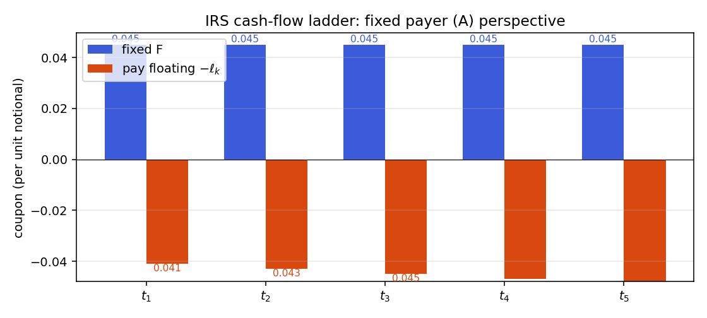
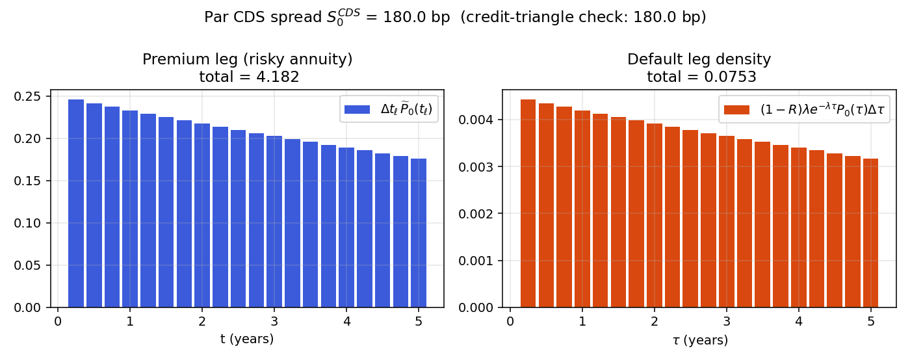
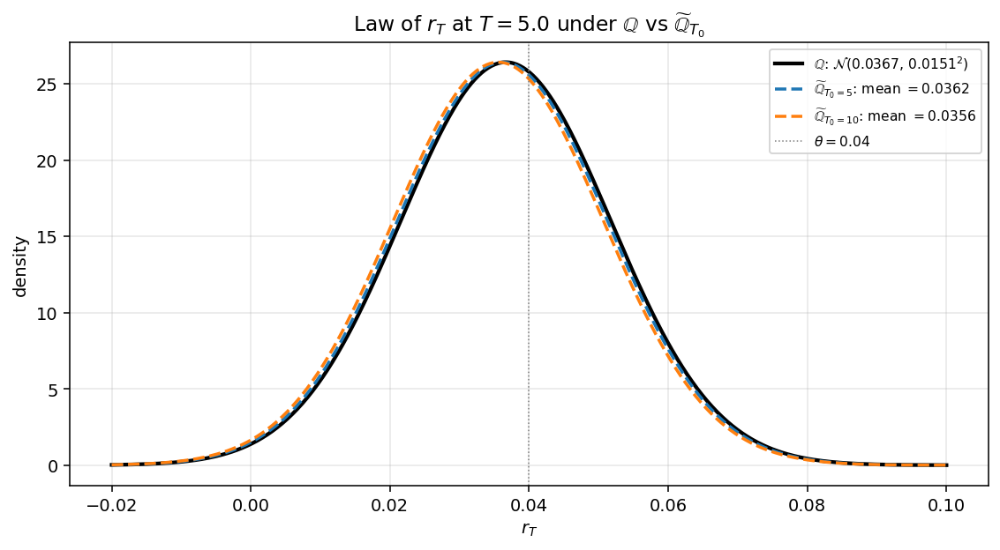
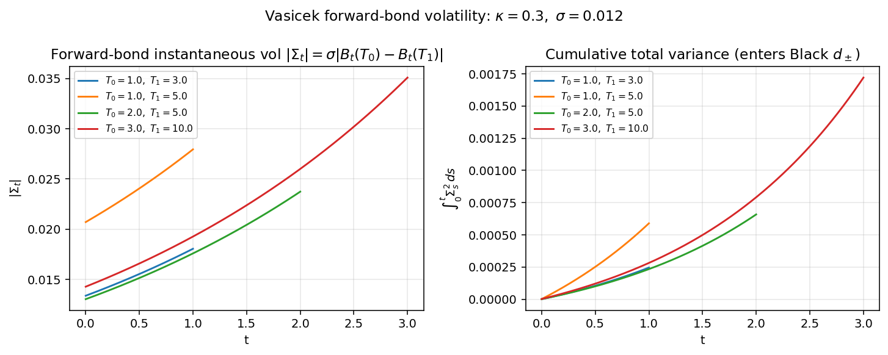
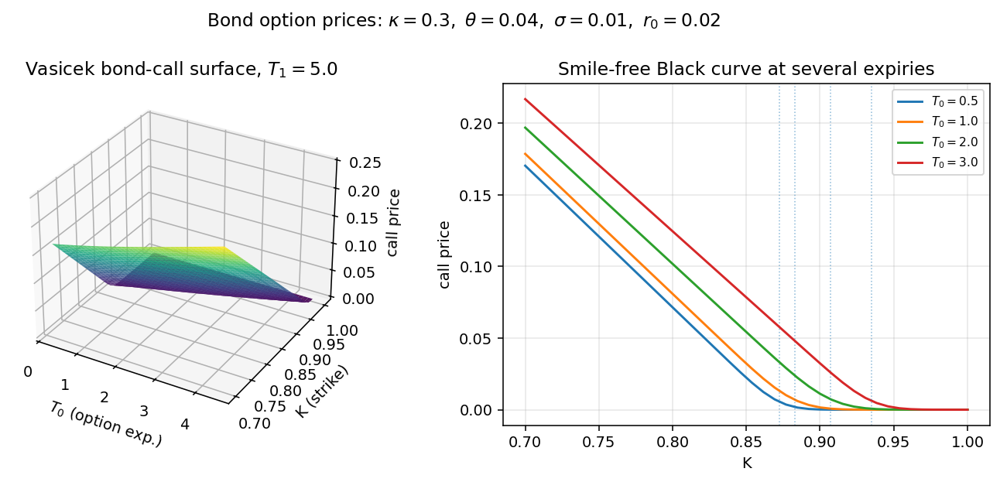

# Chapter 13 — Rate-Derivative Applications: Swaps, CDS, Bond Options, Callables

## 13.1 From short-rate dynamics to products that depend on them

Chapter 12 built the Vasicek, Ho-Lee, and Hull-White short-rate models — the SDEs, the
integrated-rate distributions, the closed-form bond prices, the affine-ODE
system, the calibration of $\theta_t$ to today's curve. All of that machinery
was developed with one pay-off in mind: *use it to price rate-dependent
products*. This chapter is that pay-off. We take the calibrated short-rate
model from Chapter 12 as given and work outward to the four product classes that
dominate rates desks: **interest-rate swaps (IRS)**, **callable bonds**,
**credit default swaps (CDS)**, and **European bond options** (together with
their capstone application, swaptions via the Jamshidian decomposition). We
close with a tour of where the single-factor Gaussian framework starts to
break and which extensions (HJM, LMM, SABR, multi-factor Gaussian) handle the
residual.

The chapter is organised by how much of the short-rate model each product
actually uses. Swaps are almost model-free: only the discount curve enters,
so Vasicek versus Hull-White versus any other calibrated-curve model gives
the same swap value. Callable bonds are genuinely model-dependent: the
embedded American option on a bond requires a backward induction on a
short-rate tree, and both the level of rates and the variance of the short
rate matter. CDS depend on the calibrated discount curve plus a separate
hazard-rate curve; the two combine into a risky discount factor. European
bond options under Vasicek/Hull-White admit a clean closed-form (the
Jamshidian / Vasicek-Black formula), and the derivation is the canonical
application of the **T-forward measure** — a specific change of numeraire
that makes the forward bond price a martingale with deterministic volatility.
Crucially, we will *not* re-derive Girsanov's theorem or the T-forward measure
here: Chapter 5 already did that once. This chapter cites the result from Chapter 5 and
uses it.

**A roadmap to the rest of the chapter.** §13.2 prices an IRS and extracts
the par swap rate — a model-free calculation that exercises only the discount
curve. §13.3 tackles callable bonds on a Hull-White trinomial tree, introducing
the backward-induction-plus-early-exercise pattern that appears again and
again in rate-derivative pricing. §13.4 handles CDS with constant and
time-varying hazard, deriving the "credit triangle" $S \approx (1-R)\lambda$
and its corrections. §13.5 takes a visual pause on the yield surface — a 3D
object that is the natural state of the rates-trading book. §13.6 derives the
Vasicek-Black bond-option formula via the T-forward measure, citing Chapter 5 for
the Girsanov apparatus. §13.7 walks through worked examples of that formula
and introduces the Jamshidian decomposition that reduces a swaption to a
portfolio of bond options. §13.8 previews where we go beyond single-factor
Vasicek: the multi-factor Gaussian G2++, HJM, LMM, and SABR. §13.9 closes
with the PDE-versus-Monte-Carlo trade-offs that dictate which numerical
method a rates desk deploys per product. §13.10 summarises the chapter; §13.11
is the reference-formula appendix.

The conceptual thread running through all five products is this: **every
rate derivative is a functional of the future yield curve, and pricing it
reduces to computing a conditional expectation of that functional under some
convenient martingale measure**. The specific measure depends on when the
payoff settles and what numeraire most naturally absorbs its stochastic
discount factor. For swaps we use no measure machinery at all — the
linearity-in-rates of the payoff lets us replicate and price pathwise. For
CDS we use $\mathbb{Q}$ with a hazard-rate extension. For bond options we
use the T-forward measure. For swaptions we use the annuity measure. Each
choice is motivated by the same principle: *match the numeraire to the
payoff's natural scale, and the pricing collapses to a Black-type lognormal
expectation*. That principle — one sentence — is the take-away of the entire
chapter.

One notational convention before we start. All bond prices $P_t(T)$,
affine coefficients $A_t(T)$ and $B_t(T)$, and the short-rate parameters
$(\kappa, \theta_t, \sigma)$ are as in Chapter 12. The $\mathbb{Q}$-Brownian motion
is $\widehat{W}_t$; the T-forward Brownian motion (introduced in §13.6 via
Chapter 5 cross-reference) is $\widetilde{W}_t^{\,T}$. The discount factor from
$t$ to $T$ under the money-market numeraire is
$M_t/M_T = e^{-\int_t^T r_u\,\mathrm{d}u}$; we use $P_t(T)$ when we want the
deterministic (time-$t$-conditional expectation) bond price.

## 13.2 Interest-rate swaps and the par swap rate

### 13.2.1 Swap cash flows and definitions

A plain-vanilla interest-rate swap exchanges a fixed leg against a floating
leg on a notional $N$ at reset dates $t_0 < t_1 < \dots < t_n$, with
day-count $\Delta t_k = t_k - t_{k-1}$. Counterparty $A$ pays fixed coupon
$F$ at each $t_k$ for $k = 1, \dots, n$ and receives a floating coupon
$\ell_k$ that was *set in arrears* at the prior reset date $t_{k-1}$ (this
is the standard "fix at $t_{k-1}$, pay at $t_k$" convention). Counterparty
$B$ is the mirror image: receives fixed, pays floating. There is **no
exchange of notional** — only the periodic coupon differences — which is
why swap-market notional figures (hundreds of trillions of dollars of
cleared IRS outstanding) vastly exceed the bond market.

\begin{figure}[H]
\centering
\begin{tikzpicture}[>=Stealth,scale=1.0,every node/.style={font=\small}]
  \node[circle,draw,minimum size=0.9cm] (A) at (0,0) {$A$};
  \node[circle,draw,minimum size=0.9cm] (B) at (9,0) {$B$};
  \draw[->,thick,blue] (A.north) to[bend left=30] node[above,midway] {fixed coupon $F \cdot \Delta t_k \cdot N$} (B.north);
  \draw[->,thick,red] (B.south) to[bend left=30] node[below,midway] {floating coupon $\ell_k \cdot \Delta t_k \cdot N$\;\;(set at $t_{k-1}$, paid at $t_k$)} (A.south);
  \node[font=\footnotesize\itshape,below=1.6cm] at (A) {fixed-payer};
  \node[font=\footnotesize\itshape,below=1.6cm] at (B) {fixed-receiver};
\end{tikzpicture}

\textit{Notional $N$ never changes hands; only the netted coupon difference $(F - \ell_k)\cdot\Delta t_k\cdot N$ flows each period.}
\end{figure}

The payment schedule lives on the interval grid $t_0 < t_1 < \dots < t_n$
with "first-reset" at $t_0$ (rate fixed there) and "first-payment" at $t_1$;
subsequent coupons at $t_2, \dots, t_n$.

**Why swaps exist.** An IRS converts a floating liability into a fixed one or vice versa — a corporate treasurer pays fixed/receives floating to lock funding cost; a mortgage bank receives fixed/pays floating to match its floating funding. Cleared IRS notional is roughly \$400–500 trillion, the largest derivative class by any measure.

### 13.2.2 Pricing from the discount curve

**Fixed-leg value.** Paying $F \cdot N \cdot \Delta t_m$ at each $t_m$ has
time-0 value

$$
V_0^{\text{fix}} \;=\; \sum_{m=1}^{n} \Delta t_m \, F \, N \, P_0(t_m)
\tag{13.1}
$$

The factor $\sum_{m=1}^n \Delta t_m P_0(t_m)$ is the **annuity** (or PVBP
per unit rate). At time $t$ before the swap matures, the fixed leg value
is $V_t^{\text{fix}} = \sum_m F \Delta t_m P_t(t_m)$.

The annuity interpretation is worth dwelling on. Think of
$\mathcal{A}_0 \equiv \sum_m \Delta t_m P_0(t_m)$ as the present value of a
stream of \$1 payments per year, on the coupon schedule, discounted to
today. It functions as the "unit of account" for swap rates: the par swap
rate $F$ is quoted as the number such that $F \cdot \mathcal{A}_0$ equals
the floating-leg value. Multiplying or dividing by the annuity converts
between dollars and per-annum rate units. The annuity is also the natural
numeraire for changing measure in swaption pricing: under the "annuity
measure" (the probability measure under which the annuity is the
numeraire), the par swap rate $S_t$ becomes a martingale, and the swaption
collapses to $V_0 = \mathcal{A}_0 \cdot \mathbb{E}^{\mathcal{A}}[(S_T -
K)_+]$ — a direct lognormal expectation in Black form.

**Floating-leg value via "buy \$1 and roll".** The floating coupon
$\ell_k$ is locked in at each reset $t_{k-1}$ from the simple yield on a
$\Delta t_k$-bond:

$$
P_{t_{k-1}}(t_k) \;=\; \bigl(1 + \Delta t_k \, \ell_k\bigr)^{-1}
\;\Longrightarrow\;
\ell_k \;=\; \frac{1}{\Delta t_k}\!\left(\frac{1}{P_{t_{k-1}}(t_k)} - 1\right).
\tag{13.2}
$$

The reset mechanism works like this: at each reset date $t_{k-1}$, the
market quotes a simply-compounded rate for the upcoming period $[t_{k-1},
t_k]$, and that rate is fixed as the floating coupon for that period. The
coupon $\ell_k \Delta t_k N$ is then paid at $t_k$. So floating coupons are
*set in arrears*, meaning the $k$-th coupon is known at the $(k-1)$-th
reset and paid at $t_k$. Standard LIBOR (and its SOFR successor) follow
this "set-in-advance, paid-in-arrears" convention, and (13.2) is the
algebraic identity that makes replication of the floating leg possible.

**Claim:** $V_t^{\text{fl}} = \bigl(P_t(t_0) - P_t(t_n)\bigr) N$.

*Financial argument (self-financing replication).* Consider the trader who
at $t_0$ is handed \$1 and asked to replicate the floating-leg coupons:

- At $t_0$: buy \$1-worth of $t_1$-bonds — holdings $1/P_{t_0}(t_1)$.
  These mature to \$$1/P_{t_0}(t_1)$ at $t_1$.
- At $t_1$: take \$1 of that and buy $t_2$-bonds: $1/P_{t_1}(t_2)$ units;
  pocket the remainder $\bigl(1/P_{t_0}(t_1) - 1\bigr) = \ell_1 \Delta t_1$.
- Continue to $t_n$, pocketing $\ell_k \Delta t_k$ each period and holding
  \$1 of fresh short-dated bonds.

The cash flows generated by this self-financing strategy are exactly the floating-leg coupons, plus a terminal \$1 repayment we return. Cost = \$1 in at $t_0$ minus \$1 out at $t_n$, priced today:

$$
V_0^{\text{fl}} \;=\; \bigl(P_0(t_0) - P_0(t_n)\bigr) \, N
\tag{13.3}
$$

The floating leg is **model-free**: neither $\kappa$ nor $\sigma$ nor $\theta(t)$ enters (13.3). The randomness cancels pathwise. Post-2008, a multi-curve adjustment ("OIS discounting" with a tenor basis to SOFR/LIBOR accrual) keeps (13.3) approximately correct.

### 13.2.3 The par (fair) swap rate

Setting $V_0^{\text{fix}} = V_0^{\text{fl}}$ gives the rate $F^* \equiv S_0$
that makes the swap worth zero at inception:

$$
\boxed{\;F \;=\; \frac{P_0(t_0) - P_0(t_n)}
{\displaystyle \sum_{m=1}^{n} \Delta t_m \, P_0(t_m)}
\;\equiv\; S_0 \quad \text{(initial par swap rate)}\;}
\tag{13.4}
$$

The denominator is the annuity. Since both legs are priced off the
discount curve alone, the par swap rate is a ratio of discount factors —
**no model required**.

The par swap rate $S_0$ is the market's standard quote for "the $n$-year
swap rate." When a Bloomberg screen shows "10y USD swap is 3.5%," that 3.5%
is $S_0$ from (13.4) with $n$ chosen to give a 10-year maturity. The swap
curve — the set of par swap rates across tenors — is directly observable
and widely used as a reference interest-rate curve for mortgages,
corporate borrowing, and internal bank funding.

**Swap rate $\equiv$ par coupon yield.** Up to convexity corrections, $S_0$
equals the par coupon yield of a bond with the same tenor. A par coupon
bond with coupon $c$ has PV $= c \cdot \mathcal{A}_0 + P_0(t_n)$, which
equals par (notional) exactly when $c = (1 - P_0(t_n))/\mathcal{A}_0 =
S_0$. So "a swap is a bond with no principal" — the coupon-rate structure
is identical; only the principal exchange differs.

**Forward-start / ongoing swap rate.** For a swap with payment dates
$\{t_\ell\}_{\ell : t_\ell > t}$ viewed at time $t$ (some resets already
happened), the current fair-value swap rate is

$$
S_t \;=\; \frac{P_t(t_{k_t}) - P_t(t_n)}
{\displaystyle \sum_{m = k_t + 1}^{n} \Delta t_m \, P_t(t_m)}
\tag{13.5}
$$

where $k_t$ is the index of the most recent reset before $t$. If $t < t_0$
(spot-start), $P_t(t_{k_t}) = P_t(t_0)$ and (13.5) reduces to (13.4) with
$P_t$ replacing $P_0$.

Because discount factors are stochastic, $S_t$ is a stochastic process.
Plotting it alongside the short rate $r_t$ reveals very different dynamics:
$S_t$ is smooth and moves with the yield curve, while $r_t$ is volatile
and determines the floating coupons. In a sense, $S_t$ is a
low-pass-filtered version of $r_t$, weighted toward the long end of the
curve. Empirically, the 10-year swap rate might move 5 bp on a given day
while the overnight rate moves 25 bp — a 5:1 ratio, matching the
Hull-White prediction that long-tenor yields move less than short-tenor
yields in response to short-rate shocks.

### 13.2.4 Mark-to-market and swap DV01

For off-par swaps (where the fixed coupon $F$ differs from $S_0$), the
swap has non-zero initial PV. If $F = 4.00\%$ versus a par of $S_0 =
4.49\%$, the fixed-payer pays below market so the swap has positive PV to
the fixed-payer:

$$
V^{\text{fp}}_0 \;=\; (S_0 - F) \cdot \mathcal{A}_0 \cdot N
\tag{13.6}
$$

In the example, $V^{\text{fp}}_0 = (4.49\% - 4.00\%) \cdot 2.7532 \cdot
100\text{M} \approx \$1.35\text{M}$. This is the "off-market adjustment"
paid upfront in a typical trade. Market convention is to trade at-par (no
upfront) for most swaps; off-market swaps arise for customised deals or
for collapsing multiple existing positions into a single trade.

**DV01.** The "01" (pronounced "oh-one" or DV01) is the change in PV for
a 1-bp parallel shift in rates. For a receiver swap, DV01 $\approx
\mathcal{A} \times 0.0001 \times N$. For a 10-year \$100M swap with
annuity $\mathcal{A} = 8.5$:

$$
\text{DV01} \;\approx\; 100\text{M} \times 8.5 \times 0.0001 \;=\; \$85{,}000 \text{ per basis point.}
$$

This is the single most important risk metric for IRS trading, and it is
directly the annuity-weighted notional. DV01 decomposes by tenor ("bucket
DV01") to reveal which parts of the yield curve the portfolio is exposed
to. Hedging a swap portfolio requires matching the bucket DV01s via
positions in benchmark instruments (typically government-bond futures,
short-end deposits, and other swaps at standard tenors). Mismatched DV01s
lead to residual P&L as the yield curve reshapes.

Related quantities: BPV (basis-point value, same as DV01), PV01 (present
value of a 1-bp change, same), 01 (trade-floor shorthand). The important
distinction is between "parallel-shift" DV01 (all tenors up 1 bp together)
and "bucket" DV01 (only one tenor moves 1 bp). Parallel DV01 is a
portfolio-level summary; bucket DV01 is the detailed breakdown needed for
hedging.

### 13.2.5 Worked example: a 3-year par swap

With $P_0(1) = 0.9592$, $P_0(2) = 0.9177$, $P_0(3) = 0.8763$ and
$\Delta t_k = 1$:

$$
S_0 \;=\; \frac{1 - 0.8763}{0.9592 + 0.9177 + 0.8763}
\;=\; \frac{0.1237}{2.7532} \;\approx\; 4.49\%.
$$

The 3-year discount falls from 1.0 at $t = 0$ to 0.8763 at $t = 3$, so
roughly 12.4 cents are "lost" to discounting over three years. Spread
over three annual coupons with annuity 2.75, that works out to 4.49% per
annum. This exactly matches the yield-to-maturity of a 3-year par coupon
bond with coupon 4.49% — the swap rate *is* the par coupon yield.

**Cross-check via zero yields.** $P_0(1) = 0.9592 = e^{-y_1}$ gives $y_1 =
-\ln 0.9592 \approx 4.17\%$. Similarly $y_2 \approx 4.30\%$, $y_3 \approx
4.40\%$. So the zero-coupon curve is 4.17% at 1y, 4.30% at 2y, 4.40% at
3y — gently upward-sloping. The par swap rate (4.49%) is slightly above
the 3-year zero yield (4.40%) because of the convexity implicit in the
coupon structure: a coupon bond receives coupons as well as principal,
and because coupons are smaller than the principal, their yield must be
slightly higher to equate PVs. This "convexity premium" between coupon
bonds and zero-coupon bonds is a standard bond-math result.

*Fixed-payer sees outgoing blue fixed coupons and incoming orange floating coupons; net PV is zero at the par swap rate $S_0$.*

---

### Case study (a): LTCM 1998 — swap spreads, off-the-run/on-the-run, leverage

*Long-Term Capital Management — Meriwether's Salomon arbitrage group reincarnated, with Robert Merton and Myron Scholes on the partnership and a Nobel Prize awarded mid-stream — ran roughly $\$130$B of balance sheet against $\$4.7$B of equity (Aug 1998 leverage ratio $\approx 28{:}1$), with one of the largest concentrations being long-off-the-run / short-on-the-run Treasury basis paired against IRS-spread positions. Russia's domestic-debt default on $17$ August 1998 destroyed both legs simultaneously and the equity vanished in six weeks.*

**Context.** The trade rationale was simple §13.2 swap-curve mathematics: the off-the-run Treasury (say, the previous-quarter issued $30$y bond) trades at a small yield premium of $5$–$10$ bp over the most-recently-issued on-the-run, reflecting the on-the-run's superior repo specialness and dealer demand. Over the bond's seasoning life this premium compresses to zero, generating a $5$–$10$ bp risk-free convergence. LTCM ran the trade in size: long off-the-run, short on-the-run (matched DV01), and frequently overlaid with a pay-fixed IRS to monetise the swap-Treasury basis as well. Each individual position had small daily P&L variance, but the book was scaled by leverage to produce target returns: portfolio DV01 in the $\$40$–$60$M per basis point range against the $\$4.7$B equity base. Internal $99\%$ $1$-day VaR sat near $\$45$M — about $1\%$ of equity.

The Russian default did not move the swap-Treasury basis by a small amount; it moved it by $30$ bp in the wrong direction in a single week and another $30$ bp the following month. Flight-to-quality bid up the on-the-run Treasury (which is the most liquid hedge instrument in a panic) while dumping the less-liquid off-the-run, widening the very basis the trade was short. Simultaneously the swap spread — the IRS rate minus the corresponding-maturity Treasury — widened to historic levels: $10$y swap spreads went from $\sim 35$ bp pre-crisis to $\sim 90$ bp by late September, briefly tagging $200$ bp in some tenors. With portfolio DV01 around $\$50$M/bp, the $60$ bp basis widening alone equalled $\$3.0$B in mark-to-market losses; aggregated across all the convergence positions the fund lost $\$4.6$B of its $\$4.7$B equity in six weeks. The Federal Reserve organised a $\$3.625$B private-sector recapitalisation on $23$ September to prevent a forced liquidation that would have shocked counterparty banks.

**Reading it through the chapter's math.** The par swap rate (13.4) is model-free — it is a discount-curve identity that holds regardless of the short-rate dynamics. But the *spread* between two rates (off-the-run vs on-the-run, IRS vs Treasury) is a *liquidity* premium that no calibrated short-rate model in this chapter captures: it is an artefact of how dealers fund inventory in repo markets, who is the marginal buyer in a flight-to-quality, and what regulatory capital weights apply to which instrument class. The swap-spread convergence trade's PnL is approximately linear in the spread, with sensitivity equal to the matched DV01 — that piece is exactly the §13.2.4 DV01 calculation. What the chapter's framework captures *correctly* is the $\Delta$P&L per basis-point move; what it cannot tell you is what magnitude of move to stress against. LTCM's internal VaR used historical correlations from $1995$–$1998$ — a benign, low-vol period — under which off-the-run, IRS-Treasury, and Russian-bond moves were close to independent. In crisis, they became a single one-factor "flight-to-quality" move and the gaussian VaR was off by a factor of $100$. Cornish-Fisher (Chapter 15.27) would have helped only if the third- and fourth-moment inputs themselves had been stressed; they were not.

**Lesson.** The trade was *correct on average* — swap spreads did mean-revert, and an unleveraged version of the position would have been profitable across the cycle. The problem was the *path*: leverage transmits drawdowns into margin calls into forced unwinds, and at $28{:}1$ even a one-sigma move in the underlying spread can wipe out equity if the move comes in a single week rather than spread over a quarter. The deeper lesson for the new hire is that DV01 measured against a normal-vol historical basis range is the wrong risk metric for a leveraged convergence trade; the right metric is "DV01 $\times$ stressed move under a flight-to-quality scenario," and the stressed move is set by judgement about regime, not by a covariance-matrix multiplier. Post-LTCM every prime broker tightened margin financing for relative-value strategies; post-LTCM regulators introduced stressed-VaR add-ons (Basel 2.5) that require the calibration window to include $1998$, $2008$, or another comparable crisis episode. The math of swap-spread arbitrage did not change after $1998$; the institutional discipline around leverage limits and stressed-correlation scenarios did.

---

## 13.3 Callable bonds on a short-rate tree

### 13.3.1 Callable bond cash flows

IRS pricing is essentially model-free, but a **callable bond** is a
genuinely model-dependent rate structure and the canonical application of
Hull-White numerical pricing. A callable bond is a fixed-coupon bond that
the issuer has the right (but not obligation) to redeem early at a
specified call price on one or more call dates. It is the bond-market
equivalent of a mortgage with a prepayment option — the issuer can
refinance into a lower rate if rates fall.

Economically, a callable bond equals a straight (non-callable) bond minus
the issuer's call option:

$$
V^{\text{callable}}_t \;=\; V^{\text{straight}}_t \;-\; V^{\text{embedded call}}_t.
\tag{13.7}
$$

The issuer benefits if rates fall (they refinance at lower rates); the
bondholder loses the upside. So callable bonds trade at a *higher* yield
than comparable straight bonds, with the spread representing the option
value. A 10-year callable with a 5-year first call might trade 30–80 bps
above a comparable 10-year straight, with the spread widening when rate
volatility is high (because a more volatile world makes the call option
more valuable).

The yield differential is called the **option-adjusted spread (OAS)**. It
is the spread earned per year for being "short the call" as a bondholder.
If OAS is 50 bps, you are paid 50 bps per year to bear the call-risk
exposure. A useful way to think about the position: start with a straight
bond with clean duration-based pricing. Add in the issuer's right to call
(subtract the call option value). Now the bond's price is lower and its
*effective* duration is lower — because the bond will likely be called
early in a falling-rate scenario, shortening its life. The
**option-adjusted duration (OAD)** captures this shortened effective life
and is the correct hedge quantity for managing the interest-rate risk of
a callable-bond portfolio.

Pricing requires evaluating a max function at each call date:

$$
V^{\text{call}}_{t_c} \;=\; \min\!\bigl(\text{call price},\; V^{\text{continuation}}_{t_c}\bigr).
\tag{13.8}
$$

The issuer will call if the continuation value exceeds the call price —
they pay off the bond for less than its market value. This is
**American-exercise optionality**, embedded in a rate-derivative structure.
No closed form exists in general; we must evaluate numerically via a tree,
lattice, or Monte Carlo with regression-based exercise.

### 13.3.2 Backward induction on a Hull-White trinomial tree

The standard approach is a Hull-White trinomial lattice. Build a tree
discretising $r_t$ at each time step $t_n$, with transition probabilities
calibrated to match the Hull-White moments. At each call date, apply
(13.8) at each node. Then roll back to $t_0$ with standard backward
induction. The tree gives a complete price and, as byproducts, the OAS
(the yield spread over the discount curve that equates the tree price to
the market price) and the option-adjusted duration and convexity.

**Construction sketch.** At each time $t_n$, the short-rate state is
discretised to $r^{(i)}_n$ for $i = -m, \dots, +m$ (the tree has $2m + 1$
possible rate states). Transition probabilities to the three successor
states (up, middle, down) at $t_{n+1}$ are calibrated to match the first
two conditional moments of $r_{n+1} \mid r_n$ under the Hull-White SDE.
The mean reversion is handled by tweaking the *geometry* of the tree near
the mean: at nodes where the standard branching would require negative
probabilities, the branching is tilted (up-up-middle instead of
up-middle-down, or the mirror) so all probabilities stay in $[0, 1]$.
This is the Hull-White (1994) trinomial scheme — robust, fast-converging,
and standard in every fixed-income pricing library.

A key feature is that the scheme handles the time-dependent $\theta(t)$
exactly: at each time step, the tree's drift is set to match the
calibrated $\theta(t)$ at that time. So the tree automatically
incorporates the full curve-fit from the $\theta$ bootstrap from Chapter 12,
without any additional work. This is the computational payoff of the
affine structure: calibration and pricing both leverage the same
underlying Gaussian geometry.

**Backward-induction algorithm.** Let $V^{(i)}_n$ denote the
callable-bond value at node $(n, i)$. Work backward from maturity $T$:

1. **Terminal condition** ($n = N$): $V^{(i)}_N = \text{face} + \text{final
   coupon}$ at every node.
2. **Continuation value** ($n < N$): discount the expectation of the
   three successor values:
   $$
   V^{(i), \text{cont}}_n \;=\; e^{-r^{(i)}_n \Delta t}\bigl(p_u V^{(i+1)}_{n+1} + p_m V^{(i)}_{n+1} + p_d V^{(i-1)}_{n+1}\bigr) + c_n
   $$
   where $c_n$ is the coupon paid at $t_n$ (if any).
3. **Call test** (if $t_n$ is a call date): apply
   $V^{(i)}_n = \min\bigl(\text{call price}_n,\; V^{(i), \text{cont}}_n\bigr)$.
   Otherwise $V^{(i)}_n = V^{(i), \text{cont}}_n$.
4. Continue to $n = 0$; the callable price is $V^{(0)}_0$ at the root.

The algorithm is structurally identical to American-option pricing on a
stock tree, with the discount factor now state-dependent via $r^{(i)}_n$
rather than a constant $r$. Each step is $O(\text{nodes at that time})$;
total cost is $O(N \cdot m)$ in space and time, which is very fast even
for dense calendars (quarterly calls over 30 years).

### 13.3.3 Decomposition into straight bond minus embedded call

The accounting identity (13.7) can be verified numerically by running the
backward induction twice: once with the call test enabled (giving the
callable price), and once with the call test disabled (giving the straight
bond price). The difference is the value of the embedded call option,
which the issuer is short and the bondholder is long (as seen from the
issuer's liability side).

This decomposition is useful for *Greeks*. The straight bond's Greeks
(duration, convexity) are well understood. The embedded call's Greeks are
what make callables complex — and can be extracted from the tree by
finite-differencing the call-option value with respect to the underlying
rate curve, volatility, or time. The net callable Greeks are then the
straight-bond Greeks minus the call-option Greeks, mirroring the value
identity.

**Negative convexity.** A defining feature of callable bonds is that OAD
is *non-monotonic* — low near the call strike (the bond is expected to be called soon), rising to the straight-bond duration far from it. The OAD concavity is the "negative convexity" of callable bonds. It forces dynamic rebalancing for hedgers and creates duration-chasing feedback loops in the wider rate market (the canonical MBS-convexity effect).

### 13.3.4 Numerical example

Take a 10-year bond with 5% annual coupon, face value \$100, callable
annually at par (\$100) after year 3. Initial rate $r_0 = 3\%$, Hull-White
parameters $\kappa = 0.1$, $\sigma = 0.015$, flat yield curve at 3% for
simplicity. Build a trinomial tree of $r$ values at each year $0, 1,
\dots, 10$ with transition probabilities calibrated to Hull-White. At
year 10, each node has $V = \$105$ (principal + last coupon). Roll back
year-by-year, testing the call condition at years 3 through 9.

For parameters consistent with moderate vol, the callable bond might price
at \$105.20, compared to a straight bond at \$108.30. The embedded call
has value \$3.10, representing roughly 3% of bond value. As $\sigma$
increases the call becomes more valuable and the callable bond price
falls further below the straight. This is the option-value sensitivity:
callable bonds are **short vega**, because they hold a short call option.

Interpretation of the price: the callable's yield-to-worst is about 4.9%
(compared to a straight-bond yield of 4.1%), so the callable holder
earns an extra 80 bps per year for bearing the call risk. In a world
where rates stay high, the issuer will not call (continuation value stays
below par), and the callable holder earns all the coupons. In a world
where rates fall, the issuer calls at par, and the holder loses the
future coupon stream. The 80 bps spread is the probabilistically-weighted
compensation for bearing this downside.

**Related products.** Putable bonds (holder owns the put), convertible bonds (joint equity/rate model), and MBS (empirical prepayment models on top of the lattice) all use the same backward-induction skeleton. Calibrated $(\kappa, \sigma)$ from the swaption market should feed the callable lattice — under-calibrated vol over-prices the bond.

## 13.4 Credit default swaps

### 13.4.1 Default intensity, survival, and the protection leg

**Setup.** Protection buyer $C$ pays periodic premium $S$ (annualised
spread) to seller $A$ on the reference name $B$ until default time $\tau$.
If $\tau \le t_n$, the seller pays loss-given-default $(1 - R) \, N$ at
(or just after) $\tau$, where $R$ is the recovery rate and $N$ the
notional. We model the default time as the first jump of a Cox process;
for this chapter $\tau \sim \text{Exp}(\lambda)$ with constant intensity
$\lambda$, independent of the short rate, unless noted otherwise.

\begin{figure}[H]
\centering
\begin{tikzpicture}[>=Stealth,scale=1.0,every node/.style={font=\small}]
  \node[circle,draw,minimum size=0.95cm] (C) at (0,0) {$C$};
  \node[circle,draw,minimum size=0.95cm] (A) at (9,0) {$A$};
  \node[rectangle,draw,minimum width=2.6cm,minimum height=0.9cm] (B) at (4.5,-3) {reference name $B$};
  \draw[->,thick,blue] (C.north) to[bend left=30] node[above,midway] {premium $S \cdot \Delta t_k \cdot N$\;\;(until default or maturity)} (A.north);
  \draw[->,thick,red] (A.south) to[bend left=30] node[below,midway] {contingent leg $(1-R)\cdot N$\;\;(paid iff $\tau \le t_n$)} (C.south);
  \draw[->,thick,gray,dashed] (B.north) -- (4.5,-1.6) node[midway,right,font=\footnotesize\itshape] {default at $\tau \sim \mathrm{Exp}(\lambda)$};
  \node[font=\footnotesize\itshape,below=1.6cm] at (C) {protection buyer};
  \node[font=\footnotesize\itshape,below=1.6cm] at (A) {protection seller};
\end{tikzpicture}

\textit{$C$ pays a stream of spreads; $A$ pays the loss-given-default once, at $\tau$, if it arrives before $t_n$.}
\end{figure}

**Economic picture.** A CDS is insurance against default. The protection
buyer pays a steady premium — expressed as an annualised spread $S$
times the notional — in exchange for a payout that arrives if and only if
the reference entity defaults before maturity. This is economically
equivalent to "shorting the credit of the reference name": a long position
in the bond plus a purchased CDS has its default risk hedged out, leaving
only rate-sensitivity exposure.

**Intensity, survival, and the hazard interpretation.** The intensity
$\lambda$ has a sharp probabilistic meaning: for an infinitesimal time
interval $\mathrm{d}t$, the probability of defaulting in $[t, t + \mathrm{d}t]$
given no prior default is exactly $\lambda \, \mathrm{d}t$. So $\lambda$
is the instantaneous default rate, the **hazard rate**. In a flat-intensity
world, the survival probability is

$$
\mathbb{Q}(\tau > t) \;=\; e^{-\lambda t}
\tag{13.9}
$$

and the default distribution is exponential with mean $1/\lambda$. A
typical investment-grade bond might have $\lambda \approx 0.005$ per year
(50 bps hazard, 200-year expected survival); a junk bond might have
$\lambda \approx 0.05$ (5% hazard, 20-year expected survival).

The hazard-rate approach is a direct analog of the instantaneous-rate
approach to interest-rate modelling. Both use "intensity" as the
fundamental quantity. Both integrate the intensity to get the cumulative
quantity (integrated rate $\to$ discount factor; integrated hazard $\to$
survival probability). Both admit time-varying intensities (Hull-White
$\theta(t)$ for rates; stochastic hazard $\lambda(t)$ for credit) for
realistic calibration.

### 13.4.2 Premium and default legs; the par CDS spread

**Premium leg.** Premium payments $S \cdot \Delta t_\ell \cdot N$ are paid
on the schedule up to (and including the accrual period containing)
default:

$$
V_0^{\text{prem}} \;=\; S \cdot N \cdot \sum_{\ell=1}^{n} \Delta t_\ell \,
\mathbb{E}^{\mathbb{Q}}\!\left[\mathbf{1}_{\{\tau > t_\ell\}} \,
e^{-\int_0^{t_\ell} r_u \, \mathrm{d}u}\right]
\;=\; S \cdot N \cdot \sum_{\ell=1}^{n} \Delta t_\ell \, \widetilde{P}_0(t_\ell)
\tag{13.10}
$$

where $\widetilde{P}_0(t_\ell) = e^{-\lambda t_\ell} \, P_0(t_\ell)$ is
the **risky discount factor** (survival $\times$ riskless ZCB). The sum
$\sum_\ell \Delta t_\ell \widetilde{P}_0(t_\ell)$ is the **risky
annuity**. Under independence of hazard and rate under $\mathbb{Q}$, the
expectation factorises cleanly: otherwise
$\widetilde{P}_0(t_\ell) = \mathbb{E}^{\mathbb{Q}}[e^{-\int_0^{t_\ell}
(r_u + \lambda_u) \, \mathrm{d}u}]$ which, for joint-Gaussian $r + \lambda$,
again admits an affine closed form.

A heuristic: a risky bond earns the "hazard-adjusted rate" $r + \lambda$
instead of just $r$. The "credit spread" $\lambda$ is effectively an
additional rate that the bond earns to compensate for default risk. A
corporate bond with a yield 150 bp above comparable Treasury is earning
$r + 0.015$ in a flat-rate, flat-hazard world. The 150 bp is the credit
spread, which the credit triangle (below) tells us equals $(1 - R) \lambda$
approximately.

**Default leg.** At default time $\tau$, the payoff $(1 - R) N$ is paid,
discounted to $t = 0$ via the riskless discount to $\tau$. Under
independence of $\tau$ and $r$:

$$
V_0^{\text{D}} \;=\; \mathbb{E}^{\mathbb{Q}}\!\left[e^{-\int_0^{\tau} r_s \, \mathrm{d}s}
\, (1 - R) \, N \, \mathbf{1}_{\tau \le t_n}\right]
\;=\; (1 - R) \, N \int_0^{t_n}\!\lambda \, e^{-\lambda \tau} \, P_0(\tau) \, \mathrm{d}\tau.
\tag{13.11}
$$

The default density $\lambda e^{-\lambda \tau}$ is the probability of
defaulting in $[\tau, \tau + \mathrm{d}\tau]$ per unit $\mathrm{d}\tau$;
the present value of the loss is $(1 - R) N P_0(\tau)$; the integration
bound $[0, t_n]$ reflects that the default leg pays only if default
occurs before the contract maturity.

The Markov property of Hull-White means that, conditional on $r_\tau$,
the future bond price $P_\tau(T)$ depends only on $(r_\tau, \tau, T,
\kappa, \sigma, \theta)$ — not on history. So the post-default discount
$P_\tau(T)$ is the Hull-White bond-price formula from Chapter 12 evaluated at
shifted origin $\tau$ and state $r_\tau$. Under independence of $r$ and
$\lambda$, default timing is a purely exponential process — it does not
care what the rate is doing — so integrating over default times first and
then over rate paths gives the same answer as doing them simultaneously.
The pricing factorises.

**Par CDS spread.** Setting $V_0^{\text{prem}} = V_0^{\text{D}}$ at
inception gives

$$
\boxed{\;S_0^{\text{CDS}} \;=\; \frac{(1 - R) \, \displaystyle \int_0^{t_n}\!\lambda \, e^{-\lambda \tau} \, P_0(\tau) \, \mathrm{d}\tau}
{\displaystyle \sum_{\ell=1}^{n} \Delta t_\ell \, \widetilde{P}_0(t_\ell)}\;}
\tag{13.12}
$$

Structurally this is (13.4) dressed up with survival probabilities: the
numerator is the PV of loss-given-default weighted by the default
density, the denominator is the risky annuity. The parallel between (13.4)
and (13.12) is not accidental: both are par-rate formulas for
insurance-like instruments. The structural similarity "ratio of
value-generating leg to annuity-like leg" recurs throughout rates and
credit markets.

### 13.4.3 The credit triangle and worked numbers

**The credit triangle.** In the limit of low hazard and short maturity
(so both survival $e^{-\lambda t}$ and discount $P_0(t)$ are close to 1),
the numerator of (13.12) integrates to approximately $(1 - R) \lambda
t_n$ and the denominator to approximately $t_n$, so

$$
S_0^{\text{CDS}} \;\approx\; (1 - R) \, \lambda
\quad\Longleftrightarrow\quad
\lambda \;\approx\; \frac{S_0^{\text{CDS}}}{1 - R}.
\tag{13.13}
$$

This is the single most important formula in credit trading. Given a
quoted CDS spread, extract the implied hazard rate by dividing by the
loss-given-default. With $R = 40\%$ and a 100 bp CDS spread:
$\lambda \approx 100/(1 - 0.4) = 167$ bp, implying a 1-year default
probability of $1 - e^{-0.0167} \approx 1.65\%$. So a 100 bp CDS is
pricing in about 1.65% default odds over the next year, 40% recovery if
it happens. Every credit trader internalises the triangle: *CDS spread
maps to hazard maps to default probability maps to rating-equivalent.*

**Worked numerical example.** Take $\lambda = 0.02$ (2% hazard, typical
BBB), $R = 0.4$ (40% recovery), flat riskless curve at 3% for $t_n = 5$
years with quarterly coupons ($\Delta t_\ell = 0.25$).

- Risky discount factors: $\widetilde{P}_0(t_\ell) = e^{-(0.03 + 0.02) t_\ell} = e^{-0.05 t_\ell}$.
- Risky annuity: $\sum_{\ell=1}^{20} 0.25 \cdot e^{-0.05 \cdot 0.25 \ell} \approx 4.42$.
- Default-leg integrand: $\int_0^5 0.02 \cdot e^{-0.05 \tau} \, \mathrm{d}\tau \approx 0.0885$.
  Multiply by $(1 - R) = 0.6$: $0.053$.
- Par spread: $0.053 / 4.42 \approx 120$ bp.
- Credit-triangle approximation: $(1 - R) \lambda = 0.6 \cdot 0.02 = 120$
  bp. Exact match for low hazard.

For a distressed $\lambda = 0.10$ the exact formula gives ~610 bp vs the triangle's 600 bp — the discounting correction grows materially as $\lambda$ rises.

### 13.4.4 Bootstrapping the hazard-rate curve

Real-world hazards vary with the firm's health and the macro cycle. Time-
varying hazard $\lambda(t)$ changes the survival formula to
$S(t) = \exp(-\int_0^t \lambda(u) \, \mathrm{d}u)$, and the default-leg
integral generalises to

$$
V_0^{\text{D}} \;=\; (1 - R) \, N \int_0^{t_n}\!\lambda(\tau) \, S(\tau) \, P_0(\tau) \, \mathrm{d}\tau
\tag{13.14}
$$

Still a one-dimensional quadrature — CDS pricing remains essentially
instantaneous on modern hardware.

**Typical calibration.** Given quoted CDS spreads at standard tenors
(1y, 3y, 5y, 7y, 10y), bootstrap a piecewise-constant hazard curve
$\lambda(t)$ to match each spread exactly. This is the credit analog of
the Hull-White $\theta(t)$ bootstrap from Chapter 12, and the algorithm is
analogous:

1. Start at the shortest tenor ($t_n = 1$y) and pick $\lambda_1$ so that
   (13.12) with constant $\lambda = \lambda_1$ matches the 1y quote.
2. Move to the next tenor ($t_n = 3$y). With $\lambda(t) = \lambda_1$ on
   $[0, 1]$ and $\lambda(t) = \lambda_2$ on $[1, 3]$, pick $\lambda_2$ so
   that (13.14) matches the 3y quote.
3. Continue tenor by tenor, building the full hazard schedule.

The bootstrapped hazard curve is directly interpretable: $\lambda_k$ is
the market-implied hazard for the bucket ending at tenor $k$. Upward-
sloping credit curves (5y > 1y) imply increasing hazard over time and
are the norm for investment-grade names; inverted curves (5y < 1y)
signal near-term distress.

The **$\mathbb{Q}$-recovery** in the triangle is risk-neutral; the **credit risk-premium multiplier** ($\mathbb{Q}$-hazard $\div$ $\mathbb{P}$-default rate) typically runs 2–4x for investment-grade names, with direct implications for CDO tranche pricing.

### 13.4.5 CDS mark-to-market and DV01

For off-par CDS (market spread has moved since inception), the mark-to-
market is the difference between premium and default legs evaluated at
current spread and current discount/hazard curves. ISDA conventions since
2009 fix the *coupon* at a standard 100 bp or 500 bp and settle the
spread-vs-coupon difference via an upfront payment:

$$
\text{Upfront} \;=\; \bigl(\text{market spread} - \text{fixed coupon}\bigr) \cdot \text{risky annuity} \cdot N.
\tag{13.15}
$$

Standardised fixed-coupon CDS with upfront payments make the CDS
fungible and centrally clearable, the post-2009 market structure.

**CDS DV01 and "credit-DV01".** Two sensitivities matter:

- **Rate DV01** (interest rate): sensitivity to a 1 bp parallel shift in
  the discount curve. Typically small (seconds-to-tens of dollars per
  \$1M notional) because rate effects largely cancel between the two
  legs.
- **Credit-DV01** (spread): sensitivity to a 1 bp parallel shift in the
  hazard curve (or equivalently a 1 bp shift in the quoted spread). The
  dominant risk metric, equal to roughly $(1 - R) \cdot \text{risky
  annuity} \cdot N \cdot 0.0001$.

A \$10M 5y CDS with risky annuity 4.5 and 40% recovery has credit-DV01
$\approx \$10\text{M} \cdot 4.5 \cdot 0.6 \cdot 0.0001 = \$2{,}700$ per
basis point. A portfolio of dozens of names requires bucket credit-DV01
by name and tenor, analogous to IRS bucket DV01 by tenor.

*The premium leg (left, blue) is a risky annuity. The default leg (right, orange) is the probability-weighted loss density. At the par spread the two areas match up to a factor of $S_0^{\text{CDS}}$; the credit triangle $(1-R)\lambda$ is the near-flat-curve limit.*

Production engines also handle accrued premium at default (a few-percent correction to the premium leg, a few-bps on the par spread); we suppress it here for clarity.

## 13.5 The yield surface

### 13.5.1 Spot, forward, and par-swap surfaces

Before moving to bond options, we pause to visualise the object that
unifies everything the chapter has done so far: the **yield surface**
$y_t(T)$, a 3D surface with axes $(t, T, y_t(T))$ showing how the entire
yield curve evolves over time. Under a calibrated Hull-White model, at
each sample date $t$ we compute $P_t(T)$ for a range of $T$ via the Chapter 12
bond-price formula evaluated at the sampled $r_t$, then invert
$y_t(T) = -\ln P_t(T)/(T - t)$.

The yield surface is the natural 3D object for a rates trader because it
makes explicit a distinction often blurred in text: the difference between
**calendar time** $t$ (what the clock does) and **maturity time** $T$
(the endpoint of the bond). A 10-year yield today and a 10-year yield
one year from now are *different bonds*: one matures in 10 years, the
other in 11 years from today's vantage. Organising all this into a
surface separates the two time dimensions cleanly.

The surface is **smooth in $T$** (yields are smooth functions of maturity via the affine exponent) but **rough in $t$** (driven by stochastic $r_t$).

### 13.5.2 One-factor signature and its limits

A one-factor model like Hull-White has a specific signature: all points
of the yield curve move together in response to a shock to $r_t$, but
not by the same amount. A positive shock $\delta r$ to $r_t$ raises the
short end by the full shock magnitude and raises longer maturities by
the damped amount:

$$
\delta y_t(T) \;=\; \frac{B_{T-t}}{T - t} \cdot \delta r
\tag{13.16}
$$

For $T - t$ short, $B_{T-t}/(T - t) \approx 1$ and the yield moves almost
1-for-1 with the shock. For $T - t$ long, $B_{T-t}/(T - t) \approx 1/
(\kappa (T - t))$ and the yield moves by a damped factor. With $\kappa =
0.15$ and $T - t = 30$ years, the damping factor is $1/(0.15 \cdot 30) =
0.22$: a 1 bp shock to $r_t$ moves the 30-year yield by only 0.22 bp in
the model. This is a specific prediction of the one-factor structure.

In reality, the 30-year yield responds to short-rate shocks more
vigorously than one-factor Hull-White predicts — typically by a factor
of 2-4$\times$. Real-world rate shocks are often not just level shocks; they
come with concurrent slope shifts (inflation expectations, policy
stance). A pure level shock does damp out at the long end, but a level-
plus-slope shock can move the long end substantially. This is the
fundamental limitation of one-factor models and the motivation for
multi-factor extensions like G2++ and beyond (§13.8).

**No-arbitrage.** The Hull-White surface is no-arbitrage by construction: the $\mathbb{Q}$-martingale condition on $e^{-\int r_u \,du} P_t(T)$ ties $\theta(t)$ to the initial forward curve (HJM drift condition, §13.8). This is why $\theta(t)$ calibration (Chapter 12) is a necessity, not a cosmetic choice.

**Bridge to §13.6.** The yield surface sets the stage for pricing
*options* on the surface — specifically, **European bond options**, whose
payoff depends on $P_{T_0}(T_1)$, a single spot-yield draw from the
future surface at time $T_0$. Pricing these options is where the T-forward
measure earns its keep.

---

### Case study (b): SVB collapse March 2023 — duration mismatch + held-to-maturity accounting

*Silicon Valley Bank, the $16$th-largest US bank by assets in early $2023$, failed in $48$ hours between $9$ March (deposit run begins) and $10$ March (FDIC takes the bank into receivership). The proximate cause was that depositors discovered the bank's $\$120$B held-to-maturity Treasury and agency-MBS portfolio carried an unrealised mark-to-market loss of approximately $\$15$B against tangible common equity of $\$16$B. The trade was unhedged duration; the failure was governance.*

**Context.** During $2020$–$2021$ SVB grew deposits explosively as venture-funded startups parked cash from a record fundraising cycle. Deposits roughly tripled, from $\$60$B at end-$2019$ to $\$190$B at peak-$2022$. SVB invested the inflows in long-duration safe assets: predominantly $10$y-and-longer agency MBS and $5$y-and-longer Treasuries, purchased at the then-prevailing yields of $1.5\%$–$2.5\%$. The asset book carried portfolio-weighted duration of approximately $5.6$ years; the liability side was overnight-redeemable deposits with effective duration of zero. Asset-liability duration mismatch was thus around $5.6$ years against $\$120$B of HTM-classified assets.

The Federal Reserve raised the funds rate from $0.00$–$0.25\%$ in March $2022$ to $4.50$–$4.75\%$ by February $2023$ — a parallel shift of approximately $450$ basis points across the front of the curve, with smaller but material moves at longer maturities ($10$y Treasury yield went from $\approx 1.5\%$ to $\approx 4.0\%$, a $250$ bp move). SVB's HTM book was carried on the balance sheet at amortised cost under ASC $320$, which permits MTM losses to bypass income provided the bank "intends and has the ability" to hold to maturity. The MTM loss was disclosed in footnotes — by Q$4$ $2022$ filings, $\sim \$15$B unrealised loss against $\sim \$16$B equity — but did not flow through P&L or regulatory capital. Once Silicon Valley depositors (each covered up to only $\$250$k of FDIC insurance, and most holding multiples of that) became aware of the gap, the deposit run on Thursday $9$ March forced SVB to start selling HTM assets, crystallising losses, which accelerated the run, which closed the bank by Friday morning. Subsequent receivership cost the FDIC's deposit-insurance fund approximately $\$20$B.

**Reading it through the chapter's math.** The duration arithmetic is the most elementary instance of §13.5 modified-duration analysis. For a $5$-year zero-coupon bond, modified duration equals approximately $5$; the $\Delta P/P \approx -D \cdot \Delta y$ approximation gives a $25\%$ MTM loss for a $500$ bp parallel shift, $22.5\%$ for $450$ bp. SVB's portfolio with weighted duration $5.6$ on $\$120$B HTM gives an order-of-magnitude loss estimate of $0.056 \times 0.045 \times \$120$B $\approx \$30$B for a hypothetical $450$ bp parallel shift on duration-$5.6$, but the actual mark loss was $\sim \$15$B because (i) MBS carry negative convexity that asymmetrically helps in a hiking cycle (extension shortens prepayment-adjusted duration as rates rise), and (ii) some of the portfolio matured into a flatter belly of the curve where the move was smaller. DV01 (13.6) on the HTM book was thus approximately $\$70$M per basis point — meaning a $1$ bp parallel shift in Treasury yields changed the mark-to-market value of SVB's HTM book by $\$70$M, or roughly $0.4\%$ of equity, *every basis point*. The chapter-wide Hull-White machinery (Chapter 12 calibrated bond curve plus this chapter's duration-convexity decomposition) would have computed this exposure in seconds; nothing about the math was difficult or unknown.

**Lesson.** SVB's failure was not a failure of interest-rate risk *math* — duration of a $5$y zero is $5$, and any sophomore studying §13.5 can compute the implied MTM loss for any parametric shift. It was a failure of interest-rate risk *governance*: the institutional choice to use HTM accounting suppressed the *visibility* of the loss without changing the *risk* one bit. When depositors marked the book themselves and ran, the gap that had been hidden in footnotes flowed straight to the equity capital. The deeper lesson for the new hire is that accounting classifications (HTM, AFS, trading) are regulatory reporting choices; the underlying duration risk is invariant to the accounting treatment, and any liquidity stress that forces realisation will surface the loss regardless of which bucket the position sat in. Risk reports should *always* include MTM Greeks on HTM books, and liquidity stress tests should *always* assume HTM positions get realised at MTM under a deposit-run scenario. Post-SVB, US bank regulators rapidly escalated stressed-VaR-style scenario requirements for AFS-and-HTM books at sub-$\$250$B regional banks (which had been exempted from the largest-bank framework), and the Federal Reserve introduced the Bank Term Funding Program to allow banks to borrow against HTM Treasuries at par to prevent forced realisations. None of this changed the duration math; all of it changed the discipline around translating duration math into liquidity planning.

---

## 13.6 European bond options and the T-forward measure

### 13.6.1 Why change to the T-forward measure

**Setup.** A European call on a bond has payoff
$\bigl(P_{T_0}(T_1) - K\bigr)_+$ paid at $T_0$, where $t < T_0 < T_1$.
Let $\mathfrak{g}_t$ denote the call price process. Risk-neutral pricing
under the money-market numeraire $M_t$:

$$
\mathfrak{g}_t \;=\; \mathbb{E}^{\mathbb{Q}}_t\!\left[\, e^{-\int_t^{T_0} r_s \, \mathrm{d}s} \, \bigl(P_{T_0}(T_1) - K\bigr)_+\,\right].
\tag{13.17}
$$

Under Vasicek or Hull-White, $P_{T_0}(T_1) = \exp\bigl(A_{T_0}(T_1) -
B_{T_0}(T_1) \, r_{T_0}\bigr)$, so the integrand in (13.17) couples
*two* random variables driven by the same short-rate path: the discount
factor $e^{-\int_t^{T_0} r_s \, \mathrm{d}s}$ and the terminal bond value
$P_{T_0}(T_1)$. Both are nonlinear functions of $r_{T_0}$ and both are
highly correlated (when rates are high at $T_0$, the discount factor is
small *and* the bond is cheap).

A direct computation would require evaluating a 2-dimensional Gaussian
integral involving the product of an exponential, an indicator function
(from the max), and another exponential. Feasible, but ugly. The
**numeraire-change trick** below eliminates the stochastic discount
factor entirely, reducing the problem to a clean 1-dimensional Gaussian
integral that is precisely the Black-76 setup.

### 13.6.2 The T-forward measure (summary from Chapter 5)

Chapter 5 derived the T-forward measure once as the canonical application of
Girsanov's theorem: we will not re-derive it here. The result we need is
this.

*(Result, from Chapter 5.)* Let $P_t(T_0)$ be a positive traded numeraire.
Define the **T-forward measure** $\widetilde{\mathbb{Q}}_{T_0}$ by the
Radon-Nikodym derivative

$$
\left.\frac{\mathrm{d}\widetilde{\mathbb{Q}}_{T_0}}{\mathrm{d}\mathbb{Q}}\right|_{\mathcal{F}_t} \;=\; \frac{P_t(T_0) / M_t}{P_0(T_0) / M_0}.
\tag{13.18}
$$

Under $\widetilde{\mathbb{Q}}_{T_0}$, every traded asset divided by
$P_t(T_0)$ is a martingale:

$$
\frac{\mathfrak{g}_t}{P_t(T_0)} \;=\; \widetilde{\mathbb{E}}^{T_0}_t\!\left[\,\frac{\mathfrak{g}_{T_0}}{P_{T_0}(T_0)}\,\right] \;=\; \widetilde{\mathbb{E}}^{T_0}_t\!\left[\,\mathfrak{g}_{T_0}\,\right]
\quad\text{(since }P_{T_0}(T_0) = 1\text{)}
\tag{13.19}
$$

and the $\mathbb{Q}$-Brownian motion $\widehat{W}_t$ is transformed to
$\widetilde{W}^{\,0}_t$ via

$$
\mathrm{d}\widetilde{W}^{\,0}_t \;=\; \mathrm{d}\widehat{W}_t \;+\; B_t(T_0) \, \sigma \, \mathrm{d}t.
\tag{13.20}
$$

The drift shift $B_t(T_0) \sigma$ is the $\mathbb{Q}$-volatility of the
numeraire $P_t(T_0)$ (with a sign flip, because bond prices move
*inversely* to rates). This is the **convexity adjustment** from
changing measure, and it is the standard Girsanov prescription ("shift
by the numeraire's volatility") derived in Chapter 5.

Hence

$$
\boxed{\;\;\mathfrak{g}_t \;=\; P_t(T_0) \, \widetilde{\mathbb{E}}^{T_0}_t\!\left[\,\bigl(P_{T_0}(T_1) - K\bigr)_+\,\right]\;\;}
\tag{13.21}
$$

The awkward stochastic discount factor $e^{-\int r \, \mathrm{d}s}$ is
gone: it has been absorbed into the numeraire $P_t(T_0)$, which is now a
deterministic quantity outside the expectation.

**Intuition — why Black's formula works here.** Switching numeraire to
$P_t(T_0)$ — the bond that matures exactly when the option pays — solves
the problem in one stroke:

- $P_{T_0}(T_0) = 1$ by definition, so at option expiry the numeraire
  equals 1 and the "discount factor" at that instant simply vanishes.
- The **forward bond** $X_t \equiv P_t(T_1)/P_t(T_0)$ is a ratio of two
  traded assets divided by the numeraire — hence a
  $\widetilde{\mathbb{Q}}_{T_0}$-martingale by construction.
- In Vasicek/Hull-White, the ratio of two exponential-affine bond prices
  is itself exponential-affine in a *deterministic* combination
  $B_t(T_0) - B_t(T_1)$, so $X_t$ has deterministic volatility and is
  exactly a driftless geometric Brownian motion.

Geometric Brownian motion + driftless + deterministic volatility is
precisely the setup of Black-76 (Black's 1976 commodity-futures
formula). The bond-option price collapses to a Black-type
$\Phi(d_\pm)$ expression with the "forward" $X_t$, the "discount"
$P_t(T_0)$, and the "total variance" $\int_t^{T_0} \Sigma_s^2 \,
\mathrm{d}s$. The numeraire choice is not cosmetic — it is what makes
the problem lognormal.

The deeper lesson: *match your numeraire to your payoff, and the payoff's underlying becomes a driftless martingale — the Black setup.*

### 13.6.3 Forward bond price dynamics under $\widetilde{\mathbb{Q}}_{T_0}$

By Itô applied to $P_t(T_1) = e^{A_t(T_1) - B_t(T_1) r_t}$ using the
Hull-White SDE $\mathrm{d}r_t = \kappa(\theta_t - r_t) \, \mathrm{d}t +
\sigma \, \mathrm{d}\widehat{W}_t$ from Chapter 12:

$$
\frac{\mathrm{d}P_t(T_1)}{P_t(T_1)} \;=\; r_t \, \mathrm{d}t \;-\; \sigma \, B_t(T_1) \, \mathrm{d}\widehat{W}_t.
\tag{13.22}
$$

Every bond has $\mathbb{Q}$-drift $r_t$ (consistent with being a traded
asset under the risk-neutral measure), with diffusion coefficient
$-\sigma B_t(T_1)$. The minus sign reflects the inverse relationship
between bond prices and rates; the magnitude $\sigma B_t(T_1)$ scales
with both the short-rate vol $\sigma$ and the bond's duration $B_t(T_1)$.
For a short bond ($B \approx 0$) the diffusion coefficient is tiny; for
a long bond it saturates at $\sigma/\kappa$. This is the Vasicek analogue
of the duration-based bond-price volatility heuristic.

Critically, in Vasicek/Hull-White, the bond's diffusion coefficient
$-\sigma B_t(T_1)$ is **deterministic** — it depends on time and
maturity but not on any random state variable. This is special to
Gaussian models. In CIR, the short-rate volatility $\sigma\sqrt{r_t}$ is
state-dependent, and so is the bond's diffusion coefficient; the bond is
no longer lognormal under any measure change, and the resulting
bond-option formula is not of Black form (it involves a non-central
chi-squared distribution). The deterministic-volatility property is what
makes Vasicek bond options admit a Black-type closed form.

Under $\widetilde{\mathbb{Q}}_{T_0}$, using (13.20) to substitute
$\mathrm{d}\widehat{W}_t = \mathrm{d}\widetilde{W}^{\,0}_t - B_t(T_0) \sigma
\, \mathrm{d}t$, the $T_1$-bond's drift changes:

$$
\frac{\mathrm{d}P_t(T_1)}{P_t(T_1)} \;=\; \bigl(r_t + \sigma^2 B_t(T_0) \, B_t(T_1)\bigr) \, \mathrm{d}t \;-\; \sigma \, B_t(T_1) \, \mathrm{d}\widetilde{W}^{\,0}_t.
\tag{13.23}
$$

The drift correction $+\sigma^2 B_t(T_0) B_t(T_1)$ is the **convexity
adjustment** from changing measure. Under $\mathbb{Q}$, the bond drifts
at $r_t$. Under $\widetilde{\mathbb{Q}}_{T_0}$, it drifts at a slightly
higher rate, by an amount proportional to the product of the two bonds'
durations. This extra drift keeps the *ratio* $P_t(T_1)/P_t(T_0)$ a
martingale, as required by the new numeraire choice.

The *form* "shift by the numeraire's volatility" is universal across continuous-diffusion models; the specific $B_t(T_0)\sigma$ here is just Vasicek's bond diffusion coefficient.

*Changing numeraire from $M_t$ to $P_t(T_0)$ shifts the drift of $r_t$ downward by $-\sigma^2 B_t(T_0)$: the conditional law of $r_{T_0}$ under the forward measure is a Gaussian with the same variance but a lower mean than under $\mathbb{Q}$. This shift is the convexity adjustment relating forward rates to expected spot rates.*

### 13.6.4 Forward bond price $X_t$ is a $\widetilde{\mathbb{Q}}_{T_0}$-martingale

Introduce the **forward bond price**

$$
X_t \;=\; \frac{P_t(T_1)}{P_t(T_0)}.
\tag{13.24}
$$

Key boundary property:

$$
X_{T_0} \;=\; \frac{P_{T_0}(T_1)}{P_{T_0}(T_0)} \;=\; P_{T_0}(T_1),
\tag{13.25}
$$

so the option's payoff at $T_0$ is exactly $(X_{T_0} - K)_+$. $X_t$ is a
$\widetilde{\mathbb{Q}}_{T_0}$-martingale (ratio of traded asset to
numeraire).

By Itô on the ratio (both bonds driven by the same $\widetilde{W}^{\,0}$):

$$
\frac{\mathrm{d}X_t}{X_t} \;=\; \sigma \, \bigl(B_t(T_0) - B_t(T_1)\bigr) \, \mathrm{d}\widetilde{W}^{\,0}_t \;\equiv\; \Sigma_t \, \mathrm{d}\widetilde{W}^{\,0}_t,
\tag{13.26}
$$

where the deterministic **forward-bond volatility** is

$$
\Sigma_t \;=\; \sigma \, \bigl(B_t(T_0) - B_t(T_1)\bigr) \;=\; -\frac{\sigma}{\kappa} \, e^{-\kappa T_0} \bigl(1 - e^{-\kappa(T_1 - T_0)}\bigr) \, e^{\kappa t}.
\tag{13.27}
$$

Only $\Sigma_t^2$ appears below. The net exposure is **deterministic** — the property that makes Vasicek admit a Black-type bond-option formula.

Because $\Sigma_t$ is deterministic, $X_t$ is a geometric Brownian
motion with deterministic volatility, and

$$
\boxed{\;\;X_T \;=\; X_t \, \exp\!\Bigl\{-\tfrac{1}{2}\!\int_t^T \Sigma_s^2 \, \mathrm{d}s \;+\; \int_t^T \Sigma_s \, \mathrm{d}\widetilde{W}^{\,0}_s\Bigr\}\;\;}
\tag{13.28}
$$

so $\ln(X_T / X_t)$ is Gaussian under $\widetilde{\mathbb{Q}}_{T_0}$ —
a lognormal forward bond price.

*$|\Sigma_t|$ grows as $t \to T_0$ (the pull-to-par of $P_t(T_0)$ becomes less effective at absorbing rate noise); the cumulative total variance $\int_0^t \Sigma_s^2 \, \mathrm{d}s$ is what appears in the Black $d_\pm$ denominator.*

### 13.6.5 Closed-form European bond call (Jamshidian / Vasicek-Black)

Plugging into (13.21):

$$
\mathfrak{g}_t \;=\; P_t(T_0) \, \widetilde{\mathbb{E}}^{T_0}_t\!\bigl[\,(X_{T_0} - K)_+\,\bigr].
\tag{13.29}
$$

This is a Black-style lognormal expectation with "volatility"
$\sqrt{\int_t^{T_0} \Sigma_s^2 \, \mathrm{d}s}$. Evaluating the Gaussian
integral in the standard way:

$$
\boxed{\;\;\mathfrak{g}_t \;=\; P_t(T_0) \, \bigl\{\,X_t \, \Phi(d_+) \;-\; K \, \Phi(d_-)\,\bigr\}\;\;}
\tag{13.30}
$$

with

$$
\boxed{\;\;d_\pm \;=\; \frac{\ln(X_t / K) \;\pm\; \tfrac{1}{2} \! \int_t^{T_0} \Sigma_s^2 \, \mathrm{d}s}{\sqrt{\int_t^{T_0} \Sigma_s^2 \, \mathrm{d}s}}\;\;}
\tag{13.31}
$$

This is the **Vasicek-Black bond-option formula**: a Black-Scholes-type
expression where the "stock" is the forward bond $X_t$, the "discount
factor" is $P_t(T_0)$, and the total variance is the deterministic
integral $\int_t^{T_0} \Sigma_s^2 \, \mathrm{d}s$.

**Boundary-condition check.** At expiry $t = T_0$: the integral
$\int_{T_0}^{T_0} \Sigma_s^2 \, \mathrm{d}s = 0$, so $d_\pm = \pm\infty
\cdot \mathrm{sgn}(\ln(X_{T_0}/K))$. Hence $\Phi(d_+) - \Phi(d_-) =
\mathbf{1}\{X_{T_0} > K\}$, and the formula reduces to $(X_{T_0} - K)_+ =
(P_{T_0}(T_1) - K)_+$, matching the contractual payoff. At deep OTM
strikes ($K \gg X_t$): both $\Phi(d_+)$ and $\Phi(d_-) \to 0$, and the
price goes to zero. At deep ITM ($K \ll X_t$): $\Phi(d_+) \to 1$,
$\Phi(d_-) \to 1$, and the price approaches $P_t(T_0)(X_t - K) =
P_t(T_1) - K P_t(T_0)$, the intrinsic value (forward value of bond
minus forward value of strike). All expected limits hold.

**Total-variance factorisation.** The integral admits a clean closed
form:

$$
\int_t^{T_0} \Sigma_s^2 \, \mathrm{d}s \;=\; \frac{\sigma^2}{\kappa^2} \, \bigl(1 - e^{-\kappa(T_1 - T_0)}\bigr)^2 \, \cdot \, \frac{1 - e^{-2\kappa(T_0 - t)}}{2\kappa}.
\tag{13.32}
$$

The three factors have clean physical interpretations:

- $\sigma^2 / \kappa^2$: the overall *scale*, roughly the stationary
  variance of $r_t$ times 2.
- $(1 - e^{-\kappa(T_1 - T_0)})^2$: the *tenor-sensitivity* factor — how
  much longer $T_1$ is than $T_0$.
- $(1 - e^{-2\kappa(T_0 - t)})/(2\kappa)$: the *time-to-expiry weighting*,
  saturating at $1/(2\kappa)$ as $T_0 - t \to \infty$.

Once these three numbers are computed for the relevant parameter grid,
pricing any Vasicek bond option is three multiplications plus a Black
formula — a core rule-of-thumb for rates traders.

### 13.6.6 Put-call parity for bond options

$$
\mathfrak{g}_t^{\text{call}} - \mathfrak{g}_t^{\text{put}} \;=\; P_t(T_1) - K \, P_t(T_0).
\tag{13.33}
$$

Parity is the same as for equity options and is the cheapest sanity check on a rates-option library.

**Digital bond options** — options paying \$1 if $P_{T_0}(T_1) > K$ and 0
otherwise — collapse to $\mathfrak{g}_t^{\text{digital}} = P_t(T_0) \cdot
\Phi(d_-)$. This is the Black-76 digital formula in disguise, useful for
structuring bespoke rate payoffs.

## 13.7 Worked examples: Jamshidian decomposition and Vasicek-Black

### 13.7.1 Worked example — forward bond volatility for a 1\times 3 option

Suppose $\sigma = 0.01$, $\kappa = 0.3$, $T_0 = 1$, $T_1 = 3$. From
(13.32):

- $(1 - e^{-\kappa(T_1 - T_0)})^2 = (1 - e^{-0.6})^2 = (0.4512)^2 = 0.2036$
- $(1 - e^{-2\kappa T_0}) / (2\kappa) = (1 - e^{-0.6})/(0.6) = 0.7520$
- $\sigma^2 / \kappa^2 = (0.01)^2 / 0.09 = 1.111 \times 10^{-3}$

Total variance $\approx 1.111 \times 10^{-3} \cdot 0.2036 \cdot 0.7520 =
1.70 \times 10^{-4}$, so effective lognormal vol $\approx \sqrt{1.70
\times 10^{-4}} = 1.30\%$.

Plug into (13.30)–(13.31) with $X_0 = 0.94$ (forward bond price) and
strike $K = 0.94$ (ATM). Then $\ln(X_0/K) = 0$, $d_\pm = \pm \sqrt{1.70
\times 10^{-4}}/2 = \pm 0.00652$, $\Phi(0.00652) = 0.5026$, $\Phi(-0.00652)
= 0.4974$. Call price:

$$
\mathfrak{g}_0 \;=\; P_0(1) \cdot \bigl(0.94 \cdot 0.5026 - 0.94 \cdot 0.4974\bigr) \;=\; P_0(1) \cdot 0.94 \cdot 0.0052 \;=\; 0.00489 \cdot P_0(1).
$$

For $P_0(1) \approx 0.97$, the dollar ATM call price is about 0.00474,
or 47 bps of notional. Small premium — consistent with short expiry and
modest vol — but the right order of magnitude for a short-dated ATM
bond option.

**ATM approximation.** $\mathfrak{g} \approx P_0(1) X_0 \sigma_{\text{eff}}/\sqrt{2\pi} = 0.00473$ — matches exact Black to within 0.2%. The $1/\sqrt{2\pi} \approx 0.4$ factor is the universal Black/Bachelier ATM constant.

### 13.7.2 ITM and OTM strikes

Returning to the 1\times 3 bond option with $X_0 = 0.94$, consider an ITM call
($K = 0.90$) and an OTM call ($K = 0.98$).

**ITM ($K = 0.90$).** $\ln(X_0/K) = \ln(0.94/0.90) = 0.0435$. With total
variance $1.70 \times 10^{-4}$, $\sqrt{\cdot} = 0.01304$. Then $d_+ =
(0.0435 + 8.5 \times 10^{-5})/0.01304 = 3.34$, $d_- = 3.33$. $\Phi(3.34)
\approx 0.9996$. Call price (per unit $P_0(1)$) $= 0.94 \cdot 0.9996 -
0.90 \cdot 0.9996 = 0.04$. This is essentially the intrinsic value
($X_0 - K = 0.04$); time value is tiny at such a deep-ITM strike and
short expiry.

**OTM ($K = 0.98$).** $\ln(X_0/K) = -0.0417$. $d_+ = -3.19$, $d_- = -3.20$.
$\Phi(-3.19) \approx 0.00071$. Call price $\approx X_0 \cdot 0.00071 -
K \cdot 0.00069 \approx 0$. The option is so deep OTM that the forward
bond has essentially no chance of reaching the strike in one year.

The asymmetry between ITM (near-intrinsic) and OTM (near-zero) is why
bond options trade like delta-one when far ITM and like pure gamma plays
when near ATM. Structured trades across strikes can achieve specific
exposure profiles: an ATM straddle gives pure gamma/vega; a wide-strike
strangle gives tail-event exposure.

### 13.7.3 Sensitivity to mean-reversion speed

Fix $\sigma = 0.01$, $T_0 = 1$, $T_1 = 5$, and vary $\kappa$:

- $\kappa = 0.10$: $\sigma^2/\kappa^2 = 0.01$, $(1 - e^{-0.4})^2 =
  0.1087$, $(1 - e^{-0.2})/0.2 = 0.9063$. Total var $= 9.85 \times
  10^{-4}$, effective vol $\approx 3.14\%$.
- $\kappa = 0.30$: $\sigma^2/\kappa^2 = 1.11 \times 10^{-3}$, $(1 -
  e^{-1.2})^2 = 0.4968$, $(1 - e^{-0.6})/0.6 = 0.7520$. Total var $=
  4.15 \times 10^{-4}$, effective vol $\approx 2.04\%$.
- $\kappa = 1.00$: $\sigma^2/\kappa^2 = 10^{-4}$, $(1 - e^{-4})^2 =
  0.9640$, $(1 - e^{-2})/2 = 0.4323$. Total var $= 4.17 \times 10^{-5}$,
  effective vol $\approx 0.646\%$.

Doubling $\kappa$ from 0.10 to 0.30 cuts effective vol by ~1/3; $\kappa = 1.0$ cuts it ~80%. The dominant effect is $\sigma^2/\kappa^2$ scaling like $1/\kappa^2$. Disentangling $(\kappa, \sigma)$ requires multiple option maturities: short-expiry options are more sensitive to $\sigma$, long-expiry to $\kappa$.

*Left: call price surface $\mathfrak{g}_0(T_0, K)$ on a 5-year zero via the Black-type Vasicek formula. Right: Black slices at fixed $T_0$ — the dotted verticals mark the forward bond price $X_0 = P_0(T_1)/P_0(T_0)$ (ATM).*

### 13.7.4 Jamshidian's decomposition: swaption as a portfolio of bond options

A European **swaption** gives the right at $T_0$ to enter a fixed-floating swap with payments $T_1 < \dots < T_N$. Its value at $T_0$ is a max of a sum of zero-coupon bond prices — harder than an option on a single bond.

**Jamshidian's 1989 insight.** In a one-factor Gaussian short-rate model the sum of bond prices is monotone decreasing in $r_{T_0}$, so a unique critical rate $r^*$ exists where the sum equals the strike. The option on the sum decomposes into a portfolio of options on individual bonds:

$$
\text{swaption}_0 \;=\; \sum_{i=1}^{N} c_i \cdot \text{BondOption}\bigl(T_0, T_i, K_i\bigr)
\tag{13.34}
$$

where $c_i$ are the swap coefficients (tenors and notional), $K_i =
P_{T_0}(T_i)\bigr|_{r = r^*}$ are effective strikes computed via the
Vasicek/Hull-White bond-price formula at $r = r^*$, and $r^*$ is the
critical rate obtained by solving a scalar equation.

**Procedure.**

1. **Set up the critical-rate equation.** The swaption payoff at $T_0$
   is $(V^{\text{swap}}_{T_0} - K)_+$ where $V^{\text{swap}}_{T_0} =
   \sum_i c_i P_{T_0}(T_i)$. Each $P_{T_0}(T_i) = \exp(A_{T_0}(T_i) -
   B_{T_0}(T_i) r_{T_0})$ is a monotonically decreasing function of
   $r_{T_0}$. So $V^{\text{swap}}_{T_0}$ is monotonically decreasing in
   $r_{T_0}$.
2. **Solve for $r^*$.** Find the unique root of
   $\sum_i c_i \exp(A_{T_0}(T_i) - B_{T_0}(T_i) r^*) = K$ — a
   one-dimensional monotone root-find (bisection or Newton).
3. **Compute effective strikes.** For each $i$, set $K_i = \exp(A_{T_0}(T_i)
   - B_{T_0}(T_i) r^*)$.
4. **Price a portfolio of bond options.** Each term
   $\text{BondOption}(T_0, T_i, K_i)$ is a Vasicek-Black call on the
   $T_i$-bond with strike $K_i$, priced by (13.30)-(13.31).

Jamshidian reduces an option-on-portfolio to a 1D root-find plus scalar bond-option evaluations. Exact for one-factor Gaussian models; only approximate (but useful as a starting point) for multi-factor. A side-effect is flat-in-strike swaption vol under Vasicek; real swaption smile motivates §13.8.

<!-- TODO V5: move to Chapter 11 §11.x (calibration chapter) -->
### 13.7.5 Calibration pipeline

The pipeline that ties the whole chapter together:

1. **Fit $(\kappa, \sigma)$** from swaption and/or cap quotes by
   minimising weighted least-squares between model-implied and market
   prices across the vol cube.
2. **Bootstrap $\theta_t$** from the initial bond curve (Chapter 12) so that
   $P_0^{\text{model}}(T) = P_0^{\text{market}}(T)$ for all $T$.
3. **Price other rate derivatives** — bond options via (13.30), swaptions
   via Jamshidian (13.34), callables via the Hull-White lattice (§13.3),
   caps/floors via strips of caplets (each a put on a zero-bond).

Step 1's calibration is typically not unique: $(\kappa, \sigma)$
combinations trade off "persistent long-rate shocks" (high $\kappa$,
high $\sigma$) against "temporary short-rate shocks" (low $\kappa$, low
$\sigma$). Short-expiry swaptions carry more information about $\sigma$;
long-expiry about $\kappa$. To resolve degeneracy, practitioners often
add long-dated cap vols or fix $\kappa$ at a historical value (say
$0.1$) and only calibrate $\sigma$.

## 13.8 Multi-factor preview: HJM, LMM, and SABR

### 13.8.1 Why one factor is not enough

One-factor Vasicek has four structural limits: perfect cross-maturity correlation (real PCAs show 3 factors); limited curve shapes; flat swaption smile (Jamshidian gives one vol per expiry-tenor); long-end under-prediction (typical 2–4\times  gap). Each has a corresponding remedy below.

### 13.8.2 Two-factor Gaussian: G2++

The most common multi-factor extension of Vasicek is **G2++**, where the
short rate is

$$
r_t \;=\; x_t + y_t + \phi(t)
\tag{13.35}
$$

with $x_t$ and $y_t$ two correlated Ornstein-Uhlenbeck factors:

$$
\begin{aligned}
\mathrm{d}x_t &= -a \, x_t \, \mathrm{d}t + \sigma_1 \, \mathrm{d}W^x_t, \\
\mathrm{d}y_t &= -b \, y_t \, \mathrm{d}t + \sigma_2 \, \mathrm{d}W^y_t, \\
\langle W^x, W^y\rangle &= \rho \, t,
\end{aligned}
\tag{13.36}
$$

$\phi(t)$ is the deterministic curve-fit shift; one factor is typically fast (short end), the other slow (long end); $\rho$ controls the curve shape. Bond prices remain exponential-affine: $P_t(T) = A(t,T)\exp(-B_1 x_t - B_2 y_t)$. Bond options are still Black-type under the forward measure; Jamshidian holds only approximately. G2++ can fit cap vols *and* swaption vol cube at one strike; real-market humped cap profiles drive negative-$\rho$ calibrations.

### 13.8.3 HJM: modelling the entire forward curve

HJM (1992) takes the forward-rate curve $f_t(T)$ as the primitive: $\mathrm{d}f_t(T) = \alpha(t,T)\,\mathrm{d}t + \sigma(t,T)\,\mathrm{d}W_t$, with no-arbitrage forcing

$$
\alpha(t, T) \;=\; \sigma(t, T) \int_t^T \sigma(t, s) \, \mathrm{d}s.
\tag{13.39}
$$

Choosing $\sigma(t,T)$ fully specifies the arbitrage-free dynamics. Vasicek = exponential kernel; G2++ = sum of two. Generality costs analytic tractability — forward rates are rarely Markovian in low dimensions, so most exotics need MC.

### 13.8.4 LMM: the discrete-tenor LIBOR market model

LMM (BGM 1997 / Jamshidian) models a finite collection of forward LIBOR rates as lognormal martingales under their own forward measures: $\mathrm{d}L_t^{(i)} = L_t^{(i)} \sigma_i(t)\,\mathrm{d}W^{(i)}_t$ (13.40). It reproduces Black's caplet/swaption formula exactly for the modelled forwards, at the cost of high-dimensional MC. The 2026-era RFR LMM (SOFR, €STR, SONIA, TONA) replaces LIBOR with compounded overnight rates.

### 13.8.5 SABR and rate-vol smile

The models above (Vasicek, G2++, HJM, LMM) all produce a *single* implied
volatility for each option — no smile. Reality shows substantial implied-
vol smile in caps, floors, and swaptions: OTM options trade rich of ATM,
and the richness varies with strike in specific ways (typically a
negative skew for payers, reflecting the asymmetry of rate distributions).
Capturing this smile requires stochastic-volatility or jump components.

The industry-standard overlay is **SABR** (Stochastic Alpha Beta Rho),
developed by Hagan and co-authors:

$$
\mathrm{d}F_t \;=\; \alpha_t \, F_t^\beta \, \mathrm{d}W_t, \qquad
\mathrm{d}\alpha_t \;=\; \nu \, \alpha_t \, \mathrm{d}Z_t, \qquad
\langle W, Z\rangle \;=\; \rho \, t.
\tag{13.41}
$$

$\beta$ controls the backbone, $\nu$ the vol-of-vol, $\rho$ the skew. The Hagan expansion gives a closed-form asymptotic implied vol — the industry standard quoting tool. SABR is per-strike/per-expiry (not term-structure); the production stack is Hull-White / G2++ for the term structure plus SABR per expiry-tenor.

### 13.8.6 Where to use what

A rough practitioners' guide:

| Product                                     | Recommended model                                         |
|---------------------------------------------|-----------------------------------------------------------|
| Vanilla caps, floors, European swaptions    | 1-factor Hull-White or G2++; SABR overlay per strike      |
| Bermudan swaptions, callable bonds          | G2++ or LMM; Jamshidian-like decomposition + MC for paths |
| CMS, LIBOR-in-arrears, convexity products   | Multi-factor affine with explicit convexity corrections   |
| Path-dependent exotics (range accruals)     | LMM or extended HJM, with Monte Carlo                     |
| XVA (CVA/DVA/FVA)                           | G2++ for efficiency; hybrid with equity/credit factors    |
| Negative-rate environments                  | Vasicek/Hull-White/G2++ (Gaussian); shifted-lognormal LMM |

No single model dominates; desks maintain multiple models, switching per product and regime. The mathematical apparatus is the common thread: SDEs, Itô, Feynman-Kac, Girsanov, affine closed forms where they apply, PDE-vs-MC where they don't.

<!-- TODO V5: move to Chapter 8 (Monte Carlo chapter); kept here for now -->
## 13.9 PDE versus Monte Carlo for rate products

When closed forms are unavailable — which is most of the time outside
vanilla caps, floors, and European swaptions — one must resort to
numerical methods. The two main candidates are **PDE** (finite-difference
or finite-element) solvers and **Monte Carlo** simulation. Each has
strengths and weaknesses and the choice is product-specific.

### 13.9.1 When a PDE wins

PDE methods discretise the Feynman-Kac PDE on a grid in $(t, r)$ space and solve backward via Crank-Nicolson. Output is the *function* $g(t, r)$ on the grid, giving prices and all first-derivative Greeks for free.

- **Strengths:** free Greeks; early-exercise natural ($\max(g, \text{payoff})$); deterministic.
- **Weaknesses:** dimensional curse beyond 3–4 factors; boundary-condition fragility; path-dependence pushes dimensionality.

### 13.9.2 When Monte Carlo wins

MC simulates paths and averages payoffs.

- **Strengths:** dimensional scaling (curse broken); path-dependent payoffs natural; parallelism on GPUs.

- **Weaknesses:** slow convergence $O(1/\sqrt N)$; Greeks need pathwise/likelihood-ratio/re-sim; early exercise via Longstaff-Schwartz.

### 13.9.3 Practical guidance

| Regime | Method |
|---|---|
| 1-factor + vanilla | PDE |
| 2–3 factor + mildly exotic | PDE or MC |
| LMM/HJM / path-dependent | MC |
| XVA on large book | MC (often LS-MC for callables) |

Hybrid methods (PDE-in-MC, Quasi-MC with Sobol, MLMC) handle edge cases. The mathematics is unchanged across methods; only the numerical implementation differs.

## 13.10 Key takeaways

1. **Swaps are essentially model-free.** The floating leg self-replicates
   via "buy \$1 and roll": $V_0^{\text{fl}} = (P_0(t_0) - P_0(t_n)) N$ —
   no short-rate model required, only the discount curve. The par swap
   rate $S_0 = (P_0(t_0) - P_0(t_n)) / \mathcal{A}_0$ is the ratio of
   that self-replicating value to the annuity; neither $\kappa$ nor
   $\sigma$ nor $\theta_t$ appears.

2. **Callable bonds are genuinely model-dependent.** The embedded
   American option requires backward induction on a Hull-White trinomial
   tree with a call-value test at each exercise date: $V^{\text{call}}
   = \min(\text{call price}, V^{\text{continuation}})$. OAS, OAD, and
   negative convexity emerge from the tree. Calibrated $(\kappa, \sigma)$
   from the swaption market feed into the tree directly.

3. **CDS factor into a risky annuity and a default density.** The par
   CDS spread is
   $$S_0^{\text{CDS}} = \frac{(1 - R) \int_0^{t_n} \lambda e^{-\lambda \tau}
   P_0(\tau) \, \mathrm{d}\tau}{\sum_\ell \Delta t_\ell \widetilde{P}_0(t_\ell)}$$
   with $\widetilde{P}_0(t) = e^{-\lambda t} P_0(t)$ the risky discount.
   The **credit triangle** $S \approx (1 - R) \lambda$ is the low-hazard
   short-tenor limit and the most important formula in credit trading.

4. **T-forward measure eliminates stochastic discounting.** Changing
   numeraire from $M_t$ to $P_t(T_0)$ makes the discount factor
   deterministic at expiry (since $P_{T_0}(T_0) = 1$) and turns the
   forward bond $X_t = P_t(T_1)/P_t(T_0)$ into a martingale with
   deterministic volatility $\Sigma_t = \sigma(B_t(T_0) - B_t(T_1))$.

5. **Vasicek-Black bond-option formula.** A European call on a zero-
   coupon bond has the Black-76 form
   $$\mathfrak{g}_t = P_t(T_0) \bigl\{X_t \Phi(d_+) - K \Phi(d_-)\bigr\}$$
   with $d_\pm$ computed from the deterministic total variance
   $\int_t^{T_0} \Sigma_s^2 \, \mathrm{d}s = (\sigma^2/\kappa^2)(1 -
   e^{-\kappa(T_1 - T_0)})^2 \cdot (1 - e^{-2\kappa(T_0 - t)})/(2\kappa)$.

6. **Jamshidian decomposition reduces a swaption to a portfolio of bond
   options.** Exploit monotonicity of $\sum_i c_i P_{T_0}(T_i)$ in
   $r_{T_0}$: find the critical rate $r^*$, compute effective strikes
   $K_i$, and price each bond option by Black-76. Exact for one-factor
   Gaussian models; approximate but still useful for multi-factor.

7. **One-factor Vasicek is the start, not the destination.** G2++ for
   curve richness, HJM for forward-curve primacy, LMM for direct
   forward-rate modelling, SABR for vol smile. Each extension fixes a
   specific limitation of the 1-factor Gaussian framework.

8. **PDE versus MC is a dimensionality trade-off.** PDE wins for 1-2
   factor vanilla products; MC wins for high-dimensional and path-
   dependent payoffs; hybrids handle edge cases. The underlying
   mathematics is unchanged — only the numerical implementation differs.

9. **The chapter's unifying principle.** Every rate derivative prices as
   a conditional expectation of a payoff functional under the most
   convenient martingale measure. Match the numeraire to the payoff's
   natural scale, and the pricing collapses to a Black-type lognormal
   expectation. That sentence — one idea — ties every formula in this
   chapter together.

## 13.11 Reference formulas

### Swaps

$$
\begin{aligned}
V_0^{\text{fix}} &= \sum_{m=1}^n \Delta t_m F N P_0(t_m) = F \cdot \mathcal{A}_0 \cdot N \\
V_0^{\text{fl}} &= (P_0(t_0) - P_0(t_n)) N \\
S_0 &= \frac{P_0(t_0) - P_0(t_n)}{\sum_m \Delta t_m P_0(t_m)} = \frac{P_0(t_0) - P_0(t_n)}{\mathcal{A}_0} \\
S_t &= \frac{P_t(t_{k_t}) - P_t(t_n)}{\sum_{m=k_t+1}^n \Delta t_m P_t(t_m)} \\
\text{DV01} &\approx \mathcal{A} \cdot 0.0001 \cdot N
\end{aligned}
$$

### Callable bonds (Hull-White lattice)

Backward induction with call test:

$$
V^{(i)}_n = \begin{cases}
\min(\text{call price}_n, V^{(i), \text{cont}}_n) & \text{if } t_n \text{ is call date} \\
V^{(i), \text{cont}}_n & \text{otherwise}
\end{cases}
$$

where $V^{(i), \text{cont}}_n = e^{-r^{(i)}_n \Delta t}(p_u V^{(i+1)}_{n+1} +
p_m V^{(i)}_{n+1} + p_d V^{(i-1)}_{n+1}) + c_n$.

Value decomposition: $V^{\text{callable}} = V^{\text{straight}} -
V^{\text{embedded call}}$.

### CDS (constant hazard $\lambda$ under $\mathbb{Q}$, independent of $r$)

$$
\begin{aligned}
\widetilde{P}_0(t) &= e^{-\lambda t} P_0(t) \quad \text{(risky discount)} \\
V_0^{\text{prem}} &= S \cdot N \cdot \sum_\ell \Delta t_\ell \widetilde{P}_0(t_\ell) \\
V_0^{\text{D}} &= (1 - R) \cdot N \cdot \int_0^{t_n} \lambda e^{-\lambda \tau} P_0(\tau) \, \mathrm{d}\tau \\
S_0^{\text{CDS}} &= \frac{(1 - R) \int_0^{t_n} \lambda e^{-\lambda \tau} P_0(\tau) \, \mathrm{d}\tau}{\sum_\ell \Delta t_\ell \widetilde{P}_0(t_\ell)} \\
S &\approx (1 - R) \lambda \quad \text{(credit triangle, low } \lambda\text{)}
\end{aligned}
$$

Time-varying hazard: replace $e^{-\lambda t}$ with $S(t) =
\exp(-\int_0^t \lambda(u) \, \mathrm{d}u)$ and $\lambda e^{-\lambda \tau}$
with $\lambda(\tau) S(\tau)$ inside the default-leg integral.

### T-forward measure (cross-reference to Chapter 5 for Girsanov derivation)

$$
\left.\frac{\mathrm{d}\widetilde{\mathbb{Q}}_{T_0}}{\mathrm{d}\mathbb{Q}}\right|_{\mathcal{F}_t} = \frac{P_t(T_0)/M_t}{P_0(T_0)/M_0}
\qquad
\mathrm{d}\widetilde{W}^{\,0}_t = \mathrm{d}\widehat{W}_t + B_t(T_0) \sigma \, \mathrm{d}t
$$

### Bond SDE and forward bond

$$
\begin{aligned}
\frac{\mathrm{d}P_t(T)}{P_t(T)} &= r_t \, \mathrm{d}t - \sigma B_t(T) \, \mathrm{d}\widehat{W}_t \quad (\text{under } \mathbb{Q}) \\
X_t &= \frac{P_t(T_1)}{P_t(T_0)}, \qquad X_{T_0} = P_{T_0}(T_1) \\
\frac{\mathrm{d}X_t}{X_t} &= \Sigma_t \, \mathrm{d}\widetilde{W}^{\,0}_t, \qquad \Sigma_t = \sigma(B_t(T_0) - B_t(T_1))
\end{aligned}
$$

### European bond call (Vasicek-Black)

$$
\mathfrak{g}_t = P_t(T_0) \bigl\{X_t \Phi(d_+) - K \Phi(d_-)\bigr\}
\qquad
d_\pm = \frac{\ln(X_t/K) \pm \tfrac{1}{2} \int_t^{T_0} \Sigma_s^2 \, \mathrm{d}s}{\sqrt{\int_t^{T_0} \Sigma_s^2 \, \mathrm{d}s}}
$$

$$
\int_t^{T_0} \Sigma_s^2 \, \mathrm{d}s = \frac{\sigma^2}{\kappa^2}(1 - e^{-\kappa(T_1 - T_0)})^2 \cdot \frac{1 - e^{-2\kappa(T_0 - t)}}{2\kappa}
$$

### Put-call parity for bond options

$$
\mathfrak{g}_t^{\text{call}} - \mathfrak{g}_t^{\text{put}} = P_t(T_1) - K \cdot P_t(T_0)
$$

### Jamshidian decomposition (swaption \to  portfolio of bond options)

$$
\text{swaption}_0 = \sum_{i=1}^N c_i \cdot \text{BondOption}(T_0, T_i, K_i),
\qquad K_i = P_{T_0}(T_i)\bigr|_{r = r^*}
$$

with $r^*$ solving $\sum_i c_i \exp(A_{T_0}(T_i) - B_{T_0}(T_i) r^*) = K$.

### Greeks for the bond call

$$
\Delta = P_t(T_0) \Phi(d_+), \qquad
\Gamma = \frac{P_t(T_0) \phi(d_+)}{X_t \sqrt{\int_t^{T_0} \Sigma_s^2 \, \mathrm{d}s}}
$$

$$
\text{Vega} = \frac{\partial \mathfrak{g}_t}{\partial \sigma} = P_t(T_0) X_t \phi(d_+) \sqrt{\int_t^{T_0} \Sigma_s^2 \, \mathrm{d}s}/\sigma
$$

### Multi-factor and HJM

$$
\begin{aligned}
\text{G2++:} \quad & r_t = x_t + y_t + \phi(t), \qquad \mathrm{d}x_t = -a x_t \, \mathrm{d}t + \sigma_1 \, \mathrm{d}W^x_t \\
& \mathrm{d}y_t = -b y_t \, \mathrm{d}t + \sigma_2 \, \mathrm{d}W^y_t, \qquad \langle W^x, W^y\rangle = \rho \, t \\[4pt]
\text{HJM:} \quad & \mathrm{d}f_t(T) = \alpha(t, T) \, \mathrm{d}t + \sigma(t, T) \, \mathrm{d}W_t \\
& \alpha(t, T) = \sigma(t, T) \int_t^T \sigma(t, s) \, \mathrm{d}s \quad \text{(no-arb drift)} \\[4pt]
\text{LMM:} \quad & \mathrm{d}L_t(T_{i-1}, T_i) = L_t(T_{i-1}, T_i) \sigma_i(t) \, \mathrm{d}W^{(i)}_t \\[4pt]
\text{SABR:} \quad & \mathrm{d}F_t = \alpha_t F_t^\beta \, \mathrm{d}W_t, \qquad \mathrm{d}\alpha_t = \nu \alpha_t \, \mathrm{d}Z_t
\end{aligned}
$$

### Numerical methods — choosing between PDE and MC

| Regime                                       | Method              |
|----------------------------------------------|---------------------|
| 1-factor vanilla                             | PDE (Crank-Nicolson) |
| 2-3 factor vanilla/mild exotic               | PDE or MC           |
| High-dimensional (LMM, HJM)                  | Monte Carlo         |
| American/Bermudan low-dim                    | PDE with min-test   |
| American high-dim                            | Longstaff-Schwartz MC |
| XVA on large book                            | Monte Carlo (GPU)   |
| Path-dependent exotic                        | Monte Carlo         |
