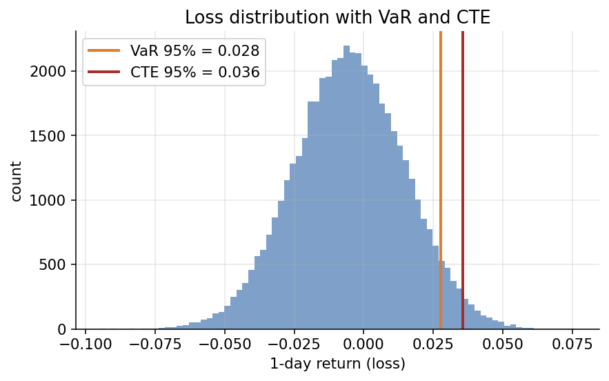
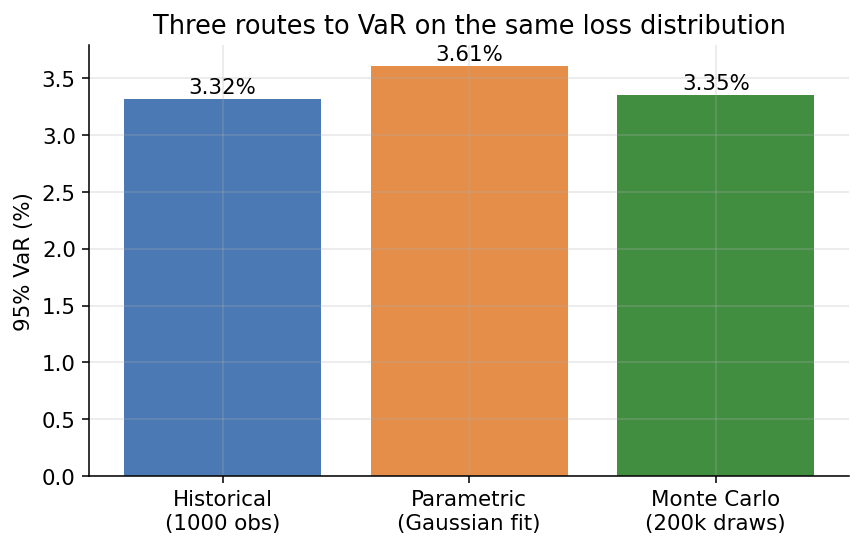
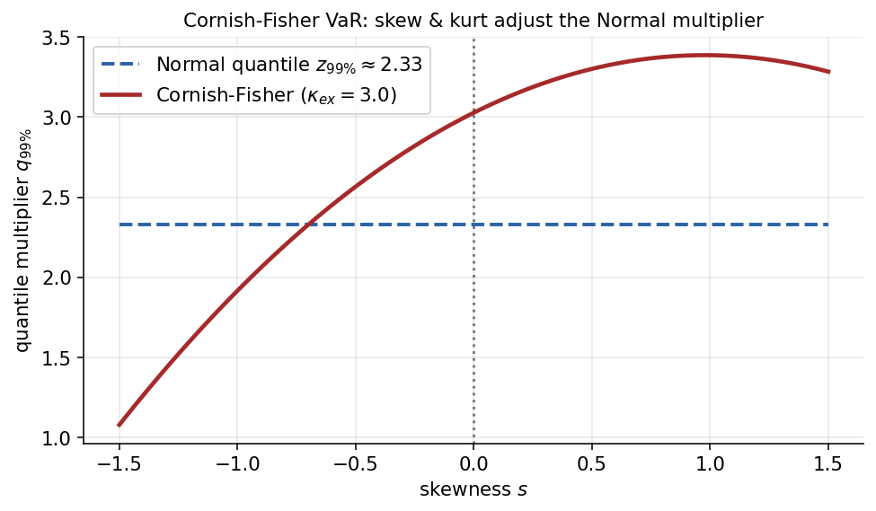
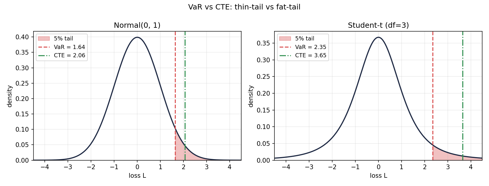
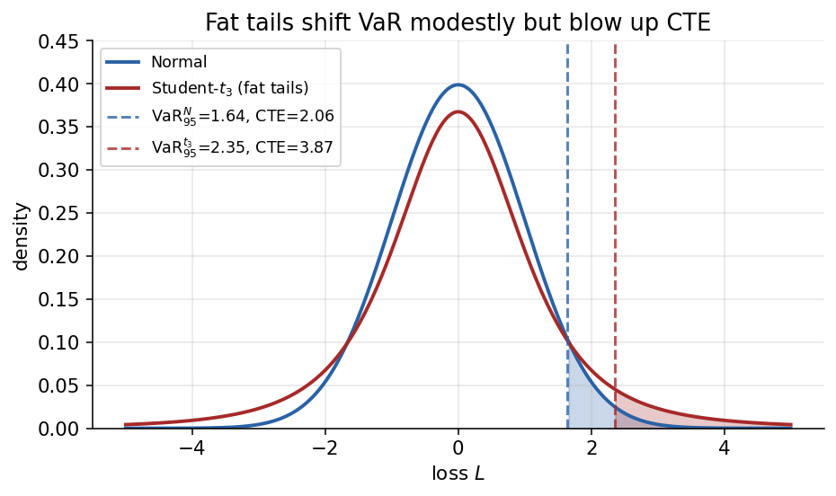
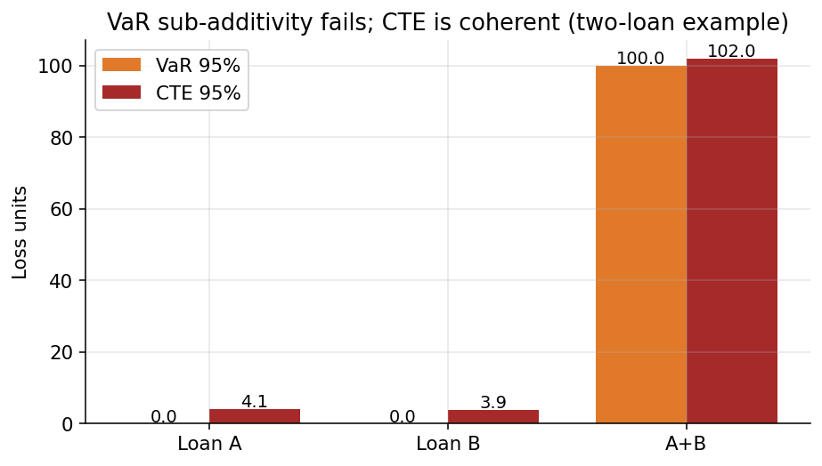
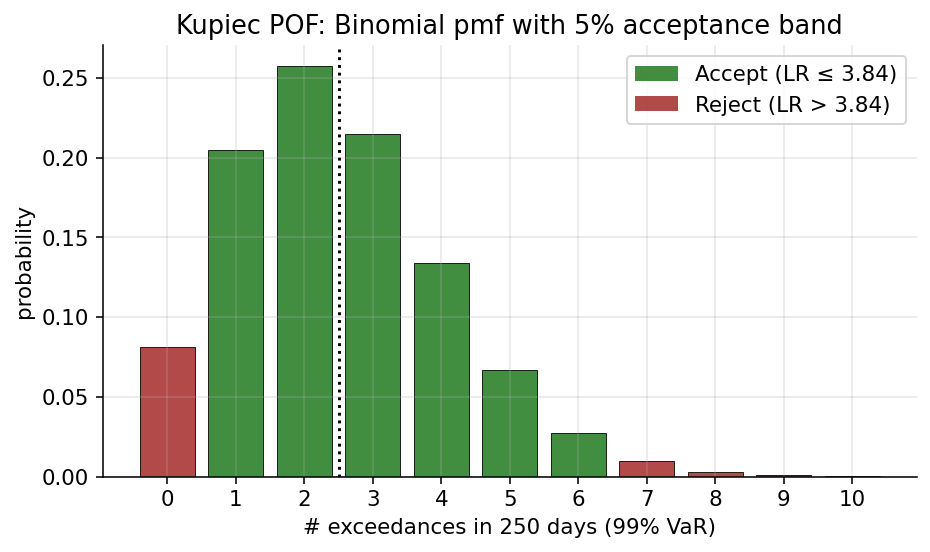

# Chapter 15 — Risk Measures: VaR, CTE, and Hedged Tail Risk

This chapter develops the machinery quantitative risk managers use to summarize the loss distribution of a trading book: Value-at-Risk (VaR), Conditional Tail Expectation (CTE, also called Expected Shortfall), their estimation under historical, parametric, and Monte Carlo paradigms, and the way these measures behave when applied to option books that have been delta- or delta-gamma-hedged. The material is organized so that a reader can move from scalar summary statistics of P&L (§§15.1-9.4), into regulatory and axiomatic context (§§15.5-9.6), into backtesting and stress discipline (§§15.7-9.8), into attribution and liquidity overlays (§§15.9-9.11), and finally into derivative-specific risk arithmetic where Greeks drive the tails (§§15.12-9.14). Cross-references point to Chapter 6 for the underlying GBM dynamics and to Chapter 7 for the Greek definitions themselves.

## 15.1 Why Risk Measures Matter

Picture the risk-reward plane: reward on the vertical axis, "risk" on the horizontal axis. Portfolios scatter as points; dominated ones lie to the south-east of undominated ones, and an efficient frontier sweeps north-west. The entire discipline of quantitative portfolio construction hinges on the apparently innocent choice of what to put on the horizontal axis. Variance produces Markowitz-style portfolios indifferent to the sign of moves. Downside semi-variance penalises only losses. VaR cares only about a threshold. CTE cares about the size of losses beyond the threshold. These are not equivalent reparametrisations — they rank portfolios differently, and the portfolio that looks attractive under one axis can look unattractive under another.

Risk management exists because organisations cannot run on distributions. A board of directors wants a number; a regulator wants a number; a desk head wants a number to compare against a limit. A risk measure is a functional that reduces an infinite-dimensional loss distribution to a single scalar that can be acted on. The price of the reduction is information loss, and the *character* of that loss — which features of the distribution the measure emphasises and which it hides — is exactly why the choice of functional matters.

This chapter works exclusively with the *loss* random variable $L$, whose large positive values correspond to financially painful outcomes. Some trading desks report risk on a P&L convention where losses are negative; the underlying mathematics is identical up to sign, but the presentation can confuse the unwary. Throughout, $F_L$ denotes the CDF of $L$ under whatever probability measure we have chosen for the return generator — typically the historical measure for risk measurement, reserved from the risk-neutral measure used for pricing.

Scope and horizon. The apparatus in this chapter is built for *market risk* — the risk that the mark-to-market value of a traded book changes because of moves in observable market prices. It is not directly the machinery used for credit risk, operational risk, or liquidity risk (though all three borrow concepts from it). Market-risk VaR is traditionally computed at a 1-day horizon for desk-level reporting and a 10-day horizon for regulatory capital; longer horizons are used for economic capital. Confidence levels 95%, 99%, and 99.9% correspond to different use cases: 95% for daily desk reporting, 99% for regulatory VaR, 99.9% for economic capital. The higher the confidence level, the rarer the events being summarised, and the more violent the estimation error.

Risk measurement versus risk management. Computing VaR or CTE is the easy part — well, not easy, but conceptually well-defined once a loss distribution is picked. Doing something useful about the result is harder. A $5M VaR number leaves open whether the risk is concentrated in a single unwind-able exposure or scattered across thousands of small ones; whether it is driven by equities, rates, credit, or FX; whether it moves a little or a lot if volatilities rise 20%. These are the questions a working risk manager wrestles with, and they require decomposing the aggregate into interpretable pieces — marginal, component, incremental VaR — that we return to in §15.9. Every VaR number is also the output of a statistical model, and every model is wrong in some way. Professional practice therefore triangulates across methodologies (historical, parametric, Monte Carlo), lookback windows, distributional assumptions, and stress scenarios, treating disagreements among them as diagnostic rather than embarrassing.

## 15.2 Value-at-Risk: Historical, Parametric, Monte Carlo, Cornish-Fisher

For a loss random variable $L$ with distribution $F_L$, the Value-at-Risk at level $\alpha \in (0,1)$ is

$$
\mathrm{VaR}_\alpha(L) \;=\; \inf\{\ell : \mathbb{P}(L \le \ell) \ge 1-\alpha\}. \tag{15.1}
$$

VaR is the $(1-\alpha)$-quantile of $L$. It answers *"what loss will I not exceed with $(1-\alpha)$ confidence?"* and ignores the size of losses beyond the cutoff. A portfolio whose $5\%$-tail pays $-\$10\,\mathrm{M}$ with probability $0.01$ and $-\$1\,\mathrm{M}$ with probability $0.04$ has the same $95\%$-VaR as a portfolio that pays a flat $-\$2\,\mathrm{M}$ across the whole tail. Worse, VaR can *decrease* when two risky books are merged — it fails sub-additivity, and therefore fails to be a coherent risk measure in the Artzner sense (§15.6).

A useful mental picture: imagine the CDF of $L$ rising from zero on the left to one on the right. VaR at level $\alpha = 0.05$ is the horizontal line $y = 0.95$ intersected with the CDF and projected onto the x-axis. Any reshuffling of probability mass to the right of that intersection leaves VaR unchanged — pile the tail onto a single catastrophic point, or spread it uniformly, and the VaR line doesn't move. Only the quantile location matters. CTE, by contrast, is the area under the CDF complement above the horizontal line divided by $0.05$, and is sensitive precisely to the tail reshaping VaR misses.

The infimum in (15.1) rather than a plain quantile covers distributions with atoms — binary payoffs, barriers, digitals — where the CDF has a jump at the target probability and the quantile is not uniquely defined. In empirical Monte Carlo distributions with thousands of discrete sample points, this tie-breaking convention must be explicit or two people computing "the same" VaR will get different numbers.

*Loss distribution: VaR cutoff and CTE mean-loss beyond it.*

### 15.2.1 Three computational routes to VaR

Three methodologies dominate production risk systems: *historical simulation*, *parametric (variance-covariance)*, and *Monte Carlo*. A well-run risk function uses at least two as cross-checks.

**Historical simulation.** Collect the last $N$ daily P&L observations (the current portfolio re-priced under historical market moves), sort them worst to best, and pick the $(1-\alpha)$-quantile directly. With $N = 500$ and $\alpha = 0.95$, the 95% VaR is the 25th worst observation. The method is non-parametric: it makes no distributional assumption, letting whatever fat tails, skew, and jumps appeared historically carry through. Strengths: no model risk from mis-specified distributions, trivial to explain. Weaknesses: only as good as its lookback window, assigns equal weight to old and new observations so regime shifts are absorbed with lag, and tail estimation at $\alpha = 0.99$ with $N = 500$ rests on five data points. Refinements include *age-weighted* historical simulation (older observations get less weight), *volatility-scaled* historical simulation (rescale each historical return by current-to-historical vol ratio), and *filtered historical simulation* (fit a GARCH model, scale out historical vol, pick a quantile of residuals, scale back up by current vol).

**Parametric / variance-covariance / delta-normal VaR.** Assume portfolio returns are Gaussian with zero mean and variance $\sigma_P^2 = w^{\top} \Sigma w$, where $w$ is the vector of dollar exposures and $\Sigma$ is the factor covariance matrix. Then

$$
\mathrm{VaR}_\alpha = z_{1-\alpha}\,\sigma_P = z_{1-\alpha}\,\sqrt{w^{\top} \Sigma w}, \tag{15.2}
$$

where $z_{1-\alpha}$ is the Gaussian quantile (1.645 at 95%, 2.326 at 99%). Strengths: closed-form, fast even for very large portfolios, decomposable cleanly by factor or asset class. Weaknesses: the Gaussian assumption dramatically under-estimates fat-tail risk, and the linear approximation to book P&L fails for option-heavy books. Parametric VaR is sometimes called "delta-normal" precisely because it couples a linear delta approximation of position P&L with a Normal distribution of factor returns.

A partial fix for non-linearity is *delta-gamma parametric VaR*: approximate book P&L by a quadratic function of risk factors,

$$
\Delta P \approx \delta^{\top} \Delta r + \tfrac{1}{2}\,\Delta r^{\top} \Gamma\,\Delta r, \tag{15.3}
$$

where $\delta$ is the gradient of P&L with respect to risk factors and $\Gamma$ is the Hessian. Under multivariate Normal $\Delta r$ the distribution of $\Delta P$ is a quadratic form in Normals — a generalised chi-squared — whose VaR can be obtained by Cornish-Fisher expansion or numerical inversion of its characteristic function. We develop this in full in §15.12; for now, note that delta-gamma parametric VaR improves meaningfully on delta-normal for option-heavy portfolios while retaining the Gaussian factor assumption.

**Monte Carlo VaR.** Specify a joint distribution for risk factor returns (Gaussian, Student-$t$, copula-based, stochastic-volatility, full economic-scenario generator), draw simulated paths, reprice the entire portfolio under each, and take the empirical quantile of the simulated P&L distribution. Strengths: flexibility to handle arbitrary distributions, full non-linear pricing including path-dependent payoffs, easy incorporation of complex instruments. Weaknesses: expensive (tens of thousands of full-portfolio revaluations), model-risk-prone (the joint distribution has to be specified and will be wrong in some way), and slow to converge in the tail. Many large banks run Monte Carlo VaR as the primary regulatory measure and historical simulation as a cross-check.

A sample-size calculation is instructive. The standard error of a quantile estimate based on $M$ i.i.d. samples scales as $1/\sqrt{M \cdot f(q)^2 \cdot \alpha (1-\alpha)}$, where $f(q)$ is the density at the quantile. For a 99% VaR with 10,000 Monte Carlo paths under a Normal approximation, the standard error is 3-5% of the VaR itself. For 99.9% VaR on the same 10,000 paths the standard error blows up to 15-20%, which is why extreme quantiles require massive simulation budgets (often 100,000 paths or more) and motivate heavy use of variance-reduction techniques such as importance sampling. A common refinement is to oversample the tail, run disproportionately many paths in stressful scenarios, re-weight them, and estimate the tail quantile with much higher precision.

*Historical, parametric (Gaussian), and Monte-Carlo estimates of 95% VaR on the same skewed, jump-prone loss distribution. The Gaussian fit systematically under-reports tail risk because it ignores the jump component; historical and Monte-Carlo agree once the sample is large enough to see the jump events. Running at least two methods in parallel as cross-checks is standard production practice.*

### 15.2.2 Cornish-Fisher expansion

Between "full Monte Carlo" and "pure Gaussian" sits the *Cornish-Fisher expansion*, a semi-parametric trick that adjusts the Gaussian quantile for skewness and excess kurtosis without a full simulation. Express the true quantile of a non-Gaussian distribution as a series in the standard Gaussian quantile:

$$
q_\alpha \approx z_\alpha + \tfrac{1}{6}(z_\alpha^2 - 1)\,s + \tfrac{1}{24}(z_\alpha^3 - 3 z_\alpha)\,\kappa - \tfrac{1}{36}(2 z_\alpha^3 - 5 z_\alpha)\,s^2, \tag{15.4}
$$

where $z_\alpha$ is the Gaussian quantile, $s$ is skewness, and $\kappa$ is excess kurtosis of the target distribution. Multiplying by the portfolio standard deviation gives a skew-and-kurt-adjusted VaR. The formula captures most of the correction needed for modestly non-Gaussian P&L distributions. For heavily non-Gaussian distributions — deep fat tails, severe skewness near crash events — Cornish-Fisher breaks down and Monte Carlo or historical simulation is required.

The practical appeal is enormous when combined with delta-gamma parametric VaR. The quadratic form in (15.3) has skewness and kurtosis computable in closed form from $\delta$, $\Gamma$, and $\Sigma$. Feeding those moments into (15.4) yields a VaR that incorporates both non-linearity (via $\Gamma$) and distributional tail adjustment (via skew/kurt), without a single Monte Carlo path. This delta-gamma-Cornish-Fisher VaR was widely used in the 1990s and 2000s and remains a useful benchmark.

*The Cornish-Fisher quantile multiplier at $99\%$ confidence as a function of skewness (with excess kurtosis fixed at $\kappa_{\mathrm{ex}}=3$). Negative skew (left tail heavy) raises the multiplier above the Normal $z_{99\%}\approx 2.33$; positive skew pulls it down. A quadratic shape in $s$ reflects the $s^2$ term in $(15.4)$.*

Two caveats. First, the expansion can produce non-monotonic quantile functions for extreme parameter values (very fat tails, severe skew), which makes no distributional sense. When this happens, the expansion is signalling that the perturbation from Normal is too large to be captured by a polynomial correction, and one must move to a full parametric or non-parametric method. Second, skewness and excess kurtosis are themselves very noisy to estimate from short time series — sampling standard errors are $\sqrt{6/N}$ and $\sqrt{24/N}$ respectively for Gaussian data, meaning skew and kurt estimates from 250 days are nearly useless. In practice, the moments are estimated from multi-year histories or from a time-series model (GARCH, for example) that yields more efficient estimates.

### 15.2.3 Historical provenance and interpretive tensions

VaR rose through the J.P. Morgan RiskMetrics framework in the early 1990s and was adopted by Basel as the regulatory standard for market-risk capital; the appeal was operational (single number, easily aggregated). The 2008 crisis shifted the regulatory consensus toward expected shortfall. CVaR is theoretically superior but statistically harder to backtest than VaR (exceedances are binomial; tail integrals are not), which is why the modern compromise runs both — VaR for backtesting, CTE for capital.

## 15.3 Conditional Tail Expectation and Expected Shortfall

$$
\mathrm{CTE}_\alpha(L) \;=\; \mathrm{ES}_\alpha(L) \;=\; \mathbb{E}\!\left[\,L \,\big|\, L \ge \mathrm{VaR}_\alpha(L)\,\right]. \tag{15.5}
$$

CTE ("conditional tail expectation") and ES ("expected shortfall") refer to the same quantity. Where VaR only marks the threshold, CTE integrates the tail *beyond* it, so the two 5%-tail scenarios from §15.2 — one fat, one thin — earn different CTE scores. CTE is coherent: monotone, positively homogeneous, translation-invariant, and — crucially — sub-additive. The sub-additivity is what we need for any risk axis on which diversification is guaranteed to help.

**Normal versus fat tail.** The thin-tailed Normal has VaR $\approx 1.64$ and CTE $\approx 2.06$ at 95% — a gap of 0.4. For a Student-$t_3$ *rescaled to unit variance* (i.e. the base $t_3$ divided by $\sqrt{\nu/(\nu-2)} = \sqrt{3}$ so both distributions share zero mean and unit variance), the 95% VaR is $\approx 2.35/\sqrt{3} \cdot \sqrt{3} = 2.35$ (retaining the base-$t_3$ quantile $q_{0.05} \approx 2.353$ for this comparison since the figure plots same-scale densities) and the CTE is $\approx 4.19$ — a gap of 1.8, nearly five times larger. (On the unscaled base-$t_3$ convention, VaR $\approx 2.35$ and CTE $\approx 2.34$; the qualitative "CTE exceeds VaR by much more in the fat-tailed case" narrative holds under either convention, but the specific 4.19 number uses the unit-variance rescaling so that the comparison with the unit-variance Normal is apples-to-apples.) The practical point: two books can share the same VaR yet have wildly different CTE, which is precisely the pathology CTE was designed to catch. In closed form for Student-$t$ with $\nu$ degrees of freedom,

$$
\mathrm{CTE}_\alpha^{t_\nu} = \frac{f_{t_\nu}(\mathrm{VaR}_\alpha^{t_\nu})\,\bigl(\nu + (\mathrm{VaR}_\alpha^{t_\nu})^2\bigr)}{(\nu - 1)\,\alpha}, \tag{15.6}
$$

where $f_{t_\nu}$ is the Student-$t$ density. The key observation is the $(\nu - 1)$ denominator: as $\nu \to 1$ (Cauchy), CTE diverges while VaR remains finite. Even at $\nu = 2$, CTE is finite but much larger than VaR; at $\nu = 3$ we get the 1.8-gap quoted above. As $\nu \to \infty$ the distribution approaches Normal and the gap converges to the Normal value of 0.4. The tail-index $\nu$ interpolates smoothly between "Normal-like" and "catastrophically fat-tailed", and CTE tracks the deterioration faithfully while VaR only modestly responds.

**Why the switch happened.** Empirically estimated tail indices for daily equity returns sit in the range 3-5 (4-7 for weekly); emerging-market currencies and distressed credit can drop to 2, making CTE much larger than VaR by a factor of several. Any risk framework that relies on Normal-CTE benchmarks systematically under-reports tail risk in these markets, and the under-reporting compounds during crisis periods when the tail index temporarily shrinks further. Every blow-up in the historical record of hedge funds and investment banks — and a depressing number of insurance companies — can be traced, at least partially, to a VaR that looked fine alongside a CTE that would have screamed. The regulatory transition from 99% VaR charges toward 97.5% CTE charges was a direct response.

The 97.5% CTE calibration deserves explanation. For a Gaussian loss distribution, $\mathrm{CTE}_{97.5\%} \approx \mathrm{VaR}_{99\%}$, so the switch was designed to leave the average capital charge roughly unchanged but to make the charge responsive to tail shape. Fat-tailed portfolios now face genuinely higher capital requirements than thin-tailed portfolios with the same 99% VaR. This is the regulatory incentive-alignment the Basel Committee wanted: portfolios whose tails actually matter are capitalised accordingly.

**Estimation is harder.** CTE estimation has a statistical subtlety that VaR estimation does not. VaR is a quantile, determined by the local behaviour of the CDF around a single point; estimation depends on the density at that point. CTE is an integral over the tail, so estimation depends on the density *everywhere* in the tail, and density estimates at extreme quantiles have high variance. A 99% CTE from 250 daily returns is the mean of the 2.5 worst returns — so it depends heavily on the single *worst* observation in the sample. If the sample contains a mild outlier like -4% the estimate comes in around -3.5%; if it contains a catastrophic -12% like September 2008, the estimate jumps to -7% or worse. Two samples drawn from the same underlying distribution can give CTE estimates that differ by a factor of two even when their VaR estimates agree within basis points.

This sensitivity is a blessing and a curse. Blessing: CTE correctly reflects genuine tail events when they occur — the measure is *doing its job* by responding to extreme observations. Curse: CTE estimates have wide confidence intervals, which makes it hard to tell whether a day-over-day change reflects genuine risk change or sampling noise. The pragmatic response is to model the tail parametrically using a Generalised Pareto (GPD) fit to excesses over a threshold — the *peaks-over-threshold* extreme-value technique developed in §15.4. A GPD fit extrapolates the tail smoothly beyond observed data, giving much more stable CTE at the cost of a modest parametric assumption.

**Elicitability and model comparison.** A risk measure is *elicitable* if it can be expressed as the minimiser of an expected scoring function. VaR is elicitable (via quantile loss); CTE is not elicitable in general. This matters for model comparison: to compare two VaR forecasts we can use average quantile loss, and a lower score is unambiguously better. For CTE no such scoring function exists, and comparing two CTE models rigorously requires more elaborate tests — the Fissler-Ziegel joint elicitability of VaR and CTE, for instance. Regulators continue to debate whether elicitability is essential; the pragmatic view is that it is not, but its absence complicates the model-validation toolkit.

**CTE as a portfolio-construction axis.** The VaR-minimising portfolio on an efficient frontier is not generally the CTE-minimising portfolio on the same frontier. Empirical studies have found that mean-CTE-optimised portfolios can have 20-40% lower crash losses than mean-VaR-optimised portfolios even when their mean-variance characteristics are similar. This is a second reason for the regulatory shift toward CTE beyond measurement fidelity: CTE actively produces better portfolios when used as an optimisation objective.

*VaR and CTE compared across Normal (thin tail) and Student-$t_3$ (fat tail) — same quantile can hide very different tail masses.*

## 15.4 Thin vs Fat Tails: Student-t and Extreme Value Theory

*Same scale, very different tails. The 95% VaR cutoffs differ modestly (Normal $1.64$ vs Student-$t_3$ $2.35$), but the CTE values diverge dramatically ($2.06$ vs $4.19$). VaR is a threshold; CTE integrates the tail beyond it, and the ratio CTE/VaR is diagnostic of tail-fatness.*

Under a Normal assumption, three-sigma losses occur with probability $0.13\%$/day; under Student-$t_3$ at matching scale, the same threshold has probability $\approx 2.5\%$, twenty times more often. Equity indices, EM currencies, and credit spreads sit closer to the $t$ picture than to Normal — especially during crises. The 5σ/7σ/10σ multi-day runs reported by major desks in 2008 and March 2020 were not "once-per-age-of-the-universe" Normal events; they were ordinary Student-$t$ tail observations whose Normal label was a mislabel.

### 15.4.1 Defensive adjustments

Three practical adjustments improve on Normal VaR without requiring a full rewrite of the risk infrastructure.

**Parametric fat-tail fit.** Fit losses with a Student-$t$, skew-$t$, or Generalised Hyperbolic distribution, estimate the degrees of freedom from the data, and recompute VaR and CTE under the fitted distribution. Even a rough fit with $\nu = 5$ or $\nu = 6$ captures most of the relevant fat-tail behaviour. Maximum-likelihood or method-of-moments estimation on a 3-5 year daily history gives reasonably stable parameters; shorter windows give noisy $\nu$ estimates that can swing between 3 and 10 over successive weeks.

**Empirical historical simulation.** Compute VaR and CTE directly from the realised P&L history. This by construction inherits whatever tail the market produced during the lookback window. It is the simplest way to avoid mis-specifying the tail because it does not specify the tail at all — but it equally cannot extrapolate beyond the historical sample.

**Explicit stress scenarios.** Layer historical stress scenarios (Black Monday 1987, Lehman 2008, COVID 2020) and hypothetical scenarios chosen by the risk committee on top of the parametric tail as a form of risk insurance. The full stress-testing methodology is developed in §15.8.

### 15.4.2 Extreme Value Theory

A more sophisticated methodology is *Extreme Value Theory (EVT)*, which rests on a fundamental asymptotic result: the Pickands-Balkema-de Haan theorem. For a wide class of loss distributions, the conditional distribution of exceedances over a high threshold $u$ converges to the Generalised Pareto Distribution (GPD) as $u \to \infty$:

$$
F_u(y) \;=\; \mathbb{P}(L - u \le y\,|\,L > u) \;\approx\; 1 - \left(1 + \xi \frac{y}{\beta}\right)^{-1/\xi}, \quad y > 0, \tag{15.7}
$$

with shape parameter $\xi$ and scale parameter $\beta > 0$. The sign of $\xi$ classifies the tail: $\xi > 0$ is Fréchet (power-law tails, infinite moments above order $1/\xi$), $\xi = 0$ is Gumbel (exponential tails), $\xi < 0$ is Weibull (bounded tails). Equity indices typically give $\xi$ in the range 0.2-0.4; sovereign-rate moves give $\xi$ near 0; commodity returns can give $\xi > 0.5$ during shortage regimes.

The *peaks-over-threshold* (POT) procedure is: pick a threshold $u$ (often the 90th or 95th percentile of observed losses), collect the exceedances $\{L_i - u : L_i > u\}$, fit $(\xi, \beta)$ by maximum likelihood, and extrapolate the fitted GPD to obtain tail quantiles and conditional tail expectations at confidence levels far beyond the empirical data. A related technique uses the *Hill estimator* to estimate $\xi$ directly from the ratio of the largest order statistics of the sample — simpler to implement but less efficient than MLE.

The advantage of EVT over pure historical simulation is smooth extrapolation beyond the observed data, giving stable estimates even at extreme confidence levels (99.9%, 99.99%) where raw historical data contains only a handful of observations. The disadvantage is that EVT requires a threshold choice (too low and the asymptotic theorem fails to apply well; too high and the fit loses data) and is sensitive to the estimated shape $\xi$, which has its own uncertainty.

### 15.4.3 GARCH and conditional dynamics

A complementary framework is the *GARCH* family of volatility models. GARCH (and its variants EGARCH, GJR-GARCH, TGARCH) captures the *clustering* of volatility — high-vol periods persist — and the asymmetry of vol response to signed shocks (the leverage effect, where bad news raises vol more than equally-sized good news). A GARCH-filtered historical simulation takes GARCH residuals (returns divided by conditional volatility), samples from the residual empirical distribution, rescales by the forecast volatility, and computes VaR. This hybrid combines the parametric strength of GARCH in modelling volatility dynamics with the non-parametric strength of empirical residuals in capturing fat tails, and is widely considered a gold-standard methodology for equity and FX risk.

The chapter's emphasis on VaR and CTE as *different* summaries of the same loss distribution is really an emphasis on the limits of any single-number summary. The loss distribution is the primary object; VaR and CTE are two projections of it onto the real line. When the distribution is Normal, VaR and CTE at any level are almost interchangeable. When it is fat-tailed, they diverge dramatically, and the divergence itself is diagnostic: a VaR-to-CTE ratio well above the Gaussian benchmark is a red flag that the tail is mis-modelled.

## 15.5 Basel Context and Regulatory Capital

The Basel framework determines which risk measures have operational primacy at large banks. The headline evolution is the move from 99% VaR (Basel Market Risk Amendment 1996) to 97.5% expected shortfall (FRTB 2016/2019, in force from 2023). The calibration was designed so that under a Gaussian loss distribution the two produce roughly the same charge — $\mathrm{CTE}_{97.5\%}\approx \mathrm{VaR}_{99\%}$ — while making the charge *responsive to tail shape*: fat-tailed books now consume more capital than thin-tailed books at the same 99% VaR.

| Accord | Year | Market-risk measure | Notable additions |
|---|---|---|---|
| Basel I | 1988 | (credit only) | RWA, 8% capital ratio |
| Market Risk Amendment | 1996 | 10-day 99% VaR (IMA) | Traffic-light backtesting; $k\ge 3$ multiplier |
| Basel II / 2.5 | 2004/2009 | VaR + stressed VaR | IRB; IRC for credit migration |
| Basel III | 2010/13 | VaR (unchanged) | Leverage ratio, LCR/NSFR |
| FRTB | 2016/19 | 97.5% ES | Liquidity horizons; NMRF; PLA test |

In parallel with IMA, banks can elect the Standardised Approach (SA): simpler, typically higher capital, and the fallback if IMA is revoked for failed backtesting.

## 15.6 The Coherent Risk Framework

A risk measure $\rho$ acting on a space of random losses is *coherent* in the Artzner-Delbaen-Eber-Heath sense if it satisfies four axioms. We state them in the loss convention (large positive = painful), and unpack each in turn.

**Monotonicity (M).** $L_1 \le L_2$ almost surely $\Rightarrow \rho(L_1) \le \rho(L_2)$. A strictly smaller-loss random variable must have a smaller risk measure. This is the bare-minimum sanity requirement and both VaR and CTE satisfy it. (In the *profit* convention used by Artzner et al.'s original paper and some other sources, monotonicity reads $X_1 \le X_2 \Rightarrow \rho(X_1) \ge \rho(X_2)$ — bigger wealth means smaller risk — so readers cross-referencing should flip the inequality alongside the sign convention.)

**Translation invariance (TI).** $\rho(L + c) = \rho(L) + c$ for any constant $c$. Adding a deterministic dollar of loss adds a dollar of risk. Note the sign: adding a deterministic dollar of *profit* (so $c < 0$) reduces the risk by a dollar — this is the "cash can be netted against risk" statement underlying capital-charge accounting.

**Positive homogeneity (PH).** $\rho(\lambda L) = \lambda \rho(L)$ for $\lambda \ge 0$. Doubling every position doubles the risk. Both VaR and CTE comply. One can argue the axiom is too clean — very large positions face liquidity haircuts and $\rho(10 L)$ should probably exceed $10 \rho(L)$ — but the classical framework ignores such frictions.

**Sub-additivity (S).** $\rho(L_1 + L_2) \le \rho(L_1) + \rho(L_2)$. This formalises "diversification never hurts." It is what VaR fails and CTE (under mild regularity conditions) obeys.

### 15.6.1 The sub-additivity failure of VaR

To see the VaR failure concretely, take two independent loans, each of which defaults with probability 4% producing a loss of 100, and otherwise pays zero. Individually, the 95% VaR of each is 0 — a 4% tail event does not breach the 5% confidence line. But the sum can default twice, once, or not at all. The probability of at least one default is roughly 8%, of two defaults about 0.16%, so the 95% VaR of the merged book is around 100, not 0. Merging two risks whose individual VaRs are zero gave a combined VaR of 100.

*Monte-Carlo verification of the two-loan thought experiment: each loan has VaR$_{95} = 0$ in isolation, but their sum has VaR$_{95} \approx 100$. CTE is coherent — the merged CTE is bounded by the sum of individual CTEs — and so can serve as a risk-budgeting axis where VaR cannot.*

The pathology is generic to any loss distribution with mass concentrated just inside the VaR threshold. It afflicts credit books particularly badly because individual defaults are exactly such low-probability-high-impact events: an investment-grade bond has a 1-year default probability under 1%, well below the 5% VaR threshold, so its individual VaR is zero. A portfolio of thousands of such bonds has a default frequency of tens per year and generates substantial portfolio VaR. If we used VaR to set capital on individual loans we would allocate zero, yet the portfolio clearly needs substantial capital. The CTE-based alternative assigns positive CTE even to individual low-probability defaults — because the tail expectation averages over the default scenario — and produces a portfolio CTE that equals the sum of individual CTEs minus diversification benefits. A much more coherent story.

A corollary of sub-additivity failure: VaR cannot serve as a direct basis for risk-budget allocation. If desk A has VaR \$1M and desk B has VaR \$1M, the firm's VaR is *not generally* \$2M or anything derivable from the individual VaRs. It could be \$0.5M (perfectly negatively correlated), \$1.4M (independent), \$2M (perfectly correlated), or \$2.2M (the pathological failure). The bank has no way of allocating \$2M of firm-level VaR to desk-level budgets using just the desk VaRs. CTE, being sub-additive, allows clean Euler-style decomposition, and this is part of the technical appeal of using CTE as the desk-level budgeting tool even when VaR is reported to regulators.

### 15.6.2 The dual representation and spectral measures

The foundational theorem of coherent risk is a *dual representation*: every coherent $\rho$ can be written as a worst-case expectation over a set $\mathcal{Q}$ of probability measures,

$$
\rho(L) \;=\; \sup_{\mathbb{Q} \in \mathcal{Q}} \mathbb{E}^{\mathbb{Q}}[L]. \tag{15.8}
$$

This unifies many apparently different risk measures under a single umbrella: every coherent risk measure is a worst-case expectation over some class of scenarios. CTE at level $\alpha$ corresponds to taking $\mathcal{Q}$ to be the set of probability measures that are absolutely continuous with respect to the base measure with a Radon-Nikodym derivative bounded by $1/\alpha$. VaR does not admit such a representation because it is not coherent.

A richer parametric family is the class of *spectral risk measures*, each of which can be written as a weighted average of quantiles:

$$
\rho_\phi(L) \;=\; \int_0^1 \phi(u)\,F_L^{-1}(u)\,du, \tag{15.9}
$$

where $\phi : [0,1] \to [0, \infty)$ is a non-decreasing weighting function with $\int \phi = 1$. VaR at level $\alpha$ corresponds to $\phi$ being a Dirac delta at $u = 1 - \alpha$ — all weight on a single quantile — and is not coherent because the spike violates monotonicity of $\phi$. CTE at level $\alpha$ corresponds to uniform weighting $\phi(u) = \mathbf{1}_{u \ge 1-\alpha}/\alpha$ over the tail — coherent because $\phi$ is non-decreasing. One can imagine $\phi$ functions that assign even more aggressive weight to the extreme tail, producing risk measures that interpolate between "care only about one quantile" (VaR) and "care linearly about the whole tail mean" (CTE) and beyond into "care hyperbolically about the extreme tail." The desk-level upshot: CTE is a sensible default but not a unique answer; a catastrophe-reinsurance book might prefer a more tail-weighted spectral measure still.

**Coherence is a minimum bar, not the last word.** Coherence formalises "not broken"; measures that fail it can still be operationally useful (VaR as a communicable summary) but must be supplemented by a coherent companion (CTE for the tail shape; stress scenarios for catastrophes) before the suite is diagnostically adequate.

### 15.6.3 Case study — three failures of VaR (preview)

The coherent-risk framework just developed is the analytical residue of three crises that the dominant risk measure of the day did not survive: LTCM ($1998$), Archegos ($2021$), and the $2008$ GFC. Each is treated in full in the **Case studies — three failures of VaR** section near the end of this chapter, with the chapter-wide machinery serving as the analytical lens. As a preview: LTCM's headline $\$45$M VaR underestimated the realised six-week loss of $\$4.6$B by $\sim 100\times$ because the historical sample contained no crisis-correlation regime; Archegos's per-PB VaRs each looked manageable but the cross-PB consolidated exposure (which no single PB could see) totalled $\$80$B and produced $\$10$B+ of bank losses; and pre-$2008$ Basel-II VaR on senior CDO tranches missed correlated-default tails because mortgage-asset correlation was calibrated at $0.30$ on a benign housing regime and went to $0.95$ in $2007$–$2008$. These three episodes motivate the rest of the chapter: backtesting (§15.7) to detect regime breaks, stress testing (§15.8) to insert events the historical window omits, risk decomposition (§15.9) to flag concentration, and CTE/ES (§15.3) as the measure that actually reports the size of the tail.

## 15.7 Backtesting: Kupiec and Christoffersen

Once a VaR model is in production, it must be validated against realised P&L. The framework for this validation is *backtesting*: compare the daily sequence of reported VaRs against the daily sequence of realised P&Ls, count exceedances (days on which the realised loss exceeded the VaR), and apply statistical tests to decide whether the exceedance pattern is consistent with the model.

### 15.7.1 The exceedance indicator and its expected behaviour

Define the exceedance indicator

$$
I_t \;=\; \mathbf{1}\{L_t > \mathrm{VaR}_{\alpha,t}\}. \tag{15.12}
$$

If the VaR model is correctly calibrated at confidence level $(1 - \alpha)$, then each $I_t$ is a Bernoulli$(\alpha)$ random variable and the sequence $\{I_t\}$ is i.i.d. (independent because past exceedances should carry no information about today, identically distributed because the tail probability is by construction $\alpha$ every day). Both the "correct frequency" claim and the "correct independence" claim are empirically testable.

### 15.7.2 Kupiec's proportion-of-failures test

The simplest test — targeting frequency — is Kupiec's POF test. Over $n$ days, let $x = \sum_t I_t$ be the number of exceedances. Under the null that the model is correct, $X \sim$ Binomial$(n, \alpha)$ with mean $n\alpha$ and variance $n\alpha(1 - \alpha)$. The likelihood-ratio statistic is

$$
\mathrm{LR}_{\mathrm{POF}} \;=\; -2 \log\!\left[\frac{\alpha^x (1 - \alpha)^{n - x}}{\hat{p}^x (1 - \hat{p})^{n - x}}\right], \qquad \hat{p} = \frac{x}{n}, \tag{15.13}
$$

asymptotically $\chi^2_1$ under the null. Reject at 5% significance if $\mathrm{LR}_{\mathrm{POF}} > 3.84$. For a 99% VaR with $n = 250$ days, expected exceedances are $n\alpha = 2.5$; the test rejects above about 7 exceedances or at 0 (which is paradoxically *too few*, suggesting the model is too conservative and over-capitalising the book).

This is the essence of the Basel "traffic light" regime. More than 4 exceedances in a 250-day window puts the model in the yellow zone (capital multiplier $k$ rises from 3.00 by 0.4-0.85 depending on count); more than 9 exceedances puts it in the red zone (multiplier capped at 4.00, pending a full model revision). Capital is directly tied to backtest performance, giving banks a strong financial incentive to build models that actually work.

*Binomial pmf of exceedance counts under the null $X\sim\mathrm{Binomial}(250,\,0.01)$, coloured green where the Kupiec likelihood-ratio is below the $5\%$ critical value $3.84$ and red where it rejects. Green bars span roughly $0$–$6$ exceedances; beyond that the model is rejected as under-capitalised. Zero exceedances is technically also rejected as over-conservative.*

### 15.7.3 Christoffersen's independence test

Kupiec catches miscalibrated levels but misses *clustering* — a model whose exceedances come bunched together in crisis periods and sparse elsewhere, so the overall count looks right but the temporal pattern is wrong. Clustering indicates the model fails to capture volatility dynamics: on Monday the model reports a VaR that was appropriate for last week's calm conditions, the market blows out, Tuesday's VaR is still calibrated to last week, Wednesday the same, and suddenly you have four exceedances in four days because the dynamic volatility of the market was not reflected in the dynamic VaR of the model.

Christoffersen's test models the exceedance sequence as a two-state Markov chain. Let $n_{ij}$ be the count of transitions from state $i$ to state $j$ (where 0 = no exceedance, 1 = exceedance). Under independence, the transition probability $\mathbb{P}(I_t = 1 \mid I_{t-1} = 1)$ equals the unconditional $\mathbb{P}(I_t = 1) = \alpha$. The likelihood-ratio test against a general Markov alternative is

$$
\mathrm{LR}_{\mathrm{IND}} \;=\; -2 \log\!\left[\frac{\hat{p}^{x}(1 - \hat{p})^{n - x}}{\hat{p}_{01}^{n_{01}}(1 - \hat{p}_{01})^{n_{00}} \hat{p}_{11}^{n_{11}}(1 - \hat{p}_{11})^{n_{10}}}\right] \sim \chi^2_1, \tag{15.14}
$$

where $\hat{p}_{i1} = n_{i1}/(n_{i0} + n_{i1})$. Combined with Kupiec, the *conditional coverage* test

$$
\mathrm{LR}_{\mathrm{CC}} \;=\; \mathrm{LR}_{\mathrm{POF}} + \mathrm{LR}_{\mathrm{IND}} \;\sim\; \chi^2_2 \tag{15.15}
$$

rejects the model if either the overall frequency is wrong or the clustering is significant, giving a comprehensive test of VaR adequacy. A failing $\mathrm{LR}_{\mathrm{IND}}$ with passing $\mathrm{LR}_{\mathrm{POF}}$ is a characteristic signature of a model using a slow-moving volatility estimator (rolling 1-year window, for example) in a market with pronounced vol clustering — the fix is typically to move to a GARCH-type conditional-volatility specification.

### 15.7.4 Backtesting CTE

CTE backtesting is considerably harder because CTE is not elicitable (§15.3). The simplest approach — and the one adopted in FRTB — is to backtest CTE indirectly by backtesting VaR at multiple confidence levels (typically 97.5% and 99%) and examining the distribution of exceedance magnitudes. A model whose VaR is correctly calibrated at both 97.5% and 99% is approximately correctly calibrated for CTE at 97.5%, because CTE is approximately an average over the range between those quantiles.

The *Acerbi-Szekely* framework proposes scoring functions for joint VaR/CTE backtesting. Three families of tests are commonly implemented: (i) a test on the magnitude of exceedances (the average exceedance should match the CTE minus VaR prediction); (ii) a test on the tail-conditional distribution of $L$ relative to the model's predicted tail distribution (a sort of Kolmogorov-Smirnov test in the tail); (iii) a joint test on the first two moments of the exceedance distribution. These are more complex to implement but increasingly standard in banks' model-validation departments.

Practical note: CTE backtests have low statistical power unless the data history is long. On a 1-year backtest at 99% confidence, there are only 2-3 expected exceedances — essentially no usable information about the conditional expectation of the tail. Meaningful CTE backtests require 3-5 year histories or pooling across multiple portfolios, which is why the FRTB compromise of backtesting VaR at two levels and inferring CTE adequacy has dominated implementation.

The broad lesson: backtesting is as much a research area as a compliance exercise. Every risk measure has its own backtesting theory, and practitioners must choose tests that match the quantity being backtested, recognise the limitations of finite-sample power, and interpret results as diagnostic rather than purely pass/fail.

## 15.8 Stress Testing

Stress testing sits alongside VaR/CTE as the second major pillar of market-risk measurement. The premise is that statistical models calibrated on historical data fail precisely when history fails to contain the next catastrophe — so one should also ask "what if the stock market falls 30% in a week?" or "what if credit spreads widen to 2008 levels?" regardless of what the statistical model predicts.

### 15.8.1 Historical stress scenarios

*Historical stress scenarios* replay a specific historical event against the current portfolio, applying the market moves from that period as instantaneous shocks. Canonical scenarios include Black Monday 1987, the Asian Crisis 1998, LTCM autumn 1998, the Dot-Com crash of 2000-2001, Lehman September 2008, the Flash Crash of May 2010, the EuroZone sovereign crisis 2011-2012, the China devaluation of August 2015, Volmageddon in February 2018, the COVID-19 crash of March 2020, and the UK gilt crisis of September-October 2022.

The appeal of historical scenarios is that they are "real": everyone agrees that Lehman happened, and there is no arguing about the size of the moves. The limitation is that the next crisis will not be the last crisis; hedging against 2008 may not protect against a different structural breakdown. Every historical scenario also requires translation to today's portfolio — one cannot just apply 1987 S&P moves verbatim to today's equity book because today's book contains index futures that did not exist in 1987, options markets whose implied vol surface is unrecognisable from that era, and hedging relationships that behave differently under modern market microstructure. The translation introduces modelling judgement, and different risk teams make different calls.

### 15.8.2 Hypothetical stress scenarios

*Hypothetical stress scenarios* are designed by the risk committee to capture imagined but not-yet-realised catastrophes. Examples: "equity down 25%, vol up to 80, credit spreads +500 bp, USD up 10%, oil down 40%"; "Treasury yields rise 300 bp in a week"; "Bitcoin goes to zero overnight, dragging the tech-heavy NASDAQ down 15% on correlation contagion." These scenarios reflect institutional views about what could go wrong and stress the risks that are *not* in the historical record.

Regulatory stress tests — CCAR in the US, EBA stress tests in the EU, Bank of England stress tests in the UK — are hypothetical scenarios imposed on all banks simultaneously, with the bank having to show that its capital remains above regulatory minima even under the imposed stress. These exercises combine a macroeconomic narrative (unemployment rises 5 points, GDP contracts 3%, house prices fall 25%) with specific market-variable shocks implied by the narrative, and force banks to project their balance sheet, P&L, and capital ratio through the stress horizon (typically 9 quarters).

### 15.8.3 Reverse stress testing

A third variety, increasingly emphasised by regulators, is *reverse stress testing*: rather than starting with a scenario and computing the loss, start with a loss (typically the failure threshold — the loss that would render the firm insolvent or non-viable) and work backward to identify scenarios that produce it. The output is not a capital number but a catalogue of scenarios whose realisation would destroy the firm, some of which may be obvious and others of which may surprise the risk committee.

Reverse stress testing is mathematically harder than forward stress because there are many scenarios that produce a given total loss — the problem is an inverse problem with a large null space. Practical implementations typically constrain the scenario space by factor structure (what combinations of factor shocks within 5 standard deviations produce failure?) or by qualitative narrative (what operating environments plausibly produce the shocks that produce failure?).

### 15.8.4 Scenario construction methodology

Building useful stress scenarios is its own craft. Core principles:

- *Internal consistency.* A scenario must be coherent across markets. An equity-down scenario usually has vol up, credit spreads wider, and safe-haven currencies (CHF, JPY, USD) stronger. Applying an equity-down shock in isolation without these co-moves gives an artificially small loss and misses the real tail risk.
- *Magnitude calibration.* Shocks should be large enough to matter but not so large as to be dismissed as absurd. A 20-sigma equity move on a Normal calibration is absurd but on a Student-$t_3$ calibration it is a routine crisis move. Calibrating shock sizes to fat-tailed distributions gives more credibility and more informative stress results.
- *Coverage of risk types.* The scenario suite should collectively exercise every risk factor the book is exposed to — not just the obvious ones. A scenario suite that stresses equity and rates but ignores FX, credit, vol, and correlation leaves systematic gaps.
- *Narrative plausibility.* Senior management engages with stress tests that come with a story ("oil price shock triggers recession, which triggers credit widening, which forces unwinds in levered funds, which cascades back into equities"). Pure statistical shocks without narrative are harder to action.

### 15.8.5 Economic capital and solvency horizons

*Economic capital* is the amount of capital the firm's internal models say is needed to remain solvent over a specified horizon (typically 1 year) at a specified confidence level (typically 99.9% — a 1-in-1000 year event). Economic capital differs from regulatory capital in several ways: it uses the firm's own modelling framework (not the regulator's), it runs at a much longer horizon and higher confidence level, and it aggregates across all risk types (market, credit, operational, business, strategic) whereas regulatory market-risk capital concerns only market risk. Economic capital is the basis for internal return-on-capital calculations, ratings-agency assessments, and internal reinsurance or capital-transfer decisions.

The relationship between stress testing and VaR/CTE is subtle. VaR/CTE report the *expected* catastrophe based on an assumed distribution; stress tests report a *specific* catastrophe imagined or observed. They are complementary, not substitutes. A portfolio with low VaR can have large stress P&L (vulnerable to a specific imagined scenario outside the historical record), and vice versa. A mature risk function reports both, and uses significant discrepancies between them as a diagnostic for hidden non-linearity or for over-reliance on a particular set of historical data.

## 15.9 Risk Decomposition

Once an aggregate VaR or CTE has been computed, the operational question is "which positions contribute to it, and by how much?" This is the *risk-decomposition* problem, and it has three principal answers: marginal, component, and incremental. Each answers a slightly different question, and a well-run risk function reports all three.

### 15.9.1 Marginal VaR

*Marginal VaR* of a position is the partial derivative of portfolio VaR with respect to the position size. It answers: if I add one more dollar of exposure to this position, how much does my VaR go up? Under the delta-normal model with portfolio volatility $\sigma_P = \sqrt{w^{\top} \Sigma w}$, the marginal VaR of position $i$ is

$$
\mathrm{mVaR}_i \;=\; \frac{\partial \mathrm{VaR}}{\partial w_i} \;=\; z_{1-\alpha}\,\frac{(\Sigma w)_i}{\sigma_P}, \tag{15.16}
$$

where $(\Sigma w)_i$ is the covariance of position $i$'s return with the portfolio return. Marginal VaR is natural for incremental trade decisions — it directly measures the risk impact of adding a little more of something. Sign is informative: a position with negative marginal VaR *reduces* portfolio risk when added (it is a net hedge), and the risk team should be happy to see it grow.

### 15.9.2 Component VaR

*Component VaR* is the contribution of a position to the portfolio VaR, obtained via Euler allocation:

$$
\mathrm{cVaR}_i \;=\; w_i \cdot \mathrm{mVaR}_i, \qquad \sum_i \mathrm{cVaR}_i \;=\; \mathrm{VaR}. \tag{15.17}
$$

The additive property is the key. Component VaRs sum to the total, which makes component VaR the natural basis for risk-budget allocation — each desk is given a budget, and the sum of desk-level VaRs equals firm-level VaR without residual. Under the delta-normal framework, component VaR is proportional to the position's covariance with the portfolio, scaled by portfolio size. Euler allocation generalises to any positively homogeneous risk measure, including CTE, so component CTE is defined analogously and sums exactly to portfolio CTE.

### 15.9.3 Incremental VaR

*Incremental VaR* of a position is the change in portfolio VaR if the position is removed entirely:

$$
\mathrm{iVaR}_i \;=\; \mathrm{VaR}(\text{full portfolio}) - \mathrm{VaR}(\text{portfolio without position } i). \tag{15.18}
$$

It is a finite-difference rather than an infinitesimal measure, and for large positions can differ significantly from component VaR. Incremental VaR is natural for unwind decisions — it directly measures "how much risk do I free up if I close this position today?" For small positions, incremental VaR and component VaR agree; for large positions (especially those with non-linear P&L), they diverge by factors of 2 or more. Incremental VaRs do not generally sum to the total, because removing one position changes the risk impact of every other position through the correlation matrix.

### 15.9.4 A worked contrast

Consider a portfolio consisting of a long stock position and a short call on the same stock — a covered call. Suppose the stock has component VaR \$1M and the short call has component VaR \$0.3M, summing to \$1.3M. But if we remove just the stock, the short call alone has VaR \$0.6M — the incremental VaR of removing the stock is \$0.7M. If we remove just the short call, the long stock alone has VaR \$1.2M — the incremental VaR of removing the call is \$0.1M. The differences reflect the hedging interaction between the two positions: each individually is riskier than its contribution to the pair because each partially hedges the other. The three attributions answer three different questions, and a risk team that reports only one is depriving its traders of meaningful optionality in trade sizing and unwind sequencing.

### 15.9.5 Non-linear portfolios and CTE decomposition

For portfolios with significant non-linearity (options, convertibles, structured products), the delta-normal formulas above are a first approximation. The Euler-allocation framework extends to CTE and to Monte-Carlo-based risk measures under mild regularity: if $\rho$ is a positively homogeneous risk measure and the portfolio is parameterised by weights $w$, then

$$
\rho(w) \;=\; \sum_i w_i \frac{\partial \rho}{\partial w_i}(w), \tag{15.19}
$$

and $w_i \partial \rho / \partial w_i$ is the component contribution of position $i$. For a Monte Carlo CTE, the component contribution of a position can be estimated by running the simulation with and without an incremental position, or — more efficiently — by computing the conditional expectation of the position's P&L given that the portfolio is in the tail.

Risk decomposition answers the fundamental governance question "where does my risk come from?" Pairing it with the P&L attribution discussed next closes the loop between pre-trade forecasts and post-trade realisations.

## 15.10 P&L Attribution

A sibling discipline to risk decomposition is *P&L attribution*: after the trading day closes, decompose the realised P&L into contributions from each Greek and each market move. A canonical Greek-based attribution for a derivatives book reads

$$
\Delta V \;=\; \delta \cdot \Delta S + \tfrac{1}{2} \Gamma (\Delta S)^2 + \nu \cdot \Delta \sigma + \theta \cdot \Delta t + \rho \cdot \Delta r + \text{cross-Greeks} + \text{cash flows} + \text{residual}, \tag{15.20}
$$

where $\delta, \Gamma, \nu, \theta, \rho$ are the book's Greeks (see Chapter 7 for definitions) and $\Delta S, \Delta \sigma, \Delta t, \Delta r$ are the realised moves in spot, implied vol, time, and rates. The "cross-Greeks" bucket collects contributions from vanna (spot-vol cross-gamma), volga (vol-of-vol), charm (spot-time), and speed (third-order in spot); the "cash flows" bucket captures discrete events such as dividends, coupons, and realised trade P&L from intra-day executions.

The "residual" — the piece the model cannot explain — is the diagnostic. It should be small. A systematically large residual is a red flag that either the Greeks are mis-computed, the book contains instruments not captured by the risk model, or the market moves include components (a basis dislocation, a vol-surface reshaping, a correlation break) that the factor representation does not span.

### 15.10.1 Hypothetical, risk-theoretical, and actual P&L (FRTB PLA)

FRTB (BCBS d352) formalises attribution into the *P&L attribution test*. Three P&L series are produced each day:

- *Actual P&L* — the realised P&L from the trading systems, including intra-day trading and any accruals the risk model doesn't capture.
- *Hypothetical P&L* — the front-office full-revaluation P&L on the *frozen* end-of-day positions under the day's *actual* market moves. No intra-day trading; the book is repriced by the full pricing library using the realised end-of-day market data. This is the "what the front-office price says the frozen book earned".
- *Risk-theoretical P&L* — the *risk-engine* full-revaluation P&L on the same frozen positions under the *risk model's* representation of the day's market data (the limited set of risk factors the model actually carries). This is the "what the risk engine, restricted to its own risk-factor set, says the frozen book earned".

The PLA test compares the *hypothetical* and *risk-theoretical* series, measuring the Spearman correlation and a KS-statistic on their differences; the desk passes (and may keep using its internal model) only if both metrics stay inside the BCBS thresholds. Failing forces a switch to the Standardised Approach, which typically carries materially higher capital. The Taylor-via-Greeks expression in (15.20) is *Greek-attributed* P&L — useful as an internal diagnostic, but distinct from the risk-theoretical series the regulator examines.

### 15.10.2 Attribution disputes and model-maintenance signals

In practice, attribution is where traders and risk managers spend a great deal of time talking past each other. The trader's P&L report (from the front-office system) and the risk desk's P&L report (from the risk engine) will rarely agree to the last dollar — and when they disagree by a material amount, the question is which number to believe. Some differences are legitimate and bookkeepable (FX conversion rates, intraday funding, stale prices); others are diagnostic of a genuine model-data problem (a mispriced exotic, an ignored correlation).

A systematic pattern in the residual is the most valuable piece of information attribution provides. If the residual is consistently positive on up-days and negative on down-days, the risk model is missing a positive gamma exposure somewhere. If the residual is systematically negative near expiry for positions that are being managed to zero, the risk model's decay profile is wrong. If the residual explodes on days with large vol moves, the vega or volga computation is suspect. Treating attribution residual as pure noise misses the diagnostic signal and lets model errors compound unnoticed.

### 15.10.3 Greek decomposition versus factor decomposition

Two complementary views of attribution are common. *Greek decomposition* expresses P&L as in (15.20) — one term per Greek, times the corresponding market move. *Factor decomposition* expresses P&L as a sum over underlying risk factors, each factor contributing its net movement against the book's net sensitivity. The two views are mathematically related (a Greek on a derivative is the sensitivity to the factor that drives the derivative) but organisationally distinct: Greek decomposition is natural for a derivatives trader thinking about hedging; factor decomposition is natural for a portfolio manager thinking about exposures and hedges across asset classes.

Together, risk decomposition (pre-trade, "how much risk does this add?") and P&L attribution (post-trade, "where did the P&L come from?") form the bookends of a complete risk-management cycle. The pre-trade forecast and the post-trade realisation should agree on average and diverge only within known bounds; when they diverge outside those bounds, the discrepancy triggers either a trading adjustment (the book is doing something the traders did not intend) or a model revision (the risk framework is missing something).

## 15.11 Liquidity-Adjusted Risk

The classical VaR/CTE framework assumes that positions can be liquidated at mid-market prices with no market impact over the VaR horizon. This assumption breaks down for illiquid instruments — distressed credit, emerging-market equities, complex structured products — where selling in a hurry carries material bid-ask cost or even an inability to transact at any price.

### 15.11.1 Exogenous liquidity cost

The simplest form of liquidity adjustment adds a fixed bid-ask haircut to the VaR:

$$
\mathrm{LVaR}_\alpha \;=\; \mathrm{VaR}_\alpha + \tfrac{1}{2}\,|w| \cdot \mathrm{spread}, \tag{15.21}
$$

where $|w|$ is the absolute position size and "spread" is the bid-ask spread as a fraction of mid. The factor of one-half reflects that half the spread is the cost of liquidating (selling at the bid from mid) and the other half is the cost of re-entering if the position is repurchased. More refined versions add a term for the *volatility of the spread* itself — widening bid-ask in stressed markets — by treating the spread as a random variable and adding a quantile of its distribution to the VaR.

### 15.11.2 Endogenous market impact

For large positions in any market, the act of liquidating moves prices. The simplest model is a square-root market-impact law: the price impact of unwinding $Q$ shares over a horizon $h$ is approximately $k \sigma \sqrt{Q / (V h)}$, where $V$ is average daily volume and $k$ is an asset-class-specific constant (0.5-1.5 typical for equities). Incorporating this into VaR adds a market-impact charge that scales non-linearly with position size, capturing the economic reality that doubling a position more than doubles the unwind cost.

### 15.11.3 Liquidity horizons in FRTB

FRTB institutionalises liquidity adjustment by prescribing *liquidity horizons* by asset class rather than computing bid-ask directly. The idea is to capture the extended period of price exposure during an assumed unwind rather than the instantaneous cost:

- 10 days: major currencies, large-cap equities, interest rates in G10 currencies.
- 20 days: emerging-market FX and sovereigns, small-cap equities.
- 40 days: investment-grade corporate credit.
- 60 days: high-yield corporate credit, structured products.
- 120 days: exotic credit, private-equity-like structured positions.

Capital for an instrument is computed as a 10-day ES times a liquidity adjustment that scales with the horizon. The formula is constructed so that positions with longer liquidity horizons accumulate capital proportional to their extended exposure. An illiquid corporate bond whose prescribed liquidity horizon is 60 days carries six times the exposure window of a liquid equity and correspondingly higher capital.

### 15.11.4 Funding liquidity risk

*Funding liquidity* — the risk that the firm cannot finance its positions at a reasonable cost — is managed separately via LCR, NSFR, and stress analyses, but interacts with market risk in crises (liquidity shock $\to$ forced unwinds $\to$ price moves $\to$ further margin calls). The Lehman collapse of September 2008 and the COVID liquidity crunch of March 2020 both featured this doom-loop, and the AAA-rated corporates trading at 70 cents on the dollar in March 2020 were not credit-impaired — they were leverage-impaired. Single-instrument VaR cannot easily capture emergence; this is what the FRTB NMRF charge and stress scenarios try to address.

## 15.12 Delta-Gamma Parametric VaR

The delta-gamma framework (see Chapter 7 for the derivation of the Greeks themselves) delivers a specific computational payoff: *delta-gamma parametric VaR*. This technique was the workhorse of risk systems in the 1990s and 2000s and remains important today as a fast first-pass estimate even when full revaluation is available. It is a concrete application of the quadratic Taylor expansion of book P&L combined with the Cornish-Fisher expansion of §15.2.

### 15.12.1 The quadratic approximation

For a portfolio of options and hedges on $n$ risk factors $r = (r_1, \ldots, r_n)$, expand the portfolio value $V(r)$ to second order around the current factor vector $r_0$:

$$
\Delta V(r) \;\approx\; \delta^{\top}\,\Delta r + \tfrac{1}{2}\,\Delta r^{\top}\,\Gamma\,\Delta r, \tag{15.22}
$$

where $\delta_i = \partial V / \partial r_i$ and $\Gamma_{ij} = \partial^2 V / \partial r_i \partial r_j$ evaluated at $r_0$. For an equity option book, $r$ includes spots, implied vols, and rates; $\delta$ collects the deltas, vegas, and rhos; and $\Gamma$ collects the gammas, vannas, volgas, and cross-sensitivities. The approximation is accurate for moderate factor moves and degrades for very large moves where cubic and higher-order terms matter.

### 15.12.2 Moments of the quadratic form under Normal factors

Assume $\Delta r \sim \mathcal{N}(0, \Sigma)$ with covariance matrix $\Sigma$. The quadratic form has a closed-form mean, variance, and higher moments. The first two are

$$
\mu_P \;=\; \mathbb{E}[\Delta V] \;=\; \tfrac{1}{2}\,\mathrm{tr}(\Gamma \Sigma), \tag{15.23}
$$

$$
\sigma_P^2 \;=\; \mathrm{Var}[\Delta V] \;=\; \delta^{\top} \Sigma\,\delta + \tfrac{1}{2}\,\mathrm{tr}((\Gamma \Sigma)^2). \tag{15.24}
$$

The mean is non-zero whenever $\Gamma$ is non-zero: a long-gamma book has positive expected P&L from the gamma convexity even under zero-mean factor moves, and vice versa for a short-gamma book. The variance has a linear-sensitivity piece $\delta^{\top} \Sigma \delta$ (the delta-normal term) plus a quadratic-sensitivity piece $\frac{1}{2} \mathrm{tr}((\Gamma \Sigma)^2)$ (the gamma contribution).

The third and fourth central moments of $\Delta V$, used for Cornish-Fisher, are

$$
m_3 \;=\; 8\,\mathrm{tr}((\Gamma \Sigma)^3) + 6\,\delta^{\top} \Sigma\,\Gamma\,\Sigma\,\delta, \tag{15.25}
$$

$$
m_4 \;=\; 12\,\mathrm{tr}((\Gamma \Sigma)^4) + 48\,\delta^{\top}(\Sigma\Gamma)^2 \Sigma\,\delta + 3\,(\sigma_P^2)^2. \tag{15.26}
$$

Both expressions follow from the eigen-decomposition of $\Sigma^{1/2}\Gamma\Sigma^{1/2}$, under which the quadratic form becomes a weighted sum of independent chi-squared random variables and arbitrary moments follow from sums over the eigenvalues.

### 15.12.3 Cornish-Fisher VaR

Feed the standardised skewness $s = m_3 / \sigma_P^3$ and excess kurtosis $\kappa = m_4 / \sigma_P^4 - 3$ into the Cornish-Fisher expansion (15.4):

$$
\mathrm{VaR}_\alpha \;\approx\; -\mu_P + \sigma_P \left[ z_\alpha + \tfrac{1}{6}(z_\alpha^2 - 1)\,s + \tfrac{1}{24}(z_\alpha^3 - 3 z_\alpha)\,\kappa \right]. \tag{15.27}
$$

The whole computation is $O(n^2)$ in the number of risk factors for the moment evaluation and $O(1)$ for the Cornish-Fisher adjustment — much cheaper than a full Monte Carlo revaluation. A portfolio with 500 risk factors and 10,000 options can have its delta-gamma-Cornish-Fisher VaR computed in under a second on a modern workstation; a full Monte Carlo revaluation of the same portfolio might take minutes or hours depending on the sophistication of the option pricers. The speed differential is the reason delta-gamma VaR survives even in the full-revaluation era: it is what the intraday risk engine runs, while the overnight batch runs the full Monte Carlo.

### 15.12.4 Accuracy regime

The accuracy of delta-gamma VaR depends on the magnitude of the stress move relative to the curvature of the payoff:

- *Daily 95% VaR, moderate vol.* The approximation is typically within a few percent of a full-revaluation VaR. Perfectly adequate for intraday limit monitoring and desk-level reporting.
- *Daily 99% VaR, stressed conditions.* Accuracy degrades to 5-15% typical error. Still useful as a first-pass indicator but should be validated against full revaluation before being used for capital.
- *10-day 99% VaR with options near expiry.* Can degrade severely because near-expiry gamma is explosive and the quadratic approximation misses third-order effects. Full revaluation or Monte Carlo is mandatory here.
- *Deeply out-of-the-money options or digital-like payoffs.* Delta-gamma breaks down entirely because the payoff is nearly discontinuous. Full revaluation is required.

Modern risk systems run delta-gamma-Cornish-Fisher VaR for intraday risk updates and full-revaluation Monte Carlo VaR for end-of-day reporting, taking advantage of the speed of the former and the accuracy of the latter. When the two disagree by more than a threshold, the system flags a review.

### 15.12.5 Moment-matching variants

A refinement of Cornish-Fisher is *moment matching*: fit a parametric distribution (e.g. a mixture of Normals, a Johnson curve, or a shifted log-Normal) whose first four moments match the closed-form moments $\mu_P, \sigma_P^2, m_3, m_4$ of the quadratic form. The quantile of the fitted distribution is taken as the VaR. Moment matching avoids the non-monotonicity problems of Cornish-Fisher at extreme parameter values and tends to be more accurate for moderately skewed distributions. The cost is a slightly more elaborate implementation — the fitting step is not purely closed-form — and in practice Cornish-Fisher and moment-matching give very similar answers except in pathological cases.

An alternative to both is *Imhof's method*: numerically invert the characteristic function of the quadratic form to recover the full distribution of $\Delta V$, then take the exact quantile. Imhof is more accurate than Cornish-Fisher but computationally heavier and is typically reserved for end-of-day validation runs rather than intraday computation. The progression Delta-Normal → Delta-Gamma-Cornish-Fisher → Imhof → full Monte Carlo represents a ladder of increasing accuracy and increasing computational cost, with the risk team picking the appropriate rung for each use case.

### 15.12.6 Operational role

Delta-gamma parametric VaR is not merely a back-pocket approximation. In the modern risk stack it plays several distinct roles:

- *Intraday limit monitoring.* When a trader executes a new option trade, the risk system can refresh the desk's VaR in milliseconds using the delta-gamma approximation. Full revaluation is too slow for this use case.
- *Sensitivity of VaR to positions.* Because the formula (15.27) is differentiable in $\delta$ and $\Gamma$, the marginal VaR (§15.9) of any prospective trade can be computed in closed form. This supports pre-trade "what-if" analysis without running Monte Carlo for every candidate trade.
- *Regulatory backup.* If a bank's full-revaluation Monte Carlo engine fails or times out, the delta-gamma approximation provides a fallback VaR that can be used to continue limit monitoring and regulatory reporting while the primary engine is repaired.

Cross-reference: the Greeks $\delta$ and $\Gamma$ used here are the multi-factor generalisations of the scalar deltas and gammas developed in Chapter 7. The single-name case $n = 1$ of (15.22) reduces exactly to the scalar delta-gamma expansion around the Black-Scholes price.

## 15.13 Hedged P&L Distribution and Hedged CTE

The input to a VaR calculation for an options desk is the *hedged* P&L distribution, not the unhedged P&L distribution. Hedging reshapes the underlying factor moves into a residual P&L that the desk actually experiences; the risk measure then quantifies the tail of that residual. Hedging decisions and risk-measurement decisions are therefore coupled: a tighter hedge means a smaller residual, which means a smaller VaR, which means lower capital consumption. Conversely, a looser hedge means larger residuals and higher capital. The CFO and the CRO have aligned interests in encouraging tight hedging, subject to the caveat that over-hedging generates transaction-cost bleed that itself shows up in P&L.

### 15.13.1 The shape of residual hedged P&L

Consider an option position $f(t, S_t)$ hedged with $\alpha_t$ shares and $\beta_t$ units of money-market account, rebalanced on a grid $t_0 < t_1 < \ldots < t_N$. Between rebalance times the hedge is stale, and the residual P&L increment over interval $(t_{k-1}, t_k)$ is, to leading order,

$$
\Delta R_k \;\approx\; \tfrac{1}{2}\,\Gamma(t_{k-1}, S_{t_{k-1}}) \cdot (S_{t_k} - S_{t_{k-1}})^2 - \theta(t_{k-1}, S_{t_{k-1}}) \cdot \Delta t. \tag{15.28}
$$

This is the celebrated Taylor-series identity at the heart of dynamic hedging (see Chapter 7 for the full derivation): the gamma-convexity term pays the holder whenever spot moves, and the theta-decay term charges the holder for the option's time decay. On average, under GBM with the Black-Scholes vol and frictionless rebalancing, the two exactly cancel — that is the content of the replication theorem. In practice, the cancellation is imperfect at every finite rebalance frequency, and the imperfection is the residual P&L.

The distribution of total hedged P&L over the option's life is approximately Gaussian for sufficiently fine rebalancing (by a central-limit argument across the sum of increments) with variance proportional to $1/N$ where $N$ is the number of rebalance steps. More frequent rebalancing gives tighter hedged P&L. This is the source of the scaling law in §15.13.2 below.

### 15.13.2 Delta versus delta-gamma hedging and CTE reduction

The CTE of a hedged book is typically much smaller than the CTE of the unhedged book, but the reduction ratio depends on whether the hedge is first- or second-order. Rough scaling:

- *Delta-only hedge* reduces residual variance by a factor of approximately $\sigma^2 \Delta t$ per rebalance step. Cumulatively over the life of an option with daily rebalancing, this translates to CTE reductions of 70-90% relative to the unhedged position.
- *Delta-gamma hedge* (using a second traded option to neutralise gamma) reduces residual variance by another factor of approximately $\sigma^2 \Delta t$, giving CTE reductions of 95-99% relative to the unhedged position at realistic daily rebalance frequencies.

The gamma hedge squeezes the residual P&L into the third-order Taylor remainder, which scales as $(\Delta S)^3$ rather than $(\Delta S)^2$. Since $\Delta S \sim \sigma S \sqrt{\Delta t}$, the cube is of order $\sigma^3 S^3 \Delta t^{3/2}$, which is much smaller than the square $\sigma^2 S^2 \Delta t$ for small $\Delta t$. Each additional Greek matched reduces the hedging residual by another power of $\sqrt{\Delta t}$, so the improvements compound quickly under frequent rebalancing.

### 15.13.3 Asymmetry: long-gamma versus short-gamma books

The CTE framework naturally captures an asymmetry between long-gamma and short-gamma positions that VaR misses.

**Long-gamma book.** Positive $\Gamma$ means the position profits from large moves in either direction. Residual P&L is bimodal around zero — positive in both large up-moves and large down-moves (gamma profit), negative in small moves (theta bleed). CTE of the *loss* side is modest because the loss distribution is bounded below by the accumulated theta: the worst plausible loss is the sum of theta charges over the rebalance interval, which is a small, bounded quantity. The tail of the *profit* distribution can be very large, but CTE of losses doesn't care about that.

**Short-gamma book.** Negative $\Gamma$ means the position loses from large moves. Residual P&L is unbounded below — theoretically catastrophic large-move losses proportional to $\frac{1}{2} \Gamma (\Delta S)^2$ with $\Gamma < 0$. Under fat-tailed underlying distributions, the CTE of the loss side blows up much faster than the VaR because the tail is heavy-tailed in the quadratic of a heavy-tailed variable. This is why short-gamma books are subject to much tighter risk limits than equivalently-sized long-gamma books: the loss profiles are fundamentally different even if the variance (2nd moment) of the two books looks similar. CTE picks up the asymmetry; VaR (a quantile) does not.

A concrete example: consider a short straddle (short gamma) sized so that its 1-day 99% VaR is \$1M. Under Normal factor moves, its 1-day 99% CTE might be \$1.3M — a 30% uplift. Under Student-$t_3$ factor moves, the same VaR \$1M comes with a CTE of perhaps \$3-5M depending on the vol level. The short-gamma book is exposed to tail events that VaR cannot see, and CTE is the measure that reveals the exposure. A long straddle with identical VaR has a CTE close to the VaR itself (because the loss distribution is bounded below by theta), so the two books with identical VaR have wildly different CTE — and risk limits that target CTE automatically discriminate between them.

### 15.13.4 Stress-test implications for hedged books

Today's delta is not tomorrow's delta after a $-25\%$ equity stress: gamma converts the spot move into a delta move, leaving a nominally delta-neutral book with material residual delta. Stress tests of option books therefore use *scenario-dependent revaluation* (re-price under the shocked market, possibly with a shocked vol surface), not Taylor-series stress, to capture gamma and second-order vol/correlation effects.

### 15.13.5 Hedged CTE as a risk management target

Running a derivatives desk to minimise hedged CTE is subtly different from running it to minimise hedged variance. Variance minimisation penalises symmetric moves equally in both directions and is content with a long-gamma-heavy book whose upside and downside cancel in the variance. CTE minimisation cares only about the downside and actively prefers positions whose downside is bounded (long gamma, long options) to positions whose downside is open-ended (short gamma, short options). A desk run on a CTE mandate will systematically hold more long optionality than a variance-mandated desk, at the cost of more theta bleed. The trade-off between theta carry and tail safety is the central tension of derivatives portfolio management, and the risk measure chosen to govern the desk is what operationally resolves it.

## 15.14 Operational Integration

The end-to-end daily risk cycle on a large derivatives desk:

1. *Close, mark, and load.* Prices/vols/rates marked at close; trades reconciled with the front-office blotter; reference data refreshed.
2. *Greeks.* Position- and portfolio-level deltas, gammas, vegas, thetas computed on the end-of-day market.
3. *Intraday VaR.* Delta-gamma-Cornish-Fisher VaR via (15.22)–(15.27) — milliseconds, used for limit monitoring.
4. *End-of-day VaR.* Full-revaluation Monte Carlo over 10k–100k scenarios; the regulatory number.
5. *Stress tests.* Historical and hypothetical scenarios overlaid on the EoD book.
6. *PLA.* Actual / hypothetical / risk-theoretical series produced, reconciled, and residuals flagged (§15.10.1).
7. *Backtests.* Exceedance counts updated; traffic-light state on each model.
8. *Morning report.* VaR, CTE, stress, attribution, backtest, and limit-utilisation by desk/factor/region.

Model governance wraps the technical work: every model is in an inventory with an owner; new or materially changed models require independent validation sign-off; all production models undergo at least an annual re-review; some banks hold an explicit *model-risk reserve* sized as a fraction of the model's capital output. A beautifully-specified coherent risk measure is useless if the data is stale, the positions are mis-captured, or the Greeks are inconsistent across systems — operational integration is the unglamorous bedrock.

---

## Case studies — three failures of VaR

*This chapter's machinery is best motivated by the failures the dominant risk measure of the day did not pass. Each of the three episodes below cost a major institution (or a regulatory regime) tens of billions of dollars; in every case, the post-mortem changed how the industry computes risk. The technical content of the chapter — historical vs parametric vs Monte-Carlo VaR routes (§15.2), CTE/ES (§15.3), coherent-risk axioms (§15.6), and risk decomposition (§15.9) — is the residue these failures left behind.*

---

### Case study (a): LTCM 1998 — VaR understated leverage-amplified tails

*Long-Term Capital Management's reported $99\%$ $1$-day VaR sat near $\$45$M in summer $1998$ — about $1\%$ of the firm's $\$4.7$B equity capital. Actual losses between mid-August and late September $1998$ ran to $\$4.6$B, approximately $100\times$ the headline daily VaR. The $\$3.625$B private-sector recapitalisation organised by the Federal Reserve on $23$ September prevented a forced unwind that would have damaged counterparty banks across Wall Street.*

**Context.** LTCM was a hedge fund founded in $1994$ by John Meriwether (formerly head of Salomon Brothers' fixed-income arbitrage group), with Robert Merton and Myron Scholes on the partnership and a Nobel Prize awarded to the two of them in $1997$ for the Black-Scholes-Merton work. The fund's strategies were predominantly fixed-income relative-value: convergence trades on Treasury basis (off-the-run vs on-the-run), swap-spread trades, sovereign-yield-curve relative-value (Italy vs Germany ahead of euro convergence), and a smaller equity-market-neutral and merger-arb book. Each individual position had small daily P&L variance because the underlying spreads moved within tight historical ranges; the headline edge per trade was small ($5$–$30$ bp annualised), and the Sharpe ratios of individual strategies were genuinely high ($\approx 3$ in normal conditions). To convert thin edge into target returns of $20\%$+, the fund ran $\sim 28{:}1$ leverage on the equity base, with derivative notionals reportedly around $\$1.25$T.

The Russian sovereign default on $17$ August $1998$ triggered a global flight-to-quality that simultaneously moved every single LTCM position in the wrong direction: on-the-run Treasuries rallied versus off-the-runs, swap spreads widened to historic levels ($90$ bp on $10$y from a pre-crisis $\sim 35$ bp), Italian-German peripheral spreads widened, equity vol spiked, and merger-arb spreads blew out. The internal VaR — calibrated on $1995$–$1998$ history under a Gaussian assumption with covariance matrix estimated on that benign window — assigned probability close to zero to a regime in which all of these positions moved together. In the historical sample, the off-the-run/on-the-run basis had cross-correlation of $\sim 0.1$ with the swap-Treasury basis and $\sim 0.0$ with the merger-arb book; in August-September $1998$, all of those correlations went to $\sim 0.95$ as a single liquidity-flight factor drove every spread.

**Reading it through the chapter's math.** LTCM's reported VaR was a parametric (delta-normal) calculation per (15.2): $\mathrm{VaR} = -z_\alpha\,\sigma_{\Pi}$ where $\sigma_\Pi^2 = w^\top \Sigma w$ is portfolio variance computed on the historical covariance matrix $\Sigma$. The failure was in the $\Sigma$ input, not the formula: a benign-period $\Sigma$ with low cross-correlations gives a small $\sigma_\Pi$, and $\$45$M is what the formula correctly returns for that input. The $\sim 100\times$ multiplier between reported VaR and realised loss decomposes roughly as: (i) a $\sim 5\times$ underestimate of marginal volatilities, since the historical sample contained no comparable shock; (ii) a $\sim 5\times$ underestimate of correlations, with most pairwise correlations going from $\sim 0.1$ to $\sim 0.9$ in the crisis; (iii) the remaining factor of $\sim 4\times$ from the leverage-and-time effect — losses compounded across $\sim 30$ trading days, not $1$ day. Crucially, even Cornish-Fisher (15.27) would have helped only if the higher-moment inputs $s, \kappa$ were stressed; with benign-period skewness and kurtosis estimates the Cornish-Fisher correction would have added perhaps $20\%$ to the VaR, not the $100\times$ that was needed. The post-LTCM regulatory response was to require *stressed-VaR* — a parallel calculation using a $\Sigma$ calibrated on a stressed historical window (typically including $1998$, $2008$, or another comparable crisis), with regulatory capital set to the maximum of normal-period and stressed-period VaR.

**Lesson.** Historical-window VaR is not a forward-looking risk measure; it is a reflection of how risky the past looked, multiplied by a critical-value $z_\alpha$. If the past did not contain a crisis, the calculation cannot see one. LTCM is the textbook case of this failure, and the post-$1998$ Basel response — stressed-VaR add-on, mandatory inclusion of $1998$-class crisis data in calibration windows, leverage caps for prime-broker financing of relative-value strategies — was the institutional fix. The deeper lesson for the new hire is that VaR's three computational routes (historical, parametric, Monte Carlo) all share the same underlying weakness: they reduce risk to a single number computed off historical inputs, and that number is only as good as the historical regime is representative of the forward regime. CTE/Expected Shortfall (15.5) does not solve this directly — ES on a benign-period Gaussian distribution is also small — but ES on a *stressed* distribution with explicit fat-tail components (Student-$t$ via 15.6, EVT via 15.4.2) at least surfaces the tail-shape sensitivity that VaR collapses into a point quantile. The Sharpe-$3$ strategy at $28{:}1$ leverage was not a VaR failure of formula but of *input regime* — the chapter's machinery is designed to make that distinction visible to anyone who reads the diagnostics.

---

### Case study (b): Archegos March 2021 — single-name concentration not in cross-margined VaR

*Archegos Capital Management — Bill Hwang's family-office reincarnation of the Tiger Asia hedge fund — collapsed on $26$ March $2021$ with approximately $\$20$B of capital backing $\$80$B of total notional equity exposure across at least six prime-broker counterparties. Total prime-broker losses exceeded $\$10$B, with Credit Suisse alone taking $\$5.5$B (an event that contributed materially to the bank's eventual UBS rescue in $2023$). No single PB had a complete view of Archegos's aggregate position; each saw only its slice and computed VaR on that slice in isolation.*

**Context.** Archegos was a family office, exempt from the SEC $13$F reporting that would otherwise have made its long positions public. It built concentrated long exposure in approximately a dozen US and Chinese single-name equities — ViacomCBS, Discovery, Tencent Music, Vipshop, GSX Techedu, Baidu, and others — primarily through total-return swaps (TRS) with multiple prime brokers. A TRS gives the family office synthetic long exposure to the underlying equity (paying the funding cost, receiving total returns) without ever appearing as the holder of record on any beneficial-ownership filing. The PB books the position as "stock owned, equity-derivative liability to client", computes its own market risk (largely hedged because the bank holds the underlying), and computes its counterparty risk via initial margin sized against the client's potential mark-to-market default exposure. Initial margin levels at peak were approximately $15\%$–$25\%$ of TRS notional, compared with the $50\%$ minimum margin under FINRA/Reg-T for direct retail equity purchases.

When ViacomCBS announced a secondary stock offering on $22$ March $2021$, the share price fell $9\%$ that day and continued lower across the week. By $24$–$25$ March, Archegos was unable to meet the cumulative margin calls flowing in from all of its PBs simultaneously. On the morning of $26$ March, the prime brokers convened to discuss an orderly unwind; after Goldman Sachs broke ranks and began aggressively liquidating its TRS hedges into the market, the rest were forced to follow, and the resulting block-sale dump pushed the underlying names down further — $50$%+ peak-to-trough on the most concentrated tickers. Goldman and Morgan Stanley, who unwound first, took losses below $\$1$B each; Credit Suisse and Nomura, who were slower, took $\$5.5$B and $\$2.8$B respectively. The total cross-PB loss was estimated at $\$10$B–$\$12$B.

**Reading it through the chapter's math.** This is a §15.10 P&L attribution failure dressed up as a VaR failure. Each PB ran a perfectly reasonable counterparty VaR on its own slice of the Archegos book: position size, single-name vol, expected liquidation horizon under its margin terms. The numbers each PB reported internally were not wrong on their own scale — Credit Suisse's pre-collapse counterparty VaR on the Archegos relationship was reportedly $\sim \$50$M $1$-day at $99\%$, against a position of $\sim \$20$B notional, which is a defensible single-counterparty number when liquidating into a normal-volume market. The failure was *data scope*: the cross-PB total exposure to Archegos in single names like ViacomCBS was approximately $50\%$ of the daily-volume capacity of the underlying stock, meaning that any forced liquidation would generate market impact dramatically beyond what each PB's own slice modelled. None of the PBs' VaR systems incorporated cross-counterparty concentration data, because none of them had access to the other PBs' books — a structural information gap that the family-office regulatory exemption made worse.

The §15.6 sub-additivity discussion is the right framing. VaR fails sub-additivity in known pathological cases; here we have a *reverse* failure — the *sum* of the per-PB VaRs is less than the *consolidated* aggregated risk, because each per-PB VaR uses a covariance matrix that is missing the cross-PB concentration block. Coherent measures (§15.6.2) handle this correctly *if* the input data is complete; with the data scope wrong, no measure can compensate. The §15.10 P&L attribution chain — actual P&L vs hypothetical vs risk-theoretical — would have surfaced the gap if Archegos's prime-brokerage agreements had required cross-counterparty exposure disclosure as a condition of margin terms. Post-Archegos, every major PB has rewritten its onboarding documentation to require disclosure of all swap counterparties for any client running cross-margined exposure above thresholds; SEC and CFTC have proposed (but not finalised as of the cessation date) rules requiring family offices above a size threshold to submit Form-PF-style aggregate-position reports to regulators.

**Lesson.** The deepest lesson from Archegos is that *VaR computed on a censored sub-portfolio is not a portfolio risk measure at all*. Coherence axioms, sub-additivity, the choice between historical-VaR and ES, the sophistication of the simulation engine — none of it matters if the input position vector is wrong. Risk infrastructure must own data scope: which counterparties, which custodians, which prime brokers, which intermediaries are aggregated into the "portfolio" for each risk computation, and what blind spots remain. For the new hire, the discipline is to ask, on every risk number you produce, "what is *not* in the position vector this number was computed on?" Archegos is what happens when nobody asks that question because the regulatory framework made it impossible to ask.

---

### Case study (c): 2008 — Basel I VaR missed correlated-default tail; Basel III moves to ES

*The $2007$–$2008$ financial crisis revealed that Basel I/II's $99\%$ $10$-day VaR was structurally blind to the correlated-default tail that destroyed bank capital. Basel $2.5$ ($2009$) added the stressed-VaR overlay; Basel III/FRTB ($2013$–$2019$) moved the regulatory metric from $\mathrm{VaR}_{99\%}$ to $\mathrm{ES}_{97.5\%}$ and added the "non-modellable risk factor" framework. The crisis cost roughly $\$5$T of writedowns at large banks globally and triggered the most comprehensive overhaul of bank capital regulation in fifty years.*

**Context.** Through Basel II (in force from $2004$) the regulatory market-risk metric was $99\%$ $10$-day VaR computed on a $1$-year rolling historical window, with regulatory capital set as $k \times \mathrm{VaR}$ for a multiplier $k \in [3.0, 4.0]$ tied to backtest performance under the Kupiec/Christoffersen tests of §15.7. Bank trading books in the mid-$2000$s held increasingly large positions in structured credit products: residential-mortgage-backed securities (RMBS), collateralised-debt obligations (CDOs), CDO-squared, credit-default swaps (CDS) on individual tranches, and synthetic tranches sold to investors. The dominant pricing model was the Gaussian-copula credit framework (Li, $2000$), in which the joint default-time distribution of a portfolio of underlying mortgages or corporates is parameterised by pairwise correlations.

Bank VaR systems calibrated mortgage-asset correlations on the $2003$–$2006$ historical window: house prices had risen consistently across all US regions, mortgage default rates were near historical lows, and the empirical pairwise correlation across regional mortgage pools was approximately $0.30$. On this calibration, the $99\%$ tail of the joint-default distribution was small: a senior CDO tranche might require $20\%$ of the underlying pool to default before taking any loss, and the model estimated the probability of $20\%$+ correlated defaults as approximately $10^{-5}$ per year. The capital charges on senior tranches were therefore tiny — typical risk-weights of $7\%$ versus $100\%$ for direct corporate-loan exposure — and banks accumulated trillions of dollars of senior tranches under the assumption that they were genuinely safe.

When US house prices peaked in mid-$2006$ and began declining nationwide, the empirical mortgage-asset correlation jumped from the historical $\sim 0.30$ to $\sim 0.95$ within twelve months. The realised distribution of CDO losses was orders of magnitude worse than the model had projected: AAA-rated senior tranches that had been priced at $50$ bp running spread defaulted with $50\%$+ loss given default, generating losses of multiple-hundred bp on instruments the regulatory framework had treated as effectively risk-free. Aggregate writedowns at globally systemically important banks reached $\$1.4$T by mid-$2009$ (IMF estimate), with the broader writedown across all financial-sector institutions exceeding $\$5$T over the cycle.

**Reading it through the chapter's math.** The §15.6 coherent-risk discussion is the analytical post-mortem. VaR's failure of sub-additivity (§15.6.1) under the Gaussian-copula credit framework was structural: aggregating two perfectly-correlated default exposures into one portfolio could *increase* reported VaR rather than decrease it under diversification, but more commonly the failure was the reverse — risk decompositions that summed the marginal VaR per tranche to a number much smaller than the actual tail loss, because the marginal calculations did not include the regime-shift correlation breakdown. The shift to $\mathrm{ES}_{97.5\%}$ (§15.3) was chosen so that for a Gaussian baseline the new ES roughly equals the old $\mathrm{VaR}_{99\%}$ — but for fat-tailed distributions ES scales with the tail-shape parameter (cf. (15.6) for Student-$t$) and reports the tail size that VaR hides. The §15.4.2 EVT framework was institutionalised as the FRTB "non-modellable risk factor" treatment, which requires risk factors lacking sufficient observable history to be capitalised under a stressed scenario shock rather than under model-implied VaR. The Basel evolution (§15.5) — VaR(99) $\to$ stressed-VaR add-on $\to$ ES(97.5) $\to$ FRTB internal models approach — is a direct translation of the academic risk-measure literature into binding regulatory capital.

**Lesson.** The $2008$ crisis was simultaneously a failure of (i) input data — historical mortgage correlations from a benign housing-price regime were used to calibrate the tail of a joint-default distribution that turned out to be regime-dependent; (ii) measure choice — VaR's quantile structure systematically hid the size of tail losses that ES would have surfaced; and (iii) coherence — VaR's failure of sub-additivity allowed risk decompositions to under-aggregate concentrated exposures. The Basel response addressed all three: stressed-VaR for input-regime sensitivity, ES for tail-shape visibility, and the FRTB internal-models framework with desk-level approval and standardised approach floors for the coherence/aggregation issue. None of this prevents the next crisis — but it does prevent the *next-time-the-same* crisis, which is the realistic ambition of regulatory risk frameworks. The deeper lesson for the new hire is that risk-measure choice is a research question masquerading as an operational one: VaR vs ES is not a matter of taste, it is a matter of which tail-shape sensitivity the institution wants to be able to see in its reports. For any portfolio with non-Gaussian exposures — credit, options, illiquids, anything with optionality on a regime variable — ES (or CTE) is the structurally more informative measure, and the post-$2008$ regulatory regime correctly institutionalises that choice.

---

## 15.15 Key Takeaways

1. **VaR is a quantile; CTE is a conditional tail mean.** VaR answers "what loss will I not exceed with $(1 - \alpha)$ confidence" and ignores the size of losses beyond the cutoff. CTE integrates the tail beyond VaR and captures tail shape. For Normal losses at 95%, CTE exceeds VaR by about 0.4 standard deviations; for Student-$t_3$ the gap is 1.8 standard deviations — a five-fold amplification that CTE correctly reports and VaR systematically hides.

2. **VaR fails sub-additivity; CTE does not.** Two independent 4%-default loans each have 95% VaR of zero, but their merged 95% VaR is 100 — diversification *increased* reported risk. CTE obeys sub-additivity and is the correct axis for any diversification-aware framework. The VaR-to-CTE ratio is itself diagnostic: well above the Gaussian benchmark signals fat tails.

3. **Three VaR estimation families triangulate.** Historical simulation is non-parametric and model-light but limited by sample size. Parametric (delta-normal, delta-gamma) VaR is fast and decomposable but assumes Gaussian factors. Monte Carlo is flexible but computationally heavy and model-risk-prone. A mature risk function runs multiple methodologies in parallel and treats disagreements as diagnostic.

4. **Cornish-Fisher is the workhorse of fast VaR.** Equation (15.4) adjusts the Gaussian quantile for skewness and kurtosis without a simulation. Combined with the closed-form delta-gamma moments (15.23)–(15.25), it produces a fast and reasonably accurate VaR that captures both non-linearity (via $\Gamma$) and tail thickness without a Monte Carlo path.

5. **Coherent risk measures satisfy four axioms.** Monotonicity, translation invariance, positive homogeneity, sub-additivity. Every coherent measure has a dual representation as a worst-case expectation over a set of scenarios. CTE fits; VaR does not. Spectral measures generalise both.

6. **Fat tails are the empirical norm, not the exception.** Daily equity tail indices sit in the range 3-5; EM currencies and distressed credit drop to 2. Any Normal-calibrated risk framework systematically under-reports tail risk in these markets. Defensive adjustments include Student-$t$ fits, filtered historical simulation, GPD-based extreme-value models, and GARCH conditional vol.

7. **Regulation has migrated from VaR to ES.** Basel 1996 introduced 99% VaR; Basel 2.5 added stressed VaR; FRTB (2016/2019) replaced VaR with 97.5% expected shortfall. The percentiles are calibrated so Normal-ES$_{97.5}$ ≈ Normal-VaR$_{99}$, but ES additionally penalises fat tails. FRTB also prescribes liquidity horizons by asset class, non-modellable risk factor charges, and a P&L attribution test.

8. **Backtesting validates VaR through Kupiec and Christoffersen.** Kupiec's POF test compares exceedance counts to a binomial null. Christoffersen's independence test catches clustered exceedances. The combined conditional-coverage test is the gold standard. CTE is harder to backtest because it is not elicitable; FRTB uses indirect tests via multi-level VaR.

9. **Stress testing complements VaR.** Historical scenarios replay specific events (1987, 2008, 2020); hypothetical scenarios imagine plausible but unrealised catastrophes; reverse stress asks what scenarios produce failure. A risk function that reports VaR without stress, or stress without VaR, is only half equipped.

10. **Risk decomposition answers "where does my risk come from."** Marginal VaR (derivative), component VaR (Euler allocation, sums to total), and incremental VaR (finite difference on removal) give three related but distinct attributions, each useful for different decisions. Component VaR is natural for budget allocation; incremental VaR is natural for unwind decisions.

11. **P&L attribution closes the risk-management loop.** Equation (15.20) decomposes realised P&L into Greek contributions plus a residual. A systematically large residual is diagnostic of model or data problems. FRTB formalises the comparison as a P&L attribution test; failing the test forces the bank to use the standardised approach.

12. **Liquidity-adjusted risk layers in bid-ask and horizon effects.** Simple exogenous versions add a spread haircut; FRTB institutionalises liquidity via asset-class-specific horizons (10 days for major equities, 120 days for exotic credit). Funding liquidity (LCR, NSFR) interacts with market liquidity in crisis regimes — the 2008 and 2020 doom-loops are the canonical cautionary tales.

13. **Delta-gamma parametric VaR is the computational workhorse.** Closed-form moments (15.23)–(15.26) combined with Cornish-Fisher (15.27) deliver VaR in $O(n^2)$ per evaluation — milliseconds for a 500-factor portfolio. Accurate to a few percent for daily 95% VaR under moderate conditions; degrades for near-expiry options and extreme tails, where full revaluation is mandatory.

14. **Hedging reshapes the loss distribution that risk measures are applied to.** The input to VaR for an options book is the *hedged* P&L distribution. Delta hedging typically reduces CTE by 70-90%; delta-gamma hedging by 95-99%. CTE distinguishes long-gamma (bounded loss tail) from short-gamma (unbounded loss tail) books that may have identical VaR — exactly the asymmetry CTE was designed to capture.

15. **The end-to-end risk cycle is an operational system, not a single calculation.** Position capture, market-data validation, Greek computation, intraday delta-gamma VaR, overnight full-revaluation Monte Carlo, stress tests, P&L attribution, backtests, and morning reports all must reconcile. The mathematical elegance of coherent risk measures is useless if the data pipeline corrupts the inputs. Operational integration is where the framework succeeds or fails in practice.

## 15.16 Reference Formulas

### Core definitions

Value-at-Risk at confidence $(1 - \alpha)$:
$$
\mathrm{VaR}_\alpha(L) \;=\; \inf\{\ell : \mathbb{P}(L \le \ell) \ge 1 - \alpha\}.
$$

Conditional Tail Expectation / Expected Shortfall:
$$
\mathrm{CTE}_\alpha(L) \;=\; \mathrm{ES}_\alpha(L) \;=\; \mathbb{E}[L \mid L \ge \mathrm{VaR}_\alpha(L)].
$$

### Parametric VaR formulas

Delta-normal VaR under Gaussian factors with covariance $\Sigma$ and exposure vector $w$:
$$
\mathrm{VaR}_\alpha \;=\; z_{1-\alpha}\,\sqrt{w^{\top} \Sigma w}.
$$

Cornish-Fisher expansion of a non-Gaussian quantile:
$$
q_\alpha \;\approx\; z_\alpha + \tfrac{1}{6}(z_\alpha^2 - 1)\,s + \tfrac{1}{24}(z_\alpha^3 - 3 z_\alpha)\,\kappa - \tfrac{1}{36}(2 z_\alpha^3 - 5 z_\alpha)\,s^2,
$$
with skewness $s$ and excess kurtosis $\kappa$.

### Delta-gamma parametric VaR

For book P&L approximated by $\Delta V = \delta^{\top} \Delta r + \tfrac{1}{2} \Delta r^{\top} \Gamma \Delta r$ with $\Delta r \sim \mathcal{N}(0, \Sigma)$:
$$
\mu_P \;=\; \tfrac{1}{2}\,\mathrm{tr}(\Gamma \Sigma), \qquad
\sigma_P^2 \;=\; \delta^{\top} \Sigma\,\delta + \tfrac{1}{2}\,\mathrm{tr}((\Gamma \Sigma)^2),
$$
$$
m_3 \;=\; 8\,\mathrm{tr}((\Gamma \Sigma)^3) + 6\,\delta^{\top} \Sigma\,\Gamma\,\Sigma\,\delta,
$$
$$
m_4 \;=\; 12\,\mathrm{tr}((\Gamma \Sigma)^4) + 48\,\delta^{\top}(\Sigma\Gamma)^2\Sigma\,\delta + 3\,(\sigma_P^2)^2,
$$
feeding into Cornish-Fisher with skewness $s = m_3/\sigma_P^3$ and excess kurtosis $\kappa = m_4/\sigma_P^4 - 3$:
$$
\mathrm{VaR}_\alpha \;\approx\; -\mu_P + \sigma_P \left[ z_\alpha + \tfrac{1}{6}(z_\alpha^2 - 1)\,s + \tfrac{1}{24}(z_\alpha^3 - 3 z_\alpha)\,\kappa \right].
$$

### Student-$t$ tail

$$
\mathrm{CTE}_\alpha^{t_\nu} \;=\; \frac{f_{t_\nu}(\mathrm{VaR}_\alpha^{t_\nu})\,\bigl(\nu + (\mathrm{VaR}_\alpha^{t_\nu})^2\bigr)}{(\nu - 1)\,\alpha}.
$$

### Extreme Value Theory — peaks over threshold

Generalised Pareto tail approximation for exceedances over threshold $u$:
$$
F_u(y) \;\approx\; 1 - \left(1 + \xi \frac{y}{\beta}\right)^{-1/\xi}, \qquad y > 0,
$$
with shape $\xi$ (positive = Fréchet/power-law, zero = Gumbel/exponential, negative = Weibull/bounded) and scale $\beta > 0$.

### Coherence axioms (loss convention)

A risk measure $\rho$ on losses is coherent if for all losses $L, L_1, L_2$ and constants $c, \lambda \ge 0$:

- **Monotonicity:** $L_1 \le L_2 \Rightarrow \rho(L_1) \le \rho(L_2)$.
- **Translation invariance:** $\rho(L + c) = \rho(L) + c$.
- **Positive homogeneity:** $\rho(\lambda L) = \lambda \rho(L)$.
- **Sub-additivity:** $\rho(L_1 + L_2) \le \rho(L_1) + \rho(L_2)$.

CTE/ES satisfies all four; VaR fails sub-additivity.

### Dual representation of coherent measures

Every coherent $\rho$ equals a worst-case expectation over some set $\mathcal{Q}$ of probability measures:
$$
\rho(L) \;=\; \sup_{\mathbb{Q} \in \mathcal{Q}} \mathbb{E}^{\mathbb{Q}}[L].
$$

Spectral risk measures:
$$
\rho_\phi(L) \;=\; \int_0^1 \phi(u)\,F_L^{-1}(u)\,du, \qquad \phi \ge 0,\ \phi \text{ non-decreasing},\ \int \phi = 1.
$$
VaR corresponds to $\phi = \delta(u - (1-\alpha))$; CTE corresponds to $\phi(u) = \mathbf{1}_{u \ge 1-\alpha}/\alpha$.

### Kupiec proportion-of-failures test

$$
\mathrm{LR}_{\mathrm{POF}} \;=\; -2 \log\!\left[\frac{\alpha^x (1 - \alpha)^{n-x}}{(x/n)^x (1 - x/n)^{n-x}}\right] \;\sim\; \chi^2_1,
$$
with $x$ = exceedance count over $n$ days.

### Christoffersen independence and conditional-coverage tests

$$
\mathrm{LR}_{\mathrm{IND}} \;\sim\; \chi^2_1, \qquad \mathrm{LR}_{\mathrm{CC}} \;=\; \mathrm{LR}_{\mathrm{POF}} + \mathrm{LR}_{\mathrm{IND}} \;\sim\; \chi^2_2.
$$

### Risk decomposition

Under the delta-normal model with $\sigma_P = \sqrt{w^{\top} \Sigma w}$:
$$
\mathrm{mVaR}_i \;=\; z_{1-\alpha}\,\frac{(\Sigma w)_i}{\sigma_P}, \qquad
\mathrm{cVaR}_i \;=\; w_i\,\mathrm{mVaR}_i, \qquad
\sum_i \mathrm{cVaR}_i \;=\; \mathrm{VaR}.
$$
Incremental VaR of position $i$:
$$
\mathrm{iVaR}_i \;=\; \mathrm{VaR}(w) - \mathrm{VaR}(w_{-i}),
$$
where $w_{-i}$ is $w$ with the $i$-th component set to zero.

### P&L attribution

$$
\Delta V \;=\; \delta \cdot \Delta S + \tfrac{1}{2} \Gamma (\Delta S)^2 + \nu \cdot \Delta \sigma + \theta \cdot \Delta t + \rho \cdot \Delta r + \text{cross-Greeks} + \text{cash flows} + \text{residual}.
$$

### Liquidity-adjusted VaR (exogenous spread)

$$
\mathrm{LVaR}_\alpha \;=\; \mathrm{VaR}_\alpha + \tfrac{1}{2}\,|w| \cdot \mathrm{spread}.
$$

### Notation glossary

- $L$ — loss random variable, large positive = painful.
- $\alpha$ — tail probability (small); $(1 - \alpha)$ is the confidence level.
- $z_\alpha$ — standard Normal $\alpha$-quantile.
- $F_L$, $F_L^{-1}$ — CDF and quantile function of $L$.
- $\sigma_P$ — portfolio standard deviation.
- $w$, $\Sigma$ — exposure vector and factor covariance matrix.
- $\delta$, $\Gamma$ — first- and second-order sensitivity vector and matrix (multi-factor Greeks).
- $\nu$, $\theta$, $\rho$ — vega, theta, rho scalar Greeks.
- $s$, $\kappa$ — standardised skewness and excess kurtosis.
- $\xi$, $\beta$ — GPD shape and scale parameters.
- $\phi$ — spectral weighting function.

