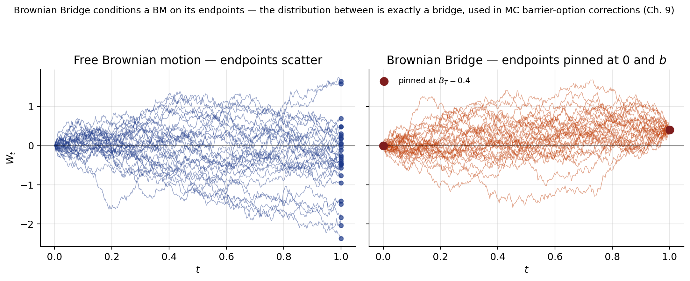

# Chapter 3 — Stochastic-Calculus Primer: Brownian Motion, Itô, and SDE Solutions

This chapter builds the stochastic-calculus apparatus every later chapter uses. From here forward we take Itô's lemma, the Itô isometry, and the closed-form solutions of the simplest SDEs as known.

We start from the scaled random walk of Ch. 2 and take the scaling limit to Brownian motion, prove the two path properties (infinite total variation, finite quadratic variation $[W,W]_t = t$), and use them to define the Itô integral. Itô's lemma drops out of a second-order Taylor expansion that keeps exactly the $\mathrm{d}t$ terms. The SDE catalogue — GBM, Ornstein–Uhlenbeck, arithmetic BM — closes the chapter as worked exercises in Itô.

The interaction of calculus and probability is what makes the subject feel foreign on first read. The reflex "discard the second-order term" has to be permanently unlearned: $(\mathrm{d}W)^2 = \mathrm{d}t$ is the single identity behind every pricing formula, risk sensitivity, and hedging recipe in this guide.

Notation. $W_t$ denotes a $\mathbb{P}$-Brownian motion. Hats or tildes decorate BMs under alternative measures (Ch. 5 onward); within this chapter measure is immaterial, since path-property statements are invariant under equivalent changes of measure.

---

## 3.1 From Scaled Random Walk to Brownian Motion

### 3.1.1 The CRR tree, viewed as a discrete Brownian motion

Strip the option-pricing apparatus off the Ch. 2 tree and what remains is a *scaled random walk*. Let $x_1, x_2, \dots$ be i.i.d. Bernoulli sign-flips with $\mathbb{P}(x_k = \pm 1) = \tfrac12$. Partition $[0, t]$ into steps $\Delta t = t/N$ and define

$$
W_{n\Delta t} \;=\; W_{(n-1)\Delta t} \;+\; \sqrt{\Delta t}\,x_n, \qquad W_0 \;=\; 0.
\tag{3.1}
$$

Equivalently, summing $N$ increments,

$$
W_{N\Delta t} \;=\; \sqrt{\Delta t}\,\sum_{n=1}^{N} x_n.
\tag{3.2}
$$

Each increment has size $\pm\sqrt{\Delta t}$. The square-root scaling is forced: with $N$ steps per unit time, total variance is $N \cdot (\text{step variance})$, and keeping that bounded as $N \to \infty$ requires step variance $O(\Delta t)$, hence step size $O(\sqrt{\Delta t})$. Anything larger blows up; anything smaller collapses. The multiplicative version of Ch. 2 ($S \mapsto S e^{\pm\sigma\sqrt{\Delta t}}$) limits to GBM; the arithmetic version here limits to Brownian motion.

### 3.1.2 Moments of the walk

Using $\mathbb{E}[x_n] = 0$ and $\mathrm{Var}[x_n] = 1$:

$$
\mathbb{E}[W_{N\Delta t}] \;=\; \sqrt{\Delta t}\,\sum_{n=1}^N \mathbb{E}[x_n] \;=\; 0,
\tag{3.3}
$$

$$
\mathrm{Var}[W_{N\Delta t}] \;=\; \Delta t\,\sum_{n=1}^N \mathrm{Var}[x_n] \;=\; N\,\Delta t \;=\; t.
\tag{3.4}
$$

$W_{N\Delta t}$ has mean $0$ and variance exactly $t$ for *every* $N$ — variance is preserved along the refinement. The double-moment structure (one moment exact, the other shrinking to zero) recurs in every a.s.-limit proof in this chapter.

### 3.1.3 CLT: the continuous-time limit

Let $t$ be fixed and $N\to\infty$ (equivalently $\Delta t = t/N \downarrow 0$). By the central limit theorem, the normalised sum $\tfrac{1}{\sqrt{N}}\sum_{n=1}^N x_n$ converges in distribution to a standard normal, so

$$
W_t \;\stackrel{d}{\underset{N\to\infty}{\longrightarrow}}\; \sqrt{t}\,Z, \qquad Z \sim \mathcal{N}(0,1).
\tag{3.5}
$$

$W_t \sim \mathcal{N}(0, t)$ in the limit. The Gaussian law is not assumed — it is forced by the CLT. Any finite-variance innovation (Bernoulli, uniform, Laplace, empirical returns) gives the same scaling limit; only mean and variance survive the $\sqrt{N}$ averaging. Practically, simulators draw $W_t = \sqrt{t}\,Z$ with $Z \sim \mathcal{N}(0, 1)$ directly.

### 3.1.4 Stationary and independent increments

For any $t < t+s$, write $W_{t+s} - W_t = \sqrt{\Delta t}\sum_{m=1}^M y_m$ with $y_m = x_{N+m}$ a fresh block of sign-flips. By the same CLT, with $M\Delta t = s$,

$$
W_{t+s} - W_t \;\stackrel{d}{\underset{M\to\infty}{\longrightarrow}}\; \sqrt{s}\,Z, \qquad Z \sim \mathcal{N}(0,1).
\tag{3.6}
$$

Because the law of $W_{t+s} - W_t$ depends only on the *length* $s$ of the interval — not on $W_t$ or the starting time $t$ — the process has *stationary increments*. Moreover, for non-overlapping intervals $[t,s]$ and $[u,v]$ the underlying Bernoulli blocks are disjoint, so the two sums are functions of independent random variables and therefore

$$
(W_s - W_t) \;\perp\; (W_v - W_u) \qquad \text{(independent increments)}.
\tag{3.7}
$$

Independent increments is the source of the *Markov property*: knowing $W$ up to time $u$ tells you nothing about future increments beyond what $W_u$ already encodes. Equivalent phrasings — conditional distribution of $W_{t+s}$ given $\mathcal{F}_t$ is $\mathcal{N}(W_t, s)$, and conditional on $W_t$ the future is independent of the past — will be used verbatim in the Feynman-Kac derivations of Chapter 4 and the change-of-numeraire arguments of Chapter 5.

---

## 3.2 Definition of Brownian Motion and Path Properties

Collecting the three properties just derived plus a regularity property, the scaling limit $W = (W_t)_{t\ge 0}$ is defined as a process satisfying

$$
\begin{aligned}
&(\text{i})\;\; W_0 = 0, \\
&(\text{ii})\;\; W_t \stackrel{d}{=} \sqrt{t}\,Z,\quad Z \sim \mathcal{N}(0,1), \\
&(\text{iii})\;\; W \text{ has stationary and independent increments}, \\
&(\text{iv})\;\; W \text{ has continuous paths}.
\end{aligned}
\tag{3.8}
$$

Property (iv) is the only one not already implied by the random-walk construction: the polygonal interpolation of the lattice walk is piecewise-linear, and continuity of the limit needs a tightness argument (Kolmogorov's continuity criterion). Properties (i)–(iii) are the structural skeleton; continuity then paints the skeleton smooth — but, as we are about to see, the *roughness* of that continuity is severe.

The four conditions are independent: a compound Poisson process satisfies (i)–(iii) but jumps; a Cauchy process satisfies (i), (iii), (iv) but fails Gaussianity. The combination of all four pins down BM uniquely up to null sets.

### 3.2.1 Continuous but nowhere differentiable

A typical sample path of BM is a jittery curve, everywhere continuous but nowhere smooth. Heuristically: the typical displacement over a time-step $\Delta t$ is $|\Delta W| \sim \sqrt{\Delta t}$, so the slope

*Five independent sample paths of $W$ on $[0, 1]$. Every path is continuous but visibly non-smooth at every scale — zooming in reveals identical-looking wiggles. The unbounded-slope property (3.$\infty$) is visible as the path's inability to be "traced with a pencil".*

$$
\frac{\Delta W}{\Delta t} \;\sim\; \frac{\sqrt{\Delta t}}{\Delta t} \;=\; \frac{1}{\sqrt{\Delta t}} \;\longrightarrow\; \infty \quad(\Delta t \downarrow 0).
$$

Every secant slope blows up: the path has no derivative anywhere despite being everywhere continuous. In any Taylor expansion of $f(W_t)$, the second-order term carries $(\Delta W)^2 \sim \Delta t$ — same order as $\Delta t$ itself, never droppable as "small."

Coastline analogy: measure with a finer ruler and the *length* (total variation) grows without bound, while the sum of *squared* segments (quadratic variation) stays finite and equals $t$. §3.3 computes the first; §3.4 the second.

Trader gloss. Infinite TV is why no rehedging schedule eliminates residual cash flows; finite QV $= t$ is how much residual on average — the gamma-theta of options pricing.

---

## 3.3 Total Variation

### 3.3.1 Definition

For a function $f$ on $[0,t]$ and a partition $\pi = \{t_0, t_1, \dots, t_N\}$ with $0 = t_0 < t_1 < \cdots < t_N = t$, the total variation is

$$
\mathrm{TV}_t \;=\; \lim_{\|\pi\|\downarrow 0}\;\sum_{k} \bigl|\,f(t_k) - f(t_{k-1})\,\bigr|,
\tag{3.9}
$$

where $\|\pi\| = \max_k (t_k - t_{k-1})$ is the mesh size. Pictorially, lay the graph of $f$ flat by flipping each down-stroke upward; the total horizontal length is $\mathrm{TV}_t$.

TV matters because the Riemann-Stieltjes integral $\int g\,\mathrm{d}f$ only exists (in the classical sense) when $f$ has finite total variation on $[0,t]$. For BM we are about to find TV is infinite, which is exactly why the new stochastic integral of §3.5 is needed.

### 3.3.2 Case 1 — $f$ is differentiable (finite TV)

If $f \in C^1$, by the mean-value theorem there exists $t_k^\star \in (t_{k-1}, t_k)$ with $\Delta f_k = f'(t_k^\star)\,\Delta t_k$. Therefore

$$
\sum_k |\Delta f_k| \;=\; \sum_k |f'(t_k^\star)|\,\Delta t_k \;\xrightarrow[\|\pi\|\downarrow 0]{}\; \int_0^t |f'(s)|\,\mathrm{d}s \;<\; +\infty.
\tag{3.10}
$$

Finite TV, as expected for smooth functions. The entire argument fails for BM because $W$ has no derivative anywhere, and in its absence the sum of $|\Delta W_k|$ diverges.

### 3.3.3 Case 2 — Brownian motion has infinite TV

For BM the increments are $\Delta W_k \stackrel{d}{=} \sqrt{\Delta t_k}\,Z_k$ with $Z_k \stackrel{\mathrm{iid}}{\sim} \mathcal{N}(0,1)$. So

$$
\sum_k |W_{t_k} - W_{t_{k-1}}| \;=\; \sum_k \sqrt{\Delta t_k}\,|Z_k|.
\tag{3.11}
$$

The mean. Because $\mathbb{E}|Z| = \sqrt{2/\pi}$ is a finite constant,

$$
\mathbb{E}\!\left[\sum_k \sqrt{\Delta t_k}\,|Z_k|\right] \;=\; \mathbb{E}|Z|\cdot\sum_k \sqrt{\Delta t_k}.
\tag{3.12}
$$

The variance is $c^2\sum_k \Delta t_k = c^2 t$, bounded as the partition refines. The key bound is on the mean:

$$
\sum_k \sqrt{\Delta t_k} \;\ge\; \sum_k \frac{\Delta t_k}{\sqrt{\|\pi\|}} \;=\; \frac{t}{\sqrt{\|\pi\|}} \;\xrightarrow[\|\pi\|\downarrow 0]{}\; +\infty.
\tag{3.13}
$$

So the mean of the TV-sum diverges while its variance stays bounded — concentration around an unbounded mean forces the sum itself to be unbounded. Almost surely,

$$
\boxed{\;\mathrm{TV}_t(W) \;=\; \lim_{\|\pi\|\downarrow 0} \sum_k |W_{t_k} - W_{t_{k-1}}| \;=\; +\infty\;}. \qquad\text{(a.s.)}
\tag{3.14}
$$

BM is too rough for a Riemann-Stieltjes integral $\int g\,\mathrm{d}W_s$; a new stochastic integral is needed in §3.5.

Trader gloss. Delta-hedging cost is $c \sum |\Delta S|$ — the TV sum for $S$. GBM has infinite TV, so frictionless continuous rebalancing has unbounded cost. The frictionless Black–Scholes derivation is literally implementable only if transactions are free; in practice hedgers accept a discrete rebalancing grid and residual gamma risk.

---

## 3.4 Quadratic Variation and the Rule $(\mathrm{d}W)^2 = \mathrm{d}t$

### 3.4.1 Definition

The quadratic variation of $f$ on $[0,t]$ is

$$
[f]_t \;=\; [f,f]_t \;=\; \lim_{\|\pi\|\downarrow 0} \sum_k \bigl(\Delta f_k\bigr)^2, \qquad \Delta f_k = f(t_k) - f(t_{k-1}).
\tag{3.15}
$$

QV measures cumulative *squared jitter*. For smooth $f$, $(\Delta f)^2 \sim (\Delta t)^2$ and QV vanishes; for BM, $(\Delta W)^2 \sim \Delta t$ and the sum stays at $t$. TV sees *size*, QV sees *energy* — BM has finite energy ($t$) but infinite size ($+\infty$). Conflating the two is the most common source of Black–Scholes confusion.

### 3.4.2 Case 1 — $f$ differentiable: $[f]_t = 0$

If $f \in C^1$,

$$
\sum_k (\Delta f_k)^2 \;=\; \sum_k \bigl(f'(t_k^\star)\bigr)^2\,(\Delta t_k)^2 \;\le\; \|\pi\|\cdot\int_0^t (f'(s))^2\,\mathrm{d}s \;\xrightarrow[\|\pi\|\downarrow 0]{}\; 0.
\tag{3.16}
$$

Smooth functions have zero QV: $(\Delta t_k)^2 \le \|\pi\| \Delta t_k$ peels off one power of $\|\pi\|$, killing the sum. BM has $(\Delta W_k)^2 \sim \Delta t_k$ and the sum stays $O(1)$ — the order retained by the squaring is what produces the Itô correction.

### 3.4.3 Case 2 — Brownian motion: $[W,W]_t = t$

Let $Q = \sum_k (\Delta W_k)^2$ with $\Delta W_k \stackrel{d}{=} \sqrt{\Delta t_k}\,Z_k$, $Z_k \stackrel{\mathrm{iid}}{\sim}\mathcal{N}(0,1)$.

Mean.

$$
\mathbb{E}[Q] \;=\; \sum_k \mathbb{E}\!\left[(\Delta W_k)^2\right] \;=\; \sum_k \Delta t_k \;=\; t.
\tag{3.17}
$$

The mean is *exact* — no limit needed, no $\|\pi\|$ dependence. Every finite partition already gives $\mathbb{E}[Q] = t$.

Variance. Using $\mathrm{Var}((\Delta W_k)^2) = (\Delta t_k)^2\,\mathrm{Var}(Z^2) = 2(\Delta t_k)^2$ (because $\mathrm{Var}(Z^2) = \mathbb{E}[Z^4] - 1 = 3 - 1 = 2$ — the standard-Normal fourth moment $\mathbb{E}[Z^4] = 3$ is derived via the MGF in §3.7.1) and independence across $k$,

$$
\mathrm{Var}[Q] \;=\; 2\sum_k (\Delta t_k)^2 \;\le\; 2\,\|\pi\|\sum_k \Delta t_k \;=\; 2\|\pi\|\,t \;\xrightarrow[\|\pi\|\downarrow 0]{}\; 0.
\tag{3.18}
$$

Conclusion. $Q$ has mean *exactly* $t$ and variance shrinking to zero, so by Chebyshev's inequality ($L^2$-convergence along the full sequence, almost-sure along a thinning subsequence):

$$
\boxed{\;\sum_k (\Delta W_k)^2 \;\xrightarrow[\|\pi\|\downarrow 0]{\mathrm{a.s.}}\; t, \qquad [W,W]_t \;=\; t\;} \qquad\text{(a.s.)}
\tag{3.19}
$$

A *random* object — the sum of squared increments — converges to a *deterministic* limit. The convergence is the LLN in Brownian clothing: $(\Delta W_k)^2 = \Delta t \cdot Z_k^2$ with $Z_k^2$ chi-squared-one, and $\sum Z_k^2/N \to 1$ a.s. This is why implied vol is observable: QV of log-price is essentially deterministic.

*The same Brownian path, sampled at progressively finer meshes. Left: $\sum(\Delta W_k)^2$ converges deterministically to $t = 1$ as the mesh refines. Right: $\sum|\Delta W_k|$ diverges like $\sqrt{N}$ — finite energy but unbounded path-length.*

**Variance swaps.** A variance swap pays $\frac{252}{N}\sum r_k^2$ on daily log-returns. In GBM $r_k \approx \sigma \Delta W_k - \tfrac12\sigma^2 \Delta t$, so $\sum r_k^2 \to \sigma^2 t$ — a deterministic quantity, exactly replicable by a Carr–Madan log-contract. The TV analogue ($\sum |r_k|$) diverges like $\sqrt{N}$, which is why "average absolute return" is a nuisance statistic and realised variance is a well-posed estimator of $\sigma^2$.

### 3.4.4 The Itô shorthand $(\mathrm{d}W)^2 = \mathrm{d}t$

Equation (3.19) justifies the Itô multiplication rules

$$
(\mathrm{d}W_t)^2 \;=\; \mathrm{d}t,\qquad \mathrm{d}W_t\cdot \mathrm{d}t \;=\; 0,\qquad (\mathrm{d}t)^2 \;=\; 0.
\tag{3.20}
$$

Memorisation trick. $\mathrm{d}W$ lives at scale $\sqrt{\mathrm{d}t}$, $\mathrm{d}t$ at scale $\mathrm{d}t$. A product of $n$ atoms scales as $(\mathrm{d}t)^{n/2}$; keep $n = 2$, drop $n > 2$. Squaring an SDE $\mathrm{d}X = a\,\mathrm{d}t + b\,\mathrm{d}W$ collapses to $b^2\,\mathrm{d}t$ — used in every Itô application below. Every $\tfrac12\sigma^2\partial_{xx}$ in a pricing PDE traces back to (3.20).

![Cumulative sum of squared Brownian increments $\sum(\Delta W_k)^2$ as the mesh refines: each path converges to the deterministic line $[W]_t = t$. The same identity is what makes the SPX variance swap a *deterministic* payoff in continuous monitoring — the realised-variance leg integrates to $\sigma^2 T$ exactly](figures/ch03-ito-multiplication.png)

### Case study: The "rule of 16" — Brownian scaling in market data

*Every options trader on a US equity desk converts annualised vol to daily vol by dividing by 16. VIX = 16 means "expect $\sim$ 1% S\&P moves." VIX = 32 means "expect $\sim$ 2% moves." This is not a heuristic — it is the QV identity (3.19) evaluated at $t = 1/252$, and it is one of the few places in finance where a continuous-time identity is *directly falsifiable* against tick data on any given day.*

**Context.** The CBOE Volatility Index (VIX) is a model-free 30-day implied vol on the S\&P 500, quoted in *annualised* units. On 14 May 2026 the VIX closed near 14; through 2024–2025 it traded in a 12–22 range outside of brief stress spikes (March 2020 COVID, August 2024 yen-carry unwind, April 2025 tariff shock). The trading floor's *rule of 16* — divide the VIX by 16 to get the implied 1-day standard deviation in percent — comes from $\sqrt{252} \approx 15.87$. So a VIX of 16 implies a 1-day SPX move of roughly $\pm 1\%$; a VIX of 32 implies $\pm 2\%$; a VIX of 80 (March 2020) implied $\pm 5\%$. Empirically: in 2024 the VIX averaged $\sim$ 15.7, predicting $\sim$ 0.98% daily moves, and the realised one-standard-deviation S\&P 500 daily move that year was 0.84% — within the same order of magnitude, with the small undershoot tracing to the well-known variance risk premium (implied vol structurally exceeds realised vol; see Ch 10–11).

**Math mapping.** This is (3.19) made tradable. Model the S\&P log-price as Brownian under the risk-neutral measure with annualised volatility $\sigma$: $\mathrm dS_t/S_t = r\,\mathrm dt + \sigma\,\mathrm dW_t$, so $\mathrm d\log S_t = (r - \tfrac12\sigma^2)\,\mathrm dt + \sigma\,\mathrm dW_t$. The QV identity (3.19) gives $[\log S, \log S]_t = \sigma^2 t$. Equivalently, the variance of the log-return over horizon $\Delta t$ is $\sigma^2 \Delta t$ and the standard deviation is $\sigma\sqrt{\Delta t}$. With $\Delta t = 1/252$ trading days and $\sigma = $ VIX$/100$, this gives $\text{StDev}_{\text{daily}} = \text{VIX}/(100 \cdot \sqrt{252}) \approx \text{VIX}/1587$, and quoting the result in percent removes the factor of 100: $\text{StDev}_{\text{daily}}(\%) \approx \text{VIX}/\sqrt{252} \approx \text{VIX}/16$. The $\sqrt{t}$ scaling is *not* a model assumption — it is forced by the QV identity, which holds for any continuous semimartingale with absolutely continuous QV. So when the rule-of-16 prediction matches realised daily standard deviations, you are confirming that the path is locally Brownian; when it fails, the path has acquired roughness inconsistent with $[W, W]_t = t$.

**Lesson.** Three failure modes a desk watches for. First, *gap moves at the open*: 17 Sept 2008 (Lehman week, S\&P opened $-4.7\%$ on a VIX-implied $\sim$ 2% one-day SD) and 16 March 2020 (COVID, S\&P open down $-7\%$ vs VIX-implied $\sim$ 5%) blew through the daily standard deviation by 2–3$\sigma$ each — the path is not continuous overnight, and overnight returns satisfy a different scaling regime than intraday returns (the QV of an overnight gap is *concentrated*, not spread out at $\sqrt t$). Second, *vol-of-vol regimes*: in stress episodes the VIX itself moves 20–30% intraday, so the rule-of-16 conversion using yesterday's VIX systematically under-predicts today's moves; this is the phenomenon Heston-style stochastic vol models (Ch 10) are built to capture. Third, *jump components*: equity microstructure has a jump component (earnings, central bank meetings, exchange-pause incidents) that contributes additional QV beyond the diffusive $\sigma^2 \,\mathrm dt$; the rule-of-16 implicitly assumes pure diffusion. Operationally, a desk computes a "realised-vs-implied ratio" daily — realised standard deviation of one-minute returns scaled to daily, divided by VIX/16 — and uses sustained excursions above 1.0 as a signal that the diffusive Brownian model is locally inadequate and one should trade vol-of-vol products (VVIX, variance-of-variance swaps) instead of plain vol.

---

## 3.5 The Itô Stochastic Integral

### 3.5.1 Warm-up — the classical Riemann-Stieltjes integral

For smooth $f$ the chain rule gives

$$
\int_0^t f(s)\,\mathrm{d}f(s) \;=\; \tfrac{1}{2}\,\bigl(f^2(t) - f^2(0)\bigr),
\tag{3.21}
$$

because $\mathrm{d}\bigl(\tfrac{1}{2}f^2(s)\bigr) = f(s)\,\mathrm{d}f(s)$. Remember this answer — when we repeat the calculation for Brownian motion we will find the analogue carries an *extra* $-\tfrac12 t$ term that has no classical counterpart. The classical integral is oblivious to the endpoint choice in the Riemann sum because QV is zero; once we swap $f$ for BM the endpoint choice becomes consequential, and the $-\tfrac12 t$ is exactly the accumulated left-right mismatch summed over infinitely many infinitesimal intervals.

### 3.5.2 The Itô integral, defined

The stochastic analogue uses *left-endpoint* Riemann sums — crucial, because this is what makes the integral a martingale:

$$
\int_0^t W_s\,\mathrm{d}W_s \;\equiv\; \lim_{\|\pi\|\downarrow 0}\;\sum_k W_{t_{k-1}}\,\Delta W_{t_k}, \qquad \Delta W_{t_k} = W_{t_k} - W_{t_{k-1}}.
\tag{3.22}
$$

Left-endpoint evaluation makes $W_{t_{k-1}}$ independent of $\Delta W_{t_k}$, so each summand has zero expectation and the integral is a martingale. The Itô integral encodes a *predictable* strategy: position size committed before the move, not after. Right-endpoint or midpoint (Stratonovich) rules obey the classical chain rule but break the martingale property — fatal in finance, where no-arbitrage demands "predictable strategies earn zero expected P&L."

### 3.5.3 First worked integral — $\int_0^t W_s\,\mathrm{d}W_s$

The claim, which we prove by a telescoping identity + QV computation, is

$$
I_t \;=\; \int_0^t W_s\,\mathrm{d}W_s \;=\; \tfrac12\,W_t^2 \;-\; \tfrac12\,t \qquad\text{a.s.}
\tag{3.23}
$$

The answer already carries the surprise: the classical guess would be $\tfrac12 W_t^2$, but the stochastic integral subtracts an extra $\tfrac12 t$ — the *Itô correction*, sometimes called the "convexity correction" because it arises from the curvature of $w \mapsto \tfrac12 w^2$ interacting with the QV of $W$. The $\tfrac12 t$ is deterministic, grows linearly, and has no stochastic component; it is the "free" cash that a convex long-gamma position accumulates as time passes. In options language, the correction is the *theta bleed* of a one-lot long-gamma portfolio.

**Proof.** Use the algebraic identity $a(b-a) = \tfrac12(b^2 - a^2) - \tfrac12(b-a)^2$ with $a = W_{t_{k-1}}$, $b = W_{t_k}$:

$$
W_{t_{k-1}}\bigl(W_{t_k} - W_{t_{k-1}}\bigr) \;=\; \tfrac{1}{2}\bigl(W_{t_k}^2 - W_{t_{k-1}}^2\bigr) \;-\; \tfrac{1}{2}\bigl(W_{t_k} - W_{t_{k-1}}\bigr)^2.
\tag{3.24}
$$

Summing over $k$ and using $W_0 = 0$:

$$
\sum_k W_{t_{k-1}}\,\Delta W_{t_k} \;=\; \tfrac{1}{2}\,W_t^2 \;-\; \tfrac{1}{2}\,\sum_k (\Delta W_{t_k})^2.
\tag{3.25}
$$

The left-hand side is the Riemann-like sum defining the Itô integral. The right-hand side has two parts. The first, $\tfrac12 W_t^2$, is the classical Newton-Leibniz answer. The second, $-\tfrac12 \sum_k(\Delta W_{t_k})^2$, is the Itô correction in discrete form — an exact lattice version of $-\tfrac12 t$, because by (3.19) this sum converges almost surely to $t$. Passing to the limit,

$$
\boxed{\;\int_0^t W_s\,\mathrm{d}W_s \;=\; \tfrac{1}{2}\,W_t^2 \;-\; \tfrac{1}{2}\,t\;}.
\tag{3.26}
$$

Three observations on this answer.

1. Taking expectations on both sides of (3.26): $\mathbb{E}\int_0^t W_s\,\mathrm{d}W_s = \tfrac12\mathbb{E}[W_t^2] - \tfrac12 t = 0$. The Itô integral is zero-mean — the martingale property surfaces automatically.
2. The Itô integral is *not* zero, despite having zero mean. Its variance grows with $t$ (we'll compute it via the Itô isometry next): it is a non-trivial random variable concentrated around zero.
3. The difference $I_t - \tfrac12 W_t^2 = -\tfrac12 t$ is *deterministic*. Remarkable: the randomness of the classical antiderivative $\tfrac12 W_t^2$ and the randomness of the Itô integral $I_t$ match exactly, so when subtracted they leave only the $-\tfrac12 t$ correction.

Equivalent form: rearranging (3.26),

$$
\tfrac{1}{2}\,W_t^2 \;=\; \int_0^t W_s\,\mathrm{d}W_s \;+\; \tfrac{1}{2}\,t,
\tag{3.27}
$$

which is Itô's formula applied to $F(w) = \tfrac12 w^2$: $\mathrm{d}(\tfrac12 W_t^2) = W_t\,\mathrm{d}W_t + \tfrac12\,\mathrm{d}t$. The $\tfrac12\,\mathrm{d}t$ correction is exactly what distinguishes the stochastic integral from the classical chain-rule answer.

### 3.5.4 Why the left-endpoint choice matters

A right-endpoint $W_{t_k}$ would flip the sign of the QV correction in the telescoping identity, giving $+\tfrac12 t$ and the classical answer $\tfrac12 W_t^2$. Worse, it would couple the integrand to its driving noise — anticipative, hence inadmissible in continuous-time finance. The left-endpoint rule is the mathematical enforcement of no-arbitrage.

---

## 3.6 The Itô Isometry

The $L^2$-isometry reduces any variance-of-stochastic-integral calculation to an ordinary time integral, and structurally asserts the Itô integral is a continuous linear map from $L^2$ integrands into martingales.

**Statement.** For any two adapted integrands $g_s$ and $h_s$ satisfying $\mathbb{E}\int_0^t g_s^2\,\mathrm{d}s < \infty$ and likewise for $h$,

$$
\boxed{\;\mathbb{E}\!\left[\,\Big(\int_0^t g_s\,\mathrm{d}W_s\Big)\Big(\int_0^t h_s\,\mathrm{d}W_s\Big)\,\right]
\;=\; \mathbb{E}\!\left[\,\int_0^t g_s h_s\,\mathrm{d}s\,\right]\;}.
\tag{3.28}
$$

In particular, for $g = h$, the $L^2$-norm of a stochastic integral equals the $L^2$-norm (in $s$ and $\omega$) of its integrand:

$$
\mathbb{E}\!\left[\left(\int_0^t g_s\,\mathrm{d}W_s\right)^{\!2}\right] \;=\; \mathbb{E}\!\int_0^t g_s^2\,\mathrm{d}s.
\tag{3.29}
$$

**Proof — the A + B + C decomposition.** Set $g_t = g(t, W_t)$, $h_t = h(t, W_t)$, and define the residual

$$
\mathcal{E} \;=\; \mathbb{E}\!\left[\Big(\int_0^t g_s\,\mathrm{d}W_s\Big)\Big(\int_0^t h_s\,\mathrm{d}W_s\Big) \;-\; \int_0^t g_s h_s\,\mathrm{d}s\right].
\tag{3.30}
$$

Goal: show $\mathcal{E} = 0$. Fix a partition $\pi = \{0 = t_0 < t_1 < \cdots < t_n = t\}$ and discretise both integrals as Riemann sums, so the first product becomes

$$
\Big(\sum_k g_{t_{k-1}}\Delta W_{t_k}\Big)\Big(\sum_j h_{t_{j-1}}\Delta W_{t_j}\Big)
\;=\; \sum_{k,j} g_{k-1}\,h_{j-1}\,\Delta W_{t_k}\,\Delta W_{t_j},
$$

where $g_{k-1} = g_{t_{k-1}}$ etc. The second piece (the time integral) discretises as $\sum_k g_{k-1}\,h_{k-1}\,\Delta t_k$.

**Step 1 — Split the double sum into three regions** (A, B, C) according to the relationship between indices $j$ and $k$:

$$
\sum_{k,j} g_{k-1}\,h_{j-1}\,\Delta W_{k}\,\Delta W_{j}
\;=\; \underbrace{\sum_{k<j} g_{k-1}\,h_{j-1}\,\Delta W_k\,\Delta W_j}_{A} \;+\; \underbrace{\sum_{j<k} g_{k-1}\,h_{j-1}\,\Delta W_k\,\Delta W_j}_{B} \;+\; \underbrace{\sum_k g_{k-1}\,h_{k-1}\,(\Delta W_k)^2}_{C}.
$$

The matrix picture: the $n\times n$ grid indexed by $(k,j)$ splits into the lower triangle $A$ ($k<j$), the upper triangle $B$ ($j<k$), and the diagonal $C$ ($k=j$, highlighted). The isometry is the claim that the two triangles die in expectation and only the diagonal survives — matching the time-integral piece exactly.

**Step 2 — $\mathbb{E}[A] = 0$.** For any term in $A$ we have $k < j$. Condition on $\mathcal{F}_{t_{j-1}}$: the factors $g_{k-1}$, $h_{j-1}$, and $\Delta W_k$ are all $\mathcal{F}_{t_{j-1}}$-measurable (by convention $h_{j-1} := h_{t_{j-1}}$ is $\mathcal{F}_{t_{j-1}}$-measurable because it is evaluated at the left endpoint of the $j$-th sub-interval; $g_{k-1}$ and $\Delta W_k$ are $\mathcal{F}_{t_k}\subset\mathcal{F}_{t_{j-1}}$-measurable since $k < j \Rightarrow t_k \le t_{j-1}$), while $\Delta W_j$ is independent of $\mathcal{F}_{t_{j-1}}$ with mean zero. Hence

$$
\mathbb{E}\!\left[g_{k-1}\,h_{j-1}\,\Delta W_k\,\Delta W_j\right]
\;=\; \mathbb{E}\!\left[g_{k-1}\,h_{j-1}\,\Delta W_k\right]\cdot\underbrace{\mathbb{E}[\Delta W_j]}_{=\,0}
\;=\; 0,
\tag{3.31}
$$

and summing over $k<j$ gives $\mathbb{E}[A] = 0$.

**Step 3 — $\mathbb{E}[B] = 0$** by the symmetric argument with the roles of $j$ and $k$ swapped.

**Step 4 — Only the diagonal $C$ survives.** Combining the three pieces with the time-integral subtraction,

$$
\mathcal{E} \;=\; \mathbb{E}\!\left[\sum_k g_{k-1}\,h_{k-1}\,\bigl((\Delta W_k)^2 - \Delta t_k\bigr)\right]
\;=\; \sum_k \mathbb{E}[g_{k-1}\,h_{k-1}]\cdot\underbrace{\mathbb{E}[(\Delta W_k)^2 - \Delta t_k]}_{=\,0}
\;=\; 0,
\tag{3.32}
$$

using independence of $g_{k-1} h_{k-1}$ (measurable at $t_{k-1}$) from $\Delta W_k$, and $\mathbb{E}[(\Delta W_k)^2] = \Delta t_k$.

**Step 5 — Pass to the limit.** Equation (3.32) holds for every partition $\pi$; taking $\|\pi\|\downarrow 0$ delivers the isometry (3.28). $\blacksquare$

**Reading the isometry.** The scalar identity $[W,W]_t = t$ becomes, under weighting by $g_s^2$, the statement that the variance of $\int g\,\mathrm{d}W$ equals the integrated squared integrand. In a quant-practitioner translation: "the variance of a stochastic P&L equals the integrated variance contribution of each sub-interval's position." Every variance-swap argument in the rest of the guide is downstream of (3.29).

A weakening of the boundedness assumption gives the result for any $g$ with $\mathbb{E}\int_0^t g_s^2\,\mathrm{d}s < \infty$, via a standard localisation-and-approximation argument. We take this extension for granted from here on.

---

## 3.7 Brownian Moment Calculations

A small toolkit of moment calculations, each a one-liner via the Gaussian MGF $h(a) = e^{a^2/2}$ ($\mathbb{E}[Z^n] = h^{(n)}(0)$) or the increment decomposition $W_t = W_s + (W_t - W_s)$ with the second piece independent of the first.

### 3.7.1 Variance of $W_t^2$

Starting from $\mathrm{Var}[W_t^2] = \mathbb{E}[W_t^4] - (\mathbb{E}[W_t^2])^2$ and using $W_t \stackrel{d}{=} \sqrt{t}\,Z$ with $Z\sim\mathcal{N}(0,1)$,

$$
\mathrm{Var}[W_t^2] \;=\; t^2\,\bigl(\mathbb{E}[Z^4] - 1\bigr).
\tag{3.33}
$$

The Gaussian MGF $h(a) = e^{a^2/2}$ has derivatives $h'(a) = a e^{a^2/2}$, $h''(a) = (1+a^2)e^{a^2/2}$, $h'''(a) = (a^3 + 3a)e^{a^2/2}$, $h^{(4)}(a) = (a^4 + 6a^2 + 3)e^{a^2/2}$. Evaluating at $a=0$: $\mathbb{E}[Z^2] = 1$, $\mathbb{E}[Z^4] = 3$. The odd moments vanish by symmetry; the even moments grow as $(2k-1)!! = 1, 3, 15, 105,\dots$. Substituting,

$$
\boxed{\;\mathrm{Var}[W_t^2] \;=\; 2\,t^2\;}.
\tag{3.34}
$$

This is the Brownian analogue of $\mathrm{Var}(X^2) = 2\sigma^4$ for centred Gaussians with variance $\sigma^2 = t$, and it underlies the QV concentration argument of §3.4 (the variance of the QV sum is $\sum 2(\Delta t_k)^2 \le 2\|\pi\|\,t$).

### 3.7.2 Covariance $\mathbb{E}[W_t W_s]$

For $0 \le s \le t$, write $W_t = (W_t - W_s) + W_s$. Then

$$
\mathbb{E}[W_t\,W_s] \;=\; \mathbb{E}[(W_t - W_s)\,W_s] \;+\; \mathbb{E}[W_s^2] \;=\; 0 \;+\; s,
$$

because $W_s$ and the forward increment $W_t - W_s$ are independent mean-zero. Hence

$$
\boxed{\;\mathbb{E}[W_t\,W_s] \;=\; \min(s,t)\;}.
\tag{3.35}
$$

The correlation is $\mathrm{Corr}(W_t, W_s) = \sqrt{s/t}$: nearby times are highly correlated, far-apart times nearly independent. This is also the kernel used when simulating BM on a grid — for $s<t$ the joint law $(W_s, W_t)$ is Gaussian with covariance matrix $\begin{pmatrix}s & s\\ s & t\end{pmatrix}$, whose Cholesky factorisation gives the practical recipe "draw $Z_1, Z_2$ i.i.d. standard normal; set $W_s = \sqrt{s}Z_1$, $W_t = \sqrt{s}Z_1 + \sqrt{t-s}Z_2$."

### 3.7.3 The exponential martingale

A recurring character in this guide. Claim:

$$
\boxed{\;\mathbb{E}[X_t] \;=\; 1 \quad\text{for every } t\ge 0\;}, \qquad X_t = e^{-\tfrac12\sigma^2 t + \sigma W_t}.
\tag{3.36}
$$

Proof by MGF:

$$
\mathbb{E}[X_t] \;=\; e^{-\tfrac12\sigma^2 t}\,\mathbb{E}[e^{\sigma W_t}] \;=\; e^{-\tfrac12\sigma^2 t}\,e^{\tfrac12\sigma^2 t} \;=\; 1,
$$

using the Gaussian MGF. The drift $-\tfrac12\sigma^2 t$ exactly offsets the Jensen bump $\mathbb{E}[e^{\sigma W_t}] = e^{\sigma^2 t/2}$ from exponentiating a Gaussian. This is the origin of the $-\tfrac12\sigma^2$ in the GBM log-drift: a bare $rt$ drift would let $S_t/S_0$ grow in expectation and break the $\mathbb{Q}$-martingale property of the discounted stock.

More generally, for any real exponent $c$,

$$
\mathbb{E}[X_t^c] \;=\; e^{-\tfrac12 c\sigma^2 t}\cdot e^{\tfrac12 c^2\sigma^2 t} \;=\; e^{\tfrac12 c(c-1)\sigma^2 t}.
\tag{3.37}
$$

For $c=0$ and $c=1$ the right-hand side equals $1$ — these are the two "zero Jensen bump" cases. For $c=2$ it gives $\mathbb{E}[X_t^2] = e^{\sigma^2 t}$, from which $\mathrm{Var}(X_t) = e^{\sigma^2 t} - 1$ — the well-known log-normal variance. A stronger statement, proved in §3.9 below, is that $X_t$ satisfies the SDE $\mathrm{d}X_t = \sigma X_t\,\mathrm{d}W_t$ and is therefore a martingale.

### 3.7.4 Two Itô-integral variances via isometry

As a quick application of (3.29), let us compute the variance of two Itô integrals that we will meet repeatedly.

First, $I_t = \int_0^t W_s\,\mathrm{d}W_s$. By Itô isometry,

$$
\mathrm{Var}[I_t] \;=\; \mathbb{E}\!\left[\int_0^t W_s^2\,\mathrm{d}s\right] \;=\; \int_0^t s\,\mathrm{d}s \;=\; \tfrac12 t^2.
\tag{3.38}
$$

A sanity check comes from the closed-form $I_t = \tfrac12(W_t^2 - t)$: then $\mathrm{Var}[I_t] = \tfrac14\mathbb{E}[(W_t^2 - t)^2] = \tfrac14(3t^2 - 2t^2 + t^2) = \tfrac12 t^2$. Both routes agree.

Second, $J_t = \int_0^t e^{W_s}\,\mathrm{d}W_s$. The integrand is not Gaussian, so $J_t$ is not Gaussian either, but its variance still follows from (3.29):

$$
\mathrm{Var}[J_t] \;=\; \int_0^t \mathbb{E}[e^{2W_s}]\,\mathrm{d}s \;=\; \int_0^t e^{2s}\,\mathrm{d}s \;=\; \tfrac12(e^{2t} - 1),
\tag{3.39}
$$

using $\mathbb{E}[e^{\alpha W_s}] = e^{\alpha^2 s/2}$. More generally, when the integrand is $e^{\alpha W_s}$, the variance of the Itô integral is $(e^{\alpha^2 t} - 1)/\alpha^2$. This is the template for every "expectation of an exponential Brownian function" in the guide, and we will reuse it without comment.

---

## 3.8 Itô's Lemma for Brownian Motion

Itô's lemma is the chain rule of stochastic calculus and the single most important tool in this guide. The spirit: Taylor expand one extra term, keep only first-order in $\mathrm{d}W$ and second-order in $\mathrm{d}W$ (the latter is $\mathrm{d}t$ by (3.20)).

### 3.8.1 Setup

Fix a smooth function $f(t, w)$ with $f \in C^{1,2}$ (once-differentiable in $t$, twice-differentiable in $w$, with continuous derivatives), and define the process

$$
X_t \;=\; f(t,\,W_t).
\tag{3.40}
$$

One derivative in $t$, two in $w$ — the second-order $w$-term survives via $(\mathrm{d}W)^2 = \mathrm{d}t$ and contributes $\tfrac12\partial_{ww}f\,\mathrm{d}t$. Kink payoffs like $(S - K)_+$ fail $C^{1,2}$ and need Tanaka's formula (boundary-delta terms); we treat them informally.

### 3.8.2 Heuristic derivation via Taylor expansion

Start with the generic Taylor expansion of $f(t+\Delta t,\,W_{t+\Delta t})$ around $(t, W_t)$:

$$
\begin{aligned}
f(t+\Delta t,\, W_{t+\Delta t}) \;-\; f(t, W_t)
\;=\; &\partial_t f\,\Delta t \\
+\;&\partial_w f\,\Delta W \\
+\;&\tfrac12\,\partial_{tt} f\,(\Delta t)^2 \\
+\;&\partial_{tw} f\,\Delta t\,\Delta W \\
+\;&\tfrac12\,\partial_{ww} f\,(\Delta W)^2 \\
+\;&\text{higher-order terms},
\end{aligned}
$$

with $\Delta W = W_{t+\Delta t} - W_t$. Which terms are $O(\Delta t)$ (the "dominant" scale in the limit)?

| Term | Magnitude scaling | Keep or drop? |
| --- | --- | --- |
| $\partial_t f\,\Delta t$ | $\Delta t$ | Keep (deterministic drift) |
| $\partial_w f\,\Delta W$ | $\sqrt{\Delta t}$ | Keep (stochastic term) |
| $\tfrac12 \partial_{ww} f\,(\Delta W)^2$ | $\Delta t$ | Keep (Itô correction) |
| $\tfrac12 \partial_{tt} f\,(\Delta t)^2$ | $(\Delta t)^2$ | Drop |
| $\partial_{tw} f\,\Delta t\,\Delta W$ | $(\Delta t)^{3/2}$ | Drop |
| higher-order | $\le (\Delta t)^{3/2}$ | Drop |

In ordinary calculus the second-order term would be $O((\Delta t)^2)$ and discarded. But for Brownian motion $(\Delta W)^2 \approx \Delta t$ by (3.20) — the second-order term is the *same order* as $\Delta t$, so it must be kept. Cross terms $\Delta t\cdot\Delta W$ and $(\Delta t)^2$ are of strictly higher order and vanish.

Taking the infinitesimal limit yields

$$
\boxed{\;\mathrm{d}X_t \;=\; \left[\partial_t f(t, W_t) \;+\; \tfrac{1}{2}\,\partial_{ww} f(t, W_t)\right]\mathrm{d}t \;+\; \partial_w f(t, W_t)\,\mathrm{d}W_t\;}.
\tag{3.41}
$$

In integrated form:

$$
X_t - X_0 \;=\; \int_0^t \left[\partial_s f + \tfrac{1}{2}\partial_{ww} f\right]\mathrm{d}s \;+\; \int_0^t \partial_w f\,\mathrm{d}W_s.
\tag{3.42}
$$

The first integral is an ordinary Riemann integral; the second is a stochastic integral of the type defined in (3.22).

**Reading (3.41).** Drift + martingale: a bounded-variation Lebesgue piece plus an Itô integral that carries all the QV. This is the Doob–Meyer decomposition for Itô processes. Taking expectations kills the martingale and leaves $\mathbb{E}[f(t, W_t)] - f(0, 0) = \int_0^t \mathbb{E}[\partial_s f + \tfrac12 \partial_{ww}f]\,\mathrm{d}s$ — the engine of the Feynman–Kac derivations in Ch. 4.

*Monte-Carlo $\mathbb{E}[W_t^2]$ tracks the Itô prediction $t$ (green dashed), not the classical chain rule's $0$ (red dotted). The gap is the Itô correction $\tfrac12 f''\,\mathrm{d}t = \mathrm{d}t$ integrated from $0$ to $t$ — precisely the drift contribution that ordinary calculus discards.*

### 3.8.3 Reading the formula — options-language translation

For $X_t = f(t, W_t)$ interpreted as an option price with $W_t$ being the underlying:

- $\partial_t f$ is **theta** — the passage-of-time sensitivity.
- $\partial_w f$ is **delta** — the underlying sensitivity.
- $\partial_{ww} f$ is **gamma** — the curvature of price versus underlying.

Itô then reads: option P&L = theta$\cdot\mathrm{d}t$ + delta$\cdot\mathrm{d}W$ + $\tfrac12$gamma$\cdot\mathrm{d}t$. The last term is the gamma-theta trade-off — long-gamma books bleed theta and earn gamma P&L; short-gamma books do the reverse. The $\tfrac12$ is just Taylor's second-order coefficient, not a normalisation mystery.

### 3.8.4 Three worked Itô-lemma examples

**Example 1 — $\int W\,\mathrm{d}W$ via Itô.**

Goal: compute $\int_0^t W_s\,\mathrm{d}W_s$ using Itô's lemma rather than the telescoping identity of §3.5.

Choose $f(t,w) = \tfrac12 w^2$, so $\partial_t f = 0$, $\partial_w f = w$, $\partial_{ww}f = 1$. Plugging into (3.41):

$$
\mathrm{d}(\tfrac12 W_t^2) \;=\; \tfrac12\,\mathrm{d}t \;+\; W_t\,\mathrm{d}W_t.
$$

Integrating from $0$ to $t$ with $W_0 = 0$ gives $\tfrac12 W_t^2 = \tfrac12 t + \int_0^t W_s\,\mathrm{d}W_s$, so

$$
\int_0^t W_s\,\mathrm{d}W_s \;=\; \tfrac12 W_t^2 - \tfrac12 t,
\tag{3.43}
$$

in agreement with (3.26). Four lines instead of the full telescoping proof of §3.5 — Itô's lemma is massively more efficient.

**Example 2 — $\int W^2\,\mathrm{d}W$.**

Choose $f(t,w) = \tfrac13 w^3$, so $\partial_t f = 0$, $\partial_w f = w^2$, $\partial_{ww} f = 2w$. Plugging into (3.41):

$$
\mathrm{d}(\tfrac13 W_t^3) \;=\; W_t\,\mathrm{d}t \;+\; W_t^2\,\mathrm{d}W_t.
$$

Integrating and solving for the stochastic integral:

$$
\boxed{\;\int_0^t W_s^2\,\mathrm{d}W_s \;=\; \tfrac13 W_t^3 \;-\; \int_0^t W_s\,\mathrm{d}s\;}.
\tag{3.44}
$$

The remaining $\int_0^t W_s\,\mathrm{d}s$ is an ordinary pathwise Riemann integral, not a stochastic one. Itô has converted the stochastic integral into (algebraic term) $+$ (pathwise integral). The pathwise piece cannot be eliminated algebraically — it depends on the *entire path* $(W_s)_{s\in[0,t]}$, not just the endpoint $W_t$. Its distribution is Gaussian with $\mathrm{Var}\!\int_0^t W_s\,\mathrm{d}s = \int_0^t\!\int_0^t \min(u,v)\,\mathrm{d}u\,\mathrm{d}v = \tfrac13 t^3$.

**Example 3 — the exponential martingale.**

Goal: given $X_t = e^{-\tfrac12\sigma^2 t + \sigma W_t}$, find the SDE it satisfies.

Choose $f(t,w) = e^{-\tfrac12\sigma^2 t + \sigma w}$. Each partial derivative is proportional to $f$ itself (a feature of the exponential): $\partial_t f = -\tfrac12\sigma^2 f$, $\partial_w f = \sigma f$, $\partial_{ww}f = \sigma^2 f$. Plugging into (3.41):

$$
\mathrm{d}X_t \;=\; \left[-\tfrac12\sigma^2 X_t + \tfrac12\sigma^2 X_t\right]\mathrm{d}t + \sigma X_t\,\mathrm{d}W_t \;=\; \sigma X_t\,\mathrm{d}W_t.
$$

The drift bracket cancels exactly — the deterministic $-\tfrac12\sigma^2$ in the exponent is designed to kill the Itô correction $\tfrac12\sigma^2$. Hence

$$
\boxed{\;\mathrm{d}X_t \;=\; \sigma\,X_t\,\mathrm{d}W_t\;}.
\tag{3.45}
$$

$X_t$ satisfies a driftless geometric SDE and is therefore a martingale. This is the rigorous proof of the $\mathbb{E}[X_t] = 1$ claim in (3.36).

The exponential martingale (3.45) is a prototype of a larger class. The Doléans-Dade exponential $\mathcal{E}(M)_t = \exp(M_t - \tfrac12\langle M\rangle_t)$ of any continuous martingale $M$ is similarly designed: the $-\tfrac12\langle M\rangle_t$ is exactly the drift shift needed to turn $e^{M_t}$ into a martingale. For $M_t = \sigma W_t$, $\langle M\rangle_t = \sigma^2 t$, recovering (3.45). The Doléans-Dade exponential reappears in Chapter 5 as the Radon-Nikodym derivative for Brownian-motion measure changes.

*Six sample paths of $Z_t = \exp(\sigma W_t - \tfrac12\sigma^2 t)$ with $\sigma = 0.9$. Individual trajectories span orders of magnitude — some rocket upward, others drift toward zero — yet $\mathbb{E}[Z_t] = 1$ for every $t$. The $-\tfrac12\sigma^2 t$ drift is precisely the Itô correction that keeps the process a martingale despite its wildly dispersed paths.*

---

## 3.9 Itô's Lemma for General Itô Processes

The lemma in §3.8 handled $X_t = f(t, W_t)$ where the underlying process was BM itself. In practice one usually wants to transform a diffusion with non-trivial drift and diffusion coefficients — a GBM, an OU process, a general Itô process. The extension is mechanical and is called **Itô's Lemma III** in the chapter's internal numbering.

### 3.9.1 Setup

Let $X_t$ be an Itô process satisfying

$$
\mathrm{d}X_t \;=\; \mu(t, X_t)\,\mathrm{d}t \;+\; \sigma(t, X_t)\,\mathrm{d}W_t,
\tag{3.46}
$$

for adapted drift $\mu$ and diffusion $\sigma$ (possibly functions of $t$ and $X_t$). Let $g \in C^{1,2}$ and define $Y_t = g(t, X_t)$. Then

$$
\boxed{\;\mathrm{d}Y_t \;=\; \alpha(t, X_t)\,\mathrm{d}t \;+\; \beta(t, X_t)\,\mathrm{d}W_t\;},
$$

where

$$
\begin{aligned}
\alpha(t, x) &\;=\; \partial_t g(t, x) \;+\; \mu(t, x)\,\partial_x g(t, x) \;+\; \tfrac12\,\sigma^2(t, x)\,\partial_{xx} g(t, x), \\
\beta(t, x) &\;=\; \sigma(t, x)\,\partial_x g(t, x).
\end{aligned}
\tag{3.47}
$$

Equivalently, in the compact "derivative-free" form,

$$
\mathrm{d}g(t, X_t) \;=\; \partial_t g\,\mathrm{d}t \;+\; \partial_x g\,\mathrm{d}X_t \;+\; \tfrac12\,\partial_{xx} g\,(\mathrm{d}X_t)^2,
\tag{3.48}
$$

with the Itô multiplication rules (3.20), implying $(\mathrm{d}X_t)^2 = \sigma^2(t, X_t)\,\mathrm{d}t$. The derivation is a simple extension of the BM case: use $(\mathrm{d}X_t)^2 = \sigma^2\,\mathrm{d}t$ in the Taylor expansion and keep first-order terms. The result is the BM Itô formula with two substitutions: the drift of $X$ becomes $\mu$ (instead of zero), and the diffusion of $X$ becomes $\sigma$ (instead of one).

**Consistency with the BM case.** Setting $\mu = 0$ and $\sigma = 1$ in (3.47) recovers (3.41) exactly — so Lemma III is a genuine generalisation, not a rewrite. Setting additionally $\partial_t g = 0$ recovers the time-independent version. The three levels of generality — $f(W_t)$, $f(t, W_t)$, $g(t, X_t)$ — form a hierarchy of increasing scope; everything in the later chapters uses the most general form (3.47).

### 3.9.2 Cross-variation and multi-factor Itô

If $X_t$ and $Y_t$ are two Itô processes driven by the same or correlated Brownian motions, their cross-variation $\mathrm{d}X_t\,\mathrm{d}Y_t$ is computed by multiplying out the SDEs and applying the Itô rules. For independent BMs $W^1, W^2$, the rule is $\mathrm{d}W^1\,\mathrm{d}W^2 = 0$; for correlated BMs with instantaneous correlation $\rho$, $\mathrm{d}W^1\,\mathrm{d}W^2 = \rho\,\mathrm{d}t$. This is how multi-factor models handle cross-terms in stochastic integrals — each pair of driving noises contributes its own cross-variation rate.

Itô's lemma for functions of two Itô processes is then

$$
\mathrm{d}f(t, X_t, Y_t) = \partial_t f\,\mathrm{d}t + \partial_x f\,\mathrm{d}X_t + \partial_y f\,\mathrm{d}Y_t + \tfrac12\partial_{xx}f\,(\mathrm{d}X)^2 + \partial_{xy}f\,\mathrm{d}X\,\mathrm{d}Y + \tfrac12\partial_{yy}f\,(\mathrm{d}Y)^2.
\tag{3.49}
$$

Every instance of "two risk factors interact" in derivatives pricing — quanto options, dual-currency bonds, baskets, stochastic-vol Heston — is an application of (3.49). We will meet these explicitly in Chapter 8 (Margrabe exchange options) and Chapter 10 (Heston).

---

## 3.10 SDE Catalogue

With Itô's lemma in hand we now solve the three canonical SDEs that every later chapter will invoke: Geometric Brownian Motion (GBM), the Ornstein-Uhlenbeck / Vasicek process, and the generic constant-coefficient arithmetic SDE. Each is solved as a worked exercise in Lemma III.

### 3.10.1 Geometric Brownian Motion (GBM)

The GBM SDE is

$$
\mathrm{d}S_t \;=\; \mu\,S_t\,\mathrm{d}t \;+\; \sigma\,S_t\,\mathrm{d}W_t, \qquad S_0 \text{ given},
\tag{3.50}
$$

with constants $\mu$ and $\sigma > 0$. This is the dynamics assumed for the underlying asset throughout the Black-Scholes framework (with $\mu$ replaced by $r$ under the risk-neutral measure in Chapter 6).

**Solution by Itô on $\ln S$.** Apply Lemma III with $g(t, s) = \ln s$ and $(\mu(t,s), \sigma(t,s)) = (\mu s, \sigma s)$. Partial derivatives: $\partial_t g = 0$, $\partial_s g = 1/s$, $\partial_{ss} g = -1/s^2$. Plugging into (3.47):

$$
\mathrm{d}(\ln S_t) \;=\; \left[\,0 \;+\; \frac{\mu S_t}{S_t} \;+\; \tfrac12\,\sigma^2 S_t^2\cdot\!\left(\!-\frac{1}{S_t^2}\right)\right]\mathrm{d}t \;+\; \frac{\sigma S_t}{S_t}\,\mathrm{d}W_t \;=\; \left(\mu - \tfrac12\sigma^2\right)\,\mathrm{d}t \;+\; \sigma\,\mathrm{d}W_t.
\tag{3.51}
$$

The right-hand side is a constant-drift, constant-diffusion SDE — an arithmetic BM with drift $\mu - \tfrac12\sigma^2$ and volatility $\sigma$. Integrating:

$$
\ln S_t - \ln S_0 \;=\; (\mu - \tfrac12\sigma^2)\,t \;+\; \sigma W_t,
$$

and therefore

$$
\boxed{\;S_t \;=\; S_0\,e^{(\mu - \tfrac12\sigma^2)\,t \;+\; \sigma W_t}\qquad (\text{GBM closed form})\;}.
\tag{3.52}
$$

This is the explicit closed-form solution of the GBM SDE, and it is how every Monte Carlo simulator generates stock-price paths under the Black-Scholes model: draw $W_t \sim \mathcal{N}(0, t)$, plug into (3.52), get $S_t$. There is no time-discretisation error in this exact scheme; the only error is the Gaussian approximation of $W_t$, which is *exact* on any finite time horizon.

**Expected value.** Using $\mathbb{E}[e^{\sigma W_t}] = e^{\sigma^2 t/2}$,

$$
\mathbb{E}[S_t] \;=\; S_0\,e^{(\mu - \tfrac12\sigma^2)t}\cdot e^{\tfrac12\sigma^2 t} \;=\; S_0\,e^{\mu t}.
\tag{3.53}
$$

The expected continuously-compounded return is $\mu$, *irrespective of* $\sigma$. Volatility leaves the expected forward value unchanged but does shift the median and all other quantiles of the log-normal distribution. The risk-neutral valuation of derivatives exploits this by ensuring $\mu = r$ (the risk-free rate) under $\mathbb{Q}$, so $\mathbb{E}^{\mathbb{Q}}[S_t] = S_0\,e^{rt}$ — the cost of carrying the stock equals the riskless growth rate.

**The $-\tfrac12\sigma^2$ correction is not optional.** A common mistake is to apply separation of variables to (3.50): write $\mathrm{d}S/S = \mu\,\mathrm{d}t + \sigma\,\mathrm{d}W$ and integrate both sides to get $\ln S_t = \ln S_0 + \mu t + \sigma W_t$, i.e. $S_t = S_0 e^{\mu t + \sigma W_t}$. This is *wrong*. The chain rule $\mathrm{d}(\ln S) = \mathrm{d}S/S$ does not hold for SDEs; Itô's lemma tells us it is $\mathrm{d}(\ln S) = \mathrm{d}S/S - \tfrac12(\mathrm{d}S)^2/S^2 = \mathrm{d}S/S - \tfrac12\sigma^2\,\mathrm{d}t$. The missing $-\tfrac12\sigma^2\,\mathrm{d}t$ piece is the Itô correction, and forgetting it produces $\mathbb{E}[S_t] = S_0 e^{\mu t + \sigma^2 t/2}$ — which violates the martingale property of the discounted stock (when $\mu = r$). The $-\tfrac12\sigma^2$ in (3.52) is precisely what restores the martingale property.

### 3.10.1a Jensen's gap — where the $\sigma^2/2$ really comes from

The $-\tfrac12\sigma^2 t$ in the GBM log-drift is the Jensen gap. For convex $f$,

$$
\mathbb{E}[f(X)] \;\geq\; f(\mathbb{E}[X]), \qquad \text{(equality iff $f$ affine or $X$ constant)}. \tag{3.52a}
$$

Concave $f$ flips. Apply $f = \exp$ to $L_t = \ln(S_t/S_0) \sim \mathcal{N}((\mu - \tfrac12\sigma^2)t, \sigma^2 t)$:

$$
\mathbb{E}[L_t] \;=\; \bigl(\mu - \tfrac12\sigma^2\bigr)t. \tag{3.52b}
$$

The MGF gives

$$
\mathbb{E}[S_t/S_0] \;=\; \mathbb{E}[e^{L_t}] \;=\; \exp\!\Bigl(\mathbb{E}[L_t] + \tfrac12\,\mathrm{Var}(L_t)\Bigr) \;=\; e^{\mu t}, \tag{3.52c}
$$

so

$$
\boxed{\;\underbrace{\ln \mathbb{E}[S_t/S_0]}_{=\;\mu t} \;-\; \underbrace{\mathbb{E}[\ln(S_t/S_0)]}_{=\;(\mu - \tfrac12\sigma^2)t} \;=\; \tfrac12\sigma^2 t\;}. \tag{3.52d}
$$

The Itô correction is the same gap, viewed from the SDE side.

**Numeric.** $\mu = 8\%$, $\sigma = 30\%$, $T = 1$:

| Quantity | Formula | Value |
|---|---|---|
| Arithmetic mean | $e^{\mu T}$ | $1.0833$ |
| Geometric mean | $e^{(\mu - \sigma^2/2)T}$ | $1.0356$ |
| Jensen gap | $\tfrac12\sigma^2 T$ | $0.0450$ |
| $\ln$(arith/geom) | $\ln(1.0833/1.0356)$ | $0.0450$ ✓ |

A fund quoting 12% expected return at 30% vol delivers a long-run CAGR closer to $12\% - \tfrac12(30\%)^2 = 7.5\%$. Whether $\sigma^2/2$ appears in a pricing formula depends entirely on whether you are computing $\mathbb{E}[\ln S]$ or $\ln \mathbb{E}[S]$.

### 3.10.2 Ornstein-Uhlenbeck / Vasicek

The OU SDE — also known as the Vasicek short-rate equation when applied to interest rates — is

$$
\mathrm{d}r_t \;=\; \kappa(\theta - r_t)\,\mathrm{d}t \;+\; \sigma\,\mathrm{d}W_t, \qquad r_0 \text{ given},
\tag{3.54}
$$

with constants $\kappa > 0$ (mean-reversion speed), $\theta$ (long-run mean), and $\sigma$ (volatility). The drift $\kappa(\theta - r_t)$ pulls $r_t$ toward $\theta$ at rate $\kappa$; the diffusion is constant and Gaussian. This is the simplest mean-reverting SDE and serves as the workhorse short-rate model in Chapter 12.

**Solution by integrating factor.** The drift is linear in $r_t$, which suggests the integrating-factor technique familiar from linear first-order ODEs. Multiply both sides of (3.54) by $e^{\kappa t}$ and recognise the left-hand side as an exact differential:

$$
\mathrm{d}(e^{\kappa t}\,r_t) \;=\; e^{\kappa t}\,\mathrm{d}r_t \;+\; \kappa\,e^{\kappa t}\,r_t\,\mathrm{d}t \;=\; e^{\kappa t}\bigl(\kappa\theta\,\mathrm{d}t + \sigma\,\mathrm{d}W_t\bigr),
$$

where the second equality substitutes (3.54) after the cancellation $-\kappa r_t + \kappa r_t = 0$. Integrating from $0$ to $t$:

$$
e^{\kappa t}\,r_t - r_0 \;=\; \kappa\theta\int_0^t e^{\kappa u}\,\mathrm{d}u \;+\; \sigma\int_0^t e^{\kappa u}\,\mathrm{d}W_u \;=\; \theta(e^{\kappa t} - 1) \;+\; \sigma\int_0^t e^{\kappa u}\,\mathrm{d}W_u.
$$

Multiplying through by $e^{-\kappa t}$:

$$
\boxed{\;r_t \;=\; r_0 e^{-\kappa t} \;+\; \theta\bigl(1 - e^{-\kappa t}\bigr) \;+\; \sigma\int_0^t e^{-\kappa(t-u)}\,\mathrm{d}W_u\;}.
\tag{3.55}
$$

The integrating-factor step can also be verified as an Itô-lemma computation: apply Lemma III with $g(t, r) = e^{\kappa t}\,r$, compute $\partial_t g = \kappa e^{\kappa t}\,r$, $\partial_r g = e^{\kappa t}$, $\partial_{rr} g = 0$, and substitute into (3.47). The result $\mathrm{d}(e^{\kappa t}r_t) = e^{\kappa t}\bigl(\kappa\theta\,\mathrm{d}t + \sigma\,\mathrm{d}W_t\bigr)$ matches the integrating-factor derivation — a clean example of Lemma III in action.

**Distribution of $r_t$.** The stochastic integral in (3.55) is a linear combination of Gaussian increments, so $r_t$ is itself Gaussian. Its mean is the deterministic relaxation

$$
\mathbb{E}[r_t] \;=\; r_0 e^{-\kappa t} \;+\; \theta(1 - e^{-\kappa t}),
\tag{3.56}
$$

which starts at $r_0$ and relaxes exponentially to $\theta$ as $t\to\infty$. The variance follows from the Itô isometry (3.29):

$$
\mathrm{Var}[r_t] \;=\; \sigma^2\int_0^t e^{-2\kappa(t-u)}\,\mathrm{d}u \;=\; \frac{\sigma^2}{2\kappa}\!\left(1 - e^{-2\kappa t}\right).
\tag{3.57}
$$

Two limits. As $t \to \infty$, $\mathrm{Var}[r_t] \to \sigma^2/(2\kappa)$ — mean reversion caps variance at a finite value. As $t \downarrow 0$, $\mathrm{Var}[r_t] \to \sigma^2 t$ — over short horizons OU looks like BM. Every mean-reverting model shares this transient-widening, long-run-stationary pattern.

The integrated rate $\int_0^T r_u\,\mathrm{d}u$, needed for bond pricing in Chapter 12, is also Gaussian — as a linear functional of the Gaussian process $r_t$ — and its mean and variance are computed by the same Fubini / Itô-isometry combination. We defer the explicit formula to Chapter 12 where it is put to work.

*Side-by-side comparison of the two workhorse SDEs. **Left:** GBM paths trend exponentially with multiplicative noise; the mean curve $S_0 e^{\mu t}$ grows without bound. **Right:** OU / Vasicek paths wobble around the long-run mean $\theta$; variance saturates at $\sigma^2/(2\kappa)$ so the ensemble never escapes. Mean-reversion is visually unmistakable.*

![Two correlated Brownian motions generated via Cholesky $L=[1,0;\rho,\sqrt{1-\rho^2}]$ at $\rho=-0.6$, with the empirical increment scatter recovering the target correlation. This is the noise structure of Heston, where $\rho^{SPX,\sqrt{v}} \approx -0.7$ since 2010 (Ch. 10's empirical chapter appendix)](figures/ch03-sde-correlated.png)

### 3.10.3 Constant-coefficient arithmetic BM

The simplest possible SDE — no state-dependence in either drift or diffusion — is

$$
\mathrm{d}X_t \;=\; a\,\mathrm{d}t \;+\; b\,\mathrm{d}W_t, \qquad X_0 \text{ given},
\tag{3.58}
$$

with constants $a$ and $b$. Because the coefficients do not depend on $X_t$, direct integration works without any transformation:

$$
X_t \;=\; X_0 \;+\; a\,t \;+\; b\,W_t.
\tag{3.59}
$$

The solution is Gaussian with mean $X_0 + a t$ and variance $b^2 t$. This is the "trivially solvable" SDE, and its chief uses are (i) as the reference process after Itô-transforming a more complicated SDE to constant coefficients (e.g. the log-GBM reduction (3.51)), and (ii) as the Bachelier model of asset prices — rarely used for equities but standard in certain rates markets (notably swaption pricing with normal volatilities, which we revisit in Chapter 14).

Arithmetic BM allows $X_t < 0$ (Gaussian support is all of $\mathbb{R}$); GBM keeps $S_t > 0$. Equities use GBM; interest rates (occasionally negative post-2014) use arithmetic-style models.

### 3.10.3b The Brownian Bridge

A Brownian motion conditioned on its two endpoints is called a **Brownian Bridge** and plays a starring role in barrier-option Monte Carlo (Ch. 9), CDS calibration, and any path-conditioned simulation. Fix $T > 0$ and a real number $b$. The Brownian Bridge is the law of $W$ on $[0, T]$ conditional on $W_0 = 0$ and $W_T = b$:

$$
B_t \;:=\; (W_t \mid W_0 = 0,\, W_T = b), \qquad t \in [0, T].
\tag{3.57a}
$$

Two facts pin its distribution. The conditional mean is the deterministic line
$$
\mathbb{E}[B_t] \;=\; \frac{t}{T}\,b,
\tag{3.57b}
$$
and the conditional variance is the **bridge envelope**
$$
\boxed{\;\mathrm{Var}(B_t) \;=\; \frac{t\,(T - t)}{T}.\;}
\tag{3.57c}
$$

The variance vanishes at both endpoints (where the value is pinned) and is maximal in the middle at $t = T/2$, where $\mathrm{Var}(B_{T/2}) = T/4$. *Intuition: at the two pins there is zero uncertainty; the most freedom to wander is exactly halfway between them.*

**Direct construction.** A Brownian Bridge can be simulated from a free BM by the simple **bridge transformation**
$$
B_t \;=\; W_t \;-\; \frac{t}{T}\,W_T \;+\; \frac{t}{T}\,b.
\tag{3.57d}
$$
Verify: at $t=0$, $B_0 = 0$; at $t = T$, $B_T = W_T - W_T + b = b$. The middle term subtracts off the realised endpoint and the last term substitutes the desired pin — exactly the conditioning operation.

**SDE form.** $B_t$ also solves a linear SDE with a drift that grows singular at $T$:
$$
\mathrm{d}B_t \;=\; \frac{b - B_t}{T - t}\,\mathrm{d}t \;+\; \mathrm{d}W_t, \qquad B_0 = 0.
\tag{3.57e}
$$
The mean-reversion to the pin $b$ accelerates as $t \to T$ — a forced landing. As a useful sanity check, the same drift pulls toward $tb/T$ in expectation, which is exactly (3.57b).

**Where it matters.** Beyond the Ch. 9 barrier correction, the bridge controls (i) intra-day volatility of a daily-closed asset (open and close are observed; the conditional max/min has bridge laws), (ii) interpolation of yield-curve nodes between calibrated maturities, and (iii) every "fixed start, fixed end" stochastic model — e.g. central-bank rate paths between meetings where guidance pins the endpoints.

### 3.10.4 Summary of solved SDEs

| SDE | Solution | Distribution of $X_t$ |
| --- | --- | --- |
| $\mathrm{d}S_t = \mu S_t\,\mathrm{d}t + \sigma S_t\,\mathrm{d}W_t$ (GBM) | $S_t = S_0\,e^{(\mu - \tfrac12\sigma^2)t + \sigma W_t}$ | Log-normal |
| $\mathrm{d}r_t = \kappa(\theta - r_t)\,\mathrm{d}t + \sigma\,\mathrm{d}W_t$ (OU) | $r_t = r_0 e^{-\kappa t} + \theta(1-e^{-\kappa t}) + \sigma\!\int_0^t e^{-\kappa(t-u)}\,\mathrm{d}W_u$ | Gaussian |
| $\mathrm{d}X_t = a\,\mathrm{d}t + b\,\mathrm{d}W_t$ (arithmetic BM) | $X_t = X_0 + a t + b W_t$ | Gaussian |

Every SDE encountered in the rest of the guide either is one of these three or reduces to one by an Itô transformation. The Heston stochastic-volatility model of Chapter 10 is one partial exception (the variance process is CIR, which requires a Bessel-process argument we develop there), but even it uses OU-like integrating-factor ideas on the variance term.

---

## 3.11 Worked Stochastic Integrals

A small library of stochastic integrals later chapters invoke. The recipe for any $\int_0^t g(s, W_s)\,\mathrm{d}W_s$:

1. Choose a candidate $f(t, w)$ such that $\partial_w f(t, w) = g(t, w)$.
2. Compute the Itô differential $\mathrm{d}f(t, W_t)$ using (3.41).
3. Integrate from $0$ to $t$ and solve for the stochastic integral:
$$\int_0^t g(s, W_s)\,\mathrm{d}W_s = f(t, W_t) - f(0, 0) - \int_0^t [\partial_s f + \tfrac12\partial_{ww}f]\,\mathrm{d}s.$$

The right-hand side is pathwise — a mix of terminal-value evaluations and ordinary Riemann integrals. The stochastic integral has been *reduced* to these ingredients. That is the whole trick.

### 3.11.1 A stochastic integration-by-parts: $\int_0^t s\,W_s\,\mathrm{d}W_s$

Consider the product $X_t = t\,W_t^2$, i.e. take $f(t, w) = t\,w^2$. Partials: $\partial_t f = w^2$, $\partial_w f = 2 t w$, $\partial_{ww} f = 2 t$. Plugging into (3.41):

$$
\mathrm{d}(t\,W_t^2) \;=\; \bigl[\,W_t^2 \;+\; t\,\bigr]\,\mathrm{d}t \;+\; 2 t\,W_t\,\mathrm{d}W_t.
\tag{3.60}
$$

Integrating from $0$ to $t$ with $X_0 = 0$:

$$
t\,W_t^2 \;=\; \int_0^t \bigl(W_s^2 + s\bigr)\,\mathrm{d}s \;+\; \int_0^t 2 s\,W_s\,\mathrm{d}W_s,
$$

so that

$$
\boxed{\;\int_0^t 2\,s\,W_s\,\mathrm{d}W_s \;=\; t\,W_t^2 \;-\; \int_0^t W_s^2\,\mathrm{d}s \;-\; \tfrac12 t^2\;}.
\tag{3.61}
$$

This is a stochastic integration-by-parts identity for $s\,W_s$: the product of a deterministic function of $s$ and a Brownian function is expressible in terms of the terminal product plus ordinary pathwise integrals. A sanity check: taking expectations on both sides, the left-hand side is $0$ (martingale), and the right-hand side is $\mathbb{E}[tW_t^2] - \int_0^t s\,\mathrm{d}s - \tfrac12 t^2 = t\cdot t - \tfrac12 t^2 - \tfrac12 t^2 = 0$. ✓

More generally, for any $f(t, w) = \phi(t)\,\psi(w)$ product form, Itô's lemma gives the analogue of the ordinary product rule with an Itô correction:

$$
\mathrm{d}(\phi(t)\,\psi(W_t)) \;=\; \phi'(t)\,\psi(W_t)\,\mathrm{d}t \;+\; \phi(t)\,\psi'(W_t)\,\mathrm{d}W_t \;+\; \tfrac12\,\phi(t)\,\psi''(W_t)\,\mathrm{d}t.
\tag{3.62}
$$

### 3.11.2 Integration-by-parts for $\int_0^t s\,e^{W_s}\,\mathrm{d}W_s$

Take $f(t, w) = t\,e^{w}$, chosen so that $\partial_w f = t\,e^w$ — almost the desired $s\,e^{W_s}$, but with $t$ frozen rather than integrated. Partials: $\partial_t f = e^w$, $\partial_w f = t\,e^w$, $\partial_{ww} f = t\,e^w$. Itô:

$$
\mathrm{d}(t\,e^{W_t}) \;=\; \bigl[\,e^{W_t} \;+\; \tfrac12\,t\,e^{W_t}\,\bigr]\,\mathrm{d}t \;+\; t\,e^{W_t}\,\mathrm{d}W_t.
\tag{3.63}
$$

Integrating $0\to t$ and rearranging,

$$
\boxed{\;\int_0^t s\,e^{W_s}\,\mathrm{d}W_s \;=\; t\,e^{W_t} \;-\; \int_0^t e^{W_s}\,\mathrm{d}s \;-\; \tfrac12\int_0^t s\,e^{W_s}\,\mathrm{d}s\;}.
\tag{3.64}
$$

The answer decomposes into a terminal-value algebraic piece and two pathwise Riemann integrals. Neither pathwise integral has a simpler closed form, but both are perfectly tractable for Monte Carlo simulation or moment calculations. The stochastic integral $\int_0^t s e^{W_s}\,\mathrm{d}W_s$ itself is a martingale with variance $\int_0^t s^2\,\mathbb{E}[e^{2W_s}]\,\mathrm{d}s = \int_0^t s^2 e^{2s}\,\mathrm{d}s$ by Itô isometry. This is the template for every "polynomial-in-$s$ times exponential-in-$W_s$" integral that appears downstream.

### 3.11.3 A catalogue of Brownian computations

The following compact list summarises the moments that will be reused without re-derivation:

$$
\mathbb{E}[W_t] = 0, \qquad \mathrm{Var}[W_t] = t, \qquad \mathbb{E}[W_t^4] = 3t^2,
$$

$$
\mathbb{E}[W_s W_t] = \min(s,t), \qquad \mathrm{Var}[W_t^2] = 2 t^2,
$$

$$
\mathbb{E}[e^{\sigma W_t}] = e^{\tfrac12\sigma^2 t}, \qquad \mathbb{E}[e^{-\tfrac12\sigma^2 t + \sigma W_t}] = 1,
$$

$$
\mathrm{Var}\!\left[\int_0^t g_s\,\mathrm{d}W_s\right] = \int_0^t \mathbb{E}[g_s^2]\,\mathrm{d}s,
$$

$$
\mathrm{Var}\!\left[\int_0^t W_s\,\mathrm{d}s\right] = \tfrac13 t^3.
$$

Every one of these is either a direct MGF exercise or a one-line Itô-isometry application. None will be re-derived in later chapters.

---

## 3.12 Chapter Summary

Established:

- **Brownian motion** is the continuum limit of a symmetric scaled random walk with $\sqrt{\Delta t}$ increments. It has Gaussian marginals, stationary and independent increments, continuous paths — properties (i)-(iv) of (3.8).
- **Path properties.** BM has infinite total variation (3.14) and finite quadratic variation $[W,W]_t = t$ (3.19), summarised by the Itô rule $(\mathrm{d}W)^2 = \mathrm{d}t$ in (3.20).
- **The Itô integral** $\int_0^t g_s\,\mathrm{d}W_s$ is defined by left-endpoint Riemann sums (3.22). The left-endpoint choice is what makes it a martingale — the mathematical encoding of no-arbitrage predictability.
- **The Itô isometry** (3.28)-(3.29) computes the variance of any stochastic integral as a deterministic time integral of the squared integrand. It generalises $[W,W]_t = t$ from the identity to arbitrary integrands.
- **Itô's lemma** (3.41) — the stochastic chain rule — carries an extra term $\tfrac12\partial_{ww}f\,\mathrm{d}t$ relative to the classical chain rule, absent in ordinary calculus because smooth paths have zero QV. The general form (3.47) handles transforms of any Itô process.
- **SDE catalogue.** GBM (3.52), OU/Vasicek (3.55), and arithmetic BM (3.59) are the three canonical SDEs. Every SDE encountered later either is one of these three or reduces to one by an Itô transformation.

### Key takeaways

1. **$(\mathrm{d}W)^2 = \mathrm{d}t$ is the source of every Itô correction.** Every time you see a $-\tfrac12\sigma^2 t$, $\tfrac12\,\sigma^2\,\partial_{xx}$, or "convexity adjustment" in a later chapter, it descends from this single identity.
2. **TV versus QV.** BM has infinite TV (distance) but finite QV (energy). The gap between them is the gamma-theta trade-off of options and the structural reason variance swaps replicate by log-contracts while "realised-absolute-value swaps" do not.
3. **Left endpoints matter.** The Itô integral's martingale property depends on evaluating the integrand at $t_{k-1}$, not $t_k$. This is the mathematical expression of "predictable strategies earn zero expected P&L," i.e. no-arbitrage in continuous time.
4. **Itô's lemma is the chain rule plus curvature.** Options traders already know it: long-gamma books bleed theta at the rate $\tfrac12\sigma^2 S^2\Gamma$, and this rate is exactly the Itô correction applied to the Black-Scholes price.
5. **Closed-form SDEs are scarce.** Only a handful of SDEs admit explicit solutions — GBM, OU, linear-Gaussian, and a few others. The rest are solved numerically (Euler-Maruyama, Milstein) or transformed to a solvable form by Itô's lemma (the Lamperti transform).

### Reference formulas

- **Itô rules:** $(\mathrm{d}W)^2 = \mathrm{d}t$, $\mathrm{d}W\,\mathrm{d}t = 0$, $(\mathrm{d}t)^2 = 0$.
- **Itô's lemma for $X_t = f(t, W_t)$:**
$$\mathrm{d}X_t = \bigl[\partial_t f + \tfrac12\partial_{ww}f\bigr]\,\mathrm{d}t + \partial_w f\,\mathrm{d}W_t.$$
- **Itô's lemma for $Y_t = g(t, X_t)$ with $\mathrm{d}X_t = \mu\,\mathrm{d}t + \sigma\,\mathrm{d}W_t$:**
$$\mathrm{d}Y_t = \bigl[\partial_t g + \mu\,\partial_x g + \tfrac12\sigma^2\,\partial_{xx}g\bigr]\,\mathrm{d}t + \sigma\,\partial_x g\,\mathrm{d}W_t.$$
- **Itô isometry:**
$$\mathbb{E}\!\left[\left(\int_0^t g_s\,\mathrm{d}W_s\right)^{\!2}\right] = \mathbb{E}\!\int_0^t g_s^2\,\mathrm{d}s.$$
- **GBM solution:** $S_t = S_0\,e^{(\mu - \tfrac12\sigma^2)t + \sigma W_t}$.
- **OU solution:** $r_t = r_0 e^{-\kappa t} + \theta(1 - e^{-\kappa t}) + \sigma\int_0^t e^{-\kappa(t-u)}\,\mathrm{d}W_u$, with $\mathrm{Var}[r_t] = \tfrac{\sigma^2}{2\kappa}(1 - e^{-2\kappa t})$.
- **Exponential martingale:** $\mathrm{d}(e^{-\tfrac12\sigma^2 t + \sigma W_t}) = \sigma\,e^{-\tfrac12\sigma^2 t + \sigma W_t}\,\mathrm{d}W_t$, driftless.
- **Key Brownian moments:** $\mathbb{E}[W_t^2] = t$, $\mathbb{E}[W_t^4] = 3t^2$, $\mathbb{E}[W_s W_t] = \min(s,t)$, $\mathbb{E}[e^{\sigma W_t}] = e^{\sigma^2 t/2}$.

With these tools in hand we turn in Chapter 4 to the Feynman-Kac bridge between SDEs and PDEs, which will hand us the Kolmogorov backward equation and prepare the ground for the risk-neutral pricing framework of Chapters 5-8.

<!--
Phase B step 8 note on figures: CH03 references none of the ch08-* figures directly.
If a BM-path figure is produced later for this chapter, it should be named
ch03-bm-path.png; if a QV-convergence figure is produced, it should be named
ch03-qv-convergence.png. Neither exists yet in figures/ so no rename is required
at this step. Leave any existing ch08-*.png references in OLD-CH08 alone.
-->

