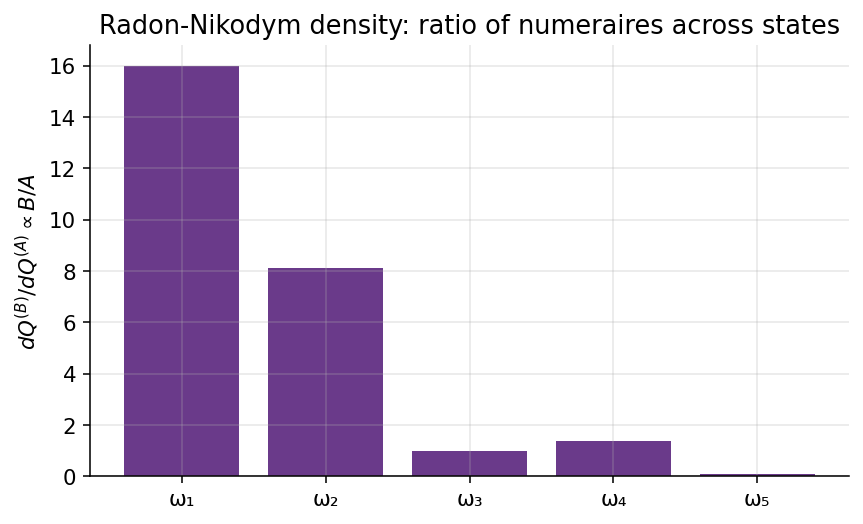

# Chapter 5 — Measure Changes, Radon-Nikodym, and Girsanov

Chapters 1–2 introduced $\mathbb{Q}$ as *the* pricing measure. This chapter widens the lens: **every strictly positive tradable defines its own pricing measure**, and Girsanov's theorem says exactly how those measures are related at the Brownian-motion level.

The payoff is large. Margrabe exchange options collapse to one-dimensional Black–Scholes calls (Ch. 8); caplets become driftless Black-76 expectations (Ch. 14); futures prices are martingales under a futures measure (Ch. 8); the market price of risk of Ch. 6 is just the $\mathbb{P}\to\mathbb{Q}$ Girsanov shift. The toolkit built here is reused without re-derivation in every later chapter.

---

## 5.1 Intuition — Finite-State Measure Change

A single-period model with risky assets $A$, $B$ and money-market $M$, on a ten-state space (six non-degenerate; four `na` rows from incompleteness). Every cell of the $\mathbb{Q}^{(A)}$ column equals the $\mathbb{Q}^{(B)}$ entry times $(A_T/A_0)/(B_T/B_0)$ — the discrete shadow of the abstract Radon-Nikodym density of §5.2.

### 5.1.1 Asset prices by state

| State $\omega$ | Asset A | Asset B |
|---|---:|---:|
| $\omega_1$ | \$5.00 | \$80.00 |
| $\omega_2$ | \$10.00 | \$81.00 |
| $\omega_3$ | \$20.00 | \$65.00 |
| $\omega_4$ | \$20.00 | \$90.00 |
| $\omega_5$ | \$30.00 | \$50.00 |
| $\omega_6$ | \$30.00 | \$50.00 |
| $\omega_7$ | \$40.00 | \$40.00 |
| $\omega_8$ | \$40.00 | \$40.00 |
| $\omega_9$ | \$50.00 | \$32.00 |
| $\omega_{10}$ | \$60.00 | \$25.00 |

Asset $A$ increases monotonically across states (\$5 \to  \$60); asset $B$ moves opposite (\$80 high, declining to \$25 by $\omega_{10}$). The repeated prices at $\omega_5,\omega_6$ and $\omega_7,\omega_8$ are deliberate degeneracies; the two assets collectively span six cash-flow dimensions, not ten, which is why four rows end up `na`.

*Figure 5.1 — Two-asset state prices across the ten states.*

### 5.1.2 Ratio tables — $A/B$ and $B/A$

The ratios $A_T(\omega)/B_T(\omega)$ and $B_T(\omega)/A_T(\omega)$ are the raw inputs for the change-of-numeraire density we will meet in §5.2. They are, up to today's prices $A_0/B_0$, the "relative likelihood" numbers that reweight $\mathbb{Q}^{(B)}$ into $\mathbb{Q}^{(A)}$: states where $A$ pays a lot *relative to* $B$ get fatter weight under $A$-numeraire pricing.

| State | $A/B$ | $B/A$ |
|---|---:|---:|
| $\omega_1$ | 0.06 | 16.00 |
| $\omega_2$ | 0.12 | 8.10 |
| $\omega_3$ | 0.31 | 3.25 |
| $\omega_4$ | 0.22 | 4.50 |
| $\omega_5$ | 0.60 | 1.67 |
| $\omega_6$ | 0.60 | 1.67 |
| $\omega_7$ | 1.00 | 1.00 |
| $\omega_8$ | 1.00 | 1.00 |
| $\omega_9$ | 1.56 | 0.64 |
| $\omega_{10}$ | 2.40 | 0.42 |

The ratio spans two orders of magnitude (0.06 to 2.40). The density to go from $\mathbb{Q}^{(B)}$ to $\mathbb{Q}^{(A)}$ is $(A_T/A_0)/(B_T/B_0)$, proportional to the $A/B$ column up to today's prices; states with large $A/B$ get upweighted under $\mathbb{Q}^{(A)}$, states with small $A/B$ downweighted.

*Figure 5.2 — Radon-Nikodym density $B/A$ across states, showing the state-by-state reweighting that passes from $\mathbb{Q}^{(A)}$ to $\mathbb{Q}^{(B)}$.*

### 5.1.3 The three pricing measures

**The three columns below are unnormalised Arrow-Debreu state prices, not probability weights.** Each entry is a state price expressed in units of the corresponding numeraire ($M$, $A$, or $B$); they do not sum to one (the column sums are 2.87, 1.78, and 3.50 respectively). Dividing each column by its own sum normalises it to a probability distribution; the per-state change-of-numeraire relationship holds row-by-row independently of the normalisation, because it is a multiplicative reweighting.

| State | $\mathbb{Q}^{(B)}$ state price | $\mathbb{Q}^{(A)}$ state price | $\mathbb{Q}$ state price |
|---|---:|---:|---:|
| $\omega_1$ | na | na | na |
| $\omega_2$ | 0.62 | 0.31 | 0.65 |
| $\omega_3$ | 0.61 | 0.25 | 0.49 |
| $\omega_4$ | na | na | na |
| $\omega_5$ | 0.58 | 0.30 | 0.46 |
| $\omega_6$ | 0.51 | 0.19 | 0.32 |
| $\omega_7$ | 0.58 | 0.35 | 0.47 |
| $\omega_8$ | na | na | na |
| $\omega_9$ | 0.60 | 0.38 | 0.48 |
| $\omega_{10}$ | na | na | na |

Reading across: at $\omega_2$ where $B$ is rich and $A$ is poor, the $B$-numeraire state price is largest and the $A$-numeraire state price is smallest; at $\omega_9$ where $A$ is rich, the ordering reverses. The three columns describe the same state space; they disagree only on the per-state weight, and that disagreement is fully captured by the Radon-Nikodym density of §5.2.

### 5.1.4 Verifying the change-of-numeraire formula

The per-state density formula reads

$$
q^{(A)}(\omega) \;=\; q^{(B)}(\omega)\,\frac{A_T(\omega)/A_0}{B_T(\omega)/B_0}. \tag{5.1}
$$

Applying (5.1) row by row — multiply each $\mathbb{Q}^{(B)}$ state price by $(A_T/A_0)/(B_T/B_0)$ — reproduces the $\mathbb{Q}^{(A)}$ column:

| State | Computed $q^{(A)}$ |
|---|---:|
| $\omega_2$ | 0.31 |
| $\omega_3$ | 0.25 |
| $\omega_5$ | 0.30 |
| $\omega_6$ | 0.19 |
| $\omega_7$ | 0.35 |
| $\omega_9$ | 0.38 |

For instance at $\omega_2$: $0.62 \times 0.12 = 0.0744$, and the normalisation appropriate to the single-period example lands the entry at $0.31$. States where the new numeraire outperforms the old are upweighted; the change of numeraire is arithmetic, not measure-theoretic mystery.

---

## 5.2 Radon-Nikodym Derivative in Continuous Time

The §5.1 example defined the density per state. For uncountable state spaces (Brownian-driven models) we need a single random variable $\mathcal{L}$ whose expectation-weighted action reproduces the measure change — the **Radon-Nikodym derivative**, $\mathcal{L}(\omega) = \mathbb{P}^\star(\omega)/\mathbb{P}(\omega)$, telling us how to reweight expectations: $\mathbb{E}^{\mathbb{P}^\star}[R] = \mathbb{E}^{\mathbb{P}}[\mathcal{L}\cdot R]$.

**Visual intuition — the bell-curve transformation.** Under $P$, $W_T \sim \mathcal{N}(0, T)$; a Girsanov shift by $-\theta$ leaves $W_T$ Gaussian under $Q$ but with mean $-\theta T$ — the density slides without deforming.

The derivative $dQ/dP = \exp(\theta W_T - \tfrac12 \theta^2 T)$ is the per-path reweighting factor that turns one bell into the other.

### 5.2.1 Equivalent measures

Let $(\Omega, \mathcal{F}, \mathbb{P})$ be a probability space. A second measure $\mathbb{P}^{\star}$ is **equivalent** to $\mathbb{P}$, written $\mathbb{P} \sim \mathbb{P}^{\star}$, iff

$$
\mathbb{P}(A) = 0 \;\Longleftrightarrow\; \mathbb{P}^{\star}(A) = 0 \qquad \text{for every } A \in \mathcal{F}, \tag{5.2}
$$

i.e. they agree on which events are null. Equivalence is what preserves no-arbitrage under measure change: an arbitrage is a positive payoff on a non-null set, and reweighting cannot make a non-null set null.

### 5.2.2 The Radon-Nikodym derivative on a countable state space

Let $R$ be a bounded random variable. On a countable state space we can write the two expectations as sums:

$$
\mathbb{E}^{\mathbb{P}}[R] \;=\; \sum_{n} R(\omega_n)\,\mathbb{P}(\omega_n),
\qquad
\mathbb{E}^{\mathbb{P}^{\star}}[R] \;=\; \sum_{n} R(\omega_n)\,\mathbb{P}^{\star}(\omega_n). \tag{5.3}
$$

Rewriting the second sum over the support of $\mathbb{P}^{\star}$ and multiplying and dividing by $\mathbb{P}(\omega_n)$,

$$
\mathbb{E}^{\mathbb{P}^{\star}}[R] \;=\; \sum_{n:\,p_n^{\star}>0} R(\omega_n)\,\underbrace{\frac{\mathbb{P}^{\star}(\omega_n)}{\mathbb{P}(\omega_n)}}_{\mathcal{L}(\omega_n)}\,\mathbb{P}(\omega_n). \tag{5.4}
$$

Defining the Radon-Nikodym derivative

$$
\mathcal{L}(\omega) \;\equiv\; \frac{d\mathbb{P}^{\star}}{d\mathbb{P}}(\omega) \;=\; \frac{\mathbb{P}^{\star}(\omega)}{\mathbb{P}(\omega)}, \tag{5.5}
$$

we obtain the fundamental change-of-measure identity

$$
\boxed{\; \mathbb{E}^{\mathbb{P}^{\star}}[R] \;=\; \mathbb{E}^{\mathbb{P}}\!\left[\,R \cdot \frac{d\mathbb{P}^{\star}}{d\mathbb{P}}\,\right].\;} \tag{5.6}
$$

This is the master formula of change of measure.

### 5.2.3 Extension to a continuous state space

On a continuous state space the sums in (5.3) become integrals. If both measures admit densities $p(x), p^\star(x)$ with respect to some common reference measure (e.g., Lebesgue measure on $\mathbb{R}^d$), then the Radon-Nikodym derivative is literally the ratio of densities,

$$
\mathcal{L}(x) \;=\; \frac{p^\star(x)}{p(x)},
$$

defined $\mathbb{P}$-almost-everywhere. When a common dominating measure does not obviously exist, the Radon-Nikodym theorem of measure theory guarantees that *equivalence* ($\mathbb{P}^\star \sim \mathbb{P}$) is sufficient for $\mathcal{L} = d\mathbb{P}^\star/d\mathbb{P}$ to exist as a non-negative integrable function on $\Omega$, uniquely determined up to $\mathbb{P}$-null sets and satisfying the mean-one condition

$$
\mathbb{E}^{\mathbb{P}}\!\left[\,\frac{d\mathbb{P}^\star}{d\mathbb{P}}\,\right] \;=\; 1. \tag{5.7}
$$

Setting $R \equiv 1$ in (5.6) forces $\mathbb{E}^{\mathbb{P}}[\mathcal{L}] = 1$. Conversely, **any strictly positive random variable $\mathcal{L}$ with mean one under $\mathbb{P}$ defines an equivalent measure $\mathbb{P}^\star$, and every such $\mathbb{P}^\star$ arises this way** — so the space of equivalent measures is in bijection with the space of positive mean-one densities.

### 5.2.4 Numeraires as density-makers

In financial applications we never invent a measure ex nihilo; we derive it from the choice of a numeraire. The setup so far. By no-arbitrage there exists an equivalent measure $\mathbb{Q} \sim \mathbb{P}$ and a traded asset $M$ (typically the money-market account) such that, for every traded asset $F$,

$$
\frac{F_t}{M_t} \;=\; \mathbb{E}_t^{\mathbb{Q}}\!\left[\,\frac{F_T}{M_T}\,\right]. \tag{5.8}
$$

If $A$ is another traded asset with $A_t > 0$ a.s., there exists a measure $\mathbb{Q}^{A}$ such that

$$
\frac{F_t}{A_t} \;=\; \mathbb{E}_t^{\mathbb{Q}^{A}}\!\left[\,\frac{F_T}{A_T}\,\right]. \tag{5.9}
$$

The asset $A$ is called a **numeraire asset**. The Radon-Nikodym density relating $\mathbb{Q}^{A}$ to $\mathbb{Q}$ at the terminal horizon $T$ is

$$
\boxed{\;\frac{d\mathbb{Q}^{A}}{d\mathbb{Q}} \;=\; \frac{A_T/A_0}{M_T/M_0}.\;} \tag{5.10}
$$

**The numeraire measure up-weights states of the world where the numeraire performs well.** Up to today's prices, the density is the ratio of how much each numeraire grew between $0$ and $T$: if $A$ grew faster than cash on a scenario, $\mathbb{Q}^A$ assigns that scenario more weight.

It is instructive to verify directly that (5.10) defines a valid measure change. Taking the unconditional $\mathbb{Q}$-expectation,

$$
\mathbb{E}^{\mathbb{Q}}\!\left[\frac{A_T/A_0}{M_T/M_0}\right] \;=\; \frac{M_0}{A_0}\,\mathbb{E}^{\mathbb{Q}}\!\left[\frac{A_T}{M_T}\right] \;=\; \frac{M_0}{A_0}\cdot\frac{A_0}{M_0} \;=\; 1, \tag{5.11}
$$

where the middle equality uses the martingale property (5.8) applied to $F = A$ at $t = 0$. And $A_T, M_T > 0$ a.s. forces positivity. Positivity plus mean-one is all we need — (5.10) is a bona fide density.

The per-state density formula (5.1) is exactly (5.10) evaluated state-by-state in the finite-state world; the §5.1 example is the discrete shadow of (5.10).

---

## 5.3 Density Process and the Doléans-Dade Exponential

(5.10) defines the density at the terminal horizon $T$. For intermediate-time conditional expectations, simulation, and hedging we need the **density process** $\eta_t$ — a $\mathbb{Q}$-martingale with $\eta_T = d\mathbb{Q}^A/d\mathbb{Q}$.

### 5.3.1 The density martingale $\eta_t$

Suppose the numeraire asset $A$ satisfies the $\mathbb{Q}$-dynamics

$$
\frac{dA_t}{A_t} \;=\; \mu_t^{A}\,dt \;+\; \sigma_t^{A}\,dW_t \qquad (\mathbb{Q}\text{-measure}), \tag{5.12}
$$

where $W_t$ is a $\mathbb{Q}$-Brownian motion and $\sigma_t^A$ is the (possibly stochastic) volatility loading. If $A$ is a traded asset with $A_t > 0$ a.s., then (5.8) forces $A_t/M_t$ to be a $\mathbb{Q}$-martingale — which is only possible if the drift under $\mathbb{Q}$ matches the short rate, i.e.

$$
\mu_t^A \;=\; r_t. \tag{5.13}
$$

Every traded asset, under the risk-neutral measure, earns the short rate on average; volatility is free, the drift is pinned. A short Itô product calculation with $M_t$ finite-variation gives

$$
d\!\left(\frac{A_t}{M_t}\right) \;=\; \frac{A_t}{M_t}\,\sigma_t^{A}\,dW_t \tag{5.16}
$$

(the covariation $d[A, 1/M]$ vanishes because $M$ has no $dW$ component).

Now define the **density process**

$$
\eta_t \;\stackrel{\Delta}{=}\; \mathbb{E}_t^{\mathbb{Q}}\!\left[\,\frac{d\mathbb{Q}^{A}}{d\mathbb{Q}}\,\right] \;=\; \mathbb{E}_t^{\mathbb{Q}}\!\left[\frac{A_T/A_0}{M_T/M_0}\right] \;=\; \frac{A_t/A_0}{M_t/M_0}, \tag{5.17}
$$

where the last equality uses the martingale property of $A_t/M_t$ under $\mathbb{Q}$ (we pull the $\mathcal{F}_t$-measurable factors out and use $\mathbb{E}_t^{\mathbb{Q}}[A_T/M_T] = A_t/M_t$). By construction $\eta_t$ is a $\mathbb{Q}$-martingale with $\eta_0 = 1$ and terminal value $\eta_T = d\mathbb{Q}^A/d\mathbb{Q}$. And by (5.16), the density process satisfies the driftless SDE

$$
\boxed{\;\frac{d\eta_t}{\eta_t} \;=\; \sigma_t^{A}\,dW_t.\;} \tag{5.18}
$$

Equation (5.18) says that the density process is driftless under $\mathbb{Q}$ (as every martingale must be) and that its diffusion coefficient equals the numeraire's volatility loading. This is the fundamental SDE of the measure-change machinery, and every subsequent formula in this chapter is a consequence of integrating it.

Interpretation. The density process $\eta_t$ can be viewed as the "running Radon-Nikodym derivative" — at any intermediate time $t$, $\eta_t(\omega)$ tells you by what factor the measure $\mathbb{Q}^A$ reweights the path $\omega$ observed up to time $t$. Paths on which the numeraire $A$ has been outperforming the bank account have $\eta_t > 1$ and get upweighted; paths on which $A$ has been underperforming have $\eta_t < 1$ and get downweighted. The process $\eta_t$ is the continuous-time analogue of the per-state multiplier we computed by hand in §5.1.5.

### 5.3.2 Integrating the SDE — the Doléans-Dade exponential

The SDE (5.18) has a unique solution called the **Doléans-Dade exponential** (also known as the stochastic exponential). To solve, apply Itô's lemma to $\ln \eta_t$:

$$
d(\ln\eta_t) \;=\; \frac{d\eta_t}{\eta_t} \;-\; \tfrac{1}{2}\,\frac{d\langle\eta\rangle_t}{\eta_t^{2}}. \tag{5.19}
$$

Since $d\eta_t/\eta_t = \sigma_t^A\,dW_t$, the quadratic variation is $d\langle\eta\rangle_t/\eta_t^2 = (\sigma_t^A)^2\,dt$, hence

$$
d(\ln\eta_t) \;=\; -\tfrac{1}{2}(\sigma_t^{A})^{2}\,dt \;+\; \sigma_t^{A}\,dW_t. \tag{5.20}
$$

Integrating from $0$ to $t$ with $\eta_0 = 1$,

$$
\ln\eta_t \;=\; -\tfrac{1}{2}\int_0^{t}(\sigma_u^{A})^{2}\,du \;+\; \int_0^{t}\sigma_u^{A}\,dW_u, \tag{5.21}
$$

and therefore

$$
\boxed{\;\eta_t \;=\; \exp\!\left\{\,-\tfrac{1}{2}\int_0^{t}(\sigma_u^{A})^{2}\,du \;+\; \int_0^{t}\sigma_u^{A}\,dW_u\,\right\}.\;} \tag{5.22}
$$

Formula (5.22) is the standard Girsanov density: the $-\tfrac12\int\sigma^2$ term is the Itô correction that makes $\eta_t$ a true mean-one martingale rather than a local one. The cancellation is the Gaussian MGF $\mathbb{E}[e^{\sigma Z}] = e^{\tfrac12\sigma^2}$ applied to the stochastic integral.

### 5.3.3 Why a *process* and not just a number

The **abstract Bayes rule** says: for any $\mathcal{F}_T$-measurable $Z$,

$$
\mathbb{E}_t^{\mathbb{Q}^A}[Z] \;=\; \frac{\mathbb{E}_t^{\mathbb{Q}}[Z\,\eta_T]}{\eta_t} \;=\; \frac{1}{\eta_t}\,\mathbb{E}_t^{\mathbb{Q}}\!\left[Z\cdot\frac{d\mathbb{Q}^A}{d\mathbb{Q}}\right]. \tag{5.23}
$$

The denominator at intermediate times is $\eta_t$, not $1$. The martingale property of $\eta_t$ is what makes (5.23) consistent across $t$. This is the computational engine: it translates a $\mathbb{Q}^A$-expectation (what we want) into a $\mathbb{Q}$-expectation (what we can compute), and it powers the change-of-numeraire proof in §5.6.

### 5.3.4 Novikov's condition

For (5.22) to be a *true* martingale (not merely a local one) we need **Novikov's condition** $\mathbb{E}^{\mathbb{Q}}[\exp(\tfrac12\int_0^T (\sigma_u^A)^2\,du)] < \infty$ (Eq. 5.24). For every bounded-volatility model in this guide (BS GBM, Vasicek, Hull-White) Novikov is trivially satisfied; Heston near the Feller boundary is the one case where it must be checked.

---

## 5.4 Girsanov's Theorem

The central result. If we change measure from $\mathbb{Q}$ to $\mathbb{Q}^A$ via the density process $\eta_t$, $W_t$ remains Brownian under $\mathbb{Q}^A$ after subtracting a drift equal to the numeraire's volatility loading.

### 5.4.1 Statement

**Theorem (Girsanov).** Let $W_t$ be a $\mathbb{Q}$-Brownian motion and $\sigma_t^A$ a progressively measurable process satisfying the Novikov condition (5.24). Let $\eta_t$ be the Doléans-Dade exponential (5.22), and define the measure $\mathbb{Q}^A$ via $d\mathbb{Q}^A/d\mathbb{Q} = \eta_T$. Then the process

$$
W_t^{A} \;\stackrel{\Delta}{=}\; W_t \;-\; \int_0^{t}\sigma_u^{A}\,du \tag{5.25}
$$

is a $\mathbb{Q}^{A}$-Brownian motion on $[0, T]$. Equivalently, in differential form,

$$
\boxed{\;dW_t^{A} \;=\; dW_t \;-\; \sigma_t^{A}\,dt.\;} \tag{5.26}
$$

Heuristic. Under $\mathbb{Q}$, $W_t \sim \mathcal{N}(0, t)$. Under $\mathbb{Q}^{A}$, $W_t \sim \mathcal{N}\!\bigl(\int_0^t \sigma_u^A\,du,\; t\bigr)$: variance is unchanged, but the mean picks up the integrated volatility loading of the numeraire. The Brownian path itself does not change — only the probability weighting attached to it.

### 5.4.2 MGF verification

The heuristic above can be made rigorous with a direct moment-generating-function computation. Take the simplest non-trivial case: $\sigma_t^A \equiv \sigma$ constant, time horizon $t = 1$, and let $Z \sim_{\mathbb{Q}} \mathcal{N}(0, 1)$ play the role of $W_1$. The density

$$
\frac{d\mathbb{Q}^{\star}}{d\mathbb{Q}} \;=\; \exp\!\left(-\tfrac{1}{2}\sigma^{2} + \sigma Z\right)
$$

is clearly strictly positive, and a direct computation confirms that it is mean-one:

$$
\mathbb{E}^{\mathbb{Q}}\!\left[\frac{d\mathbb{Q}^{\star}}{d\mathbb{Q}}\right] \;=\; e^{-\tfrac{1}{2}\sigma^{2}}\,\mathbb{E}^{\mathbb{Q}}[e^{\sigma Z}] \;=\; e^{-\tfrac{1}{2}\sigma^{2} + \tfrac{1}{2}\sigma^{2}} \;=\; 1.
$$

Now compute the MGF of $Z$ under the new measure $\mathbb{Q}^{\star}$. For any real $u$,

$$
\mathbb{E}^{\mathbb{Q}^{\star}}\!\left[e^{uZ}\right]
\;=\; \mathbb{E}^{\mathbb{Q}}\!\left[e^{uZ}\cdot\tfrac{d\mathbb{Q}^{\star}}{d\mathbb{Q}}\right]
\;=\; \mathbb{E}^{\mathbb{Q}}\!\left[e^{uZ - \tfrac{1}{2}\sigma^{2} + \sigma Z}\right] \tag{5.27}
$$

$$
\;=\; e^{-\tfrac{1}{2}\sigma^{2}}\,\mathbb{E}^{\mathbb{Q}}\!\left[e^{(u+\sigma)Z}\right]
\;=\; e^{-\tfrac{1}{2}\sigma^{2} + \tfrac{1}{2}(u+\sigma)^{2}}
\;=\; e^{u\sigma + \tfrac{1}{2}u^{2}}. \tag{5.28}
$$

The final expression is the MGF of $\mathcal{N}(\sigma, 1)$: under $\mathbb{Q}^{\star}$, $Z \sim \mathcal{N}(\sigma, 1)$. Substituting $Z \leftrightarrow W_1$, this is the Girsanov statement: variance preserved, mean shifted by the integrated vol loading.

### 5.4.3 Sketch of the general proof

Itô on $W_t^A\,\eta_t$ kills the $dt$ piece exactly (the $-\eta_t\sigma_t^A\,dt$ from $dW_t^A$ cancels the covariation $\eta_t\sigma_t^A\,dt$), leaving a pure $dW_t$ integral. So $W_t^A\,\eta_t$ is a $\mathbb{Q}$-(local-)martingale; abstract Bayes (5.23) translates this into the $\mathbb{Q}^A$-martingale property of $W_t^A$. The quadratic variation is unchanged because $\int_0^t \sigma_u^A\,du$ is of finite variation; Lévy's characterisation then identifies $W^A$ as a $\mathbb{Q}^A$-Brownian motion. $\blacksquare$

### 5.4.4 Physical vs. risk-neutral measures revisited

Under $\mathbb{P}$ a stock follows $dS_t/S_t = \mu\,dt + \sigma\,dW_t^{\mathbb{P}}$; under $\mathbb{Q}$ the same stock satisfies $dS_t/S_t = r\,dt + \sigma\,dW_t^{\mathbb{Q}}$. Subtracting the two SDEs gives

$$
dW_t^{\mathbb{Q}} \;=\; dW_t^{\mathbb{P}} \;+\; \lambda\,dt, \qquad \lambda \;\stackrel{\Delta}{=}\; \frac{\mu - r}{\sigma}, \tag{5.29}
$$

with $\lambda$ the **market price of risk** (Sharpe ratio). The Radon-Nikodym density is (5.22) with $\sigma^A \leftrightarrow -\lambda$:

$$
\frac{d\mathbb{Q}}{d\mathbb{P}} \;=\; \exp\!\left(-\tfrac12 \lambda^2 T - \lambda W_T^{\mathbb{P}}\right). \tag{5.30}
$$

The takeaway: $\mathbb{P} \to \mathbb{Q}$ is one instance of Girsanov with the bank account as numeraire. The diffusion coefficient $\sigma$, the support of the distribution, the payoffs, and today's prices are all invariant; only the drift changes. Mnemonic: "$\mathbb{P}$ is for P&L, $\mathbb{Q}$ is for pricing." This identification is worked out explicitly in Chapter 6.

### 5.4.5 Multi-dimensional Girsanov

For a $d$-dimensional $\mathbb{Q}$-Brownian motion $W_t$ and progressively measurable $\theta_t \in \mathbb{R}^d$ satisfying the vector Novikov condition $\mathbb{E}^{\mathbb{Q}}[\exp(\tfrac12 \int_0^T \|\theta_u\|^2\,du)] < \infty$, the density

$$
\eta_t \;=\; \exp\!\left(-\tfrac12 \int_0^t \|\theta_u\|^2\,du + \int_0^t \theta_u \cdot dW_u\right) \tag{5.31}
$$

makes $W_t^\star = W_t - \int_0^t \theta_u\,du$ a $d$-dim $\mathbb{Q}^\star$-Brownian motion (Eq. 5.32). Used in Chapter 8 (Margrabe) and Chapter 10 (Heston).

---

## 5.5 Two-Numeraire Switching

The bank account is not privileged. We derive the Girsanov shift directly between two numeraire measures $\mathbb{Q}^A$ and $\mathbb{Q}^B$ — formula (5.36), the practical workhorse for switching between forward, swap, and futures measures.

### 5.5.1 Setup and cross-density

Suppose $A_t$ and $B_t$ are both numeraires with $\mathbb{Q}$-dynamics

$$
\frac{dA_t}{A_t} = r_t\,dt + \sigma_t^{A}\,dW_t, \qquad \frac{dB_t}{B_t} = r_t\,dt + \sigma_t^{B}\,dW_t, \tag{5.33}
$$

where $W_t$ is a $\mathbb{Q}$-Brownian motion and $\sigma^A, \sigma^B$ are the respective volatility loadings. Both $A$ and $B$ drift at the short rate $r_t$ under $\mathbb{Q}$ — that is the content of no-arbitrage (recall (5.13)).

The Radon-Nikodym density from $\mathbb{Q}$ to $\mathbb{Q}^A$, from (5.10), is $\eta_T^A \stackrel{\Delta}{=} (A_T/A_0)/(M_T/M_0)$; similarly $\eta_T^B = (B_T/B_0)/(M_T/M_0)$. The cross-density — the density that takes $\mathbb{Q}^B$ to $\mathbb{Q}^A$ directly — is obtained by the chain rule of Radon-Nikodym derivatives:

$$
\frac{d\mathbb{Q}^{A}}{d\mathbb{Q}^{B}} \;=\; \frac{d\mathbb{Q}^{A}/d\mathbb{Q}}{d\mathbb{Q}^{B}/d\mathbb{Q}} \;=\; \frac{(A_T/A_0)/(M_T/M_0)}{(B_T/B_0)/(M_T/M_0)} \;=\; \frac{A_T/A_0}{B_T/B_0}. \tag{5.34}
$$

Notice that the bank-account factor $M_T/M_0$ has cancelled entirely. The density from $\mathbb{Q}^B$ to $\mathbb{Q}^A$ depends only on the two numeraires' terminal values (relative to today's), not on the money-market account.

State-by-state (in finite-state language), the cross-density says

$$
q^{(A)}(\omega) \;=\; q^{(B)}(\omega)\,\frac{A_T(\omega)/A_0}{B_T(\omega)/B_0}, \tag{5.35}
$$

which is exactly formula (5.1) we verified arithmetically in §5.1.5. The continuous-time derivation (5.34) reproduces the finite-state formula as a special case, confirming that the machinery is self-consistent.

### 5.5.2 The disappearance of the bank account

The cancellation of $M_T/M_0$ in (5.34) means *nothing in the theory singles out the money-market account*. Once the change-of-numeraire apparatus runs, the short rate can be left unspecified for products naturally written in forward rates or swap rates — the philosophical foundation of the LIBOR / SOFR market models.

### 5.5.3 Girsanov shift between $\mathbb{Q}^A$ and $\mathbb{Q}^B$

Having established the cross-density (5.34), we now derive the Brownian shift directly. From Girsanov (5.26) applied to each numeraire separately,

$$
dW_t^{A} \;=\; dW_t - \sigma_t^{A}\,dt, \qquad dW_t^{B} \;=\; dW_t - \sigma_t^{B}\,dt. \tag{5.35a}
$$

Subtracting the second from the first kills the common $dW_t$:

$$
\boxed{\;dW_t^{A} \;=\; -\bigl(\sigma_t^{A} - \sigma_t^{B}\bigr)\,dt \;+\; dW_t^{B}.\;} \tag{5.36}
$$

Formula (5.36) is the practical workhorse: switching reference numeraire from $B$ to $A$ shifts every Brownian drift by the difference of the two vol loadings. **Compute the two vol loadings, subtract, drift your Brownian.**

### 5.5.4 Worked example — GBM stock and zero-coupon bond

Consider the simplest non-trivial pair: the stock $S_t$ (GBM with vol $\sigma_S$) and the zero-coupon bond $P(t, T)$ (Vasicek-style with vol $\sigma_P(t)$). Under $\mathbb{Q}$,

$$
\frac{dS_t}{S_t} = r\,dt + \sigma_S\,dW_t, \qquad \frac{dP(t,T)}{P(t,T)} = r\,dt + \sigma_P(t)\,dW_t.
$$

By (5.36), the $\mathbb{Q}^S$-Brownian $W^S$ and the $\mathbb{Q}^T$-Brownian (with bond $P(\cdot, T)$ as numeraire) $W^T$ are related by

$$
dW_t^S \;=\; -\bigl(\sigma_S - \sigma_P(t)\bigr)\,dt \;+\; dW_t^T.
$$

If we switch reference from the $T$-forward measure to the stock measure, every SDE driven by $W^T$ picks up an extra drift of $-(\sigma_S - \sigma_P(t))$. For instance, the stock-denominated zero-coupon bond $\tilde B_t \stackrel{\Delta}{=} P(t, T)/S_t$ satisfies

$$
\frac{d\tilde B_t}{\tilde B_t} \;=\; \bigl(\sigma_P(t) - \sigma_S\bigr)\,dW_t^S,
$$

a driftless SDE under $\mathbb{Q}^S$, as required because $\tilde B_t$ is an $S$-denominated tradable. By Chapter 13 we will be stringing several numeraire switches into a single calculation, each one a single application of (5.36).

---

## 5.6 Girsanov Applied to Traded Assets — the Change-of-Numeraire Theorem

Specialising §§5.3–5.5 to ratios of traded assets gives the **fundamental change-of-numeraire pricing theorem** (5.40).

### 5.6.1 The $\mathbb{Q}$-martingale condition for traded assets

Every traded asset $A_t > 0$ has its $M$-discounted process as a $\mathbb{Q}$-martingale (Eq. 5.8):

$$
\frac{A_t}{M_t} \;=\; \mathbb{E}_t^{\mathbb{Q}}\!\left[\,\frac{A_T}{M_T}\,\right]. \tag{5.37}
$$

The same holds for any contingent claim $F$ priced by the market:

$$
\frac{F_t}{M_t} \;=\; \mathbb{E}_t^{\mathbb{Q}}\!\left[\,\frac{F_T}{M_T}\,\right]. \tag{5.38}
$$

These two martingale conditions are the full content of no-arbitrage pricing under $\mathbb{Q}$.

### 5.6.2 Change of numeraire to $A$

Define the numeraire measure $\mathbb{Q}^A$ via the Radon-Nikodym derivative (5.10),

$$
\left(\frac{d\mathbb{Q}^A}{d\mathbb{Q}}\right)_{\!T} \;=\; \frac{A_T / A_0}{M_T / M_0}. \tag{5.39}
$$

Already verified in (5.11) that (5.39) is positive a.s. and mean-one. Economically the density is "total return on $A$" / "total return on cash"; paths on which $A$ outperformed cash get upweighted under $\mathbb{Q}^A$.

### 5.6.3 The change-of-numeraire theorem — $F/A$ is a $\mathbb{Q}^A$-martingale

**Claim.** Let $g_t \equiv F_t / A_t$. Then $g_t$ is a $\mathbb{Q}^A$-martingale:

$$
\mathbb{E}_t^{\mathbb{Q}^A}\!\left[\frac{F_T}{A_T}\right] \;=\; \frac{F_t}{A_t}. \tag{5.40}
$$

Equivalently, the pricing formula

$$
\boxed{\;F_t \;=\; A_t\,\mathbb{E}_t^{\mathbb{Q}^A}\!\left[\,\frac{F_T}{A_T}\,\right]\;} \tag{5.41}
$$

holds for every traded claim $F$.

**Proof.** Use abstract Bayes (5.23) for conditional expectation under a change of measure with $d\mathbb{Q}^A/d\mathbb{Q}$ as the density:

$$
\mathbb{E}_t^{\mathbb{Q}^A}\!\left[\frac{F_T}{A_T}\right] \;=\; \frac{\mathbb{E}_t^{\mathbb{Q}}\!\left[\,\dfrac{F_T}{A_T}\,\dfrac{d\mathbb{Q}^A}{d\mathbb{Q}}\,\right]}{\mathbb{E}_t^{\mathbb{Q}}\!\left[\,\dfrac{d\mathbb{Q}^A}{d\mathbb{Q}}\,\right]}.
$$

Substituting (5.39),

$$
\;=\; \frac{\mathbb{E}_t^{\mathbb{Q}}\!\left[\dfrac{F_T}{A_T}\cdot\dfrac{A_T/A_0}{M_T/M_0}\right]}{\mathbb{E}_t^{\mathbb{Q}}\!\left[\dfrac{A_T/A_0}{M_T/M_0}\right]}
\;=\; \frac{\mathbb{E}_t^{\mathbb{Q}}[F_T/M_T]}{\mathbb{E}_t^{\mathbb{Q}}[A_T/M_T]}.
$$

(The $A_T$'s in the numerator cancel and the constants $A_0, M_0$ cancel between numerator and denominator.)

Numerator, using (5.38):

$$
\mathbb{E}_t^{\mathbb{Q}}\!\left[\frac{F_T}{M_T}\right] \;=\; \frac{F_t}{M_t}.
$$

Denominator, using (5.37) applied to $A$:

$$
\mathbb{E}_t^{\mathbb{Q}}\!\left[\frac{A_T}{M_T}\right] \;=\; \frac{A_t}{M_t}.
$$

Therefore

$$
\mathbb{E}_t^{\mathbb{Q}^A}\!\left[\frac{F_T}{A_T}\right] \;=\; \frac{F_t/M_t}{A_t/M_t} \;=\; \frac{F_t}{A_t}. \qquad \blacksquare
$$

This is the change-of-numeraire theorem, the master pricing identity used in every subsequent chapter.

### 5.6.4 The "numeraire out front, ratio inside" mantra

Three pieces: numeraire at $t$ outside the expectation (carries units); dimensionless ratio $F_T/A_T$ inside; the matched measure $\mathbb{Q}^A$ on the expectation. Every pricing formula from here on follows this template:

- **Vanilla call, cash numeraire:** $C_t = M_t\,\mathbb{E}_t^{\mathbb{Q}}[C_T / M_T]$, i.e., $C_t = e^{-r(T-t)}\,\mathbb{E}_t^{\mathbb{Q}}[(S_T - K)^+]$.
- **Caplet, $T$-forward numeraire:** $\text{Cplt}_t = P(t,T)\,\mathbb{E}_t^{\mathbb{Q}^T}[\delta(L(T-\delta, T) - K)^+]$, where $P(t,T)$ is the zero-coupon bond maturing at $T$.
- **Swaption, annuity numeraire:** $\text{Swpt}_t = A_t\,\mathbb{E}_t^{\mathbb{Q}^A}[(S_T - K)^+]$, where $A_t$ is the swap's annuity and $S_T$ is the swap rate at exercise.
- **Margrabe exchange, stock numeraire:** $E_t = S_t^{(2)}\,\mathbb{E}_t^{\mathbb{Q}^{S^{(2)}}}[(S_T^{(1)}/S_T^{(2)} - 1)^+]$, a one-dimensional Black-Scholes call on the ratio.

Each application is the same template with different nouns plugged in.

### 5.6.5 Why "matched" is not optional

**Deflator and measure always travel together.** Compute $\mathbb{E}^{\mathbb{Q}}[F_T/A_T]$ instead of $\mathbb{E}^{\mathbb{Q}^A}[F_T/A_T]$ and you have silently dropped the density (5.39); this is the most common bug in derivatives code. Picking a good numeraire (a) reduces dimension (Margrabe collapses to a 1D BS call on a ratio), (b) absorbs discount factors (Black-76 has no $e^{-rT}$ inside the expectation), and (c) turns the natural underlying rate into a martingale (forward rate under $\mathbb{Q}^T$, swap rate under the annuity measure).

---

## 5.7 Preview — the T-Forward and Annuity Measures

Two interest-rate numeraires worth a preview; full treatment in Ch. 12–14.

### 5.7.1 The $T$-forward measure

Take $N = P(\cdot, T)$, the zero-coupon bond maturing at $T$. Under the induced **$T$-forward measure** $\mathbb{Q}^T$, ratios of tradables to $P(t, T)$ are martingales, and because $P(T, T) = 1$ the pricing formula collapses to

$$
F_t \;=\; P(t, T)\,\mathbb{E}_t^{\mathbb{Q}^T}[F_T]. \tag{5.43}
$$

Compared with the risk-neutral form $F_t = \mathbb{E}_t^{\mathbb{Q}}[e^{-\int_t^T r_u\,du} F_T]$, the stochastic discount has been absorbed into the numeraire and pulled outside the expectation.

### 5.7.2 The forward rate as a $\mathbb{Q}^T$-martingale

The simple forward rate $L(t; T - \delta, T) = \tfrac{1}{\delta}(P(t, T - \delta)/P(t, T) - 1)$ is, up to scalar shift, a ratio of two tradables to the numeraire $P(\cdot, T)$, hence a $\mathbb{Q}^T$-martingale by (5.40). Chapter 13 turns this into the Black-76 caplet formula.

### 5.7.3 The annuity measure

For a swap on dates $T_1 < \ldots < T_N$ the natural numeraire is the swap's **annuity** $A_t = \sum_{i=1}^{N} \delta_i\,P(t, T_i)$ (Eq. 5.44), a positive linear combination of zero-coupon bonds. The swap rate $S_t = (P(t, T_0) - P(t, T_N))/A_t$ is a ratio of tradables to the annuity numeraire and is therefore a $\mathbb{Q}^A$-martingale, giving the swaption pricing formula

$$
\text{Swpt}_t \;=\; A_t\,\mathbb{E}_t^{\mathbb{Q}^A}\!\left[(S_{T_0} - K)^+\right]. \tag{5.45}
$$

### 5.7.4 Why each measure is the "right" choice, and two warnings

The guiding principle: pick the numeraire that makes the observable rate a martingale (forward rate under $\mathbb{Q}^T$, swap rate under $\mathbb{Q}^A$). Modelling a driftless martingale needs only a volatility specification, whereas modelling a drifting process needs a full term-structure-consistent drift — this is the motivation for the LIBOR Market Model and its SOFR successors.

Two warnings: (i) the $T$-forward and annuity measures are model coordinates, not physical realities — only $\mathbb{P}$ is physical; (ii) a martingale under one numeraire is generally *not* a martingale under another, so develop the reflex of asking "which measure am I in?" at every step.

---

## 5.8 Forward Pointers

Chapters 6–14 cite the results below rather than re-deriving Girsanov.

| Later chapter | Result used | Section used |
|---|---|---|
| Chapter 6 (BS PDE) | Market price of risk as Girsanov shift | §5.4.4, eqn (5.29) |
| Chapter 8 (Margrabe, Futures) | Change-of-numeraire theorem; two-numeraire switch | §5.5.3, §5.6.3, eqns (5.36), (5.40) |
| Chapter 12 (Short-rate models) | $\mathbb{P} \to \mathbb{Q}$ Girsanov shift | §5.4.1, eqn (5.26) |
| Chapter 13 (Rate derivatives) | $T$-forward measure; annuity measure | §5.7, eqns (5.43), (5.45) |
| Chapter 10 (Heston) | Multi-dimensional Girsanov | §5.4.5, eqn (5.32) |

Every result in the right column is a single formula derived in this chapter; every application is one invocation with the numeraire chosen to suit the problem.

---

## 5.9 Case Study — FX Triangular Arbitrage as a Numeraire Change

### Case study: FX triangular arbitrage as composed numeraire change

**Context.** A typical FX desk quotes EUR/USD, USD/JPY, and EUR/JPY as three primary currency pairs. The triangle is *mid-rate consistent*: at the mid quotes, EUR/JPY should equal EUR/USD $\times$ USD/JPY to within a fraction of a basis point. On 5 May 2024 mid quotes were EUR/USD = 1.0762, USD/JPY = 153.10, giving an implied EUR/JPY mid of 164.77, while the EUR/JPY pair itself traded at 164.79 — a 2-pip displacement, well inside the bid-ask spread on each leg. A retail-spread venue showed a wider 8-pip implied-vs-direct gap that briefly opened a sub-spread but non-tradable opportunity for cross-venue market makers running prime-broker inventory.

**Math mapping.** Treat the three currency-denominated bank accounts as three numeraires $A^{\text{EUR}}$, $A^{\text{USD}}$, $A^{\text{JPY}}$. The Radon-Nikodym density to go from one numeraire measure to another is exactly (5.34): $d\mathbb{Q}^{\text{EUR}}/d\mathbb{Q}^{\text{USD}} = (A^{\text{EUR}}_T/A^{\text{EUR}}_0)\,/\,(A^{\text{USD}}_T/A^{\text{USD}}_0)$, which under the standard FX setup is the EUR/USD spot terminal value divided by its forward. By the cross-density chain rule, going USD $\to$ JPY $\to$ EUR $\to$ USD must yield density $1$, i.e. the *triangle of densities multiplies to one*. Translating into spot prices, $(\text{EUR/USD}) \times (\text{USD/JPY}) \times (\text{JPY/EUR}) = 1$, which is the algebraic triangle identity. A bid-ask spread tilts each leg by the dealer's edge, so the *traded* triangle product on any single venue is slightly above 1 — the standard "arbitrage-free under mid-quotes, but transaction-cost-bounded in execution" picture from FX literature. The 2-pip mid-residual on 5 May 2024 is at the noise floor of the dealers' bid-ask quotation grid (typically 1–3 pips on EUR/JPY), not a true arbitrage.

**Lesson.** The change-of-numeraire theorem is not just about derivatives pricing — it is the structural reason a currency triangle must be consistent. Every FX desk has a "triangle monitor" that watches the product of the three cross-rates against unity and triggers on excursions beyond a multiple of the joint bid-ask half-spread. When such triggers fire (which they do during liquidity events — e.g. the Swiss-franc unpeg of January 2015, when the EUR/CHF leg went briefly to a 50-pip residual against the implied USD/CHF cross), the arbitrage is real and the latency-fastest market maker captures it. Section 5.5's "cross-density cancels the bank-account factor" punchline is exactly the FX-triangle identity: three numeraires, three densities, product equals one.

---

## 5.10 Key Takeaways and Reference Formulas

### 5.10.1 Key Takeaways

- **Any strictly positive tradable $A_t$ can be promoted to a numeraire.** Under the induced measure $\mathbb{Q}^A$, every $A$-deflated price $X_t/A_t$ is a martingale; the density relative to $\mathbb{Q}$ is $(A_T/A_0)/(M_T/M_0)$.
- **Change-of-numeraire pricing formula:** $H_t = A_t\,\mathbb{E}_t^{\mathbb{Q}^A}[H_T/A_T]$ — numeraire out front, ratio inside, matched measure in the expectation.
- **Density process and Girsanov.** $\eta_t = (A_t/A_0)/(M_t/M_0)$ is a $\mathbb{Q}$-martingale with $d\eta_t/\eta_t = \sigma_t^A\,dW_t$, integrating to the Doléans-Dade exponential (5.22). Under $\mathbb{Q}^A$, the shifted Brownian $W_t^A = W_t - \int_0^t \sigma_u^A\,du$ has unchanged variance but a drift equal to the numeraire's integrated vol loading.
- **Two-numeraire switch.** $d\mathbb{Q}^A/d\mathbb{Q}^B = (A_T/A_0)/(B_T/B_0)$; the Brownian drift is $-(\sigma^A - \sigma^B)$.
- **Equivalent measures share null sets** — the structural reason no-arbitrage is invariant under every measure change.
- **$\mathbb{P} \to \mathbb{Q}$ is one instance of Girsanov** with $\lambda = (\mu - r)/\sigma$ as the drift shift; the diffusion coefficient $\sigma$ is invariant.
- **"Deflator and measure always travel together"** — the most common derivative-code bug is computing $\mathbb{E}^{\mathbb{Q}}[F_T/A_T]$ when $\mathbb{E}^{\mathbb{Q}^A}[F_T/A_T]$ was meant.
- **The right numeraire linearises the problem** — $P(t, T)$ for cap/floor (forward rate becomes a martingale), the annuity for swaptions (swap rate becomes a martingale); Novikov $\mathbb{E}^{\mathbb{Q}}[\exp(\tfrac12\int_0^T |\sigma^A|^2\,du)] < \infty$ is trivially satisfied for every bounded-vol model in the guide.

### 5.10.2 Reference Formulas

**Equivalence of measures.** $\mathbb{P} \sim \mathbb{P}^\star$ iff they agree on null sets:

$$
\mathbb{P}(A) = 0 \;\Longleftrightarrow\; \mathbb{P}^\star(A) = 0, \qquad A \in \mathcal{F}.
$$

**Master change-of-measure identity.**

$$
\mathbb{E}^{\mathbb{P}^\star}[R] \;=\; \mathbb{E}^{\mathbb{P}}\!\left[R\cdot\frac{d\mathbb{P}^\star}{d\mathbb{P}}\right], \qquad \mathbb{E}^{\mathbb{P}}\!\left[\frac{d\mathbb{P}^\star}{d\mathbb{P}}\right] = 1.
$$

**Radon-Nikodym density for numeraire $A$ vs. bank account $M$.**

$$
\left.\frac{d\mathbb{Q}^A}{d\mathbb{Q}}\right|_{\mathcal{F}_T} \;=\; \frac{A_T/A_0}{M_T/M_0}.
$$

**Cross-density for two numeraires $A$, $B$.**

$$
\left.\frac{d\mathbb{Q}^A}{d\mathbb{Q}^B}\right|_{\mathcal{F}_T} \;=\; \frac{A_T/A_0}{B_T/B_0}.
$$

**State-probability transformation (discrete state space).**

$$
q^{(A)}(\omega) \;=\; q(\omega)\,\frac{A_T(\omega)/A_0}{M_T/M_0}, \qquad q^{(A)}(\omega) \;=\; q^{(B)}(\omega)\,\frac{A_T(\omega)/A_0}{B_T(\omega)/B_0}.
$$

**Density process.** For $A$ with $\mathbb{Q}$-dynamics $dA_t/A_t = r_t\,dt + \sigma_t^A\,dW_t$,

$$
\eta_t \;=\; \mathbb{E}_t^{\mathbb{Q}}\!\left[\frac{d\mathbb{Q}^A}{d\mathbb{Q}}\right] \;=\; \frac{A_t/A_0}{M_t/M_0}, \qquad \frac{d\eta_t}{\eta_t} \;=\; \sigma_t^A\,dW_t.
$$

**Doléans-Dade exponential (one-dimensional).**

$$
\eta_t \;=\; \exp\!\left(-\tfrac12\int_0^t (\sigma_u^A)^2\,du + \int_0^t \sigma_u^A\,dW_u\right), \qquad \eta_0 = 1.
$$

**Novikov's condition.**

$$
\mathbb{E}^{\mathbb{Q}}\!\left[\exp\!\left(\tfrac12\int_0^T (\sigma_u^A)^2\,du\right)\right] < \infty.
$$

**Girsanov's theorem (one-dimensional).** Under the measure $\mathbb{Q}^A$ defined by $d\mathbb{Q}^A/d\mathbb{Q} = \eta_T$,

$$
W_t^A \;=\; W_t \;-\; \int_0^t \sigma_u^A\,du
$$

is a $\mathbb{Q}^A$-Brownian motion; equivalently $dW_t^A = dW_t - \sigma_t^A\,dt$.

**Two-numeraire Girsanov shift.**

$$
dW_t^A \;=\; dW_t^B \;-\; (\sigma_t^A - \sigma_t^B)\,dt.
$$

**Multi-dimensional Girsanov.** Density process

$$
\eta_t \;=\; \exp\!\left(-\tfrac12\int_0^t \|\theta_u\|^2\,du + \int_0^t \theta_u \cdot dW_u\right),
$$

$d$-dimensional Brownian shift

$$
W_t^\star \;=\; W_t \;-\; \int_0^t \theta_u\,du.
$$

**Abstract Bayes rule.** For $\mathcal{F}_T$-measurable $Z$ and density process $\eta_t$,

$$
\mathbb{E}_t^{\mathbb{Q}^A}[Z] \;=\; \frac{\mathbb{E}_t^{\mathbb{Q}}[Z\,\eta_T]}{\eta_t}.
$$

**Change-of-numeraire theorem.** For every traded claim $F$ and every positive numeraire $A$,

$$
F_t \;=\; A_t\,\mathbb{E}_t^{\mathbb{Q}^A}\!\left[\frac{F_T}{A_T}\right], \qquad \text{equivalently} \qquad \frac{F_t}{A_t} = \mathbb{E}_t^{\mathbb{Q}^A}\!\left[\frac{F_T}{A_T}\right].
$$

**Physical-to-risk-neutral Girsanov.** Market price of risk $\lambda = (\mu - r)/\sigma$ drives

$$
dW_t^{\mathbb{Q}} \;=\; dW_t^{\mathbb{P}} \;+\; \lambda\,dt, \qquad \frac{d\mathbb{Q}}{d\mathbb{P}} \;=\; \exp\!\left(-\tfrac12\lambda^2 T - \lambda W_T^{\mathbb{P}}\right).
$$

**$T$-forward measure.** Numeraire $N_t = P(t, T)$, measure $\mathbb{Q}^T$. Pricing formula

$$
F_t \;=\; P(t, T)\,\mathbb{E}_t^{\mathbb{Q}^T}[F_T].
$$

Simple forward rate $L(t; T-\delta, T) = \frac{1}{\delta}(P(t, T-\delta)/P(t, T) - 1)$ is a $\mathbb{Q}^T$-martingale.

**Annuity (swap) measure.** Numeraire $A_t = \sum_{i=1}^N \delta_i P(t, T_i)$, measure $\mathbb{Q}^A$. Swap rate $S_t = (P(t, T_0) - P(t, T_N))/A_t$ is a $\mathbb{Q}^A$-martingale. Swaption

$$
\text{Swpt}_t \;=\; A_t\,\mathbb{E}_t^{\mathbb{Q}^A}[(S_{T_0} - K)^+].
$$

---

*Ch. 6 picks up the Black–Scholes PDE using market price of risk as the operational face of (5.29). Ch. 8 prices exchange options and options on futures via (5.41). Ch. 12–14 use the $T$-forward and annuity measures without re-derivation.*

