# Chapter 7 — Dynamic Hedging II: Greeks, Delta-Gamma, Vega, and Dividends

Ch. 6 built the single-instrument delta hedge, the generalised BS PDE, and the vanilla Greeks. Here we enlarge the hedging basis — first to neutralise curvature (delta-gamma), then volatility (vega), then dividends — and account for transaction costs. The Itô machinery is unchanged; what grows is the hedge basis.

## 7.0 Chapter orientation

A delta hedge is *first-order* risk-free: the $\mathrm{d}W_t$ coefficient is zero, but residual exposures live in the higher-order terms. Gamma is the coefficient of $(\Delta S)^2$, vega of $\Delta\sigma$, theta of $\Delta t$. Cross-derivatives (vanna, volga, charm, speed, colour) parameterise the rest.

Most higher Greeks are not hedgeable with the stock alone — stock has zero gamma, zero vega. To kill curvature or vol-level risk we add another traded option. The linear algebra is easy; the bookkeeping is where the subtleties live.

Notation as in Ch. 6: $S_t$ stock, $g(t, S)$ a claim, $\Delta = \partial_S g$, $\Gamma = \partial_{SS} g$, $\mathcal{V} = \partial_\sigma g$. Expectations under $\mathbb{Q}$.

---

## 7.1 Greeks recap — a bridge from Chapter 6

Catalogue the partials. Let $g(t, S; \sigma, r)$ price a European claim. *First-order:*

$$
\Delta_t \;\equiv\; \partial_S g, \qquad
\Theta_t \;\equiv\; \partial_t g, \qquad
\mathcal{V}_t \;\equiv\; \partial_\sigma g, \qquad
\rho_t \;\equiv\; \partial_r g. \tag{7.1}
$$

*Second-order:*

$$
\Gamma_t \;\equiv\; \partial_{SS} g, \qquad
\text{vanna}_t \;\equiv\; \partial_{S\sigma} g, \qquad
\text{volga}_t \;\equiv\; \partial_{\sigma\sigma} g, \qquad
\text{charm}_t \;\equiv\; \partial_{St} g. \tag{7.2}
$$

Third-order Greeks (speed, colour, zomma) characterise tighter residuals. European call closed forms:

$$
\Delta_{\mathrm{call}} \;=\; \Phi(d_+), \qquad
\Gamma \;=\; \frac{\Phi'(d_+)}{S\,\sigma\sqrt{T-t}}, \qquad
\mathcal{V} \;=\; S\,\sqrt{T-t}\,\Phi'(d_+), \tag{7.3}
$$

and for a European put, $\Delta_{\mathrm{put}} = \Phi(d_+) - 1 = -\Phi(-d_+)$,
with the same $\Gamma$ and $\mathcal{V}$ as the call (we will prove the gamma
identity via put-call parity in §7.6). Here $\Phi$ and $\Phi'$ are the
standard normal CDF and density, and $d_\pm = [\ln(S/K) + (r \pm
\tfrac{1}{2}\sigma^2)(T-t)] / (\sigma\sqrt{T-t})$ is the Black-Scholes
moneyness index.


*Black-Scholes call delta $\Phi(d_+)$ as a function of spot for three maturities. Long-dated options have gradual deltas spread across moneyness; near expiry the delta compresses toward a step at the strike, tracking the digital payoff that $\Delta_{\mathrm{call}}$ becomes in the $T\downarrow t$ limit.*


*Gamma $= \Phi'(d_+)/(S\sigma\sqrt{T-t})$ peaks at the at-the-money strike for every maturity, and the peak grows without bound as $T\downarrow t$. A short ATM option is a short-gamma position that becomes dangerously short as expiry approaches — the terminal-gamma pinning effect.*


*Put-call parity in delta form: $\Delta_{\mathrm{call}} - \Delta_{\mathrm{put}} = 1$ for every spot. The call delta rises from $0$ to $+1$ through the strike; the put delta sits a parallel unit below, running from $-1$ to $0$. A long call plus a short put with the same strike is always $100\%$ long the underlying.*

Ch. 6's argument used one Greek (delta) because one Brownian was being neutralised. A delta-hedged position is delta-hedged only at the rebalance instant — between rebalances, the residuals (gamma, vega, etc.) are the dominant source of P&L variance. A flow desk that leaves gamma, vega, and dividends unmodelled isn't running a simplified BS hedge — it's running a book where residuals dominate. The residuals are the business.

---

## 7.2 Delta-gamma hedging — two framings unified

A delta-neutral position is not risk-neutral: a $\Delta S$ move costs $\tfrac12 \Gamma (\Delta S)^2$ — for a short option, a guaranteed loss on any move. To hedge gamma, add a second curved instrument $h(t, S_t)$ alongside the stock and cash. Two risky knobs ($\alpha_t$ shares, $\gamma_t$ units of $h$) match two conditions: delta and gamma.

Two framings give the same answer. **Framing A** (two-instrument replication): match the target's $\mathrm{d}W_t$ and $\mathrm{d}t$ coefficients. **Framing B** (local quadratic fit): match the first two spatial derivatives via a $2 \times 2$ linear system in $(\alpha, \gamma)$ since stock has delta 1 and gamma 0, while $h$ has known $(\Delta^h, \Gamma^h)$.

### 7.2.1 Local Taylor expansion of a claim

Second-order Taylor expansion of $g(t, S)$ around $S_t$:

$$
g(t, S) \;=\; g(t, S_t) \;+\; (S - S_t)\,\partial_S g(t, S_t)
\;+\; \tfrac{1}{2}\,(S - S_t)^2\,\partial_{SS} g(t, S_t) \;+\; \cdots, \tag{7.4}
$$

with the customary naming convention

$$
\Delta^g_t \;\equiv\; \partial_S g(t, S_t), \qquad
\Gamma^g_t \;\equiv\; \partial_{SS} g(t, S_t). \tag{7.5}
$$

Delta is slope, gamma is curvature. Geometrically: a delta-only hedge is a tangent line; delta-gamma is a tangent parabola that hugs the payoff over a wider window. Approximation error drops from $(\Delta S)^2$ to $(\Delta S)^3$.

The quadratic truncation is natural under GBM: $(\Delta S)^2 \sim S^2 \sigma^2 \Delta t$ is the same order as $\Delta t$, so it cannot be ignored without ignoring the PDE's time-derivative structure. $(\Delta S)^3 \sim (\Delta t)^{3/2}$ vanishes in the limit. Higher Greeks matter only through discrete-rebalancing residuals.


*Figure 7.1 — Delta-only hedge (tangent line) vs delta-gamma hedge
(tangent parabola) fit against the convex call payoff.*

### 7.2.2 Framing A — two-instrument replication

We are short one unit of $g$ and want a self-financing portfolio that tracks it. Against a delta hedge alone, the $(\Delta S)^2$ residual cannot be killed by a share position (stock has zero gamma) — we need a second curved instrument $h$ with $\partial_{SS} h \neq 0$.

Let $h(t, S)$ be another traded option on $S$ — typically vanilla, liquid,
and chosen to have gamma at the same scale as the target's. The hedging
portfolio is

$$
V(t, S) \;=\; \alpha_t\,S \;+\; \beta_t\,M_t \;+\; \gamma_t\,h(t, S), \tag{7.6}
$$

where $\alpha_t$ is the number of shares, $\gamma_t$ is the number of units
of the auxiliary option, $\beta_t$ is the number of units of the
money-market account $M_t = e^{rt}$, and the hedge is set up so that $V$
matches the target $g$ claim-for-claim. Applying a Taylor expansion around
$S_t$ to both the portfolio and the target,

$$
V(t, S) \;=\; \alpha_t\,S \;+\; \beta_t\,M_t \;+\; \gamma_t\!\left[h(t, S_t)
+ (S - S_t)\,\partial_S h(t, S_t)
+ \tfrac{1}{2}(S - S_t)^2\,\partial_{SS} h(t, S_t)\right] + \cdots, \tag{7.7}
$$

$$
g(t, S) \;=\; g(t, S_t) \;+\; (S - S_t)\,\partial_S g(t, S_t)
\;+\; \tfrac{1}{2}(S - S_t)^2\,\partial_{SS} g(t, S_t) \;+\; \cdots. \tag{7.8}
$$

Matching coefficients of $(S - S_t)$ and $(S - S_t)^2$ between the portfolio
and the target gives the *delta-gamma hedge conditions*:

$$
\alpha_t \;+\; \gamma_t\,\partial_S h(t, S_t) \;=\; \partial_S g(t, S_t), \tag{7.9}
$$

$$
\gamma_t\,\partial_{SS} h(t, S_t) \;=\; \partial_{SS} g(t, S_t). \tag{7.10}
$$

Denote $\Delta^h_t = \partial_S h$, $\Gamma^h_t = \partial_{SS} h$, and
$\Delta^g_t$, $\Gamma^g_t$ similarly. Solving (7.9)–(7.10) for the two
unknowns,

$$
\boxed{\;\gamma_t \;=\; \frac{\Gamma^g_t}{\Gamma^h_t}, \qquad
\alpha_t \;=\; \Delta^g_t \;-\; \frac{\Gamma^g_t}{\Gamma^h_t}\,\Delta^h_t. \;} \tag{7.11}
$$

These are the two hedge ratios. Read (7.11) as a two-step recipe: first fix
$\gamma_t$ so that the auxiliary option's gamma times $\gamma_t$ matches
the target gamma — that is gamma-matching, equation (7.10); then set
$\alpha_t$ so that the *net* delta of the $\gamma_t$-scaled auxiliary plus
$\alpha_t$-scaled stock matches the target delta — that is delta-matching,
equation (7.9), solved after $\gamma_t$ is pinned down. The order matters
because gamma-matching uses only $h$ (the stock has zero gamma), while
delta-matching uses both $h$ and $S$. One cannot delta-hedge first and then
gamma-hedge, because the gamma-hedge step would disturb the delta that had
already been arranged. The correct order — gamma first, then delta — is
the operational lesson of the pair (7.11).

With $\alpha_t$ and $\gamma_t$ in hand, the cash leg follows from the total
portfolio value. At inception, we sold $g$ and collected $g_0$; we bought
$\gamma_0$ units of $h$ at $h_0$ and $\alpha_0$ shares at $S_0$; whatever
is left we deposit in the bank, so

$$
M_0 \;=\; g_0 \;-\; \alpha_0\,S_0 \;-\; \gamma_0\,h_0. \tag{7.12}
$$

This is the delta-gamma analogue of the delta-only initial-balance recipe
from §6.11.2: the premium collected pays for both the share-hedge and the
option-hedge, and the residual sits in the bank earning the short rate.
Depending on the sign of $\gamma_0$ and the price of $h$, the initial bank
balance may be positive (net lender) or negative (net borrower). For a
short position in a short-dated at-the-money call hedged with a short-dated
different-strike call, typically $\gamma_0 > 0$ (we are *long* gamma in the
auxiliary to offset our *short* gamma in the target), which means we pay
for $h$ and the initial bank balance shrinks by $\gamma_0 h_0$ relative to
the delta-only hedge.

Verifying that the resulting portfolio matches both delta and gamma is a
one-line check:

$$
\Delta^V_t \;=\; \alpha_t \;+\; \gamma_t\,\Delta^h_t \;=\; \Delta^g_t, \qquad
\Gamma^V_t \;=\; \gamma_t\,\Gamma^h_t \;=\; \Gamma^g_t. \tag{7.13}
$$

Both hold by construction. The portfolio tracks the target to second order,
and the tracking error is now of order $(S - S_t)^3$ rather than
$(S - S_t)^2$. Under a Brownian-motion underlying, the cubic term is of
order $(\Delta t)^{3/2}$ per rebalance interval, substantially smaller than
the $\Delta t$ gamma residual of the delta-only hedge. Delta-gamma hedging
is therefore genuinely higher-order: it does not merely shift the coefficient
on the error, it shifts the *scaling exponent* — the variance of the
tracking error now falls as $1/N^2$ in the rebalance count rather than
$1/N$, and the standard deviation falls as $1/N$ rather than $1/\sqrt{N}$.

The structural story is therefore clean. A delta-only hedge replicates the
target's Itô expansion only through the $\mathrm{d}W$ coefficient; the
second-order $\mathrm{d}t$ piece proportional to $\Gamma$ is unmatched. A
delta-gamma hedge replicates *both* coefficients, by enlarging the hedging
basis to include a second traded claim whose own expansion has the required
curvature. Each additional Greek matched corresponds to one additional
hedging instrument in the basis and one additional linear equation to
solve; the arithmetic remains elementary, and the replication theorem of
Chapter 6 generalises verbatim.

### 7.2.3 Framing B — local quadratic fit

The practical view starts from a slightly different position. A hedged book
has a *loss distribution*, and the purpose of hedging is to compress that
distribution toward zero — ideally a tight cluster around a risk-free
return but more realistically a tight cluster around whatever expected
alpha the strategy aims to extract. Delta hedging collapses the linear
dependence on the underlying; delta-gamma hedging additionally collapses
the quadratic dependence. Each additional Greek matched corresponds to a
further reduction in the variance of the hedged P&L — and hence a smaller
VaR and CTE at any confidence level.

The economic logic is worth stating plainly. When a derivatives dealer
sells an option, the premium received is — in theory — exactly the
expected discounted cost of replicating the option's payoff under a specific
hedging strategy. The hedging strategy itself is the *justification* for
the premium: "we charge $g_0$ because if we trade according to these rules,
we can deliver $\varphi(S_T)$ for exactly $g_0$ plus a small residual that
vanishes in the limit of continuous rebalancing — the Black–Scholes promise.

Hedging exchanges one risk for another. Delta-only converts price risk into gamma-residual risk; delta-gamma converts that into smaller third-order residual plus model risk (gamma depends on $\sigma$, which may be mis-specified). The job is to hedge dangerous risks and leave safe ones alone, not to hedge everything.

The Taylor expansion of $g(t, S_t + \Delta S)$:

$$
g(t, S_t + \Delta S) \;=\; g(t, S_t)
\;+\; \Delta S\,\underbrace{\partial_S g(t, S_t)}_{\text{delta } \Delta}
\;+\; \tfrac{1}{2}(\Delta S)^2\,\underbrace{\partial_{SS} g(t, S_t)}_{\text{gamma } \Gamma}
\;+\; \cdots. \tag{7.14}
$$

Hedge a short position in $g$ using $S_t$, $M_t$, and an auxiliary $h_t$. With $\alpha_t$ shares, $\beta_t$ cash, $\gamma_t$ units of $h$:

$$
V_t \;=\; \alpha_t\,S_t \;+\; \beta_t\,M_t \;+\; \gamma_t\,h_t, \tag{7.15}
$$

and we *fit* its spatial derivatives at $S_t$ to those of the target. The
first-derivative match is

$$
\partial_S V_t \;=\; \alpha_t \;+\; \gamma_t\,\partial_S h \;=\; \Delta^g, \tag{7.16}
$$

and the second-derivative match is

$$
\partial_{SS} V_t \;=\; \gamma_t\,\partial_{SS} h \;=\; \Gamma^g, \tag{7.17}
$$

since stock and cash both contribute zero gamma; only $h$ carries curvature.

Matrix form:

$$
\begin{pmatrix} 1 & \Delta^h \\ 0 & \Gamma^h \end{pmatrix}
\begin{pmatrix} \alpha_t \\ \gamma_t \end{pmatrix}
\;=\;
\begin{pmatrix} \Delta^g \\ \Gamma^g \end{pmatrix}. \tag{7.18}
$$

Upper-triangular — stock contributes only to delta. Inverting:

$$
\begin{pmatrix} \alpha_t \\ \gamma_t \end{pmatrix}
\;=\;
\begin{pmatrix} 1 & -\Delta^h/\Gamma^h \\ 0 & 1/\Gamma^h \end{pmatrix}
\begin{pmatrix} \Delta^g \\ \Gamma^g \end{pmatrix}, \tag{7.19}
$$

which recovers exactly the boxed pair from Framing A:

$$
\gamma_t \;=\; \frac{\Gamma^g}{\Gamma^h}, \qquad
\alpha_t \;=\; \Delta^g \;-\; \frac{\Gamma^g}{\Gamma^h}\,\Delta^h. \tag{7.20}
$$

$h$ is almost always a liquid ATM short-dated vanilla — high gamma per dollar of premium, tight bid-ask, moderate turnover. Deep-ITM or far-OTM hedges work mathematically but cost more (in notional, in turnover, or in spread).

Matching multiple higher Greeks needs multiple auxiliary instruments; serious exotic-hedging desks fit the target's Greek vector to the span of dozens of liquid vanillas via least squares. Near-singular Greek matrices (parallel hedges) need ridge regularisation or a more diverse basis.

Common error: compute $\alpha = \Delta^g$ and bolt on a gamma-hedge — internally inconsistent because $h$ has its own delta. The correct construction is simultaneous, as in (7.20).

### 7.2.4 Reconciling the two framings

Both framings give the same boxed hedge ratios. The duality: matching Itô dynamics is matching the spatial Taylor expansion, in this single-factor GBM setting. For smooth $V(t, S_t)$, Itô gives

$$
\mathrm{d}V \;=\; \left(\partial_t V + \mu\,S_t\,\partial_S V + \tfrac{1}{2}\sigma^2 S_t^2\,\partial_{SS} V\right)\mathrm{d}t
\;+\; \sigma\,S_t\,\partial_S V\,\mathrm{d}W_t. \tag{7.21}
$$

The $\mathrm{d}W_t$ coefficient is $\sigma S_t \partial_S V$ (delta); the $\mathrm{d}t$-coefficient buries $\partial_{SS} V$ in the convexity term. Matching delta and gamma matches both. The $\partial_t$ and $\mu \partial_S$ pieces are absorbed by the pricing PDE (paid for by the cash leg), reducing to two equations in two unknowns.

Framing A: continuous-time hedge is exact (Itô dynamics match). Framing B: discrete-rebalance residual scales as $(\Delta S)^3$, std-dev scales as $1/N$ rather than $1/\sqrt{N}$ for delta-only. We use Framing B's linear algebra below — it generalises to $n$-Greek hedging with $n$ instruments.

### 7.2.5 Worked numerical example — gamma-matching an ATM option

Sell a 1-year ATM call ($K_g = 100$, $\sigma = 25\%$, $r = 3\%$): $g_0 \approx 10.94$, $\Delta^g \approx 0.59$, $\Gamma^g \approx 0.0156$. Hedge with a 3-month ATM call: $h_0 \approx 5.40$, $\Delta^h \approx 0.53$, $\Gamma^h \approx 0.0313$.

Applying (7.20),

$$
\gamma_0 \;=\; \frac{\Gamma^g}{\Gamma^h} \;=\; \frac{0.0156}{0.0313} \;\approx\; 0.498. \tag{7.22}
$$

Buy 0.498 units of the 3-month call for every short 1-year. Then

$$
\alpha_0 \;=\; \Delta^g \;-\; \frac{\Gamma^g}{\Gamma^h}\,\Delta^h
\;=\; 0.59 \;-\; 0.498 \cdot 0.53 \;\approx\; 0.326. \tag{7.23}
$$

Buy 0.326 shares. Initial hedge outlay:

$$
\alpha_0 \cdot S_0 \;+\; \gamma_0 \cdot h_0
\;=\; 0.326 \cdot 100 \;+\; 0.498 \cdot 5.40
\;=\; 32.6 \;+\; 2.69 \;=\; 35.29. \tag{7.24}
$$

Cash collected $g_0 = 10.94$, so the bank starts at

$$
M_0 \;=\; g_0 \;-\; \alpha_0 S_0 \;-\; \gamma_0 h_0 \;=\; 10.94 \;-\; 35.29 \;=\; -24.35. \tag{7.25}
$$

Borrow \$24.35 to establish the hedge. A pure delta hedge would need $\$48.06$ of borrowing (0.59 shares); the gamma-hedging option supplies some of the delta. Trade-off: less borrowing but the auxiliary call ages, introducing its own theta/vega and rebalancing schedule.

A 1-month hedging call has gamma $\approx 0.054$ — fewer units needed ($\gamma_0 \approx 0.289$) but faster turnover. Notional efficiency vs rebalancing cost; desk policy resolves it.

Sanity check on local fit. For a 2% move ($\Delta S = 2$), the true call price change is $\approx 1.15$, delta-only predicts 1.18, delta-gamma 1.21. Both within a cent because the 1-year option has modest gamma. At 10% moves the gap between delta-only and delta-gamma opens to several percent — delta-gamma is a superb *local* hedge and mediocre *global* one. For large moves gamma itself decays away from the strike, so the quadratic extrapolation systematically over-predicts; speed corrections (third-order) and full revaluation are needed for VaR and 3–5 sigma stress.

### 7.2.6 The discrete delta-gamma recursion

When continuous rebalancing is discretised, the analogue of the delta-only
cash-account recursion of §6.11 for the two-instrument hedge is

$$
M_{t_k} \;=\; M_{t_{k-1}}\,e^{r\,\Delta t}
\;-\; (\alpha_{t_k} - \alpha_{t_{k-1}})\,S_{t_k}
\;-\; (\gamma_{t_k} - \gamma_{t_{k-1}})\,h_{t_k}, \tag{7.26}
$$

where each rebalance at time $t_k$ requires buying or selling enough stock
to restore the delta match, *and* enough of the auxiliary option to restore
the gamma match. Both trades are funded out of the bank account (or
deposited into it), and the bank grows between rebalances at the risk-free
rate. The structure is identical to the pure-delta recursion but with an
extra $h$-trading term on the right-hand side. Transaction costs, if
included, are simply summed over the two legs — we take up the details in
§7.5.

Equation (7.26) is the operational engine of any delta-gamma hedging
program. Each morning (or each rebalance tick) the trader observes the new
stock price $S_{t_k}$ and option price $h_{t_k}$, recomputes the desired
hedge weights $\alpha_{t_k}$ and $\gamma_{t_k}$ from (7.20) using the
updated Greeks, and executes the increments $\alpha_{t_k} - \alpha_{t_{k-1}}$
in the stock and $\gamma_{t_k} - \gamma_{t_{k-1}}$ in the option. The cash
flow from these executions debits the bank account. Between rebalances the
bank account compounds at the short rate.

The *absolute* size of each rebalance trade depends on how much the Greeks
have drifted since the last rebalance, which in turn depends on how much
the stock has moved, how much time has passed, and how curved the target's
Greek profile is. A near-the-money, short-dated option has delta and gamma
that change rapidly with spot, so its hedge rebalances frequently and the
cash account sees a lot of churn. A far-dated, deep-in-the-money option has
an almost linear payoff and a nearly constant delta, so the hedge barely
moves and rebalance costs are low. These observations underpin the whole
*gamma scalping* school of proprietary option trading: taking long-gamma
positions on short-dated ATMs and systematically extracting the rebalance
cash-flow turnover as P&L, funded by theta decay.

One useful mental model of the rebalance cash flow is to think of it as a
*betting ledger* between the desk and the market. Each morning, the stock
has moved; the desk's required delta has changed; the desk executes the
delta change at the current stock price; and that execution booked a cash
flow. If the stock moved up and the desk had to buy more stock to re-hedge,
the desk pays for stock at a higher price than yesterday's average — so the
rebalance has a small negative cash flow relative to zero. If the stock
moved up and the desk had to sell stock (long-gamma position), the desk
receives cash at the higher price and the rebalance has a positive cash
flow. The aggregate pattern of positive and negative rebalance cash flows
over the option's life is exactly the *gamma P&L*, and its magnitude is
$\tfrac{1}{2} \Gamma (\Delta S)^2$ per rebalance, summed over all rebalances,
minus the theta bleed. This is the famous "buy low, sell high" mechanism
that underlies gamma scalping — and its mirror image, the "sell high, buy
low" pain of being short gamma in a trending market.

At maturity $t_N = T$, the portfolio wealth owes the option payoff:

$$
P_N \;=\; M_{t_{N-1}}\,e^{r\,\Delta t}
\;+\; \alpha_{t_{N-1}}\,S_{t_N}
\;+\; \gamma_{t_{N-1}}\,h_{t_N}
\;-\; \varphi(S_{t_N}), \tag{7.27}
$$

and the expression in parentheses collapses, if the hedge tracked
perfectly, to $\varphi(S_{t_N})$, leaving $P_N = 0$. In a well-specified
model with no transaction costs and continuous rebalancing, (7.27) is
identically zero; in reality, it is a small random variable whose
distribution is tighter than the analogous delta-only P&L because the
leading gamma error has been removed. We quantify the tightening next.

### 7.2.7 Terminal P&L and residual scaling

At expiry $t_N = T$ we liquidate the hedge and deliver the claim payoff
$\varphi(S_T)$. The realised profit-and-loss of the delta-gamma hedged book
is

$$
\boxed{\;\mathrm{P\&L} \;=\; M_{t_{N-1}}\,e^{r\,\Delta t}
\;+\; \alpha_{t_{N-1}}\,S_{t_N}
\;+\; \gamma_{t_{N-1}}\,h_{t_N}
\;-\; \varphi(S_{t_N}).\;} \tag{7.28}
$$

Under a continuous-time, frictionless, complete-market set-up this quantity
is identically zero; under discrete rebalancing it is a random variable
whose variance shrinks as the grid is refined. The delta-gamma hedge has an
order-of-magnitude smaller P&L variance than a pure delta hedge because it
neutralises the quadratic term in the Taylor expansion — the leading
residual is cubic in $\Delta S$ rather than quadratic.

The *scaling argument* is worth carrying through carefully, because it is
the quantitative payoff of all the extra machinery. A delta-only hedge
leaves a residual that is quadratic in the stock move per rebalance
interval. The variance of that residual scales as the variance of
$(\Delta S)^2$, which for GBM is of order $(\sigma^2 \Delta t)^2 \cdot S^4$.
Summing over $N$ rebalance intervals of length $\Delta t = T/N$, the total
residual variance scales as

$$
N \cdot \Big(\sigma^2 \tfrac{T}{N}\Big)^{\!2}
\;=\; \frac{\sigma^4 T^2}{N}. \tag{7.29}
$$

The standard deviation therefore scales as $1/\sqrt{N}$ — slow convergence.
A delta-gamma hedge leaves a residual that is *cubic* in the stock move per
interval. Its variance scales as the variance of $(\Delta S)^3 \sim
S^6 \sigma^6 (\Delta t)^3$. Summing,

$$
N \cdot \Big(\sigma^6 \tfrac{T^3}{N^3}\Big)
\;=\; \frac{\sigma^6 T^3}{N^2}, \tag{7.30}
$$

with standard deviation scaling as $1/N$. So on a weekly grid, the
delta-gamma standard deviation is a factor $\sqrt{N}$ smaller than the
delta-only standard deviation; for $N = 52$ weekly rebalances, that is
roughly a factor of $7$ reduction. The difference between $1/\sqrt{N}$ and
$1/N$ convergence is the practical justification for the extra hedging
instrument.


*Figure 7.2 — Monte-Carlo terminal-P&L density under weekly rebalancing:
delta-gamma hedge tightens variance by roughly $2\times$ relative to pure
delta, with a tighter tail and lighter skew.*

The CTE-compression bonus is connected. Hedging reshapes the loss
distribution from chi-squared-heavy (delta-only, $(\Delta S)^2$ residual)
to near-Gaussian (delta-gamma, $(\Delta S)^3$ residual that tends to
cancel across rebalances), so the CTE of the hedged P&L falls by roughly
the square of the factor by which the standard deviation falls. Chapter 15
quantifies this and the Cornish-Fisher corrections it implies.

### 7.2.8 Trading the variance risk premium

Pure delta hedging — deliberately *leaving* gamma exposure — is sometimes
the trade, not a mistake. A long-gamma, delta-hedged option position has
P&L over a small interval

$$
\Delta P \;\approx\; \tfrac{1}{2} \Gamma\,S^2\,\big(r_t^2 \;-\; \sigma_{\mathrm{imp}}^2\,\Delta t\big), \tag{7.31}
$$

where $r_t$ is the realised log-return and $\sigma_{\mathrm{imp}}$ the
implied vol the option was bought at. Aggregated over the option's life,
this is a *realised-vs-implied variance* trade; its expected P&L is the
*variance risk premium* — the systematic compensation paid to long-vol
traders for bearing the tail risk of vol spikes. In equity-index options,
implied exceeds realised by two to four points on average, so short-vol
("gamma-scalping the short side") earns small consistent profits punctuated
by catastrophic losses during spikes (Aug 2011, Feb 2018, Mar 2020). The
choice between flattening gamma and warehousing it is the difference
between a flow desk (wants flat, books bid-ask) and a vol desk (wants the
exposure, monetises the VRP).

### 7.2.9 Why two Greeks — and why not three?

Each additional Greek matched needs another liquid hedge with linearly independent higher Greeks, and liquid markets supply a limited number. The third-order Taylor term scales as $(\Delta S)^3 \sim (\Delta t)^{3/2}$ — small marginal variance reduction per unit of hedging effort. Most desks stop at delta-gamma; specialised books (vol-arb, barriers) add vega and sometimes vanna/volga.

*Speed* ($\partial_{SSS} g$) is the gamma of gamma; matching it shaves another order off the residual variance but is rarely worth the operational complexity. *Colour* ($\partial_{SSt} g$) is gamma decay; usually monitored, rarely hedged (just rebalance more frequently near expiry).

Each business has a Greek fingerprint: FX desks emphasise vega/vanna, equity-vol desks add volga, single-name desks add basis, rates-swaptions desks add curve exposures.

---

## 7.3 Vega and volatility risk

Vega is the option price's sensitivity to the volatility input:

$$
\mathcal{V}_t \;\equiv\; \partial_\sigma g(t, S_t;\, \sigma). \tag{7.32}
$$

Vega is the awkward first-order Greek because $\sigma$ is not directly traded — only via variance swaps and VIX futures. (7.32) differentiates a *formula* with respect to a parameter, not a market process; turning vega into a tradable hedge requires a stochastic-vol model (§7.3.2).

### 7.3.1 Vega of a vanilla Black-Scholes call

For a European call under Black-Scholes, vega has a clean closed form,

$$
\mathcal{V}_t \;=\; S_t\,\sqrt{T - t}\,\Phi'(d_+), \tag{7.33}
$$

where $d_+ = [\ln(S_t/K) + (r + \tfrac{1}{2}\sigma^2)(T - t)] / (\sigma\sqrt{T-t})$
is the usual moneyness index and $\Phi'(x) = (2\pi)^{-1/2} e^{-x^2/2}$ is
the standard normal density. Two features of (7.33) are worth flagging.

Vega is positive for every vanilla — convex payoffs are monotone in the spread of the underlying. Vega peaks ATM and decays to zero for deep ITM or OTM. ATM short-dated has the most vega per dollar of premium; deep-ITM LEAPS has essentially none.


*ATM vega as a function of time-to-expiry (x-axis inverted so time runs forward toward expiry on the right). Vega scales as $\sqrt{T-t}$ and collapses to zero at expiry — the option has no volatility sensitivity once the payoff is locked in. This is why short-dated ATM options are the preferred instrument for *discharging* vega risk (low cost per unit) and long-dated ATM options for *accumulating* it.*


*Vega $\mathcal{V} = S\sqrt{T-t}\,\Phi'(d_+)$ plotted over $(S, T)$. The bright band runs along the at-the-money ridge; vega grows with $\sqrt{T-t}$ at fixed moneyness, so long-dated ATM options carry the largest vega per contract. This is why "volatility duration" is a long-dated ATM product by construction.*

Straddles and strangles are the prototypical vol trades: max vega per capital, near-zero delta by symmetry.

Numerical benchmark. At-the-money $\Phi'(0) = 1/\sqrt{2\pi} \approx 0.4$. For $S = \$100$ and 3-month expiry ($\sqrt{0.25} = 0.5$),

$$
\mathcal{V}_t \;\approx\; 100 \cdot 0.5 \cdot 0.4 \;=\; 20\text{ cents per volatility point}. \tag{7.34}
$$

A 1-point vol move costs the option 20 cents — a substantial slice of the premium. Vega is the second-largest P&L source after directional risk for most books.

### 7.3.2 Volatility as a hidden state variable

Once $\sigma$ becomes stochastic (Heston, SABR, local-vol — Ch. 10), the option price is $g(t, S_t, \sigma_t)$ and Itô picks up extra terms:

$$
\begin{aligned}
\mathrm{d}g_t \;=\;& \partial_t g\,\mathrm{d}t
\;+\; \partial_S g\,\mathrm{d}S_t
\;+\; \partial_\sigma g\,\mathrm{d}\sigma_t \\
&+\; \tfrac{1}{2}\partial_{SS} g\,\mathrm{d}\langle S, S\rangle_t
\;+\; \partial_{S\sigma} g\,\mathrm{d}\langle S, \sigma\rangle_t
\;+\; \tfrac{1}{2}\partial_{\sigma\sigma} g\,\mathrm{d}\langle \sigma, \sigma\rangle_t.
\end{aligned} \tag{7.35}
$$

The drift gains vega-times-drift-of-vol, vanna ($\partial_{S\sigma}$, cross-gamma), and volga ($\partial_{\sigma\sigma}$) pieces. A pure delta hedge is no longer self-financing — it leaks via vega and vanna whenever $\sigma$ moves. Closing the replication needs a second option to match vega alongside delta-gamma. Real market-makers run a 2-D Greek grid, not a single delta.

For three constraints (delta, gamma, vega) we need three hedging instruments:

$$
\begin{pmatrix}
1 & \Delta^{h_1} & \Delta^{h_2} \\
0 & \Gamma^{h_1} & \Gamma^{h_2} \\
0 & \mathcal{V}^{h_1} & \mathcal{V}^{h_2}
\end{pmatrix}
\begin{pmatrix} \alpha_t \\ \gamma^1_t \\ \gamma^2_t \end{pmatrix}
\;=\;
\begin{pmatrix} \Delta^g \\ \Gamma^g \\ \mathcal{V}^g \end{pmatrix}, \tag{7.36}
$$

unique solution iff the $2 \times 2$ sub-matrix in $(\Gamma, \mathcal{V})$ is non-singular (i.e. $h_1$ and $h_2$ have linearly independent gamma-vega profiles). Dropping vega recovers (7.20).

### 7.3.3 Vega hedging in practice

Desks track vega by tenor bucket — front-month, second-month, etc. — because the implied-vol term structure can shift non-parallel. When bucket vega exceeds its limit, the risk manager asks for an offset.

Calendar spreads (long short-dated straddle, short long-dated straddle) produce near-vega-neutral positions whose *term-structure* exposure is the actual bet. Skew trades — long OTM put, short OTM call (risk reversal) — are near-vega-neutral at ATM but heavy vanna; they monetise skew steepening, the bread and butter of equity-index vol desks.

Vega is a surface, not a number — one vega per (strike, expiry). A vega-neutral book has zero vega in every bucket.

### 7.3.4 Higher-order volatility Greeks — volga, vanna, charm

*Volga* ($\partial_{\sigma\sigma}$), *vanna* ($\partial_{S\sigma}$), and *charm* ($\partial_{St}$) matter for structured-product desks (digitals, barriers, auto-callables, cliquets).

*Volga* is convexity in vol — long-volga, vega-flat positions profit when $\sigma$ moves regardless of direction (a vol-of-vol bet). Barriers and cliquets are volga-heavy near barriers; hedge with butterflies.

*Vanna* measures the cross-sensitivity of delta to volatility — or
equivalently, the cross-sensitivity of vega to spot. A positive-vanna
position's delta increases when volatility rises; a negative-vanna
position's delta falls. Skew-sensitive structures (risk reversals, down-
and-out barriers) have concentrated vanna profiles, and hedging them
requires asymmetric choices of strikes — typically out-of-the-money puts
and calls at different deltas to produce the desired vanna without
introducing vega or volga.

*Charm* (or $\partial \Delta / \partial t$) measures how delta drifts in
time even when spot is constant. For an ATM short-dated call, charm is
small; for an in-the-money or out-of-the-money option near expiry, charm
can be substantial — it is the source of "delta decay" that a trader sees
as her book's delta drifts overnight even though nothing in the market has
moved. Charm is rarely hedged directly (since time passes deterministically
and more frequent delta-rebalancing handles it), but it is prominently
reported on overnight Greek sheets so that the opening-book delta is
correctly anticipated.

Each of these Greeks carries its own operational story, and each demands
a specific kind of hedging instrument to neutralise. The extension of the
replicating-portfolio argument to stochastic volatility, jumps, and rough
paths is the subject of entire later chapters (Chapter 10 for Heston,
beyond the present guide for jumps and rough vol) and is what drives the
ever-increasing complexity of modern derivatives-pricing engines.

---

## 7.4 Options on a dividend-paying asset

The stock we have been hedging in Chapter 6 has paid no dividends — it is
a "pure capital appreciation" asset, and its entire return has flowed
through the SDE $\mathrm{d}S_t / S_t = \mu\,\mathrm{d}t + \sigma\,
\mathrm{d}W_t$. Real stocks pay dividends, sometimes as quarterly cash
payouts, sometimes continuously (as in certain index products or in the
idealisation where we treat the total-return series). In the
continuous-dividend idealisation, the stock pays a dividend yield $q$ per
unit time per unit of stock: an investor holding one share over
$[t, t + \mathrm{d}t]$ receives a cash payment $q\,S_t\,\mathrm{d}t$ into
her account.

This small operational change propagates through the self-financing
replication argument in a specific and instructive way. The result is the
*Black-Scholes-Merton PDE with dividend yield*, whose only alteration from
the no-dividend case is the replacement of $r$ by $r - q$ in the drift
coefficient of the first-derivative term. Derivation follows.

### 7.4.1 Setup — continuous dividend yield

Let $S_t$ be the stock and let it satisfy

$$
\frac{\mathrm{d}S_t}{S_t} \;=\; \mu\,\mathrm{d}t \;+\; \sigma\,\mathrm{d}W_t, \tag{7.37}
$$

with a *continuous dividend yield* $q$: holding one share over
$[t, t + \mathrm{d}t]$ delivers $q\,S_t\,\mathrm{d}t$ in cash. The bank
account is, as always,

$$
\mathrm{d}B_t \;=\; r\,B_t\,\mathrm{d}t. \tag{7.38}
$$

We value a European claim $g_t = g(t, S_t)$ on $S$ with terminal payoff
$g(T, S) = \varphi(S)$. Writing $g \in C^{1,2}$ so that Itô's lemma
applies, we set up a self-financing portfolio

$$
V_t \;=\; \alpha_t\,S_t \;+\; \beta_t\,B_t \;-\; g_t \tag{7.39}
$$

with $\alpha_t$ shares, $\beta_t$ units of cash, and a short unit of the
target claim. At inception we choose $V_0 = 0$ — the usual replication
convention.

### 7.4.2 Self-financing increment with dividends

The self-financing increment must now account for the dividend stream.
Over $[t, t + \mathrm{d}t]$ the wealth change has four sources: the stock's
price move $\alpha_t\,\mathrm{d}S_t$, the dividend income
$\alpha_t\,q\,S_t\,\mathrm{d}t$, the bank's growth $\beta_t\,\mathrm{d}B_t$,
and the change in the short claim's value $-\mathrm{d}g_t$:

$$
\mathrm{d}V_t \;=\; \alpha_t\,\mathrm{d}S_t
\;+\; \alpha_t\,q\,S_t\,\mathrm{d}t
\;+\; \beta_t\,\mathrm{d}B_t
\;-\; \mathrm{d}g_t. \tag{7.40}
$$

The dividend term is what is new. Compared with the no-dividend setting,
(7.40) adds a positive drift $\alpha_t\,q\,S_t$: shares held through an
interval earn a dividend whether or not the price moves. In the stock-only
part of the portfolio, this makes holding long $\alpha_t$ shares look more
attractive than it did before — an effect we will see propagate into the
option's PDE as a shift in the drift coefficient.

Expanding $\mathrm{d}S_t$, $\mathrm{d}B_t$, and $\mathrm{d}g_t$ via Itô's
lemma,

$$
\mathrm{d}V_t \;=\; \alpha_t\!\left(\mu\,S_t\,\mathrm{d}t + \sigma\,S_t\,\mathrm{d}W_t\right)
\;+\; \alpha_t\,q\,S_t\,\mathrm{d}t
\;+\; \beta_t\,r\,B_t\,\mathrm{d}t
\;-\; \left[\big(\partial_t g + \mu\,S_t\,\partial_S g + \tfrac{1}{2}\sigma^2 S_t^2\,\partial_{SS} g\big)\mathrm{d}t
+ \sigma\,S_t\,\partial_S g\,\mathrm{d}W_t\right]. \tag{7.41}
$$

Grouping $\mathrm{d}t$ and $\mathrm{d}W$ separately,

$$
\mathrm{d}V_t \;=\;
\underbrace{\!\left[\alpha_t(\mu + q)S_t + \beta_t\,r\,B_t - \big(\partial_t g + \mu\,S_t\,\partial_S g + \tfrac{1}{2}\sigma^2 S_t^2\,\partial_{SS} g\big)\right]}_{\equiv\,\mathcal{A}_t}\!\mathrm{d}t
\;+\; \sigma\,S_t\!\left[\alpha_t - \partial_S g\right]\mathrm{d}W_t. \tag{7.42}
$$

### 7.4.3 Zeroing the noise and drift

The coefficient of $\mathrm{d}W_t$ in (7.42) vanishes iff

$$
\alpha_t \;=\; \partial_S g(t, S_t), \tag{7.43}
$$

which is the delta hedge — identical to the no-dividend case. The drift
coefficient $\mathcal{A}_t$ must vanish for $V_t \equiv 0$ to hold (since
$V_0 = 0$ and $\mathrm{d}V_t$ must be predictable to avoid an arbitrage).
Setting $\mathcal{A}_t = 0$ and substituting $\alpha_t = \partial_S g$,

$$
\partial_S g\,(\mu + q)\,S_t
\;+\; \beta_t\,r\,B_t
\;-\; \partial_t g
\;-\; \mu\,S_t\,\partial_S g
\;-\; \tfrac{1}{2}\sigma^2 S_t^2\,\partial_{SS} g \;=\; 0. \tag{7.44}
$$

The first and fourth terms combine:

$$
\partial_S g\,(\mu + q)\,S_t \;-\; \mu\,S_t\,\partial_S g \;=\; q\,S_t\,\partial_S g. \tag{7.45}
$$

Thus

$$
\beta_t\,r\,B_t \;=\; \partial_t g \;+\; \tfrac{1}{2}\sigma^2 S_t^2\,\partial_{SS} g \;-\; q\,S_t\,\partial_S g. \tag{7.46}
$$

### 7.4.4 Identifying $\beta_t$ and closing the PDE

From $V_t = 0$ and $\alpha_t = \partial_S g$ we obtain

$$
\beta_t\,B_t \;=\; g_t \;-\; \alpha_t\,S_t \;=\; g_t \;-\; S_t\,\partial_S g. \tag{7.47}
$$

Substituting this into the left side of (7.46),

$$
r\,(g_t - S_t\,\partial_S g) \;=\; \partial_t g \;+\; \tfrac{1}{2}\sigma^2 S_t^2\,\partial_{SS} g \;-\; q\,S_t\,\partial_S g. \tag{7.48}
$$

Rearranging produces the *Black-Scholes-Merton PDE with continuous dividend
yield*:

$$
\boxed{\;\partial_t g \;+\; (r - q)\,S\,\partial_S g \;+\; \tfrac{1}{2}\sigma^2 S^2\,\partial_{SS} g \;=\; r\,g,
\qquad g(T, S) = \varphi(S). \;} \tag{7.49}
$$

Compare with the no-dividend PDE of Chapter 6: the only change is that the
drift of the first-derivative term has become $r - q$ rather than $r$. The
discount rate on the right-hand side is still the full $r$ (the option
itself does not pay a dividend), but the *risk-neutral* drift of the stock
has been reduced by the dividend yield. Under the risk-neutral measure
$\mathbb{Q}$, the stock now satisfies

$$
\mathrm{d}S_t \;=\; (r - q)\,S_t\,\mathrm{d}t \;+\; \sigma\,S_t\,\mathrm{d}\widehat{W}_t, \tag{7.50}
$$

so the *total-return* process $S_t e^{q t}$ (stock plus reinvested
dividends) drifts at $r$, but the bare price process $S_t$ drifts at
$r - q$. The market is still risk-neutral on the *reinvestment* of
dividends, but the quoted price lags the reinvested total return by the
dividend yield.

$q = 0$ recovers Ch. 6's PDE — the dividend correction enters the drift only.

### 7.4.5 The Black-Scholes-Merton formula with dividends

The closed-form European call on a dividend-paying stock under (7.49) is

$$
g(t, S) \;=\; S\,e^{-q(T - t)}\,\Phi(d_+) \;-\; K\,e^{-r(T - t)}\,\Phi(d_-), \tag{7.51}
$$

with

$$
d_\pm \;=\; \frac{\ln(S/K) \;+\; \big(r - q \pm \tfrac{1}{2}\sigma^2\big)(T - t)}{\sigma\sqrt{T - t}}. \tag{7.52}
$$

Three features. The stock term carries $e^{-q(T-t)}$ — the option holder doesn't receive dividends, so the effective stock value is $S e^{-q(T-t)}$. The moneyness drift becomes $r - q$ relative to the forward $F_t = S_t e^{(r-q)(T-t)}$. Setting $q = 0$ recovers Ch. 6; treating $K$ as a stochastic asset's "self-dividend" recovers Margrabe (Ch. 8).

For a European put, the analogous formula is

$$
g(t, S) \;=\; K\,e^{-r(T-t)}\,\Phi(-d_-) \;-\; S\,e^{-q(T-t)}\,\Phi(-d_+), \tag{7.53}
$$

with the same $d_\pm$ as the call — a direct consequence of put-call parity,
which we state formally in §7.6.5.

Reinterpret via the forward $F_t = S_t e^{(r-q)(T-t)}$:

$$
F_t \;=\; S_t\,e^{(r - q)(T - t)}, \tag{7.54}
$$

$$
g(t, S) \;=\; e^{-r(T-t)}\!\left[F_t\,\Phi(d_+) \;-\; K\,\Phi(d_-)\right], \tag{7.55}
$$

— the classical formula with spot replaced by forward. Pricing against the forward numeraire absorbs the dividend yield (Ch. 8).

### 7.4.6 Delta of a dividend-paying call

Differentiating (7.51) with respect to $S$ gives

$$
\Delta_t \;=\; e^{-q(T - t)}\,\Phi(d_+). \tag{7.56}
$$

The $e^{-q(T-t)}$ factor shrinks the delta vs the no-dividend case — a 2% yield over 5y shaves the delta by ~10%. Traders who ignore dividends overhedge and bleed P&L.

The gamma is similarly modified:

$$
\Gamma_t \;=\; \frac{e^{-q(T - t)}\,\Phi'(d_+)}{S\,\sigma\sqrt{T - t}}, \tag{7.57}
$$

and the vega is

$$
\mathcal{V}_t \;=\; S\,e^{-q(T - t)}\,\sqrt{T - t}\,\Phi'(d_+). \tag{7.58}
$$

An equivalent $K$-form via $S e^{-q(T-t)} \Phi'(d_+) = K e^{-r(T-t)} \Phi'(d_-)$ gives $\mathcal{V}_t = K e^{-r(T-t)} \sqrt{T-t} \Phi'(d_-)$.

The $S$-leg always carries $e^{-q(T-t)}$; the $K$-leg always carries $e^{-r(T-t)}$. A library returning the no-dividend delta on a dividend stock is wrong.

### 7.4.7 Forward reformulation

The cleanest route on dividend-paying stocks is via the forward $F_t$ of (7.54), a $\mathbb{Q}$-martingale:

$$
g(t, F) \;=\; e^{-r(T - t)}\,\mathbb{E}^{\mathbb{Q}}_t[\varphi(F_T)], \tag{7.59}
$$

For $\varphi(F) = (F - K)_+$ this evaluates to (7.55) — Black-76, which reappears in Ch. 8, 13, and 14 with only the definition of "the forward" changing. *Dividends tilt the drift; they do not change the structure.*

---

## 7.5 Transaction costs and the self-financing bookkeeping

Self-financing intuitively says no external cash flows. But adjusting weights $(\alpha_t, \beta_t, \gamma_t)$ creates price-driven cash flows, and the naive "$\mathrm{d}V = \alpha\,\mathrm{d}S + \beta\,\mathrm{d}M$" only holds with the right covariation bookkeeping. Ch. 6 elided this; we revisit it here to handle transaction costs and stochastic hedge weights.

### 7.5.1 Self-financing revisited — the covariation terms

For a portfolio $V_t = \alpha_t\,S_t + \beta_t\,M_t - g_t$ (long stock,
long cash, short the claim we sold), Itô's product rule gives

$$
\begin{aligned}
\mathrm{d}V_t \;=\;& \alpha_t\,\mathrm{d}S_t \;+\; \beta_t\,\mathrm{d}M_t \;-\; \mathrm{d}g_t \\
&+\; \mathrm{d}\alpha_t\,S_t \;+\; \mathrm{d}\beta_t\,M_t \;+\; \mathrm{d}[\alpha, S]_t \;+\; \mathrm{d}[\beta, M]_t.
\end{aligned} \tag{7.60}
$$

Gain-from-trading: $\alpha_t\,\mathrm{d}S_t + \beta_t\,\mathrm{d}M_t - \mathrm{d}g_t$. The remaining four terms (rebalance + covariation) must vanish under self-financing. Since $(\alpha_t, \beta_t)$ are stochastic and adapted to $S$, the covariations $\mathrm{d}[\alpha, S]$ are non-zero in any real hedging context.

### 7.5.2 Before-and-after rebalance accounting

Fix the instant $t$ and split it into a before-rebalance leg using
$(\alpha_t, \beta_t)$ and an after-rebalance leg using $(\alpha_{t + \Delta t},
\beta_{t + \Delta t})$. The before-leg value carried into $t + \Delta t$ is

$$
\alpha_t\,S_{t + \Delta t} \;+\; \beta_t\,M_{t + \Delta t} \;-\; g_{t + \Delta t}, \tag{7.61}
$$

and the after-leg value at $t + \Delta t$ is

$$
\alpha_{t + \Delta t}\,S_{t + \Delta t} \;+\; \beta_{t + \Delta t}\,M_{t + \Delta t} \;-\; g_{t + \Delta t}. \tag{7.62}
$$

The discrete value increment

$$
\Delta V_t \;=\; \alpha_t\,\Delta S_t \;+\; \beta_t\,\Delta M_t \;-\; \Delta g_t \tag{7.63}
$$

is valid only if before $=$ after at $t + \Delta t$, i.e.

$$
\Delta\alpha_t\,\underbrace{S_{t + \Delta t}}_{S_t + \Delta S_t}
\;+\; \Delta\beta_t\,\underbrace{M_{t + \Delta t}}_{M_t + \Delta M_t} \;=\; 0. \tag{7.64}
$$

Expanding the product,

$$
\Delta\alpha_t\,S_t \;+\; \Delta\alpha_t\,\Delta S_t \;+\; \Delta\beta_t\,M_t \;+\; \Delta\beta_t\,\Delta M_t \;=\; 0, \tag{7.65}
$$

and passing to the continuous limit (where $\Delta\alpha\,\Delta S \to
\mathrm{d}[\alpha, S]$, the quadratic covariation),

$$
\boxed{\;\mathrm{d}\alpha_t\,S_t \;+\; \mathrm{d}[\alpha, S]_t \;+\; \mathrm{d}\beta_t\,M_t \;+\; \mathrm{d}[\beta, M]_t \;=\; 0.\;} \tag{7.66}
$$

(7.66) is self-financing in precise form: writing "$\mathrm{d}V = \alpha\,\mathrm{d}S + \beta\,\mathrm{d}M$" assumes (7.66) as a side condition, not automatic.

For $\alpha = \Delta(t, S_t)$, Itô gives

$$
\mathrm{d}[\alpha, S]_t \;=\; \partial_S \Delta\,\mathrm{d}[S, S]_t
\;=\; \Gamma\,\sigma^2 S^2\,\mathrm{d}t \tag{7.67}
$$

— the gamma-variance bleed at the heart of option theory. The $\tfrac12 \sigma^2 S^2 \partial_{SS}$ term in the BS PDE comes directly from this covariation.

### 7.5.3 Proportional transaction costs

A rebalance of size $\Delta\alpha_t$ costs $c|\Delta\alpha_t| S_{t+\Delta t}$ for a proportional spread $c$. Self-financing picks up a negative term:

$$
\mathrm{d}\alpha_t\,S_t \;+\; \mathrm{d}[\alpha, S]_t
\;+\; \mathrm{d}\beta_t\,M_t \;+\; \mathrm{d}[\beta, M]_t
\;=\; -c\,|\mathrm{d}\alpha_t|\,S_t \;-\; c\,|\mathrm{d}\gamma_t|\,h_t. \tag{7.68}
$$

The absolute value matters: cost is paid on every trade, so it doesn't cancel across oscillating rebalances. This drives the optimal-hedging-band framework (Davis–Norman, Whalley–Wilmott) — defer rebalances until delta drift exceeds a cost-vol threshold.

To get a sense of the magnitude, suppose a desk is delta-hedging a single
option over a year, with daily rebalances (so $N = 250$). For an ATM
three-month call on a $\$100$ stock with $\sigma = 25\%$, the typical daily
$|\Delta\alpha_t|$ is of order $\Gamma \cdot |\Delta S| \approx 0.032 \cdot
(100 \cdot 0.25/\sqrt{250}) \approx 0.05$ shares per day. With a bid-ask
spread of $c = 0.01\%$ (one basis point — typical for listed equity), the
daily cost is $0.01\% \cdot 0.05 \cdot 100 = \$0.0005$ per option. Over $250$
days, the cumulative cost is about $\$0.12$ per option, or roughly $1\%$ of
the option's premium — small but not negligible. For illiquid or
wide-spread markets ($c = 0.1\%$ or higher), the cumulative cost can be
several percent of the premium, which fundamentally changes the economics
of the trade.

A gamma hedge using an option with wide bid-ask can cost more than the gamma reduction is worth — pure-delta then wins. Delta-gamma is justified only when the auxiliary option's spread is small relative to the variance saving.

### 7.5.4 Leland volatility adjustment

Under proportional costs the dealer prices the option as if vol were slightly higher:

$$
\sigma_{\mathrm{Leland}}^{\,2} \;=\; \sigma^2 \;+\; c\,\sigma\,\sqrt{\frac{8}{\pi\,\Delta t}}, \tag{7.69}
$$

with $\Delta t$ the rebalance interval and $c$ the proportional bid-ask.
At $c = 0.01\%$, daily rebalancing ($\Delta t = 1/250$), and $\sigma =
25\%$, the adjustment is $\approx 0.006$, i.e. $\approx 0.6$ vol points;
at $c = 0.1\%$ (stressed) it jumps to $\approx 6$ points. Real dealer prices overlay (7.69) plus XVA, skew, and liquidity premia onto the textbook $\sigma$.

---

## 7.6 Put-call parity, deltas, and gammas

Throughout this section $C = C(t, S)$ and $P = P(t, S)$ denote the
Black-Scholes European call and put prices on a stock paying a
continuous dividend yield $q$, struck at $K$ and expiring at $T$; we
write $\tau = T - t$ for time to expiry. The one identity that ties
them together is put-call parity,
```math
C(t, S) \;-\; P(t, S) \;=\; S\,e^{-q\tau} \;-\; K\,e^{-r\tau}. \tag{7.70}
```
(7.70) is a static, *model-independent* identity: it is a no-arbitrage
consequence of the trivial payoff decomposition
$\max(S_T - K, 0) - \max(K - S_T, 0) = S_T - K$, discounted to $t$.
Every Greek identity between call and put follows by differentiating
(7.70) in the relevant variable — spot, volatility, time, or rate —
and the right-hand side, which is a simple forward contract minus a
zero-coupon bond, is transparent in each.

### 7.6.1 Put price curve

Applying parity to the call formula (7.51) gives the closed-form put
price under continuous dividend yield:
```math
P(t, S) \;=\; K\,e^{-r\tau}\,\Phi(-d_-) \;-\; S\,e^{-q\tau}\,\Phi(-d_+), \tag{7.71}
```
with $d_\pm$ as in (7.52). The put is convex in $S$, monotonically
decreasing (a larger spot lowers the value of the right-to-sell), and
tends to $K e^{-r\tau} - S e^{-q\tau}$ deep in the money ($S \ll K$)
and to $0$ deep out of the money ($S \gg K$). At expiry the curve
collapses to the hockey-stick payoff $\max(K - S_T, 0)$.

### 7.6.2 Call price curve

For reference alongside (7.71) the call price (7.51) is
```math
C(t, S) \;=\; S\,e^{-q\tau}\,\Phi(d_+) \;-\; K\,e^{-r\tau}\,\Phi(d_-). \tag{7.72}
```
The call is convex in $S$, monotonically increasing, bounded below by
the intrinsic value $(S e^{-q\tau} - K e^{-r\tau})_+$ (the modified
forward-minus-bond) and above by $S e^{-q\tau}$.

### 7.6.3 Delta curves

Differentiating (7.70) once in $S$ and using
$\partial_S(S e^{-q\tau}) = e^{-q\tau}$ gives the *parity identity for
delta*,
```math
\Delta^C \;-\; \Delta^P \;=\; e^{-q\tau}. \tag{7.73}
```
Combined with the call-delta formula
$\Delta^C = e^{-q\tau}\Phi(d_+)$ from (7.56), this yields the put
delta
```math
\Delta^P \;=\; e^{-q\tau}\Phi(d_+) \;-\; e^{-q\tau} \;=\; -\,e^{-q\tau}\,\Phi(-d_+). \tag{7.74}
```
As expected, $\Delta^P \in [-e^{-q\tau}, 0]$: a long put has negative
delta bounded below by $-e^{-q\tau}$ (ATM-deep-ITM put $\to$ near
$-e^{-q\tau}$; OTM put $\to 0$). The two delta curves are vertical
translates of each other by $e^{-q\tau}$ — a clean visual diagnostic.

### 7.6.4 Gamma curves and pin risk

Differentiating (7.73) once more in $S$, the right-hand side
$e^{-q\tau}$ is constant in $S$, so
```math
\Gamma^C \;=\; \Gamma^P \;=\; \frac{e^{-q\tau}\,\Phi'(d_+)}{S\,\sigma\sqrt{\tau}}. \tag{7.75}
```
This is the *gamma parity identity* previewed in §7.1 — calls and
puts at the same strike share a single gamma curve. Consequently, a
delta-neutral spread that is short one call and long one put at the
same strike has *zero* gamma; the combination is the synthetic short
forward of §7.6.6, whose value is linear in $S$.

*Pin risk.* As $\tau \downarrow 0$ the ATM gamma blows up like
$1/\sqrt{\tau}$: from (7.75) at $S = K e^{(r-q)\tau}$,
$\Gamma \sim 1/(K\sigma\sqrt{2\pi\tau})$. A short ATM option on
expiry day can whip between $\Delta = 0$ and $\Delta = \pm e^{-q\tau}$
as $S$ crosses $K$ — the delta becomes a step function and hedging it
requires arbitrarily-large trades on arbitrarily-small spot moves.
This is *pin risk*. Because $\Gamma^C = \Gamma^P$, it afflicts calls
and puts symmetrically, and it is one of the main reasons market
makers flatten ATM option exposure in the final hours before expiry.

### 7.6.5 Put-call parity and its Greek consequences

We now collect the full slate of parity consequences obtained by
differentiating (7.70) in each model variable. All follow
mechanically, and the right-hand side of each identity has a
transparent forward-minus-bond interpretation.

**Delta.** $\partial_S$ of (7.70):
$\Delta^C - \Delta^P = e^{-q\tau}$. (7.73)

**Gamma.** $\partial_{SS}$ of (7.70): $\Gamma^C = \Gamma^P$. (7.75)
The right-hand side of parity is linear in $S$, so its second
derivative vanishes.

**Vega.** Neither $S e^{-q\tau}$ nor $K e^{-r\tau}$ depends on $\sigma$
(parity is a *static* no-arb identity independent of volatility
assumptions), so $\partial_\sigma$ of (7.70) gives
```math
\mathcal{V}^C \;=\; \mathcal{V}^P. \tag{7.76}
```
Calls and puts at the same strike share a single vega curve. A
delta-hedged short call is vega-short; a delta-hedged short put is
equally vega-short — which is why a straddle (long call + long put at
the same strike) doubles vega, matching (7.76) with a factor of two.

**Theta.** $\partial_t$ of (7.70), using $\partial_t e^{-q\tau} =
q e^{-q\tau}$ and $\partial_t e^{-r\tau} = r e^{-r\tau}$:
```math
\Theta^C \;-\; \Theta^P \;=\; -\,q\,S\,e^{-q\tau} \;+\; r\,K\,e^{-r\tau}. \tag{7.77}
```
The difference in theta is *not* zero, because the forward and the
bond on the right-hand side of parity each decay at their own rate.
For $q = 0$ (no dividend), $\Theta^C - \Theta^P = r K e^{-r\tau} > 0$,
so a call decays less unfavourably than a put of the same strike —
the standard "rates help calls, hurt puts" intuition.

**Rho.** $\partial_r$ of (7.70), noting that $S e^{-q\tau}$ is
rate-independent while $K e^{-r\tau}$ carries a $-\tau$:
```math
\rho^C \;-\; \rho^P \;=\; \tau\,K\,e^{-r\tau}. \tag{7.78}
```
Calls have positive rho and puts negative rho; the gap between them
is exactly the PV01-scale of the strike-bond.

**Dividend sensitivity.** $\partial_q$ of (7.70):
$\partial_q C - \partial_q P = -\tau S e^{-q\tau}$. Calls are hurt by
higher dividends (stock trades ex-div), puts benefit symmetrically.

These identities are all *exact* and *model-free* in the sense that
they follow from (7.70) without reference to any Black-Scholes or
log-normal assumption. They therefore hold in Heston, in local-vol,
in every complete arbitrage-free model — any model in which parity is
imposed (which is every sensible model) respects (7.73)-(7.78)
identically.

### 7.6.6 Synthetic positions

Rewriting parity as
```math
C \;-\; P \;=\; S\,e^{-q\tau} \;-\; K\,e^{-r\tau} \tag{7.79}
```
says that a *long-call-short-put* portfolio at strike $K$ is
equivalent to a long position in $e^{-q\tau}$ shares of stock
(equivalently, one forward contract delivered at $T$) funded by a
short $K$-notional zero-coupon bond maturing at $T$. This is the
*synthetic forward*: a way to construct directional equity exposure
from options alone.

Symmetric rearrangements give the other useful syntheses:
synthetic long stock is $S e^{-q\tau} = C - P + K e^{-r\tau}$ (long
call + short put + long bond); synthetic short stock is
$-S e^{-q\tau} = P - C - K e^{-r\tau}$. Traders use these
replications when the physical stock is hard to borrow, when margin
requirements differ between cash equities and options, or when the
options market is more liquid than the stock at the relevant size.
The Greek profile of a synthetic is dictated by (7.73)-(7.78): a
synthetic long forward is delta-$e^{-q\tau}$, gamma-zero, vega-zero,
and theta-$(-qSe^{-q\tau} + rKe^{-r\tau})$, which is exactly the
Greek profile of the forward contract it replicates — a consistency
check with nothing to tune.

---

## 7.7 Greek Visual Atlas

The closed-form expressions of §§7.1–7.6 capture the algebra of each
Greek; the pictures below capture the *shape*. For a senior risk
manager the shape is what's load-bearing — it is the shape that tells
you which strike will pin, which vega bucket will blow up under a vol
shock, and where the second-order risk lives that a delta hedger
cannot see. Every figure in this atlas is generated under the same
flat Black-Scholes world: $S_0=K=100$, $r=4\%$, $q=0$,
$\sigma=25\%$, with maturity slices $T\in\{1\text{m}, 3\text{m},
12\text{m}\}$ unless the figure is specifically about expiry-day
effects.

### 7.7.1 Theta — the cost of waiting

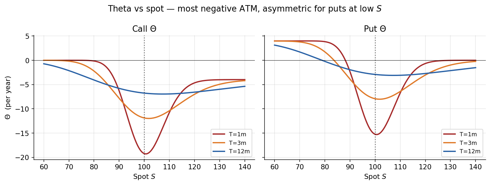

*Call (left) and put (right) theta as a function of spot, at $T=1$m,
$3$m, $12$m.*

Theta is most negative right at the strike — that is where convex
optionality is densest, so the time-decay charge per day is the
largest. The decay accelerates as expiry approaches: the $1$-month
curve is roughly three times deeper than the $12$-month curve. Note
the put-call asymmetry at low spot: the $rKe^{-r\tau}\Phi(\pm d_-)$
discount-funding term flips sign between (7.77)'s call and put
forms, so deep ITM puts can have *positive* theta while deep ITM
calls do not.

### 7.7.2 Rho — the rate sensitivity nobody hedges (until they do)

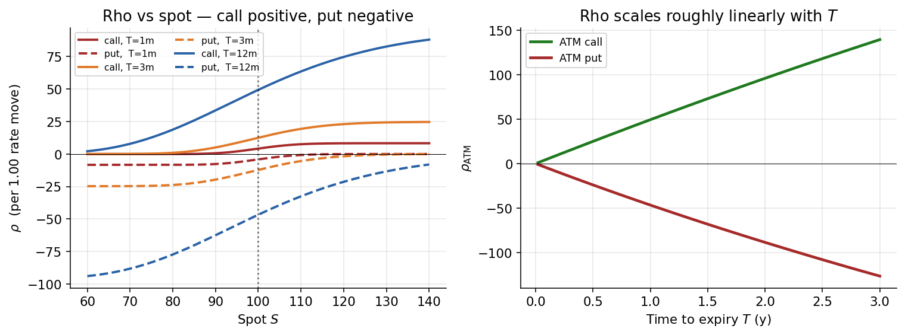

*Left: $\rho$ vs spot for calls (solid) and puts (dashed) at three
maturities. Right: ATM $\rho$ as a function of $T$.*

Calls are long rates, puts are short rates, and the magnitude of
both scales roughly linearly in $T$. For a one-month book, $\rho$
is nearly inert; for a one-year book, a $1\%$ rate shock can move
ATM call value by a third of its premium. Equity-vol traders
typically ignore $\rho$ until they are warehousing LEAPs or running
a structured-products book — at which point a separate IR delta
desk picks it up.

### 7.7.3 Vanna — the cross between spot and vol

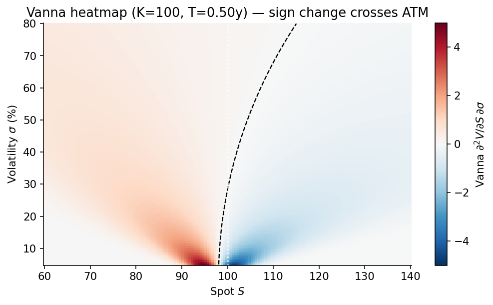

*Heatmap of $\partial^2 V / \partial S\,\partial\sigma$ over spot
and implied vol, with the zero contour drawn in dashed black.*

Vanna is the Greek that links spot moves and vol moves: long-vanna
positions earn when spot and vol move together (skew rallies on
sell-offs). The sign change crosses through the strike — long-call
vanna is *negative* below ATM and *positive* above. Dealers running
exotic books measure vanna because a static vega hedge does not
neutralise it: the first big down-day in the underlying drains
delta into a place where your vega hedge is wrong.

### 7.7.4 Volga — the smile-curvature P&L

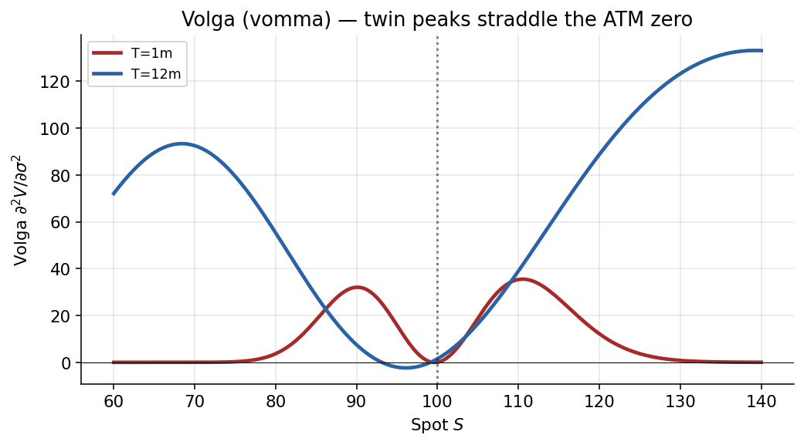

*$\partial^2 V/\partial\sigma^2$ for $T=1$m and $T=12$m.*

Volga has twin peaks straddling the ATM zero — it is highest in the
*wings*, where vega is small but accelerating in $\sigma$. A long
strangle is long volga; that is why traders selling tail vol earn
when realised vol of vol is low and lose when the smile lifts at
the wings. The longer-dated curve sits higher and is wider — vol
convexity needs time to compound.

### 7.7.5 Charm — delta bleed across the weekend

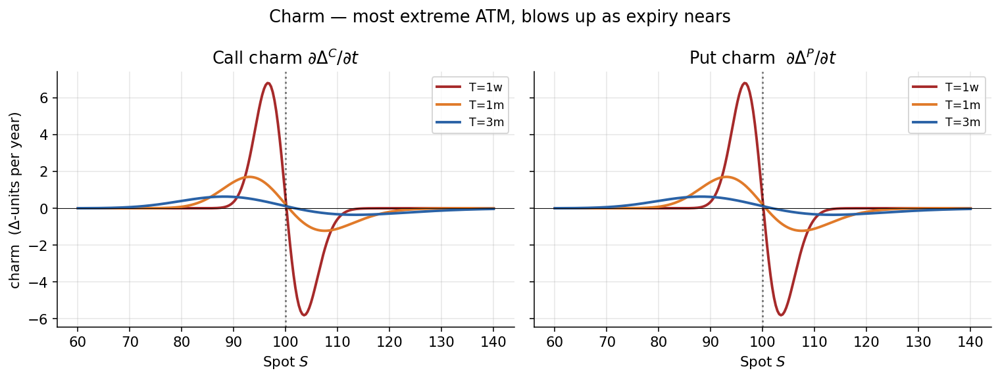

*Charm $=\partial\Delta/\partial t$ for calls (left) and puts (right)
at $T=1$w, $1$m, $3$m.*

Charm tells you how much your delta drifts each day even when spot
holds still. The $1$-week curve is dramatically more extreme than
the $3$-month curve: an OTM option whose delta was $0.30$ on
Friday can be $0.15$ on Monday on a flat tape. Market makers
quote-stuff their gamma desk every morning to absorb the weekend
charm bleed; this is the "overnight delta" that prop traders chase
in the open auction.

### 7.7.6 Speed — gamma's slope

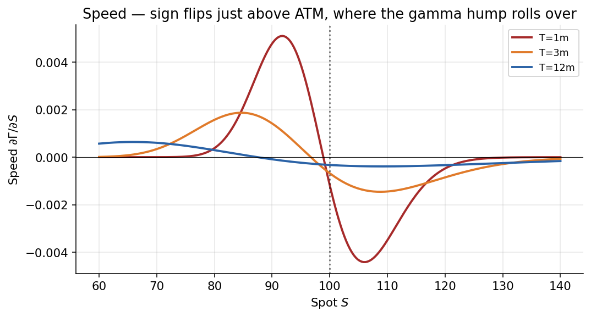

*Speed $=\partial\Gamma/\partial S$ for $T=1$m, $3$m, $12$m.*

Speed is the third derivative of price w.r.t. spot — it changes
sign just above the strike, where the gamma hump rolls over.
Strategies that earn from spot-path *cubic* effects (variance-swap
convexity adjustments, butterfly carry) live on speed. For a
delta-gamma-hedged book, residual P&L from a large spot move is
roughly $\tfrac{1}{6}\,\text{Speed}\,\Delta S^3$.

### 7.7.7 Color — gamma's clock

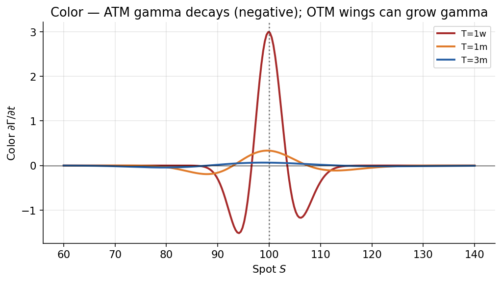

*Color $=\partial\Gamma/\partial t$ for $T=1$w, $1$m, $3$m.*

Color says how fast your gamma is changing through time. ATM color
is sharply *negative* — gamma is the steepest function of $\tau$
right at the strike, so an ATM short-gamma desk leaks gamma into
the close. The OTM wings have *positive* color: those strikes
build gamma as expiry approaches, which is why tail-hedgers buy
them weeks ahead, not days.

### 7.7.8 Black-Scholes price surface

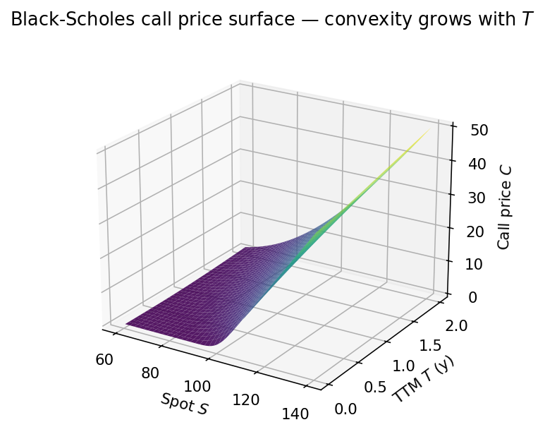

*Call value $C(S, T)$ as a 3D surface; spot in $[60, 140]$, TTM in
$[0.02, 2.0]$.*

The whole chapter so far has been about local first- and
second-order properties of this surface. Stand back and you see the
two pieces of intuition that drive everything: the surface is
*increasing and convex* in spot (positive delta, positive gamma),
and *increasing* in time (positive vega and vega-time product).
Convexity emerges visibly as $T$ grows — a long-dated option is
much smoother than the kinked payoff at expiry.

### 7.7.9 Dollar-gamma — what dealers actually trade

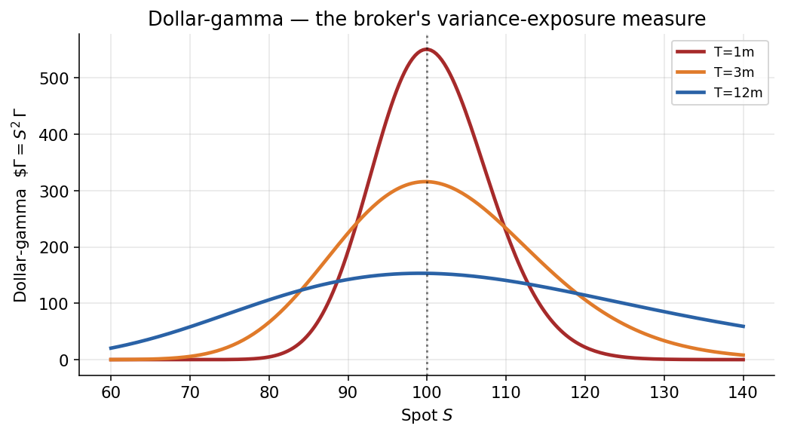

*$\$\Gamma = S^2\,\Gamma$ vs spot at three maturities.*

Vanilla gamma is in (option-units / share$^2$) and depends on the
underlying's price level. Dealers normalise by $S^2$ to get
*dollar-gamma* — the P&L impact of a $1\%$ spot move squared. The
peak shifts very slightly above the strike (because $S^2$ grows
faster than $\Gamma$ falls on the right wing), and it is the
flatter, broader profile that variance-swap and dispersion desks
quote against.

### 7.7.10 The strike ladder — Greeks for an ATM expiry-1m book

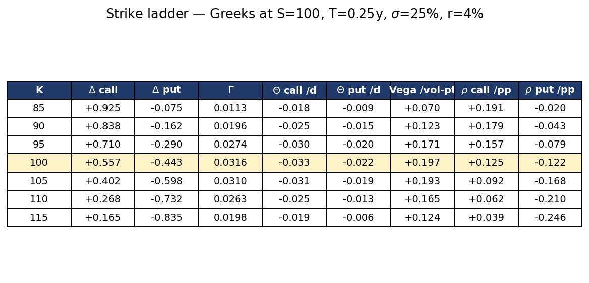

*All major Greeks for calls and puts on a $T=0.25$y, $\sigma=25\%$
book; ATM row highlighted.*

A working trader's screen looks like this table. Note the parity
identities check by inspection: every row has $\Delta^C - \Delta^P
= 1$ (since $q=0$, $e^{-q\tau}=1$) and $\Gamma$ identical for call
and put. Theta and rho do *not* match across call/put — those gaps
are exactly (7.77) and (7.78). The ATM row carries the largest
$\Gamma$, the largest $|\Theta|$, and the largest vega — three
reasons it is also the most expensive line on the screen.

### 7.7.11 Pin risk — the digital-delta blow-up

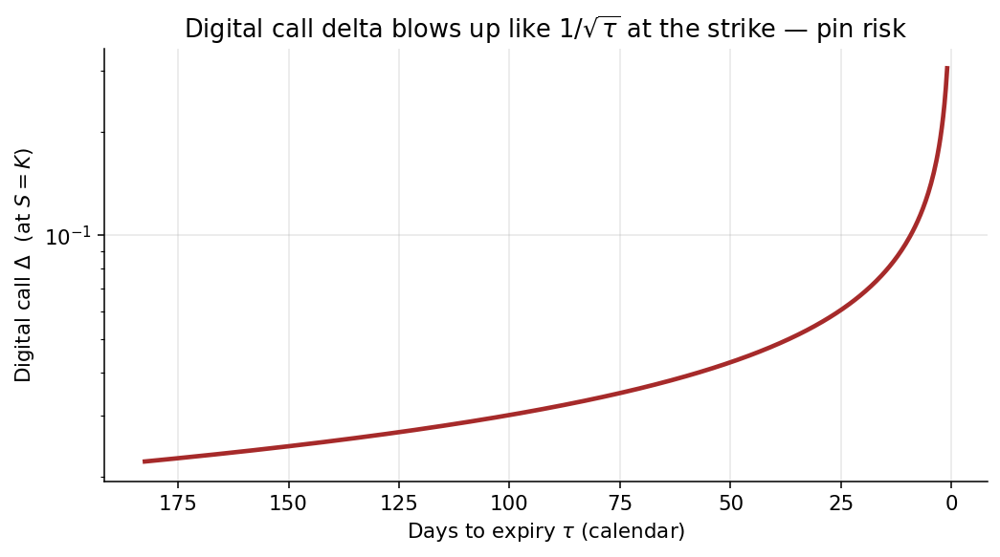

*Delta of a digital call struck at the spot, plotted (log-y) vs
calendar days to expiry.*

A vanilla option's gamma blows up as $1/\sqrt{\tau}$ at the strike;
a *digital* option's delta does. With days running out (x-axis
inverted, expiry on the right), the digital delta — which equals
the $\$1$ size of the payoff times the gamma kernel — explodes by
more than two orders of magnitude in the last week. This is why
short-dated structured-product issuers (autocallables, dual-currency
deposits) cap exposure to single strikes: pin risk in the last hour
is uninsurable in size.

### 7.7.12 Vega across the smile

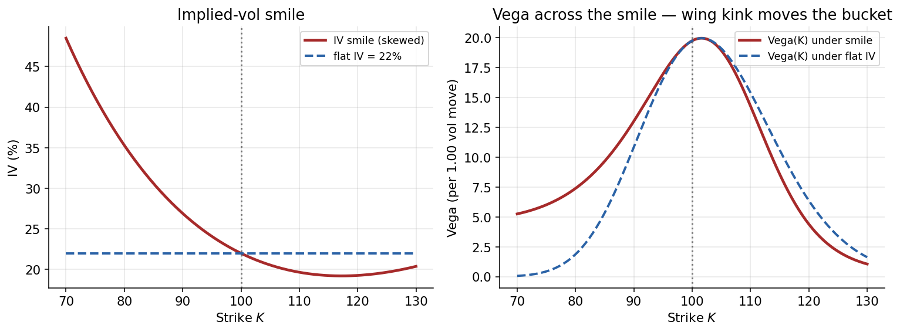

*Left: a parameterised IV smile $\sigma(K)=\sigma_{\rm atm} + a
\log(K/S) + b\log^2(K/S)$ with $a=-0.35$, $b=1.10$. Right: vega per
strike under that smile vs under a flat $22\%$ IV.*

Vega's bell-shape gets *bent* by the smile: down-side strikes (with
elevated IV) carry more vega than the flat-IV baseline would
suggest, and the OTM call wing gets reweighted up by the convex
smile too. Dealer vega exposure does not concentrate where vega
itself is largest in the flat world — it concentrates wherever the
smile is steepest. This is why "vega bucketing by strike" has
replaced "vega bucketing by ATM only" everywhere a real skew
exists.

### 7.7.13 Gamma scalping — the variance-risk-premium picture

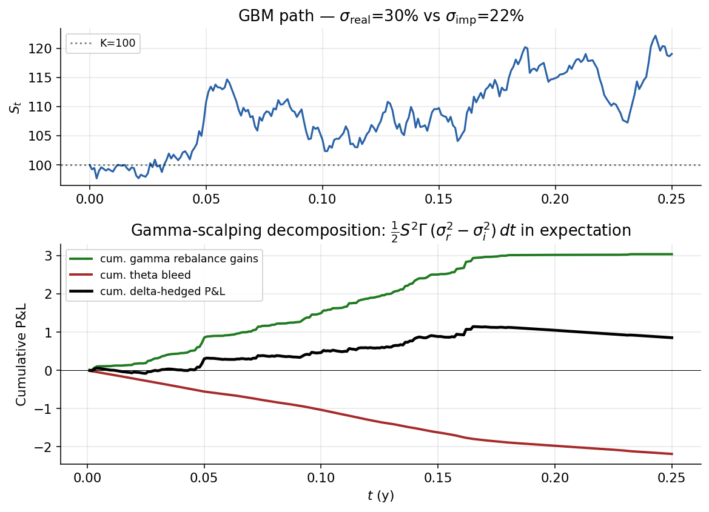

*Top: a Monte Carlo GBM path with $\sigma_{\rm real}=30\%$, hedged
at $\sigma_{\rm imp}=22\%$. Bottom: cumulative theta bleed (red),
cumulative gamma rebalance gains (green), and net delta-hedged P&L
(black).*

This picture is the visual identity behind Section 7.2.8's
variance-risk-premium claim. The dealer is short theta every day at
a rate set by *implied* vol; they earn back $\tfrac12 S^2\Gamma\,
(\Delta S)^2$ at each rebalance, whose expected value scales with
*realised* vol squared. When $\sigma_{\rm real}>\sigma_{\rm imp}$,
green outpaces red and the hedged book earns the difference. When
the inequality flips, the hedger pays for vol they never used. One
sample path looks noisy; ten thousand average to the closed-form
$\tfrac12\int_0^T S_t^2 \Gamma_t (\sigma_{\rm real}^2 - \sigma_{\rm
imp}^2)\,dt$.

---

## 7.8 Key Takeaways

1. **Delta-gamma hedging neutralises two derivatives.** Holding $-\Delta^g$
   shares of stock and $-\gamma$ units of an auxiliary option $h$, with
   $\gamma = \Gamma^g / \Gamma^h$, eliminates both the first-order and
   second-order Taylor terms of the hedged P&L. The residual is cubic in
   $\Delta S$ instead of quadratic, and its standard deviation under
   $N$-grid rebalancing scales as $1/N$ rather than $1/\sqrt{N}$.

2. **Vega is the volatility-input sensitivity, not a tradable Greek.**
   $\mathcal{V} = S\,\sqrt{T-t}\,\Phi'(d_+)$ peaks ATM and decays as
   $\sqrt{T-t}\to 0$. Vega-hedging requires a *second option* with linearly
   independent gamma-vega profile (system 7.36), because volatility itself
   is not a tradable asset under constant-$\sigma$ Black-Scholes.

3. **Continuous-dividend BSM PDE differs only in the drift coefficient.**
   $\partial_t g + (r-q)\,S\,\partial_S g + \tfrac12\sigma^2 S^2\partial_{SS} g = r\,g$.
   The discount rate on the RHS is still $r$ (the option pays nothing in
   the interim), but the risk-neutral drift of $S$ is reduced by $q$.

4. **Forward reformulation collapses the dividend correction.** Defining
   $F_t = S_t e^{(r-q)(T-t)}$, the dividend yield disappears into the
   forward price; the option becomes Black-76 with no drift.

5. **Put-call parity drives the cross-Greek identities.** From
   $C - P = S e^{-q\tau} - K e^{-r\tau}$ we read off
   $\Delta^C - \Delta^P = e^{-q\tau}$, $\Gamma^C = \Gamma^P$,
   $\mathcal V^C = \mathcal V^P$, and the asymmetric theta/rho gaps. These
   identities are *model-free*: they hold in every arbitrage-free model in
   which parity is imposed.

6. **Pin risk is the $1/\sqrt{\tau}$ blow-up of ATM gamma.** As $\tau\downarrow 0$,
   $\Gamma_{\text{ATM}} \sim 1/(K\sigma\sqrt{2\pi\tau})$, so a short ATM option
   on expiry day has a delta that whips between $0$ and $\pm e^{-q\tau}$
   on tiny spot moves. Market makers flatten ATM exposure into the close.

7. **Self-financing is a covariation condition, not a slogan.** The clean
   $\mathrm dV = \alpha\,\mathrm dS + \beta\,\mathrm dM$ requires
   $\mathrm d\alpha_t\,S_t + \mathrm d[\alpha, S]_t +
   \mathrm d\beta_t\,M_t + \mathrm d[\beta, M]_t = 0$. The covariation term
   $\mathrm d[\alpha, S] = \Gamma\,\sigma^2 S^2\,\mathrm dt$ is what
   produces the $\tfrac12\sigma^2 S^2\partial_{SS}$ piece of the BS PDE in
   the first place.

8. **Transaction costs price as a volatility premium.** Leland's
   adjustment $\sigma^2_{\text{Leland}} = \sigma^2 + c\sigma\sqrt{8/(\pi\Delta t)}$
   raises the dealer's effective vol by the spread $c$ and rebalance
   frequency. At $c=1$ bp, daily rebalancing adds $\approx 0.6$ vol points;
   at $c=10$ bp (stressed), the addition jumps to $\approx 6$ points.
   Real prices are BS plus Leland plus XVA plus skew plus liquidity premia.

---

## 7.9 Reference Formulas Appendix

| Label | Formula |
|---|---|
| (7.3) | $\Gamma = \Phi'(d_+)/(S\,\sigma\sqrt{T-t})$,  $\mathcal V = S\sqrt{T-t}\,\Phi'(d_+)$ |
| (7.11) | $\gamma_t = \Gamma^g/\Gamma^h$,  $\alpha_t = \Delta^g - \gamma_t\,\Delta^h$ (delta-gamma hedge weights) |
| (7.29) | $\mathrm{Var}_{\text{delta-only}} \sim \sigma^4 T^2 / N$ (gamma-residual scaling) |
| (7.30) | $\mathrm{Var}_{\text{delta-gamma}} \sim \sigma^6 T^3 / N^2$ (cubic-residual scaling) |
| (7.33) | $\mathcal V_t = S_t\,\sqrt{T-t}\,\Phi'(d_+)$ (vanilla vega) |
| (7.36) | $\big(1,\Delta^{h_1},\Delta^{h_2};0,\Gamma^{h_1},\Gamma^{h_2};0,\mathcal V^{h_1},\mathcal V^{h_2}\big)(\alpha_t,\gamma^1_t,\gamma^2_t)^\top = (\Delta^g,\Gamma^g,\mathcal V^g)^\top$ (delta-gamma-vega match) |
| (7.49) | $\partial_t g + (r-q)\,S\,\partial_S g + \tfrac12\sigma^2 S^2\partial_{SS} g = r\,g$ (BSM PDE with continuous yield) |
| (7.51) | $g(t,S) = S\,e^{-q\tau}\Phi(d_+) - K\,e^{-r\tau}\Phi(d_-)$ (BSM call with dividends) |
| (7.52) | $d_\pm = [\ln(S/K) + (r - q \pm \tfrac12\sigma^2)\tau]/(\sigma\sqrt\tau)$ |
| (7.55) | Black-76 form via $F_t = S_t e^{(r-q)(T-t)}$ — dividend absorbed into forward |
| (7.57) | $\Gamma_t = e^{-q\tau}\Phi'(d_+)/(S\sigma\sqrt\tau)$ (dividend-adjusted gamma) |
| (7.58) | $\mathcal V_t = S\,e^{-q\tau}\sqrt\tau\,\Phi'(d_+)$ (dividend-adjusted vega) |
| (7.66) | $\mathrm d\alpha_t S_t + \mathrm d[\alpha,S]_t + \mathrm d\beta_t M_t + \mathrm d[\beta,M]_t = 0$ (self-financing in covariation form) |
| (7.67) | $\mathrm d[\alpha, S]_t = \Gamma\,\sigma^2 S^2\,\mathrm dt$ (delta-hedge covariation) |
| (7.68) | Self-financing with proportional costs: RHS becomes $-c\,|\mathrm d\alpha_t|S_t - c\,|\mathrm d\gamma_t|h_t$ |
| (7.69) | $\sigma^2_{\text{Leland}} = \sigma^2 + c\,\sigma\,\sqrt{8/(\pi\Delta t)}$ (Leland volatility adjustment) |
| (7.70) | $C(t,S) - P(t,S) = S\,e^{-q\tau} - K\,e^{-r\tau}$ (put-call parity) |
| (7.73) | $\Delta^C - \Delta^P = e^{-q\tau}$ (parity-delta) |
| (7.75) | $\Gamma^C = \Gamma^P = e^{-q\tau}\Phi'(d_+)/(S\sigma\sqrt\tau)$ (parity-gamma) |
| (7.76) | $\mathcal V^C = \mathcal V^P$ (parity-vega) |
| (7.77) | $\Theta^C - \Theta^P = -q\,S\,e^{-q\tau} + r\,K\,e^{-r\tau}$ (parity-theta) |
| (7.78) | $\rho^C - \rho^P = \tau\,K\,e^{-r\tau}$ (parity-rho) |
| (7.79) | Synthetic forward: $C - P = S\,e^{-q\tau} - K\,e^{-r\tau}$ replicates a long forward + short bond |

