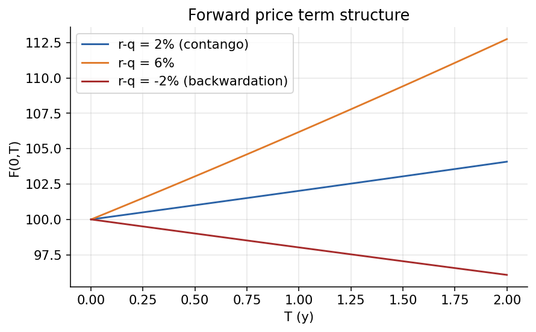
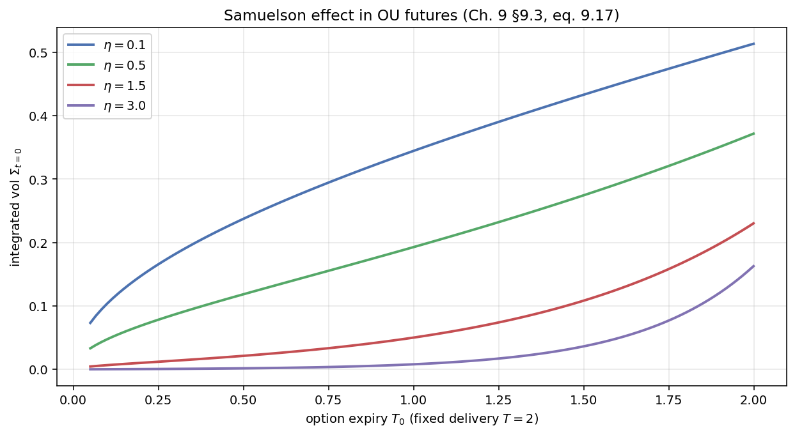
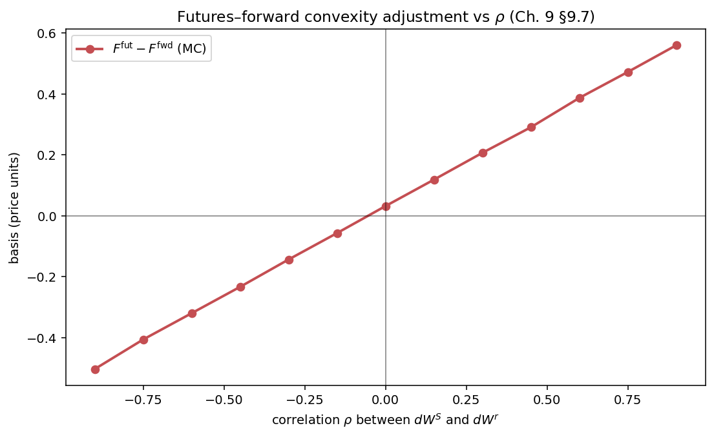

# Chapter 8 — Forwards, Futures, and the Black PDE

A European call on the December S&P 500 futures looks identical to a call on the spot index, but the pricing PDE loses its drift term, the closed form drops a factor of $e^{-rT}$, and the underlying dynamics under $\mathbb{Q}$ are driftless rather than GBM with drift $r$. The reason: *entering a futures position costs nothing*.

This chapter consolidates the self-financing derivation of the Black PDE, the parallel Feynman–Kac argument (Ch. 4), the Bachelier and OU futures examples, the Margrabe exchange option (the cleanest two-asset numeraire change in the guide), and the convexity adjustment between futures and forwards under stochastic rates.

**Notation.** We write $F_t(T)$ for both forward and futures, distinguishing only when needed. Under deterministic rates they are equal (§8.2); under stochastic rates they differ by the §8.11 convexity adjustment. Sections 8.3–8.10 treat them interchangeably; only §8.11 separates them.

---

## 8.1 Forward Price from a Zero-Cost Claim

A *forward contract* signed at time $t$ with delivery at $T$ and strike $K$
is the simplest possible derivative: an obligation to exchange one unit of
the underlying for the pre-agreed cash amount $K$ at maturity. Its terminal
payoff is $S_T - K$ for the long side and $K - S_T$ for the short side. By
the risk-neutral pricing rule developed in Chapter 6, its value at time $t$ is

$$
\Pi_t \;=\; \mathbb{E}^{\mathbb{Q}}\!\left[\,e^{-r(T - t)}(S_T - K)\,\big|\,\mathcal{F}_t\right]. \tag{8.1}
$$

At signing, the strike $K$ is chosen so that $\Pi_t = 0$ — neither
counterparty pays the other to enter. Setting (8.1) to zero and solving
*under the constant-rate assumption*,

$$
K \;=\; \mathbb{E}^{\mathbb{Q}}[\,S_T \mid \mathcal{F}_t\,] \;=\; S_t\,e^{r(T - t)}, \tag{8.2}
$$

where the second equality uses that $S_t\,e^{-rt}$ is a $\mathbb{Q}$-martingale
under the bank-account numeraire (Chapter 5). We call this $K$ the *forward
price at time $t$ for delivery at $T$* and denote it $F^{\text{fwd}}_t(T)$:

$$
F^{\text{fwd}}_t(T) \;=\; S_t\,e^{r(T - t)}. \tag{8.3}
$$

For continuous dividend yield $\delta$, $F^{\text{fwd}}_t(T) = S_t e^{(r-\delta)(T-t)}$. As $t \to T$, $F^{\text{fwd}}_t(T) \to S_T$.

Slope $e^{(r-\delta)(T-t)}$: above 1 means *contango* (forward above spot, $r > \delta$), below 1 means *backwardation* ($\delta > r$). The sign drives commodity-derivative and precious-metal strategies.

**Cash-and-carry.** No-$\mathbb{Q}$ derivation: borrow $S_t$ to buy one share now (loan due $S_t/P(t,T)$ at $T$) or sign a forward (pay strike $K$ at $T$). No-arbitrage forces

$$
F^{\text{fwd}}_t(T) \;=\; \frac{S_t}{P(t,T)}. \tag{8.4}
$$

Under constant rates this reduces to (8.3). The formula depends only on spot and the discount bond — not on volatility, drift, or any view. The forward *price* is a no-arbitrage number; the forward *value* of an existing contract with a stale strike depends on the gap.

*Forward price term structure — cash-and-carry $F^{\text{fwd}}(t,T) = S_t/P(t,T)$ across maturities.*

**Forward price vs value.** The forward *value* of an existing contract with strike $K_0$ is $\Pi_t = (F^{\text{fwd}}_t(T) - K_0) P(t, T)$; the forward *price* is the strike that makes a newly signed contract worth zero. The market quotes the latter; mark-to-market produces the former.

Under the $T$-forward measure $\mathbb{Q}^T$ with numeraire $P(t, T)$, the ratio $S_t/P(t, T) = F^{\text{fwd}}_t(T)$ is a martingale (Ch. 5 with $A = P(\cdot, T)$, $F = S$). This is why forwards admit Black-type formulas even under stochastic rates — under $\mathbb{Q}^T$ the forward is driftless. Used heavily in Ch. 13 for bond options.

**Cost of carry, generalised.** $F^{\text{fwd}} = S/P$ generalises to
other asset classes by adjusting the carry leg:

| Asset class | Net yield / carry | Cash-and-carry forward |
|---|---|---|
| Equity, dividend yield $\delta$ | $\delta$ | $S_t\,e^{(r - \delta)(T-t)}$ |
| FX, foreign rate $r^f$ | $r^f$ | $S_t\,e^{(r - r^f)(T-t)}$ (CIRP) |
| Commodity, conv-yield $y$, storage $u$ | $y - u$ | $S_t\,e^{(r - y + u)(T-t)}$ |
| Income-generating asset, yield $q$ | $q$ | $S_t\,e^{(r - q)(T-t)}$ |

In every case the $\mathbb{Q}$-drift is $r - \text{(net yield)}$; the
formulas of §§8.5–8.11 apply uniformly with appropriate substitution.

---

## 8.2 Forwards vs. Futures — The Role of Daily Settlement

Both are linear delta-one claims, both zero-sum at initiation, both have delta $\approx 1$. The difference: forwards settle at maturity, futures settle daily. That small-looking gap drives different pricing PDEs.

**The forward.** Payoff $S_T - K$, time-$t$ value

$$
\Pi_t \;=\; S_t \;-\; K\,P(t,T), \tag{8.5}
$$

— asset leg $S_t$ ($\mathbb{Q}$-martingale property), cash leg $-K P(t, T)$. P&L accumulates unrealised on the balance sheet and settles at maturity.

**The futures.** Daily settlement of $\mathrm{d}F_t$ into a margin account. Critically,

$$
\text{value of a futures position} \;\equiv\; 0, \tag{8.6}
$$

at every instant by design. Each $\mathrm{d}F_t$ pays out as cash immediately, so the holder's exposure is only to the next price change. Cumulative P&L from inception to $t$ is $F_t(T) - F_0(T)$.

The zero-value property is what makes futures clearable in size with only margin, and what causes the option-pricing PDE to lose one term vs Black–Scholes.

**Margin trace.** Four days, one-lot long:

| $t$ | $F_t(T)$ | $\Delta F$ | Margin cash flow | Cumulative margin |
|---|---|---|---|---|
| 0 | 100 | — | 0 | 0 |
| 1 | 101 | +1 | +1 | +1 |
| 2 | 103 | +2 | +2 | +3 |
| 3 | 99 | -4 | -4 | -1 |

Cumulative margin is always $F_t - F_0$ — the mark-to-market invariant. Continuously, $\int_0^t \mathrm{d}F_s = F_t - F_0$.

Under deterministic rates, forward and futures economics are identical: PV of a cash stream equals PV of a maturity payment when borrowing/lending at $r$ is frictionless. Under stochastic rates, the daily margin earns interest at a stochastic rate that may correlate with $S$ — opening the convexity gap of §8.11.

---

## 8.3 The Futures Price as a $\mathbb{Q}$-Martingale

The futures price itself is a $\mathbb{Q}$-martingale. The argument is tautological given (8.6): a costless position must have zero expected P&L under $\mathbb{Q}$, otherwise free option:

$$
\mathbb{E}^{\mathbb{Q}}\!\left[\,F_{t^+}(T) - F_t(T)\mid \mathcal{F}_t\,\right] \;=\; 0. \tag{8.7}
$$

Equivalently, for all $s \le t$,

$$
\boxed{\;\mathbb{E}^{\mathbb{Q}}\!\bigl[F_t(T) \mid \mathcal{F}_s\bigr] \;=\; F_s(T)\;} \tag{8.8}
$$

— the futures price is a $\mathbb{Q}$-martingale.

**A trio of drifts.** It is worth lining up the three kinds of asset that
appear in this guide and noting the drift each of them takes under $\mathbb{Q}$:

| Asset type | $\mathbb{Q}$-drift | Reason |
|---|---|---|
| *Traded asset* (e.g. a non-dividend stock) | $r\,X_t$ | Discounted price $X_t/M_t$ is a $\mathbb{Q}$-martingale; carry at $r$ |
| *Traded asset with yield $\delta$* | $(r - \delta)\,X_t$ | Discounted total return (price + dividends) is a $\mathbb{Q}$-martingale |
| *Futures quote* $F_t(T)$ | $0$ | Position is costless; expected change under $\mathbb{Q}$ is zero |
| *Non-traded variable* (e.g. temperature) | $\mu^{\mathbb{Q}}_t - \sigma_t\,\lambda_t$ | Needs a market price of risk $\lambda_t$ (Chapter 6) |

The first three rows are pinned by replication arguments. The fourth
requires additional market information — a market price of risk — because
there is no hedgeable instrument that pins the drift. For the rest of this
chapter, the futures price is the canonical example of row 3.

**Forward prices are different.** Contrast (8.8) with the analogous
statement for a *forward* price $F^{\text{fwd}}_t(T) = S_t/P(t,T)$. Under
$\mathbb{Q}$ (bank-account numeraire), $F^{\text{fwd}}_t(T)$ is *not* a
martingale in general — both $S_t$ and $1/P(t,T)$ drift, and their ratio
drifts. The cleanest statement is instead that $F^{\text{fwd}}_t(T)$ is a
$\mathbb{Q}^T$-martingale, where $\mathbb{Q}^T$ is the $T$-forward measure
with numeraire $P(\cdot, T)$. This follows from the general numeraire
identity of Chapter 5: if $A$ is a traded numeraire, every traded asset divided
by $A$ is a $\mathbb{Q}^A$-martingale, and $S_t / P(t,T)$ is precisely such a
ratio. Futures and forwards therefore live in *different measures*: the
futures price is naturally a $\mathbb{Q}$-martingale, the forward price is
naturally a $\mathbb{Q}^T$-martingale. Under deterministic rates the two
measures coincide (their Radon–Nikodym density collapses to 1), so futures
and forwards coincide; under stochastic rates they diverge and the gap is
the convexity adjustment of §8.11.

**A subtle point about "the futures is undiscounted".** It is tempting to
read (8.8) as saying the futures *price* requires no discounting. That is
correct. But an *option on a futures* — whose cash payoff settles at some
maturity $T_0$ — is an ordinary traded derivative whose cash payoff must
be discounted back to today in the usual way. The common pitfall is to
conflate the two: the futures *quote* has no drift under $\mathbb{Q}$, but
the option's *value* still carries the usual discount factor $e^{-r(T_0-t)}$.
The Black '76 formula in §8.7 will make this explicit.

---

## 8.4 Dynamics of the Futures Price Under $\mathbb{Q}$

The martingale property (8.8) fixes the $\mathbb{Q}$-drift of $F_t(T)$ at
zero, but leaves the volatility unspecified. Different market settings
motivate different volatility parameterisations. We postulate a general
form

$$
\mathrm{d}F_t(T) \;=\; \sigma^F(t, F_t(T))\,\mathrm{d}\widehat{W}_t \qquad (\mathbb{Q}\text{-measure}), \tag{8.9}
$$

with $\widehat{W}$ a $\mathbb{Q}$-Brownian motion. The specific functional
form of $\sigma^F(t, F)$ is a modelling choice:

- **GBM.** $\sigma^F(t, F) = \sigma\,F$ yields the log-normal Black '76 model
  of §8.7, which is the market standard for equity-index futures, FX
  forwards, and commodity-futures implied-volatility quotation.
- **Bachelier (arithmetic).** $\sigma^F(t, F) = \sigma$ (constant) yields
  the arithmetic-Brownian model of §8.8, appropriate when $F$ can go
  negative — interest-rate futures near the zero bound, or crude-oil
  futures during the April 2020 episode.
- **Samuelson / OU.** $\sigma^F(t, F) = \sigma\,e^{-\eta(T - t)}$ yields a
  mean-reverting arithmetic model where the vol loading *decays* as one
  looks further forward in the curve — matching the empirical fact that
  long-dated commodity futures move less in absolute terms than front-month
  ones (§8.9).

**Derivation under constant rates.** For the GBM case it is worth showing
that (8.9) with $\sigma^F = \sigma F$ falls out of the spot dynamics plus
the cost-of-carry identity. Suppose the spot satisfies

$$
\frac{\mathrm{d}S_t}{S_t} \;=\; \mu\,\mathrm{d}t \;+\; \sigma\,\mathrm{d}W_t \qquad (\mathbb{P}), \tag{8.10}
$$

and constant rates $r$ apply. The forward/futures price is $F_t(T) =
S_t\,e^{r(T-t)}$. By Itô on $f(t, S) = S\,e^{r(T-t)}$,

$$
\mathrm{d}F_t(T) \;=\; e^{r(T-t)}\,\mathrm{d}S_t \;-\; r\,S_t\,e^{r(T-t)}\,\mathrm{d}t. \tag{8.11}
$$

Expanding $\mathrm{d}S_t = \mu S_t\,\mathrm{d}t + \sigma S_t\,\mathrm{d}W_t$
and using $F_t = S_t\,e^{r(T-t)}$,

$$
\frac{\mathrm{d}F_t(T)}{F_t(T)} \;=\; (\mu - r)\,\mathrm{d}t \;+\; \sigma\,\mathrm{d}W_t \qquad (\mathbb{P}). \tag{8.12}
$$

Under the risk-neutral measure $\mathbb{Q}$, the stock's drift is $\mu = r$
(Chapter 6, market-price-of-risk argument). Substituting,

$$
\boxed{\;\frac{\mathrm{d}F_t(T)}{F_t(T)} \;=\; \sigma\,\mathrm{d}\widehat{W}_t \qquad (\mathbb{Q}).\;} \tag{8.13}
$$

The drift $(\mu - r)\,\mathrm{d}t$ in (8.12) is exactly cancelled under
$\mathbb{Q}$ by the measure change $\mathrm{d}W_t \to \mathrm{d}\widehat{W}_t
+ \lambda\,\mathrm{d}t$ with $\lambda = (\mu - r)/\sigma$ (Girsanov, Chapter 5).
The drift $(\mu - r)$ gets killed; the diffusion $\sigma$ survives. This is
the martingale property (8.8) made explicit at the SDE level. Every drift
term in the spot SDE — whether from physical-world mean-reversion, from
the cost of carry $r$, or from a dividend yield — is absorbed into the
futures quote or vanishes under $\mathbb{Q}$; what survives on the futures
is only the diffusion term.

**Case with dividends.** If the stock pays a continuous yield $\delta$, the
spot drifts at $r - \delta$ under $\mathbb{Q}$, and the cost-of-carry
formula becomes $F_t(T) = S_t\,e^{(r-\delta)(T-t)}$. Applying Itô's product
rule to $F_t = S_t\,g(t)$ with $g(t) = e^{(r-\delta)(T-t)}$, $g'(t) = -(r-\delta) g(t)$:

$$
\begin{aligned}
\mathrm{d}F_t &= g(t)\,\mathrm{d}S_t + S_t\,g'(t)\,\mathrm{d}t \\
&= g(t) S_t\!\left[(r-\delta)\,\mathrm{d}t + \sigma\,\mathrm{d}\widehat{W}_t\right] - (r-\delta) g(t) S_t\,\mathrm{d}t \\
&= \sigma\,g(t) S_t\,\mathrm{d}\widehat{W}_t = \sigma F_t\,\mathrm{d}\widehat{W}_t,
\end{aligned}
$$

so

$$
\boxed{\;\frac{\mathrm{d}F_t(T)}{F_t(T)} \;=\; \sigma\,\mathrm{d}\widehat{W}_t \qquad (\mathbb{Q})\;}.
$$

The $(r-\delta)$-drift of the spot exactly cancels the time-decay of the
carry factor: $F$ is a $\mathbb{Q}$-martingale even with dividends, as the
FTAP on futures (8.8) demands. This is the general principle — any
continuous yield or cost-of-carry term that affects the spot under
$\mathbb{Q}$ gets absorbed into the forward's deterministic drift and
cancels, leaving pure diffusion on the forward/futures quote.

**General dynamics.** For modelling purposes, we often write (8.9) with a
general state- and time-dependent volatility $\sigma^F(t, F)$:

$$
\mathrm{d}F_t(T) \;=\; \sigma^F(t, F_t(T))\,\mathrm{d}\widehat{W}_t. \tag{8.14}
$$

All the machinery of the next three sections works at this level of
generality: the Black PDE, its Feynman–Kac representation, and the
closed-forms for specific choices of $\sigma^F$ are all instances of (8.14).

---

## 8.5 Black PDE for options on futures

A European option on futures has terminal payoff

$$
g_{T_0} \;=\; \varphi\!\big(F_{T_0}(T)\big), \tag{8.15}
$$

with $T_0$ the option exercise and $T \ge T_0$ the futures delivery (typically equal). Because $F$ is a $\mathbb{Q}$-martingale the PDE loses its first-derivative drift. Two derivations: self-financing, and Feynman–Kac.

### 8.5.1 Setup of the replicating portfolio

Let $g_t = g(t, F_t(T))$. Form

$$
V_t \;=\; \alpha_t\,F_t(T) \;+\; \beta_t\,B_t \;-\; g_t, \tag{8.16}
$$

$\alpha_t$ futures contracts (zero cost — notional only), $\beta_t$ cash, $V_0 = 0$. Futures P&L comes entirely from $\alpha_t \mathrm{d}F_t$.

### 8.5.2 Self-financing increment

The wealth change is

$$
\mathrm{d}V_t \;=\; \alpha_t\,\mathrm{d}F_t(T) \;+\; \beta_t\,\mathrm{d}B_t \;-\; \mathrm{d}g_t. \tag{8.18}
$$

Expanding via Itô on $g(t, F)$ and using the driftless dynamics of $F$
under $\mathbb{Q}$,

$$
\mathrm{d}g_t \;=\; \left[\partial_t g \;+\; \tfrac12 (\sigma^F)^2\,\partial_{FF} g\right]\mathrm{d}t \;+\; \sigma^F\,\partial_F g\,\mathrm{d}\widehat{W}_t, \tag{8.19}
$$

so

$$
\mathrm{d}V_t \;=\; \alpha_t\,\sigma^F\,\mathrm{d}\widehat{W}_t \;+\; \beta_t\,r\,B_t\,\mathrm{d}t \;-\; \left[\partial_t g + \tfrac12 (\sigma^F)^2\,\partial_{FF} g\right]\mathrm{d}t \;-\; \sigma^F\,\partial_F g\,\mathrm{d}\widehat{W}_t. \tag{8.20}
$$

### 8.5.3 Eliminating noise and drift

The $\mathrm d\widehat W$ coefficient vanishes iff

$$
\boxed{\;\alpha_t \;=\; \partial_F g(t, F_t(T)),\;} \tag{8.21}
$$

the *futures-delta* hedge — $\partial_F g$ units of futures notional per
option short. With $\alpha_t = \partial_F g$ imposed, the $\mathrm dt$
coefficient in (8.20) is

$$
\mathcal{A}_t \;=\; \beta_t\,r\,B_t \;-\; \partial_t g \;-\; \tfrac12 (\sigma^F)^2\,\partial_{FF} g. \tag{8.22}
$$

From $V_t \equiv 0$ and the zero-value feature of the futures position,
$\beta_t\,B_t = g_t$, so $\beta_t r B_t = r\,g_t$ (eq 8.23). Setting
$\mathcal A_t = 0$ then yields the *Black PDE for options on futures*:

### 8.5.4 The PDE

$$
\boxed{\;\partial_t g \;+\; \tfrac12\,(\sigma^F(t, F))^2\,\partial_{FF} g \;=\; r\,g, \qquad g(T_0, F) = \varphi(F).\;} \tag{8.24}
$$

Compared to the BS PDE for a stock,

$$
\partial_t g \;+\; r\,S\,\partial_S g \;+\; \tfrac12\,\sigma^2 S^2\,\partial_{SS} g \;=\; r\,g,
$$

the drift $r S \partial_S g$ has disappeared — the signature of pricing off a $\mathbb{Q}$-martingale. The $r g$ on the right is still the discount on the option's cash payoff at $T_0$. For $\sigma^F(t, F) = \sigma F$ this becomes

$$
\partial_t g \;+\; \tfrac12\,\sigma^2\,F^2\,\partial_{FF} g \;=\; r\,g, \qquad g(T_0, F) = \varphi(F), \tag{8.25}
$$

the PDE that the Black '76 formula of §8.7 solves.

### 8.5.5 Feynman–Kac representation

Applying Feynman–Kac (Chapter 4) to (8.24) gives the cross-check

$$
\boxed{\;g(t, F) \;=\; \mathbb{E}^{\mathbb{Q}}\!\left[\,e^{-r(T_0 - t)}\,\varphi(F_{T_0}(T))\;\Big|\;F_t(T) = F\,\right],\;} \tag{8.26}
$$

with $F_u$ driftless under $\mathbb{Q}$. Two differences from the stock-BS expectation: zero drift (not $r$), and $e^{-r(T_0-t)}$ on the payoff (cash settles at $T_0$). Under stochastic rates the forward-measure variant

$$
\frac{g(t, F)}{P(t, T_0)} \;=\; \mathbb{E}^{\mathbb{Q}^{T_0}}\!\left[\,\varphi(F_{T_0}(T))\,\big|\,F_t(T) = F\,\right] \tag{8.27}
$$

is the cleaner starting point (Ch. 13). Integrating (8.14) gives the GBM and Bachelier marginals:

$$
F_{T_0}(T) \;=\; F_t(T)\,\exp\!\left\{-\tfrac12 \sigma^2 (T_0 - t) + \sigma\,(\widehat{W}_{T_0} - \widehat{W}_t)\right\} \tag{8.28}
$$

for the log-normal case $\sigma^F = \sigma F$, and

$$
F_{T_0}(T) \;=\; F_t(T) \;+\; \sigma\,(\widehat{W}_{T_0} - \widehat{W}_t) \tag{8.29}
$$

for Bachelier $\sigma^F = \sigma$. In both cases $\mathbb E^{\mathbb Q}[F_{T_0}(T)\mid \mathcal F_t] = F_t(T)$, restating the martingale property
(8.8).

---

## 8.7 The Black '76 Closed Form

For the constant-volatility GBM case $\sigma^F(t, F) = \sigma F$ with
payoff $\varphi(F) = (F - K)_+$, the PDE (8.25) admits the celebrated
*Black '76* closed-form solution:

$$
\boxed{\;g(t, F) \;=\; e^{-r(T_0 - t)}\!\left[\,F\,\Phi(d_+) \;-\; K\,\Phi(d_-)\,\right],\;} \tag{8.30}
$$

with

$$
d_\pm \;=\; \frac{\ln(F/K) \;\pm\; \tfrac12\,\sigma^2\,(T_0 - t)}{\sigma\,\sqrt{T_0 - t}}. \tag{8.31}
$$

**Derivation via Feynman–Kac.** Starting from (8.26) with $\varphi(F) =
(F - K)_+$ and the log-normal law (8.28):

$$
g(t, F) \;=\; e^{-r(T_0 - t)}\,\mathbb{E}^{\mathbb{Q}}\!\left[\,(F_{T_0}(T) - K)_+ \mid F_t(T) = F\,\right].
$$

The expectation is the classical log-normal "call-option" integral, and the
log-variance is $\sigma^2(T_0 - t)$ with log-mean $\ln F - \tfrac12 \sigma^2
(T_0 - t)$. A direct Gaussian computation gives

$$
\mathbb{E}^{\mathbb{Q}}\!\left[(F_{T_0} - K)_+ \mid F_t = F\right] \;=\; F\,\Phi(d_+) \;-\; K\,\Phi(d_-),
$$

and multiplying by the discount $e^{-r(T_0 - t)}$ yields (8.30).

**Comparison to Black–Scholes.** The standard BS formula on a non-dividend
stock is

$$
C^{\text{BS}}(S, K, r, \sigma, \tau) \;=\; S\,\Phi(d_1) \;-\; K\,e^{-r\tau}\,\Phi(d_2),
$$

with $d_{1,2} = [\ln(S/K) + (r \pm \tfrac12 \sigma^2)\tau]/(\sigma\sqrt{\tau})$.
The Black '76 formula (8.30) differs in two readable ways:

| | Black–Scholes (spot) | Black '76 (futures) |
|---|---|---|
| "Moneyness" in $d_\pm$ | $\ln(S/K) + r\tau$ | $\ln(F/K)$ only |
| Coefficient on $\Phi(d_+)$ | $S$ | $e^{-r\tau}\,F$ |
| Coefficient on $\Phi(d_-)$ | $K\,e^{-r\tau}$ | $e^{-r\tau}\,K$ |

The first change reflects the absence of a first-derivative drift term in
the Black PDE — the "cost of carry" $r\tau$ that shifts the moneyness in
BS does not appear in Black '76 because the underlying is already a
martingale. The second change reflects that the futures quote $F$ is
itself undiscounted; to state the option price as a dollar amount today,
we simply discount the whole expression by $e^{-r\tau}$.

**Three observations.** (8.30) is BS with spot replaced by forward and the drift shift dropped. The dividend yield does not appear — it is absorbed into $F$. Plugging $F_t(T) = S_t e^{(r-\delta)(T-t)}$ recovers the dividend-BS formula exactly.

Pitfall: the discount factor is $e^{-r(T_0 - t)}$, not $e^{-r(T-t)}$ — option maturity, not futures delivery. They coincide on standard exchange products but can differ by months on mid-curve options.

Black '76 delta:

$$
\partial_F g \;=\; e^{-r(T_0 - t)}\,\Phi(d_+). \tag{8.32}
$$

vs the BS spot delta $\Phi(d_1)$ — the Black '76 delta carries an extra discount. Hedge $e^{-r(T_0-t)} \Phi(d_+)$ futures per option short. Negligible at short tenors, material on multi-year contracts.

**Black '76 Greeks** (with $\tau = T_0 - t$, $\phi$ the standard-normal PDF):

$$
\begin{aligned}
\Delta \;&=\; \partial_F g \;=\; e^{-r\tau}\,\Phi(d_+), \\
\Gamma \;&=\; \partial_{FF} g \;=\; \frac{e^{-r\tau}\,\phi(d_+)}{F\,\sigma\,\sqrt{\tau}}, \\
\text{Vega} \;&=\; \partial_\sigma g \;=\; e^{-r\tau}\,F\,\phi(d_+)\,\sqrt{\tau}, \\
\Theta \;&=\; \partial_t g \;=\; -\frac{e^{-r\tau}\,F\,\phi(d_+)\,\sigma}{2\sqrt{\tau}} \;+\; r\,e^{-r\tau}\,[F\,\Phi(d_+) - K\,\Phi(d_-)], \\
\rho \;&=\; \partial_r g \;=\; -\tau\,g(t, F).
\end{aligned}
$$

Gamma carries an extra $e^{-r\tau}$ vs BS. Rho is *negative* on a Black '76 call (rate hike discounts the cash payoff more heavily), whereas BS-spot rho is positive — a clean diagnostic for whether a pricing engine treats a contract as spot or futures.

**Numeric.** $F = K = 100$, $\sigma = 20\%$, $\tau = 0.25$, $r = 5\%$. $d_+ = 0.05$, $d_- = -0.05$, $\Phi(\pm 0.05) \approx 0.5199 / 0.4801$. Black '76 price:

$$
g \;=\; e^{-0.05\cdot 0.25}\,[100 \cdot 0.5199 - 100 \cdot 0.4801] \;\approx\; 0.9876 \cdot 3.98 \;\approx\; 3.93.
$$

The analogous BS spot call (same parameters) gives $\approx 4.62$ — higher than Black '76 because the spot drifts at $r > 0$ under $\mathbb{Q}$ while the futures is a martingale. The difference is the drift term cumulating over $\tau$.

**Why Black is ubiquitous.** Beyond literal futures options, Black '76 prices caps, floors, swaptions (Ch. 14), commodity-forward options, and ATM options on forward yield curves. The mechanism is always the same: any underlying that is a martingale under *some* numeraire reduces the PDE to (8.25). In the LIBOR/SOFR caplet setting, $L(t, T_1, T_2)$ is a martingale under the $T_2$-forward measure and the caplet price is Black '76 with $F = L$.

*Drift-cancel schematic — the first-derivative drift term in the Black PDE
vanishes because the futures is a $\mathbb{Q}$-martingale, leaving only the
second-derivative diffusion.*

---

## 8.8 Example — Bachelier Futures and the Arithmetic Binary

The Bachelier model has constant *absolute* volatility, no drift — the natural choice for underlyings that can go negative (short-rate futures near zero, the April 2020 crude episode). It isolates the martingale pricing approach from the mechanics of
log-normal integration, which is pedagogically useful.

Take

$$
\mathrm{d}F_t \;=\; \sigma\,\mathrm{d}\widehat{W}_t \qquad (\mathbb{Q}), \tag{8.33}
$$

with constant absolute volatility $\sigma$, and consider a *binary call*

$$
\varphi(F) \;=\; \mathbf{1}_{\{F > K\}}
$$

— the claim pays 1 unit if the futures is above $K$ at option expiry $T_0$,
zero otherwise. For simplicity we take $r = 0$ in this example so that
no discount factor clutters the formula; the general $r \neq 0$ result
multiplies the answer by $e^{-r(T_0 - t)}$.

### 8.8.1 Terminal distribution

From (8.33),

$$
F_{T_0} - F_t \;=\; \sigma\,(\widehat{W}_{T_0} - \widehat{W}_t), \qquad \widehat{W}_{T_0} - \widehat{W}_t \stackrel{d}{=} \mathcal{N}(0, T_0 - t), \tag{8.34}
$$

so $F_{T_0}$ is conditionally normal with mean $F_t$ (the martingale
property) and variance $\sigma^2\,(T_0 - t)$.

### 8.8.2 Pricing

By Feynman–Kac (8.26) with $r = 0$,

$$
h(t, F) \;=\; \mathbb{E}^{\mathbb{Q}}_{t, F}\!\left[\,\mathbf{1}_{\{F_{T_0} > K\}}\,\right] \;=\; \mathbb{Q}_{t, F}\bigl(F_{T_0} > K\bigr). \tag{8.35}
$$

Writing $F_{T_0} - F_t = \sigma\,(\widehat{W}_{T_0} - \widehat{W}_t)$ and
letting $Z \sim \mathcal{N}(0, 1)$,

$$
h(t, F) \;=\; \mathbb{Q}\!\left(Z \;>\; \frac{K - F}{\sigma\,\sqrt{T_0 - t}}\right) \;=\; \Phi\!\left(\frac{F - K}{\sigma\,\sqrt{T_0 - t}}\right), \tag{8.36}
$$

with $\Phi$ the standard-normal CDF. (For the historically-rooted version
using $\sigma = 2$ that appears in the draft, one simply substitutes
$\sigma = 2$ into (8.36).)

### 8.8.3 Reading the answer

The argument of $\Phi$ in (8.36) is a *$z$-score*: $(F-K)$ in units of the
remaining standard deviation $\sigma\sqrt{T_0-t}$. The price of the digital
is the probability that a standard normal exceeds $-z$. At the money
($F = K$), $\Phi(0) = 1/2$ exactly — a symmetry unique to the arithmetic
model. Under $r \ne 0$, discount the dollar payoff: $h(t,F) = e^{-r(T_0-t)}\,\Phi((F-K)/(\sigma\sqrt{T_0-t}))$.
Terminal limit $T_0 \to t$ collapses $\Phi$ to $\mathbf 1_{\{F>K\}}$,
matching the payoff.

### 8.8.4 Case study: Negative WTI futures, April 20 2020 — when lognormal breaks

*Storage at Cushing was full; longs had to pay to take delivery.*
*Black-76's $\ln F$ is undefined at $F\le 0$; Bachelier's $\mathbb R$-support is.*
*CME switched the official option model from Black-76 to Bachelier the same week.*

**Context.** On Monday 20 April 2020, the front-month NYMEX WTI crude
futures (May 2020 contract, CL K20) settled at *minus* $37.63 per barrel —
the first negative settle in the history of the contract. With physical
delivery at Cushing, Oklahoma scheduled for May 21 and storage there
saturated by collapsed COVID-era demand, holders of long expiring futures
discovered they would have to *pay* to take delivery. Through the day the
contract traded from +$18 to −$40; CME had reprogrammed its trade-matching
engine on Friday 17 April explicitly to accept negative prices, after a
research notice flagged that the legacy Black-76 pricing engines could not
quote options on a contract that might cross zero.

The market structure on the day made the move worse. Open interest in the
May contract was still ~108k lots heading into the final settlement
window with three trading days to expiry — unusual: by convention the
front-month contract rolls down to a few thousand lots before notice. The
overhang was substantially held by long-only commodity ETFs (notably the
United States Oil Fund, USO, which alone held ~25% of front-month OI in
mid-April) that were structurally unable to take delivery. Forced rolling
into a non-buyer market produced a price discovery process that was about
storage logistics, not about the consensus value of a barrel of oil.

**Through the chapter's math.** Black-76 (8.30) requires $F > 0$ because
the lognormal SDE (8.13), $\mathrm dF/F = \sigma\,\mathrm d\widehat W$,
has an absorbing barrier at zero — log-prices are not defined for $F \le
0$ and the formula for $d_\pm$ contains $\ln(F/K)$, which is singular.
Bachelier dynamics (8.34), $\mathrm dF = \sigma\,\mathrm d\widehat W$, are
defined on all of $\mathbb R$: the terminal distribution (8.29) is normal
with mean $F_t$, so negative outcomes are admissible and the binary call
(8.36) is well-defined at every $F$. The choice of model is not
decorative — it determines which prices are even *expressible*. CME
formally switched the official option-pricing methodology for WTI and
several refined-product contracts from Black-76 to Bachelier on Friday
22 April 2020 (Special Executive Report S-8520). By April 2020 every
major commodity desk had migrated WTI option pricing to a Bachelier or
shifted-lognormal engine; the calendar-spread option desks who had not
finished migration booked materially mis-marked positions on the day.

**Lesson.** Model choice is not a stylistic preference but a constraint on
admissible states. A Bachelier model with a 40% *relative* implied vol
(quoted at $F_t = 40$) implies an *absolute* sigma of $\sigma_{\text{abs}}
= 0.40 \cdot 40 = 16$ dollars; a one-month standard deviation is $16 \cdot
\sqrt{1/12} \approx 4.6$ dollars. The May 2020 settle of −$37.63 was
roughly 6–8 absolute sigmas below the prior week's spot — a Bachelier-tail
event, but a *finite-probability* Bachelier-tail event. Black-76, by
contrast, assigned zero probability mass to $F \le 0$ and therefore could
not even represent the realised outcome. The rule of thumb: use Bachelier
(or normal / shifted-lognormal) whenever the underlying has a
non-negligible probability of crossing zero — short-end rates after the
Eurozone NIRP regime, calendar spreads on storable commodities, and any
futures whose deliverable carries non-trivial storage cost. Once a
contract has even a one-percent chance of trading below zero on the
horizon of interest, lognormal is not "approximately right" — it is the
wrong measure space.

---

## 8.9 Example — Ornstein–Uhlenbeck Futures and the Samuelson Effect

The Bachelier model is too simple to describe real commodity or
interest-rate futures markets. Empirically, the *volatility* of the
futures curve is not flat across maturities: long-dated crude futures move
much less in absolute terms than front-month contracts; the same is true
of rates futures, where a hike priced into the December contract barely
perturbs the contract two years out. The empirical name for this pattern
is the *Samuelson effect*, and an OU-type model with a time-decaying
volatility loading $\sigma\,e^{-\eta(T - t)}$ is the cleanest way to
reproduce it.

### 8.9.1 Specification

Under the *physical* measure, the futures is often specified as a
mean-reverting diffusion:

$$
\mathrm{d}F_t(T) \;=\; \kappa\,(\theta - F_t(T))\,\mathrm{d}t \;+\; \sigma\,e^{-\eta(T - t)}\,\mathrm{d}W_t \qquad (\mathbb{P}). \tag{8.37}
$$

But under the risk-neutral measure $\mathbb{Q}$, the martingale property
(8.8) forces the drift to vanish. Girsanov's theorem (Chapter 5) tells us
there is always a measure equivalent to $\mathbb{P}$ that kills any given
drift, and the martingale property of a costless position forces that
measure to be the pricing measure $\mathbb{Q}$. Accordingly, under
$\mathbb{Q}$,

$$
\mathrm{d}F_t(T) \;=\; \sigma\,e^{-\eta(T - t)}\,\mathrm{d}\widehat{W}_t. \tag{8.38}
$$

The mean-reversion drift *was* present in the physical-world dynamics but
*does not need to appear* under $\mathbb{Q}$: the information about
where the futures is heading is already encoded in the initial forward
curve $F_0(T)$ and in the volatility decay $e^{-\eta(T-t)}$. Said
differently, once the market has priced a forward curve that reflects
mean-reversion, the curve itself carries the information, and the
$\mathbb{Q}$-dynamics of each individual futures quote can be driftless
without loss.

### 8.9.2 The Samuelson decay

The economic content of the loading $e^{-\eta(T-t)}$ is the following. A
shock to the spot propagates through to futures of every maturity, but
because the spot itself is mean-reverting, shocks decay before they reach
delivery. A contract with delivery $T$ therefore "sees" only the fraction
$e^{-\eta(T-t)}$ of any time-$t$ shock — the rest has time to mean-revert
back to $\theta$ before delivery. Long-dated contracts sit on the flat
part of the decay curve with a small vol loading; the front month sits on
the steep part. As calendar time $t$ advances and the contract approaches
its own delivery $T$, the exponent $\eta(T - t)$ shrinks toward zero, the
vol loading grows toward $\sigma$, and the futures quote becomes more and
more responsive to spot shocks. That is the Samuelson effect made
quantitative.

*Samuelson decay — the vol loading $\sigma e^{-\eta(T-t)}$ drops with
tenor, so far-dated contracts respond less to same-size shocks than near
contracts.*

### 8.9.3 Terminal distribution

From (8.38),

$$
F_{T_0}(T) - F_t(T) \;=\; \int_t^{T_0} \sigma\,e^{-\eta(T - u)}\,\mathrm{d}\widehat{W}_u. \tag{8.39}
$$

The integrand is deterministic, so the right-hand side is Gaussian with
mean zero. By Itô's isometry, the variance is

$$
\Sigma_t^2 \;=\; \int_t^{T_0} \sigma^2\,e^{-2\eta(T - u)}\,\mathrm{d}u \;=\; \sigma^2\,\frac{e^{-2\eta(T - T_0)} - e^{-2\eta(T - t)}}{2\eta}. \tag{8.40}
$$

Hence

$$
F_{T_0}(T) - F_t(T) \;\sim_{\mathbb{Q}}\; \mathcal{N}(0, \Sigma_t^2), \tag{8.41}
$$

conditional on $\mathcal{F}_t$.

**Reading (8.40).** Formula (8.40) is worth staring at. It encodes the
total variance accumulated by the futures between $t$ (now) and $T_0$
(option expiry), given that delivery is at $T$. There are three dials:

- $\sigma$ is the peak instantaneous vol, attained at delivery ($T = u$);
- $\eta$ is the speed at which long-dated vols decay below that peak;
- the $T - t$ vs $T - T_0$ spacing controls where on the decay curve we
  are integrating.

Two useful limits:

- **$\eta \to 0$.** Expanding the exponentials, $\Sigma_t^2 \to \sigma^2\,(T_0
  - t)$ — ordinary Brownian motion with constant vol. The Samuelson
  decay vanishes.
- **$\eta \to \infty$.** The exponents push the integrand to essentially
  zero everywhere except in a tiny sliver just before $T$, and $\Sigma_t^2
  \to 0$: long-dated futures with infinite decay are stationary and
  have no vol.

Real markets sit in between, with $\eta$ estimated in the range $0.3$ to
$2.0$ per year for many commodities and interest rates.

### 8.9.4 Pricing the binary

For the binary call $\varphi(F) = \mathbf{1}_{\{F > K\}}$ at option expiry
$T_0$, with $r = 0$:

$$
h(t, F) \;=\; \mathbb{Q}_{t, F}(F_{T_0}(T) > K) \;=\; \mathbb{Q}(F_{T_0} - F_t > K - F_t), \tag{8.42}
$$

and writing $F_{T_0} - F_t = \Sigma_t\,Z$ with $Z \sim \mathcal{N}(0, 1)$,

$$
h(t, F) \;=\; \mathbb{Q}\!\left(Z > \frac{K - F}{\Sigma_t}\right) \;=\; \Phi\!\left(\frac{F - K}{\Sigma_t}\right), \tag{8.43}
$$

with $\Sigma_t$ defined in (8.40).

**Structural similarity.** Formula (8.43) has the same structural shape as
the Bachelier binary formula (8.36): both are $\Phi$ of a $(F - K)/\Sigma$
$z$-score. The Samuelson structure is entirely packaged into the single
number $\Sigma_t$. This single-number compression is a feature of the
arithmetic-Brownian world: no matter how baroque the vol surface of the
futures, as long as the SDE is driftless with a deterministic (possibly
time-dependent) vol, the terminal distribution is normal with variance
equal to the integrated instantaneous variance, and any digital-style
payoff prices off $\Phi$ of a single $z$-score.

### 8.9.5 Practical implications and HJM pointer

The variance $\Sigma_t^2$ shrinks as $T - T_0$ grows, so options on
long-dated futures are dramatically cheaper than those on near-dated ones
at otherwise similar parameters. Numerical case: $\sigma = 0.40$, $\eta =
1.0$, $T = 2$, $T_0 = 0.25$, $F_0 = 50$, $K = 55$ gives $\Sigma_0 \approx
0.0309$ — about a sixth of the flat-vol Bachelier $\sigma\sqrt{T_0} = 0.20$.
The OU futures of (8.38) is the single-factor exponentially-decaying-vol
case of the Heath–Jarrow–Morton (HJM) framework; multi-factor HJM models
of the *entire* forward curve are standard in commodity and fixed-income
practice (see Chapter 13 multi-factor short-rate and Chapter 14 LIBOR market models).

---

## 8.10 Margrabe Exchange Option — A Numeraire Change Tour de Force

The Margrabe exchange option is the cleanest testbed for Ch. 5's numeraire-change machinery. A frontal 2-D PDE is painful; a numeraire change reduces it to a 1-D Black–Scholes put with no interest-rate discount visible. Principle: *if the payoff has a natural unit, price in that unit*.

### 8.10.1 Setup

Suppose there are two traded assets $A$ and $B$ with dynamics under the
physical measure

$$
\frac{\mathrm{d}A_t}{A_t} \;=\; \mu^A\,\mathrm{d}t \;+\; \sigma^A\,\mathrm{d}W_t, \qquad
\frac{\mathrm{d}B_t}{B_t} \;=\; \mu^B\,\mathrm{d}t \;+\; \sigma^B\,\mathrm{d}W_t \qquad (\mathbb{P}), \tag{8.44}
$$

driven (for the moment) by the same scalar Brownian $W$. The general
correlated case is handled by (8.55) below. We value the *Margrabe
exchange option* paying

$$
\mathcal{C} \;=\; \max(A_T - B_T,\, 0) \tag{8.45}
$$

A call on $A$ struck at $B$ — or equivalently a put on $B$ struck at $A$. The strike is random, moving with the underlying. Denominate in units of $A$ and the strike becomes the constant 1; the problem collapses to a put on $B/A$ struck at 1.

*Margrabe exchange option payoff surface $\max(A_T - B_T, 0)$ across
$(A_T, B_T)$.*

### 8.10.2 Step 1 — Risk-neutral pricing under $\mathbb{Q}$

First, change measure from $\mathbb{P}$ to the bank-account measure
$\mathbb{Q}$ so that both assets drift at the risk-free rate $r$:

$$
\frac{\mathrm{d}A_t}{A_t} \;=\; r\,\mathrm{d}t \;+\; \sigma^A\,\mathrm{d}W_t^{\mathbb{Q}}, \qquad
\frac{\mathrm{d}B_t}{B_t} \;=\; r\,\mathrm{d}t \;+\; \sigma^B\,\mathrm{d}W_t^{\mathbb{Q}}. \tag{8.46}
$$

(Girsanov's theorem from Chapter 5 guarantees such a measure exists, with drift
shifts $\lambda^A = (\mu^A - r)/\sigma^A$ and $\lambda^B = (\mu^B -
r)/\sigma^B$. When the same $W$ drives both, consistency requires
$\lambda^A = \lambda^B$ — the market-price-of-risk condition of Chapter 6.)

The risk-neutral price is

$$
f(t, A, B) \;=\; \mathbb{E}^{\mathbb{Q}}_{t, A, B}\!\left[\,(A_T - B_T)_+\,e^{-r(T - t)}\,\right]. \tag{8.47}
$$

Trying to evaluate (8.47) directly requires a two-dimensional log-normal
integral in $(A_T, B_T)$ — feasible but not elegant.

### 8.10.3 Step 2 — Change numeraire to $A$

Divide both sides of (8.47) by $A_t$. By the general numeraire-pricing
identity of Chapter 5,

$$
\frac{f(t, A, B)}{A_t} \;=\; \mathbb{E}^{\mathbb{Q}^A}_{t, A, B}\!\left[\,\frac{(A_T - B_T)_+}{A_T}\,\right] \;=\; \mathbb{E}^{\mathbb{Q}^A}_{t, A, B}\!\left[\,\Bigl(1 - \tfrac{B_T}{A_T}\Bigr)_+\,\right], \tag{8.48}
$$

where $\mathbb{Q}^A$ is the measure with numeraire $A$ — under which
every traded asset divided by $A$ is a martingale. The Radon–Nikodym
density is $\mathrm{d}\mathbb{Q}^A / \mathrm{d}\mathbb{Q} = (A_T/A_0)/(M_T/M_0)$,
as derived in Chapter 5.

Dividing by $A_t$ reinterprets "price" as "shares of $A$." The price-in-$A$ is a $\mathbb{Q}^A$-martingale, killing the discount entirely. What remains is a put on $X_T = B_T/A_T$ struck at 1 — a one-dimensional problem. Define

$$
X_t \;\equiv\; \frac{B_t}{A_t}, \tag{8.49}
$$

which, being the price of the traded asset $B$ expressed in numeraire $A$,
is a $\mathbb{Q}^A$-martingale.

### 8.10.4 Step 3 — Dynamics of $X_t$ under $\mathbb{Q}^A$

To evaluate (8.48) we need the SDE for $X_t$ under $\mathbb{Q}^A$. The
Girsanov shift from $\mathbb{Q}$ to $\mathbb{Q}^A$, derived in Chapter 5, is

$$
\mathrm{d}W_t^{\mathbb{Q}} \;=\; \sigma^A\,\mathrm{d}t \;+\; \mathrm{d}W_t^A, \tag{8.50}
$$

i.e. the $\mathbb{Q}$-Brownian picks up a drift equal to the volatility
loading of the numeraire $A$ when viewed under $\mathbb{Q}^A$.

Compute $\mathrm{d}(1/A_t)$ via Itô on $f(A) = 1/A$, with $f' = -1/A^2$,
$f'' = 2/A^3$:

$$
\mathrm{d}\!\left(\frac{1}{A_t}\right) \;=\; -\frac{\mathrm{d}A_t}{A_t^2} \;+\; \tfrac12 \cdot \frac{2}{A_t^3}\,(\sigma^A A_t)^2\,\mathrm{d}t \;=\; \frac{1}{A_t}\bigl[((\sigma^A)^2 - r)\,\mathrm{d}t \;-\; \sigma^A\,\mathrm{d}W_t^{\mathbb{Q}}\bigr]. \tag{8.51}
$$

Then, using the Itô product rule on $X_t = B_t \cdot (1/A_t)$ with
covariation $\mathrm{d}[B, 1/A]_t = -(B_t/A_t)\,\sigma^A \sigma^B\,\mathrm{d}t$,

$$
\mathrm{d}\!\left(\frac{B_t}{A_t}\right) \;=\; \frac{B_t}{A_t}\bigl(r\,\mathrm{d}t + \sigma^B\,\mathrm{d}W_t^{\mathbb{Q}}\bigr) \;+\; \frac{B_t}{A_t}\bigl[((\sigma^A)^2 - r)\,\mathrm{d}t - \sigma^A\,\mathrm{d}W_t^{\mathbb{Q}}\bigr] \;-\; \frac{B_t}{A_t}\,\sigma^A \sigma^B\,\mathrm{d}t. \tag{8.52}
$$

Collecting $\mathrm{d}t$ and $\mathrm{d}W_t^{\mathbb{Q}}$ terms,

$$
\mathrm{d}\!\left(\frac{B_t}{A_t}\right) \;=\; \frac{B_t}{A_t}\Bigl\{\bigl[(\sigma^A)^2 - \sigma^A \sigma^B\bigr]\,\mathrm{d}t \;+\; (\sigma^B - \sigma^A)\,\mathrm{d}W_t^{\mathbb{Q}}\Bigr\}. \tag{8.53}
$$

Now substitute (8.50) $\mathrm{d}W_t^{\mathbb{Q}} = \sigma^A\,\mathrm{d}t +
\mathrm{d}W_t^A$:

$$
\mathrm{d}\!\left(\frac{B_t}{A_t}\right) \;=\; \frac{B_t}{A_t}\Bigl\{\underbrace{\bigl[(\sigma^A)^2 - \sigma^A \sigma^B + (\sigma^B - \sigma^A)\sigma^A\bigr]}_{\;=\; 0}\,\mathrm{d}t \;+\; (\sigma^B - \sigma^A)\,\mathrm{d}W_t^A\Bigr\}, \tag{8.54}
$$

confirming that $X_t = B_t/A_t$ is a $\mathbb{Q}^A$-martingale, and

$$
\boxed{\;\frac{\mathrm{d}X_t}{X_t} \;=\; (\sigma^B - \sigma^A)\,\mathrm{d}W_t^A.\;} \tag{8.55}
$$

$X$ is GBM with zero drift (forced by the numeraire property) and *relative* vol $\sigma^B - \sigma^A$. When $A$ and $B$ have the same vol and Brownian, the ratio is deterministic and the option degenerates.

### 8.10.5 Correlated case

In the general correlated case with two distinct Brownians $W^{(1)}, W^{(2)}$
of correlation $\rho$,

$$
\frac{\mathrm{d}A_t}{A_t} \;=\; r\,\mathrm{d}t + \sigma^A\,\mathrm{d}W^{(1)}_t, \qquad
\frac{\mathrm{d}B_t}{B_t} \;=\; r\,\mathrm{d}t + \sigma^B\,\mathrm{d}W^{(2)}_t, \qquad \mathrm{d}\langle W^{(1)}, W^{(2)}\rangle_t = \rho\,\mathrm{d}t,
$$

the same Itô calculation yields $\mathrm{d}X_t / X_t = \hat{\sigma}\,\mathrm{d}W^A_t$
with

$$
\boxed{\;\hat{\sigma}^2 \;=\; (\sigma^A)^2 \;-\; 2\rho\,\sigma^A \sigma^B \;+\; (\sigma^B)^2.\;} \tag{8.56}
$$

The scalar-BM result (8.55) is the special case $\rho = +1$ with both assets
driven by the *same* $W$, which collapses (8.56) to $\hat{\sigma}^2 =
(\sigma^B - \sigma^A)^2$ and hence $\hat{\sigma} = |\sigma^B - \sigma^A|$.

**Reading (8.56).** The only inter-asset interaction that matters is correlation — not individual drifts or levels. $\rho \to +1$: $\hat{\sigma}^2 \to (\sigma^A - \sigma^B)^2$, lockstep assets cannot diverge, option is cheap. $\rho \to -1$: $\hat{\sigma}^2 \to (\sigma^A + \sigma^B)^2$, maximally divergent, option is expensive. Correlation is the pricing input — more than vol — which is why dispersion traders obsess over it.

*Margrabe price as a function of correlation $\rho$ — option value
increases monotonically as $\rho$ decreases, since divergent assets
maximise the expected spread.*

### 8.10.6 Step 4 — The Margrabe formula

Since $X_t$ is a geometric Brownian motion under $\mathbb{Q}^A$ with
volatility $\hat{\sigma}$ and *no drift*, the inner expectation in (8.48)
is a Black–Scholes put on $X$ struck at 1 with $r = 0$ (no discount under
the martingale measure):

$$
\frac{f_t}{A_t} \;=\; \Phi(d_+) \;-\; \frac{B_t}{A_t}\,\Phi(d_-), \qquad d_\pm \;=\; \frac{-\ln(B_t/A_t) \pm \tfrac12 \hat{\sigma}^2 (T - t)}{\hat{\sigma}\,\sqrt{T - t}}. \tag{8.57}
$$

Rearranging into the familiar Margrabe form,

$$
\boxed{\;f_t \;=\; A_t\,\Phi(d_1) \;-\; B_t\,\Phi(d_2),\;} \qquad d_1 \;=\; \frac{\ln(A_t/B_t) + \tfrac12 \hat{\sigma}^2 (T - t)}{\hat{\sigma}\,\sqrt{T - t}}, \quad d_2 \;=\; d_1 - \hat{\sigma}\,\sqrt{T - t}. \tag{8.58}
$$

No discounting appears because we priced under $\mathbb{Q}^A$ and the
payoff is denominated in units of $A$; the numeraire absorbs the interest
rate.

### 8.10.7 Reading (8.58)

The formula is BS in disguise: $S \to A$, $K e^{-rT} \to B$, $\sigma \to
\hat\sigma$. Margrabe sees only the *ratio* $A/B$, not absolute levels;
ATM is $A_t = B_t$. Higher $\rho$ shrinks $\hat\sigma$, so the option is
cheapest when the two underlyings are clones; the degenerate limit
$\rho = 1, \sigma^A = \sigma^B$ gives $\hat\sigma = 0$ and the option
collapses to its intrinsic $\max(A_t - B_t, 0)$.

### 8.10.9 Worked numerical example

Take $A_0 = B_0 = 100$ (ATM), $\sigma^A = 0.25$, $\sigma^B = 0.30$, $\rho
= 0.6$, $T = 1$ year, $r = 3\%$. Then

$$
\hat{\sigma}^2 \;=\; 0.25^2 - 2 \cdot 0.6 \cdot 0.25 \cdot 0.30 + 0.30^2 \;=\; 0.0625 - 0.09 + 0.09 \;=\; 0.0625,
$$

so $\hat{\sigma} = 0.25$. $d_1 = 0.125$, $d_2 = -0.125$, $\Phi \approx 0.5497/0.4503$:

$$
f_0 \;=\; 100 \cdot 0.5497 \;-\; 100 \cdot 0.4503 \;=\; 9.94.
$$

No discount factor — the numeraire-change magic of (8.58). Now flip $\rho \to -0.6$:

$$
\hat{\sigma}^2 \;=\; 0.0625 + 0.09 + 0.09 \;=\; 0.2425, \qquad \hat{\sigma} \;\approx\; 0.4924.
$$

Spread vol nearly doubles, price rises to $\approx 19.5$ — flipping $\rho$ from $+0.6$ to $-0.6$ doubles the fair price. This is the relationship dispersion desks live by.

### 8.10.10 Generalisations and pitfalls

Stochastic vol in either leg pushes (8.58) into characteristic-function /
MC territory; best-of $\max(A_T, B_T, C_T)$ has no closed-form analogue
(Stulz 1982, Johnson 1987); dividend yields adjust the drifts but leave the
formula intact. *Pitfall:* the $\sigma^A, \sigma^B$ in (8.56) must be
loadings on the *same* Brownian components; for two independent Brownians
($\rho = 0$) the spread vol reduces to the Pythagorean sum $\hat\sigma =
\sqrt{(\sigma^A)^2 + (\sigma^B)^2}$.

---

## 8.11 Futures vs Forward — Convexity Adjustment Under Stochastic Rates

Under stochastic rates, futures and forwards differ by a convexity adjustment whose sign tracks $\mathrm{Cov}^{\mathbb{Q}}(r_t, S_t)$.

### 8.11.1 The intuition

Bob is long a futures, Alice is long a forward (same $T$, same final exposure). Bob receives daily MTM cash; Alice does not. With $\mathrm{Cov}(r, S) > 0$, on Bob's up-days rates are high (reinvest at high rate); on his down-days rates are low (finance at low rate). Bob wins on the timing asymmetry, so the fair futures price must sit *above* the forward at inception. Negative correlation flips it. Deterministic rates or zero correlation: the two coincide.

### 8.11.2 The formula

Under $\mathbb{Q}$, $F^{\text{fut}}$ is a martingale (§8.3); under $\mathbb{Q}^T$, $F^{\text{fwd}}$ is. Conditional expectations:

$$
F^{\text{fut}}(t, T) \;=\; \mathbb{E}^{\mathbb{Q}}_t[S_T], \qquad
F^{\text{fwd}}(t, T) \;=\; \mathbb{E}^{\mathbb{Q}^T}_t[S_T] \;=\; \frac{\mathbb{E}^{\mathbb{Q}}_t\!\left[S_T\,e^{-\int_t^T r_u\,\mathrm{d}u}\right]}{P(t, T)}. \tag{8.59}
$$

Their difference is the convexity adjustment. By the identity
$\mathrm{Cov}(X, Y) = \mathbb{E}[XY] - \mathbb{E}[X]\mathbb{E}[Y]$ applied
to the inner expectation, one obtains

$$
F^{\text{fut}}(t, T) \;-\; F^{\text{fwd}}(t, T) \;=\; \frac{1}{P(t, T)}\,\mathrm{Cov}^{\mathbb{Q}}_t\!\left(S_T,\,1 - e^{-\int_t^T r_u\,\mathrm{d}u}\right), \tag{8.60}
$$

which to leading order in the covariance is approximately

$$
F^{\text{fut}}(t, T) \;-\; F^{\text{fwd}}(t, T) \;\approx\; \int_t^T\!\!\int_t^T \mathrm{Cov}^{\mathbb{Q}}_t\bigl(\mathrm{d}\ln S_u,\,r_v\,\mathrm{d}v\bigr). \tag{8.61}
$$

### 8.11.3 The sign rule

| Regime | Relation |
|---|---|
| $r$ deterministic | $F^{\text{fut}}(t, T) = F^{\text{fwd}}(t, T) = S_t / P(t, T)$ |
| $r$ stochastic, $\mathrm{Cov}^{\mathbb{Q}}(r_t, F^{\text{fut}}_t) = 0$ | $F^{\text{fut}} = F^{\text{fwd}}$ |
| $r$ stochastic, positive correlation | $F^{\text{fut}} > F^{\text{fwd}}$ |
| $r$ stochastic, negative correlation | $F^{\text{fut}} < F^{\text{fwd}}$ |

The two measures — bank-account and $T$-forward — coincide iff $P(t, T)$
is deterministic. When they coincide, so do the expectations.

*Futures-forward basis under stochastic rates — positive $r$–$S$
correlation pushes the basis positive, negative correlation pushes it
negative. The magnitude is controlled by rate volatility and the tenor.*

### 8.11.4 Magnitudes in practice

How big is the convexity adjustment? A rough rule of thumb:

- **Short-dated eurodollar / SOFR futures.** Here the underlying rate and
  the reinvestment rate are both tied to the same short-rate curve, so
  $\rho \approx 1$ and the correlation effect is maximal. The adjustment
  can reach several basis points and is routinely quoted and hedged by
  rates desks. Dedicated convexity-adjustment calculators are standard in
  rates-trading software.
- **Long-dated equity index futures.** Correlation between equity returns
  and rates is modest, rate vols are low, and the adjustment is typically
  small (a few basis points on a multi-year contract). Still, for
  institutional hedgers running multi-billion-dollar exposures, a few
  basis points can matter.
- **FX futures.** Non-trivial because of the "quanto" correlation between
  the FX rate and the domestic short rate. The formula (8.61) is still the
  starting point, but the practitioner's job is to specify a model
  (typically Hull–White for the short rate, log-normal for FX, with a
  correlation $\rho$ between them) and evaluate the double integral
  analytically.

### 8.11.5 The deeper reading

The convexity adjustment is a *measure-change effect*: $F^{\text{fut}}$
and $F^{\text{fwd}}$ are both martingales but under different measures
(bank account vs $T$-forward), and those measures diverge whenever rates
are stochastic. The same structural pattern reappears for CMS convexity
(Chapter 13) and quanto adjustments under FX.

### 8.11.6 A Hull–White closed-form approximation

Writing down a concrete convexity-adjustment number requires a model for
both $S$ and $r$. The most common textbook choice is to take $S$
log-normal and $r$ Hull–White (Chapter 12), with a constant correlation $\rho$
between the Brownians. Under that model, Hull (2018) gives the
approximation

$$
\ln F^{\text{fut}}(t, T) - \ln F^{\text{fwd}}(t, T) \;\approx\; \rho\,\sigma_S\,\sigma_r\,\frac{(T - t)^2}{2},
$$

where $\sigma_S$ is the spot volatility and $\sigma_r$ is the short-rate
vol. The quadratic-in-tenor scaling is characteristic of convexity
adjustments: over short tenors the effect is negligible, but it grows
quickly with maturity. For eurodollar/SOFR futures with $\sigma_r \approx
0.01$ (1% absolute rate vol), $\sigma_S \approx 0.0025$ (own-vol for a
short rate), $\rho \approx 1$, and $T - t = 5$ years, the adjustment is
roughly $1 \cdot 0.01 \cdot 0.0025 \cdot 12.5 = 0.0003$ or 3 basis
points — a number that matches practitioner quotations for multi-year
eurodollar convexity adjustments.

### 8.11.7 Hedging implications

Dealers running futures-vs-forward basis books mark to the evolving
convexity adjustment daily; the basis's sensitivity to rate vol is the
*vega of the convexity adjustment*, and is a standard rate-vol-desk
diagnostic.

---

## 8.12 Key Takeaways

1. **Forward price.** The fair forward strike $F^{\text{fwd}}_t(T) = S_t /
   P(t, T)$ is pinned by cash-and-carry no-arbitrage, independent of
   volatility or any statistical properties of $S$. Under constant rates
   this reduces to $S_t\,e^{r(T - t)}$; with a dividend yield, to
   $S_t\,e^{(r - \delta)(T - t)}$.

2. **Forwards vs futures.** Forwards settle at maturity; futures settle
   daily. The futures position is zero-valued at every instant by design
   (daily MTM absorbs every infinitesimal gain/loss immediately), while the
   forward's value drifts with the spot until maturity. This
   zero-value feature is why the futures price is a $\mathbb{Q}$-martingale
   and why the Black PDE has no first-derivative drift term.

3. **Three drifts under $\mathbb{Q}$.**
   - Traded asset: drift $r\,X_t$.
   - Traded asset with yield $\delta$: drift $(r - \delta)\,X_t$.
   - Futures quote: drift $0$ (costless position).

4. **Dynamics of $F_t$ under $\mathbb{Q}$.** $\mathrm{d}F_t(T) = \sigma^F(t,
   F)\,\mathrm{d}\widehat{W}_t$ with no drift. Specific choices of
   $\sigma^F$ yield GBM (constant relative vol, used in Black '76),
   Bachelier (constant absolute vol, used when $F$ can go negative), and
   Samuelson/OU (time-decaying vol loading, used for commodity futures).

5. **Black PDE.** For an option $g(t, F)$ on a futures with payoff
   $\varphi(F_{T_0})$,

   $$
   \partial_t g \;+\; \tfrac12\,(\sigma^F)^2\,\partial_{FF} g \;=\; r\,g, \qquad g(T_0, F) = \varphi(F).
   $$

   The missing $r\,F\,\partial_F g$ term is the signature of
   martingale-underlying pricing. The $r\,g$ discount term remains because
   the option's dollar payoff still settles at $T_0$.

6. **Feynman–Kac cross-check.** The Black PDE has the stochastic
   representation $g(t, F) = \mathbb{E}^{\mathbb{Q}}[\,e^{-r(T_0 -
   t)}\,\varphi(F_{T_0})\,|\,F_t = F\,]$ with $F_u$ satisfying the
   driftless SDE under $\mathbb{Q}$.

7. **Black '76 closed form.** For log-normal futures with constant
   relative vol $\sigma$ and a call payoff,

   $$
   g(t, F) \;=\; e^{-r(T_0 - t)}\,[F\,\Phi(d_+) \;-\; K\,\Phi(d_-)], \qquad d_\pm \;=\; \frac{\ln(F/K) \pm \tfrac12 \sigma^2 (T_0 - t)}{\sigma\,\sqrt{T_0 - t}}.
   $$

   Structurally, Black '76 is BS with $S \to F$, $r \to 0$ in $d_\pm$, and
   an overall discount $e^{-r(T_0 - t)}$.

8. **Bachelier binary.** Under $\mathrm{d}F_t = \sigma\,\mathrm{d}\widehat{W}_t$,
   a digital call prices as $\Phi((F - K)/(\sigma\,\sqrt{T_0 - t}))$. At
   the money ($F = K$), the price is exactly $1/2$ — a symmetry unique to
   the arithmetic model.

9. **Samuelson / OU futures.** Under $\mathrm{d}F_t = \sigma\,e^{-\eta(T -
   t)}\,\mathrm{d}\widehat{W}_t$, terminal variance is
   $\Sigma_t^2 = \sigma^2\,(e^{-2\eta(T - T_0)} - e^{-2\eta(T -
   t)})/(2\eta)$ and a digital call prices as $\Phi((F - K)/\Sigma_t)$.
   Long-dated futures have smaller $\Sigma_t$ than short-dated ones — the
   Samuelson effect.

10. **Margrabe exchange option.** Under numeraire $A$, the ratio $X_t =
    B_t/A_t$ is a martingale with vol $\hat{\sigma} =
    \sqrt{(\sigma^A)^2 - 2\rho\,\sigma^A\sigma^B + (\sigma^B)^2}$,
    yielding $f_t = A_t\,\Phi(d_1) - B_t\,\Phi(d_2)$. No discount factor
    appears because the numeraire absorbs interest. Correlation $\rho$,
    not individual drifts or levels, determines the option value.

11. **Futures vs forward convexity.** Under stochastic rates,
    $F^{\text{fut}} - F^{\text{fwd}}$ is a covariance of $S_T$ with the
    rate-path discount factor, proportional to $\mathrm{Cov}^{\mathbb{Q}}(r,
    S)$ in the leading-order limit. Positive correlation pushes the
    futures price above the forward; negative correlation pushes it
    below. Under deterministic rates, the two prices coincide.

12. **Numeraire is the theme.** The futures price is natural under
    $\mathbb{Q}$; the forward price is natural under $\mathbb{Q}^T$; the
    Margrabe exchange option is natural under one of its own legs. Each
    "naturalness" is an invitation to change measure; accepting the
    invitation collapses the pricing problem, while refusing it forces one
    to grind through a PDE that did not need to be set up.

---

## Appendix — Reference Formulas

| Label | Formula |
|---|---|
| (8.3) | $F^{\text{fwd}}_t(T) = S_t\,e^{r(T - t)}$ (constant rates, no dividend) |
| (8.4) | $F^{\text{fwd}}_t(T) = S_t / P(t, T)$ (cash-and-carry, any rates) |
| (8.8) | $\mathbb{E}^{\mathbb{Q}}[F_t(T) \mid \mathcal{F}_s] = F_s(T)$ (futures is a $\mathbb{Q}$-martingale) |
| (8.9) | $\mathrm{d}F_t(T) = \sigma^F(t, F_t(T))\,\mathrm{d}\widehat{W}_t$ (general futures SDE under $\mathbb{Q}$) |
| (8.13) | $\mathrm{d}F_t/F_t = \sigma\,\mathrm{d}\widehat{W}_t$ (log-normal futures under $\mathbb{Q}$) |
| (8.21) | $\alpha_t = \partial_F g(t, F_t)$ (futures-delta hedge) |
| (8.24) | $\partial_t g + \tfrac12(\sigma^F)^2\,\partial_{FF} g = r\,g$, $g(T_0, F) = \varphi(F)$ (Black PDE) |
| (8.26) | $g(t, F) = \mathbb{E}^{\mathbb{Q}}[\,e^{-r(T_0 - t)}\,\varphi(F_{T_0})\,\|\,F_t = F\,]$ (Feynman–Kac) |
| (8.30) | $g = e^{-r(T_0 - t)}[F\,\Phi(d_+) - K\,\Phi(d_-)]$ (Black '76 call) |
| (8.31) | $d_\pm = [\ln(F/K) \pm \tfrac12\sigma^2(T_0 - t)]/(\sigma\sqrt{T_0 - t})$ |
| (8.32) | $\partial_F g = e^{-r(T_0 - t)}\,\Phi(d_+)$ (Black '76 delta) |
| (8.36) | Bachelier binary: $h(t, F) = \Phi((F - K)/(\sigma\,\sqrt{T_0 - t}))$ |
| (8.40) | Samuelson variance: $\Sigma_t^2 = \sigma^2\,(e^{-2\eta(T - T_0)} - e^{-2\eta(T - t)})/(2\eta)$ |
| (8.43) | OU binary: $h(t, F) = \Phi((F - K)/\Sigma_t)$ |
| (8.55) | $\mathrm{d}X_t/X_t = (\sigma^B - \sigma^A)\,\mathrm{d}W_t^A$ (Margrabe ratio dynamics, scalar BM) |
| (8.56) | $\hat{\sigma}^2 = (\sigma^A)^2 - 2\rho\,\sigma^A\sigma^B + (\sigma^B)^2$ (Margrabe spread vol) |
| (8.58) | Margrabe: $f_t = A_t\,\Phi(d_1) - B_t\,\Phi(d_2)$ |
| (8.60) | $F^{\text{fut}} - F^{\text{fwd}} = \mathrm{Cov}^{\mathbb{Q}}_t(S_T,\,1 - e^{-\int r})\,/\,P(t, T)$ |
| (8.61) | Convexity $\approx \int_t^T\!\int_t^T \mathrm{Cov}^{\mathbb{Q}}_t(\mathrm{d}\ln S_u,\,r_v\,\mathrm{d}v)$ |

