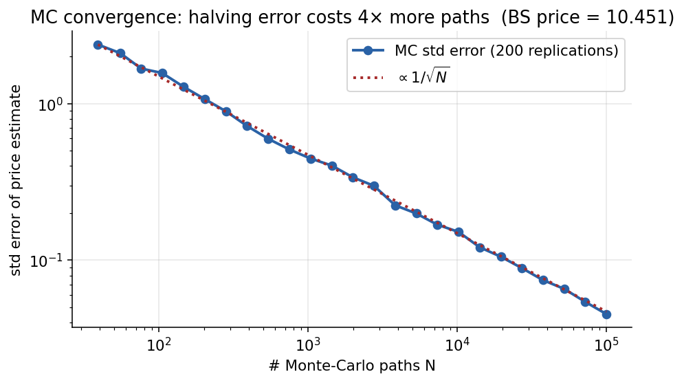
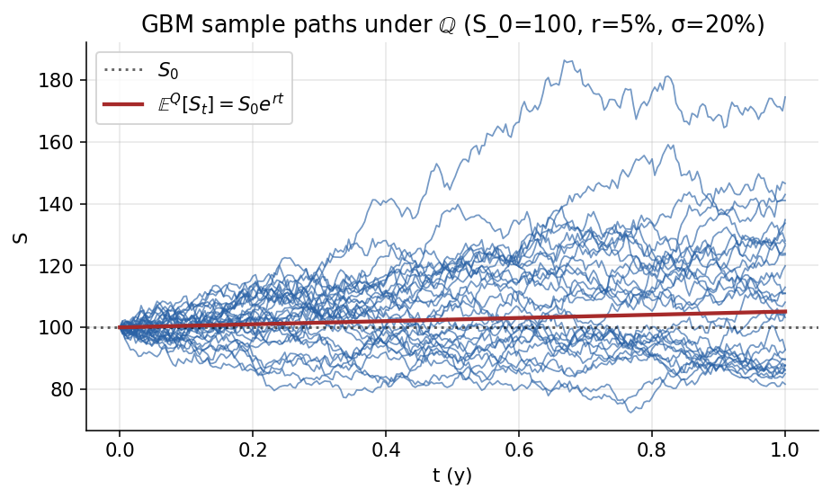
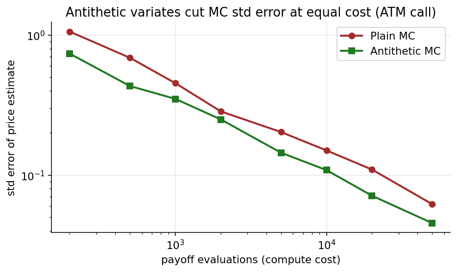

# Chapter 9 — Monte Carlo, Path-Dependent, and Forward-Starting Options

The simulation counterpart to lattice pricing (Ch. 2) and PDE pricing (Ch. 6). Closed forms cover only a short list of vanillas; everything else — Asians, lookbacks, cliquets, autocallables, baskets, stoch-vol, jump-diffusions, local-vol surfaces — needs numerical pricing. Monte Carlo works in any dimension, handles any payoff, and parallelises trivially; its only cost is statistical noise.

We motivate MC via the curse of dimensionality, build the GBM path generator (exact, by the Ch. 6 Itô solution), and apply it to European warm-ups, forward-starting cliquets (where iterated conditioning gives a closed form), and barrier options (the prototypical path-dependent payoff). Along the way we hit discretisation bias and the Brownian-bridge correction. The chapter closes with antithetic and control-variate variance reduction — bridging to the Heston Monte Carlo of Ch. 10.

Out of scope: stratified sampling, importance sampling, quasi-MC, pathwise/LR Greek estimators, Longstaff–Schwartz for American exotics. The focus is a working production-grade pricer for European and path-dependent claims.

---

## 9.1 Why Monte Carlo? Quadrature and the Curse of Dimensionality

The pricing integral $V_0 = e^{-rT}\,\mathbb{E}^{\mathbb{Q}}[\varphi(\cdot)]$ can be evaluated by quadrature in low dimensions ($O(h^p)$ error). In high dimensions, quadrature dies: for a daily-monitored 1-year single-asset option, $d = 252$ and even $N = 2$ points/dim gives $2^{252} \approx 10^{75}$ — beyond any computer.

Monte Carlo's sample-mean error scales as $M^{-1/2}$ *regardless of dimension*. Total cost $O(Md)$ vs $O(N^d)$ for quadrature. Break-even is $d \approx 4$–$6$; everything realistic lives above that.

The flip side: MC is statistical. Always report the standard error; deterministic methods give bounds, MC gives confidence intervals.

A production pricer has four sub-problems:

1. **Path generation under $\mathbb{Q}$.** Given the chosen risk-neutral model — GBM, Heston, local-vol, jump-diffusion, etc. — produce paths whose law matches the specification. For GBM the exact lognormal increment of §9.4 gives a bias-free generator; for general SDEs one falls back on Euler–Maruyama or Milstein schemes with their associated discretisation biases.
2. **Variance reduction.** Reduce the sample variance so that fewer paths suffice to achieve a target confidence-interval width. Antithetic variates, control variates, stratified sampling, importance sampling, and quasi-random sequences each contribute.
3. **Path-dependent payoffs.** Many payoffs depend on the whole path: running maximum (lookback), running average (Asian), barrier-crossing indicator (knock-in/out), basket constraints. Efficient data structures and careful handling of between-grid events (Brownian-bridge correction for barriers) are central.
4. **Sensitivity estimation (Greeks).** Delta, gamma, vega, and other Greeks must come out of the same path sample, ideally with pathwise or likelihood-ratio estimators rather than finite-difference bump-and-reprice. We will touch on this briefly but not in depth.

This chapter covers (1)–(3); Greek estimation (4) is a subdiscipline left to Ch. 10 and the literature.

---

## 9.2 The Strong Law of Large Numbers

Let $X^{(1)}, \dots, X^{(M)}$ be i.i.d. copies of $X$ with $\mathbb{E}|X| < \infty$. Then

$$
\lim_{M\to +\infty}\; \frac{X^{(1)} + X^{(2)} + \cdots + X^{(M)}}{M} \;=\; \mathbb{E}[X] \qquad \text{(strong law, a.s.).}
\tag{9.1}
$$

SLLN is the licence for MC pricing: enough i.i.d. payoff draws converge a.s. to $\mathbb{E}^{\mathbb{Q}}[\text{payoff}]$. Bounded payoffs (puts capped at $K$, digitals at 1) and polynomially-growing payoffs on lognormal underlyings satisfy the integrability hypothesis trivially; the pathological case is heavy-tailed (Cauchy-like) variables, where the sample mean inherits the heavy tail and never converges.

$L^2$ integrability gives the CLT:

$$
\sqrt{M}\,\bigl(\widehat{m}_M - \mathbb{E}[X]\bigr) \;\xrightarrow{d}\; \mathcal{N}\bigl(0,\;\mathbb{V}[X]\bigr),
\tag{9.2}
$$

— the basis for the $\widehat{m}_M \pm 1.96\,\widehat{\sigma}_{m_1}$ 95% CI. Problem cases are reciprocals/roots of the underlying, stoch-vol near the Feller boundary (Ch. 10), and unbounded-horizon integrals.

---

## 9.3 Sample Mean, Sample Variance, and the Monte-Carlo Standard Error

We estimate $m_1 := \mathbb{E}[X]$ by the finite sample

$$
\widehat{m}_1 \;=\; \frac{1}{M}\,\sum_{m=1}^{M}\, X^{(m)} \qquad \text{(sample mean).}
\tag{9.3}
$$

The sample mean is unbiased ($\mathbb{E}[\widehat{m}_1] = \mathbb{E}[X]$) because expectation is linear, and has variance

$$
\mathbb{V}[\widehat{m}_1] \;=\; \frac{1}{M^2}\sum_{m=1}^M \mathbb{V}[X^{(m)}] \;=\; \frac{\mathbb{V}[X]}{M},
\tag{9.4}
$$

using independence of the draws. The standard deviation of the sample mean is therefore $\sigma_{m_1} = \mathrm{sd}[X]/\sqrt{M}$. Since $\sigma_{m_1}$ depends on the unknown population variance, we estimate it by the sample-variance-based standard error

$$
\widehat{\sigma}_{m_1} \;=\; \frac{1}{\sqrt{M}}\!\left(\,\frac{1}{M-1}\sum_{m=1}^{M}\!\left(X^{(m)} - \widehat{m}_1\right)^2\,\right)^{\!1/2}.
\tag{9.5}
$$

Two notes on (9.5): the inner bracket has Bessel's $M-1$ divisor (unbiased sample variance); the outer $\sqrt{M}$ converts the sample SD into the SD of the *sample mean* — easy to confuse.

$M^{-1/2}$ convergence: halving the error bar costs $4\times$ more paths, three to four significant figures costs $100\times$, four to five $10{,}000\times$. This is why variance reduction matters (§9.8).

*Empirical verification of the $M^{-1/2}$ rate. The standard deviation of the sample-mean estimator across 200 replications of an ATM European-call MC price, plotted against path count $M$ on log-log axes, tracks the $1/\sqrt{M}$ reference line over five decades. Variance reduction (§9.8) changes the constant, not the slope.*

Concrete error budget. ATM 1-year call, $S_0 = K = 100$, $r = 5\%$, $\sigma = 20\%$. BS value $\approx 10.45$, payoff std-dev $\approx 14$. With $M = 10{,}000$, SE $= 14/\sqrt{10{,}000} = 0.14$, 95% CI

$$
10.45 \pm 1.96\cdot 0.14 \;=\; [10.17,\; 10.73].
$$

For four-digit accuracy: $M = (14/0.01)^2 \approx 2$M paths. Doable in seconds, but variance reduction earns its keep within a few million.

Trader ballparks:

- A standard-error budget of $0.1$ on an option worth $\sim 10$ is typically acceptable for a trading indication. That is $M\sim 20{,}000$ paths for a vanilla European call at typical parameters.
- A standard-error budget of $0.01$ on a portfolio-level MC risk calculation is typically required for capital numbers. That is $M\sim 2{,}000{,}000$ paths, an order of magnitude more effort.
- Pathwise sensitivities (deltas, gammas) typically have standard deviations $2$–$5\times$ higher than the price itself, so Greek estimation at fixed MC budget is $4\times$–$25\times$ noisier than price estimation at the same budget. Practitioners either run more paths for Greeks or use variance-reduction techniques more aggressively on Greeks than on prices.

The SE is an estimate of an estimate; the Gaussian CI is asymptotic. Small $M$ → use Student-$t$. Badly non-Gaussian payoffs (heavy-OTM, rare-trigger barriers) → bootstrap rather than trust a symmetric CI.

---

## 9.4 The Lognormal GBM Path Generator

The path generator produces $\{S_{t_n}\}$ from the $\mathbb{Q}$-law. For GBM the generator is *exact* at grid points (no discretisation bias) because Ch. 6 solved the SDE in closed form.

*Thirty risk-neutral GBM paths for $S_0 = 100$, $r = 5\%$, $\sigma = 20\%$, $T = 1\text{y}$. The red curve is $\mathbb{E}^{\mathbb{Q}}[S_t] = S_0 e^{rt}$, the risk-neutral expected trajectory. Monte-Carlo pricing averages discounted payoffs over such paths; each path contributes one term of the sample mean (9.3).*

### 9.4.1 Exact lognormal increment

Under $\mathbb{Q}$,

$$
\mathrm{d} S_t \;=\; r\,S_t\,\mathrm{d} t \;+\; \sigma\,S_t\,\mathrm{d} W_t^{\mathbb{Q}},
\tag{9.6}
$$

Itô on $\ln S_t$:

$$
\mathrm{d}\ln S_t \;=\; \bigl(r - \tfrac{1}{2}\sigma^2\bigr)\,\mathrm{d} t \;+\; \sigma\,\mathrm{d} W_t^{\mathbb{Q}},
\tag{9.7}
$$

and integrating from $t_{n-1}$ to $t_n$,

$$
\ln S_{t_n} - \ln S_{t_{n-1}} \;=\; \bigl(r - \tfrac{1}{2}\sigma^2\bigr)\,\Delta t_n \;+\; \sigma\,\bigl(W^{\mathbb{Q}}_{t_n} - W^{\mathbb{Q}}_{t_{n-1}}\bigr),
\tag{9.8}
$$

with $\Delta t_n := t_n - t_{n-1}$ and the Brownian increment exactly Gaussian, independent of history. Exponentiating gives

$$
S_{t_n} \;=\; S_{t_{n-1}}\,\exp\!\Bigl\{\bigl(r - \tfrac{1}{2}\sigma^2\bigr)\,\Delta t_n \;+\; \sigma\sqrt{\Delta t_n}\,Z_n\Bigr\},
\qquad Z_1, Z_2, \dots \stackrel{\text{iid}}{\sim}_{\mathbb{Q}} \mathcal{N}(0,1).
\tag{9.9}
$$

The universal GBM generator. At grid points the law is exactly GBM — no discretisation bias. Between grid points the discrete path is a log-linear interpolation; for payoffs that care (barriers, lookbacks) a correction is needed (§9.7).

For non-GBM SDEs the increment is Gaussian only in the $\Delta t \to 0$ limit; Euler–Maruyama has weak error $O(\Delta t)$ and strong error $O(\sqrt{\Delta t})$. Milstein upgrades strong to $O(\Delta t)$ via a second-order Itô correction. Strong order matters for individual-realisation path-dependent payoffs.

### 9.4.2 Monte-Carlo estimator for European claims

For a European claim with payoff $\varphi(S_T)$ the MC estimator is the direct sample-average translation of the SLLN:

$$
\widehat{V}_0 \;=\; e^{-rT}\cdot \frac{1}{M}\sum_{m=1}^{M}\, \varphi\!\left(S_0\,e^{(r-\tfrac{1}{2}\sigma^2)T \;+\; \sigma\sqrt{T}\,Z^{(m)}}\right),
\qquad Z^{(m)} \stackrel{\text{iid}}{\sim}_{\mathbb{Q}} \mathcal{N}(0,1).
\tag{9.10}
$$

Only the terminal value $S_T$ enters, so we do not even need a grid — a single Gaussian draw per path suffices. This is the computationally cheapest non-trivial Monte-Carlo pricer and is useful mainly as a sanity check against Black–Scholes and as a warm-up for the path-dependent cases below.

<!-- TODO V5: move to Chapter 3 §3.4A -->
### 9.4.3 Euler–Maruyama and Milstein for non-GBM SDEs

For Heston, local-vol, and jump-diffusion (Ch. 10) the exact lognormal increment is unavailable. Euler–Maruyama freezes coefficients at the left endpoint:

$$
X_{t_n} \;\approx\; X_{t_{n-1}} \;+\; \mu(X_{t_{n-1}})\,\Delta t_n \;+\; \sigma(X_{t_{n-1}})\sqrt{\Delta t_n}\,Z_n.
$$

Weak rate $O(\Delta t)$, strong rate $O(\sqrt{\Delta t})$. Milstein adds a second-order Itô correction $\tfrac12 \sigma \sigma' \Delta t_n (Z_n^2 - 1)$ and upgrades the strong rate to $O(\Delta t)$. For constant diffusion ($\sigma' = 0$) both coincide.

The Heston variance process $\mathrm{d} v_t = \kappa(\theta - v_t)\mathrm{d}t + \xi\sqrt{v_t}\mathrm{d} W_t$ has $\sigma(v) = \xi\sqrt{v}$, non-differentiable at $0$; naive Euler produces negative variance. Standard fixes: full-truncation or Andersen's QE scheme (Ch. 10). Whenever a closed-form exact simulator exists (GBM, OU, CIR, Vasicek), prefer it over Euler.

### 9.4.4 Additive log-space simulation

Simulating $\ln S_{t_n}$ additively,

$$
\ln S_{t_n} \;=\; \ln S_{t_{n-1}} + (r - \tfrac{1}{2}\sigma^2)\,\Delta t_n \;+\; \sigma\sqrt{\Delta t_n}\,Z_n,
\tag{9.11}
$$

is algebraically identical but numerically more stable on very-long-dated structures (no underflow at small $S$). Production pricers typically work in log-space.

### 9.4.5 Correlation of time-slices along a single path

For two times $T_1 < T_2$ on the same GBM path,

$$
\mathbb{C}\!\left[S_{T_1}, S_{T_2}\right] \;=\; \operatorname{Cov}^{\mathbb{Q}}\!\left(S_{T_1}, S_{T_2}\right),
\qquad
\rho\!\left[S_{T_1}, S_{T_2}\right] \;=\; \frac{\mathbb{C}\!\left[S_{T_1}, S_{T_2}\right]}{\bigl(\mathbb{V}[S_{T_1}]\,\mathbb{V}[S_{T_2}]\bigr)^{1/2}}.
\tag{9.12}
$$

$S_{T_2} = S_{T_1} \exp\{(r - \tfrac12\sigma^2)(T_2 - T_1) + \sigma\sqrt{T_2 - T_1}\,Z'\}$ with $Z'$ independent of $\mathcal{F}_{T_1}$. Log-price covariance $= \sigma^2 \min(T_1, T_2) = \sigma^2 T_1$, so

$$
\rho\!\left[\ln S_{T_1}, \ln S_{T_2}\right] \;=\; \frac{\sigma^2 T_1}{\sqrt{\sigma^2 T_1 \cdot \sigma^2 T_2}} \;=\; \sqrt{T_1/T_2}.
$$

At $T_1/T_2 = 0.5$, correlation $\approx 0.707$; at $0.1$, $\approx 0.316$. *Levels* are log-normally (not linearly) correlated.

Independence of disjoint increments — $W_{T_2} - W_{T_1} \perp \mathcal{F}_{T_1}$ — is what makes path-dependent pricing tractable. §9.6 uses this in its sharpest form.

<!-- figure placeholder (see figures/ch10-*.png): a simulated path S_t on (t, S) axes with two vertical dashed lines at T_1 and T_2, sampled dots S_{T_1}, S_{T_2}, arrow labelled Z_1 from S_0 to S_{T_1}, arrow labelled Z_3 from S_{T_1} to S_{T_2} — emphasises independence of Z_1 and Z_3. -->

---

## 9.5 Sanity Check: European Call by Monte Carlo

The MC pricer for a European call gives no new information (BS is closed-form), but it verifies the mechanics: RNG, drift sign, discount factor.

$S_0 = K = 100$, $r = 5\%$, $\sigma = 20\%$, $T = 1$. BS gives $\approx 10.45$.

Draw $M = 10{,}000$ standard normals; compute $S_T^{(m)} = 100 e^{0.03 + 0.2 Z^{(m)}}$, $X^{(m)} = e^{-0.05}(S_T^{(m)} - 100)_+$. Sample mean $\approx 10.43$, SE $\approx 0.14$, 95% CI brackets 10.45. Doubling $M$ to 40k halves SE to 0.07.

The most common bug in home-grown pricers is dropping or sign-flipping the $-\tfrac12\sigma^2$ Itô correction — the bias persists at any $M$ because it is in the drift, not the noise. SE bars shrink, the estimate converges to a wrong number. Run the BS sanity check first.

Variance-reduction calibration: antithetic variates drop SE from 0.14 to ~0.10 (variance reduction $\approx 2$); a stock-price control variate (expectation $S_0 e^{rT} \approx 105.13$ known exactly) drops it another factor of 3–5. Combined, SE at $M = 10{,}000$ falls to ~0.02 — equivalent to $\sim 500{,}000$ raw paths. A 50× speedup for a handful of extra lines.

---

## 9.6 Forward-Starting (Cliquet) Options

Forward-starting options are path-dependent (payoff at two times, not one) but structured enough that iterated conditioning gives a closed form. The derivation is the atom of cliquet pricing and a clean example of independence-of-increments turning a 2-D problem into two 1-D Black–Scholes integrals.

### 9.6.1 Definition

A forward-starting call is an exotic whose strike is set at an intermediate date $T_1$ as a fraction $\alpha$ of the then-prevailing spot. The payoff at maturity $T_2 > T_1$ is

$$
\varphi \;=\; \bigl(S_{T_2} - \alpha\, S_{T_1}\bigr)_+, \qquad (x)_+ := \max(x, 0).
\tag{9.13}
$$

The strike is stochastic through $S_{T_1}$.

Economic motivation: protection *relative to wherever the market is when protection kicks in*. A 12-leg monthly cliquet chains 12 forward-starts, each leg paying the month's return above zero. Locally-capped globally-floored cliquets are a popular retail structured-note. Cliquets are sensitive to *forward volatility* — a natural vol-of-vol vehicle.

### 9.6.2 Vanilla Black–Scholes recap

Black–Scholes is the inner-loop building block for the cliquet:

$$
V_0 \;=\; e^{-rT}\,\mathbb{E}^{\mathbb{Q}}\bigl[(S_T - K)_+\bigr] \;=\; S_0\,\Phi(d_+) \;-\; K\,e^{-rT}\,\Phi(d_-),
\tag{9.14}
$$

$$
d_\pm \;=\; \frac{\ln(S_0 / K) + \bigl(r \pm \tfrac{1}{2}\sigma^2\bigr)T}{\sigma\sqrt{T}}.
\tag{9.15}
$$

### 9.6.3 Reparameterising on two time-slices

Rewrite $(S_{T_1}, S_{T_2})$ via independent disjoint-interval Brownian increments — what enables iterated conditioning to factor the joint integral.

$$
S_{T_1} \;=\; S_0\,e^{(r - \tfrac{1}{2}\sigma^2)T_1 \;+\; \sigma\sqrt{T_1}\,Z_1}, \qquad Z_1 \sim_{\mathbb{Q}} \mathcal{N}(0,1),
\tag{9.16}
$$

$$
S_{T_2} \;=\; S_0\,e^{(r - \tfrac{1}{2}\sigma^2)T_2 \;+\; \sigma\sqrt{T_2}\,Z_2}, \qquad Z_2 \sim_{\mathbb{Q}} \mathcal{N}(0,1),
\tag{9.17}
$$

with $(Z_1, Z_2)$ correlated. The equivalent independent-increment factorisation is

$$
S_{T_1} \;\stackrel{d}{=}\; S_0\,e^{(r - \tfrac{1}{2}\sigma^2)T_1 \;+\; \sigma\sqrt{T_1}\,Z_1},
\tag{9.18}
$$

$$
S_{T_2} \;\stackrel{d}{=}\; S_{T_1}\cdot e^{(r - \tfrac{1}{2}\sigma^2)(T_2 - T_1) \;+\; \sigma\sqrt{T_2 - T_1}\,Z_3}, \qquad Z_3 \sim_{\mathbb{Q}} \mathcal{N}(0,1), \quad Z_1 \perp Z_3.
\tag{9.19}
$$

$Z_1, Z_3$ independent — increments over disjoint intervals — what makes the inner and outer expectations below factor cleanly.

### 9.6.4 Iterated conditional expectation

Tower property:

$$
V_0 \;=\; e^{-rT_2}\,\mathbb{E}^{\mathbb{Q}}\!\left[\,(S_{T_2} - \alpha\,S_{T_1})_+\,\right] \;=\; e^{-rT_2}\,\mathbb{E}^{\mathbb{Q}}\!\left[\,\mathbb{E}^{\mathbb{Q}}\!\left[\,(S_{T_2} - \alpha\,S_{T_1})_+\,\bigm|\, S_{T_1}\,\right]\,\right].
\tag{9.20}
$$

Split the discounts so the inner expectation is a Black–Scholes price discounted from $T_2$ to $T_1$:

$$
V_0 \;=\; e^{-rT_1}\,\mathbb{E}^{\mathbb{Q}}\!\left[\,e^{-r(T_2 - T_1)}\,\mathbb{E}^{\mathbb{Q}}\!\left[\,(S_{T_2} - \alpha\,S_{T_1})_+\,\bigm|\, S_{T_1}\,\right]\,\right].
\tag{9.21}
$$

### 9.6.5 Inner expectation — Black–Scholes with strike $\alpha S_{T_1}$

Conditional on $S_{T_1}$, the payoff is a vanilla call with spot $S_{T_1}$, strike $\alpha S_{T_1}$, tenor $T_2 - T_1$. The BS formula gives

$$
e^{-r(T_2 - T_1)}\,\mathbb{E}^{\mathbb{Q}}\!\left[\,(S_{T_2} - \alpha\,S_{T_1})_+\,\bigm|\, S_{T_1}\,\right] \;=\; S_{T_1}\,\Phi(d_+) \;-\; \alpha\,S_{T_1}\,e^{-r(T_2 - T_1)}\,\Phi(d_-),
\tag{9.22}
$$

with

$$
d_\pm \;=\; \frac{\ln\bigl(S_{T_1}/(\alpha\,S_{T_1})\bigr) + \bigl(r \pm \tfrac{1}{2}\sigma^2\bigr)(T_2 - T_1)}{\sigma\sqrt{T_2 - T_1}} \;=\; \frac{\ln(1/\alpha) + \bigl(r \pm \tfrac{1}{2}\sigma^2\bigr)(T_2 - T_1)}{\sigma\sqrt{T_2 - T_1}}.
\tag{9.23}
$$

The $S_{T_1}$ in the moneyness ratio cancels: $d_\pm$ are constants, not random. Spot and strike scale identically with $S_{T_1}$, so moneyness is always $1/\alpha$ — the defining algebraic feature that gives forward-starts a closed form.

### 9.6.6 Outer expectation — linearity and pull-out

Collect the inner result as $S_{T_1}\cdot\eta$ with the deterministic constant

$$
\eta \;:=\; \Phi(d_+) \;-\; \alpha\,e^{-r(T_2 - T_1)}\,\Phi(d_-).
\tag{9.24}
$$

Substituting into (9.21),

$$
V_0 \;=\; e^{-rT_1}\,\mathbb{E}^{\mathbb{Q}}\!\left[\,S_{T_1}\cdot\eta\,\right] \;=\; e^{-rT_1}\,\eta\,\mathbb{E}^{\mathbb{Q}}[S_{T_1}] \;=\; e^{-rT_1}\,\eta\cdot S_0\,e^{rT_1} \;=\; \eta\cdot S_0,
\tag{9.25}
$$

using $\mathbb{E}^{\mathbb{Q}}[S_{T_1}] = S_0 e^{rT_1}$ ($e^{-rt} S_t$ is a $\mathbb{Q}$-martingale). The discounts cancel:

$$
\boxed{\; V_0 \;=\; S_0\,\Bigl[\,\Phi(d_+) \;-\; \alpha\,e^{-r(T_2 - T_1)}\,\Phi(d_-)\,\Bigr], \qquad d_\pm \;=\; \frac{\ln(1/\alpha) + \bigl(r \pm \tfrac{1}{2}\sigma^2\bigr)(T_2 - T_1)}{\sigma\sqrt{T_2 - T_1}}. \;}
\tag{9.26}
$$

### 9.6.7 Worked example

$V_0$ scales linearly in $S_0$. $S_0 = 100$, $\alpha = 1$, $T_1 = 0.5$, $T_2 = 1$, $r = 5\%$, $\sigma = 20\%$: $\eta \approx 0.0688$, $V_0 \approx 6.88$ — about 34% cheaper than the vanilla 1-year call ($\approx 10.45$), the lost first-half convexity. Delta is the constant $\eta$ (no rebalancing pre-reset); vega is concentrated on the *forward vol* over $[T_1, T_2]$.

<!-- figure placeholder (see figures/ch10-*.png): forward-starting call value V_0 vs S_0 (linear line), compared to a vanilla European call V_0 vs S_0 (convex piecewise curve) — illustrates the linearity in S_0 of cliquet structures. -->

---

## 9.7 Barrier Options and the Monte-Carlo Time Grid

Barriers depend on whether the path touches a threshold $U$ during the contract's life — needing the joint law of $S_T$ and the running extremum, not just $S_T$.

### 9.7.1 Taxonomy

Barrier options come in eight canonical flavours: $\{\text{up},\,\text{down}\}\times\{\text{in},\,\text{out}\}\times\{\text{call},\,\text{put}\}$. An *up-and-in* call becomes a plain call if the stock ever crosses above $U$; an *up-and-out* call is a plain call that gets cancelled if the stock ever crosses above $U$. Symmetric definitions hold for down-and-in, down-and-out, and the put versions. A structurally important identity is *in-out parity*:

$$
V^{\text{up-and-in call}} \;+\; V^{\text{up-and-out call}} \;=\; V^{\text{vanilla call}},
\tag{9.27}
$$

since exactly one of the two triggers for every path. In-out parity lets us price one member of the pair in terms of the other; it also serves as a primary source of variance reduction in barrier MC, because the vanilla call price is available in closed form and subtracting a known quantity reduces simulation noise (§9.8). (Implicit assumption: the knock-in and knock-out contracts pay the same — typically zero — rebate on the knock event. If the knock-out pays a cash rebate $R$ at the first-passage time $\tau_B$ while the knock-in pays nothing on that event, (9.27) picks up an additional rebate-PV term $\mathbb{E}^{\mathbb{Q}}[e^{-r\tau_B} R\,\mathbf 1_{\{\tau_B \le T\}}]$ on the right-hand side; the rebate-free version is the one priced throughout this section.)

Barrier options are strictly cheaper than the corresponding vanillas (for knock-out barriers that cancel the contract) or equal-or-cheaper (for knock-ins, which have a chance of never activating and paying zero). They are used extensively in structured products: a "twin-win" note pays the magnitude of index returns unless a down-barrier is breached; a "reverse convertible" pays a coupon unless a down-barrier is breached, in which case the investor is put the stock at a fixed strike. The barrier adds path-dependence to the payoff, preventing closed-form lognormal pricing in general — though the classical Merton reflection-principle formulas *do* give closed forms under continuous monitoring of geometric Brownian motion with constant parameters.

### 9.7.2 Up-and-in call — definition

The up-and-in call pays

$$
\varphi \;=\; (S_T - K)_+\,\mathbf{1}_{\{\,\max_{0\le t\le T} S_t \;\ge\; U\,\}}, \qquad U > S_0,
\tag{9.28}
$$

where the typical parameter ordering is $U > K > S_0$ (barrier above strike above initial spot). The contract becomes a standard European call with strike $K$ at the first time the path crosses the barrier; otherwise the holder receives nothing. The knock-in event is measurable with respect to the path up to $T$, not just $S_T$; this is what makes the payoff path-dependent.

Under continuous monitoring of GBM there is a beautiful closed-form formula (the "reflection-principle" formula). For the up-and-in call with $S_0 < K < U$,

$$
V^{\text{UIC}}_{\text{continuous}} \;=\; S_0\!\left(\tfrac{U}{S_0}\right)^{\!2\lambda}\,\Phi(y_1) \;-\; K\,e^{-rT}\!\left(\tfrac{U}{S_0}\right)^{\!2\lambda-2}\,\Phi(y_1 - \sigma\sqrt{T}),
\tag{9.29}
$$

where $\lambda = (r + \tfrac{1}{2}\sigma^2)/\sigma^2$ and $y_1$ is an explicit log-moneyness expression. We do not derive (9.29) here — the reflection principle for Brownian motion and its Girsanov-shifted counterpart for GBM are a standard but lengthy calculation, covered in every classical derivatives text. We use the formula only as an external benchmark: the *continuous-monitoring* closed form gives us a reference number against which discrete-monitoring MC estimates can be calibrated. Under discrete monitoring (say daily fixings), the barrier is crossed only at the fixing dates, not continuously in between; MC implementations naturally approximate discrete monitoring if the grid is chosen as the monitoring dates.

### 9.7.3 Lattice view

Before moving to Monte Carlo it is worth seeing how a binomial lattice prices barrier options. The lattice view clarifies the discretisation questions that plague the MC implementation and ties the path-dependent pricing back to the backward-induction apparatus of Chapter 2. Propagate known values from the barrier level downward: at any node on or above $U$, the option is (thereafter) a standard European call with strike $K$ whose value $C^{\text{vanilla}}(S_n, t_n; K, T)$ is already known from the BS formula (9.14)–(9.15). Below the barrier the backward induction is the usual discounted $\mathbb{Q}$-expectation, but with the *known* vanilla-call value pasted in at any node that has touched $U$ along the path to that node. The tree effectively shrinks to a triangular wedge bounded by the barrier surface, and the barrier acts as a "known-value boundary" analogous to a Dirichlet condition in PDE language.

In the PDE framework, the Black–Scholes equation for a barrier option carries a Dirichlet boundary condition at $S = U$: for a knock-in, $V(U, t) = $ the vanilla-call value at that time; for a knock-out, $V(U, t) = 0$. The lattice backward-induction is solving this PDE numerically, with a two-child backward expectation playing the role of the finite-difference stencil. Analytical PDE solutions via method of images or Green's functions yield the same reflection-principle formulas mentioned above. Different methods — closed form, PDE, lattice, MC — should all agree to within their respective discretisation and variance errors; cross-validation between methods is a standard sanity check in derivatives implementation.

### 9.7.4 Monte-Carlo pricing with a time grid

The path-simulation recipe (9.9) applies directly. Discretise $[0, T]$ with a grid $t_0 = 0 < t_1 < \cdots < t_N = T$, step sizes $\Delta t_n = t_n - t_{n-1}$, and simulate

$$
S_{t_n} \;=\; S_{t_{n-1}}\,e^{(r - \tfrac{1}{2}\sigma^2)\Delta t_n \;+\; \sigma\sqrt{\Delta t_n}\,Z_n}, \qquad Z_1, Z_2, \dots \stackrel{\text{iid}}{\sim}_{\mathbb{Q}} \mathcal{N}(0,1).
\tag{9.30}
$$

The Monte-Carlo estimator of the up-and-in call price is

$$
\widehat{V}_0 \;=\; e^{-rT}\cdot \frac{1}{M}\,\sum_{m=1}^{M}\,\bigl(S_T^{(m)} - K\bigr)_+\,\mathbf{1}_{\bigl\{\,\max_n\, S_{t_n}^{(m)} \;\ge\; U\,\bigr\}}.
\tag{9.31}
$$

Each simulated path contributes to the average only if its discretely-sampled maximum equals or exceeds $U$; paths that stay below $U$ contribute zero regardless of terminal value.

### 9.7.5 Discretisation bias

The indicator $\mathbf{1}_{\{\,\max_n S_{t_n}\ge U\,\}}$ in (9.31) samples the path only at grid points; the true knock-in event $\{\,\max_{0\le t\le T} S_t \ge U\,\}$ can occur *between* grid points. For a given Brownian path one therefore underestimates the knock-in probability — each grid has some probability of missing a barrier excursion that happened between two of its points. Consequently the barrier-option MC price is *biased downward* at finite $N$, and the bias vanishes only in the limit $\Delta t_n \to 0$. This is the characteristic issue with MC pricing of path-dependent barrier and lookback contracts; the same issue arises for any payoff whose value depends on a supremum, infimum, or first-hitting time of the path.

The bias can be substantial. For an up-and-in call with $S_0 = 100$, $K = 100$, $U = 110$, $\sigma = 20\%$, $r = 5\%$, $T = 1$: the true continuous-monitoring value from (9.29) is around $6.15$. With $N = 50$ monitoring points and $M = 10{,}000$ MC paths, the raw estimate from (9.31) is typically around $5.8$ — a $6\%$ downward bias. Refining the grid to $N = 500$ (factor-of-$10$ more work) without any bias correction gives an estimate near $6.10$ — still a small residual bias. Continuing to refine eventually converges to the true value but at substantial computational cost.

### 9.7.6 Brownian-bridge correction

Between two adjacent grid points $t_{n-1}$ and $t_n$ with known endpoints $S_{t_{n-1}}$ and $S_{t_n}$, the conditional law of the path is a *Brownian bridge* (under log-coordinates with drift). The conditional distribution of the path maximum $\max_{t\in[t_{n-1},t_n]} S_t$ given the endpoints has a closed-form CDF, derived from the reflection principle:

$$
\mathbb{P}\!\left(\,\max_{t\in[t_{n-1},t_n]} S_t \;\ge\; U \;\bigm|\; S_{t_{n-1}}, S_{t_n}\,\right) \;=\; \exp\!\left(-\,\frac{2\,\ln(U/S_{t_{n-1}})\,\ln(U/S_{t_n})}{\sigma^2\,\Delta t_n}\right)
\tag{9.32}
$$

for $U > \max(S_{t_{n-1}}, S_{t_n})$; the probability is $1$ when the barrier is already at or below either endpoint. Formula (9.32) is the continuous-time analogue of "interpolate between grid points and check if the interpolant crossed": it gives the exact conditional crossing probability under Brownian-bridge dynamics, which is the correct interpolation given the two endpoints.

The Brownian-bridge correction uses (9.32) as follows. For each simulated path that was *not* flagged as knock-in by the grid-point check, compute the per-interval bridge probability (9.31), draw a uniform random number $U_{\text{unif}}^{(m,n)}$ on $[0,1]$, and flag the path as knock-in if $U_{\text{unif}}^{(m,n)} < p_{\text{bridge}}^{(m,n)}$ in any interval. Equivalently (and more numerically stable), compute the product of non-crossing probabilities over all intervals and subtract from one to get the corrected knock-in probability for the path; use this as the indicator weight. This reduces the bias from $O(\sqrt{\Delta t})$ to $O(\Delta t^{3/2})$ for typical barrier structures — a dramatic improvement.

Concrete numbers. For the up-and-in call with $S_0 = 100$, $K = 100$, $U = 110$, $\sigma = 20\%$, $r = 5\%$, $T = 1$ at $N = 50$: raw MC gives $\approx 5.8$; bridge-corrected gives $\approx 6.12$, within $0.5\%$ of the true $6.15$. The bridge at $N=50$ matches brute-force $N\approx 500$ — a factor-of-$10$ saving.

### 9.7.7 Variance of the barrier estimator

The payoff $X = e^{-rT}(S_T - K)_+\,\mathbf{1}_{\{\max S\ge U\}}$ is zero on most paths when the barrier is deep OTM, so the estimator is dominated by a handful of triggering paths. If knock-in probability is $p_{\text{knock}}$, the standard error scales as $\sqrt{p_{\text{knock}}\,\sigma_X^2/M}$, needing roughly $1/p_{\text{knock}}$ more paths than the vanilla case. Rare-event MC is computationally unforgiving.

Two standard remedies. *Importance sampling* shifts the drift of the simulation to make knock-in more likely, then reweights by the Radon–Nikodym derivative (Chapter 5); a well-tuned IS can reduce variance by factors of $10$–$100$ for deeply out-of-the-barrier options. *Control variates* using the vanilla European call (whose expectation is known exactly from (9.14)–(9.15) and whose payoff correlates strongly with the barrier payoff on paths that do knock in) provide another order of magnitude of variance reduction for mildly-barriered options. In production, combining IS with a vanilla-call control and Brownian-bridge correction can drive barrier-MC run times from hours to seconds.

<!-- figure placeholder (see figures/ch10-*.png): three MC paths on [0, T] with barrier U drawn as a horizontal dashed line. Path A crosses U (circle at first-crossing time), pays (S_T - K)_+ at T; path B never crosses, pays 0; path C has a between-grid excursion above U that the coarse grid misses — illustrates discretisation bias. -->

### 9.7.8 Other path-dependent families

Having priced barriers, we preview the broader landscape of path-dependent options that the Monte-Carlo machinery handles cleanly.

**Asian options.** Payoffs depend on the *average* of the underlying over a window, such as $(\bar{S}_T - K)_+$ where $\bar{S}_T = (1/N)\sum_{n=1}^N S_{t_n}$ (arithmetic average). Arithmetic Asians have no closed form under GBM because the sum of log-normals is not itself log-normal; MC is the standard tool. The corresponding *geometric* average $\bar{S}^{\text{geo}}_T = \prod_{n=1}^N S_{t_n}^{1/N}$ *is* log-normal and admits a closed-form Black–Scholes-style pricer, which makes it a natural control variate for arithmetic Asian MC — typical variance reduction factors of $50$ to $500$. Asian options are popular on commodity markets (oil, gas, metals) because averaging smooths out daily-price noise and resists single-day manipulation of the settlement print.

**Lookback options.** Payoffs depend on the running extremum, such as $(\max_t S_t - K)_+$ (lookback call on running max) or $(S_T - \min_t S_t)_+$ (lookback put on running min). Lookbacks are the most path-sensitive of the classical exotics and carry prices substantially higher than vanilla equivalents — they capture the best achievable entry point, an upper bound on realisable profit. Closed forms exist under continuous-monitoring GBM (again via the reflection principle), making lookbacks a useful benchmark for MC implementations.

**Combinations.** Practitioners layer features routinely — an "Asian barrier call" pays $(\bar{S}_T - K)_+$ but only if the running max stays below some upper barrier; a "cliquet with knock-out" terminates the coupon stream if a down-barrier is hit. These combinations have no closed form and are handled by MC with custom payoff functions that walk each path and assemble the appropriate indicator and averaging structure.

**Autocallables.** Highly structured products that pay coupons on observation dates if the underlying is above a specified trigger, and auto-call (early redemption of principal) once the underlying breaches an upper barrier. Autocallable pricing involves a mix of path-dependence, multiple discrete monitoring dates, and early-termination optionality; MC is the workhorse, typically with quasi-Monte-Carlo low-discrepancy sequences to reduce variance on the discrete fixing dates.

All of these families share the same MC machinery: generate paths under $\mathbb{Q}$, apply the payoff functional to each path, average with discount. The engineering art is in (i) reducing variance through targeted techniques (Asian controls for Asians, bridge corrections for barriers, importance sampling for rare-event payoffs), (ii) handling the exact contractual details correctly (continuous vs. discrete monitoring, fixed vs. floating strikes, local vs. global conditions, business-day conventions), and (iii) extracting Greeks efficiently from the same sample.

---

## 9.8 Variance Reduction: Antithetic and Control Variates

Every production Monte-Carlo pricer uses variance reduction. The $M^{-1/2}$ convergence rate is fixed by the central limit theorem, but the *constant* in front — the standard deviation $\mathrm{sd}(X)$ of the estimator variate — can be driven down by orders of magnitude with modest effort. Two techniques are universal: antithetic variates and control variates. We cover them here as a bridge to the Heston MC of Chapter 10, where they become essential rather than merely convenient.

### 9.8.1 Antithetic variates

The antithetic-variates trick exploits the symmetry of the Gaussian distribution. For each standard-normal draw $Z^{(m)}$, also use $-Z^{(m)}$. The symmetrised payoff is

$$
\widetilde{X}^{(m)} \;=\; \frac{1}{2}\,\bigl[\,X(Z^{(m)}) + X(-Z^{(m)})\,\bigr],
\tag{9.33}
$$

and the antithetic estimator is $\widehat{V}_0^{\text{ant}} = (1/M)\sum_m \widetilde{X}^{(m)}$. The computational cost is $2M$ payoff evaluations, but the effective sample size from the variance-reduction standpoint is *not* $2M$ — the two draws $X(Z)$ and $X(-Z)$ are *negatively* correlated, and the variance of the average is

$$
\mathbb{V}[\widetilde{X}^{(m)}] \;=\; \frac{1}{4}\,\bigl[\,\mathbb{V}[X(Z)] + \mathbb{V}[X(-Z)] + 2\,\mathbb{C}[X(Z), X(-Z)]\,\bigr] \;=\; \frac{1}{2}\,\mathbb{V}[X]\,(1 + \rho),
\tag{9.34}
$$

where $\rho := \operatorname{Corr}(X(Z), X(-Z))$. If $\rho < 0$, the variance is strictly less than $\mathbb{V}[X]/2$, and antithetic sampling outperforms independent sampling even at equal cost.

When does antithetic sampling work? It works best when the payoff $X(Z)$ is *monotone* in $Z$ — calls are, puts are (after sign flip), digitals are, lookbacks almost are. For a monotone increasing $X$, $X(Z)$ and $X(-Z)$ have correlation close to $-1$ in the Gaussian tails, and the variance reduction factor can be substantial. For a European call at typical ATM parameters, antithetic sampling at $M$ pairs typically achieves a variance reduction of about $2$ relative to independent sampling at $M$ pairs (i.e., $2M$ independent draws) — equivalent to halving the standard error for the same number of payoff evaluations.

*At equal payoff-evaluation cost, antithetic sampling lowers the MC standard error below plain sampling across every sample size. Both schemes retain the $1/\sqrt{M}$ slope — variance reduction moves the intercept, not the rate — and the empirical gap matches the theoretical factor of $\sqrt{2}$ for monotone payoffs near ATM.*

Antithetic sampling fails when the payoff is *symmetric in $Z$* — e.g. a straddle $|S_T - K|$ at $K = S_0 e^{rT}$ gives $\rho = +1$ and no reduction. The technique extends naturally to path simulation by negating the entire Gaussian vector $(Z_1,\dots,Z_N) \to (-Z_1,\dots,-Z_N)$, and yields similar factor-of-$2$–$3$ reductions on barriers and Asians.

### 9.8.2 Control variates

The control-variate trick is more flexible and often more powerful than antithetic sampling. The idea: find an auxiliary variable $Y$ that is strongly correlated with the payoff $X$ and whose expectation $\mathbb{E}[Y]$ is known in closed form. Form the control-variate estimator

$$
\widehat{V}_0^{\text{cv}} \;=\; \widehat{m}_X \;+\; \beta\,\bigl(\mathbb{E}[Y] - \widehat{m}_Y\bigr),
\tag{9.35}
$$

where $\widehat{m}_X$ and $\widehat{m}_Y$ are the sample means of $X$ and $Y$ on the same $M$ paths, and $\beta$ is a constant to be chosen. The estimator is unbiased for any $\beta$ because $\mathbb{E}[\widehat{m}_Y] = \mathbb{E}[Y]$, so the correction term has mean zero; it has variance

$$
\mathbb{V}[\widehat{V}_0^{\text{cv}}] \;=\; \frac{1}{M}\,\bigl[\,\mathbb{V}[X] \;-\; 2\beta\,\mathbb{C}[X, Y] \;+\; \beta^2\,\mathbb{V}[Y]\,\bigr],
\tag{9.36}
$$

which is minimised at

$$
\beta^{\star} \;=\; \frac{\mathbb{C}[X, Y]}{\mathbb{V}[Y]},
\tag{9.37}
$$

giving the minimum variance

$$
\mathbb{V}[\widehat{V}_0^{\text{cv}}]\bigm|_{\beta = \beta^\star} \;=\; \frac{\mathbb{V}[X]}{M}\,\bigl(1 - \rho_{XY}^2\bigr),
\tag{9.38}
$$

where $\rho_{XY} = \operatorname{Corr}(X, Y)$. The variance reduction factor is $1/(1-\rho_{XY}^2)$: for $\rho_{XY} = 0.9$ the reduction is about $5\times$; for $0.99$ it is $50\times$; for $0.999$ it is $500\times$.

Choosing a good control. The essential question is what auxiliary $Y$ is known in closed form *and* strongly correlated with the target payoff. Several standard choices:

- **The underlying's terminal value $Y = S_T$**, with $\mathbb{E}^{\mathbb{Q}}[S_T] = S_0\,e^{rT}$ from the martingale property. Works well for European calls and puts, whose payoffs are monotone in $S_T$; typical correlation at ATM parameters is $\rho\approx 0.95$ for calls, giving about a $10\times$ variance reduction.
- **A vanilla Black–Scholes call on the same underlying**, with $\mathbb{E}[Y]$ given by (9.14)–(9.15). Works extremely well for barriers, digitals, and mildly exotic payoffs whose MC error on the vanilla portion would otherwise dominate; typical $\rho\approx 0.99$ for up-and-in calls, giving $50\times$ or more variance reduction.
- **A geometric-average Asian call** for arithmetic Asian pricing, where the geometric version has a closed-form BS-like formula and the arithmetic version does not. Typical $\rho > 0.99$ because the two averages are near-identical on almost every path; $100$–$500\times$ variance reduction.
- **The terminal value on a drift-shifted GBM** as a control for stochastic-volatility payoffs, linking the Heston case back to the Black–Scholes benchmark with matched $\mathbb{E}[S_T]$ and approximate variance.

Estimating $\beta^\star$. The optimal $\beta^\star$ depends on the unknown covariance structure. In practice one runs a pilot batch of $M_{\text{pilot}} = 1000$ or so paths, estimates $\widehat{\beta} = \widehat{\mathbb{C}}[X,Y]/\widehat{\mathbb{V}}[Y]$ from the pilot, and then runs the full $M$ batch with that $\widehat{\beta}$ plugged into (9.35). The plug-in estimator is no longer strictly unbiased (because $\widehat{\beta}$ and $\widehat{m}_X$, $\widehat{m}_Y$ are all correlated through the data), but the bias is $O(1/M)$ and negligible relative to the statistical error. More sophisticated implementations use a two-sample scheme: estimate $\widehat{\beta}$ from paths $1,\dots,M_1$, use those paths only for the second-stage estimator on paths $M_1+1,\dots,M$, and aggregate.

### 9.8.3 Combining techniques

Antithetic and control variates compose. Apply antithetic sampling to generate the path pairs, evaluate both the target payoff $X$ and the control payoff $Y$ on each antithetic pair, take the antithetic average of each, and then apply the control-variate correction (9.35) to the antithetic averages. The variance reductions multiply roughly (not exactly, because the correlations interact), and for a European call with a stock-price control and antithetic draws one routinely achieves total variance reduction factors of $30$–$50$ at essentially no added compute cost.

Beyond these two techniques the next layers — *stratified sampling* (partitioning the Gaussian space into equal-probability strata and drawing one sample per stratum), *importance sampling* (Radon–Nikodym reweighting of the simulation distribution), *Latin hypercube sampling*, and *quasi-Monte-Carlo with Sobol or Halton low-discrepancy sequences* — each provide additional factors of $2$–$100$ for the right payoff. A production pricer typically stacks two or three of these techniques; a research-grade pricer may stack four or five. The trader's mantra: "MC is universal but wasteful; always be improving the variance."

Variance-reduction techniques are indispensable for Heston Monte Carlo (Chapter 10) where the variance-process simulation itself introduces additional noise on top of the payoff noise, and where the closed-form benchmarks from Black–Scholes are no longer available but *approximate* BS controls based on a matched-moments log-normal still give large reductions. We return to this theme when we take up stochastic volatility.

### 9.8.4 Further reading: the wider toolkit

Beyond antithetic and control variates, the standard next-layer techniques are:

- **Stratified sampling.** Partition the Gaussian space into $k$ equal-probability strata and sample $M/k$ per stratum. Unbiased, never worse than plain MC, but scales poorly with dimension — typically used on the dominant direction only.
- **Importance sampling.** Reweight by a Radon–Nikodym derivative (Chapter 5) to concentrate mass on regions where the payoff is large. Variance reductions of $10$–$1000\times$ on rare-event payoffs; the technique of choice for deep-OTM options and tail-risk.
- **Quasi-Monte-Carlo (Sobol, Halton).** Deterministic low-discrepancy sequences in place of i.i.d. Gaussians; error scales as $O((\log M)^d/M)$ for smooth integrands. Pairs well with scrambling.
- **Multilevel Monte Carlo.** Telescoping decomposition across grid resolutions; reduces total cost for an $\epsilon$-accurate estimate from $O(\epsilon^{-3})$ to $\sim O(\epsilon^{-2})$ on SDE-discretisation-limited problems.
- **Longstaff–Schwartz regression.** Polynomial regression of continuation values for American/Bermudan exercise; produces a lower bound on the true price.

Practitioner's rule of thumb: start with antithetic; add a control variate if a correlated cousin has a closed form; reach for importance sampling on rare-event payoffs; use Sobol when dimensionality is moderate and the integrand smooth.

---

### Case study (a): Asian commodity options on jet fuel

*Airlines hedge quarterly fuel cost via average-price calls on jet kerosene.*
*The arithmetic average of correlated lognormals is not lognormal — no closed form.*
*Production pricer is MC + geometric-Asian control variate (Vorst 1992).*

**Context.** Major airlines (Lufthansa, United, Singapore Airlines, Air
France-KLM) hedge between 30–60% of their forward fuel consumption at any
point through a mix of OTC and listed instruments on jet kerosene
(Platts CIF NWE, Singapore MOPS, US Gulf 54-grade) and proxy hedges in
heating oil and Brent. The standard product is an Asian (average-price)
call: payoff at $T_2$ equals
$\max\bigl(\bar S_{[T_1,T_2]} - K, 0\bigr)$ where the average $\bar S$
is taken over $N$ daily Platts fixings between an observation start
$T_1$ and end $T_2$ (commonly the calendar quarter). Averaging is
contractually preferred to a single-fix European because (i) airlines
consume fuel daily, so an average payoff matches the actual hedged
exposure, and (ii) a single-day European is exposed to manipulation of
the daily marker assessment. Notional is large: the IATA jet-fuel hedge
volume across the top-20 carriers ran roughly $50–80B notional through
2018–19.

The product priced by an airline desk on a typical day will have $T_2
- T_1 \approx 60$ business days (one quarter), $N \approx 60$ daily
fixings, $K$ a few percent in or out of the money relative to the
forward curve, and a $\sigma$ implied vol on jet fuel in the
20–35% range. There is no closed-form European-style pricing formula
because the arithmetic average $\bar S = \tfrac{1}{N}\sum_n S_{t_n}$ of
correlated lognormals is not itself lognormal: the sum-of-lognormals
distribution has no analytic CDF and, while its first two moments are
available in closed form (Turnbull-Wakeman, Levy moment-matching), the
implied call is only as good as the tail approximation.

**Reading it through the chapter's math.** Direct application of the MC
estimator (9.10) extended to the path-dependent payoff: generate $M$
paths under $\mathbb{Q}$ with the GBM step (9.9) on a daily grid covering
$[0, T_2]$, evaluate $\bar S^{(m)} = \tfrac{1}{N}\sum_{n} S_{t_n}^{(m)}$
on each path, take $\hat V_0 = e^{-rT_2}\,\tfrac{1}{M}\sum_m (\bar S^{(m)} - K)_+$.
A naive run with $M = 10\,000$ paths and $N = 60$ daily fixings on a
30%-vol underlying gives a standard error of about 2% of premium — too
coarse for a desk that quotes to a half-cent bid-ask. The decisive trick
(§9.8.2) is the Vorst (1992) geometric-Asian control: the *geometric*
average $\bar S^{\text{geo}} = \bigl(\prod_n S_{t_n}\bigr)^{1/N}$ *is*
lognormal under GBM (the log of a sum of jointly-normal log-prices is
itself normal), so the geometric-Asian call has a closed-form BS-style
price. Empirically the arithmetic and geometric averages on commodity-
vol paths correlate at $\rho > 0.998$, giving variance reduction
$1/(1 - \rho^2) > 250\times$ via (9.35). The same $M = 10\,000$ paths
with the geometric control cuts the standard error to roughly 0.1% of
premium — under bid-ask, in production-acceptable wallclock time
(seconds on a single core).

**Lesson.** Asian options are a clean illustration of the rule that MC
is universal but wasteful, and that a control variate is what makes a
production pricer. The geometric-Asian closed form is not used to price
the contract — it is used as a noise-reduction device against the
arithmetic-Asian MC estimator. Two operational consequences follow.
First, *always look for a closed-form cousin* of any MC payoff: a
European call on the terminal $S_{T_2}$ alone (correlation $\sim 0.7$)
is a workable backup control when geometric closed forms are not handy
(e.g., basket of correlated commodities). Second, the variance
reduction depends on $\rho^2$ — when the control correlates poorly,
adding a second control via multivariate regression (control matrix)
recovers the reduction. The arithmetic-vs-geometric Asian is the
canonical case where a chapter-9 trick converts a two-hour MC run into
a two-second one without changing the underlying physics.

---

### Case study (b): Autocallable equity notes

*Path-dependent across multiple observation dates — closed form is hopeless.*
*Korea, EU, Japan together issue ~$50B/year of these structured notes.*
*Vega term structure dominates the hedge — spot delta is the easy part.*

**Context.** Autocallable notes (also called "kick-out" notes, Phoenix
notes, or "worst-of" autocallables when written on a basket) are the
single largest category of structured equity products by issuance
volume. A typical retail autocallable on EuroStoxx 50 might pay an 8%
annualised coupon as long as the index stays above 100% of initial on
quarterly observation dates; the note auto-calls (returns principal plus
the prevailing coupon) on the first observation where the index closes
above an autocall barrier (often 100% of initial); and at the final
maturity (commonly 4 to 6 years), if no autocall has occurred and the
index is below a downside knock-in barrier (commonly 60% of initial),
the investor receives shares at the lower price (or the cash equivalent).
Korean retail issuance alone runs $20–35B notional/year through KOSPI 200
and HSCEI-linked ELS (Equity-Linked Securities); EU private-bank
issuance through SG, BNP, Marex, JPM adds another $20B; Japanese Uridashi
notes add ~$10B. Total street notional outstanding is in the hundreds of
billions and the secondary-market mark-to-market is a daily MC job for
every issuing dealer.

**Reading it through the chapter's math.** No closed form: the autocall
event depends on the spot trajectory through the discrete observation
dates, the knock-in event depends on the path-minimum (continuous
monitoring on most contracts), and the coupon stream is a digital-with-
recall structure. MC is the only path. Generate $M$ paths under
$\mathbb{Q}$ on a daily grid covering the full $[0, T_{\max}]$ horizon
(typically 4–6 years × 252 business days = 1000–1500 steps). On each
path, walk through the observation dates in order: at each date, check
the autocall condition; if triggered, accrue $e^{-r t_{\text{call}}}$
times the redemption amount, discard the rest of the path. If never
triggered, evaluate the maturity payoff (which depends on the path
minimum vs the knock-in barrier and the terminal level vs the put
strike). Average. Computational cost on a daily grid for a 5-year
autocallable: roughly $10^5$ paths × $1.3 \times 10^3$ steps × four
underlyings (a typical worst-of basket) = $5 \times 10^8$ Gaussian
draws per pricing — the variance-reduction toolkit (antithetic + Sobol
on observation-date Gaussians, control variates against the
European-equivalent benchmark) is what makes daily MTM tractable.

**Lesson.** The pricing is the easy part — the hard part is the
*hedging*. An autocallable has a non-trivial vega *term structure*: at
inception the issuer is short vega in the early observation dates (an
autocall extinguishes the coupon stream, hurting the issuer when realised
vol is low and the index drifts above the autocall barrier) and long
vega at the terminal maturity (the embedded down-and-in put benefits the
issuer when realised vol is high). The aggregate Greeks
$\partial V/\partial \sigma_{T_i}$ across observation dates can flip
sign as the spot drifts: a typical Korean ELS book holds ~$1B of vega
notional with sign flips at every observation date, and a $1$-vol-point
move in a single tenor on the vol surface can move book P&L by tens of
millions. Spot delta, by contrast, is the smoothest Greek in the book
(the autocall has bounded payoff, so $\Delta$ is bounded by 1 in
magnitude). The lesson for the Chapter-9 reader: when you build a
production MC pricer for an autocallable, the priority is computing the
*vega bucket* sensitivities — finite-difference $\partial V/\partial \sigma_{T_i}$
for each observation tenor — using common random numbers (CRN) so the
vega-bucket noise is dominated by signal not by MC noise. A book that
hedges the wrong vega tenor is short the right Greek for the wrong
reason and will bleed slowly until the autocall window arrives.

---

## 9.9 Key Takeaways

1. **Why MC.** Monte-Carlo integration escapes the curse of dimensionality by achieving $O(M^{-1/2})$ error *independent of dimension*; its cost is $O(Md)$ compared to $O(N^d)$ for deterministic quadrature. Break-even dimension is around $d\approx 5$, and every realistic path-dependent pricing problem lives well above it.

2. **Strong Law of Large Numbers.** For i.i.d. draws of a random variable $X$ with $\mathbb{E}[|X|]<\infty$, the sample mean converges almost surely to $\mathbb{E}[X]$. For finite-variance $X$, the Central Limit Theorem gives the $M^{-1/2}$ error rate and the basis for confidence intervals.

3. **Standard error.** The MC estimator's standard error is $\widehat{\sigma}_{m_1} = \widehat{s}/\sqrt{M}$, where $\widehat{s}^2 = (1/(M-1))\sum(X^{(m)} - \widehat{m}_1)^2$ is the unbiased sample variance. Halving the error bar costs $4\times$ more paths.

4. **Exact GBM generator.** Under $\mathbb{Q}$, the lognormal increment $S_{t_n} = S_{t_{n-1}}\,\exp\{(r-\tfrac{1}{2}\sigma^2)\Delta t_n + \sigma\sqrt{\Delta t_n}\,Z_n\}$ with $Z_n \sim \mathcal{N}(0,1)$ i.i.d. is *exact at the grid points* — no discretisation bias. The missing-$\tfrac{1}{2}\sigma^2$ drift correction is the most common bug in home-grown MC pricers.

5. **European MC.** The MC estimator $\widehat{V}_0 = e^{-rT}\cdot (1/M)\sum_m \varphi(S_T^{(m)})$ should cross-check against Black–Scholes as a correctness test. At $M = 10{,}000$ and typical ATM parameters, the standard error is about $0.14$ on a call worth about $10.45$.

6. **Forward-starting (cliquet) atom.** The payoff $(S_{T_2} - \alpha S_{T_1})_+$ admits a closed form via iterated conditional expectation: $V_0 = S_0\,[\Phi(d_+) - \alpha\,e^{-r(T_2-T_1)}\,\Phi(d_-)]$ with $d_\pm = [\ln(1/\alpha) + (r\pm\tfrac{1}{2}\sigma^2)(T_2-T_1)]/(\sigma\sqrt{T_2-T_1})$. The $S_{T_1}$ factor cancels in the moneyness ratio, making $d_\pm$ deterministic and the price linear in $S_0$.

7. **Barrier MC.** The up-and-in call payoff $(S_T - K)_+\,\mathbf{1}_{\{\max_t S_t \ge U\}}$ is priced by simulation on a time grid with $\max_n S_{t_n}$ substituted for $\max_t S_t$. The substitution introduces a *downward* discretisation bias on the order of $\sqrt{\Delta t}$.

8. **Brownian-bridge correction.** Between two grid points with known endpoints, the conditional barrier-crossing probability has a closed form $\exp(-2\,\ln(U/S_{t_{n-1}})\,\ln(U/S_{t_n})/(\sigma^2\Delta t_n))$. Applying the correction reduces barrier MC bias from $O(\sqrt{\Delta t})$ to $O(\Delta t^{3/2})$ — equivalent to a factor-of-$10$ grid refinement.

9. **Rare-event variance.** Barrier payoffs that knock in with small probability give MC estimators with large relative variance. The path count scales inversely with the knock-in probability, making brute-force MC impractical for deeply-barriered structures; importance sampling and control variates are essential.

10. **Antithetic variates.** For each $Z$ draw, also use $-Z$. For monotone payoffs the antithetic pair has strongly negative correlation, and the variance of the average is less than half the variance of a single draw. Typical variance reduction factor $\approx 2$ on ATM European calls.

11. **Control variates.** Given an auxiliary $Y$ with known $\mathbb{E}[Y]$, form $\widehat{V}_0^{\text{cv}} = \widehat{m}_X + \beta(\mathbb{E}[Y] - \widehat{m}_Y)$ with $\beta^\star = \mathbb{C}[X,Y]/\mathbb{V}[Y]$. Variance reduction factor $1/(1 - \rho_{XY}^2)$. For $\rho = 0.99$, $50\times$; for $\rho = 0.999$, $500\times$.

12. **Combining techniques.** Antithetic and control variates compose; production pricers routinely stack two or three techniques for combined variance-reduction factors of $50$–$500$.

13. **Path-dependent families.** Asians, lookbacks, barriers, cliquets, autocallables — all handled by the same MC machinery: generate paths under $\mathbb{Q}$, apply the payoff functional path-by-path, discount and average. The engineering difficulty lies in variance reduction and in handling the exact contractual conventions (continuous vs discrete monitoring, fixed vs floating strikes, business-day conventions).

14. **Bridge to Chapter 10.** Heston Monte Carlo introduces a second simulation dimension (the variance process) and its own set of discretisation biases (the square-root process near zero requires careful handling via the full-truncation Euler or the exact QE scheme of Andersen). The variance-reduction toolkit developed here transfers directly, with BS-based controls replaced by matched-moments lognormal controls.

---

## 9.10 Reference Formulas

Strong law of large numbers.
$$\lim_{M\to+\infty}\,\frac{1}{M}\sum_{m=1}^{M} X^{(m)} \;=\; \mathbb{E}[X] \quad\text{a.s., provided }\mathbb{E}[|X|]<\infty.$$

Central limit theorem (Monte-Carlo confidence interval).
$$\sqrt{M}\,(\widehat{m}_M - \mathbb{E}[X]) \xrightarrow{d} \mathcal{N}(0,\mathbb{V}[X]), \qquad \widehat{m}_M \pm 1.96\,\widehat{\sigma}_{m_1}\ \text{is a 95\% CI}.$$

Sample mean and Monte-Carlo standard error.
$$\widehat{m}_1 = \frac{1}{M}\sum_{m=1}^M X^{(m)}, \qquad \widehat{\sigma}_{m_1} = \frac{1}{\sqrt{M}}\left(\frac{1}{M-1}\sum_{m=1}^M (X^{(m)} - \widehat{m}_1)^2\right)^{\!1/2}.$$

Exact lognormal GBM path simulation.
$$S_{t_n} = S_{t_{n-1}}\,\exp\!\bigl\{(r - \tfrac{1}{2}\sigma^2)\Delta t_n + \sigma\sqrt{\Delta t_n}\,Z_n\bigr\}, \quad Z_n \stackrel{\text{iid}}{\sim}_{\mathbb{Q}}\mathcal{N}(0,1).$$

European MC estimator.
$$\widehat{V}_0 = e^{-rT}\cdot\frac{1}{M}\sum_{m=1}^M \varphi\!\left(S_0\,e^{(r-\tfrac{1}{2}\sigma^2)T + \sigma\sqrt{T}\,Z^{(m)}}\right).$$

Forward-starting (cliquet) call price.
$$V_0 = S_0\,\bigl[\Phi(d_+) - \alpha\,e^{-r(T_2-T_1)}\,\Phi(d_-)\bigr], \qquad d_\pm = \frac{\ln(1/\alpha) + (r\pm\tfrac{1}{2}\sigma^2)(T_2-T_1)}{\sigma\sqrt{T_2-T_1}}.$$

Up-and-in call payoff and MC estimator.
$$\varphi = (S_T - K)_+\,\mathbf{1}_{\{\max_{0\le t\le T} S_t \ge U\}}, \qquad \widehat{V}_0 = e^{-rT}\cdot\frac{1}{M}\sum_{m=1}^M (S_T^{(m)} - K)_+\,\mathbf{1}_{\{\max_n S_{t_n}^{(m)}\ge U\}}.$$

Brownian-bridge crossing probability (continuous barrier correction).
$$\mathbb{P}\!\left(\max_{t\in[t_{n-1},t_n]} S_t \ge U \,\Big|\, S_{t_{n-1}}, S_{t_n}\right) = \exp\!\left(-\,\frac{2\,\ln(U/S_{t_{n-1}})\,\ln(U/S_{t_n})}{\sigma^2\,\Delta t_n}\right)\quad \text{for } U>\max(S_{t_{n-1}}, S_{t_n}).$$

In-out parity.
$$V^{\text{up-and-in call}} + V^{\text{up-and-out call}} = V^{\text{vanilla call}}.$$

Antithetic variate estimator (single draw).
$$\widetilde{X}^{(m)} = \tfrac{1}{2}\bigl[X(Z^{(m)}) + X(-Z^{(m)})\bigr], \qquad \mathbb{V}[\widetilde{X}^{(m)}] = \tfrac{1}{2}\mathbb{V}[X]\,(1+\rho),\ \rho=\mathrm{Corr}(X(Z), X(-Z)).$$

Control variate estimator and optimal coefficient.
$$\widehat{V}_0^{\text{cv}} = \widehat{m}_X + \beta\bigl(\mathbb{E}[Y] - \widehat{m}_Y\bigr), \qquad \beta^\star = \frac{\mathbb{C}[X,Y]}{\mathbb{V}[Y]}, \qquad \mathbb{V}[\widehat{V}_0^{\text{cv}}]\bigm|_{\beta^\star} = \frac{\mathbb{V}[X]}{M}(1-\rho_{XY}^2).$$
